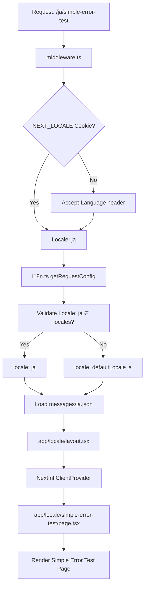
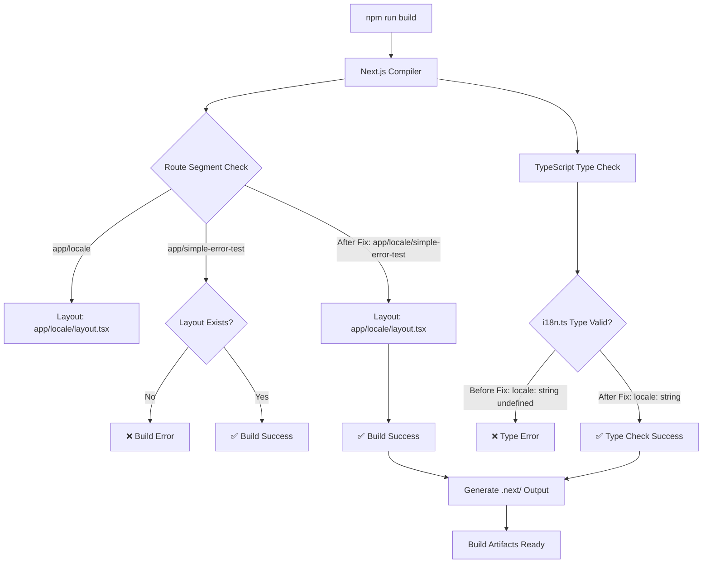
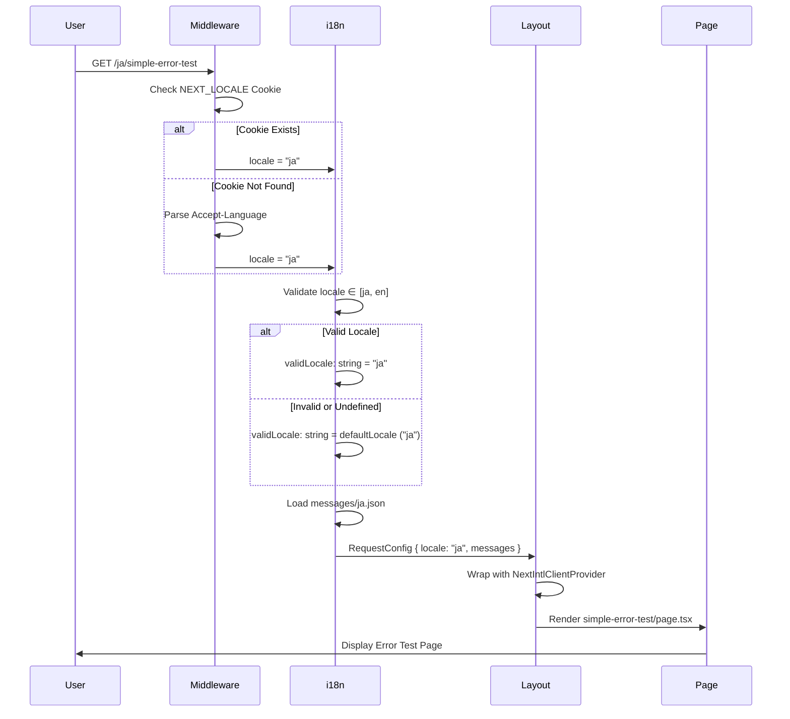
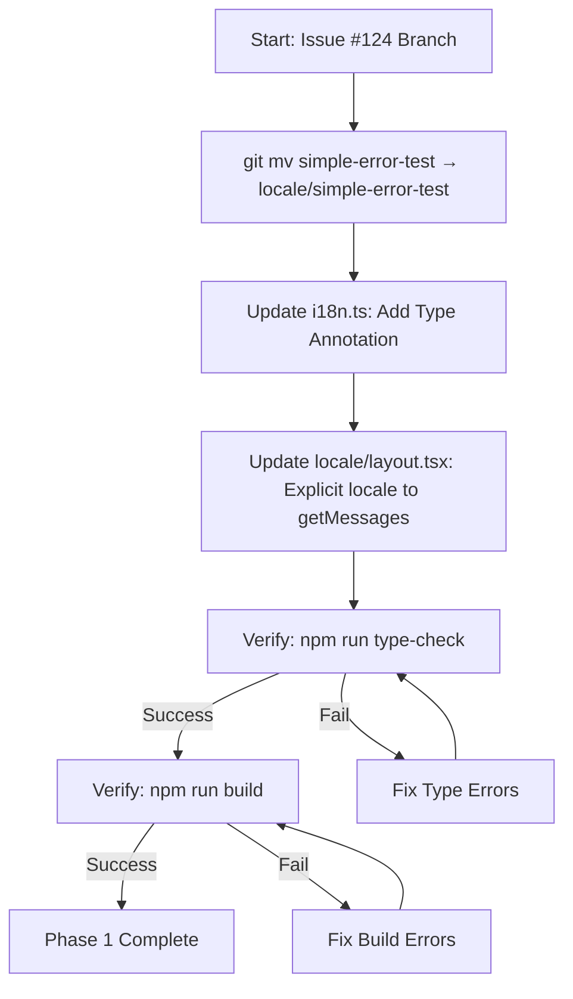
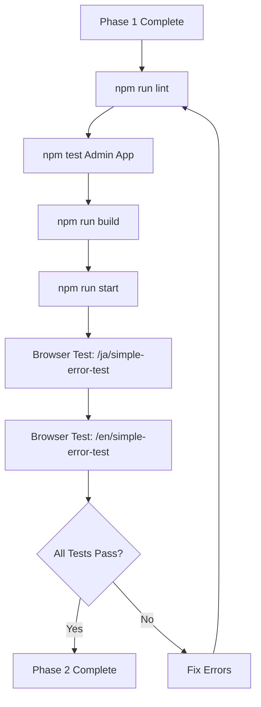
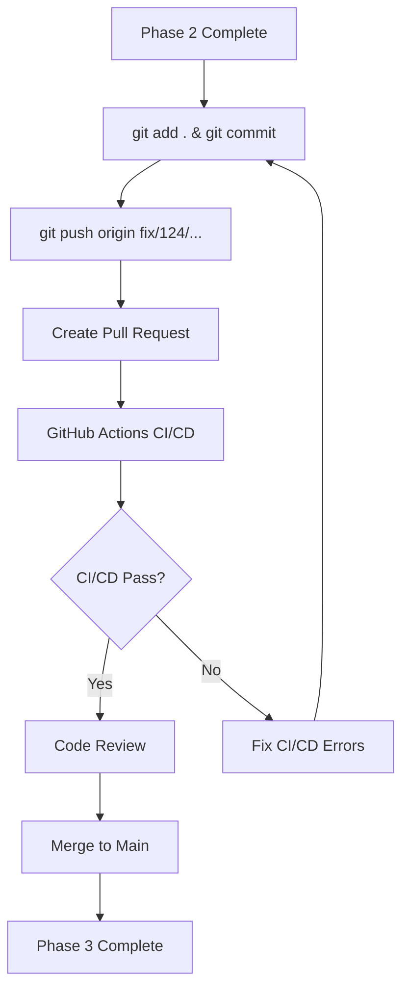

# Technical Design Document

## Overview

Admin Appの本番ビルドが失敗する2つの根本原因（Next.js App Routerレイアウト違反とTypeScript型エラー）を修正し、CI/CDパイプラインでの確実なビルド成功を保証する。この修正は既存のi18n（多言語化）構造と完全に統合され、開発環境と本番環境の挙動の一貫性を確立する。

**Purpose**: Admin Appの本番ビルド可能性を回復し、将来の同様の問題を防止する基盤を確立する。

**Users**: 開発者、DevOpsエンジニア、QAエンジニアが利用し、開発ワークフロー、CI/CDパイプライン、品質保証プロセスを正常化する。

**Impact**: 現在のmainブランチに存在する既存のビルド失敗問題を解決し、CI/CDワークフローの信頼性を回復する。修正により、Admin Appは既存のUser Appと同様のレイアウト構造を持ち、next-intlの型システムと完全に統合される。

### Goals

- Next.js App Routerのレイアウト要件に準拠し、`simple-error-test` ページを `[locale]/` 配下に移動する
- `i18n.ts` のTypeScript型エラーを解消し、`getRequestConfig` の戻り値を `RequestConfig` 型と完全に互換性を持たせる
- 本番ビルド（`npm run build`）とTypeScript型チェック（`npx tsc --noEmit`）の成功を検証する
- 既存のロケール検出ロジック（Cookie、Accept-Language header）と後方互換性を維持する
- CI/CDパイプライン（Issue #127で追加予定のビルドステップ）との整合性を確保する

### Non-Goals

- User Appの同様の問題修正（本設計の対象外、別途評価が必要）
- CI/CDワークフローへのビルドステップ追加実装（Issue #127で対応、本修正は前提条件）
- `simple-error-test` ページの機能変更やリファクタリング（構造修正のみ）
- i18n設定の全面的な見直し（型エラー修正のみ）
- E2Eテストの追加（既存テストで十分）

## Architecture

### Existing Architecture Analysis

**現在のAdmin App構造**:
Admin Appは Next.js 15.5 App Routerを使用し、next-intlによる多言語化（日本語・英語）に対応している。ルートディレクトリ構造は以下の通り：

```
frontend/admin-app/src/app/
├── [locale]/                    # 多言語化ルート（動的セグメント）
│   ├── layout.tsx               # ロケール対応レイアウト（NextIntlClientProvider統合）
│   ├── page.tsx                 # ホームページ
│   ├── error.tsx                # Error Boundaries（i18n統合）
│   └── test-error/              # テストエラーページ（正しい配置）
│       └── page.tsx
├── simple-error-test/           # ❌ 問題箇所：ルート直下配置
│   └── page.tsx                 # レイアウトなし
├── global-error.tsx             # グローバルError Boundaries
├── layout.tsx                   # ルートレイアウト
└── i18n.ts                      # ❌ 問題箇所：型エラー
```

**現在のi18n統合フロー**:
1. `middleware.ts` が NEXT_LOCALE Cookie または Accept-Language headerからロケールを検出
2. リクエストを `/[locale]/` 配下にリライト（例: `/` → `/ja/`、`/about` → `/ja/about`）
3. `i18n.ts` が `getRequestConfig` でロケール検証とメッセージ読み込み
4. `[locale]/layout.tsx` が `NextIntlClientProvider` でコンテキストを提供

**技術的制約**:
- **Next.js App Routerレイアウト要件**: 全ページは直接または継承によりルートレイアウト（`<html>` と `<body>` タグ）を持つ必要がある
- **next-intl RequestConfig型定義**: `locale` プロパティは `string` 型（必須、非undefined）である必要がある
- **既存i18n構造**: `[locale]/` 動的セグメントによるURLパターン（例: `/ja/page`、`/en/page`）

**現在の問題の根本原因**:

1. **Layout Violation**: `simple-error-test/page.tsx` がルート直下に配置されているが、`simple-error-test/layout.tsx` が存在しないため、Next.js App Routerの要件違反
2. **TypeScript Type Mismatch**: `i18n.ts` の `validLocale` が `string | undefined` 型だが、`RequestConfig` は `locale: string` を要求

### High-Level Architecture

修正後のAdmin App構造は、既存のi18n構造と完全に統合され、Next.js App Routerのベストプラクティスに準拠する：



**Architecture Integration**:
- **既存パターン保持**: `[locale]/` 動的セグメント構造、`NextIntlClientProvider` 統合、Error Boundaries i18n
- **新規コンポーネント不要**: ファイル移動のみで既存レイアウトを継承
- **技術スタック整合性**: Next.js 15.5 App Router、next-intl 3.x、TypeScript 5.x
- **ステアリング準拠**: `.kiro/steering/structure.md` のNext.js App Router構成原則、`.kiro/steering/tech.md` のnext-intl統合パターン

### Technology Alignment

この修正は既存のAdmin App技術スタックと完全に整合する：

**Frontend Stack**:
- **Next.js 15.5 App Router**: 既存のレイアウトシステムとルーティング規則を遵守
- **next-intl 3.x**: 既存のロケール検出とメッセージ管理システムを維持
- **TypeScript 5.x**: 厳格な型チェックを適用し、型安全性を保証

**新規依存関係**: なし（既存ライブラリのみ使用）

**既存パターンからの逸脱**: なし（既存のi18n構造に完全準拠）

### Key Design Decisions

#### Decision 1: simple-error-test ページの配置場所

**Decision**: `simple-error-test/page.tsx` を `[locale]/simple-error-test/page.tsx` に移動する

**Context**: Next.js App Routerは全ページがルートレイアウト（`<html>` と `<body>` タグ）を持つことを要求する。`simple-error-test/page.tsx` はルート直下に配置されているが、`simple-error-test/layout.tsx` が存在しないため、本番ビルドが失敗する。

**Alternatives**:
1. **Option A**: `simple-error-test/layout.tsx` を作成してルートレイアウトを提供
2. **Option B**: `[locale]/simple-error-test/` に移動して既存の `[locale]/layout.tsx` を継承（選択）
3. **Option C**: `simple-error-test/` を削除（テストページが不要と判断した場合）

**Selected Approach**: Option B - `[locale]/simple-error-test/page.tsx` に移動

このアプローチは、ファイルを `src/app/[locale]/simple-error-test/page.tsx` に移動することで、既存の `[locale]/layout.tsx` を継承する。URLパスは `/ja/simple-error-test` または `/en/simple-error-test` になる。

**Rationale**:
- **i18n構造との一貫性**: 既存の `test-error/page.tsx` も `[locale]/` 配下に配置されており、統一された構造を維持
- **追加実装不要**: 新しい `layout.tsx` を作成する必要がなく、既存のロケール対応レイアウトを再利用
- **next-intl統合**: `NextIntlClientProvider` のコンテキストが自動的に利用可能になり、多言語化がシームレスに動作
- **URL一貫性**: すべてのページが `/[locale]/` パターンに従い、ロケール切り替えが容易

**Trade-offs**:
- **獲得**: i18n統合、レイアウト再利用、URL一貫性、Next.js App Router準拠
- **犠牲**: URLパスが変更される（`/simple-error-test` → `/ja/simple-error-test`）が、これはテストページであり影響は最小限

#### Decision 2: i18n.ts 型エラーの修正方法

**Decision**: `validLocale` に明示的な型注釈 `string` を追加し、`locale` が `undefined` または無効な場合は `defaultLocale` を使用して型を保証する

**Context**: `getRequestConfig` の `locale` パラメータは `string | undefined` 型だが、`RequestConfig` の戻り値は `locale: string`（必須、非undefined）を要求する。現在のコードでは `validLocale` が `string | undefined` と推論されるため、TypeScriptコンパイルエラーが発生する。

**Alternatives**:
1. **Option A**: `validLocale` に明示的な型注釈 `string` を追加し、三項演算子で `defaultLocale` を使用（選択）
2. **Option B**: Non-null Assertion Operator (`!`) を使用して `locale!` と記述
3. **Option C**: Type Guard関数を作成して `locale` の型を絞り込み

**Selected Approach**: Option A - 明示的な型注釈と安全なフォールバック

```typescript
// 修正前
const validLocale = i18nConfig.locales.includes(locale as Locale)
  ? locale         // 型: string | undefined
  : i18nConfig.defaultLocale;

// 修正後
const validLocale: string =
  locale && i18nConfig.locales.includes(locale as Locale)
    ? locale       // 型: string
    : i18nConfig.defaultLocale; // 型: string
```

**Rationale**:
- **型安全性**: 明示的な型注釈により、TypeScriptコンパイラが `validLocale` が常に `string` であることを保証
- **安全なフォールバック**: `locale && ...` により、`locale` が `undefined` の場合でも `defaultLocale` が使用される
- **可読性**: 三項演算子による明確なロジックフローで、意図が理解しやすい
- **保守性**: Non-null Assertion Operator（`!`）のような危険な型強制を避け、ランタイムエラーのリスクを排除

**Trade-offs**:
- **獲得**: 型安全性、ランタイム安全性、可読性、保守性
- **犠牲**: 1行のコード追加（`const validLocale: string =`）だが、型安全性のメリットが大きい

#### Decision 3: 既存ロケール検出ロジックの維持

**Decision**: `i18n.ts` の修正は型注釈の追加のみに限定し、既存のロケール検出ロジック（Cookie、Accept-Language header）は変更しない

**Context**: Admin Appの現在のロケール検出は `middleware.ts` と `i18n.ts` の協調動作に依存している。型エラー修正のために既存ロジックを変更すると、予期しない動作変更やリグレッションのリスクがある。

**Alternatives**:
1. **Option A**: 型注釈のみ追加し、既存ロジックを維持（選択）
2. **Option B**: ロケール検出ロジックをリファクタリングして型安全性を向上
3. **Option C**: `next-intl` の最新APIに移行してロケール検出を簡素化

**Selected Approach**: Option A - 最小限の変更

**Rationale**:
- **リグレッションリスク最小化**: 既存のロケール検出ロジックは本番環境で実証済みであり、変更すると予期しない動作変更のリスクがある
- **スコープの明確化**: 本修正の目的は「ビルド失敗の修正」であり、「ロケール検出の改善」ではない
- **テストカバレッジ維持**: 既存のJestテストが引き続きパスすることを保証
- **後方互換性**: NEXT_LOCALE Cookie、Accept-Language header、デフォルトロケール（'ja'）の動作を完全に維持

**Trade-offs**:
- **獲得**: リグレッションリスクの最小化、テストカバレッジ維持、後方互換性保証
- **犠牲**: ロケール検出ロジックの潜在的な改善機会を見送る（ただし、これは将来の最適化タスクとして扱う）

## System Flows

### Production Build Flow

本番ビルドプロセスにおける修正前と修正後のフローを示す：



### Locale Detection and Routing Flow

修正後のロケール検出とルーティングフローは、既存の動作を完全に維持する：



## Requirements Traceability

| Requirement | Requirement Summary | Components | Interfaces | Flows |
|-------------|---------------------|------------|------------|-------|
| 1.1 | 本番ビルド成功 | Next.js Compiler | File System (移動) | Production Build Flow |
| 1.2 | [locale]/layout.tsx継承 | `[locale]/simple-error-test/page.tsx` | Layout Inheritance | Locale Detection and Routing Flow |
| 1.3 | URLパス `/[locale]/simple-error-test` | Next.js Router | URL Routing | Locale Detection and Routing Flow |
| 1.4 | レイアウト要件エラー解消 | Next.js Compiler | Layout Resolution | Production Build Flow |
| 1.5 | 旧ディレクトリ削除 | File System | Directory Structure | - |
| 2.1 | `locale: string` 型保証 | `i18n.ts` | `getRequestConfig` | - |
| 2.2 | `RequestConfig` 型互換性 | `i18n.ts` | `RequestConfig` | - |
| 2.3 | TypeScript型エラー解消 | TypeScript Compiler | Type Checking | Production Build Flow |
| 2.4 | `undefined` 対応 | `i18n.ts` | Default Locale Fallback | Locale Detection and Routing Flow |
| 2.5 | next-intl型定義一致 | `i18n.ts` | next-intl/server | - |
| 3.1-3.6 | ビルド・テスト検証 | Test Suite | Test Execution | - |
| 4.1-4.5 | CI/CD統合 | GitHub Actions | CI/CD Pipeline | - |
| 5.1-5.4 | ドキュメント更新 | Documentation | - | - |
| 6.1-6.5 | 後方互換性 | Existing Pages, Tests | - | Locale Detection and Routing Flow |

## Components and Interfaces

### Frontend / Next.js App Router

#### simple-error-test Page Component

**Responsibility & Boundaries**
- **Primary Responsibility**: ApiErrorを意図的にthrowしてError Boundariesのi18n統合をテストする
- **Domain Boundary**: Admin App フロントエンド / Error Testing
- **Data Ownership**: テスト用のRFC 7807準拠エラーオブジェクト
- **Transaction Boundary**: なし（read-onlyテストページ）

**Dependencies**
- **Inbound**: User（ブラウザアクセス）、E2Eテスト
- **Outbound**: `@shared/api-error` (ApiErrorクラス)、`@/types/errors` (RFC7807Problem型)
- **External**: React 19、Next.js 15.5 App Router

**Contract Definition**

**Page Component Interface**:
```typescript
// ファイルパス: frontend/admin-app/src/app/[locale]/simple-error-test/page.tsx
export const dynamic = "force-dynamic";

export default function SimpleErrorTestPage(): never {
  // ApiErrorを作成してthrow
  const problem: RFC7807Problem = {
    type: "http://localhost/errors/test",
    title: "Simple Test Error",
    status: 400,
    detail: "This is a simple test error thrown directly",
    error_code: "TEST-001",
    trace_id: "test-trace-id-12345",
    instance: "/simple-error-test",
    timestamp: new Date().toISOString(),
  };

  throw new ApiError(problem);
}
```

- **Preconditions**: `[locale]/layout.tsx` が存在し、`NextIntlClientProvider` が設定されている
- **Postconditions**: ApiErrorがthrowされ、`error.tsx` または `global-error.tsx` がエラーをキャッチしてi18n対応Fallback UIを表示
- **Invariants**: ページは常にエラーをthrowし、正常なレンダリングは行わない

**State Management**: なし（ステートレスコンポーネント）

**Integration Strategy**:
- **Modification Approach**: ファイル移動のみ（`src/app/simple-error-test/page.tsx` → `src/app/[locale]/simple-error-test/page.tsx`）
- **Backward Compatibility**: URLパスが変更される（`/simple-error-test` → `/[locale]/simple-error-test`）が、テストページであり外部参照は存在しない
- **Migration Path**: `git mv` コマンドでファイル移動、旧ディレクトリ削除

#### i18n Configuration Module

**Responsibility & Boundaries**
- **Primary Responsibility**: next-intlの `getRequestConfig` を実装し、ロケール検証とメッセージ読み込みを行う
- **Domain Boundary**: Admin App フロントエンド / i18n Configuration
- **Data Ownership**: ロケール検証ロジック、メッセージファイル読み込みロジック
- **Transaction Boundary**: リクエストごとのロケール解決

**Dependencies**
- **Inbound**: Next.js Server（SSRレンダリング時）、`[locale]/layout.tsx`
- **Outbound**: `next-intl/server` (getRequestConfig)、`@shared/i18n-config` (i18nConfig, Locale型)、`messages/*.json` (メッセージファイル)
- **External**: next-intl 3.x

**Contract Definition**

**Service Interface**:
```typescript
// ファイルパス: frontend/admin-app/src/i18n.ts
import { getRequestConfig } from "next-intl/server";
import { i18nConfig, type Locale } from "@shared/i18n-config";

export default getRequestConfig(
  async ({ locale }: { locale: string | undefined }): Promise<{
    locale: string;
    messages: Record<string, unknown>;
  }> => {
    // 修正後のロジック
    const validLocale: string =
      locale && i18nConfig.locales.includes(locale as Locale)
        ? locale
        : i18nConfig.defaultLocale;

    return {
      locale: validLocale,
      messages: (await import(`../messages/${validLocale}.json`)).default,
    };
  }
);
```

- **Preconditions**:
  - `@shared/i18n-config` が `i18nConfig.locales` と `i18nConfig.defaultLocale` を提供
  - `messages/ja.json` と `messages/en.json` が存在
- **Postconditions**:
  - 戻り値の `locale` は常に `string` 型（非undefined）
  - `messages` は有効なメッセージオブジェクト
- **Invariants**:
  - `locale` が無効または `undefined` の場合、必ず `defaultLocale` ('ja') を返す
  - メッセージファイルが見つからない場合、ビルド時エラー

**State Management**: なし（ステートレス関数）

**Integration Strategy**:
- **Modification Approach**: 既存コードを拡張（型注釈追加、`locale &&` 条件追加）
- **Backward Compatibility**: ロケール検出ロジックは完全に維持（NEXT_LOCALE Cookie、Accept-Language header、defaultLocale）
- **Migration Path**: インライン型注釈追加のみ、ロジック変更なし

### Frontend / Next.js Layouts

#### [locale] Layout Component

**Responsibility & Boundaries**
- **Primary Responsibility**: ロケール対応のHTML構造と `NextIntlClientProvider` を提供
- **Domain Boundary**: Admin App フロントエンド / Layout Infrastructure
- **Data Ownership**: フォント設定、`NextIntlClientProvider` コンテキスト
- **Transaction Boundary**: ページレンダリングごとのレイアウト提供

**Dependencies**
- **Inbound**: すべての `[locale]/` 配下のページコンポーネント（`simple-error-test/page.tsx` を含む）
- **Outbound**: `next-intl/server` (getMessages)、`next-intl` (NextIntlClientProvider)、Google Fonts (Geist, Geist_Mono)
- **External**: next-intl 3.x、Next.js 15.5、React 19

**Contract Definition**

**Layout Component Interface**:
```typescript
// ファイルパス: frontend/admin-app/src/app/[locale]/layout.tsx
export default async function LocaleLayout({
  children,
  params,
}: {
  children: React.ReactNode;
  params: Promise<{ locale: string }>;
}): Promise<JSX.Element> {
  const { locale } = await params;
  const messages = await getMessages({ locale }); // 修正: 明示的にlocaleを渡す

  return (
    <html lang={locale}>
      <body className="...">
        <NextIntlClientProvider messages={messages}>
          {children}
        </NextIntlClientProvider>
      </body>
    </html>
  );
}
```

- **Preconditions**:
  - `params.locale` が有効なロケール値（'ja' または 'en'）
  - `i18n.ts` が有効な `RequestConfig` を返す
- **Postconditions**:
  - すべての子コンポーネントが `NextIntlClientProvider` コンテキストを利用可能
  - HTML `lang` 属性が正しいロケールに設定
- **Invariants**:
  - `NextIntlClientProvider` が常に `messages` を提供
  - レイアウトが `<html>` と `<body>` タグを提供

**State Management**: なし（サーバーコンポーネント）

**Integration Strategy**:
- **Modification Approach**: 既存コードを拡張（`getMessages({ locale })` に明示的なlocale渡し）
- **Backward Compatibility**: 既存の `[locale]/` 配下のページは影響を受けない
- **Migration Path**: `getMessages()` → `getMessages({ locale })` の1行変更

## Data Models

本修正はデータモデルの変更を伴わない。既存の型定義とインターフェースのみを使用する。

### Type Definitions Used

```typescript
// @shared/i18n-config
export type Locale = "ja" | "en";
export interface I18nConfig {
  locales: readonly Locale[];
  defaultLocale: Locale;
}

// next-intl/server
export interface RequestConfig {
  locale: string;  // 必須、非undefined
  messages: IntlMessages;
}

// @/types/errors (既存)
export interface RFC7807Problem {
  type: string;
  title: string;
  status: number;
  detail: string;
  error_code: string;
  trace_id: string;
  instance: string;
  timestamp: string;
}
```

## Error Handling

### Error Strategy

本修正は既存のError Boundariesシステムを維持し、新しいエラーハンドリングロジックは導入しない。

**既存エラーハンドリングフロー**:
1. `simple-error-test/page.tsx` が `ApiError` をthrow
2. `[locale]/error.tsx` または `global-error.tsx` がエラーをキャッチ
3. `useTranslations()` でロケール対応エラーメッセージを取得
4. Fallback UIを表示（日本語/英語切り替え対応）

**修正による影響**:
- `[locale]/simple-error-test/page.tsx` は `[locale]/error.tsx` の配下に配置されるため、エラーキャッチが正常に動作
- `NextIntlClientProvider` コンテキストが利用可能になり、`useTranslations()` がエラーなく動作

### Error Categories and Responses

本修正で対処するエラーカテゴリ：

**Build-Time Errors** (修正前):
- **Next.js Layout Violation**: `simple-error-test/page.tsx` がルートレイアウトを持たない → 本番ビルド失敗
  - **Response**: ファイルを `[locale]/` 配下に移動してレイアウトを継承
- **TypeScript Type Error**: `i18n.ts` の `locale` 型が `string | undefined` → `RequestConfig` 型と不一致
  - **Response**: 明示的な型注釈 `string` を追加し、`defaultLocale` フォールバックで型を保証

**Runtime Errors** (修正後も維持):
- **Invalid Locale**: 無効なロケール値が渡された場合 → `defaultLocale` ('ja') を使用
  - **Response**: `i18n.ts` で自動的にフォールバック、エラーを発生させない
- **Message File Not Found**: メッセージファイルが見つからない場合 → ビルド時エラー（開発時に検出）
  - **Response**: `messages/ja.json` と `messages/en.json` の存在を確認

### Monitoring

既存の監視システムを維持：
- **Build Logs**: GitHub Actions CI/CDで本番ビルドログを記録
- **TypeScript Errors**: CI/CDで型チェックエラーを記録
- **Runtime Errors**: ブラウザコンソールとサーバーログでエラーを記録

## Testing Strategy

### Unit Tests

**i18n.ts ロケール検証ロジック** (既存テストを維持):
- `locale` が有効な値（'ja', 'en'）の場合、その値を返す
- `locale` が `undefined` の場合、`defaultLocale` ('ja') を返す
- `locale` が無効な値の場合、`defaultLocale` ('ja') を返す
- 戻り値の `locale` プロパティが常に `string` 型である
- メッセージオブジェクトが正しく読み込まれる

**simple-error-test/page.tsx** (既存テストを維持):
- `ApiError` が正しくthrowされる
- `RFC7807Problem` オブジェクトが正しい形式である

### Integration Tests

**[locale]/simple-error-test ページレンダリング**:
- `/ja/simple-error-test` にアクセスして `ApiError` がthrowされる
- `/en/simple-error-test` にアクセスして `ApiError` がthrowされる
- `error.tsx` または `global-error.tsx` がエラーをキャッチしてFallback UIを表示
- `useTranslations()` が正しいロケールのメッセージを返す

**ロケール検出フロー**:
- NEXT_LOCALE Cookie が存在する場合、その値が使用される
- NEXT_LOCALE Cookie が存在しない場合、Accept-Language headerが使用される
- 無効なロケールの場合、`defaultLocale` ('ja') が使用される

### E2E Tests

**本番ビルドと起動**:
- `npm run build` が成功する（`.next/` ディレクトリが生成される）
- `npm run start` でポート13002でサーバーが起動する
- `/ja/simple-error-test` にアクセスしてページが表示される
- `/en/simple-error-test` にアクセスしてページが表示される

**TypeScript型チェック**:
- `npm run type-check` が成功する（`src/i18n.ts` に型エラーがない）
- ESLint (`npm run lint`) が成功する（新規警告・エラーがない）

**後方互換性**:
- Admin Appの既存ページ（`[locale]/page.tsx`、`[locale]/test-error/page.tsx`）が正常に動作
- User Appの本番ビルドが成功する（Admin Appの修正が影響しない）
- Admin Appの全Jestテスト（209テスト）がパスする

### CI/CD Tests

**GitHub Actions統合**:
- Pull Request作成時にフロントエンドテストワークフローがトリガーされる
- `npm run build` が成功する（Issue #127で追加予定のビルドステップ）
- `npm run type-check` が成功する（Issue #127で追加予定の型チェックステップ）
- ESLint (`npm run lint`) が成功する
- Jestテスト (`npm test`) が成功する

## Migration Strategy

### Phase 1: ファイル移動とi18n.ts修正



**Actions**:
1. ブランチ作成: `git checkout -b fix/124/simple-error-test-layout-fix`
2. ファイル移動: `git mv src/app/simple-error-test src/app/[locale]/simple-error-test`
3. 旧ディレクトリ削除: `rmdir src/app/simple-error-test` (自動的に空になる)
4. `i18n.ts` 修正:
   ```typescript
   const validLocale: string =
     locale && i18nConfig.locales.includes(locale as Locale)
       ? locale
       : i18nConfig.defaultLocale;
   ```
5. `[locale]/layout.tsx` 修正:
   ```typescript
   const messages = await getMessages({ locale });
   ```
6. 検証: `npm run type-check` と `npm run build`

**Rollback Triggers**:
- TypeScript型エラーが解消しない
- 本番ビルドが失敗する
- 既存のJestテストが失敗する

**Validation Checkpoints**:
- ✅ `npx tsc --noEmit` が成功（型エラーゼロ）
- ✅ `npm run build` が成功（`.next/` ディレクトリ生成）
- ✅ `src/app/simple-error-test/` ディレクトリが存在しない

### Phase 2: ローカル検証とテスト



**Actions**:
1. ESLint: `npm run lint` (警告・エラーゼロ)
2. Jest: `npm test` (全209テストパス、カバレッジ維持)
3. 本番ビルド: `npm run build` (成功)
4. 本番サーバー: `npm run start` (ポート13002で起動)
5. ブラウザ確認:
   - `http://localhost:13002/ja/simple-error-test` → Error Boundaries表示（日本語）
   - `http://localhost:13002/en/simple-error-test` → Error Boundaries表示（英語）

**Rollback Triggers**:
- ESLintエラー
- Jestテスト失敗
- ブラウザで404エラーまたは予期しない動作

**Validation Checkpoints**:
- ✅ ESLint警告・エラーゼロ
- ✅ 全Jestテスト（209テスト）パス
- ✅ `/ja/simple-error-test` と `/en/simple-error-test` で正しいError Boundaries表示

### Phase 3: CI/CD統合とPull Request



**Actions**:
1. コミット: `git add . && git commit -m "Fix: Admin App本番ビルド失敗修正（#124）"`
2. プッシュ: `git push origin fix/124/simple-error-test-layout-fix`
3. Pull Request作成: GitHub UIでPR作成、Issue #124参照
4. CI/CD自動実行:
   - フロントエンドテストワークフロー（ESLint、Jest）
   - 本番ビルドステップ（Issue #127で追加予定）
   - TypeScript型チェックステップ（Issue #127で追加予定）
5. コードレビュー承認後、mainブランチにマージ

**Rollback Triggers**:
- CI/CDワークフロー失敗
- コードレビューで重大な問題が指摘される

**Validation Checkpoints**:
- ✅ GitHub Actions CI/CD全ワークフローパス
- ✅ コードレビュー承認
- ✅ mainブランチにマージ成功
