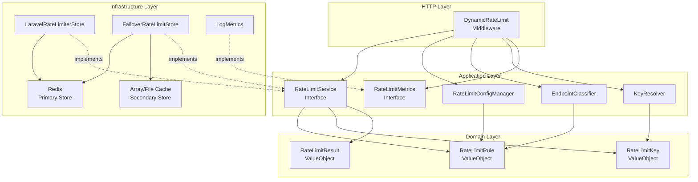
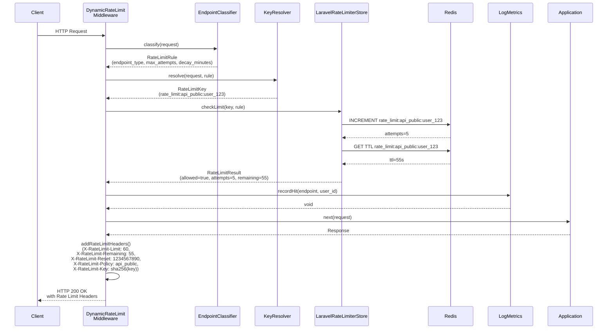
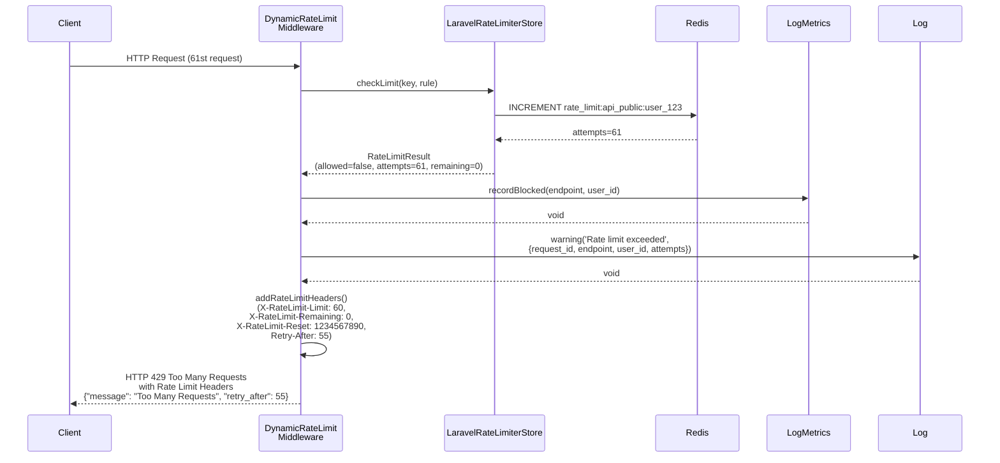
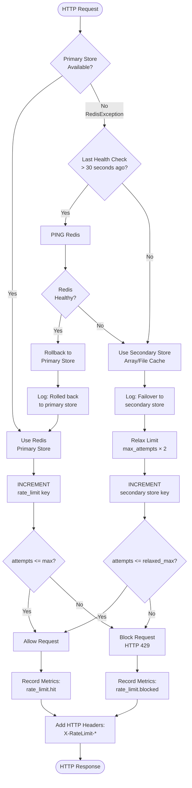
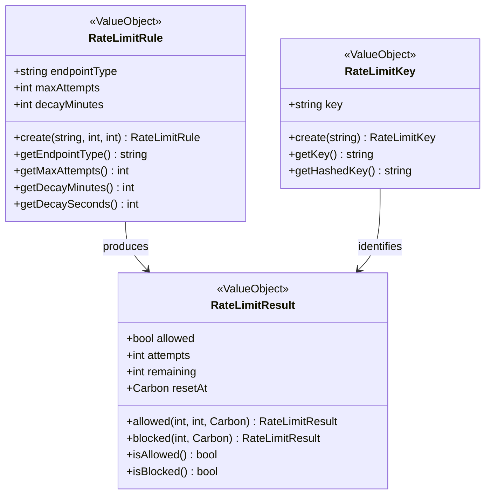
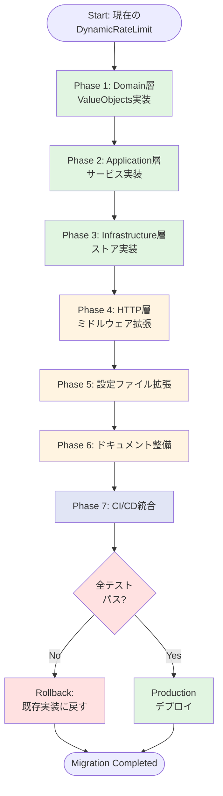

# Technical Design Document: APIレート制限設定強化

## Overview

本機能は、Laravel APIアプリケーションにおける包括的なレート制限システムを強化し、セキュリティ・安定性・運用性を向上させます。現在の基本的なDynamicRateLimitミドルウェアを拡張し、DDD/クリーンアーキテクチャ原則に準拠した4層構造で実装します。

**Purpose**: API乱用やブルートフォース攻撃からシステムを保護し、正常ユーザーへの公平なリソース配分を実現します。Redis障害時のフェイルオーバー機能により、キャッシュ障害がAPI全体のダウンタイムに繋がることを防ぎ、サービス継続性を確保します。

**Users**: API開発者、SREエンジニア、運用チーム、アーキテクトが利用します。API開発者はエンドポイント別の細分化されたレート制限を定義し、SREエンジニアはRedis障害時の自動フェイルオーバーと復旧を管理し、運用チームは構造化ログ・メトリクスによるリアルタイム監視を実施します。

**Impact**: 現在の基本的なDynamicRateLimitミドルウェア(135行)を拡張し、DDD/クリーンアーキテクチャの4層構造(Domain/Application/Infrastructure/HTTP層)で再設計します。既存の`config/ratelimit.php`設定ファイルとミドルウェアスタック統合を維持しつつ、エンドポイント分類の細分化、Redis障害時フェイルオーバー、HTTPヘッダー強化、構造化ログ・メトリクス統合を追加します。

### Goals

- **エンドポイント分類の細分化**: 認証状態(未認証/認証済み) × 機密性(公開/保護)の4種類分類により、ログインAPIへのブルートフォース攻撃を防止し、通常APIは快適に利用可能にする
- **Redis障害時フェイルオーバー**: Redisダウン時にArray/File Cacheへ自動切り替え、30秒間隔ヘルスチェックによる自動復旧、サービス継続性を確保
- **HTTPヘッダー強化**: `X-RateLimit-Policy`(エンドポイント分類)、`X-RateLimit-Key`(SHA-256ハッシュ化識別キー)追加により、APIクライアントの適切なリトライ戦略実装を支援
- **構造化ログ・メトリクス統合**: Laravel標準Logファサードによる非同期JSON形式ログ出力、異常トラフィックパターンの早期検知、Prometheus統合準備
- **DDD/クリーンアーキテクチャ準拠**: 4層構造(Domain/Application/Infrastructure/HTTP)による責務分離、テスタビリティ・保守性・拡張性向上、Architecture Tests自動検証
- **パフォーマンス目標達成**: レート制限チェック5-7ms以内、Redis応答時間1-2ms以内、全体APIレスポンスタイムへの影響5%未満
- **Success Criteria**: テストカバレッジ85%以上達成(Domain層95%、Application層90%)、Redis障害シミュレーションテスト成功、Laravel標準ThrottleRequests完全互換性確保、GitHub Actions CI/CDワークフロー通過

### Non-Goals

- **Phase 2以降の機能**: Prometheus/StatsD統合、Grafanaダッシュボード、Slack/PagerDuty通知(将来的に対応予定)
- **動的設定変更**: レート制限値のランタイム変更API、Admin App UI統合、設定変更履歴(Phase 3で対応予定)
- **Out of Scope**: WAF統合、API Gateway レベルのレート制限、Machine Learning ベースの異常検知、地理的分散キャッシュ

---

## Architecture

### Existing Architecture Analysis

**現在のアーキテクチャパターンと制約**:
- `app/Http/Middleware/DynamicRateLimit.php`(135行): 基本的なレート制限機能を提供、`config/ratelimit.php`設定ファイルからエンドポイント別設定を読み込み、Laravel Cache Facadeで`Cache::increment()`と`Cache::add()`を使用
- **既存の課題**:
  - エンドポイント分類が粗い: `api`, `public`, `webhook`, `strict`の4種類のみで、認証状態と機密性の2軸分類が不十分
  - Redis障害時の脆弱性: `try-catch`でエラーをキャッチしてスキップするのみで、セカンダリストアへのフェイルオーバーなし
  - HTTPヘッダー不足: `X-RateLimit-Limit`, `X-RateLimit-Remaining`, `X-RateLimit-Reset`のみで、エンドポイント分類とレート制限キーの情報がない
  - ログ・メトリクス不足: `Log::warning()`でRedis障害を記録するのみで、構造化ログやメトリクス記録がない

**保持する既存ドメイン境界**:
- ミドルウェアスタック統合: `config/middleware.php`の`api`グループに配置される既存パターンを維持
- Laravel標準`RateLimiter`ファサード互換性: `Cache::increment()`と`Cache::add()`の組み合わせによる原子的カウント操作を継続使用

**維持すべき統合ポイント**:
- `config/ratelimit.php`設定ファイル: 環境変数駆動設定を拡張し、既存の`endpoints`配列構造を保持
- `RouteServiceProvider`統合: `RateLimiter::for('dynamic', function() {})`メソッドのサポートを維持
- Laravel標準HTTPヘッダー: `X-RateLimit-*`ヘッダー名を既存実装と同じ形式で使用

**対処する技術的負債**:
- エンドポイント分類ロジックのハードコーディング: Application層の`EndpointClassifier`に抽出し、テスト可能な形式に変更
- レート制限キー解決ロジックの混在: Application層の`KeyResolver`に分離し、SHA-256ハッシュ化機能を追加
- Redis障害処理の不十分さ: Infrastructure層の`FailoverRateLimitStore`で包括的なフェイルオーバー戦略を実装

### High-Level Architecture



**Architecture Integration**:

**既存パターンの保持**:
- Laravel Cache Facade統合: `Cache::store($store)->increment()`と`Cache::add()`の組み合わせによる原子的カウント操作を継続使用
- ミドルウェアスタック配置: `config/middleware.php`の`api`グループに配置される既存パターンを維持
- 環境変数駆動設定: `.env`ファイルと`config/ratelimit.php`経由の設定読み込みパターンを拡張

**新規コンポーネントの必要性**:
- **Domain層ValueObjects**: レート制限ルール・キー・結果を不変オブジェクトとして定義し、バリデーションロジックをカプセル化(Laravelフレームワーク非依存)
- **Application層サービス**: エンドポイント分類、キー解決、設定管理、メトリクス記録の各ロジックを分離し、テスタビリティを向上
- **Infrastructure層ストア実装**: Redisプライマリストアとセカンダリストアへのフェイルオーバーを実装し、Application層インターフェースを実装
- **HTTP層ミドルウェア拡張**: 既存DynamicRateLimitミドルウェアを拡張し、Application層サービスを呼び出す薄いレイヤーとして機能

**Technology Alignment**:
- **Laravel 12標準機能**: `Cache::store()`、`Log::channel()`、`Config::get()`、`Request::user()`、`Request::ip()`を使用
- **PHP 8.4機能**: Readonly Properties、Constructor Property Promotion、Match Expressions、Typed Properties
- **DDD/クリーンアーキテクチャ原則**: 依存性逆転原則(DIP)、単一責任原則(SRP)、インターフェース分離原則(ISP)、依存方向ルール(HTTP → Application → Domain ← Infrastructure)

**Steering Compliance**:
- **Product Steering準拠**: DDD/クリーンアーキテクチャ実装、Repository Pattern採用、SOLID原則準拠、Architecture Testing統合
- **Tech Steering準拠**: Laravel 12標準機能使用、PHP 8.4機能活用、Pest 4テストフレームワーク、PHPStan Level 8静的解析
- **Structure Steering準拠**: `ddd/Domain/RateLimit/`、`ddd/Application/RateLimit/`、`ddd/Infrastructure/RateLimit/`、`app/Http/Middleware/`配置

---

## Technology Alignment

本機能は既存のLaravel 12 + PHP 8.4技術スタックに完全に準拠し、新規外部依存関係を追加しません。

### 既存技術スタックとの整合性

**バックエンド技術**:
- **Laravel 12**: Cache Facade(`Cache::store()`、`Cache::increment()`、`Cache::add()`)、Log Facade(`Log::channel()`、構造化ログ)、Config Facade(`Config::get()`)
- **PHP 8.4**: Readonly Properties(ValueObjects)、Constructor Property Promotion、Match Expressions(キー解決)、Typed Properties、Strict Types
- **Redis**: プライマリレート制限ストア、原子的操作(`INCR`、`SETNX`、`EXPIRE`)、13379ポート
- **Array/File Cache**: セカンダリフェイルオーバーストア、開発環境(Array)、本番環境(File)

**新規導入依存関係**:
- なし(既存のLaravel 12標準機能のみ使用)

**既存パターンからの逸脱**:
- なし(DDD/クリーンアーキテクチャ原則に従い、既存のミドルウェアスタック統合とLaravel標準機能を活用)

### Key Design Decisions

#### Decision 1: Redis障害時のフェイルオーバー戦略 - FailoverRateLimitStore実装

**Decision**: RedisException発生時にArray/File Cacheストアへ自動フェイルオーバーし、30秒間隔ヘルスチェックで自動復旧する`FailoverRateLimitStore`を実装する。

**Context**: 現在のDynamicRateLimitミドルウェアはRedis障害時に`try-catch`でエラーをキャッチしてレート制限をスキップするのみで、セカンダリストアへのフェイルオーバー機能がありません。これにより、Redis障害時にレート制限が無効化され、API乱用やDDoS攻撃への脆弱性が発生します。

**Alternatives**:
1. **Laravel標準Failover Cache Driver使用**: Laravel 11.x以降で提供される`failover`ドライバーを使用し、`config/cache.php`で`['redis', 'array']`のように設定する
2. **カスタムFailoverRateLimitStore実装**: Application層インターフェース`RateLimitService`を実装し、Infrastructure層で独自のフェイルオーバーロジックを提供
3. **Redis Sentinel/Cluster使用**: Redis自体の高可用性機能(Sentinel/Cluster)を使用し、アプリケーション側のフェイルオーバー処理を不要にする

**Selected Approach**: カスタムFailoverRateLimitStore実装(Alternative 2)

**実装詳細**:
```php
// Infrastructure層
class FailoverRateLimitStore implements RateLimitService
{
    private CacheRepository $primaryStore;   // Redis
    private CacheRepository $secondaryStore; // Array/File Cache
    private bool $isFailedOver = false;
    private Carbon $lastHealthCheck;

    public function checkLimit(RateLimitKey $key, RateLimitRule $rule): RateLimitResult
    {
        // ヘルスチェック実行(30秒間隔)
        if ($this->isFailedOver && $this->shouldRunHealthCheck()) {
            $this->attemptRollback();
        }

        try {
            $store = $this->isFailedOver ? $this->secondaryStore : $this->primaryStore;
            // レート制限チェック実行
            return $this->executeCheck($store, $key, $rule);
        } catch (RedisException $e) {
            // フェイルオーバー実行
            $this->failover($e);
            return $this->executeCheck($this->secondaryStore, $key, $rule);
        }
    }

    private function attemptRollback(): void
    {
        try {
            // Redis疎通確認(PING)
            $this->primaryStore->get('health_check');
            $this->isFailedOver = false;
            Log::channel('rate_limit')->info('Rolled back to primary Redis store');
        } catch (RedisException $e) {
            // まだ復旧していない
            $this->lastHealthCheck = now();
        }
    }
}
```

**Rationale**:
- **柔軟性**: セカンダリストア使用時のレート制限値緩和(2倍)、メトリクス記録、構造化ログ出力などの独自ロジックを実装可能
- **テスタビリティ**: Application層インターフェース経由でモックやスタブを使用したUnit Tests実施が容易
- **DDD準拠**: Infrastructure層に外部システム(Redis)依存を集約し、Application層は抽象化されたインターフェースのみに依存
- **パフォーマンス**: Laravel標準Failover Cache Driverは全キャッシュ操作にフェイルオーバーを適用するが、本実装はレート制限専用の最適化が可能

**Trade-offs**:
- **獲得**: ビジネスロジック最適化(セカンダリストア時の制限値緩和)、包括的なメトリクス記録、Architecture Tests検証、DDD原則準拠
- **犠牲**: Laravel標準機能の再利用可能性、実装コード量増加(約150行)、Redis Sentinel/Clusterによるインフラレベル高可用性の非採用

#### Decision 2: エンドポイント分類戦略 - 認証状態×機密性の4種類分類

**Decision**: エンドポイントを認証状態(未認証/認証済み)×機密性(公開/保護)の2軸で4種類に分類し、`EndpointClassifier`サービスで自動判定する。

**Context**: 現在の`config/ratelimit.php`は`api`, `public`, `webhook`, `strict`の4種類のエンドポイントタイプを提供していますが、認証状態と機密性が混在しており、ログインAPIへのブルートフォース攻撃と通常API利用を適切に区別できません。

**Alternatives**:
1. **ルート定義時の明示的指定**: `->middleware('throttle:public_unauthenticated')`のように、ルート定義時に開発者が明示的に指定
2. **エンドポイントパスベース自動分類**: URLパス(例: `/api/login`, `/api/admin/*`)に基づいて自動的に分類を判定
3. **認証状態×機密性の2軸分類**: リクエスト時に`$request->user()`と`$request->route()->getName()`を組み合わせて動的に判定

**Selected Approach**: 認証状態×機密性の2軸分類(Alternative 3)

**実装詳細**:
```php
// Application層
class EndpointClassifier
{
    public function classify(Request $request): RateLimitRule
    {
        $isAuthenticated = $request->user() !== null;
        $isProtected = $this->isProtectedEndpoint($request);

        return match (true) {
            !$isAuthenticated && !$isProtected => $this->getRule('public_unauthenticated'),  // 60 req/min, IP
            !$isAuthenticated && $isProtected  => $this->getRule('protected_unauthenticated'), // 5 req/10min, IP+Email
            $isAuthenticated && !$isProtected  => $this->getRule('public_authenticated'),     // 120 req/min, User ID
            $isAuthenticated && $isProtected   => $this->getRule('protected_authenticated'),  // 30 req/min, User ID
            default => $this->getRule('default'), // 最も厳格な制限(30 req/min)
        };
    }

    private function isProtectedEndpoint(Request $request): bool
    {
        $protectedRoutes = config('ratelimit.protected_routes', [
            'login', 'register', 'password.*', 'admin.*', 'payment.*'
        ]);

        $routeName = $request->route()?->getName();
        foreach ($protectedRoutes as $pattern) {
            if (Str::is($pattern, $routeName)) {
                return true;
            }
        }

        return false;
    }
}
```

**Rationale**:
- **動的判定**: リクエスト時の認証状態とルート名に基づいて自動的に分類を判定し、開発者の明示的指定ミスを防止
- **柔軟性**: `config/ratelimit.php`の`protected_routes`配列でパターンマッチングルールを設定可能
- **保守性**: エンドポイント分類ロジックをApplication層`EndpointClassifier`に集約し、テスタビリティを向上
- **DDD準拠**: 分類ルールをDomain層`RateLimitRule` ValueObjectとして定義し、Application層で組み立て

**Trade-offs**:
- **獲得**: ブルートフォース攻撃への耐性向上(5 req/10min)、通常API利用の快適性維持(120 req/min)、開発者の明示的指定不要
- **犠牲**: ルート定義時の明示性低下、設定ファイル(`protected_routes`)のメンテナンス必要性、わずかな判定オーバーヘッド(1-2ms)

#### Decision 3: レート制限キー解決戦略 - User ID → Token ID → IP+Email → IP のフォールバックチェーン

**Decision**: レート制限キーを`User ID → Token ID → IP+Email → IP`の優先順位でフォールバックする`KeyResolver`サービスを実装し、SHA-256ハッシュ化した識別キーをHTTPヘッダーで返却する。

**Context**: 現在のDynamicRateLimitミドルウェアは`resolveIdentifier()`メソッドで`user`、`token`、`ip`の3種類の識別子タイプを提供していますが、保護エンドポイント(ログイン等)へのブルートフォース攻撃を防ぐために`IP+Email`の組み合わせが必要です。

**Alternatives**:
1. **ミドルウェアパラメータで指定**: `->middleware('throttle:api,user_id')`のように、ルート定義時に識別子タイプを明示的に指定
2. **固定優先順位フォールバック**: `User ID → Token ID → IP`の順で自動的にフォールバックし、保護エンドポイントは別途`IP+Email`を使用
3. **エンドポイント分類ベース動的選択**: `EndpointClassifier`の分類結果に基づいて最適な識別子タイプを自動選択

**Selected Approach**: エンドポイント分類ベース動的選択(Alternative 3)

**実装詳細**:
```php
// Application層
class KeyResolver
{
    public function resolve(Request $request, RateLimitRule $rule): RateLimitKey
    {
        $identifier = match ($rule->getEndpointType()) {
            'public_unauthenticated' => $this->getIpAddress($request),
            'protected_unauthenticated' => $this->getIpAndEmail($request),
            'public_authenticated', 'protected_authenticated' => $this->getUserIdentifier($request),
            default => $this->getIpAddress($request),
        };

        $keyString = "rate_limit:{$rule->getEndpointType()}:{$identifier}";
        return RateLimitKey::create($keyString);
    }

    private function getUserIdentifier(Request $request): string
    {
        // User ID → Token ID → IP のフォールバック
        if ($user = $request->user()) {
            return "user_{$user->id}";
        }

        if ($tokenId = $request->user()?->currentAccessToken()?->id) {
            return "token_{$tokenId}";
        }

        return "ip_{$request->ip()}";
    }

    private function getIpAndEmail(Request $request): string
    {
        $ip = $request->ip();
        $email = $request->input('email', 'unknown');
        return "ip_{$ip}_email_" . hash('sha256', $email);
    }
}
```

**Rationale**:
- **ブルートフォース攻撃防御**: 保護エンドポイント(ログイン)で`IP+Email`の組み合わせを使用し、同一IPアドレスからの複数アカウントへの攻撃を防止
- **複数デバイス公平性**: 認証済みユーザーは`User ID`ベースで制限し、複数デバイスからのアクセスでも公平に制限を適用
- **プライバシー保護**: HTTPヘッダーで返却する際はSHA-256ハッシュ化し、実際のUser IDやEmailアドレスを隠蔽
- **DDD準拠**: レート制限キーをDomain層`RateLimitKey` ValueObjectとして定義し、Application層で組み立て

**Trade-offs**:
- **獲得**: ブルートフォース攻撃への耐性向上、複数デバイスからの公平なアクセス、プライバシー保護、柔軟なキー解決戦略
- **犠牲**: わずかな判定オーバーヘッド(SHA-256ハッシュ化: 1ms)、キー解決ロジックの複雑性増加

---

## System Flows

### Sequence Diagram: レート制限チェックフロー(Redis正常時)



### Sequence Diagram: レート制限超過フロー(429レスポンス)



### Process Flow Chart: Redis障害時フェイルオーバーフロー



---

## Requirements Traceability

| Requirement | Requirement Summary | Components | Interfaces | Flows |
|-------------|---------------------|------------|------------|-------|
| **Req 1** | エンドポイント分類システム | `EndpointClassifier`, `RateLimitRule` | `classify(Request): RateLimitRule` | Sequence Diagram: レート制限チェックフロー |
| **Req 2** | レート制限キー解決戦略 | `KeyResolver`, `RateLimitKey` | `resolve(Request, RateLimitRule): RateLimitKey` | Sequence Diagram: レート制限チェックフロー |
| **Req 3** | HTTPレスポンスヘッダー強化 | `DynamicRateLimit` Middleware | `addRateLimitHeaders(Response, RateLimitResult): Response` | Sequence Diagram: レート制限チェックフロー、レート制限超過フロー |
| **Req 4** | Redis障害時フェイルオーバー戦略 | `FailoverRateLimitStore`, `LaravelRateLimiterStore` | `RateLimitService::checkLimit()` | Process Flow Chart: Redis障害時フェイルオーバーフロー |
| **Req 5** | 構造化ログ・メトリクス統合 | `LogMetrics`, Laravel Log Facade | `RateLimitMetrics::recordHit()`, `recordBlocked()` | Sequence Diagram: レート制限チェックフロー、レート制限超過フロー |
| **Req 6** | Laravel標準ThrottleRequests互換性 | `RouteServiceProvider`, `LaravelRateLimiterStore` | `RateLimiter::for('dynamic', Closure)` | - |
| **Req 7** | DDD/クリーンアーキテクチャ準拠 | 全4層コンポーネント | Domain/Application/Infrastructure層分離 | Architecture Diagram |
| **Req 8** | 環境変数駆動設定 | `RateLimitConfigManager`, `config/ratelimit.php` | `Config::get('ratelimit.*')` | - |
| **Req 9** | パフォーマンス要件 | `LaravelRateLimiterStore`, Redis Pipeline | `Cache::increment()`, Redis INCR | - |
| **Req 10** | テスト戦略 | Unit/Feature/Architecture/E2E Tests | Pest 4テストスイート | - |
| **Req 11** | ドキュメント整備 | `docs/RATELIMIT_*.md`, `.env.example` | - | - |
| **Req 12** | CI/CD統合 | GitHub Actions workflows | `.github/workflows/php-quality.yml`, `test.yml` | - |

---

## Components and Interfaces

### Domain Layer

#### RateLimitRule ValueObject

**Responsibility & Boundaries**:
- **Primary Responsibility**: レート制限ルールを不変オブジェクトとして定義し、エンドポイント分類、最大試行回数、制限時間(分単位)をカプセル化する
- **Domain Boundary**: Rate Limit Aggregate Root配下のValueObject
- **Data Ownership**: エンドポイントタイプ(string)、最大試行回数(int: 1-10000)、制限時間(int: 1-60分)
- **Transaction Boundary**: 単一ValueObject作成のみ(不変オブジェクトのため更新なし)

**Dependencies**:
- **Inbound**: `EndpointClassifier`(Application層)、`RateLimitConfigManager`(Application層)から使用
- **Outbound**: なし(Laravelフレームワーク非依存、Carbonのみ許容)
- **External**: なし

**Contract Definition**:

**Value Object Interface**:
```php
final readonly class RateLimitRule
{
    public function __construct(
        public string $endpointType,    // 'public_unauthenticated', 'protected_unauthenticated', etc.
        public int $maxAttempts,        // 1-10000
        public int $decayMinutes,       // 1-60
    ) {
        $this->validate();
    }

    public static function create(string $endpointType, int $maxAttempts, int $decayMinutes): self;

    public function getEndpointType(): string;
    public function getMaxAttempts(): int;
    public function getDecayMinutes(): int;
    public function getDecaySeconds(): int; // decayMinutes * 60

    private function validate(): void; // 1 <= maxAttempts <= 10000, 1 <= decayMinutes <= 60
}
```

- **Preconditions**: `maxAttempts`は1-10000の範囲、`decayMinutes`は1-60の範囲、`endpointType`は非空文字列
- **Postconditions**: 不変オブジェクトが生成される、バリデーションエラー時は`InvalidArgumentException`をスロー
- **Invariants**: 生成後はプロパティ変更不可(readonly)、全プロパティは非nullで有効な値を保持

**State Management**: 不変オブジェクトのため状態変更なし

---

#### RateLimitKey ValueObject

**Responsibility & Boundaries**:
- **Primary Responsibility**: レート制限識別キーを不変オブジェクトとして定義し、キー文字列とSHA-256ハッシュ値を提供する
- **Domain Boundary**: Rate Limit Aggregate Root配下のValueObject
- **Data Ownership**: キー文字列(string: `rate_limit:{endpoint_type}:{identifier}`)、SHA-256ハッシュ値(string: 64文字)
- **Transaction Boundary**: 単一ValueObject作成のみ(不変オブジェクトのため更新なし)

**Dependencies**:
- **Inbound**: `KeyResolver`(Application層)、`LaravelRateLimiterStore`(Infrastructure層)から使用
- **Outbound**: なし(PHPネイティブ`hash()`関数のみ)
- **External**: なし

**Contract Definition**:

**Value Object Interface**:
```php
final readonly class RateLimitKey
{
    public function __construct(
        public string $key, // rate_limit:{endpoint_type}:{identifier}
    ) {
        $this->validate();
    }

    public static function create(string $key): self;

    public function getKey(): string;
    public function getHashedKey(): string; // SHA-256 hash

    private function validate(): void; // key must start with 'rate_limit:', max length 255
}
```

- **Preconditions**: `key`は`rate_limit:`で始まる、最大長255文字
- **Postconditions**: 不変オブジェクトが生成される、`getHashedKey()`は常に64文字のSHA-256ハッシュを返す
- **Invariants**: 生成後はプロパティ変更不可(readonly)、ハッシュ値は常に同じ入力で同じ出力を生成

**State Management**: 不変オブジェクトのため状態変更なし

---

#### RateLimitResult ValueObject

**Responsibility & Boundaries**:
- **Primary Responsibility**: レート制限チェック結果を不変オブジェクトとして定義し、許可/拒否、試行回数、残り回数、リセット時刻を提供する
- **Domain Boundary**: Rate Limit Aggregate Root配下のValueObject
- **Data Ownership**: 許可フラグ(bool)、試行回数(int)、残り回数(int)、リセット時刻(Carbon)
- **Transaction Boundary**: 単一ValueObject作成のみ(不変オブジェクトのため更新なし)

**Dependencies**:
- **Inbound**: `RateLimitService`実装(Infrastructure層)、`DynamicRateLimit` Middleware(HTTP層)から使用
- **Outbound**: なし(Carbon DateTimeライブラリのみ)
- **External**: なし

**Contract Definition**:

**Value Object Interface**:
```php
final readonly class RateLimitResult
{
    public function __construct(
        public bool $allowed,
        public int $attempts,
        public int $remaining,
        public Carbon $resetAt,
    ) {}

    public static function allowed(int $attempts, int $remaining, Carbon $resetAt): self;
    public static function blocked(int $attempts, Carbon $resetAt): self; // remaining=0

    public function isAllowed(): bool;
    public function isBlocked(): bool;
    public function getAttempts(): int;
    public function getRemaining(): int;
    public function getResetAt(): Carbon;
    public function getResetTimestamp(): int; // Unix timestamp
}
```

- **Preconditions**: `attempts >= 0`、`remaining >= 0`、`resetAt`は未来の時刻
- **Postconditions**: 不変オブジェクトが生成される、`isAllowed()`と`isBlocked()`は常に逆の値を返す
- **Invariants**: 生成後はプロパティ変更不可(readonly)、`remaining`は常に`0 <= remaining <= maxAttempts`の範囲

**State Management**: 不変オブジェクトのため状態変更なし

---

### Application Layer

#### RateLimitConfigManager

**Responsibility & Boundaries**:
- **Primary Responsibility**: `config/ratelimit.php`設定ファイルからエンドポイント別レート制限ルールを読み込み、`RateLimitRule` ValueObjectとして提供する
- **Domain Boundary**: Rate Limit Aggregate管理
- **Data Ownership**: 設定ファイル(`config/ratelimit.php`)からの読み込み結果をキャッシュ
- **Transaction Boundary**: 設定読み込みのみ(書き込みなし)

**Dependencies**:
- **Inbound**: `EndpointClassifier`(Application層)、`DynamicRateLimit` Middleware(HTTP層)から使用
- **Outbound**: `RateLimitRule`(Domain層)を生成
- **External**: Laravel `Config` Facade

**Contract Definition**:

**Service Interface**:
```php
class RateLimitConfigManager
{
    public function getRule(string $endpointType): RateLimitRule;
    public function getAllRules(): array; // ['public_unauthenticated' => RateLimitRule, ...]
    public function getDefaultRule(): RateLimitRule; // 最も厳格な制限(30 req/min)
}
```

- **Preconditions**: `config/ratelimit.php`が存在し、有効な設定値を含む
- **Postconditions**: 有効な`RateLimitRule` ValueObjectを返す、設定が存在しない場合はデフォルトルールを返す
- **Invariants**: 同じ`endpointType`に対して常に同じルールを返す

**State Management**: 設定値をプロパティにキャッシュ(不変)

---

#### EndpointClassifier

**Responsibility & Boundaries**:
- **Primary Responsibility**: HTTPリクエストを認証状態×機密性の2軸で分類し、適切な`RateLimitRule`を返す
- **Domain Boundary**: Rate Limit Aggregate管理
- **Data Ownership**: エンドポイント分類ロジック(`isProtectedEndpoint()`)
- **Transaction Boundary**: 単一リクエストの分類のみ(状態保持なし)

**Dependencies**:
- **Inbound**: `DynamicRateLimit` Middleware(HTTP層)から使用
- **Outbound**: `RateLimitRule`(Domain層)、`RateLimitConfigManager`(Application層)を使用
- **External**: Laravel `Request`オブジェクト、`Config` Facade

**Contract Definition**:

**Service Interface**:
```php
class EndpointClassifier
{
    public function __construct(
        private RateLimitConfigManager $configManager,
    ) {}

    public function classify(Request $request): RateLimitRule;

    private function isProtectedEndpoint(Request $request): bool;
    private function getProtectedRoutePatterns(): array; // config('ratelimit.protected_routes')
}
```

- **Preconditions**: `Request`オブジェクトが有効、ルート名が取得可能
- **Postconditions**: 有効な`RateLimitRule` ValueObjectを返す、分類不明時はデフォルトルール(30 req/min)を返す
- **Invariants**: 同じリクエストに対して常に同じ分類結果を返す

**State Management**: ステートレス(リクエストごとに分類)

---

#### KeyResolver

**Responsibility & Boundaries**:
- **Primary Responsibility**: HTTPリクエストとレート制限ルールからレート制限識別キーを解決し、`RateLimitKey` ValueObjectを返す
- **Domain Boundary**: Rate Limit Aggregate管理
- **Data Ownership**: キー解決ロジック(User ID → Token ID → IP+Email → IP のフォールバック)
- **Transaction Boundary**: 単一リクエストのキー解決のみ(状態保持なし)

**Dependencies**:
- **Inbound**: `DynamicRateLimit` Middleware(HTTP層)から使用
- **Outbound**: `RateLimitKey`(Domain層)を生成
- **External**: Laravel `Request`オブジェクト

**Contract Definition**:

**Service Interface**:
```php
class KeyResolver
{
    public function resolve(Request $request, RateLimitRule $rule): RateLimitKey;

    private function getUserIdentifier(Request $request): string; // User ID → Token ID → IP
    private function getIpAddress(Request $request): string;
    private function getIpAndEmail(Request $request): string; // IP + SHA-256(Email)
}
```

- **Preconditions**: `Request`オブジェクトが有効、`RateLimitRule`が有効
- **Postconditions**: 有効な`RateLimitKey` ValueObjectを返す、識別子取得失敗時は`unknown`を使用
- **Invariants**: 同じリクエストとルールに対して常に同じキーを返す

**State Management**: ステートレス(リクエストごとにキー解決)

---

#### RateLimitService Interface

**Responsibility & Boundaries**:
- **Primary Responsibility**: レート制限チェックを実行し、`RateLimitResult` ValueObjectを返す抽象インターフェース
- **Domain Boundary**: Rate Limit Aggregate操作
- **Data Ownership**: なし(Infrastructure層実装に委譲)
- **Transaction Boundary**: 単一レート制限チェック(原子的操作)

**Dependencies**:
- **Inbound**: `DynamicRateLimit` Middleware(HTTP層)から使用
- **Outbound**: `RateLimitKey`(Domain層)、`RateLimitRule`(Domain層)、`RateLimitResult`(Domain層)を使用
- **External**: なし(抽象インターフェース)

**Contract Definition**:

**Service Interface**:
```php
interface RateLimitService
{
    public function checkLimit(RateLimitKey $key, RateLimitRule $rule): RateLimitResult;
}
```

- **Preconditions**: `RateLimitKey`と`RateLimitRule`が有効なValueObjects
- **Postconditions**: 有効な`RateLimitResult` ValueObjectを返す、ストア障害時は例外をスロー
- **Invariants**: 同じキーとルールに対して原子的にカウントを増分し、正確な残り回数を返す

**State Management**: ステートレス(Infrastructure層実装が外部ストアを管理)

---

#### RateLimitMetrics Interface

**Responsibility & Boundaries**:
- **Primary Responsibility**: レート制限メトリクスを記録する抽象インターフェース(ヒット数、ブロック数、レイテンシ)
- **Domain Boundary**: Rate Limit Aggregate監視
- **Data Ownership**: なし(Infrastructure層実装に委譲)
- **Transaction Boundary**: 単一メトリクス記録(非同期推奨)

**Dependencies**:
- **Inbound**: `DynamicRateLimit` Middleware(HTTP層)から使用
- **Outbound**: なし(抽象インターフェース)
- **External**: なし(抽象インターフェース)

**Contract Definition**:

**Event Contract**:
```php
interface RateLimitMetrics
{
    public function recordHit(string $endpointType, string $userId): void;
    public function recordBlocked(string $endpointType, string $userId): void;
    public function recordFailure(string $storeType, \Throwable $exception): void;
    public function recordLatency(string $storeType, float $latencyMs): void;
}
```

- **Preconditions**: `endpointType`と`userId`が非空文字列、`latencyMs > 0`
- **Postconditions**: メトリクスが記録される(非同期推奨)、記録失敗時も例外をスローしない
- **Invariants**: メトリクス記録がレート制限チェックのパフォーマンスに影響しない(非同期・非ブロッキング)

**State Management**: ステートレス(Infrastructure層実装がログ出力・メトリクス送信を管理)

---

### Infrastructure Layer

#### LaravelRateLimiterStore

**Responsibility & Boundaries**:
- **Primary Responsibility**: Laravel Cache Facadeを使用してRedisベースのレート制限ストアを実装し、`RateLimitService`インターフェースを提供する
- **Domain Boundary**: Rate Limit Aggregate永続化
- **Data Ownership**: Redisキー(`rate_limit:{endpoint}:{identifier}`)の原子的カウント操作
- **Transaction Boundary**: 単一レート制限チェック(`Cache::increment()` + `Cache::add()`)

**Dependencies**:
- **Inbound**: `DynamicRateLimit` Middleware(HTTP層)、`FailoverRateLimitStore`(Infrastructure層)から使用
- **Outbound**: `RateLimitResult`(Domain層)を生成
- **External**: Laravel `Cache` Facade、Redis(`INCR`、`SETNX`、`EXPIRE`コマンド)

**Contract Definition**:

**Service Interface**:
```php
class LaravelRateLimiterStore implements RateLimitService
{
    public function __construct(
        private CacheRepository $cache, // Cache::store('redis')
    ) {}

    public function checkLimit(RateLimitKey $key, RateLimitRule $rule): RateLimitResult;

    private function incrementAttempts(RateLimitKey $key, int $ttl): int; // Cache::increment()
    private function getTtl(RateLimitKey $key): int; // Cache::getStore()->getTtl()
    private function calculateResetAt(int $ttl): Carbon;
}
```

- **Preconditions**: Redis接続が有効、`Cache::store('redis')`が利用可能
- **Postconditions**: 有効な`RateLimitResult` ValueObjectを返す、Redis障害時は`RedisException`をスロー
- **Invariants**: 原子的操作により競合状態を防止、TTLが0の場合は新規キーを作成(`Cache::add()`)

**Integration Strategy**: 既存DynamicRateLimitミドルウェアの`Cache::increment()`と`Cache::add()`のパターンを再利用、Application層インターフェースを実装

---

#### FailoverRateLimitStore

**Responsibility & Boundaries**:
- **Primary Responsibility**: Redis障害時にArray/File Cacheへ自動フェイルオーバーし、30秒間隔ヘルスチェックで自動復旧する`RateLimitService`実装を提供する
- **Domain Boundary**: Rate Limit Aggregate永続化(フェイルオーバー戦略)
- **Data Ownership**: プライマリストア(Redis)とセカンダリストア(Array/File Cache)の切り替え状態管理
- **Transaction Boundary**: 単一レート制限チェック(フェイルオーバー判定 + ストア操作)

**Dependencies**:
- **Inbound**: `DynamicRateLimit` Middleware(HTTP層)から使用
- **Outbound**: `LaravelRateLimiterStore`(Infrastructure層)、`RateLimitResult`(Domain層)を生成
- **External**: Laravel `Cache` Facade、Laravel `Log` Facade

**Contract Definition**:

**Service Interface**:
```php
class FailoverRateLimitStore implements RateLimitService
{
    private const HEALTH_CHECK_INTERVAL_SECONDS = 30;

    public function __construct(
        private LaravelRateLimiterStore $primaryStore,   // Redis
        private LaravelRateLimiterStore $secondaryStore, // Array/File Cache
        private RateLimitMetrics $metrics,
        private bool $isFailedOver = false,
        private ?Carbon $lastHealthCheck = null,
    ) {}

    public function checkLimit(RateLimitKey $key, RateLimitRule $rule): RateLimitResult;

    private function attemptRollback(): void; // Redis疎通確認(PING)
    private function failover(\Throwable $exception): void; // セカンダリストアへ切り替え
    private function shouldRunHealthCheck(): bool; // 30秒間隔判定
    private function relaxRule(RateLimitRule $rule): RateLimitRule; // maxAttempts × 2
}
```

- **Preconditions**: プライマリストア(Redis)とセカンダリストア(Array/File Cache)が設定済み
- **Postconditions**: 有効な`RateLimitResult` ValueObjectを返す、フェイルオーバー時はセカンダリストアで制限値を2倍に緩和
- **Invariants**: 30秒間隔でRedisヘルスチェックを実行、Redis復旧時は自動的にプライマリストアへロールバック

**Integration Strategy**: Laravel標準Failover Cache Driverは使用せず、独自実装によりセカンダリストア使用時の制限値緩和とメトリクス記録を実現

---

#### LogMetrics

**Responsibility & Boundaries**:
- **Primary Responsibility**: レート制限メトリクスをLaravel標準Logファサードで構造化ログ形式(JSON)で記録する`RateLimitMetrics`実装を提供する
- **Domain Boundary**: Rate Limit Aggregate監視(ログ記録)
- **Data Ownership**: 構造化ログ出力(`rate_limit`チャネル)
- **Transaction Boundary**: 単一ログエントリ記録(非同期推奨)

**Dependencies**:
- **Inbound**: `DynamicRateLimit` Middleware(HTTP層)、`FailoverRateLimitStore`(Infrastructure層)から使用
- **Outbound**: なし
- **External**: Laravel `Log` Facade

**Contract Definition**:

**Service Interface**:
```php
class LogMetrics implements RateLimitMetrics
{
    public function recordHit(string $endpointType, string $userId): void
    {
        Log::channel('rate_limit')->info('Rate limit hit', [
            'endpoint_type' => $endpointType,
            'user_id' => $userId,
            'timestamp' => now()->toIso8601String(),
        ]);
    }

    public function recordBlocked(string $endpointType, string $userId): void
    {
        Log::channel('rate_limit')->warning('Rate limit exceeded', [
            'endpoint_type' => $endpointType,
            'user_id' => $userId,
            'timestamp' => now()->toIso8601String(),
        ]);
    }

    public function recordFailure(string $storeType, \Throwable $exception): void;
    public function recordLatency(string $storeType, float $latencyMs): void;
}
```

- **Preconditions**: `config/logging.php`に`rate_limit`チャネルが定義済み
- **Postconditions**: 構造化ログ(JSON形式)が`storage/logs/rate_limit.log`に記録される、ログ記録失敗時も例外をスローしない
- **Invariants**: ログ記録がレート制限チェックのパフォーマンスに影響しない(非同期推奨)

**Integration Strategy**: Laravel標準Logファサードを使用し、Phase 2でPrometheus/StatsD統合時にメトリクス送信処理を追加可能

---

### HTTP Layer

#### DynamicRateLimit Middleware

**Responsibility & Boundaries**:
- **Primary Responsibility**: HTTPリクエストを受信し、Application層サービス(`EndpointClassifier`, `KeyResolver`, `RateLimitService`)を呼び出してレート制限チェックを実行し、HTTPヘッダーを追加してレスポンスを返す
- **Domain Boundary**: HTTPリクエスト/レスポンス処理(薄いレイヤー)
- **Data Ownership**: HTTPヘッダー(`X-RateLimit-*`)の構築
- **Transaction Boundary**: 単一HTTPリクエスト処理

**Dependencies**:
- **Inbound**: Laravelミドルウェアスタック(`config/middleware.php`の`api`グループ)から呼び出し
- **Outbound**: `EndpointClassifier`(Application層)、`KeyResolver`(Application層)、`RateLimitService`(Infrastructure層)、`RateLimitMetrics`(Infrastructure層)を使用
- **External**: Laravel `Request`オブジェクト、Symfony `Response`オブジェクト

**Contract Definition**:

**Middleware Interface**:
```php
class DynamicRateLimit
{
    public function __construct(
        private EndpointClassifier $classifier,
        private KeyResolver $keyResolver,
        private RateLimitService $rateLimitService,
        private RateLimitMetrics $metrics,
    ) {}

    public function handle(Request $request, Closure $next): Response;

    private function addRateLimitHeaders(Response $response, RateLimitResult $result, RateLimitRule $rule, RateLimitKey $key): Response;
    private function buildRateLimitResponse(RateLimitResult $result, RateLimitRule $rule, RateLimitKey $key): Response; // HTTP 429
}
```

- **Preconditions**: Laravelミドルウェアスタックから呼び出される、Application層サービスがDIコンテナで解決済み
- **Postconditions**: レート制限チェック実行、HTTPヘッダー追加、許可時は`$next($request)`を呼び出し、拒否時は`HTTP 429 Too Many Requests`を返す
- **Invariants**: 全HTTPレスポンスに`X-RateLimit-*`ヘッダーを追加、レート制限超過時は`Retry-After`ヘッダーを追加

**Integration Strategy**: 既存DynamicRateLimitミドルウェア(135行)を拡張し、Application層サービスを呼び出す形式に変更、Laravel標準`ThrottleRequests`ミドルウェアと同じHTTPヘッダー名を使用

---

## Data Models

### Domain Model

**Core Concepts**:

**Aggregates**:
- **Rate Limit Aggregate**: レート制限機能全体の集約ルート、`RateLimitRule`, `RateLimitKey`, `RateLimitResult` ValueObjectsを含む

**Entities**:
- なし(全てValueObjectsで構成)

**Value Objects**:
- **RateLimitRule**: エンドポイントタイプ、最大試行回数、制限時間を保持する不変オブジェクト
- **RateLimitKey**: レート制限識別キーとSHA-256ハッシュ値を保持する不変オブジェクト
- **RateLimitResult**: レート制限チェック結果(許可/拒否、試行回数、残り回数、リセット時刻)を保持する不変オブジェクト

**Domain Events**:
- Phase 1では実装せず、Phase 2でPrometheus/StatsD統合時にイベント駆動アーキテクチャを検討

**Business Rules & Invariants**:
- **RateLimitRule**: `1 <= maxAttempts <= 10000`、`1 <= decayMinutes <= 60`、`endpointType`は非空文字列
- **RateLimitKey**: `key`は`rate_limit:`で始まる、最大長255文字、SHA-256ハッシュは常に64文字
- **RateLimitResult**: `attempts >= 0`、`remaining >= 0`、`resetAt`は未来の時刻、`isAllowed()`と`isBlocked()`は常に逆の値

**Cross-aggregate Consistency**: 単一Aggregateのため該当なし



---

## Error Handling

### Error Strategy

**エラーカテゴリと対応方針**:

**ユーザーエラー (4xx)**:
- **429 Too Many Requests**: レート制限超過時、`Retry-After`ヘッダーで再試行可能時刻を提供、JSONボディで詳細メッセージを返却

**システムエラー (5xx)**:
- **Redis接続エラー**: `RedisException`をキャッチし、セカンダリストア(Array/File Cache)へフェイルオーバー、WARNING レベルで構造化ログ記録
- **設定ファイル不正**: `config/ratelimit.php`が不正な場合、デフォルトルール(30 req/min)を適用、ERROR レベルでログ記録

**ビジネスロジックエラー (422)**:
- **ValueObject バリデーションエラー**: `RateLimitRule`, `RateLimitKey`の生成時にバリデーション失敗時は`InvalidArgumentException`をスロー、開発時のみ発生(本番環境では設定ファイルで防止)

### Error Categories and Responses

**User Errors (4xx)**:
- **429 Too Many Requests**: レート制限超過時、`X-RateLimit-*`ヘッダーで残り回数・リセット時刻を提供、`Retry-After`ヘッダーで再試行可能までの秒数を提供、JSONボディで`{"message": "Too Many Requests", "retry_after": 55}`形式のエラー詳細を返却

**System Errors (5xx)**:
- **Redis接続エラー**: `RedisException`をキャッチし、`FailoverRateLimitStore`がセカンダリストアへ自動フェイルオーバー、WARNING レベルで構造化ログ記録(`Log::channel('rate_limit')->warning()`)、メトリクス記録(`rate_limit.failure`カウンター)、制限値を2倍に緩和してユーザー影響を最小化
- **設定ファイル不正**: `config/ratelimit.php`が存在しないか不正な場合、`RateLimitConfigManager`がデフォルトルール(30 req/min)を適用、ERROR レベルでログ記録、アプリケーション継続稼働

**Business Logic Errors (422)**:
- **ValueObject バリデーションエラー**: `RateLimitRule::create()`や`RateLimitKey::create()`でバリデーション失敗時は`InvalidArgumentException`をスロー、開発時のテストで検出、本番環境では`config/ratelimit.php`の環境変数バリデーションで防止

### Monitoring

**エラー追跡**:
- Laravel標準Logファサードで構造化ログ(JSON形式)を`storage/logs/rate_limit.log`に記録
- ログレベル: INFO(通常ヒット)、WARNING(レート制限超過・Redis障害)、ERROR(設定ファイル不正)
- ログコンテキスト: `request_id`, `endpoint_type`, `user_id`, `ip_address`, `attempts`, `max_attempts`, `reset_at`, `error_message`

**ヘルスモニタリング**:
- `FailoverRateLimitStore`が30秒間隔でRedis疎通確認(PING)を実行、復旧時は自動的にプライマリストアへロールバック
- メトリクス記録: `rate_limit.hit.{endpoint}`, `rate_limit.blocked.{endpoint}`, `rate_limit.failure`, `rate_limit.store.redis.latency_ms`
- Phase 2でPrometheus/StatsD統合、Grafanaダッシュボード、Slack/PagerDuty通知を追加予定

---

## Testing Strategy

### Unit Tests

**Domain層 (カバレッジ95%以上目標)**:
- `RateLimitRule` ValueObject: 正常系(有効な値)、異常系(maxAttempts範囲外、decayMinutes範囲外)、境界値テスト(1, 10000, 1, 60)
- `RateLimitKey` ValueObject: 正常系(有効なキー)、異常系(プレフィックス不正、最大長超過)、SHA-256ハッシュ一貫性テスト
- `RateLimitResult` ValueObject: `allowed()`/`blocked()`ファクトリメソッド、`isAllowed()`/`isBlocked()`相互排他性テスト、リセット時刻計算テスト

**Application層 (カバレッジ90%以上目標)**:
- `RateLimitConfigManager`: 設定ファイル読み込み、デフォルトルール取得、存在しないエンドポイントタイプの処理
- `EndpointClassifier`: 4種類分類(公開・未認証、保護・未認証、公開・認証済み、保護・認証済み)、保護ルートパターンマッチング、デフォルト分類
- `KeyResolver`: User ID/Token ID/IP/IP+Emailの各キー解決戦略、フォールバックチェーン、SHA-256ハッシュ化

### Integration Tests

**Infrastructure層 (カバレッジ85%以上目標)**:
- `LaravelRateLimiterStore`: Redis統合、`Cache::increment()`と`Cache::add()`の原子的操作、TTL計算、Redis接続エラー時の`RedisException`スロー
- `FailoverRateLimitStore`: Redis障害シミュレーション(RedisException)、セカンダリストアへのフェイルオーバー、30秒間隔ヘルスチェック、Redis復旧後のロールバック、制限値緩和(maxAttempts × 2)
- `LogMetrics`: 構造化ログ出力、`rate_limit`チャネル使用、ログレベル(INFO/WARNING)

### Feature Tests (HTTP層統合)

**エンドポイント別レート制限テスト**:
- 公開・未認証エンドポイント: 60リクエスト成功、61リクエスト目で429レスポンス、IPアドレスベース識別
- 保護・未認証エンドポイント(ログイン): 5リクエスト成功、6リクエスト目で429レスポンス、IP+Emailベース識別
- 公開・認証済みエンドポイント: 120リクエスト成功、121リクエスト目で429レスポンス、User IDベース識別
- 保護・認証済みエンドポイント: 30リクエスト成功、31リクエスト目で429レスポンス、User IDベース識別

**HTTPヘッダーテスト**:
- `X-RateLimit-Limit`, `X-RateLimit-Remaining`, `X-RateLimit-Reset`, `X-RateLimit-Policy`, `X-RateLimit-Key`(SHA-256ハッシュ)が正しく返却されることを検証
- 429レスポンス時の`Retry-After`ヘッダーとJSONボディ(`{"message": "Too Many Requests", "retry_after": 55}`)を検証

### Architecture Tests (Pest Architecture Testing)

**依存方向検証**:
- Domain層がLaravelフレームワークに依存しないこと(Carbon除く)
- Application層がInfrastructure層に依存しないこと(依存性逆転原則)
- HTTP層がApplication層のみに依存し、Infrastructure層を直接呼び出さないこと

**レイヤー分離検証**:
- Domain層が`Illuminate\`名前空間を使用しないこと
- Application層が`Illuminate\Support\Facades\Cache`を使用しないこと
- Infrastructure層がDomain/Application層のインターフェースを実装すること

### E2E Tests (Redis環境統合)

**完全なレート制限フロー**:
- Docker Compose環境でRedis(13379ポート)を起動、実際のHTTPリクエストでレート制限チェックを実行、429レスポンスとHTTPヘッダーを検証
- Redis障害シミュレーション(Redisコンテナ停止)、セカンダリストアへのフェイルオーバー、レート制限継続動作を検証
- Redis復旧(Redisコンテナ再起動)、30秒後のヘルスチェック実行、プライマリストアへのロールバックを検証

---

## Performance & Scalability

### Target Metrics

| メトリクス | 目標値 | 測定方法 |
|-----------|--------|----------|
| **レート制限チェック平均レスポンスタイム** | 5-7ms | `rate_limit.store.redis.latency_ms`メトリクス、Laravelデバッグバー |
| **Redis応答時間(P95)** | 5ms以下 | Redisモニタリング、`redis-cli --latency-history` |
| **APIレスポンスタイムへの影響** | 5%未満 | Before/Afterベンチマーク測定(`ab -n 1000 -c 10`) |
| **並行リクエスト処理** | 100 req/sec | `ab -n 1000 -c 100`での429レスポンス率測定 |

### Scaling Approaches

**水平スケーリング**:
- Redisを複数インスタンスでクラスタリング(Redis Cluster)、レート制限キーのシャーディング
- Laravel APIサーバーを複数インスタンスでロードバランシング、ステートレス設計により簡易に実現

**垂直スケーリング**:
- Redisメモリ増強(4GB → 16GB)、より多くのレート制限キーを保持
- Laravel APIサーバーのCPU/メモリ増強、並行リクエスト処理能力向上

### Caching Strategies

**Redis最適化**:
- `Cache::increment()`と`Cache::add()`の組み合わせによる原子的カウント操作、競合状態を防止
- TTL付きキー作成により、レート制限期間終了後の自動削除を実現
- Redis Pipelining機能(Phase 2検討)、バルクリクエスト処理時の複数レート制限チェックを1回のRedis通信にまとめる

**セカンダリストア最適化**:
- 開発環境ではArray Cache(プロセス内インメモリ)を使用、Redis依存を排除して高速テスト実行
- 本番環境ではFile Cache(ファイルベース永続化)を使用、Redis障害時のサービス継続性を確保

---

## Security Considerations

**認証・認可パターン**:
- Laravel Sanctum統合: `$request->user()`でPersonal Access Token認証済みユーザーを取得、User IDベースレート制限キーを生成
- 未認証エンドポイントはIPアドレスベース、認証済みエンドポイントはUser IDベースで識別し、ユーザーごとの公平な制限を適用

**データ保護とプライバシー**:
- レート制限キーにSHA-256ハッシュ化を適用、HTTPヘッダー(`X-RateLimit-Key`)で実際のUser IDやEmailアドレスを隠蔽
- 構造化ログに`user_id`や`email`を記録する際はマスキング処理を検討(Phase 2で実装)

**脅威モデリング**:
- **ブルートフォース攻撃**: 保護エンドポイント(ログイン)で`IP+Email`ベースの厳格な制限(5 req/10min)を適用、攻撃者による大量アカウント試行を防止
- **DDoS攻撃**: 公開・未認証エンドポイントで60 req/minの制限を適用、IPアドレスベースで攻撃元を識別しブロック
- **Redis障害を狙った攻撃**: フェイルオーバー機能により、Redis障害時もセカンダリストアで制限を継続、攻撃者がRedis攻撃でレート制限を無効化することを防止

**セキュリティ統制**:
- Laravel標準`Cache::increment()`と`Cache::add()`の原子的操作により、競合状態による制限値バイパスを防止
- DDD/クリーンアーキテクチャ原則により、Domain層をフレームワーク非依存に保ち、ビジネスロジックの単体テストを容易化

---

## Migration Strategy

### Phase Breakdown

**Phase 1: Domain層ValueObjects実装**:
- `RateLimitRule`, `RateLimitKey`, `RateLimitResult` ValueObjectsを作成、Unit Testsで95%以上カバレッジ達成
- バリデーションロジックをカプセル化、Laravelフレームワーク非依存を確認

**Phase 2: Application層サービス実装**:
- `RateLimitConfigManager`, `EndpointClassifier`, `KeyResolver`, `RateLimitService`, `RateLimitMetrics`インターフェースを作成
- Unit Testsで90%以上カバレッジ達成、モックやスタブを使用したテストを実装

**Phase 3: Infrastructure層ストア実装**:
- `LaravelRateLimiterStore`, `FailoverRateLimitStore`, `LogMetrics`を作成、Application層インターフェースを実装
- Integration Testsで85%以上カバレッジ達成、Redis障害シミュレーションテストを実装

**Phase 4: HTTP層ミドルウェア拡張**:
- 既存DynamicRateLimitミドルウェアを拡張、Application層サービスを呼び出す形式に変更
- Feature Testsでエンドポイント別レート制限とHTTPヘッダー強化を検証

**Phase 5: 設定ファイル拡張**:
- `config/ratelimit.php`に`protected_routes`配列を追加、エンドポイント分類ルールを設定
- `.env.example`に新規環境変数(`RATELIMIT_PROTECTED_MAX_ATTEMPTS`等)のサンプル値とコメントを追加

**Phase 6: ドキュメント整備**:
- `docs/RATELIMIT_IMPLEMENTATION.md`, `docs/RATELIMIT_OPERATIONS.md`, `docs/RATELIMIT_TROUBLESHOOTING.md`を作成
- API仕様書に新規HTTPヘッダー(`X-RateLimit-Policy`, `X-RateLimit-Key`)の説明を追加

**Phase 7: CI/CD統合**:
- Architecture Testsを追加、依存方向ルールとレイヤー分離を自動検証
- GitHub Actionsワークフローでテストカバレッジ85%以上を確認



### Rollback Triggers

**Phase 4完了後のRollback判定**:
- Feature Testsで429レスポンスが正しく返却されない場合、既存DynamicRateLimitミドルウェアに戻す
- HTTPヘッダー(`X-RateLimit-*`)が正しく返却されない場合、Application層サービス統合を見直す

**Phase 7完了後のRollback判定**:
- Architecture Testsで依存方向ルール違反が検出された場合、レイヤー分離を修正してから再デプロイ
- テストカバレッジが85%未満の場合、Unit/Feature Testsを追加してから再デプロイ
- GitHub Actionsワークフローで1つでも失敗した場合、問題を修正してから再デプロイ

### Validation Checkpoints

**Phase 1完了後**:
- Domain層Unit Tests実行、95%以上カバレッジ達成確認
- `RateLimitRule`, `RateLimitKey`, `RateLimitResult`のバリデーションロジックが正常に動作することを確認

**Phase 3完了後**:
- Infrastructure層Integration Tests実行、85%以上カバレッジ達成確認
- Redis障害シミュレーションテスト成功、セカンダリストアへのフェイルオーバーとロールバックを確認

**Phase 7完了後**:
- 全テストスイート(Unit/Feature/Architecture/E2E Tests)実行、85%以上の総合テストカバレッジ達成確認
- GitHub Actionsワークフロー(`php-quality.yml`, `test.yml`)成功、Laravel Pint + Larastan Level 8チェック通過確認
- 本番環境デプロイ前に、ステージング環境で完全なE2Eテスト実行、Redis障害シミュレーションを含む

---

## 次のステップ

設計レビュー完了後、以下のコマンドを実行して実装タスク生成に進んでください:

```bash
/kiro:spec-tasks api-rate-limit-setup -y
```

実装タスクは本設計ドキュメントのPhase Breakdownに基づいて生成され、各タスクはDDD/クリーンアーキテクチャの4層構造に沿って段階的に実装されます。
