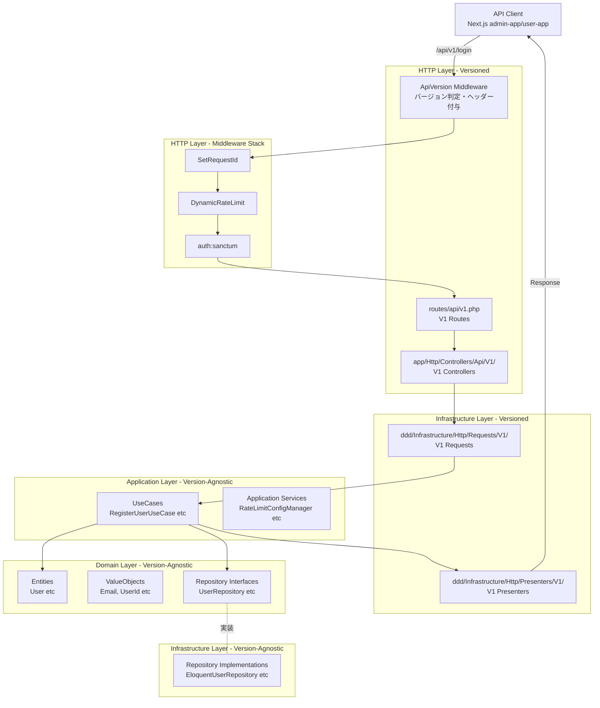
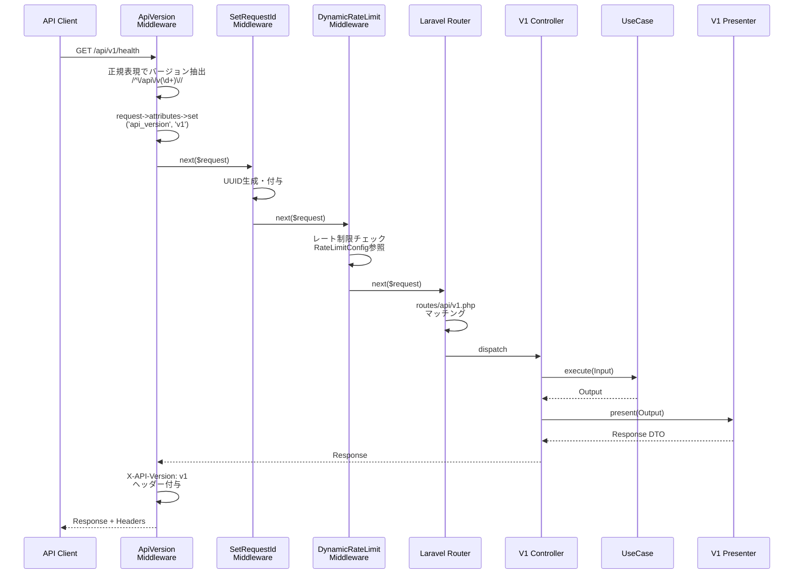
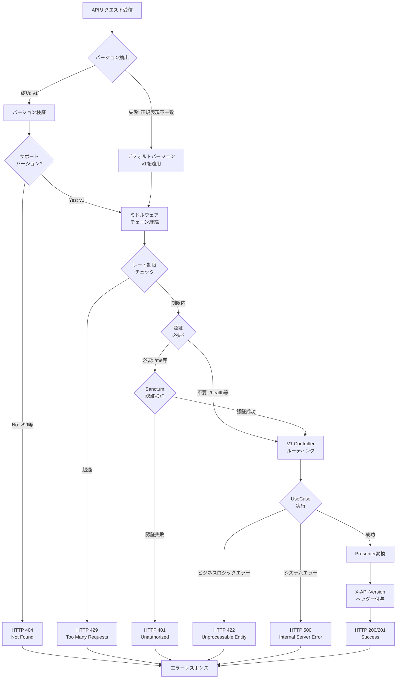

# Technical Design: APIバージョニング（V1実装）

## Overview

本機能は、Laravel Next.js B2CアプリケーションテンプレートにURLベースAPIバージョニング（`/api/v1`）を導入します。DDD/クリーンアーキテクチャ準拠の4層構造を維持しながら、既存のAPIエンドポイントをV1として明示的にバージョン管理し、将来のV2以降の実装に向けた拡張可能な基盤を提供します。

**Purpose**: 本機能は、後方互換性を維持しながらAPI仕様を進化させる基盤を提供します。既存クライアント（Next.js admin-app, user-app）への影響を最小化しつつ、レスポンス形式の標準化、エラーハンドリングの改善、セキュリティ強化を可能にします。

**Users**:
- **APIクライアント開発者**: 明示的なバージョン指定により、API仕様変更から保護された安定したAPI利用が可能になります
- **API保守担当者**: バージョン別のコントローラー・ルート管理により、各バージョンの責務が明確化されます
- **アーキテクチャ設計者**: DDD 4層構造準拠により、Domain/Application層のバージョン非依存性が保証されます

**Impact**:
- 既存のAPIエンドポイント（health, login, logout, me, tokens, csp-report）を`app/Http/Controllers/Api/V1/`へ移行
- 新しいルーティングファイル `routes/api/v1.php` を追加
- 新しいミドルウェア `ApiVersion` を追加し、既存ミドルウェアスタック（DynamicRateLimit、SetRequestId、Sanctum認証）と統合
- フロントエンド型定義 `frontend/types/api/v1.ts` を追加

### Goals

- URLベースバージョニング（`/api/v1`）とヘッダーベース補助（`X-API-Version`）の実装
- 既存5コントローラーのV1ディレクトリへの移行と既存動作の保持
- DDD 4層構造準拠（Domain/Application層のバージョン非依存化、HTTP/Infrastructure層でのバージョン差分吸収）
- 既存ミドルウェアスタック（DynamicRateLimit、SetRequestId、Sanctum認証）との完全統合
- 包括的テスト戦略（Feature Tests、Architecture Tests、E2E Tests、85%以上カバレッジ）
- V2実装ロードマップのドキュメント化

### Non-Goals

- V2コントローラーの実装（ロードマップドキュメント化のみ）
- V3以降のバージョン実装
- GraphQLバージョニング
- API契約監視（oasdiff統合）- V2実装時に検討
- Deprecation/Sunsetヘッダーの実装 - V2実装時に検討

---

## Architecture

### Existing Architecture Analysis

本プロジェクトは既にDDD/クリーンアーキテクチャの4層構造を採用しており、以下のパターンと制約が存在します:

**既存のアーキテクチャパターン**:
- **4層構造**: HTTP層 → Application層 → Domain層 ← Infrastructure層
- **依存方向ルール**: Domain層は他の層に依存しない中心層、Infrastructure層はDomain/Application層のインターフェースを実装
- **Repository Pattern**: Domain層でRepositoryインターフェース定義、Infrastructure層でEloquent実装
- **UseCase駆動**: Application層のUseCaseがビジネスロジックを制御
- **Architecture Testing**: Pestによる依存方向とレイヤー分離の自動検証

**既存のドメイン境界**:
- **User集約**: ユーザー登録・認証ドメイン（`ddd/Domain/User/`、`ddd/Application/User/`）
- **RateLimit集約**: APIレート制限ドメイン（`ddd/Domain/RateLimit/`、`ddd/Application/RateLimit/`）
- **共通サービス**: 監査ログ（AuditService）、認可（AuthorizationService）、イベントバス（EventBus）、トランザクション管理（TransactionManager）

**既存の統合ポイント**:
- **ミドルウェアスタック**: SetRequestId、DynamicRateLimit、Sanctum認証、SecurityHeaders、IdempotencyKey等
- **ルーティング**: `routes/api.php` に全APIエンドポイント定義
- **コントローラー**: `app/Http/Controllers/Api/` に既存コントローラー配置

**技術的負債**:
- APIバージョン管理の欠如（将来のAPI仕様変更時に後方互換性維持が困難）
- コントローラーのバージョン分離不在（全エンドポイントが単一バージョンを想定）

本設計では、既存のDDD 4層構造を尊重し、Domain/Application層への影響を最小化しながら、HTTP/Infrastructure層でバージョン差分を吸収します。

### High-Level Architecture



**Architecture Integration**:
- **既存パターン保持**: DDD 4層構造、Repository Pattern、UseCase駆動を完全維持
- **新規コンポーネント**: ApiVersionミドルウェア、V1ルーティング、V1コントローラー、V1 Presenter/Request（HTTP/Infrastructure層のみ）
- **技術スタック整合性**: Laravel 12、Sanctum、Pest 4、Next.js 15.5、TypeScriptの既存スタックに準拠
- **Steering準拠**: DDD原則、依存性逆転原則、SOLID原則、Architecture Testing統合

### Technology Alignment

本機能は既存のLaravel 12 + Next.js 15.5技術スタックに完全に整合します。新規技術導入は最小限に抑え、既存パターンを拡張します。

**既存技術スタック整合性**:
- **Backend**: Laravel 12、Sanctum 4.0、Pest 4（既存）
- **Frontend**: Next.js 15.5、React 19、TypeScript（既存）
- **Infrastructure**: Docker、GitHub Actions、Playwright 1.47.2（既存）
- **新規ライブラリ**: なし（Laravelの標準機能のみ使用）

**新規導入コンポーネント**:
- **ApiVersionミドルウェア**: Laravel標準のミドルウェア機構を使用（正規表現によるバージョン抽出）
- **V1ルーティング**: Laravel標準のRoute::group機能で `routes/api/v1.php` を追加
- **設定ファイル**: `config/api.php`（バージョン管理用、既存の設定ファイルパターンに準拠）

**既存パターンからの逸脱**:
- なし（全て既存のLaravelパターンに従う）

---

## System Flows

### バージョニング処理フロー



### エラーハンドリングフロー



---

## Requirements Traceability

| Requirement | 要件概要 | 実現コンポーネント | インターフェース | フロー図 |
|-------------|----------|-------------------|---------------|---------|
| 1.1-1.6 | URLベースバージョニング基盤 | ApiVersionミドルウェア、Laravel Router | `handle(Request, Closure): Response` | バージョニング処理フロー |
| 2.1-2.5 | 既存コントローラーV1移行 | V1コントローラー（Health, Login, Me, Token, CspReport） | Laravel標準コントローラー | バージョニング処理フロー |
| 3.1-3.7 | DDD 4層構造統合 | V1 Presenter/Request（Infrastructure層） | `present(Output): array`, `rules(): array` | バージョニング処理フロー |
| 4.1-4.5 | 既存ミドルウェア統合 | ミドルウェアグループ設定、RateLimitConfig | Laravel Middleware Pipeline | バージョニング処理フロー |
| 5.1-5.6 | ApiVersionミドルウェア実装 | ApiVersionミドルウェア | `handle(Request, Closure): Response` | バージョニング処理フロー、エラーハンドリングフロー |
| 6.1-6.6 | ルーティング分離 | `routes/api/v1.php`、RouteServiceProvider | Laravel Route定義 | バージョニング処理フロー |
| 7.1-7.5 | フロントエンド型定義分離 | `frontend/types/api/v1.ts` | TypeScript型定義 | - |
| 8.1-8.6 | 完全なテスト戦略 | ApiVersionTest.php、Api/V1/*Test.php、ApiVersionArchitectureTest.php、api-versioning.spec.ts | Pest/Playwright API | - |
| 9.1-9.5 | CI/CD統合・OpenAPI仕様生成 | `.github/workflows/test.yml`、`docs/openapi-v1.yaml` | GitHub Actions、OpenAPI 3.1 | - |
| 10.1-10.5 | ドキュメント整備 | `api-versioning-guide.md`、`api-versioning-v2-roadmap.md` | Markdownドキュメント | - |

---

## Components and Interfaces

### HTTP Layer / Middleware

#### ApiVersion Middleware

**Responsibility & Boundaries**:
- **Primary Responsibility**: リクエストURLからAPIバージョン番号を抽出し、リクエスト属性に保存。レスポンスに `X-API-Version` ヘッダーを付与
- **Domain Boundary**: HTTP層のみ。Domain/Application層には依存しない
- **Data Ownership**: バージョン番号（`v1`, `v2`等）の抽出と管理
- **Transaction Boundary**: 単一リクエスト内でのバージョン判定

**Dependencies**:
- **Inbound**: Laravel Router、既存ミドルウェアスタック
- **Outbound**: `config/api.php` 設定ファイル（デフォルトバージョン、サポートバージョンリスト）
- **External**: なし（Laravel標準機能のみ使用）

**Contract Definition**:

```php
namespace App\Http\Middleware;

use Closure;
use Illuminate\Http\Request;
use Symfony\Component\HttpFoundation\Response;

interface ApiVersionMiddleware
{
    /**
     * APIバージョニングミドルウェア処理
     *
     * @param Request $request リクエストオブジェクト
     * @param Closure $next 次のミドルウェア
     * @return Response レスポンスオブジェクト
     *
     * Preconditions:
     * - リクエストURLが/api/で始まる
     * - config/api.phpにdefault_versionとsupported_versionsが定義されている
     *
     * Postconditions:
     * - request->attributes->get('api_version')でバージョン番号が取得可能
     * - レスポンスヘッダーにX-API-Versionが含まれる
     * - 未サポートバージョンの場合は404レスポンス
     *
     * Invariants:
     * - バージョン番号は常に'v{数字}'形式（例: 'v1', 'v2'）
     * - X-API-Versionヘッダーは全てのAPIレスポンスに含まれる
     */
    public function handle(Request $request, Closure $next): Response;
}
```

**Processing Logic**:

1. **バージョン抽出**: 正規表現 `/^\/api\/v(\d+)\//` でURLからバージョン番号を抽出
2. **バージョン検証**: サポートバージョンリスト（`config('api.supported_versions')`）と照合
3. **デフォルト適用**: バージョン指定なしの場合、デフォルトバージョン（`config('api.default_version')`）を適用
4. **リクエスト属性保存**: `request()->attributes->set('api_version', $version)`
5. **レスポンスヘッダー付与**: `response()->header('X-API-Version', $version)`

**State Management**:
- **State Model**: ステートレス（リクエストごとに独立）
- **Persistence**: なし（リクエストスコープのみ）
- **Concurrency**: 並行リクエスト間で状態共有なし

---

### HTTP Layer / Controllers

#### V1 Controllers (5 Controllers)

**Responsibility & Boundaries**:
- **Primary Responsibility**: HTTPリクエストのバリデーション、UseCaseへの委譲、Presenterによるレスポンス変換
- **Domain Boundary**: HTTP層。UseCaseを呼び出すが、ビジネスロジックは含まない
- **Data Ownership**: HTTPリクエスト・レスポンスのみ
- **Transaction Boundary**: 単一HTTPリクエスト

**Dependencies**:
- **Inbound**: Laravel Router（routes/api/v1.php）
- **Outbound**: Application層UseCases、Infrastructure層Presenters/Requests
- **External**: なし

**Contract Definition**:

**V1 Controllers List**:
1. `App\Http\Controllers\Api\V1\HealthController` - ヘルスチェック
2. `App\Http\Controllers\Api\V1\LoginController` - ログイン・ログアウト
3. `App\Http\Controllers\Api\V1\MeController` - 認証ユーザー情報取得
4. `App\Http\Controllers\Api\V1\TokenController` - トークン管理
5. `App\Http\Controllers\Api\V1\CspReportController` - CSP違反レポート収集

**API Contract** (V1エンドポイント):

| Method | Endpoint | Request | Response | Errors |
|--------|----------|---------|----------|--------|
| GET | /api/v1/health | - | `{ status: "ok", timestamp: "..." }` | - |
| POST | /api/v1/login | `{ email: string, password: string }` | `{ token: string, user: UserResource }` | 400, 401, 422 |
| POST | /api/v1/logout | - | `{ message: "..." }` | 401 |
| GET | /api/v1/me | - | `UserResource` | 401 |
| GET | /api/v1/tokens | - | `{ tokens: Token[] }` | 401 |
| POST | /api/v1/tokens/{id}/revoke | - | `{ message: "..." }` | 401, 404 |
| POST | /api/v1/tokens/refresh | - | `{ token: string }` | 401 |
| POST | /api/v1/csp-report | `{ csp-report: object }` | `{ message: "..." }` | 400 |

**Integration Strategy**:
- **Modification Approach**: 既存コントローラーを `app/Http/Controllers/Api/V1/` へコピー移動
- **Backward Compatibility**: 既存 `/api/` エンドポイントは維持（デフォルトバージョンとしてv1にルーティング）
- **Migration Path**: 段階的移行（V1移行完了後、既存 `/api/` ルートをV1へリダイレクト）

---

### Infrastructure Layer / Presenters

#### V1 Presenters

**Responsibility & Boundaries**:
- **Primary Responsibility**: Application層のDTOをV1 APIレスポンス形式に変換
- **Domain Boundary**: Infrastructure層。Domain/Applicationエンティティに依存するが、HTTP固有のロジックを含む
- **Data Ownership**: APIレスポンス形式の定義
- **Transaction Boundary**: 単一レスポンス変換

**Dependencies**:
- **Inbound**: V1 Controllers
- **Outbound**: Application層DTOs（RegisterUserOutput等）
- **External**: なし

**Contract Definition**:

```php
namespace Ddd\Infrastructure\Http\Presenters\V1;

use Ddd\Application\User\UseCases\RegisterUser\RegisterUserOutput;

interface UserPresenterV1
{
    /**
     * RegisterUserOutputをV1 APIレスポンス形式に変換
     *
     * @param RegisterUserOutput $output Application層DTO
     * @return array V1 APIレスポンス配列
     *
     * Preconditions:
     * - RegisterUserOutputが有効なデータを含む
     *
     * Postconditions:
     * - V1 API仕様に準拠したレスポンス配列を返す
     * - 必須フィールド（id, email, name, created_at）を含む
     *
     * Response Schema (V1):
     * {
     *   "id": integer,
     *   "email": string,
     *   "name": string,
     *   "created_at": string (ISO 8601)
     * }
     */
    public function present(RegisterUserOutput $output): array;
}
```

**Presenter List** (V1):
- `UserPresenterV1`: ユーザー情報レスポンス変換
- `TokenPresenterV1`: トークン情報レスポンス変換
- `HealthPresenterV1`: ヘルスチェックレスポンス変換（シンプルな配列返却）

---

### Infrastructure Layer / Requests

#### V1 Requests

**Responsibility & Boundaries**:
- **Primary Responsibility**: V1 APIリクエストのバリデーションルール定義
- **Domain Boundary**: Infrastructure層。Laravel FormRequestを継承
- **Data Ownership**: V1バリデーションルール
- **Transaction Boundary**: 単一リクエストバリデーション

**Dependencies**:
- **Inbound**: V1 Controllers
- **Outbound**: Laravelバリデータ
- **External**: なし

**Contract Definition**:

```php
namespace Ddd\Infrastructure\Http\Requests\V1;

use Illuminate\Foundation\Http\FormRequest;

interface LoginRequestV1
{
    /**
     * V1ログインリクエストのバリデーションルール
     *
     * @return array<string, mixed> バリデーションルール配列
     *
     * Validation Rules (V1):
     * - email: required, email形式
     * - password: required, 8文字以上
     *
     * Custom Error Messages:
     * - email.required: "メールアドレスは必須です"
     * - email.email: "有効なメールアドレスを入力してください"
     * - password.required: "パスワードは必須です"
     * - password.min: "パスワードは8文字以上である必要があります"
     */
    public function rules(): array;

    /**
     * カスタムエラーメッセージ定義
     *
     * @return array<string, string> エラーメッセージ配列
     */
    public function messages(): array;
}
```

**Request List** (V1):
- `LoginRequestV1`: ログインリクエストバリデーション
- `RegisterUserRequestV1`: ユーザー登録リクエストバリデーション
- `CspReportRequestV1`: CSP違反レポートバリデーション

---

### Routing / Configuration

#### routes/api/v1.php

**Responsibility & Boundaries**:
- **Primary Responsibility**: V1 APIエンドポイントのルート定義
- **Domain Boundary**: ルーティング層
- **Data Ownership**: V1エンドポイントパス定義
- **Transaction Boundary**: アプリケーション起動時のルート登録

**Route Definitions**:

```php
use App\Http\Controllers\Api\V1\HealthController;
use App\Http\Controllers\Api\V1\LoginController;
use App\Http\Controllers\Api\V1\MeController;
use App\Http\Controllers\Api\V1\TokenController;
use App\Http\Controllers\Api\V1\CspReportController;
use Illuminate\Support\Facades\Route;

// Prefix: /api/v1（RouteServiceProviderで自動付与）

// Public routes
Route::get('/health', [HealthController::class, 'show'])->name('v1.health');
Route::post('/csp-report', [CspReportController::class, 'store'])->name('v1.csp-report');

// Authentication routes (rate limit: 5/min)
Route::middleware('throttle:5,1')->group(function () {
    Route::post('/login', [LoginController::class, 'login'])->name('v1.login');
});

// Protected routes (auth:sanctum, rate limit: 60/min)
Route::middleware(['auth:sanctum', 'throttle:60,1'])->group(function () {
    Route::post('/logout', [LoginController::class, 'logout'])->name('v1.logout');
    Route::get('/me', [MeController::class, 'show'])->name('v1.me');

    // Token management
    Route::get('/tokens', [TokenController::class, 'index'])->name('v1.tokens.index');
    Route::post('/tokens/{id}/revoke', [TokenController::class, 'revoke'])->name('v1.tokens.revoke');
    Route::post('/tokens/refresh', [TokenController::class, 'refresh'])->name('v1.tokens.refresh');
});
```

**Middleware Stack** (V1エンドポイント):
1. `ApiVersion` - バージョン判定・ヘッダー付与
2. `SetRequestId` - リクエストID付与
3. `DynamicRateLimit` - レート制限（エンドポイント分類別）
4. `auth:sanctum` - Sanctum認証（保護ルートのみ）

---

### Frontend / Type Definitions

#### frontend/types/api/v1.ts

**Responsibility & Boundaries**:
- **Primary Responsibility**: V1 APIレスポンスのTypeScript型定義
- **Domain Boundary**: フロントエンド型システム
- **Data Ownership**: V1 API契約型定義
- **Transaction Boundary**: コンパイル時型チェック

**Type Definitions**:

```typescript
/**
 * V1 API Response Types
 *
 * これらの型定義はV1 APIエンドポイントのレスポンス形式を厳密に定義します。
 * API契約変更時は、この型定義も同時に更新してください。
 */

export interface V1HealthResponse {
  status: 'ok';
  timestamp: string; // ISO 8601形式
}

export interface V1LoginResponse {
  token: string; // Sanctum Personal Access Token
  user: V1UserResponse;
}

export interface V1UserResponse {
  id: number;
  email: string;
  name: string;
  created_at: string; // ISO 8601形式
}

export interface V1TokenResponse {
  id: number;
  name: string;
  abilities: string[];
  last_used_at: string | null; // ISO 8601形式
  expires_at: string | null; // ISO 8601形式
  created_at: string; // ISO 8601形式
}

export interface V1TokenListResponse {
  tokens: V1TokenResponse[];
}

export interface V1ErrorResponse {
  message: string;
  errors?: Record<string, string[]>; // バリデーションエラー詳細
}

/**
 * V1 API Request Types
 */
export interface V1LoginRequest {
  email: string;
  password: string;
}

export interface V1RegisterUserRequest {
  email: string;
  password: string;
  password_confirmation: string;
  name: string;
}
```

**Environment Variable Configuration**:

```typescript
// next.config.ts または環境変数
export const API_VERSION = process.env.NEXT_PUBLIC_API_VERSION || 'v1';
export const API_BASE_URL = process.env.NEXT_PUBLIC_API_BASE_URL || 'http://localhost:13000';

// APIクライアント使用例
const apiClient = axios.create({
  baseURL: `${API_BASE_URL}/api/${API_VERSION}`,
  headers: {
    'X-API-Version': API_VERSION,
  },
});
```

---

## Data Models

### Configuration Data Model

#### config/api.php

**Structure Definition**:

```php
return [
    /*
    |--------------------------------------------------------------------------
    | デフォルトAPIバージョン
    |--------------------------------------------------------------------------
    |
    | バージョン指定なしのリクエストに適用されるデフォルトバージョン。
    | URLに /api/v{version}/ の形式でバージョンが含まれない場合、
    | このバージョンが自動適用されます。
    |
    */
    'default_version' => env('API_DEFAULT_VERSION', 'v1'),

    /*
    |--------------------------------------------------------------------------
    | サポート対象APIバージョンリスト
    |--------------------------------------------------------------------------
    |
    | 現在サポートしているAPIバージョンのリスト。
    | リストに含まれないバージョンへのリクエストは404エラーを返します。
    |
    */
    'supported_versions' => [
        'v1',
        // 'v2', // 将来のバージョン追加時にコメント解除
    ],

    /*
    |--------------------------------------------------------------------------
    | バージョン別設定
    |--------------------------------------------------------------------------
    |
    | 各バージョン固有の設定（将来のV2実装時に使用）
    |
    */
    'versions' => [
        'v1' => [
            'deprecation_date' => null, // V2リリース時に設定
            'sunset_date' => null,      // V1廃止予定日
        ],
    ],
];
```

**Consistency & Integrity**:
- `default_version` は必ず `supported_versions` に含まれる必要がある
- バージョン番号は常に `v{数字}` 形式（例: `v1`, `v2`）
- `supported_versions` の追加・削除はマイグレーション計画と連動

---

## Error Handling

### Error Strategy

APIバージョニング機能では、既存のLaravel例外ハンドラーとHTTPステータスコードを活用し、バージョン固有のエラーレスポンスを提供します。全てのエラーレスポンスには `X-API-Version` ヘッダーが含まれ、クライアントがどのバージョンでエラーが発生したかを識別できます。

### Error Categories and Responses

**User Errors (4xx)**:

1. **HTTP 400 Bad Request**:
   - **発生条件**: リクエストボディのJSON形式エラー、必須フィールド欠落
   - **レスポンス**: `{ "message": "Invalid request format", "errors": {...} }`
   - **Recovery**: クライアント側でリクエストペイロードを修正

2. **HTTP 401 Unauthorized**:
   - **発生条件**: Sanctum認証失敗、トークン期限切れ、トークン無効
   - **レスポンス**: `{ "message": "Unauthenticated" }`
   - **Recovery**: `/api/v1/login` でトークン再取得

3. **HTTP 404 Not Found**:
   - **発生条件**: サポート外バージョン（例: `/api/v99`）、存在しないエンドポイント
   - **レスポンス**: `{ "message": "Version not supported" }` または `{ "message": "Endpoint not found" }`
   - **Recovery**: サポート対象バージョン（`/api/v1`）にリクエスト変更

4. **HTTP 422 Unprocessable Entity**:
   - **発生条件**: バリデーションエラー、ビジネスロジックエラー
   - **レスポンス**: `{ "message": "Validation failed", "errors": { "email": ["Invalid email format"] } }`
   - **Recovery**: フィールド別エラーメッセージを表示し、ユーザーに修正を促す

5. **HTTP 429 Too Many Requests**:
   - **発生条件**: レート制限超過（認証: 5回/分、書き込み: 10回/分、読み取り: 60回/分）
   - **レスポンス**: `{ "message": "Too many requests", "retry_after": 60 }`
   - **ヘッダー**: `Retry-After: 60`, `X-RateLimit-Limit: 60`, `X-RateLimit-Remaining: 0`
   - **Recovery**: クライアント側で指数バックオフによるリトライ実装

**System Errors (5xx)**:

1. **HTTP 500 Internal Server Error**:
   - **発生条件**: 予期しない例外、データベース接続エラー、アプリケーション内部エラー
   - **レスポンス**: `{ "message": "Internal server error" }`（本番環境では詳細を隠蔽）
   - **Recovery**: エラーログ記録、監視アラート発火、自動リトライ（Circuit Breaker実装）

2. **HTTP 503 Service Unavailable**:
   - **発生条件**: メンテナンスモード、データベース接続不可
   - **レスポンス**: `{ "message": "Service temporarily unavailable" }`
   - **ヘッダー**: `Retry-After: 300`
   - **Recovery**: メンテナンス完了まで待機、ステータスページへ誘導

**Business Logic Errors (422)**:

1. **Duplicate Email Registration**:
   - **発生条件**: 既に登録済みのメールアドレスでユーザー登録を試行
   - **レスポンス**: `{ "message": "Email already exists", "errors": { "email": ["This email is already registered"] } }`
   - **Recovery**: ログイン画面へ誘導、パスワードリセット案内

2. **Invalid Token Revocation**:
   - **発生条件**: 既に無効化されたトークンの再無効化試行
   - **レスポンス**: `{ "message": "Token not found or already revoked" }`
   - **Recovery**: トークン一覧を再取得、UI状態を同期

### Monitoring

**Error Tracking**:
- **Sentry統合**: 500系エラーを自動的にSentryへ送信（スタックトレース、リクエストコンテキスト含む）
- **ログ記録**: `storage/logs/laravel.log` にエラー詳細を記録（`LOG_CHANNEL=stack`）
- **構造化ログ**: SetRequestIdミドルウェアによりリクエストIDを全ログに付与

**Health Monitoring**:
- **Endpoint**: `GET /api/v1/health` による死活監視
- **Metrics**: レスポンスタイム、エラーレート、レート制限超過率
- **Alerting**: エラーレート5%超過時、Slack/PagerDuty通知

**Version-Specific Metrics**:
- **Dashboard**: Grafana/Prometheusでバージョン別メトリクス可視化
- **Metrics**:
  - `api_requests_total{version="v1"}`: V1リクエスト総数
  - `api_errors_total{version="v1", status="500"}`: V1エラー数
  - `api_response_time_seconds{version="v1", endpoint="/login"}`: V1エンドポイント別レスポンスタイム

---

## Testing Strategy

### Unit Tests (Pest)

**ApiVersionミドルウェアテスト** (`tests/Feature/Middleware/ApiVersionTest.php`):
1. **バージョン抽出テスト**: `/api/v1/health` から `v1` を正しく抽出することを検証
2. **デフォルトバージョン適用テスト**: `/api/health` に `v1` が適用されることを検証
3. **サポート外バージョン404テスト**: `/api/v99/health` が404を返すことを検証
4. **X-API-Versionヘッダー付与テスト**: レスポンスに `X-API-Version: v1` が含まれることを検証
5. **リクエスト属性保存テスト**: `request()->get('api_version')` で `v1` が取得できることを検証

**V1 Controllerテスト** (`tests/Feature/Api/V1/HealthControllerTest.php` 等):
1. **HealthController**: `/api/v1/health` が200と `{ status: "ok" }` を返すことを検証
2. **LoginController**: `/api/v1/login` が正しい認証情報で200とトークンを返すことを検証
3. **MeController**: `/api/v1/me` が認証済みユーザー情報を返すことを検証
4. **TokenController**: `/api/v1/tokens` がトークン一覧を返すことを検証
5. **CspReportController**: `/api/v1/csp-report` がCSP違反レポートを受信できることを検証

**回帰テスト**: 既存の全Feature Testsが引き続き成功することを検証

### Integration Tests (Pest)

**ミドルウェアスタック統合テスト**:
1. **ApiVersion + SetRequestId統合**: リクエストIDとバージョンヘッダーが両方付与されることを検証
2. **ApiVersion + DynamicRateLimit統合**: V1エンドポイントでレート制限が正しく適用されることを検証
3. **ApiVersion + Sanctum認証統合**: `/api/v1/me` で認証が正しく検証されることを検証
4. **エラーレスポンスバージョンヘッダー**: エラーレスポンスにも `X-API-Version` が含まれることを検証

**DDD層統合テスト**:
1. **V1 Controller → UseCase連携**: V1コントローラーが既存UseCaseを正しく呼び出すことを検証
2. **V1 Presenter変換**: UseCaseのOutputがV1レスポンス形式に正しく変換されることを検証
3. **V1 Requestバリデーション**: V1 Requestが正しいバリデーションルールを適用することを検証

### Architecture Tests (Pest)

**依存方向検証** (`tests/Arch/ApiVersionArchitectureTest.php`):
1. **Domain層非依存検証**: Domain層がバージョン固有クラスに依存していないことを検証
   ```php
   arch('Domain layer does not depend on versioned classes')
       ->expect('Ddd\Domain')
       ->not->toUse(['App\Http\Controllers\Api\V1', 'Ddd\Infrastructure\Http\Presenters\V1']);
   ```

2. **Application層非依存検証**: Application層がバージョン固有クラスに依存していないことを検証
   ```php
   arch('Application layer does not depend on versioned classes')
       ->expect('Ddd\Application')
       ->not->toUse(['App\Http\Controllers\Api\V1', 'Ddd\Infrastructure\Http\Presenters\V1']);
   ```

3. **V1コントローラー配置検証**: V1コントローラーが正しい名前空間に配置されていることを検証
   ```php
   arch('V1 controllers are in correct namespace')
       ->expect('App\Http\Controllers\Api\V1')
       ->toBeClasses()
       ->toExtend('App\Http\Controllers\Controller');
   ```

4. **V1 Presenter/Request配置検証**: V1 Presenter/Requestが正しいInfrastructure層に配置されていることを検証

### E2E Tests (Playwright)

**V1エンドポイントE2Eテスト** (`e2e/projects/shared/tests/api-versioning.spec.ts`):
1. **ヘルスチェック**: `/api/v1/health` へのアクセスと `X-API-Version: v1` ヘッダー確認
2. **ログインフロー**: `/api/v1/login` でトークン取得、`/api/v1/me` で認証ユーザー情報取得
3. **トークン管理**: `/api/v1/tokens` でトークン一覧取得、`/api/v1/tokens/{id}/revoke` でトークン無効化
4. **エラーハンドリング**: サポート外バージョン `/api/v99/health` で404確認
5. **レート制限**: `/api/v1/login` に5回連続リクエストして429確認

**クロスバージョンE2Eテスト** (将来のV2実装時):
1. V1とV2エンドポイントが並行稼働することを検証
2. 同一クライアントからV1/V2両方へのリクエストが成功することを検証

### Performance Tests

**レスポンスタイムテスト**:
1. **ApiVersionミドルウェアオーバーヘッド**: バージョニング処理が5ms未満であることを検証
2. **正規表現処理時間**: バージョン抽出処理が1ms未満であることを検証
3. **V1エンドポイントレスポンスタイム**: `/api/v1/health` が20ms未満で応答することを検証

**カバレッジ目標**:
- **総合カバレッジ**: 85%以上維持
- **ApiVersionミドルウェア**: 100%カバレッジ
- **V1コントローラー**: 90%以上カバレッジ
- **V1 Presenter/Request**: 90%以上カバレッジ

---

## Security Considerations

### Authentication and Authorization

**Sanctum認証統合**:
- V1の保護エンドポイント（`/api/v1/me`, `/api/v1/tokens`）は既存の `auth:sanctum` ミドルウェアを継承
- トークンライフサイクル管理（有効期限、取り消し、更新）は既存のTokenControllerロジックを維持
- V1とV2で認証メカニズムを変更する場合は、V2ロードマップで戦略を文書化

**レート制限強化**:
- V1エンドポイントは既存の `DynamicRateLimit` ミドルウェアによるエンドポイント分類別制限を適用
- 認証API: 5回/分、書き込みAPI: 10回/分、読み取りAPI: 60回/分、管理者API: 100回/分
- Redis障害時フェイルオーバー（`RATELIMIT_CACHE_STORE`環境変数でArray切替）

### Data Protection and Privacy

**機密データマスキング**:
- ログ記録時に `config/middleware.php` の `sensitive_fields` リストに基づき自動マスキング
- V1レスポンスでも `password`, `token`, `secret` 等の機密フィールドはログから除外

**CSP違反レポート収集**:
- `/api/v1/csp-report` エンドポイントは既存のCspReportControllerロジックを維持
- application/json互換性対応済み

### Version-Specific Security Headers

V1エンドポイントは既存のセキュリティヘッダーミドルウェアを継承:
- `X-Frame-Options: SAMEORIGIN`
- `X-Content-Type-Options: nosniff`
- `Content-Security-Policy` (Report-Onlyモード)
- `Strict-Transport-Security` (本番環境のみ)

全てのV1レスポンスに `X-API-Version: v1` ヘッダーを追加し、クライアントがバージョンを識別可能にします。

---

## Performance & Scalability

### Target Metrics

**バージョニングオーバーヘッド**:
- **目標**: 5ms未満（バージョン判定・ヘッダー付与の合計処理時間）
- **測定**: `LogPerformance` ミドルウェアによるレスポンスタイム記録
- **最適化**: 正規表現コンパイル結果のキャッシング、設定値の起動時ロード

**正規表現処理時間**:
- **目標**: 1ms未満（バージョン抽出正規表現 `/^\/api\/v(\d+)\//` の実行時間）
- **測定**: Xdebugプロファイリング、Blackfireモニタリング
- **最適化**: 単純な正規表現パターン使用、preg_match一回呼び出し

### Scaling Approaches

**水平スケーリング**:
- APIバージョニングはステートレス設計のため、ロードバランサー配下での水平スケーリングが容易
- ApiVersionミドルウェアは並行リクエスト間で状態共有なし
- 設定ファイル（`config/api.php`）はOPcacheにより全インスタンスで共有

**キャッシング戦略**:
- **設定値キャッシング**: `config/api.php` の `default_version`, `supported_versions` をアプリケーション起動時にロード
- **ルート定義キャッシング**: `php artisan route:cache` によりV1ルート定義をキャッシュ（本番環境）
- **OPcacheコンパイル**: ApiVersionミドルウェアクラスのバイトコードキャッシング

### Database Optimization

APIバージョニング機能自体はデータベースアクセスを行わないため、データベース最適化は不要です。ただし、V1コントローラーが呼び出すUseCaseは既存のEloquent Repositoryパターンに従い、以下の最適化を継承します:

- **Eager Loading**: N+1問題回避
- **Query Caching**: 頻繁にアクセスされるクエリ結果のキャッシング
- **Connection Pooling**: PostgreSQL接続プール管理

---

## Migration Strategy

### 段階的移行フロー

```mermaid
flowchart TD
    Start[開始] --> Phase1[Phase 1:<br/>基盤構築]

    Phase1 --> P1_1[ApiVersionミドルウェア実装<br/>+ Feature Tests]
    P1_1 --> P1_2[config/api.php設定追加<br/>supported_versions: v1]
    P1_2 --> P1_3[RouteServiceProvider更新<br/>routes/api/v1.phpロード]

    P1_3 --> Phase2[Phase 2:<br/>V1コントローラー移行]

    Phase2 --> P2_1[既存コントローラーコピー<br/>→ Api/V1/ディレクトリ]
    P2_1 --> P2_2[名前空間更新<br/>App\Http\Controllers\Api\V1]
    P2_2 --> P2_3[既存テスト回帰確認<br/>全Feature Tests成功]

    P2_3 --> Phase3[Phase 3:<br/>Presenter/Request分離]

    Phase3 --> P3_1[V1 Presenter実装<br/>ddd/Infrastructure/Http/Presenters/V1/]
    P3_1 --> P3_2[V1 Request実装<br/>ddd/Infrastructure/Http/Requests/V1/]
    P3_2 --> P3_3[Architecture Tests追加<br/>依存方向検証]

    P3_3 --> Phase4[Phase 4:<br/>ルーティング統合]

    Phase4 --> P4_1[routes/api/v1.php作成<br/>全V1エンドポイント定義]
    P4_1 --> P4_2[既存routes/api.php保持<br/>デフォルトバージョンとして動作]
    P4_2 --> P4_3[E2Eテスト追加<br/>api-versioning.spec.ts]

    P4_3 --> Phase5[Phase 5:<br/>フロントエンド統合]

    Phase5 --> P5_1[frontend/types/api/v1.ts作成<br/>型定義追加]
    P5_1 --> P5_2[環境変数設定<br/>NEXT_PUBLIC_API_VERSION=v1]
    P5_2 --> P5_3[既存コンポーネント動作確認<br/>admin-app/user-app]

    P5_3 --> Phase6[Phase 6:<br/>CI/CD統合]

    Phase6 --> P6_1[GitHub Actions paths設定拡張<br/>V1関連ファイル追加]
    P6_1 --> P6_2[OpenAPI v1仕様生成<br/>docs/openapi-v1.yaml]
    P6_2 --> P6_3[全テストスイート成功確認<br/>Feature/Architecture/E2E]

    P6_3 --> Phase7[Phase 7:<br/>ドキュメント整備]

    Phase7 --> P7_1[api-versioning-guide.md作成<br/>実装パターン・テスト戦略]
    P7_1 --> P7_2[api-versioning-v2-roadmap.md作成<br/>V2実装方針・段階的移行戦略]
    P7_2 --> End[完了:<br/>V1バージョニング稼働]

    style Phase1 fill:#e1f5ff
    style Phase2 fill:#e1f5ff
    style Phase3 fill:#fff4e1
    style Phase4 fill:#fff4e1
    style Phase5 fill:#f0ffe1
    style Phase6 fill:#f0ffe1
    style Phase7 fill:#ffe1f5
    style End fill:#90EE90
```



### ロールバックトリガー

**Phase 1-2 ロールバック条件**:
- ApiVersionミドルウェアのFeature Testsが失敗
- 既存エンドポイントの回帰テストが失敗
- バージョニングオーバーヘッドが5msを超過

**Phase 3-4 ロールバック条件**:
- Architecture Testsで依存方向違反を検出
- V1エンドポイントのレスポンス形式が既存と異なる
- E2Eテストが失敗

**Phase 5-6 ロールバック条件**:
- フロントエンドアプリケーション（admin-app/user-app）の動作異常
- CI/CD環境でのテスト失敗
- OpenAPI仕様生成エラー

**Phase 7 ロールバック条件**:
- ドキュメントの重大な誤記や欠落
- V2ロードマップの実現不可能な計画

### 検証チェックポイント

**Phase 1検証**:
- [ ] ApiVersionミドルウェアが正規表現でバージョン抽出成功
- [ ] `X-API-Version` ヘッダーが全レスポンスに付与
- [ ] サポート外バージョンで404レスポンス

**Phase 2検証**:
- [ ] 全V1コントローラーが `App\Http\Controllers\Api\V1` 名前空間に配置
- [ ] 既存Feature Testsが全て成功（回帰テスト）
- [ ] V1エンドポイントが既存レスポンス形式を保持

**Phase 3検証**:
- [ ] V1 Presenter/Requestが `Ddd\Infrastructure\Http\Presenters\V1` および `Ddd\Infrastructure\Http\Requests\V1` に配置
- [ ] Architecture Testsで依存方向違反ゼロ
- [ ] Domain/Application層がバージョン固有クラスに非依存

**Phase 4検証**:
- [ ] `routes/api/v1.php` が全V1エンドポイントを定義
- [ ] 既存 `/api/` エンドポイントがデフォルトバージョン（v1）として動作
- [ ] E2Eテスト `api-versioning.spec.ts` が全て成功

**Phase 5検証**:
- [ ] `frontend/types/api/v1.ts` が全V1レスポンス型を定義
- [ ] `NEXT_PUBLIC_API_VERSION=v1` 環境変数が設定
- [ ] admin-app/user-appが正常動作

**Phase 6検証**:
- [ ] `.github/workflows/test.yml` のpaths設定にV1関連ファイル追加
- [ ] `docs/openapi-v1.yaml` が生成成功
- [ ] CI/CD環境で全テストスイート成功

**Phase 7検証**:
- [ ] `api-versioning-guide.md` が設計思想・実装パターン・テスト戦略・トラブルシューティングを含む
- [ ] `api-versioning-v2-roadmap.md` がV2実装方針・段階的移行戦略・技術要件・Deprecation運用方針を含む
- [ ] 全ドキュメントが日本語で記述、コードサンプル・設定例を含む

---

## Glossary

- **URLベースバージョニング**: APIエンドポイントのURLパスにバージョン番号を含める方式（例: `/api/v1/users`）
- **DDD**: Domain-Driven Design。ドメイン駆動設計
- **4層構造**: HTTP層、Application層、Domain層、Infrastructure層の階層アーキテクチャ
- **Presenter**: Infrastructure層でドメインエンティティをAPIレスポンス形式に変換するクラス
- **Sanctum**: Laravel公式のトークンベース認証ライブラリ
- **Pest**: Laravel推奨のモダンなPHPテストフレームワーク
- **Architecture Tests**: コードの依存方向やレイヤー分離を自動検証するテスト
- **OpenAPI**: REST APIの仕様を記述する標準フォーマット（旧Swagger）
- **UseCase**: Application層でビジネスロジックを制御するクラス
- **Repository Pattern**: データアクセスを抽象化するデザインパターン

---

## References

### Internal Documentation
- DDD/クリーンアーキテクチャ: `backend/laravel-api/docs/ddd-architecture.md`
- Sanctum認証ガイド: `backend/laravel-api/docs/sanctum-authentication-guide.md`
- テストDB運用: `docs/TESTING_DATABASE_WORKFLOW.md`
- 基本ミドルウェア設定: `.kiro/specs/basic-middleware-setup/`
- APIレート制限設定: `.kiro/specs/api-rate-limit-setup/`

### External References
- Laravel 12 Routing: https://laravel.com/docs/12.x/routing
- Laravel Middleware: https://laravel.com/docs/12.x/middleware
- Laravel Sanctum: https://laravel.com/docs/12.x/sanctum
- Pest Testing: https://pestphp.com/docs/
- Pest Architecture Testing: https://pestphp.com/docs/arch-testing
- OpenAPI Specification v3.1: https://spec.openapis.org/oas/v3.1.0
- Playwright Testing: https://playwright.dev/docs/intro
- API Versioning Best Practices: https://www.baeldung.com/rest-versioning
- Semantic Versioning: https://semver.org/

---

## Approval History

- **Requirements Approved**: 2025-10-29
- **Design Generated**: 2025-10-29
- **Design Approved**: Pending
- **Tasks Approved**: Pending
