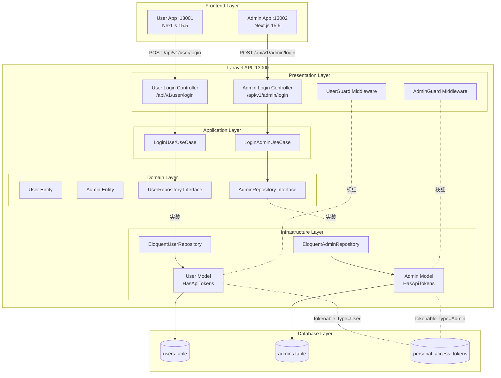
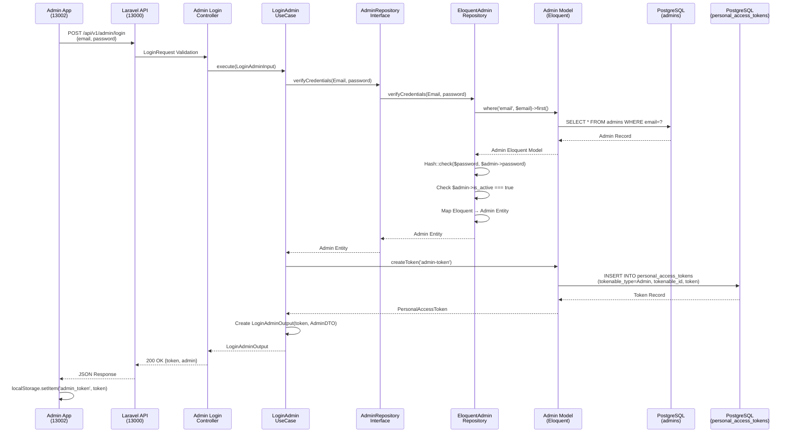
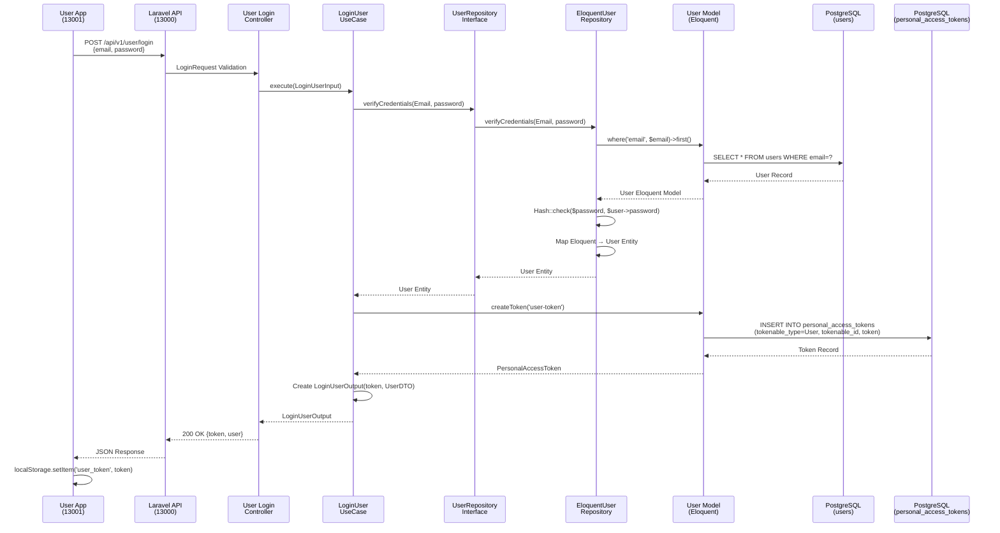
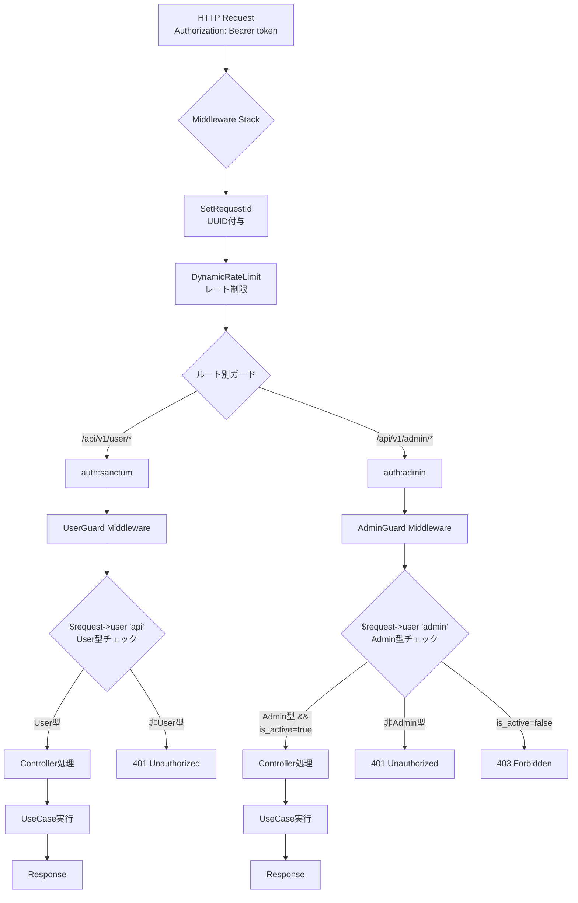
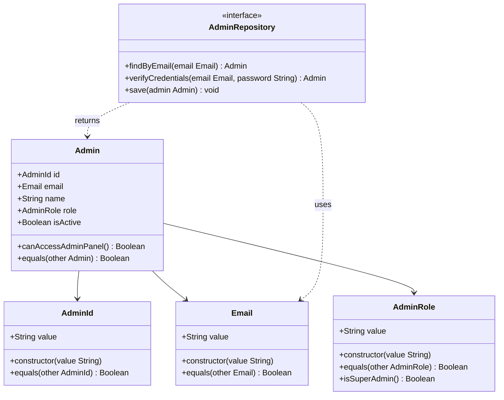
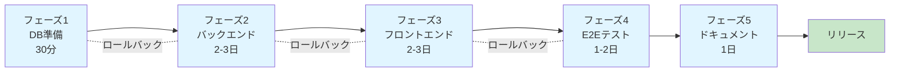

# 技術設計書

## 概要

本機能は、Laravel 12 + Sanctum 4.0 + Next.js 15.5を使用した、User/Admin完全分離認証システムを提供する。既存のDDD/クリーンアーキテクチャ基盤を拡張し、管理者専用の認証フローを追加する。

**目的**: B2Cテンプレートとして、以下の価値を提供する：
- User/Adminの完全分離設計（別テーブル、別ガード、別トークン管理、別ミドルウェア）
- DDD 4層構造に準拠した実装パターンの提示
- APIバージョニング（v1）の初期導入による将来の破壊的変更への対応
- 統一エラーハンドリングによる一貫した開発体験
- 包括的テスト戦略（Unit/Feature/E2E）の確立

**利用者**:
- エンドユーザーは User App（ポート13001）でログイン・ログアウト・認証状態確認を実施する
- 管理者は Admin App（ポート13002）で管理者ログイン・ダッシュボードアクセス・ログアウトを実施する
- 開発者は本実装をリファレンスとして、DDD準拠の認証機能を学習・拡張する

**影響範囲**: 既存システムに管理者認証機能を追加する拡張実装である：
- 既存User認証（Laravel Sanctum基盤）は維持し、Admin認証を並行して追加する
- 既存DDD 4層構造（`ddd/Domain/User/`、`ddd/Application/User/`、`ddd/Infrastructure/Persistence/Eloquent/`）のパターンに従い、Admin集約を新規実装する
- 既存のミドルウェアスタック（`SetRequestId`、`DynamicRateLimit`、`IdempotencyKey`等）との統合を行う

### 目標

- User/Admin認証フローの完全分離（別テーブル、別ガード、別トークン管理）を実現する
- DDD 4層構造の依存方向ルール（HTTP→Application→Domain←Infrastructure）を厳守する
- APIバージョニング（v1プレフィックス）を初期から導入し、将来の破壊的変更に備える
- 統一エラーレスポンス形式（JSON Schema）を定義し、フロントエンドとの一貫性を保証する
- テストカバレッジ目標（バックエンド85%以上、フロントエンド80%以上）を達成する

### 非目標

本仕様の対象外とする機能：
- パスワードリセット機能（別Issue化）
- メール認証機能（別Issue化）
- 2FA（二要素認証）機能（将来実装）
- OAuth連携（Google/GitHub等）
- RBAC詳細実装（基本roleカラムのみ実装、詳細な権限管理は将来実装）
- API v2以降の実装（設計のみ記載、実装は将来の破壊的変更時）

---

## アーキテクチャ

### 既存アーキテクチャ分析

本プロジェクトは既にDDD/クリーンアーキテクチャ基盤を持つ：

**既存のパターンと制約**:
- **DDD 4層構造**: `backend/laravel-api/ddd/` 配下に Domain/Application/Infrastructure層が存在
- **User集約の実装**: `ddd/Domain/User/`、`ddd/Application/User/UseCases/RegisterUser/`、`ddd/Infrastructure/Persistence/Eloquent/EloquentUserRepository.php` が既に実装済み
- **Laravel Sanctum統合**: `app/Models/User.php` で `HasApiTokens` トレイト使用、`personal_access_tokens` テーブルで認証トークン管理
- **既存ミドルウェアスタック**: `SetRequestId`（リクエストID付与）、`DynamicRateLimit`（APIレート制限）、`IdempotencyKey`（冪等性保証）が実装済み

**尊重すべき既存ドメイン境界**:
- User集約: `ddd/Domain/User/`、`ddd/Application/User/` 配下で管理
- Admin集約（新規）: `ddd/Domain/Admin/`、`ddd/Application/Admin/` 配下で管理（User集約と同様の構造）

**維持すべき統合ポイント**:
- Sanctumトークンテーブル（`personal_access_tokens`）: `tokenable_type` カラムで `App\Models\User` と `App\Models\Admin` を区別
- 既存ミドルウェアスタック: 新規 `AdminGuard`、`UserGuard` ミドルウェアを追加し、既存スタックと統合
- DI Container（`app/Providers/DddServiceProvider.php`）: `AdminRepository` のバインディング追加

**対処すべき技術的負債**:
- 該当なし（既存システムは健全、新規機能追加のみ）

### 高レベルアーキテクチャ



### アーキテクチャ統合

**既存パターンの保持**:
- DDD 4層構造の依存方向ルール（HTTP→Application→Domain←Infrastructure）を厳守する
- Repository Pattern（InterfaceをDomain層、実装をInfrastructure層に配置）を継続する
- UseCase Input/Output DTO契約パターンを適用する
- Eloquent→Domain Entityマッピングパターンを踏襲する

**新規コンポーネントの根拠**:
- **Admin Entity** (Domain層): User Entityと同様の構造で、管理者専用のビジネスルール（`canAccessAdminPanel()`）を実装
- **AdminRole ValueObject** (Domain層): 'admin' または 'super_admin' のみを許可するバリデーション
- **LoginAdminUseCase** (Application層): 管理者ログインの独立したユースケース、User認証と完全分離
- **AdminGuard Middleware** (Presentation層): `auth:admin` ガードで認証されたユーザーがAdmin型であることを保証

**技術スタックとの整合性**:
- Laravel 12: 既存のLaravel 12基盤を活用、新規依存関係なし
- Sanctum 4.0: 既存の `HasApiTokens` トレイトと `personal_access_tokens` テーブルを再利用
- Next.js 15.5 + React 19: 既存のUser App実装パターンをAdmin Appに適用

**Steering準拠**:
- **structure.md**: DDD 4層構造配置パターンに従う（`ddd/Domain/Admin/`、`ddd/Application/Admin/`、`ddd/Infrastructure/Persistence/Eloquent/`）
- **tech.md**: Laravel 12、Sanctum 4.0、Pest 4、Next.js 15.5の既存技術スタックを使用
- **product.md**: B2Cテンプレートとしての実用的認証サンプル提供という目的に合致

---

## 技術アライメント

本機能は既存システムへの拡張であり、確立された技術スタックに準拠する：

**既存技術スタックとの整合性**:
- **Backend**: Laravel 12、Sanctum 4.0、Pest 4、DDD/クリーンアーキテクチャ（既存User実装と同様）
- **Frontend**: Next.js 15.5、React 19、TypeScript、Jest 29、Testing Library 16（既存User App実装と同様）
- **Infrastructure**: PostgreSQL 17、Docker Compose、Playwright 1.47.2（既存環境を継続使用）

**新規導入ライブラリ**:
- なし（既存の依存関係のみ使用）

**既存パターンからの逸脱**:
- なし（既存User認証のパターンをAdmin認証に適用）

### 主要な設計決定

#### 決定1: Sanctumマルチガード認証の採用

**決定**: Laravel Sanctum 4.0の `auth:sanctum` と `auth:admin` の2つのガードを定義し、User/Admin認証を完全分離する。

**コンテキスト**:
- User/Adminで異なるセキュリティ要件とライフサイクル管理が必要
- 既存の `personal_access_tokens` テーブルで `tokenable_type` カラムにより型を区別する仕組みがある

**代替案**:
1. **単一ガード + Role列**: `users` テーブルに `role` 列を追加し、User/Adminを区別する
   - 利点: 実装がシンプル、テーブル数削減
   - 欠点: セキュリティポリシーの分離が困難、UserとAdminのライフサイクル管理が複雑化
2. **外部認証サービス（OAuth）**: Auth0やCognitoなどの外部サービスを使用
   - 利点: エンタープライズグレードのセキュリティ、SSO対応
   - 欠点: 外部依存、コスト増加、B2Cテンプレートとしての学習コスト増
3. **JWT + 独自実装**: Sanctumを使わず、JWT + 独自ミドルウェアで実装
   - 利点: 完全な制御、Sanctumの制約なし
   - 欠点: セキュリティリスク増加、車輪の再発明、メンテナンスコスト増

**選択したアプローチ**: Sanctumマルチガード認証
- `config/auth.php` で 'api'（User用、provider: users）と 'admin'（Admin用、provider: admins）の2つのガードを定義
- `personal_access_tokens.tokenable_type` カラムで `App\Models\User` と `App\Models\Admin` を区別
- カスタムミドルウェア（`AdminGuard`、`UserGuard`）で型安全性を保証

**根拠**:
- Sanctumは Laravel公式パッケージで、セキュリティ更新とメンテナンスが保証される
- 既存の `HasApiTokens` トレイトと `personal_access_tokens` テーブルを再利用できる
- マルチガード機能により、User/Adminの認証ポリシーを完全に分離できる
- B2Cテンプレートとして、外部依存なしで学習・拡張が容易

**トレードオフ**:
- **獲得**: セキュリティポリシーの完全分離、型安全性、Laravel標準パターンの踏襲、外部依存なし
- **犠牲**: ガード設定の追加実装、テーブル数増加（`users` + `admins`）、カスタムミドルウェア実装の必要性

#### 決定2: APIバージョニング（v1プレフィックス）の初期導入

**決定**: 全認証APIエンドポイントに `/api/v1` プレフィックスを付与し、初期からバージョニング戦略を適用する。

**コンテキスト**:
- B2Cテンプレートとして、将来の破壊的変更（レスポンス形式変更、必須パラメーター追加等）に備える必要がある
- モバイルアプリ連携を想定し、クライアントのバージョン管理を容易にする

**代替案**:
1. **バージョニングなし**: `/api/user/login` のようなシンプルなエンドポイント
   - 利点: 実装がシンプル、URL短縮
   - 欠点: 破壊的変更時にクライアント全体の更新が必須、段階的移行不可
2. **ヘッダーベースバージョニング**: `Accept: application/vnd.api+json; version=1`
   - 利点: URLがクリーン、RESTful原則に従う
   - 欠点: ブラウザからのテストが困難、クライアント実装の複雑化
3. **クエリパラメーターバージョニング**: `/api/user/login?version=1`
   - 利点: 実装が容易、既存エンドポイントとの共存可
   - 欠点: キャッシュが困難、URLが冗長

**選択したアプローチ**: URLパスバージョニング
- 全エンドポイントに `/api/v1` プレフィックスを付与（例: `/api/v1/admin/login`）
- ルート名に `v1.` プレフィックスを付与（例: `v1.admin.login`）
- バージョン無しエンドポイント（`/api/admin/login`）は308 Permanent Redirectで `/api/v1/admin/login` にリダイレクト
- フロントエンド環境変数 `NEXT_PUBLIC_API_VERSION=v1` で柔軟にバージョン切替可能

**根拠**:
- URLパスバージョニングは最も一般的で、ブラウザからのテストが容易
- 初期からv1を導入することで、後からバージョニングを追加する技術的負債を回避できる
- 環境変数による柔軟なバージョン管理により、段階的移行が可能
- B2Cテンプレートとして、ベストプラクティスを提示できる

**トレードオフ**:
- **獲得**: 将来の破壊的変更への対応、段階的移行の実現、クライアント管理の容易化、明示的なバージョン表現
- **犠牲**: URLの冗長化、初期実装コストの増加、バージョン管理の複雑性

#### 決定3: DDD 4層構造の厳格な適用

**決定**: Admin認証機能をDDD 4層構造（Domain/Application/Infrastructure/Presentation）で実装し、依存方向ルール（HTTP→Application→Domain←Infrastructure）を厳守する。

**コンテキスト**:
- 既存プロジェクトは既にDDD/クリーンアーキテクチャ基盤を持つ
- B2Cテンプレートとして、保守性の高い実装パターンを提示する必要がある

**代替案**:
1. **従来のMVCパターン**: Controller → Model（Eloquent直接操作）
   - 利点: 実装が速い、Laravel標準パターン、学習コスト低
   - 欠点: ビジネスロジックがController/Modelに散在、テストが困難、フレームワーク依存
2. **サービス層パターン**: Controller → Service → Model
   - 利点: ビジネスロジックの分離、MVCよりも保守性向上
   - 欠点: 依存方向が不明確、Eloquent直接依存で永続化層の変更が困難
3. **Hexagonal Architecture**: ポート・アダプターパターン
   - 利点: 完全なフレームワーク非依存、柔軟性最大
   - 欠点: 実装コスト高、学習曲線急、過剰設計リスク

**選択したアプローチ**: DDD 4層構造
- **Domain層**: Admin Entity、AdminRole ValueObject、AdminRepository Interface（フレームワーク非依存）
- **Application層**: LoginAdminUseCase、LogoutAdminUseCase、GetAuthenticatedAdminUseCase（Input/Output DTO契約）
- **Infrastructure層**: EloquentAdminRepository、Admin Eloquentモデル（Eloquent依存を隔離）
- **Presentation層**: AdminLoginController、AdminGuard Middleware（薄いHTTP層）

**根拠**:
- 既存のDDD基盤を活用し、一貫性のあるコードベースを維持できる
- ビジネスロジック（Domain層）をフレームワーク非依存で実装し、長期的な保守性を確保
- Repository Patternにより、永続化層の変更（Eloquent→他のORM）が容易
- UseCase Input/Output契約により、テスタビリティが向上

**トレードオフ**:
- **獲得**: 長期的な保守性、テスタビリティ、フレームワーク非依存、明確な依存方向、ビジネスロジックの明確化
- **犠牲**: 初期実装コスト増加、学習曲線、ボイラープレートコード増加

---

## システムフロー

### Admin認証フローシーケンス



### User認証フローシーケンス（参考）



### 認証ガード検証フロー



---

## 要件トレーサビリティ

| 要件ID | 要件概要 | コンポーネント | インターフェース | フロー |
|-------|---------|--------------|--------------|------|
| 1.1-1.7 | Adminデータベース設計 | `admins`テーブル、AdminSeeder | CreateAdminsTable Migration、AdminSeeder::run() | - |
| 2.1-2.6 | Domain層実装 | Admin Entity、AdminRole ValueObject、AdminRepository Interface | Admin::canAccessAdminPanel()、AdminRole::__construct()、AdminRepository::verifyCredentials() | - |
| 3.1-3.6 | Application層実装 | LoginAdminUseCase、LogoutAdminUseCase、GetAuthenticatedAdminUseCase | LoginAdminUseCase::execute()、LoginAdminInput/Output | Admin認証フローシーケンス |
| 4.1-4.6 | Infrastructure層実装 | EloquentAdminRepository、Admin Eloquentモデル | EloquentAdminRepository::verifyCredentials()、Admin Model（HasApiTokens） | Admin認証フローシーケンス |
| 5.1-5.6 | Presentation層実装 | AdminLoginController、AdminLogoutController、AdminDashboardController | AdminLoginController::__invoke()、LoginRequest::rules() | Admin認証フローシーケンス |
| 6.1-6.6 | Sanctumマルチガード設定 | config/auth.php、AdminGuard Middleware、UserGuard Middleware | AdminGuard::handle()、config auth.guards.admin | 認証ガード検証フロー |
| 7.1-7.6 | APIバージョニング戦略 | routes/api.php（v1プレフィックス）、フロントエンド環境変数 | Route::prefix('v1')、NEXT_PUBLIC_API_VERSION | - |
| 8.1-8.6 | 統一エラーハンドリング | DomainException、ApplicationException、Handler::renderable() | InvalidCredentialsException、AccountDisabledException | - |
| 9.1-9.7 | User App認証機能 | AuthContext、useAuth hooks、LoginPage、APIクライアント | AuthContext.login()、apiEndpoints.user.login | User認証フローシーケンス |
| 10.1-10.7 | Admin App認証機能 | AdminAuthContext、useAdminAuth hooks、LoginPage、APIクライアント | AdminAuthContext.login()、apiEndpoints.admin.login | Admin認証フローシーケンス |
| 11.1-11.5 | 権限分離検証 | AdminGuard、UserGuard、personal_access_tokens.tokenable_type | AdminGuard::handle()（型チェック）、UserGuard::handle()（型チェック） | 認証ガード検証フロー |
| 12.1-12.6 | バックエンドテスト | AdminTest、LoginAdminUseCaseTest、Admin LoginTest、API Versioning Test | Pest test()、expect() | - |
| 13.1-13.6 | フロントエンドテスト | LoginPage.test.tsx、AuthContext.test.tsx | Jest test()、render()、screen | - |
| 14.1-14.6 | E2Eテスト | auth.spec.ts（user/admin）、ガード分離検証 | Playwright test()、page.goto() | Admin/User認証フローE2E |
| 15.1-15.6 | 技術ドキュメント | 認証フロー図、API仕様書、APIバージョニング戦略ドキュメント | Mermaid Diagram、OpenAPI 3.0.0 | 本設計書 |

---

## コンポーネントとインターフェース

### Domain層（ビジネスロジック）

#### Admin Entity

**責務と境界**:
- **主要責務**: 管理者のビジネスロジックとライフサイクル管理を担う。管理者パネルアクセス可否判定、認証状態管理を提供する。
- **ドメイン境界**: Admin集約（`ddd/Domain/Admin/`）に属し、User集約とは独立している。
- **データ所有権**: 管理者の基本情報（id、name、email、role、isActive）を所有する。
- **トランザクション境界**: Admin集約内で一貫性を保証する。User集約との整合性は不要（完全分離）。

**依存関係**:
- **Inbound**: LoginAdminUseCase、GetAuthenticatedAdminUseCase（Application層）
- **Outbound**: AdminRole ValueObject（同Domain層）
- **External**: なし（フレームワーク非依存、Carbon除く）

**契約定義（Service Interface）**:

```typescript
interface Admin {
  // 不変プロパティ
  readonly id: AdminId;
  readonly email: Email;
  readonly name: string;
  readonly role: AdminRole;
  readonly isActive: boolean;

  // ビジネスメソッド
  canAccessAdminPanel(): boolean;
  // Preconditions: Admin Entityが正しく生成されていること
  // Postconditions: isActive === true の場合のみ true を返す
  // Invariants: isActive フラグは常にbooleanである

  equals(other: Admin): boolean;
  // Preconditions: other が Admin型であること
  // Postconditions: id が同一の場合のみ true を返す
  // Invariants: id は一意識別子である
}
```

**状態管理**:
- **状態モデル**: Admin Entityは immutable（生成後変更不可）
- **永続化**: EloquentAdminRepository経由でデータベースに保存（Infrastructure層の責務）
- **並行制御**: 該当なし（Entityは状態を持たない）

#### AdminRole ValueObject

**責務と境界**:
- **主要責務**: 管理者ロール（'admin' または 'super_admin'）のバリデーションと型安全性を保証する。
- **ドメイン境界**: Admin集約に属する。
- **データ所有権**: ロール値（string）を所有し、不正な値を拒否する。

**依存関係**:
- **Inbound**: Admin Entity、LoginAdminUseCase
- **Outbound**: なし
- **External**: なし

**契約定義（Value Object）**:

```typescript
class AdminRole {
  readonly value: 'admin' | 'super_admin';

  constructor(value: string) {
    // Preconditions: value が文字列であること
    // Postconditions: value が 'admin' または 'super_admin' の場合のみ生成成功
    // Invariants: 生成後は immutable、'admin' または 'super_admin' のみ許可
    if (value !== 'admin' && value !== 'super_admin') {
      throw new InvalidArgumentException(`Invalid admin role: ${value}`);
    }
    this.value = value;
  }

  equals(other: AdminRole): boolean {
    return this.value === other.value;
  }

  isSuperAdmin(): boolean {
    return this.value === 'super_admin';
  }
}
```

#### AdminRepository Interface

**責務と境界**:
- **主要責務**: Admin Entityの永続化を抽象化する。Infrastructure層の実装詳細をDomain層から隠蔽する。
- **ドメイン境界**: Admin集約に属する。
- **データ所有権**: 該当なし（Interfaceは実装を持たない）。

**依存関係**:
- **Inbound**: LoginAdminUseCase、GetAuthenticatedAdminUseCase（Application層）
- **Outbound**: Admin Entity、Email ValueObject（同Domain層）
- **External**: なし（Infrastructure層で実装）

**契約定義（Repository Interface）**:

```typescript
interface AdminRepository {
  findByEmail(email: Email): Promise<Admin | null>;
  // Preconditions: email が有効なEmail ValueObjectであること
  // Postconditions: emailに一致するAdminを返す、存在しない場合はnullを返す
  // Invariants: 返り値は Admin Entity または null である

  verifyCredentials(email: Email, password: string): Promise<Admin | null>;
  // Preconditions: email が有効なEmail ValueObject、passwordが文字列であること
  // Postconditions:
  //   - 認証成功時: is_active=true のAdmin Entityを返す
  //   - 認証失敗時: null を返す（パスワード不一致、is_active=false、メール不存在）
  // Invariants: パスワードは平文で受け取り、ハッシュ検証はInfrastructure層で実施

  save(admin: Admin): Promise<void>;
  // Preconditions: admin が有効なAdmin Entityであること
  // Postconditions: adminsテーブルに保存される（新規作成または更新）
  // Invariants: トランザクション内で実行される
}
```

---

### Application層（ユースケース）

#### LoginAdminUseCase

**責務と境界**:
- **主要責務**: 管理者ログインのビジネスユースケースを実行する。認証情報検証、トークン発行、AdminDTOの生成を担う。
- **ドメイン境界**: Admin集約のログイン処理を担当する。
- **データ所有権**: LoginAdminInput（入力DTO）、LoginAdminOutput（出力DTO）を所有する。
- **トランザクション境界**: トークン発行処理をトランザクション内で実行する。

**依存関係**:
- **Inbound**: AdminLoginController（Presentation層）
- **Outbound**: AdminRepository Interface（Domain層）、SanctumTokenIssuer（Infrastructure層）
- **External**: なし

**契約定義（UseCase Interface）**:

```typescript
interface LoginAdminUseCase {
  execute(input: LoginAdminInput): Promise<LoginAdminOutput>;
  // Preconditions:
  //   - input.email が有効なメールアドレス形式であること
  //   - input.password が最低8文字であること
  // Postconditions:
  //   - 認証成功時: LoginAdminOutput（token, adminDTO）を返す
  //   - 認証失敗時: InvalidCredentialsExceptionをスローする
  //   - アカウント無効時: AccountDisabledExceptionをスローする
  // Invariants: トークンは Sanctum PersonalAccessToken である
}

interface LoginAdminInput {
  readonly email: string;
  readonly password: string;
}

interface LoginAdminOutput {
  readonly token: string; // Sanctum Personal Access Token
  readonly admin: AdminDTO;
}

interface AdminDTO {
  readonly id: string;
  readonly name: string;
  readonly email: string;
  readonly role: 'admin' | 'super_admin';
  readonly isActive: boolean;
}
```

**統合戦略**:
- **変更アプローチ**: 新規実装（既存コードへの変更なし）
- **後方互換性**: 該当なし（新規機能）
- **移行パス**: 該当なし（新規機能）

#### LogoutAdminUseCase

**責務と境界**:
- **主要責務**: 管理者ログアウトのビジネスユースケースを実行する。指定されたトークンを失効させる。
- **ドメイン境界**: Admin集約のログアウト処理を担当する。
- **トランザクション境界**: トークン失効処理をトランザクション内で実行する。

**依存関係**:
- **Inbound**: AdminLogoutController（Presentation層）
- **Outbound**: SanctumTokenIssuer（Infrastructure層）
- **External**: なし

**契約定義（UseCase Interface）**:

```typescript
interface LogoutAdminUseCase {
  execute(input: LogoutAdminInput): Promise<void>;
  // Preconditions: input.tokenId が有効なトークンIDであること
  // Postconditions: 指定されたトークンが失効される（personal_access_tokens.deleted_at設定）
  // Invariants: トランザクション内で実行される
}

interface LogoutAdminInput {
  readonly tokenId: string; // Personal Access Token ID
}
```

#### GetAuthenticatedAdminUseCase

**責務と境界**:
- **主要責務**: 認証済み管理者情報の取得ユースケースを実行する。AdminDTOを生成して返す。
- **ドメイン境界**: Admin集約の認証状態確認を担当する。

**依存関係**:
- **Inbound**: AdminDashboardController（Presentation層）
- **Outbound**: AdminRepository Interface（Domain層）
- **External**: なし

**契約定義（UseCase Interface)**:

```typescript
interface GetAuthenticatedAdminUseCase {
  execute(input: GetAuthenticatedAdminInput): Promise<GetAuthenticatedAdminOutput>;
  // Preconditions: input.adminId が有効な管理者IDであること
  // Postconditions: 該当AdminのAdminDTOを返す、存在しない場合はAdminNotFoundExceptionをスローする
  // Invariants: isActive=false の管理者も取得可能（認証済みのため）
}

interface GetAuthenticatedAdminInput {
  readonly adminId: string;
}

interface GetAuthenticatedAdminOutput {
  readonly admin: AdminDTO;
}
```

---

### Infrastructure層（永続化）

#### EloquentAdminRepository

**責務と境界**:
- **主要責務**: AdminRepository Interfaceの具象実装を提供する。Eloquent ORMを使用してadminsテーブルへのCRUD操作を実行する。
- **ドメイン境界**: Admin集約の永続化を担当する。
- **データ所有権**: Eloquent Adminモデルを管理し、Domain Entityとのマッピングを行う。

**依存関係**:
- **Inbound**: LoginAdminUseCase、GetAuthenticatedAdminUseCase（Application層）
- **Outbound**: Admin Eloquentモデル（同Infrastructure層）、Admin Entity（Domain層）
- **External**: Eloquent ORM、Laravel Hash Facade

**契約定義（Repository Implementation）**:

```typescript
class EloquentAdminRepository implements AdminRepository {
  async findByEmail(email: Email): Promise<Admin | null> {
    const eloquentAdmin = await AdminModel.where('email', email.value).first();
    if (!eloquentAdmin) return null;
    return this.mapToDomainEntity(eloquentAdmin);
  }

  async verifyCredentials(email: Email, password: string): Promise<Admin | null> {
    const eloquentAdmin = await AdminModel.where('email', email.value).first();
    if (!eloquentAdmin) return null;

    // パスワードハッシュ検証
    if (!Hash.check(password, eloquentAdmin.password)) {
      return null;
    }

    // is_activeチェック
    if (eloquentAdmin.is_active !== true) {
      return null;
    }

    return this.mapToDomainEntity(eloquentAdmin);
  }

  async save(admin: Admin): Promise<void> {
    // Eloquentモデルへのマッピングと保存
    const eloquentAdmin = AdminModel.findOrNew(admin.id.value);
    eloquentAdmin.name = admin.name;
    eloquentAdmin.email = admin.email.value;
    eloquentAdmin.role = admin.role.value;
    eloquentAdmin.is_active = admin.isActive;
    await eloquentAdmin.save();
  }

  private mapToDomainEntity(eloquentAdmin: AdminModel): Admin {
    // Eloquent → Domain Entity マッピング
    // 永続化層の詳細（created_at、updated_at等）をDomain層に漏らさない
    return new Admin(
      new AdminId(eloquentAdmin.id),
      new Email(eloquentAdmin.email),
      eloquentAdmin.name,
      new AdminRole(eloquentAdmin.role),
      eloquentAdmin.is_active
    );
  }
}
```

**統合戦略**:
- **変更アプローチ**: 新規実装（既存EloquentUserRepositoryのパターンを踏襲）
- **後方互換性**: 該当なし（新規実装）
- **移行パス**: 該当なし（新規実装）

#### Admin Eloquentモデル

**責務と境界**:
- **主要責務**: adminsテーブルとのORMマッピングを提供する。Sanctum HasApiTokensトレイトを使用してトークン管理機能を統合する。
- **ドメイン境界**: Infrastructure層のみで使用される。Domain層には露出しない。

**依存関係**:
- **Inbound**: EloquentAdminRepository（同Infrastructure層）
- **Outbound**: adminsテーブル（Database層）、personal_access_tokensテーブル（Sanctum）
- **External**: Eloquent ORM、Sanctum HasApiTokens、SoftDeletes

**契約定義（Eloquent Model）**:

```typescript
class Admin extends Model {
  use HasApiTokens, HasFactory, SoftDeletes;

  protected $fillable = [
    'name',
    'email',
    'password',
    'role',
    'is_active',
  ];

  protected $hidden = [
    'password',
    'remember_token',
  ];

  protected function casts(): array {
    return [
      'email_verified_at' => 'datetime',
      'password' => 'hashed', // Laravel 12の自動ハッシュ化
      'is_active' => 'boolean',
    ];
  }
}
```

---

### Presentation層（HTTP）

#### AdminLoginController

**責務と境界**:
- **主要責務**: POST `/api/v1/admin/login` エンドポイントを処理する。LoginRequestでバリデーションを実行し、LoginAdminUseCaseを呼び出す。
- **ドメイン境界**: HTTP層（薄い層、ビジネスロジックを持たない）

**依存関係**:
- **Inbound**: HTTP Client（Admin App）
- **Outbound**: LoginAdminUseCase（Application層）、LoginRequest（バリデーション）
- **External**: Laravel HTTP、Sanctum

**契約定義（API Contract）**:

| Method | Endpoint | Request | Response | Errors |
|--------|----------|---------|----------|--------|
| POST | /api/v1/admin/login | LoginRequest | AdminLoginResponse | 400, 401, 422, 500 |

**リクエストスキーマ（LoginRequest）**:
```json
{
  "email": "admin@example.com",
  "password": "password123"
}
```

**バリデーションルール**:
- `email`: required, email形式
- `password`: required, 最低8文字

**レスポンススキーマ（AdminLoginResponse - 成功）**:
```json
{
  "token": "1|xyz...abc",
  "admin": {
    "id": "uuid-string",
    "name": "Admin User",
    "email": "admin@example.com",
    "role": "super_admin",
    "is_active": true
  }
}
```

**エラーレスポンス（統一形式）**:
```json
{
  "code": "AUTH.INVALID_CREDENTIALS",
  "message": "認証に失敗しました",
  "errors": null,
  "trace_id": "req-123456789"
}
```

**エラーコード**:
- `400 Bad Request`: リクエスト形式エラー
- `401 Unauthorized`: 認証失敗（`AUTH.INVALID_CREDENTIALS`、`AUTH.ACCOUNT_DISABLED`）
- `422 Unprocessable Entity`: バリデーションエラー（`VALIDATION_ERROR`）
- `500 Internal Server Error`: サーバーエラー

#### AdminGuard Middleware

**責務と境界**:
- **主要責務**: `auth:admin` ガードで認証されたユーザーがAdmin型であることを保証する。is_activeフラグを検証する。

**依存関係**:
- **Inbound**: Admin専用エンドポイント（`/api/v1/admin/*`）
- **Outbound**: Admin Eloquentモデル
- **External**: Laravel HTTP、Sanctum

**契約定義（Middleware）**:

```typescript
class AdminGuard {
  handle(request: Request, next: Closure): Response {
    // Preconditions: auth:admin ガードで認証済みであること
    // Postconditions:
    //   - Admin型 && is_active=true の場合のみ next() を実行
    //   - 非Admin型の場合: 401 Unauthorized を返す
    //   - is_active=false の場合: 403 Forbidden を返す
    // Invariants: $request->user('admin') は Admin型または null である

    const admin = request.user('admin');

    if (!admin instanceof Admin) {
      throw new AuthenticationException('Unauthorized');
    }

    if (admin.is_active !== true) {
      throw new AuthorizationException('Account is disabled');
    }

    return next(request);
  }
}
```

#### UserGuard Middleware

**責務と境界**:
- **主要責務**: `auth:sanctum` ガードで認証されたユーザーがUser型であることを保証する。

**依存関係**:
- **Inbound**: User専用エンドポイント（`/api/v1/user/*`）
- **Outbound**: User Eloquentモデル
- **External**: Laravel HTTP、Sanctum

**契約定義（Middleware）**:

```typescript
class UserGuard {
  handle(request: Request, next: Closure): Response {
    // Preconditions: auth:sanctum ガードで認証済みであること
    // Postconditions:
    //   - User型の場合のみ next() を実行
    //   - 非User型の場合: 401 Unauthorized を返す
    // Invariants: $request->user('api') は User型または null である

    const user = request.user('api');

    if (!user instanceof User) {
      throw new AuthenticationException('Unauthorized');
    }

    return next(request);
  }
}
```

---

### フロントエンド層

#### AdminAuthContext (Admin App)

**責務と境界**:
- **主要責務**: Admin Appの認証状態を管理する。ログイン・ログアウト・認証状態確認のAPIを提供する。

**依存関係**:
- **Inbound**: Admin Appの全ページコンポーネント
- **Outbound**: APIクライアント（`apiEndpoints.admin.*`）、localStorage
- **External**: React Context API

**契約定義（Context Interface）**:

```typescript
interface AdminAuthContextValue {
  admin: AdminDTO | null;
  token: string | null;
  isLoading: boolean;
  isAuthenticated: boolean;

  login(email: string, password: string): Promise<void>;
  // Preconditions: email が有効なメール形式、password が最低8文字
  // Postconditions:
  //   - 成功時: admin と token を状態更新、localStorage に token 保存
  //   - 失敗時: ApiError をスロー、トーストUIでエラー表示
  // Invariants: 認証成功後 isAuthenticated は true である

  logout(): Promise<void>;
  // Preconditions: isAuthenticated === true
  // Postconditions: admin と token を null に設定、localStorage から token 削除、ログイン画面にリダイレクト
  // Invariants: ログアウト後 isAuthenticated は false である

  fetchAdminInfo(): Promise<void>;
  // Preconditions: token が localStorage に存在すること
  // Postconditions: GET /api/v1/admin/dashboard で管理者情報を取得し、admin を状態更新
  // Invariants: トークン無効時は logout() を実行
}
```

#### AuthContext (User App)

**責務と境界**:
- **主要責務**: User Appの認証状態を管理する。ログイン・ログアウト・認証状態確認のAPIを提供する。

**依存関係**:
- **Inbound**: User Appの全ページコンポーネント
- **Outbound**: APIクライアント（`apiEndpoints.user.*`）、localStorage
- **External**: React Context API

**契約定義（Context Interface）**:

```typescript
interface AuthContextValue {
  user: UserDTO | null;
  token: string | null;
  isLoading: boolean;
  isAuthenticated: boolean;

  login(email: string, password: string): Promise<void>;
  // Preconditions: email が有効なメール形式、password が最低8文字
  // Postconditions:
  //   - 成功時: user と token を状態更新、localStorage に token 保存
  //   - 失敗時: ApiError をスロー、トーストUIでエラー表示
  // Invariants: 認証成功後 isAuthenticated は true である

  logout(): Promise<void>;
  // Preconditions: isAuthenticated === true
  // Postconditions: user と token を null に設定、localStorage から token 削除、ログイン画面にリダイレクト
  // Invariants: ログアウト後 isAuthenticated は false である

  fetchUserProfile(): Promise<void>;
  // Preconditions: token が localStorage に存在すること
  // Postconditions: GET /api/v1/user/profile でユーザー情報を取得し、user を状態更新
  // Invariants: トークン無効時は logout() を実行
}
```

---

## データモデル

### Domain Model

#### 核心コンセプト

**Aggregates（集約）**:
- **User集約**: User Entity、Email ValueObject、UserRepository（既存実装、変更なし）
- **Admin集約**: Admin Entity、AdminRole ValueObject、Email ValueObject（共有）、AdminRepository（新規実装）

**Entities（エンティティ）**:
- **User Entity**: ユーザーの一意識別子とライフサイクルを管理（既存実装、変更なし）
- **Admin Entity**: 管理者の一意識別子とライフサイクルを管理、`canAccessAdminPanel()` ビジネスメソッドを提供

**Value Objects（値オブジェクト）**:
- **Email**: メールアドレスのバリデーションとフォーマット（User/Admin集約で共有）
- **AdminRole**: 管理者ロール（'admin' または 'super_admin'）のバリデーション

**Domain Events（ドメインイベント）**:
- **AdminRegistered**: 管理者登録時に発行（将来実装、本仕様では対象外）
- **AdminLoggedIn**: 管理者ログイン時に発行（将来実装、本仕様では対象外）

#### ビジネスルールと不変条件

**制約**:
- Admin.email は一意である（admins.email UNIQUE制約）
- Admin.role は 'admin' または 'super_admin' のみ許可
- Admin.isActive は boolean型である
- AdminRole は 'admin' または 'super_admin' 以外の値を拒否する（InvalidArgumentException）

**バリデーションルール**:
- Email ValueObject: RFC 5322準拠のメール形式検証
- AdminRole ValueObject: 'admin' または 'super_admin' のみ許可
- Admin Entity: `canAccessAdminPanel()` は isActive=true の場合のみ true を返す

**集約間の整合性戦略**:
- User集約とAdmin集約は完全に独立している（相互参照なし）
- personal_access_tokensテーブルで `tokenable_type` により型を区別

#### ドメインモデル図



---

### 物理データモデル（リレーショナルデータベース）

#### adminsテーブル定義

| カラム名 | データ型 | 制約 | 説明 |
|---------|---------|------|------|
| id | BIGINT | PRIMARY KEY, AUTO_INCREMENT | 主キー |
| name | VARCHAR(255) | NOT NULL | 管理者名 |
| email | VARCHAR(255) | UNIQUE, NOT NULL | メールアドレス（ログインID） |
| email_verified_at | TIMESTAMP | NULLABLE | メール認証日時（将来実装用） |
| password | VARCHAR(255) | NOT NULL | パスワードハッシュ（bcrypt） |
| role | VARCHAR(50) | DEFAULT 'admin', NOT NULL | 管理者ロール（'admin' or 'super_admin'） |
| is_active | BOOLEAN | DEFAULT TRUE, NOT NULL | 有効フラグ |
| remember_token | VARCHAR(100) | NULLABLE | Rememberトークン |
| created_at | TIMESTAMP | NOT NULL | 作成日時 |
| updated_at | TIMESTAMP | NOT NULL | 更新日時 |
| deleted_at | TIMESTAMP | NULLABLE | 削除日時（論理削除） |

**インデックス**:
- PRIMARY KEY (`id`)
- UNIQUE INDEX (`email`)
- INDEX (`is_active`)
- INDEX (`deleted_at`)（SoftDeletes用）

**制約**:
- `email` UNIQUE制約により、同一メールアドレスの重複登録を防ぐ
- `role` CHECKEDcontrol制約（アプリケーション層で検証、データベース層では制約なし）
- `is_active` DEFAULT TRUE により、新規登録時は有効状態

#### personal_access_tokensテーブル（既存、Sanctum管理）

| カラム名 | データ型 | 制約 | 説明 |
|---------|---------|------|------|
| id | BIGINT | PRIMARY KEY, AUTO_INCREMENT | 主キー |
| tokenable_type | VARCHAR(255) | NOT NULL | トークン所有者の型（'App\Models\User' or 'App\Models\Admin'） |
| tokenable_id | BIGINT | NOT NULL | トークン所有者のID（users.id or admins.id） |
| name | VARCHAR(255) | NOT NULL | トークン名（'user-token' or 'admin-token'） |
| token | VARCHAR(64) | UNIQUE, NOT NULL | トークンハッシュ（SHA-256） |
| abilities | TEXT | NULLABLE | トークン権限スコープ（JSON） |
| last_used_at | TIMESTAMP | NULLABLE | 最終使用日時 |
| expires_at | TIMESTAMP | NULLABLE | 有効期限（SANCTUM_EXPIRATION設定） |
| created_at | TIMESTAMP | NOT NULL | 作成日時 |
| updated_at | TIMESTAMP | NOT NULL | 更新日時 |

**インデックス**:
- PRIMARY KEY (`id`)
- UNIQUE INDEX (`token`)
- INDEX (`tokenable_type`, `tokenable_id`)
- INDEX (`expires_at`)

**パフォーマンス最適化**:
- `tokenable_type` + `tokenable_id` の複合インデックスにより、トークン検証を高速化
- `token` のUNIQUE INDEXにより、トークン一意性検証を高速化

---

### データ契約とインテグレーション

#### API Data Transfer（リクエスト/レスポンススキーマ）

**POST /api/v1/admin/login リクエスト**:
```json
{
  "email": "admin@example.com",
  "password": "password123"
}
```

**バリデーションルール**:
- `email`: required, email形式
- `password`: required, min:8

**POST /api/v1/admin/login レスポンス（成功）**:
```json
{
  "token": "1|xyz...abc",
  "admin": {
    "id": "uuid-string",
    "name": "Admin User",
    "email": "admin@example.com",
    "role": "super_admin",
    "is_active": true
  }
}
```

**POST /api/v1/admin/login レスポンス（エラー）**:
```json
{
  "code": "AUTH.INVALID_CREDENTIALS",
  "message": "認証に失敗しました",
  "errors": null,
  "trace_id": "req-123456789"
}
```

#### スキーマバージョニング戦略

**現在のバージョン**: v1
- 全エンドポイントに `/api/v1` プレフィックス
- 破壊的変更時は v2 を作成し、v1 を最低6ヶ月間サポート

**後方互換性ルール**:
- レスポンスへのフィールド追加は非破壊的変更（v1内でパッチ更新）
- レスポンスからのフィールド削除、型変更は破壊的変更（v2作成）
- 必須パラメーターの追加は破壊的変更（v2作成）

**将来のバージョンアップ手順**:
1. v2 ルート実装（`routes/api.php` に `Route::prefix('v2')`）
2. v1 非推奨化（`Deprecation` ヘッダー追加、6ヶ月サポート継続）
3. レスポンスヘッダー追加（`Sunset: Wed, 31 Dec 2025 23:59:59 GMT`）
4. ドキュメント更新（移行ガイド、破壊的変更一覧）
5. クライアント通知（6ヶ月前、3ヶ月前、1ヶ月前アナウンス）

---

## エラーハンドリング

### エラー戦略

本システムは、統一エラーレスポンス形式を採用し、バックエンド（Laravel）とフロントエンド（Next.js）で一貫したエラーハンドリングを実現する。

**統一エラーレスポンス形式（JSON Schema）**:
```json
{
  "code": "ERROR_CODE",
  "message": "ユーザー向けエラーメッセージ",
  "errors": {
    "field_name": ["フィールド別エラーメッセージ配列"]
  },
  "trace_id": "req-uuid"
}
```

### エラーカテゴリーとレスポンス

#### ユーザーエラー（4xx）

**400 Bad Request（不正なリクエスト形式）**:
- **条件**: JSONパース失敗、Content-Type不正
- **レスポンス**: `{ "code": "BAD_REQUEST", "message": "リクエスト形式が不正です" }`
- **回復メカニズム**: クライアント側でリクエスト形式を修正

**401 Unauthorized（認証失敗）**:
- **条件**: 無効な認証情報、トークン期限切れ、トークン不正
- **レスポンス**:
  - `{ "code": "AUTH.INVALID_CREDENTIALS", "message": "メールアドレスまたはパスワードが正しくありません" }`（ログイン失敗）
  - `{ "code": "AUTH.TOKEN_EXPIRED", "message": "トークンの有効期限が切れています" }`（トークン期限切れ）
- **回復メカニズム**:
  - ログイン失敗: ユーザーに再入力を促す
  - トークン期限切れ: 自動ログアウト、ログイン画面にリダイレクト

**403 Forbidden（権限不足）**:
- **条件**: Admin `is_active=false`、権限不足
- **レスポンス**: `{ "code": "AUTH.ACCOUNT_DISABLED", "message": "アカウントが無効化されています" }`
- **回復メカニズム**: 管理者に連絡を促す案内表示

**404 Not Found（リソース不存在）**:
- **条件**: エンドポイント不正、リソースID不存在
- **レスポンス**: `{ "code": "NOT_FOUND", "message": "リソースが見つかりません" }`
- **回復メカニズム**: ホーム画面へのナビゲーションリンク表示

**422 Unprocessable Entity（バリデーションエラー）**:
- **条件**: バリデーションルール違反
- **レスポンス**:
```json
{
  "code": "VALIDATION_ERROR",
  "message": "入力内容に誤りがあります",
  "errors": {
    "email": ["メールアドレスの形式が正しくありません"],
    "password": ["パスワードは8文字以上で入力してください"]
  }
}
```
- **回復メカニズム**: フィールド別エラーメッセージを表示、ユーザーに修正を促す

#### システムエラー（5xx）

**500 Internal Server Error（サーバー内部エラー）**:
- **条件**: 予期しない例外、データベース接続失敗
- **レスポンス**: `{ "code": "INTERNAL_ERROR", "message": "サーバーエラーが発生しました。しばらくしてから再度お試しください" }`
- **回復メカニズム**:
  - エラーログ記録（`trace_id` 含む）
  - ユーザーには再試行を促す
  - 開発者にはSentry等でアラート通知

**503 Service Unavailable（サービス利用不可）**:
- **条件**: メンテナンスモード、レート制限超過
- **レスポンス**: `{ "code": "SERVICE_UNAVAILABLE", "message": "サービスが一時的に利用できません" }`
- **回復メカニズム**:
  - レート制限: `Retry-After` ヘッダーで再試行時刻を通知
  - メンテナンス: メンテナンス終了予定時刻を表示

#### ビジネスロジックエラー（422）

**認証情報不正（AUTH.INVALID_CREDENTIALS）**:
- **条件**: パスワード不一致、メールアドレス不存在、`is_active=false`
- **レスポンス**: `{ "code": "AUTH.INVALID_CREDENTIALS", "message": "メールアドレスまたはパスワードが正しくありません" }`
- **回復メカニズム**: 詳細な失敗理由を漏らさない（セキュリティ考慮）、ユーザーに再入力を促す

**アカウント無効化（AUTH.ACCOUNT_DISABLED）**:
- **条件**: `is_active=false` の管理者がログイン試行
- **レスポンス**: `{ "code": "AUTH.ACCOUNT_DISABLED", "message": "アカウントが無効化されています。管理者にお問い合わせください" }`
- **回復メカニズム**: サポート連絡先を案内

---

### 監視

**エラー追跡**:
- 全エラーレスポンスに `trace_id`（リクエストUUID）を含める
- バックエンドログに `trace_id` を記録し、エラー調査を容易にする
- Sentry等のエラー追跡サービスに統合（本番環境）

**ログ記録**:
- **構造化ログ**: JSON形式でログ出力（`trace_id`、`user_id`、`ip_address`、`error_code`含む）
- **ログレベル**:
  - 4xx: INFO（ユーザーエラー、正常動作の一部）
  - 5xx: ERROR（システムエラー、要調査）
- **個人情報配慮**: `LOG_HASH_SENSITIVE_DATA=true` でemail/IPアドレスをハッシュ化

**ヘルスモニタリング**:
- `/api/health` エンドポイントで稼働状態確認
- 認証エラー率の監視（閾値: 5%超過でアラート）
- トークン期限切れ率の監視（閾値: 10%超過でアラート）

---

## テスト戦略

### Unit Tests（Domain/Application層）

**対象**: ビジネスロジック、ドメインルール、ユースケース

**テストケース例（Admin Entity）**:
1. `canAccessAdminPanel()` は `isActive=true` の場合に `true` を返す
2. `canAccessAdminPanel()` は `isActive=false` の場合に `false` を返す
3. `equals()` は同一IDのAdminに対して `true` を返す
4. Admin Entityは immutable（生成後変更不可）である

**テストケース例（AdminRole ValueObject）**:
1. 'admin' で生成したAdminRoleは正常に生成される
2. 'super_admin' で生成したAdminRoleは正常に生成される
3. 'invalid_role' で生成しようとすると `InvalidArgumentException` がスローされる
4. `isSuperAdmin()` は 'super_admin' の場合に `true` を返す
5. `equals()` は同一値のAdminRoleに対して `true` を返す

**テストケース例（LoginAdminUseCase）**:
1. 有効な認証情報で `LoginAdminOutput` が返される
2. 無効な認証情報で `InvalidCredentialsException` がスローされる
3. `is_active=false` の管理者で `AccountDisabledException` がスローされる
4. トークンがSanctum PersonalAccessTokenとして発行される
5. AdminDTOに正しいデータがマッピングされる

**テストツール**: Pest 4、In-Memory Repository（モック）

**実行コマンド**:
```bash
./vendor/bin/pest tests/Unit/Domain/Admin
./vendor/bin/pest tests/Unit/Application/Admin
```

---

### Integration Tests（Infrastructure/Presentation層）

**対象**: データベース統合、HTTP統合、外部サービス統合

**テストケース例（EloquentAdminRepository）**:
1. `verifyCredentials()` で正しい認証情報が検証される
2. `verifyCredentials()` でパスワード不一致時に `null` が返される
3. `verifyCredentials()` で `is_active=false` の管理者は `null` が返される
4. `findByEmail()` で該当Adminが取得される
5. `save()` でAdminがadminsテーブルに保存される
6. Eloquent → Domain Entity マッピングが正しく実行される

**テストケース例（Admin LoginTest - Feature）**:
1. `POST /api/v1/admin/login` で正しい認証情報に対して200 OKが返される
2. `POST /api/v1/admin/login` で無効な認証情報に対して401 Unauthorizedが返される
3. `POST /api/v1/admin/login` でバリデーションエラー時に422 Unprocessable Entityが返される
4. `POST /api/v1/admin/logout` で認証済み管理者がログアウトできる
5. `GET /api/v1/admin/dashboard` でAdminGuardが正しく動作する

**テストケース例（API Versioning Test - Feature）**:
1. `POST /api/v1/admin/login` エンドポイントが正常動作する
2. `POST /api/admin/login`（バージョン無し）が `/api/v1/admin/login` にリダイレクトされる
3. ルート名が `v1.admin.login` である
4. レスポンスに `X-API-Version: v1` ヘッダーが含まれる（オプション）

**テストツール**: Pest 4、SQLite（テストDB）

**実行コマンド**:
```bash
./vendor/bin/pest tests/Feature/Admin
./vendor/bin/pest tests/Feature/Api/VersioningTest
```

---

### E2E/UI Tests（Playwright）

**対象**: フルスタック統合、ユーザーフロー、ブラウザ動作

**テストケース例（Admin認証フローE2E）**:
1. 管理者がログイン画面でemail/passwordを入力し、ログインボタンをクリックする
2. 管理者ダッシュボードが表示される
3. ダッシュボードで管理者名が正しく表示される
4. ログアウトボタンをクリックする
5. ログイン画面にリダイレクトされる

**テストケース例（User認証フローE2E）**:
1. ユーザーがログイン画面でemail/passwordを入力し、ログインボタンをクリックする
2. ユーザープロフィール画面が表示される
3. プロフィール画面でユーザー名が正しく表示される
4. ログアウトボタンをクリックする
5. ログイン画面にリダイレクトされる

**テストケース例（ガード分離検証E2E）**:
1. Userトークンを取得し、Admin専用エンドポイント（`/admin/dashboard`）にアクセスする
2. 401 Unauthorizedが返され、エラーページが表示される
3. Adminトークンを取得し、User専用エンドポイント（`/user/profile`）にアクセスする
4. 401 Unauthorizedが返され、エラーページが表示される

**テストツール**: Playwright 1.47.2、Docker環境

**実行コマンド**:
```bash
cd e2e
npm test
npm run test:admin
npm run test:user
```

---

### Performance/Load Tests（パフォーマンステスト）

**対象**: APIレスポンスタイム、スループット、並行処理

**テストケース例**:
1. ログインAPI（`POST /api/v1/admin/login`）のレスポンスタイムが200ms以内（平均値、95パーセンタイル）
2. 認証済みAPIエンドポイントのトークン検証オーバーヘッドが10ms以内
3. 100並行リクエストでログインAPIが正常動作する
4. 1000並行リクエストでレート制限（DynamicRateLimit middleware）が正しく機能する

**テストツール**: Apache Bench（ab）、JMeter

**実行コマンド**:
```bash
ab -n 1000 -c 100 -p login.json -T application/json http://localhost:13000/api/v1/admin/login
```

---

## セキュリティ考慮事項

本機能は認証機能を扱うため、セキュリティベストプラクティスを適用する。

### 脅威モデリング

**識別された脅威**:
1. **パスワード推測攻撃**: ブルートフォース攻撃、辞書攻撃によるパスワード突破
2. **トークン盗難**: XSS攻撃によるlocalStorageからのトークン窃取
3. **CSRF攻撃**: クロスサイトリクエストフォージェリによる不正操作
4. **権限昇格攻撃**: Userトークンを使用したAdmin APIへの不正アクセス
5. **タイミング攻撃**: レスポンス時間差によるユーザー存在確認
6. **セッションハイジャック**: トークンの不正取得による成りすまし

**脅威への対策**:
1. **パスワード推測攻撃対策**:
   - DynamicRateLimit middleware（認証API: 5回/分）
   - bcryptによる強力なパスワードハッシュ化（コスト係数10以上）
   - パスワード最低8文字のバリデーション
2. **トークン盗難対策**:
   - CSP設定（`Content-Security-Policy: script-src 'self'`）によるXSS軽減
   - HTTPOnly Cookie推奨（ドキュメントで案内、本実装では教育目的でlocalStorage使用）
   - トークン有効期限設定（SANCTUM_EXPIRATION: 60日）
3. **CSRF攻撃対策**:
   - Sanctumのステートレストークン認証（CSRFトークン不要）
   - CORS設定（`CORS_ALLOWED_ORIGINS`環境変数で明示的オリジン指定）
4. **権限昇格攻撃対策**:
   - AdminGuard/UserGuard middleware（型安全性保証）
   - `personal_access_tokens.tokenable_type` による厳格な型チェック
5. **タイミング攻撃対策**:
   - 認証失敗時の詳細な理由を漏らさない（"メールアドレスまたはパスワードが正しくありません"）
   - Hash::check() の定時間実行（Laravel標準）
6. **セッションハイジャック対策**:
   - トークン定期的な更新推奨（RefreshTokenエンドポイント、将来実装）
   - `last_used_at` による不正トークン検知

### セキュリティ統制

**認証と認可パターン**:
- **認証**: Laravel Sanctum Personal Access Tokens（ステートレス認証）
- **認可**: AdminGuard/UserGuard middleware（型ベースの認可）
- **トークンスコープ**: abilities カラムで権限管理（本実装では未使用、将来拡張）

**データ保護とプライバシー**:
- **パスワードハッシュ化**: bcryptアルゴリズム（コスト係数10以上）
- **トークンハッシュ化**: SHA-256ハッシュで保存（Sanctum標準）
- **個人情報ログ保護**: `LOG_HASH_SENSITIVE_DATA=true` でemail/IPアドレスをハッシュ化
- **論理削除**: `deleted_at` による論理削除（物理削除は実施しない）

**コンプライアンス要件**:
- **GDPR対応**: 論理削除により、データ削除要求に対応可能
- **OWASP準拠**: セキュリティヘッダー設定（CSP、X-Frame-Options、X-Content-Type-Options等）
- **PCI DSS準拠**: 該当なし（決済情報は扱わない）

---

## パフォーマンスとスケーラビリティ

本機能はパフォーマンス要件を満たすため、以下の最適化を実施する。

### ターゲットメトリクスと測定戦略

**パフォーマンス目標**:
- **ログインAPI**: レスポンスタイム200ms以内（平均値、95パーセンタイル）
- **トークン検証**: オーバーヘッド10ms以内
- **フロントエンド認証状態確認**: 100ms以内

**測定方法**:
- Laravel Telescope（開発環境）
- APMツール（New Relic、DataDog等、本番環境）
- Apache Bench（負荷テスト）

### スケーリングアプローチ

**水平スケーリング**:
- **ステートレス設計**: Sanctumトークン認証により、サーバー間でセッション共有不要
- **ロードバランサー**: 複数のLaravel APIインスタンスで負荷分散
- **データベースレプリケーション**: PostgreSQLのマスター/スレーブ構成

**垂直スケーリング**:
- **CPUスケールアップ**: パスワードハッシュ検証（bcrypt）のCPU負荷対応
- **メモリスケールアップ**: Eloquentクエリキャッシュのメモリ使用量増加対応

### キャッシング戦略と最適化技術

**データベースクエリ最適化**:
- **インデックス活用**: `admins.email` UNIQUE INDEX、`admins.is_active` INDEX
- **N+1問題回避**: Eloquent Eager Loading（本機能では該当なし、単一テーブルクエリ）
- **クエリキャッシング**: Laravel Cacheファサードでクエリ結果をキャッシュ（将来最適化）

**レスポンスキャッシング**:
- **ETag**: SetETag middleware（既存実装）でレスポンスキャッシュ
- **HTTP Cache-Control**: 認証エンドポイントは `Cache-Control: no-store`（キャッシュ禁止）

**トークン検証最適化**:
- **トークンハッシュインデックス**: `personal_access_tokens.token` UNIQUE INDEXで高速検証
- **トークンキャッシング**: RedisでトークンをキャッシュしてDB負荷削減（将来最適化）

---

## 移行戦略

本機能は既存システムへの拡張実装であり、破壊的変更を含まない。段階的な移行計画を以下に示す。

### フェーズ1: データベース準備（所要時間: 30分）

1. **マイグレーション実行**:
   ```bash
   cd backend/laravel-api
   php artisan migrate
   ```
2. **Seeder実行**:
   ```bash
   php artisan db:seed --class=AdminSeeder
   ```
3. **検証**:
   ```bash
   php artisan tinker
   >>> \App\Models\Admin::count(); // 2件（admin@example.com、staff@example.com）
   ```

**ロールバックトリガー**: マイグレーション失敗時は `php artisan migrate:rollback` を実行

### フェーズ2: バックエンド実装（所要時間: 2-3日）

1. **Domain層実装**: Admin Entity、AdminRole ValueObject、AdminRepository Interface
2. **Application層実装**: LoginAdminUseCase、LogoutAdminUseCase、GetAuthenticatedAdminUseCase
3. **Infrastructure層実装**: EloquentAdminRepository、Admin Eloquentモデル
4. **Presentation層実装**: AdminLoginController、AdminLogoutController、AdminDashboardController、AdminGuard/UserGuard middleware
5. **テスト実装**: Unit Tests、Feature Tests
6. **検証チェックポイント**:
   - 全テスト成功（`./vendor/bin/pest`）
   - テストカバレッジ85%以上

**ロールバックトリガー**: テスト失敗率10%以上、テストカバレッジ85%未満

### フェーズ3: フロントエンド実装（所要時間: 2-3日）

1. **Admin App認証実装**: AdminAuthContext、useAdminAuth hooks、LoginPage、APIクライアント
2. **User App認証実装**: AuthContext、useAuth hooks、LoginPage、APIクライアント（既存実装を拡張）
3. **テスト実装**: Jest + Testing Library
4. **検証チェックポイント**:
   - 全テスト成功（`npm test`）
   - テストカバレッジ80%以上

**ロールバックトリガー**: テスト失敗率10%以上、テストカバレッジ80%未満

### フェーズ4: E2Eテスト実装（所要時間: 1-2日）

1. **E2Eテスト実装**: Playwright、auth.spec.ts（user/admin）、ガード分離検証
2. **Docker環境テスト**: 全サービス起動後のE2Eテスト実行
3. **検証チェックポイント**:
   - 全E2Eテスト成功（`npm test`）

**ロールバックトリガー**: E2Eテスト失敗率5%以上

### フェーズ5: ドキュメント作成（所要時間: 1日）

1. **認証フロー図**: Mermaidシーケンスダイアグラム
2. **API仕様書**: OpenAPI 3.0.0形式
3. **APIバージョニング戦略ドキュメント**: 破壊的変更時の移行手順
4. **セットアップガイド**: マイグレーション実行、Seeder実行、環境変数設定
5. **トラブルシューティングガイド**: よくある問題と解決策

**検証チェックポイント**: 全ドキュメント作成完了



**総所要時間**: 7-10日（実装 + テスト + ドキュメント）

**移行成功基準**:
- 全フェーズの検証チェックポイントをクリア
- バックエンドテストカバレッジ85%以上、フロントエンドテストカバレッジ80%以上
- E2Eテスト成功率95%以上
- 全ドキュメント作成完了
