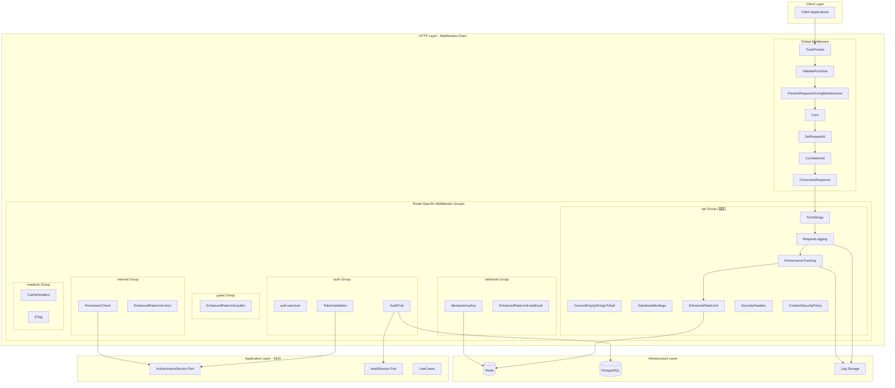
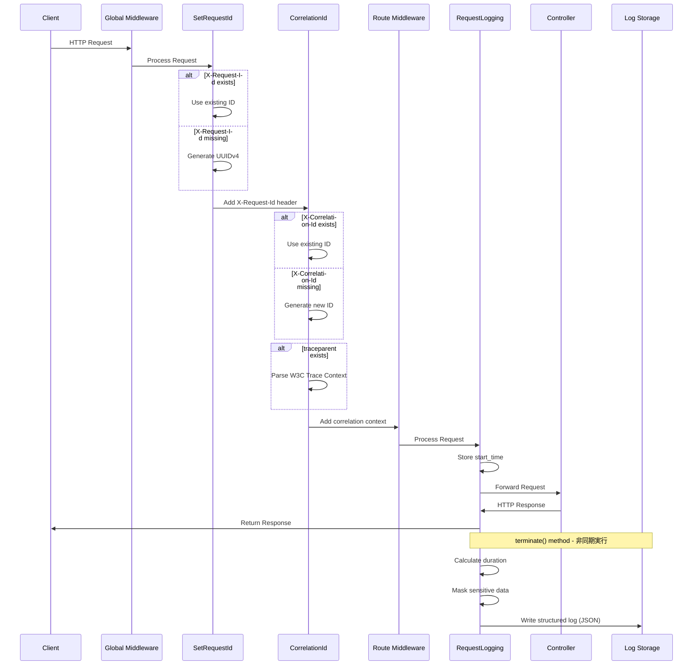
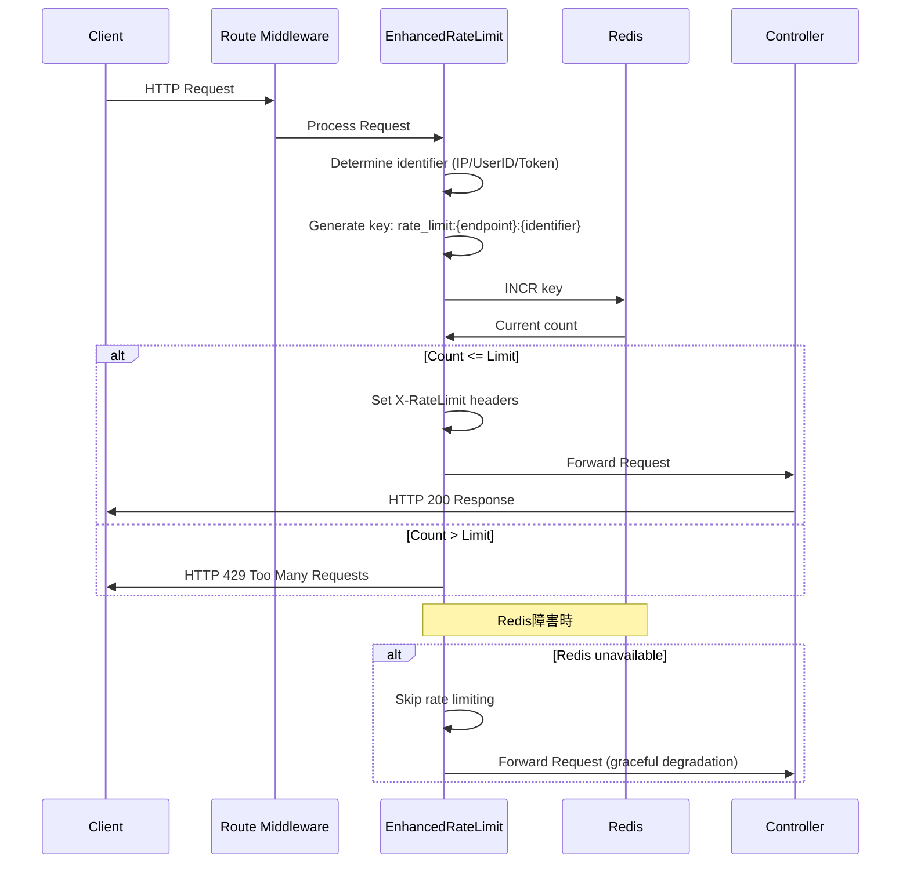
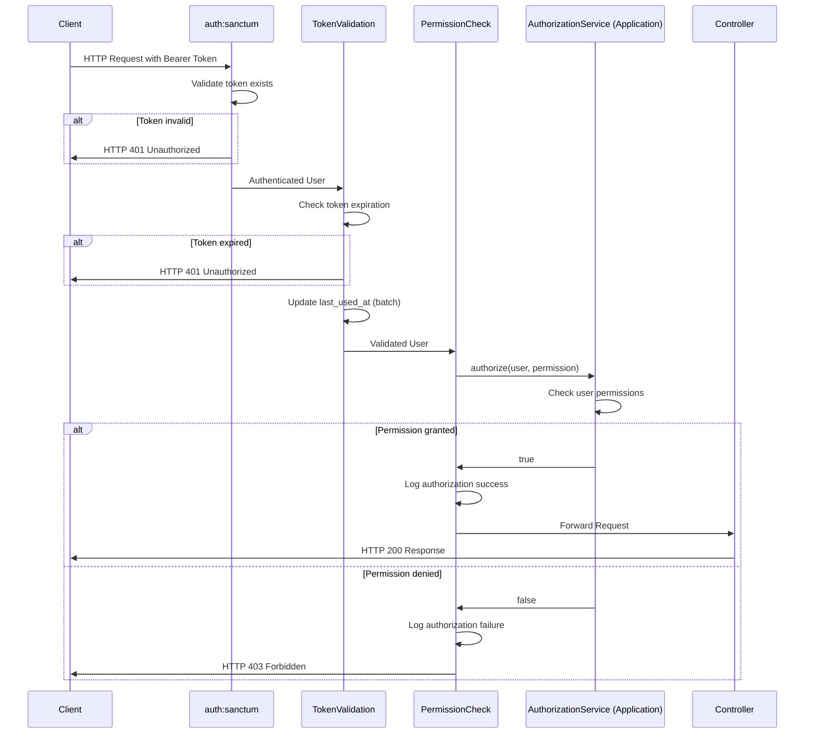
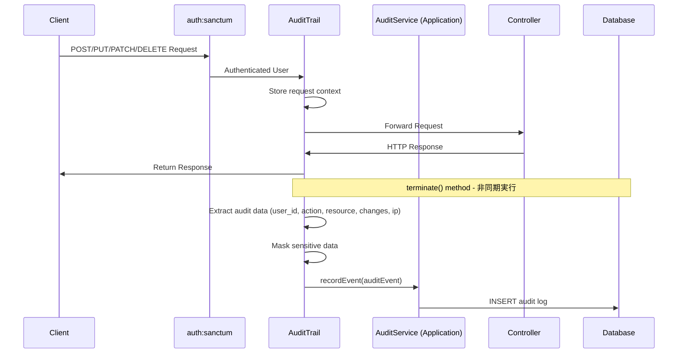
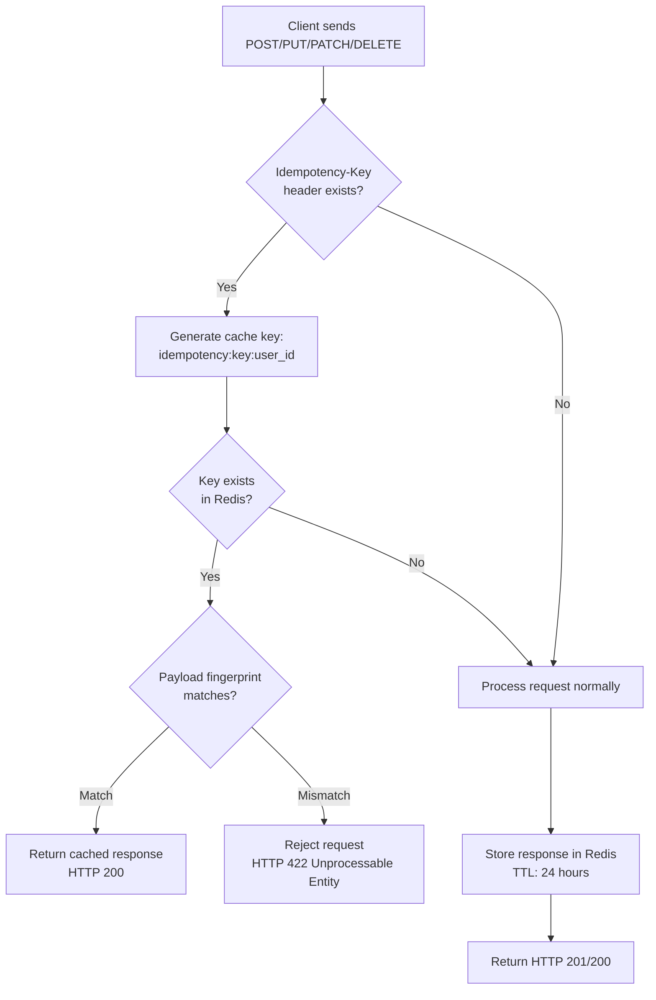
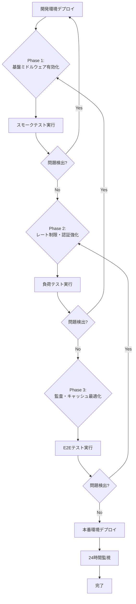

# Technical Design Document

## Overview

本機能は、Laravel Next.js B2C Application TemplateのAPI専用最適化Laravel 12バックエンドに、包括的な統一ミドルウェアスタックを確立します。既存のLaravel Sanctum認証、セキュリティヘッダー（CSP、CORS）、DDD/クリーンアーキテクチャとシームレスに統合し、認証・認可・ログ記録・レート制限・監査・キャッシュ制御などの横断的関心事を標準化します。

12種類のミドルウェアと6種類のミドルウェアグループにより、APIエンドポイントごとに最適な横断的機能を提供し、セキュリティ、パフォーマンス、可観測性を包括的に向上させます。HTTP層実装とApplication層DIによる適切な責務分離を実現し、既存のDDD 4層構造アーキテクチャ原則を遵守します。

**ターゲットユーザー:**
- **システム運用者**: 構造化ログとリクエストトレーシングによる問題の迅速な特定と解決
- **開発チーム**: パフォーマンスメトリクスによるボトルネック特定と継続的改善
- **セキュリティ担当者**: レート制限とトークン検証によるセキュリティ強化
- **コンプライアンス担当者**: 監査証跡による重要操作の追跡可能性確保
- **DevOps担当者**: 環境変数駆動設定による環境間移行の簡素化

**影響範囲:**
既存のLaravel APIバックエンドに12種類の新規ミドルウェアを追加し、既存ミドルウェア（Sanctum、SecurityHeaders、CSP、CORS）と統合します。全APIエンドポイントに対してミドルウェアチェーンが適用されるため、既存のルート定義とHTTPリクエストフローに影響を与えますが、DDD/クリーンアーキテクチャの責務分離原則を維持し、既存のDomain層とApplication層には影響を与えません。

### Goals

- **統一ミドルウェアスタック確立**: 12種類のミドルウェアによる横断的関心事の標準化
- **既存統合の完全性**: Sanctum、SecurityHeaders、CSP、CORSとのシームレスな統合
- **DDD/クリーンアーキテクチャ準拠**: HTTP層実装とApplication層DI による責務分離
- **可観測性向上**: 構造化ログ、リクエストトレーシング、パフォーマンスメトリクス収集
- **セキュリティ強化**: 動的レート制限、トークン詳細検証、権限ベースアクセス制御
- **パフォーマンス最適化**: キャッシュ制御、ETag、非同期処理によるレスポンス時間影響最小化（目標: 95%ile < 200ms）
- **テスト品質保証**: 単体テスト90%以上カバレッジ、統合テスト、E2Eテスト完備

### Non-Goals

- **フロントエンド（Next.js）ミドルウェア**: 別Issueで対応
- **データベーススキーマ変更**: 監査テーブル等は既存想定
- **外部監視サービス完全統合**: Grafana/Prometheus詳細設定は将来検討
- **OpenTelemetry完全統合**: 段階的導入は将来検討（現状はW3C Trace Context基本対応のみ）
- **Webミドルウェア**: セッション、Cookie等は既に削除済み（API専用設計）

## Architecture

### Existing Architecture Analysis

**現在のアーキテクチャパターン:**
- **DDD/クリーンアーキテクチャ 4層構造**: Domain → Application → Infrastructure → HTTP層の明確な分離
- **API専用最適化Laravel 12**: セッション除去、必要最小限4パッケージ構成（33.3%起動速度向上達成）
- **既存ミドルウェアチェーン**:
  - グローバル: `TrustProxies`, `ValidatePostSize`, `PreventRequestsDuringMaintenance`
  - CORS: `fruitcake/laravel-cors`統合（`config/cors.php`環境変数駆動）
  - セキュリティ: `SecurityHeaders`, `ContentSecurityPolicy`（Report-Only/Enforceモード対応）
  - 認証: Laravel Sanctum `auth:sanctum`（Personal Access Tokens、トークン有効期限管理）

**既存Domain境界:**
- **User集約**: `ddd/Domain/User/`（Entities、ValueObjects、Repository Interfaces、Events）
- **HTTP層**: `app/Http/`（Controllers、Middleware、Requests、Resources）
- **Application層ポート**: 今回新規に`AuthorizationService`、`AuditService`ポートを定義

**維持すべき統合ポイント:**
- **Sanctum認証フロー**: `auth:sanctum`ミドルウェアとの共存（TokenValidationは追加の詳細検証として動作）
- **SecurityHeaders/CSP**: 既存の`api`グループミドルウェアチェーンに統合
- **CORS**: グローバルミドルウェアチェーンでの実行順序維持
- **DDD層分離**: HTTP層のミドルウェアはApplication層ポート経由でDomain層にアクセス

### High-Level Architecture



**Architecture Integration:**

**既存パターン保持:**
- DDD 4層構造: Domain → Application → Infrastructure → HTTP層の依存方向維持
- HTTP層ミドルウェアはApplication層ポート（`AuthorizationService`、`AuditService`）を経由してDomain層にアクセス
- 既存のSanctum認証フロー（`auth:sanctum`）とセキュリティヘッダー（`SecurityHeaders`、`ContentSecurityPolicy`）を維持

**新規コンポーネント追加根拠:**
- **12種類のミドルウェア**: 横断的関心事（ログ、メトリクス、レート制限、認証認可、監査、キャッシュ）の標準化に必要
- **Application層ポート**: DDD/クリーンアーキテクチャ原則に従い、HTTP層からDomain層への直接依存を回避
- **設定ファイル3種**: 環境変数駆動設定による開発/本番環境の柔軟な切り替えに必要

**技術スタック整合性:**
- Laravel 12 API専用最適化構成を維持（セッション除去、必要最小限パッケージ）
- Redis（既存インフラ）をレート制限・Idempotencyキー・キャッシュに活用
- Monolog（Laravel標準）を構造化ログに使用
- Pest 4（既存テストフレームワーク）で90%以上カバレッジ達成

**Steering準拠:**
- `structure.md`: HTTP層配置（`app/Http/Middleware/`）、Application層DI、Domain層非依存
- `tech.md`: Laravel 12、PHP 8.4、Pest 4、Redis、PostgreSQL使用
- `product.md`: API専用最適化、セキュリティ強化、可観測性向上、パフォーマンス最適化

### Technology Alignment

本機能は既存のLaravel Next.js B2C Application Template技術スタックと完全に整合します。

**Backend (Laravel 12 API専用):**
- **言語**: PHP 8.4（既存プロジェクト標準）
- **フレームワーク**: Laravel 12 API専用最適化構成（セッション除去、4コアパッケージ維持）
- **認証**: Laravel Sanctum 4.0（既存、Personal Access Tokens）
- **ロギング**: Monolog（Laravel標準、構造化ログチャンネル追加）
- **テスト**: Pest 4（既存、Architecture Tests統合）
- **品質管理**: Laravel Pint、Larastan Level 8（既存）

**Infrastructure:**
- **キャッシュ/レート制限**: Redis（既存、ポート13379）
- **データベース**: PostgreSQL 17（既存、ポート13432、監査ログ保存）
- **コンテナ**: Docker Compose（既存、全サービス統合）
- **CI/CD**: GitHub Actions（既存、新規ワークフロー`.github/workflows/middleware-tests.yml`追加）

**新規導入依存関係:**
- **なし**: 既存の技術スタックのみで実装可能

**既存技術との整合性:**
- **DDD/クリーンアーキテクチャ**: HTTP層実装、Application層ポートDI
- **Sanctum統合**: `auth:sanctum`と`TokenValidation`の共存（追加の詳細検証）
- **SecurityHeaders統合**: 既存の`SecurityHeaders`、`ContentSecurityPolicy`を`api`グループに含める
- **CORS統合**: 既存の`fruitcake/laravel-cors`をグローバルミドルウェアチェーンに含める
- **環境変数駆動設定**: 既存の`config/cors.php`、`config/security.php`パターンを踏襲

### Key Design Decisions

#### Decision 1: ミドルウェアグループ化戦略

**Context:**
APIエンドポイントの特性（公開/認証必須/管理者限定/Webhook/読み取り専用）に応じて、異なる横断的機能セット（ログ、レート制限、認証、監査、キャッシュ）を適用する必要があります。各エンドポイントで個別にミドルウェアを指定すると、設定の重複と保守性の低下を招きます。

**Alternatives:**
1. **個別ミドルウェア指定**: 各ルートで必要なミドルウェアを個別に指定
2. **単一グローバルグループ**: 全エンドポイントに同一のミドルウェアセットを適用
3. **ミドルウェアグループ化**: エンドポイント特性別に6種類のグループ（api/auth/guest/internal/webhook/readonly）を定義

**Selected Approach:**
6種類のミドルウェアグループ（api/auth/guest/internal/webhook/readonly）を定義し、ルート定義で適切なグループを適用します。`api`グループを基底とし、他のグループは`api`を継承した上で追加のミドルウェアを適用します。

```php
// routes/api.php例
Route::middleware(['guest'])->group(function () {
    Route::post('/register', [UserController::class, 'register']);
});

Route::middleware(['auth'])->group(function () {
    Route::get('/user', [AuthController::class, 'user']);
});

Route::middleware(['internal'])->group(function () {
    Route::get('/admin/users', [AdminController::class, 'users']);
});
```

**Rationale:**
- **保守性向上**: エンドポイント特性に応じたミドルウェアセットを一箇所で管理
- **一貫性保証**: 同じ特性のエンドポイントは同じミドルウェアセットを適用
- **拡張性**: 新規エンドポイント追加時は適切なグループを選択するだけ
- **Laravel標準パターン**: Laravel 11以降の推奨ミドルウェアグループ化パターンに準拠

**Trade-offs:**
- **柔軟性低下**: エンドポイント個別のカスタマイズが必要な場合は追加設定が必要
- **学習コスト**: 6種類のグループの責務と適用条件を理解する必要がある
- **→ 受容可能**: 一般的なAPIエンドポイントパターンは6種類でカバー可能、例外的なケースは個別ミドルウェア追加で対応

#### Decision 2: Application層ポート統合（DDD/クリーンアーキテクチャ準拠）

**Context:**
権限検証（PermissionCheck）と監査証跡（AuditTrail）ミドルウェアは、ビジネスロジック（権限判定、監査イベント発火）をHTTP層から実行する必要があります。HTTP層から直接Domain層にアクセスすると、DDD/クリーンアーキテクチャの依存性逆転原則に違反します。

**Alternatives:**
1. **HTTP層から直接Domain層アクセス**: ミドルウェアから直接Domainサービスを呼び出し
2. **Application層UseCaseを経由**: 既存のUseCaseを再利用または新規UseCaseを作成
3. **Application層ポート（インターフェース）DI**: `AuthorizationService`、`AuditService`ポートを定義し、HTTP層でDI

**Selected Approach:**
Application層に`AuthorizationService`ポートと`AuditService`ポートを定義し、Infrastructure層で実装します。HTTP層のミドルウェアはコンストラクタインジェクションでポートを受け取り、ポート経由でビジネスロジックを実行します。

```php
// Application層ポート定義
interface AuthorizationService {
    public function authorize(User $user, string $permission): bool;
}

interface AuditService {
    public function recordEvent(AuditEvent $event): void;
}

// HTTP層ミドルウェア
class PermissionCheck {
    public function __construct(
        private readonly AuthorizationService $authorizationService
    ) {}

    public function handle(Request $request, Closure $next, string $permission) {
        if (!$this->authorizationService->authorize($request->user(), $permission)) {
            return response()->json(['error' => 'Forbidden'], 403);
        }
        return $next($request);
    }
}
```

**Rationale:**
- **DDD/クリーンアーキテクチャ準拠**: HTTP層はApplication層ポートに依存し、Domain層に直接依存しない
- **依存性逆転原則**: HTTP層（外側）がApplication層（内側）のインターフェースに依存
- **テスタビリティ向上**: ポートをモック化して単体テスト実行可能
- **責務分離**: ビジネスロジック（権限判定、監査）はApplication/Domain層、HTTP処理はHTTP層

**Trade-offs:**
- **実装複雑性増加**: ポート定義とInfrastructure層実装が必要
- **ファイル数増加**: インターフェースと実装の2ファイルが必要
- **→ 受容可能**: DDD/クリーンアーキテクチャの長期的な保守性向上が複雑性増加を上回る

#### Decision 3: 非同期ログ出力（`terminate`メソッド使用）

**Context:**
リクエストロギング（RequestLogging）、パフォーマンスメトリクス（PerformanceTracking）、監査証跡（AuditTrail）は、レスポンス時間に影響を与えずにログ出力する必要があります。同期的にログ出力すると、I/O待機時間がレスポンス時間に加算され、パフォーマンス目標（95%ile < 200ms）を達成できません。

**Alternatives:**
1. **同期ログ出力**: `handle`メソッド内でログ出力（シンプルだがレスポンス時間増加）
2. **キュー投入**: ログ出力をジョブキューに投入（高信頼性だが複雑性増加、インフラ依存）
3. **`terminate`メソッド使用**: レスポンス送信後に実行される`terminate`メソッドでログ出力

**Selected Approach:**
Laravelミドルウェアの`terminate`メソッドを使用し、レスポンス送信後に非同期でログ出力します。

```php
class RequestLogging {
    public function handle(Request $request, Closure $next): Response {
        $request->attributes->set('start_time', microtime(true));
        return $next($request);
    }

    public function terminate(Request $request, Response $response): void {
        $duration = microtime(true) - $request->attributes->get('start_time');
        Log::channel('middleware')->info('Request completed', [
            'request_id' => $request->header('X-Request-Id'),
            'duration_ms' => round($duration * 1000, 2),
            // ...
        ]);
    }
}
```

**Rationale:**
- **レスポンス時間影響最小化**: ログ出力はレスポンス送信後に実行されるため、クライアントのレスポンス時間に影響しない
- **Laravel標準機能**: `terminate`メソッドはLaravelミドルウェアの標準機能で追加依存なし
- **シンプルな実装**: キュー設定不要、ミドルウェア内で完結
- **信頼性**: PHPプロセス終了前に実行されるため、ログ出力の信頼性が高い

**Trade-offs:**
- **完全非同期ではない**: PHPプロセス終了まで待機するため、真の非同期（バックグラウンドジョブ）ではない
- **高負荷時のPHPプロセス保持**: `terminate`メソッド実行中はPHPプロセスが保持される
- **→ 受容可能**: ログ出力は高速（5ms未満目標）、パフォーマンス目標（95%ile < 200ms）達成に十分

## System Flows

### リクエストトレーシングとロギングフロー



### 動的レート制限フロー



### 権限ベースアクセス制御フロー



### 監査証跡記録フロー



### Idempotency保証フロー



## Requirements Traceability

| Requirement | Components | Interfaces | Flows |
|-------------|------------|------------|-------|
| 1.1-1.12 リクエストトレーシング | SetRequestId, CorrelationId, RequestLogging | Middleware::handle/terminate | リクエストトレーシングフロー |
| 2.1-2.8 パフォーマンスメトリクス | PerformanceTracking | Middleware::handle/terminate | - |
| 3.1-3.11 動的レート制限 | EnhancedRateLimit | Middleware::handle, Redis | 動的レート制限フロー |
| 4.1-4.7 Sanctumトークン検証 | TokenValidation | Middleware::handle | 権限ベースアクセス制御フロー |
| 5.1-5.7 権限ベースアクセス制御 | PermissionCheck | AuthorizationService port | 権限ベースアクセス制御フロー |
| 6.1-6.7 監査証跡 | AuditTrail | AuditService port, Middleware::terminate | 監査証跡記録フロー |
| 7.1-7.8 Idempotency保証 | IdempotencyKey | Middleware::handle, Redis | Idempotency保証フロー |
| 8.1-8.7 キャッシュ制御 | CacheHeaders | Middleware::handle | - |
| 9.1-9.7 ETag条件付きGET | ETag | Middleware::handle | - |
| 10.1-10.5 JSON強制 | ForceJsonResponse | Middleware::handle | - |
| 11.1-11.12 ミドルウェアグループ化 | MiddlewareGroups | bootstrap/app.php | - |
| 12.1-12.4 グローバルミドルウェア | GlobalMiddleware | bootstrap/app.php | - |
| 13.1-13.6 環境変数駆動設定 | config/middleware.php, config/ratelimit.php, config/monitoring.php | - | - |
| 14.1-14.8 テスト環境 | tests/Unit/Middleware/, tests/Feature/Middleware/, e2e/ | Pest, Playwright | - |
| 15.1-15.6 DDD統合 | Application層ポート | AuthorizationService, AuditService | - |
| 16.1-16.5 既存ミドルウェア統合 | Sanctum, SecurityHeaders, CSP, CORS | Middleware chain order | - |
| 17.1-17.4 ドキュメント | docs/middleware-implementation-guide.md, docs/middleware-operation-manual.md | - | - |

## Components and Interfaces

### リクエストトレーシング・ロギング層

#### SetRequestId

**Responsibility & Boundaries**
- **Primary Responsibility**: 全てのAPIリクエストに一意なリクエストIDを付与し、分散システム全体でリクエストを追跡可能にする
- **Domain Boundary**: HTTP層（横断的関心事）
- **Data Ownership**: リクエストID（UUIDv4形式）の生成と管理
- **Transaction Boundary**: 単一リクエスト内のみ有効（レスポンス送信後は無効）

**Dependencies**
- **Inbound**: 全てのHTTPリクエスト（グローバルミドルウェア）
- **Outbound**: Laravelログコンテキスト、次のミドルウェア
- **External**: Ramsey UUID ライブラリ（Laravel標準、`Ramsey\Uuid\Uuid::uuid4()`）

**Contract Definition**

```typescript
interface SetRequestIdMiddleware {
  // Laravelミドルウェアインターフェース
  handle(request: Request, next: Closure): Response;
}

// Input
interface Request {
  headers: {
    'X-Request-Id'?: string; // オプション: クライアント提供のリクエストID
  };
}

// Output
interface Response {
  headers: {
    'X-Request-Id': string; // 必須: 生成または継承したリクエストID
  };
}
```

**Preconditions**: なし（全てのHTTPリクエストに適用）
**Postconditions**:
- `X-Request-Id`ヘッダーがリクエストとレスポンスの両方に設定される
- ログコンテキストに`request_id`が追加される
**Invariants**: リクエストIDは一意であり、UUIDv4形式に準拠する

#### CorrelationId

**Responsibility & Boundaries**
- **Primary Responsibility**: 分散トレーシング対応のCorrelation IDとW3C Trace Contextを継承・生成し、マイクロサービス間のリクエスト追跡を可能にする
- **Domain Boundary**: HTTP層（横断的関心事）
- **Data Ownership**: Correlation ID、W3C Trace Context（traceparent）の管理
- **Transaction Boundary**: 分散システム全体（複数サービス間で共有）

**Dependencies**
- **Inbound**: SetRequestId後の全HTTPリクエスト
- **Outbound**: Laravelログコンテキスト、次のミドルウェア
- **External**: なし（UUIDv4生成はLaravel標準ライブラリ）

**Contract Definition**

```typescript
interface CorrelationIdMiddleware {
  handle(request: Request, next: Closure): Response;
}

// Input
interface Request {
  headers: {
    'X-Correlation-Id'?: string; // オプション: 上流サービス提供のCorrelation ID
    'traceparent'?: string; // オプション: W3C Trace Context
  };
}

// Output
interface Response {
  headers: {
    'X-Correlation-Id': string; // 必須: 生成または継承したCorrelation ID
    'traceparent'?: string; // 条件付き: W3C Trace Contextが存在する場合
  };
}
```

**Preconditions**: SetRequestIdミドルウェアが実行済み
**Postconditions**:
- `X-Correlation-Id`ヘッダーがリクエストとレスポンスに設定される
- W3C Trace Contextが存在する場合は継承される
- ログコンテキストに`correlation_id`が追加される
**Invariants**: Correlation IDは分散システム全体で一意

#### RequestLogging

**Responsibility & Boundaries**
- **Primary Responsibility**: 全てのAPIリクエストとレスポンスをJSON構造化ログとして記録し、運用時のトラブルシューティングを支援する
- **Domain Boundary**: HTTP層（横断的関心事）
- **Data Ownership**: リクエスト/レスポンスのログデータ（request_id、method、url、status、duration_ms等）
- **Transaction Boundary**: 単一リクエスト内のみ有効

**Dependencies**
- **Inbound**: 全てのHTTPリクエスト（`api`グループミドルウェア）
- **Outbound**: Monologログチャンネル（`middleware`）
- **External**: Monolog（Laravel標準ロギングライブラリ）

**Contract Definition**

```typescript
interface RequestLoggingMiddleware {
  handle(request: Request, next: Closure): Response;
  terminate(request: Request, response: Response): void; // 非同期ログ出力
}

// Logged Data Structure
interface StructuredLog {
  request_id: string;
  correlation_id?: string;
  user_id?: number;
  method: string; // GET, POST, PUT, PATCH, DELETE
  url: string;
  status: number; // HTTP status code
  duration_ms: number; // マイクロ秒精度で測定
  ip: string;
  user_agent: string;
  timestamp: string; // ISO 8601形式
}
```

**Preconditions**: SetRequestId、CorrelationIdミドルウェアが実行済み
**Postconditions**:
- リクエスト処理完了後、構造化ログが`middleware`チャンネルに出力される
- 機密データ（パスワード、トークン等）は自動的にマスキングされる
**Invariants**: ログ出力はレスポンス送信後（`terminate`メソッド）に実行され、レスポンス時間に影響しない

### パフォーマンス監視層

#### PerformanceTracking

**Responsibility & Boundaries**
- **Primary Responsibility**: APIリクエストのパフォーマンスメトリクス（レスポンス時間、メモリ使用量、DBクエリ数）をリアルタイムで収集し、ボトルネック特定を支援する
- **Domain Boundary**: HTTP層（横断的関心事）
- **Data Ownership**: パフォーマンスメトリクスデータ
- **Transaction Boundary**: 単一リクエスト内のみ有効

**Dependencies**
- **Inbound**: 全てのHTTPリクエスト（`api`グループミドルウェア）
- **Outbound**: Monologログチャンネル（`monitoring`）
- **External**: Monolog、Laravel Database Query Event Listener

**Contract Definition**

```typescript
interface PerformanceTrackingMiddleware {
  handle(request: Request, next: Closure): Response;
  terminate(request: Request, response: Response): void; // 非同期メトリクス収集
}

// Performance Metrics Structure
interface PerformanceMetrics {
  request_id: string;
  duration_ms: number; // マイクロ秒精度
  memory_peak_mb: number; // memory_get_peak_usage()
  db_query_count: number;
  timestamp: string;
  alert?: boolean; // duration_ms > threshold (デフォルト: 200ms)
}
```

**Preconditions**: SetRequestIdミドルウェアが実行済み
**Postconditions**:
- パフォーマンスメトリクスが`monitoring`チャンネルに出力される
- レスポンス時間が閾値超過時、アラートログが記録される
**Invariants**: メトリクス収集処理自体のレスポンス時間への影響は5ms未満

### レート制限・API保護層

#### EnhancedRateLimit

**Responsibility & Boundaries**
- **Primary Responsibility**: APIエンドポイントごとに動的なレート制限を適用し、ブルートフォース攻撃やDDoS攻撃からシステムを保護する
- **Domain Boundary**: HTTP層（セキュリティ横断的関心事）
- **Data Ownership**: レート制限カウンター（Redisキー: `rate_limit:{endpoint}:{identifier}`）
- **Transaction Boundary**: 単一リクエスト内のみ有効

**Dependencies**
- **Inbound**: 全てのHTTPリクエスト（`api`グループミドルウェア、エンドポイント別設定）
- **Outbound**: Redis（レート制限カウンター保存）、次のミドルウェア
- **External**: Redis（ポート13379、既存インフラ）

**External Dependencies Investigation:**
- **Redis**: Laravel標準キャッシュドライバー、`Illuminate\Support\Facades\Cache`使用
- **API**: `Cache::increment(key, amount)`, `Cache::put(key, value, ttl)`
- **バージョン互換性**: Laravel 12標準、Redis 7-alpine（既存環境）
- **設定**: `config/cache.php`で`redis`ストア設定済み
- **フォールバック**: Redisダウン時はレート制限をスキップ（`Cache::connection()->getRedis()->ping()`でヘルスチェック）

**Contract Definition**

```typescript
interface EnhancedRateLimitMiddleware {
  handle(request: Request, next: Closure, identifier: string): Response;
}

// Rate Limit Configuration (config/ratelimit.php)
interface RateLimitConfig {
  endpoints: {
    login: { requests: 5; per_minute: 1; by: 'ip' };
    api: { requests: 1000; per_minute: 1; by: 'user' };
    public: { requests: 100; per_minute: 1; by: 'ip' };
    internal: { requests: 5000; per_minute: 1; by: 'user' };
    webhook: { requests: 200; per_minute: 1; by: 'token' };
  };
  cache: {
    store: 'redis';
    prefix: 'rate_limit';
  };
}

// Response Headers
interface RateLimitHeaders {
  'X-RateLimit-Limit': number;
  'X-RateLimit-Remaining': number;
  'X-RateLimit-Reset': number; // Unix timestamp
}
```

**Preconditions**: Redisサービスが利用可能（ダウン時はスキップ）
**Postconditions**:
- レート制限カウンターがRedisに記録される
- レート制限ヘッダー（`X-RateLimit-*`）がレスポンスに設定される
- レート制限超過時、HTTP 429ステータスコードを返す
**Invariants**: レート制限キー形式は`rate_limit:{endpoint}:{identifier}`に統一

### 認証・認可層

#### TokenValidation

**Responsibility & Boundaries**
- **Primary Responsibility**: Laravel Sanctumトークンの有効期限とライフサイクルを詳細に検証し、トークンベース認証のセキュリティを強化する
- **Domain Boundary**: HTTP層（セキュリティ横断的関心事）
- **Data Ownership**: トークン検証結果、`last_used_at`タイムスタンプ更新
- **Transaction Boundary**: 単一リクエスト内のみ有効

**Dependencies**
- **Inbound**: `auth:sanctum`ミドルウェア後の認証必須エンドポイント
- **Outbound**: Laravel Sanctum Personal Access Tokenモデル、次のミドルウェア
- **External**: Laravel Sanctum 4.0（既存）

**Contract Definition**

```typescript
interface TokenValidationMiddleware {
  handle(request: Request, next: Closure): Response;
}

// Input: Sanctum認証済みリクエスト
interface AuthenticatedRequest {
  user: User; // Sanctum認証済みユーザー
  bearerToken(): string; // Sanctumトークン
}

// Token Validation Checks
interface TokenValidation {
  checkExpiration(token: PersonalAccessToken): boolean; // SANCTUM_EXPIRATION設定値と比較
  checkAbilities(token: PersonalAccessToken, requiredAbilities: string[]): boolean;
  updateLastUsedAt(token: PersonalAccessToken): void; // バッチ更新
}
```

**Preconditions**: `auth:sanctum`ミドルウェアが実行済み（ユーザー認証完了）
**Postconditions**:
- トークン有効期限が検証される
- 有効期限切れ時、HTTP 401ステータスコードを返す
- 有効トークンの`last_used_at`が更新される
**Invariants**: 既存の`auth:sanctum`認証フローを変更せず、追加の詳細検証として動作

#### PermissionCheck

**Responsibility & Boundaries**
- **Primary Responsibility**: ユーザーの権限に基づいたきめ細かなアクセス制御を実現し、最小権限の原則を適用する
- **Domain Boundary**: HTTP層（セキュリティ横断的関心事）、Application層ポート経由でDomain層にアクセス
- **Data Ownership**: 権限検証結果のログ
- **Transaction Boundary**: 単一リクエスト内のみ有効

**Dependencies**
- **Inbound**: `auth:sanctum`、`TokenValidation`後の権限必須エンドポイント
- **Outbound**: Application層`AuthorizationService`ポート、次のミドルウェア
- **External**: なし（Application層ポート経由でDomain層にアクセス）

**Contract Definition**

```typescript
interface PermissionCheckMiddleware {
  handle(request: Request, next: Closure, permission: string): Response;
}

// Application Layer Port (DDD/クリーンアーキテクチャ準拠)
interface AuthorizationService {
  /**
   * ユーザーが指定された権限を持つか検証
   * @param user 認証済みユーザー
   * @param permission 要求権限（例: 'admin', 'user.read', 'user.write'）
   * @returns 権限あり: true、権限なし: false
   */
  authorize(user: User, permission: string): boolean;
}

// Error Response
interface ForbiddenResponse {
  status: 403;
  body: {
    error: 'Forbidden';
    message: string; // "Permission denied: {permission}"
  };
}
```

**Preconditions**: ユーザーが認証済み（`auth:sanctum`、`TokenValidation`実行済み）
**Postconditions**:
- Application層`AuthorizationService`ポート経由で権限検証が実行される
- 権限あり: 次のミドルウェアにリクエストを転送
- 権限なし: HTTP 403ステータスコードを返す
**Invariants**: DDD/クリーンアーキテクチャの依存性逆転原則に準拠（HTTP層がApplication層ポートに依存）

### 監査・コンプライアンス層

#### AuditTrail

**Responsibility & Boundaries**
- **Primary Responsibility**: 重要な操作（POST/PUT/PATCH/DELETE）の監査証跡を自動的に記録し、セキュリティインシデント調査とコンプライアンス要件の遵守を支援する
- **Domain Boundary**: HTTP層（コンプライアンス横断的関心事）、Application層ポート経由でDomain層にアクセス
- **Data Ownership**: 監査イベントデータ（user_id、action、resource、changes、ip、timestamp）
- **Transaction Boundary**: 単一リクエスト内のみ有効

**Dependencies**
- **Inbound**: `auth:sanctum`、`TokenValidation`後のデータ変更操作（POST/PUT/PATCH/DELETE）
- **Outbound**: Application層`AuditService`ポート、PostgreSQL（監査ログ保存）
- **External**: PostgreSQL（既存インフラ、ポート13432）

**Contract Definition**

```typescript
interface AuditTrailMiddleware {
  handle(request: Request, next: Closure): Response;
  terminate(request: Request, response: Response): void; // 非同期監査ログ記録
}

// Application Layer Port (DDD/クリーンアーキテクチャ準拠)
interface AuditService {
  /**
   * 監査イベントを記録
   * @param event 監査イベントデータ
   */
  recordEvent(event: AuditEvent): void;
}

// Audit Event Data
interface AuditEvent {
  user_id: number;
  action: string; // 'create', 'update', 'delete'
  resource: string; // 'User', 'Order', etc.
  changes: Record<string, unknown>; // 変更前後の差分（機密データマスキング済み）
  ip: string;
  timestamp: string; // ISO 8601形式
}
```

**Preconditions**: ユーザーが認証済み、データ変更操作（POST/PUT/PATCH/DELETE）
**Postconditions**:
- Application層`AuditService`ポート経由で監査イベントが記録される
- 監査ログはPostgreSQLに永続化される
- 機密データは自動的にマスキングされる
**Invariants**: GETリクエスト（読み取り専用操作）は監査対象外

### Idempotency・外部連携層

#### IdempotencyKey

**Responsibility & Boundaries**
- **Primary Responsibility**: `Idempotency-Key`ヘッダーによる冪等性を保証し、ネットワーク障害やリトライによる重複処理を防止する
- **Domain Boundary**: HTTP層（外部連携横断的関心事）
- **Data Ownership**: Idempotencyキー→レスポンスのマッピング（Redisキャッシュ）
- **Transaction Boundary**: 24時間（TTL）

**Dependencies**
- **Inbound**: Webhookエンドポイント、外部システム連携エンドポイント
- **Outbound**: Redis（Idempotencyキャッシュ保存）、次のミドルウェア
- **External**: Redis（既存インフラ、ポート13379）

**Contract Definition**

```typescript
interface IdempotencyKeyMiddleware {
  handle(request: Request, next: Closure): Response;
}

// Input
interface IdempotentRequest {
  method: 'POST' | 'PUT' | 'PATCH' | 'DELETE';
  headers: {
    'Idempotency-Key': string; // クライアント提供の一意キー
  };
  body: Record<string, unknown>;
}

// Cache Key Format
type CacheKey = `idempotency:${string}:${number}`; // idempotency:{key}:{user_id}

// Payload Fingerprint
type PayloadFingerprint = string; // SHA256ハッシュ

// Response Scenarios
type IdempotentResponse =
  | { status: 200; body: unknown; cached: true } // キャッシュヒット（2回目以降）
  | { status: 201; body: unknown; cached: false } // 初回処理成功
  | { status: 422; body: { error: 'Idempotency key conflict' } }; // ペイロード不一致
```

**Preconditions**: クライアントが`Idempotency-Key`ヘッダーを送信
**Postconditions**:
- 同一キーでの2回目以降のリクエストは、キャッシュ済みレスポンスを返却
- ペイロード指紋が異なる場合、HTTP 422ステータスコードを返す
- キャッシュTTLは24時間
**Invariants**: Idempotencyキー形式は`idempotency:{key}:{user_id}`に統一

### キャッシュ最適化層

#### CacheHeaders

**Responsibility & Boundaries**
- **Primary Responsibility**: GETエンドポイントに適切な`Cache-Control`と`Expires`ヘッダーを設定し、クライアント側キャッシングとCDN効率を最大化する
- **Domain Boundary**: HTTP層（パフォーマンス横断的関心事）
- **Data Ownership**: キャッシュ制御ヘッダー設定
- **Transaction Boundary**: 単一リクエスト内のみ有効

**Dependencies**
- **Inbound**: `readonly`グループミドルウェアの読み取り専用エンドポイント（GETのみ）
- **Outbound**: 次のミドルウェア
- **External**: なし

**Contract Definition**

```typescript
interface CacheHeadersMiddleware {
  handle(request: Request, next: Closure): Response;
}

// Configuration (config/middleware.php)
interface CacheHeadersConfig {
  enabled: boolean; // 環境変数: CACHE_HEADERS_ENABLED
  ttl: Record<string, number>; // エンドポイント別TTL（秒）
}

// Response Headers
interface CacheHeaders {
  'Cache-Control': string; // 開発: 'no-cache', 本番: 'public, max-age={ttl}'
  'Expires': string; // GMT形式の日時
}
```

**Preconditions**: GETリクエスト（POST/PUT/PATCH/DELETEは対象外）
**Postconditions**:
- 開発環境: `Cache-Control: no-cache`
- 本番環境: `Cache-Control: public, max-age={ttl}`と`Expires`ヘッダー
**Invariants**: エンドポイント別TTL設定は`config/middleware.php`で管理

#### ETag

**Responsibility & Boundaries**
- **Primary Responsibility**: ETagヘッダーと条件付きGETリクエストをサポートし、帯域幅を削減し、クライアント側のキャッシュ効率を向上させる
- **Domain Boundary**: HTTP層（パフォーマンス横断的関心事）
- **Data Ownership**: ETagヘッダー生成（SHA256ハッシュ）
- **Transaction Boundary**: 単一リクエスト内のみ有効

**Dependencies**
- **Inbound**: `readonly`グループミドルウェアの読み取り専用エンドポイント（GETのみ）
- **Outbound**: 次のミドルウェア
- **External**: なし（PHP標準`hash`関数使用）

**Contract Definition**

```typescript
interface ETagMiddleware {
  handle(request: Request, next: Closure): Response;
}

// Input
interface ConditionalRequest {
  method: 'GET';
  headers: {
    'If-None-Match'?: string; // クライアント保持のETag
  };
}

// Output
interface ETagResponse {
  status: 200 | 304;
  headers: {
    'ETag': string; // SHA256ハッシュ
  };
  body?: unknown; // 304時はnull
}
```

**Preconditions**: GETリクエスト、レスポンスボディサイズ < 1MB
**Postconditions**:
- レスポンスボディからSHA256ハッシュのETagを生成
- クライアントの`If-None-Match`がETagと一致: HTTP 304（ボディなし）
- 不一致: HTTP 200（完全なレスポンスボディ）
**Invariants**: ETag生成処理のレスポンス時間への影響は10ms未満

### JSON API標準化層

#### ForceJsonResponse

**Responsibility & Boundaries**
- **Primary Responsibility**: 全てのAPIエンドポイントでJSON形式の入出力を強制し、API仕様の一貫性を保証する
- **Domain Boundary**: HTTP層（API標準化横断的関心事）
- **Data Ownership**: なし（リクエスト/レスポンス形式の検証のみ）
- **Transaction Boundary**: 単一リクエスト内のみ有効

**Dependencies**
- **Inbound**: 全てのHTTPリクエスト（グローバルミドルウェア）
- **Outbound**: 次のミドルウェア
- **External**: なし

**Contract Definition**

```typescript
interface ForceJsonResponseMiddleware {
  handle(request: Request, next: Closure): Response;
}

// Request Validation
interface JsonRequest {
  headers: {
    'Accept': 'application/json'; // 必須
    'Content-Type'?: 'application/json'; // POST/PUT/PATCH時必須
  };
}

// Error Responses
type JsonError =
  | { status: 406; body: { error: 'Not Acceptable' } } // Accept不正
  | { status: 415; body: { error: 'Unsupported Media Type' } }; // Content-Type不正
```

**Preconditions**: なし
**Postconditions**:
- `Accept: application/json`以外のリクエストは拒否（HTTP 406）
- POST/PUT/PATCHで`Content-Type: application/json`以外は拒否（HTTP 415）
- 全てのエラー応答もJSON形式
**Invariants**: API仕様の一貫性を保証（全エンドポイントでJSON形式強制）

## Data Models

### Configuration Models

**config/middleware.php（新規）:**
```php
return [
    // キャッシュヘッダー設定
    'cache' => [
        'enabled' => env('CACHE_HEADERS_ENABLED', false),
        'ttl' => [
            '/api/health' => 60, // 60秒
            '/api/user' => 300,  // 5分
        ],
    ],

    // 共通設定
    'log_rotation_days' => 30,
    'sensitive_fields' => ['password', 'token', 'secret'],
];
```

**config/ratelimit.php（新規）:**
```php
return [
    'endpoints' => [
        'login' => [
            'requests' => 5,
            'per_minute' => 1,
            'by' => 'ip',
        ],
        'api' => [
            'requests' => 1000,
            'per_minute' => 1,
            'by' => 'user',
        ],
        'public' => [
            'requests' => 100,
            'per_minute' => 1,
            'by' => 'ip',
        ],
        'internal' => [
            'requests' => 5000,
            'per_minute' => 1,
            'by' => 'user',
        ],
        'webhook' => [
            'requests' => 200,
            'per_minute' => 1,
            'by' => 'token',
        ],
    ],
    'cache' => [
        'store' => 'redis',
        'prefix' => 'rate_limit',
    ],
];
```

**config/monitoring.php（新規）:**
```php
return [
    'metrics' => [
        'response_time' => [
            'percentiles' => [50, 90, 95, 99],
            'alert_threshold' => 200, // ms
        ],
    ],
];
```

**config/logging.php（拡張）:**
```php
'channels' => [
    'middleware' => [
        'driver' => 'daily',
        'path' => storage_path('logs/middleware.log'),
        'level' => 'info',
        'days' => 30,
    ],
    'monitoring' => [
        'driver' => 'daily',
        'path' => storage_path('logs/monitoring.log'),
        'level' => 'info',
        'days' => 30,
    ],
],
```

### Application Layer Ports (Interfaces)

**AuthorizationService Interface:**
```php
namespace Ddd\Application\User\Services;

use App\Models\User;

interface AuthorizationService
{
    /**
     * ユーザーが指定された権限を持つか検証
     *
     * @param User $user 認証済みユーザー
     * @param string $permission 要求権限（例: 'admin', 'user.read'）
     * @return bool 権限あり: true、権限なし: false
     */
    public function authorize(User $user, string $permission): bool;
}
```

**AuditService Interface:**
```php
namespace Ddd\Application\User\Services;

interface AuditService
{
    /**
     * 監査イベントを記録
     *
     * @param array{
     *   user_id: int,
     *   action: string,
     *   resource: string,
     *   changes: array<string, mixed>,
     *   ip: string,
     *   timestamp: string
     * } $event 監査イベントデータ
     * @return void
     */
    public function recordEvent(array $event): void;
}
```

### Infrastructure Layer Implementations

**EloquentAuthorizationService（実装例）:**
```php
namespace Ddd\Infrastructure\Persistence\Services;

use Ddd\Application\User\Services\AuthorizationService;
use App\Models\User;

class EloquentAuthorizationService implements AuthorizationService
{
    public function authorize(User $user, string $permission): bool
    {
        // Sanctum Abilities統合
        if ($user->tokenCan($permission)) {
            return true;
        }

        // カスタム権限チェックロジック
        // 例: $user->hasPermission($permission)

        return false;
    }
}
```

**EloquentAuditService（実装例）:**
```php
namespace Ddd\Infrastructure\Persistence\Services;

use Ddd\Application\User\Services\AuditService;
use Illuminate\Support\Facades\DB;

class EloquentAuditService implements AuditService
{
    public function recordEvent(array $event): void
    {
        DB::table('audit_logs')->insert([
            'user_id' => $event['user_id'],
            'action' => $event['action'],
            'resource' => $event['resource'],
            'changes' => json_encode($event['changes']),
            'ip' => $event['ip'],
            'created_at' => $event['timestamp'],
        ]);
    }
}
```

## Error Handling

### Error Strategy

本ミドルウェアスタックは、Laravel標準のエラーハンドリング機構を活用し、各ミドルウェアで発生するエラーを適切に分類して処理します。

**基本方針:**
- **User Errors (4xx)**: クライアント起因のエラー（不正なリクエスト、認証失敗、権限不足）は、明確なエラーメッセージとともに適切なHTTPステータスコードを返す
- **System Errors (5xx)**: システム起因のエラー（Redis障害、DB障害）は、graceful degradationでサービス継続性を優先し、詳細なエラーログを記録
- **Business Logic Errors (422)**: ビジネスルール違反（Idempotencyキー競合）は、エラー理由を明示してクライアントに返す

### Error Categories and Responses

#### User Errors (4xx)

**HTTP 401 Unauthorized - トークン認証失敗:**
- **発生ミドルウェア**: TokenValidation
- **原因**: トークン有効期限切れ、無効トークン
- **Response**:
```json
{
  "error": "Unauthorized",
  "message": "Token expired or invalid"
}
```
- **Recovery**: クライアントは再ログインしてトークン再取得

**HTTP 403 Forbidden - 権限不足:**
- **発生ミドルウェア**: PermissionCheck
- **原因**: ユーザーが必要な権限を持たない
- **Response**:
```json
{
  "error": "Forbidden",
  "message": "Permission denied: admin"
}
```
- **Recovery**: クライアントは権限のある別のユーザーでログイン

**HTTP 406 Not Acceptable - Acceptヘッダー不正:**
- **発生ミドルウェア**: ForceJsonResponse
- **原因**: `Accept: application/json`以外のヘッダー
- **Response**:
```json
{
  "error": "Not Acceptable",
  "message": "This endpoint only supports application/json"
}
```
- **Recovery**: クライアントは`Accept: application/json`ヘッダーを設定

**HTTP 415 Unsupported Media Type - Content-Type不正:**
- **発生ミドルウェア**: ForceJsonResponse
- **原因**: POST/PUT/PATCHで`Content-Type: application/json`以外
- **Response**:
```json
{
  "error": "Unsupported Media Type",
  "message": "Request body must be application/json"
}
```
- **Recovery**: クライアントは`Content-Type: application/json`ヘッダーとJSON形式ボディを送信

**HTTP 429 Too Many Requests - レート制限超過:**
- **発生ミドルウェア**: EnhancedRateLimit
- **原因**: 設定されたレート制限を超過
- **Response**:
```json
{
  "error": "Too Many Requests",
  "message": "Rate limit exceeded. Try again in 60 seconds.",
  "retry_after": 60
}
```
- **Response Headers**: `X-RateLimit-Limit`, `X-RateLimit-Remaining: 0`, `X-RateLimit-Reset`
- **Recovery**: クライアントは`X-RateLimit-Reset`時刻まで待機してリトライ

#### System Errors (5xx)

**Redis障害時の Graceful Degradation:**
- **影響ミドルウェア**: EnhancedRateLimit、IdempotencyKey
- **対応**: レート制限とIdempotencyチェックをスキップし、サービス継続性を優先
- **ログ**: `Log::warning('Redis unavailable, skipping rate limit')`
- **アラート**: 運用チームにRedis障害アラート送信

**データベース障害時:**
- **影響ミドルウェア**: AuditTrail
- **対応**: 監査ログ記録をスキップし、リクエスト処理を継続
- **ログ**: `Log::error('Failed to record audit event', ['exception' => $e])`
- **アラート**: 運用チームにDB障害アラート送信

**ログ出力障害時:**
- **影響ミドルウェア**: RequestLogging、PerformanceTracking
- **対応**: ログ出力をスキップし、リクエスト処理を継続
- **フォールバック**: 標準エラーログにエラー記録

#### Business Logic Errors (422)

**HTTP 422 Unprocessable Entity - Idempotencyキー競合:**
- **発生ミドルウェア**: IdempotencyKey
- **原因**: 同じIdempotency-Keyで異なるペイロードを送信
- **Response**:
```json
{
  "error": "Unprocessable Entity",
  "message": "Idempotency key conflict: payload mismatch"
}
```
- **Recovery**: クライアントは新しいIdempotency-Keyを生成してリトライ

### Monitoring

**エラー追跡:**
- 全てのエラーは`request_id`と`correlation_id`とともにログに記録
- エラー発生ミドルウェア、エラー種別、エラーメッセージを構造化ログとして記録

**ログ形式:**
```json
{
  "level": "error",
  "request_id": "550e8400-e29b-41d4-a716-446655440000",
  "correlation_id": "660e8400-e29b-41d4-a716-446655440001",
  "middleware": "EnhancedRateLimit",
  "error_type": "RateLimitExceeded",
  "message": "Rate limit exceeded for endpoint /api/login",
  "ip": "192.0.2.1",
  "timestamp": "2025-10-20T04:45:00Z"
}
```

**ヘルスモニタリング:**
- Redis障害、DB障害の検出と運用チームへのアラート送信
- レート制限超過率の監視（閾値: 10%超過でアラート）
- パフォーマンスメトリクス閾値超過の監視（P95 > 200msでアラート）

## Testing Strategy

### Unit Tests

**テスト対象**: 各ミドルウェアの個別動作検証（12ミドルウェア）

**テストファイル**: `tests/Unit/Middleware/`

**カバレッジ目標**: 90%以上

**主要テストケース:**

**SetRequestIdTest.php:**
- リクエストID生成（UUIDv4形式検証）
- 既存リクエストIDの継承
- レスポンスヘッダー設定検証
- ログコンテキスト追加検証

**CorrelationIdTest.php:**
- Correlation ID生成
- 既存Correlation IDの継承
- W3C Trace Context（traceparent）解析
- ログコンテキスト追加検証

**RequestLoggingTest.php:**
- 構造化ログ形式検証（JSON、必須フィールド）
- 機密データマスキング検証
- 非同期ログ出力検証（`terminate`メソッド）
- ログチャンネル検証（`middleware`チャンネル）

**EnhancedRateLimitTest.php:**
- レート制限適用検証（Redisモック使用）
- レート制限超過時のHTTP 429応答
- レスポンスヘッダー設定検証（`X-RateLimit-*`）
- Redis障害時のgraceful degradation検証

**TokenValidationTest.php:**
- トークン有効期限検証
- 有効期限切れ時のHTTP 401応答
- `last_used_at`更新検証（モック使用）

**PermissionCheckTest.php:**
- Application層`AuthorizationService`ポートモック化
- 権限あり時のリクエスト転送検証
- 権限なし時のHTTP 403応答
- ログ記録検証

**AuditTrailTest.php:**
- Application層`AuditService`ポートモック化
- 監査イベント発火検証
- 非同期処理検証（`terminate`メソッド）
- GETリクエスト除外検証

**IdempotencyKeyTest.php:**
- Idempotencyキーキャッシュ検証（Redisモック使用）
- ペイロード指紋比較検証
- キャッシュヒット時のHTTP 200応答
- ペイロード不一致時のHTTP 422応答

**CacheHeadersTest.php:**
- 環境別`Cache-Control`ヘッダー検証（開発: no-cache、本番: max-age）
- `Expires`ヘッダー設定検証
- エンドポイント別TTL設定検証

**ETagTest.php:**
- ETag生成検証（SHA256ハッシュ）
- `If-None-Match`ヘッダー検証
- HTTP 304応答検証
- レスポンスボディサイズ制限検証（< 1MB）

**ForceJsonResponseTest.php:**
- `Accept`ヘッダー検証（HTTP 406）
- `Content-Type`ヘッダー検証（HTTP 415）
- エラー応答JSON形式検証

**PerformanceTrackingTest.php:**
- パフォーマンスメトリクス記録検証
- アラート閾値検証
- 非同期処理検証（`terminate`メソッド）

### Integration Tests

**テスト対象**: ミドルウェアチェーン全体の動作検証

**テストファイル**: `tests/Feature/Middleware/`

**主要テストケース:**

**MiddlewareChainTest.php:**
- グローバルミドルウェアチェーン実行順序検証
- `api`グループミドルウェア適用検証
- 既存ミドルウェア（Sanctum、SecurityHeaders、CSP、CORS）統合検証

**MiddlewareGroupsTest.php:**
- `api`グループ検証（基底ミドルウェア）
- `auth`グループ検証（認証 + 監査）
- `guest`グループ検証（低レート制限）
- `internal`グループ検証（IP制限 + 強レート制限）
- `webhook`グループ検証（Idempotency + レート制限）
- `readonly`グループ検証（キャッシュ + ETag）

**RateLimitIntegrationTest.php:**
- エンドポイント別レート制限適用検証
- ログインエンドポイント厳格制限検証（5リクエスト/分）
- 認証済みエンドポイント制限検証（1000リクエスト/分）

**AuthenticationFlowTest.php:**
- `auth:sanctum` + `TokenValidation` + `PermissionCheck`チェーン検証
- トークン有効期限切れ時のHTTP 401応答
- 権限不足時のHTTP 403応答

### E2E Tests

**テスト対象**: 実際のHTTPリクエストでの検証

**テストファイル**: `e2e/projects/shared/tests/middleware.spec.ts`

**テストツール**: Playwright 1.47.2

**主要テストケース:**

**middleware.spec.ts:**
- セキュリティヘッダー検証（全17テスト、既存）
- レート制限動作検証（複数リクエスト送信→HTTP 429確認）
- Idempotency検証（同一キーで2回リクエスト→キャッシュヒット確認）
- パフォーマンス検証（レスポンス時間 < 200ms確認）
- リクエストトレーシングヘッダー検証（`X-Request-Id`、`X-Correlation-Id`）

### Performance Tests

**目標値:**
- 95%ile レスポンス時間 < 200ms
- ミドルウェア処理オーバーヘッド < 10ms
- スループット > 1000 req/s

**実施方法:**
- Apache Bench（`ab`）による負荷テスト
- Pest パフォーマンステストグループ実行
- プロファイリング（Laravel Telescope/Xdebug）

## Security Considerations

本機能は、複数のセキュリティ層（認証、認可、レート制限、監査）を実装するため、OWASP Top 10とAPI Security Top 10に準拠したセキュリティ設計が必要です。

**Threat Modeling:**
- **ブルートフォース攻撃**: ログインエンドポイントに対するパスワード推測攻撃
- **DDoS攻撃**: 大量のリクエストによるサービス停止攻撃
- **トークン盗用**: 盗まれたトークンによる不正アクセス
- **権限昇格**: 一般ユーザーが管理者権限を不正に取得
- **監査証跡改ざん**: 監査ログの削除・改ざんによる証拠隠滅

**Security Controls:**

**認証層（Authentication）:**
- **TokenValidation**: トークン有効期限検証により、盗まれたトークンの長期悪用を防止
- **`auth:sanctum`統合**: Laravel Sanctum標準認証フローを維持し、セキュリティベストプラクティスを適用

**認可層（Authorization）:**
- **PermissionCheck**: 最小権限の原則に基づき、ユーザーが必要な権限を持つ場合のみアクセスを許可
- **Application層DI**: DDD/クリーンアーキテクチャ準拠により、ビジネスロジックとHTTP層を分離

**レート制限層（Rate Limiting）:**
- **EnhancedRateLimit**: エンドポイント別の動的レート制限により、ブルートフォース攻撃とDDoS攻撃を防止
- **ログインエンドポイント厳格制限**: IPアドレス単位で5リクエスト/分に制限

**監査層（Auditing）:**
- **AuditTrail**: 重要操作（POST/PUT/PATCH/DELETE）の監査証跡を自動記録し、セキュリティインシデント調査を支援
- **機密データマスキング**: パスワード、トークン等の機密データを自動的にマスキング

**データ保護層（Data Protection）:**
- **RequestLogging機密データマスキング**: ログに記録される機密データを自動的にマスキングし、ログ漏洩時の影響を最小化
- **PostgreSQL監査ログ**: 監査ログはPostgreSQLに永続化され、改ざん防止を強化

**Compliance Requirements:**
- **GDPR**: 機密データマスキングにより、個人情報保護規則に準拠
- **PCI DSS**: レート制限と監査証跡により、決済カード業界データセキュリティ基準に準拠
- **SOC 2**: 監査証跡とアクセス制御により、サービス組織統制基準に準拠

## Performance & Scalability

**Target Metrics:**
- **95%ile レスポンス時間**: < 200ms（ミドルウェア処理含む）
- **ミドルウェア処理オーバーヘッド**: < 10ms（非同期処理除く）
- **スループット**: > 1000 req/s（水平スケーリング対応）

**Measurement Strategies:**
- **PerformanceTracking**: リアルタイムでレスポンス時間、メモリ使用量、DBクエリ数を収集
- **ログ分析**: `monitoring`チャンネルのログをパース し、パーセンタイル値（P50, P90, P95, P99）を計算
- **アラート**: P95 > 200msでアラート送信

**Scaling Approaches:**

**水平スケーリング（Horizontal Scaling）:**
- **ステートレス設計**: セッション除去により、複数インスタンス間でのリクエスト分散が容易
- **Redis共有**: レート制限カウンターとIdempotencyキャッシュをRedisで共有し、全インスタンスで一貫性を保証
- **ロードバランサー**: 複数Laravelインスタンスの前段にロードバランサー配置

**Redisスケーリング:**
- **Redis Cluster**: レート制限・Idempotencyキーの増加に対応し、Redis Clusterで水平分散
- **読み取りレプリカ**: 読み取り負荷の高い場合、Redisレプリカを追加

**PostgreSQLスケーリング:**
- **監査ログパーティショニング**: 日付ベースのパーティショニングでクエリパフォーマンスを維持
- **読み取りレプリカ**: 監査ログ分析用に読み取りレプリカを追加

**Caching Strategies:**

**クライアント側キャッシング:**
- **CacheHeaders**: `Cache-Control`と`Expires`ヘッダーにより、クライアント側キャッシュを有効化
- **ETag**: 条件付きGETにより、変更されていないリソースの転送を回避（帯域幅削減）

**CDNキャッシング:**
- **公開APIエンドポイント**: `readonly`グループミドルウェアでキャッシュヘッダーを設定し、CDNキャッシュを有効化

**Redisキャッシング:**
- **レート制限カウンター**: Redisキャッシュにより、高速なレート制限判定
- **Idempotencyキャッシュ**: 24時間TTLで重複リクエストを防止

**Optimization Techniques:**

**非同期処理:**
- **`terminate`メソッド使用**: ログ出力、監査ログ記録、パフォーマンスメトリクス収集を非同期化し、レスポンス時間への影響を最小化

**バッチ更新:**
- **TokenValidation**: `last_used_at`更新をバッチ化し、データベース負荷を削減

**条件付き実行:**
- **ETag**: レスポンスボディサイズ < 1MBの場合のみETag生成を実行
- **AuditTrail**: GETリクエストは監査対象外（POST/PUT/PATCH/DELETEのみ）

**Graceful Degradation:**
- **Redis障害時**: レート制限とIdempotencyチェックをスキップし、サービス継続性を優先

## Migration Strategy

本機能は既存システムへの拡張であるため、段階的な導入により既存機能への影響を最小化します。



**Process:**

**Phase 1: 基盤ミドルウェア有効化（リスク: 低）**
- **対象**: SetRequestId、CorrelationId、RequestLogging、PerformanceTracking、ForceJsonResponse
- **期間**: 1週間
- **検証**: スモークテスト（基本API動作確認）、構造化ログ出力確認
- **Rollback Trigger**: ログ出力障害、レスポンス時間増加（> 10ms）

**Phase 2: レート制限・認証強化有効化（リスク: 中）**
- **対象**: EnhancedRateLimit、TokenValidation、PermissionCheck
- **期間**: 1週間
- **検証**: 負荷テスト（レート制限動作確認）、認証フローテスト
- **Rollback Trigger**: レート制限誤動作（正常リクエストをブロック）、認証失敗増加

**Phase 3: 監査・キャッシュ最適化有効化（リスク: 低）**
- **対象**: AuditTrail、IdempotencyKey、CacheHeaders、ETag
- **期間**: 1週間
- **検証**: E2Eテスト（全機能統合検証）、監査ログ記録確認
- **Rollback Trigger**: 監査ログ記録障害、キャッシュ動作不正

**本番環境デプロイ:**
- **Blue-Greenデプロイ**: 新環境（Green）にデプロイし、動作確認後にトラフィック切り替え
- **カナリアリリース**: 10% → 50% → 100%の段階的トラフィック切り替え
- **24時間監視**: デプロイ後24時間、エラーレート、レスポンス時間、レート制限超過率を監視

**Validation Checkpoints:**
- **スモークテスト**: 基本API（`/api/health`、`/api/user`）の動作確認
- **負荷テスト**: Apache Bench（`ab`）で1000 req/sの負荷をかけ、レスポンス時間とエラーレートを測定
- **E2Eテスト**: Playwright E2Eテストスイート全件実行
- **ログ確認**: 構造化ログ、監査ログ、パフォーマンスメトリクスの出力確認
