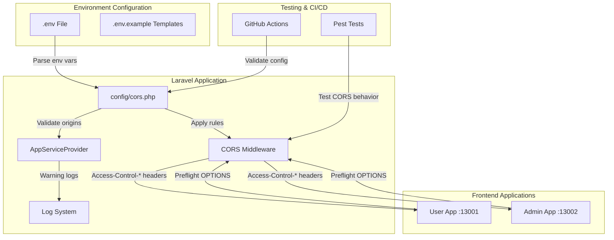
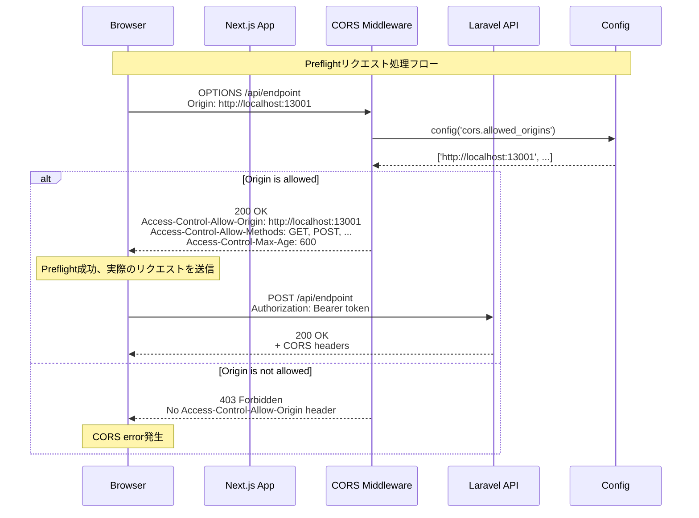
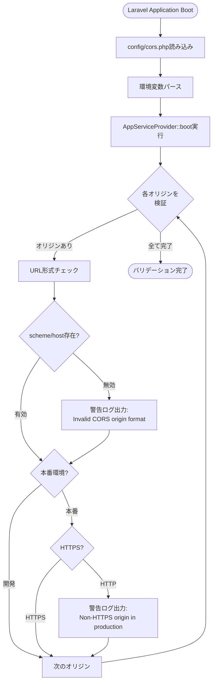
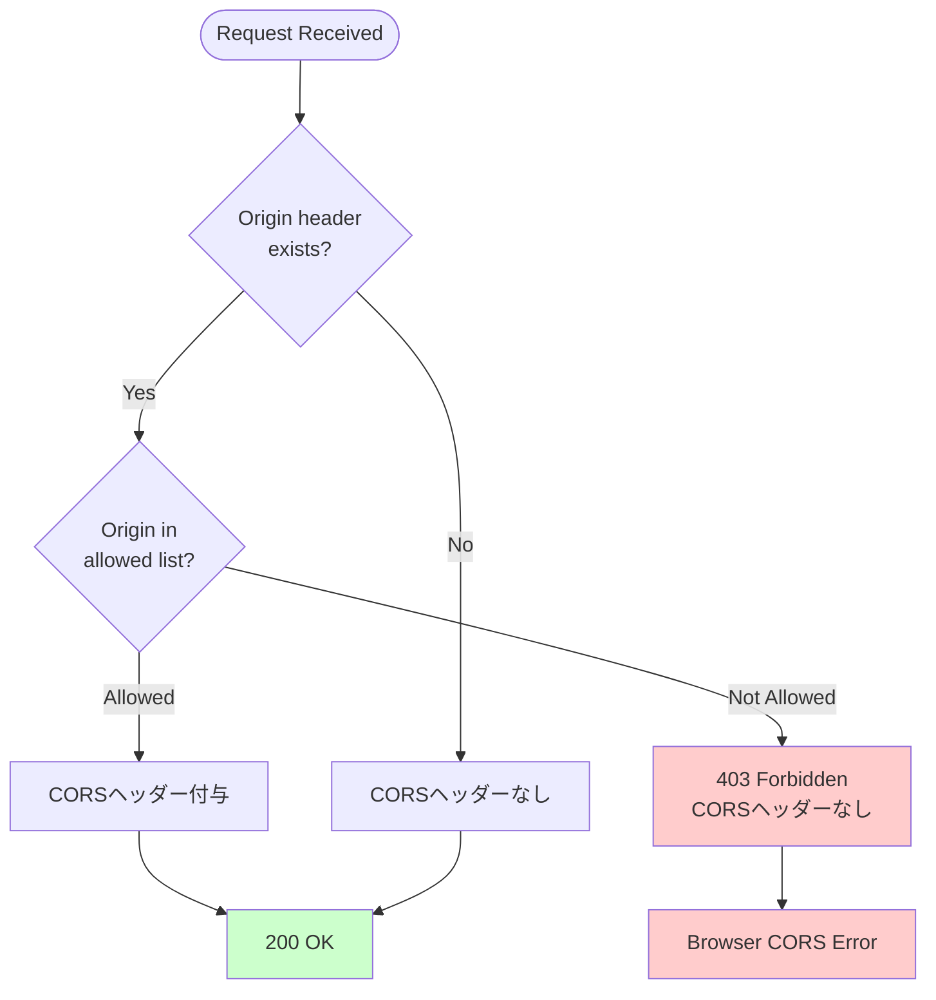
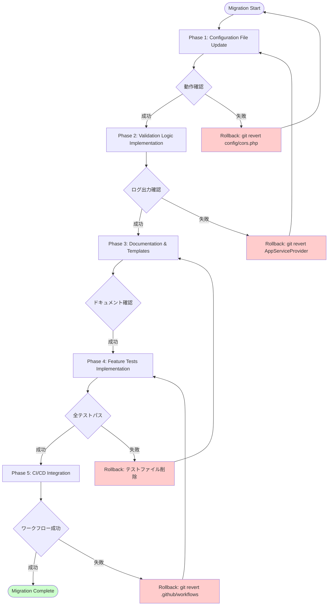

# 技術設計ドキュメント

## Overview

本機能は、Laravel API（ポート13000）とNext.jsフロントエンドアプリ（User App: 13001、Admin App: 13002）間のクロスオリジンAPIリクエストを適切に制御するため、CORS設定の環境変数ドリブン化を実現する。現在の静的配列ベースの設定（`config/cors.php`）から環境変数による柔軟な設定管理へ移行することで、開発・ステージング・本番環境ごとに適切なオリジン制限を実現し、セキュリティ強化と保守性向上を両立する。

**Purpose**: 環境別CORS設定の柔軟性とセキュリティを向上させ、設定ミスによるリスクを低減する。

**Users**:
- **開発者**: 環境変数でCORS設定を管理し、コード変更なしで環境切り替えが可能
- **運用担当者**: 自動検証により設定ミスを早期発見、本番環境でのHTTPS強制を保証
- **セキュリティ担当者**: 本番環境でHTTPSオリジンのみを許可し、中間者攻撃のリスクを低減

**Impact**:
- 既存の`config/cors.php`の静的配列設定を環境変数ベースに変更
- `AppServiceProvider`に起動時バリデーション機能を追加
- Laravel Sanctum 4.0認証との互換性を維持

### Goals
- 環境変数（`CORS_ALLOWED_ORIGINS`, `CORS_MAX_AGE`等）によるCORS設定の柔軟な管理
- 本番環境でのHTTPS強制とセキュリティ強化
- Docker環境対応（`host.docker.internal`サポート）
- 起動時自動バリデーションによる設定ミスの早期発見
- Pest 4テストによるCORS機能の包括的検証

### Non-Goals
- CORS設定のGUI管理画面の提供（CLI/環境変数のみ）
- 動的なCORS設定変更機能（アプリケーション再起動が必要）
- カスタムCORSミドルウェアの実装（Laravel標準機能を使用）

## Architecture

### Existing Architecture Analysis

**現在の構成**:
- `config/cors.php`: 静的配列ベースのCORS設定（4つのオリジンをハードコード）
- Laravel標準のCORSミドルウェア（`fruitcake/laravel-cors`経由）を使用
- `AppServiceProvider`: 現在は空の`boot()`メソッド

**保持すべきパターン**:
- Laravel 12の設定ファイル構造（`config/`ディレクトリ）
- 環境変数ベースの設定管理（`.env`ファイル）
- Service Provider パターンによる起動時処理

**統合ポイント**:
- Laravel Sanctum 4.0トークン認証との連携（`Authorization: Bearer <token>`ヘッダー処理）
- 既存APIエンドポイント（`/api/login`, `/api/logout`, `/api/me`, `/api/tokens/*`）との互換性維持

### High-Level Architecture



**Architecture Integration**:
- **既存パターン保持**: Laravel 12標準設定ファイル構造、環境変数ドリブン設計、Service Providerパターン
- **新規コンポーネント追加理由**:
  - バリデーションロジック（`AppServiceProvider::boot()`）: 起動時設定検証を実現
  - `.env.example`テンプレート拡張: 環境別設定ガイドを提供
  - Pest Feature Tests: CORS動作の自動検証
- **技術スタック整合性**: Laravel 12標準機能のみ使用、外部パッケージ不要
- **Steering準拠**: API専用最適化設計、ステートレスAPI設計の維持

### Technology Alignment

本機能は既存のLaravel 12技術スタックに完全統合し、新規依存関係を導入しない。

**既存技術スタックとの整合性**:
- **Laravel 12**: 標準設定システム（`config/`、`.env`）とService Providerパターンを使用
- **PHP 8.4**: `parse_url()`、`filter_var()`等の標準関数による実装
- **Pest 4**: 既存テストフレームワークによるFeature Tests拡張
- **GitHub Actions**: 既存CI/CDワークフローへの検証ステップ追加

**新規導入ライブラリ**: なし（Laravel標準機能のみ使用）

**パターンからの逸脱**: なし（Laravel推奨パターンに準拠）

### Key Design Decisions

#### Decision 1: 環境変数パース方式の選択

**Decision**: `config/cors.php`内でカンマ区切り文字列を直接パースする方式を採用

**Context**:
- 要件: 環境変数`CORS_ALLOWED_ORIGINS`をカンマ区切りで解析
- 問題: 複数オリジンを環境変数で表現する方法の選択

**Alternatives**:
1. **カンマ区切り文字列パース** (選択): `explode(',', env('CORS_ALLOWED_ORIGINS'))`
2. JSON配列パース: `json_decode(env('CORS_ALLOWED_ORIGINS_JSON'), true)`
3. 複数環境変数: `CORS_ORIGIN_1`, `CORS_ORIGIN_2`, ...

**Selected Approach**:
```php
'allowed_origins' => array_filter(array_map(
    'trim',
    explode(',', env('CORS_ALLOWED_ORIGINS', ''))
)),
```
カンマ区切り文字列を`explode()`で配列化し、`trim()`で空白除去、`array_filter()`で空要素除去

**Rationale**:
- **シンプル性**: `.env`ファイルでの記述が直感的（`CORS_ALLOWED_ORIGINS=http://localhost:13001,http://localhost:13002`）
- **Laravel慣例**: 他のLaravel設定（`SANCTUM_STATEFUL_DOMAINS`等）と一貫性
- **運用容易性**: 環境変数数が少なく、設定管理が簡単

**Trade-offs**:
- **獲得**: シンプルさ、Laravel慣例との一貫性、運用容易性
- **犠牲**: 複雑なデータ構造（ネストされたオブジェクト）のサポート不可（ただし、CORS設定には不要）

#### Decision 2: バリデーション実装タイミング

**Decision**: `AppServiceProvider::boot()`での起動時バリデーションを採用

**Context**:
- 要件: CORS設定の妥当性を自動検証し、警告ログを出力
- 問題: バリデーション実行タイミングの選択

**Alternatives**:
1. **起動時バリデーション** (`AppServiceProvider::boot()`) (選択)
2. リクエスト時バリデーション（CORSミドルウェア内）
3. Artisanコマンドによる手動検証（`php artisan config:validate-cors`）

**Selected Approach**:
```php
public function boot(): void
{
    $origins = config('cors.allowed_origins', []);
    $isProduction = app()->environment('production');

    foreach ($origins as $origin) {
        $parsed = parse_url($origin);
        if (!$parsed || empty($parsed['scheme']) || empty($parsed['host'])) {
            Log::warning('Invalid CORS origin format', ['origin' => $origin]);
        }
        if ($isProduction && $parsed['scheme'] !== 'https') {
            Log::warning('Non-HTTPS origin in production CORS', ['origin' => $origin]);
        }
    }
}
```

**Rationale**:
- **早期検出**: アプリケーション起動時に設定ミスを即座に発見
- **ゼロパフォーマンスコスト**: 起動時のみ実行、リクエストごとのオーバーヘッドなし
- **運用監視**: ログシステムと統合され、監視ツールで警告を検知可能

**Trade-offs**:
- **獲得**: 設定ミスの早期発見、リクエスト処理のパフォーマンス維持、ログベース監視
- **犠牲**: 起動時間の微増（数ミリ秒、実用上無視可能）

#### Decision 3: デフォルト値戦略

**Decision**: 環境別デフォルト値を`config/cors.php`内で制御

**Context**:
- 要件: `CORS_MAX_AGE`未設定時、本番環境は86400秒、開発環境は600秒をデフォルト
- 問題: デフォルト値の管理方法

**Alternatives**:
1. **設定ファイル内での環境判定** (選択): `config/cors.php`内で`app()->environment()`判定
2. `.env.example`でのデフォルト値指定のみ
3. 専用バリデーションクラスでのデフォルト値管理

**Selected Approach**:
```php
'max_age' => env('CORS_MAX_AGE')
    ?? (app()->environment('production') ? 86400 : 600),
```

**Rationale**:
- **設定の一元化**: CORS関連設定が`config/cors.php`に集約
- **明示的な環境依存**: 環境別のデフォルト値が設定ファイル内で明確
- **Laravel標準パターン**: 他のLaravel設定ファイルと一貫性

**Trade-offs**:
- **獲得**: 設定の一元化、環境別デフォルトの明示性、Laravel慣例準拠
- **犠牲**: 設定ファイル内に軽微なロジック（環境判定）が含まれる（ただし、Laravelで一般的なパターン）

## System Flows

### CORS Preflight Request Flow



### Configuration Validation Flow



## Requirements Traceability

| Requirement | 要件概要 | コンポーネント | インターフェース | フロー |
|-------------|---------|--------------|----------------|--------|
| 1.1-1.5 | 環境変数パース | `config/cors.php` | `env()`, `explode()`, `filter_var()` | Configuration Load |
| 1.6-1.8 | デフォルト値設定 | `config/cors.php` | `app()->environment()`, Null Coalescing演算子 | Configuration Load |
| 2.1-2.9 | 環境別テンプレート | `.env.example` | 環境変数セクション | - |
| 3.1-3.5 | CORS設定バリデーション | `AppServiceProvider::boot()` | `parse_url()`, `Log::warning()` | Configuration Validation Flow |
| 4.1-4.6 | Preflightリクエスト処理 | CORS Middleware（Laravel標準） | HTTPヘッダー | CORS Preflight Request Flow |
| 5.1-5.4 | Docker環境対応 | `.env.example`, `docker-compose.yml` | `extra_hosts` 設定 | - |
| 6.1-6.5 | セキュリティ強化 | `AppServiceProvider::boot()` | 環境判定、URLスキーム検証 | Configuration Validation Flow |
| 7.1-7.7 | Feature Tests実装 | `tests/Feature/Http/CorsTest.php` | Pest API, HTTP Client | - |
| 8.1-8.6 | CI/CD統合 | `.github/workflows/test.yml` | Artisanコマンド、Shell Script | - |
| 9.1-9.6 | ドキュメント整備 | `docs/CORS_CONFIGURATION_GUIDE.md` | Markdownドキュメント | - |
| 10.1-10.5 | 既存機能互換性 | 全コンポーネント | Laravel Sanctum API | CORS Preflight Request Flow |

## Components and Interfaces

### Configuration Layer

#### config/cors.php

**Responsibility & Boundaries**
- **Primary Responsibility**: 環境変数からCORS設定を読み込み、Laravel CORSミドルウェアに提供
- **Domain Boundary**: アプリケーション設定層（インフラストラクチャ層）
- **Data Ownership**: CORS設定値（許可オリジン、メソッド、ヘッダー、max-age等）
- **Transaction Boundary**: 設定読み込みのみ（トランザクション不要）

**Dependencies**
- **Inbound**: Laravel CORSミドルウェア、`AppServiceProvider`
- **Outbound**: 環境変数（`.env`ファイル）、`app()`ヘルパー
- **External**: なし

**Contract Definition**

**Configuration Array** (Laravel標準):
```php
return [
    'paths' => ['api/*', 'up'],
    'allowed_methods' => array_filter(array_map(
        'trim',
        explode(',', env('CORS_ALLOWED_METHODS', '*'))
    )),
    'allowed_origins' => array_filter(array_map(
        'trim',
        explode(',', env('CORS_ALLOWED_ORIGINS', ''))
    )),
    'allowed_headers' => array_filter(array_map(
        'trim',
        explode(',', env('CORS_ALLOWED_HEADERS', '*'))
    )),
    'max_age' => env('CORS_MAX_AGE')
        ?? (app()->environment('production') ? 86400 : 600),
    'supports_credentials' => filter_var(
        env('CORS_SUPPORTS_CREDENTIALS', false),
        FILTER_VALIDATE_BOOLEAN
    ),
];
```

**Preconditions**:
- `.env`ファイルが存在し、環境変数が設定可能
- Laravel設定システムが初期化済み

**Postconditions**:
- 有効なCORS設定配列が返される
- 空配列・空文字列が除外される
- デフォルト値が環境に応じて適用される

**Invariants**:
- `allowed_origins`は常に配列（空配列含む）
- `max_age`は常に整数値
- `supports_credentials`は常にブール値

#### .env.example

**Responsibility & Boundaries**
- **Primary Responsibility**: 開発者向けのCORS環境変数テンプレート提供
- **Domain Boundary**: ドキュメント・設定ガイド層
- **Data Ownership**: 環境変数サンプル値

**Dependencies**
- **Inbound**: 開発者（マニュアル参照）
- **Outbound**: なし
- **External**: なし

**Contract Definition**

**Environment Variable Templates**:
```env
# ============================================
# CORS Configuration
# ============================================

# --- Development Environment (Local/Docker) ---
CORS_ALLOWED_ORIGINS=http://localhost:13001,http://localhost:13002,http://127.0.0.1:13001,http://127.0.0.1:13002,http://host.docker.internal:13001,http://host.docker.internal:13002
CORS_ALLOWED_METHODS=GET,POST,PUT,DELETE,PATCH,OPTIONS
CORS_ALLOWED_HEADERS=Content-Type,Authorization,X-Requested-With
CORS_MAX_AGE=600
CORS_SUPPORTS_CREDENTIALS=false

# --- Staging Environment ---
# CORS_ALLOWED_ORIGINS=https://stg-user.example.com,https://stg-admin.example.com
# CORS_MAX_AGE=3600

# --- Production Environment ---
# CORS_ALLOWED_ORIGINS=https://user.example.com,https://admin.example.com
# CORS_MAX_AGE=86400
```

### Validation Layer

#### AppServiceProvider

**Responsibility & Boundaries**
- **Primary Responsibility**: アプリケーション起動時にCORS設定を検証し、警告ログを出力
- **Domain Boundary**: アプリケーション初期化層
- **Data Ownership**: バリデーション結果（ログメッセージ）
- **Transaction Boundary**: 起動時処理のみ（トランザクション不要）

**Dependencies**
- **Inbound**: Laravelブートストラップシステム
- **Outbound**: `config()`ヘルパー、`Log`ファサード、`app()`ヘルパー
- **External**: なし

**Service Interface**:
```php
class AppServiceProvider extends ServiceProvider
{
    public function boot(): void
    {
        $this->validateCorsConfiguration();
    }

    private function validateCorsConfiguration(): void
    {
        $origins = config('cors.allowed_origins', []);
        $isProduction = app()->environment('production');

        foreach ($origins as $origin) {
            // URL形式検証
            $parsed = parse_url($origin);
            if (!$parsed || empty($parsed['scheme']) || empty($parsed['host'])) {
                Log::warning('Invalid CORS origin format', [
                    'origin' => $origin,
                    'parsed' => $parsed,
                ]);
                continue;
            }

            // 本番環境でのHTTPS検証
            if ($isProduction && $parsed['scheme'] !== 'https') {
                Log::warning('Non-HTTPS origin in production CORS', [
                    'origin' => $origin,
                    'environment' => 'production',
                ]);
            }
        }

        // ワイルドカード検証（本番環境）
        if ($isProduction && in_array('*', $origins, true)) {
            Log::warning('Wildcard origin in production is not recommended', [
                'environment' => 'production',
            ]);
        }
    }
}
```

**Preconditions**:
- Laravel設定システムが初期化済み
- ログシステムが利用可能

**Postconditions**:
- 無効な設定がログに記録される
- アプリケーション起動は継続（警告のみ、エラーではない）

**Invariants**:
- バリデーションは起動時に1回のみ実行
- バリデーション失敗でもアプリケーションは起動

### Middleware Layer

#### Laravel CORS Middleware (既存)

**Responsibility & Boundaries**
- **Primary Responsibility**: HTTPリクエストにCORSヘッダーを付与し、Preflightリクエストを処理
- **Domain Boundary**: HTTPミドルウェア層
- **Data Ownership**: CORSレスポンスヘッダー
- **Transaction Boundary**: リクエストごと

**Dependencies**
- **Inbound**: HTTPリクエスト（ブラウザ、Next.jsアプリ）
- **Outbound**: `config/cors.php`
- **External**: Laravel標準CORSミドルウェア

**API Contract** (HTTPヘッダー):

| Request Type | Request Headers | Response Headers | Status Code |
|-------------|----------------|------------------|-------------|
| OPTIONS (Preflight) | `Origin: http://localhost:13001` | `Access-Control-Allow-Origin: http://localhost:13001`<br/>`Access-Control-Allow-Methods: GET,POST,...`<br/>`Access-Control-Allow-Headers: Content-Type,...`<br/>`Access-Control-Max-Age: 600` | 200 OK |
| OPTIONS (不許可) | `Origin: http://evil.com` | (CORSヘッダーなし) | 403 Forbidden |
| GET/POST (実リクエスト) | `Origin: http://localhost:13001`<br/>`Authorization: Bearer token` | `Access-Control-Allow-Origin: http://localhost:13001` | 200 OK |

**Preconditions**:
- `config/cors.php`が有効な設定を返す
- リクエストに`Origin`ヘッダーが含まれる

**Postconditions**:
- 許可オリジンからのリクエストにCORSヘッダーが付与される
- 不許可オリジンからのリクエストはCORSヘッダーなしで応答

**Invariants**:
- Preflightリクエスト（OPTIONS）は必ず処理される
- `Access-Control-Allow-Origin`ヘッダーは許可オリジンのみに付与

**Integration Strategy**:
- **Modification Approach**: 既存ミドルウェアは変更せず、設定のみ変更（環境変数ドリブン化）
- **Backward Compatibility**: 既存の静的配列設定を環境変数ベースに置き換え、動作は維持
- **Migration Path**: 設定ファイル変更 → `.env.example`更新 → `.env`ファイル更新 → アプリケーション再起動

### Testing Layer

#### tests/Feature/Http/CorsTest.php

**Responsibility & Boundaries**
- **Primary Responsibility**: CORS機能の自動テスト（Preflight、ヘッダー検証、環境変数動作）
- **Domain Boundary**: テスト層
- **Data Ownership**: テストケース、アサーション結果

**Dependencies**
- **Inbound**: Pest 4テストランナー
- **Outbound**: Laravel HTTPクライアント、`config()`ヘルパー、`Log`ファサード
- **External**: Pest 4フレームワーク

**Service Interface**:
```php
use function Pest\Laravel\{get, options, withHeaders};

describe('CORS Configuration', function () {
    test('allows requests from configured origins', function () {
        $response = options('/api/health')
            ->withHeaders(['Origin' => 'http://localhost:13001'])
            ->assertSuccessful()
            ->assertHeader('Access-Control-Allow-Origin', 'http://localhost:13001')
            ->assertHeader('Access-Control-Allow-Methods')
            ->assertHeader('Access-Control-Max-Age');
    });

    test('rejects requests from non-configured origins', function () {
        $response = options('/api/health')
            ->withHeaders(['Origin' => 'http://evil.com'])
            ->assertForbidden()
            ->assertHeaderMissing('Access-Control-Allow-Origin');
    });

    test('validates max-age based on environment', function () {
        config(['app.env' => 'production']);
        expect(config('cors.max_age'))->toBe(86400);

        config(['app.env' => 'local']);
        expect(config('cors.max_age'))->toBe(600);
    });

    test('logs warning for invalid CORS origins', function () {
        Log::spy();
        config(['cors.allowed_origins' => ['invalid-url']]);

        (new \App\Providers\AppServiceProvider(app()))->boot();

        Log::shouldHaveReceived('warning')
            ->once()
            ->with('Invalid CORS origin format', Mockery::any());
    });
});
```

**Test Categories**:
- **Unit Tests**: 設定パース、デフォルト値、バリデーションロジック
- **Integration Tests**: Preflightリクエスト、CORSヘッダー検証、ログ出力
- **Environment Tests**: 開発/本番環境でのデフォルト値動作

### CI/CD Layer

#### .github/workflows/test.yml

**Responsibility & Boundaries**
- **Primary Responsibility**: GitHub ActionsでのCORS設定検証とテスト実行
- **Domain Boundary**: CI/CDパイプライン層
- **Data Ownership**: ビルド成功/失敗ステータス

**Dependencies**
- **Inbound**: GitHub Pull Request、mainブランチpush
- **Outbound**: Artisanコマンド、Pestテスト
- **External**: GitHub Actions環境

**Batch/Job Contract**:

**Trigger**: Pull Request、mainブランチpush

**Input**:
- `.env`ファイル（CI環境用）
- `CORS_ALLOWED_ORIGINS`環境変数

**Output**:
- ビルド成功/失敗ステータス
- CORS設定検証ログ

**Idempotency**: 同じコミットに対して複数回実行しても結果は同一

**Recovery**: テスト失敗時はビルドを失敗させ、PRマージをブロック

**Job Definition**:
```yaml
jobs:
  test:
    runs-on: ubuntu-latest
    steps:
      - uses: actions/checkout@v4
      - name: Setup PHP
        uses: shivammathur/setup-php@v2
        with:
          php-version: '8.4'
      - name: Install Dependencies
        run: composer install
      - name: Run Tests
        run: vendor/bin/pest
      - name: Validate CORS Configuration
        run: |
          php artisan config:show cors
          if [ "${{ github.ref }}" == "refs/heads/main" ]; then
            origins=$(php artisan config:show cors | grep allowed_origins)
            if echo "$origins" | grep -q "http://"; then
              echo "❌ HTTP origins detected in production branch"
              exit 1
            fi
            echo "✅ CORS origins validated for production"
          fi
```

## Error Handling

### Error Strategy

CORS機能のエラーハンドリングは、**警告ログベース**と**HTTPステータスコード**の2層で構成される。設定ミスは起動時警告ログで検出し、実行時のCORSエラーはHTTPレスポンスで制御する。

### Error Categories and Responses

#### User Errors (4xx)

**Invalid Origin Request (403 Forbidden)**:
- **条件**: 許可されていないオリジンからのリクエスト
- **応答**: `Access-Control-Allow-Origin`ヘッダーなし、403 Forbidden
- **ユーザーガイダンス**: ブラウザコンソールにCORSエラーメッセージ表示、ドキュメント参照を促す

**Missing Origin Header (200 OK with no CORS headers)**:
- **条件**: `Origin`ヘッダーなしのリクエスト（同一オリジンリクエスト）
- **応答**: CORSヘッダーなし、通常レスポンス
- **ユーザーガイダンス**: CORSは適用されない（同一オリジンのため）

#### System Errors (5xx)

**Configuration Load Failure (500 Internal Server Error)**:
- **条件**: `config/cors.php`の読み込みエラー（構文エラー等）
- **応答**: 500エラー、アプリケーション起動失敗
- **回復メカニズム**: Laravelエラーハンドラーによるログ記録、設定ファイル修正後再起動

#### Business Logic Errors (Warning Logs)

**Invalid CORS Origin Format**:
- **条件**: URL形式が不正（`parse_url()`失敗）
- **応答**: 起動時警告ログ出力、アプリケーションは起動継続
- **ガイダンス**: ログメッセージ「Invalid CORS origin format」、`docs/CORS_CONFIGURATION_GUIDE.md`参照

**Non-HTTPS Origin in Production**:
- **条件**: 本番環境でHTTPオリジンが設定されている
- **応答**: 起動時警告ログ出力、アプリケーションは起動継続
- **ガイダンス**: ログメッセージ「Non-HTTPS origin in production CORS」、HTTPSへの移行を推奨

**Wildcard Origin in Production**:
- **条件**: 本番環境でワイルドカード`*`が設定されている
- **応答**: 起動時警告ログ出力、アプリケーションは起動継続
- **ガイダンス**: ログメッセージ「Wildcard origin in production is not recommended」、明示的なオリジンリスト設定を推奨

### Error Flow Visualization



### Monitoring

**Error Tracking**:
- **ログシステム**: Laravel Log（`storage/logs/laravel.log`）
- **警告ログフォーマット**: `[timestamp] local.WARNING: Invalid CORS origin format {"origin":"http://invalid"}`
- **ログレベル**: `WARNING`（起動時バリデーション）、`ERROR`（設定ファイルエラー）

**Health Monitoring**:
- **メトリクス**:
  - CORS警告ログ数（日次集計）
  - 403 Forbiddenレスポンス数（オリジン別）
  - Preflightリクエスト成功率
- **アラート条件**:
  - 本番環境でHTTP オリジン警告が検出された場合
  - 403 Forbiddenレスポンスが急増した場合（DDoS/誤設定の可能性）

**ログクエリ例** (Laravel Pail):
```bash
# CORS関連警告ログの抽出
php artisan pail --filter="Invalid CORS origin"

# 本番環境でのHTTP警告
php artisan pail --filter="Non-HTTPS origin in production"
```

## Testing Strategy

### Unit Tests (Pest 4)

**Core Configuration Parsing** (3テスト):
1. `test('parses CORS_ALLOWED_ORIGINS as comma-separated list')`: 環境変数カンマ区切りパース検証
2. `test('trims whitespace from origin URLs')`: 空白除去動作検証
3. `test('filters empty strings from origins array')`: 空配列要素除外検証
4. `test('applies environment-based default for max_age')`: 環境別デフォルト値検証
5. `test('converts CORS_SUPPORTS_CREDENTIALS to boolean')`: ブール値変換検証

**Validation Logic** (4テスト):
1. `test('validates URL format with parse_url')`: URL形式検証ロジック
2. `test('logs warning for invalid origin format')`: 無効URL警告ログ出力
3. `test('logs warning for HTTP origin in production')`: 本番環境HTTP警告
4. `test('logs warning for wildcard in production')`: ワイルドカード警告

### Integration Tests (Pest 4)

**Preflight Request Handling** (5テスト):
1. `test('returns CORS headers for allowed origin')`: 許可オリジンでのヘッダー検証
2. `test('rejects non-allowed origin without headers')`: 不許可オリジンでのヘッダー欠落検証
3. `test('includes Access-Control-Allow-Methods header')`: 許可メソッドヘッダー検証
4. `test('includes Access-Control-Max-Age header')`: max-ageヘッダー検証
5. `test('handles multiple allowed origins correctly')`: 複数オリジン処理検証

**Laravel Sanctum Integration** (3テスト):
1. `test('allows authenticated requests with Bearer token')`: トークン認証付きリクエスト
2. `test('maintains existing /api/login endpoint behavior')`: 既存ログインエンドポイント互換性
3. `test('CORS headers applied to Sanctum protected routes')`: Sanctum保護ルートでのCORSヘッダー

### E2E Tests (Playwright - オプション)

**Browser CORS Behavior** (2テスト):
1. `test('Next.js User App can access Laravel API with CORS')`: User AppからのAPI呼び出し
2. `test('Next.js Admin App can access Laravel API with CORS')`: Admin AppからのAPI呼び出し

**Note**: E2Eテストは既存のPlaywright環境で追加可能だが、優先度は低い（Feature Testsで十分にカバー）

### Performance Tests (不要)

CORS設定は起動時のみ実行され、リクエストごとのパフォーマンス影響は無視可能なため、パフォーマンステストは不要。

## Security Considerations

### Threat Modeling

**脅威1: 本番環境でのHTTPオリジン設定**
- **脅威**: 中間者攻撃（MITM）によるリクエスト盗聴・改ざん
- **影響**: トークンベース認証の`Authorization: Bearer <token>`ヘッダーが平文で送信される
- **軽減策**:
  - 起動時バリデーションで警告ログ出力
  - CI/CDでの自動検証（mainブランチでHTTPオリジン検出時はビルド失敗）
  - `.env.example`でHTTPS設定例を明示

**脅威2: ワイルドカード`*`の本番環境使用**
- **脅威**: 任意のオリジンからのAPIアクセスが可能（CSRF攻撃のリスク増大）
- **影響**: 悪意あるサイトからのAPI呼び出しが可能
- **軽減策**:
  - 起動時バリデーションで警告ログ出力
  - ドキュメントで明示的なオリジンリスト設定を推奨

**脅威3: 設定ミスによる意図しないオリジン許可**
- **脅威**: タイポやコピー&ペーストミスによる不正オリジン許可
- **影響**: 攻撃者のオリジンが誤って許可される
- **軽減策**:
  - URL形式バリデーション（`parse_url()`による検証）
  - CI/CDでの設定値レビュー
  - `.env.example`でのテンプレート提供

### Security Controls

**本番環境HTTPS強制**:
```php
if ($isProduction && $parsed['scheme'] !== 'https') {
    Log::warning('Non-HTTPS origin in production CORS', [
        'origin' => $origin,
        'environment' => 'production',
    ]);
}
```

**ワイルドカード検出**:
```php
if ($isProduction && in_array('*', $origins, true)) {
    Log::warning('Wildcard origin in production is not recommended', [
        'environment' => 'production',
    ]);
}
```

**CI/CD自動検証**:
```bash
if [ "${{ github.ref }}" == "refs/heads/main" ]; then
  origins=$(php artisan config:show cors | grep allowed_origins)
  if echo "$origins" | grep -q "http://"; then
    echo "❌ HTTP origins detected in production branch"
    exit 1
  fi
fi
```

### Authentication and Authorization

**Laravel Sanctum統合**:
- CORS設定は`Authorization: Bearer <token>`ヘッダーの処理に影響しない
- `CORS_SUPPORTS_CREDENTIALS=false`によりステートレスAPI設計を維持
- Preflightリクエスト（OPTIONS）は認証不要（ミドルウェア順序により自動処理）

**認証エンドポイントとの互換性**:
- `/api/login`: CORS Preflight後にPOSTリクエスト、トークン発行
- `/api/logout`: CORS + `auth:sanctum`ミドルウェア
- `/api/me`: CORS + `auth:sanctum`ミドルウェア
- `/api/tokens/*`: CORS + `auth:sanctum`ミドルウェア

### Data Protection

**機密情報保護**:
- 環境変数に機密情報なし（オリジンURLのみ）
- `.env`ファイルは`.gitignore`対象（Git追跡外）
- ログ出力に機密情報なし（オリジンURLのみ記録）

**設定値の可視性**:
- `php artisan config:show cors`コマンドで設定値確認可能
- CI/CD環境でのみ実行（ローカル開発では任意）

### Compliance

**セキュリティベストプラクティス準拠**:
- OWASP CORS Security Cheat Sheet準拠
- HTTPS強制（本番環境）
- 明示的なオリジンリスト（ワイルドカード非推奨）

**Laravel Security Guidelines準拠**:
- Laravel標準CORSミドルウェア使用
- 環境変数ベース設定管理
- Service Providerパターンによる起動時処理

## Migration Strategy

### Phase 1: Configuration File Update (Week 1, Day 1-2)

**目的**: `config/cors.php`を環境変数ドリブンに変更

**作業内容**:
1. `config/cors.php`の`allowed_origins`配列を環境変数パースに変更
2. `allowed_methods`, `allowed_headers`も環境変数化
3. `max_age`に環境別デフォルト値ロジック追加
4. `supports_credentials`をブール値変換

**検証**:
- `php artisan config:show cors`で設定値確認
- ローカル環境で`.env`に`CORS_ALLOWED_ORIGINS`設定、動作確認

**ロールバック条件**: 設定ファイル構文エラー、アプリケーション起動失敗
**ロールバック手順**: Gitで前バージョンに戻す（`git revert`）

### Phase 2: Validation Logic Implementation (Week 1, Day 3-4)

**目的**: `AppServiceProvider`にバリデーションロジック追加

**作業内容**:
1. `AppServiceProvider::boot()`に`validateCorsConfiguration()`メソッド追加
2. URL形式検証、HTTPS検証、ワイルドカード検証実装
3. 警告ログ出力実装

**検証**:
- 無効なオリジン設定で起動し、警告ログ出力確認
- 本番環境でHTTPオリジン設定し、警告ログ出力確認
- `php artisan pail`でログリアルタイム確認

**ロールバック条件**: バリデーションロジックでアプリケーション起動失敗
**ロールバック手順**: `AppServiceProvider`の変更を削除（`git revert`）

### Phase 3: Documentation & Templates (Week 1, Day 5)

**目的**: `.env.example`更新とドキュメント作成

**作業内容**:
1. `.env.example`にCORS設定セクション追加（3環境分）
2. `docs/CORS_CONFIGURATION_GUIDE.md`作成
3. トラブルシューティング手順記載

**検証**:
- `.env.example`の設定例をコピーして動作確認
- ドキュメントの記載内容が正確か確認

**ロールバック条件**: なし（ドキュメント変更のみ）

### Phase 4: Feature Tests Implementation (Week 2, Day 1-3)

**目的**: `tests/Feature/Http/CorsTest.php`作成

**作業内容**:
1. Preflight成功/拒否テスト実装
2. ヘッダー検証テスト実装
3. 環境別デフォルト値テスト実装
4. バリデーション警告ログテスト実装

**検証**:
- `vendor/bin/pest tests/Feature/Http/CorsTest.php`で全テストパス
- カバレッジレポート生成（`--coverage`）

**ロールバック条件**: テスト実装エラー
**ロールバック手順**: テストファイル削除（他の実装には影響なし）

### Phase 5: CI/CD Integration (Week 2, Day 4-5)

**目的**: `.github/workflows/test.yml`にCORS検証ステップ追加

**作業内容**:
1. `Validate CORS Configuration`ステップ追加
2. `php artisan config:show cors`実行
3. mainブランチでHTTPオリジン検出時はビルド失敗

**検証**:
- GitHub ActionsでPRを作成し、ワークフロー実行確認
- mainブランチでHTTPオリジン設定時、ビルド失敗確認

**ロールバック条件**: CI/CDワークフロー失敗
**ロールバック手順**: ワークフローファイルの変更を削除（`git revert`）

### Migration Flow Diagram



### Validation Checkpoints

**Phase 1 Validation**:
- [ ] `php artisan config:show cors`でCORS設定が表示される
- [ ] 環境変数`CORS_ALLOWED_ORIGINS`が配列として解析される
- [ ] デフォルト値が環境に応じて適用される

**Phase 2 Validation**:
- [ ] 無効なオリジンで警告ログ「Invalid CORS origin format」が出力される
- [ ] 本番環境でHTTPオリジンで警告ログ「Non-HTTPS origin in production CORS」が出力される
- [ ] アプリケーション起動が正常に完了する

**Phase 3 Validation**:
- [ ] `.env.example`に3環境分のCORS設定例が記載されている
- [ ] `docs/CORS_CONFIGURATION_GUIDE.md`が作成されている
- [ ] ドキュメントにDocker環境対応が記載されている

**Phase 4 Validation**:
- [ ] `vendor/bin/pest tests/Feature/Http/CorsTest.php`で全テストがパスする
- [ ] Preflight成功/拒否テストが動作する
- [ ] バリデーション警告ログテストが動作する

**Phase 5 Validation**:
- [ ] GitHub Actionsで「Validate CORS Configuration」ステップが実行される
- [ ] mainブランチでHTTPオリジン検出時、ビルドが失敗する
- [ ] HTTPSオリジンのみの場合、ビルドが成功する
