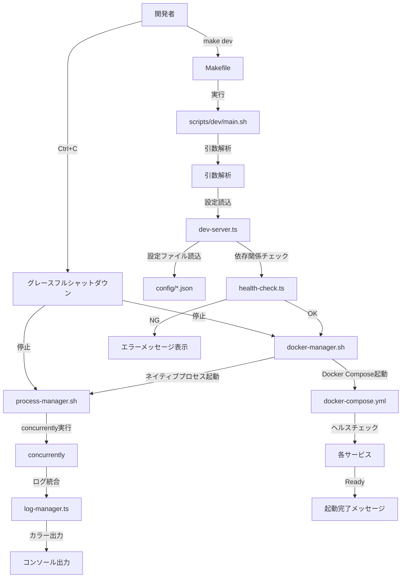
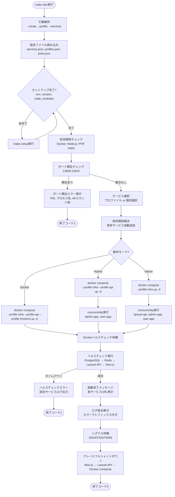
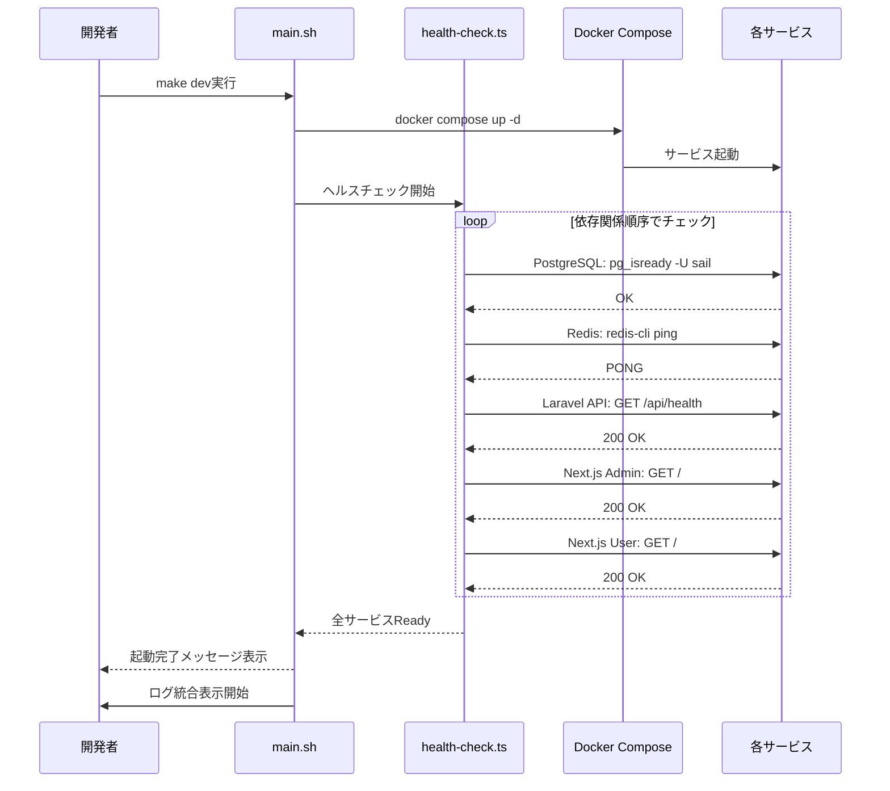
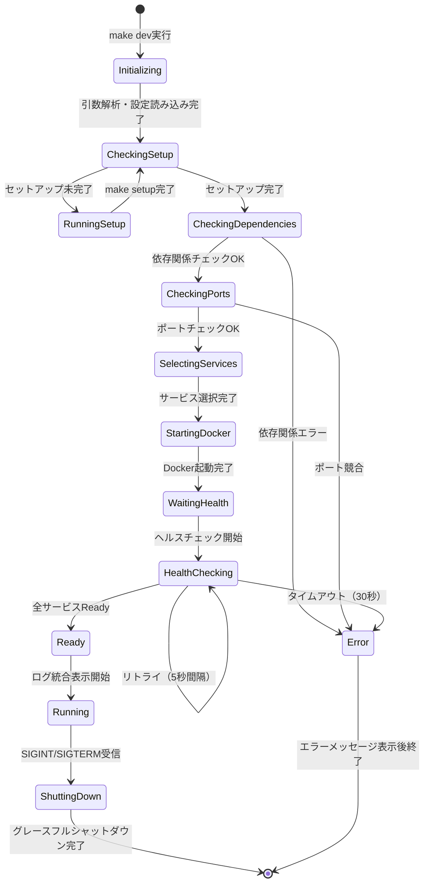
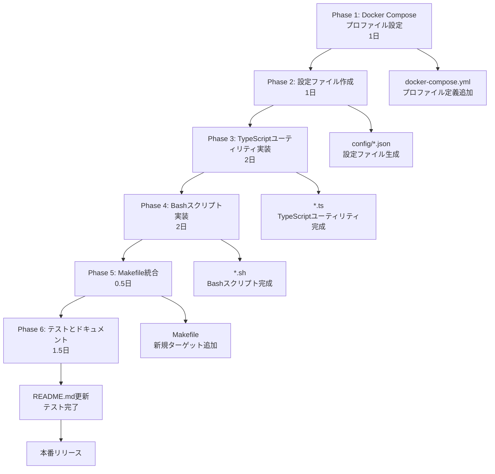

# Technical Design Document

## Overview

この開発サーバー起動スクリプトは、Laravel Next.js B2Cテンプレートプロジェクトにおいて、**単一コマンドで全開発サーバーを起動**する機能を提供する。現在、開発者はLaravel API、Next.js Admin App、Next.js User App、およびインフラサービス（PostgreSQL、Redis、Mailpit、MinIO）を個別に起動する必要があり、開発開始までに複数のコマンド実行と環境確認が必要である。この機能により、開発開始時間を大幅に短縮し、開発者体験を向上させる。

**Purpose**: プロジェクト開発者に対して、単一コマンド（`make dev`）による全サービス起動機能を提供し、Docker/ネイティブ/ハイブリッドモードの柔軟な切り替え、サービス選択、ログ統合管理、エラーハンドリング、ヘルスチェック、グレースフルシャットダウンを実現する。

**Users**: Laravel/Next.js開発に従事するプロジェクト開発者、新規参加者（オンボーディング対象）、将来的にはCI/CD環境での活用を想定する。

**Impact**: 現在の「複数コマンド実行 + 環境確認」から「単一コマンド実行 + 自動ヘルスチェック」に変更し、開発開始時間を90秒以内（ヘルスチェック完了）に短縮する。既存のセットアップスクリプト（`make setup`）と統合し、初回セットアップが未完了の場合は自動実行する。

### Goals

- **開発効率の最大化**: 複数コマンド → 1コマンド（`make dev`）で開発環境を起動
- **柔軟な環境選択**: Docker/ネイティブ/ハイブリッドモードの切り替えにより、開発シナリオに応じた最適な環境を提供
- **サービス選択の自由度**: プロファイル（full、api-only、frontend-only）または個別サービス選択により、リソース消費を最小化
- **堅牢性**: 依存関係チェック、ポート競合検出、ヘルスチェック、グレースフルシャットダウンによる信頼性向上
- **保守性**: 設定駆動アーキテクチャ（JSON設定ファイル）により、新規サービス追加時にスクリプト本体の変更不要

**Success Criteria**:
- 全サービスがヘルスチェック完了まで90秒以内に起動
- 依存関係チェック・ポートチェック・設定ファイル読み込みが5秒以内に完了
- 3つ以上の環境（macOS、Linux、Windows WSL）で正常動作
- グレースフルシャットダウンが30秒以内に完了

### Non-Goals

- **本番環境デプロイ機能**: 本番環境への自動デプロイやCI/CDパイプライン構築は対象外
- **ポート番号の動的変更機能**: ポート番号は固定（13000-13010）とし、動的変更は実装しない
- **セットアップロジックの再実装**: `make setup`の機能は再実装せず、既存スクリプトを呼び出す
- **サービス監視・自動再起動機能**: 開発用途では不要なため実装しない
- **GUI/TUIインターフェース**: CLI完結とし、GUI/TUI開発は行わない

---

## Architecture

### Existing Architecture Analysis

Laravel Next.js B2Cテンプレートプロジェクトは、以下の既存アーキテクチャを採用している:

- **モノレポ構成**: ルートディレクトリにLaravel API (`backend/laravel-api/`)、Next.js Admin App (`frontend/admin-app/`)、Next.js User App (`frontend/user-app/`)、E2Eテスト (`e2e/`) を配置
- **Docker Compose統合**: `docker-compose.yml`で全サービスを定義し、ヘルスチェック機能を統合済み
- **既存Makefile**: `Makefile`にセットアップコマンド（`make setup`）、テストコマンド（`make test`、`make test-pgsql`）、Docker管理コマンド（`make docker-up`）を定義
- **既存スクリプト**: `scripts/`ディレクトリにセットアップスクリプト（`scripts/setup/main.sh`）、テスト環境切り替えスクリプト（`scripts/switch-test-env.sh`）、並列テストスクリプト（`scripts/parallel-test-setup.sh`）を配置

**Current architecture patterns and constraints**:
- 既存のDocker Composeサービス定義（laravel-api、admin-app、user-app、pgsql、redis、mailpit、minio、e2e-tests）は変更せず、プロファイル機能を追加
- 既存のMakefileターゲット（`setup`、`test`、`docker-up`等）は保持し、新規ターゲット（`dev`、`dev-docker`、`dev-native`等）を追加
- 既存のBashスクリプト（`scripts/setup/main.sh`、`scripts/lib/setup-lib.sh`）の再利用可能な関数（OS検出、エラーハンドリング）を活用

**Existing domain boundaries to be respected**:
- セットアップロジック: `scripts/setup/`配下のスクリプトが担当（再実装せず呼び出しのみ）
- テストインフラ管理: `scripts/`配下のテスト関連スクリプトが担当（新規スクリプトとは分離）
- 開発サーバー起動: 新規`scripts/dev/`配下に配置し、既存スクリプトとの責務を明確化

**Integration points that must be maintained**:
- `make setup`コマンドとの統合（初回セットアップ自動実行）
- `docker-compose.yml`のサービス定義およびヘルスチェック機能
- 既存のポート設定（13000-13010）との互換性

**Technical debt addressed**:
- Docker Composeプロファイル機能が未実装 → 今回のスクリプトで`infra`、`api`、`frontend`プロファイルを追加
- 開発サーバー起動手順が手動 → 自動化により手順を削減

### High-Level Architecture



### Architecture Integration

**Existing patterns preserved**:
- Bash + TypeScriptハイブリッド実装（既存セットアップスクリプトと同様）
- Makefile統合によるコマンドエントリーポイント（既存テストコマンドと同様）
- Docker Compose統合（既存E2Eテストと同様）
- JSON設定駆動（既存`package.json`、`tsconfig.json`と同様）

**New components rationale**:
- `scripts/dev/`: 開発サーバー起動専用ディレクトリ（既存`scripts/setup/`、`scripts/`と責務分離）
- `dev-server.ts`: 設定管理・サービス選択ロジック（TypeScript型安全性による保守性向上）
- `health-check.ts`: 依存関係チェック・ヘルスチェック（TypeScript型安全性による保守性向上）
- `log-manager.ts`: ログ統合管理（TypeScript型安全性による保守性向上）
- `concurrently`: マルチプロセス管理（Node.js環境活用、クロスプラットフォーム対応、堅牢なシグナルハンドリング）

**Technology alignment**:
- Node.js/TypeScript: 既存フロントエンドアプリと同じ技術スタック
- Bash: 既存セットアップスクリプト・テストスクリプトと同じシェル言語
- Docker Compose: 既存インフラ管理ツール
- Makefile: 既存コマンドエントリーポイント

**Steering compliance**:
- モノレポ構成維持（`.kiro/steering/structure.md`）
- 開発者体験向上（`.kiro/steering/product.md`）
- 既存技術スタック活用（`.kiro/steering/tech.md`）
- 設定駆動アーキテクチャ（`.kiro/steering/tech.md`）

---

## Technology Stack and Design Decisions

### Technology Alignment

この機能は既存システムへの拡張であり、既存技術スタックとの整合性を重視する。

**既存技術スタックとの整合性**:
- **Bash**: 既存セットアップスクリプト（`scripts/setup/main.sh`）、テストスクリプト（`scripts/switch-test-env.sh`）と同様のシェル言語を採用
- **TypeScript**: 既存フロントエンドアプリ（Next.js Admin/User App）と同じ言語、既存`scripts/env-sync.ts`と同様の型安全性を活用
- **Node.js**: 既存モノレポ環境（`package.json`、`node_modules/`）を活用
- **Docker Compose**: 既存インフラ管理ツール（`docker-compose.yml`）を拡張
- **Makefile**: 既存コマンドエントリーポイント（`make setup`、`make test`）に新規ターゲットを追加

**新規依存関係の追加**:
- **concurrently**: マルチプロセス管理ライブラリ（`npm install concurrently`）
  - バージョン: `^9.2.1`（最新安定版、2025年1月時点）
  - 既存Node.js環境を活用し、追加インストールのみで導入可能
  - 軽量（依存関係最小限）、クロスプラットフォーム対応、堅牢なシグナルハンドリング

**既存パターンからの逸脱なし**:
- Bash + TypeScriptハイブリッド実装は既存セットアップスクリプトと同一パターン
- JSON設定駆動は既存`package.json`、`tsconfig.json`と同一パターン
- Makefile統合は既存テストコマンドと同一パターン

### Key Design Decisions

#### Decision 1: Bash + TypeScript ハイブリッド実装

**Decision**: メインエントリーポイントをBash (`main.sh`)、ビジネスロジックをTypeScript (`dev-server.ts`, `health-check.ts`, `log-manager.ts`) で実装する。

**Context**: 既存セットアップスクリプト（`scripts/setup/main.sh`）と既存TypeScriptユーティリティ（`scripts/env-sync.ts`）の両方が存在し、開発サーバー起動スクリプトもこれらのパターンを統合する必要がある。

**Alternatives**:
1. **純粋Bash実装**: すべてのロジックをBashで実装
2. **純粋Node.js/TypeScript実装**: すべてのロジックをTypeScriptで実装
3. **Bash + TypeScriptハイブリッド実装** (選択)

**Selected Approach**: Bash + TypeScriptハイブリッド実装を採用する。
- **Bash (`main.sh`)**: 引数解析、環境変数設定、TypeScriptスクリプト呼び出し、Docker Compose操作
- **TypeScript (`*.ts`)**: 設定ファイル読み込み、サービス選択ロジック、依存関係チェック、ヘルスチェック、ログ管理

**Rationale**:
- **既存パターンとの一貫性**: セットアップスクリプト（Bash）とTypeScriptユーティリティ（env-sync.ts）の両方の実装パターンを継承
- **型安全性**: TypeScriptによる型定義により、設定ファイル（JSON）の読み込みエラーを実行前に検出
- **保守性**: 複雑なロジック（サービス選択、依存関係グラフ構築）をTypeScriptで実装し、テスタビリティを向上
- **クロスプラットフォーム対応**: Node.js/TypeScriptのクロスプラットフォーム性を活用（OS固有コマンドの差異をBashで吸収）

**Trade-offs**:
- **得られるもの**: 型安全性、テスタビリティ、保守性、既存パターンとの一貫性
- **犠牲にするもの**: すべてBashで実装する場合の単純性（ただし、TypeScript導入コストは既存環境で最小限）

#### Decision 2: concurrently による マルチプロセス管理

**Decision**: ネイティブプロセス起動時のマルチプロセス管理に `concurrently` npm パッケージを使用する。

**Context**: ハイブリッドモードまたはネイティブモードでは、Laravel API（`php artisan serve`）とNext.jsアプリ（`npm run dev`）を同時に起動し、ログを統合表示する必要がある。

**Alternatives**:
1. **Bash バックグラウンドプロセス (`&`)**: Bashの`&`でバックグラウンド実行
2. **GNU Parallel**: GNU Parallelツール
3. **concurrently** (選択)
4. **PM2**: Node.jsプロセスマネージャー

**Selected Approach**: `concurrently` npm パッケージを採用する。

**Rationale**:
- **既存Node.js環境活用**: 既存モノレポ環境（`package.json`、`node_modules/`）を活用し、追加インストールのみで導入可能
- **堅牢なシグナルハンドリング**: SIGINT/SIGTERM対応、`kill-others`オプションによるグレースフルシャットダウン
- **カラープレフィックス出力**: `--names`、`-c`オプションによるサービスごとのカラー出力
- **クロスプラットフォーム対応**: Windows、macOS、Linuxで同一コマンドが動作
- **軽量**: 依存関係最小限（v9.2.1時点）、npm公式パッケージ（週間ダウンロード数500万+）

**Trade-offs**:
- **得られるもの**: クロスプラットフォーム対応、堅牢なシグナルハンドリング、カラープレフィックス出力、保守性
- **犠牲にするもの**: 外部依存関係の追加（ただし、既存Node.js環境で追加コストは最小限）

#### Decision 3: Docker Compose プロファイル機能の活用

**Decision**: Docker Composeプロファイル機能（`profiles: [infra]`、`profiles: [api]`、`profiles: [frontend]`）を活用し、サービスグループを管理する。

**Context**: Docker/ネイティブ/ハイブリッドモードの切り替えでは、起動するサービスグループが異なる（例: Dockerモードは全サービス、ハイブリッドモードはインフラ+APIのみDocker起動）。

**Alternatives**:
1. **個別`docker compose up <service-name>`**: サービス名を個別指定
2. **複数`docker-compose.yml`ファイル**: モードごとに別ファイルを作成
3. **Docker Composeプロファイル機能** (選択)

**Selected Approach**: Docker Composeプロファイル機能を採用する。
- `infra` プロファイル: PostgreSQL、Redis、Mailpit、MinIO
- `api` プロファイル: Laravel API
- `frontend` プロファイル: Next.js Admin App、Next.js User App（オプション）

**Rationale**:
- **単一`docker-compose.yml`維持**: 既存ファイルにプロファイル定義を追加するのみ（複数ファイル管理不要）
- **Docker公式機能**: Docker Compose v2標準機能（追加ツール不要）
- **既存ヘルスチェック機能との統合**: 既存のヘルスチェック定義を活用
- **柔軟なサービスグループ管理**: プロファイル組み合わせにより、モードごとの起動サービスを制御

**Trade-offs**:
- **得られるもの**: 単一ファイル維持、Docker公式機能活用、既存ヘルスチェック統合、柔軟性
- **犠牲にするもの**: プロファイル未対応の古いDocker Composeバージョンとの互換性（ただし、Docker Compose v2は2021年からGA）

---

## System Flows

### Process Flow: 開発サーバー起動フロー（全モード共通）



### Sequence Diagram: ヘルスチェックシーケンス



### State Diagram: サービス起動状態遷移



---

## Requirements Traceability

| Requirement | 要件概要 | コンポーネント | インターフェース | フロー図 |
|-------------|---------|--------------|----------------|---------|
| 1.1 | make dev で全サービス起動 | main.sh, dev-server.ts | Makefile `dev` ターゲット | Process Flow |
| 1.2 | 起動順序制御 | docker-manager.sh, process-manager.sh | Docker Compose profiles | Process Flow |
| 1.3 | 起動完了メッセージ表示 | main.sh | stdout | Sequence Diagram |
| 1.4 | グレースフルシャットダウン | process-manager.sh, docker-manager.sh | concurrently `kill-others` | State Diagram |
| 2.1-2.5 | モード切り替え機能 | dev-server.ts, docker-manager.sh | `--mode` オプション | Process Flow: ModeCheck |
| 3.1-3.5 | サービス選択機能 | dev-server.ts, profiles.json | `--profile`, `--services` オプション | Process Flow: SelectServices |
| 4.1-4.7 | ログ統合管理 | log-manager.ts, process-manager.sh | concurrently `--names`, `-c` | Sequence Diagram |
| 5.1-5.7 | 依存関係チェック・エラーハンドリング | health-check.ts | checkDependencies(), checkPorts() | Process Flow: CheckDeps, CheckPorts |
| 6.1-6.7 | make setup統合 | main.sh, dev-server.ts | needsSetup(), runSetup() | Process Flow: CheckSetup |
| 7.1-7.6 | ヘルスチェック機能 | health-check.ts | waitForServices() | Sequence Diagram: ヘルスチェック |
| 8.1-8.6 | グレースフルシャットダウン | process-manager.sh, docker-manager.sh | shutdown() | State Diagram: ShuttingDown |
| 9.1-9.7 | 設定駆動アーキテクチャ | dev-server.ts, config/*.json | loadConfig() | Process Flow: LoadConfig |
| 10.1-10.4 | Makefile統合・ヘルプ | Makefile, main.sh | `make help`, `--help` オプション | - |
| 11.1-11.6 | Docker Composeプロファイル | docker-compose.yml, docker-manager.sh | `--profile` フラグ | Process Flow: ModeCheck |
| 12.1-12.6 | クロスプラットフォーム対応 | health-check.ts, main.sh | detectOS(), getPlatformCommand() | - |

---

## Components and Interfaces

### コマンドエントリーポイント層

#### Makefile ターゲット

**Responsibility & Boundaries**
- **Primary Responsibility**: 開発者に対して簡潔なコマンドインターフェースを提供し、`scripts/dev/main.sh`を実行する
- **Domain Boundary**: コマンドエントリーポイント層（ユーザーインターフェース）
- **Data Ownership**: なし（コマンド引数のみ）
- **Transaction Boundary**: なし（単一コマンド実行）

**Dependencies**
- **Inbound**: 開発者によるコマンド実行（`make dev`、`make dev-docker`等）
- **Outbound**: `scripts/dev/main.sh`スクリプト実行
- **External**: なし

**Contract Definition**

**Makefile API Contract**:

| ターゲット | 引数 | 実行内容 | 説明 |
|-----------|-----|---------|------|
| `dev` | なし | `./scripts/dev/main.sh --mode=hybrid --profile=full` | ハイブリッドモードで全サービス起動（デフォルト） |
| `dev-docker` | なし | `./scripts/dev/main.sh --mode=docker --profile=full` | Dockerモードで全サービス起動 |
| `dev-native` | なし | `./scripts/dev/main.sh --mode=native --profile=full` | ネイティブモードで全サービス起動 |
| `dev-api` | なし | `./scripts/dev/main.sh --profile=api-only` | API専用プロファイル起動 |
| `dev-frontend` | なし | `./scripts/dev/main.sh --profile=frontend-only` | フロントエンド専用プロファイル起動 |
| `infra-up` | なし | `docker compose --profile infra up -d` | インフラサービスのみ起動 |
| `api-up` | なし | `docker compose --profile infra --profile api up -d` | インフラ+APIサービス起動 |
| `logs` | `services=<サービス名>` | `docker compose logs -f $(services)` | Docker Composeログ表示 |

#### scripts/dev/main.sh

**Responsibility & Boundaries**
- **Primary Responsibility**: コマンドライン引数を解析し、TypeScriptスクリプト（`dev-server.ts`）を呼び出し、Docker Compose操作とネイティブプロセス管理を統合する
- **Domain Boundary**: シェルスクリプト層（オーケストレーション）
- **Data Ownership**: コマンドライン引数、環境変数
- **Transaction Boundary**: 単一スクリプト実行（起動〜シャットダウン）

**Dependencies**
- **Inbound**: Makefileからの実行、開発者からの直接実行（`./scripts/dev/main.sh --mode=docker`）
- **Outbound**: `dev-server.ts`（Node.js/TypeScript実行）、`docker-manager.sh`（Docker Compose操作）、`process-manager.sh`（concurrently実行）
- **External**: Docker、Docker Compose、Node.js、TypeScript

**Contract Definition**

**Shell Script Interface**:
```bash
#!/usr/bin/env bash
# Usage: ./scripts/dev/main.sh [options]
# Options:
#   --mode=<docker|native|hybrid>     動作モード（デフォルト: hybrid）
#   --profile=<full|api-only|frontend-only>  プロファイル選択（デフォルト: full）
#   --services=<service1,service2>    個別サービス選択
#   --logs=<unified|separate|quiet>   ログ出力モード（デフォルト: unified）
#   --setup                           make setup強制実行
#   --skip-setup                      セットアップチェックスキップ
#   --wait-for-health=<seconds>       ヘルスチェックタイムアウト（デフォルト: 30）
#   --kill-ports                      ポート競合プロセス自動終了
#   --raw                             カラー出力無効化
#   --no-color                        カラー出力無効化
#   --config-dir=<path>               設定ディレクトリ指定
#   --help                            ヘルプ表示

# Exit codes:
#   0: 正常終了
#   1: エラー（依存関係不足、ポート競合、ヘルスチェック失敗等）
```

**Preconditions**:
- Docker、Docker Composeがインストール済み
- Node.js（v18以上）がインストール済み（ネイティブ/ハイブリッドモード時）
- PHP（v8.2以上）がインストール済み（ネイティブ/ハイブリッドモード時）
- `scripts/dev/dev-server.ts`、`scripts/dev/config/*.json`が存在

**Postconditions**:
- 選択されたサービスが起動済み
- ヘルスチェックが成功
- ログが統合表示されている
- グレースフルシャットダウン時に全サービスが停止

**Invariants**:
- 引数解析エラー時は即座に終了コード1で終了
- セットアップ未完了時は`make setup`を自動実行（`--skip-setup`指定時を除く）

---

### 設定管理・サービス選択層

#### scripts/dev/dev-server.ts

**Responsibility & Boundaries**
- **Primary Responsibility**: 設定ファイル（`config/*.json`）を読み込み、サービス選択ロジック（プロファイル解決、依存関係解決）を実行し、起動するサービスリストを生成する
- **Domain Boundary**: 設定管理・ビジネスロジック層
- **Data Ownership**: 設定ファイル（services.json、profiles.json、ports.json）、起動するサービスリスト
- **Transaction Boundary**: 設定読み込み〜サービスリスト生成

**Dependencies**
- **Inbound**: `main.sh`からのNode.js実行（`node --loader ts-node/esm dev-server.ts`）
- **Outbound**: 設定ファイル（`config/*.json`）読み込み
- **External**: Node.js、TypeScript、fs（ファイルシステム）

**External Dependencies Investigation** (TypeScript/Node.js):
- **Node.js**: v18以上（既存プロジェクト要件）
- **TypeScript**: v5.x（既存プロジェクト依存）
- **ts-node**: TypeScript実行環境（既存プロジェクト依存）
- **fs/promises**: Node.js標準モジュール（追加インストール不要）

**Contract Definition**

**Service Interface**:
```typescript
interface DevServerService {
  /**
   * 設定ファイルを読み込む
   * @param configDir - 設定ディレクトリパス（デフォルト: scripts/dev/config）
   * @returns 設定オブジェクト
   * @throws ConfigLoadError - 設定ファイル読み込みエラー
   */
  loadConfig(configDir: string): Promise<Result<Config, ConfigLoadError>>;

  /**
   * サービス選択ロジックを実行する
   * @param profile - プロファイル名（full | api-only | frontend-only）
   * @param services - 個別サービス選択（カンマ区切り）
   * @returns 起動するサービスリスト
   * @throws ServiceSelectionError - サービス選択エラー
   */
  selectServices(
    profile: ProfileName,
    services?: string
  ): Result<ServiceList, ServiceSelectionError>;

  /**
   * 依存関係を解決する
   * @param services - サービスリスト
   * @returns 依存サービスを含むサービスリスト
   */
  resolveDependencies(services: ServiceList): ServiceList;
}

// 型定義
type ProfileName = 'full' | 'api-only' | 'frontend-only';

interface Config {
  services: Record<string, ServiceDefinition>;
  profiles: Record<ProfileName, ProfileDefinition>;
  ports: Record<string, PortDefinition>;
}

interface ServiceDefinition {
  name: string;
  docker?: {
    service: string;
    command: string;
    healthCheck?: string;
  };
  native?: {
    cwd: string;
    command: string;
    env?: Record<string, string>;
  };
  dependencies?: string[];
}

interface ProfileDefinition {
  name: string;
  services: string[];
  infrastructure: string[];
}

interface PortDefinition {
  port: number;
  description: string;
}

type ServiceList = string[];

// エラー型
interface ConfigLoadError {
  type: 'file_not_found' | 'json_parse_error' | 'validation_error';
  message: string;
  filePath: string;
}

interface ServiceSelectionError {
  type: 'invalid_profile' | 'invalid_service' | 'dependency_error';
  message: string;
}

// Result型（型安全なエラーハンドリング）
type Result<T, E> = { ok: true; value: T } | { ok: false; error: E };
```

**Preconditions**:
- 設定ファイル（`config/services.json`、`config/profiles.json`、`config/ports.json`）が存在
- JSON構文が正しい
- プロファイル名が有効（full、api-only、frontend-only）

**Postconditions**:
- 起動するサービスリストが生成される
- 依存サービスが自動的に追加される
- エラー時は詳細なエラーメッセージが返される

**Invariants**:
- 設定ファイルが不正な場合は即座にエラーを返す
- 依存関係が循環している場合はエラーを返す

---

### 依存関係チェック・ヘルスチェック層

#### scripts/dev/health-check.ts

**Responsibility & Boundaries**
- **Primary Responsibility**: 起動前の依存ツールチェック（Docker、Node.js、PHP、make）、ポート競合チェック、起動後のヘルスチェック（PostgreSQL、Redis、Laravel API、Next.jsアプリ）を実行する
- **Domain Boundary**: ヘルスチェック・バリデーション層
- **Data Ownership**: 依存関係チェック結果、ヘルスチェック結果
- **Transaction Boundary**: チェック実行〜結果返却

**Dependencies**
- **Inbound**: `main.sh`からのNode.js実行
- **Outbound**: Docker（`docker --version`）、Node.js（`node --version`）、PHP（`php --version`）、make（`make --version`）、PostgreSQL（`pg_isready`）、Redis（`redis-cli ping`）、HTTP（`curl`、`wget`）
- **External**: Docker、Node.js、PHP、make、PostgreSQL、Redis、curl/wget

**External Dependencies Investigation**:
- **Docker**: v20.10以上（既存プロジェクト要件）
  - バージョンチェック: `docker --version`
  - Docker Compose: `docker compose version`
- **Node.js**: v18以上（既存プロジェクト要件）
  - バージョンチェック: `node --version`
- **PHP**: v8.2以上（既存プロジェクト要件）
  - バージョンチェック: `php --version`
- **PostgreSQL client**: pg_isready コマンド
  - Docker経由: `docker exec pgsql pg_isready -U sail`
- **Redis client**: redis-cli コマンド
  - Docker経由: `docker exec redis redis-cli ping`
- **HTTP client**: curl または wget
  - クロスプラットフォーム対応: curlを優先、未インストール時はwget

**Contract Definition**

**Service Interface**:
```typescript
interface HealthCheckService {
  /**
   * 依存ツールの存在とバージョンをチェックする
   * @param mode - 動作モード（docker | native | hybrid）
   * @returns チェック結果
   * @throws DependencyCheckError - 依存ツールエラー
   */
  checkDependencies(
    mode: RunMode
  ): Promise<Result<DependencyCheckResult, DependencyCheckError>>;

  /**
   * ポート競合をチェックする
   * @param ports - チェックするポートリスト
   * @returns 競合しているポートリスト
   */
  checkPorts(ports: number[]): Promise<PortConflict[]>;

  /**
   * サービスのヘルスチェックを実行する
   * @param services - サービスリスト
   * @param timeout - タイムアウト（秒、デフォルト: 30）
   * @param interval - リトライ間隔（秒、デフォルト: 5）
   * @returns ヘルスチェック結果
   * @throws HealthCheckError - ヘルスチェックエラー
   */
  waitForServices(
    services: ServiceHealthCheck[],
    timeout: number,
    interval: number
  ): Promise<Result<HealthCheckResult, HealthCheckError>>;
}

// 型定義
type RunMode = 'docker' | 'native' | 'hybrid';

interface DependencyCheckResult {
  docker: { installed: boolean; version: string };
  dockerCompose: { installed: boolean; version: string };
  nodejs?: { installed: boolean; version: string };
  php?: { installed: boolean; version: string };
  make: { installed: boolean; version: string };
}

interface DependencyCheckError {
  type: 'tool_not_found' | 'version_mismatch';
  tool: string;
  required: string;
  actual?: string;
  installCommand?: string;
}

interface PortConflict {
  port: number;
  pid: number;
  processName: string;
  killCommand: string;
}

interface ServiceHealthCheck {
  name: string;
  type: 'command' | 'http';
  target: string; // コマンドまたはURL
  dependencies: string[];
}

interface HealthCheckResult {
  service: string;
  status: 'ready' | 'timeout';
  message: string;
}

interface HealthCheckError {
  service: string;
  type: 'timeout' | 'connection_error';
  message: string;
  logs?: string; // 最新50行のログ
}
```

**Preconditions**:
- 動作モードが有効（docker、native、hybrid）
- ポート番号が有効（13000-13010）
- サービス定義が正しい

**Postconditions**:
- 依存ツールが全て利用可能
- ポート競合がない
- 全サービスがヘルスチェック成功

**Invariants**:
- 依存ツール不足時は即座にエラーを返す
- ポート競合時は競合しているポート・PID・プロセス名を返す
- ヘルスチェックタイムアウト時はエラーログを含むエラーを返す

---

### Docker管理層

#### scripts/dev/docker-manager.sh

**Responsibility & Boundaries**
- **Primary Responsibility**: Docker Composeプロファイル選択、Docker Composeサービス起動・停止を実行する
- **Domain Boundary**: Docker操作層
- **Data Ownership**: Docker Composeプロファイル選択結果
- **Transaction Boundary**: Docker Compose起動〜停止

**Dependencies**
- **Inbound**: `main.sh`からの関数呼び出し
- **Outbound**: `docker compose`コマンド実行
- **External**: Docker、Docker Compose、docker-compose.yml

**Contract Definition**

**Shell Function Interface**:
```bash
#!/usr/bin/env bash
# Functions:
#   start_docker_compose <mode> <profile>
#     Docker Composeサービスを起動する
#     Args:
#       mode: docker | native | hybrid
#       profile: infra | api | frontend | full
#     Returns:
#       0: 成功
#       1: 失敗
#
#   stop_docker_compose
#     Docker Composeサービスを停止する
#     Returns:
#       0: 成功
#       1: 失敗
#
#   get_docker_profiles <mode> <profile>
#     モードとプロファイルに応じたDocker Composeプロファイルフラグを返す
#     Args:
#       mode: docker | native | hybrid
#       profile: full | api-only | frontend-only
#     Returns:
#       --profile フラグ文字列（例: "--profile infra --profile api"）
```

**Preconditions**:
- Docker Composeがインストール済み
- `docker-compose.yml`が存在
- プロファイルが定義済み（infra、api、frontend）

**Postconditions**:
- Docker Composeサービスが起動済み
- ヘルスチェックが開始される

**Invariants**:
- Docker Composeエラー時は即座に終了コード1で終了

**Integration Strategy**:
- **Modification Approach**: 既存`docker-compose.yml`にプロファイル定義を追加（拡張）
- **Backward Compatibility**: プロファイル未指定時は既存の動作を維持（全サービス起動）
- **Migration Path**: 段階的にプロファイルを追加（Phase 1: infra、Phase 2: api、Phase 3: frontend）

---

### プロセス管理層

#### scripts/dev/process-manager.sh

**Responsibility & Boundaries**
- **Primary Responsibility**: concurrentlyを使用してネイティブプロセス（Laravel API、Next.jsアプリ）を起動し、ログを統合表示する
- **Domain Boundary**: プロセス管理層
- **Data Ownership**: プロセスリスト、concurrently設定
- **Transaction Boundary**: プロセス起動〜停止

**Dependencies**
- **Inbound**: `main.sh`からの関数呼び出し
- **Outbound**: `concurrently`コマンド実行、`log-manager.ts`（ログ整形）
- **External**: Node.js、concurrently、Laravel API、Next.jsアプリ

**External Dependencies Investigation** (concurrently):
- **npm package**: concurrently
- **Version**: ^9.2.1（最新安定版、2025年1月時点）
- **Documentation**: https://www.npmjs.com/package/concurrently
- **Key Features**:
  - `--names`: サービス名プレフィックス
  - `-c`: カラー指定（例: `blue,green,yellow,cyan`）
  - `--kill-others`: 1つのプロセスが終了したら全プロセスを終了
  - `--prefix-colors`: 自動カラー選択
  - `--timestamp-format`: タイムスタンプフォーマット
- **Installation**: `npm install concurrently`
- **Usage**:
  ```bash
  concurrently \
    --names "api,admin,user" \
    -c "green,yellow,cyan" \
    --kill-others \
    "npm:command1" "npm:command2" "npm:command3"
  ```
- **Signal Handling**: SIGINT/SIGTERM対応、`--handle-input`オプションで入力転送

**Contract Definition**

**Shell Function Interface**:
```bash
#!/usr/bin/env bash
# Functions:
#   start_native_processes <services>
#     concurrentlyを使用してネイティブプロセスを起動する
#     Args:
#       services: カンマ区切りサービスリスト（例: "laravel-api,admin-app,user-app"）
#     Returns:
#       0: 成功
#       1: 失敗
#
#   build_concurrently_command <services>
#     サービスリストからconcurrentlyコマンドを生成する
#     Args:
#       services: カンマ区切りサービスリスト
#     Returns:
#       concurrentlyコマンド文字列
```

**Preconditions**:
- concurrentlyがインストール済み（`npm install concurrently`）
- サービス定義（`config/services.json`）が存在
- ネイティブコマンドが実行可能（`php artisan serve`、`npm run dev`）

**Postconditions**:
- 全ネイティブプロセスが起動済み
- ログが統合表示されている
- SIGINT/SIGTERM受信時にグレースフルシャットダウン

**Invariants**:
- 1つのプロセスが終了したら全プロセスを終了（`--kill-others`）
- カラープレフィックスが一貫している

---

### ログ管理層

#### scripts/dev/log-manager.ts

**Responsibility & Boundaries**
- **Primary Responsibility**: ログストリームを受信し、プレフィックス付与、カラー出力、エラーレベル検出を実行する
- **Domain Boundary**: ログ管理層
- **Data Ownership**: ログストリーム、ログフォーマット設定
- **Transaction Boundary**: ログ受信〜出力

**Dependencies**
- **Inbound**: `process-manager.sh`からのconcurrently出力、Docker Composeログ出力
- **Outbound**: コンソール出力（stdout/stderr）、ログファイル（オプション）
- **External**: Node.js、fs（ファイルシステム）

**Contract Definition**

**Service Interface**:
```typescript
interface LogManagerService {
  /**
   * ログストリームを作成する
   * @param service - サービス定義
   * @returns ログストリーム
   */
  createLogStream(service: ServiceDefinition): NodeJS.ReadableStream;

  /**
   * ログプロセッサーをアタッチする
   * @param serviceName - サービス名
   * @param stream - ログストリーム
   */
  attachLogProcessor(serviceName: string, stream: NodeJS.ReadableStream): void;

  /**
   * 統合ログを出力する
   * @param log - ログエントリ
   */
  outputUnifiedLog(log: LogStream): void;

  /**
   * ログレベルを検出する
   * @param message - ログメッセージ
   * @returns ログレベル
   */
  detectLogLevel(message: string): LogLevel;
}

// 型定義
interface LogStream {
  service: string;
  source: 'stdout' | 'stderr' | 'docker';
  timestamp: Date;
  message: string;
  level: LogLevel;
}

type LogLevel = 'info' | 'warn' | 'error' | 'debug';
```

**Preconditions**:
- サービスが起動済み
- ログストリームが利用可能

**Postconditions**:
- ログが統合表示される
- エラーログが赤色で強調表示される

**Invariants**:
- ログレベル検出が一貫している（error、warn、infoキーワード）
- カラー出力が`--raw`オプション時に無効化される

---

## Data Models

### Domain Model

#### 設定ドメインモデル

**Core Concepts**:

**Aggregates**:
- **Configuration**: 設定ファイル全体を管理する集約（services.json、profiles.json、ports.json）
- **Service**: サービス定義を管理する集約（Docker/ネイティブコマンド、依存関係）

**Entities**:
- **ServiceDefinition**: サービス定義エンティティ（name、docker、native、dependencies）
- **ProfileDefinition**: プロファイル定義エンティティ（name、services、infrastructure）
- **PortDefinition**: ポート定義エンティティ（port、description）

**Value Objects**:
- **ServiceName**: サービス名（例: laravel-api、admin-app）
- **ProfileName**: プロファイル名（full、api-only、frontend-only）
- **PortNumber**: ポート番号（13000-13010）
- **RunMode**: 動作モード（docker、native、hybrid）

**Business Rules & Invariants**:
- サービス名は一意である
- プロファイル名は事前定義されたもののみ有効（full、api-only、frontend-only）
- ポート番号は13000-13010の範囲内である
- 依存関係は循環してはならない

### Logical Data Model

#### 設定ファイル構造

**services.json**:
```json
{
  "laravel-api": {
    "name": "laravel-api",
    "docker": {
      "service": "laravel-api",
      "command": "docker compose --profile api up -d laravel-api",
      "healthCheck": "http://localhost:13000/api/health"
    },
    "native": {
      "cwd": "backend/laravel-api",
      "command": "php artisan serve --host=0.0.0.0 --port=13000",
      "env": { "APP_PORT": "13000" }
    },
    "dependencies": ["pgsql", "redis"]
  },
  "admin-app": {
    "name": "admin-app",
    "docker": {
      "service": "admin-app",
      "command": "docker compose --profile frontend up -d admin-app"
    },
    "native": {
      "cwd": "frontend/admin-app",
      "command": "npm run dev",
      "env": { "PORT": "13002" }
    },
    "dependencies": ["laravel-api"]
  },
  "user-app": {
    "name": "user-app",
    "docker": {
      "service": "user-app",
      "command": "docker compose --profile frontend up -d user-app"
    },
    "native": {
      "cwd": "frontend/user-app",
      "command": "npm run dev",
      "env": { "PORT": "13001" }
    },
    "dependencies": ["laravel-api"]
  }
}
```

**profiles.json**:
```json
{
  "full": {
    "name": "Full Stack Development",
    "services": ["laravel-api", "admin-app", "user-app"],
    "infrastructure": ["pgsql", "redis", "mailpit", "minio"]
  },
  "api-only": {
    "name": "API Development Only",
    "services": ["laravel-api"],
    "infrastructure": ["pgsql", "redis"]
  },
  "frontend-only": {
    "name": "Frontend Development Only",
    "services": ["admin-app", "user-app"],
    "infrastructure": []
  }
}
```

**ports.json**:
```json
{
  "laravel-api": { "port": 13000, "description": "Laravel APIサーバー" },
  "admin-app": { "port": 13002, "description": "Next.js 管理者アプリ" },
  "user-app": { "port": 13001, "description": "Next.js ユーザーアプリ" },
  "pgsql": { "port": 13432, "description": "PostgreSQL データベース" },
  "redis": { "port": 13379, "description": "Redis キャッシュサーバー" },
  "mailpit-smtp": { "port": 11025, "description": "Mailpit SMTP" },
  "mailpit-ui": { "port": 13025, "description": "Mailpit UI" },
  "minio-api": { "port": 13900, "description": "MinIO API" },
  "minio-console": { "port": 13010, "description": "MinIO Console" }
}
```

**Entity relationships and cardinality**:
- 1つのServiceDefinitionは0個以上のdependenciesを持つ（1:N）
- 1つのProfileDefinitionは1個以上のservicesを含む（1:N）
- 1つのServiceDefinitionは1つのPortDefinitionに対応する（1:1）

**Referential integrity rules**:
- ServiceDefinitionのdependenciesは有効なサービス名でなければならない
- ProfileDefinitionのservicesは有効なサービス名でなければならない

---

## Error Handling

### Error Strategy

開発サーバー起動スクリプトは、以下のエラー戦略を採用する:

1. **早期エラー検出**: 依存関係チェック、ポート競合チェック、設定ファイル検証を起動前に実行
2. **明確なエラーメッセージ**: エラー原因と解決策を具体的に提示
3. **グレースフルデグラデーション**: 可能な限りサービスを起動し、失敗したサービスのみエラー表示
4. **ログ統合**: エラーログを赤色で強調表示し、視認性を向上

### Error Categories and Responses

#### User Errors (4xx相当)

**Invalid input → field-level validation**:
- **Error**: 不正なオプション指定（`--mode=invalid`、`--profile=unknown`）
- **Response**:
  - エラーメッセージ: `Error: Unknown option '--invalid'` または `Error: Profile 'unknown' not found. Available profiles: full, api-only, frontend-only`
  - ヘルプメッセージ表示
  - 終了コード1

**Unauthorized → auth guidance**: N/A（認証なし）

**Not found → navigation help**:
- **Error**: 設定ファイルが見つからない（`config/services.json`が存在しない）
- **Response**:
  - エラーメッセージ: `Warning: Configuration file not found, using defaults: config/services.json`
  - デフォルト設定を使用して継続
  - 警告ログ出力

#### System Errors (5xx相当)

**Infrastructure failures → graceful degradation**:
- **Error**: Docker Composeサービス起動失敗
- **Response**:
  - エラーメッセージ: `Error: Failed to start Docker Compose services`
  - 最新50行のDocker Composeログを表示
  - トラブルシューティングヒント: `Try running 'docker compose down -v' and retry`
  - 終了コード1

**Timeouts → circuit breakers**:
- **Error**: ヘルスチェックタイムアウト（30秒）
- **Response**:
  - エラーメッセージ: `Error: Health check failed for service 'laravel-api' (timeout: 30s)`
  - 該当サービスの最新50行のログを表示
  - トラブルシューティングヒント: `Check service logs: docker compose logs laravel-api`
  - 終了コード1

**Exhaustion → rate limiting**: N/A（レート制限なし）

#### Business Logic Errors (422相当)

**Rule violations → condition explanations**:
- **Error**: 依存関係チェックエラー（Docker未インストール）
- **Response**:
  - エラーメッセージ: `Error: Docker is not installed`
  - 推奨インストール方法: `Install Docker from https://docs.docker.com/get-docker/`
  - 終了コード1

**State conflicts → transition guidance**:
- **Error**: ポート競合
- **Response**:
  - エラーメッセージ: `Error: Port 13000 is already in use by process 12345 (node)`
  - killコマンド例: `Kill the process with: kill 12345`
  - 自動終了オプション: `Or use: ./scripts/dev/main.sh --kill-ports`
  - 終了コード1

### Monitoring

**Error tracking**:
- 全エラーは stderr に出力
- エラーレベルのログは赤色で強調表示
- エラーメッセージには該当サービスのログ（最新50行）を含む

**Logging**:
- 統合ログ: `[service-name] | log-message`形式でコンソール出力
- 個別ログファイル: `--logs=separate`オプション時に`logs/`ディレクトリに生成
- エラーログのみ: `--logs=quiet`オプション時にエラーログのみ表示

**Health monitoring**:
- ヘルスチェック結果をコンソール出力: `✓ [service-name] is ready` または `✗ [service-name] health check failed (timeout: 30s)`
- ヘルスチェック間隔: 5秒
- ヘルスチェックタイムアウト: デフォルト30秒（`--wait-for-health`オプションで変更可能）

---

## Testing Strategy

### Unit Tests

**TypeScript ユーティリティテスト**:
1. **dev-server.ts**: 設定ファイル読み込み、サービス選択ロジック、依存関係解決
   - `loadConfig()`: 正常系（有効なJSON）、異常系（ファイル未存在、JSON構文エラー、バリデーションエラー）
   - `selectServices()`: プロファイル選択（full、api-only、frontend-only）、個別サービス選択、不正なプロファイル名
   - `resolveDependencies()`: 依存関係自動追加、循環依存検出
2. **health-check.ts**: 依存関係チェック、ポート競合検出、ヘルスチェック
   - `checkDependencies()`: Docker/Node.js/PHP/makeバージョンチェック（正常系、未インストール、バージョン不足）
   - `checkPorts()`: ポート競合検出（競合あり、競合なし）、クロスプラットフォーム対応（macOS/Linux/WSL）
   - `waitForServices()`: ヘルスチェック成功、タイムアウト、依存関係順序
3. **log-manager.ts**: ログレベル検出、カラー出力
   - `detectLogLevel()`: error/warn/infoキーワード検出
   - `outputUnifiedLog()`: カラー出力、`--raw`オプション時の無効化

**実行コマンド**:
```bash
cd scripts/dev
npm test
# または
npm run test:watch
```

### Integration Tests

**クロスコンポーネント統合テスト**:
1. **設定ファイル読み込み → サービス選択 → Docker Compose起動**:
   - 正常系: `--profile=full`でservices.json、profiles.jsonを読み込み、Docker Composeプロファイルフラグを生成
   - 異常系: 不正なプロファイル名でエラーメッセージ表示
2. **依存関係チェック → ポート競合チェック → ヘルスチェック**:
   - 正常系: 全チェック成功後にサービス起動
   - 異常系: 依存ツール未インストール時にエラーメッセージ表示、ポート競合時にPID表示
3. **ネイティブプロセス起動 → ログ統合表示 → グレースフルシャットダウン**:
   - 正常系: concurrentlyでプロセス起動、ログ統合表示、SIGINT受信時にグレースフルシャットダウン
   - 異常系: concurrently未インストール時にエラーメッセージ表示
4. **make setup統合 → 依存関係チェック → サービス起動**:
   - 正常系: セットアップ未完了時に自動`make setup`実行、完了後にサービス起動
   - 異常系: `make setup`失敗時にエラーメッセージ表示、起動中止
5. **Docker Composeプロファイル選択 → サービス起動 → ヘルスチェック**:
   - 正常系: `--mode=hybrid`で`--profile infra --profile api`を生成、Docker起動、ヘルスチェック成功
   - 異常系: Docker Compose起動失敗時にログ表示

**実行コマンド**:
```bash
# ローカル環境での統合テスト
./scripts/dev/main.sh --mode=docker --profile=full --skip-health-check
./scripts/dev/main.sh --mode=hybrid --profile=api-only
./scripts/dev/main.sh --mode=native --profile=frontend-only
```

### E2E Tests

**エンドツーエンドテスト（手動テスト）**:
1. **フルスタック起動（Dockerモード）**: `make dev-docker` → 全サービス起動 → ヘルスチェック成功 → Ctrl+Cでグレースフルシャットダウン
2. **ハイブリッドモード起動**: `make dev` → インフラ+API Docker起動 → Next.jsアプリネイティブ起動 → ログ統合表示 → Ctrl+Cでグレースフルシャットダウン
3. **API専用起動**: `make dev-api` → インフラ+API起動 → ヘルスチェック成功 → Ctrl+Cでグレースフルシャットダウン
4. **エラーケース: ポート競合**: ポート13000を手動で占有 → `make dev` → ポート競合エラー表示 → PID表示 → killコマンド例表示
5. **エラーケース: 依存ツール未インストール**: Dockerをアンインストール → `make dev` → 依存ツールエラー表示 → インストールコマンド案内

**実行コマンド**:
```bash
# 手動E2Eテスト
make dev-docker  # Dockerモード
make dev         # ハイブリッドモード
make dev-native  # ネイティブモード
make dev-api     # API専用
make dev-frontend # フロントエンド専用
```

### Performance Tests

**パフォーマンステスト**:
1. **起動時間計測**: 依存関係チェック + ポートチェック + 設定ファイル読み込みが5秒以内
2. **ヘルスチェック完了時間**: 全サービスヘルスチェック完了が90秒以内
3. **シャットダウン時間**: グレースフルシャットダウンが30秒以内
4. **ログ出力パフォーマンス**: ログ出力遅延が100ms以内

**実行コマンド**:
```bash
# 起動時間計測
time make dev

# ヘルスチェック時間計測
time ./scripts/dev/main.sh --mode=docker --profile=full

# シャットダウン時間計測
# （手動でCtrl+C後、time計測）
```

---

## Security Considerations

### Threat Modeling

**Threats**:
1. **環境変数漏洩**: ログ出力時に機密情報（APIキー、パスワード）が含まれる
2. **ポート衝突攻撃**: 悪意のあるプロセスがポートを占有し、サービス起動を妨害
3. **コマンドインジェクション**: ユーザー入力（`--services`オプション）がシェルコマンドに渡される

**Mitigations**:
1. **環境変数漏洩対策**:
   - ログ出力前に機密情報（API_KEY、DB_PASSWORD等）をマスキング
   - `--log-dir`オプション使用時にログファイルパーミッションを600に設定
2. **ポート衝突攻撃対策**:
   - ポート競合検出時にPID・プロセス名を表示
   - `--kill-ports`オプションは確認プロンプト表示後に実行
3. **コマンドインジェクション対策**:
   - ユーザー入力（`--services`）をホワイトリスト検証（services.jsonに定義されたサービス名のみ許可）
   - シェルコマンド実行時にクォート処理を徹底

### Security Controls

**Authentication and Authorization**: N/A（ローカル開発環境のみ、認証なし）

**Data Protection**:
- 機密情報（環境変数）のログ出力禁止
- ログファイルパーミッション: 600（所有者のみ読み書き可能）

**Input Validation**:
- `--mode`オプション: docker/native/hybridのいずれか
- `--profile`オプション: full/api-only/frontend-onlyのいずれか
- `--services`オプション: services.jsonに定義されたサービス名のみ許可

**Compliance Requirements**: N/A（開発環境のみ）

---

## Performance & Scalability

### Target Metrics

**Response Time**:
- 依存関係チェック: 5秒以内
- 設定ファイル読み込み: 1秒以内
- Docker Compose起動: 30秒以内
- ヘルスチェック完了: 90秒以内（デフォルトタイムアウト30秒 × 3サービス）
- グレースフルシャットダウン: 30秒以内

**Throughput**: N/A（単一プロセス実行）

**Concurrency**: N/A（単一プロセス実行、ただしconcurrentlyで複数サービスを並列起動）

### Scaling Approaches

**Horizontal Scaling**: N/A（ローカル開発環境のみ）

**Vertical Scaling**: N/A（ローカル開発環境のみ）

### Caching Strategies

**Configuration Caching**: 設定ファイル（services.json、profiles.json、ports.json）はメモリにキャッシュし、再読み込みを最小化

**Docker Image Caching**: Dockerイメージはローカルキャッシュを活用（`docker compose pull --ignore-buildable`）

**Node Modules Caching**: `node_modules/`はローカルキャッシュを活用（`npm install`時のキャッシュ）

### Optimization Techniques

**Dependency Checking Optimization**:
- Docker/Node.js/PHP/makeバージョンチェックを並列実行（Promise.all）
- 既にチェック済みの場合はスキップ

**Health Check Optimization**:
- 依存関係順序でヘルスチェックを実行（PostgreSQL → Redis → Laravel API → Next.jsアプリ）
- リトライ間隔を5秒に設定（過度なリトライを防ぐ）

**Log Aggregation Optimization**:
- concurrentlyの標準出力をそのまま使用（追加処理を最小化）
- カラープレフィックスはconcurrentlyの`-c`オプションで自動設定

---

## Migration Strategy

### Phase Breakdown



**Phase 1: Docker Composeプロファイル設定（1日）**
- `docker-compose.yml`にプロファイル定義を追加
  - `infra` プロファイル: PostgreSQL、Redis、Mailpit、MinIO
  - `api` プロファイル: Laravel API
  - `frontend` プロファイル: Next.js Admin App、Next.js User App
- 既存サービスの動作確認（後方互換性）
- プロファイル別起動テスト（`docker compose --profile infra up -d`）

**Phase 2: 設定ファイル作成（1日）**
- `scripts/dev/config/`ディレクトリ作成
- `services.json`作成（Laravel API、Admin App、User App設定）
- `profiles.json`作成（full、api-only、frontend-only）
- `ports.json`作成（13000-13010ポート定義）

**Phase 3: TypeScriptユーティリティ実装（2日）**
- TypeScript環境設定（`tsconfig.json`、型定義）
- `dev-server.ts`実装（設定読み込み、サービス選択）
- `health-check.ts`実装（依存関係チェック、ヘルスチェック）
- `log-manager.ts`実装（ログストリーム、統合出力）
- ユニットテスト作成

**Phase 4: Bashスクリプト実装（2日）**
- `scripts/dev/main.sh`実装（引数解析、TypeScript呼び出し）
- `docker-manager.sh`実装（Docker Compose起動、プロファイル選択）
- `process-manager.sh`実装（concurrentlyラッパー）
- 統合テスト実施

**Phase 5: Makefile統合（0.5日）**
- 新規ターゲット追加（`dev`、`dev-docker`、`dev-native`、`dev-api`、`dev-frontend`、`infra-up`、`api-up`、`logs`）
- ヘルプテキスト更新（`make help`）

**Phase 6: テストとドキュメント（1.5日）**
- 各モードの動作確認（Docker/ネイティブ/ハイブリッド）
- エラーケーステスト（ポート競合、依存ツール未インストール）
- セットアップ統合テスト（`make setup`自動実行）
- ログ出力テスト（カラー、`--raw`、`--logs=separate`）
- クロスプラットフォームテスト（macOS、Linux、Windows WSL）
- README.md更新（開発サーバー起動セクション、トラブルシューティング）

### Rollback Triggers

**Rollback条件**:
- Phase 3以降でTypeScriptコンパイルエラーが解決できない
- Phase 4以降でBashスクリプト実行エラーが解決できない
- Phase 6のクロスプラットフォームテストで致命的なエラーが発生

**Rollback手順**:
1. `scripts/dev/`ディレクトリ削除
2. `docker-compose.yml`のプロファイル定義削除（既存サービス定義は保持）
3. `Makefile`の新規ターゲット削除（既存ターゲットは保持）
4. Gitブランチをリバート（`git revert <commit>`）

### Validation Checkpoints

**Phase 1完了時**:
- [ ] `docker compose --profile infra up -d`が正常動作
- [ ] `docker compose --profile infra --profile api up -d`が正常動作
- [ ] `docker compose --profile infra --profile api --profile frontend up -d`が正常動作
- [ ] 既存`docker compose up -d`が後方互換性を維持

**Phase 2完了時**:
- [ ] `config/services.json`が有効なJSON構文
- [ ] `config/profiles.json`が有効なJSON構文
- [ ] `config/ports.json`が有効なJSON構文
- [ ] 全設定ファイルがバリデーション通過

**Phase 3完了時**:
- [ ] TypeScriptコンパイルエラーなし
- [ ] ユニットテスト全合格
- [ ] `dev-server.ts`が設定ファイルを正常読み込み
- [ ] `health-check.ts`が依存関係チェック成功

**Phase 4完了時**:
- [ ] `main.sh`が引数解析成功
- [ ] `docker-manager.sh`がDocker Compose起動成功
- [ ] `process-manager.sh`がconcurrently起動成功
- [ ] 統合テスト全合格

**Phase 5完了時**:
- [ ] `make dev`が正常動作
- [ ] `make dev-docker`が正常動作
- [ ] `make dev-native`が正常動作
- [ ] `make help`が新規ターゲットを表示

**Phase 6完了時**:
- [ ] 全モード・全プロファイルで正常動作
- [ ] エラーケースで適切なエラーメッセージ表示
- [ ] グレースフルシャットダウン動作
- [ ] macOS、Linux、Windows WSLで動作確認
- [ ] README.md更新完了
