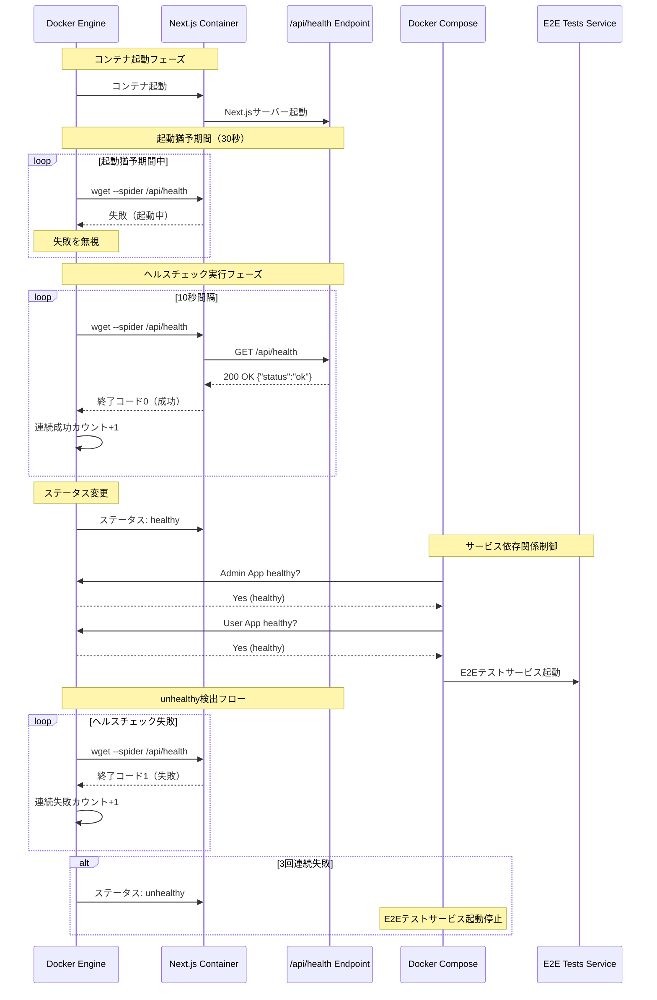
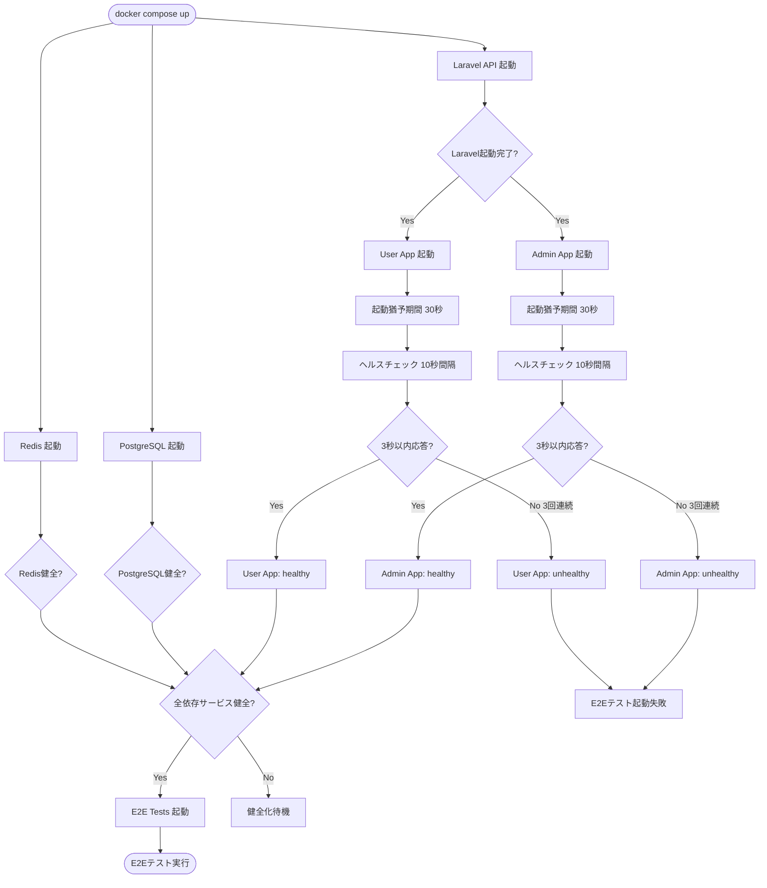
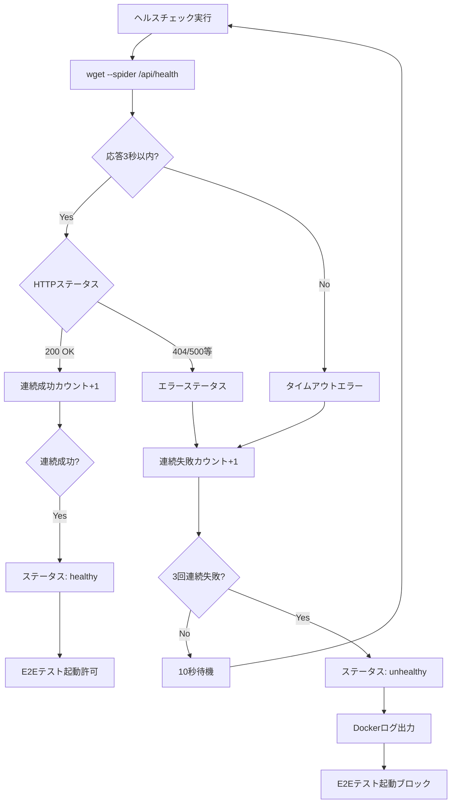

# 技術設計書

## 概要

本機能は、Docker Compose環境におけるNext.jsアプリケーション（Admin App / User App）にヘルスチェック機能を追加し、サービス間依存関係を最適化する。現状の`depends_on`による起動順序制御を拡張し、サービスの健全性を明示的に確認する仕組みを導入することで、E2Eテストの安定性向上と運用性の向上を実現する。

**目的**: E2Eテストサービスがフロントエンドアプリケーションの起動完了を確実に待機し、「Connection refused」エラーを防止する。

**利用者**: DevOpsエンジニア、開発者、CI/CD環境がこの機能を活用し、サービスの健全性確認、デバッグ効率化、本番環境モニタリング基盤準備を実現する。

**影響**: 既存のDocker Compose環境に対して非破壊的な拡張として実装される。既存の起動コマンドや機能には影響を与えず、ヘルスチェック機能を付加する形で実装される。

### ゴール

- E2Eテストサービスがフロントエンドアプリケーションのhealthy状態確認後に起動する依存関係制御を実現
- `docker compose ps`コマンドでサービス健全性ステータス（healthy/unhealthy）を可視化
- Alpine Linuxベースイメージの標準ツール（wget）のみでヘルスチェックを実装し、追加パッケージ不要を維持
- ヘルスチェック処理のパフォーマンス影響を最小限（CPU/メモリ使用率1%未満）に抑制
- Connection refusedエラーの発生頻度を0%に低減

### 非ゴール

- Laravel APIサービスへのヘルスチェック追加（将来的な拡張として検討）
- 本番環境モニタリングツール（Prometheus、Datadog等）との統合（本機能は基盤準備のみ）
- ヘルスチェックエンドポイントのセキュリティ強化（認証・認可は現時点では不要）
- 複雑なヘルスチェックロジック（データベース接続確認、外部API確認等）の実装

## アーキテクチャ

### 既存アーキテクチャ分析

**現状のDocker Compose構成**:
- Admin App、User Appは`depends_on: laravel-api`による起動順序制御のみ実装
- E2Eテストサービスは`depends_on: admin-app, user-app, laravel-api`で依存関係を定義
- PostgreSQL、Redis、MinIOはヘルスチェック機能を既に実装済み（`healthcheck`設定あり）
- 起動順序制御はあるが、サービス起動完了の保証はない（起動順序≠起動完了）

**既存のDockerfile構成**:
- Next.js 20-alpineベースイメージを使用したマルチステージビルド（deps → builder → runner）
- Standaloneビルド出力による軽量イメージ構成
- nextjsユーザー（UID 1001）による最小権限実行
- 固定ポート設計（Admin App: 13002、User App: 13001）

**既存の技術的制約**:
- Alpine LinuxベースイメージによるパッケージサイズとTooling制約
- Next.js 15.5 App Router構成（API Routes機能あり）
- Dockerfileのrunnerステージは`nextjs`ユーザーで実行（非rootユーザー）

### 高レベルアーキテクチャ

```mermaid
graph TB
    E2E[E2E Tests Service]
    AdminApp[Admin App Container]
    UserApp[User App Container]
    LaravelAPI[Laravel API]

    AdminHealth[/api/health Endpoint]
    UserHealth[/api/health Endpoint]

    DockerHealthcheck[Docker HEALTHCHECK]

    E2E -->|depends_on: service_healthy| AdminApp
    E2E -->|depends_on: service_healthy| UserApp
    E2E -->|depends_on: service_started| LaravelAPI

    AdminApp -->|provides| AdminHealth
    UserApp -->|provides| UserHealth

    DockerHealthcheck -->|wget check every 10s| AdminHealth
    DockerHealthcheck -->|wget check every 10s| UserHealth

    AdminApp -->|status: healthy/unhealthy| DockerHealthcheck
    UserApp -->|status: healthy/unhealthy| DockerHealthcheck
```

**アーキテクチャ統合**:
- **既存パターン維持**: Next.jsマルチステージビルド、Alpine Linuxベースイメージ、固定ポート設計
- **新規コンポーネント追加理由**:
  - `/api/health`エンドポイント: Next.js App Router API Routesを活用した軽量ヘルスチェックレスポンダー
  - Dockerfile HEALTHCHECKディレクティブ: Docker標準機能によるコンテナヘルスチェック自動化
  - docker-compose.yml `depends_on.condition`: サービス間依存関係の健全性ベース制御
- **技術スタック整合性**: Next.js 15.5 App Router、Docker Compose v2.1以降、Alpine Linux標準ツール（wget）
- **Steering準拠**: モノレポ構成維持、固定ポート設計踏襲、非破壊的拡張原則遵守

### 技術整合性

本機能は既存の技術スタックに完全に整合する拡張として設計される。

**既存技術スタックとの整合**:
- **Next.js 15.5 App Router**: `/api/health/route.ts`によるAPI Routes実装を採用
- **Docker Compose**: 既存のサービス定義を拡張し、HEALTHCHECKディレクティブと`depends_on.condition`を追加
- **Alpine Linux**: 標準搭載の`wget`コマンドを使用し、追加パッケージインストール不要
- **固定ポート設計**: Admin App（13002）、User App（13001）の既存ポート設定を活用

**新規依存関係の導入**:
- なし（Alpine Linux標準ツールのみ使用）

**既存パターンからの逸脱**:
- なし（既存のDocker構成を非破壊的に拡張）

### 主要な設計決定

#### 決定1: Alpine Linux標準wgetコマンドの採用

**決定**: ヘルスチェックコマンドとして`wget --spider`を使用

**コンテキスト**: Alpine Linuxベースイメージには`wget`が標準搭載されているが、`curl`は含まれていない。追加パッケージのインストールはDockerイメージサイズの増加とビルド時間の延長を招く。

**代替案**:
1. **curl使用**: より一般的だが、Alpine Linuxでは追加インストールが必要（`apk add curl`）
2. **nc（netcat）使用**: TCPポート接続確認のみで、HTTPステータスコード確認不可
3. **カスタムNode.jsスクリプト**: 柔軟だが、実装複雑性とメンテナンスコスト増加

**選択アプローチ**: `wget --no-verbose --tries=1 --spider http://localhost:{PORT}/api/health`

**選択理由**:
- Alpine Linux標準搭載により追加パッケージインストール不要
- `--spider`オプションによりHTTPヘッダー確認のみで軽量動作
- HTTPステータスコード200確認により正確な健全性判定
- Dockerイメージサイズ増加ゼロ、ビルド時間への影響なし

**トレードオフ**:
- **得られるもの**: パッケージ不要、軽量動作、イメージサイズ維持
- **失うもの**: `curl`の高機能性（本用途では不要）、より詳細なエラー情報（ヘルスチェックには過剰）

#### 決定2: 軽量ヘルスチェックエンドポイント実装

**決定**: `/api/health`エンドポイントは`{"status": "ok"}`のみを返す最小実装

**コンテキスト**: ヘルスチェックは10秒間隔で定期実行されるため、エンドポイント処理の軽量性が重要。データベース接続確認や外部API確認は不要であり、Next.jsサーバーの起動完了確認が目的。

**代替案**:
1. **詳細ヘルスチェック**: データベース接続、Redis接続、外部API確認を含む
2. **段階的ヘルスチェック**: `/api/health/live`（起動確認）と`/api/health/ready`（準備完了確認）を分離
3. **メトリクス統合**: Prometheus形式のメトリクスエクスポート

**選択アプローチ**: Next.js App Router API Routesで`Response.json({ status: 'ok' }, { status: 200 })`を返す単一エンドポイント

**選択理由**:
- Next.jsサーバーの起動完了確認のみで十分（フロントエンドアプリケーションのヘルスチェック目的）
- 10秒間隔の定期実行でもパフォーマンス影響最小限
- 実装シンプルで保守容易性高い
- 将来的な拡張（詳細チェック追加）も容易

**トレードオフ**:
- **得られるもの**: 軽量動作、パフォーマンス影響最小化、実装シンプル、保守容易
- **失うもの**: 詳細な健全性情報（現時点では不要）、依存サービス状態確認（将来的に追加可能）

#### 決定3: Docker Compose `service_healthy`条件の採用

**決定**: E2Eテストサービスの`depends_on`で`condition: service_healthy`を使用

**コンテキスト**: 現状の`depends_on`は起動順序制御のみで、サービス起動完了を保証しない。E2Eテストが「Connection refused」エラーに遭遇する可能性がある。

**代替案**:
1. **wait-for-itスクリプト**: 外部スクリプトでポート待機ロジックを実装
2. **docker-compose-wait**: サードパーティツールで依存サービス待機
3. **E2Eテスト内リトライロジック**: Playwright内でリトライ処理を実装

**選択アプローチ**: Docker Compose標準機能の`depends_on.condition: service_healthy`を使用

**選択理由**:
- Docker Compose標準機能による保守容易性
- 外部スクリプトやサードパーティツール不要
- 宣言的な依存関係定義でインフラストラクチャコード化
- CI/CD環境でも透過的に動作

**トレードオフ**:
- **得られるもの**: 標準機能、宣言的定義、外部依存なし、保守容易
- **失うもの**: カスタム待機ロジックの柔軟性（現時点では不要）

## システムフロー

### ヘルスチェック実行フロー



### サービス起動依存関係フロー



## 要件トレーサビリティ

| 要件 | 要件概要 | コンポーネント | インターフェース | フロー |
|------|---------|--------------|--------------|-------|
| 1.1-1.7 | Admin Appヘルスチェック機能 | Admin App `/api/health`、Dockerfile HEALTHCHECK | `GET /api/health` → `200 OK {"status":"ok"}` | ヘルスチェック実行フロー |
| 2.1-2.7 | User Appヘルスチェック機能 | User App `/api/health`、Dockerfile HEALTHCHECK | `GET /api/health` → `200 OK {"status":"ok"}` | ヘルスチェック実行フロー |
| 3.1-3.5 | Docker Composeサービス依存関係最適化 | docker-compose.yml `depends_on.condition` | `service_healthy`条件チェック | サービス起動依存関係フロー |
| 4.1-4.4 | ヘルスチェック可視化 | Docker Engine、Docker Compose CLI | `docker compose ps`コマンド出力 | - |
| 5.1-5.4 | 既存機能への影響最小化 | 全コンポーネント | 既存インターフェース維持 | - |
| 6.1-6.5 | Alpine Linux環境対応 | Dockerfile HEALTHCHECK（wget使用） | `wget --spider`コマンド | ヘルスチェック実行フロー |

## コンポーネントとインターフェース

### フロントエンド層

#### Admin App ヘルスチェックエンドポイント

**責任と境界**
- **主要責任**: Admin Appの起動完了状態をHTTPエンドポイント経由で応答
- **ドメイン境界**: フロントエンドアプリケーション（Admin App）のインフラストラクチャ層
- **データ所有権**: 健全性ステータス情報（起動完了の真偽のみ）
- **トランザクション境界**: 該当なし（ステートレスエンドポイント）

**依存関係**
- **インバウンド**: Docker Engine（HEALTHCHECKコマンド実行）
- **アウトバウンド**: なし（外部依存なし）
- **外部依存**: Next.js 15.5 App Router（API Routes機能）

**サービスインターフェース**

```typescript
// frontend/admin-app/src/app/api/health/route.ts
export async function GET(): Promise<Response> {
  // ヘルスチェックレスポンスを返す
  // Precondition: Next.jsサーバーが起動している
  // Postcondition: HTTPステータス200とJSON {"status": "ok"}を返す
  // Invariant: 常に同じレスポンスを返す（ステートレス）
}
```

**APIコントラクト**

| Method | Endpoint | Request | Response | Errors |
|--------|----------|---------|----------|--------|
| GET | `/api/health` | なし | `200 OK` `{"status": "ok"}` | なし（常に200応答） |

**詳細スキーマ**:
```typescript
// Response Schema
interface HealthCheckResponse {
  status: 'ok'; // 常に'ok'を返す（起動完了を示す）
}
```

**統合戦略**
- **変更アプローチ**: 既存のNext.js App Router構成に新規API Routeを追加（非破壊的拡張）
- **後方互換性**: 既存のエンドポイントやルーティングに影響なし
- **移行パス**: 新規ファイル追加のみ、既存コード変更なし

#### User App ヘルスチェックエンドポイント

**責任と境界**
- **主要責任**: User Appの起動完了状態をHTTPエンドポイント経由で応答
- **ドメイン境界**: フロントエンドアプリケーション（User App）のインフラストラクチャ層
- **データ所有権**: 健全性ステータス情報（起動完了の真偽のみ）
- **トランザクション境界**: 該当なし（ステートレスエンドポイント）

**依存関係**
- **インバウンド**: Docker Engine（HEALTHCHECKコマンド実行）
- **アウトバウンド**: なし（外部依存なし）
- **外部依存**: Next.js 15.5 App Router（API Routes機能）

**サービスインターフェース**

```typescript
// frontend/user-app/src/app/api/health/route.ts
export async function GET(): Promise<Response> {
  // Admin Appと同一のヘルスチェックレスポンスを返す
  // Precondition: Next.jsサーバーが起動している
  // Postcondition: HTTPステータス200とJSON {"status": "ok"}を返す
  // Invariant: 常に同じレスポンスを返す（ステートレス）
}
```

**APIコントラクト**

| Method | Endpoint | Request | Response | Errors |
|--------|----------|---------|----------|--------|
| GET | `/api/health` | なし | `200 OK` `{"status": "ok"}` | なし（常に200応答） |

**統合戦略**
- **変更アプローチ**: Admin Appと同様、新規API Route追加による非破壊的拡張
- **後方互換性**: 既存のエンドポイントやルーティングに影響なし
- **移行パス**: 新規ファイル追加のみ、既存コード変更なし

### インフラストラクチャ層

#### Docker HEALTHCHECKコンポーネント（Admin App）

**責任と境界**
- **主要責任**: Admin Appコンテナの健全性を定期的に確認し、Docker Engineにステータスを報告
- **ドメイン境界**: コンテナオーケストレーション層
- **データ所有権**: コンテナヘルスステータス（healthy/unhealthy/starting）
- **トランザクション境界**: 該当なし（ステータス更新は非トランザクショナル）

**依存関係**
- **インバウンド**: Docker Engine（ヘルスチェック定期実行）
- **アウトバウンド**: Admin App `/api/health`エンドポイント
- **外部依存**: Alpine Linux `wget`コマンド（標準搭載）

**バッチ/ジョブコントラクト**
- **トリガー**: Docker Engine定期実行（10秒間隔）
- **入力**: なし（localhostへのHTTPリクエスト）
- **出力**: 終了コード（0=成功、1=失敗）
- **冪等性**: 完全冪等（何度実行しても同じ結果）
- **リカバリ戦略**: 3回連続失敗で`unhealthy`判定、自動リトライなし（次回定期実行まで待機）

**Dockerfile設定**:
```dockerfile
HEALTHCHECK --interval=10s --timeout=3s --start-period=30s --retries=3 \
  CMD wget --no-verbose --tries=1 --spider http://localhost:13002/api/health || exit 1
```

**パラメータ詳細**:
- `--interval=10s`: ヘルスチェック実行間隔（10秒ごと）
- `--timeout=3s`: タイムアウト時間（3秒以内に応答必須）
- `--start-period=30s`: 起動猶予期間（30秒間は失敗を無視）
- `--retries=3`: リトライ回数（3回連続失敗でunhealthy判定）
- `wget --no-verbose`: 詳細出力抑制（ログノイズ削減）
- `--tries=1`: リトライなし（1回のみ実行）
- `--spider`: ファイルダウンロードなし（HTTPヘッダー確認のみ）
- `|| exit 1`: 失敗時は終了コード1を返す

**統合戦略**
- **変更アプローチ**: Dockerfileに`HEALTHCHECK`ディレクティブを追加（既存ビルドプロセスに影響なし）
- **後方互換性**: HEALTHCHECKなしのコンテナ起動も引き続き可能
- **移行パス**: Dockerfile更新、イメージ再ビルド、コンテナ再作成

#### Docker HEALTHCHECKコンポーネント（User App）

**責任と境界**
- **主要責任**: User Appコンテナの健全性を定期的に確認し、Docker Engineにステータスを報告
- **ドメイン境界**: コンテナオーケストレーション層
- **データ所有権**: コンテナヘルスステータス（healthy/unhealthy/starting）
- **トランザクション境界**: 該当なし（ステータス更新は非トランザクショナル）

**依存関係**
- **インバウンド**: Docker Engine（ヘルスチェック定期実行）
- **アウトバウンド**: User App `/api/health`エンドポイント
- **外部依存**: Alpine Linux `wget`コマンド（標準搭載）

**バッチ/ジョブコントラクト**
- **トリガー**: Docker Engine定期実行（10秒間隔）
- **入力**: なし（localhostへのHTTPリクエスト）
- **出力**: 終了コード（0=成功、1=失敗）
- **冪等性**: 完全冪等（何度実行しても同じ結果）
- **リカバリ戦略**: 3回連続失敗で`unhealthy`判定、自動リトライなし（次回定期実行まで待機）

**Dockerfile設定**:
```dockerfile
HEALTHCHECK --interval=10s --timeout=3s --start-period=30s --retries=3 \
  CMD wget --no-verbose --tries=1 --spider http://localhost:13001/api/health || exit 1
```

**パラメータ詳細**: Admin Appと同一（ポート番号のみ13001に変更）

**統合戦略**
- **変更アプローチ**: Admin Appと同様、Dockerfileに`HEALTHCHECK`ディレクティブ追加
- **後方互換性**: HEALTHCHECKなしのコンテナ起動も引き続き可能
- **移行パス**: Dockerfile更新、イメージ再ビルド、コンテナ再作成

#### Docker Composeサービス依存関係制御

**責任と境界**
- **主要責任**: E2Eテストサービスの起動タイミングをフロントエンドアプリケーションの健全性に基づいて制御
- **ドメイン境界**: コンテナオーケストレーション層
- **データ所有権**: サービス起動順序と依存関係情報
- **トランザクション境界**: 該当なし（宣言的依存関係定義）

**依存関係**
- **インバウンド**: `docker compose up`コマンド
- **アウトバウンド**: Admin App、User App、Laravel APIの健全性ステータス確認
- **外部依存**: Docker Compose v2.1以降（`service_healthy`条件サポート）

**コンフィギュレーションコントラクト**

```yaml
# docker-compose.yml
e2e-tests:
  depends_on:
    admin-app:
      condition: service_healthy  # Admin Appがhealthy状態になるまで待機
    user-app:
      condition: service_healthy  # User Appがhealthy状態になるまで待機
    laravel-api:
      condition: service_started  # Laravel APIは起動完了のみ確認（ヘルスチェックなし）
```

**条件評価ロジック**:
1. `service_started`: サービスプロセス起動完了を確認（ヘルスチェック不要）
2. `service_healthy`: HEALTHCHECKがhealthy状態になるまで待機

**統合戦略**
- **変更アプローチ**: docker-compose.ymlの`e2e-tests`サービス定義を拡張（`depends_on`に条件追加）
- **後方互換性**: 既存のサービス定義に影響なし、E2Eテストサービスのみ変更
- **移行パス**: docker-compose.yml更新、`docker compose up`再実行

## エラーハンドリング

### エラー戦略

本機能のエラーハンドリングは、Docker標準のヘルスチェックメカニズムに依存し、自動リカバリとフェイルファスト原則に基づいて設計される。

### エラーカテゴリと対応

**インフラストラクチャエラー（5xx相当）**:
- **ヘルスチェックタイムアウト**: 3秒以内に`/api/health`が応答しない → Docker Engineがヘルスチェック失敗と判定 → 次回定期実行まで待機
- **コンテナクラッシュ**: Next.jsプロセス異常終了 → Docker Engineがコンテナ再起動 → 起動猶予期間（30秒）後にヘルスチェック再開
- **ネットワーク障害**: localhostへの接続失敗 → wgetが終了コード1を返す → Docker Engineがunhealthyステータスに変更

**起動遅延エラー**:
- **Next.js起動遅延**: 30秒以内に起動完了しない → 起動猶予期間中は失敗を無視 → 猶予期間後も失敗する場合は3回リトライ後unhealthy判定
- **依存サービス遅延**: Laravel API起動遅延によりAdmin/User App起動遅延 → 起動猶予期間でカバー → E2Eテストサービスは全依存サービスhealthy後に起動

**設定エラー（4xx相当）**:
- **ポート設定ミス**: wgetが誤ったポートにアクセス → 接続拒否エラー → unhealthy判定 → 運用者がDockerfile設定修正
- **エンドポイントパス誤り**: `/api/health`が存在しない → 404エラー → unhealthy判定 → 開発者がエンドポイント実装確認

### エラーフロー可視化



### モニタリング

**エラー追跡**:
- Docker Engine標準ログにヘルスチェック失敗情報を記録
- `docker compose logs admin-app`でヘルスチェック関連ログ確認
- `docker inspect <container>`でヘルスチェック履歴確認（最新5件）

**ロギング戦略**:
- ヘルスチェック成功時: ログ出力なし（`--no-verbose`オプション）
- ヘルスチェック失敗時: wgetエラーメッセージをDockerログに記録
- unhealthy状態変更時: Docker Engineがイベントログに記録

**ヘルスモニタリング**:
- `docker compose ps`: サービスステータス一覧表示（healthy/unhealthy表示）
- `docker events`: リアルタイムヘルス状態変更イベント監視
- `docker stats`: CPU/メモリ使用率監視（ヘルスチェック処理影響確認）

**アラート戦略**:
- 本機能では実装しないが、本番環境では以下を推奨:
  - Prometheus `container_health_status`メトリクス収集
  - Datadog Docker統合によるunhealthyアラート
  - PagerDuty/Slack通知統合

## テスト戦略

### ユニットテスト

**ヘルスチェックエンドポイント単体テスト（Jest + Testing Library）**:
1. `GET /api/health`が200ステータスコードを返すことを検証
2. レスポンスボディが`{"status": "ok"}`であることを検証
3. エンドポイントが認証不要でアクセス可能であることを検証
4. エンドポイントが外部依存なしで動作することを検証（モックなしテスト）
5. エンドポイントが常に同じレスポンスを返すことを検証（冪等性確認）

**実装例**:
```typescript
// frontend/admin-app/src/app/api/health/route.test.ts
describe('GET /api/health', () => {
  it('should return 200 status code', async () => {
    const response = await GET();
    expect(response.status).toBe(200);
  });

  it('should return {"status": "ok"} JSON body', async () => {
    const response = await GET();
    const body = await response.json();
    expect(body).toEqual({ status: 'ok' });
  });
});
```

### 統合テスト

**Dockerヘルスチェック統合テスト（Docker環境）**:
1. Dockerfileビルドが成功し、HEALTHCHECKディレクティブが正しく設定されることを検証
2. コンテナ起動後、起動猶予期間（30秒）経過後にhealthyステータスになることを検証
3. `/api/health`エンドポイントを停止した場合、unhealthyステータスに変更されることを検証
4. ヘルスチェックが10秒間隔で定期実行されることを検証（タイムスタンプ確認）
5. 3回連続失敗後にunhealthyステータスに変更されることを検証

**実装例**:
```bash
# docker-healthcheck.test.sh
docker compose up -d admin-app
sleep 35  # 起動猶予期間 + 余裕
STATUS=$(docker inspect admin-app --format='{{.State.Health.Status}}')
[[ "$STATUS" == "healthy" ]] || exit 1
```

### E2Eテスト（Playwright）

**サービス依存関係E2Eテスト**:
1. `docker compose up`実行時、E2Eテストサービスがフロントエンドアプリhealthy後に起動することを検証
2. Admin Appがunhealthy状態の場合、E2Eテストサービスが起動しないことを検証
3. User Appがunhealthy状態の場合、E2Eテストサービスが起動しないことを検証
4. 全依存サービスhealthy後、E2Eテストが正常に実行開始することを検証
5. `docker compose ps`でhealthy/unhealthyステータスが正しく表示されることを検証

**既存E2Eテストへの影響確認**:
1. 既存のE2Eテストが「Connection refused」エラーなしで成功することを検証
2. E2Eテスト実行時間が大幅に増加していないことを検証（healthy待機時間のオーバーヘッド確認）
3. 並列実行（Shard実行）が正常に動作することを検証

### パフォーマンステスト

**ヘルスチェック処理パフォーマンス測定**:
1. `/api/health`エンドポイントの平均応答時間が3秒以内であることを検証
2. ヘルスチェック実行によるCPU使用率増加が1%未満であることを検証
3. ヘルスチェック実行によるメモリ使用率増加が1%未満であることを検証
4. 10秒間隔の定期実行が長時間（1時間以上）安定動作することを検証

**負荷テスト**:
1. 複数コンテナ（Admin App、User App）同時ヘルスチェック実行時のリソース影響を測定
2. E2E並列実行（4 Shard）時のヘルスチェック安定性を検証

## セキュリティ考慮事項

### 脅威モデリング

**脅威1: ヘルスチェックエンドポイントの悪用**
- **攻撃ベクトル**: 外部からの`/api/health`エンドポイントへの大量リクエストによるDoS攻撃
- **影響**: サーバーリソース枯渇、正常なヘルスチェック失敗
- **対策**:
  - 本番環境では`/api/health`へのアクセスをDocker内部ネットワークのみに制限（ファイアウォールルール）
  - レート制限（Next.jsミドルウェアまたはリバースプロキシ）の実装を検討
  - 現時点では開発環境のみのため、対策は将来的な拡張として検討

**脅威2: 情報漏洩**
- **攻撃ベクトル**: `/api/health`エンドポイントレスポンスからシステム情報の推測
- **影響**: アプリケーション構成の推測、標的型攻撃の準備
- **対策**:
  - レスポンスを最小限（`{"status": "ok"}`のみ）に制限
  - バージョン情報、サーバー情報、依存サービス情報を含めない
  - 既に実装済み（最小レスポンス設計）

**脅威3: コンテナ脱出**
- **攻撃ベクトル**: ヘルスチェックコマンド実行権限を悪用したコンテナ脱出
- **影響**: ホストシステムへの不正アクセス
- **対策**:
  - nextjsユーザー（非rootユーザー、UID 1001）でコンテナ実行
  - wgetコマンドはlocalhostのみアクセス（外部接続なし）
  - 既に実装済み（最小権限実行設計）

### セキュリティ制御

**認証・認可**:
- `/api/health`エンドポイントは認証不要（パブリックアクセス）
- 理由: Docker Engine内部からのアクセスのみを想定、認証オーバーヘッド不要
- 本番環境では内部ネットワーク制限により外部アクセス防止

**データ保護**:
- 該当なし（機密データなし、ステートレスエンドポイント）

**監査ログ**:
- ヘルスチェック成功時: ログなし（ノイズ削減）
- ヘルスチェック失敗時: Dockerログに記録
- unhealthy状態変更時: Docker Eventsログに記録

### コンプライアンス

本機能は個人情報や機密データを扱わないため、GDPR、PCI DSS等のコンプライアンス要件は該当しない。

## パフォーマンスとスケーラビリティ

### ターゲットメトリクス

**応答時間**:
- `/api/health`エンドポイント平均応答時間: < 10ms（目標）、< 3秒（上限）
- ヘルスチェック実行間隔: 10秒（固定）
- unhealthy検出時間: 最大40秒（起動猶予期間30秒 + 3回リトライ×10秒間隔）

**リソース使用率**:
- CPU使用率増加: < 1%（10秒間隔のwgetリクエスト）
- メモリ使用率増加: < 1%（ステートレスエンドポイント）
- ネットワーク帯域幅: < 1KB/10秒（HTTPヘッダーのみ）

**スループット**:
- ヘルスチェック同時実行数: 2サービス（Admin App、User App）
- E2E並列実行時のヘルスチェック安定性: 4 Shard並列実行で影響なし

### スケーリングアプローチ

**水平スケーリング**:
- 本機能は各コンテナ個別のヘルスチェックのため、水平スケーリング対応済み
- ロードバランサー配下の複数コンテナ展開時も、各コンテナが独立してヘルスチェック実行
- Docker Swarm/Kubernetesでも同様のHEALTHCHECK機構が利用可能

**垂直スケーリング**:
- 該当なし（ヘルスチェック処理は軽量でリソース要求最小限）

### キャッシング戦略

- 該当なし（ヘルスチェックエンドポイントは常に最新の健全性を返す必要があり、キャッシング不適切）

### 最適化技術

**実装済み最適化**:
1. `wget --spider`: ファイルダウンロードなし、HTTPヘッダー確認のみ
2. `--no-verbose`: 詳細ログ出力抑制、ログI/O削減
3. `--tries=1`: リトライなし、即座に失敗応答
4. ステートレスエンドポイント: メモリフットプリント最小化
5. 外部依存なし: データベース接続、外部API呼び出しなし

**将来的な最適化**:
1. Prometheus `/metrics`エンドポイント統合による詳細メトリクス収集
2. `/api/health/live`（起動確認）と`/api/health/ready`（準備完了確認）の分離
3. より詳細なヘルスチェック（依存サービス接続確認）の段階的追加

## 関連ドキュメント

- [Docker Compose Healthcheck公式ドキュメント](https://docs.docker.com/compose/compose-file/05-services/#healthcheck)
- [Next.js API Routes公式ドキュメント](https://nextjs.org/docs/app/building-your-application/routing/route-handlers)
- [Alpine Linux wget公式ドキュメント](https://www.busybox.net/downloads/BusyBox.html#wget)
- PR #62: Next.js Dockerfile作成とDocker Compose統合実装
- `.kiro/steering/structure.md`: プロジェクト構造ガイドライン
- `.kiro/steering/tech.md`: 技術スタック定義
- `docker-compose.yml`: 現行のDocker Compose設定
