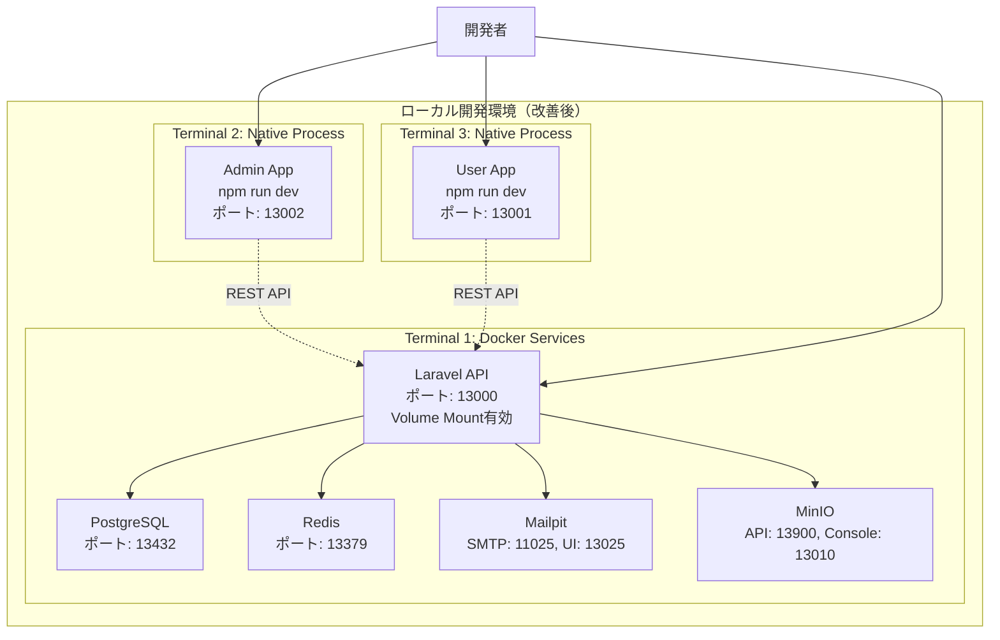
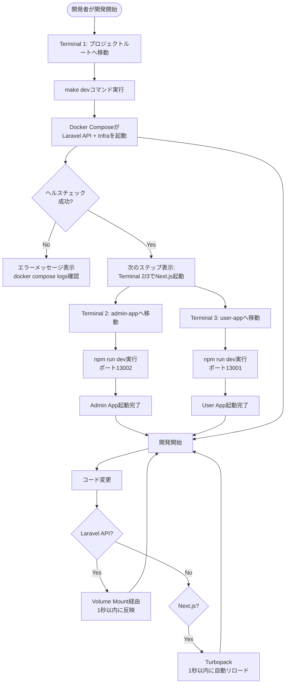
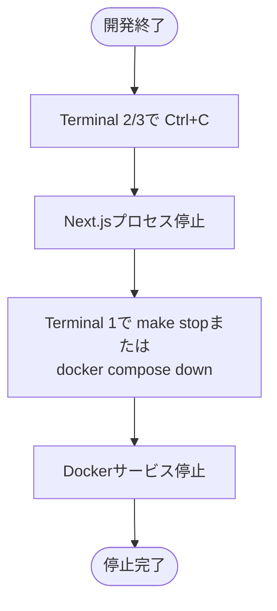
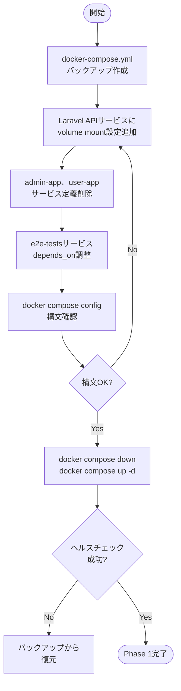
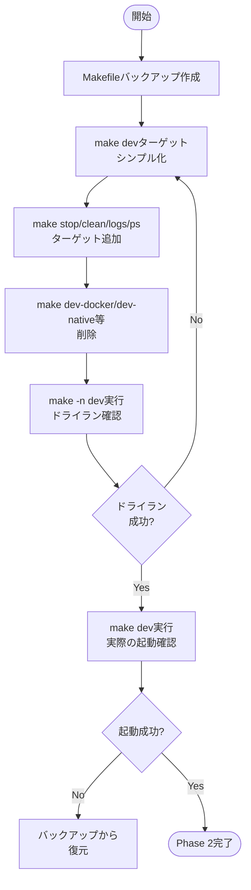
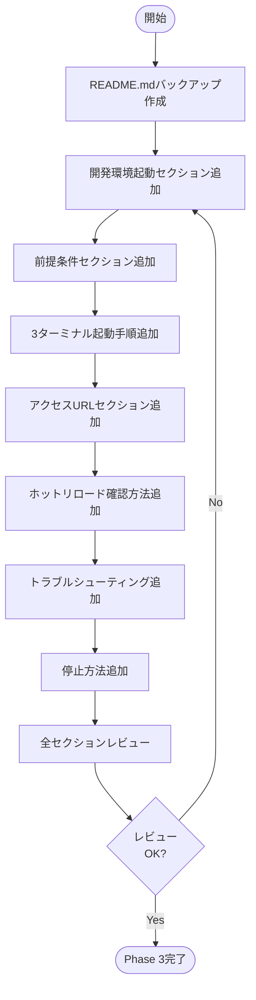
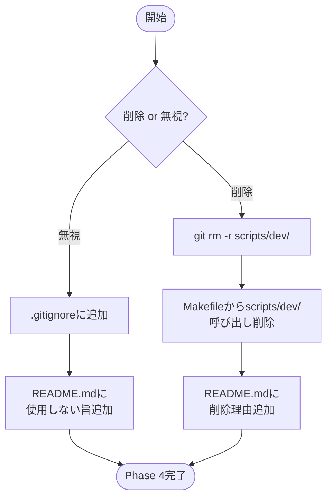
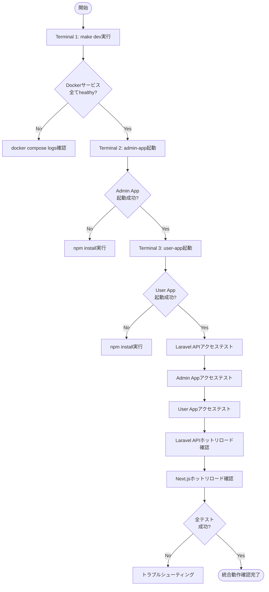

# Docker設定改善 - 技術設計

## Overview

この設計は、ローカル開発環境のDocker設定を改善し、開発者エクスペリエンスを向上させます。複雑な`scripts/dev/`スクリプトを削除し、シンプルな3ターミナル起動方式（Laravel API: Docker、Next.jsアプリ: ネイティブ起動）を導入します。Laravel APIはvolume mountによるホットリロード対応、Next.jsアプリはネイティブ起動でTurbopackの最高速パフォーマンスを実現します。

**Purpose**: 開発者が即座に開発を開始でき、コード変更が1秒以内に反映される、シンプルで高速な開発環境を提供します。

**Users**: プロジェクトに参加する全開発者、およびコードレビューやデモを行うステークホルダーが対象です。

**Impact**: 現在の複雑なスクリプトベースの起動方式から、標準的なDocker Composeコマンドとネイティブ起動の組み合わせに変更します。開発サイクルの高速化とオンボーディング時間の短縮を実現します。

### Goals

- Laravel APIのホットリロード有効化（volume mount設定、1秒以内の反映）
- Next.jsアプリのネイティブ起動対応（Docker定義削除、Turbopack最高速パフォーマンス）
- 開発環境起動手順の明確化（README.md整備、3ターミナル起動方式）
- Makefileのシンプル化（標準的なDocker Composeコマンドのみ使用）
- 複雑な`scripts/dev/`の削除または無視
- E2Eテスト設定の調整（ネイティブ起動に対応）

### Non-Goals

- 本番環境のDocker設定変更（CI/CDで別途構築）
- 既存のE2Eテスト実装の変更（Playwrightテスト内容は変更しない）
- `scripts/dev/`の改修（削除または無視）
- Docker Composeのprofile機能の廃止（既存設定を維持）

## Architecture

### 既存アーキテクチャ分析

現在の開発環境は以下の構成です：

**現在の課題**:
- `scripts/dev/main.sh`が複雑なTypeScript/Bash混在構成で、`concurrently`のエラーで起動不能
- Laravel APIがDockerで動作するがvolume mountなしのため、コード変更のたびに再ビルドが必要
- Next.jsアプリ（admin-app、user-app）がDocker起動を試みているが、ネイティブ起動と比較してパフォーマンス低下
- 開発環境の起動方法が不明確で、新規参加者がすぐに開発を開始できない
- Makefileがscriptsスクリプトをラップしており、直接的なDocker Compose操作ができない

**既存の保持すべきパターン**:
- Laravel Sail基盤のDocker環境（PHP 8.4、PostgreSQL、Redis等）
- 固定ポート設計（Laravel API: 13000、Admin App: 13002、User App: 13001）
- プロジェクト固有Dockerイメージ命名（`laravel-next-b2c/app`）
- ヘルスチェック統合（`/api/health`エンドポイント）
- Docker Composeのprofile機能（api、frontend、infra、e2e）

### High-Level Architecture



**Architecture Integration**:
- **既存パターン保持**: Docker Composeによるインフラ管理、固定ポート設計、Laravel Sailベースの環境
- **新規コンポーネント追加理由**: Laravel APIにvolume mount設定を追加（ホットリロード有効化）、Next.jsアプリのDocker定義削除（ネイティブ起動対応）
- **技術スタック整合性**: Docker + ネイティブプロセスのハイブリッド構成（既存のdev-server-startup-scriptで実装済みのコンセプトを標準化）
- **Steering準拠**: 開発者エクスペリエンス最大化、シンプルで理解しやすい構成、固定ポート設計の維持

## System Flows

### 開発環境起動フロー



### 停止フロー



## Requirements Traceability

| Requirement | Requirement Summary | Components | Interfaces | Flows |
|-------------|---------------------|------------|------------|-------|
| 1.1-1.5 | Laravel API Dockerホットリロード対応 | docker-compose.yml (laravel-api) | Volume mount設定、APP_ENV=local | 開発環境起動フロー |
| 2.1-2.7 | Next.jsアプリネイティブ起動対応 | docker-compose.yml (admin-app/user-app削除) | npm run dev | 開発環境起動フロー |
| 3.1-3.7 | 開発環境起動手順ドキュメント整備 | README.md | セクション「開発環境起動」 | 開発環境起動フロー |
| 4.1-4.8 | Makefileシンプル化 | Makefile | make dev/stop/clean/logs/ps/help | 開発環境起動フロー、停止フロー |
| 5.1-5.2 | 不要スクリプト整理 | scripts/dev/ | 削除または無視 | - |
| 6.1-6.5 | E2Eテスト環境設定調整 | docker-compose.yml (e2e-tests) | depends_on、環境変数 | - |
| 7.1-7.8 | 統合動作確認 | 全コンポーネント | 全インターフェース | 開発環境起動フロー |

## Components and Interfaces

### Infrastructure / Docker Services

#### docker-compose.yml（Laravel APIサービス）

**Responsibility & Boundaries**
- **Primary Responsibility**: Laravel APIコンテナの定義とvolume mount設定によるホットリロード有効化
- **Domain Boundary**: Docker基盤層（Infrastructure）
- **Data Ownership**: Docker Composeサービス定義、volume mount設定、環境変数
- **Transaction Boundary**: Docker Compose起動・停止のライフサイクル

**Dependencies**
- **Inbound**: Makefile、開発者の手動コマンド実行
- **Outbound**: PostgreSQL、Redis、Mailpit、MinIOコンテナ
- **External**: Docker Engine、Laravel Sailベースイメージ

**Contract Definition**

**Service Interface** (docker-compose.ymlのlaravel-apiサービス):
```yaml
laravel-api:
  build:
    context: ./backend/laravel-api/docker/8.4
    dockerfile: Dockerfile
  image: laravel-next-b2c/app
  container_name: laravel-api
  ports:
    - '${APP_PORT:-13000}:${APP_PORT:-13000}'
  environment:
    APP_ENV: local  # ホットリロード有効化のため追加
    APP_PORT: '${APP_PORT:-13000}'
    LARAVEL_SAIL: 1
  volumes:
    - './backend/laravel-api:/var/www/html:cached'  # ソースコードマウント
    - '/var/www/html/vendor'  # vendorディレクトリ除外
  networks:
    - app-network
  depends_on:
    - pgsql
    - redis
    - mailpit
    - minio
  healthcheck:
    test: ['CMD', 'sh', '-c', 'wget --no-verbose --tries=1 --spider http://127.0.0.1:$${APP_PORT:-13000}/api/health || exit 1']
    interval: 10s
    timeout: 3s
    start_period: 30s
    retries: 3
  profiles:
    - api
```

- **Preconditions**: Dockerfileが存在し、PostgreSQL/Redis/Mailpit/MinIOコンテナが起動可能
- **Postconditions**: Laravel APIコンテナがポート13000で起動、volume mount有効でホットリロード動作
- **Invariants**: 固定ポート13000、プロジェクト固有イメージ名`laravel-next-b2c/app`

**Integration Strategy**:
- **Modification Approach**: 既存のlaravel-apiサービス定義にvolumes設定とAPP_ENV環境変数を追加
- **Backward Compatibility**: 既存のDocker Composeコマンドとの互換性維持
- **Migration Path**: docker-compose.ymlを編集 → 既存コンテナ削除 → 新規起動

#### docker-compose.yml（Next.jsサービス削除）

**Responsibility & Boundaries**
- **Primary Responsibility**: admin-app、user-appサービス定義の削除（ネイティブ起動に移行）
- **Domain Boundary**: Docker基盤層（Infrastructure）
- **Data Ownership**: Docker Composeサービス定義
- **Transaction Boundary**: Docker Compose起動・停止のライフサイクル

**Dependencies**
- **Inbound**: Makefile、開発者の手動コマンド実行
- **Outbound**: なし（サービス削除）
- **External**: なし

**Contract Definition**

**Modification Details**:
- `admin-app`サービス定義をdocker-compose.ymlから完全削除
- `user-app`サービス定義をdocker-compose.ymlから完全削除
- profiles: frontendグループから2サービスを削除

- **Preconditions**: docker-compose.ymlにadmin-app、user-appサービスが存在
- **Postconditions**: docker-compose.ymlからNext.jsサービス定義が削除され、ネイティブ起動が標準となる
- **Invariants**: 既存のapi、infra、e2eプロファイルは維持

**Integration Strategy**:
- **Modification Approach**: docker-compose.ymlからadmin-app、user-appセクション削除
- **Backward Compatibility**: frontendプロファイルは残すが、サービス定義なしでエラーとなる（意図的）
- **Migration Path**: サービス削除 → 開発者はネイティブ起動を使用

#### docker-compose.yml（E2Eテストサービス調整）

**Responsibility & Boundaries**
- **Primary Responsibility**: E2Eテストサービスの依存関係をネイティブ起動Next.jsアプリに対応
- **Domain Boundary**: Docker基盤層（Infrastructure）、E2Eテスト環境
- **Data Ownership**: e2e-testsサービス定義、depends_on設定、環境変数
- **Transaction Boundary**: E2Eテスト実行のライフサイクル

**Dependencies**
- **Inbound**: CI/CD、開発者の手動テスト実行
- **Outbound**: Laravel API（healthy状態依存）、localhost:13001/13002のNext.jsアプリ
- **External**: Playwright、Dockerネットワーク

**Contract Definition**

**Service Interface** (docker-compose.ymlのe2e-testsサービス):
```yaml
e2e-tests:
  image: mcr.microsoft.com/playwright:v1.47.2-jammy
  container_name: e2e-tests
  working_dir: /app
  environment:
    E2E_ADMIN_URL: 'http://localhost:13002'  # host.docker.internalではなくlocalhostに変更
    E2E_USER_URL: 'http://localhost:13001'   # host.docker.internalではなくlocalhostに変更
    E2E_API_URL: 'http://laravel-api:13000'
  volumes:
    - './e2e:/app'
  networks:
    - app-network
  depends_on:
    laravel-api:
      condition: service_healthy
    # admin-app、user-app削除（ネイティブ起動のため）
  shm_size: '1gb'
  command: >
    sh -c "
      npm install &&
      npx playwright install --with-deps &&
      npm run test:ci
    "
  profiles:
    - e2e
```

- **Preconditions**: Laravel APIが起動、Next.jsアプリがlocalhost:13001/13002でネイティブ起動済み
- **Postconditions**: E2Eテストがネイティブ起動Next.jsアプリに接続してテスト実行
- **Invariants**: Laravel API依存のみ、Next.jsアプリは開発者が手動起動

**Integration Strategy**:
- **Modification Approach**: depends_onからadmin-app、user-appを削除、環境変数URLをlocalhostに変更
- **Backward Compatibility**: CI/CD環境では事前にNext.jsアプリを起動する必要がある
- **Migration Path**: depends_on調整 → CI/CD設定でNext.js起動追加

### Build / Makefile

#### Makefile（シンプル化）

**Responsibility & Boundaries**
- **Primary Responsibility**: Docker Composeコマンドのシンプルなラッパー提供
- **Domain Boundary**: ビルド・タスク管理層
- **Data Ownership**: Makeタスク定義
- **Transaction Boundary**: 個別コマンド実行単位

**Dependencies**
- **Inbound**: 開発者のコマンド実行
- **Outbound**: Docker Compose CLI、docker-compose.yml
- **External**: make、シェル環境

**Contract Definition**

**API Contract** (Makefileターゲット):

| Target | Command | Purpose | Output |
|--------|---------|---------|--------|
| `make dev` | `docker compose up -d` | Dockerサービス起動（Laravel API + Infra） | 次ステップガイダンス表示 |
| `make stop` | `docker compose stop` | Dockerサービス停止 | サービス停止確認 |
| `make clean` | `docker compose down -v` | Dockerコンテナ・ボリューム完全削除 | クリーンアップ完了 |
| `make logs` | `docker compose logs -f` | Dockerサービスログ表示 | リアルタイムログ |
| `make ps` | `docker compose ps` | Dockerサービス状態表示 | サービス一覧 |
| `make help` | `@awk ...` | 利用可能コマンド一覧表示 | ヘルプ表示 |

**Implementation Details**:
```makefile
dev: ## Dockerサービス起動（Laravel API + Infra）
	@echo "🚀 Dockerサービスを起動中..."
	docker compose up -d
	@echo "✅ Dockerサービス起動完了！"
	@echo ""
	@echo "📝 次のステップ:"
	@echo "  Terminal 2: cd frontend/admin-app && npm run dev"
	@echo "  Terminal 3: cd frontend/user-app && npm run dev"
	@echo ""
	@echo "🌐 アクセスURL:"
	@echo "  Laravel API: http://localhost:13000"
	@echo "  Admin App:   http://localhost:13002"
	@echo "  User App:    http://localhost:13001"

stop: ## Dockerサービス停止
	docker compose stop

clean: ## Dockerコンテナ・ボリューム完全削除
	docker compose down -v

logs: ## Dockerサービスログ表示
	docker compose logs -f

ps: ## Dockerサービス状態表示
	docker compose ps

help: ## ヘルプ表示
	@echo "利用可能なコマンド:"
	@awk 'BEGIN {FS = ":.*?## "} /^[a-zA-Z_-]+:.*?## / {printf "  \033[36m%-20s\033[0m %s\n", $$1, $$2}' $(MAKEFILE_LIST)
```

- **Preconditions**: docker-compose.ymlが存在、Docker Engineが起動
- **Postconditions**: 各コマンドに応じたDocker Compose操作実行
- **Invariants**: シンプルなDocker Composeコマンドラッパー、複雑なスクリプト呼び出しなし

**Integration Strategy**:
- **Modification Approach**: 既存の`make dev`、`make dev-stop`ターゲットを削除し、新規シンプルなターゲットに置き換え
- **Backward Compatibility**: 既存のテスト関連ターゲット（`test-all`等）は維持
- **Migration Path**: Makefile編集 → 開発者は新しい`make dev`コマンドを使用

### Documentation / README.md

#### README.md（開発環境起動セクション）

**Responsibility & Boundaries**
- **Primary Responsibility**: 開発環境の起動手順を明確に記載し、新規参加者がすぐに開発を開始できるようにする
- **Domain Boundary**: ドキュメント層
- **Data Ownership**: 開発環境起動手順、トラブルシューティング
- **Transaction Boundary**: ドキュメント参照単位

**Dependencies**
- **Inbound**: 開発者のドキュメント参照
- **Outbound**: なし
- **External**: GitHub、ローカルファイルシステム

**Contract Definition**

**Documentation Structure**:
```markdown
## 🚀 開発環境起動

### 前提条件
- Docker Desktop（20.10以降推奨）
- Node.js 20+
- PHP 8.4+（オプション、Laravel Tinkerなどローカルコマンド実行時）

### 起動手順（3ターミナル方式）

#### Terminal 1: Dockerサービス起動
```bash
# プロジェクトルートへ移動
cd laravel-next-b2c

# Dockerサービス起動（PostgreSQL、Redis、Mailpit、MinIO、Laravel API）
make dev
```

#### Terminal 2: Admin App起動
```bash
cd frontend/admin-app
npm run dev
```

#### Terminal 3: User App起動
```bash
cd frontend/user-app
npm run dev
```

### アクセスURL
- **Laravel API**: http://localhost:13000
- **Admin App**: http://localhost:13002
- **User App**: http://localhost:13001
- **Mailpit UI**: http://localhost:13025
- **MinIO Console**: http://localhost:13010

### ホットリロード確認
#### Laravel API
1. `backend/laravel-api/routes/api.php` を編集
2. 1秒以内に `http://localhost:13000/api/health` で変更確認

#### Next.js
1. `frontend/admin-app/app/page.tsx` を編集
2. 1秒以内にブラウザが自動リロード

### 停止方法
1. Terminal 2/3で `Ctrl+C`（Next.jsアプリ停止）
2. Terminal 1で `make stop` または `docker compose down`

### トラブルシューティング
- **ポート競合エラー**: `docker compose down` → ポート使用確認 → 再起動
- **ホットリロード不具合**: `docker compose down -v` → `make dev` → キャッシュクリア再起動
```

- **Preconditions**: なし（ドキュメントアクセス可能）
- **Postconditions**: 開発者が開発環境起動手順を理解
- **Invariants**: 3ターミナル起動方式、固定ポート13000/13001/13002

**Integration Strategy**:
- **Modification Approach**: README.mdに新規セクション「開発環境起動」を追加、既存セクションとの整合性確保
- **Backward Compatibility**: 既存の「クイックスタート」セクションからこのセクションへのリンク追加
- **Migration Path**: README.md編集 → 既存ドキュメントとの重複削除

### Cleanup / scripts/dev/

#### scripts/dev/（削除または無視）

**Responsibility & Boundaries**
- **Primary Responsibility**: 複雑なスクリプトの削除または使用しない旨の明記
- **Domain Boundary**: スクリプト層
- **Data Ownership**: `scripts/dev/`ディレクトリ
- **Transaction Boundary**: ディレクトリ削除またはドキュメント更新

**Dependencies**
- **Inbound**: なし（使用しない）
- **Outbound**: なし
- **External**: Git、ファイルシステム

**Contract Definition**

**Cleanup Strategy**:
- **Option A（推奨）**: `scripts/dev/`ディレクトリを完全削除
  - Gitから削除: `git rm -r scripts/dev/`
  - Makefileから`scripts/dev/main.sh`呼び出しを削除
- **Option B**: `scripts/dev/`ディレクトリを残すが、使用しない旨をREADME.mdに明記
  - README.mdに注意書き追加: 「`scripts/dev/`は使用しません。上記の起動手順に従ってください」
  - `.gitignore`に追加して無視

- **Preconditions**: `scripts/dev/`ディレクトリが存在
- **Postconditions**: `scripts/dev/`が削除または無視され、開発者は新しい起動方式を使用
- **Invariants**: シンプルな開発環境起動方式

**Integration Strategy**:
- **Modification Approach**: `scripts/dev/`ディレクトリ削除または.gitignore追加
- **Backward Compatibility**: 既存のMakefileから`scripts/dev/main.sh`呼び出しを削除
- **Migration Path**: ディレクトリ削除 → Makefile更新 → README.md更新

## Data Models

本機能はDocker設定とドキュメント整備が中心のため、新規データモデルは不要です。

## Error Handling

### Error Strategy

開発環境起動時のエラーは、明確なエラーメッセージとトラブルシューティングガイドで対応します。

### Error Categories and Responses

**User Errors** (操作ミス):
- **ポート競合エラー**: Docker起動時にポート13000/13001/13002が使用中 → `make stop`で既存サービス停止 → 再起動
- **npm依存関係エラー**: `npm run dev`実行時に依存関係不足 → `npm install`実行 → 再起動

**System Errors** (環境問題):
- **Docker Engineエラー**: Docker起動失敗 → Docker Desktop確認 → 再起動
- **volume mountエラー**: Laravel APIのvolume mount失敗 → `docker compose down -v` → 再起動

**Business Logic Errors** (設定問題):
- **ヘルスチェック失敗**: Laravel APIのヘルスチェックが失敗 → `docker compose logs laravel-api`でログ確認 → 環境変数確認

### Monitoring

- **Docker Composeログ**: `docker compose logs -f`でリアルタイムログ確認
- **ヘルスチェック**: `docker compose ps`でサービス状態確認（healthy/unhealthy表示）
- **エラーログ**: Laravel API、Next.jsアプリの標準出力でエラー確認

## Testing Strategy

### Unit Tests
- Makefile構文チェック（make -n dev/stop/clean等でドライラン実行）
- docker-compose.yml構文チェック（docker compose config実行）
- README.mdリンク確認（markdownlint等）

### Integration Tests
- Dockerサービス起動テスト（`make dev` → `docker compose ps`でhealthy確認）
- Laravel APIホットリロードテスト（routes/api.php編集 → curl http://localhost:13000/api/health）
- Next.jsホットリロードテスト（app/page.tsx編集 → ブラウザ自動リロード確認）

### E2E/UI Tests
- 既存のPlaywright E2Eテスト実行（`npm run test:ci`）
- ネイティブ起動Next.jsアプリへの接続確認
- E2Eテストの環境変数（E2E_ADMIN_URL、E2E_USER_URL）正常性確認

### Performance/Load
- Laravel APIホットリロード速度測定（1秒以内の反映確認）
- Next.jsホットリロード速度測定（1秒以内の自動リロード確認）
- Docker起動時間測定（`make dev`実行から全サービスhealthy状態まで）

## Security Considerations

**データ保護**:
- volume mount設定により、vendorディレクトリはコンテナ側に保持（ローカルファイルシステムから分離）
- `.env`ファイルはvolume mountから除外（環境変数で設定）

**アクセス制御**:
- ローカル開発環境のため、ポートはlocalhost:13000/13001/13002のみ公開
- 本番環境のDocker設定は別途CI/CDで構築（本要件対象外）

## Migration Strategy

### Phase 1: docker-compose.yml更新（1時間）



**Process**:
1. docker-compose.ymlバックアップ作成
2. laravel-apiサービスにvolumes設定追加（`./backend/laravel-api:/var/www/html:cached`、`/var/www/html/vendor`）
3. APP_ENV=local環境変数追加
4. admin-app、user-appサービス定義削除
5. e2e-testsサービスのdepends_on調整（admin-app、user-app削除）
6. e2e-testsサービスの環境変数調整（E2E_ADMIN_URL、E2E_USER_URLをlocalhostに変更）
7. docker compose config実行（構文確認）
8. docker compose down → docker compose up -d
9. ヘルスチェック確認

**Rollback Triggers**: docker compose config失敗、ヘルスチェック失敗

**Validation Checkpoints**: docker compose config成功、docker compose ps全サービスhealthy

### Phase 2: Makefile更新（30分）



**Process**:
1. Makefileバックアップ作成
2. make devターゲットをシンプル化（docker compose up -dのみ）
3. 次ステップガイダンス追加（Terminal 2/3でNext.js起動）
4. make stop/clean/logs/ps/helpターゲット追加
5. 既存の複雑なdev-docker/dev-native等ターゲット削除
6. make -n dev実行（ドライラン確認）
7. make dev実行（実際の起動確認）

**Rollback Triggers**: make -n dev失敗、make dev実行失敗

**Validation Checkpoints**: make -n dev成功、make dev実行でDocker起動成功

### Phase 3: README.md更新（1時間）



**Process**:
1. README.mdバックアップ作成
2. 「開発環境起動」セクション追加
3. 前提条件（Docker Desktop、Node.js 20+、PHP 8.4+）記載
4. 3ターミナル起動手順（Terminal 1: make dev、Terminal 2: admin-app、Terminal 3: user-app）記載
5. アクセスURL（Laravel API、Admin App、User App）記載
6. ホットリロード確認方法（Laravel API、Next.js）記載
7. トラブルシューティング（ポート競合、ホットリロード不具合）記載
8. 停止方法（Ctrl+C、make stop）記載
9. 全セクションレビュー

**Rollback Triggers**: ドキュメント内容不整合、既存セクションとの重複

**Validation Checkpoints**: 全セクション記載完了、既存セクションとの整合性確認

### Phase 4: scripts/dev/削除または無視（30分）



**Process**:
- **Option A（推奨）**: `scripts/dev/`ディレクトリ完全削除
  1. git rm -r scripts/dev/実行
  2. Makefileからscripts/dev/main.sh呼び出し削除
  3. README.mdに削除理由追加
- **Option B**: `scripts/dev/`ディレクトリ残すが無視
  1. .gitignoreにscripts/dev/追加
  2. README.mdに「scripts/dev/は使用しません」追加

**Rollback Triggers**: Git操作失敗、Makefile更新失敗

**Validation Checkpoints**: scripts/dev/削除または無視完了、Makefile動作確認

### Phase 5: 統合動作確認（1時間）



**Process**:
1. make dev実行（Terminal 1）
2. docker compose psで全サービスhealthy確認
3. admin-app起動（Terminal 2）
4. user-app起動（Terminal 3）
5. http://localhost:13000/api/health アクセス確認
6. http://localhost:13001 アクセス確認
7. http://localhost:13002 アクセス確認
8. Laravel APIホットリロード確認（routes/api.php編集 → 1秒以内反映）
9. Next.jsホットリロード確認（app/page.tsx編集 → 1秒以内自動リロード）

**Rollback Triggers**: Dockerサービス起動失敗、Next.jsアプリ起動失敗、ホットリロード不具合

**Validation Checkpoints**: 全サービス起動成功、全URLアクセス成功、ホットリロード1秒以内確認

---

**総所要時間**: 約4時間

**移行完了条件**:
- docker-compose.yml更新完了
- Makefile更新完了
- README.md更新完了
- scripts/dev/削除または無視完了
- 統合動作確認完了（全サービス起動、ホットリロード1秒以内）
