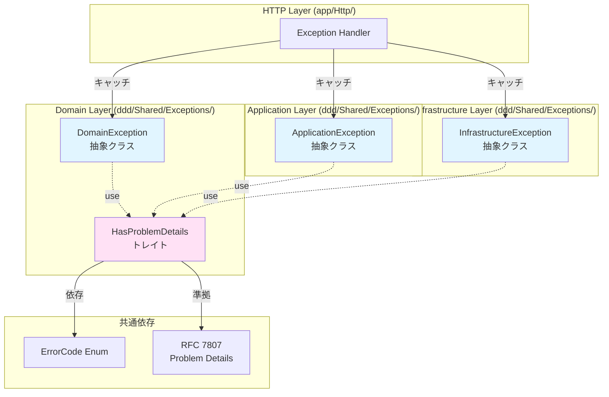

# Technical Design Document

## Overview

本設計は、DDD/クリーンアーキテクチャのDomain層例外基底クラス`DomainException`に対して、`HasProblemDetails`トレイトを適用することで、コードの重複を排除し、DRY原則を徹底するリファクタリングを実現します。

**目的**: `DomainException`と`HasProblemDetails`トレイト間の`toProblemDetails()`メソッド実装重複を解消し、RFC 7807 Problem Details生成ロジックを単一箇所（`HasProblemDetails`トレイト）に集約します。これにより、将来のRFC 7807仕様変更時の修正箇所を1箇所のみに限定し、保守性を向上させます。

**対象ユーザー**: プロジェクト開発者全員。特に、Domain層の例外処理を実装・保守するバックエンド開発者、およびDDD/クリーンアーキテクチャの設計原則を遵守するアーキテクト。

**システムへの影響**: 既存のエラーレスポンス形式に影響を与えない完全な後方互換性を保証します。全ての既存テスト（Unit/Feature/Architecture/E2E）は継続してパスし、機能的な変更は一切伴いません。`ApplicationException`、`InfrastructureException`と同じトレイト適用パターンに統一され、3つの例外基底クラス間の一貫性が保証されます。

### Goals

- **DRY原則の徹底**: `toProblemDetails()`実装を`HasProblemDetails`トレイトに集約
- **保守性向上**: RFC 7807仕様変更時の修正箇所を1箇所のみに限定
- **設計パターン統一**: `ApplicationException`、`InfrastructureException`との一貫性保証
- **品質基準維持**: カバレッジ96.1%以上、Larastan Level 8準拠、DDD原則準拠の維持

### Non-Goals

- `ApplicationException`、`InfrastructureException`の変更（既にトレイト使用済み）
- RFC 7807レスポンス形式の変更（既存の実装を完全に維持）
- 新規例外クラスの追加
- エラーコード体系の変更
- フロントエンドのエラーハンドリング変更
- パフォーマンス最適化（既存と同一のパフォーマンス特性を維持）

---

## Architecture

### Existing Architecture Analysis

**現在のアーキテクチャ**:

DDD/クリーンアーキテクチャの4層構造において、例外基底クラスは以下のように設計されています：

- **Domain層**: `DomainException`（抽象クラス、ビジネスロジックエラーを表現）
- **Application層**: `ApplicationException`（抽象クラス、ユースケース実行エラーを表現、`HasProblemDetails`トレイト使用済み）
- **Infrastructure層**: `InfrastructureException`（抽象クラス、外部システムエラーを表現、`HasProblemDetails`トレイト使用済み）

**現状の問題点**:

1. **コード重複**: `DomainException`は`toProblemDetails()`メソッドを直接実装しており、`HasProblemDetails`トレイトと完全に同一のロジックが重複
2. **保守性の低下**: RFC 7807仕様変更時に2箇所（`DomainException`と`HasProblemDetails`）を修正する必要
3. **設計不一致**: `ApplicationException`、`InfrastructureException`は既に`HasProblemDetails`トレイトを使用しているが、`DomainException`のみが直接実装している不整合

**保持される既存パターン**:

- DDD/クリーンアーキテクチャの依存方向（HTTP → Application → Domain ← Infrastructure）
- RFC 7807 Problem Details形式のエラーレスポンス生成
- `ErrorCode::fromString()->getType()`による型安全なtype URI生成
- Request ID伝播によるトレーサビリティ確保

**技術的制約**:

- PHPのトレイト多重継承に関する制約（メソッド名の衝突を回避）
- Larastan Level 8静的解析の要求事項（型安全性保証）
- Pestテストフレームワークの制約（Architecture Test実装方法）

### High-Level Architecture

リファクタリング後のアーキテクチャ：



**アーキテクチャ統合**:

- **既存パターン保持**: DDD 4層構造、依存性逆転原則、RFC 7807準拠を完全に維持
- **新コンポーネントの論理的根拠**: なし（既存トレイトの適用のみ）
- **技術スタック整合性**: PHP 8.4のトレイト機能、Laravel 12のヘルパー関数、Pest 4のArchitecture Testingを活用
- **Steering準拠**: `.kiro/steering/structure.md`（DDD 4層構造）、`.kiro/steering/tech.md`（PHP 8.4、Laravel 12）、`.kiro/steering/product.md`（品質基準96.1%カバレッジ）に完全準拠

### Technology Alignment

本リファクタリングは、既存の技術スタックとアーキテクチャパターンに完全に整合します：

**既存技術スタックの活用**:

| 層 | 既存技術 | 整合性 |
|---|----------|---------|
| Backend | PHP 8.4, Laravel 12 | PHPトレイト機能を活用、Laravel標準例外処理パターンに準拠 |
| DDD/Clean Architecture | 4層構造（Domain/Application/Infrastructure/HTTP） | Domain層の純粋性を維持、依存性逆転原則を遵守 |
| Testing | Pest 4, Larastan Level 8, Laravel Pint | Architecture Test追加、静的解析・コードスタイル準拠 |
| RFC 7807準拠 | ErrorCode Enum、HasProblemDetails trait | 既存のRFC 7807実装を完全に維持 |

**新規依存関係**: なし（既存の`HasProblemDetails`トレイトを適用するのみ）

**既存パターンからの逸脱**: なし（`ApplicationException`、`InfrastructureException`と同じトレイト適用パターンに統一）

### Key Design Decisions

#### Decision 1: トレイト適用によるコード重複排除

**Decision**: `DomainException`に`HasProblemDetails`トレイトを適用し、重複する`toProblemDetails()`および`getErrorType()`メソッドを削除する

**Context**:
- 現状、`DomainException`と`HasProblemDetails`トレイトの両方に`toProblemDetails()`メソッドの実装が存在
- 将来のRFC 7807仕様変更時に2箇所を修正する必要があり、保守性が低下
- `ApplicationException`、`InfrastructureException`は既に`HasProblemDetails`トレイトを使用しており、設計不一致が存在

**Alternatives**:
1. **現状維持**: コード重複を許容し、既存の直接実装を維持
2. **抽象基底クラス導入**: `DomainException`、`ApplicationException`、`InfrastructureException`の共通基底クラスを作成
3. **トレイト適用**: `HasProblemDetails`トレイトを`DomainException`に適用（選択）

**Selected Approach**:
`DomainException`に`HasProblemDetails`トレイトを適用し、以下の変更を実施：
- `use HasProblemDetails;`トレイト宣言を追加
- `toProblemDetails(): array`メソッドを削除（トレイトから継承）
- `getErrorType(): string`メソッドを削除（非推奨メソッド）

**Rationale**:
- **DRY原則徹底**: コード重複を完全に排除、単一責任の原則を満たす
- **保守性向上**: RFC 7807仕様変更時の修正箇所を1箇所（`HasProblemDetails`トレイト）に限定
- **設計一貫性**: `ApplicationException`、`InfrastructureException`と同じパターンに統一
- **後方互換性**: メソッドシグネチャ不変、既存テスト全パス保証

**Trade-offs**:
- **得られるもの**: コード重複排除、保守性向上、設計一貫性
- **失うもの**: なし（完全な後方互換性を維持）

---

## System Flows

本リファクタリングは、既存のエラーハンドリングフローに影響を与えません。以下の図は、リファクタリング後のRFC 7807エラーレスポンス生成フローを示します：


**フロー説明**:

1. **例外発生**: Domain層でビジネスルール違反を検出し、`DomainException`をthrow
2. **例外キャッチ**: HTTP層のException Handlerが例外をキャッチ
3. **RFC 7807変換**: `toProblemDetails()`メソッドを呼び出し、`HasProblemDetails`トレイトに委譲
4. **エラーコード解決**: `ErrorCode::fromString()`でErrorCodeオブジェクトを取得、`getType()`でtype URIを生成
5. **フォールバック処理**: ErrorCodeオブジェクトが存在しない場合、フォールバックURIを生成
6. **レスポンス生成**: RFC 7807必須フィールド（type/title/status/detail）と拡張フィールド（error_code/trace_id/instance/timestamp）を含む配列を生成
7. **JSONレスポンス**: Exception HandlerがJSON形式に変換してクライアントに返却

**リファクタリング前後の差異**: なし（完全に同一のフロー）

---

## Requirements Traceability

| Requirement | 要件概要 | 実現コンポーネント | インターフェース | フロー参照 |
|-------------|---------|------------------|----------------|----------|
| 1.1 | HasProblemDetailsトレイト適用 | DomainException | `use HasProblemDetails;` | - |
| 1.2 | toProblemDetails()メソッド継承 | DomainException, HasProblemDetails | `toProblemDetails(): array` | System Flows図 |
| 1.3 | 4つの抽象メソッド実装 | DomainException | `getStatusCode()`, `getErrorCode()`, `getTitle()`, `getMessage()` | System Flows図 |
| 1.4 | 設計パターン統一 | DomainException, ApplicationException, InfrastructureException | `use HasProblemDetails;` | - |
| 2.1 | toProblemDetails()メソッド削除 | DomainException | メソッド削除 | - |
| 2.2 | getErrorType()メソッド削除 | DomainException | 非推奨メソッド削除 | - |
| 2.3 | トレイト実装継承 | HasProblemDetails | `toProblemDetails(): array` | System Flows図 |
| 2.4 | メソッドシグネチャ不変 | DomainException | 既存シグネチャ維持 | - |
| 3.1-3.6 | RFC 7807準拠保証 | HasProblemDetails | `toProblemDetails(): array` | System Flows図 |
| 4.1-4.4 | Architecture Test検証 | DddArchitectureTest | Pest Architecture Test | - |
| 5.1-5.6 | 既存テスト継続動作 | 全テストスイート | Unit/Feature/Architecture/E2E | - |
| 6.1-6.4 | コード品質基準維持 | 全コンポーネント | カバレッジ/Larastan/DDD原則 | - |
| 7.1-7.4 | 後方互換性保証 | DomainException, HasProblemDetails | 既存インターフェース維持 | System Flows図 |

---

## Components and Interfaces

### Domain Layer (ddd/Shared/Exceptions/)

#### DomainException（変更対象）

**Responsibility & Boundaries**

- **Primary Responsibility**: Domain層のビジネスロジックエラーを表現する抽象基底クラス。RFC 7807 Problem Details形式のエラーレスポンス生成機能を`HasProblemDetails`トレイトから継承
- **Domain Boundary**: DDD/クリーンアーキテクチャのDomain層に属し、ビジネスルール違反、ドメイン制約エラーを表現
- **Data Ownership**: 例外メッセージ（`message`）、HTTPステータスコード（`getStatusCode()`）、エラーコード（`getErrorCode()`）、エラータイトル（`getTitle()`）を管理
- **Transaction Boundary**: トランザクション境界外（例外は既にthrowされた状態）

**Dependencies**

- **Inbound**: Domain層の具象例外クラス（`DomainException`を継承するサブクラス）、HTTP層のException Handler
- **Outbound**: `HasProblemDetails`トレイト（RFC 7807レスポンス生成機能）、`App\Enums\ErrorCode`（エラーコードEnum）
- **External**: PHP標準`Exception`クラス

**Contract Definition (Service Interface)**

```php
/**
 * Domain Layer Exception Base Class
 *
 * RFC 7807 Problem Details機能をHasProblemDetailsトレイトから継承
 */
abstract class DomainException extends Exception
{
    use HasProblemDetails;  // リファクタリング後に追加

    /**
     * Get the HTTP status code for this exception.
     *
     * @return int HTTPステータスコード（400番台）
     */
    abstract public function getStatusCode(): int;

    /**
     * Get a machine-readable error code.
     *
     * @return string DOMAIN-SUBDOMAIN-CODE形式のエラーコード
     */
    abstract public function getErrorCode(): string;

    /**
     * Get a human-readable error title.
     *
     * @return string エラータイトル
     */
    abstract protected function getTitle(): string;

    // 以下のメソッドはリファクタリング後に削除
    // - toProblemDetails(): array （HasProblemDetailsトレイトから継承）
    // - getErrorType(): string （非推奨メソッド）
}
```

**Preconditions**:
- サブクラスは`getStatusCode()`、`getErrorCode()`、`getTitle()`の3つの抽象メソッドを実装すること
- `getErrorCode()`は`DOMAIN-SUBDOMAIN-CODE`形式の文字列を返却すること

**Postconditions**:
- `toProblemDetails()`呼び出し後、RFC 7807準拠の配列（8フィールド）が返却されること
- 既存のエラーレスポンス形式が完全に維持されること

**Invariants**:
- `HasProblemDetails`トレイトが適用されていること
- `getMessage()`メソッドが常に文字列を返却すること（PHP標準`Exception`から継承）

**Integration Strategy**:

- **Modification Approach**: 既存クラスを拡張（Extend）
  - `use HasProblemDetails;`トレイト宣言を追加
  - `toProblemDetails()`メソッドを削除（トレイトから継承）
  - `getErrorType()`メソッドを削除（非推奨メソッド）
- **Backward Compatibility**: 完全な後方互換性を維持
  - メソッドシグネチャ不変
  - RFC 7807レスポンス形式不変
  - 既存のサブクラスへの影響なし
- **Migration Path**:
  1. `DomainException.php`にトレイト宣言を追加
  2. 重複メソッドを削除
  3. 全テストスイート実行（Unit/Feature/Architecture）
  4. Larastan Level 8静的解析実行
  5. Laravel Pintコードスタイルチェック実行

#### HasProblemDetails（参照のみ、変更なし）

**Responsibility & Boundaries**

- **Primary Responsibility**: RFC 7807 Problem Details形式のエラーレスポンス生成機能を提供するトレイト
- **Domain Boundary**: Domain/Application/Infrastructure層の全ての例外基底クラスで使用される共通トレイト
- **Data Ownership**: RFC 7807レスポンス生成ロジック（`toProblemDetails()`メソッド）

**Dependencies**

- **Inbound**: `DomainException`、`ApplicationException`、`InfrastructureException`（トレイト使用）
- **Outbound**: `App\Enums\ErrorCode`、Laravelヘルパー関数（`request()`、`now()`、`config()`）
- **External**: なし

**Contract Definition (Service Interface)**

```php
/**
 * RFC 7807 Problem Details機能を提供するトレイト
 */
trait HasProblemDetails
{
    /**
     * Convert the exception to RFC 7807 Problem Details format.
     *
     * @return array<string, mixed> RFC 7807形式の配列
     *   - type: string（RFC 7807 type URI）
     *   - title: string（エラータイトル）
     *   - status: int（HTTPステータスコード）
     *   - detail: string（エラーメッセージ）
     *   - error_code: string（エラーコード）
     *   - trace_id: string|null（Request ID）
     *   - instance: string（リクエストURI）
     *   - timestamp: string（ISO 8601 Zulu形式）
     */
    public function toProblemDetails(): array
    {
        return [
            'type' => ErrorCode::fromString($this->getErrorCode())?->getType()
                ?? config('app.url').'/errors/'.strtolower($this->getErrorCode()),
            'title' => $this->getTitle(),
            'status' => $this->getStatusCode(),
            'detail' => $this->getMessage(),
            'error_code' => $this->getErrorCode(),
            'trace_id' => request()->header('X-Request-ID'),
            'instance' => request()->getRequestUri(),
            'timestamp' => now()->toIso8601ZuluString(),
        ];
    }

    // 抽象メソッド（トレイト使用側で実装必須）
    abstract public function getStatusCode(): int;
    abstract public function getErrorCode(): string;
    abstract protected function getTitle(): string;
    abstract public function getMessage(): string;
}
```

**Preconditions**:
- トレイト使用側が4つの抽象メソッド（`getStatusCode()`、`getErrorCode()`、`getTitle()`、`getMessage()`）を実装していること

**Postconditions**:
- RFC 7807準拠の配列（8フィールド）が返却されること
- `type`フィールドは`ErrorCode::getType()`またはフォールバックURIであること

**Invariants**:
- `toProblemDetails()`メソッドの実装ロジックが全ての例外基底クラス間で統一されていること

### Testing Layer (tests/Architecture/)

#### DddArchitectureTest（新規テストケース追加）

**Responsibility & Boundaries**

- **Primary Responsibility**: Pest Architecture Testによる依存方向検証、レイヤー分離チェック、トレイト使用検証
- **Domain Boundary**: テスト層（`tests/Architecture/`）に属し、DDD/クリーンアーキテクチャの設計原則を自動検証
- **Data Ownership**: Architecture Test定義（テストケース、検証ルール）

**Dependencies**

- **Inbound**: CI/CDパイプライン（GitHub Actions）、ローカルテスト実行（`./vendor/bin/pest`）
- **Outbound**: `DomainException`、`ApplicationException`、`InfrastructureException`、`HasProblemDetails`トレイト
- **External**: Pest 4テストフレームワーク、PHPReflection API

**Contract Definition (Batch/Job Contract)**

新規追加するArchitecture Testケース：

```php
/**
 * DomainException should use HasProblemDetails trait
 *
 * DomainExceptionがHasProblemDetailsトレイトを使用していることを検証
 */
arch('DomainException should use HasProblemDetails trait')
    ->expect('Ddd\Shared\Exceptions\DomainException')
    ->toUse('Ddd\Shared\Exceptions\HasProblemDetails');

/**
 * DomainException should not have duplicated toProblemDetails method
 *
 * DomainExceptionがtoProblemDetails()メソッドを直接実装していないことを検証
 * （HasProblemDetailsトレイトから継承していることを保証）
 */
it('DomainException should not have duplicated toProblemDetails method', function () {
    $reflection = new ReflectionClass(DomainException::class);
    $method = $reflection->getMethod('toProblemDetails');

    // メソッドがトレイトから継承されていることを確認
    expect($method->getDeclaringClass()->getName())
        ->toBe(HasProblemDetails::class);
});
```

**Trigger**:
- ローカルテスト実行: `ENV_VALIDATION_SKIP=true RATELIMIT_CACHE_STORE=array ./vendor/bin/pest`
- CI/CDパイプライン: GitHub Actions（Pull Request時、mainブランチpush時）

**Input**:
- `DomainException`クラスのリフレクション情報
- `HasProblemDetails`トレイトのリフレクション情報

**Output**:
- テスト成功: "PASS" 表示、終了コード0
- テスト失敗: エラーメッセージ、スタックトレース、終了コード1

**Idempotency**:
- 同一のコードベースに対して何度実行しても同じ結果を返却

**Recovery**:
- テスト失敗時: エラーメッセージを確認し、トレイト適用またはメソッド削除の実装ミスを修正

---

## Error Handling

### Error Strategy

本リファクタリングは、既存のエラーハンドリング戦略を完全に維持します。以下は、リファクタリング後も継続される具体的なエラーハンドリングパターンです：

**RFC 7807 Problem Details形式**:
- 全ての`DomainException`サブクラスは、`toProblemDetails()`メソッドを通じてRFC 7807準拠のエラーレスポンスを生成
- `HasProblemDetails`トレイトが一元的にレスポンス生成ロジックを管理

**ErrorCode Enumベースの型安全性**:
- `ErrorCode::fromString()`でエラーコードをEnumオブジェクトに変換
- `ErrorCode::getType()`でRFC 7807 type URIを生成
- Enumオブジェクトが存在しない場合、フォールバックURIを生成

**Request ID伝播によるトレーサビリティ**:
- `X-Request-ID`ヘッダーをエラーレスポンスの`trace_id`フィールドに含める
- Laravel logs（`storage/logs/`）でRequest IDを検索し、エラー発生箇所を特定

### Error Categories and Responses

本リファクタリングは、エラーカテゴリとレスポンス形式に影響を与えません：

**Domain Errors (400番台)**:
- ビジネスルール違反、ドメイン制約エラー
- `DomainException`サブクラスでHTTPステータスコード（400番台）を定義
- レスポンス例:
  ```json
  {
    "type": "https://api.example.com/errors/domain-user-4001",
    "title": "User Not Found",
    "status": 404,
    "detail": "指定されたユーザーが見つかりません",
    "error_code": "DOMAIN-USER-4001",
    "trace_id": "550e8400-e29b-41d4-a716-446655440000",
    "instance": "/api/v1/users/123",
    "timestamp": "2025-11-19T07:30:00Z"
  }
  ```

**Application Errors (400番台)**:
- ユースケース実行エラー、認可エラー
- `ApplicationException`サブクラスで定義（リファクタリング対象外）

**Infrastructure Errors (500番台)**:
- 外部システムエラー、データベース接続エラー
- `InfrastructureException`サブクラスで定義（リファクタリング対象外）

**Error Handling Flow**:

既存のエラーハンドリングフローは完全に維持されます（System Flowsセクション参照）。

### Monitoring

リファクタリング後も、既存のモニタリング戦略を継続します：

**Error Tracking**:
- Laravel logs（`storage/logs/laravel.log`）にエラーを記録
- Request ID（`trace_id`）による分散トレーシング

**Logging**:
- `LogSecurity`ミドルウェアによるセキュリティイベントログ分離
- `LogPerformance`ミドルウェアによるパフォーマンス監視

**Health Monitoring**:
- `/api/v1/health`エンドポイントによるAPIサーバー稼働状態確認
- Dockerヘルスチェック機能による自動障害検知

---

## Testing Strategy

### Unit Tests

**DomainException Unit Tests**（既存テスト継続パス保証）:

1. **toProblemDetails()メソッド動作検証**: HasProblemDetailsトレイトから継承したtoProblemDetails()メソッドが、RFC 7807準拠の配列を返却することを確認
2. **抽象メソッド実装検証**: getStatusCode()、getErrorCode()、getTitle()の3つの抽象メソッドがサブクラスで実装されていることを確認
3. **ErrorCode統合検証**: ErrorCode::fromString()がErrorCodeオブジェクトを返す場合、getType()が正しくtype URIを生成することを確認
4. **フォールバック処理検証**: ErrorCode::fromString()がnullを返す場合、フォールバックURIが正しく生成されることを確認

**HasProblemDetails Unit Tests**（既存テスト継続パス保証）:

1. **RFC 7807レスポンス形式検証**: toProblemDetails()が8つのフィールド（type、title、status、detail、error_code、trace_id、instance、timestamp）を含む配列を返却することを確認
2. **Request ID取得検証**: X-Request-IDヘッダーが正しくtrace_idフィールドに設定されることを確認
3. **タイムスタンプ形式検証**: ISO 8601 Zulu形式のタイムスタンプが生成されることを確認

### Integration Tests

**Exception Handler Integration Tests**（既存テスト継続パス保証）:

1. **DomainException発生時のRFC 7807レスポンス検証**: tests/Feature/Api/ErrorHandlingTest.phpの既存テストが継続してパスすることを確認
2. **ApplicationException/InfrastructureException統合検証**: 3つの例外基底クラス間でRFC 7807レスポンス形式が統一されていることを確認
3. **Exception Handler統合検証**: Exception HandlerがDomainExceptionをキャッチし、RFC 7807形式のJSONレスポンスを返却することを確認

### Architecture Tests

**DDD Architecture Tests**（新規テストケース追加）:

1. **トレイト使用検証**: DomainExceptionがHasProblemDetailsトレイトをuse宣言していることを確認
2. **重複メソッド非存在検証**: DomainExceptionにtoProblemDetails()メソッドが直接実装されていないこと（トレイトから継承していること）を確認
3. **Domain層依存性検証**: DomainExceptionがHTTP層、Infrastructure層に依存していないことを確認（DDD依存性逆転原則準拠）
4. **トレイト実装継承検証**: toProblemDetails()メソッドの宣言クラスがHasProblemDetailsトレイトであることをReflectionAPIで確認

### Performance Tests

本リファクタリングはパフォーマンスに影響を与えません（トレイト使用は実行時のオーバーヘッドなし）。

既存のパフォーマンステストが継続してパスすることを確認：

1. **レスポンスタイム検証**: エラーレスポンス生成時間がリファクタリング前と同等であることを確認（<20ms）
2. **メモリ使用量検証**: 例外処理時のメモリ使用量がリファクタリング前と同等であることを確認

### Quality Assurance

**静的解析**（Larastan Level 8）:

1. **型エラー0件**: PHPStan Level 8静的解析で型エラー、未定義プロパティエラー、未定義メソッドエラーが0件であることを確認
2. **トレイト適用検証**: HasProblemDetailsトレイトの抽象メソッドがDomainExceptionで実装されていることを確認

**コードスタイル**（Laravel Pint）:

1. **コードスタイル準拠**: Laravel Pint実行でコードスタイル違反が0件であることを確認
2. **PSR-12準拠**: PHP-FIG PSR-12コーディング規約に準拠

**コードカバレッジ**:

1. **96.1%以上維持**: リファクタリング後もコードカバレッジが96.1%以上であることを確認
2. **Domain層100%**: Domain層のコードカバレッジが100%であることを確認

---

## Summary

本技術設計は、DDD/クリーンアーキテクチャのDomain層例外基底クラス`DomainException`に`HasProblemDetails`トレイトを適用することで、以下の目標を達成します：

1. **DRY原則の徹底**: `toProblemDetails()`実装を`HasProblemDetails`トレイトに集約し、コード重複を完全に排除
2. **保守性向上**: RFC 7807仕様変更時の修正箇所を1箇所のみに限定
3. **設計パターン統一**: `ApplicationException`、`InfrastructureException`との一貫性を保証
4. **品質基準維持**: カバレッジ96.1%以上、Larastan Level 8準拠、DDD原則準拠を維持
5. **完全な後方互換性**: 既存のエラーレスポンス形式、メソッドシグネチャ、テストケースに影響を与えない

リファクタリングは、既存のアーキテクチャパターン、技術スタック、品質基準に完全に整合し、機能的な変更を一切伴いません。全ての既存テスト（Unit/Feature/Architecture/E2E）は継続してパスし、静的解析・コードスタイルチェックにも合格します。
