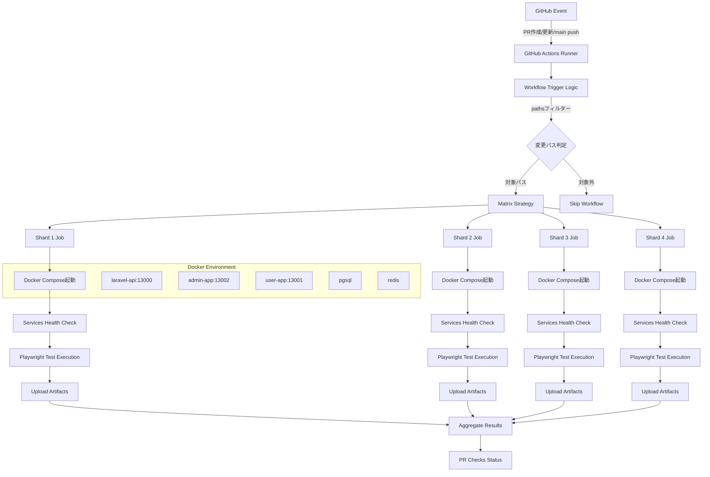
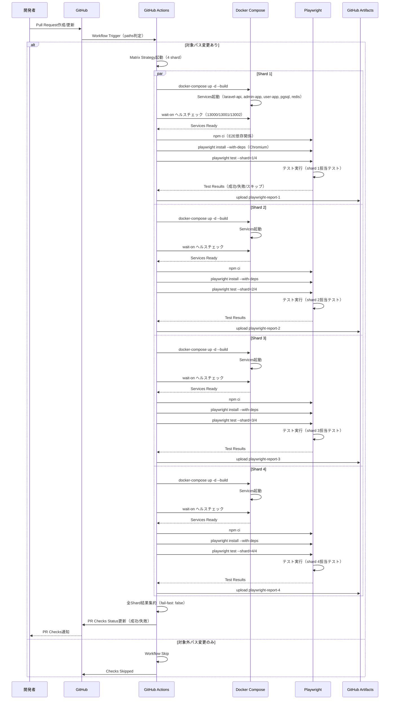
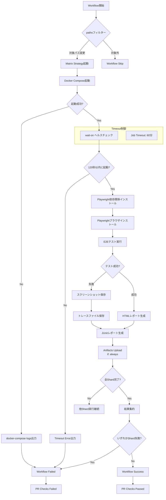
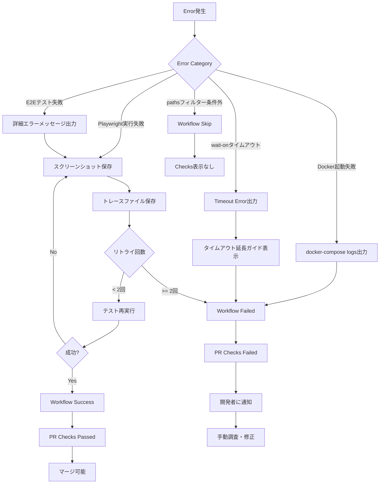

# Technical Design Document

## Overview

本設計書は、E2Eテスト環境（Playwright 1.47.2 + Docker + Sanctum認証統合）をGitHub Actions CI/CDパイプラインで自動実行するための技術設計を定義する。既存の`.github/workflows/e2e-tests.yml.disabled`ワークフローを有効化し、Pull Request作成時・mainブランチpush時の自動E2Eテスト実行、並列実行（4 shard）、テストレポートArtifacts保存を実現する。

**Purpose**: DevOps・QAエンジニアに対して、PR品質保証の自動化、迅速なフィードバックループ確立、本番リリース前の品質保証を提供する。

**Users**:
- **DevOpsエンジニア**: CI/CDパイプライン運用、ワークフロー最適化
- **QAエンジニア**: E2Eテスト結果分析、品質メトリクス追跡
- **開発者**: PR作成時の自動品質チェック、迅速なフィードバック

**Impact**: 現在のGitHub Actions無料枠対策で無効化されているE2Eワークフローを有効化し、自動品質保証体制を確立する。手動テスト工数を削減し、開発速度を向上させる。

### Goals
- GitHub Actions ワークフローを有効化し、E2Eテスト自動実行を開始
- 並列実行（4 shard）により実行時間を短縮（目標: 60分以内）
- テストレポート・スクリーンショット・トレースをArtifactsとして保存し、失敗分析を可能に
- PR作成時・mainブランチpush時の自動トリガー実装で品質ゲートを確立
- ドキュメント更新によりチーム運用を円滑化

### Non-Goals
- Visual Regression Testing統合（Percy/Chromatic）- 将来対応
- パフォーマンステスト統合（Lighthouse CI）- 将来対応
- クロスブラウザテスト拡張（Firefox, Webkit）- 現在Chromiumのみ
- GitHub Actions無料枠超過時のコスト最適化（並列数削減等）- 運用フェーズで対応

---

## Architecture

### Existing Architecture Analysis

本機能は既存のE2Eテスト環境とGitHub Actions基盤を活用する拡張機能である。

**既存システム構成**:
- **E2Eテスト環境**: Playwright 1.47.2、Page Object Model、Laravel Sanctum認証統合（Issue #12, PR #58で構築）
- **Docker環境**: Docker Compose統合、全サービス一括起動（Issue #14で構築）
- **GitHub Actions基盤**: フロントエンドテスト（Jest）、PHP品質チェック（Pint/Larastan）の既存ワークフロー

**既存ドメイン境界を尊重**:
- **E2Eテストドメイン**: `e2e/`ディレクトリ配下のPlaywrightテスト資産を変更せず活用
- **CI/CDドメイン**: `.github/workflows/`配下の既存ワークフローパターンを踏襲
- **Docker環境ドメイン**: `docker-compose.yml`の既存サービス定義を変更せず利用

**統合ポイント維持**:
- Docker Compose起動コマンド: `docker-compose up -d --build`（既存パターン）
- ポート設定: 13000番台統一（user-app: 13001, admin-app: 13002, laravel-api: 13000）
- 環境変数設定: `.env`ファイルパターン（E2E_ADMIN_URL等）

### High-Level Architecture



**Architecture Integration**:
- **既存パターン保持**: GitHub Actions Matrix戦略（既存フロントエンドテストワークフローと同様）
- **新規コンポーネント追加理由**:
  - **Workflow Trigger Logic**: pathsフィルターによるコスト最適化（GitHub Actions無料枠対策）
  - **Shard Parallelization**: 実行時間短縮（60分以内目標達成）
  - **Artifacts Upload**: 失敗分析可能性確保（既存ワークフローと同様のパターン）
- **Technology Alignment**:
  - Docker Compose: 既存開発環境と同一構成
  - Playwright: 既存E2Eテスト資産を変更せず活用
  - GitHub Actions v4: 既存ワークフローと同一バージョン
- **Steering Compliance**:
  - `structure.md`: `.github/workflows/`配下のCI/CD設定配置原則遵守
  - `tech.md`: Docker Compose統合環境パターン遵守、Node.js v20指定
  - `product.md`: 完全なテスト戦略（E2E自動実行）の実現

### Technology Alignment

本機能は既存技術スタックに完全に統合される拡張である。

**既存技術スタックとの整合性**:
- **CI/CD基盤**: GitHub Actions（既存: frontend-test.yml, php-quality.yml, test.yml）
- **Container Runtime**: Docker Compose（既存: docker-compose.yml統合環境）
- **E2Eテストフレームワーク**: Playwright 1.47.2（既存: e2e/ディレクトリ資産）
- **Runner OS**: ubuntu-latest（既存ワークフローと統一）
- **Node.js Runtime**: v20（既存フロントエンドテストと統一）

**新規導入依存関係**:
- **wait-on**: `npx wait-on`（サービスヘルスチェック用、既存Playwrightプロジェクトで利用済み）
- **actions/upload-artifact@v4**: Artifactsアップロード（既存ワークフローと同一バージョン）

**既存パターンからの差異なし**:
- 全て既存技術スタックとCI/CDパターンに準拠
- 新規技術導入は不要、既存資産を最大限活用

### Key Design Decisions

#### Decision 1: Docker Compose vs 個別サービス起動

**Decision**: Docker Composeによる全サービス一括起動を採用

**Context**:
- 要件: laravel-api, admin-app, user-app, pgsql, redisの5サービス起動が必要
- 既存環境: Issue #14でDocker Compose統合環境が構築済み
- GitHub Actions環境: Docker標準搭載、docker-composeコマンド利用可能

**Alternatives**:
1. **個別サービス起動**: `php artisan serve`、`npm start`を個別実行（既存disabledワークフロー）
2. **Docker Compose統合**: `docker-compose up -d --build`で一括起動
3. **Kubernetes**: Minikube等でKubernetes環境構築

**Selected Approach**: Docker Compose統合

**Rationale**:
- **環境一貫性**: ローカル開発環境と完全一致、環境差異によるE2E失敗を排除
- **設定管理簡素化**: docker-compose.yml一元管理、ポート・環境変数の一貫性保証
- **起動信頼性向上**: サービス依存関係（depends_on）による起動順序制御
- **既存資産活用**: Issue #14で構築済みのDocker環境をそのまま利用

**Trade-offs**:
- **獲得**: 環境一貫性、設定管理簡素化、信頼性向上
- **犠牲**: Docker Composeビルド時間（初回のみ、キャッシュで軽減）、メモリ使用量増加（GitHub Actions Runnerで許容範囲）

#### Decision 2: 並列実行（Shard）数の決定

**Decision**: 4並列（shard 1/2/3/4）を採用

**Context**:
- 要件: 実行時間60分以内に短縮
- E2Eテスト数: 現在4テスト（admin/user各2テスト）、今後増加見込み
- GitHub Actions並列実行: Matrix戦略で1-20並列可能

**Alternatives**:
1. **2並列**: 実行時間短縮効果は中程度、コスト削減
2. **4並列**: バランス型、実行時間とコストのトレードオフ最適
3. **8並列**: 最大速度、高コスト

**Selected Approach**: 4並列（shard 1/2/3/4）

**Rationale**:
- **実行時間短縮**: テスト数増加時も60分以内目標達成可能
- **コスト効率**: GitHub Actions無料枠（2000分/月）を考慮した最適バランス
- **スケーラビリティ**: 将来のテスト増加に対応可能（Playwright shardingで自動分散）
- **fail-fast: false**: 全shard実行後に結果集計、部分的失敗でも全体像把握可能

**Trade-offs**:
- **獲得**: 実行時間短縮、スケーラビリティ、全shard結果取得
- **犠牲**: 並列実行コスト（2並列比で2倍）、Artifacts数増加（4個のレポートzip）

#### Decision 3: Artifacts保存戦略

**Decision**: Shard毎に個別Artifactsアップロード、30日間保持

**Context**:
- 要件: HTMLレポート、JUnitレポート、スクリーンショット、トレース保存
- 失敗分析: どのshardで失敗したか特定が必要
- ストレージコスト: GitHub Artifactsストレージ制限

**Alternatives**:
1. **統合Artifact**: 全shardレポートを1つのArtifactに統合
2. **Shard毎個別Artifact**: playwright-report-1/2/3/4として個別保存
3. **失敗時のみ保存**: 成功時はArtifact不要

**Selected Approach**: Shard毎個別Artifact、成功・失敗問わず保存（`if: always()`）

**Rationale**:
- **失敗特定容易性**: どのshardで失敗したか即座に判別可能
- **並列ダウンロード**: 複数Artifactsを並列ダウンロード可能、分析効率化
- **成功時も保存**: 成功時のベースライン確立、フレーキーテスト検出
- **30日間保持**: GitHub Actions標準保持期間、十分な分析期間確保

**Trade-offs**:
- **獲得**: 失敗特定容易性、並列ダウンロード、ベースライン確立
- **犠牲**: Artifactsストレージ使用量増加（4倍）、Artifacts一覧の視認性低下

---

## System Flows

### E2E CI/CD実行フロー（Pull Request）



### エラーハンドリングフロー



---

## Requirements Traceability

| 要件 | 要件概要 | 実現コンポーネント | インターフェース | フロー図参照 |
|------|----------|-------------------|-----------------|-------------|
| 1.1 | ワークフロー有効化 | GitHub Actions Workflow | `.disabled`削除、git push | - |
| 1.2 | ワークフロー一覧表示 | GitHub Actions UI | ワークフロー定義（name: E2E Tests） | - |
| 1.3 | 手動実行可能化 | workflow_dispatch trigger | 「Run workflow」ボタン | - |
| 2.1 | Docker Compose起動 | Docker Compose Service | `docker-compose up -d --build` | シーケンス図: Services起動 |
| 2.2 | サービス起動確認 | Docker Compose + wait-on | ヘルスチェック（13000/13001/13002） | シーケンス図: wait-on |
| 2.3 | ヘルスチェック実行 | wait-on CLI | HTTP GET（/up） | シーケンス図: wait-on |
| 2.4 | タイムアウト処理 | wait-on timeout設定 | 120秒タイムアウト | エラーフロー: Timeout分岐 |
| 3.1 | 依存関係インストール | npm ci | E2E package.json | シーケンス図: npm ci |
| 3.2 | Playwrightインストール | playwright install | chromium --with-deps | シーケンス図: playwright install |
| 3.3 | 環境変数設定 | GitHub Actions env | E2E_ADMIN_URL等 | シーケンス図: 環境変数 |
| 3.4 | テスト結果出力 | Playwright Reporter | JUnit/HTML | シーケンス図: Test Results |
| 3.5 | 失敗時ステータス | GitHub Actions exit code | 非0終了コード | エラーフロー: Workflow Failed |
| 4.1 | Matrix並列起動 | Matrix Strategy | shard: [1,2,3,4] | シーケンス図: par並列実行 |
| 4.2 | Shard分割実行 | Playwright --shard | --shard=N/4 | シーケンス図: shard実行 |
| 4.3 | 独立Docker環境 | GitHub Actions Runner | 各JobでDocker起動 | シーケンス図: par各Shard |
| 4.4 | ステータス集計 | fail-fast: false | 全Shard実行後判定 | シーケンス図: 結果集約 |
| 4.5 | 失敗時全体失敗 | GitHub Actions status | いずれか失敗で全体失敗 | エラーフロー: 結果集約 |
| 5.1 | Artifactsアップロード | upload-artifact@v4 | if: always() | シーケンス図: upload |
| 5.2 | Artifact命名規則 | name設定 | playwright-report-N | シーケンス図: upload |
| 5.3 | レポートファイル含有 | path指定 | e2e/reports/ | シーケンス図: HTMLレポート |
| 5.4 | 30日間保持 | retention-days | 30日 | - |
| 5.5 | zipダウンロード | GitHub UI | Artifacts一覧 | - |
| 6.1 | PR自動実行 | on: pull_request | pathsフィルター | シーケンス図: PR Trigger |
| 6.2 | PR更新時再実行 | PR commit push | 同上 | シーケンス図: PR更新 |
| 6.3 | 対象外スキップ | paths設定 | frontend/**, e2e/** | エラーフロー: Skip分岐 |
| 6.4 | Checks表示 | GitHub PR Checks | Workflow結果 | シーケンス図: Checks Status |
| 6.5 | 失敗時マージ制限 | PR Checks Failed | エラーステータス | シーケンス図: Checks Failed |
| 7.1 | main自動実行 | on: push | branches: [main] | - |
| 7.2 | 実行履歴記録 | GitHub Actions log | ワークフロー履歴 | - |
| 7.3 | 失敗通知 | GitHub通知 | チーム通知 | - |
| 8.1 | Run workflowボタン | workflow_dispatch | GitHub UI | - |
| 8.2 | ブランチ選択UI | inputs設定 | shard_count選択 | - |
| 8.3 | 選択ブランチ実行 | ref指定 | 選択ブランチコード | - |
| 8.4 | 手動トリガー記録 | ワークフロー履歴 | トリガー種別 | - |
| 9.1 | 60分タイムアウト | timeout-minutes | 60 | エラーフロー: Job Timeout |
| 9.2 | 超過時強制終了 | GitHub Actions | 失敗ステータス | エラーフロー: Timeout |
| 9.3 | wait-onタイムアウト | --timeout設定 | 120000ms | エラーフロー: wait-on Timeout |
| 9.4 | Docker失敗ログ | docker-compose logs | エラーログ出力 | エラーフロー: logs出力 |
| 10.1 | README.md更新 | Documentation | CI/CD手順追加 | - |
| 10.2 | e2e/README.md更新 | Documentation | Shard説明追加 | - |
| 10.3 | トラブルシューティング | Documentation | 問題解決方法 | - |

---

## Components and Interfaces

### CI/CD Workflow Layer

#### GitHub Actions Workflow

**Responsibility & Boundaries**
- **Primary Responsibility**: E2Eテスト自動実行のワークフロー制御、並列実行管理、結果集約
- **Domain Boundary**: CI/CDドメイン（`.github/workflows/`配下）
- **Data Ownership**: ワークフロー実行状態、Job実行結果、Artifacts管理
- **Transaction Boundary**: 単一ワークフロー実行単位（PR作成→テスト実行→結果通知）

**Dependencies**
- **Inbound**: GitHub Event（PR作成/更新、mainブランチpush、手動トリガー）
- **Outbound**: Docker Compose（サービス起動）、Playwright（テスト実行）、GitHub Artifacts（レポート保存）
- **External**: GitHub Actions Runner（ubuntu-latest）、Docker Engine、Node.js v20

**Contract Definition - Workflow Trigger**

| Trigger | Event | Conditions | Actions |
|---------|-------|-----------|---------|
| workflow_dispatch | Manual | shard_count選択（1/2/4/8） | 選択ブランチでE2E実行 |
| pull_request | PR作成/更新 | paths: frontend/**, backend/**/app/**, e2e/**, .github/workflows/e2e-tests.yml | 4 shard並列実行 |
| push | mainブランチpush | paths: frontend/**, backend/**/app/**, e2e/** | 4 shard並列実行 |

**Workflow Steps Interface**:
```yaml
# Step 1: Repository Checkout
- uses: actions/checkout@v4

# Step 2: Node.js Setup
- uses: actions/setup-node@v4
  with:
    node-version: '20'

# Step 3: Docker Compose起動
- run: docker-compose up -d --build

# Step 4: Services Health Check
- run: npx wait-on http://localhost:13001 http://localhost:13002 http://localhost:13000/up --timeout 120000

# Step 5: E2E Dependencies Install
- run: cd e2e && npm ci

# Step 6: Playwright Install
- run: cd e2e && npx playwright install --with-deps chromium

# Step 7: E2E Test Execution
- run: cd e2e && npx playwright test --shard=${{ matrix.shard }}/4
  env:
    E2E_ADMIN_URL: http://localhost:13002
    E2E_USER_URL: http://localhost:13001
    E2E_API_URL: http://localhost:13000

# Step 8: Artifacts Upload
- uses: actions/upload-artifact@v4
  if: always()
  with:
    name: playwright-report-${{ matrix.shard }}
    path: e2e/reports/
    retention-days: 30
```

- **Preconditions**:
  - `.github/workflows/e2e-tests.yml`が有効化済み
  - Docker Composeファイルが存在
  - E2Eテストディレクトリが存在
- **Postconditions**:
  - E2Eテスト実行完了
  - Artifacts保存完了
  - PR Checks Status更新完了
- **Invariants**:
  - 全Shard実行完了まで結果確定しない（fail-fast: false）
  - Artifacts は成功・失敗問わず保存（if: always()）

**State Management**:
- **State Model**: Pending → Running → Success/Failed/Cancelled
- **Persistence**: GitHub Actions実行履歴（永続化）
- **Concurrency**: Matrix並列実行（4 shard同時）、fail-fast: falseで全shard完了待機

---

### Infrastructure Layer

#### Docker Compose Service Manager

**Responsibility & Boundaries**
- **Primary Responsibility**: E2Eテスト実行環境の全サービス起動・ヘルスチェック・ライフサイクル管理
- **Domain Boundary**: Docker環境ドメイン（`docker-compose.yml`）
- **Data Ownership**: サービス起動状態、コンテナログ、ネットワーク設定
- **Transaction Boundary**: サービス起動→ヘルスチェック→テスト実行→シャットダウン

**Dependencies**
- **Inbound**: GitHub Actions Workflow（サービス起動要求）
- **Outbound**:
  - laravel-api (ポート13000)
  - admin-app (ポート13002)
  - user-app (ポート13001)
  - pgsql, redis, mailpit, minio
- **External**: Docker Engine、Docker Compose CLI

**Service Interface**:
```typescript
interface DockerComposeService {
  // サービス起動
  up(options: { detached: boolean; build: boolean }): Promise<void>;

  // ヘルスチェック
  healthCheck(urls: string[], timeout: number): Promise<HealthStatus>;

  // ログ取得
  logs(service: string): Promise<string>;

  // サービス停止
  down(options: { volumes: boolean }): Promise<void>;
}

type HealthStatus = {
  ready: boolean;
  services: {
    [key: string]: { status: 'healthy' | 'unhealthy'; port: number };
  };
};
```

- **Preconditions**:
  - `docker-compose.yml`が存在
  - Docker Engineが起動済み
  - 必要なポート（13000/13001/13002）が空いている
- **Postconditions**:
  - 全サービスが正常起動
  - ヘルスチェックエンドポイントが応答
  - ネットワークが確立
- **Invariants**:
  - サービス起動順序は depends_on で制御
  - ポート13000番台統一を維持

**Integration Strategy**:
- **Modification Approach**: 既存docker-compose.ymlを変更せず活用（拡張不要）
- **Backward Compatibility**: ローカル開発環境と完全互換性維持
- **Migration Path**: 既存disabledワークフローからDocker Compose起動に移行済み

---

### Testing Execution Layer

#### Playwright E2E Test Runner

**Responsibility & Boundaries**
- **Primary Responsibility**: E2Eテストの並列実行（Shard）、結果レポート生成、スクリーンショット・トレース保存
- **Domain Boundary**: E2Eテストドメイン（`e2e/`ディレクトリ）
- **Data Ownership**: テスト実行結果、レポートファイル、スクリーンショット、トレース
- **Transaction Boundary**: テスト実行開始→結果生成→レポート保存

**Dependencies**
- **Inbound**: GitHub Actions Workflow（テスト実行要求、環境変数設定）
- **Outbound**:
  - admin-app (http://localhost:13002)
  - user-app (http://localhost:13001)
  - laravel-api (http://localhost:13000)
- **External**: Playwright 1.47.2、Chromium Browser

**Test Execution Interface**:
```typescript
interface PlaywrightTestRunner {
  // Shard並列実行
  runTests(options: {
    shard: string; // "N/4" 形式
    retries: number; // 最大2回
    reporter: string[]; // ['html', 'junit']
  }): Promise<TestResult>;

  // レポート生成
  generateReport(format: 'html' | 'junit'): Promise<ReportFile>;

  // Artifacts保存
  saveArtifacts(outputDir: string): Promise<void>;
}

type TestResult = {
  passed: number;
  failed: number;
  skipped: number;
  duration: number;
  failures: TestFailure[];
};

type TestFailure = {
  testName: string;
  error: string;
  screenshot: string;
  trace: string;
};
```

- **Preconditions**:
  - 全サービスが正常起動
  - 環境変数（E2E_ADMIN_URL等）が設定済み
  - Playwrightブラウザがインストール済み
- **Postconditions**:
  - テスト結果が集計
  - HTMLレポートが生成
  - JUnitレポートが生成
  - 失敗時スクリーンショット・トレース保存
- **Invariants**:
  - Shard分割数は4で固定
  - リトライは最大2回（Playwright設定）
  - レポートは`e2e/reports/`に保存

**Event Contract - Test Execution**:
- **Published Events**: TestCompleted（成功/失敗/スキップ数）
- **Subscribed Events**: ServiceReady（Docker Compose起動完了）
- **Ordering**: ServiceReady → TestExecution → TestCompleted の順序保証
- **Delivery**: At-least-once（リトライ設定により最大3回実行可能性）

---

### Reporting & Artifacts Layer

#### GitHub Artifacts Manager

**Responsibility & Boundaries**
- **Primary Responsibility**: テストレポート・スクリーンショット・トレースのArtifacts保存・30日間保持管理
- **Domain Boundary**: GitHub Artifactsストレージ
- **Data Ownership**: Artifacts zip（playwright-report-1/2/3/4）、保持期間管理
- **Transaction Boundary**: Artifactsアップロード→保存完了→ダウンロード可能化

**Dependencies**
- **Inbound**: Playwright Test Runner（レポートファイル生成）
- **Outbound**: GitHub Artifacts Storage API
- **External**: actions/upload-artifact@v4、GitHub Artifacts Storage

**API Contract**:

| Method | Endpoint | Request | Response | Errors |
|--------|----------|---------|----------|--------|
| POST | /upload | UploadArtifactRequest | ArtifactMetadata | 400（無効パス）, 413（サイズ超過）, 500 |
| GET | /download | DownloadRequest | ArtifactZip | 404（Artifact不存在）, 410（期限切れ）, 500 |

**Upload Request Schema**:
```yaml
name: playwright-report-${{ matrix.shard }}
path: e2e/reports/
retention-days: 30
if-no-files-found: error
```

**Response Schema**:
```yaml
artifact:
  id: 123456789
  name: playwright-report-1
  size: 1024000
  created_at: 2025-10-04T15:30:00Z
  expires_at: 2025-11-03T15:30:00Z
  download_url: https://api.github.com/repos/.../artifacts/123456789/zip
```

- **Preconditions**:
  - `e2e/reports/`ディレクトリが存在
  - レポートファイルが生成済み
- **Postconditions**:
  - Artifactsがzip形式で保存
  - GitHub UI Artifactsセクションに表示
  - 30日間ダウンロード可能
- **Invariants**:
  - Shard毎に個別Artifact保存
  - 成功・失敗問わず保存（`if: always()`）

---

## Error Handling

### Error Strategy

E2E CI/CD実行における各エラーカテゴリーに対して、明確な検出・回復・通知戦略を定義する。

**User Errors (4xx相当)**:
- **無効な環境変数**: E2E_ADMIN_URL等の未設定 → Workflow実行前のバリデーション、エラーメッセージでSecretsリンク案内
- **無効なブランチ指定**: workflow_dispatch時の存在しないブランチ → GitHub UI側で入力検証、デフォルト値（main）提供

**System Errors (5xx相当)**:
- **Docker起動失敗**: サービス起動エラー → `docker-compose logs`出力、リトライ不可、即座に失敗
- **wait-onタイムアウト**: 120秒以内にサービス起動しない → タイムアウトエラー出力、wait-on設定延長ガイド提示
- **Playwright実行失敗**: ブラウザクラッシュ → スクリーンショット・トレース保存、リトライ（最大2回）

**Business Logic Errors (422相当)**:
- **E2Eテスト失敗**: アサーション失敗 → 詳細エラーメッセージ・スクリーンショット・トレース保存、PR Checks Failed
- **pathsフィルター条件外**: 対象外パス変更 → Workflow Skip、Checks表示なし

### Error Categories and Responses



**Docker起動失敗時の回復メカニズム**:
1. `docker-compose up -d --build`失敗検出
2. `docker-compose logs laravel-api admin-app user-app`実行
3. エラーログをGitHub Actionsログに出力
4. Workflow即座に失敗、リトライなし
5. 開発者に通知、手動調査必要

**wait-onタイムアウト時の回復メカニズム**:
1. 120秒以内にサービス起動確認できず
2. `wait-on`タイムアウトエラー出力
3. タイムアウト延長方法をエラーメッセージに含める（`--timeout 180000`等）
4. Workflow失敗、手動再実行推奨

**Playwrightテスト失敗時の回復メカニズム**:
1. テスト失敗検出
2. スクリーンショット自動保存（`e2e/reports/`）
3. トレースファイル自動保存（`e2e/test-results/`）
4. Playwright retries設定に従いリトライ（最大2回）
5. 2回リトライ後も失敗なら確定失敗
6. Artifacts Upload（失敗時レポート含む）

### Monitoring

**エラー追跡**:
- **GitHub Actions Logs**: 全ステップの標準出力・標準エラー出力を記録
- **Docker Compose Logs**: サービス起動失敗時のコンテナログ保存
- **Playwright Trace**: テスト実行時の詳細トレース（ネットワーク、DOM、コンソール）

**ロギング**:
```yaml
# GitHub Actionsログレベル
- run: echo "::debug::Docker Compose起動開始"
- run: echo "::notice::Services Ready"
- run: echo "::warning::wait-onタイムアウト接近"
- run: echo "::error::Docker起動失敗"
```

**ヘルスモニタリング**:
- **Services Health Check**: `wait-on`による3エンドポイント監視（13000/13001/13002）
- **Job Timeout**: 60分タイムアウト設定、超過時強制終了
- **Artifacts Upload**: `if: always()`で成功・失敗問わずレポート保存

**メトリクス収集（将来対応）**:
- E2Eテスト実行時間（shard毎、全体）
- 失敗率・フレーキーテスト検出
- Artifactsサイズ推移

---

## Testing Strategy

### Unit Tests
該当なし（インフラストラクチャ設定のため、ユニットテスト不要）

### Integration Tests

**ワークフロー統合テスト（手動検証）**:
1. **workflow_dispatch手動実行**: GitHub UIから手動トリガー、全Shard成功確認
2. **PR作成時自動実行**: テスト用PR作成、対象パス変更でトリガー確認
3. **pathsフィルター動作**: 対象外パス変更でSkip確認
4. **Matrix並列実行**: 4 Shard同時実行、独立Docker環境確認
5. **Artifacts保存**: playwright-report-1/2/3/4のzip保存確認

**Docker Compose統合テスト（手動検証）**:
1. **Services起動**: `docker-compose up -d --build`成功、全サービス起動確認
2. **Health Check**: `wait-on`で3エンドポイント（13000/13001/13002）応答確認
3. **E2E実行**: Playwrightテストが全サービスにアクセス可能確認

### E2E Tests

**既存E2Eテスト活用**:
- **Admin App**: `e2e/projects/admin/tests/home.spec.ts`等（既存テスト）
- **User App**: `e2e/projects/user/tests/home.spec.ts`等（既存テスト）
- **CI環境での動作確認**: GitHub Actions環境で既存E2Eテストが正常実行されることを検証

**E2E実行検証項目**:
1. **Shard分割**: 4 Shard でテストが均等分散されることを確認
2. **並列実行**: 各Shardが独立したDocker環境で実行されることを確認
3. **失敗時動作**: テスト失敗時にスクリーンショット・トレース保存確認
4. **成功時動作**: テスト成功時にHTMLレポート生成確認
5. **Artifacts**: 成功・失敗問わずArtifactsアップロード確認

### Performance Tests

**実行時間検証**:
1. **60分以内目標**: 4 Shard並列実行で全体実行時間60分以内確認
2. **Docker起動時間**: サービス起動時間測定（目標: 5分以内）
3. **wait-on待機時間**: ヘルスチェック完了時間測定（目標: 120秒以内）
4. **Playwright実行時間**: 各Shard実行時間測定、均等分散確認

---

## Security Considerations

**認証情報管理**:
- **GitHub Secrets**: E2E_ADMIN_EMAIL, E2E_ADMIN_PASSWORD, E2E_USER_EMAIL, E2E_USER_PASSWORD
- **Secrets参照**: `${{ secrets.E2E_ADMIN_EMAIL }}`でワークフロー内参照
- **ログ保護**: GitHub Actionsが自動的にSecrets値をマスキング

**アクセス制御**:
- **ワークフロー実行権限**: リポジトリWriteアクセス権限保持者のみ手動実行可能
- **Artifacts閲覧権限**: リポジトリReadアクセス権限保持者のみダウンロード可能
- **PR Checks**: Pull Request作成者のみChecks確認可能

**脅威モデル**:
- **シークレット漏洩**: GitHub Actionsログへのシークレット出力リスク → Secretsマスキングで緩和
- **Artifactsへの不正アクセス**: 認証情報含むスクリーンショット保存リスク → アクセス権限制御で緩和
- **Docker環境脆弱性**: 古いイメージ利用リスク → 定期的なイメージ更新で緩和

**コンプライアンス**:
- GitHub Actionsセキュリティベストプラクティス準拠
- Secrets管理ポリシー遵守

---

## Performance & Scalability

### Target Metrics

| メトリクス | 目標値 | 測定方法 |
|-----------|--------|---------|
| **E2E実行時間** | 60分以内 | GitHub Actions実行時間 |
| **Docker起動時間** | 5分以内 | docker-compose up完了時間 |
| **wait-on待機時間** | 120秒以内 | wait-onコマンド実行時間 |
| **Shard実行時間** | 均等分散（±10%以内） | 各Shard実行時間比較 |
| **Artifacts保存時間** | 1分以内 | upload-artifact実行時間 |

### Scaling Approaches

**水平スケーリング（Shard数増加）**:
- **現状**: 4並列（shard 1/2/3/4）
- **拡張**: workflow_dispatch inputs.shard_count で1/2/4/8選択可能
- **最大**: GitHub Actions並列実行制限（20並列）まで拡張可能
- **トレードオフ**: 並列数増加でコスト増加、実行時間短縮

**垂直スケーリング（Runner性能向上）**:
- **現状**: ubuntu-latest（標準Runner）
- **拡張**: GitHub Actions larger runners（高性能Runner）利用可能
- **トレードオフ**: コスト増加、実行時間短縮

### Caching Strategies

**Docker Compose Cache**:
- **イメージキャッシュ**: GitHub Actions Dockerレイヤーキャッシュ活用
- **ビルドキャッシュ**: `--build`オプションでキャッシュ利用
- **効果**: 2回目以降の起動時間短縮（初回: 5分 → 2回目以降: 2分）

**Node.js Dependencies Cache**:
- **npm cache**: `actions/setup-node@v4`のcache機能活用
- **cache-dependency-path**: package-lock.json指定
- **効果**: npm ci実行時間短縮（初回: 30秒 → 2回目以降: 10秒）

**Playwright Browser Cache**:
- **ブラウザキャッシュ**: `playwright install --with-deps`で自動キャッシュ
- **効果**: ブラウザダウンロード時間短縮（初回: 1分 → 2回目以降: 10秒）

---

## Migration Strategy

本機能は既存E2Eテスト環境の有効化であり、新規機能追加ではないため、マイグレーション不要。

**有効化手順**:
1. `.github/workflows/e2e-tests.yml.disabled` → `.github/workflows/e2e-tests.yml` にリネーム
2. GitHub Secrets設定確認（E2E_ADMIN_EMAIL等）
3. workflow_dispatch手動実行で動作検証
4. PR作成時自動実行で本番運用開始

**ロールバック手順**:
1. `.github/workflows/e2e-tests.yml` → `.github/workflows/e2e-tests.yml.disabled` にリネーム
2. 即座にワークフロー無効化、自動実行停止

**リスク**: ロールバック時もファイルリネームのみで即座に対応可能、影響範囲最小
