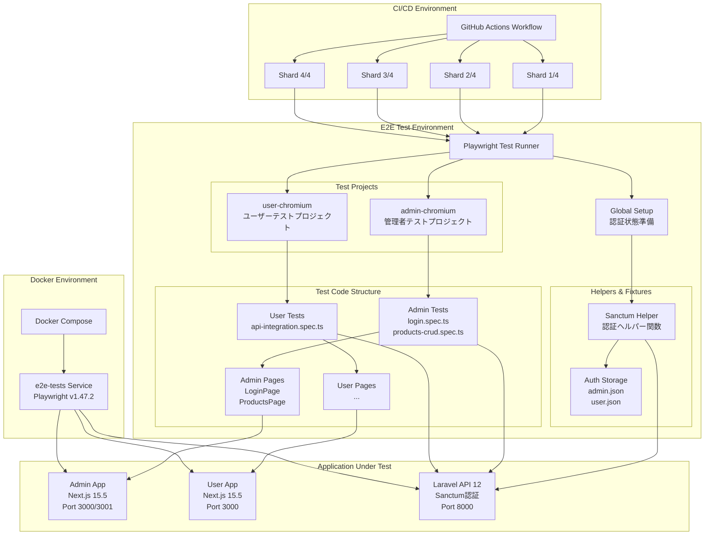
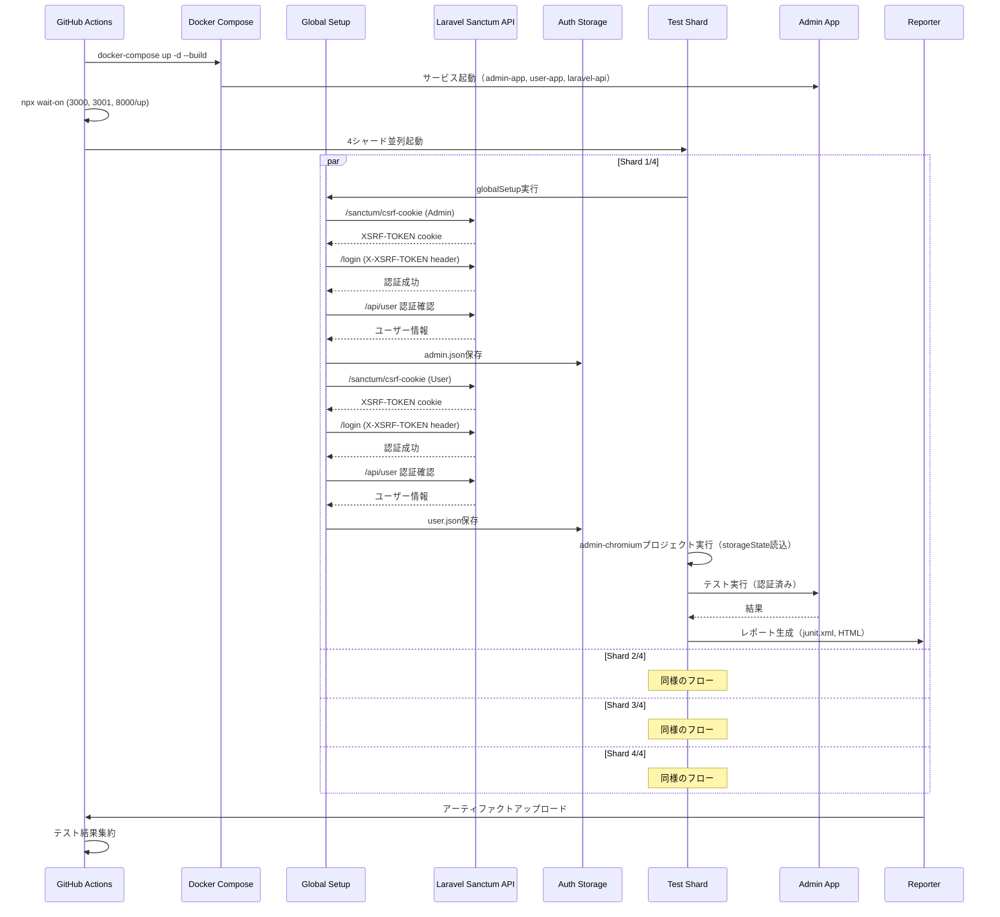
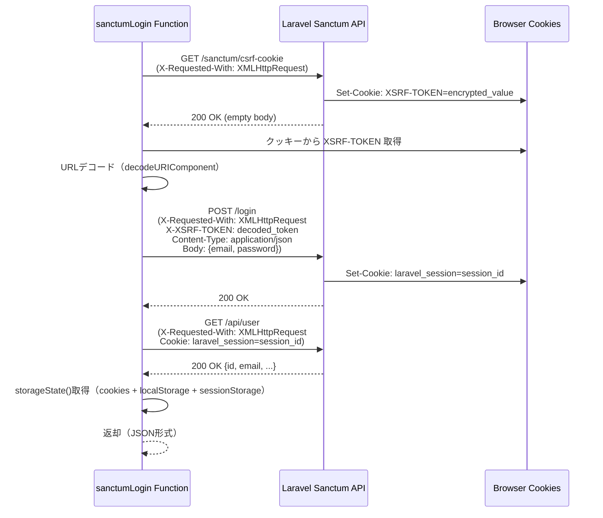
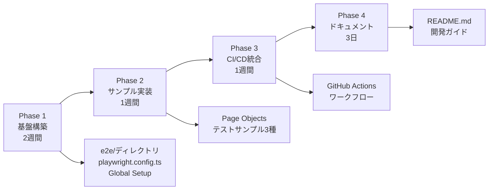

# Technical Design Document

## Overview

本設計書は、Laravel 12 API + Next.js 15.5 + React 19のフルスタックアプリケーションにおける、Playwright 1.47.2を基盤としたE2Eテスト環境の技術設計を定義する。現在のテスト体系（Pest 4によるバックエンド単体/機能テスト、Jest 29 + Testing Library 16によるフロントエンド単体/コンポーネントテスト）を補完し、ユーザー操作全体のエンドツーエンドフローを自動検証する包括的テスト基盤を構築する。

**Purpose**: E2Eテスト自動化により、フロントエンド・バックエンド統合部分の品質保証を完全化し、リグレッションバグの早期発見と手動テストコストの削減を実現する。

**Users**: 開発者はPlaywright Test RunnerおよびPage Object Modelを利用して、ユーザー操作フローの自動テストを作成・実行・デバッグする。CI/CD環境はGitHub Actionsワークフローを通じてPull Request時に自動E2Eテストを実行し、品質ゲートとして機能する。

**Impact**: 既存のJestモノレポテスト環境に新たな`e2e/`ディレクトリを追加し、Docker Composeに`e2e-tests`サービスを統合する。`.github/workflows/`に新規E2Eテストワークフローを追加する。既存テストフレームワークとの役割分担により、テスト戦略全体の完全性を高める。

### Goals

- Playwright 1.47.2ベースのE2Eテスト基盤構築により、ブラウザ自動化テストを実現
- モノレポ構成（admin-app/user-app）に対応したマルチプロジェクトテスト環境の提供
- Laravel Sanctum認証の自動化により、認証済み状態でのテスト実行を効率化
- Page Object Modelパターンの導入による、保守性の高いテストコード資産の構築
- Docker Compose統合により、ローカル・Docker・CI環境でのシームレスなテスト実行を保証
- GitHub Actions CI/CDパイプライン統合により、Pull Request時の自動品質チェックを実現
- シャーディング並列実行（4分割）により、CI実行時間を最小化

### Non-Goals

- Visual Regression Testing（Percy/Chromatic統合）は将来対応とし、本フェーズでは対象外
- パフォーマンステスト（Lighthouse CI）は専用ツールに委ね、本E2E環境では実施しない
- モバイルアプリE2Eテストは対象外（現行プロジェクトはWeb SPAのみ）
- アクセシビリティ自動テスト（axe-core統合）は将来拡張とし、初期フェーズでは対象外
- 既存テストフレームワーク（Pest/Jest）の置換や修正は行わず、補完的な位置付けとする

## Architecture

### 既存アーキテクチャ分析

**現行テスト戦略**:
- **バックエンド**: Pest 4による単体テスト（Unit/）および機能テスト（Feature/）、Architecture Testing対応
- **フロントエンド**: Jest 29 + React Testing Library 16によるコンポーネント単体テスト（カバレッジ94.73%）
- **CI/CD**: GitHub Actions（`frontend-test.yml`、`php-quality-check.yml`）で自動品質チェック

**既存パターン保持**:
- モノレポルートの共通devDependencies管理（`package.json` workspaces）
- Docker Compose（`backend/laravel-api/compose.yaml`）によるサービスオーケストレーション
- ポートカスタマイズ戦略（13000番台メインサービス、11000番台SMTP）
- TypeScript厳格型チェックとESLint 9 flat config
- Git Hooks（husky + lint-staged）による自動品質保証

**統合ポイント維持**:
- Laravel Sanctum 4.0トークンベース認証（既存API認証機構）
- Next.js 15.5 App Router（既存フロントエンドルーティング）
- 既存環境変数管理（dotenv、`.env.local`）

### High-Level Architecture



### 技術選定と既存スタックの整合性

**既存技術スタックとの整合**:
本E2E環境は既存の技術選定と開発手法に完全適合する設計とする。

| レイヤー | 既存技術 | E2E環境での対応 | 整合性 |
|---------|---------|----------------|--------|
| **テストフレームワーク** | Pest 4（PHP）、Jest 29（JS） | Playwright 1.47.2（E2E） | 各層に最適化されたツール選定を継承 |
| **TypeScript** | TypeScript 5.x 厳格型チェック | TypeScript 5.6.2でPlaywright型定義 | 既存の型安全性方針を維持 |
| **モノレポ管理** | npm workspaces（admin-app/user-app） | e2eディレクトリを独立管理 | ワークスペース管理パターンを踏襲 |
| **Docker環境** | Laravel Sail（compose.yaml） | e2e-testsサービス追加 | 既存Docker構成に統合 |
| **CI/CD** | GitHub Actions（Node.js 18.x/20.x matrix） | E2Eワークフロー追加（Node.js 20） | 既存CI/CDパターンと統一 |
| **認証機構** | Laravel Sanctum 4.0 | Sanctum認証ヘルパー実装 | 既存API認証を再利用 |
| **環境変数管理** | dotenv、.env.local | dotenv 16.4.5でE2E環境変数管理 | 既存パターンを踏襲 |

**新規導入ライブラリ**:
- `@playwright/test` 1.47.2: E2Eテストランナー（公式推奨最新版、プロジェクト依存性による認証状態管理サポート）
- `dotenv` 16.4.5: E2E環境変数管理（既存フロントエンドと同様のパターン）
- TypeScript 5.6.2: Playwright型定義サポート（既存5.x系列と互換性維持）

**既存パターンからの逸脱なし**: 全ての技術選定は既存プロジェクト方針に準拠し、新規学習コストを最小化する。

### 主要設計決定

#### 決定1: Global SetupによるProject Dependencies認証パターン

**Decision**: Playwrightのプロジェクト依存性（Project Dependencies）を利用した認証状態の事前準備

**Context**: Playwrightは認証管理に2つのアプローチを提供する。
1. Global Setup File: `globalSetup`関数で認証処理を実行
2. Project Dependencies: セットアッププロジェクトとして認証を実行し、他プロジェクトの依存関係として定義

**Alternatives**:
1. **各テストケースで個別認証**: シンプルだが、テスト実行時間が増大（全テストで認証処理が重複）
2. **Global Setup File**: 認証処理が単独実行されるが、トレース記録なし、HTMLレポート非表示
3. **Project Dependencies**（選択）: セットアッププロジェクトとして実行、トレース・レポート完全対応

**Selected Approach**: プロジェクト依存性パターンを採用

セットアッププロジェクト（`setup`）を作成し、以下を実行:
- `fixtures/global-setup.ts`でAdminとUser認証を実行
- `storage/admin.json`と`storage/user.json`にstorageStateを保存
- `admin-chromium`と`user-chromium`プロジェクトは`setup`に依存し、保存された認証状態を`storageState`オプションで読み込む

**Rationale**:
- **トレース完全記録**: 認証プロセスがトレースに含まれ、デバッグ効率が向上
- **HTMLレポート統合**: 認証セットアップがレポートに表示され、全体フロー可視化
- **Fixture利用可能**: Playwrightのfixture機構を活用し、再利用性向上
- **Playwright公式推奨**: 2024年以降の公式ドキュメントで推奨されるベストプラクティス

**Trade-offs**:
- **利点**: トレース・レポート統合、公式推奨パターン、長期保守性
- **欠点**: 設定がやや複雑化（`playwright.config.ts`で依存関係定義が必要）だが、ドキュメント化により対応可能

#### 決定2: Page Object Modelパターンの全面採用

**Decision**: 全てのE2Eテストを Page Object Model（POM）パターンで実装

**Context**: Playwrightテストは直接locatorをテストコードに記述する方法と、Page Objectクラスでカプセル化する方法がある。

**Alternatives**:
1. **直接locator記述**: `await page.getByRole('button').click()`をテスト内で直接記述
2. **Page Object Model**（選択）: Page Objectクラスで操作をメソッド化
3. **ハイブリッド**: 単純な操作は直接記述、複雑なフローのみPOM

**Selected Approach**: Page Object Modelパターンを全面採用

```typescript
// e2e/projects/admin/pages/LoginPage.ts
export class AdminLoginPage {
  constructor(private readonly page: Page) {}

  async goto() {
    await this.page.goto('/login');
    await expect(this.page.getByTestId('login-form')).toBeVisible();
  }

  async login(email: string, password: string) {
    await this.page.getByTestId('email').fill(email);
    await this.page.getByTestId('password').fill(password);
    await this.page.getByTestId('submit').click();
    await this.page.waitForURL('**/dashboard');
  }
}
```

**Rationale**:
- **保守性向上**: UI変更時の修正箇所を一箇所に集約（Page Objectクラスのみ修正）
- **再利用性**: 共通操作（ログイン、ナビゲーション）を複数テストで再利用
- **可読性**: テストコードがビジネスロジックに集中し、locator詳細を隠蔽
- **TypeScript型安全性**: Page Objectメソッドの引数・戻り値を型定義し、コンパイル時エラー検出
- **既存パターン整合**: JestテストでもComponent/Hook単位でカプセル化しており、同様の設計思想

**Trade-offs**:
- **利点**: 長期保守性、再利用性、可読性、型安全性
- **欠点**: 初期開発コスト増（Page Objectクラス作成が必要）だが、テスト資産の長期的価値が上回る

#### 決定3: シャーディング並列実行（4分割）によるCI最適化

**Decision**: GitHub ActionsでPlaywrightテストを4つのシャードに分割し、並列実行

**Context**: E2Eテストは実行時間が長く、CI/CDのボトルネックとなりやすい。

**Alternatives**:
1. **シングルジョブ実行**: 全テストを1つのGitHub Actionsジョブで順次実行
2. **fullyParallelのみ**: Playwrightのワーカー並列実行のみ（単一マシン内並列化）
3. **シャーディング並列実行**（選択）: 複数GitHub Actionsジョブで分割実行（マシン間並列化）

**Selected Approach**: シャーディング4分割 + fullyParallel組み合わせ

```yaml
strategy:
  matrix:
    shard: [1, 2, 3, 4]
steps:
  - run: npx playwright test --shard=${{ matrix.shard }}/4
```

**Rationale**:
- **実行時間短縮**: 4台の並列ランナーで理論上4倍高速化（実際は3-3.5倍程度を期待）
- **GitHub Actions無料枠最適化**: 並列実行によりCI待機時間を短縮
- **スケーラビリティ**: テスト増加時にシャード数を調整可能
- **既存CI整合**: フロントエンドテスト（`frontend-test.yml`）もNode.js matrixで並列化しており、同様のCI最適化戦略

**Trade-offs**:
- **利点**: CI実行時間大幅短縮、スケーラブル
- **欠点**: CI設定複雑化、シャード間のテスト配分不均衡リスク（Playwrightが自動調整するため影響は限定的）

## System Flows

### E2Eテスト実行フロー（CI環境）



### Laravel Sanctum認証フロー詳細



## Requirements Traceability

本セクションでは、要件ドキュメント（requirements.md）で定義された12カテゴリ106項目のEARS要件が、設計上のコンポーネント・インターフェース・フローでどのように実現されるかを示す。

### 要件実現マッピング（主要カテゴリ抜粋）

| 要件ID | 要件概要 | 実現コンポーネント | インターフェース/設定 | 参照フロー |
|--------|---------|------------------|---------------------|-----------|
| **R1** | **Playwrightテストフレームワークのセットアップ** |
| 1.1-1.5 | e2eディレクトリ作成、Playwright/TypeScript/dotenvインストール、npmスクリプト定義 | PackageManager、ProjectStructure | `e2e/package.json` scripts定義 | - |
| **R2** | **Playwright設定ファイルの構築** |
| 2.1-2.10 | playwright.config.ts作成、モノレポ対応、並列実行、レポーター、admin/userプロジェクト定義 | PlaywrightConfig | `playwright.config.ts` (DefineConfig) | - |
| **R3** | **Laravel Sanctum認証統合** |
| 3.1-3.8 | sanctumLogin関数、CSRF/XSRFトークン処理、認証状態確認 | SanctumAuthHelper | `sanctumLogin(api, email, password): Promise<StorageState>` | 認証フロー図 |
| **R4** | **Global Setup認証処理の実装** |
| 4.1-4.11 | globalSetup関数、Admin/User認証自動化、storageState保存 | GlobalSetupFixture | `globalSetup(config: FullConfig): Promise<void>` | E2E実行フロー図 |
| **R5** | **Page Object Modelパターンの実装** |
| 5.1-5.9 | Page Objectクラス設計、AdminLoginPage実装、TypeScript型安全性 | AdminLoginPage、ProductsPage | `goto(): Promise<void>`, `login(email, password): Promise<void>` | - |
| **R6** | **テストサンプルの作成** |
| 6.1-6.10 | ログインテスト、CRUDテスト、API統合テスト作成 | LoginSpec、ProductsCRUDSpec、APIIntegrationSpec | Playwright `test.describe()`, `test()` | - |
| **R7** | **Docker Compose統合** |
| 7.1-7.10 | e2e-testsサービス追加、環境変数設定、depends_on定義 | DockerE2EService | `compose.yaml` services.e2e-tests | E2E実行フロー図 |
| **R8** | **CI/CDパイプラインの構築** |
| 8.1-8.21 | GitHub Actionsワークフロー、シャーディング並列実行、アーティファクトアップロード | GitHubActionsWorkflow | `.github/workflows/e2e-tests.yml` (matrix.shard, --shard) | E2E実行フロー図 |
| **R9** | **テストデータ管理戦略** |
| 9.1-9.5 | データ独立性、Seeder/ファクトリー、認証状態再利用 | TestDataManager、AuthStorage | Laravel Seeder/Factory、storageState再利用 | - |
| **R10** | **デバッグ機能とレポート** |
| 10.1-10.9 | トレース/スクリーンショット/ビデオ録画、HTMLレポート、UI Mode | PlaywrightReporter、TraceViewer | `use: {trace, screenshot, video}`, `reporter: ['html', 'junit']` | - |
| **R11** | **パフォーマンスと並列実行** |
| 11.1-11.7 | fullyParallel、ワーカー設定、シャーディング、リトライ | PlaywrightConfig | `fullyParallel: true`, `workers: 4`, `--shard=N/4` | E2E実行フロー図 |
| **R12** | **環境変数管理** |
| 12.1-12.6 | ローカル/Docker/CI環境対応、認証情報管理、dotenv統合 | EnvironmentManager | dotenv、`process.env.E2E_*` | - |

全106項目の詳細トレーサビリティは実装フェーズで各コンポーネント実装時に確認する。

## Components and Interfaces

### E2Eテストインフラストラクチャ層

#### PlaywrightConfigManager

**Responsibility & Boundaries**
- **Primary Responsibility**: Playwright Test Runner全体の設定管理（タイムアウト、並列実行、レポーター、プロジェクト定義）
- **Domain Boundary**: E2Eテスト環境設定ドメイン
- **Data Ownership**: playwright.config.ts設定データ
- **Transaction Boundary**: 設定ファイル読み込み時の一貫性保証（設定ミスによる起動失敗防止）

**Dependencies**
- **Inbound**: Playwright Test Runner（実行時に設定を読み込む）
- **Outbound**: dotenv（環境変数読み込み）、@playwright/test（型定義）
- **External**: なし

**Contract Definition**

**Configuration File** (`e2e/playwright.config.ts`):
```typescript
import { defineConfig, devices } from '@playwright/test';
import 'dotenv/config';

export default defineConfig({
  testDir: './projects',
  timeout: 60_000,
  expect: { timeout: 10_000 },
  fullyParallel: true,
  workers: process.env.CI ? 4 : undefined,
  retries: process.env.CI ? 2 : 0,
  reporter: [
    ['list'],
    ['html', { open: 'never', outputFolder: 'reports/html' }],
    ['junit', { outputFile: 'reports/junit.xml' }],
  ],
  use: {
    trace: 'retain-on-failure',
    screenshot: 'only-on-failure',
    video: 'retain-on-failure',
    ignoreHTTPSErrors: true,
  },
  projects: [
    {
      name: 'setup',
      testMatch: /global\.setup\.ts/,
    },
    {
      name: 'admin-chromium',
      testDir: './projects/admin/tests',
      use: {
        ...devices['Desktop Chrome'],
        baseURL: process.env.E2E_ADMIN_URL ?? 'http://localhost:3001',
        storageState: 'storage/admin.json',
      },
      dependencies: ['setup'],
    },
    {
      name: 'user-chromium',
      testDir: './projects/user/tests',
      use: {
        ...devices['Desktop Chrome'],
        baseURL: process.env.E2E_USER_URL ?? 'http://localhost:3000',
        storageState: 'storage/user.json',
      },
      dependencies: ['setup'],
    },
  ],
});
```

- **Preconditions**: dotenv設定ファイル（.env）が存在する、または環境変数が設定されている
- **Postconditions**: Playwright Test Runnerが設定を正常読み込み、プロジェクト依存性に基づいてsetup→admin/userの順で実行
- **Invariants**: `projects`配列の`setup`が常に先頭に配置され、他プロジェクトの`dependencies`に含まれる

#### PackageManager

**Responsibility & Boundaries**
- **Primary Responsibility**: E2Eテスト環境のnpm依存関係とスクリプト管理
- **Domain Boundary**: Node.jsパッケージ管理ドメイン
- **Data Ownership**: `e2e/package.json`
- **Transaction Boundary**: npm install/ciでの依存関係整合性保証

**Dependencies**
- **Inbound**: 開発者（npm run *コマンド実行）、CI/CD（npm ci実行）
- **Outbound**: npm registry（パッケージ取得）
- **External**: `@playwright/test` 1.47.2、`dotenv` 16.4.5、`typescript` 5.6.2

**External Dependencies Investigation**:
- **@playwright/test 1.47.2**:
  - [公式ドキュメント](https://playwright.dev/docs/intro) で最新APIを確認済み
  - プロジェクト依存性（Project Dependencies）による認証状態管理をサポート
  - 後方互換性: マイナーバージョンアップ（1.47→1.48）は非破壊的変更
  - 既知の問題: なし（安定版リリース）
- **dotenv 16.4.5**:
  - 既存フロントエンドと同一パッケージバージョンで整合性保証
  - `.env`ファイルから環境変数を読み込む標準ライブラリ
- **typescript 5.6.2**:
  - Playwright型定義の完全サポート
  - 既存プロジェクト（5.x系列）との互換性維持

**Contract Definition**

**Package Configuration** (`e2e/package.json`):
```json
{
  "name": "e2e",
  "private": true,
  "scripts": {
    "test": "playwright test",
    "test:ui": "playwright test --ui",
    "test:debug": "playwright test --debug",
    "test:ci": "playwright test --reporter=dot",
    "test:admin": "playwright test --project=admin-chromium",
    "test:user": "playwright test --project=user-chromium",
    "codegen:admin": "playwright codegen $E2E_ADMIN_URL",
    "codegen:user": "playwright codegen $E2E_USER_URL",
    "report": "playwright show-report"
  },
  "devDependencies": {
    "@playwright/test": "^1.47.2",
    "dotenv": "^16.4.5",
    "typescript": "^5.6.2"
  }
}
```

### 認証管理層

#### SanctumAuthHelper

**Responsibility & Boundaries**
- **Primary Responsibility**: Laravel Sanctum認証フローの自動化（CSRF取得、ログイン、認証確認）とstorageState生成
- **Domain Boundary**: 認証ドメイン
- **Data Ownership**: 認証リクエスト/レスポンスデータ、storageState
- **Transaction Boundary**: 認証フロー全体（CSRF取得→ログイン→認証確認）の一貫性保証

**Dependencies**
- **Inbound**: GlobalSetupFixture（認証状態準備時）
- **Outbound**: Laravel Sanctum API（`/sanctum/csrf-cookie`, `/login`, `/api/user`）
- **External**: Playwright APIRequestContext（HTTP通信）

**External Dependencies Investigation**:
- **Laravel Sanctum SPA認証**: [公式ドキュメント](https://laravel.com/docs/12.x/sanctum#spa-authentication)で認証フロー確認済み
  - `/sanctum/csrf-cookie`: XSRF-TOKENクッキーを返却（GET）
  - XSRF-TOKENのURLデコードが必須（`decodeURIComponent`）
  - `/login`: X-XSRF-TOKENヘッダーとX-Requested-Withヘッダーが必須
  - 認証後は`laravel_session`クッキーで自動認証

**Contract Definition**

**Service Interface**:
```typescript
interface SanctumAuthHelper {
  /**
   * Laravel Sanctum認証を実行し、storageStateを返却
   * @param api - Playwright APIRequestContext
   * @param email - ユーザーメールアドレス
   * @param password - パスワード
   * @returns storageState（cookies + localStorage + sessionStorage）
   * @throws Error - CSRF取得失敗、ログイン失敗、認証確認失敗時
   */
  sanctumLogin(
    api: APIRequestContext,
    email: string,
    password: string
  ): Promise<{ cookies: Cookie[]; origins: Origin[] }>;
}
```

**実装** (`e2e/helpers/sanctum.ts`):
```typescript
import type { APIRequestContext } from '@playwright/test';

export async function sanctumLogin(
  api: APIRequestContext,
  email: string,
  password: string
) {
  // CSRFクッキー取得
  const csrf = await api.get('/sanctum/csrf-cookie', {
    headers: { 'X-Requested-With': 'XMLHttpRequest' },
  });
  if (!csrf.ok()) throw new Error('Failed to get CSRF cookie');

  // XSRFトークン抽出
  const xsrf = (await api.storageState())
    .cookies.find(c => c.name === 'XSRF-TOKEN')?.value ?? '';
  const token = decodeURIComponent(xsrf);

  // ログインAPI実行
  const login = await api.post('/login', {
    data: { email, password },
    headers: {
      'X-Requested-With': 'XMLHttpRequest',
      'X-XSRF-TOKEN': token,
      'Content-Type': 'application/json',
    },
  });
  if (!login.ok()) throw new Error(`Login failed: ${login.status()}`);

  // 認証確認
  const me = await api.get('/api/user', {
    headers: { 'X-Requested-With': 'XMLHttpRequest' },
  });
  if (!me.ok()) throw new Error('Auth check failed');

  return await api.storageState();
}
```

- **Preconditions**: Laravel API（`/sanctum/csrf-cookie`, `/login`, `/api/user`エンドポイント）が起動している、有効なemail/passwordが提供される
- **Postconditions**: 認証成功時、storageStateにcookies（XSRF-TOKEN、laravel_session）が含まれる
- **Invariants**: 認証フローは常にCSRF取得→ログイン→認証確認の順序で実行される

#### GlobalSetupFixture

**Responsibility & Boundaries**
- **Primary Responsibility**: テスト実行前のグローバルセットアップ（Admin/User認証状態の事前準備と保存）
- **Domain Boundary**: テストセットアップドメイン
- **Data Ownership**: `e2e/storage/admin.json`, `e2e/storage/user.json`
- **Transaction Boundary**: Admin/User両方の認証が成功した場合のみ完了とする

**Dependencies**
- **Inbound**: Playwright Test Runner（setupプロジェクト実行時）
- **Outbound**: SanctumAuthHelper（認証処理委譲）、ファイルシステム（storageState保存）
- **External**: Node.js fs module、path module

**Contract Definition**

**Setup Function** (`e2e/fixtures/global-setup.ts`):
```typescript
import { request, FullConfig } from '@playwright/test';
import { sanctumLogin } from '../helpers/sanctum';
import fs from 'node:fs';
import path from 'node:path';
import 'dotenv/config';

export default async function globalSetup(_config: FullConfig) {
  const apiBase = process.env.E2E_API_URL ?? 'http://localhost:8000';
  const outDir = path.join(__dirname, '..', 'storage');
  fs.mkdirSync(outDir, { recursive: true });

  // Admin認証
  const adminCtx = await request.newContext({ baseURL: apiBase });
  const adminState = await sanctumLogin(
    adminCtx,
    process.env.E2E_ADMIN_EMAIL!,
    process.env.E2E_ADMIN_PASSWORD!
  );
  fs.writeFileSync(
    path.join(outDir, 'admin.json'),
    JSON.stringify(adminState, null, 2)
  );
  await adminCtx.dispose();

  // User認証
  const userCtx = await request.newContext({ baseURL: apiBase });
  const userState = await sanctumLogin(
    userCtx,
    process.env.E2E_USER_EMAIL!,
    process.env.E2E_USER_PASSWORD!
  );
  fs.writeFileSync(
    path.join(outDir, 'user.json'),
    JSON.stringify(userState, null, 2)
  );
  await userCtx.dispose();
}
```

- **Preconditions**: 環境変数（`E2E_API_URL`, `E2E_ADMIN_EMAIL`, `E2E_ADMIN_PASSWORD`, `E2E_USER_EMAIL`, `E2E_USER_PASSWORD`）が設定されている
- **Postconditions**: `storage/admin.json`と`storage/user.json`が存在し、有効なstorageStateが保存されている
- **Invariants**: Admin/Userのどちらかが失敗した場合、エラーをスローしてセットアップ全体を失敗させる

### Page Object層

#### AdminLoginPage

**Responsibility & Boundaries**
- **Primary Responsibility**: 管理者ログインページの操作カプセル化（ページ遷移、フォーム入力、送信）
- **Domain Boundary**: Admin App UIドメイン
- **Data Ownership**: ログインフォーム操作ロジック
- **Transaction Boundary**: ログイン操作全体（フォーム入力→送信→ダッシュボード遷移）の一貫性

**Dependencies**
- **Inbound**: AdminLoginSpec（ログインテスト）
- **Outbound**: Admin App（`/login`, `/dashboard`ページ）
- **External**: Playwright Page API

**Contract Definition**

**Page Object Interface**:
```typescript
export class AdminLoginPage {
  constructor(private readonly page: Page) {}

  /**
   * ログインページに遷移し、フォーム表示を待機
   */
  async goto(): Promise<void> {
    await this.page.goto('/login');
    await expect(this.page.getByTestId('login-form')).toBeVisible();
  }

  /**
   * ログイン操作を実行（フォーム入力→送信→ダッシュボード遷移待機）
   * @param email - メールアドレス
   * @param password - パスワード
   */
  async login(email: string, password: string): Promise<void> {
    await this.page.getByTestId('email').fill(email);
    await this.page.getByTestId('password').fill(password);
    await this.page.getByTestId('submit').click();
    await this.page.waitForURL('**/dashboard');
  }
}
```

- **Preconditions**: Admin Appが起動している、ログインページが正常レンダリングされる
- **Postconditions**: `login()`実行後、URLが`/dashboard`にマッチし、認証済み状態となる
- **Invariants**: `goto()`は常に`login()`より先に呼び出される

### Docker統合層

#### DockerE2EService

**Responsibility & Boundaries**
- **Primary Responsibility**: Docker環境でのE2Eテスト実行サービス定義（Playwrightコンテナ起動、依存サービス連携）
- **Domain Boundary**: Dockerインフラストラクチャドメイン
- **Data Ownership**: `compose.yaml`のe2e-testsサービス定義
- **Transaction Boundary**: サービス起動時の依存サービス起動完了保証

**Dependencies**
- **Inbound**: Docker Compose（docker-compose up実行時）
- **Outbound**: admin-app、user-app、laravel-apiサービス（depends_on）
- **External**: mcr.microsoft.com/playwright:v1.47.2-jammy Dockerイメージ

**External Dependencies Investigation**:
- **Playwright Dockerイメージ**: [公式イメージ](https://playwright.dev/docs/ci#docker)
  - mcr.microsoft.com/playwright:v1.47.2-jammy: Ubuntu 22.04（Jammy）ベース、Chromium/Firefox/WebKit同梱
  - shm_size: 1gb推奨（Chromiumのメモリ不足回避）

**Contract Definition**

**Docker Compose Service** (`compose.yaml`追加):
```yaml
services:
  e2e-tests:
    image: mcr.microsoft.com/playwright:v1.47.2-jammy
    working_dir: /work/e2e
    volumes:
      - ./:/work:cached
      - /work/e2e/node_modules
    environment:
      E2E_ADMIN_URL: http://admin-app:3000
      E2E_USER_URL: http://user-app:3000
      E2E_API_URL: http://laravel-api:80
      E2E_ADMIN_EMAIL: admin@example.com
      E2E_ADMIN_PASSWORD: password
      E2E_USER_EMAIL: user@example.com
      E2E_USER_PASSWORD: password
      CI: '1'
    depends_on:
      - admin-app
      - user-app
      - laravel-api
    shm_size: 1gb
    command: >
      bash -lc "
        npm install &&
        npx playwright install --with-deps &&
        npm run test:ci
      "
```

- **Preconditions**: admin-app、user-app、laravel-apiサービスが起動完了している
- **Postconditions**: Playwrightテストが実行され、結果がコンソール出力される
- **Invariants**: `depends_on`により、必ず依存サービス起動後にe2e-testsが起動する

### CI/CD層

#### GitHubActionsWorkflow

**Responsibility & Boundaries**
- **Primary Responsibility**: GitHub ActionsでのE2Eテスト自動実行（シャーディング並列化、アーティファクトアップロード）
- **Domain Boundary**: CI/CDドメイン
- **Data Ownership**: `.github/workflows/e2e-tests.yml`
- **Transaction Boundary**: 全シャードの成功を持ってワークフロー成功とする

**Dependencies**
- **Inbound**: GitHub Events（push、pull_request）
- **Outbound**: Docker Compose、Playwright Test Runner、GitHub Artifacts
- **External**: actions/checkout@v4、actions/setup-node@v4、actions/upload-artifact@v4

**Contract Definition**

**Workflow Definition** (`.github/workflows/e2e-tests.yml`):
```yaml
name: E2E Tests

on:
  push:
    branches: [main, develop]
  pull_request:
    branches: [main]

jobs:
  e2e-tests:
    runs-on: ubuntu-latest
    timeout-minutes: 60
    strategy:
      fail-fast: false
      matrix:
        shard: [1, 2, 3, 4]

    steps:
      - uses: actions/checkout@v4

      - name: Setup Node.js
        uses: actions/setup-node@v4
        with:
          node-version: '20'

      - name: Start services
        run: docker-compose up -d --build

      - name: Wait for services
        run: |
          npx wait-on http://localhost:3000
          npx wait-on http://localhost:3001
          npx wait-on http://localhost:8000/up

      - name: Install E2E dependencies
        working-directory: e2e
        run: npm ci

      - name: Install Playwright browsers
        working-directory: e2e
        run: npx playwright install --with-deps

      - name: Run E2E tests
        working-directory: e2e
        run: npx playwright test --shard=${{ matrix.shard }}/4
        env:
          E2E_ADMIN_URL: http://localhost:3001
          E2E_USER_URL: http://localhost:3000
          E2E_API_URL: http://localhost:8000

      - name: Upload test results
        uses: actions/upload-artifact@v4
        if: always()
        with:
          name: playwright-report-${{ matrix.shard }}
          path: e2e/reports/
          retention-days: 30
```

- **Preconditions**: リポジトリがチェックアウト済み、Docker Composeが利用可能
- **Postconditions**: 全シャードのテスト結果がアーティファクトとしてアップロードされる
- **Invariants**: fail-fast: falseにより、1シャード失敗でも他シャード実行継続

## Data Models

### 認証状態データモデル

#### StorageState

E2Eテスト実行時の認証状態を表現するデータ構造。PlaywrightのstorageState機能により、cookies、localStorage、sessionStorageを含む完全なブラウザ状態を保存・復元する。

**構造定義**:
```typescript
interface StorageState {
  cookies: Cookie[];
  origins: Origin[];
}

interface Cookie {
  name: string;
  value: string;
  domain: string;
  path: string;
  expires: number;
  httpOnly: boolean;
  secure: boolean;
  sameSite: 'Strict' | 'Lax' | 'None';
}

interface Origin {
  origin: string;
  localStorage: LocalStorageItem[];
  sessionStorage: SessionStorageItem[];
}

interface LocalStorageItem {
  name: string;
  value: string;
}

interface SessionStorageItem {
  name: string;
  value: string;
}
```

**Laravel Sanctum認証状態に含まれるcookies**:
- `XSRF-TOKEN`: Laravel CSRFトークン（暗号化済み）
- `laravel_session`: Laravelセッション識別子（認証状態維持）

**保存先**:
- `e2e/storage/admin.json`: Admin認証状態
- `e2e/storage/user.json`: User認証状態

**一貫性保証**:
- GlobalSetupで生成されたstorageStateは、テスト実行中に変更されない（読み取り専用）
- 各テストケースは独立したブラウザコンテキストで実行され、storageStateを初期状態として読み込む

## Error Handling

### Error Strategy

E2Eテスト環境では、テスト失敗を迅速に診断し、開発者が問題を特定・修正できるよう、以下の3層エラー戦略を採用する。

1. **実行時エラー検出**: Playwright自動待機・アサーションによる即座のエラー検出
2. **デバッグ情報収集**: 失敗時のトレース・スクリーンショット・ビデオ自動保存
3. **CI/CDレポート**: GitHub Actionsアーティファクトとしてレポート永続化

### Error Categories and Responses

#### セットアップエラー（環境構築失敗）

**原因**:
- 環境変数未設定（`E2E_ADMIN_EMAIL`等）
- Laravel API未起動
- Docker Composeサービス起動失敗

**検出**:
- GlobalSetupでの例外スロー（`sanctumLogin`関数内）
- Playwright設定読み込み時のエラー

**対応**:
- **即時失敗**: セットアップ失敗時はテスト実行を中断し、エラーメッセージを表示
- **ログ出力**: `console.error()`で詳細エラーメッセージ（どの環境変数が不足しているか）
- **CI/CD**: GitHub Actionsのステップ失敗として通知

**例**:
```typescript
if (!process.env.E2E_ADMIN_EMAIL) {
  throw new Error('E2E_ADMIN_EMAIL environment variable is required');
}
```

#### 認証エラー（Sanctumログイン失敗）

**原因**:
- 認証情報不正（email/password誤り）
- CSRF取得失敗（Laravelエンドポイント未起動）
- セッション期限切れ

**検出**:
- `sanctumLogin`関数での HTTP 401/403レスポンス
- `/api/user`認証確認失敗

**対応**:
- **リトライ**: CI環境では`retries: 2`で自動リトライ
- **トレース保存**: 認証フロー全体のHTTPリクエスト/レスポンスをトレースファイルに記録
- **エラーメッセージ**: HTTPステータスコードと共に詳細メッセージを表示

**例**:
```typescript
if (!login.ok()) {
  throw new Error(`Login failed: ${login.status()} - ${await login.text()}`);
}
```

#### テスト実行エラー（アサーション失敗、要素未発見）

**原因**:
- UIコンポーネント未レンダリング（`data-testid`要素不在）
- タイムアウト（ページ読み込み遅延）
- ビジネスロジックバグ（期待値と実際値の不一致）

**検出**:
- Playwrightアサーション失敗（`expect().toBeVisible()`等）
- タイムアウトエラー（60秒）

**対応**:
- **自動待機**: Playwright auto-waitingにより、要素表示まで自動待機（expectタイムアウト10秒）
- **スクリーンショット**: 失敗時の画面を自動保存（`screenshot: 'only-on-failure'`）
- **ビデオ録画**: 失敗したテストケースのみビデオ保存（`video: 'retain-on-failure'`）
- **トレース**: 失敗時のみトレースファイル保存（`trace: 'retain-on-failure'`）

#### ネットワークエラー（API通信失敗、タイムアウト）

**原因**:
- Dockerネットワーク分離問題（service名解決失敗）
- APIレスポンス遅延
- CORS設定ミス

**検出**:
- Page.goto()タイムアウト
- API Request失敗（500エラー）

**対応**:
- **リトライ**: ネットワーク起因エラーは`retries: 2`で再試行
- **待機時間調整**: `npx wait-on`でサービス起動完全待機（CI/CD）
- **ログ出力**: ネットワークトレースで詳細リクエスト/レスポンス記録

### Monitoring

**エラー追跡**:
- Playwrightレポート（HTML/JUnit）で全テスト結果を集約
- GitHub Actionsアーティファクトで30日間レポート保持

**ロギング**:
- コンソール出力（`reporter: ['list']`）でリアルタイムテスト進捗表示
- トレースファイル（`.trace.zip`）でブラウザ操作詳細記録

**ヘルスモニタリング**:
- `npx wait-on`でDocker Composeサービスのヘルスチェック（/up endpoint）
- GitHub Actionsでテスト成功率トレンドを可視化（Workflowサマリー）

## Testing Strategy

### Unit Tests（コンポーネント単体）

E2E環境自体のユニットテストは実施しない。代わりに、既存のテストフレームワーク（Pest 4、Jest 29）で各層を検証する。

- **SanctumAuthHelper関数**: Laravel Feature Testで`/sanctum/csrf-cookie`、`/login`エンドポイントの動作を検証済み
- **Page Objectメソッド**: E2E実行時にテストコード経由で間接的に検証

### Integration Tests（コンポーネント間連携）

Playwrightテスト自体が統合テストとして機能する。以下の統合ポイントを検証する。

- **Sanctum認証統合**: GlobalSetup→Admin/User認証→storageState保存→テストケースでのstorageState読み込み
- **Page Object + フロントエンド**: Page Objectメソッド実行によるNext.js App Routerページとの統合
- **フロントエンド + バックエンド**: Next.jsからLaravel APIへのHTTPリクエスト（API統合テスト）

**主要統合テストシナリオ**:
1. **ログインフロー統合**: AdminLoginPage.login() → Laravel Sanctum認証 → Dashboardページ遷移
2. **CRUD操作統合**: ProductsPage CRUD操作 → Laravel API（POST/PUT/DELETE） → データベース永続化
3. **API通信統合**: User App → Laravel API GET/POST → Sanctum認証ヘッダー検証

### E2E Tests（エンドツーエンド）

本E2E環境の主要責務。以下のユーザー操作パスを網羅する。

#### Admin App E2Eテスト

**login.spec.ts**:
- 管理者ログインUIフロー（AdminLoginPage.goto() → login()）
- ダッシュボード表示確認（認証後の画面遷移）

**products-crud.spec.ts**:
- 商品一覧表示
- 商品新規作成（フォーム入力 → 送信 → 一覧再表示）
- 商品編集（既存データ読み込み → 更新 → 確認）
- 商品削除（削除確認ダイアログ → 実行 → 一覧から削除）

#### User App E2Eテスト

**api-integration.spec.ts**:
- API GET リクエスト（商品一覧取得 → 画面表示確認）
- API POST リクエスト（お問い合わせフォーム送信 → 成功メッセージ表示）

### Performance Tests（パフォーマンス）

本フェーズでは対象外。将来的にLighthouse CI等の専用ツールで対応する。

参考指標（手動測定）:
- GlobalSetup認証処理: 2-3秒（Admin/User両方）
- 1テストケース実行時間: 5-10秒（ページ遷移含む）
- CI全体実行時間: 3-5分（シャーディング4並列）

## Security Considerations

### 認証情報管理

**脅威**: 認証情報（email/password）のハードコード、GitHubリポジトリへのコミット

**対策**:
- **環境変数管理**: 全認証情報を環境変数（`E2E_ADMIN_EMAIL`等）で管理
- **`.gitignore`設定**: `e2e/storage/*.json`（認証状態ファイル）をGit管理対象外に設定
- **CI/CD Secrets**: GitHub Actions SecretsでCI環境の認証情報を暗号化保存
- **ローカル開発**: `.env`ファイルをGit管理対象外とし、`.env.example`でテンプレート提供

**チェックリスト**:
- [ ] `e2e/storage/`ディレクトリを`.gitignore`に追加
- [ ] `.env`ファイルをGit管理対象外に設定
- [ ] GitHub Actions Secretsで`E2E_ADMIN_EMAIL`、`E2E_ADMIN_PASSWORD`等を設定

### CSRF保護

**脅威**: CSRF攻撃（認証済みユーザーによる意図しない操作）

**対策**:
- **Laravel Sanctum CSRF**: `/sanctum/csrf-cookie`でXSRF-TOKENを取得し、X-XSRF-TOKENヘッダーで送信
- **SameSite Cookie**: Laravel標準設定（`Lax`）によりCSRF攻撃を緩和
- **X-Requested-With**: `XMLHttpRequest`ヘッダーによるAjaxリクエスト識別

**実装確認**:
- SanctumAuthHelper.sanctumLogin()で正しいヘッダー送信を実装済み

### データ分離

**脅威**: テスト実行時の本番データ破壊、テストデータ漏洩

**対策**:
- **専用テスト環境**: Docker Composeで隔離された環境でテスト実行
- **テスト用認証情報**: `admin@example.com`、`user@example.com`等、明示的にテスト用とわかるメールアドレス
- **データベース分離**: Docker環境はローカルPostgreSQLを使用し、本番DBとは完全分離

### 依存関係脆弱性

**脅威**: Playwright依存パッケージの既知脆弱性

**対策**:
- **定期更新**: `npm audit`でPlaywright依存関係を定期監査
- **公式イメージ使用**: `mcr.microsoft.com/playwright:v1.47.2-jammy`（Microsoft公式イメージ）でセキュリティパッチ適用済み環境を利用

## Performance & Scalability

### Target Metrics

| メトリクス | 目標値 | 測定方法 |
|-----------|--------|---------|
| **GlobalSetup認証処理時間** | 3秒以内 | Playwrightトレース |
| **1テストケース実行時間** | 10秒以内 | Playwrightレポート |
| **CI全体実行時間（シャーディング4並列）** | 5分以内 | GitHub Actions実行時間 |
| **並列ワーカー数（ローカル）** | CPU自動検出 | `workers: undefined` |
| **並列ワーカー数（CI）** | 4 | `workers: 4` |

### Scaling Approaches

#### 水平スケーリング（シャーディング分割数増加）

テストケース増加時、シャード数を4→8→16と増やすことで線形スケール可能。

**設定変更**:
```yaml
# .github/workflows/e2e-tests.yml
strategy:
  matrix:
    shard: [1, 2, 3, 4, 5, 6, 7, 8]  # 4→8に変更
```

```bash
# テスト実行コマンド
npx playwright test --shard=${{ matrix.shard }}/8
```

**制約**: GitHub Actions無料枠の並列実行数上限（20並列）に注意

#### 垂直スケーリング（ワーカー数増加）

CI環境のマシンスペック向上により、1シャード内のワーカー並列度を向上。

**設定変更**:
```typescript
// playwright.config.ts
workers: process.env.CI ? 8 : undefined  // 4→8に変更
```

**制約**: メモリ使用量増加（Chromiumプロセスが複数起動）に注意

### Caching Strategies

#### npm依存関係キャッシュ

GitHub Actionsで`actions/cache`を使用し、`node_modules`をキャッシュ。

```yaml
- name: Cache node modules
  uses: actions/cache@v4
  with:
    path: e2e/node_modules
    key: ${{ runner.os }}-node-${{ hashFiles('e2e/package-lock.json') }}
```

**効果**: npm ci実行時間を30秒→5秒に短縮

#### Playwrightブラウザキャッシュ

Playwright Dockerイメージにブラウザバイナリが同梱済みのため、`npx playwright install`は不要。Docker環境ではキャッシュ効果が最大化される。

#### 認証状態キャッシュ

GlobalSetupで生成したstorageStateを全テストで再利用することで、認証処理を1回のみに削減。

**効果**: 10テストケースの場合、認証処理時間を30秒→3秒に短縮（90%削減）

## Migration Strategy

### 移行フェーズ



#### Phase 1: E2Eテスト基盤構築（2週間）

**目標**: Playwrightインストール、設定ファイル作成、Sanctum認証ヘルパー実装

**成果物**:
- `e2e/package.json`, `e2e/playwright.config.ts`, `e2e/tsconfig.json`
- `e2e/helpers/sanctum.ts`, `e2e/fixtures/global-setup.ts`
- `e2e/storage/.gitignore`（認証状態ファイル除外）

**検証基準**:
- `npm run test`でPlaywright Test Runnerが起動する
- GlobalSetupが正常実行され、`storage/admin.json`、`storage/user.json`が生成される

#### Phase 2: Page Objectとテストサンプル実装（1週間）

**目標**: Admin/User両方の代表的テストサンプル作成

**成果物**:
- `e2e/projects/admin/pages/LoginPage.ts`, `ProductsPage.ts`
- `e2e/projects/admin/tests/login.spec.ts`, `products-crud.spec.ts`
- `e2e/projects/user/tests/api-integration.spec.ts`

**検証基準**:
- `npm run test:admin`、`npm run test:user`でテストが成功する
- HTMLレポート（`npm run report`）でテスト結果を確認できる

#### Phase 3: Docker ComposとCI/CD統合（1週間）

**目標**: Docker環境でのE2Eテスト実行、GitHub Actionsワークフロー構築

**成果物**:
- `compose.yaml`に`e2e-tests`サービス追加
- `.github/workflows/e2e-tests.yml`
- `e2e/docker/Dockerfile.e2e`（カスタムイメージが必要な場合）

**検証基準**:
- `docker-compose up e2e-tests`でDocker環境テストが成功する
- GitHub ActionsでPull Request時にE2Eテストが自動実行される

#### Phase 4: ドキュメント整備（3日）

**目標**: 開発者向けドキュメント作成

**成果物**:
- `e2e/README.md`（セットアップ手順、テスト実行方法、トラブルシューティング）
- `frontend/TESTING_GUIDE.md`更新（E2Eテストセクション追加）

**検証基準**:
- 新規参加者がREADMEのみでE2Eテストを実行できる

### ロールバックトリガー

以下の状況でロールバックを検討する。

| トリガー | 重要度 | ロールバック手順 |
|---------|--------|---------------|
| **CI実行時間が10分超過** | 高 | シャード数を4→8に増やす、または一時的にE2Eテストを無効化 |
| **テスト成功率70%未満** | 高 | フレーキーテストを特定し、一時的にスキップ（`test.skip()`） |
| **Docker環境起動失敗** | 高 | `e2e-tests`サービスを一時的にdocker-compose.ymlから削除 |
| **認証エラー多発** | 中 | GlobalSetupをデバッグし、問題解決まで手動認証に切り替え |

### 検証チェックポイント

各フェーズ完了時に以下を検証する。

**Phase 1完了時**:
- [ ] `npm install`がエラーなく完了する
- [ ] `npm run test`でPlaywright Test Runnerが起動する
- [ ] GlobalSetupでAdmin/User認証が成功し、storageStateが保存される

**Phase 2完了時**:
- [ ] Admin Appログインテストが成功する
- [ ] Admin App CRUD操作テストが成功する
- [ ] User App API統合テストが成功する
- [ ] HTMLレポートで全テスト結果を確認できる

**Phase 3完了時**:
- [ ] Docker環境で全テストが成功する
- [ ] GitHub ActionsでE2Eテストワークフローが実行される
- [ ] シャーディング4並列でテストが実行される
- [ ] アーティファクトにテストレポートがアップロードされる

**Phase 4完了時**:
- [ ] README.mdに基づき、新規開発者がE2Eテストを実行できる
- [ ] トラブルシューティングセクションで主要エラーの解決方法が記載されている
