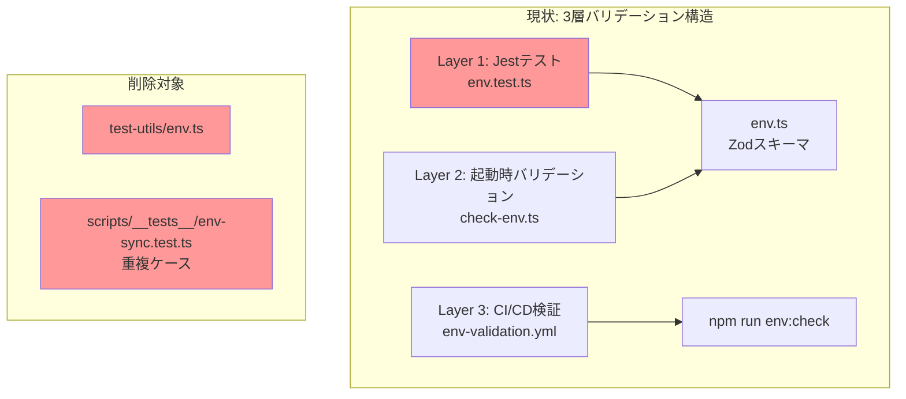
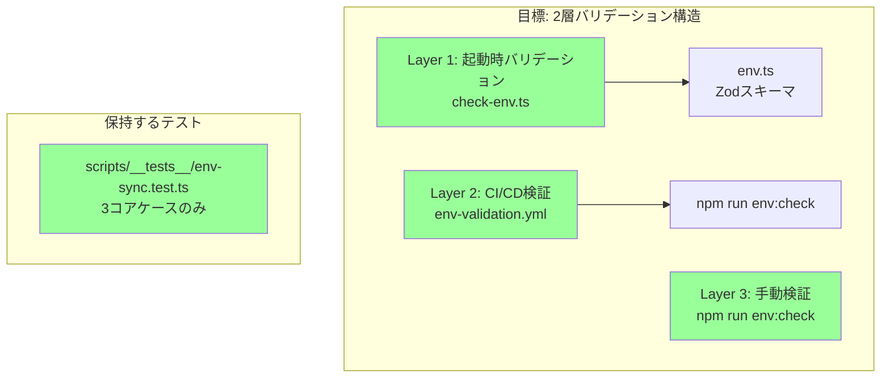
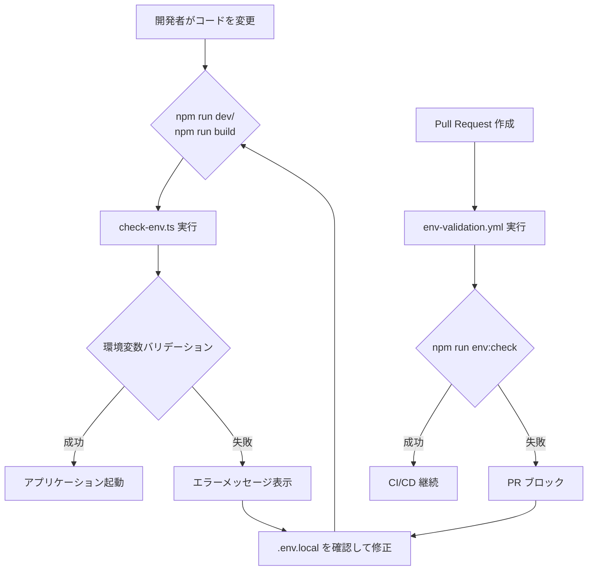
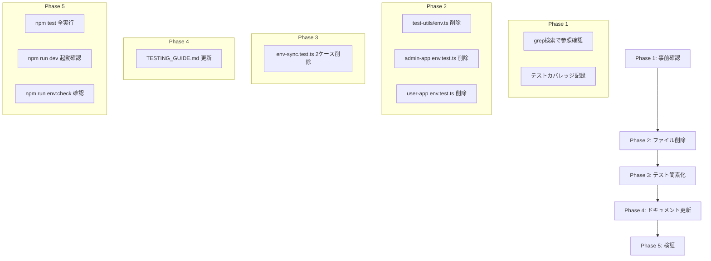

# Technical Design Document

## Overview

**目的**: 環境変数関連テストコードを整理・削除し、既存の起動時バリデーション機構への効率的な移行を実現する。

**対象ユーザー**: 開発者、QA担当者、DevOps担当者がこの変更の恩恵を受ける。削除後もコードベースは簡素化され、テスト実行時間は約5-10秒短縮される。

**影響範囲**: フロントエンドテストスイート（Jest）、CI/CDワークフロー（GitHub Actions）、テストユーティリティ、ドキュメントに影響する。環境変数バリデーション機能自体は変更なく、既存の起動時検証（Zodスキーマ）とCI/CD検証（env-validation.yml）が継続して品質を保証する。

### Goals

- テストコード約300行を削減し保守コストを削減
- テスト実行時間を約5-10秒短縮
- 重複するバリデーションロジックを排除し、コードベースをシンプル化
- 起動時バリデーション + CI/CD検証への一本化

### Non-Goals

- 環境変数バリデーション機能の変更
- `check-env.ts` や `env.ts` のZodスキーマの修正
- 新しい環境変数バリデーション機構の追加
- `env-validation.yml` ワークフローの変更

---

## Architecture

### Feature Classification

**Simple Addition（リファクタリング・削除作業）**: 本機能は既存システムの簡素化であり、新規アーキテクチャ決定や技術選定は不要。既存パターンに従い、ファイル削除とドキュメント更新を実施する。

### 既存アーキテクチャ分析

現在の環境変数バリデーション体制は3層構造で冗長性がある：



### 目標アーキテクチャ



### 削除対象ファイル一覧

| ファイルパス | 行数 | 削除理由 |
|-------------|------|----------|
| `test-utils/env.ts` | 10行 | 参照なし、未使用ユーティリティ |
| `frontend/admin-app/src/lib/__tests__/env.test.ts` | 103行 | 起動時バリデーションで代替 |
| `frontend/user-app/src/lib/__tests__/env.test.ts` | 126行 | 起動時バリデーションで代替 |
| `scripts/__tests__/env-sync.test.ts`（部分） | 約60行 | 2ケース削除、3コアケース保持 |

**合計削除行数**: 約300行

---

## Components and Interfaces

### 削除コンポーネント

#### 1. test-utils/env.ts

**責務**: テスト用環境変数のセット・リセットユーティリティ

**現状の参照状況**:
- 直接importなし（Grep検索で確認済み）
- `frontend/TESTING_GUIDE.md` にドキュメント記載のみ

**削除判定**: `test-utils/` ディレクトリには他に `render.tsx` と `router.ts` が存在するため、ディレクトリは保持しファイルのみ削除

#### 2. frontend/*/src/lib/__tests__/env.test.ts

**責務**: 環境変数バリデーションのJestテスト

**テスト内容**:
- NEXT_PUBLIC_API_URL のバリデーション
- NODE_ENV のバリデーション
- デフォルト値の検証
- エラーメッセージの明瞭性検証

**削除理由**:
- `check-env.ts` による起動時バリデーションで同等の検証が可能
- CI/CD `env-validation.yml` で自動検証済み
- テストでrequire()によるモジュール再読み込みが必要で脆弱

#### 3. scripts/__tests__/env-sync.test.ts（部分削除）

**現状**: 5テストケース

| テストケース | 保持/削除 | 理由 |
|-------------|---------|------|
| `.env.exampleのみ存在する場合、.envが作成される` | 削除 | ケース5と重複 |
| `.envに既存値がある場合、新規キーのみ追加される` | 削除 | コア機能外の追加動作 |
| `不足キーが検出される` | **保持** | コア機能 |
| `未知キーが検出される` | **保持** | コア機能 |
| `.envファイルが存在しない場合、.env.exampleからコピーされる` | **保持** | コア機能 |

---

## Data Models

本機能はデータモデルに変更なし。

---

## Error Handling

### 削除後のエラー検出フロー



### エラーメッセージ

既存のエラーメッセージ（Zodバリデーション由来）は変更なし：

```
環境変数が正しく設定されていません。.env.local を確認してください。
詳細: NEXT_PUBLIC_API_URL: Invalid url
```

---

## Testing Strategy

### 削除後のテスト構成

| テスト種別 | 保持/削除 | 検証内容 |
|-----------|---------|----------|
| `env.test.ts`（Admin App） | 削除 | 起動時バリデーションで代替 |
| `env.test.ts`（User App） | 削除 | 起動時バリデーションで代替 |
| `env-sync.test.ts`（3ケース） | 保持 | 同期スクリプトのコア機能 |

### 品質保証層

削除後も以下の品質保証層が維持される：

1. **起動時バリデーション** (`check-env.ts` + `env.ts`)
   - アプリ起動時にZodスキーマで自動検証
   - 不正な値の場合は起動失敗とエラーメッセージ

2. **CI/CD自動検証** (`env-validation.yml`)
   - PR時に `npm run env:check` を実行
   - 環境変数の整合性を自動チェック

3. **手動検証** (`npm run env:check`)
   - 開発者がローカルで手動実行可能
   - `.env.example` と `.env` の差分を検出

### 削除後のテスト実行確認

```bash
# 全テスト実行（削除後）
npm test

# Admin App テスト
npm --prefix frontend/admin-app test

# User App テスト
npm --prefix frontend/user-app test

# env-sync テスト
npm test -- scripts/__tests__/env-sync.test.ts
```

---

## CI/CD Workflow Adjustments

### frontend-test.yml の変更

**変更箇所**: `paths` セクションから `test-utils/**` を削除する必要はない

**理由**: `test-utils/` ディレクトリには `render.tsx` と `router.ts` が残るため、paths設定は維持

```yaml
# 変更なし（test-utils/** は保持）
paths:
  - 'frontend/**'
  - 'test-utils/**'  # 他のユーティリティが残るため保持
  - 'jest.base.js'
  # ...
```

---

## Migration Strategy

### 実行順序



### ロールバック手順

削除されたファイルは Git 履歴から復元可能：

```bash
# 削除コミットのハッシュを確認
git log --oneline -- test-utils/env.ts

# 特定ファイルの復元
git checkout <commit-hash>^ -- test-utils/env.ts
git checkout <commit-hash>^ -- frontend/admin-app/src/lib/__tests__/env.test.ts
git checkout <commit-hash>^ -- frontend/user-app/src/lib/__tests__/env.test.ts
```

---

## Requirements Traceability

| 要件 | 要件概要 | 実装コンポーネント | 検証方法 |
|------|---------|-------------------|---------|
| 1 | 未使用ユーティリティ削除 | test-utils/env.ts | grep検索→削除→npm test |
| 2 | フロントエンドテスト削除 | env.test.ts (両App) | 削除→npm test→npm run dev |
| 3 | env-sync簡素化 | env-sync.test.ts | 2ケース削除→3ケース維持確認 |
| 4 | CI/CDワークフロー調整 | frontend-test.yml | 変更不要（test-utils保持） |
| 5 | ドキュメント更新 | TESTING_GUIDE.md | env.tsセクション削除 |
| 6 | 品質保証 | 起動時+CI/CD検証 | npm run dev + PR作成 |
| 7 | ロールバック対応 | Git履歴 | git checkout確認 |
