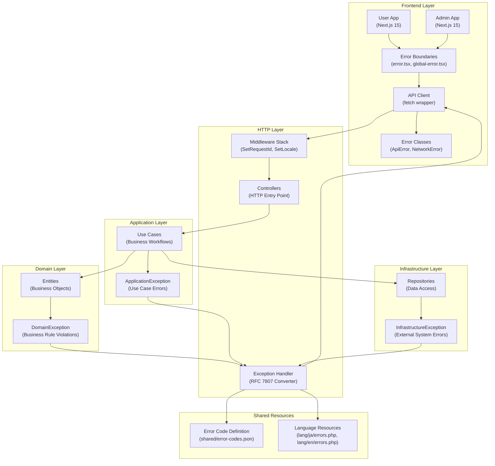
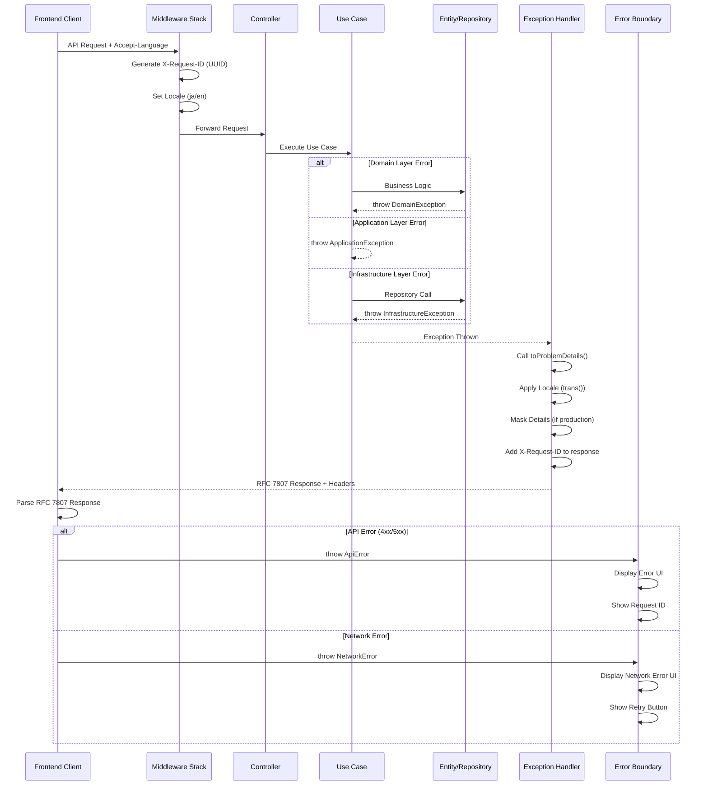
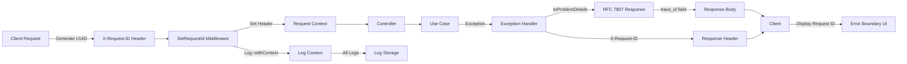
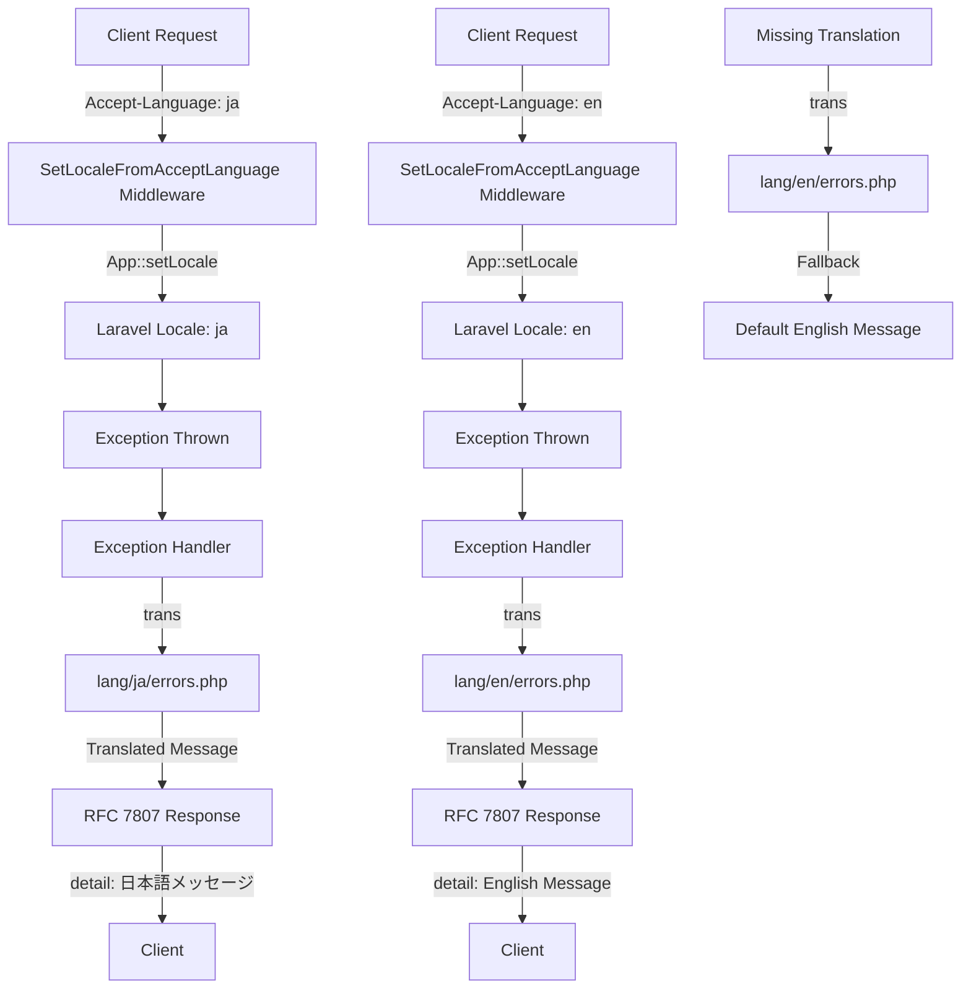
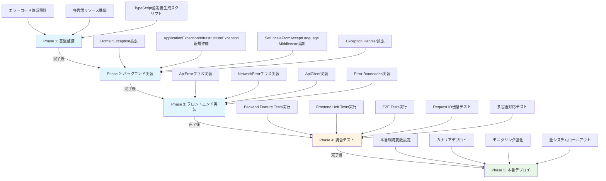

# Technical Design: エラーハンドリングパターン

## Overview

本設計は、Laravel 12バックエンドとNext.js 15フロントエンドにおいて、RFC 7807 (Problem Details for HTTP APIs) 準拠の統一的なエラーハンドリングパターンを実装するための技術設計を定義する。

**Purpose**: 標準化されたエラーハンドリングパターンにより、開発効率の向上、トラブルシューティングの効率化、グローバル対応を実現する。

**Users**: API開発者、フロントエンド開発者、運用担当者、QA担当者がこのパターンを利用してエラーハンドリングを実装・運用する。

**Impact**: 既存のLaravel Exception HandlerとNext.jsエラーハンドリングを拡張し、RFC 7807準拠のレスポンス形式、Request ID伝播、多言語対応、統一APIクライアント、Error Boundariesを追加する。既存のエラーレスポンスとの互換性を維持しながら段階的に移行する。

### Goals

- RFC 7807準拠のAPIエラーレスポンス生成により、業界標準のエラー形式を採用
- Request ID・Trace IDによる一貫したエラー追跡で障害対応時間を短縮
- Accept-Languageヘッダーに基づく多言語エラーメッセージで、グローバルユーザー体験を向上
- DDD Exception階層拡張により、エラーの発生源（Domain/Application/Infrastructure層）を明確化
- フロントエンド統一APIクライアントとError Boundariesにより、エラーハンドリングロジックを再利用

### Non-Goals

- 既存の非RFC形式エラーレスポンスの完全削除（段階的移行戦略により互換性維持）
- Sentry、Datadog等の外部ログシステム統合（別Issueで対応）
- デザインシステム整備によるエラーUIの本格的なデザイン（基本的なUIのみ実装）
- WebSocketエラーハンドリング（HTTP APIのみ対象）

## Architecture

### Existing Architecture Analysis

本プロジェクトは既にDDD/クリーンアーキテクチャ（4層構造: Domain/Application/Infrastructure/HTTP）を採用しており、以下のパターンが確立されている：

- **DDD 4層構造**: `ddd/Domain/`, `ddd/Application/`, `ddd/Infrastructure/`, `app/Http/`
- **既存DomainException**: `ddd/Shared/Exceptions/DomainException.php`（抽象クラス、`getStatusCode()`と`getErrorCode()`メソッド定義済み）
- **既存Request IDミドルウェア**: `app/Http/Middleware/SetRequestId.php`（UUID生成、ログコンテキスト追加、レスポンスヘッダー設定済み）
- **既存ミドルウェアスタック**: 6層構成（ログ・監視、APIレート制限、冪等性保証、認証・認可、監査ログ、キャッシュ管理）

本設計は、これらの既存パターンを尊重し、以下を拡張する：

- DomainExceptionに`toProblemDetails()`メソッドを追加（RFC 7807形式への変換）
- ApplicationException、InfrastructureExceptionの新規追加（DDDレイヤー別Exception階層）
- Exception Handlerを拡張してRFC 7807形式レスポンス生成
- SetLocaleFromAcceptLanguage Middlewareの追加（既存ミドルウェアスタックに統合）

### High-Level Architecture



**Architecture Integration**:
- **既存パターン保持**: DDD 4層構造の依存方向ルール（HTTP → Application → Domain ← Infrastructure）を維持
- **新規コンポーネント追加理由**:
  - RFC 7807形式変換のためのException Handler拡張
  - DDDレイヤー別Exception階層（ApplicationException、InfrastructureException）
  - フロントエンド統一APIクライアント（fetch wrapper）
  - Next.js Error Boundaries（エラーUI表示）
- **技術スタック適合**: Laravel 12（PHP 8.4）、Next.js 15（React 19）、TypeScript、Pest 4、Jest、Playwrightの既存スタックに完全適合
- **Steering準拠**: DDD/クリーンアーキテクチャ原則、SOLID原則、既存ミドルウェアスタック統合

### Technology Alignment

本機能は既存の技術スタックに完全に適合する：

**Backend (Laravel 12 + PHP 8.4)**:
- Laravel標準Exception Handler拡張（`app/Exceptions/Handler.php`）
- Laravel Translation機能活用（`trans()`ヘルパー、`lang/{locale}/errors.php`）
- 既存DDD Exception階層拡張（`ddd/Shared/Exceptions/`）
- Laravel Middleware統合（`app/Http/Middleware/SetLocaleFromAcceptLanguage.php`）

**Frontend (Next.js 15 + React 19 + TypeScript)**:
- Next.js App Router Error Boundaries（`app/error.tsx`, `app/global-error.tsx`）
- TypeScript型安全なエラークラス（`lib/errors/api-error.ts`, `lib/errors/network-error.ts`）
- Fetch APIベースのAPIクライアント（`lib/api/client.ts`）

**新規依存関係**: なし（全て既存のLaravel/Next.js標準機能を使用）

**パターンからの逸脱**: なし（既存のDDD/クリーンアーキテクチャパターンに完全準拠）

### Key Design Decisions

#### Decision 1: RFC 7807 Problem Details形式の採用

**Context**: 既存のLaravelエラーレスポンスは標準化されておらず、クライアント側のエラーハンドリングが複雑化している。業界標準のエラーレスポンス形式を採用することで、API設計の一貫性とクライアント側の実装効率を向上させる必要がある。

**Alternatives**:
1. **独自JSON形式**: `{"success": false, "error": "..."}`形式の独自設計
2. **JSON:API形式**: JSON:API仕様（https://jsonapi.org/）のエラーオブジェクト
3. **RFC 7807形式**: IETF標準のProblem Details形式

**Selected Approach**: RFC 7807 (Problem Details for HTTP APIs) 形式

RFC 7807形式のレスポンス例：
```json
{
  "type": "https://api.example.com/errors/auth/invalid-credentials",
  "title": "Invalid Credentials",
  "status": 401,
  "detail": "The provided email or password is incorrect.",
  "error_code": "AUTH-2001",
  "trace_id": "550e8400-e29b-41d4-a716-446655440000",
  "instance": "/api/v1/login",
  "timestamp": "2025-11-02T00:00:00Z"
}
```

**Rationale**:
- **業界標準準拠**: IETF RFC 7807は広く採用されている業界標準であり、多くのAPIクライアントライブラリがサポート
- **拡張性**: カスタムフィールド（`error_code`, `trace_id`）の追加が仕様で許可されており、独自要件に対応可能
- **型安全性**: 明確なスキーマ定義により、TypeScript型定義との親和性が高い
- **ドキュメント化**: RFC仕様により、開発者がエラーレスポンスの構造を理解しやすい

**Trade-offs**:
- **獲得**: 業界標準準拠、クライアント側実装の効率化、既存ツール・ライブラリとの互換性
- **犠牲**: 独自形式と比較して若干のレスポンスサイズ増加（平均50-100バイト）、既存エラーレスポンスからの移行コスト

#### Decision 2: DDD Exception階層の拡張戦略

**Context**: 既存の`DomainException`のみでは、Application層（ユースケースエラー）やInfrastructure層（外部システムエラー）のエラーを適切に分類できない。DDDレイヤー別のException階層を設計し、エラーの発生源を明確にする必要がある。

**Alternatives**:
1. **単一Exception階層**: 既存`DomainException`のみを使用し、エラーコードで分類
2. **Laravel標準Exception**: Laravelの`ModelNotFoundException`、`ValidationException`等の標準例外のみ使用
3. **DDDレイヤー別Exception階層**: Domain/Application/Infrastructure層ごとに基底Exceptionクラスを定義

**Selected Approach**: DDDレイヤー別Exception階層（Domain/Application/Infrastructure）

Exception階層構造：
```
Exception (PHP標準)
├── DomainException (抽象クラス、既存)
│   ├── UserEmailAlreadyExistsException (具象クラス、例)
│   └── InvalidUserAgeException (具象クラス、例)
├── ApplicationException (基底クラス、新規)
│   ├── ResourceNotFoundException (具象クラス、例)
│   └── UnauthorizedAccessException (具象クラス、例)
└── InfrastructureException (基底クラス、新規)
    ├── DatabaseConnectionException (具象クラス、例)
    └── ExternalApiTimeoutException (具象クラス、例)
```

各基底クラスの共通メソッド：
- `getStatusCode(): int` - HTTPステータスコード取得
- `getErrorCode(): string` - 独自エラーコード取得（`DOMAIN-SUBDOMAIN-CODE`形式）
- `toProblemDetails(): array` - RFC 7807形式への変換

**Rationale**:
- **エラー発生源の明確化**: レイヤー別Exception階層により、エラーがどの層で発生したかが明確（Domain: ビジネスルール違反、Application: ユースケース実行エラー、Infrastructure: 外部システムエラー）
- **DDD原則準拠**: クリーンアーキテクチャの依存方向ルール（HTTP → Application → Domain ← Infrastructure）に適合
- **HTTPステータスコードマッピング**: 各レイヤーで適切なHTTPステータスコードを定義可能（Domain: 400/409、Application: 403/404、Infrastructure: 502/503/504）
- **既存コード拡張**: 既存`DomainException`を保持し、新規ApplicationException/InfrastructureExceptionを追加する拡張戦略

**Trade-offs**:
- **獲得**: エラー発生源の明確化、DDD原則準拠、適切なHTTPステータスコードマッピング、テスタビリティ向上
- **犠牲**: Exception階層の複雑性増加、既存コードの一部リファクタリング必要

#### Decision 3: フロントエンド統一APIクライアント（Fetch Wrapper）設計

**Context**: 現在、各コンポーネントで個別にfetch APIを呼び出しており、エラーハンドリングロジックが重複している。統一APIクライアントを実装し、RFC 7807レスポンスの解析、Request ID生成、タイムアウト管理、エラークラス生成を一元化する必要がある。

**Alternatives**:
1. **axios**: 広く採用されているHTTPクライアントライブラリ（約500KB）
2. **ky**: 軽量なfetch wrapper（約11KB）
3. **カスタムfetch wrapper**: プロジェクト固有の薄いラッパー実装

**Selected Approach**: カスタムfetch wrapper実装

APIクライアントの主要機能：
```typescript
class ApiClient {
  async request<T>(url: string, options?: RequestInit): Promise<T> {
    // 1. X-Request-ID自動生成（未設定の場合）
    // 2. Accept-Languageヘッダー自動付与（ブラウザ言語設定）
    // 3. Accept: application/problem+jsonヘッダー設定
    // 4. AbortController によるタイムアウト管理（30秒）
    // 5. RFC 7807レスポンス解析
    // 6. ApiError/NetworkError クラス生成
  }
}
```

**Rationale**:
- **バンドルサイズ最適化**: axiosの約500KBに対し、カスタム実装は約2-3KBで済む（Next.js App Routerのバンドル最適化に適合）
- **型安全性**: TypeScriptの型定義を完全に制御可能、RFC 7807レスポンス型との統合が容易
- **プロジェクト固有要件**: Request ID生成、RFC 7807レスポンス解析、エラークラス生成等、プロジェクト固有の要件に最適化
- **既存技術スタック適合**: Next.js 15 + React 19のFetch API標準サポートを活用

**Trade-offs**:
- **獲得**: バンドルサイズ最小化（約2-3KB）、型安全性の完全制御、プロジェクト固有要件への最適化
- **犠牲**: axios/kyの豊富なプラグインエコシステム、インターセプター機能（必要に応じて独自実装可能）

## System Flows

### エラーハンドリングフロー（Backend → Frontend）



### Request ID伝播フロー



### 多言語エラーメッセージフロー



## Requirements Traceability

| Requirement | 要件概要 | Components | Interfaces | Flows |
|-------------|---------|------------|------------|-------|
| **1. RFC 7807準拠のAPIエラーレスポンス生成** | 全てのAPIエラーレスポンスがRFC 7807形式で統一される | Exception Handler、DomainException::toProblemDetails() | toProblemDetails(): array、render(): Response | エラーハンドリングフロー |
| **2. DDD Exception階層の拡張** | DDDレイヤー別に適切なException階層を持つ | DomainException、ApplicationException、InfrastructureException | getStatusCode(): int、getErrorCode(): string | エラーハンドリングフロー |
| **3. Request ID伝播とトレーサビリティ** | Request ID・Trace IDによる一貫したエラー追跡 | SetRequestId Middleware、Exception Handler | handle(Request): Response、X-Request-IDヘッダー | Request ID伝播フロー |
| **4. エラーコード体系の定義と管理** | 統一されたエラーコード体系によるエラー分類 | shared/error-codes.json、PHP Enum、TypeScript型定義 | ErrorCode Enum、ErrorCodeDefinition型 | - |
| **5. 多言語エラーメッセージ対応** | 自分の言語でエラーメッセージを受け取る | SetLocaleFromAcceptLanguage Middleware、lang/{locale}/errors.php | handle(Request): Response、trans(): string | 多言語エラーメッセージフロー |
| **6. フロントエンド統一APIクライアント実装** | 統一されたAPIクライアントによるエラーハンドリングロジック再利用 | ApiClient (fetch wrapper) | request<T>(): Promise<T> | エラーハンドリングフロー |
| **7. Next.js Error Boundaries実装** | エラー発生時に適切なエラーメッセージと復旧方法を画面で確認 | error.tsx、global-error.tsx | ErrorBoundaryComponent | エラーハンドリングフロー |
| **8. エラークラス定義** | 型安全なエラークラスによるエラーハンドリングコードの品質向上 | ApiError、NetworkError、AppError | ApiError、NetworkError型 | エラーハンドリングフロー |
| **9. 統合テストとカバレッジ** | 包括的なテストスイートによるエラーハンドリングパターンの正確性保証 | tests/Unit/、tests/Feature/、e2e/tests/ | テストケース | - |
| **10. ドキュメントとCI/CD統合** | 包括的なドキュメントとCI/CD統合によるエラーハンドリングパターンの運用標準化 | docs/error-codes.md、docs/error-handling-troubleshooting.md、GitHub Actions | - | - |

## Components and Interfaces

### Backend / Exception Handling

#### Exception Handler (Laravel標準拡張)

**Responsibility & Boundaries**
- **Primary Responsibility**: 全てのLaravel Exceptionをキャッチし、RFC 7807形式のJSONレスポンスに変換する
- **Domain Boundary**: HTTP層（`app/Exceptions/`）
- **Data Ownership**: エラーレスポンスの生成とフォーマット
- **Transaction Boundary**: 例外発生時のレスポンス生成（トランザクション外）

**Dependencies**
- **Inbound**: Laravelフレームワーク（例外発生時に自動呼び出し）
- **Outbound**: DomainException、ApplicationException、InfrastructureException（`toProblemDetails()`メソッド呼び出し）、Laravel Translation（`trans()`ヘルパー）
- **External**: なし

**Contract Definition**

**Service Interface**:
```php
interface ExceptionHandler
{
    /**
     * RFC 7807形式のエラーレスポンスを生成する
     *
     * @param \Throwable $e 発生した例外
     * @return \Illuminate\Http\JsonResponse RFC 7807形式のレスポンス
     */
    public function render($request, \Throwable $e): JsonResponse;

    /**
     * 本番環境でエラー詳細をマスクする
     *
     * @param \Throwable $e 発生した例外
     * @return array マスクされたエラー詳細
     */
    protected function maskSensitiveDetails(\Throwable $e): array;
}
```

**Preconditions**: Laravel Exceptionが発生していること、Request ID Middlewareが実行済みであること

**Postconditions**: RFC 7807形式のJSONレスポンスが生成され、Content-Typeヘッダーが`application/problem+json`に設定されること、X-Request-IDヘッダーがレスポンスに含まれること

**Invariants**: 本番環境では内部エラー詳細をマスクすること、開発環境ではスタックトレースを含むこと

#### DomainException (抽象クラス拡張)

**Responsibility & Boundaries**
- **Primary Responsibility**: Domain層のビジネスルール違反を表現し、RFC 7807形式への変換機能を提供する
- **Domain Boundary**: Domain層（`ddd/Shared/Exceptions/`）
- **Data Ownership**: ビジネスルール違反の詳細情報
- **Transaction Boundary**: 例外生成時（トランザクション内）

**Dependencies**
- **Inbound**: Domain Entities、Domain Services
- **Outbound**: なし（Domainレイヤーは他の層に依存しない）
- **External**: なし

**Contract Definition**

**Service Interface**:
```php
abstract class DomainException extends Exception
{
    /**
     * HTTPステータスコードを取得する
     *
     * @return int HTTPステータスコード（400, 409等）
     */
    abstract public function getStatusCode(): int;

    /**
     * 独自エラーコードを取得する
     *
     * @return string DOMAIN-SUBDOMAIN-CODE形式（例: AUTH-2001）
     */
    abstract public function getErrorCode(): string;

    /**
     * RFC 7807形式のProblem Detailsに変換する
     *
     * @return array RFC 7807形式の配列
     */
    public function toProblemDetails(): array
    {
        return [
            'type' => $this->getErrorType(),
            'title' => $this->getTitle(),
            'status' => $this->getStatusCode(),
            'detail' => $this->getMessage(),
            'error_code' => $this->getErrorCode(),
            'trace_id' => request()->header('X-Request-ID'),
            'instance' => request()->getRequestUri(),
            'timestamp' => now()->toIso8601String(),
        ];
    }

    /**
     * エラータイプURIを取得する
     *
     * @return string エラータイプURI
     */
    protected function getErrorType(): string
    {
        return config('app.url') . '/errors/' . strtolower($this->getErrorCode());
    }

    /**
     * エラータイトルを取得する
     *
     * @return string エラータイトル
     */
    abstract protected function getTitle(): string;
}
```

**Preconditions**: ビジネスルール違反が発生していること

**Postconditions**: RFC 7807形式の配列が生成されること、エラーコードが`DOMAIN-SUBDOMAIN-CODE`形式であること

**Invariants**: HTTPステータスコードは400番台であること（400 Bad Request、409 Conflict）

#### ApplicationException (基底クラス新規)

**Responsibility & Boundaries**
- **Primary Responsibility**: Application層のユースケース実行エラーを表現し、RFC 7807形式への変換機能を提供する
- **Domain Boundary**: Application層（`ddd/Shared/Exceptions/`）
- **Data Ownership**: ユースケース実行エラーの詳細情報
- **Transaction Boundary**: 例外生成時（トランザクション内）

**Dependencies**
- **Inbound**: Application層Use Cases
- **Outbound**: なし
- **External**: なし

**Contract Definition**

**Service Interface**:
```php
class ApplicationException extends Exception
{
    protected int $statusCode = 400;
    protected string $errorCode = 'APP-0001';

    /**
     * HTTPステータスコードを取得する
     *
     * @return int HTTPステータスコード（403, 404等）
     */
    public function getStatusCode(): int
    {
        return $this->statusCode;
    }

    /**
     * 独自エラーコードを取得する
     *
     * @return string DOMAIN-SUBDOMAIN-CODE形式（例: APP-0001）
     */
    public function getErrorCode(): string
    {
        return $this->errorCode;
    }

    /**
     * RFC 7807形式のProblem Detailsに変換する
     *
     * @return array RFC 7807形式の配列
     */
    public function toProblemDetails(): array
    {
        return [
            'type' => config('app.url') . '/errors/' . strtolower($this->getErrorCode()),
            'title' => class_basename($this),
            'status' => $this->getStatusCode(),
            'detail' => $this->getMessage(),
            'error_code' => $this->getErrorCode(),
            'trace_id' => request()->header('X-Request-ID'),
            'instance' => request()->getRequestUri(),
            'timestamp' => now()->toIso8601String(),
        ];
    }
}
```

**Preconditions**: ユースケース実行中にエラーが発生していること

**Postconditions**: RFC 7807形式の配列が生成されること

**Invariants**: HTTPステータスコードは400番台であること（403 Forbidden、404 Not Found）

#### InfrastructureException (基底クラス新規)

**Responsibility & Boundaries**
- **Primary Responsibility**: Infrastructure層の外部システムエラーを表現し、RFC 7807形式への変換機能を提供する
- **Domain Boundary**: Infrastructure層（`ddd/Shared/Exceptions/`）
- **Data Ownership**: 外部システムエラーの詳細情報
- **Transaction Boundary**: 例外生成時（トランザクション内）

**Dependencies**
- **Inbound**: Infrastructure層Repositories、External Services
- **Outbound**: なし
- **External**: 外部システム（PostgreSQL、Redis、外部API等）

**Contract Definition**

**Service Interface**:
```php
class InfrastructureException extends Exception
{
    protected int $statusCode = 503;
    protected string $errorCode = 'INFRA-0001';

    /**
     * HTTPステータスコードを取得する
     *
     * @return int HTTPステータスコード（502, 503, 504等）
     */
    public function getStatusCode(): int
    {
        return $this->statusCode;
    }

    /**
     * 独自エラーコードを取得する
     *
     * @return string DOMAIN-SUBDOMAIN-CODE形式（例: INFRA-0001）
     */
    public function getErrorCode(): string
    {
        return $this->errorCode;
    }

    /**
     * RFC 7807形式のProblem Detailsに変換する
     *
     * @return array RFC 7807形式の配列
     */
    public function toProblemDetails(): array
    {
        return [
            'type' => config('app.url') . '/errors/' . strtolower($this->getErrorCode()),
            'title' => class_basename($this),
            'status' => $this->getStatusCode(),
            'detail' => $this->getMessage(),
            'error_code' => $this->getErrorCode(),
            'trace_id' => request()->header('X-Request-ID'),
            'instance' => request()->getRequestUri(),
            'timestamp' => now()->toIso8601String(),
        ];
    }
}
```

**Preconditions**: 外部システムとの通信中にエラーが発生していること

**Postconditions**: RFC 7807形式の配列が生成されること

**Invariants**: HTTPステータスコードは500番台であること（502 Bad Gateway、503 Service Unavailable、504 Gateway Timeout）

#### SetLocaleFromAcceptLanguage Middleware (新規)

**Responsibility & Boundaries**
- **Primary Responsibility**: Accept-Languageヘッダーを解析し、Laravelアプリケーションロケールを設定する
- **Domain Boundary**: HTTP層Middleware（`app/Http/Middleware/`）
- **Data Ownership**: リクエストロケール情報
- **Transaction Boundary**: ミドルウェア実行時（トランザクション前）

**Dependencies**
- **Inbound**: Laravelミドルウェアスタック
- **Outbound**: Laravel Translation（`App::setLocale()`）
- **External**: なし

**Contract Definition**

**API Contract**:

| Method | Endpoint | Request Headers | Response | Errors |
|--------|----------|----------------|----------|--------|
| * | * | Accept-Language: ja | ロケール: ja | - |
| * | * | Accept-Language: en | ロケール: en | - |
| * | * | Accept-Language: (なし) | ロケール: ja（デフォルト） | - |

**Service Interface**:
```php
interface SetLocaleFromAcceptLanguage
{
    /**
     * Accept-Languageヘッダーを解析し、ロケールを設定する
     *
     * @param \Illuminate\Http\Request $request
     * @param \Closure $next
     * @return \Symfony\Component\HttpFoundation\Response
     */
    public function handle(Request $request, Closure $next): Response;

    /**
     * サポートされているロケールのリストを取得する
     *
     * @return array サポート言語配列（['ja', 'en']）
     */
    protected function getSupportedLocales(): array;
}
```

**Preconditions**: リクエストがミドルウェアスタックを通過していること

**Postconditions**: Laravelアプリケーションロケールが設定されること、サポート外の言語の場合はデフォルトロケール（ja）が設定されること

**Invariants**: ロケールは常にサポートされている言語（ja/en）のいずれかであること

### Frontend / Error Handling

#### ApiClient (fetch wrapper)

**Responsibility & Boundaries**
- **Primary Responsibility**: 統一されたAPIリクエスト機能を提供し、RFC 7807レスポンスの解析とエラークラス生成を行う
- **Domain Boundary**: フロントエンド共通ライブラリ（`lib/api/`）
- **Data Ownership**: APIリクエスト・レスポンス管理
- **Transaction Boundary**: APIリクエスト実行時

**Dependencies**
- **Inbound**: React Components、Server Actions、Custom Hooks
- **Outbound**: Laravel API（RFC 7807エンドポイント）
- **External**: Fetch API（ブラウザ標準）

**External Dependencies Investigation**:
- **Fetch API**: ブラウザ標準API、Next.js 15で完全サポート、AbortControllerによるタイムアウト管理可能
- **crypto.randomUUID()**: ブラウザ標準UUID生成API、セキュアなUUIDv4生成

**Contract Definition**

**Service Interface**:
```typescript
interface ApiClient {
  /**
   * APIリクエストを実行する
   *
   * @param url APIエンドポイントURL
   * @param options Fetch APIオプション
   * @returns レスポンスデータ（型安全）
   * @throws ApiError RFC 7807エラー（4xx/5xx）
   * @throws NetworkError ネットワークエラー
   */
  request<T>(url: string, options?: RequestInit): Promise<T>;

  /**
   * GETリクエストを実行する
   *
   * @param url APIエンドポイントURL
   * @returns レスポンスデータ（型安全）
   */
  get<T>(url: string): Promise<T>;

  /**
   * POSTリクエストを実行する
   *
   * @param url APIエンドポイントURL
   * @param body リクエストボディ
   * @returns レスポンスデータ（型安全）
   */
  post<T>(url: string, body?: unknown): Promise<T>;

  /**
   * PUTリクエストを実行する
   *
   * @param url APIエンドポイントURL
   * @param body リクエストボディ
   * @returns レスポンスデータ（型安全）
   */
  put<T>(url: string, body?: unknown): Promise<T>;

  /**
   * DELETEリクエストを実行する
   *
   * @param url APIエンドポイントURL
   * @returns レスポンスデータ（型安全）
   */
  delete<T>(url: string): Promise<T>;
}
```

**Preconditions**: ブラウザ環境でFetch APIが利用可能であること、APIエンドポイントURLが有効であること

**Postconditions**: RFC 7807レスポンスが正しく解析されること、エラー時にApiError/NetworkErrorがthrowされること、X-Request-IDヘッダーが自動付与されること

**Invariants**: タイムアウト時間は30秒であること、Accept-Languageヘッダーはブラウザ言語設定から自動取得されること

**State Management**:
- **State Model**: ステートレス（リクエストごとに独立）
- **Persistence**: なし（インメモリのみ）
- **Concurrency**: 並列リクエスト可能（AbortControllerにより個別管理）

#### ApiError (エラークラス)

**Responsibility & Boundaries**
- **Primary Responsibility**: RFC 7807形式のAPIエラーを型安全に表現し、ヘルパーメソッドを提供する
- **Domain Boundary**: フロントエンド共通ライブラリ（`lib/errors/`）
- **Data Ownership**: RFC 7807エラー情報
- **Transaction Boundary**: エラー生成時

**Dependencies**
- **Inbound**: ApiClient
- **Outbound**: なし
- **External**: なし

**Contract Definition**

**Service Interface**:
```typescript
interface RFC7807Problem {
  type: string;
  title: string;
  status: number;
  detail: string;
  error_code: string;
  trace_id: string;
  instance: string;
  timestamp: string;
  errors?: Record<string, string[]>; // バリデーションエラー用
}

class ApiError extends Error {
  /**
   * RFC 7807形式のAPIエラーを生成する
   *
   * @param problem RFC 7807 Problem Detailsオブジェクト
   */
  constructor(problem: RFC7807Problem);

  readonly type: string;
  readonly title: string;
  readonly status: number;
  readonly detail: string;
  readonly errorCode: string;
  readonly requestId: string;
  readonly instance: string;
  readonly timestamp: string;
  readonly validationErrors?: Record<string, string[]>;

  /**
   * バリデーションエラーかどうかを判定する
   *
   * @returns バリデーションエラーの場合true
   */
  isValidationError(): boolean;

  /**
   * 認証エラーかどうかを判定する
   *
   * @returns 認証エラー（401）の場合true
   */
  isAuthenticationError(): boolean;

  /**
   * 認可エラーかどうかを判定する
   *
   * @returns 認可エラー（403）の場合true
   */
  isAuthorizationError(): boolean;

  /**
   * Not Foundエラーかどうかを判定する
   *
   * @returns Not Found（404）の場合true
   */
  isNotFoundError(): boolean;

  /**
   * サーバーエラーかどうかを判定する
   *
   * @returns サーバーエラー（5xx）の場合true
   */
  isServerError(): boolean;

  /**
   * ユーザー向け表示メッセージを取得する
   *
   * @returns 表示用エラーメッセージ
   */
  getDisplayMessage(): string;
}
```

**Preconditions**: RFC 7807形式のレスポンスJSONオブジェクトが渡されること

**Postconditions**: 型安全なApiErrorインスタンスが生成されること、ヘルパーメソッドが正しく動作すること

**Invariants**: statusは100-599の範囲であること、requestIdはUUID形式であること

#### NetworkError (エラークラス)

**Responsibility & Boundaries**
- **Primary Responsibility**: ネットワークエラー（接続失敗、タイムアウト）を型安全に表現し、リトライ可能性を提供する
- **Domain Boundary**: フロントエンド共通ライブラリ（`lib/errors/`）
- **Data Ownership**: ネットワークエラー情報
- **Transaction Boundary**: エラー生成時

**Dependencies**
- **Inbound**: ApiClient
- **Outbound**: なし
- **External**: なし

**Contract Definition**

**Service Interface**:
```typescript
class NetworkError extends Error {
  /**
   * Fetch APIエラーからNetworkErrorを生成する
   *
   * @param error Fetch APIエラー（TypeError, AbortError）
   * @returns NetworkErrorインスタンス
   */
  static fromFetchError(error: Error): NetworkError;

  /**
   * NetworkErrorを生成する
   *
   * @param message エラーメッセージ
   * @param cause 元のエラー
   */
  constructor(message: string, cause?: Error);

  readonly isRetryable: boolean;
  readonly cause?: Error;

  /**
   * タイムアウトエラーかどうかを判定する
   *
   * @returns タイムアウトの場合true
   */
  isTimeout(): boolean;

  /**
   * 接続エラーかどうかを判定する
   *
   * @returns 接続失敗の場合true
   */
  isConnectionError(): boolean;

  /**
   * ユーザー向け表示メッセージを取得する
   *
   * @returns 表示用エラーメッセージ
   */
  getDisplayMessage(): string;
}
```

**Preconditions**: Fetch APIエラー（TypeError、AbortError）が発生していること

**Postconditions**: NetworkErrorインスタンスが生成されること、isRetryableが正しく設定されること

**Invariants**: タイムアウトエラーの場合isRetryableはtrueであること

#### Error Boundaries (error.tsx, global-error.tsx)

**Responsibility & Boundaries**
- **Primary Responsibility**: Next.jsセグメントでのエラーをキャッチし、ユーザーフレンドリーなエラーUIを表示する
- **Domain Boundary**: Next.js App Router（`app/error.tsx`, `app/global-error.tsx`）
- **Data Ownership**: エラーUI表示状態
- **Transaction Boundary**: エラー発生時

**Dependencies**
- **Inbound**: Next.jsフレームワーク（エラー発生時に自動呼び出し）
- **Outbound**: ApiError、NetworkError
- **External**: なし

**Contract Definition**

**Service Interface**:
```typescript
interface ErrorBoundaryProps {
  /**
   * 発生したエラー
   */
  error: Error | ApiError | NetworkError;

  /**
   * エラーをリセットして再試行する関数
   */
  reset: () => void;
}

/**
 * Error Boundaryコンポーネント
 *
 * @param props エラー情報とリセット関数
 * @returns エラーUI
 */
function ErrorBoundary({ error, reset }: ErrorBoundaryProps): React.ReactElement;
```

**Preconditions**: Next.jsセグメントでエラーが発生していること

**Postconditions**: エラーUIが表示されること、Request ID（trace_id）がユーザーに提示されること、再試行ボタンが機能すること

**Invariants**: 本番環境では内部エラー詳細をマスクすること、開発環境ではスタックトレースを表示すること

### Shared / Error Code Management

#### Error Code Definition (shared/error-codes.json)

**Responsibility & Boundaries**
- **Primary Responsibility**: 統一されたエラーコード体系を定義し、TypeScript型定義とPHP Enumの自動生成元となる
- **Domain Boundary**: 共有リソース（`shared/`）
- **Data Ownership**: エラーコード定義
- **Transaction Boundary**: ビルド時（静的リソース）

**Dependencies**
- **Inbound**: ビルドスクリプト（型定義生成）
- **Outbound**: なし
- **External**: なし

**Contract Definition**

**Data Model**:
```json
{
  "error_codes": [
    {
      "code": "AUTH-2001",
      "http_status": 401,
      "type": "https://api.example.com/errors/auth/invalid-credentials",
      "default_message": "Invalid Credentials",
      "translation_key": "errors.auth.invalid_credentials",
      "category": "authentication"
    },
    {
      "code": "VAL-1001",
      "http_status": 422,
      "type": "https://api.example.com/errors/validation/email-invalid",
      "default_message": "Invalid Email Format",
      "translation_key": "errors.validation.email_invalid",
      "category": "validation"
    }
  ]
}
```

**Preconditions**: JSON形式が有効であること、エラーコードが`DOMAIN-SUBDOMAIN-CODE`形式であること

**Postconditions**: TypeScript型定義ファイル（`shared/error-codes.d.ts`）とPHP Enum（`app/Enums/ErrorCode.php`）が自動生成されること

**Invariants**: エラーコードは一意であること、http_statusは100-599の範囲であること

## Data Models

### Domain Model

本システムのエラーハンドリングは、DDD（Domain-Driven Design）の原則に基づき、以下のコアコンセプトを持つ：

**Core Concepts**:

- **Exception Aggregates**: エラーハンドリングのトランザクション境界
  - DomainException Aggregate（Domain層エラー）
  - ApplicationException Aggregate（Application層エラー）
  - InfrastructureException Aggregate（Infrastructure層エラー）

- **Value Objects**:
  - ErrorCode（`DOMAIN-SUBDOMAIN-CODE`形式、例: `AUTH-2001`）
  - RequestId（UUID形式、例: `550e8400-e29b-41d4-a716-446655440000`）
  - HttpStatusCode（100-599の範囲）

- **Domain Events**:
  - ExceptionThrown（例外発生時）
  - ErrorResponseGenerated（エラーレスポンス生成時）
  - ErrorLogged（エラーログ記録時）

**Business Rules & Invariants**:
- エラーコードは`DOMAIN-SUBDOMAIN-CODE`形式で一意であること
- Domain層エラーのHTTPステータスコードは400番台（400, 409）
- Application層エラーのHTTPステータスコードは400番台（403, 404）
- Infrastructure層エラーのHTTPステータスコードは500番台（502, 503, 504）
- 本番環境では内部エラー詳細をマスクすること
- Request IDは全てのエラーレスポンスに含まれること

### Physical Data Model

#### RFC 7807 Problem Details Schema (JSON)

```json
{
  "$schema": "http://json-schema.org/draft-07/schema#",
  "type": "object",
  "required": ["type", "title", "status", "detail"],
  "properties": {
    "type": {
      "type": "string",
      "format": "uri",
      "description": "エラータイプを識別するURI"
    },
    "title": {
      "type": "string",
      "description": "人間が読めるエラーの要約"
    },
    "status": {
      "type": "integer",
      "minimum": 100,
      "maximum": 599,
      "description": "HTTPステータスコード"
    },
    "detail": {
      "type": "string",
      "description": "このエラー発生の具体的な説明"
    },
    "error_code": {
      "type": "string",
      "pattern": "^[A-Z]+-[A-Z]+-[0-9]{4}$",
      "description": "独自エラーコード（DOMAIN-SUBDOMAIN-CODE形式）"
    },
    "trace_id": {
      "type": "string",
      "format": "uuid",
      "description": "リクエストトレースID（UUID形式）"
    },
    "instance": {
      "type": "string",
      "format": "uri",
      "description": "エラーが発生したリクエストURI"
    },
    "timestamp": {
      "type": "string",
      "format": "date-time",
      "description": "エラー発生時刻（ISO 8601形式）"
    },
    "errors": {
      "type": "object",
      "additionalProperties": {
        "type": "array",
        "items": {
          "type": "string"
        }
      },
      "description": "バリデーションエラー詳細（フィールド別）"
    }
  }
}
```

#### Error Code Definition Schema (JSON)

```json
{
  "$schema": "http://json-schema.org/draft-07/schema#",
  "type": "object",
  "required": ["error_codes"],
  "properties": {
    "error_codes": {
      "type": "array",
      "items": {
        "type": "object",
        "required": ["code", "http_status", "type", "default_message", "translation_key", "category"],
        "properties": {
          "code": {
            "type": "string",
            "pattern": "^[A-Z]+-[A-Z]+-[0-9]{4}$",
            "description": "エラーコード（DOMAIN-SUBDOMAIN-CODE形式）"
          },
          "http_status": {
            "type": "integer",
            "minimum": 100,
            "maximum": 599,
            "description": "HTTPステータスコード"
          },
          "type": {
            "type": "string",
            "format": "uri",
            "description": "RFC 7807 type URI"
          },
          "default_message": {
            "type": "string",
            "description": "デフォルトエラーメッセージ（英語）"
          },
          "translation_key": {
            "type": "string",
            "description": "翻訳キー（lang/{locale}/errors.php）"
          },
          "category": {
            "type": "string",
            "enum": ["authentication", "authorization", "validation", "business_logic", "infrastructure"],
            "description": "エラーカテゴリー"
          }
        }
      }
    }
  }
}
```

### Data Contracts & Integration

#### API Response Contract

**RFC 7807エラーレスポンス**:

| Field | Type | Required | Description | Example |
|-------|------|----------|-------------|---------|
| type | string (URI) | Yes | エラータイプURI | `https://api.example.com/errors/auth/invalid-credentials` |
| title | string | Yes | エラー要約 | `Invalid Credentials` |
| status | integer | Yes | HTTPステータスコード | `401` |
| detail | string | Yes | 詳細説明 | `The provided email or password is incorrect.` |
| error_code | string | No | 独自エラーコード | `AUTH-2001` |
| trace_id | string (UUID) | No | Request ID | `550e8400-e29b-41d4-a716-446655440000` |
| instance | string (URI) | No | リクエストURI | `/api/v1/login` |
| timestamp | string (ISO 8601) | No | エラー発生時刻 | `2025-11-02T00:00:00Z` |
| errors | object | No | バリデーションエラー | `{ "email": ["Invalid format"] }` |

**Content-Type**: `application/problem+json`

**Response Headers**:
- `Content-Type: application/problem+json`
- `X-Request-ID: {UUID}`

#### TypeScript型定義（自動生成）

```typescript
// shared/error-codes.d.ts (自動生成)
export type ErrorCode =
  | 'AUTH-2001'
  | 'AUTH-2002'
  | 'VAL-1001'
  | 'VAL-1002'
  | 'BIZ-3001'
  | 'INFRA-5001';

export interface ErrorCodeDefinition {
  code: ErrorCode;
  httpStatus: number;
  type: string;
  defaultMessage: string;
  translationKey: string;
  category: 'authentication' | 'authorization' | 'validation' | 'business_logic' | 'infrastructure';
}

export const ERROR_CODES: Record<ErrorCode, ErrorCodeDefinition>;
```

#### PHP Enum（自動生成）

```php
// app/Enums/ErrorCode.php (自動生成)
<?php

declare(strict_types=1);

namespace App\Enums;

enum ErrorCode: string
{
    case AUTH_INVALID_CREDENTIALS = 'AUTH-2001';
    case AUTH_TOKEN_EXPIRED = 'AUTH-2002';
    case VAL_EMAIL_INVALID = 'VAL-1001';
    case VAL_PASSWORD_TOO_SHORT = 'VAL-1002';
    case BIZ_RESOURCE_NOT_FOUND = 'BIZ-3001';
    case INFRA_DATABASE_CONNECTION = 'INFRA-5001';

    public function httpStatus(): int
    {
        return match($this) {
            self::AUTH_INVALID_CREDENTIALS => 401,
            self::AUTH_TOKEN_EXPIRED => 401,
            self::VAL_EMAIL_INVALID => 422,
            self::VAL_PASSWORD_TOO_SHORT => 422,
            self::BIZ_RESOURCE_NOT_FOUND => 404,
            self::INFRA_DATABASE_CONNECTION => 503,
        };
    }

    public function typeUri(): string
    {
        return config('app.url') . '/errors/' . strtolower($this->value);
    }
}
```

## Error Handling

### Error Strategy

本システムは、RFC 7807準拠のエラーハンドリングパターンを採用し、以下の戦略に基づいてエラーを処理する：

1. **レイヤー別Exception階層**: DDD 4層構造に基づき、Domain/Application/Infrastructure層ごとに基底Exceptionクラスを定義し、エラーの発生源を明確化
2. **RFC 7807形式への統一**: 全てのAPIエラーレスポンスをRFC 7807形式に変換し、業界標準のエラーレスポンスを提供
3. **Request ID伝播**: UUID形式のRequest IDを生成・伝播し、ログ追跡とエラー報告の効率化
4. **多言語対応**: Accept-Languageヘッダーに基づくエラーメッセージのローカライズ
5. **環境別マスキング**: 本番環境では内部エラー詳細をマスク、開発環境では詳細情報を表示

### Error Categories and Responses

#### User Errors (4xx)

**Invalid Input (バリデーションエラー - 422 Unprocessable Entity)**:
- **条件**: リクエストパラメータがバリデーションルールに違反
- **レスポンス**: フィールド別エラーメッセージ（`errors`フィールド）
- **リカバリー**: フォーム入力の修正を促すUI表示

**Unauthorized (認証エラー - 401 Unauthorized)**:
- **条件**: 認証トークンが無効または期限切れ
- **レスポンス**: 認証が必要である旨のメッセージ
- **リカバリー**: ログインページへのリダイレクト

**Forbidden (認可エラー - 403 Forbidden)**:
- **条件**: 認証済みだが、リソースへのアクセス権限がない
- **レスポンス**: アクセス権限がない旨のメッセージ
- **リカバリー**: 権限エラーUI表示

**Not Found (404 Not Found)**:
- **条件**: 指定されたリソースが存在しない
- **レスポンス**: リソースが見つからない旨のメッセージ
- **リカバリー**: ホームページまたは一覧ページへのナビゲーション

#### System Errors (5xx)

**Infrastructure Failures (インフラエラー - 502/503/504)**:
- **条件**: データベース接続失敗、外部API通信失敗
- **レスポンス**: 一時的なサービス停止または接続エラーのメッセージ
- **リカバリー**: サーキットブレーカーによる自動リトライ、フォールバック処理

**Timeouts (タイムアウト - 504 Gateway Timeout)**:
- **条件**: 外部システムからのレスポンスがタイムアウト
- **レスポンス**: タイムアウトエラーのメッセージ
- **リカバリー**: 指数バックオフリトライ、ユーザーへの再試行促進

**Resource Exhaustion (リソース枯渇 - 429 Too Many Requests)**:
- **条件**: APIレート制限超過
- **レスポンス**: レート制限超過メッセージ、`Retry-After`ヘッダー
- **リカバリー**: クライアント側レート制限、リトライ待機

#### Business Logic Errors (422 Unprocessable Entity)

**Rule Violations (ビジネスルール違反)**:
- **条件**: ビジネスロジックの制約違反（例: 在庫不足、重複登録）
- **レスポンス**: ビジネスルール違反の具体的な理由
- **リカバリー**: 条件説明UIとリカバリー手順の提示

**State Conflicts (状態競合 - 409 Conflict)**:
- **条件**: リソースの状態が期待と異なる（例: 既に処理済み）
- **レスポンス**: 状態競合の詳細と現在の状態
- **リカバリー**: 最新状態の再取得と状態遷移ガイダンス

### Error Response Examples

**バリデーションエラー例**:
```json
{
  "type": "https://api.example.com/errors/validation/invalid-input",
  "title": "Validation Failed",
  "status": 422,
  "detail": "The request contains invalid fields.",
  "error_code": "VAL-1001",
  "trace_id": "550e8400-e29b-41d4-a716-446655440000",
  "instance": "/api/v1/users",
  "timestamp": "2025-11-02T00:00:00Z",
  "errors": {
    "email": ["メールアドレス形式が不正です"],
    "password": ["8文字以上必要です"]
  }
}
```

**認証エラー例**:
```json
{
  "type": "https://api.example.com/errors/auth/invalid-credentials",
  "title": "Invalid Credentials",
  "status": 401,
  "detail": "The provided email or password is incorrect.",
  "error_code": "AUTH-2001",
  "trace_id": "550e8400-e29b-41d4-a716-446655440000",
  "instance": "/api/v1/login",
  "timestamp": "2025-11-02T00:00:00Z"
}
```

**インフラエラー例（本番環境・マスク済み）**:
```json
{
  "type": "https://api.example.com/errors/infrastructure/service-unavailable",
  "title": "Service Unavailable",
  "status": 503,
  "detail": "A temporary service error occurred. Please try again later.",
  "error_code": "INFRA-5001",
  "trace_id": "550e8400-e29b-41d4-a716-446655440000",
  "instance": "/api/v1/orders",
  "timestamp": "2025-11-02T00:00:00Z"
}
```

### Monitoring

**Error Tracking**:
- Laravel Log（`storage/logs/laravel.log`）にRequest ID、エラーコード、ユーザーID、リクエストパスを含む構造化ログを記録
- `Log::withContext()`によりRequest IDをログコンテキストに追加
- エラーレベル別のログ分離（Error、Warning、Info）

**Logging Strategy**:
```php
// Laravel構造化ログ例
Log::error('DomainException occurred', [
    'trace_id' => $requestId,
    'error_code' => $exception->getErrorCode(),
    'user_id' => auth()->id(),
    'request_path' => request()->path(),
    'exception_class' => get_class($exception),
    'message' => $exception->getMessage(),
]);
```

**Health Monitoring**:
- `/api/health`エンドポイントによるAPIサーバー稼働監視
- Exception Handler実行回数のメトリクス記録
- エラーレート（4xx/5xx比率）の監視

## Testing Strategy

### Unit Tests (Backend - Pest 4)

**Core Functions**:
1. **DomainException::toProblemDetails()**: RFC 7807形式への変換テスト
2. **ApplicationException::getStatusCode()**: HTTPステータスコード取得テスト
3. **InfrastructureException::getErrorCode()**: エラーコード取得テスト
4. **SetRequestId Middleware**: UUID生成・ログコンテキスト追加テスト
5. **SetLocaleFromAcceptLanguage Middleware**: ロケール設定テスト

**Target Coverage**: 90%以上（対象: `ddd/Shared/Exceptions/*Exception.php`、`app/Http/Middleware/SetRequestId.php`、`app/Http/Middleware/SetLocaleFromAcceptLanguage.php`）

### Integration Tests (Backend - Pest 4 Feature Tests)

**Cross-Component Flows**:
1. **Exception Handler + DomainException統合**: DomainException発生時のRFC 7807レスポンス生成テスト
2. **Exception Handler + ApplicationException統合**: ApplicationException発生時のRFC 7807レスポンス生成テスト
3. **Exception Handler + InfrastructureException統合**: InfrastructureException発生時のRFC 7807レスポンス生成テスト
4. **Request ID伝播フロー**: SetRequestId Middleware → Exception Handler → レスポンスヘッダー/ボディへのRequest ID設定テスト
5. **多言語エラーメッセージフロー**: Accept-Language: ja/en → 翻訳メッセージ返却テスト

**Target Coverage**: 85%以上（対象: `tests/Feature/Api/ErrorHandlingTest.php`）

### Unit Tests (Frontend - Jest)

**Core Functions**:
1. **ApiClient::request()**: RFC 7807レスポンス解析テスト、タイムアウト管理テスト
2. **ApiError::isValidationError()**: バリデーションエラー判定テスト
3. **ApiError::getDisplayMessage()**: ユーザー向けメッセージ生成テスト
4. **NetworkError::fromFetchError()**: Fetch APIエラーからNetworkError生成テスト
5. **NetworkError::isTimeout()**: タイムアウト判定テスト

**Target Coverage**: 80%以上（対象: `lib/api/client.ts`、`lib/errors/api-error.ts`、`lib/errors/network-error.ts`）

### E2E Tests (Playwright)

**Critical User Paths**:
1. **APIエラー表示**: RFC 7807情報（title、detail、errorCode、requestId）の画面表示テスト
2. **バリデーションエラー表示**: フィールド別エラーメッセージの画面表示テスト
3. **認証エラー（401）リダイレクト**: 認証エラー発生時のログインページリダイレクトテスト
4. **ネットワークエラー表示**: ネットワークエラーメッセージと再試行ボタンの表示テスト
5. **500エラーマスキング（本番環境設定）**: 本番環境設定時の内部エラー詳細マスキングテスト
6. **再試行ボタン動作**: Error Boundaryの再試行ボタンクリック時の動作テスト
7. **Request ID表示（サポート用）**: Error Boundary UIにRequest IDが表示されることのテスト

**Target**: 全7シナリオ成功

### Performance Tests

**Performance Metrics**:
1. **Exception生成コスト**: DomainException生成時のオーバーヘッドが5ms以下であることを検証
2. **翻訳処理オーバーヘッド**: Laravel Translation Cacheにより、2回目以降のアクセスが1ms以下であることを検証
3. **RFC 7807変換コスト**: toProblemDetails()メソッド実行時のオーバーヘッドが3ms以下であることを検証

## Security Considerations

### 本番環境エラー詳細マスキング

**Threat**: 内部エラー詳細（スタックトレース、内部パス、データベース情報）が外部に漏洩し、攻撃者が脆弱性を特定するリスク

**Security Controls**:
- Exception HandlerがAPP_ENV環境変数を確認し、本番環境（`production`）では内部エラー詳細をマスク
- マスクされたエラーメッセージ例: `"A temporary service error occurred. Please try again later."`
- Request IDは常に返却し、ログからエラー詳細を追跡可能とする

**Implementation**:
```php
protected function maskSensitiveDetails(\Throwable $e): array
{
    if (app()->environment('production')) {
        return [
            'detail' => 'A temporary service error occurred. Please try again later.',
            'trace_id' => request()->header('X-Request-ID'),
        ];
    }

    return [
        'detail' => $e->getMessage(),
        'trace' => $e->getTraceAsString(),
        'trace_id' => request()->header('X-Request-ID'),
    ];
}
```

### ログ個人情報ハッシュ化

**Threat**: エラーログに個人情報（メールアドレス、IPアドレス）が含まれ、ログファイルが漏洩した場合にプライバシー侵害のリスク

**Security Controls**:
- `LOG_HASH_SENSITIVE_DATA`環境変数によりハッシュ化機能を制御（本番環境推奨）
- `LOG_SENSITIVE_FIELDS`環境変数でハッシュ化対象フィールドを定義（カンマ区切り）
- SHA-256ハッシュを使用し、元の値を推測不可能にする

**Implementation**:
```php
protected function hashSensitiveFields(array $context): array
{
    if (!config('logging.hash_sensitive_data')) {
        return $context;
    }

    $sensitiveFields = explode(',', config('logging.sensitive_fields'));

    foreach ($sensitiveFields as $field) {
        if (isset($context[$field])) {
            $context[$field] = hash('sha256', $context[$field]);
        }
    }

    return $context;
}
```

### Request ID生成のセキュリティ

**Threat**: 予測可能なRequest IDが生成され、攻撃者がエラーログを推測するリスク

**Security Controls**:
- Laravel標準`Str::uuid()`（UUIDv4）を使用し、セキュアな乱数生成
- クライアントから送信されたX-Request-IDヘッダーを検証なしで受け入れる（既存実装を維持）

**Trade-off**: クライアント送信X-Request-IDの検証を行わないため、悪意あるクライアントが任意のRequest IDを設定可能だが、ログ追跡機能の利便性を優先

### エラーレートベースの攻撃検知

**Threat**: 大量のエラーリクエストを送信し、APIを過負荷状態にするDoS攻撃のリスク

**Security Controls**:
- 既存APIレート制限ミドルウェア（`DynamicRateLimit`）によりエンドポイント別レート制限を適用
- エラーレート（4xx/5xx比率）の監視により、異常な攻撃パターンを検知
- 429 Too Many Requestsレスポンスにより、過剰なリクエストをブロック

## Migration Strategy

本機能は既存システムへの拡張であり、以下の段階的移行戦略を採用する。



### Phase Breakdown

**Phase 1: 基盤整備（1-2日）**:
- エラーコード体系設計（`shared/error-codes.json`）
- 多言語リソース準備（`lang/ja/errors.php`、`lang/en/errors.php`）
- TypeScript型定義とPHP Enum自動生成スクリプト作成
- **Validation Checkpoints**: エラーコード定義のJSON Schemaバリデーション、翻訳キーの存在確認

**Phase 2: バックエンド実装（3-4日）**:
- 既存`DomainException`に`toProblemDetails()`メソッド追加
- `ApplicationException`、`InfrastructureException`基底クラス新規作成
- `SetLocaleFromAcceptLanguage` Middleware追加
- Exception Handler拡張（RFC 7807形式への変換）
- **Validation Checkpoints**: Backend Unit Tests（90%カバレッジ）、Feature Tests（85%カバレッジ）

**Phase 3: フロントエンド実装（3-4日）**:
- `ApiError`、`NetworkError`エラークラス実装
- `ApiClient`（fetch wrapper）実装
- `error.tsx`、`global-error.tsx` Error Boundaries実装（user-app、admin-app）
- **Validation Checkpoints**: Frontend Unit Tests（80%カバレッジ）

**Phase 4: 統合テスト（2-3日）**:
- Backend Feature Tests実行（ErrorHandlingTest.php）
- Frontend Unit Tests実行
- E2E Tests実行（error-handling.spec.ts）
- Request ID伝播テスト、多言語対応テスト、Content-Type検証テスト
- **Validation Checkpoints**: 全テストスイート成功、カバレッジ閾値達成

**Phase 5: 本番デプロイ（1-2日）**:
- 本番環境変数設定（`APP_ENV=production`、`LOG_HASH_SENSITIVE_DATA=true`）
- カナリアデプロイ（10% → 50% → 100%トラフィック）
- エラーレート・Request ID伝播のモニタリング強化
- 全システムロールアウト
- **Rollback Triggers**: エラーレート10%増加、Request ID伝播失敗率5%以上、カバレッジ閾値未達

### Rollback Strategy

**Rollback Triggers**:
- エラーレートが10%以上増加した場合
- Request ID伝播失敗率が5%以上の場合
- カバレッジ閾値（Backend Unit 90%、Feature 85%、Frontend Unit 80%）を下回った場合
- E2Eテストで3つ以上のシナリオが失敗した場合

**Rollback Process**:
1. カナリアデプロイ停止（トラフィック0%に戻す）
2. Exception Handler変更をロールバック（既存実装に戻す）
3. Middleware変更をロールバック（SetLocaleFromAcceptLanguage除外）
4. エラーログ分析により根本原因を特定
5. 修正後、Phase 4から再開
