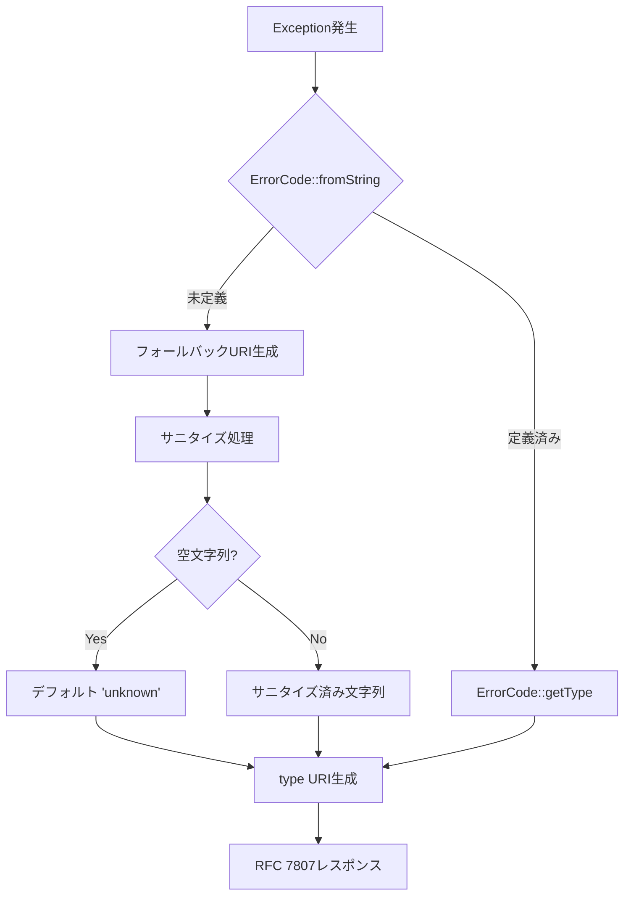
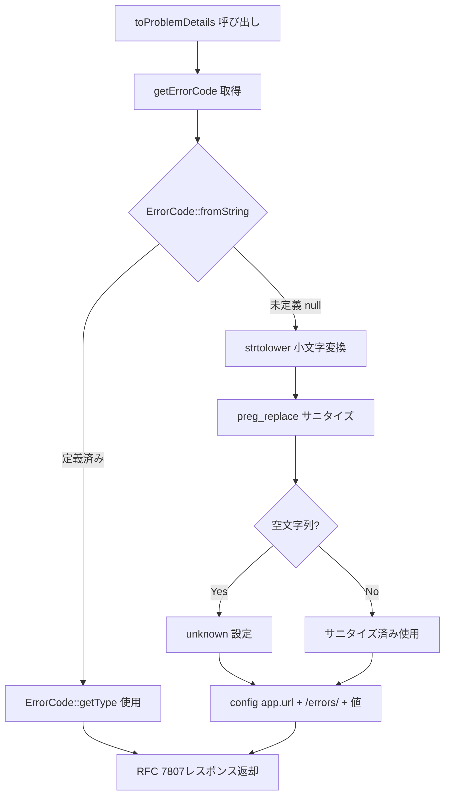
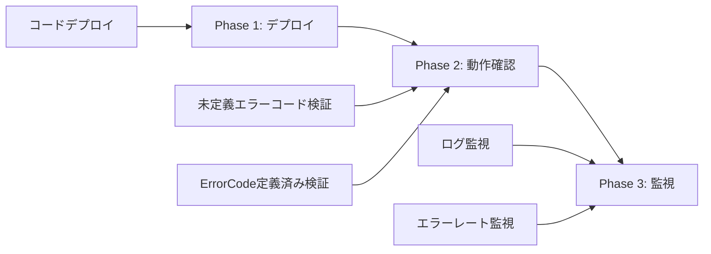

# Technical Design Document

## Overview

本機能は、未定義エラーコード（ErrorCode enumに定義されていないエラーコード）のフォールバックtype URI生成時に、RFC 3986準拠のセキュアなサニタイズ処理を追加します。現在の実装では `strtolower()` のみで任意の文字列をURIに連結しているため、将来的な不正文字列リスクに備えて `[a-z0-9\-]` のみを許可するスラグ化処理を実装します。

**Purpose**: 未定義エラーコードからURIを生成する際のセキュリティリスクを軽減し、RFC 3986準拠の標準的なURI生成を保証する。

**Users**: システム管理者、開発者、QAエンジニアが、RFC 7807準拠のエラーレスポンスを利用する。

**Impact**: `HasProblemDetails` トレイトの `toProblemDetails()` メソッドにおけるフォールバックURI生成ロジックを変更。ErrorCode enum定義済みエラーの動作には一切影響を与えない。

### Goals

- RFC 3986準拠の安全な文字セット `[a-z0-9\-]` のみを許可するサニタイズ処理実装
- 元のエラーコード文字列を `error_code` フィールドで保持し、デバッグ時のトレーサビリティを確保
- ErrorCode enum定義済みエラーの動作に一切影響を与えず、既存機能の互換性を維持
- 包括的なテストカバレッジ（85%以上）による品質保証

### Non-Goals

- ErrorCode enumの拡張や新しいエラーコードの追加
- 既存ErrorCode enum定義済みエラーのtype URI生成ロジックの変更
- フロントエンド側のエラー型定義の変更
- サニタイズ処理のログ記録（必要に応じて将来対応）
- 多言語文字のサポート（英数字とハイフンのみが対象）

## Architecture

### Existing Architecture Analysis

**現在のアーキテクチャ**:
- **DDD/クリーンアーキテクチャ**: 4層構造（Domain/Application/Infrastructure/HTTP）
- **HasProblemDetails トレイト**: RFC 7807 Problem Details形式のレスポンス生成を提供
- **DomainException 基底クラス**: HasProblemDetails トレイトを使用し、全ドメイン例外に統一インターフェースを提供
- **ErrorCode enum**: 定義済みエラーコードに対してgetType()メソッドでtype URIを返す

**既存のドメイン境界**:
- `ddd/Shared/Exceptions/`: 共通例外クラスとトレイト
- `app/Enums/`: アプリケーション層のenum定義

**統合ポイント**:
- `HasProblemDetails::toProblemDetails()`: フォールバックURI生成ロジックの変更点

### High-Level Architecture

本機能は既存の `HasProblemDetails` トレイトの `toProblemDetails()` メソッドにサニタイズ処理を追加する、既存システムへの拡張です。



**Architecture Integration**:
- **既存パターン保持**: HasProblemDetails トレイトを使用する既存の例外クラス（DomainException、ApplicationException、InfrastructureException等）の動作は不変
- **新コンポーネント**: サニタイズロジックのみをtoProblemDetails()メソッド内に追加
- **技術スタック整合**: Laravel標準の文字列処理関数（strtolower、preg_replace）のみを使用
- **ステアリング準拠**: DDD原則、後方互換性、PHPStan Level 8準拠を維持

### Technology Alignment

本機能は既存システムの拡張であり、新しい技術スタックの導入はありません。

**既存技術スタックとの整合**:
- **PHP 8.4**: 既存のPHPバージョンを継続使用
- **Laravel 12**: Laravel標準の文字列処理関数（`strtolower()`, `preg_replace()`）のみを使用
- **DDD/クリーンアーキテクチャ**: HasProblemDetailsトレイトは `ddd/Shared/Exceptions/` 配下に配置され、ドメイン層の共通機能として維持
- **PHPStan Level 8**: 既存の静的解析基準を遵守

**新規依存関係**: なし

**既存パターンからの逸脱**: なし

### Key Design Decisions

#### Decision 1: インラインサニタイズ vs ヘルパーメソッド

**Decision**: toProblemDetails()メソッド内でインラインサニタイズロジックを実装する

**Context**: フォールバックURI生成時のサニタイズ処理をどのように実装するか

**Alternatives**:
- **案1（選択）**: インラインサニタイズ - toProblemDetails()メソッド内で直接preg_replace()を実行
- **案2**: ヘルパーメソッド - private/protectedメソッドとしてsanitizeErrorCode()を定義
- **案3**: 専用クラス - ErrorCodeSanitizerクラスを作成

**Selected Approach**: 案1（インラインサニタイズ）
```php
public function toProblemDetails(): array
{
    $errorCode = $this->getErrorCode();
    $sanitized = preg_replace('/[^a-z0-9\-]/', '', strtolower($errorCode));
    $sanitized = $sanitized !== '' ? $sanitized : 'unknown';

    return [
        'type' => ErrorCode::fromString($errorCode)?->getType()
            ?? config('app.url').'/errors/'.$sanitized,
        // ...
    ];
}
```

**Rationale**:
- **シンプルさ**: 単一メソッド内で完結し、コードの複雑性を最小限に抑える
- **局所性**: サニタイズロジックは toProblemDetails() メソッドでのみ使用されるため、ヘルパーメソッドや専用クラスは過剰設計
- **保守性**: PHPDocコメントで意図を明示することで、将来的な保守性を確保

**Trade-offs**:
- **得るもの**: コードのシンプルさ、局所性、読みやすさ
- **失うもの**: サニタイズロジックの再利用性（ただし現時点で再利用の必要性なし）

#### Decision 2: 空文字列のデフォルト値 `unknown`

**Decision**: サニタイズ処理により全文字削除され空文字列になった場合、デフォルト値 `unknown` を使用

**Context**: 特殊文字のみのエラーコード（例: `@#$%`）がサニタイズされて空文字列になった場合の処理

**Alternatives**:
- **案1（選択）**: `unknown` をデフォルト値として使用
- **案2**: エラーをthrowして処理を中断
- **案3**: 元のエラーコード文字列をbase64エンコードして使用

**Selected Approach**: 案1（`unknown` をデフォルト値）
```php
$sanitized = $sanitized !== '' ? $sanitized : 'unknown';
```

**Rationale**:
- **ロバスト性**: エラーハンドリング処理中にさらにエラーをthrowすることは避けるべき
- **一貫性**: RFC 7807レスポンスは必ず返される必要があり、エラー処理の中断は不適切
- **トレーサビリティ**: `error_code` フィールドに元のエラーコード文字列が保持されるため、デバッグ時の追跡は可能

**Trade-offs**:
- **得るもの**: エラーハンドリングのロバスト性、RFC 7807レスポンスの確実な返却
- **失うもの**: 空文字列の場合の詳細情報（ただし `error_code` フィールドで補完可能）

## System Flows

### Fallback URI Generation Flow

以下のフローチャートは、フォールバックURI生成時のサニタイズ処理を示します。



**フロー詳細**:

1. **getErrorCode()取得**: 例外クラスからエラーコード文字列を取得
2. **ErrorCode::fromString()試行**:
   - 定義済み → ErrorCode::getType()を使用（サニタイズ不要）
   - 未定義（null） → フォールバックURI生成へ
3. **小文字変換**: `strtolower($errorCode)` で全て小文字に変換
4. **サニタイズ処理**: `preg_replace('/[^a-z0-9\-]/', '', $lowercased)` で `[a-z0-9\-]` 以外を削除
5. **空文字列チェック**:
   - 空文字列 → デフォルト値 `unknown` を設定
   - 非空文字列 → サニタイズ済み文字列を使用
6. **type URI生成**: `config('app.url').'/errors/'.$sanitized`
7. **RFC 7807レスポンス返却**: `type`, `title`, `status`, `detail`, `error_code`, `trace_id`, `instance`, `timestamp` を含む配列

## Requirements Traceability

本機能は比較的シンプルなため、要件とコンポーネントの対応関係を簡潔に示します。

| Requirement | 要件概要 | 実現コンポーネント | 実装詳細 |
|-------------|----------|-------------------|---------|
| 1.1-1.5 | フォールバックURI生成時のサニタイズ処理 | HasProblemDetails::toProblemDetails() | 正規表現 `/[^a-z0-9\-]/` によるサニタイズ、空文字列のデフォルト値 `unknown` |
| 2.1-2.3 | 元のエラーコード保持とトレーサビリティ | HasProblemDetails::toProblemDetails() | `error_code` フィールドに `$this->getErrorCode()` の戻り値をそのまま保持 |
| 3.1-3.3 | RFC 3986準拠とURI安全性 | HasProblemDetails::toProblemDetails() | RFC 3986のunreserved文字セットサブセット `[a-z0-9\-]` のみを許可 |
| 4.1-4.4 | 既存動作との互換性と影響範囲の最小化 | HasProblemDetails::toProblemDetails() | ErrorCode::fromString()がnullの場合のみサニタイズを適用 |
| 5.1-5.4 | テスト戦略とカバレッジ | HasProblemDetailsTest (Unit/Feature/Arch) | 6つのサニタイズパターン検証、85%以上のカバレッジ |
| 6.1-6.4 | ドキュメントとコードコメント | HasProblemDetails トレイト | PHPDocコメント、Codexレビュー引用、プロジェクトドキュメント更新 |

## Components and Interfaces

### Domain層 / 共通例外機能

#### HasProblemDetails トレイト

**Responsibility & Boundaries**
- **Primary Responsibility**: RFC 7807 Problem Details形式のエラーレスポンス生成（フォールバックURI生成時のサニタイズ処理を含む）
- **Domain Boundary**: `ddd/Shared/Exceptions/` - ドメイン層共通例外機能
- **Data Ownership**: エラーコード文字列、type URI、RFC 7807レスポンスフィールド
- **Transaction Boundary**: なし（純粋な変換処理）

**Dependencies**
- **Inbound**: DomainException、ApplicationException、InfrastructureException等の基底例外クラス
- **Outbound**:
  - `App\Enums\ErrorCode`: エラーコード定義とtype URI取得
  - Laravel `config()` ヘルパー: `app.url` 設定取得
  - Laravel `request()` ヘルパー: リクエストコンテキスト取得
  - Laravel `now()` ヘルパー: タイムスタンプ生成
- **External**: なし

**Contract Definition**

**Trait Interface**:
```php
trait HasProblemDetails
{
    /**
     * Get the HTTP status code for this exception.
     *
     * @return int HTTPステータスコード
     */
    abstract public function getStatusCode(): int;

    /**
     * Get a machine-readable error code.
     *
     * @return string DOMAIN-SUBDOMAIN-CODE形式
     */
    abstract public function getErrorCode(): string;

    /**
     * Get a human-readable error title.
     *
     * @return string エラータイトル
     */
    abstract protected function getTitle(): string;

    /**
     * Get the exception message.
     *
     * @return string 例外メッセージ
     */
    abstract public function getMessage(): string;

    /**
     * Convert the exception to RFC 7807 Problem Details format.
     *
     * セキュリティ強化: フォールバックURI生成時に RFC 3986 準拠のサニタイズ処理を実施
     * 参照: PR #141 Codexレビュー指摘
     *
     * @return array<string, mixed> RFC 7807形式の配列
     */
    public function toProblemDetails(): array;
}
```

**Preconditions**:
- トレイトを使用するクラスは、抽象メソッド（getStatusCode, getErrorCode, getTitle, getMessage）を実装している
- `config('app.url')` が適切に設定されている

**Postconditions**:
- RFC 7807準拠の配列形式レスポンスが返される
- フォールバックURI生成時、`[a-z0-9\-]` のみを含むtype URIが生成される
- `error_code` フィールドにサニタイズ前の元のエラーコード文字列が保持される

**Invariants**:
- ErrorCode enum定義済みエラーの場合、常に `ErrorCode::getType()` が使用される（サニタイズ処理は実行されない）
- `type` フィールドは必ず有効なURI文字列である
- `error_code` フィールドは必ず元のエラーコード文字列である

**State Management**: なし（ステートレスな変換処理）

**Integration Strategy**:
- **Modification Approach**: 既存の `toProblemDetails()` メソッドを拡張（フォールバックURI生成部分のみ変更）
- **Backward Compatibility**: ErrorCode enum定義済みエラーの動作は完全に維持
- **Migration Path**: デプロイ後、未定義エラーコードのフォールバックURIのみが新しいサニタイズロジックを使用

## Data Models

本機能はデータモデルの変更を伴いません。既存のRFC 7807レスポンス形式を維持します。

### RFC 7807 Problem Details レスポンス形式

**既存のレスポンス形式**（変更なし）:
```json
{
  "type": "https://api.example.com/errors/custom-error-001",
  "title": "カスタムエラー",
  "status": 500,
  "detail": "詳細なエラーメッセージ",
  "error_code": "CUSTOM_ERROR_001",
  "trace_id": "550e8400-e29b-41d4-a716-446655440000",
  "instance": "/api/v1/resource",
  "timestamp": "2025-11-27T18:00:00.000000Z"
}
```

**フィールド定義**:
- `type` (string): RFC 7807 type URI（サニタイズ処理の対象）
- `title` (string): 人間が読める短いエラータイトル
- `status` (int): HTTPステータスコード
- `detail` (string): 詳細なエラーメッセージ
- `error_code` (string): マシンリーダブルなエラーコード（**サニタイズ前の元の文字列を保持**）
- `trace_id` (string): リクエストID（トレーサビリティ用）
- `instance` (string): エラーが発生したURI
- `timestamp` (string): エラー発生時刻（ISO 8601形式）

**サニタイズ処理の影響**:
- `type` フィールド: フォールバックURI生成時にサニタイズ済み文字列が使用される
  - 例: `CUSTOM_ERROR_001` → `https://api.example.com/errors/customerror001`
- `error_code` フィールド: サニタイズ前の元のエラーコード文字列が保持される
  - 例: `CUSTOM_ERROR_001` → `"error_code": "CUSTOM_ERROR_001"` （変更なし）

## Error Handling

### Error Strategy

本機能はエラーハンドリング処理の一部であるため、サニタイズ処理自体はエラーをthrowせず、常にRFC 7807レスポンスを返すようにします。

### Error Categories and Responses

**サニタイズ処理のエラーハンドリング**:

1. **空文字列（全文字削除）**:
   - **発生条件**: サニタイズ処理により全ての文字が削除され、空文字列になった場合（例: `@#$%`）
   - **対応**: デフォルト値 `unknown` を使用
   - **理由**: エラーハンドリング処理中にエラーをthrowすることを避け、RFC 7807レスポンスの確実な返却を保証

2. **ErrorCode::fromString()がnullを返す**:
   - **発生条件**: 未定義エラーコード（ErrorCode enumに存在しない）
   - **対応**: フォールバックURI生成とサニタイズ処理を実行
   - **理由**: 開発者管理の定数以外のエラーコードに対してもロバストに対応

**既存のエラーハンドリング（変更なし）**:
- Laravel Exception Handlerによる統一エラーレスポンス
- 401/403/422/500等のHTTPステータスコードに応じた適切なレスポンス

### Monitoring

**エラーハンドリングの監視**:
- Laravel標準のログ機構を使用（`storage/logs/laravel.log`）
- `trace_id` フィールドによるリクエストトレーシング
- `error_code` フィールドによるエラーコードの追跡

**サニタイズ処理の監視**（現時点では実装しない、将来的な拡張ポイント）:
- サニタイズ処理が実行された回数
- デフォルト値 `unknown` が使用された回数
- サニタイズ前後のエラーコード文字列の比較

## Testing Strategy

### Unit Tests

**HasProblemDetailsトレイトのユニットテスト** (`tests/Unit/Shared/Exceptions/HasProblemDetailsTest.php`):

1. **正常系サニタイズ**: `CUSTOM_ERROR_001` → `customerror001`
   - フォールバックURI: `https://api.example.com/errors/customerror001`
   - `error_code` フィールド: `CUSTOM_ERROR_001` （サニタイズ前）

2. **アンダースコア削除**: `CUSTOM_ERROR` → `customerror`
   - フォールバックURI: `https://api.example.com/errors/customerror`

3. **特殊文字削除**: `CUSTOM@ERROR!` → `customerror`
   - フォールバックURI: `https://api.example.com/errors/customerror`

4. **空白削除**: `CUSTOM ERROR` → `customerror`
   - フォールバックURI: `https://api.example.com/errors/customerror`

5. **全削除（空文字列）**: `@#$%` → `unknown` （デフォルト値）
   - フォールバックURI: `https://api.example.com/errors/unknown`

6. **数字・ハイフン保持**: `ERROR-123-TEST` → `error-123-test`
   - フォールバックURI: `https://api.example.com/errors/error-123-test`

7. **ErrorCode enum定義済みエラー**: サニタイズ処理が実行されず、`ErrorCode::getType()` が使用される
   - 例: `AUTH-LOGIN-001` → `https://example.com/errors/auth/invalid-credentials`

### Integration Tests

**Feature Tests** (`tests/Feature/Shared/Exceptions/FallbackUriTest.php`):

1. **未定義エラーコードのHTTPレスポンス検証**:
   - 未定義エラーコードを返すHTTPリクエストを送信
   - RFC 7807準拠のレスポンスが返されることを検証
   - `type` フィールドがサニタイズ済みURIであることを検証
   - `error_code` フィールドがサニタイズ前の元のエラーコードであることを検証

2. **ErrorCode enum定義済みエラーのHTTPレスポンス検証**:
   - 定義済みエラーコードを返すHTTPリクエストを送信
   - `type` フィールドが `ErrorCode::getType()` の戻り値と一致することを検証

3. **空文字列デフォルト値のHTTPレスポンス検証**:
   - 特殊文字のみのエラーコードを返すHTTPリクエストを送信
   - `type` フィールドが `https://api.example.com/errors/unknown` であることを検証

### Architecture Tests

**Architecture Tests** (`tests/Arch/ErrorHandlingTest.php`):

1. **HasProblemDetailsトレイト使用検証**:
   - `ddd/**/Exceptions/` 配下の全例外クラスが `HasProblemDetails` トレイトを使用していることを検証

2. **toProblemDetails()メソッド実装検証**:
   - HasProblemDetailsトレイトを使用する全クラスが `toProblemDetails()` メソッドを正しく実装していることを検証

### Performance Tests

**パフォーマンステスト** (必要に応じて):

1. **サニタイズ処理のベンチマーク**:
   - 正規表現 `preg_replace('/[^a-z0-9\-]/', '', $lowercased)` の実行時間計測
   - 目標: 1ms未満

2. **ErrorCode::fromString()のパフォーマンス**:
   - enum検索のパフォーマンスに影響がないことを確認

### Test Coverage Target

- **全体カバレッジ**: 85%以上
- **HasProblemDetailsトレイト**: 100%（全コードパスをカバー）
- **サニタイズロジック**: 100%（全エッジケースを網羅）

## Security Considerations

### Threat Modeling

**脅威**: 不正なエラーコード文字列からURIを生成するリスク

**攻撃シナリオ**:
- 攻撃者が特殊文字を含むエラーコード文字列を注入し、不正なURIを生成させる
- URI内に不正なスクリプトやHTMLタグを埋め込む試み

**対策**:
- RFC 3986準拠の安全な文字セット `[a-z0-9\-]` のみを許可するサニタイズ処理
- 空文字列の場合のデフォルト値 `unknown` による確実なURI生成

### Security Controls

**Input Validation**:
- エラーコード文字列は開発者管理の定数のみを想定
- サニタイズ処理により、想定外の文字列に対してもロバストに対応

**Output Encoding**:
- サニタイズ済み文字列は `[a-z0-9\-]` のみを含むため、URIとして安全

**Defense in Depth**:
- ErrorCode enum定義済みエラーはサニタイズ処理を経由しない（影響範囲の最小化）
- `error_code` フィールドに元のエラーコード文字列を保持し、トレーサビリティを確保

### Compliance Requirements

**RFC 3986準拠**:
- フォールバックtype URIはRFC 3986のunreserved文字セット（ALPHA / DIGIT / "-" / "." / "_" / "~"）のサブセット `[a-z0-9\-]` を使用

**RFC 7807準拠**:
- Problem Details形式のエラーレスポンスを維持
- `type` フィールドは有効なURI文字列である

## Migration Strategy

本機能はデプロイ後、即座に有効化されます。段階的な移行は不要です。

### Migration Phases



**Phase 1: デプロイ** (即時):
- HasProblemDetailsトレイトの変更をデプロイ
- 既存のErrorCode enum定義済みエラーの動作は不変

**Phase 2: 動作確認** (デプロイ後1-2日):
- 未定義エラーコードのフォールバックURI生成を確認
- ErrorCode enum定義済みエラーのtype URI生成が変更されていないことを確認

**Phase 3: 監視** (継続的):
- RFC 7807レスポンスのログ監視
- エラーレート、レスポンスタイムの監視

**Rollback Triggers**:
- ErrorCode enum定義済みエラーのtype URIが変更された場合（即座にロールバック）
- RFC 7807レスポンスが正しく生成されない場合
- サニタイズ処理により予期しないエラーが発生した場合

**Validation Checkpoints**:
- デプロイ後、Feature Testsを実行してRFC 7807レスポンスを検証
- ログでフォールバックURI生成のサニタイズ処理を確認

### Rollback Plan

**ロールバック手順**:
1. HasProblemDetailsトレイトのコミットを `git revert` で戻す
2. 再デプロイして元の実装に戻す
3. ログで既存のフォールバックURI生成（`strtolower()` のみ）を確認

**データ影響**:
- データベースへの影響なし（純粋なビジネスロジック変更）
- ロールバック後、既存のフォールバックURI生成に戻る
