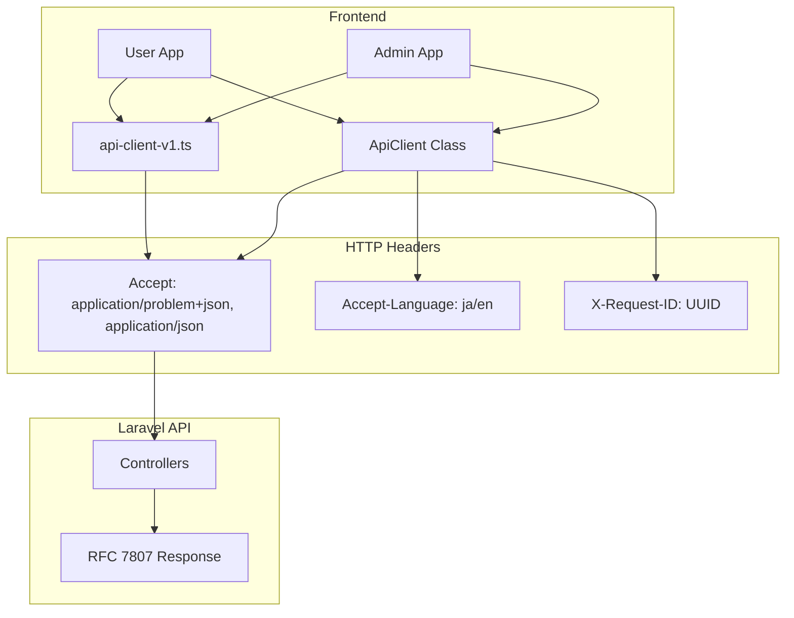

# Technical Design Document

## Overview

**Purpose**: 本機能は、フロントエンドAPIクライアントのAcceptヘッダーにRFC 7807準拠の`application/problem+json` MIMEタイプを追加する。これにより、クライアントがRFC 7807形式のエラーレスポンスを明示的にサポートすることを宣言し、HTTP Content Negotiationのベストプラクティスに準拠する。

**Users**: フロントエンド開発者がAPIクライアントを使用してLaravel APIと通信する際、RFC 7807準拠のエラーレスポンスを適切に受信・処理できるようになる。

**Impact**: 既存のAPIクライアント実装（`frontend/lib/api-client.ts`、`frontend/lib/api-client-v1.ts`）のAcceptヘッダー設定を変更する。後方互換性は100%維持される。

### Goals
- Acceptヘッダーに`application/problem+json, application/json`を設定し、RFC 7807準拠を明示
- HTTP Content Negotiationのベストプラクティスに準拠
- 既存機能への影響ゼロで段階的改善を実現
- テストアサーションの期待値を更新し、変更の正確性を保証

### Non-Goals
- バックエンドLaravel APIの変更（既にRFC 7807対応済み）
- Next.js App Router API routesの変更
- E2Eテストの変更（APIクライアント経由で正常動作）
- q-factor（品質係数）の明示的設定（デフォルト値q=1.0を使用）

## Architecture

### 既存アーキテクチャ分析

本機能は既存のフロントエンドAPIクライアント層に対するマイナーな拡張である。

**現在のアーキテクチャパターン**:
- 共通モジュールベースのAPIクライアント（`frontend/lib/`）
- クラスベース設計（`ApiClient`クラス）と関数ベース設計（`api-client-v1.ts`）の共存
- RFC 7807レスポンス解析は既に`ApiError`クラスで実装済み

**変更対象コンポーネント**:
- `frontend/lib/api-client.ts`: 共通APIクライアント（L180）
- `frontend/lib/api-client-v1.ts`: V1 API専用クライアント（L44）

### High-Level Architecture



**Architecture Integration**:
- 既存パターン維持: Acceptヘッダー設定ロジックは既存の`buildHeaders()`メソッドおよび`headers`オブジェクト定義内に統合
- 新規コンポーネント不要: 変更は既存ファイル内の文字列置換のみ
- 技術スタック整合: 既存のTypeScript/fetch APIパターンを維持
- Steering準拠: RFC 7807対応は既存のエラーハンドリングパターンと整合

### Technology Alignment

本機能は既存の技術スタックに完全に準拠する：

| 層 | 技術 | 整合性 |
|---|---|---|
| フロントエンド | TypeScript + fetch API | 変更なし |
| APIクライアント | `ApiClient`クラス + 関数ベースAPI | 変更最小限 |
| エラーハンドリング | `ApiError` + `NetworkError` | 変更なし |
| テスト | Jest 29 + Testing Library | アサーション更新のみ |

### Key Design Decisions

**Decision 1: MIMEタイプの配置順序**
- **Decision**: `application/problem+json`を`application/json`より前に配置
- **Context**: HTTP Content Negotiationでは、Acceptヘッダー内のMIMEタイプは優先度順に配置される
- **Alternatives**:
  1. `application/json, application/problem+json`（逆順）
  2. `application/json`のみ（現状維持）
  3. q-factor明示（例: `application/problem+json;q=0.9, application/json;q=0.8`）
- **Selected Approach**: `application/problem+json, application/json`の順序で、q-factorは省略
- **Rationale**: RFC 7231に基づき、先頭のMIMEタイプが最優先として解釈される。q-factorを省略することでシンプルさを維持しつつ、両MIMEタイプにデフォルト値q=1.0が適用される
- **Trade-offs**: 明示的なq-factor指定よりシンプルだが、将来的に複雑なContent Negotiationが必要になった場合は拡張が必要

**Decision 2: カスタムヘッダーの優先**
- **Decision**: 呼び出し元がカスタムAcceptヘッダーを指定した場合は上書きしない
- **Context**: 既存の`buildHeaders()`メソッドは`headers.has('Accept')`チェックを行っている
- **Alternatives**:
  1. 常にデフォルト値で上書き
  2. マージ戦略（カスタム + デフォルト）
- **Selected Approach**: 既存の「カスタムヘッダー優先」パターンを維持
- **Rationale**: 既存の動作を破壊せず、特殊なユースケース（例: XMLレスポンス要求）に対応可能
- **Trade-offs**: 呼び出し元の責任が増すが、柔軟性が維持される

## Components and Interfaces

### HTTP Layer

#### ApiClient (frontend/lib/api-client.ts)

**Responsibility & Boundaries**
- **Primary Responsibility**: 統一されたHTTPリクエスト送信とレスポンス処理
- **Domain Boundary**: フロントエンド HTTP通信層
- **Data Ownership**: リクエストヘッダー、レスポンスデータ
- **Transaction Boundary**: 単一HTTPリクエスト/レスポンスサイクル

**Dependencies**
- **Inbound**: Admin App、User App、各種コンポーネント
- **Outbound**: fetch API（ブラウザ/Node.js）
- **External**: Laravel API（RFC 7807準拠）

**Contract Definition**

変更前:
```typescript
// L176-181: buildHeaders()メソッド内
if (!headers.has('Accept')) {
  headers.set('Accept', 'application/json');
}
```

変更後:
```typescript
// L176-183: buildHeaders()メソッド内
// RFC 7807準拠: application/problem+jsonを優先的にサポート
// Content Negotiation: problem+jsonを先頭に配置し、後方互換性のためapplication/jsonも含める
if (!headers.has('Accept')) {
  headers.set('Accept', 'application/problem+json, application/json');
}
```

**Integration Strategy**
- **Modification Approach**: 既存コードの文字列置換 + コメント追加
- **Backward Compatibility**: 100%維持（`application/json`を含むため）
- **Migration Path**: 即時適用、段階的移行不要

#### api-client-v1.ts (frontend/lib/api-client-v1.ts)

**Responsibility & Boundaries**
- **Primary Responsibility**: Laravel API V1エンドポイント専用HTTPクライアント
- **Domain Boundary**: V1 API通信層
- **Data Ownership**: V1 API型定義に準拠したリクエスト/レスポンス

**Dependencies**
- **Inbound**: Admin App、User App（認証、トークン管理、CSPレポート等）
- **Outbound**: fetch API
- **External**: Laravel API V1エンドポイント

**Contract Definition**

変更前:
```typescript
// L42-46: fetchV1()関数内
const headers: Record<string, string> = {
  'Content-Type': 'application/json',
  Accept: 'application/json',
  ...options?.headers,
};
```

変更後:
```typescript
// L42-48: fetchV1()関数内
// RFC 7807準拠: application/problem+jsonを優先的にサポート
// Content Negotiation: problem+jsonを先頭に配置し、後方互換性のためapplication/jsonも含める
const headers: Record<string, string> = {
  'Content-Type': 'application/json',
  Accept: 'application/problem+json, application/json',
  ...options?.headers,
};
```

**Integration Strategy**
- **Modification Approach**: headers定義内の文字列置換 + コメント追加
- **Backward Compatibility**: 100%維持
- **Migration Path**: 即時適用

## Data Models

本機能はデータモデルの変更を伴わない。HTTPヘッダーの文字列値のみを変更する。

### HTTP Header Value

**変更前**:
```
Accept: application/json
```

**変更後**:
```
Accept: application/problem+json, application/json
```

## Error Handling

### Error Strategy

本機能はエラーハンドリングロジックの変更を伴わない。既存の`ApiError`クラスは既にRFC 7807形式のレスポンスを解析可能である。

**既存エラーフロー（変更なし）**:
1. HTTPレスポンスが`!response.ok`の場合
2. `handleErrorResponse()`がJSON解析を試行
3. `RFC7807Problem`型として解析し、`ApiError`インスタンスを生成
4. `ApiError`がthrowされる

**Acceptヘッダー変更の影響**:
- Laravel APIは`application/problem+json`または`application/json`のどちらでも同じRFC 7807形式でレスポンスを返す
- エラーレスポンスの形式に変更なし

## Testing Strategy

### Unit Tests

| テスト対象 | 検証内容 | ファイル |
|---|---|---|
| ApiClient.buildHeaders() | Acceptヘッダーが`application/problem+json, application/json`に設定される | api-client.test.ts |
| fetchV1() | headersオブジェクトのAcceptが期待値と一致する | api-client-v1.test.ts |
| カスタムヘッダー優先 | カスタムAcceptヘッダーが上書きされない | api-client.test.ts |

**変更対象テストケース**:

1. `api-client.test.ts` L76-91:
```typescript
// 変更前
expect(headers.get('Accept')).toBe('application/json');

// 変更後
expect(headers.get('Accept')).toBe('application/problem+json, application/json');
```

2. `api-client-v1.test.ts`（オプション: Acceptヘッダー検証テスト追加）:
```typescript
it('should include RFC 7807 Accept header', async () => {
  // ...
  expect(global.fetch).toHaveBeenCalledWith(
    expect.any(String),
    expect.objectContaining({
      headers: expect.objectContaining({
        Accept: 'application/problem+json, application/json',
      }),
    }),
  );
});
```

### Integration Tests

既存のフロントエンドテストスイートでAPI統合が検証される。追加のIntegration Testsは不要。

### E2E Tests

既存のPlaywright E2Eテストでエンドツーエンドの動作が検証される。Acceptヘッダーの変更は後方互換性があるため、E2Eテストの変更は不要。

## Non-Functional Requirements

### NFR-1: パフォーマンス

Acceptヘッダーの変更によるHTTPリクエストのオーバーヘッドは無視できるレベル：
- 追加データ量: 約25バイト（`application/problem+json, `の追加）
- ネットワーク影響: なし（HTTPヘッダーサイズ増加は微小）
- 処理時間影響: なし

### NFR-2: セキュリティ

Acceptヘッダーの変更はセキュリティに影響しない：
- 情報漏洩リスク: なし（MIMEタイプ指定のみ）
- 攻撃ベクトル: なし
- 認証/認可への影響: なし

### NFR-3: 保守性

すべてのAPIクライアントファイルで一貫したAcceptヘッダー設定パターンを使用：
- 単一ソース原則: 共通モジュール（`frontend/lib/`）のみ変更
- コードコメント: RFC 7807準拠と後方互換性について明示
- テスト可能性: 既存テストインフラを活用

## Requirements Traceability

| 要件 | 要件概要 | コンポーネント | インターフェース |
|---|---|---|---|
| 1.1 | デフォルトAcceptヘッダー設定 | ApiClient, api-client-v1 | buildHeaders(), headers定義 |
| 1.2 | MIMEタイプ配置順序 | ApiClient, api-client-v1 | Acceptヘッダー値 |
| 1.3 | q-factor省略 | ApiClient, api-client-v1 | Acceptヘッダー値 |
| 1.4 | カスタムヘッダー優先 | ApiClient | buildHeaders() |
| 2.1-2.4 | 後方互換性維持 | 全コンポーネント | 変更なし |
| 3.1-3.4 | 対象ファイル網羅的更新 | api-client.ts, api-client-v1.ts | headers定義 |
| 4.1-4.4 | テスト更新 | api-client.test.ts | expect()アサーション |
| 5.1-5.2 | ドキュメント更新 | 全対象ファイル | JSDocコメント |
