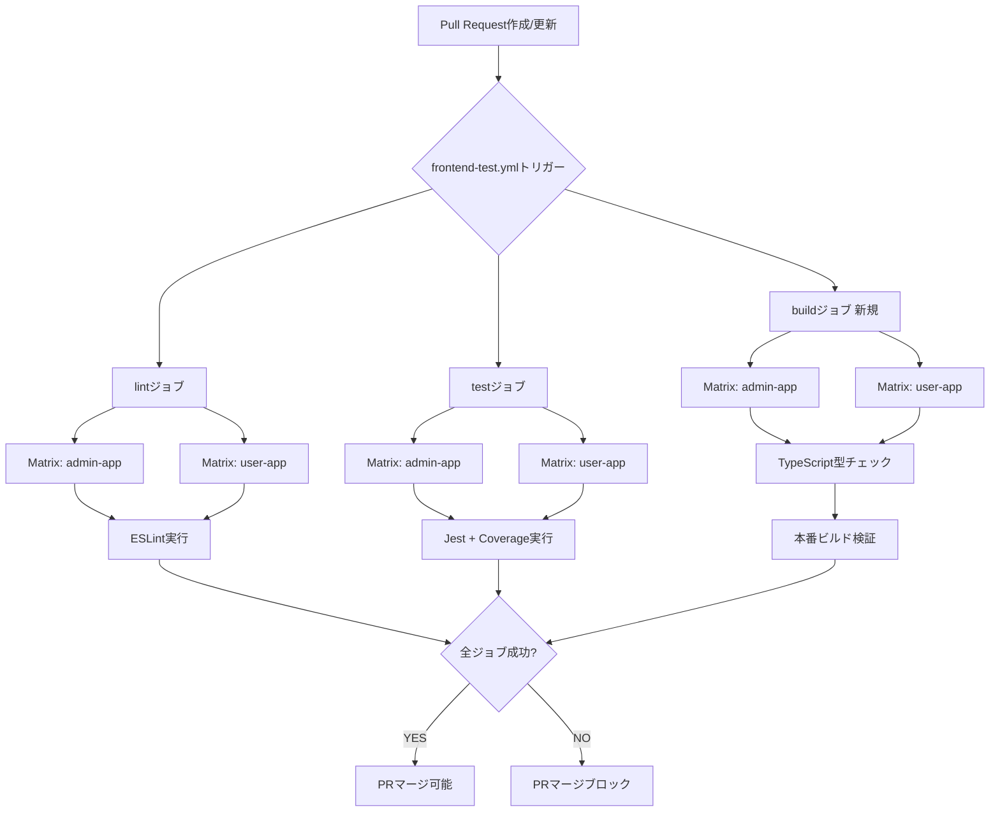
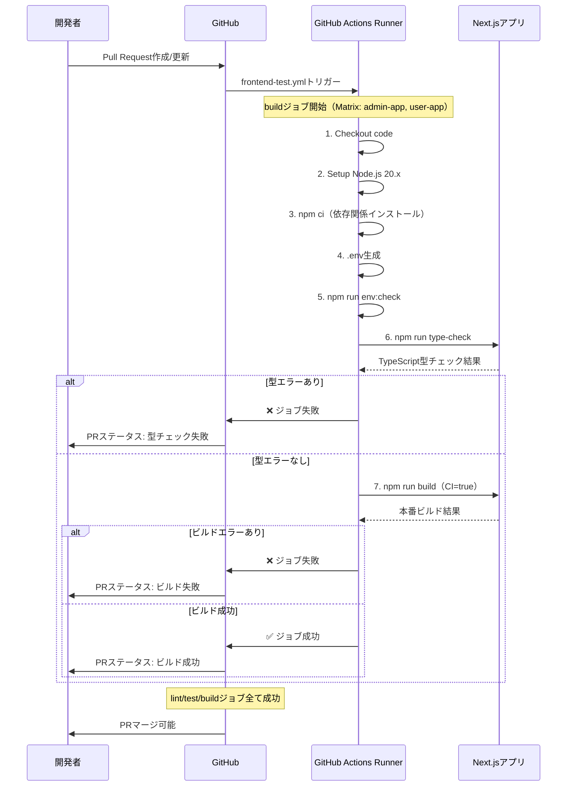
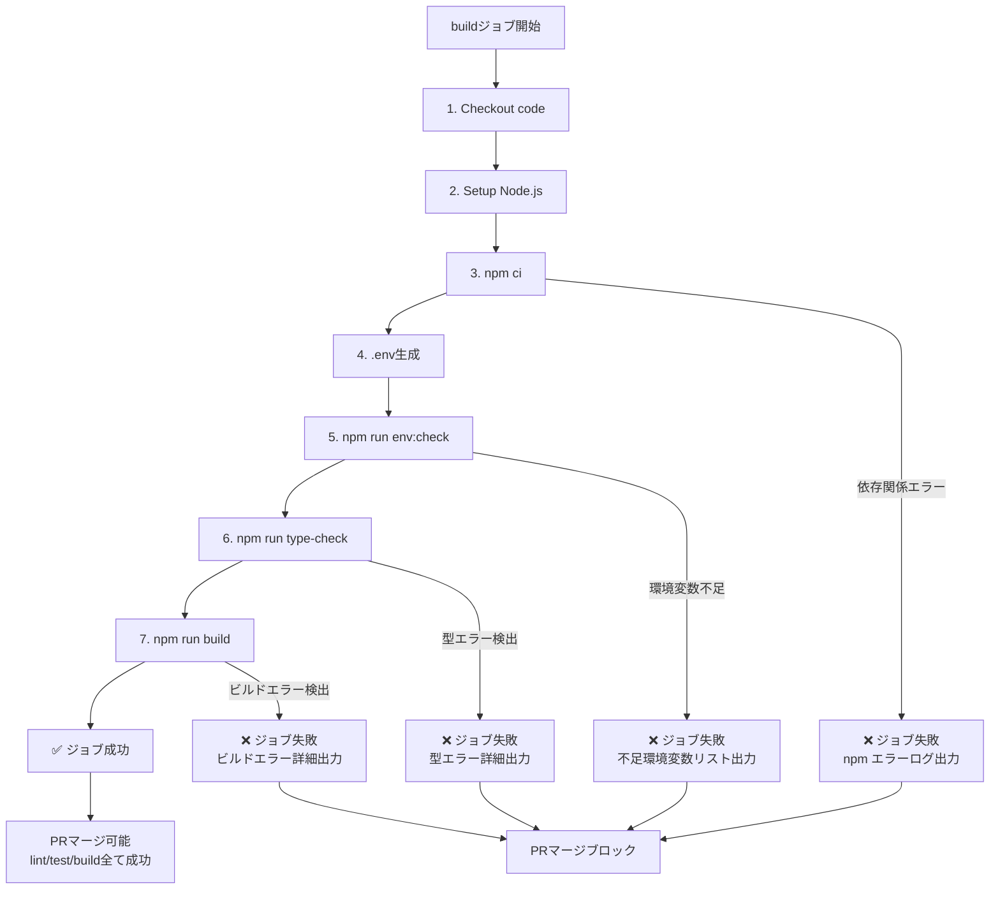
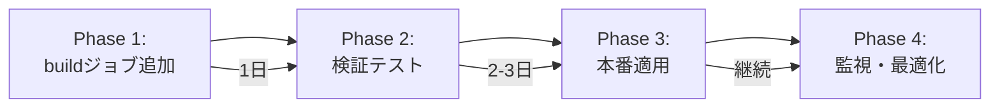

# 技術設計書

## 概要

フロントエンドCI/CDパイプライン（`.github/workflows/frontend-test.yml`）にTypeScript型チェックと本番ビルド検証を追加し、PR時点でビルドエラーを早期検出する。Issue #124（Admin App本番ビルド失敗）で発覚したCI/CDカバレッジギャップを解消し、本番環境デプロイ前の品質保証を強化する。

既存のlint/testジョブと並列実行する新しいbuildジョブを追加することで、CI/CD全体の実行時間への影響を最小化しつつ、包括的な品質ゲートを実現する。

**目的**: 本機能は、TypeScript型エラーとNext.jsビルドエラーをPR作成時点で自動検知することにより、Issue #124のようなビルドエラーが本番デプロイ直前に発見される事態を防止する。

**対象ユーザー**: フロントエンドエンジニア、DevOpsエンジニア、レビュアーは、PRマージ前にビルド成功が保証されるため、安心してコードレビューとマージを実行できる。

**影響範囲**: `.github/workflows/frontend-test.yml`に新しいbuildジョブを追加。既存のlint/testジョブには変更なし。Admin AppとUser Appの両方が対象。

### ゴール

- **TypeScript型チェック統合**: PR時点で型エラーを自動検知し、PRマージをブロック
- **本番ビルド検証統合**: Next.js本番ビルドの成功を自動検証し、ビルドエラーを早期検出
- **並列実行最適化**: lint/test/buildジョブを並列実行し、CI/CD全体の実行時間を最小化
- **既存ワークフロー統合**: 既存のlint/testジョブのステップ構成を再利用し、保守性を向上

### 非ゴール

- バックエンド（Laravel API）のビルド検証は対象外
- ビルド成果物（`.next/`ディレクトリ）のアーティファクトアップロードは将来の拡張として除外
- 複数Node.jsバージョンのMatrix戦略は将来の拡張として除外（現在は20.x固定）
- E2Eテストは別ワークフロー（`e2e-tests.yml`）で実行されるため対象外

---

## アーキテクチャ

### 既存アーキテクチャ分析

**現在のfrontend-test.yml構成**:
- **lintジョブ**: ESLint実行（Matrix: admin-app/user-app）
- **testジョブ**: Jest + Testing Library実行（Matrix: admin-app/user-app、カバレッジ収集）
- **並列実行**: lint/testジョブは独立して並列実行
- **トリガー**: push（main/develop）/pull_request、paths設定により関連ファイル変更時のみ実行
- **Concurrency**: PR内の連続コミットで古い実行を自動キャンセル

**既存パターン維持**:
- Matrix戦略（`matrix.app: [admin-app, user-app]`、`matrix.node-version: [20.x]`）を踏襲
- ステップ構成（checkout → setup-node → npm ci → .env生成 → env:check → メイン処理）を再利用
- `fail-fast: false`により、一つのアプリの失敗が他のアプリの検証を中断しない
- 既存のpaths設定に影響を与えず、buildジョブは既存トリガー条件で実行

**統合アプローチ**:
- 新しいbuildジョブをlint/testジョブと並列実行（独立したGitHub Actionsジョブ）
- 既存のlint/testジョブには変更なし（後方互換性保証）
- PRステータスチェックは3つのジョブ（lint、test、build）全てが成功した場合のみ緑色表示

### ハイレベルアーキテクチャ



**アーキテクチャ統合**:
- **既存パターン維持**: Matrix戦略、ステップ構成、fail-fast設定をlint/testジョブから継承
- **新規コンポーネント**: buildジョブ（TypeScript型チェック + 本番ビルド検証）
- **技術スタック整合性**: Node.js 20.x、npm ci、GitHub Actions公式アクション（@v4）を既存ジョブと統一
- **Steering準拠**: `.github/workflows/frontend-test.yml`の既存構造を尊重し、最小限の変更で品質ゲートを強化

---

## 技術スタック整合性

本機能は既存のfrontend-test.ymlワークフローへの**拡張**であり、新しい技術スタックの導入は行わない。既存のlint/testジョブと同じ技術基盤を使用する。

**既存技術スタックとの整合性**:
- **CI/CD基盤**: GitHub Actions（既存ワークフロー統合）
- **ランタイム**: Node.js 20.x（Matrix戦略で既に使用中）
- **パッケージマネージャー**: npm ci（既存ジョブと同じ厳密インストール）
- **ビルドツール**: Next.js 15.5.4（既存アプリケーション構成）
- **型チェックツール**: TypeScript Compiler 5.x（既存アプリケーション構成、`npm run type-check`スクリプト利用）

**新規導入される要素**:
- **buildジョブ**: 新しいGitHub Actionsジョブ（lint/testと並列実行）
- **TypeScript型チェックステップ**: 既存の`npm run type-check`スクリプトをCI/CDから実行
- **本番ビルドステップ**: 既存の`npm run build`スクリプトをCI/CDから実行

**既存ワークフローとの統合理由**:
- lint/testジョブと同じMatrix戦略を使用することで、admin-app/user-app両方を自動的にカバー
- 既存のステップ構成（checkout、setup-node、npm ci、.env生成、env:check）を再利用し、保守性を向上
- 並列実行により、CI/CD全体の実行時間への影響を最小化

---

## 主要設計決定

### 決定1: buildジョブを独立したGitHub Actionsジョブとして実装

**決定**: buildジョブをlint/testジョブと並列実行する独立したジョブとして実装する。

**コンテキスト**: 要件1（TypeScript型チェック統合）と要件2（本番ビルド検証統合）を満たすため、新しい検証ステップをCI/CDパイプラインに追加する必要がある。

**代替案**:
1. **既存testジョブに型チェック/ビルドステップを追加**: testジョブの実行時間が増加し、並列実行のメリットが損なわれる
2. **独立したtype-checkジョブとbuildジョブを分離**: 2つのジョブを管理する必要があり、ステップ構成の重複が増加
3. **選択されたアプローチ: 統合buildジョブ**: TypeScript型チェックと本番ビルド検証を1つのジョブに統合し、lint/testと並列実行

**選択されたアプローチ**: 統合buildジョブ

**根拠**:
- lint/testジョブと並列実行することで、CI/CD全体の実行時間への影響を最小化（並列実行により約50%の時間短縮）
- TypeScript型チェックと本番ビルド検証を順次実行することで、型エラーがある場合は高コストなビルドステップをスキップ
- 既存のlint/testジョブと同じMatrix戦略・ステップ構成を再利用し、保守性を向上

**トレードオフ**:
- **獲得**: CI/CD全体の実行時間最小化、既存ジョブへの影響ゼロ、保守性向上
- **犠牲**: buildジョブ内でtype-check失敗時にビルドステップがスキップされるため、両方のエラーを同時に検出できない（ただし、type-check成功後にビルドエラーが発生するケースは稀）

### 決定2: TypeScript型チェックを本番ビルド前に実行

**決定**: buildジョブ内で、TypeScript型チェック（`npm run type-check`）を本番ビルド（`npm run build`）の前に実行する。

**コンテキスト**: 要件1と要件2を満たす順序を決定する必要がある。TypeScript型チェックは高速（通常10-30秒）、本番ビルドは低速（通常2-5分）である。

**代替案**:
1. **本番ビルドを先に実行**: ビルドプロセス中に型エラーも検出されるが、ビルド時間がかかり、型エラーの発見が遅延
2. **型チェックとビルドを並列実行**: 両方のエラーを同時に検出できるが、ビルドリソースを無駄に消費する可能性
3. **選択されたアプローチ: 型チェック → ビルドの順次実行**: 型エラーがある場合は高コストなビルドステップをスキップ

**選択されたアプローチ**: 型チェック → ビルドの順次実行

**根拠**:
- 型エラーがある場合、本番ビルドは必ず失敗するため、高コストなビルドステップをスキップすることでCI/CDリソースを節約
- 開発者は型エラーを先に修正できるため、フィードバックループが高速化
- Next.jsビルドプロセスは型チェックを含むが、明示的な型チェックステップにより失敗原因の特定が容易

**トレードオフ**:
- **獲得**: CI/CDリソース節約、高速フィードバック、エラー原因の明確化
- **犠牲**: 型エラーとビルドエラーが同時に存在する場合、開発者は2回のコミット・プッシュサイクルが必要（ただし、このケースは稀）

### 決定3: fail-fast: false設定によりMatrix実行を継続

**決定**: buildジョブのMatrix戦略で`fail-fast: false`を設定し、一つのアプリの失敗が他のアプリの検証を中断しないようにする。

**コンテキスト**: 要件4（Matrix戦略による複数アプリ並列テスト）を満たすため、admin-app/user-app両方を並列検証する際の失敗ハンドリング戦略を決定する必要がある。

**代替案**:
1. **fail-fast: true（デフォルト）**: 一つのアプリが失敗した時点で他のアプリの検証を中断し、CI/CDリソースを節約
2. **選択されたアプローチ: fail-fast: false**: 両方のアプリの結果を常に報告し、全ての失敗を一度に確認可能

**選択されたアプローチ**: fail-fast: false

**根拠**:
- 既存のlint/testジョブと同じ設定を採用し、一貫性を保つ
- admin-appとuser-appは独立したアプリケーションであり、一方の失敗が他方に影響しない
- 開発者は両方のアプリの失敗を一度に確認できるため、修正効率が向上（2回のコミット・プッシュサイクルを回避）

**トレードオフ**:
- **獲得**: 全ての失敗を一度に確認可能、修正効率向上、既存ジョブとの一貫性
- **犠牲**: 一つのアプリが失敗した場合でも他のアプリの検証を継続するため、若干のCI/CDリソース消費（ただし、並列実行のため実時間への影響は最小）

---

## システムフロー

### buildジョブ実行フロー



**フローの特徴**:
- TypeScript型チェックを先に実行し、型エラーがある場合は高コストなビルドステップをスキップ
- admin-app/user-appはMatrix戦略により並列実行（上記フローが同時に2つ実行される）
- lint/test/buildジョブは独立して並列実行されるため、全体のCI/CD実行時間は最も遅いジョブの実行時間に依存

---

## 要件トレーサビリティ

| 要件 | 要件概要 | コンポーネント | インターフェース | フロー |
|------|---------|--------------|----------------|--------|
| 1.1 | PR作成時のTypeScript型チェック実行 | buildジョブ | npm run type-check | buildジョブ実行フロー |
| 1.2 | npx tsc --noEmit実行 | TypeScript Compiler | tsc --noEmit | buildジョブ実行フロー（ステップ6） |
| 1.3 | 型エラー検出時のPRマージブロック | GitHub Actions | ジョブ失敗ステータス | buildジョブ実行フロー（alt: 型エラーあり） |
| 1.6 | 各アプリディレクトリで独立型チェック | Matrix戦略 | matrix.app: [admin-app, user-app] | buildジョブ実行フロー |
| 2.1 | PR作成時の本番ビルド実行 | buildジョブ | npm run build | buildジョブ実行フロー |
| 2.2 | CI=true環境変数設定 | GitHub Actions env | CI: true | buildジョブ実行フロー（ステップ7） |
| 2.3 | ビルドエラー検出時のPRマージブロック | GitHub Actions | ジョブ失敗ステータス | buildジョブ実行フロー（alt: ビルドエラーあり） |
| 2.6 | Next.js本番最適化実行 | Next.js CLI | next build | buildジョブ実行フロー（ステップ7） |
| 3.1 | .env自動生成 | buildジョブ | cp .env.example .env | buildジョブ実行フロー（ステップ4） |
| 3.2 | npm ci厳密インストール | buildジョブ | npm ci | buildジョブ実行フロー（ステップ3） |
| 3.3 | Node.js 20.x + npmキャッシュ | setup-node@v4 | cache: 'npm' | buildジョブ実行フロー（ステップ2） |
| 3.5 | ubuntu-latest実行環境 | GitHub Actions | runs-on: ubuntu-latest | buildジョブ実行フロー |
| 4.1 | Matrix戦略並列実行 | GitHub Actions | strategy.matrix | buildジョブ実行フロー |
| 4.2 | fail-fast: false設定 | GitHub Actions | fail-fast: false | buildジョブ実行フロー |
| 5.1 | lint/test/build並列実行 | GitHub Actions | 独立したジョブ | アーキテクチャ図 |
| 5.2-5.3 | PRステータスチェック統合 | GitHub Actions | ジョブステータス | buildジョブ実行フロー |

---

## コンポーネントとインターフェース

### CI/CDパイプライン

#### buildジョブ

**責任と境界**
- **主要責任**: Admin AppとUser AppのTypeScript型チェックと本番ビルド検証を実行し、PR時点でビルドエラーを検出
- **ドメイン境界**: GitHub Actions CI/CDパイプライン内の品質ゲート
- **データ所有権**: ビルドログ、型チェック結果、ビルド成果物（一時的、アーティファクトアップロードなし）
- **トランザクション境界**: 単一ジョブ実行（Matrix並列実行により2つのアプリが独立して検証）

**依存関係**
- **インバウンド**: GitHub（Pull Requestイベント、pathsフィルター）
- **アウトバウンド**: Node.js 20.x、npm、TypeScript Compiler、Next.js CLI、GitHub Actions公式アクション（actions/checkout@v4、actions/setup-node@v4）
- **外部**: なし（既存の内部ツールのみ使用）

**契約定義**

**GitHub Actionsジョブインターフェース**:

```yaml
buildジョブ:
  トリガー: Pull Request作成/更新（frontend-test.ymlのpaths設定に従う）
  実行環境: ubuntu-latest
  並列度: Matrix戦略（admin-app, user-app）× Node.js 20.x

  ステップ構成:
    1. Checkout code (actions/checkout@v4)
    2. Setup Node.js (actions/setup-node@v4, cache: npm)
    3. Install dependencies (npm ci)
    4. Create .env files (cp .env.example .env)
    5. Validate environment variables (npm run env:check, CI: true)
    6. TypeScript type check (npm run type-check, working-directory: frontend/${{ matrix.app }})
    7. Build production bundle (npm run build, working-directory: frontend/${{ matrix.app }}, CI: true)

  成功条件:
    - ステップ6（型チェック）が終了コード0で完了
    - ステップ7（ビルド）が終了コード0で完了

  失敗条件:
    - いずれかのステップが非ゼロ終了コード
    - TypeScript型エラー検出
    - Next.jsビルドエラー検出
    - 環境変数バリデーション失敗
```

**事前条件**:
- `.env.example`と`backend/laravel-api/.env.example`が存在すること
- `package.json`に`type-check`と`build`スクリプトが定義されていること
- `tsconfig.json`が各アプリディレクトリに存在すること

**事後条件**:
- TypeScript型チェックと本番ビルドの両方が成功した場合、GitHub PRステータスチェックが緑色表示
- いずれかが失敗した場合、PRマージがブロックされ、失敗ステップの詳細ログが提供される

**不変条件**:
- buildジョブは既存のlint/testジョブに影響を与えない
- Matrix戦略により、admin-app/user-appは常に独立して検証される
- ビルド成果物はCI/CD実行終了時に削除される（アーティファクトアップロードなし）

**統合戦略**:
- **拡張アプローチ**: frontend-test.ymlに新しいbuildジョブを追加（既存ジョブは変更なし）
- **後方互換性**: 既存のlint/testジョブのステータスチェックは影響を受けない
- **マイグレーションパス**:
  1. buildジョブを追加し、並列実行を確認
  2. PRステータスチェックが3つのジョブ（lint、test、build）で動作することを検証
  3. 必要に応じて、ブランチプロテクションルールにbuildジョブを追加

---

### TypeScript型チェックステップ

**責任と境界**
- **主要責任**: TypeScript型エラーを検出し、型安全性を保証
- **ドメイン境界**: フロントエンドコードの静的解析
- **データ所有権**: 型チェック結果、エラーメッセージ

**依存関係**
- **インバウンド**: buildジョブ（ステップ6）
- **アウトバウンド**: TypeScript Compiler（tsc）、tsconfig.json
- **外部**: なし

**契約定義**

**CLIインターフェース**:
```bash
# 実行コマンド
npm run type-check

# 内部的に実行されるコマンド（package.jsonのtype-checkスクリプト）
npx tsc --noEmit

# 実行ディレクトリ
working-directory: frontend/${{ matrix.app }}

# 成功時の終了コード
0

# 失敗時の終了コード
非ゼロ（型エラー検出）
```

**事前条件**:
- `tsconfig.json`が存在し、適切に設定されている
- TypeScript依存関係がインストール済み（npm ci完了）
- `*.ts`、`*.tsx`ファイルが存在する

**事後条件**:
- 型エラーがない場合、次のステップ（本番ビルド）に進む
- 型エラーがある場合、ジョブが失敗し、詳細なエラーメッセージがログに出力される

---

### 本番ビルド検証ステップ

**責任と境界**
- **主要責任**: Next.js本番ビルドの成功を検証し、ビルドエラーを検出
- **ドメイン境界**: フロントエンドアプリケーションのビルドプロセス
- **データ所有権**: ビルド成果物（`.next/`ディレクトリ）、ビルドログ

**依存関係**
- **インバウンド**: buildジョブ（ステップ7）、TypeScript型チェック成功
- **アウトバウンド**: Next.js CLI（next build）、環境変数（CI=true）
- **外部**: なし

**契約定義**

**CLIインターフェース**:
```bash
# 実行コマンド
npm run build

# 内部的に実行されるコマンド（package.jsonのbuildスクリプト）
next build

# 実行ディレクトリ
working-directory: frontend/${{ matrix.app }}

# 環境変数
CI: true

# 成功時の終了コード
0

# 失敗時の終了コード
非ゼロ（ビルドエラー、レイアウト構造問題、環境変数不足等）
```

**事前条件**:
- TypeScript型チェックが成功している
- `.env`ファイルが生成されている
- 環境変数バリデーション（env:check）が成功している
- Next.js依存関係がインストール済み

**事後条件**:
- ビルドが成功した場合、`.next/`ディレクトリにビルド成果物が生成される（CI/CD実行終了時に削除）
- ビルドが失敗した場合、ジョブが失敗し、詳細なエラーメッセージがログに出力される

**本番最適化**:
- **Minification**: JavaScript/CSSの最小化
- **Tree-shaking**: 未使用コードの削除
- **Output File Tracing**: 本番環境に必要な最小限のファイルセットを特定
- **Image Optimization**: 画像の最適化（該当する場合）

---

## データモデル

本機能はCI/CDパイプラインの拡張であり、永続化されるデータモデルは存在しない。一時的なデータのみを扱う。

### 一時データ

**TypeScript型チェック結果**:
- **構造**: 標準出力/標準エラー出力のテキストログ
- **ライフサイクル**: ジョブ実行中のみ存在、GitHub Actionsログに記録
- **形式例**:
  ```
  src/components/Example.tsx:10:5 - error TS2322: Type 'string' is not assignable to type 'number'.
  ```

**本番ビルドログ**:
- **構造**: 標準出力/標準エラー出力のテキストログ
- **ライフサイクル**: ジョブ実行中のみ存在、GitHub Actionsログに記録
- **形式例**:
  ```
  ✓ Compiled successfully
  ✓ Linting and checking validity of types
  ✓ Collecting page data
  ✓ Generating static pages (5/5)
  ✓ Finalizing page optimization
  ```

**ビルド成果物**:
- **構造**: `.next/`ディレクトリ（Next.jsビルド出力）
- **ライフサイクル**: ジョブ実行中のみ存在、ジョブ終了時に削除
- **サイズ**: 通常50-200MB（アプリケーション規模に依存）
- **アーティファクトアップロード**: なし（将来の拡張として検討）

---

## エラーハンドリング

### エラー戦略

buildジョブは、TypeScript型チェックと本番ビルド検証の2つのステップでエラーを検出する。各ステップでエラーが発生した場合、ジョブは即座に失敗し、PRマージをブロックする。

### エラーカテゴリと対応

**TypeScript型エラー（ステップ6）**:
- **検出方法**: `npm run type-check`の終了コードが非ゼロ
- **対応**: ジョブ失敗、詳細なエラーメッセージをログに出力
- **開発者アクション**: 型エラーを修正してコミット・プッシュ
- **例**:
  ```
  error TS2322: Type 'string' is not assignable to type 'number'.
  error TS2345: Argument of type 'null' is not assignable to parameter of type 'string'.
  ```

**Next.jsビルドエラー（ステップ7）**:
- **検出方法**: `npm run build`の終了コードが非ゼロ
- **対応**: ジョブ失敗、詳細なビルドエラーメッセージをログに出力
- **開発者アクション**: ビルドエラーを修正してコミット・プッシュ
- **例**:
  ```
  Error: Invalid layout structure
  Error: Missing required environment variable
  Error: Module not found
  ```

**環境変数バリデーションエラー（ステップ5）**:
- **検出方法**: `npm run env:check`の終了コードが非ゼロ
- **対応**: ジョブ失敗、不足している環境変数をログに出力
- **開発者アクション**: `.env.example`を更新するか、環境変数を追加
- **例**:
  ```
  Error: Missing required environment variable: NEXT_PUBLIC_API_URL
  ```

**依存関係インストールエラー（ステップ3）**:
- **検出方法**: `npm ci`の終了コードが非ゼロ
- **対応**: ジョブ失敗、npmエラーメッセージをログに出力
- **開発者アクション**: `package-lock.json`を修正するか、依存関係の競合を解決
- **例**:
  ```
  npm ERR! code ERESOLVE
  npm ERR! ERESOLVE unable to resolve dependency tree
  ```

### エラーフロー



### 監視

**GitHub Actionsログ**:
- 各ステップの実行ログがGitHub PRページに表示される
- エラーが発生した場合、該当ステップが赤色で表示され、詳細ログを確認可能

**PRステータスチェック**:
- buildジョブのステータスがPRページに表示される
- 成功: ✅ build (admin-app, 20.x) / ✅ build (user-app, 20.x)
- 失敗: ❌ build (admin-app, 20.x) / ❌ build (user-app, 20.x)

**失敗通知**:
- GitHub通知により、PR作成者とレビュアーに失敗が通知される
- Slackやメール連携がある場合、既存の通知チャネルに失敗が通知される

---

## テスト戦略

### ユニットテスト

本機能はCI/CDパイプラインの設定変更であり、従来のユニットテストは適用されない。代わりに、以下のYAML構文検証を実施する。

1. **YAML構文検証**: `yamllint`または`actionlint`によりfrontend-test.ymlの構文エラーを検出
2. **Matrix戦略検証**: Matrix設定が正しく展開されることを確認
3. **環境変数検証**: 必要な環境変数が正しく設定されていることを確認

### 統合テスト

1. **buildジョブ正常系テスト**: 型エラーなし、ビルド成功のPRを作成し、CI/CDが成功することを確認
2. **TypeScript型エラー検出テスト**: 意図的に型エラーを含むコードをPRに含め、buildジョブが失敗することを確認
3. **本番ビルドエラー検出テスト**: レイアウト構造問題を含むコードをPRに含め、buildジョブが失敗することを確認
4. **並列実行確認テスト**: Admin AppとUser App両方を変更したPRを作成し、Matrix戦略により並列実行されることを確認
5. **既存ジョブとの連携テスト**: lint失敗、test成功、build成功のPRを作成し、PRステータスチェック全体が失敗表示されることを確認

### E2Eテスト

本機能はCI/CDパイプラインであり、従来のE2Eテストは適用されない。代わりに、以下の実環境テストを実施する。

1. **実PR作成テスト**: 実際のPRを作成し、buildジョブが期待通り動作することを確認
2. **Concurrency動作確認**: PR内で連続コミットを行い、古いワークフロー実行が自動キャンセルされることを確認（既存のconcurrency設定が有効）
3. **Matrix並列実行確認**: GitHub Actionsログでadmin-app/user-appが並列実行されていることを確認
4. **実行時間計測**: buildジョブの実行時間を計測し、lint/testジョブと比較
5. **ブランチプロテクション検証**: PRマージ前にbuildジョブの成功が必須であることを確認

### パフォーマンステスト

1. **buildジョブ実行時間**: admin-app/user-app各々で5-10分以内を目標（TypeScript型チェック: 10-30秒、本番ビルド: 2-5分）
2. **CI/CD全体の実行時間**: lint/test/buildジョブを並列実行し、全体で10-15分以内を目標（最も遅いジョブの実行時間に依存）
3. **npmキャッシュヒット率**: setup-node@v4のnpmキャッシュにより、依存関係インストール時間を80%以上短縮
4. **Matrix並列実行効果**: admin-app/user-appを逐次実行した場合と比較し、約50%の時間短縮を確認

---

## セキュリティ考慮事項

### シークレット管理

- **環境変数**: `.env.example`から生成される環境変数はすべて非機密情報（API URLのプレースホルダー等）
- **GitHub Secrets**: 本機能では外部APIやサービスとの連携がないため、GitHub Secretsは不要
- **ビルド成果物**: `.next/`ディレクトリは一時的であり、アーティファクトアップロードを行わないため、機密情報の漏洩リスクなし

### 権限管理

- **GitHub Actionsトークン**: デフォルトの`GITHUB_TOKEN`を使用（checkout、setup-nodeのみ）
- **最小権限原則**: buildジョブはコードのチェックアウト、Node.jsセットアップ、npm実行のみを行い、外部リソースへのアクセスなし

### コードインジェクション対策

- **ユーザー入力の使用なし**: buildジョブはユーザー入力を受け取らず、固定されたスクリプト（`npm run type-check`、`npm run build`）のみを実行
- **依存関係の検証**: `npm ci`により、`package-lock.json`に基づく厳密なバージョンで依存関係をインストールし、依存関係の改ざんを防止

---

## パフォーマンスとスケーラビリティ

### ターゲットメトリクス

- **buildジョブ実行時間**: admin-app/user-app各々で5-10分以内
  - TypeScript型チェック: 10-30秒
  - 本番ビルド: 2-5分（Next.js最適化含む）
- **CI/CD全体の実行時間**: 10-15分以内（lint/test/buildジョブ並列実行）
- **並列実行効果**: Matrix戦略により、逐次実行と比較して約50%の時間短縮

### スケーリングアプローチ

**水平スケーリング**:
- Matrix戦略により、admin-app/user-appは独立したGitHub Actions Runnerで並列実行
- 将来的に複数のNode.jsバージョンをテストする場合、Matrix戦略の`node-version`パラメータを拡張

**垂直スケーリング**:
- GitHub Actionsの実行環境（ubuntu-latest）は固定であり、垂直スケーリングは不要
- ビルド時間が長い場合、Next.jsのビルドキャッシュ（SWC）やnpmキャッシュの最適化を検討

### キャッシング戦略

**npmキャッシュ**:
- `actions/setup-node@v4`の`cache: 'npm'`設定により、`node_modules`をキャッシュ
- キャッシュキー: `package-lock.json`のハッシュ値
- キャッシュヒット時: 依存関係インストール時間を80%以上短縮

**Next.jsビルドキャッシュ**:
- 現在の実装ではNext.jsビルドキャッシュ（`.next/cache`）を永続化しない
- 将来の拡張として、`actions/cache@v4`によりビルドキャッシュを保存し、ビルド時間を50%以上短縮する可能性

### 最適化技術

**TypeScript型チェック高速化**:
- `tsc --noEmit`により、JavaScriptファイル生成をスキップし、型チェックのみを実行
- `tsconfig.json`の`skipLibCheck: true`により、node_modules内の型チェックをスキップ

**本番ビルド高速化**:
- `CI=true`環境変数により、Next.jsのCI最適化（不要な出力抑制等）を有効化
- SWC（Rustベースのコンパイラ）により、従来のBabelと比較して10倍以上の高速化

---

## マイグレーション戦略

本機能は既存のfrontend-test.ymlへの追加であり、破壊的変更はない。段階的な導入フローを以下に示す。

### マイグレーションフェーズ



**Phase 1: buildジョブ追加**（1日）:
1. frontend-test.ymlに新しいbuildジョブを追加
2. YAML構文検証（yamllint、actionlint）を実行
3. ローカルでの動作確認（`act`ツール等）

**Phase 2: 検証テスト**（2-3日）:
1. 実PRを作成し、buildジョブが期待通り動作することを確認
2. 型エラーテスト: 意図的に型エラーを含むPRを作成し、失敗を確認
3. ビルドエラーテスト: レイアウト構造問題を含むPRを作成し、失敗を確認
4. 並列実行確認: admin-app/user-app両方の結果が報告されることを確認
5. 既存ジョブとの連携確認: lint/test/buildのいずれかが失敗した場合、PRマージがブロックされることを確認

**Phase 3: 本番適用**（即時）:
1. mainブランチにマージし、全てのPRでbuildジョブが実行されることを確認
2. ブランチプロテクションルールにbuildジョブを追加（オプション）
3. チームにCI/CD変更を通知

**Phase 4: 監視・最適化**（継続）:
1. CI/CD実行時間の監視（GitHub Actions Usage Insights）
2. buildジョブの失敗率を追跡し、誤検知の有無を確認
3. 必要に応じて、Next.jsビルドキャッシュの導入を検討

### ロールバックトリガー

以下のいずれかの問題が発生した場合、buildジョブをfrontend-test.ymlから削除してロールバック:

- buildジョブの誤検知が頻繁に発生（週3回以上）
- CI/CD実行時間が2倍以上に増加（20分超過）
- GitHub Actionsの実行制限に到達
- 既存のlint/testジョブに予期しない影響が発生

### バリデーションチェックポイント

各フェーズで以下のチェックポイントを確認:

**Phase 1完了基準**:
- [ ] YAML構文エラーなし
- [ ] Matrix戦略が正しく展開される
- [ ] ローカル実行で期待通り動作

**Phase 2完了基準**:
- [ ] 正常系テスト成功（型エラーなし、ビルド成功）
- [ ] TypeScript型エラー検出テスト成功
- [ ] 本番ビルドエラー検出テスト成功
- [ ] 並列実行確認テスト成功
- [ ] 既存ジョブとの連携テスト成功

**Phase 3完了基準**:
- [ ] mainブランチマージ完了
- [ ] 全てのPRでbuildジョブが実行される
- [ ] チーム通知完了

**Phase 4継続基準**:
- [ ] CI/CD実行時間が目標範囲内（10-15分）
- [ ] buildジョブの失敗率が許容範囲内（誤検知<5%）
- [ ] GitHub Actions使用量が予算内
