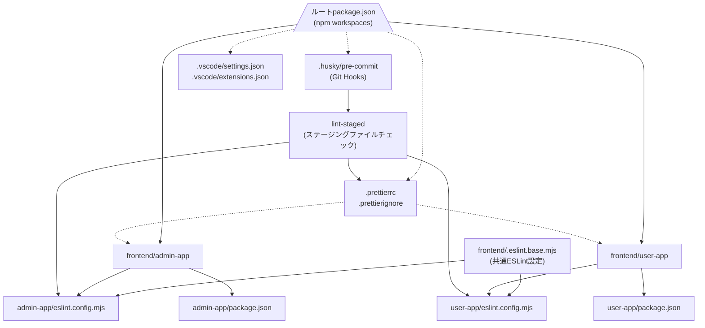
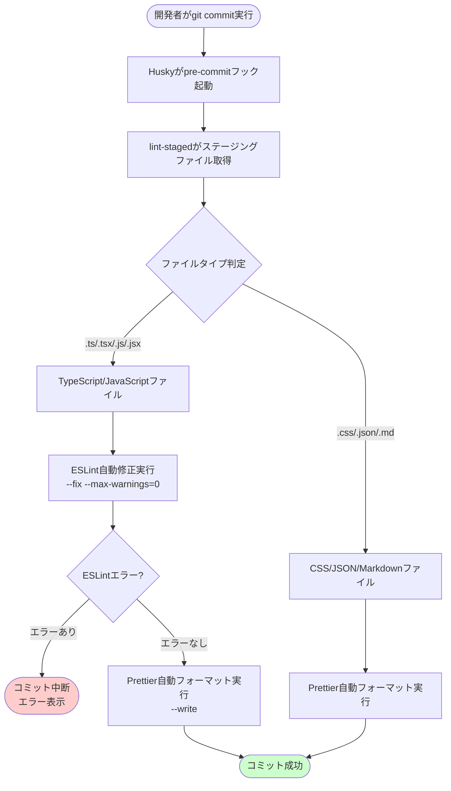
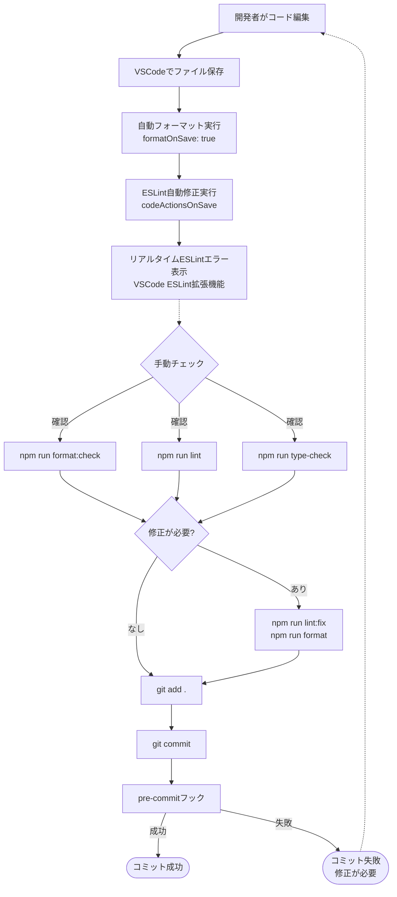
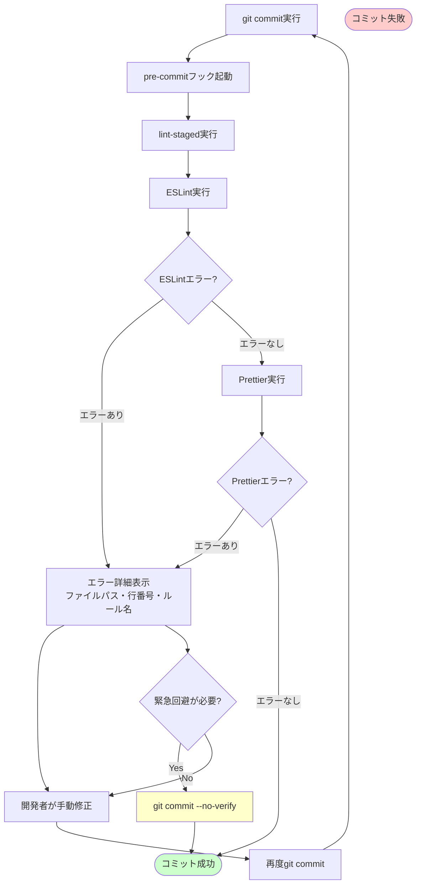
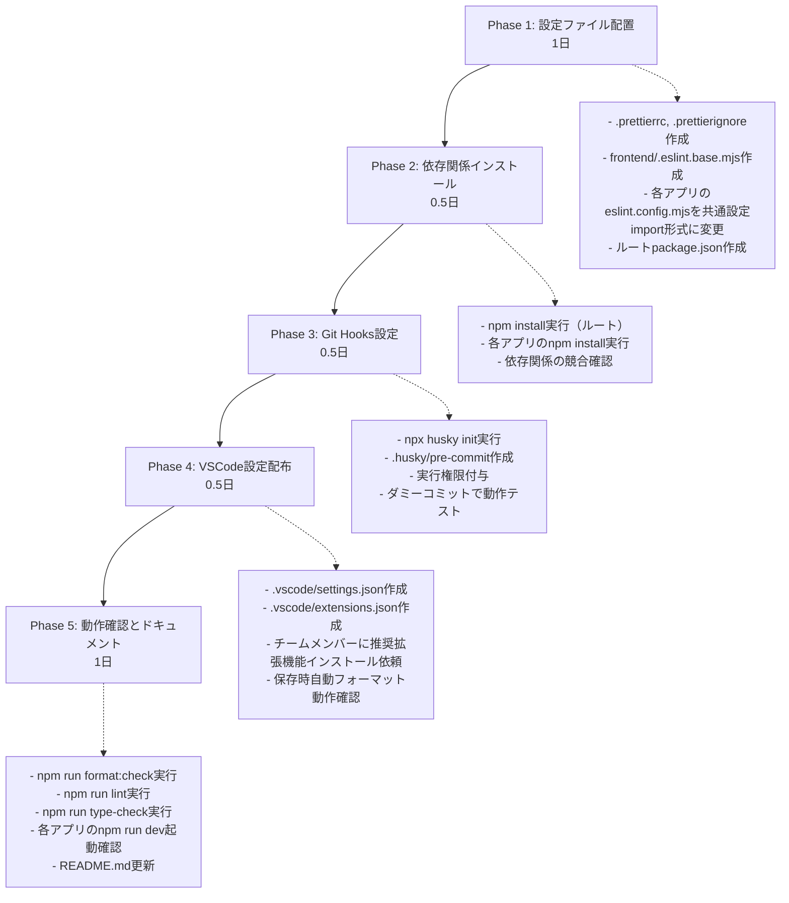

# Technical Design Document

## Overview

本機能は、admin-appとuser-appの2つのNext.jsアプリケーションにおいて、コードスタイルとフォーマットの統一を実現する。開発者は自動フォーマットと自動リントチェックにより、スタイル議論時間を削減し、コードレビューの効率化と品質向上を実現できる。

**ユーザー**: フロントエンド開発者がコーディング、コミット、コードレビューの各ワークフローで利用する。

**影響**: 現在独立したESLint設定を持つ2つのアプリケーションを、共通設定を共有するモノレポ構成に変更する。Prettier設定を新規導入し、Git Hooks（husky + lint-staged）によるコミット前自動チェックを追加する。

### Goals
- admin-appとuser-app間でESLint/Prettier設定を共有し、設定の重複を排除
- モノレポルートから統一されたコマンドで全アプリケーションのリント・フォーマット操作を実行可能に
- コミット前の自動チェックにより、品質基準を満たさないコードのコミットを防止
- VSCodeエディタでの保存時自動フォーマットとリアルタイムリントエラー表示を実現
- 既存コードベースへの破壊的変更を避け、段階的にリント・フォーマット基準を適用可能に

### Non-Goals
- Laravel（backend）のコードスタイル設定（PHPは別Issue）
- 既存コードへの一括自動修正適用（段階的適用は別途計画）
- CI/CDパイプラインの構築（別Issue #8で対応）
- テストコードのリント設定（将来対応）

## Architecture

### Existing Architecture Analysis

**現在の構成**:
- admin-app、user-appはそれぞれ独立したESLint設定を持つ（eslint.config.mjs）
- ESLint 9 Flat Config形式を既に採用（FlatCompat使用）
- Next.js 15.5 + React 19 + TypeScript環境
- Prettier設定は未導入
- Git Hooksは未設定
- npm workspacesは未設定（各アプリが独立）

**保持すべきパターン**:
- ESLint 9 Flat Config形式（レガシー.eslintrc形式は使用しない）
- FlatCompatによるNext.js推奨設定の継承
- 各アプリの独立したビルド・開発サーバー起動

**技術的制約**:
- 既存のnext、react、typescript依存関係を維持
- Turbopackによる高速ビルド機能を阻害しない
- 各アプリのeslint.config.mjsは共通設定をimportする形式に変更

### High-Level Architecture



**アーキテクチャ統合**:
- **保持される既存パターン**: ESLint 9 Flat Config、FlatCompat使用、各アプリの独立性
- **新規コンポーネントの根拠**:
  - ルートpackage.json（npm workspaces管理、統合コマンド実行）
  - frontend/.eslint.base.mjs（共通ESLint設定、DRY原則）
  - Prettier設定（コードフォーマット統一、業界標準）
  - Git Hooks（品質ゲート、自動化）
- **技術スタック整合性**: Next.js 15.5、React 19、TypeScript環境に完全対応
- **ステアリング準拠**: モノレポ構成（structure.md）、最小依存関係原則（tech.md）、開発効率化（product.md）

### Technology Alignment

**既存技術スタックとの整合**:
- **ESLint 9**: 既に各アプリで採用済み、共通設定に移行
- **Next.js 15.5 + TypeScript**: 既存環境を維持、eslint-config-nextを継続使用
- **npm**: パッケージマネージャーとして継続使用、workspaces機能を追加
- **VSCode**: 既存開発環境に統合設定を追加

**新規導入される依存関係**:
- **Prettier 3**: コードフォーマッター（業界標準、ESLintと競合しない設定）
- **prettier-plugin-tailwindcss**: Tailwind CSSクラス名の自動ソート
- **Husky 9**: Git Hooks管理ツール（軽量、最新版）
- **lint-staged 15**: ステージングファイル限定チェック（パフォーマンス最適化）
- **eslint-config-prettier**: ESLintとPrettierの競合ルール無効化

**既存パターンからの逸脱**:
- モノレポ構成導入（npm workspaces）: 共通設定共有のため必須
- ルートpackage.json追加: ワークスペース管理と統合コマンド実行のため

### Key Design Decisions

#### Decision 1: ESLint共通設定の配置場所

**Decision**: `/frontend/.eslint.base.mjs` に共通ESLint設定を配置し、各アプリの `eslint.config.mjs` からimportする

**Context**: admin-appとuser-appで重複したESLint設定を排除し、一貫したコード品質基準を適用する必要がある

**Alternatives**:
1. **ルート共通設定**: `/eslint.config.base.mjs` を配置し、frontendディレクトリ外に配置
2. **npm package化**: `@internal/eslint-config` として別パッケージ化
3. **各アプリに重複配置**: 既存の独立した設定を維持

**Selected Approach**: `/frontend/.eslint.base.mjs` を配置し、各アプリからES Module importで読み込む
```javascript
// frontend/.eslint.base.mjs
export default [...compat.extends("next/core-web-vitals"), ...rules];

// frontend/admin-app/eslint.config.mjs
import base from "../.eslint.base.mjs";
export default [...base];
```

**Rationale**:
- frontendディレクトリ内に配置することで、フロントエンド専用設定であることが明確
- 相対パスimportにより、追加のビルドステップやnpm package管理が不要
- 各アプリからの参照が簡潔（`../.eslint.base.mjs`）
- FlatCompat使用により、Next.jsの推奨設定をFlat Config形式に変換可能

**Trade-offs**:
- **獲得**: 設定の一元管理、変更時の修正箇所が1箇所、DRY原則の遵守
- **犠牲**: 各アプリが完全に独立できない（共通設定への依存が発生）

#### Decision 2: Prettierとlint-stagedの統合戦略

**Decision**: lint-stagedでTypeScript/JavaScriptファイルに対してESLint自動修正（`--fix --max-warnings=0`）とPrettier自動フォーマットを順次実行する

**Context**: コミット前にリントエラーとフォーマット差分の両方をチェックし、自動修正可能なものは自動で修正する必要がある

**Alternatives**:
1. **Prettierのみ実行**: ESLintは手動実行に任せる
2. **ESLintのみ実行**: Prettierは保存時フォーマットに任せる
3. **ESLint + Prettier統合プラグイン**: `eslint-plugin-prettier`を使用してESLint内でPrettierを実行

**Selected Approach**: lint-stagedで2段階実行（ESLint自動修正 → Prettier自動フォーマット）
```json
"lint-staged": {
  "frontend/**/*.{js,jsx,ts,tsx}": [
    "eslint --fix --max-warnings=0",
    "prettier --write"
  ],
  "frontend/**/*.{css,md,json}": [
    "prettier --write"
  ]
}
```

**Rationale**:
- ESLintとPrettierの責任分離: ESLint（コード品質）とPrettier（フォーマット）を独立して実行
- `--max-warnings=0`: 新規コミット時に警告も許容しない厳格な品質基準
- 2段階実行: ESLintが自動修正した後、Prettierが最終フォーマットを適用
- `eslint-config-prettier`使用: ESLintとPrettierの競合ルールを無効化し、Prettierの判断を優先

**Trade-offs**:
- **獲得**: 責任の明確な分離、各ツールの最新機能を独立して活用、`eslint-plugin-prettier`の追加依存なし
- **犠牲**: 2ツール実行による若干のパフォーマンスオーバーヘッド（数秒程度）

#### Decision 3: 既存コードへの段階的適用戦略

**Decision**: 初回はlint-stagedのみ厳格（`--max-warnings=0`）とし、既存コードへの一括適用は行わない。開発者が修正したファイルから新基準を適用する

**Context**: 既存コードベースに大量のリント警告が存在する可能性があり、一括修正は破壊的変更のリスクがある

**Alternatives**:
1. **一括自動修正**: 初回に全ファイルに対して `eslint --fix` と `prettier --write` を実行
2. **警告許容**: lint-stagedでも警告を許容し、段階的に修正
3. **特定ディレクトリのみ適用**: 新規ディレクトリのみ厳格に適用

**Selected Approach**: lint-stagedで新規コミット時のみ厳格（`--max-warnings=0`）、既存ファイルは段階的修正
- 初回: `npm run format:check` で差分を確認のみ
- コミット時: ステージングされたファイルのみ自動修正＋フォーマット
- 既存ファイル: 開発者が修正したタイミングで新基準が適用される

**Rationale**:
- 破壊的変更の回避: 既存コードの動作を保証
- 段階的改善: 開発活動に合わせて自然に品質が向上
- 開発阻害の最小化: 既存コードの大量修正を強制しない
- 品質ゲート確保: 新規コードは厳格な基準を満たす

**Trade-offs**:
- **獲得**: 既存コードへの影響最小化、開発者の負担軽減、リスク低減
- **犠牲**: 全コードベースの統一に時間がかかる、一時的な不整合が残る

## System Flows

### コミット前自動チェックフロー



### 開発ワークフローとツール統合



## Requirements Traceability

| Requirement | 要件概要 | コンポーネント | インターフェース | フロー |
|-------------|----------|--------------|--------------|--------|
| 1.1 | Prettierrc設定適用 | コードフォーマットシステム | `.prettierrc` | - |
| 1.2 | Prettierignore除外 | コードフォーマットシステム | `.prettierignore` | - |
| 1.3 | format:checkコマンド | npm scriptsシステム | `npm run format:check` | - |
| 1.4 | formatコマンド | npm scriptsシステム | `npm run format` | - |
| 2.1 | ESLint共通設定提供 | ESLintシステム | `frontend/.eslint.base.mjs` | - |
| 2.2 | 各アプリへの共通設定適用 | ESLintシステム | `admin-app/eslint.config.mjs`, `user-app/eslint.config.mjs` | - |
| 2.3 | lint並列実行 | npm workspacesシステム | `npm run lint --workspaces` | - |
| 2.4 | lint:fix自動修正 | ESLintシステム | `npm run lint:fix --workspaces` | - |
| 2.5 | FlatCompat変換 | ESLintシステム | `FlatCompat.extends()` | - |
| 3.1 | Husky初期化 | Git Hooksシステム | `.husky/` | - |
| 3.2 | pre-commit自動実行 | Git Hooksシステム | `.husky/pre-commit` | コミット前自動チェックフロー |
| 3.3 | TypeScript/JavaScript自動修正 | lint-stagedシステム | `lint-staged` config | コミット前自動チェックフロー |
| 3.4 | CSS/JSON/Markdown自動フォーマット | lint-stagedシステム | `lint-staged` config | コミット前自動チェックフロー |
| 3.5 | エラー時コミット中断 | Git Hooksシステム | pre-commitフックの終了コード | コミット前自動チェックフロー |
| 3.6 | --no-verifyスキップ | Git Hooksシステム | Git標準機能 | - |
| 4.1 | VSCode保存時自動フォーマット | VSCodeシステム | `.vscode/settings.json` | 開発ワークフローとツール統合 |
| 4.2 | ファイルタイプ別デフォルトフォーマッター | VSCodeシステム | `.vscode/settings.json` | 開発ワークフローとツール統合 |
| 4.3 | 推奨拡張機能促進 | VSCodeシステム | `.vscode/extensions.json` | - |
| 4.4 | workingDirectories設定 | VSCodeシステム | `.vscode/settings.json` | - |
| 5.1 | workspaces認識 | npm workspacesシステム | `package.json` workspaces field | - |
| 5.2 | 依存関係解決とhoist | npm workspacesシステム | `npm install` | - |
| 5.3 | Husky自動セットアップ | npm scriptsシステム | `prepare` script | - |
| 5.4 | 各アプリスクリプト実行 | npm scriptsシステム | `package.json` scripts | - |
| 5.5 | --workspaces並列実行 | npm workspacesシステム | `npm run <script> --workspaces` | - |
| 6.1-6.5 | 依存関係管理と互換性 | npm依存関係システム | `package.json` devDependencies | - |
| 7.1-7.5 | 段階的適用戦略 | ESLintシステム, lint-stagedシステム | `--max-warnings=0`, format:check | - |
| 8.1-8.5 | ビルド・開発サーバー統合 | Next.jsシステム, TypeScriptシステム | `npm run dev/build/type-check` | - |

## Components and Interfaces

### Configuration Layer

#### Prettier Configuration Component

**Responsibility & Boundaries**
- **Primary Responsibility**: プロジェクト全体のコードフォーマット規則を定義し、一貫したフォーマットスタイルを提供する
- **Domain Boundary**: フロントエンドコードフォーマット層（TypeScript、JavaScript、CSS、JSON、Markdown）
- **Data Ownership**: フォーマット規則設定データ（printWidth、singleQuote、trailingComma等）
- **Transaction Boundary**: なし（静的設定ファイル）

**Dependencies**
- **Inbound**: Prettierコマンドライン、VSCode Prettier拡張機能、lint-staged
- **Outbound**: prettier-plugin-tailwindcss（Tailwind CSSクラス名ソート）
- **External**: Prettier 3（コードフォーマッターコア）

**Contract Definition**

設定ファイル構造:

```typescript
// .prettierrc
interface PrettierConfig {
  printWidth: 100;           // 1行の最大文字数
  singleQuote: false;        // ダブルクォート使用
  trailingComma: "all";      // 末尾カンマを常に追加
  semi: true;                // セミコロンを常に追加
  tabWidth: 2;               // インデント幅
  endOfLine: "lf";           // 改行コードLF統一
  plugins: ["prettier-plugin-tailwindcss"];  // Tailwind CSSプラグイン
}
```

除外パターン（.prettierignore）:
- `node_modules`, `.next`, `dist`, `build`, `out`: ビルド生成物
- `*.min.*`: 圧縮済みファイル
- `backend`, `.kiro`, `.claude`, `.git`, `.husky`, `.idea`: 対象外ディレクトリ

**Preconditions**:
- Prettier 3とprettier-plugin-tailwindcssがインストール済み

**Postconditions**:
- 全フォーマット対象ファイルが統一されたスタイルでフォーマットされる
- Tailwind CSSクラス名が推奨順序にソートされる

#### ESLint Base Configuration Component

**Responsibility & Boundaries**
- **Primary Responsibility**: admin-appとuser-appで共有するESLint規則を定義し、一貫したコード品質基準を提供する
- **Domain Boundary**: フロントエンドコード品質層（TypeScript、JavaScript）
- **Data Ownership**: ESLint規則設定データ（rules、ignores、extends）
- **Transaction Boundary**: なし（静的設定ファイル）

**Dependencies**
- **Inbound**: admin-app/eslint.config.mjs、user-app/eslint.config.mjs
- **Outbound**: Next.js推奨ESLint設定（FlatCompat経由）、eslint-config-prettier
- **External**: ESLint 9、@eslint/eslintrc（FlatCompat）、eslint-config-next

**External Dependencies Investigation**:
- **ESLint 9 Flat Config**: 公式ドキュメント（https://eslint.org/docs/latest/use/configure/configuration-files）で設定形式を確認済み
- **@eslint/eslintrc FlatCompat**: レガシー形式（extends配列）を新Flat Config形式に変換するユーティリティ、Next.js推奨設定の継承に必須
- **eslint-config-next**: Next.js公式ESLint設定、core-web-vitalsとTypeScript推奨設定を含む
- **eslint-config-prettier**: PrettierとESLintの競合ルールを無効化、必ず設定配列の最後に配置

**Contract Definition**

```typescript
// frontend/.eslint.base.mjs
import { FlatCompat } from "@eslint/eslintrc";
import eslintConfigPrettier from "eslint-config-prettier";

interface ESLintBaseConfig {
  // Next.js推奨設定の継承（FlatCompat変換）
  extends: ["next/core-web-vitals", "next/typescript"];

  // カスタムルール
  rules: {
    "no-console": ["warn", { allow: ["warn", "error"] }];
    "no-debugger": "warn";
    "@typescript-eslint/no-unused-vars": [
      "warn",
      { argsIgnorePattern: "^_", varsIgnorePattern: "^_" }
    ];
  };

  // Prettier競合ルール無効化（最後に配置）
  eslintConfigPrettier: eslintConfigPrettier;

  // 共通ignore
  ignores: [
    "**/node_modules/**",
    "**/.next/**",
    "**/out/**",
    "**/build/**",
    "**/dist/**",
    "**/*.min.*",
    "**/next-env.d.ts"
  ];
}
```

**Preconditions**:
- ESLint 9、@eslint/eslintrc、eslint-config-next、eslint-config-prettierがインストール済み

**Postconditions**:
- 各アプリのeslint.config.mjsが共通設定をimportして使用可能
- ESLintとPrettierの競合が発生しない

**Invariants**:
- eslint-config-prettierは必ず設定配列の最後に配置される
- FlatCompat使用により、レガシー形式の設定がFlat Config形式に変換される

### Automation Layer

#### Git Hooks (Husky + lint-staged) Component

**Responsibility & Boundaries**
- **Primary Responsibility**: コミット前にステージングされたファイルに対して自動リント・フォーマットチェックを実行し、品質基準を満たさないコードのコミットを防止する
- **Domain Boundary**: コミット品質ゲート層
- **Data Ownership**: Git Hooks設定、lint-staged実行ルール
- **Transaction Boundary**: Gitコミット操作（成功/失敗の二者択一）

**Dependencies**
- **Inbound**: Git commit操作
- **Outbound**: ESLintシステム、Prettierシステム、lint-stagedシステム
- **External**: Husky 9（Git Hooks管理）、lint-staged 15（ステージングファイル処理）

**External Dependencies Investigation**:
- **Husky 9**: 公式ドキュメント（https://typicode.github.io/husky/）で`husky init`と`.husky/pre-commit`スクリプト形式を確認済み
- **lint-staged 15**: 公式GitHub（https://github.com/lint-staged/lint-staged）でglob pattern形式とコマンド配列形式を確認済み
- **認証**: 不要（ローカルツール）
- **バージョン互換性**: Husky 9はnpm 7以降のprepareスクリプト自動実行に対応、lint-staged 15はESLint 9に対応

**Event Contract**

**Published Events**:
- **pre-commit trigger**: Gitコミット操作時に自動発火、lint-stagedを実行

**Subscribed Events**:
- **Git commit**: ユーザーが`git commit`を実行したタイミング

**Delivery**: Synchronous（コミット操作をブロック）

**lint-staged Configuration**:

```typescript
// package.json内のlint-staged設定
interface LintStagedConfig {
  "frontend/**/*.{js,jsx,ts,tsx}": [
    "eslint --fix --max-warnings=0",  // ESLint自動修正（警告も許容しない）
    "prettier --write"                 // Prettier自動フォーマット
  ];
  "frontend/**/*.{css,md,json}": [
    "prettier --write"                 // Prettierのみ実行
  ];
}
```

**Preconditions**:
- Husky 9とlint-staged 15がインストール済み
- `.husky/pre-commit`が実行権限を持つ（`chmod +x`済み）
- ステージング対象ファイルが存在する

**Postconditions（成功時）**:
- ESLint自動修正可能なエラーが修正される
- Prettierによる自動フォーマットが適用される
- コミットが正常に実行される

**Postconditions（失敗時）**:
- コミットが中断される
- エラー内容が明確に表示される
- ステージングエリアは変更されない（--no-verifyで回避可能）

**Recovery**:
- **Failure Handling**: ESLintエラー発生時、具体的なファイルパスと行番号を表示
- **Retry Strategy**: 開発者が手動でエラーを修正後、再度コミット実行
- **Idempotency**: 同じファイルに対して複数回実行しても結果は同じ

#### npm Workspaces Integration Component

**Responsibility & Boundaries**
- **Primary Responsibility**: ルートpackage.jsonでadmin-appとuser-appをワークスペースとして管理し、統合コマンド実行と依存関係の一元管理を提供する
- **Domain Boundary**: パッケージ管理層
- **Data Ownership**: workspaces定義、統合npmスクリプト、共通devDependencies
- **Transaction Boundary**: npm install操作（全ワークスペースの依存関係解決）

**Dependencies**
- **Inbound**: 開発者のnpmコマンド実行
- **Outbound**: 各ワークスペース（admin-app、user-app）のpackage.json
- **External**: npm（バージョン7以降、workspaces機能サポート）

**API Contract**

統合npmスクリプト:

| Script | Command | Description | Workspaces |
|--------|---------|-------------|------------|
| prepare | `husky` | Husky自動セットアップ | No |
| lint | `npm run lint --workspaces` | 全アプリでlint実行 | Yes |
| lint:fix | `npm run lint:fix --workspaces` | 全アプリでlint自動修正 | Yes |
| format | `prettier --write 'frontend/**/*.{ts,tsx,js,jsx,json,css,md}'` | 全ファイルフォーマット | No |
| format:check | `prettier --check 'frontend/**/*.{ts,tsx,js,jsx,json,css,md}'` | フォーマット差分チェック | No |
| type-check | `npm run type-check --workspaces` | 全アプリで型チェック | Yes |

**Preconditions**:
- npm 7以降がインストール済み
- frontend/admin-app/package.jsonとfrontend/user-app/package.jsonが存在

**Postconditions**:
- `npm install`実行時、全ワークスペースの依存関係が解決される
- 共通依存関係がルートにhoistされる
- prepareスクリプトが自動実行され、Huskyがセットアップされる
- `--workspaces`フラグ付きスクリプトが全ワークスペースで並列実行される

**State Management**:
- **State Model**: npm workspaces自体は状態を持たない（package.jsonの静的定義）
- **Persistence**: package.jsonファイル、node_modulesディレクトリ
- **Concurrency**: npm install時のロックファイル（package-lock.json）による排他制御

### Editor Integration Layer

#### VSCode Configuration Component

**Responsibility & Boundaries**
- **Primary Responsibility**: VSCodeエディタでの保存時自動フォーマット、リアルタイムリントエラー表示、推奨拡張機能の提示を提供する
- **Domain Boundary**: エディタ統合層
- **Data Ownership**: VSCode workspace設定、推奨拡張機能リスト
- **Transaction Boundary**: なし（エディタ設定）

**Dependencies**
- **Inbound**: VSCodeエディタ
- **Outbound**: Prettier拡張機能、ESLint拡張機能、Tailwind CSS拡張機能
- **External**: VSCode、dbaeumer.vscode-eslint、esbenp.prettier-vscode、bradlc.vscode-tailwindcss

**External Dependencies Investigation**:
- **VSCode ESLint拡張機能（dbaeumer.vscode-eslint）**: ESLint 9 Flat Config対応済み、workingDirectories設定で複数ワークスペース対応
- **VSCode Prettier拡張機能（esbenp.prettier-vscode）**: Prettier 3対応、formatOnSave設定で保存時自動フォーマット
- **VSCode Tailwind CSS拡張機能（bradlc.vscode-tailwindcss）**: Tailwind CSS v4対応、クラス名補完とIntelliSense提供
- **設定優先順位**: workspace settings.json > user settings.json

**Contract Definition**

```typescript
// .vscode/settings.json
interface VSCodeSettings {
  "editor.formatOnSave": true;                     // 保存時自動フォーマット
  "editor.codeActionsOnSave": {
    "source.fixAll.eslint": "explicit"            // 保存時ESLint自動修正
  };
  "editor.defaultFormatter": "esbenp.prettier-vscode";  // デフォルトフォーマッター
  "eslint.workingDirectories": [
    "frontend/admin-app",
    "frontend/user-app"
  ];                                               // ESLint複数ワークスペース対応
  "prettier.configPath": ".prettierrc";           // Prettier設定ファイルパス
  "[typescript]": {
    "editor.defaultFormatter": "esbenp.prettier-vscode"
  };
  "[typescriptreact]": {
    "editor.defaultFormatter": "esbenp.prettier-vscode"
  };
  "[javascript]": {
    "editor.defaultFormatter": "esbenp.prettier-vscode"
  };
  "[json]": {
    "editor.defaultFormatter": "esbenp.prettier-vscode"
  };
}

// .vscode/extensions.json
interface VSCodeExtensions {
  recommendations: [
    "dbaeumer.vscode-eslint",           // ESLint拡張機能
    "esbenp.prettier-vscode",           // Prettier拡張機能
    "bradlc.vscode-tailwindcss"         // Tailwind CSS拡張機能
  ];
}
```

**Preconditions**:
- VSCodeがインストール済み
- 推奨拡張機能がインストール済み（初回起動時にVSCodeが促す）

**Postconditions**:
- ファイル保存時、PrettierとESLintが自動実行される
- リアルタイムでESLintエラーがエディタ内に表示される
- Tailwind CSSクラス名の補完が提供される

**Integration Strategy**:
- **Modification Approach**: 新規ファイル作成（.vscode/settings.json、.vscode/extensions.json）
- **Backward Compatibility**: ユーザー個別のsettings.jsonを上書きしない（workspace設定として追加）
- **Migration Path**: 既存の.vscode/ディレクトリがある場合、設定をマージ

## Data Models

本機能は設定ファイルのみを扱うため、複雑なデータモデルは不要。主要な設定データ構造は以下の通り。

### Configuration Data Structures

#### package.json Workspaces Structure

```typescript
interface RootPackageJson {
  name: "laravel-next-b2c";
  private: true;
  workspaces: ["frontend/admin-app", "frontend/user-app"];
  scripts: {
    prepare: "husky";
    lint: "npm run lint --workspaces";
    "lint:fix": "npm run lint:fix --workspaces";
    format: "prettier --write 'frontend/**/*.{ts,tsx,js,jsx,json,css,md}'";
    "format:check": "prettier --check 'frontend/**/*.{ts,tsx,js,jsx,json,css,md}'";
    "type-check": "npm run type-check --workspaces";
  };
  devDependencies: {
    eslint: "^9";
    "eslint-config-prettier": "^9";
    "eslint-config-next": "15.5.4";
    "@eslint/eslintrc": "^3";
    prettier: "^3";
    "prettier-plugin-tailwindcss": "^0.6";
    husky: "^9";
    "lint-staged": "^15";
  };
  "lint-staged": {
    "frontend/**/*.{js,jsx,ts,tsx}": [
      "eslint --fix --max-warnings=0",
      "prettier --write"
    ];
    "frontend/**/*.{css,md,json}": ["prettier --write"];
  };
}
```

#### App Package.json Structure

```typescript
interface AppPackageJson {
  name: "admin-app" | "user-app";
  version: "0.1.0";
  private: true;
  scripts: {
    dev: "next dev --turbopack";
    build: "next build --turbopack";
    start: "next start";
    lint: "eslint .";
    "lint:fix": "eslint . --fix";
    "type-check": "tsc --noEmit";
  };
  dependencies: {
    react: "19.1.0";
    "react-dom": "19.1.0";
    next: "15.5.4";
  };
  devDependencies: {
    typescript: "^5";
    "@types/node": "^20";
    "@types/react": "^19";
    "@types/react-dom": "^19";
    "@tailwindcss/postcss": "^4";
    tailwindcss: "^4";
    eslint: "^9";
    "eslint-config-next": "15.5.4";
    "@eslint/eslintrc": "^3";
  };
}
```

## Error Handling

### Error Strategy

本機能では、以下の3つのレイヤーでエラーハンドリングを実施する。

1. **Configuration Validation Layer**: 設定ファイルの構文エラー、バージョン不整合
2. **Runtime Execution Layer**: ESLint/Prettierの実行エラー、ファイルアクセスエラー
3. **Git Hooks Layer**: コミット前チェックの失敗、lint-staged実行エラー

### Error Categories and Responses

#### User Errors (400番台相当)

**Configuration Syntax Error**:
- **発生条件**: package.json、.prettierrc、eslint.config.mjsの構文エラー
- **Response**: 構文エラーの具体的な行番号とエラー内容を表示
- **Recovery**: ファイルを修正後、再度npmコマンド実行

**Invalid Glob Pattern**:
- **発生条件**: lint-staged設定のglob patternが不正
- **Response**: 不正なパターンを指摘し、正しい形式を例示
- **Recovery**: package.jsonのlint-staged設定を修正

**Uninstalled Extension**:
- **発生条件**: VSCodeで推奨拡張機能が未インストール
- **Response**: VSCodeが拡張機能インストールを促すポップアップ表示
- **Recovery**: 拡張機能をインストール、VSCode再起動

#### System Errors (500番台相当)

**npm install Failure**:
- **発生条件**: ネットワークエラー、依存関係解決失敗
- **Response**: npm ERRORログと原因を表示
- **Recovery**: ネットワーク確認後、`npm cache clean --force && npm install`実行

**File Access Permission Error**:
- **発生条件**: .husky/pre-commitの実行権限不足
- **Response**: Permission deniedエラーとchmodコマンドをガイド
- **Recovery**: `chmod +x .husky/pre-commit`実行

**Husky Installation Failure**:
- **発生条件**: Git未初期化、prepareスクリプト実行失敗
- **Response**: Gitリポジトリ初期化をガイド
- **Recovery**: `git init && npm install`実行

#### Business Logic Errors (422相当)

**ESLint Rule Violation**:
- **発生条件**: コードがESLintルールに違反（コミット時）
- **Response**:
  - ファイルパス、行番号、ルール名、エラー内容を表示
  - `eslint --fix`で自動修正可能なものは修正済み、手動修正が必要なもののみエラー
- **Recovery**: エラー箇所を手動修正後、再度コミット

**Prettier Format Mismatch**:
- **発生条件**: コードがPrettierフォーマット規則に違反（format:check時）
- **Response**: フォーマット差分があるファイルリストを表示
- **Recovery**: `npm run format`実行で自動修正

**TypeScript Type Error**:
- **発生条件**: 型エラーが存在（type-check時）
- **Response**: 型エラーの具体的な内容とファイルパスを表示
- **Recovery**: 型エラーを手動修正

### Error Flow Visualization



### Monitoring

**Error Tracking**:
- ESLint/Prettierエラーは標準出力に表示（ローカル開発環境）
- lint-staged実行結果はGit pre-commit hookログに記録

**Logging**:
- npm scriptsの実行ログは標準出力
- VSCode拡張機能のログはVSCode Output パネル（ESLint、Prettier）

**Health Monitoring**:
- `npm run lint`、`npm run format:check`、`npm run type-check`を定期的に実行し、全体の品質状態を確認
- CI/CDパイプライン（別Issue #8）で自動実行予定

## Testing Strategy

### Unit Tests

本機能は設定ファイルのみを扱うため、従来の単体テストは不要。代わりに以下の検証を実施。

1. **Prettier設定検証**: サンプルファイルに`npm run format`を実行し、期待通りのフォーマットが適用されることを確認
2. **ESLint設定検証**: サンプルファイルに`npm run lint`を実行し、期待通りのルール適用とエラー検出を確認
3. **npm workspaces検証**: `npm install`実行後、依存関係が正しくhoistされることを確認
4. **FlatCompat動作検証**: `npx eslint --print-config src/app/page.tsx`で設定が正しく解決されることを確認

### Integration Tests

1. **lint-staged統合テスト**: ダミーファイルをステージングし、`git commit`実行時にlint-stagedが正しく動作することを確認
2. **VSCode統合テスト**: ファイル保存時にPrettierとESLintが自動実行されることを手動確認
3. **workspaces統合テスト**: `npm run lint --workspaces`で全アプリのlintが並列実行されることを確認
4. **Prettier + Tailwind CSS統合テスト**: Tailwind CSSクラス名が正しくソートされることを確認
5. **ESLint + Prettier競合テスト**: eslint-config-prettierが正しく競合ルールを無効化することを確認

### E2E Tests

1. **新規ファイル作成フロー**: 新規TypeScriptファイル作成 → コード記述 → 保存 → ESLint/Prettier自動適用 → コミット → pre-commitフック成功
2. **既存ファイル修正フロー**: 既存ファイル編集 → ESLintエラー発生 → 手動修正 → コミット → pre-commitフック成功
3. **フォーマット差分検出フロー**: `npm run format:check`実行 → 差分検出 → `npm run format`実行 → 差分解消確認
4. **コミット失敗リカバリフロー**: ESLintエラーのあるファイルをコミット → pre-commitフック失敗 → エラー修正 → 再コミット成功
5. **緊急回避フロー**: 緊急時に`git commit --no-verify`でpre-commitフックをスキップし、コミット成功

### Performance Tests

1. **lint-staged実行時間測定**: 10ファイル修正時のpre-commitフック実行時間が5秒以内であることを確認
2. **npm run lint並列実行**: 全ワークスペースのlint実行時間が単一実行の2倍以内（並列実行の効果確認）
3. **VSCode保存時自動フォーマット**: ファイル保存からフォーマット完了まで1秒以内
4. **大量ファイルフォーマット**: `npm run format`で100ファイル以上を一括フォーマットし、10秒以内で完了することを確認

## Security Considerations

本機能は開発環境設定のみを扱うため、セキュリティリスクは限定的。以下の点に留意。

### Dependency Security

**脅威**: 悪意のあるnpmパッケージによるサプライチェーン攻撃
**対策**:
- 公式・信頼性の高いパッケージのみ使用（ESLint、Prettier、Husky、lint-staged）
- `npm audit`による脆弱性スキャンを定期実行
- package-lock.jsonをコミットし、依存関係バージョンを固定

### Git Hooks Bypass

**脅威**: `--no-verify`による品質ゲートのスキップ
**対策**:
- CI/CDパイプライン（別Issue #8）で再度リント・フォーマットチェックを実施
- `--no-verify`使用を緊急時のみに限定（チーム運用ルール）

### Configuration File Tampering

**脅威**: .prettierrc、eslint.config.mjsの不正な変更による品質低下
**対策**:
- 設定ファイル変更時は必ずコードレビューを実施
- 設定変更のPull Requestには説明を必須化

## Migration Strategy

本機能は既存システムへの追加であり、段階的に適用する。

### Migration Phases



### Phase Breakdown

#### Phase 1: 設定ファイル配置（1日）
- `.prettierrc`、`.prettierignore`をルートに作成
- `frontend/.eslint.base.mjs`を作成
- 各アプリの`eslint.config.mjs`を共通設定import形式に変更
- ルート`package.json`を作成（workspaces、scripts、devDependencies、lint-staged設定）

**Rollback Trigger**: 設定ファイル構文エラー、既存ビルドの失敗
**Validation Checkpoint**: 各設定ファイルの構文が正しいことを確認

#### Phase 2: 依存関係インストール（0.5日）
- `npm install`をルートで実行
- 各アプリの`npm install`を実行
- 依存関係の競合がないことを確認

**Rollback Trigger**: 依存関係解決失敗、バージョン競合
**Validation Checkpoint**: `npm list`で依存関係ツリーが正しいことを確認

#### Phase 3: Git Hooks設定（0.5日）
- `npx husky init`実行
- `.husky/pre-commit`を作成
- 実行権限付与（`chmod +x .husky/pre-commit`）
- ダミーコミットで動作テスト

**Rollback Trigger**: pre-commitフック実行失敗、Git操作の阻害
**Validation Checkpoint**: ダミーコミットが成功し、lint-stagedが正しく動作することを確認

#### Phase 4: VSCode設定配布（0.5日）
- `.vscode/settings.json`を作成
- `.vscode/extensions.json`を作成
- チームメンバーに推奨拡張機能インストールを依頼
- 保存時自動フォーマット動作確認

**Rollback Trigger**: VSCode設定の競合、エディタ動作の異常
**Validation Checkpoint**: ファイル保存時にPrettierとESLintが自動実行されることを確認

#### Phase 5: 動作確認とドキュメント（1日）
- `npm run format:check`実行成功
- `npm run lint`実行成功（警告は許容）
- `npm run type-check`実行成功
- 各アプリの`npm run dev`起動確認
- README.md更新（リント・フォーマット実行手順追加）

**Rollback Trigger**: ビルド失敗、開発サーバー起動失敗
**Validation Checkpoint**: 全コマンドが正常に実行され、既存機能が動作することを確認

### Rollback Strategy

各フェーズで問題が発生した場合、以下の手順でロールバック:

1. **設定ファイル削除**: 追加した設定ファイルをGitから削除
2. **依存関係巻き戻し**: package.jsonを元に戻し、`npm install`再実行
3. **Git Hooks削除**: `.husky/`ディレクトリを削除
4. **VSCode設定削除**: `.vscode/`ディレクトリを削除（または既存設定に戻す）
5. **コミット取り消し**: `git reset --hard HEAD~1`で最後のコミットを取り消し