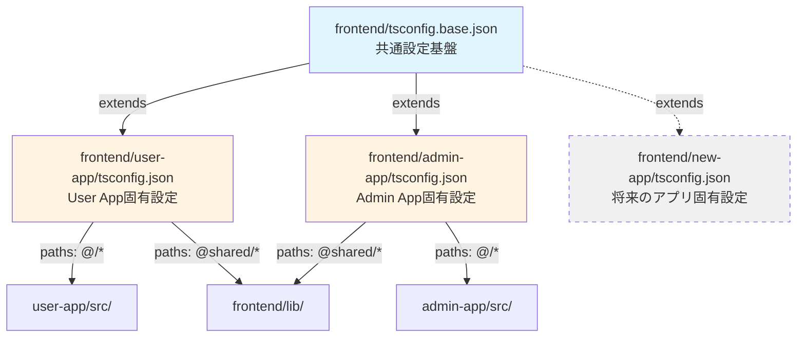
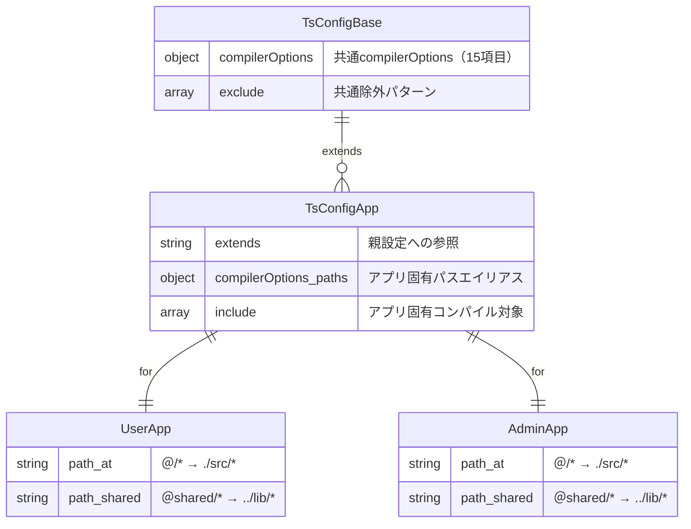
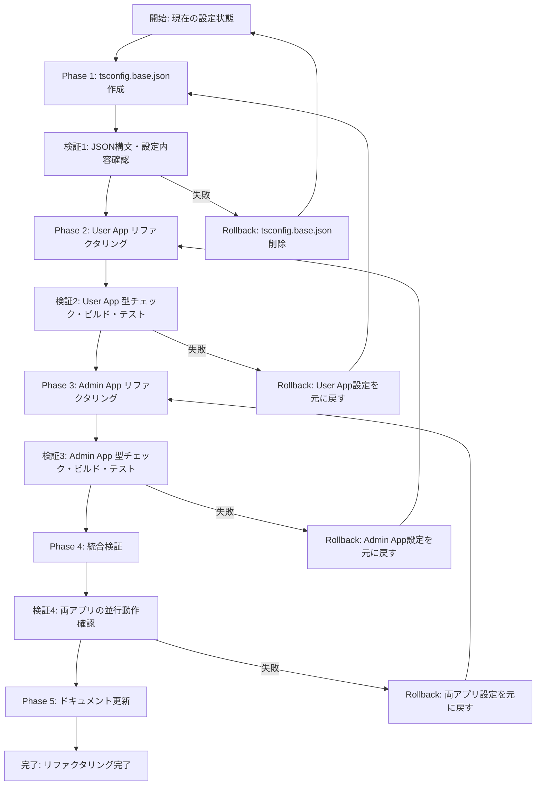

# Technical Design Document

## Overview

本設計では、フロントエンドモノレポ構成における TypeScript 設定の重複を解消し、保守性・一貫性・スケーラビリティを向上させる。PR #125 で導入された `@shared/*` パスエイリアスにより、User App と Admin App の `tsconfig.json` が完全に同一となり、DRY 原則違反が発生している。TypeScript の `extends` 機能を活用して共通設定を `frontend/tsconfig.base.json` に集約し、各アプリはアプリ固有設定（パスエイリアス、include 指定）のみを保持する構成に変更する。

この設計により、User App/Admin App 間の設定一貫性を保証し、将来的な 3 つ目のアプリ追加時にも共通設定を即座に再利用可能とする。また、TypeScript 設定変更時の影響範囲を 1 ファイルに限定し、保守性を大幅に向上させる。

### Goals

- **DRY 原則適用**: User App/Admin App の重複 compilerOptions を frontend/tsconfig.base.json に集約
- **設定一貫性保証**: User App/Admin App で確実に同一の共通設定を適用
- **スケーラビリティ確保**: 将来的な 3 つ目のアプリ追加時に共通設定を即座に再利用可能
- **保守性向上**: TypeScript 設定変更時の影響範囲を 1 ファイルに限定
- **後方互換性維持**: TypeScript 型チェック・IDE 型補完・Jest テスト・Next.js ビルドの動作保証

### Non-Goals

- TypeScript 設定内容の変更（compilerOptions の値は現状維持）
- Jest 設定や ESLint 設定の変更
- パスエイリアス設定の変更（`@/*` と `@shared/*` は現状維持）
- 新しい TypeScript 機能の導入

## Architecture

### Existing Architecture Analysis

**現在のモノレポ構成**:
```
frontend/
├── user-app/
│   ├── tsconfig.json (15個のcompilerOptions + paths + include + exclude)
│   └── src/
└── admin-app/
    ├── tsconfig.json (15個のcompilerOptions + paths + include + exclude)
    └── src/
```

**既存の TypeScript 設定パターン**:
- Next.js 15.5 公式推奨設定（target: ES2017, moduleResolution: bundler）
- モノレポパスエイリアス（PR #125 導入の `@shared/*`）
- Jest テスト除外設定（`exclude` に `**/__tests__/**` 等）

**設定重複の現状**:
- **共通 compilerOptions**: 15 個の設定項目が完全一致（target, lib, strict, jsx 等）
- **共通 exclude**: node_modules とテストファイル除外が完全一致
- **アプリ固有設定**: `paths` のみ（値は同じだが相対パスの起点が異なる）

### High-Level Architecture



**Architecture Integration**:
- **既存パターンの保持**: Next.js 推奨設定、モノレポパスエイリアス、Jest テスト除外
- **新コンポーネントの追加**: tsconfig.base.json（共通設定基盤）
- **Technology Alignment**: TypeScript 5.x 標準の `extends` 機能、Next.js 15.5 公式ドキュメント準拠
- **Steering Compliance**: モノレポ統一設定方針、DRY 原則、スケーラビリティ確保

### Technology Alignment

**既存 Technology Stack**:
- **TypeScript**: 5.x（`extends` 機能はTypeScript 2.1+で安定サポート）
- **Next.js**: 15.5.4（tsconfig 継承をネイティブサポート）
- **モノレポ構成**: npm workspaces（PR #125 導入の `@shared/*` パスエイリアス）

**新規導入要素**:
- **tsconfig.base.json**: TypeScript 公式の設定継承ファイル（追加依存関係なし）

**Justification for New Dependencies**:
- 依存関係の追加なし（TypeScript 標準機能のみ使用）
- Next.js 公式ドキュメントで推奨されるモノレポ設定パターン

### Key Design Decisions

#### Decision 1: TypeScript `extends` による設定継承

**Decision**: TypeScript の `extends` 機能を使用して、tsconfig.base.json から共通設定を継承する

**Context**: User App/Admin App の tsconfig.json が完全に同一の 15 個の compilerOptions を保持しており、設定変更時に 2 ファイルの同時修正が必要（保守性低下・不整合リスク）

**Alternatives**:
1. **現状維持**: 各アプリで完全な tsconfig.json を保持
   - メリット: 変更不要
   - デメリット: 重複維持、設定不整合リスク継続
2. **シンボリックリンク**: 1 つの tsconfig.json を複数アプリでシンボリックリンク
   - メリット: ファイル数削減
   - デメリット: パスエイリアス設定の個別化が困難、Windows 環境でのシンボリックリンク問題
3. **extends 継承** ✅
   - メリット: TypeScript 標準機能、アプリ固有設定のオーバーライド可能、ツール対応良好
   - デメリット: 1 ファイル追加

**Selected Approach**: TypeScript の `extends` 機能を使用

**How It Works**:
1. `frontend/tsconfig.base.json` に共通 compilerOptions と exclude を定義
2. User App/Admin App の tsconfig.json で `"extends": "../tsconfig.base.json"` を指定
3. 各アプリで `paths` と `include` のみをオーバーライド

**Rationale**:
- TypeScript 2.1+ の安定機能であり、Next.js、VSCode、Jest 等の全ツールでネイティブサポート
- アプリ固有設定のオーバーライドが可能（将来的な個別カスタマイズに対応）
- TypeScript 公式ドキュメントと Next.js モノレポガイドで推奨されるベストプラクティス

**Trade-offs**:
- **Gain**: 保守性向上（共通設定変更が 1 ファイルで完結）、設定一貫性保証、スケーラビリティ
- **Sacrifice**: ファイル数 +1（tsconfig.base.json 追加）、設定の参照階層が 1 段増加

#### Decision 2: パスエイリアス設定のアプリ固有化

**Decision**: `paths` 設定を tsconfig.base.json に含めず、各アプリの tsconfig.json でオーバーライド

**Context**: `@/*` パスエイリアスは相対パスの起点がアプリごとに異なるため（`./src/*`）、共通化が困難

**Alternatives**:
1. **paths を共通化**: tsconfig.base.json に `paths` を定義し、各アプリで相対パス調整
   - メリット: さらなる設定削減
   - デメリット: 相対パスの起点問題で動作しない、TypeScript の paths 解決アルゴリズムと競合
2. **paths をアプリ固有に保持** ✅
   - メリット: 各アプリで正しいパス解決、IDE 型補完の正常動作
   - デメリット: paths 設定の重複（ただし値自体は同一）

**Selected Approach**: `paths` 設定を各アプリの tsconfig.json でオーバーライド

**How It Works**:
- tsconfig.base.json には `paths` を含めない
- User App: `"@/*": ["./src/*"]`, `"@shared/*": ["../lib/*"]`
- Admin App: `"@/*": ["./src/*"]`, `"@shared/*": ["../lib/*"]`（値は同じだが起点が異なる）

**Rationale**:
- パスエイリアスは相対パスの起点に依存するため、共通化すると型解決が破綻
- VSCode TypeScript Language Service と TypeScript Compiler の両方で正しいパス解決を保証

**Trade-offs**:
- **Gain**: 型解決の正確性、IDE 型補完の正常動作
- **Sacrifice**: paths 設定の部分的重複（ただし構造は同一で値のみアプリ固有）

#### Decision 3: exclude 設定の共通化

**Decision**: `exclude` 設定を tsconfig.base.json に含める

**Context**: 両アプリで `exclude` 設定が完全に同一（`["node_modules", "**/__tests__/**", "**/*.test.ts", "**/*.test.tsx"]`）

**Alternatives**:
1. **exclude をアプリ固有に保持**: 各アプリで exclude を定義
   - メリット: アプリごとの柔軟な除外設定
   - デメリット: 重複維持、Jest テスト除外ルールの不整合リスク
2. **exclude を共通化** ✅
   - メリット: DRY 原則適用、Jest テスト除外ルールの一貫性保証
   - デメリット: 個別カスタマイズが必要な場合は各アプリでオーバーライド

**Selected Approach**: `exclude` 設定を tsconfig.base.json に含める

**How It Works**:
- tsconfig.base.json に `"exclude": ["node_modules", "**/__tests__/**", "**/*.test.ts", "**/*.test.tsx"]` を定義
- 各アプリで exclude をオーバーライドしない（継承した値をそのまま使用）

**Rationale**:
- Jest テスト除外ルールは全アプリ共通であるべき（不整合があると型チェック結果が異なる）
- TypeScript の `extends` では、子設定で exclude を省略すると親設定の exclude を継承

**Trade-offs**:
- **Gain**: Jest テスト除外ルールの一貫性保証、重複削減
- **Sacrifice**: アプリ固有の除外ルールが必要な場合は各アプリで完全にオーバーライド必要

## System Flows

### TypeScript 設定継承フロー

```mermaid
graph TB
    Start[TypeScript Compiler起動]

    Start --> ReadUserApp[user-app/tsconfig.json読み込み]
    Start --> ReadAdminApp[admin-app/tsconfig.json読み込み]

    ReadUserApp --> CheckExtends1{extends指定あり?}
    CheckExtends1 -->|Yes| LoadBase1[tsconfig.base.json読み込み]
    LoadBase1 --> MergeUser[User App設定マージ<br/>base + user-app]

    ReadAdminApp --> CheckExtends2{extends指定あり?}
    CheckExtends2 -->|Yes| LoadBase2[tsconfig.base.json読み込み]
    LoadBase2 --> MergeAdmin[Admin App設定マージ<br/>base + admin-app]

    MergeUser --> ApplyPathsUser[パスエイリアス解決<br/>@/* → ./src/*<br/>@shared/* → ../lib/*]
    MergeAdmin --> ApplyPathsAdmin[パスエイリアス解決<br/>@/* → ./src/*<br/>@shared/* → ../lib/*]

    ApplyPathsUser --> CompileUser[User App型チェック実行]
    ApplyPathsAdmin --> CompileAdmin[Admin App型チェック実行]

    CompileUser --> Success1[型チェック成功]
    CompileAdmin --> Success2[型チェック成功]
```

**設定マージの優先順位**:
1. **子設定（user-app/tsconfig.json）** が最優先
2. **親設定（tsconfig.base.json）** がデフォルト
3. **マージルール**:
   - `compilerOptions`: 子設定で指定した項目が親設定を上書き
   - `include`: 子設定が親設定を完全に置き換え
   - `exclude`: 子設定が親設定を完全に置き換え（省略時は親設定を継承）

### VSCode TypeScript Language Service 動作フロー

```mermaid
graph TB
    OpenFile[VSCodeでファイルを開く]

    OpenFile --> DetectWorkspace[ワークスペースフォルダ検出]
    DetectWorkspace --> FindTsconfig[最寄りのtsconfig.json検索]

    FindTsconfig --> LoadConfig[tsconfig.json読み込み]
    LoadConfig --> CheckExtends{extends指定あり?}

    CheckExtends -->|Yes| LoadBaseConfig[tsconfig.base.json読み込み]
    LoadBaseConfig --> MergeConfig[設定マージ]

    CheckExtends -->|No| UseDirectConfig[直接設定を使用]

    MergeConfig --> ResolvePathAlias[パスエイリアス解決<br/>@/* → src/<br/>@shared/* → ../lib/]
    UseDirectConfig --> ResolvePathAlias

    ResolvePathAlias --> TypeCheck[型チェック実行]
    TypeCheck --> ShowCompletion[型補完表示]
    ShowCompletion --> ShowErrors[型エラー表示]
```

**VSCode 型補完の動作保証**:
- VSCode の TypeScript Language Service は tsconfig.json の `extends` をネイティブサポート
- パスエイリアス（`@/*`, `@shared/*`）は各アプリの tsconfig.json で定義されるため、正しいパス解決が保証される
- tsconfig.base.json の変更は即座に VSCode に反映される（自動リロード）

## Requirements Traceability

| Requirement | Requirement Summary | Components | Configuration Files | Flows |
|-------------|-------------------|------------|---------------------|-------|
| 1.1-1.4 | 共通TypeScript設定基盤の作成 | tsconfig.base.json | `frontend/tsconfig.base.json`<br/>- compilerOptions<br/>- exclude | 設定継承フロー |
| 2.1-2.5 | User Appの設定リファクタリング | User App tsconfig.json | `frontend/user-app/tsconfig.json`<br/>- extends<br/>- paths<br/>- include | 設定継承フロー<br/>VSCode動作フロー |
| 3.1-3.6 | Admin Appの設定リファクタリング | Admin App tsconfig.json | `frontend/admin-app/tsconfig.json`<br/>- extends<br/>- paths<br/>- include | 設定継承フロー<br/>VSCode動作フロー |
| 4.1-4.5 | TypeScript型チェックの動作保証 | TypeScript Compiler | 全tsconfig.json | 設定継承フロー |
| 5.1-5.6 | IDE型補完の動作保証 | VSCode TypeScript Language Service | 全tsconfig.json | VSCode動作フロー |
| 6.1-6.5 | Jestテストの動作保証 | Jest Test Runner | jest.config.js<br/>tsconfig.json | Jestテスト実行フロー |
| 7.1-7.6 | Next.jsビルドの動作保証 | Next.js Build System | next.config.ts<br/>tsconfig.json | Next.jsビルドフロー |
| 8.1-8.4 | スケーラビリティの確保 | 将来のアプリ tsconfig.json | `frontend/new-app/tsconfig.json`<br/>（想定） | 設定継承フロー |
| 9.1-9.5 | 保守性の向上 | tsconfig.base.json | `frontend/tsconfig.base.json` | - |
| 10.1-10.5 | 後方互換性の保証 | 全コンポーネント | 全設定ファイル | 全フロー |

## Components and Interfaces

### Configuration Layer

#### tsconfig.base.json（共通TypeScript設定基盤）

**Responsibility & Boundaries**
- **Primary Responsibility**: フロントエンドモノレポ全体で共有する TypeScript compilerOptions と exclude 設定を定義
- **Domain Boundary**: フロントエンドモノレポ配下の全 Next.js アプリケーション
- **Data Ownership**: TypeScript 共通設定（target, lib, strict, jsx 等の 15 個の compilerOptions）
- **Transaction Boundary**: 設定変更時に全アプリに即座に反映（TypeScript Compiler/VSCode の自動リロード）

**Dependencies**
- **Inbound**: User App tsconfig.json, Admin App tsconfig.json（将来的には新規アプリ）
- **Outbound**: なし（他の設定ファイルに依存しない）
- **External**: TypeScript Compiler（`tsc`）、VSCode TypeScript Language Service

**Contract Definition**

**Configuration Schema**:
```typescript
interface TsConfigBase {
  compilerOptions: {
    // コンパイルターゲット
    target: 'ES2017';

    // 型定義ライブラリ
    lib: ['dom', 'dom.iterable', 'esnext'];

    // JavaScript ファイル許可
    allowJs: true;

    // 型定義ライブラリチェックスキップ（ビルド高速化）
    skipLibCheck: true;

    // 厳格な型チェック有効化
    strict: true;

    // 出力ファイル生成なし（型チェックのみ）
    noEmit: true;

    // ES Module 互換性
    esModuleInterop: true;

    // モジュールシステム
    module: 'esnext';

    // モジュール解決方法（Next.js 15推奨）
    moduleResolution: 'bundler';

    // JSON ファイル import 許可
    resolveJsonModule: true;

    // 各ファイルを独立したモジュールとして扱う
    isolatedModules: true;

    // JSX 構文の扱い（Next.js用）
    jsx: 'preserve';

    // インクリメンタルコンパイル有効化
    incremental: true;

    // Next.js TypeScript プラグイン
    plugins: [{ name: 'next' }];
  };

  // コンパイル対象外
  exclude: [
    'node_modules',        // Node.js依存関係
    '**/__tests__/**',     // Jestテストディレクトリ
    '**/*.test.ts',        // Jestテストファイル（TypeScript）
    '**/*.test.tsx'        // Jestテストファイル（TSX）
  ];
}
```

**Preconditions**:
- ファイルパス: `frontend/tsconfig.base.json`（モノレポルートの直下）
- JSON 形式で有効な構文
- TypeScript 5.x の compilerOptions スキーマに準拠

**Postconditions**:
- User App/Admin App の tsconfig.json から `extends` で参照可能
- TypeScript Compiler が設定を正しくマージ
- VSCode TypeScript Language Service が設定を認識

**Invariants**:
- `paths` 設定を含まない（各アプリ固有設定として分離）
- Next.js 15.5 公式推奨設定を維持
- Jest テスト除外ルールを確実に適用

**State Management**:
- **State Model**: ステートレス（静的設定ファイル）
- **Persistence**: Git リポジトリで管理
- **Concurrency**: 複数アプリから並行参照可能（読み取り専用）

#### User App tsconfig.json（User App固有TypeScript設定）

**Responsibility & Boundaries**
- **Primary Responsibility**: User App 固有の TypeScript 設定（パスエイリアス、include 指定）を定義し、tsconfig.base.json を継承
- **Domain Boundary**: User App（`frontend/user-app/`）のみ
- **Data Ownership**: User App のパスエイリアス設定（`@/*` → `./src/*`, `@shared/*` → `../lib/*`）
- **Transaction Boundary**: User App のビルド・型チェック時のみ適用

**Dependencies**
- **Inbound**: TypeScript Compiler（User App 型チェック時）、VSCode（User App ファイル編集時）
- **Outbound**: tsconfig.base.json（`extends` による継承）
- **External**: Next.js Build System、Jest Test Runner

**Contract Definition**

**Configuration Schema**:
```typescript
interface TsConfigUserApp {
  // 親設定の継承
  extends: '../tsconfig.base.json';

  compilerOptions: {
    // User App固有のパスエイリアス
    paths: {
      '@/*': ['./src/*'];           // User App内部のsrcディレクトリ
      '@shared/*': ['../lib/*'];    // モノレポ共通ライブラリ
    };
  };

  // User App固有のコンパイル対象
  include: [
    'next-env.d.ts',          // Next.js型定義
    '**/*.ts',                // TypeScriptファイル
    '**/*.tsx',               // TSXファイル
    '.next/types/**/*.ts'     // Next.jsビルド生成型定義
  ];
}
```

**Preconditions**:
- tsconfig.base.json が存在する
- `extends` の相対パスが正しい（`../tsconfig.base.json`）
- JSON 形式で有効な構文

**Postconditions**:
- TypeScript Compiler が tsconfig.base.json の設定をマージ
- パスエイリアス（`@/*`, `@shared/*`）が正しく解決される
- User App の型チェック・ビルドが成功

**Invariants**:
- `extends` 指定を必ず含む
- `paths` は User App の src ディレクトリを参照
- `include` は Next.js 推奨のファイルパターンを維持

#### Admin App tsconfig.json（Admin App固有TypeScript設定）

**Responsibility & Boundaries**
- **Primary Responsibility**: Admin App 固有の TypeScript 設定（パスエイリアス、include 指定）を定義し、tsconfig.base.json を継承
- **Domain Boundary**: Admin App（`frontend/admin-app/`）のみ
- **Data Ownership**: Admin App のパスエイリアス設定（`@/*` → `./src/*`, `@shared/*` → `../lib/*`）
- **Transaction Boundary**: Admin App のビルド・型チェック時のみ適用

**Dependencies**
- **Inbound**: TypeScript Compiler（Admin App 型チェック時）、VSCode（Admin App ファイル編集時）
- **Outbound**: tsconfig.base.json（`extends` による継承）
- **External**: Next.js Build System、Jest Test Runner

**Contract Definition**

**Configuration Schema**:
```typescript
interface TsConfigAdminApp {
  // 親設定の継承
  extends: '../tsconfig.base.json';

  compilerOptions: {
    // Admin App固有のパスエイリアス
    paths: {
      '@/*': ['./src/*'];           // Admin App内部のsrcディレクトリ
      '@shared/*': ['../lib/*'];    // モノレポ共通ライブラリ
    };
  };

  // Admin App固有のコンパイル対象
  include: [
    'next-env.d.ts',          // Next.js型定義
    '**/*.ts',                // TypeScriptファイル
    '**/*.tsx',               // TSXファイル
    '.next/types/**/*.ts'     // Next.jsビルド生成型定義
  ];
}
```

**Preconditions**:
- User App tsconfig.json と同一の構造（値のみアプリ固有）
- tsconfig.base.json が存在する
- `extends` の相対パスが正しい（`../tsconfig.base.json`）

**Postconditions**:
- User App と同一の設定マージ結果
- Admin App の型チェック・ビルドが成功

**Invariants**:
- User App tsconfig.json と構造が同一（値のみ異なる）
- `extends`・`paths`・`include` の構造が一致

**Integration Strategy**:
- **Modification Approach**: 既存 tsconfig.json を extends 継承形式にリファクタリング
- **Backward Compatibility**: 最終的なマージ結果（compilerOptions + include + exclude）が現在と完全一致
- **Migration Path**: 1. tsconfig.base.json 作成 → 2. User App リファクタリング → 3. Admin App リファクタリング

## Data Models

### Configuration Data Model



**Logical Data Model**:

**TsConfigBase（共通設定）**:
- **compilerOptions**: オブジェクト型（15 個の設定項目）
  - target, lib, allowJs, skipLibCheck, strict, noEmit, esModuleInterop, module, moduleResolution, resolveJsonModule, isolatedModules, jsx, incremental, plugins
- **exclude**: 配列型（除外パターン）
  - `node_modules`, `**/__tests__/**`, `**/*.test.ts`, `**/*.test.tsx`

**TsConfigApp（アプリ固有設定）**:
- **extends**: 文字列型（親設定への相対パス）
  - User App: `"../tsconfig.base.json"`
  - Admin App: `"../tsconfig.base.json"`
- **compilerOptions.paths**: オブジェクト型（パスエイリアス）
  - `"@/*"`: `["./src/*"]`
  - `"@shared/*"`: `["../lib/*"]`
- **include**: 配列型（コンパイル対象パターン）
  - `["next-env.d.ts", "**/*.ts", "**/*.tsx", ".next/types/**/*.ts"]`

**Consistency & Integrity**:
- tsconfig.base.json の変更は全アプリに自動反映（TypeScript Compiler のマージアルゴリズム）
- User App/Admin App の paths 設定は構造が同一（値のみアプリ固有）

## Error Handling

### Error Strategy

TypeScript 設定エラーは、開発時に即座に検出し、明確なエラーメッセージで修正方法を提示する。設定ファイルの構文エラー、継承パスの誤り、パスエイリアス解決失敗を主要なエラーカテゴリとして扱う。

### Error Categories and Responses

**User Errors (設定ファイルの誤り)**:
- **JSON 構文エラー**: tsconfig.json の JSON 構文が不正
  - **Detection**: TypeScript Compiler、VSCode
  - **Response**: エラー箇所を行番号で表示、JSON Linter で自動修正
  - **Example**: `Unexpected token } in JSON at position 123`

- **extends パスエラー**: 継承元ファイルが見つからない
  - **Detection**: TypeScript Compiler
  - **Response**: 相対パスを確認し、正しいパスに修正
  - **Example**: `File '../tsconfig.base.json' not found.`

**System Errors (TypeScript Compiler の問題)**:
- **パスエイリアス解決失敗**: `@/*` や `@shared/*` が解決できない
  - **Detection**: TypeScript Compiler、VSCode
  - **Response**: paths 設定を確認、baseUrl 設定の追加
  - **Example**: `Cannot find module '@/components/Button' or its corresponding type declarations.`

**Business Logic Errors (設定整合性の問題)**:
- **設定マージの競合**: 子設定と親設定で矛盾する設定
  - **Detection**: TypeScript Compiler
  - **Response**: 子設定の compilerOptions を優先、意図しない上書きを警告
  - **Example**: `Option 'strict' is overridden in child config.`

### Monitoring

**Error Tracking**:
- **TypeScript Compiler**: `tsc --noEmit` で型チェック実行時のエラーログ
- **VSCode**: TypeScript Language Service のエラー表示（リアルタイム）
- **CI/CD**: GitHub Actions の `npm run type-check` でビルド時エラー検出

**Logging**:
- 設定ファイル変更時の Git コミットログ
- CI/CD ビルドログ（型チェックエラーの詳細）

**Health Monitoring**:
- `npm run type-check` の成功率（両アプリで 100% 成功を維持）
- VSCode の TypeScript Language Service 起動状態（型補完の正常動作）

## Testing Strategy

### Unit Tests

**tsconfig.base.json の設定検証**:
1. **JSON 構文の有効性**: tsconfig.base.json が有効な JSON 形式であることを検証
   - **Tool**: `node -e "require('./frontend/tsconfig.base.json')"`
   - **Expected**: エラーなく読み込み成功

2. **compilerOptions の完全性**: 15 個の compilerOptions が全て定義されていることを検証
   - **Tool**: カスタムスクリプト（JSON キー存在チェック）
   - **Expected**: target, lib, allowJs, skipLibCheck, strict, noEmit, esModuleInterop, module, moduleResolution, resolveJsonModule, isolatedModules, jsx, incremental, plugins

3. **exclude パターンの一致**: exclude 設定が Jest テスト除外ルールと一致することを検証
   - **Tool**: JSON 比較スクリプト
   - **Expected**: `["node_modules", "**/__tests__/**", "**/*.test.ts", "**/*.test.tsx"]`

**User App/Admin App tsconfig.json の継承検証**:
1. **extends パスの正確性**: `"extends": "../tsconfig.base.json"` が正しく設定されていることを検証
   - **Tool**: JSON パーサー
   - **Expected**: 相対パスが `../tsconfig.base.json` と一致

2. **paths 設定の存在**: `@/*` と `@shared/*` のパスエイリアスが定義されていることを検証
   - **Tool**: JSON キー存在チェック
   - **Expected**: `compilerOptions.paths["@/*"]` と `compilerOptions.paths["@shared/*"]` が存在

### Integration Tests

**TypeScript Compiler 統合テスト**:
1. **User App 型チェック成功**: `npm run type-check` が User App でエラーなく完了
   - **Command**: `cd frontend/user-app && npm run type-check`
   - **Expected**: Exit code 0、エラーメッセージなし

2. **Admin App 型チェック成功**: `npm run type-check` が Admin App でエラーなく完了
   - **Command**: `cd frontend/admin-app && npm run type-check`
   - **Expected**: Exit code 0、エラーメッセージなし

3. **パスエイリアス解決検証**: `@/*` と `@shared/*` のパスエイリアスが正しく解決される
   - **Command**: `tsc --showConfig` で最終的なマージ結果を確認
   - **Expected**: paths 設定に `@/*` と `@shared/*` が含まれる

**VSCode TypeScript Language Service 統合テスト**:
1. **型補完の動作確認**: VSCode で `@/` と入力時に src/ 配下のファイルが補完候補に表示
   - **Manual Test**: User App/Admin App のファイルを開いて型補完をテスト
   - **Expected**: 型補完候補が表示される

2. **型エラー表示の正確性**: 存在しないファイルを import 時に赤波線エラーが表示
   - **Manual Test**: `import { Foo } from '@/nonexistent'` と記述
   - **Expected**: `Cannot find module '@/nonexistent'` エラー表示

**Jest Test Runner 統合テスト**:
1. **User App テスト成功**: `npm test` が User App で全テストパス
   - **Command**: `cd frontend/user-app && npm test`
   - **Expected**: All tests passed

2. **Admin App テスト成功**: `npm test` が Admin App で全テストパス
   - **Command**: `cd frontend/admin-app && npm test`
   - **Expected**: All tests passed

3. **パスエイリアス解決（Jest）**: Jest が `@/*` と `@shared/*` のパスエイリアスを解決
   - **Test**: テストコード内で `import { ... } from '@/components/...'` を使用
   - **Expected**: Jest がモジュールを正しく解決してテスト実行

**Next.js Build System 統合テスト**:
1. **User App ビルド成功**: `npm run build` が User App でエラーなく完了
   - **Command**: `cd frontend/user-app && npm run build`
   - **Expected**: `.next/` ディレクトリに成果物生成、エラーなし

2. **Admin App ビルド成功**: `npm run build` が Admin App でエラーなく完了
   - **Command**: `cd frontend/admin-app && npm run build`
   - **Expected**: `.next/` ディレクトリに成果物生成、エラーなし

3. **Docker Standalone ビルド成功**: Next.js が `.next/standalone/` を正しく生成
   - **Command**: `npm run build` 後に `.next/standalone/` の存在確認
   - **Expected**: Standalone ディレクトリが生成される

### E2E/UI Tests

（本リファクタリングは設定ファイルのみの変更であり、UI/UX に影響しないため、E2E テストは既存のものを流用）

**既存 E2E テストの回帰テスト**:
1. **User App E2E テスト**: Playwright E2E テストが全パス
   - **Command**: `npm run test:e2e -- --project=user`
   - **Expected**: All tests passed

2. **Admin App E2E テスト**: Playwright E2E テストが全パス
   - **Command**: `npm run test:e2e -- --project=admin`
   - **Expected**: All tests passed

### Performance/Load

**ビルド時間の維持**:
1. **User App ビルド時間**: リファクタリング前後でビルド時間が ±10% 以内
   - **Measurement**: `time npm run build` で実行時間を計測
   - **Expected**: リファクタリング前と同等（±10% 以内）

2. **Admin App ビルド時間**: リファクタリング前後でビルド時間が ±10% 以内
   - **Measurement**: `time npm run build` で実行時間を計測
   - **Expected**: リファクタリング前と同等（±10% 以内）

**型チェック時間の維持**:
1. **User App 型チェック時間**: リファクタリング前後で型チェック時間が ±10% 以内
   - **Measurement**: `time npm run type-check` で実行時間を計測
   - **Expected**: リファクタリング前と同等（±10% 以内）

2. **Admin App 型チェック時間**: リファクタリング前後で型チェック時間が ±10% 以内
   - **Measurement**: `time npm run type-check` で実行時間を計測
   - **Expected**: リファクタリング前と同等（±10% 以内）

## Migration Strategy

### Migration Overview

既存の User App/Admin App の tsconfig.json をリファクタリングし、tsconfig.base.json への `extends` 継承形式に変更する。段階的な移行により、各ステップで動作検証を実施し、後方互換性を保証する。

### Migration Phases



**Phase 1: tsconfig.base.json 作成**
- **Action**: `frontend/tsconfig.base.json` を作成し、共通 compilerOptions と exclude を定義
- **Validation Checkpoints**:
  - JSON 構文が有効
  - compilerOptions が 15 個全て定義されている
  - exclude が Jest テスト除外ルールと一致
- **Rollback Trigger**: JSON 構文エラー、compilerOptions の不足

**Phase 2: User App リファクタリング**
- **Action**: `frontend/user-app/tsconfig.json` を `extends` 継承形式に変更
- **Validation Checkpoints**:
  - `npm run type-check` が成功
  - `npm run build` が成功
  - `npm test` が全テストパス
  - VSCode 型補完が正常動作
- **Rollback Trigger**: 型チェック失敗、ビルド失敗、テスト失敗

**Phase 3: Admin App リファクタリング**
- **Action**: `frontend/admin-app/tsconfig.json` を `extends` 継承形式に変更
- **Validation Checkpoints**:
  - `npm run type-check` が成功
  - `npm run build` が成功
  - `npm test` が全テストパス
  - VSCode 型補完が正常動作
- **Rollback Trigger**: 型チェック失敗、ビルド失敗、テスト失敗

**Phase 4: 統合検証**
- **Action**: User App と Admin App の並行動作を確認
- **Validation Checkpoints**:
  - 両アプリの型チェックが同時に成功
  - 両アプリのビルドが同時に成功
  - CI/CD パイプラインが成功
  - E2E テストが全パス
- **Rollback Trigger**: CI/CD 失敗、E2E テスト失敗

**Phase 5: ドキュメント更新**
- **Action**: README.md と structure.md にリファクタリング内容を記載
- **Validation Checkpoints**:
  - ドキュメントに tsconfig.base.json の説明を追加
  - 開発者ガイドに設定変更手順を記載

### Rollback Strategy

各フェーズで検証に失敗した場合、以下のロールバック手順を実行：

1. **Phase 1 失敗**: tsconfig.base.json を削除
2. **Phase 2 失敗**: User App tsconfig.json を元の内容に戻す
3. **Phase 3 失敗**: Admin App tsconfig.json を元の内容に戻す
4. **Phase 4 失敗**: 両アプリの tsconfig.json を元に戻し、tsconfig.base.json を削除

**Rollback 実行条件**:
- TypeScript 型チェックエラー
- Next.js ビルドエラー
- Jest テスト失敗
- CI/CD パイプライン失敗
