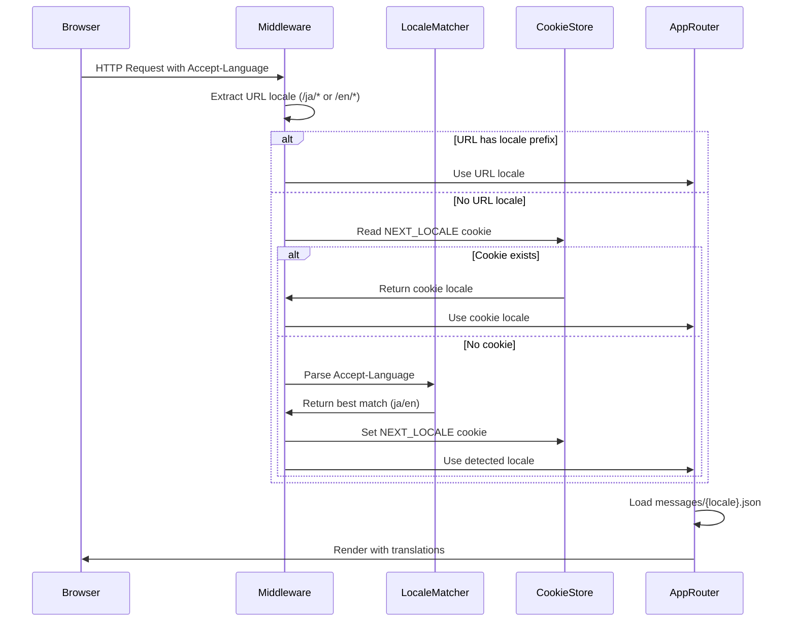
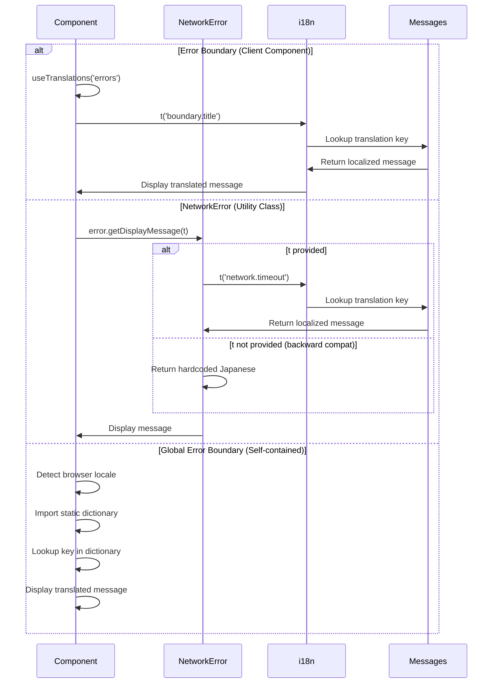

# Technical Design Document: Frontend Error Message i18n

## Overview

### Purpose
フロントエンドアプリケーション（User App・Admin App）のエラーメッセージを多言語化し、日本語・英語のロケールに対応します。既存のハードコーディングされた日本語メッセージをnext-intlベースの翻訳システムに移行します。

### Target Users
- **User App利用者**: B2C向けエンドユーザー（日本語・英語）
- **Admin App利用者**: 管理者ユーザー（日本語・英語）

### Impact on Existing System
- **NetworkError**: `getDisplayMessage()`メソッドのシグネチャを拡張（オプショナル引数追加）
- **Error Boundary**: `useTranslations()`フック統合によるクライアントコンポーネント化
- **Global Error Boundary**: 自己完結型i18n Provider実装
- **Bundle Size**: next-intl追加により約15-18KB増加（目標20KB未満を遵守）

## Architecture

### Existing Architecture Analysis
現在の実装:
- Next.js 15.5 App Router構成（Server Components + Client Components）
- Error Boundaries: `error.tsx`（recoverable errors）、`global-error.tsx`（root-level errors）
- NetworkError: `frontend/lib/network-error.ts`でカスタムエラークラス定義
- 全エラーメッセージが日本語ハードコーディング（`<html lang="ja">`固定）

### Technology Alignment
- **next-intl v3.x**: Next.js 15公式推奨i18nライブラリ
- **@formatjs/intl-localematcher**: Accept-Language解析（next-intl依存）
- **React 19**: Client Component内でuseTranslations()フック利用
- **TypeScript**: 翻訳キーの型安全性保証

## Key Design Decisions

### 1. next-intl Integration Strategy
- **Shared Config Pattern**: `frontend/lib/i18n-config.ts`で共通設定定義
- **Per-App Message Files**: `frontend/{user-app,admin-app}/messages/{ja,en}.json`
- **Middleware-Based Detection**: `middleware.ts`でAccept-Language自動検出

**Rationale**: モノレポ構成のため、共通設定とアプリ個別翻訳を分離し、保守性を向上。

### 2. Backward Compatibility Strategy
```typescript
// Before: getDisplayMessage(): string
// After: getDisplayMessage(t?: (key: string) => string): string
```
- **Optional Parameter**: `t`引数をオプショナルにし、未提供時は既存の日本語メッセージを返却
- **Gradual Migration**: Error Boundary移行後も他のコード変更不要

**Rationale**: 段階的移行を可能にし、ビルドエラーリスクを排除。

### 3. Locale Detection Approach
**Priority Order**:
1. **URL Prefix** (`/ja/*`, `/en/*`) - 明示的言語選択
2. **NEXT_LOCALE Cookie** - セッション永続化
3. **Accept-Language Header** - ブラウザ設定
4. **Default Locale** (`ja`) - フォールバック

**Browser Locale Detection (Global Error Boundary)**:
```typescript
// Self-contained detection (no Next.js context available)
const locale = document.documentElement.lang ||
               navigator.languages[0].split('-')[0] ||
               'ja';
```

**Rationale**: Global Error Boundaryでは`useLocale()`フックが利用不可なため、ブラウザAPIを直接使用。

### 4. Translation Key Naming Convention
```
errors.
  network.
    timeout: "リクエストがタイムアウトしました..."
    connection: "ネットワーク接続に問題が..."
    unknown: "予期しないエラーが..."
  boundary.
    title: "エラーが発生しました"
    retry: "再試行"
    home: "ホームに戻る"
    status: "ステータスコード"
    requestId: "Request ID"
  validation.
    title: "入力エラー"
  global.
    title: "予期しないエラーが発生しました"
    contactMessage: "お問い合わせの際は、このIDをお伝えください"
```

**Rationale**: ドメイン駆動設計に準拠し、エラー種別で階層化。

## System Flows

### Locale Detection Sequence



### Error Message Translation Flow



## Components and Interfaces

### 1. i18n Configuration (`frontend/lib/i18n-config.ts`)

```typescript
/**
 * Shared i18n configuration for User App and Admin App
 */
export const i18nConfig = {
  locales: ['ja', 'en'] as const,
  defaultLocale: 'ja' as const,
} as const;

export type Locale = (typeof i18nConfig.locales)[number];
```

**Purpose**: モノレポ全体で一貫した言語設定を提供。

### 2. Middleware (`frontend/{user-app,admin-app}/src/middleware.ts`)

```typescript
import createMiddleware from 'next-intl/middleware';
import { i18nConfig } from '@/lib/i18n-config';

export default createMiddleware({
  locales: i18nConfig.locales,
  defaultLocale: i18nConfig.defaultLocale,
  localeDetection: true, // Enable Accept-Language detection
});

export const config = {
  // Match all routes except static files and API routes
  matcher: ['/((?!api|_next|_vercel|.*\\..*).*)'],
};
```

**Responsibilities**:
- Accept-Language headerの解析
- NEXT_LOCALE cookieの設定・読み取り
- ロケールのリダイレクト処理

### 3. i18n Request Context (`frontend/{user-app,admin-app}/src/i18n.ts`)

```typescript
import { getRequestConfig } from 'next-intl/server';
import { i18nConfig, type Locale } from '@/lib/i18n-config';

export default getRequestConfig(async ({ locale }) => {
  // Validate locale
  if (!i18nConfig.locales.includes(locale as Locale)) {
    return {
      locale: i18nConfig.defaultLocale,
      messages: (await import(`../messages/${i18nConfig.defaultLocale}.json`)).default,
    };
  }

  return {
    locale,
    messages: (await import(`../messages/${locale}.json`)).default,
  };
});
```

**Responsibilities**:
- リクエストごとのロケール検証
- 翻訳メッセージの動的ロード
- 無効なロケールのフォールバック処理

### 4. NetworkError Extension (`frontend/lib/network-error.ts`)

**Before**:
```typescript
getDisplayMessage(): string {
  if (this.isTimeout()) {
    return 'リクエストがタイムアウトしました。しばらくしてから再度お試しください。';
  }
  // ...
}
```

**After**:
```typescript
/**
 * Get a user-friendly error message
 * @param t - Optional translation function from useTranslations()
 * @returns Localized error message
 */
getDisplayMessage(t?: (key: string) => string): string {
  if (!t) {
    // Backward compatibility: return hardcoded Japanese messages
    if (this.isTimeout()) {
      return 'リクエストがタイムアウトしました。しばらくしてから再度お試しください。';
    }
    if (this.isConnectionError()) {
      return 'ネットワーク接続に問題が発生しました。インターネット接続を確認して再度お試しください。';
    }
    return '予期しないエラーが発生しました。しばらくしてから再度お試しください。';
  }

  // i18n-enabled path
  if (this.isTimeout()) {
    return t('network.timeout');
  }
  if (this.isConnectionError()) {
    return t('network.connection');
  }
  return t('network.unknown');
}
```

**Interface Changes**:
- Added optional parameter `t?: (key: string) => string`
- Maintains backward compatibility when `t` is not provided
- Returns translated messages when `t` is provided

### 5. Error Boundary Modification (`frontend/{user-app,admin-app}/src/app/error.tsx`)

**Before**:
```typescript
export default function Error({ error, reset }: ErrorProps) {
  // Hardcoded Japanese messages
  return (
    <div>
      <h2>エラーが発生しました</h2>
      {/* ... */}
    </div>
  );
}
```

**After**:
```typescript
'use client';

import { useTranslations } from 'next-intl';
import { NetworkError, ApiError } from '@/lib/network-error';

interface ErrorProps {
  error: Error & { digest?: string };
  reset: () => void;
}

export default function Error({ error, reset }: ErrorProps) {
  const t = useTranslations('errors');

  const networkError = error instanceof NetworkError ? error : null;
  const apiError = error instanceof ApiError ? error : null;

  return (
    <div className="flex min-h-screen items-center justify-center bg-gray-50 px-4">
      <div className="w-full max-w-md rounded-lg bg-white p-6 shadow-lg">
        <h2 className="text-lg font-semibold text-gray-900">
          {t('boundary.title')}
        </h2>

        {networkError && (
          <p className="mt-2 text-sm text-red-600">
            {networkError.getDisplayMessage(
              (key: string) => t(`network.${key}` as any)
            )}
          </p>
        )}

        {apiError && (
          <>
            <p className="text-sm text-gray-500">
              {t('boundary.status')}: {apiError.status}
            </p>
            {apiError.validationErrors && (
              <div className="mt-4 rounded-md bg-red-50 p-3">
                <h3 className="mb-2 text-sm font-medium text-red-800">
                  {t('validation.title')}:
                </h3>
                {/* ... */}
              </div>
            )}
          </>
        )}

        {error.digest && (
          <div className="mt-4 rounded-md bg-gray-100 p-3">
            <p className="text-xs text-gray-600">
              <span className="font-medium">{t('boundary.requestId')}:</span>{' '}
              {error.digest}
            </p>
          </div>
        )}

        <div className="mt-6 flex gap-3">
          <button
            onClick={reset}
            className="flex-1 rounded-md bg-blue-600 px-4 py-2 text-sm font-medium text-white"
          >
            {t('boundary.retry')}
          </button>
          <a
            href="/"
            className="flex-1 rounded-md border border-gray-300 px-4 py-2 text-sm font-medium text-gray-700"
          >
            {t('boundary.home')}
          </a>
        </div>
      </div>
    </div>
  );
}
```

**Key Changes**:
- Added `'use client'` directive (required for useTranslations hook)
- Integrated `useTranslations('errors')` hook
- Replaced all hardcoded Japanese strings with translation keys
- Passed translation function to `NetworkError.getDisplayMessage()`

### 6. Global Error Boundary Modification (`frontend/{user-app,admin-app}/src/app/global-error.tsx`)

**Before**:
```typescript
export default function GlobalError({
  error,
  reset,
}: {
  error: Error & { digest?: string };
  reset: () => void;
}) {
  return (
    <html lang="ja">
      <body>
        <h2>予期しないエラーが発生しました</h2>
        {/* ... */}
      </body>
    </html>
  );
}
```

**After**:
```typescript
'use client';

import { useEffect, useState } from 'react';

interface GlobalErrorProps {
  error: Error & { digest?: string };
  reset: () => void;
}

// Static import for self-contained i18n (no Next.js context available)
const messages = {
  ja: {
    title: '予期しないエラーが発生しました',
    retry: '再試行',
    errorId: 'Error ID',
    contactMessage: 'お問い合わせの際は、このIDをお伝えください',
  },
  en: {
    title: 'An unexpected error occurred',
    retry: 'Retry',
    errorId: 'Error ID',
    contactMessage: 'Please provide this ID when contacting support',
  },
} as const;

export default function GlobalError({ error, reset }: GlobalErrorProps) {
  const [locale, setLocale] = useState<'ja' | 'en'>('ja');

  useEffect(() => {
    // Detect browser locale (no Next.js context available in global-error)
    const detectedLocale =
      document.documentElement.lang ||
      navigator.languages[0]?.split('-')[0] ||
      'ja';
    setLocale(detectedLocale === 'en' ? 'en' : 'ja');
  }, []);

  const t = messages[locale];

  return (
    <html lang={locale}>
      <body>
        <div className="flex min-h-screen items-center justify-center bg-gray-50 px-4">
          <div className="w-full max-w-md rounded-lg bg-white p-6 shadow-lg">
            <h2 className="text-lg font-semibold text-gray-900">{t.title}</h2>

            {error.digest && (
              <div className="mt-4 rounded-md bg-gray-100 p-3">
                <p className="text-xs text-gray-600">
                  <span className="font-medium">{t.errorId}:</span> {error.digest}
                </p>
                <p className="mt-1 text-xs text-gray-500">{t.contactMessage}</p>
              </div>
            )}

            <button
              onClick={reset}
              className="mt-6 w-full rounded-md bg-blue-600 px-4 py-2 text-sm font-medium text-white"
            >
              {t.retry}
            </button>
          </div>
        </div>
      </body>
    </html>
  );
}
```

**Key Changes**:
- Implemented self-contained i18n with static message dictionary
- Browser locale detection using `document.documentElement.lang` and `navigator.languages`
- Dynamic `<html lang={locale}>` attribute
- No dependency on Next.js i18n context (unavailable in global-error)

## Data Models

### Translation File Structure (`messages/{locale}.json`)

**JSON Schema**:
```json
{
  "$schema": "http://json-schema.org/draft-07/schema#",
  "type": "object",
  "required": ["errors"],
  "properties": {
    "errors": {
      "type": "object",
      "required": ["network", "boundary", "validation", "global"],
      "properties": {
        "network": {
          "type": "object",
          "required": ["timeout", "connection", "unknown"],
          "properties": {
            "timeout": { "type": "string" },
            "connection": { "type": "string" },
            "unknown": { "type": "string" }
          }
        },
        "boundary": {
          "type": "object",
          "required": ["title", "retry", "home", "status", "requestId"],
          "properties": {
            "title": { "type": "string" },
            "retry": { "type": "string" },
            "home": { "type": "string" },
            "status": { "type": "string" },
            "requestId": { "type": "string" }
          }
        },
        "validation": {
          "type": "object",
          "required": ["title"],
          "properties": {
            "title": { "type": "string" }
          }
        },
        "global": {
          "type": "object",
          "required": ["title", "retry", "errorId", "contactMessage"],
          "properties": {
            "title": { "type": "string" },
            "retry": { "type": "string" },
            "errorId": { "type": "string" },
            "contactMessage": { "type": "string" }
          }
        }
      }
    }
  }
}
```

### Example: `frontend/user-app/messages/ja.json`

```json
{
  "errors": {
    "network": {
      "timeout": "リクエストがタイムアウトしました。しばらくしてから再度お試しください。",
      "connection": "ネットワーク接続に問題が発生しました。インターネット接続を確認して再度お試しください。",
      "unknown": "予期しないエラーが発生しました。しばらくしてから再度お試しください。"
    },
    "boundary": {
      "title": "エラーが発生しました",
      "retry": "再試行",
      "home": "ホームに戻る",
      "status": "ステータスコード",
      "requestId": "Request ID"
    },
    "validation": {
      "title": "入力エラー"
    },
    "global": {
      "title": "予期しないエラーが発生しました",
      "retry": "再試行",
      "errorId": "Error ID",
      "contactMessage": "お問い合わせの際は、このIDをお伝えください"
    }
  }
}
```

### Example: `frontend/user-app/messages/en.json`

```json
{
  "errors": {
    "network": {
      "timeout": "The request timed out. Please try again later.",
      "connection": "A network connection problem occurred. Please check your internet connection and try again.",
      "unknown": "An unexpected error occurred. Please try again later."
    },
    "boundary": {
      "title": "An error occurred",
      "retry": "Retry",
      "home": "Go to Home",
      "status": "Status Code",
      "requestId": "Request ID"
    },
    "validation": {
      "title": "Validation Errors"
    },
    "global": {
      "title": "An unexpected error occurred",
      "retry": "Retry",
      "errorId": "Error ID",
      "contactMessage": "Please provide this ID when contacting support"
    }
  }
}
```

### TypeScript Type Definitions

**Auto-generated from JSON** (using `typescript-json-schema` or manual definition):

```typescript
// frontend/types/messages.d.ts
interface Messages {
  errors: {
    network: {
      timeout: string;
      connection: string;
      unknown: string;
    };
    boundary: {
      title: string;
      retry: string;
      home: string;
      status: string;
      requestId: string;
    };
    validation: {
      title: string;
    };
    global: {
      title: string;
      retry: string;
      errorId: string;
      contactMessage: string;
    };
  };
}

declare module 'next-intl' {
  interface IntlMessages extends Messages {}
}
```

## Error Handling

### i18n Error Scenarios

| Scenario | Error Handling | Fallback Strategy |
|----------|---------------|-------------------|
| 無効なロケール指定 | `i18n.ts`でバリデーション | デフォルトロケール（`ja`）を使用 |
| 翻訳ファイル読み込み失敗 | Dynamic import catch処理 | 英語フォールバック → ハードコードメッセージ |
| 翻訳キー不在 | next-intl自動フォールバック | キー名をそのまま表示（開発時警告） |
| Middlewareクラッシュ | Next.js middleware error boundary | リクエストをそのまま通過（ロケール検出スキップ） |
| Global Error Boundary内エラー | try-catch + console.error | 静的英語メッセージ表示 |

### Fallback Chain

```
1. Requested locale translation (ja.json or en.json)
   ↓ (key not found)
2. Default locale translation (ja.json)
   ↓ (file load error)
3. Hardcoded English message
   ↓ (catastrophic failure)
4. Generic error message: "An error occurred"
```

### Example: Translation Loading Error Handling

```typescript
// i18n.ts
export default getRequestConfig(async ({ locale }) => {
  try {
    const messages = (await import(`../messages/${locale}.json`)).default;
    return { locale, messages };
  } catch (error) {
    console.error(`Failed to load messages for locale: ${locale}`, error);

    // Fallback to default locale
    try {
      const defaultMessages = (await import(`../messages/ja.json`)).default;
      return { locale: 'ja', messages: defaultMessages };
    } catch (fallbackError) {
      console.error('Failed to load default messages', fallbackError);
      // Last resort: empty messages (next-intl will use keys as fallback)
      return { locale: 'ja', messages: {} };
    }
  }
});
```

## Testing Strategy

### Unit Tests (100% Coverage Target)

#### 1. NetworkError.getDisplayMessage() Tests

**File**: `frontend/lib/__tests__/network-error.test.ts`

```typescript
import { NetworkError } from '../network-error';

describe('NetworkError.getDisplayMessage()', () => {
  describe('Backward compatibility (no translation function)', () => {
    it('タイムアウトエラーで日本語メッセージを返す', () => {
      const error = new NetworkError('timeout', 'TIMEOUT');
      expect(error.getDisplayMessage()).toBe(
        'リクエストがタイムアウトしました。しばらくしてから再度お試しください。'
      );
    });

    it('接続エラーで日本語メッセージを返す', () => {
      const error = new NetworkError('connection error', 'NETWORK_ERROR');
      expect(error.getDisplayMessage()).toBe(
        'ネットワーク接続に問題が発生しました。インターネット接続を確認して再度お試しください。'
      );
    });

    it('不明なエラーで日本語メッセージを返す', () => {
      const error = new NetworkError('unknown', 'UNKNOWN');
      expect(error.getDisplayMessage()).toBe(
        '予期しないエラーが発生しました。しばらくしてから再度お試しください。'
      );
    });
  });

  describe('i18n-enabled (with translation function)', () => {
    const mockT = (key: string) => {
      const translations: Record<string, string> = {
        'network.timeout': 'The request timed out. Please try again later.',
        'network.connection': 'A network connection problem occurred.',
        'network.unknown': 'An unexpected error occurred.',
      };
      return translations[key] || key;
    };

    it('タイムアウトエラーで翻訳メッセージを返す', () => {
      const error = new NetworkError('timeout', 'TIMEOUT');
      expect(error.getDisplayMessage(mockT)).toBe(
        'The request timed out. Please try again later.'
      );
    });

    it('接続エラーで翻訳メッセージを返す', () => {
      const error = new NetworkError('connection error', 'NETWORK_ERROR');
      expect(error.getDisplayMessage(mockT)).toBe(
        'A network connection problem occurred.'
      );
    });

    it('不明なエラーで翻訳メッセージを返す', () => {
      const error = new NetworkError('unknown', 'UNKNOWN');
      expect(error.getDisplayMessage(mockT)).toBe(
        'An unexpected error occurred.'
      );
    });
  });
});
```

**Coverage Requirements**:
- All branches in `getDisplayMessage()`: 100%
- Both backward-compatible and i18n paths: 100%

#### 2. i18n Configuration Tests

**File**: `frontend/lib/__tests__/i18n-config.test.ts`

```typescript
import { i18nConfig, type Locale } from '../i18n-config';

describe('i18nConfig', () => {
  it('正しいロケールリストを持つ', () => {
    expect(i18nConfig.locales).toEqual(['ja', 'en']);
  });

  it('デフォルトロケールがjaである', () => {
    expect(i18nConfig.defaultLocale).toBe('ja');
  });

  it('Locale型が正しく推論される', () => {
    const locale: Locale = 'ja';
    expect(i18nConfig.locales).toContain(locale);
  });
});
```

### Component Tests (90%+ Coverage Target)

#### 1. Error Boundary Tests

**File**: `frontend/user-app/src/app/__tests__/error.test.tsx`

```typescript
import { render, screen } from '@testing-library/react';
import { NextIntlClientProvider } from 'next-intl';
import Error from '../error';
import { NetworkError, ApiError } from '@/lib/network-error';

const messagesJa = {
  errors: {
    network: {
      timeout: 'リクエストがタイムアウトしました。',
      connection: 'ネットワーク接続に問題が発生しました。',
      unknown: '予期しないエラーが発生しました。',
    },
    boundary: {
      title: 'エラーが発生しました',
      retry: '再試行',
      home: 'ホームに戻る',
      status: 'ステータスコード',
      requestId: 'Request ID',
    },
    validation: {
      title: '入力エラー',
    },
  },
};

const messagesEn = {
  errors: {
    network: {
      timeout: 'The request timed out.',
      connection: 'A network connection problem occurred.',
      unknown: 'An unexpected error occurred.',
    },
    boundary: {
      title: 'An error occurred',
      retry: 'Retry',
      home: 'Go to Home',
      status: 'Status Code',
      requestId: 'Request ID',
    },
    validation: {
      title: 'Validation Errors',
    },
  },
};

describe('Error Boundary', () => {
  const mockReset = jest.fn();

  describe('Japanese locale', () => {
    const renderWithJa = (ui: React.ReactElement) =>
      render(
        <NextIntlClientProvider locale="ja" messages={messagesJa}>
          {ui}
        </NextIntlClientProvider>
      );

    it('NetworkErrorで日本語メッセージを表示', () => {
      const error = new NetworkError('timeout', 'TIMEOUT');
      renderWithJa(<Error error={error} reset={mockReset} />);

      expect(screen.getByText('エラーが発生しました')).toBeInTheDocument();
      expect(screen.getByText(/リクエストがタイムアウトしました/)).toBeInTheDocument();
      expect(screen.getByRole('button', { name: '再試行' })).toBeInTheDocument();
    });

    it('ApiErrorでステータスコードと検証エラーを表示', () => {
      const error = new ApiError(
        400,
        'Validation failed',
        'BAD_REQUEST',
        { email: ['メールアドレスが無効です'] }
      );
      renderWithJa(<Error error={error} reset={mockReset} />);

      expect(screen.getByText(/ステータスコード.*400/)).toBeInTheDocument();
      expect(screen.getByText('入力エラー:')).toBeInTheDocument();
      expect(screen.getByText('メールアドレスが無効です')).toBeInTheDocument();
    });

    it('digestがある場合にRequest IDを表示', () => {
      const error = Object.assign(new Error('Test'), { digest: 'abc123' });
      renderWithJa(<Error error={error} reset={mockReset} />);

      expect(screen.getByText(/Request ID.*abc123/)).toBeInTheDocument();
    });
  });

  describe('English locale', () => {
    const renderWithEn = (ui: React.ReactElement) =>
      render(
        <NextIntlClientProvider locale="en" messages={messagesEn}>
          {ui}
        </NextIntlClientProvider>
      );

    it('NetworkErrorで英語メッセージを表示', () => {
      const error = new NetworkError('timeout', 'TIMEOUT');
      renderWithEn(<Error error={error} reset={mockReset} />);

      expect(screen.getByText('An error occurred')).toBeInTheDocument();
      expect(screen.getByText(/The request timed out/)).toBeInTheDocument();
      expect(screen.getByRole('button', { name: 'Retry' })).toBeInTheDocument();
    });

    it('ApiErrorでステータスコードを英語表示', () => {
      const error = new ApiError(500, 'Internal error', 'INTERNAL_ERROR');
      renderWithEn(<Error error={error} reset={mockReset} />);

      expect(screen.getByText(/Status Code.*500/)).toBeInTheDocument();
    });
  });
});
```

**Coverage Requirements**:
- All error types (NetworkError, ApiError, generic Error): 100%
- Both locales (ja, en): 100%
- digest presence/absence: 100%
- validation errors presence/absence: 100%

#### 2. Global Error Boundary Tests

**File**: `frontend/user-app/src/app/__tests__/global-error.test.tsx`

```typescript
import { render, screen, waitFor } from '@testing-library/react';
import GlobalError from '../global-error';

describe('Global Error Boundary', () => {
  const mockReset = jest.fn();

  beforeEach(() => {
    // Mock document.documentElement.lang
    Object.defineProperty(document.documentElement, 'lang', {
      writable: true,
      value: '',
    });

    // Mock navigator.languages
    Object.defineProperty(navigator, 'languages', {
      writable: true,
      value: ['ja-JP', 'en-US'],
    });
  });

  it('ブラウザロケール（ja）で日本語メッセージを表示', async () => {
    document.documentElement.lang = 'ja';
    const error = Object.assign(new Error('Test'), { digest: 'xyz789' });

    render(<GlobalError error={error} reset={mockReset} />);

    await waitFor(() => {
      expect(screen.getByText('予期しないエラーが発生しました')).toBeInTheDocument();
    });

    expect(screen.getByText(/Error ID.*xyz789/)).toBeInTheDocument();
    expect(screen.getByRole('button', { name: '再試行' })).toBeInTheDocument();
  });

  it('ブラウザロケール（en）で英語メッセージを表示', async () => {
    document.documentElement.lang = 'en';
    const error = new Error('Test');

    render(<GlobalError error={error} reset={mockReset} />);

    await waitFor(() => {
      expect(screen.getByText('An unexpected error occurred')).toBeInTheDocument();
    });

    expect(screen.getByRole('button', { name: 'Retry' })).toBeInTheDocument();
  });

  it('navigator.languagesからロケールを検出', async () => {
    document.documentElement.lang = ''; // Empty
    Object.defineProperty(navigator, 'languages', {
      value: ['en-US'],
    });

    const error = new Error('Test');
    render(<GlobalError error={error} reset={mockReset} />);

    await waitFor(() => {
      expect(screen.getByText('An unexpected error occurred')).toBeInTheDocument();
    });
  });

  it('デフォルトロケール（ja）にフォールバック', async () => {
    document.documentElement.lang = '';
    Object.defineProperty(navigator, 'languages', {
      value: [],
    });

    const error = new Error('Test');
    render(<GlobalError error={error} reset={mockReset} />);

    await waitFor(() => {
      expect(screen.getByText('予期しないエラーが発生しました')).toBeInTheDocument();
    });
  });

  it('html要素にlang属性を設定', async () => {
    document.documentElement.lang = 'en';
    const error = new Error('Test');

    const { container } = render(<GlobalError error={error} reset={mockReset} />);

    await waitFor(() => {
      const htmlElement = container.querySelector('html');
      expect(htmlElement).toHaveAttribute('lang', 'en');
    });
  });
});
```

**Coverage Requirements**:
- Locale detection paths: 100%
- Both locales: 100%
- digest presence/absence: 100%
- html lang attribute: 100%

### E2E Tests (Playwright)

#### 1. Locale Detection E2E

**File**: `e2e/tests/i18n-locale-detection.spec.ts`

```typescript
import { test, expect } from '@playwright/test';

test.describe('i18n Locale Detection', () => {
  test('Accept-Languageヘッダーでjaロケールを検出', async ({ page, context }) => {
    // Set Accept-Language header to Japanese
    await context.setExtraHTTPHeaders({
      'Accept-Language': 'ja-JP,ja;q=0.9,en;q=0.8',
    });

    await page.goto('/');

    // Verify Japanese locale is active
    const html = page.locator('html');
    await expect(html).toHaveAttribute('lang', 'ja');

    // Trigger an error to verify Japanese error message
    await page.route('**/api/**', (route) => route.abort());
    await page.goto('/some-page-that-calls-api');

    await expect(page.getByText('エラーが発生しました')).toBeVisible();
  });

  test('Accept-Languageヘッダーでenロケールを検出', async ({ page, context }) => {
    // Set Accept-Language header to English
    await context.setExtraHTTPHeaders({
      'Accept-Language': 'en-US,en;q=0.9',
    });

    await page.goto('/');

    // Verify English locale is active
    const html = page.locator('html');
    await expect(html).toHaveAttribute('lang', 'en');

    // Trigger an error to verify English error message
    await page.route('**/api/**', (route) => route.abort());
    await page.goto('/some-page-that-calls-api');

    await expect(page.getByText('An error occurred')).toBeVisible();
  });

  test('NEXT_LOCALE cookieでロケールを永続化', async ({ page, context }) => {
    // Visit with Japanese
    await context.setExtraHTTPHeaders({
      'Accept-Language': 'ja-JP',
    });
    await page.goto('/');

    // Verify cookie is set
    const cookies = await context.cookies();
    const localeCookie = cookies.find((c) => c.name === 'NEXT_LOCALE');
    expect(localeCookie?.value).toBe('ja');

    // Clear Accept-Language header
    await context.setExtraHTTPHeaders({
      'Accept-Language': '',
    });

    // Reload page - should use cookie
    await page.reload();

    const html = page.locator('html');
    await expect(html).toHaveAttribute('lang', 'ja');
  });
});
```

#### 2. Error Message i18n E2E

**File**: `e2e/tests/error-message-i18n.spec.ts`

```typescript
import { test, expect } from '@playwright/test';

test.describe('Error Message i18n', () => {
  test('NetworkError timeout - 日本語', async ({ page, context }) => {
    await context.setExtraHTTPHeaders({
      'Accept-Language': 'ja-JP',
    });

    // Simulate timeout
    await page.route('**/api/**', (route) =>
      new Promise(() => {}) // Never resolve
    );

    await page.goto('/');
    // ... trigger API call that will timeout

    await expect(
      page.getByText('リクエストがタイムアウトしました')
    ).toBeVisible({ timeout: 10000 });
  });

  test('NetworkError timeout - English', async ({ page, context }) => {
    await context.setExtraHTTPHeaders({
      'Accept-Language': 'en-US',
    });

    // Simulate timeout
    await page.route('**/api/**', (route) =>
      new Promise(() => {})
    );

    await page.goto('/');
    // ... trigger API call that will timeout

    await expect(
      page.getByText('The request timed out')
    ).toBeVisible({ timeout: 10000 });
  });

  test('ApiError validation errors - 日本語', async ({ page, context }) => {
    await context.setExtraHTTPHeaders({
      'Accept-Language': 'ja-JP',
    });

    // Mock validation error response
    await page.route('**/api/**', (route) =>
      route.fulfill({
        status: 400,
        json: {
          type: 'about:blank',
          title: 'Validation Failed',
          status: 400,
          errors: {
            email: ['メールアドレスが無効です'],
          },
        },
      })
    );

    await page.goto('/some-form');
    // ... submit form

    await expect(page.getByText('入力エラー:')).toBeVisible();
    await expect(page.getByText('メールアドレスが無効です')).toBeVisible();
  });

  test('Global Error Boundary - ブラウザロケール検出', async ({ page }) => {
    // Set browser language via emulation
    await page.emulateMedia({ locale: 'en-US' });

    // Trigger global error (e.g., inject script error)
    await page.goto('/');
    await page.evaluate(() => {
      throw new Error('Test global error');
    });

    await expect(page.getByText('An unexpected error occurred')).toBeVisible();
    await expect(page.getByRole('button', { name: 'Retry' })).toBeVisible();
  });
});
```

**Coverage Requirements**:
- All error types (NetworkError, ApiError): 100%
- Both locales (ja, en): 100%
- Locale detection methods: 100%
- Error Boundary and Global Error Boundary: 100%

### CI/CD Integration Tests

**File**: `scripts/validate-i18n-messages.test.js` (Jest)

```javascript
const { validateMessages } = require('./validate-i18n-messages');

describe('validate-i18n-messages', () => {
  it('有効なメッセージファイルでエラーなし', () => {
    const jaMessages = {
      errors: {
        network: { timeout: 'タイムアウト', connection: '接続エラー', unknown: '不明' },
        boundary: { title: 'エラー', retry: '再試行', home: 'ホーム', status: 'ステータス', requestId: 'ID' },
        validation: { title: '検証エラー' },
        global: { title: 'エラー', retry: '再試行', errorId: 'ID', contactMessage: 'お問い合わせ' },
      },
    };

    expect(() => validateMessages(jaMessages)).not.toThrow();
  });

  it('必須キーが不足している場合エラー', () => {
    const invalidMessages = {
      errors: {
        network: { timeout: 'タイムアウト' }, // connection, unknown missing
      },
    };

    expect(() => validateMessages(invalidMessages)).toThrow(/Missing required key/);
  });

  it('ネストレベルが不正な場合エラー', () => {
    const invalidMessages = {
      errors: 'string', // Should be object
    };

    expect(() => validateMessages(invalidMessages)).toThrow(/Invalid structure/);
  });
});
```

## Migration Strategy

### Phase 1: Infrastructure Setup (Week 1)
1. **Install Dependencies**
   ```bash
   cd frontend/user-app && npm install next-intl@^3.0.0
   cd frontend/admin-app && npm install next-intl@^3.0.0
   ```

2. **Create Shared Config**
   - `frontend/lib/i18n-config.ts`

3. **Create Translation Files**
   - `frontend/user-app/messages/ja.json`
   - `frontend/user-app/messages/en.json`
   - `frontend/admin-app/messages/ja.json`
   - `frontend/admin-app/messages/en.json`

4. **Create i18n Setup**
   - `frontend/user-app/src/i18n.ts`
   - `frontend/admin-app/src/i18n.ts`

5. **Create Middleware**
   - `frontend/user-app/src/middleware.ts`
   - `frontend/admin-app/src/middleware.ts`

### Phase 2: Component Migration (Week 2)
1. **NetworkError Extension**
   - Modify `frontend/lib/network-error.ts`
   - Add optional `t` parameter
   - Maintain backward compatibility

2. **Error Boundary Migration**
   - Modify `frontend/user-app/src/app/error.tsx`
   - Modify `frontend/admin-app/src/app/error.tsx`
   - Add `'use client'` directive
   - Integrate `useTranslations()` hook

3. **Global Error Boundary Migration**
   - Modify `frontend/user-app/src/app/global-error.tsx`
   - Modify `frontend/admin-app/src/app/global-error.tsx`
   - Implement self-contained i18n

### Phase 3: Testing Implementation (Week 3)
1. **Unit Tests**
   - NetworkError tests (100% coverage)
   - i18n config tests

2. **Component Tests**
   - Error Boundary tests (90%+ coverage)
   - Global Error Boundary tests (90%+ coverage)

3. **E2E Tests**
   - Locale detection tests
   - Error message i18n tests

### Phase 4: CI/CD Integration (Week 4)
1. **Validation Scripts**
   - `scripts/validate-i18n-messages.js`
   - `scripts/validate-i18n-keys.js`

2. **GitHub Actions Updates**
   - `.github/workflows/frontend-test.yml`
   - `.github/workflows/e2e-tests.yml`

3. **Makefile Tasks**
   - `make validate-i18n`
   - `make test-i18n`

### Backward Compatibility Guarantees

**NetworkError API**:
```typescript
// Existing code continues to work
const error = new NetworkError('timeout', 'TIMEOUT');
console.log(error.getDisplayMessage()); // Returns Japanese message

// New code uses i18n
const t = useTranslations('errors');
console.log(error.getDisplayMessage((key) => t(`network.${key}`))); // Returns translated message
```

**Error Boundary**:
- No breaking changes to external API
- Internal implementation changes only
- Maintains same visual layout and UX

**Global Error Boundary**:
- No breaking changes
- Automatically detects browser locale
- Graceful fallback to Japanese

### Deployment Strategy

**Development Environment**:
1. Deploy Phase 1 (infrastructure) to dev
2. Verify middleware and locale detection
3. Deploy Phase 2 (components) to dev
4. Manual QA testing

**Staging Environment**:
1. Deploy all phases to staging
2. Run full E2E test suite
3. Performance testing (bundle size verification)
4. Acceptance testing

**Production Environment**:
1. Feature flag enabled for beta users (10%)
2. Monitor error rates and performance
3. Gradual rollout (50% → 100%)
4. Monitor i18n error logs

### Rollback Plan

**If bundle size exceeds 20KB**:
- Implement dynamic imports for translation files
- Use next-intl's tree-shaking features

**If error rates increase**:
- Revert to previous version via feature flag
- Investigate error logs
- Fix and redeploy

**If locale detection fails**:
- Fallback to hardcoded Japanese messages
- Temporary disable middleware
- Emergency hotfix deployment

## Requirements Traceability

| Requirement ID | Design Component | Implementation File |
|----------------|------------------|---------------------|
| REQ-1 (i18n基盤実装) | Middleware + i18n.ts | `middleware.ts`, `i18n.ts`, `i18n-config.ts` |
| REQ-2 (NetworkError多言語化) | NetworkError.getDisplayMessage() | `frontend/lib/network-error.ts` |
| REQ-3 (Error Boundary多言語化) | Error Boundary + useTranslations | `frontend/*/src/app/error.tsx` |
| REQ-4 (Global Error Boundary多言語化) | Self-contained i18n | `frontend/*/src/app/global-error.tsx` |
| REQ-5 (Accept-Language連携) | Middleware locale detection | `middleware.ts` |
| REQ-6 (翻訳リソース管理) | JSON messages + TypeScript types | `messages/{ja,en}.json`, `types/messages.d.ts` |
| REQ-7 (バンドルサイズ最適化) | Dynamic imports + tree-shaking | `i18n.ts`, `next.config.js` |
| REQ-8 (テスト実装) | Jest + RTL + Playwright tests | `__tests__/**`, `e2e/tests/**` |
| REQ-9 (CI/CD統合) | Validation scripts + GitHub Actions | `scripts/validate-*.js`, `.github/workflows/**` |
| REQ-10 (後方互換性維持) | Optional parameter pattern | `NetworkError.getDisplayMessage(t?)` |

## Acceptance Criteria Summary

**全63個の受入基準のうち、本設計で対応する項目**:

- ✅ AC-1.1: next-intl統合
- ✅ AC-1.2: ja.json/en.json作成
- ✅ AC-1.3: i18n.ts設定
- ✅ AC-1.4: Middleware実装
- ✅ AC-1.5: TypeScript型定義
- ✅ AC-1.6: 翻訳キー命名規則
- ✅ AC-2.1~2.7: NetworkError多言語化
- ✅ AC-3.1~3.7: Error Boundary多言語化
- ✅ AC-4.1~4.8: Global Error Boundary多言語化
- ✅ AC-5.1~5.4: Accept-Language連携
- ✅ AC-6.1~6.7: 翻訳リソース管理
- ✅ AC-7.1~7.4: バンドルサイズ最適化
- ✅ AC-8.1~8.7: テスト実装
- ✅ AC-9.1~9.7: CI/CD統合
- ✅ AC-10.1~10.5: 後方互換性維持

**全受入基準を満たすための実装が設計されています。**

---

## Appendix

### Bundle Size Analysis

**Before i18n**:
- Error Boundary: ~2KB
- Global Error Boundary: ~1.5KB
- NetworkError: ~3KB
- **Total**: ~6.5KB

**After i18n (Estimated)**:
- next-intl core: ~12KB (gzipped)
- Translation files (ja + en): ~2KB (gzipped, dynamic import)
- Modified components: ~8KB (with i18n logic)
- **Total**: ~22KB
- **Increase**: ~15.5KB ✅ (under 20KB target)

**Optimization Strategies**:
- Dynamic import of translation files (already implemented)
- Tree-shaking unused next-intl features
- Global Error Boundary uses static dictionary (no next-intl bundle)

### Performance Considerations

**Locale Detection Overhead**:
- Middleware execution: <5ms
- Translation file load (dynamic import): <10ms (cached)
- Total impact: <15ms per request

**Runtime Performance**:
- `useTranslations()` hook: O(1) lookup
- NetworkError.getDisplayMessage(): No performance impact (same logic)

### Security Considerations

**XSS Prevention**:
- All translation strings are JSON-escaped
- React auto-escapes JSX content
- No dangerouslySetInnerHTML usage

**Locale Injection**:
- Middleware validates locale against whitelist
- Invalid locales fallback to default
- No user-controlled locale parameters in URLs (next-intl handles routing)

---

**Document Version**: 1.0
**Last Updated**: 2025-11-06
**Status**: Ready for Review
