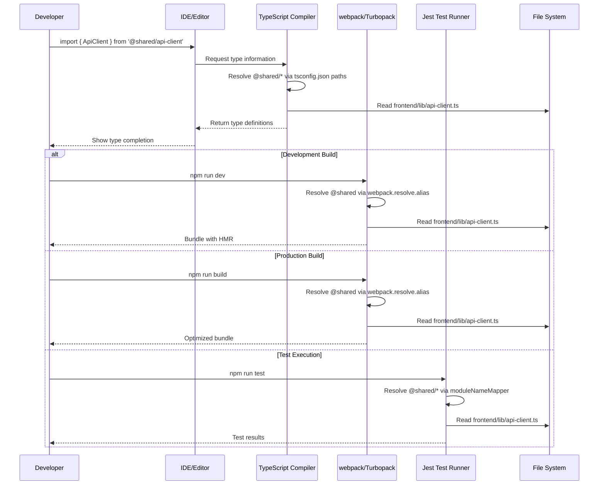
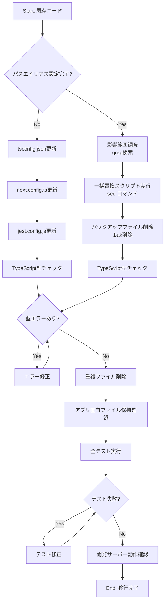
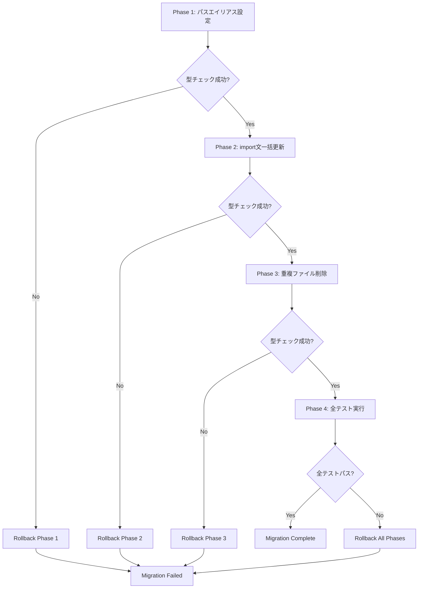

# Technical Design Document

## Overview

本機能は、フロントエンドモノレポ構成における共通ライブラリ（`frontend/lib/`）のコード重複問題を解消するための技術設計です。現在、User AppとAdmin Appが同一のコード（api-client.ts、api-error.ts、network-error.ts）をそれぞれ`src/lib/`ディレクトリにコピー保持しており、合計約560行の重複コードが存在します。

本設計では、TypeScriptパスエイリアス（`@shared/*`）とNext.js webpack alias、Jest moduleNameMapperの3層設定を確立し、両アプリケーションから共通ライブラリを直接参照できる仕組みを実装します。これにより、重複コードを削除し、メンテナンス性の向上とバージョン整合性の保証を実現します。

**技術的価値**:
- モジュール解決の一元化によるビルドシステムの整合性向上
- TypeScript型安全性の維持（IDE補完・型チェックの継続的動作）
- テスト環境とビルド環境の設定統一による開発者体験の向上
- 将来的な共通ライブラリ拡張の基盤確立（パスエイリアス方式の実証）

### Goals

- TypeScriptパスエイリアス（`@shared/*`）による共通ライブラリ参照の確立
- Next.js webpack aliasとJest moduleNameMapperの設定統一
- User App/Admin Appからの重複ファイル削除（6ファイル、約560行）
- 全テスト（Jest/E2E）とビルドの正常動作維持（カバレッジ94.73%以上維持）
- 開発サーバーとホットリロード機能の継続的動作保証

### Non-Goals

- ワークスペースパッケージ化（`packages/frontend-lib`の作成）は今回対象外
  - 理由: パスエイリアス方式で十分にシンプルかつ効果的
  - 将来検討: より複雑な共通ライブラリ（npmパッケージ化、バージョニング管理）が必要になった場合
- backend/laravel-apiへの影響なし（フロントエンド専用の変更）
- E2Eテストコードの修正（パスエイリアス透過的に動作）
- 共通ライブラリファイルの内部実装変更なし（参照方法のみ変更）

---

## Architecture

### Existing Architecture Analysis

本機能は、既存のフロントエンドモノレポ構成に対するパスエイリアス導入であり、既存アーキテクチャパターンを維持しながら拡張します。

**現在のアーキテクチャパターン**:
- **モノレポ構成**: npm workspacesによる`frontend/user-app`と`frontend/admin-app`の独立管理
- **Next.js 15.5 App Router**: Server Components/Client Componentsの混在アーキテクチャ
- **TypeScript strict mode**: 厳格な型チェック（`strict: true`、`moduleResolution: "bundler"`）
- **既存パスエイリアス**: `@/*`で`./src/*`を解決（アプリ内部のみ）

**既存ドメイン境界の尊重**:
- User AppとAdmin Appは独立したドメイン境界を持つ（共通UIライブラリではなく、共通ユーティリティライブラリのみ共有）
- アプリ固有のファイル（`api.ts`, `env.ts`）は各アプリのドメイン知識を保持するため削除対象外
- 共通ライブラリ（`frontend/lib/`）はドメイン非依存のユーティリティとして位置付け

**統合ポイントの維持**:
- Next.jsビルドシステム（webpack、Turbopack）との統合
- Jest/Playwrightテスト環境との統合
- ESLint/Prettier品質管理システムとの統合

### High-Level Architecture

```mermaid
graph TB
    subgraph "Frontend Monorepo"
        subgraph "User App (port: 13001)"
            UA_SRC[src/]
            UA_LIB[src/lib/api.ts, env.ts]
            UA_CONFIG[tsconfig.json<br/>next.config.ts<br/>jest.config.js]
        end

        subgraph "Admin App (port: 13002)"
            AA_SRC[src/]
            AA_LIB[src/lib/api.ts, env.ts]
            AA_CONFIG[tsconfig.json<br/>next.config.ts<br/>jest.config.js]
        end

        subgraph "Shared Library"
            SHARED_LIB[frontend/lib/<br/>api-client.ts<br/>api-error.ts<br/>network-error.ts<br/>global-error-messages.ts]
        end
    end

    UA_SRC -->|@shared/*| SHARED_LIB
    AA_SRC -->|@shared/*| SHARED_LIB
    UA_CONFIG -.->|Path Alias Resolution| SHARED_LIB
    AA_CONFIG -.->|Path Alias Resolution| SHARED_LIB

    UA_LIB -.->|Preserved| UA_SRC
    AA_LIB -.->|Preserved| AA_SRC
```

**アーキテクチャ統合**:
- **既存パターン保持**: Next.js App Router、TypeScript strict mode、モノレポワークスペース構成を維持
- **新規コンポーネント追加**: パスエイリアス設定3層（TypeScript、webpack、Jest）のみ追加
- **技術スタック整合性**: 既存のNext.js 15.5、TypeScript 5.x、Jest 29との完全互換性
- **Steering準拠**: `.kiro/steering/structure.md`のモノレポ統一設定原則に従い、パスエイリアス方式を採用

---

## Architecture

### Technology Alignment

本機能は、既存の技術スタックに完全に整合し、新規依存関係の追加なしでパスエイリアス設定のみを導入します。

**既存技術スタックとの整合性**:

| 技術層 | 既存技術 | 変更内容 | 整合性 |
|--------|---------|---------|--------|
| **TypeScript** | v5.x、strict mode、`moduleResolution: "bundler"` | `paths`設定に`@shared/*`追加 | TypeScript標準機能、互換性100% |
| **Next.js** | 15.5、App Router、Turbopack | webpack alias設定追加（`resolve.alias`） | Next.js標準設定、既存`@/*`と並存 |
| **Jest** | 29.7.0、jsdom環境 | `moduleNameMapper`に`@shared/*`追加 | Jest標準設定、既存マッパーと並存 |
| **ビルドツール** | webpack、Turbopack | 設定変更のみ（新規パッケージなし） | 既存ビルドプロセス維持 |

**新規導入ライブラリ**: なし（既存パッケージの設定変更のみ）

**既存パターンからの逸脱**: なし

**パスエイリアス設定の正当性**:
- **TypeScript公式サポート**: `compilerOptions.paths`は標準機能（[TypeScript Path Mapping](https://www.typescriptlang.org/docs/handbook/module-resolution.html#path-mapping)）
- **Next.js推奨アプローチ**: Next.js公式ドキュメントで推奨される方法（[Absolute Imports and Module Aliases](https://nextjs.org/docs/app/building-your-application/configuring/absolute-imports-and-module-aliases)）
- **Jest標準設定**: `moduleNameMapper`はJest標準のパス解決機能

### Key Design Decisions

#### Decision 1: TypeScriptパスエイリアス vs npm workspaceパッケージ化

**Context**:
共通ライブラリを複数アプリケーションから参照する方法として、パスエイリアス方式とワークスペースパッケージ化の2つのアプローチが考えられます。

**Alternatives**:
1. **TypeScriptパスエイリアス（`@shared/*`）**: tsconfig.jsonのpaths設定による相対パス解決
2. **npm workspaceパッケージ化**: `packages/frontend-lib`を作成し、`package.json`でバージョン管理
3. **シンボリックリンク**: `ln -s`による物理的なファイルリンク

**Selected Approach**:
TypeScriptパスエイリアス（`@shared/*`）を採用します。

**Rationale**:
- **シンプル性**: 設定ファイル3箇所（tsconfig.json、next.config.ts、jest.config.js）の変更のみで実現可能
- **ビルド効率**: モノレポ内部での参照のため、別パッケージ化による追加ビルドステップ不要
- **開発体験**: IDEの型補完とインポート解決が即座に動作（webpack Dev Serverのホットリロード維持）
- **保守性**: パスエイリアス設定は業界標準パターンで、チームメンバーの学習コスト最小

**Trade-offs**:
- **得られるもの**: シンプルな設定、高速なビルド、即座のホットリロード、標準的なパターン
- **失うもの**: npmパッケージとしての独立したバージョニング、外部公開の可能性

**将来的な拡張パス**:
共通ライブラリが複雑化し、独立したバージョニングや外部公開が必要になった場合、パスエイリアス方式からワークスペースパッケージ化への移行は容易です（設定変更のみ、コード実装は不変）。

#### Decision 2: 3層パスエイリアス設定（TypeScript + webpack + Jest）

**Context**:
Next.jsはTypeScriptパスエイリアスを自動認識しますが、webpack aliasとJest moduleNameMapperの明示的設定が必要かどうかを判断する必要があります。

**Alternatives**:
1. **TypeScript設定のみ**: tsconfig.jsonのpaths設定のみに依存
2. **TypeScript + webpack**: Next.js webpack aliasを明示的設定
3. **3層設定（TypeScript + webpack + Jest）**: すべての環境で明示的設定

**Selected Approach**:
3層設定（TypeScript + webpack + Jest）を採用します。

**Rationale**:
- **安定性**: Next.jsはtsconfig.jsonを認識するが、webpack alias明示により確実性向上
- **テスト環境対応**: Jestはtsconfig.jsonパスエイリアスを自動認識しないため、moduleNameMapper必須
- **一貫性**: TypeScript、ビルド、テストの3環境で統一的なパス解決メカニズム
- **デバッグ容易性**: 各環境で明示的設定により、パス解決問題の原因特定が容易

**Trade-offs**:
- **得られるもの**: 高い安定性、一貫性、デバッグ容易性、テスト環境完全対応
- **失うもの**: 設定ファイルの若干の冗長性（3箇所設定）

#### Decision 3: 段階的import文更新 vs 一括置換

**Context**:
既存の`from '@/lib/*'`インポートを`from '@shared/*'`に更新する方法として、手動の段階的更新と自動スクリプトによる一括置換が考えられます。

**Alternatives**:
1. **手動段階的更新**: ファイルごとに手動でインポートパスを変更
2. **一括置換スクリプト**: `sed`コマンドによる自動一括置換
3. **ESLintルール**: カスタムESLintルールによる警告と自動修正

**Selected Approach**:
一括置換スクリプト（`sed`コマンド）を採用します。

**Rationale**:
- **効率性**: 全ファイル一括更新により、手動作業時間を大幅削減（約30分→5分）
- **一貫性**: 自動置換により人的エラー（置換漏れ）を防止
- **検証可能性**: TypeScript型チェック（`npm run type-check`）により即座に置換ミス検出
- **ロールバック容易性**: Gitによる変更履歴管理で問題発生時の巻き戻しが容易

**Trade-offs**:
- **得られるもの**: 高速な移行、一貫性、検証可能性、ロールバック容易性
- **失うもの**: 段階的移行による部分的動作確認機会（型チェックとテストで代替）

---

## System Flows

### Path Alias Resolution Flow



**フロー説明**:
1. **IDE型補完**: TypeScriptコンパイラがtsconfig.json pathsを解決し、型情報を提供
2. **開発ビルド**: webpackがalias設定を使用し、HMR（Hot Module Replacement）で即座反映
3. **本番ビルド**: webpackが最適化されたバンドルを生成（パス解決は開発時と同一）
4. **テスト実行**: JestがmoduleNameMapperで共通ライブラリを解決し、テスト実行

### Import Migration Flow



---

## Requirements Traceability

| Requirement | Requirement Summary | Components | Interfaces | Flows |
|-------------|---------------------|------------|------------|-------|
| 1.1-1.4 | TypeScriptパスエイリアス設定 | tsconfig.json | `paths: { "@shared/*": ["../lib/*"] }` | Path Alias Resolution Flow |
| 2.1-2.4 | Next.js webpack alias設定 | next.config.ts | `webpack.resolve.alias: { '@shared': path.resolve(...) }` | Path Alias Resolution Flow |
| 3.1-3.4 | Jest moduleNameMapper設定 | jest.config.js | `moduleNameMapper: { '^@shared/(.*)$': '<rootDir>/../lib/$1' }` | Path Alias Resolution Flow |
| 4.1-4.5 | import文一括更新 | sed置換スクリプト | `@/lib/* → @shared/*` | Import Migration Flow |
| 5.1-5.4 | 重複ファイル削除 | user-app/admin-app src/lib/ | 6ファイル削除 | Import Migration Flow |
| 6.1-6.6 | テスト実行とビルド確認 | Jest, Playwright, TypeScript | `npm run test`, `npm run build` | - |
| 7.1-7.6 | 開発サーバー動作確認 | Next.js Dev Server | `npm run dev` | - |
| 8.1-8.3 | ドキュメント更新 | CHANGELOG.md | Breaking Changes記載なし | - |

---

## Components and Interfaces

### Configuration Components

#### tsconfig.json (User App / Admin App)

**Responsibility & Boundaries**:
- **Primary Responsibility**: TypeScriptコンパイラのパス解決設定を管理
- **Domain Boundary**: 各アプリケーションのTypeScript設定ドメイン
- **Data Ownership**: `paths`設定によるモジュール解決ルール
- **Transaction Boundary**: 型チェック時の単一設定ソース

**Dependencies**:
- **Inbound**: TypeScriptコンパイラ、IDE TypeScript Language Server
- **Outbound**: `frontend/lib/`共通ライブラリファイルシステム
- **External**: TypeScript v5.x

**Contract Definition**:

```typescript
// tsconfig.json 設定インターフェース
interface TsConfigPaths {
  compilerOptions: {
    baseUrl: string;  // "."
    paths: {
      "@/*": ["./src/*"];          // 既存エイリアス
      "@shared/*": ["../lib/*"];   // 新規追加
    };
    moduleResolution: "bundler";   // Next.js 15.5推奨設定
    strict: true;                  // 型安全性保証
  };
}
```

**設定例**:
```json
{
  "compilerOptions": {
    "baseUrl": ".",
    "paths": {
      "@/*": ["./src/*"],
      "@shared/*": ["../lib/*"]
    },
    "moduleResolution": "bundler",
    "strict": true
  }
}
```

**Preconditions**:
- `baseUrl: "."`設定が存在すること
- `frontend/lib/`ディレクトリが存在すること

**Postconditions**:
- TypeScriptコンパイラが`@shared/*`を`../lib/*`に解決すること
- IDEが型補完とインポート解決を提供すること

**Invariants**:
- `@/*`既存エイリアスは変更されないこと
- `strict: true`型チェック設定は維持されること

---

#### next.config.ts (User App / Admin App)

**Responsibility & Boundaries**:
- **Primary Responsibility**: Next.jsビルドシステムのwebpack alias設定を管理
- **Domain Boundary**: Next.jsビルドプロセスドメイン
- **Data Ownership**: webpack resolve.alias設定
- **Transaction Boundary**: ビルド時の単一設定ソース

**Dependencies**:
- **Inbound**: Next.jsビルドシステム（webpack、Turbopack）
- **Outbound**: `frontend/lib/`共通ライブラリファイルシステム
- **External**: Next.js v15.5、webpack、path (Node.js標準モジュール)

**Contract Definition**:

```typescript
import type { NextConfig } from "next";
import path from "path";

interface WebpackConfig {
  resolve?: {
    alias?: Record<string, string>;
  };
}

const nextConfig: NextConfig = {
  webpack: (config: WebpackConfig) => {
    if (config.resolve) {
      config.resolve.alias = {
        ...config.resolve.alias,
        '@shared': path.resolve(__dirname, '../lib'),
      };
    }
    return config;
  },
};
```

**Preconditions**:
- `path`モジュールがインポート済みであること
- `__dirname`が正しいアプリケーションディレクトリを指すこと

**Postconditions**:
- webpackが`@shared`を`frontend/lib/`に解決すること
- 開発サーバー（`npm run dev`）と本番ビルド（`npm run build`）の両方で動作すること

**Invariants**:
- 既存のwebpack alias設定（セキュリティヘッダー設定等）は保持されること
- Next.js標準のビルドプロセスは変更されないこと

---

#### jest.config.js (User App / Admin App)

**Responsibility & Boundaries**:
- **Primary Responsibility**: Jestテストランナーのモジュール解決設定を管理
- **Domain Boundary**: Jestテスト実行環境ドメイン
- **Data Ownership**: `moduleNameMapper`設定
- **Transaction Boundary**: テスト実行時の単一設定ソース

**Dependencies**:
- **Inbound**: Jest Test Runner、next/jest
- **Outbound**: `frontend/lib/`共通ライブラリファイルシステム
- **External**: Jest v29.7.0、next/jest

**Contract Definition**:

```typescript
interface JestConfig {
  moduleNameMapper: {
    '^@/(.*)$': '<rootDir>/src/$1';           // 既存マッパー
    '^@shared/(.*)$': '<rootDir>/../lib/$1';  // 新規追加
  };
  // その他既存設定は保持
}
```

**設定例**:
```javascript
const customJestConfig = {
  moduleNameMapper: {
    "^@/(.*)$": "<rootDir>/src/$1",
    "^@shared/(.*)$": "<rootDir>/../lib/$1",  // 新規追加
  },
};
```

**Preconditions**:
- `<rootDir>`が正しいアプリケーションディレクトリを指すこと
- 既存の`moduleNameMapper`設定が存在すること

**Postconditions**:
- Jestが`@shared/*`インポートを正しく解決すること
- 全テストがパスすること（カバレッジ94.73%以上維持）

**Invariants**:
- 既存の`@/*`マッパーは変更されないこと
- セキュリティconfig解決（`../security-config$`）は保持されること

---

### Import Migration Scripts

#### sed一括置換スクリプト

**Responsibility & Boundaries**:
- **Primary Responsibility**: 既存インポート文の一括置換を自動化
- **Domain Boundary**: ソースコード文字列置換ドメイン
- **Data Ownership**: `.ts`、`.tsx`ファイルのインポート文
- **Transaction Boundary**: 単一実行での全ファイル置換

**Dependencies**:
- **Inbound**: 手動実行（開発者コマンド）
- **Outbound**: user-app/admin-app `src/`ディレクトリ
- **External**: sed（Unix標準コマンド）、find（Unix標準コマンド）

**Contract Definition**:

```bash
# スクリプトインターフェース
find frontend/user-app/src/ -type f \( -name "*.ts" -o -name "*.tsx" \) \
  -exec sed -i.bak "s|from '@/lib/api-client'|from '@shared/api-client'|g" {} +
```

**Input**:
- 対象ディレクトリ: `frontend/user-app/src/`、`frontend/admin-app/src/`
- 対象ファイル拡張子: `.ts`, `.tsx`

**Output**:
- 置換されたファイル（元ファイルは`.bak`バックアップとして保存）
- 置換対象パターン:
  - `from '@/lib/api-client'` → `from '@shared/api-client'`
  - `from '@/lib/api-error'` → `from '@shared/api-error'`
  - `from '@/lib/network-error'` → `from '@shared/network-error'`

**Preconditions**:
- パスエイリアス設定（tsconfig.json、next.config.ts、jest.config.js）が完了していること
- バックアップファイル（`.bak`）を削除する準備があること

**Postconditions**:
- 全対象ファイルのインポート文が`@shared/*`に置換されること
- TypeScript型チェックがエラーなく完了すること
- `.bak`バックアップファイルが削除されること

**Idempotency**:
- 複数回実行しても安全（既に置換済みのファイルは変更されない）

**Recovery**:
- 失敗時は`.bak`ファイルから復元可能

---

## Data Models

本機能は設定ファイルの変更のみであり、データモデルの変更は発生しません。既存の共通ライブラリ（`frontend/lib/`）のデータ構造は変更されません。

**既存データ構造の保持**:
- `api-client.ts`: ApiClientクラス、型定義は不変
- `api-error.ts`: ApiErrorクラス、RFC 7807準拠エラー型は不変
- `network-error.ts`: NetworkErrorクラス、ネットワークエラー型は不変
- `global-error-messages.ts`: グローバルエラーメッセージ辞書は不変

---

## Error Handling

### Error Strategy

パスエイリアス移行における主要なエラーカテゴリは、設定ミス、パス解決失敗、テスト失敗の3つです。各エラーに対して具体的な検出方法と復旧戦略を定義します。

### Error Categories and Responses

#### Configuration Errors (設定エラー)

**tsconfig.json設定ミス**:
- **症状**: TypeScript型チェックエラー、IDEの型補完が動作しない
- **検出**: `npm run type-check`実行時のエラーメッセージ
- **復旧**: `tsconfig.json`の`paths`設定を修正、`baseUrl: "."`を確認
- **予防**: JSON構文チェック、既存設定のバックアップ保持

**next.config.ts設定ミス**:
- **症状**: ビルドエラー、開発サーバー起動失敗、`@shared/*`インポートがモジュール解決エラー
- **検出**: `npm run dev`または`npm run build`実行時のwebpackエラー
- **復旧**: `next.config.ts`のwebpack alias設定を修正、`path.resolve(__dirname, '../lib')`を確認
- **予防**: TypeScript型定義によるNextConfig検証、設定変更後の即座ビルド確認

**jest.config.js設定ミス**:
- **症状**: テスト実行時のモジュール解決エラー、`Cannot find module '@shared/*'`
- **検出**: `npm run test`実行時のJestエラー
- **復旧**: `jest.config.js`の`moduleNameMapper`設定を修正、正規表現パターンを確認
- **予防**: 設定変更後の即座テスト実行、既存マッパーとの競合確認

#### Path Resolution Errors (パス解決エラー)

**共通ライブラリファイル不在**:
- **症状**: `Module not found: Can't resolve '@shared/api-client'`
- **検出**: ビルド時またはテスト実行時のエラーメッセージ
- **復旧**: `frontend/lib/`ディレクトリの存在確認、共通ファイルの存在確認
- **予防**: 重複ファイル削除前にパスエイリアス設定とimport文更新を完了

**相対パス解決失敗**:
- **症状**: `../lib/*`が正しく解決されない、`ENOENT: no such file or directory`
- **検出**: TypeScript型チェック、ビルドエラー
- **復旧**: `__dirname`の位置確認、`baseUrl`設定の確認、相対パス深さの確認
- **予防**: 各アプリケーションディレクトリ構造の事前確認

#### Migration Errors (移行エラー)

**import文置換ミス**:
- **症状**: 一部ファイルが未置換、または誤った置換（`@/lib/api.ts`が置換される等）
- **検出**: `grep -r "from '@/lib/api-client'" frontend/`で検索、TypeScript型チェック
- **復旧**: sed置換スクリプトの再実行、`.bak`ファイルからの復元
- **予防**: 置換対象ファイルの事前確認（`api.ts`, `env.ts`を除外）、置換後の全文検索

**重複ファイル削除タイミングミス**:
- **症状**: パスエイリアス設定前に削除、またはimport文更新前に削除してビルドエラー
- **検出**: ビルドエラー、テストエラー
- **復旧**: Gitからファイル復元、正しい順序で再実行
- **予防**: Import Migration Flowの厳格な順序遵守、各ステップ後の型チェック

#### Test and Build Errors (テスト・ビルドエラー)

**テストカバレッジ低下**:
- **症状**: カバレッジが94.73%未満に低下
- **検出**: `npm run test:coverage`実行結果
- **復旧**: カバレッジ除外設定の確認（`collectCoverageFrom`から共通ライブラリファイルを除外）
- **予防**: jest.config.js `collectCoverageFrom`設定の更新（`!src/lib/api-client.ts`等を追加）

**E2Eテスト失敗**:
- **症状**: Playwright E2Eテストが失敗
- **検出**: `cd e2e && npm run test`実行結果
- **復旧**: パスエイリアス設定の検証、開発サーバー起動確認
- **予防**: E2Eテスト前に開発サーバー動作確認、全Jestテストパス確認

### Monitoring

**設定変更監視**:
- Git pre-commitフックでtsconfig.json、next.config.ts、jest.config.jsの構文検証
- TypeScript型チェック（`npm run type-check`）の自動実行

**ビルド監視**:
- `npm run build`成功確認（User App/Admin App両方）
- webpack bundleサイズ監視（パスエイリアス導入後も変化なし想定）

**テスト監視**:
- 全Jestテストパス確認（`npm run test`）
- カバレッジ維持確認（94.73%以上）
- E2Eテストパス確認（`cd e2e && npm run test:user && npm run test:admin`）

---

## Testing Strategy

### Unit Tests

**tsconfig.json パス解決テスト**:
- TypeScriptコンパイラが`@shared/*`を正しく解決することを確認
- 実行: `npm run type-check`
- 期待結果: 型エラーゼロ

**next.config.ts webpack alias テスト**:
- webpack aliasが開発ビルドと本番ビルドの両方で動作することを確認
- 実行: `npm run dev`（開発）、`npm run build`（本番）
- 期待結果: ビルドエラーゼロ、バンドルサイズ変化なし

**jest.config.js moduleNameMapper テスト**:
- Jestが`@shared/*`インポートを正しく解決することを確認
- 実行: `npm run test`
- 期待結果: 全テストパス、カバレッジ94.73%以上維持

**共通ライブラリインポートテスト** (User App / Admin App):
- `import { ApiClient } from '@shared/api-client'`が正しく動作することを確認
- 既存テスト: `frontend/admin-app/src/__tests__/lib/api-client.test.ts`（58テスト）
- 期待結果: import文更新後も全テストパス

### Integration Tests

**パスエイリアス解決統合テスト**:
- TypeScript型チェック、webpack ビルド、Jest テスト実行の3環境でパス解決が一貫して動作することを確認
- 実行: `npm run type-check && npm run build && npm run test`
- 期待結果: すべてエラーなく完了

**開発サーバーホットリロードテスト**:
- 開発サーバー起動中に共通ライブラリファイルを編集してホットリロードが動作することを確認
- 実行: `npm run dev`起動中に`frontend/lib/api-client.ts`を編集
- 期待結果: ブラウザが自動リロード、変更が即座反映

**APIリクエスト統合テスト**:
- User App/Admin AppからLaravel APIへのリクエストが正常に動作することを確認
- 実行: 開発サーバー起動後、ブラウザでAPI呼び出し動作確認
- 期待結果: `X-Request-ID`ヘッダー付与、`Accept-Language`ヘッダー付与、RFC 7807準拠エラーハンドリング

### E2E/UI Tests

**User Appホームページ表示テスト**:
- http://localhost:13001でUser Appが正常に表示されることを確認
- 実行: `cd e2e && npm run test:user`
- 期待結果: ホームページ表示成功

**Admin Appホームページ表示テスト**:
- http://localhost:13002でAdmin Appが正常に表示されることを確認
- 実行: `cd e2e && npm run test:admin`
- 期待結果: ホームページ表示成功

**セキュリティヘッダーE2Eテスト**:
- User App/Admin Appでセキュリティヘッダーが正しく設定されることを確認
- 実行: `cd e2e && npm run test`（security-headers.spec.ts）
- 期待結果: X-Frame-Options、X-Content-Type-Options、CSP等のヘッダーが設定済み

**エラーハンドリングE2Eテスト**:
- APIエラー発生時にRFC 7807準拠のエラーハンドリングが動作することを確認
- 実行: `cd e2e && npm run test`（error-handling.spec.ts）
- 期待結果: エラーメッセージ表示、リトライボタン動作

---

## Migration Strategy

本機能は既存システムの設定変更であり、段階的移行戦略が必要です。

### Phase 1: パスエイリアス設定（10分）

**目的**: 3環境（TypeScript、webpack、Jest）でパスエイリアス設定を確立

**手順**:
1. User App `tsconfig.json`に`@shared/*`追加
2. Admin App `tsconfig.json`に`@shared/*`追加
3. User App `next.config.ts`に webpack alias追加
4. Admin App `next.config.ts`に webpack alias追加
5. User App `jest.config.js`に moduleNameMapper追加
6. Admin App `jest.config.js`に moduleNameMapper追加

**検証**:
- `npm run type-check`: 型エラーゼロ
- `npm run dev`: 開発サーバー起動成功
- `npm run test`: 全テストパス

**ロールバック条件**: 型エラーまたはビルドエラーが発生した場合

### Phase 2: import文一括更新（30分）

**目的**: 既存の`@/lib/*`インポートを`@shared/*`に置換

**手順**:
1. 影響範囲調査: `grep -r "from '@/lib/" frontend/user-app/src/`
2. User App一括置換: `sed`コマンド実行（api-client, api-error, network-error）
3. Admin App一括置換: `sed`コマンド実行
4. バックアップファイル削除: `.bak`ファイル削除
5. 型チェック: `npm run type-check`

**検証**:
- 全インポート文が`@shared/*`に置換されていること
- TypeScript型エラーゼロ
- ESLintエラーゼロ

**ロールバック条件**: 型エラーが発生した場合、`.bak`ファイルから復元

### Phase 3: 重複ファイル削除（5分）

**目的**: User App/Admin Appから重複コードファイルを削除

**手順**:
1. 削除対象確認: `ls -la frontend/user-app/src/lib/`
2. 重複ファイル削除:
   - `frontend/user-app/src/lib/api-client.ts`
   - `frontend/user-app/src/lib/api-error.ts`
   - `frontend/user-app/src/lib/network-error.ts`
   - `frontend/admin-app/src/lib/api-client.ts`
   - `frontend/admin-app/src/lib/api-error.ts`
   - `frontend/admin-app/src/lib/network-error.ts`
3. アプリ固有ファイル保持確認: `api.ts`, `env.ts`が存在すること

**検証**:
- 型チェックエラーゼロ
- テストパス
- 開発サーバー起動成功

**ロールバック条件**: 型エラーまたはテスト失敗、Gitから復元

### Phase 4: 全テスト実行と検証（20分）

**目的**: パスエイリアス移行後の全機能動作確認

**手順**:
1. Jestテスト: `npm run test`
2. カバレッジ確認: `npm run test:coverage`
3. TypeScript型チェック: `npm run type-check`
4. ESLint/Prettier: `npm run lint && npm run format:check`
5. ビルド確認: `npm run build`（User App/Admin App）
6. E2Eテスト: `cd e2e && npm run test:user && npm run test:admin`

**検証**:
- 全テストパス
- カバレッジ94.73%以上維持
- ビルド成功
- E2Eテスト成功

**ロールバック条件**: テスト失敗、カバレッジ低下、ビルドエラー

### Rollback Strategy

各Phaseで問題が発生した場合のロールバック手順:

1. **Phase 1失敗**: 設定ファイルをGitから復元（`git checkout -- tsconfig.json next.config.ts jest.config.js`）
2. **Phase 2失敗**: `.bak`ファイルから復元、または`git checkout -- frontend/user-app/src/ frontend/admin-app/src/`
3. **Phase 3失敗**: 削除されたファイルをGitから復元（`git checkout -- frontend/user-app/src/lib/ frontend/admin-app/src/lib/`）
4. **Phase 4失敗**: 全変更をロールバック（Phase 1-3の逆手順）

### Migration Flow Diagram


