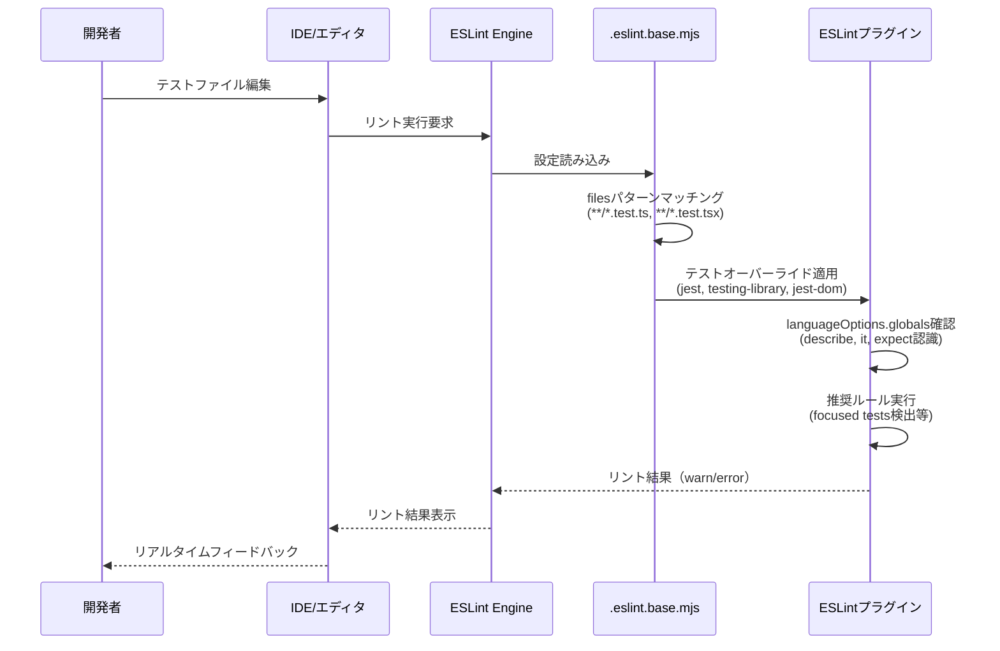
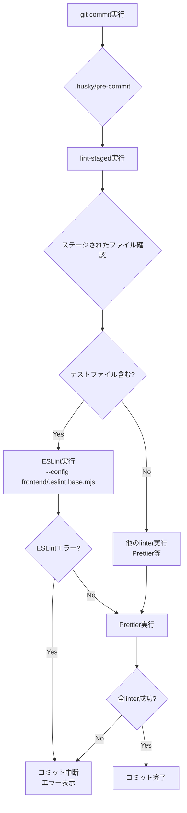
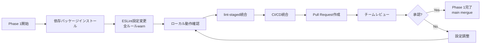
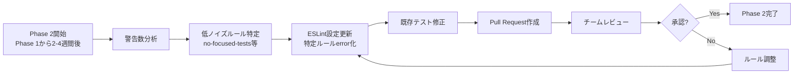
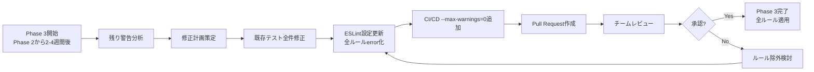

# Technical Design Document

## Overview

本機能は、Next.js 15.5 + React 19 + Jest 29 + React Testing Library 16環境において、テストコード品質を向上させるためのESLintリント設定を追加します。既存のESLint 9 Flat Config構成を維持しつつ、テストファイル専用のルールオーバーライドを導入することで、Jestグローバル関数の認識、Testing Libraryベストプラクティスの強制、テスト特有のコーディング規約の適用を実現します。

**ユーザー**: フロントエンド開発者は、テストコード作成時にIDEでリアルタイムなリントフィードバックを受け取り、`describe`/`it`/`expect`等のJestグローバル関数の未定義エラーを回避できます。チーム全体で統一されたテストコード品質基準が適用され、CI/CDパイプラインで自動品質ゲートが機能します。

**影響**: 既存のESLint設定（`frontend/.eslint.base.mjs`）にテストファイル専用オーバーライドが追加され、モノレポ全体（admin-app/user-app）で統一されたテストリント環境が構築されます。CI/CD（GitHub Actions）およびGitフック（husky + lint-staged）に統合され、開発フロー全体でテストコード品質が保証されます。

### Goals

- 既存のESLint 9 Flat Config設定を維持しつつ、テストファイル専用のルールオーバーライドを追加
- Jestグローバル関数（`describe`, `it`, `expect`, `beforeEach`, `afterEach`等）の正常な認識を実現
- Jest/Testing Libraryのベストプラクティスを強制（focused tests検出、推奨クエリ強制、assertionなしテスト検出）
- モノレポ全体（admin-app/user-app）で統一されたテストコード品質基準を適用
- CI/CD（GitHub Actions）およびGitフック（husky + lint-staged）に統合し、自動品質チェックを実現
- 段階的ルール昇格戦略（warn → error）により、既存テストへの影響を最小化

### Non-Goals

- E2Eテスト（Playwright）へのリント設定追加（別Specで対応）
- バックエンド（Laravel）のテスト設定変更
- ESLint v10への移行（ESLint v9を維持）
- 既存テストコード自体の全面的な修正（初期フェーズは警告レベル）
- テストカバレッジ目標の変更（既存94%を維持）

## Architecture

### 既存アーキテクチャ分析

**現在のESLint構成**:
- **モノレポ共通設定**: `frontend/.eslint.base.mjs` - Next.js推奨ルール + TypeScript推奨ルール + カスタムルール + Prettier統合
- **アプリ固有設定**: `frontend/{admin-app,user-app}/eslint.config.mjs` - 共通設定を継承し、拡張可能な構造
- **Flat Config形式**: ESLint 9の新しい設定形式を採用、FlatCompatで旧形式の`next/core-web-vitals`を統合
- **既存除外設定**: `jest.config.js`のみが除外され、テストファイル自体（`*.test.ts`, `*.test.tsx`）はリント対象外

**既存の技術スタック**:
- ESLint 9（Flat Config形式）
- `@eslint/eslintrc`（FlatCompat利用）
- `eslint-config-next`（Next.js推奨設定）
- `eslint-config-prettier`（Prettier競合回避）
- husky + lint-staged（Git commit時の自動リント）

**保持する既存パターン**:
- Flat Config形式の維持
- FlatCompatを利用したNext.js推奨設定の統合
- `eslint-config-prettier`を最後に配置する構造
- モノレポ共通設定 + アプリ固有設定の階層構造

### 高レベルアーキテクチャ

```mermaid
graph TB
    subgraph "開発環境"
        IDE[IDE/エディタ]
        LocalCLI[ローカルCLI]
    end

    subgraph "Git Hooks"
        PreCommit[.husky/pre-commit]
        LintStaged[lint-staged]
    end

    subgraph "ESLint設定層"
        BaseConfig[frontend/.eslint.base.mjs]
        AdminConfig[admin-app/eslint.config.mjs]
        UserConfig[user-app/eslint.config.mjs]
    end

    subgraph "ESLintプラグイン層"
        JestPlugin[eslint-plugin-jest@^28]
        TestingLibPlugin[eslint-plugin-testing-library@^6]
        JestDomPlugin[eslint-plugin-jest-dom@^5]
        GlobalsPackage[globals@^15]
    end

    subgraph "テストファイル"
        TestFiles[**/*.test.ts, **/*.test.tsx<br/>**/__tests__/**]
    end

    subgraph "CI/CD"
        GHActions[GitHub Actions<br/>frontend-test.yml]
        LintJob[lint job]
    end

    IDE --> BaseConfig
    LocalCLI --> BaseConfig
    PreCommit --> LintStaged
    LintStaged --> BaseConfig
    GHActions --> LintJob
    LintJob --> BaseConfig

    BaseConfig --> AdminConfig
    BaseConfig --> UserConfig

    BaseConfig --> JestPlugin
    BaseConfig --> TestingLibPlugin
    BaseConfig --> JestDomPlugin
    BaseConfig --> GlobalsPackage

    AdminConfig --> TestFiles
    UserConfig --> TestFiles
```

**アーキテクチャ統合**:
- **既存パターン保持**: Flat Config形式、FlatCompat、Prettier統合を維持
- **新規コンポーネント追加理由**:
  - `eslint-plugin-jest`: Jestグローバル関数認識、テストベストプラクティス強制
  - `eslint-plugin-testing-library`: Testing Library推奨クエリ強制、アンチパターン検出
  - `eslint-plugin-jest-dom`: Jest-DOM matcher推奨使用
  - `globals`: Jestグローバル関数の明示的定義
- **技術スタック整合性**: ESLint 9 + Flat Configに完全対応したプラグインバージョンを選定
- **Steering準拠**: モノレポ統一設定原則、段階的品質向上戦略、CI/CD統合要件を遵守

### 技術スタック整合性

**既存スタックへの統合**:
- **ESLint 9 Flat Config**: 既存の設定形式を維持、テストファイル専用オーバーライドを追加
- **FlatCompat**: Next.js推奨設定との共存を継続
- **モノレポ構成**: ルート`package.json`でdevDependencies管理、admin-app/user-appで共通設定継承

**新規依存関係**:
- `eslint-plugin-jest@^28`: ESLint 9 Flat Config対応、`flat/recommended`設定提供
- `eslint-plugin-testing-library@^6`: React Testing Library対応、`flat/react`設定提供
- `eslint-plugin-jest-dom@^5`: Jest-DOM matcher推奨、`flat/recommended`設定提供
- `globals@^15`: Jestグローバル関数定義（`globals.jest`）

**バージョン整合性**:
- 全プラグインがESLint 9およびFlat Config形式に対応
- Next.js 15.5、React 19、Jest 29、React Testing Library 16との互換性確認済み

### 主要設計決定

#### 決定1: テストファイル専用オーバーライド方式

**決定**: `frontend/.eslint.base.mjs`にテストファイル専用のオーバーライド設定を追加し、filesパターンでテストファイルのみに適用

**コンテキスト**: 通常のアプリケーションコードとテストコードでは、許容されるコーディングパターンが異なる（例: `console.log`のデバッグ使用、`jest.fn()`の空関数許容）。全ファイルに一律適用すると、誤検知や開発体験の低下を招く。

**代替案**:
1. テストファイル専用の別ESLint設定ファイル作成（`eslint.test.mjs`）
2. 各アプリ（admin-app/user-app）で個別にテストルール定義
3. テストファイル専用オーバーライド（選択）

**選択アプローチ**: テストファイル専用オーバーライドを`frontend/.eslint.base.mjs`に追加

**理由**:
- **一元管理**: モノレポ全体で統一されたテストルール管理、設定重複の回避
- **Flat Config標準**: ESLint 9のfilesパターンマッチング機能を活用、設定の明確な分離
- **保守性**: 1つの設定ファイルで全体像を把握可能、ルール変更時の修正箇所が最小
- **既存構造維持**: `frontend/.eslint.base.mjs`の責務（モノレポ共通設定）に合致

**トレードオフ**:
- **得られるもの**: 一元管理、モノレポ全体の統一性、保守コスト削減
- **犠牲にするもの**: アプリ個別の柔軟なテストルール調整（必要な場合はアプリ固有設定でオーバーライド可能）

#### 決定2: 段階的ルール昇格戦略（warn → error）

**決定**: 初期フェーズは全Testing Libraryルールを`warn`レベルで適用し、運用フェーズで段階的に`error`へ昇格

**コンテキスト**: 既存テストコード（10ファイル、合計10テストケース）が存在し、新ルール適用により多数のエラーが発生する可能性がある。一度に全ルールを`error`レベルで適用すると、既存テストの大規模な修正が必要となり、導入コストが高い。

**代替案**:
1. 全ルールを即座に`error`レベル適用
2. 段階的ルール昇格戦略（warn → error）（選択）
3. 新規テストのみに厳格ルール適用

**選択アプローチ**: 段階的ルール昇格戦略

**理由**:
- **リスク最小化**: 既存テストへの影響を抑え、段階的に品質向上
- **チーム受容性**: 警告レベルでベースライン把握、優先順位を付けて対応可能
- **実用性**: CI/CDパイプライン停止を回避、継続的な開発フロー維持
- **Steering原則準拠**: 段階的品質向上戦略の実践

**トレードオフ**:
- **得られるもの**: スムーズな導入、既存テストの継続動作、チーム負担軽減
- **犠牲にするもの**: 即座の厳格品質保証（フェーズ3完了後に実現）

#### 決定3: Jestグローバル関数認識のglobals設定方式

**決定**: `languageOptions.globals`に`globals.jest`を追加し、Jestグローバル関数を明示的に定義

**コンテキスト**: `describe`, `it`, `expect`等のJestグローバル関数は、TypeScriptおよびESLintにとって未定義変数として認識される。`no-undef`エラーを回避し、IDEで適切な補完を提供するには、これらの関数をグローバルとして定義する必要がある。

**代替案**:
1. `@types/jest`のTypeScript型定義のみに依存
2. ESLint設定で個別にグローバル関数を手動定義
3. `globals`パッケージの`globals.jest`を使用（選択）

**選択アプローチ**: `globals.jest`を使用

**理由**:
- **標準化**: 業界標準パッケージによる一貫したグローバル関数定義
- **保守性**: Jestバージョンアップ時のグローバル関数追加に自動対応
- **信頼性**: 手動定義による定義漏れ・誤定義のリスク排除
- **互換性**: ESLint 9 Flat Configおよびeslint-plugin-jestとの統合実績

**トレードオフ**:
- **得られるもの**: 標準化、自動対応、信頼性、保守性
- **犠牲にするもの**: プロジェクト固有のカスタムグローバル関数定義の柔軟性（必要な場合は追加可能）

## システムフロー

### テストファイルリントフロー



### Git Commit時の自動リントフロー



### CI/CD自動リントフロー

```mermaid
flowchart TD
    A[Pull Request作成/更新] --> B{pathsフィルタ}
    B -->|frontend/** 変更あり| C[frontend-test.yml実行]
    B -->|frontend/** 変更なし| Z[スキップ]
    C --> D[actions/checkout@v4]
    D --> E[actions/setup-node@v4<br/>Node.js 20 + npmキャッシュ]
    E --> F[npm ci]
    F --> G[npm run lint]
    G --> H{テストファイルにエラー?}
    H -->|Yes| I[Job失敗<br/>赤色×マーク表示]
    H -->|No| J[Job成功<br/>緑色✓マーク表示]
    I --> K[マージ防止]
    J --> L[マージ許可]
```

## 要件トレーサビリティ

| 要件 | 要件概要 | コンポーネント | インターフェース | フロー |
|------|----------|----------------|------------------|--------|
| 1.1 | ESLint依存関係管理 | package.json | `npm install` | - |
| 2.1-2.9 | ESLint Flat Config統合 | frontend/.eslint.base.mjs | テストファイルオーバーライド | テストファイルリントフロー |
| 3.1-3.9 | ローカル開発環境リント | ESLint Engine | `npm run lint`, IDE統合 | テストファイルリントフロー |
| 4.1-4.8 | lint-staged統合 | .husky/pre-commit, lint-staged | Git commit hook | Git Commit時の自動リントフロー |
| 5.1-5.9 | CI/CD統合 | .github/workflows/frontend-test.yml | GitHub Actions | CI/CD自動リントフロー |
| 6.1-6.8 | 段階的ルール昇格 | frontend/.eslint.base.mjs | ルール設定（warn/error） | - |
| 7.1-7.8 | パフォーマンスと互換性 | ESLint Engine | `--cache`オプション、filesパターン | テストファイルリントフロー |
| 8.1-8.8 | ロールバックと復旧 | 手動手順 | `npm uninstall`, `git checkout` | - |
| 9.1-9.9 | ドキュメントとチーム周知 | docs/JEST_ESLINT_*.md | ドキュメントファイル | - |

## コンポーネントとインターフェース

### ESLint設定層

#### frontend/.eslint.base.mjs（拡張）

**責務と境界**
- **主要責務**: モノレポ全体のESLint共通設定管理、テストファイル専用ルールオーバーライド提供
- **ドメイン境界**: フロントエンド開発環境設定ドメイン
- **データ所有権**: ESLint設定メタデータ（ルール、プラグイン、グローバル定義）
- **トランザクション境界**: 設定ファイル読み込み時の一括評価

**依存関係**
- **Inbound**: admin-app/eslint.config.mjs, user-app/eslint.config.mjs, ESLint Engine
- **Outbound**: eslint-plugin-jest, eslint-plugin-testing-library, eslint-plugin-jest-dom, globals, eslint-config-prettier
- **External**: @eslint/eslintrc (FlatCompat), eslint-config-next

**契約定義**

**設定エクスポート契約**:
```typescript
interface ESLintBaseConfig {
  // 既存設定（維持）
  extends: string[];  // ["next/core-web-vitals", "next/typescript"]
  rules: Record<string, RuleConfig>;
  ignores: string[];

  // 新規追加: テストファイルオーバーライド
  testOverride: {
    files: string[];  // ["**/*.{test,spec}.{ts,tsx,js,jsx}", "**/__tests__/**/*.{ts,tsx,js,jsx}"]
    plugins: {
      jest: typeof jestPlugin;
      'testing-library': typeof testingLibrary;
      'jest-dom': typeof jestDom;
    };
    languageOptions: {
      globals: typeof globals.jest;
    };
    rules: Record<string, RuleConfig>;
  };
}

type RuleConfig = 'off' | 'warn' | 'error' | [string, any];
```

**前提条件**:
- `npm install`により全依存パッケージがインストール済み
- Node.js 20以上
- ESLint 9.x

**事後条件**:
- テストファイル（`**/*.test.{ts,tsx}`）でJestグローバル関数が認識される
- 通常ファイルではテストルールが適用されない
- Prettier競合が発生しない

**不変条件**:
- `eslintConfigPrettier`が常に配列の最後に配置される
- FlatCompat方式が維持される

**統合戦略**:
- **修正アプローチ**: 既存設定を拡張、テストオーバーライドを追加
- **後方互換性**: 既存のNext.js推奨設定、カスタムルール、ignore設定を完全維持
- **移行パス**: 段階的導入（Phase 1: warn → Phase 2: 低ノイズルールerror → Phase 3: 全error）

#### package.json（拡張）

**責務と境界**
- **主要責務**: モノレポ依存関係管理、lint-staged設定管理
- **ドメイン境界**: プロジェクトメタデータ管理ドメイン
- **データ所有権**: devDependencies、lint-staged設定

**依存関係**
- **Inbound**: npm cli, husky, lint-staged
- **Outbound**: eslint-plugin-jest@^28, eslint-plugin-testing-library@^6, eslint-plugin-jest-dom@^5, globals@^15

**契約定義**

**依存関係追加契約**:
```typescript
interface PackageJsonDevDependencies {
  // 既存（維持）
  "eslint": "^9";
  "eslint-config-next": "15.5.4";
  "eslint-config-prettier": "^9";
  "@eslint/eslintrc": "^3";

  // 新規追加
  "eslint-plugin-jest": "^28";
  "eslint-plugin-testing-library": "^6";
  "eslint-plugin-jest-dom": "^5";
  "globals": "^15";
}
```

**lint-staged設定拡張契約**:
```typescript
interface LintStagedConfig {
  "frontend/admin-app/**/*.{js,jsx,ts,tsx}": string[];  // jest.config.js除外済み、テストファイル含む
  "frontend/user-app/**/*.{js,jsx,ts,tsx}": string[];   // jest.config.js除外済み、テストファイル含む
  "frontend/**/*.{css,md,json}": string[];
  "backend/laravel-api/**/*.php": string[];
}
```

**前提条件**:
- package.json形式の妥当性
- npm 7以上（workspaces機能対応）

**事後条件**:
- `npm install`で全プラグインがインストールされる
- バージョン競合が発生しない
- lint-stagedでテストファイルが自動リント対象となる

**統合戦略**:
- **修正アプローチ**: devDependenciesに4パッケージ追加、lint-staged設定は既存維持（テストファイルが既にパターンマッチング対象）
- **後方互換性**: 既存のlint-staged動作を変更しない（jest.config.js除外維持）

### CI/CD統合層

#### .github/workflows/frontend-test.yml（拡張）

**責務と境界**
- **主要責務**: Pull Request時のフロントエンドテスト・リント自動実行
- **ドメイン境界**: CI/CD自動化ドメイン
- **データ所有権**: ワークフロー実行メタデータ、成功/失敗ステータス

**依存関係**
- **Inbound**: GitHub Pull Request イベント
- **Outbound**: actions/checkout@v4, actions/setup-node@v4, npm cli, ESLint Engine

**契約定義**

**ワークフロージョブ契約**:
```yaml
jobs:
  test:
    strategy:
      matrix:
        node-version: [20.x]
        app: [admin-app, user-app]
    steps:
      - checkout
      - setup-node (cache: npm)
      - npm ci
      - npm test (coverage)
      - upload-artifact (coverage)

  # 新規追加
  lint:
    strategy:
      matrix:
        node-version: [20.x]
        app: [admin-app, user-app]
    steps:
      - checkout
      - setup-node (cache: npm)
      - npm ci
      - npm run lint (--max-warnings=0 in Phase 3)
```

**前提条件**:
- Pull Request作成/更新イベント
- frontend/**パスに変更がある

**事後条件**:
- テストファイルにESLintエラーがある場合、ジョブが失敗
- Pull Requestに成功/失敗ステータスが表示される

**統合戦略**:
- **修正アプローチ**: 既存testジョブを維持、lintジョブを追加（または既存lintジョブを活用）
- **後方互換性**: 既存のテスト実行フローに影響なし

## データモデル

### 論理データモデル

本機能は設定ファイルベースであり、実行時データストアを持たないため、論理データモデルは以下の設定構造のみを定義します。

**ESLint設定データ構造**:

```typescript
interface ESLintConfigData {
  // 通常ファイル設定
  baseRules: {
    'no-console': ['warn', { allow: ['warn', 'error'] }];
    'no-debugger': 'warn';
    '@typescript-eslint/no-unused-vars': ['warn', { argsIgnorePattern: '^_', varsIgnorePattern: '^_' }];
  };

  // テストファイル専用オーバーライド
  testOverrides: {
    files: ['**/*.{test,spec}.{ts,tsx,js,jsx}', '**/__tests__/**/*.{ts,tsx,js,jsx}'];
    plugins: ['jest', 'testing-library', 'jest-dom'];
    globals: ['describe', 'it', 'expect', 'beforeEach', 'afterEach', 'jest', 'test', 'fit', 'fdescribe'];
    rules: {
      // Jest推奨ルール
      'jest/no-disabled-tests': 'warn';  // Phase 1: warn, Phase 2+: error
      'jest/no-focused-tests': 'warn';   // Phase 1: warn, Phase 2+: error
      'jest/valid-expect': 'warn';       // Phase 1: warn, Phase 2+: error

      // Testing Library推奨ルール
      'testing-library/no-node-access': 'warn';  // Phase 1-2: warn, Phase 3: error
      'testing-library/no-container': 'warn';    // Phase 1-2: warn, Phase 3: error
      'testing-library/no-debugging-utils': 'warn';  // Phase 1-2: warn, Phase 3: error

      // テスト特有の調整
      'no-console': 'off';
      '@typescript-eslint/no-unused-vars': ['warn', { argsIgnorePattern: '^_', varsIgnorePattern: '^_', caughtErrors: 'none' }];
      'no-empty-function': 'off';
    };
  };
}
```

**整合性ルール**:
- `testOverrides.rules`の各ルールは、Phase 1では`warn`、Phase 2-3で`error`へ段階的昇格
- `baseRules`と`testOverrides.rules`で同名ルールがある場合、テストファイルでは`testOverrides`が優先
- `eslintConfigPrettier`が常に最後に適用され、フォーマット関連ルールを無効化

## エラーハンドリング

### エラー戦略

ESLintリント実行時のエラーを以下の3つのカテゴリに分類し、それぞれ適切な対処を行います。

### エラーカテゴリとレスポンス

**ユーザーエラー（4xx相当）**:
- **Invalid ESLint設定**: 設定ファイル構文エラー → ESLintが詳細なエラーメッセージを表示、ファイルパスと行番号を提示
- **未定義ルール参照**: 存在しないルール名を指定 → ESLintが「Definition for rule 'xxx' was not found」エラーを表示、利用可能ルール一覧へのリンク提示
- **プラグインバージョン不一致**: 互換性のないプラグインバージョン → npm installが失敗、peer dependency警告を表示

**システムエラー（5xx相当）**:
- **プラグインロード失敗**: プラグインモジュールが見つからない → ESLintが「Failed to load plugin 'xxx'」エラーを表示、`npm install`実行を提案
- **メモリ不足**: 大量ファイルのリント実行でメモリ枯渇 → Node.jsプロセスが「JavaScript heap out of memory」エラーで終了、`--max-old-space-size`オプション増加を提案
- **ファイルアクセスエラー**: 読み取り権限不足 → ESLintが「EACCES: permission denied」エラーを表示、ファイル権限確認を提案

**ビジネスロジックエラー（422相当）**:
- **Focused tests検出**: `fit`, `fdescribe`の使用 → `jest/no-focused-tests`エラー、「Remove focused test to prevent test suite bypass」メッセージ表示
- **Container直接操作**: `container.querySelector()`の使用 → `testing-library/no-node-access`警告、「Use screen.getByRole() instead」代替手段提示
- **Assertion欠如**: `expect()`呼び出しなしのテスト → `jest/expect-expect`警告、「Add at least one assertion」指示表示

### モニタリング

**エラートラッキング**:
- **ローカル開発**: IDEのProblemsパネルでリアルタイム表示、エラー/警告カウント表示
- **Git commit時**: lint-stagedがエラーをコンソール出力、コミット中断
- **CI/CD**: GitHub Actionsが失敗ログを記録、Annotationsとして表示

**ロギング**:
- **ESLint実行ログ**: `--format stylish`（デフォルト）で人間可読形式、`--format json`でCI解析用JSON形式
- **lint-stagedログ**: `.husky/pre-commit`実行時の標準出力/標準エラー出力

**ヘルスモニタリング**:
- **リント実行時間**: CI/CDで実行時間を計測、±10%以内の性能維持を監視
- **警告/エラー数推移**: Phase 1→2→3での警告数減少、エラー数増加を追跡

## テスト戦略

### Unit Tests

**ESLint設定ユニットテスト** (手動検証またはlint自体の実行で代替):
- `frontend/.eslint.base.mjs`の構文妥当性確認
- テストファイルパターンマッチング正常動作確認（`**/*.test.ts`が認識される）
- Jestグローバル関数定義存在確認（`globals.jest`がインポートされる）
- 推奨ルールセット適用確認（`jest.configs['flat/recommended']`が展開される）
- Prettier競合回避確認（`eslintConfigPrettier`が最後に配置）

### Integration Tests

**ESLintプラグイン統合テスト**:
- `npm run lint`実行で全テストファイルがリント対象となることを確認
- Jestグローバル関数（`describe`, `it`, `expect`）で`no-undef`エラーが発生しないことを確認
- Focused tests（`fit`, `fdescribe`）で`jest/no-focused-tests`エラーが発生することを確認
- `container.querySelector()`で`testing-library/no-node-access`警告が発生することを確認

**lint-staged統合テスト**:
- テストファイル（`Button.test.tsx`）をステージングして`git commit`実行
- ESLintエラーがある場合、コミットが中断されることを確認
- `jest.config.js`がリント対象外であることを確認

**CI/CD統合テスト**:
- Pull Request作成で`frontend-test.yml`が自動実行されることを確認
- テストファイルにESLintエラーがある場合、lintジョブが失敗することを確認
- 成功時に緑色チェックマーク、失敗時に赤色×マークが表示されることを確認

### E2E/UI Tests

本機能はESLint設定変更であり、UIを持たないため、E2Eテストは不要。上記Integration Testsで十分なカバレッジを確保。

### Performance/Load

**パフォーマンステスト**:
- ESLintテストルール追加前後のリント実行時間を計測（10ファイル、約200行のテストコード）
- 実行時間増加が±10%以内であることを確認
- `--cache`オプション使用時、2回目以降の実行が高速化されることを確認（50%以上の短縮）
- モノレポ全体（admin-app + user-app）でのリント実行が30秒以内に完了することを確認

## セキュリティ考慮事項

### 脅威モデリング

本機能はESLint設定変更であり、外部入力を受け付けず、認証・認可を行わないため、直接的なセキュリティ脅威は限定的です。

**識別される脅威**:
- **サプライチェーン攻撃**: 悪意のあるESLintプラグインパッケージのインストール
- **設定ファイル改ざん**: 権限のない開発者による`.eslint.base.mjs`の不正変更
- **CI/CDパイプライン bypass**: lintチェックをスキップしたコミットの強制マージ

### セキュリティコントロール

**サプライチェーンセキュリティ**:
- **パッケージ検証**: `npm audit`によるパッケージ脆弱性スキャン実行
- **バージョン固定**: `package.json`でセマンティックバージョニング（`^`）を使用し、メジャーバージョン固定
- **信頼できるソース**: 公式パッケージ（`eslint-plugin-jest`, `eslint-plugin-testing-library`）のみを使用、GitHub Star数・ダウンロード数を確認

**設定ファイル保護**:
- **Pull Requestレビュー**: `.eslint.base.mjs`変更には必須レビュー要求
- **CODEOWNERS設定**: Tech Leadをオーナーとして指定、承認なしマージを防止

**CI/CDパイプラインセキュリティ**:
- **必須ステータスチェック**: GitHub Branch Protectionで`frontend-test.yml`のlintジョブ成功を必須化
- **マージ権限制限**: mainブランチへのdirect pushを禁止、Pull Requestのみ許可

### コンプライアンス

- **ライセンス確認**: 全プラグインがMITライセンス（商用利用可能）であることを確認
- **データプライバシー**: ESLint実行時にユーザーデータを外部送信しないことを確認

## パフォーマンスとスケーラビリティ

### ターゲットメトリクス

**リント実行時間目標**:
- **ローカル開発**: 単一アプリ（admin-app/user-app）で5秒以内
- **モノレポ全体**: 両アプリ合計で15秒以内
- **CI/CD**: 並列実行で各アプリ10秒以内

**キャッシュ効率目標**:
- **初回実行**: ベースライン時間
- **2回目以降**: 50%以上の高速化（`.eslintcache`利用）

**メモリ使用量目標**:
- **Node.jsプロセス**: 1GB以下（デフォルトヒープサイズで動作）

### スケーリングアプローチ

**水平スケーリング**:
- **CI/CD並列実行**: GitHub Actionsのmatrix戦略でadmin-app/user-appを並列リント
- **lint-staged並列実行**: lint-stagedのデフォルト並列実行機能を活用（CPUコア数に応じた自動調整）

**垂直スケーリング**:
- **ESLintキャッシュ**: `--cache`オプションで`.eslintcache`ファイル生成、変更ファイルのみリント
- **ファイルパターン最適化**: テストファイル専用オーバーライドで、プラグイン適用範囲を最小化

### キャッシング戦略

**ローカル開発キャッシュ**:
- **ESLintキャッシュ**: `--cache --cache-location .eslintcache`でファイル変更検出を高速化
- **npmキャッシュ**: `npm ci`で`node_modules`を効率的に復元

**CI/CDキャッシュ**:
- **npmキャッシュ**: `actions/setup-node@v4`の`cache: 'npm'`で依存関係キャッシュ
- **ESLintキャッシュ**: GitHub Actionsの`actions/cache@v4`で`.eslintcache`を永続化（オプション）

## 移行戦略

### Phase 1: 初期導入（warnレベル）



**実行内容**:
1. `npm install eslint-plugin-jest@^28 eslint-plugin-testing-library@^6 eslint-plugin-jest-dom@^5 globals@^15 --save-dev`
2. `frontend/.eslint.base.mjs`にテストオーバーライド追加（全ルール`warn`）
3. `npm run lint`実行、警告数をベースライン記録
4. lint-staged設定確認（既存設定でテストファイル対象確認）
5. `.github/workflows/frontend-test.yml`にlintジョブ追加（または既存活用）
6. Pull Request作成、Before/After比較ドキュメント添付

**ロールバックトリガー**:
- リント実行時間が15秒を超過（目標の2倍）
- CI/CDパイプラインが恒常的に失敗
- 開発者から強い反対意見（チーム投票で50%以上反対）

**検証チェックポイント**:
- `describe`, `it`, `expect`で`no-undef`エラーが発生しないこと
- `fit`で`jest/no-focused-tests`警告が表示されること
- CI/CDでlintジョブが正常実行されること

### Phase 2: 低ノイズルール昇格（error化）



**実行内容**:
1. Phase 1期間中の警告数を分析、低ノイズルール（誤検知・修正容易）を特定
2. `frontend/.eslint.base.mjs`で以下のルールを`error`へ昇格:
   - `jest/no-disabled-tests: error`
   - `jest/no-focused-tests: error`
   - `jest/valid-expect: error`
   - `testing-library/no-await-sync-queries: error`
   - `testing-library/no-manual-cleanup: error`
3. 既存テストの違反箇所を修正
4. Pull Request作成、修正内容とメリット説明

**ロールバックトリガー**:
- 修正コストが見積もりの2倍を超過
- 修正により新たなバグが多発（5件以上）

**検証チェックポイント**:
- `fit`使用でCI/CDが失敗すること
- 既存テスト全件が正常動作すること

### Phase 3: 全ルール昇格（完全適用）



**実行内容**:
1. Phase 2期間中の残り警告を全件分析
2. 修正計画策定、優先順位付け
3. 既存テストコード全件修正
4. `frontend/.eslint.base.mjs`で全ルールを`error`へ昇格
5. CI/CD（`.github/workflows/frontend-test.yml`）に`--max-warnings=0`追加
6. Pull Request作成、完全適用完了報告

**ロールバックトリガー**:
- 修正不可能な警告が5件以上残存
- チーム合意が得られない

**検証チェックポイント**:
- 全テストファイルでエラー0、警告0
- CI/CDで警告があるとジョブが失敗すること
- 新規テストコード作成時、即座にエラー検出されること
