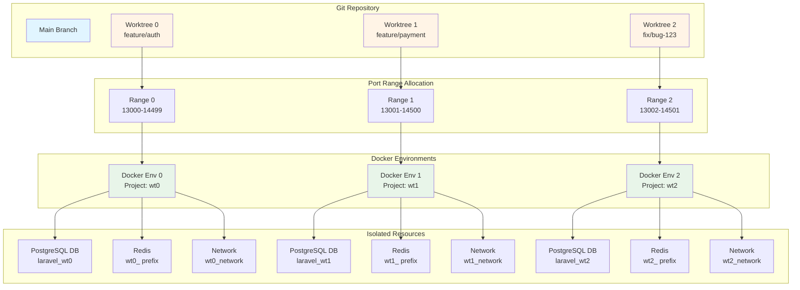
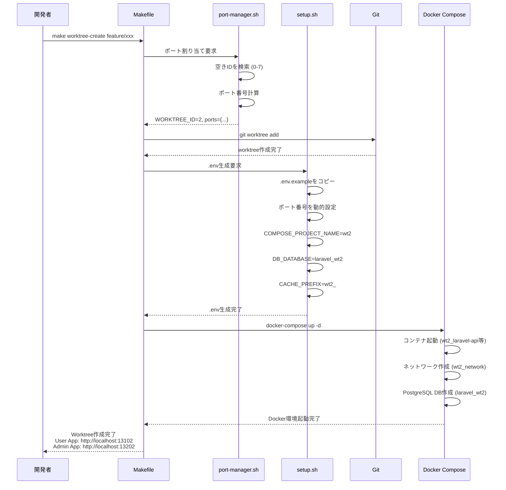
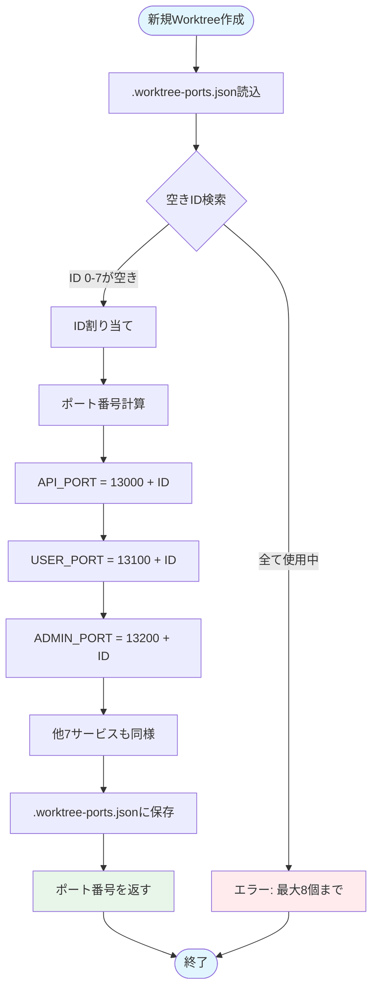
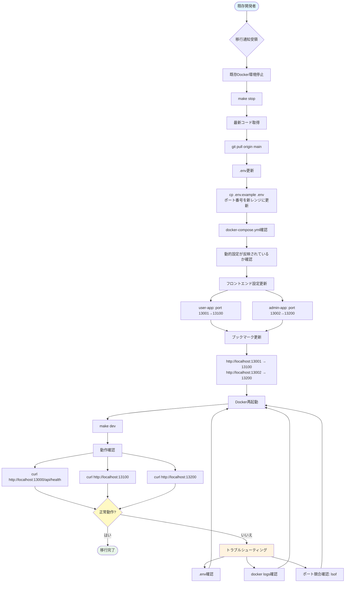

# Git Worktree 並列開発環境 - 技術設計書

## 概要

### 目的
複数の開発者が同時に異なる機能・バグフィックスに取り組む際、git worktreeを活用して完全分離された開発環境を構築する。ポート番号レンジ分離方式により、5-8個の並列環境を同時起動可能にする。

### 対象ユーザー
- **フルスタック開発者**: 並行して複数の機能開発を行うシニア開発者
- **フロントエンド開発者**: UI変更を複数ブランチで同時テスト
- **バックエンド開発者**: API変更を複数環境で検証
- **QAエンジニア**: 複数のPRを並行して検証

### システムへの影響

#### Breaking Changes
- **既存ポート番号の変更**
  - User App: `13001` → `13100`
  - Admin App: `13002` → `13200`
  - MinIO Console: `13010` → `13300`
  - PostgreSQL: `13432` → `14000`
  - Redis: `13379` → `14100`
  - Mailpit UI: `13025` → `14200`
  - Mailpit SMTP: `11025` → `14300`
  - MinIO API: `13900` → `14400`
- **既存開発者は環境再構築が必要**
- **ブックマーク/スクリプトの更新が必要**

#### 影響範囲
- `.env.example`: 9サービスのポート番号更新
- `docker-compose.yml`: コンテナ名/ネットワーク名の動的化
- `frontend/user-app/package.json`: ポート番号13001→13100
- `frontend/admin-app/package.json`: ポート番号13002→13200
- `Makefile`: 新規コマンド追加
- `README.md`: セットアップ手順更新

### 目標
1. **並列開発環境の実現**: 5-8個のworktreeで同時Docker起動
2. **完全分離アーキテクチャ**: DB/Redis/ネットワーク/ストレージの完全分離
3. **自動化**: ポート割り当て・worktree作成の自動化
4. **開発者体験向上**: シンプルなCLIコマンド（`make worktree-create feature/xxx`）
5. **リソース効率**: メモリ使用量の最適化（1GB/worktree）

### 目標外
- 本番環境での並列実行（開発環境専用機能）
- Kubernetesへの移行（Docker Compose継続）
- 既存のmainブランチ開発環境の変更（ポート番号変更のみ）
- CI/CDでの並列テスト実行（将来的な拡張として検討）

---

## アーキテクチャ

### 既存アーキテクチャ分析

#### 現在の構成
```
laravel-next-b2c/
├── backend/laravel-api/          # Laravel API
├── frontend/
│   ├── user-app/                 # Next.js User App (port: 13001)
│   └── admin-app/                # Next.js Admin App (port: 13002)
├── docker-compose.yml            # 単一環境のみ対応
├── Makefile                      # 基本的なDocker操作コマンド
└── .env.example                  # 環境変数テンプレート
```

#### 現在の制約
1. **単一環境のみ**: 1つのDocker環境しか起動できない
2. **固定ポート番号**: ポート競合により並列起動不可
3. **共有データベース**: 複数環境でDB衝突が発生
4. **固定コンテナ名**: `laravel-api`等の固定名により並列起動不可
5. **共有Redisキャッシュ**: キャッシュキー衝突が発生

### 高レベルアーキテクチャ



---

## テクノロジー整合性

### 既存技術スタックの拡張
| カテゴリ | 既存技術 | 変更内容 |
|---------|---------|---------|
| Backend | Laravel API, PostgreSQL 17, Redis | **変更なし**（設定のみ動的化） |
| Frontend | Next.js 15.5, React 19 | **ポート番号のみ変更**（13001→13100, 13002→13200） |
| Infrastructure | Docker Compose | **動的設定追加**（COMPOSE_PROJECT_NAME変数化） |
| Scripts | Makefile, Bash | **新規スクリプト追加**（port-manager.sh, setup.sh） |
| Version Control | Git | **worktree機能活用**（既存機能の活用） |

### 新規ツール
なし（全て既存技術の組み合わせ）

---

## 主要設計判断

### 1. ポート番号レンジ分離方式の採用

#### 決定内容
100ポート単位のレンジ分離方式を採用。

#### 理由
- **明確な分離**: サービスごとに専用レンジを持つことで、ポート衝突を完全回避
- **拡張性**: 5-8個のworktreeに対応可能
- **視認性**: ポート番号から環境を識別可能（例: 13105 → Worktree 5のUser App）
- **代替案（+100方式）の問題点**: User App 13001/13101/13201...は視認性が低く、拡張性も限定的

#### トレードオフ
- ✅ メリット: 明確な分離、拡張性、視認性
- ❌ デメリット: 既存ポート番号の変更が必要（Breaking Change）

#### ポート番号マッピング
| サービス | レンジ | Worktree 0 | Worktree 1 | Worktree 7 |
|---------|--------|------------|------------|------------|
| Laravel API | 13000-13099 | 13000 | 13001 | 13007 |
| User App | 13100-13199 | 13100 | 13101 | 13107 |
| Admin App | 13200-13299 | 13200 | 13201 | 13207 |
| MinIO Console | 13300-13399 | 13300 | 13301 | 13307 |
| PostgreSQL | 14000-14099 | 14000 | 14001 | 14007 |
| Redis | 14100-14199 | 14100 | 14101 | 14107 |
| Mailpit UI | 14200-14299 | 14200 | 14201 | 14207 |
| Mailpit SMTP | 14300-14399 | 14300 | 14301 | 14307 |
| MinIO API | 14400-14499 | 14400 | 14401 | 14407 |

### 2. 完全分離アーキテクチャの採用

#### 決定内容
データベース、Redis、Dockerネットワーク、コンテナ名を完全分離。

#### 理由
- **データ分離**: 各worktreeで独立したデータベーススキーマを持つ
- **キャッシュ分離**: Redisキャッシュキーの衝突を防ぐ
- **ネットワーク分離**: Docker内部通信の名前解決を正確に行う
- **並列実行**: 複数環境が互いに干渉しない

#### 実装方法
```bash
# Docker Compose Project Name（コンテナ名/ネットワーク名の接頭辞）
COMPOSE_PROJECT_NAME=wt${WORKTREE_ID}

# データベース名
DB_DATABASE=laravel_wt${WORKTREE_ID}

# Redisキャッシュプレフィックス
CACHE_PREFIX=wt${WORKTREE_ID}_
```

### 3. 自動ポート割り当てスクリプトの実装

#### 決定内容
`scripts/worktree/port-manager.sh`で自動的に空きポート番号を割り当て。

#### 理由
- **手動設定の排除**: 開発者がポート番号を考える必要がない
- **エラー防止**: ポート番号の設定ミスを防ぐ
- **再利用性**: 削除されたworktreeのポート番号を再利用

#### アルゴリズム
1. 既存のworktreeとポート番号のマッピングを`.worktree-ports.json`に記録
2. 新規作成時は最小の空きID（0-7）を割り当て
3. 削除時は該当IDを解放し、次回作成時に再利用

### 4. フロントエンド動的環境変数設定

#### 決定内容
Next.jsのビルド時環境変数を動的に設定。

#### 理由
- **NEXT_PUBLIC_API_URL**: worktreeごとに異なるLaravel APIポートにアクセス
- **ビルドキャッシュ問題**: `NEXT_PUBLIC_*`はビルド時に埋め込まれるため、worktreeごとに異なる値が必要

#### 実装方法
```bash
# scripts/worktree/setup.sh内でworktreeごとの.envを生成
NEXT_PUBLIC_API_URL=http://localhost:${API_PORT}
```

---

## システムフロー

### Worktree作成フロー



### ポート割り当てアルゴリズム



---

## コンポーネントとインターフェース

### 1. port-manager.sh

#### 責務
- 空きWorktree IDの検索
- ポート番号の計算
- `.worktree-ports.json`の読み書き

#### インターフェース
```bash
# 使用法
./scripts/worktree/port-manager.sh assign <worktree-path>
./scripts/worktree/port-manager.sh release <worktree-path>
./scripts/worktree/port-manager.sh list
```

#### 出力例（assign）
```json
{
  "worktree_id": 2,
  "ports": {
    "APP_PORT": 13002,
    "USER_PORT": 13102,
    "ADMIN_PORT": 13202,
    "FORWARD_MINIO_CONSOLE_PORT": 13302,
    "FORWARD_DB_PORT": 14002,
    "FORWARD_REDIS_PORT": 14102,
    "FORWARD_MAILPIT_DASHBOARD_PORT": 14202,
    "FORWARD_MAILPIT_PORT": 14302,
    "FORWARD_MINIO_PORT": 14402
  }
}
```

### 2. setup.sh

#### 責務
- `.env`ファイルの生成
- `COMPOSE_PROJECT_NAME`、`DB_DATABASE`、`CACHE_PREFIX`の動的設定
- フロントエンド環境変数の設定

#### インターフェース
```bash
# 使用法
./scripts/worktree/setup.sh <worktree-path> <worktree-id> <ports-json>
```

#### 生成される.env例
```bash
# Worktree ID: 2
WORKTREE_ID=2
COMPOSE_PROJECT_NAME=wt2

# Database
DB_DATABASE=laravel_wt2

# Cache
CACHE_PREFIX=wt2_

# Ports
APP_PORT=13002
FORWARD_DB_PORT=14002
FORWARD_REDIS_PORT=14102
FORWARD_MAILPIT_PORT=14302
FORWARD_MAILPIT_DASHBOARD_PORT=14202
FORWARD_MINIO_PORT=14402
FORWARD_MINIO_CONSOLE_PORT=13302

# Frontend
NEXT_PUBLIC_API_URL=http://localhost:13002
E2E_API_URL=http://localhost:13002
E2E_USER_URL=http://localhost:13102
E2E_ADMIN_URL=http://localhost:13202
```

### 3. Makefileコマンド

#### 新規追加コマンド
```makefile
# Worktree作成
make worktree-create BRANCH=feature/xxx

# Worktree一覧表示
make worktree-list

# ポート番号表示
make worktree-ports

# Worktree削除
make worktree-remove PATH=../worktrees/feature-xxx
```

### 4. docker-compose.yml修正

#### 動的化箇所
```yaml
services:
  laravel-api:
    container_name: ${COMPOSE_PROJECT_NAME:-laravel-next-b2c}_laravel-api
    networks:
      - ${COMPOSE_PROJECT_NAME:-laravel-next-b2c}_network
    environment:
      - DB_DATABASE=${DB_DATABASE:-laravel}
      - CACHE_PREFIX=${CACHE_PREFIX:-}

networks:
  default:
    name: ${COMPOSE_PROJECT_NAME:-laravel-next-b2c}_network

volumes:
  pgsql:
    name: ${COMPOSE_PROJECT_NAME:-laravel-next-b2c}_pgsql
  redis:
    name: ${COMPOSE_PROJECT_NAME:-laravel-next-b2c}_redis
```

### 5. PostgreSQL DB自動作成

#### 実装方法
`backend/laravel-api/docker/pgsql/init.d/create-database.sh`を作成し、Docker起動時に自動実行。

```bash
#!/bin/bash
set -e

DB_NAME="${DB_DATABASE:-laravel}"

# データベースが存在しない場合のみ作成
psql -v ON_ERROR_STOP=1 --username "$POSTGRES_USER" <<-EOSQL
    SELECT 'CREATE DATABASE $DB_NAME'
    WHERE NOT EXISTS (SELECT FROM pg_database WHERE datname = '$DB_NAME')\gexec
EOSQL
```

---

## データモデル

### .worktree-ports.json構造

```json
{
  "worktrees": [
    {
      "path": "/Users/okumura/Work/src/ef-tech/template/laravel-next-b2c/../worktrees/feature-auth",
      "branch": "feature/auth",
      "worktree_id": 0,
      "ports": {
        "APP_PORT": 13000,
        "USER_PORT": 13100,
        "ADMIN_PORT": 13200,
        "FORWARD_MINIO_CONSOLE_PORT": 13300,
        "FORWARD_DB_PORT": 14000,
        "FORWARD_REDIS_PORT": 14100,
        "FORWARD_MAILPIT_DASHBOARD_PORT": 14200,
        "FORWARD_MAILPIT_PORT": 14300,
        "FORWARD_MINIO_PORT": 14400
      },
      "created_at": "2025-12-03T15:30:00Z"
    },
    {
      "path": "/Users/okumura/Work/src/ef-tech/template/laravel-next-b2c/../worktrees/feature-payment",
      "branch": "feature/payment",
      "worktree_id": 1,
      "ports": {
        "APP_PORT": 13001,
        "USER_PORT": 13101,
        "ADMIN_APP": 13201,
        "FORWARD_MINIO_CONSOLE_PORT": 13301,
        "FORWARD_DB_PORT": 14001,
        "FORWARD_REDIS_PORT": 14101,
        "FORWARD_MAILPIT_DASHBOARD_PORT": 14201,
        "FORWARD_MAILPIT_PORT": 14301,
        "FORWARD_MINIO_PORT": 14401
      },
      "created_at": "2025-12-03T16:00:00Z"
    }
  ]
}
```

### 環境変数データモデル

#### Worktree固有変数
| 変数名 | 説明 | 例 |
|--------|------|-----|
| `WORKTREE_ID` | Worktree識別子（0-7） | `2` |
| `COMPOSE_PROJECT_NAME` | Docker Composeプロジェクト名 | `wt2` |
| `DB_DATABASE` | PostgreSQLデータベース名 | `laravel_wt2` |
| `CACHE_PREFIX` | Redisキャッシュプレフィックス | `wt2_` |

#### ポート番号変数
| 変数名 | 計算式 | Worktree 0 | Worktree 2 |
|--------|--------|------------|------------|
| `APP_PORT` | 13000 + ID | 13000 | 13002 |
| `USER_PORT` | 13100 + ID | 13100 | 13102 |
| `ADMIN_PORT` | 13200 + ID | 13200 | 13202 |
| `FORWARD_MINIO_CONSOLE_PORT` | 13300 + ID | 13300 | 13302 |
| `FORWARD_DB_PORT` | 14000 + ID | 14000 | 14002 |
| `FORWARD_REDIS_PORT` | 14100 + ID | 14100 | 14102 |
| `FORWARD_MAILPIT_DASHBOARD_PORT` | 14200 + ID | 14200 | 14202 |
| `FORWARD_MAILPIT_PORT` | 14300 + ID | 14300 | 14302 |
| `FORWARD_MINIO_PORT` | 14400 + ID | 14400 | 14402 |

---

## エラーハンドリング

### 1. ポート番号上限エラー

#### 発生条件
8個以上のworktreeを作成しようとした場合。

#### エラーメッセージ
```
Error: Maximum number of worktrees (8) reached.
Please remove an existing worktree before creating a new one.

List existing worktrees:
  make worktree-list

Remove a worktree:
  make worktree-remove PATH=<worktree-path>
```

#### 回復方法
1. `make worktree-list`で不要なworktreeを特定
2. `make worktree-remove PATH=<path>`で削除
3. 再度`make worktree-create BRANCH=<branch>`を実行

### 2. ポート番号競合エラー

#### 発生条件
手動で`.env`を編集し、既存worktreeと同じポート番号を設定した場合。

#### エラーメッセージ
```
Error: Port 13002 is already in use by another process or worktree.

Check port usage:
  lsof -i :13002

List existing worktrees and their ports:
  make worktree-ports
```

#### 回復方法
1. `lsof -i :13002`でプロセスを特定
2. 該当プロセスを終了するか、別のポート番号を使用
3. `.env`を正しいポート番号に修正

### 3. Docker起動失敗エラー

#### 発生条件
`.env`ファイルが存在しない、または不正な値が設定されている。

#### エラーメッセージ
```
Error: Docker Compose failed to start.

Possible causes:
  - Missing .env file
  - Invalid environment variables
  - Port conflicts

Verify .env file:
  cat .env

Verify Docker Compose config:
  docker-compose config
```

#### 回復方法
1. `.env`ファイルの存在確認
2. `docker-compose config`で設定検証
3. エラー箇所を修正
4. `make dev`で再起動

### 4. データベース作成失敗エラー

#### 発生条件
PostgreSQLコンテナ起動時にデータベース作成に失敗。

#### エラーメッセージ
```
Error: Failed to create database 'laravel_wt2'.

Check PostgreSQL logs:
  docker logs wt2_pgsql

Verify DB_DATABASE value:
  grep DB_DATABASE .env
```

#### 回復方法
1. `docker logs wt2_pgsql`でログ確認
2. データベース名の妥当性確認（英数字アンダースコアのみ）
3. 手動でデータベース作成: `docker exec -it wt2_pgsql createdb -U sail laravel_wt2`
4. `make dev`で再起動

---

## テスト戦略

### 1. 並列Docker起動テスト

#### テスト内容
2つのworktreeで同時にDocker環境を起動し、互いに干渉しないことを確認。

#### テストシナリオ
```bash
# Worktree 0作成
make worktree-create BRANCH=feature/test-1
cd ../worktrees/feature-test-1
make dev

# Worktree 1作成（別ターミナル）
cd /path/to/laravel-next-b2c
make worktree-create BRANCH=feature/test-2
cd ../worktrees/feature-test-2
make dev

# 確認項目
# 1. 両方のDocker環境が正常起動すること
docker ps | grep wt0
docker ps | grep wt1

# 2. ポート番号が正しく分離されていること
curl http://localhost:13000/api/health  # Worktree 0
curl http://localhost:13001/api/health  # Worktree 1

# 3. コンテナ名が正しく分離されていること
docker ps --format "{{.Names}}" | grep wt0_laravel-api
docker ps --format "{{.Names}}" | grep wt1_laravel-api

# 4. ネットワークが正しく分離されていること
docker network ls | grep wt0_network
docker network ls | grep wt1_network
```

#### 期待結果
- 両方のDocker環境が同時起動
- ポート番号が異なる（13000 vs 13001）
- コンテナ名が異なる（wt0_laravel-api vs wt1_laravel-api）
- ネットワークが異なる（wt0_network vs wt1_network）

### 2. ポート番号再利用テスト

#### テスト内容
worktreeを削除後、同じポート番号が再利用されることを確認。

#### テストシナリオ
```bash
# Worktree 0作成
make worktree-create BRANCH=feature/test-1
make worktree-ports
# 出力: Worktree 0 - Ports: 13000, 13100, 13200...

# Worktree 0削除
make worktree-remove PATH=../worktrees/feature-test-1

# 新しいWorktree作成（ID 0が再利用されるはず）
make worktree-create BRANCH=feature/test-3
make worktree-ports
# 出力: Worktree 0 - Ports: 13000, 13100, 13200...（同じポート番号）
```

#### 期待結果
- 削除されたWorktree IDが再利用される
- ポート番号が正しく再割り当てされる
- `.worktree-ports.json`が正しく更新される

### 3. データベース分離テスト

#### テスト内容
各worktreeで独立したデータベースを持つことを確認。

#### テストシナリオ
```bash
# Worktree 0でマイグレーション実行
cd ../worktrees/feature-test-1
make dev
docker exec -it wt0_laravel-api php artisan migrate:fresh --seed

# Worktree 1でマイグレーション実行
cd ../worktrees/feature-test-2
make dev
docker exec -it wt1_laravel-api php artisan migrate:fresh --seed

# データベース確認
docker exec -it wt0_pgsql psql -U sail -d laravel_wt0 -c "SELECT COUNT(*) FROM users;"
docker exec -it wt1_pgsql psql -U sail -d laravel_wt1 -c "SELECT COUNT(*) FROM users;"

# Worktree 0でユーザー追加
docker exec -it wt0_laravel-api php artisan tinker
# >>> User::factory()->create(['email' => 'wt0@example.com']);

# Worktree 1でユーザー追加
docker exec -it wt1_laravel-api php artisan tinker
# >>> User::factory()->create(['email' => 'wt1@example.com']);

# データが分離されていることを確認
docker exec -it wt0_pgsql psql -U sail -d laravel_wt0 -c "SELECT email FROM users WHERE email LIKE 'wt%';"
# 出力: wt0@example.com のみ

docker exec -it wt1_pgsql psql -U sail -d laravel_wt1 -c "SELECT email FROM users WHERE email LIKE 'wt%';"
# 出力: wt1@example.com のみ
```

#### 期待結果
- 各worktreeで独立したデータベーススキーマが作成される
- データが互いに分離されている
- マイグレーション履歴も独立している

### 4. Redisキャッシュ分離テスト

#### テスト内容
各worktreeでRedisキャッシュが分離されることを確認。

#### テストシナリオ
```bash
# Worktree 0でキャッシュ設定
cd ../worktrees/feature-test-1
docker exec -it wt0_laravel-api php artisan tinker
# >>> Cache::put('test-key', 'value-from-wt0', 3600);
# >>> Cache::get('test-key');
# 出力: "value-from-wt0"

# Worktree 1でキャッシュ設定
cd ../worktrees/feature-test-2
docker exec -it wt1_laravel-api php artisan tinker
# >>> Cache::put('test-key', 'value-from-wt1', 3600);
# >>> Cache::get('test-key');
# 出力: "value-from-wt1"

# Redis内部を確認
docker exec -it wt0_redis redis-cli KEYS "wt0_*"
# 出力: "wt0_test-key"

docker exec -it wt1_redis redis-cli KEYS "wt1_*"
# 出力: "wt1_test-key"

# Worktree 0でキャッシュ再確認（wt1の値に上書きされていないこと）
docker exec -it wt0_laravel-api php artisan tinker
# >>> Cache::get('test-key');
# 出力: "value-from-wt0"（変化なし）
```

#### 期待結果
- キャッシュキーが`CACHE_PREFIX`で分離される
- 各worktreeのキャッシュが独立している
- キャッシュの衝突が発生しない

### 5. E2Eテスト並列実行テスト

#### テスト内容
複数worktreeで同時にE2Eテストを実行し、干渉しないことを確認。

#### テストシナリオ
```bash
# Worktree 0でE2Eテスト実行
cd ../worktrees/feature-test-1
E2E_API_URL=http://localhost:13000 \
E2E_USER_URL=http://localhost:13100 \
E2E_ADMIN_URL=http://localhost:13200 \
npm run test:e2e &

# Worktree 1でE2Eテスト実行（同時）
cd ../worktrees/feature-test-2
E2E_API_URL=http://localhost:13001 \
E2E_USER_URL=http://localhost:13101 \
E2E_ADMIN_URL=http://localhost:13201 \
npm run test:e2e &

# 両方のテストが完了するまで待機
wait
```

#### 期待結果
- 両方のE2Eテストが正常完了
- テスト結果が互いに干渉しない
- テストデータが分離されている

---

## 移行戦略

### Breaking Change移行フロー



### 移行チェックリスト

#### フェーズ1: 事前準備
- [ ] 移行通知をチーム全体に送信（Slack/メール）
- [ ] 移行日時を調整（全開発者が対応可能な時間）
- [ ] 移行手順書を共有（このドキュメント）
- [ ] サポート体制を整備（移行中の質問対応）

#### フェーズ2: 既存環境停止
- [ ] `make stop`でDocker環境停止
- [ ] `git stash`で作業中の変更を退避（必要に応じて）
- [ ] 既存のポート番号をメモ（ブックマーク更新用）

#### フェーズ3: コード更新
- [ ] `git pull origin main`で最新コード取得
- [ ] `.env.example`の変更を確認
- [ ] `docker-compose.yml`の変更を確認
- [ ] `Makefile`の新規コマンドを確認

#### フェーズ4: 環境変数更新
- [ ] `.env`ファイルのバックアップ作成: `cp .env .env.backup`
- [ ] 新しい`.env.example`をコピー: `cp .env.example .env`
- [ ] `APP_KEY`等の秘密情報を`.env.backup`から復元
- [ ] ポート番号が新レンジになっているか確認:
  - `APP_PORT=13000` ✅
  - `USER_PORT=13100` ✅（新規追加）
  - `ADMIN_PORT=13200` ✅（新規追加）
  - `FORWARD_DB_PORT=14000` ✅
  - `FORWARD_REDIS_PORT=14100` ✅
  - `FORWARD_MAILPIT_DASHBOARD_PORT=14200` ✅
  - `FORWARD_MAILPIT_PORT=14300` ✅
  - `FORWARD_MINIO_PORT=14400` ✅
  - `FORWARD_MINIO_CONSOLE_PORT=13300` ✅

#### フェーズ5: Docker環境再構築
- [ ] `make dev`でDocker起動
- [ ] コンテナが正常起動したか確認: `docker ps`
- [ ] ログにエラーがないか確認: `docker logs <container-name>`

#### フェーズ6: 動作確認
- [ ] Laravel API: `curl http://localhost:13000/api/health`
- [ ] User App: ブラウザで`http://localhost:13100`にアクセス
- [ ] Admin App: ブラウザで`http://localhost:13200`にアクセス
- [ ] PostgreSQL: `docker exec -it laravel-next-b2c_pgsql psql -U sail -d laravel -c "SELECT 1;"`
- [ ] Redis: `docker exec -it laravel-next-b2c_redis redis-cli PING`
- [ ] Mailpit: ブラウザで`http://localhost:14200`にアクセス
- [ ] MinIO Console: ブラウザで`http://localhost:13300`にアクセス

#### フェーズ7: ブックマーク更新
- [ ] ブラウザブックマーク更新:
  - `http://localhost:13001` → `http://localhost:13100`
  - `http://localhost:13002` → `http://localhost:13200`
  - `http://localhost:13025` → `http://localhost:14200`（Mailpit）
  - `http://localhost:13010` → `http://localhost:13300`（MinIO）
- [ ] カスタムスクリプトのURL更新（該当する場合）

#### フェーズ8: Worktree機能試用
- [ ] 新規worktree作成: `make worktree-create BRANCH=test/migration`
- [ ] ポート番号確認: `make worktree-ports`
- [ ] 新しいworktreeでDocker起動: `cd ../worktrees/test-migration && make dev`
- [ ] 並列起動確認: メインブランチとworktreeの両方が同時起動
- [ ] テストworktree削除: `make worktree-remove PATH=../worktrees/test-migration`

### 移行時のトラブルシューティング

#### 問題1: ポート番号競合エラー
```
Error: Port 13000 is already in use
```
**解決策**:
1. `lsof -i :13000`で使用中のプロセスを特定
2. 該当プロセスを終了: `kill <PID>`
3. Docker再起動: `make dev`

#### 問題2: Docker起動失敗
```
Error: Cannot start service laravel-api
```
**解決策**:
1. `.env`ファイルの存在確認: `ls -la .env`
2. Docker Compose設定検証: `docker-compose config`
3. Dockerログ確認: `docker-compose logs`
4. Docker再起動: `docker-compose down && make dev`

#### 問題3: フロントエンドビルドエラー
```
Error: Invalid environment variable NEXT_PUBLIC_API_URL
```
**解決策**:
1. `.env`に`NEXT_PUBLIC_API_URL=http://localhost:13000`が設定されているか確認
2. フロントエンドの`.env`ファイルも更新（`frontend/user-app/.env.local`等）
3. Next.jsキャッシュクリア: `rm -rf frontend/user-app/.next frontend/admin-app/.next`
4. 再ビルド: `cd frontend/user-app && npm run build`

### ロールバック手順

移行に失敗した場合の緊急ロールバック手順。

```bash
# 1. Docker停止
make stop

# 2. コードを移行前のコミットに戻す
git log --oneline -5
# 移行前のコミットハッシュを特定（例: abc1234）
git checkout abc1234

# 3. .envをバックアップから復元
cp .env.backup .env

# 4. Docker再起動
make dev

# 5. 動作確認
curl http://localhost:13000/api/health
```

---

## 実装フェーズ計画

### Phase 1: 基盤整備（Breaking Change適用）
- `.env.example`ポート番号変更
- `docker-compose.yml`動的設定追加
- `frontend/user-app/package.json`ポート変更（13001→13100）
- `frontend/admin-app/package.json`ポート変更（13002→13200）

### Phase 2: 自動化スクリプト実装
- `scripts/worktree/port-manager.sh`作成
- `scripts/worktree/setup.sh`作成
- `.worktree-ports.json`フォーマット定義
- PostgreSQL DB自動作成スクリプト実装

### Phase 3: Makefile統合
- `make worktree-create`コマンド追加
- `make worktree-list`コマンド追加
- `make worktree-ports`コマンド追加
- `make worktree-remove`コマンド追加

### Phase 4: ドキュメント整備
- `README.md`更新（並列開発セクション追加）
- 移行手順ドキュメント作成
- トラブルシューティングガイド作成

### Phase 5: 検証
- 2つのworktreeで並列Docker起動検証
- ポート番号再利用検証
- DB分離検証
- Redisキャッシュ分離検証
- E2Eテスト並列実行検証

---

## リスクと軽減策

### リスク1: 既存開発者の混乱
**リスクレベル**: 高

**軽減策**:
- 移行1週間前に通知メール送信
- 移行手順書を詳細に作成（このドキュメント）
- Slack/Teams等でサポートチャンネル設置
- ペアプログラミング形式で移行サポート

### リスク2: ポート番号の記憶負担
**リスクレベル**: 中

**軽減策**:
- `make worktree-ports`コマンドでいつでも確認可能
- `README.md`にポート番号マッピング表を記載
- ブラウザブックマークを整備
- Makefileの`help`コマンドで使用方法を表示

### リスク3: リソース不足（メモリ）
**リスクレベル**: 中

**軽減策**:
- 推奨スペック明記: 16GB RAM以上
- 同時起動は最大3-4個に制限（実用上の推奨）
- 不要なworktreeは`make worktree-remove`で削除を推奨
- Dockerリソース設定最適化（メモリ上限設定）

### リスク4: スクリプトバグによる環境破壊
**リスクレベル**: 低

**軽減策**:
- スクリプトに`set -euo pipefail`を設定（エラー時即座に停止）
- `.env`ファイル生成前にバックアップ作成
- `docker-compose config`で設定検証
- テスト環境で事前検証

---

## パフォーマンス考慮事項

### メモリ使用量
| コンポーネント | 1環境あたり | 5環境 | 8環境 |
|--------------|------------|-------|-------|
| PostgreSQL | 100MB | 500MB | 800MB |
| Redis | 50MB | 250MB | 400MB |
| Laravel API | 200MB | 1GB | 1.6GB |
| User App | 300MB | 1.5GB | 2.4GB |
| Admin App | 300MB | 1.5GB | 2.4GB |
| **合計** | **950MB** | **4.75GB** | **7.6GB** |

**推奨スペック**:
- 5環境: 16GB RAM
- 8環境: 32GB RAM

### ディスク使用量
| コンポーネント | 1環境あたり | 5環境 | 8環境 |
|--------------|------------|-------|-------|
| Dockerイメージ | 2GB（共有） | 2GB | 2GB |
| PostgreSQLボリューム | 200MB | 1GB | 1.6GB |
| Redisボリューム | 10MB | 50MB | 80MB |
| ソースコード | 500MB | 2.5GB | 4GB |
| **合計** | **2.71GB** | **5.55GB** | **7.68GB** |

**推奨スペック**:
- 5環境: 20GB空きディスク容量
- 8環境: 30GB空きディスク容量

### CPU使用量
- 通常開発時: 10-20%（1環境あたり）
- ビルド時: 80-100%（1環境あたり、短時間）
- 並列ビルド: CPU負荷が高くなるため、同時ビルドは2-3個に制限推奨

---

## セキュリティ考慮事項

### 1. ポート番号の公開
- ポート番号13000-14499は開発環境専用
- 本番環境では使用しない（80/443のみ）
- ファイアウォールで外部アクセスを制限推奨

### 2. データベース分離
- 各worktreeで独立したDBスキーマを持つため、データ漏洩リスクは低い
- PostgreSQLパスワードは`.env`で管理（Gitにコミットしない）

### 3. Redisキャッシュ分離
- `CACHE_PREFIX`により完全分離
- セッションキーの衝突を防ぐ

### 4. Docker内部通信
- Docker内部ネットワークで通信（外部からアクセス不可）
- ホストマシンからのアクセスはポートフォワーディング経由のみ

---

## 今後の拡張可能性

### 1. CI/CDでの並列テスト実行
現在は開発環境専用だが、将来的にGitHub Actionsでの並列テスト実行に拡張可能。

```yaml
# .github/workflows/parallel-tests.yml
strategy:
  matrix:
    worktree_id: [0, 1, 2, 3]
env:
  WORKTREE_ID: ${{ matrix.worktree_id }}
  APP_PORT: ${{ 13000 + matrix.worktree_id }}
```

### 2. Kubernetes対応
将来的にKubernetesに移行する場合、現在のworktree IDをPod名のsuffixとして利用可能。

```yaml
metadata:
  name: laravel-api-wt{{ .Values.worktreeId }}
```

### 3. 本番環境の段階的デプロイ
worktree IDをデプロイ環境識別子として利用し、Blue-Greenデプロイメントに応用可能。

### 4. E2Eテストの完全並列化
現在は手動で並列実行だが、将来的にPlaywright shardingと統合し、自動的に並列実行。

---

## 参考資料

### Git Worktree公式ドキュメント
- https://git-scm.com/docs/git-worktree

### Docker Compose環境変数
- https://docs.docker.com/compose/environment-variables/

### Next.js環境変数
- https://nextjs.org/docs/app/building-your-application/configuring/environment-variables

### PostgreSQL Multiple Databases
- https://hub.docker.com/_/postgres (Initialization scripts)

### Redis Key Prefix
- https://redis.io/docs/manual/keyspace/

---

## 付録A: 完全なポート番号マッピング表

| Worktree ID | Laravel API | User App | Admin App | MinIO Console | PostgreSQL | Redis | Mailpit UI | Mailpit SMTP | MinIO API |
|-------------|-------------|----------|-----------|---------------|------------|-------|------------|--------------|-----------|
| 0 | 13000 | 13100 | 13200 | 13300 | 14000 | 14100 | 14200 | 14300 | 14400 |
| 1 | 13001 | 13101 | 13201 | 13301 | 14001 | 14101 | 14201 | 14301 | 14401 |
| 2 | 13002 | 13102 | 13202 | 13302 | 14002 | 14102 | 14202 | 14302 | 14402 |
| 3 | 13003 | 13103 | 13203 | 13303 | 14003 | 14103 | 14203 | 14303 | 14403 |
| 4 | 13004 | 13104 | 13204 | 13304 | 14004 | 14104 | 14204 | 14304 | 14404 |
| 5 | 13005 | 13105 | 13205 | 13305 | 14005 | 14105 | 14205 | 14305 | 14405 |
| 6 | 13006 | 13106 | 13206 | 13306 | 14006 | 14106 | 14206 | 14306 | 14406 |
| 7 | 13007 | 13107 | 13207 | 13307 | 14007 | 14107 | 14207 | 14307 | 14407 |

---

## 付録B: Makefileコマンド一覧

### 既存コマンド
```bash
make setup        # 初回セットアップ
make dev          # 開発サーバー起動
make stop         # 開発サーバー停止
make test         # 全テスト実行
make lint         # Lint実行
make ps           # Dockerコンテナ一覧
```

### 新規追加コマンド
```bash
make worktree-create BRANCH=feature/xxx  # Worktree作成
make worktree-list                        # Worktree一覧表示
make worktree-ports                       # ポート番号表示
make worktree-remove PATH=<path>          # Worktree削除
```

---

## 変更履歴

| 日付 | バージョン | 変更内容 |
|------|-----------|---------|
| 2025-12-03 | 1.0.0 | 初版作成 |
