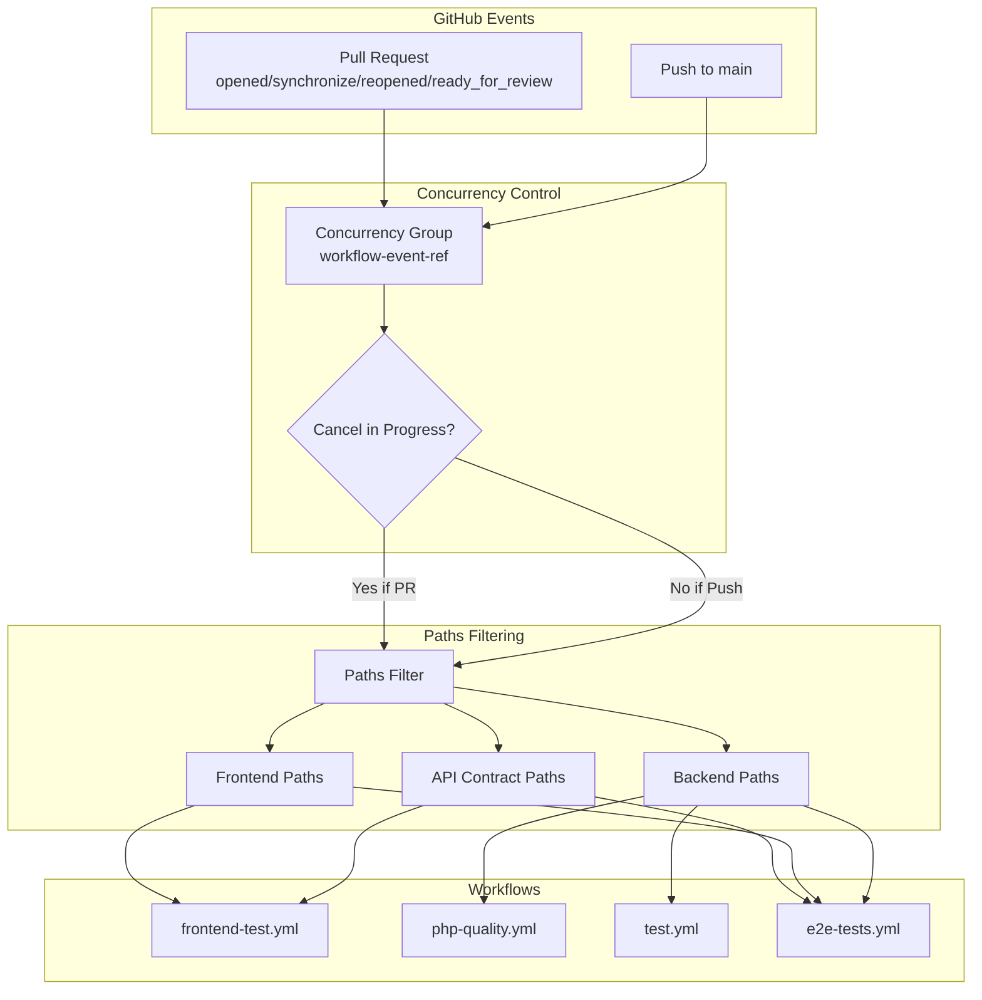
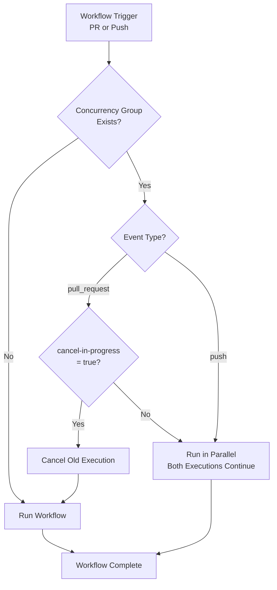
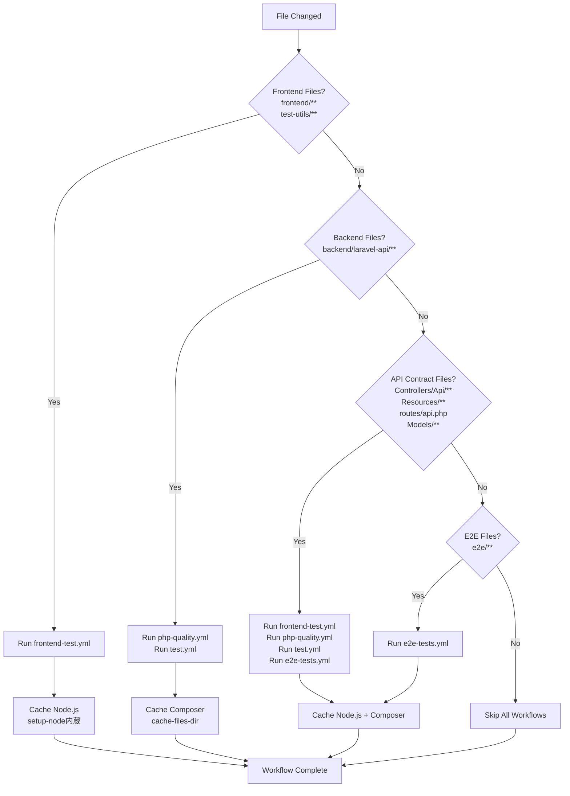
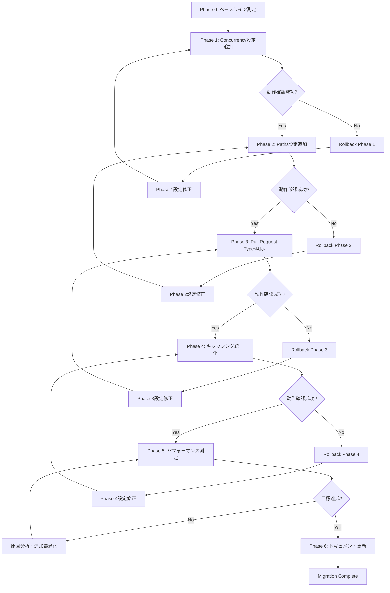

# Technical Design Document

## Overview

GitHub Actions ワークフローの発火タイミング最適化により、CI/CDパイプラインの効率化とコスト削減を実現する。現在、4つのワークフロー（frontend-test.yml、php-quality.yml、test.yml、e2e-tests.yml）が存在し、以下の問題を抱えている：

- 関連性のないファイル変更でもすべてのワークフローが実行される
- Pull Request と push イベントの重複実行によるリソース無駄遣い
- フロントエンドテストがバックエンドAPI変更を検出できない（APIレスポンス形式変更時の影響未検証）

本設計では、既存ワークフローに対して最小限の変更でconcurrency設定、paths設定、pull_request.types明示、キャッシング統一化を適用し、実行時間30-40%削減、実行頻度60-70%削減を目標とする。

### Goals

- **実行頻度削減**: paths設定によりファイル変更に応じた必要なワークフローのみ実行（60-70%削減目標）
- **実行時間削減**: concurrency設定とキャッシング統一化により実行時間を最適化（30-40%削減目標）
- **API契約整合性の早期検出**: バックエンドAPI変更時にフロントエンドテストを自動実行
- **ブランチプロテクション維持**: paths設定追加後も必須チェックが正常に動作することを保証

### Non-Goals

- ワークフロー実行環境の変更（Ubuntu バージョン、Docker イメージなど）
- テストコード自体の最適化
- 新規ワークフローの追加
- ブランチ戦略の変更

## Architecture

### Existing Architecture Analysis

現在のGitHub Actions CI/CD構成は以下の通り：

**既存ワークフロー構成**:
- **frontend-test.yml**: Jest + Testing Library テスト（Node.js 20.x、admin-app/user-app Matrix実行）
- **php-quality.yml**: Laravel Pint + Larastan 静的解析（PHP 8.4）
- **test.yml**: Pest 4 テスト（4 Shards並列実行、PostgreSQL/Redisサービス）
- **e2e-tests.yml**: Playwright E2Eテスト（4 Shards並列実行、concurrency設定済み）

**既存の問題点**:
1. **過剰実行**: すべてのワークフローがpush/pull_requestイベントで無条件実行
2. **重複実行**: PR内の連続コミットで古い実行がキャンセルされない（e2e-tests.yml除く）
3. **API契約未検証**: バックエンドAPI変更時にフロントエンドテストが実行されない
4. **キャッシング不統一**: frontend-test.ymlが独自キャッシュ設定、他はcache-files-dir方式

**既存パターン維持**:
- ワークフロー構造（jobs、steps、strategy）は変更しない
- 既存のShard並列実行戦略を維持
- e2e-tests.ymlの既存concurrency/paths設定をベースラインとする

### High-Level Architecture



### Technology Alignment

本機能は既存のGitHub Actions技術スタックに完全に準拠し、新しい依存関係は追加しない。

**既存技術スタックとの整合性**:
- **GitHub Actions**: ワークフロー構文の標準機能（concurrency、paths、pull_request.types）のみ使用
- **キャッシング**: GitHub Actions標準のactions/cache@v4、actions/setup-node@v4内蔵キャッシュ
- **Node.js/Composer**: 既存のキャッシング戦略を統一化（setup-node内蔵 / cache-files-dir）
- **ワークフロー構造**: 既存のjobs/steps/strategyを維持

**新規導入要素**:
なし（既存GitHub Actions機能の最適化のみ）

### Key Design Decisions

#### Decision 1: Concurrency設定の統一化

**Decision**: 全ワークフローに `group: ${{ github.workflow }}-${{ github.event_name }}-${{ github.ref }}` と `cancel-in-progress: ${{ github.event_name == 'pull_request' }}` を適用

**Context**: PR内で連続コミットがプッシュされた際、古い実行が継続し、リソースを無駄に消費している（e2e-tests.yml除く）

**Alternatives**:
1. **Workflow単位のgroup**: `group: ${{ github.workflow }}-${{ github.ref }}` - イベント種別を区別せず、よりアグレッシブにキャンセル
2. **ブランチ単位のgroup**: `group: ${{ github.ref }}` - すべてのワークフローを同一グループでキャンセル
3. **現状維持**: concurrency設定なし

**Selected Approach**: `group: ${{ github.workflow }}-${{ github.event_name }}-${{ github.ref }}`
- ワークフロー名、イベント種別、ブランチrefを組み合わせてグループ化
- pull_requestイベント時のみcancel-in-progressを有効化
- mainブランチへのpushは並列実行を許可

**Rationale**:
- e2e-tests.ymlの既存実装をベースラインとして採用（実績あり）
- PR時は最新コミットのみ実行、mainブランチpushは全実行を保証
- イベント種別を分離することでpush/pull_requestの実行が干渉しない

**Trade-offs**:
- **利点**: PR内の古い実行をキャンセルし、リソース効率化（実行頻度削減に寄与）
- **欠点**: groupキーが長く複雑（ただし、GitHub Actions標準パターン）

#### Decision 2: frontend-test.ymlへのAPI契約関連パス追加

**Decision**: frontend-test.ymlのpaths設定に以下を追加
- `backend/laravel-api/app/Http/Controllers/Api/**`
- `backend/laravel-api/app/Http/Resources/**`
- `backend/laravel-api/routes/api.php`
- `backend/laravel-api/app/Models/**`

**Context**: フロントエンドのactions.test.ts、api.test.tsはMSWでAPIモックを使用するが、バックエンドのAPIレスポンス形式変更を検出できない

**Alternatives**:
1. **E2EテストのみAPI契約検証**: フロントエンドテストはAPI契約を検証せず、E2Eテストに完全委譲
2. **Modelsを除外**: Models変更はフロントエンドに直接影響しないため除外
3. **現状維持**: API契約関連ファイルを監視しない

**Selected Approach**: Controllers/Api/**, Resources/**, routes/api.php, Models/** すべてを監視

**Rationale**:
- **early detection**: APIレスポンス形式変更を早期に検出（E2Eテストより高速）
- **MSW整合性**: APIモックとバックエンド実装の整合性を継続的に検証
- **Models包含**: ModelsはResourcesのデータソースであり、間接的にAPIレスポンスに影響

**Trade-offs**:
- **利点**: API契約不整合を早期検出、バグ予防
- **欠点**: frontend-test.yml実行頻度がやや増加（ただし、API変更は頻繁ではないため影響は限定的）

#### Decision 3: php-quality.ymlとtest.ymlの分離維持

**Decision**: php-quality.ymlとtest.ymlを統合せず、分離したまま維持する

**Context**: 両ワークフローはバックエンド関連ファイルを対象とし、設定の重複が存在する

**Alternatives**:
1. **統合ワークフロー作成**: backend-quality-tests.ymlとして1つのワークフローに統合、qualityジョブとtestジョブを別々に定義
2. **完全統合**: 1つのワークフロー、1つのジョブで品質チェックとテストを順次実行
3. **分離維持**: 現状のまま2つのワークフローを維持（選択）

**Selected Approach**: 分離維持

**Rationale**:
- **並列実行**: 品質チェックとテストを並列実行でき、全体実行時間を短縮
- **失敗の明確化**: どちらが失敗したか即座に判別可能（GitHubのCheckステータス表示）
- **最小変更**: 既存ワークフローへの影響を最小限に抑える
- **ブランチプロテクション**: 既存の必須チェック設定をそのまま利用可能

**Trade-offs**:
- **利点**: 並列実行による高速化、失敗の明確化、最小変更
- **欠点**: 設定ファイルが2つ存在（ただし、concurrency/paths/pull_request.typesは同一設定で統一）

## System Flows

### Concurrency Control Flow



### Paths Filter Decision Flow



## Requirements Traceability

| 要件 | 要件概要 | コンポーネント | 実現方法 |
|------|---------|--------------|---------|
| 1.1-1.7 | Concurrency制御による重複実行削減 | 全ワークフロー | concurrency設定追加（group/cancel-in-progress） |
| 2.1-2.14 | Paths設定による担当領域の明確化 | frontend-test.yml<br/>php-quality.yml<br/>test.yml<br/>e2e-tests.yml | paths設定追加（各ワークフローの担当領域明確化） |
| 3.1-3.9 | API契約整合性の早期検出 | frontend-test.yml | paths設定にAPI契約関連ファイル追加 |
| 4.1-4.9 | Pull Request Types の明示 | 全ワークフロー | pull_request.types設定追加 |
| 5.1-5.9 | 依存関係キャッシング統一化 | frontend-test.yml<br/>php-quality.yml<br/>test.yml | setup-node内蔵キャッシュ、cache-files-dirキャッシュ統一 |
| 6.1-6.4 | ブランチプロテクション対応 | GitHub Actions | paths設定によるスキップを成功として扱う（GitHub標準動作） |
| 7.1-7.5 | php-quality.yml と test.yml の統合検討 | 設計判断 | 分離維持を選択（並列実行、失敗の明確化） |
| 8.1-8.5 | パフォーマンス目標達成 | 全ワークフロー | concurrency/paths/キャッシング最適化 |
| 9.1-9.6 | 動作確認とテスト戦略 | テスト手順 | 各設定の動作確認テスト |
| 10.1-10.8 | ドキュメント更新 | README.md<br/>.kiro/docs/ | 最適化内容の文書化 |

## Components and Interfaces

### Workflow Configuration Components

#### frontend-test.yml ワークフロー

**Responsibility & Boundaries**
- **Primary Responsibility**: フロントエンド（Next.js）のJest + Testing Libraryテスト実行
- **Domain Boundary**: frontend/**, test-utils/** + API契約関連ファイル監視
- **Trigger Boundary**: フロントエンド変更時、API契約変更時

**Dependencies**
- **Inbound**: GitHub Events（pull_request, push）
- **Outbound**: actions/checkout@v4, actions/setup-node@v4, actions/cache@v4, actions/upload-artifact@v4
- **External**: npm（Node.js 20.x）

**Contract Definition**

**Trigger Contract**:
```yaml
on:
  push:
    branches: [main, develop]
    paths: [frontend/**, test-utils/**, jest.*, tsconfig.test.json, .github/workflows/frontend-test.yml]
  pull_request:
    types: [opened, synchronize, reopened, ready_for_review]
    branches: [main]
    paths: [frontend/**, test-utils/**, API契約関連ファイル]
```

**Concurrency Contract**:
```yaml
concurrency:
  group: ${{ github.workflow }}-${{ github.event_name }}-${{ github.ref }}
  cancel-in-progress: ${{ github.event_name == 'pull_request' }}
```

**Paths Contract**:
- フロントエンドディレクトリ: `frontend/**`, `test-utils/**`
- テスト設定: `jest.base.js`, `jest.config.js`, `jest.setup.ts`, `tsconfig.test.json`
- コード品質設定: `eslint.config.mjs`, `frontend/.eslint.base.mjs`, `.prettierrc`, `.prettierignore`
- 依存関係: `package.json`, `package-lock.json`, `frontend/**/package.json`, `frontend/**/package-lock.json`
- **API契約関連**: `backend/laravel-api/app/Http/Controllers/Api/**`, `backend/laravel-api/app/Http/Resources/**`, `backend/laravel-api/routes/api.php`, `backend/laravel-api/app/Models/**`
- ワークフロー自身: `.github/workflows/frontend-test.yml`

**Cache Contract**:
- **Strategy**: setup-node内蔵キャッシュ（`cache: npm`）
- **Cache Key**: `cache-dependency-path`に複数lockfile指定
- **Invalidation**: package-lock.json変更時

**Integration Strategy**:
- **Modification Approach**: 既存ワークフローの拡張（concurrency/paths/pull_request.types追加）
- **Backward Compatibility**: 既存のjobs/steps/strategyを完全に維持
- **Migration Path**: 1ファイルの編集のみ、段階的ロールアウト可能

#### php-quality.yml ワークフロー

**Responsibility & Boundaries**
- **Primary Responsibility**: バックエンド（Laravel）のLaravel Pint + Larastan静的解析実行
- **Domain Boundary**: backend/laravel-api/**
- **Trigger Boundary**: バックエンド変更時

**Dependencies**
- **Inbound**: GitHub Events（pull_request, push）
- **Outbound**: actions/checkout@v4, shivammathur/setup-php@v2, actions/cache@v4
- **External**: Composer（PHP 8.4）、Laravel Pint、Larastan

**Contract Definition**

**Trigger Contract**:
```yaml
on:
  push:
    branches: [main, develop]
    paths: [backend/laravel-api/**, .github/workflows/php-quality.yml]
  pull_request:
    types: [opened, synchronize, reopened, ready_for_review]
    branches: [main, develop]
    paths: [backend/laravel-api/**, .github/workflows/php-quality.yml]
```

**Concurrency Contract**:
```yaml
concurrency:
  group: ${{ github.workflow }}-${{ github.event_name }}-${{ github.ref }}
  cancel-in-progress: ${{ github.event_name == 'pull_request' }}
```

**Paths Contract**:
- バックエンドディレクトリ: `backend/laravel-api/**`
- ワークフロー自身: `.github/workflows/php-quality.yml`

**Cache Contract**:
- **Strategy**: cache-files-dirキャッシュ（`composer config cache-files-dir`の出力パス）
- **Cache Key**: `${{ runner.os }}-composer-${{ hashFiles('backend/laravel-api/composer.lock') }}`
- **Invalidation**: composer.lock変更時

**Integration Strategy**:
- **Modification Approach**: 既存ワークフローの拡張（concurrency/paths/pull_request.types追加、キャッシュ設定修正）
- **Backward Compatibility**: 既存のjobs/stepsを完全に維持
- **Migration Path**: 1ファイルの編集のみ、段階的ロールアウト可能

#### test.yml ワークフロー

**Responsibility & Boundaries**
- **Primary Responsibility**: バックエンド（Laravel）のPest 4テスト実行（4 Shards並列）
- **Domain Boundary**: backend/laravel-api/**
- **Trigger Boundary**: バックエンド変更時

**Dependencies**
- **Inbound**: GitHub Events（pull_request, push）
- **Outbound**: actions/checkout@v4, shivammathur/setup-php@v2, actions/cache@v4, actions/upload-artifact@v4
- **External**: Composer（PHP 8.4）、Pest 4、PostgreSQL 17-alpine（サービス）、Redis alpine（サービス）

**Contract Definition**

**Trigger Contract**:
```yaml
on:
  push:
    branches: [main, develop]
    paths: [backend/laravel-api/**, .github/workflows/test.yml]
  pull_request:
    types: [opened, synchronize, reopened, ready_for_review]
    branches: [main, develop]
    paths: [backend/laravel-api/**, .github/workflows/test.yml]
```

**Concurrency Contract**:
```yaml
concurrency:
  group: ${{ github.workflow }}-${{ github.event_name }}-${{ github.ref }}
  cancel-in-progress: ${{ github.event_name == 'pull_request' }}
```

**Paths Contract**:
- バックエンドディレクトリ: `backend/laravel-api/**`
- ワークフロー自身: `.github/workflows/test.yml`

**Cache Contract**:
- **Strategy**: cache-files-dirキャッシュ（php-quality.ymlと同一）
- **Cache Key**: `${{ runner.os }}-composer-${{ hashFiles('**/composer.lock') }}`
- **Invalidation**: composer.lock変更時

**Integration Strategy**:
- **Modification Approach**: 既存ワークフローの拡張（concurrency/paths/pull_request.types追加）
- **Backward Compatibility**: 既存のjobs/steps/strategyを完全に維持（4 Shards並列実行、PostgreSQL/Redisサービス）
- **Migration Path**: 1ファイルの編集のみ、段階的ロールアウト可能

#### e2e-tests.yml ワークフロー

**Responsibility & Boundaries**
- **Primary Responsibility**: Playwright E2Eテスト実行（4 Shards並列）
- **Domain Boundary**: frontend/**, backend/laravel-api/app/**, e2e/**
- **Trigger Boundary**: フロントエンド/バックエンド/E2E変更時

**Dependencies**
- **Inbound**: GitHub Events（pull_request, push, workflow_dispatch）
- **Outbound**: actions/checkout@v4, shivammathur/setup-php@v2, actions/setup-node@v4, actions/cache@v4, actions/upload-artifact@v4
- **External**: Playwright 1.47.2、npm、Composer

**Contract Definition**

**Trigger Contract**:
```yaml
on:
  workflow_dispatch:
    inputs:
      shard_count: [1, 2, 4, 8]
  pull_request:
    branches: [main]
    paths: [frontend/**, backend/laravel-api/app/**, e2e/**, .github/workflows/e2e-tests.yml]
  push:
    branches: [main]
    paths: [frontend/**, backend/laravel-api/app/**, e2e/**, .github/workflows/e2e-tests.yml]
```

**Concurrency Contract**（既存実装維持）:
```yaml
concurrency:
  group: ${{ github.workflow }}-${{ github.ref }}
  cancel-in-progress: true
```

**Paths Contract**（既存実装維持）:
- フロントエンド: `frontend/**`
- バックエンド: `backend/laravel-api/app/**`, `backend/laravel-api/routes/**`, `backend/laravel-api/config/**`, `backend/laravel-api/resources/**`
- E2E: `e2e/**`
- ワークフロー自身: `.github/workflows/e2e-tests.yml`

**Cache Contract**（既存実装維持）:
- **Node.js**: setup-node内蔵キャッシュ（`cache: npm`）
- **Composer**: cache-files-dirキャッシュ

**Integration Strategy**:
- **Modification Approach**: 既存実装をベースラインとして維持
- **Changes**: pull_request.types明示のみ追加
- **Backward Compatibility**: 完全互換

## Error Handling

### Error Strategy

GitHub Actions最適化における主要なエラーカテゴリと対応戦略：

### Error Categories and Responses

**Configuration Errors（設定ミス）**:
- **Syntax Error**: YAML構文エラー → GitHub ActionsのUI上でエラー表示、ワークフロー実行前に検出可能
- **Invalid Paths Pattern**: 不正なpaths設定 → ワークフローがスキップされる、または意図しない実行
- **Recovery**: プルリクエストでの段階的ロールアウトにより、mainマージ前に検出・修正

**Branch Protection Errors（必須チェック失敗）**:
- **Skipped Required Check**: paths設定によりワークフローがスキップされ、必須チェックが満たされない
- **Detection**: PRマージ時にGitHubが必須チェック未完了エラーを表示
- **Recovery**: GitHub Actionsのpaths設定によるスキップは成功として扱われる（GitHub標準動作）、ただしブランチプロテクション設定の見直しが必要な場合あり

**Cache Errors（キャッシュ失敗）**:
- **Cache Miss**: キャッシュが見つからない → restore-keysで部分一致キャッシュを使用、または依存関係を再インストール
- **Cache Corruption**: キャッシュが破損 → 依存関係を再インストール、次回実行で新しいキャッシュを作成
- **Recovery**: 自動フォールバック、実行時間が増加するが失敗しない

**Concurrency Errors（並列実行競合）**:
- **Unexpected Cancellation**: 意図しない実行キャンセル → concurrency group設定の見直し
- **Detection**: GitHub Actionsログでcanceled表示
- **Recovery**: concurrency group設定の調整、またはcancel-in-progress条件の見直し

### Monitoring

**Error Tracking**:
- GitHub Actions UIでワークフロー実行状況を監視
- 失敗したワークフローのログを確認
- Artifactsでテスト結果を保存（失敗時のデバッグに利用）

**Logging Strategy**:
- GitHub Actions標準ログ出力
- キャッシュヒット/ミスのログ記録
- paths設定によるスキップ判定のログ記録

**Health Monitoring**:
- 週次でワークフロー実行時間・実行頻度を測定
- パフォーマンス目標達成状況の継続的監視（30-40%実行時間削減、60-70%実行頻度削減）
- キャッシュヒット率80%以上の維持確認

## Testing Strategy

### Unit Tests（ワークフロー構文検証）

1. **YAML構文検証**: GitHub ActionsエディタでYAML構文エラーがないことを確認
2. **Concurrency設定検証**: `group`式と`cancel-in-progress`条件が正しく評価されることを確認
3. **Paths設定検証**: paths glob patternが意図したファイルにマッチすることを確認
4. **Pull Request Types設定検証**: 指定したイベントタイプのみでワークフローが実行されることを確認

### Integration Tests（ワークフロー実行テスト）

1. **Concurrency動作確認**: 同じPRに2つのコミットを連続プッシュし、古い実行がキャンセルされることを確認
2. **Paths Filter動作確認（フロントエンドのみ）**: フロントエンド関連ファイルのみ変更し、frontend-test.ymlのみ実行されることを確認
3. **Paths Filter動作確認（バックエンドのみ）**: バックエンド関連ファイルのみ変更し、php-quality.yml + test.ymlのみ実行されることを確認
4. **Paths Filter動作確認（API契約変更）**: バックエンドAPI Resources変更時に、frontend-test.yml + php-quality.yml + test.yml + e2e-tests.ymlすべて実行されることを確認
5. **Cache動作確認**: GitHub Actionsログで`Cache hit`表示を確認し、キャッシュが正常に動作することを確認

### E2E Tests（プルリクエストワークフロー）

1. **PRラベル追加テスト**: Pull Requestにラベルを追加し、ワークフローがスキップされることを確認
2. **PR ready_for_review テスト**: Draft PRをready_for_reviewに変更し、ワークフローが実行されることを確認
3. **Main ブランチpush並列実行テスト**: mainブランチに直接プッシュし、並列実行が許可されることを確認
4. **ブランチプロテクション動作確認**: paths設定によりワークフローがスキップされたPRでもマージが許可されることを確認

### Performance Tests（パフォーマンス測定）

1. **ベンチマーク測定（最適化前）**: 現在のワークフロー実行時間を測定し、ベースラインを記録
2. **ベンチマーク測定（最適化後）**: 最適化後のワークフロー実行時間を測定し、30-40%削減を確認
3. **実行頻度測定（1週間）**: 1週間のワークフロー実行ログを分析し、60-70%実行頻度削減を確認
4. **キャッシュヒット率測定**: Node.js/Composerキャッシュのヒット率が80%以上であることを確認

## Migration Strategy

### Migration Phases



### Phase Breakdown

**Phase 0: ベースライン測定**（Week 0）
- 現在のワークフロー実行時間・実行頻度を測定
- パフォーマンス目標の基準値を記録

**Phase 1: Concurrency設定追加**（Week 1）
- frontend-test.yml、php-quality.yml、test.ymlにconcurrency設定追加
- e2e-tests.ymlのconcurrency設定確認（既存実装維持）
- 動作確認: 同じPRへの連続コミット、ancient execution cancellation確認

**Phase 2: Paths設定追加**（Week 2-3）
- frontend-test.yml、php-quality.yml、test.ymlにpaths設定追加
- frontend-test.ymlにAPI契約関連ファイルパス追加
- 動作確認: フロントエンドのみ変更、バックエンドのみ変更、API契約変更の各シナリオ

**Phase 3: Pull Request Types明示**（Week 3）
- 全ワークフローにpull_request.types設定追加
- 動作確認: PRラベル追加でスキップ、ready_for_reviewで実行

**Phase 4: キャッシング統一化**（Week 4）
- frontend-test.ymlをsetup-node内蔵キャッシュに統一
- php-quality.yml、test.ymlをcache-files-dirキャッシュに統一
- 動作確認: キャッシュヒット確認

**Phase 5: パフォーマンス測定**（Week 4-5）
- 最適化後のベンチマーク測定
- 実行時間30-40%削減、実行頻度60-70%削減の達成確認
- キャッシュヒット率80%以上の確認

**Phase 6: ドキュメント更新**（Week 5）
- README.md更新（GitHub Actions最適化セクション追加）
- .kiro/docs/にドキュメント作成

### Rollback Triggers

各フェーズで以下の問題が発生した場合、ロールバックを実施：

- **Concurrency設定**: 意図しないワークフローキャンセル、mainブランチpushでの実行失敗
- **Paths設定**: 必要なワークフローがスキップされる、ブランチプロテクション必須チェック失敗
- **Pull Request Types**: 必要なイベントでワークフローが実行されない
- **キャッシング**: キャッシュ破損による継続的な実行失敗

### Validation Checkpoints

各フェーズ完了時に以下を確認：

1. **機能検証**: 該当フェーズの動作確認テストが全てパス
2. **回帰テスト**: 既存のテストスイート（frontend-test、php-quality、test、e2e-tests）が全て成功
3. **パフォーマンス検証**: 実行時間・実行頻度が悪化していないこと確認
4. **チーム承認**: レビュー完了、問題がないことを確認
