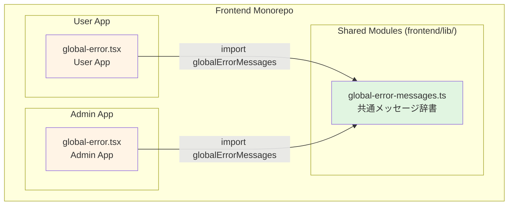
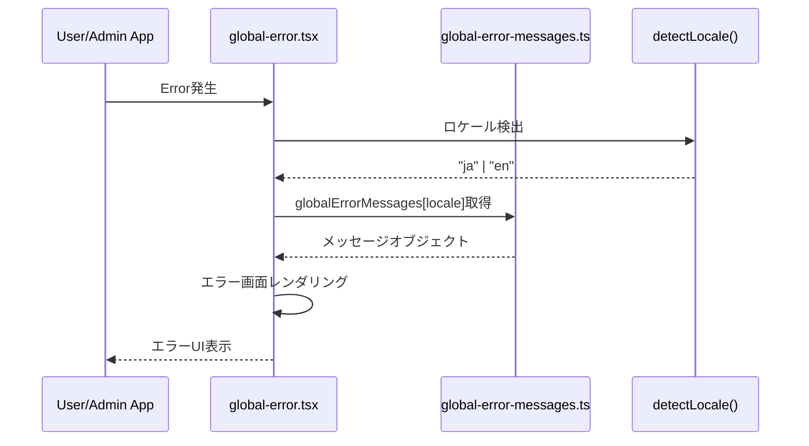
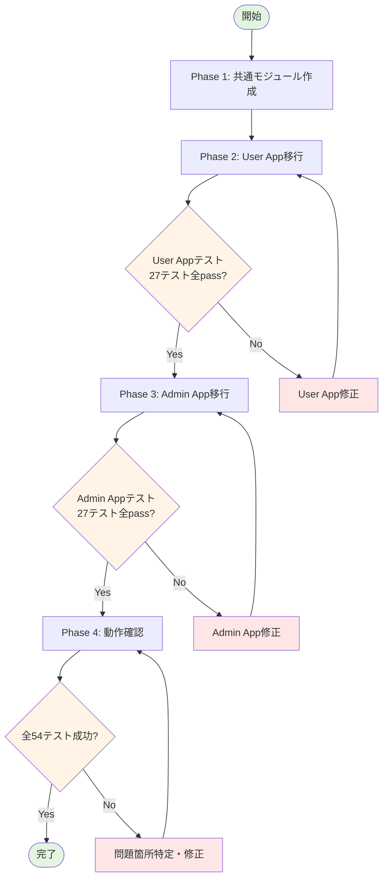

# Technical Design Document

## Overview

本機能は、User AppとAdmin Appの`global-error.tsx`に重複定義されている静的メッセージ辞書（`messages`）を共通モジュール（`frontend/lib/global-error-messages.ts`）に統合するリファクタリングである。約30個のエラーメッセージ（4カテゴリ × 2言語）を単一ファイルで管理することで、DRY原則を適用し、保守性を向上させ、メッセージドリフトを防止する。

**目的**: Global Error Boundaryの静的メッセージ辞書を共通モジュールに統合し、メンテナンス性を向上させ、表現のドリフトを防止する。

**利用者**: フロントエンド開発者およびメンテナンス担当者が、エラーメッセージの変更・追加時に単一ファイルのみを編集することで、User/Admin両アプリに一貫したメッセージを提供する。

**影響**: User App（`frontend/user-app/src/app/global-error.tsx`）とAdmin App（`frontend/admin-app/src/app/global-error.tsx`）の各448行のファイルから、約85行の重複する静的辞書定義を削除し、共通モジュールへのimport文に置き換える。これにより、モノレポ全体で約170行のコード削減と、保守対象ファイルの1箇所への集約を実現する。

### Goals

- User/Admin両アプリから重複する静的メッセージ辞書（約85行 × 2 = 170行）を完全削除
- 共通モジュール（`frontend/lib/global-error-messages.ts`）による単一箇所管理の実現
- 既存テスト全54テスト（User App 27テスト + Admin App 27テスト）の一切の修正なしでのpass
- TypeScript型安全性の完全維持（`as const`型アサーション、型推論の継続）
- 既存のロケール検出ロジック（`detectLocale()`）とError Boundary機能の完全な後方互換性

### Non-Goals

- next-intlメッセージファイル（`messages/ja.json`, `messages/en.json`）との統合（next-intlは通常のページで使用、global-error.tsxでは使用不可）
- メッセージ内容の変更や追加（既存メッセージの完全な移行のみ）
- Global Error Boundaryの機能拡張（ロケール検出ロジックやUIの変更）
- 他のコンポーネントへの共通モジュール適用拡大（本リファクタリングはGlobal Error Boundary専用）

## Architecture

### 既存アーキテクチャ分析

**現状の構成**:
- User App `global-error.tsx`（448行）とAdmin App `global-error.tsx`（448行）が完全に同一の静的辞書を重複定義
- 静的辞書は4カテゴリ（network, boundary, validation, global）× 2言語（ja, en）= 約30メッセージで構成
- `as const`型アサーションによる型安全性を実現
- `Locale`型（`"ja" | "en"`）による型推論でメッセージキーの誤用を防止
- `detectLocale()`関数がNEXT_LOCALE Cookie、document.documentElement.lang、navigator.languagesを順に検出

**既存の依存関係**:
- `ApiError`クラス（`frontend/lib/api-error.ts`）: RFC 7807準拠エラー
- `NetworkError`クラス（`frontend/lib/network-error.ts`）: ネットワークエラー
- `RFC7807Problem`型（`frontend/types/errors.ts`）: エラー型定義
- React 19のError Boundaryパターン（`global-error.tsx`）

**保持すべきパターン**:
- JSDocコメントによるモジュール説明（既存lib/配下のapi-error.ts、network-error.tsと同様）
- `as const`型アサーションによる型安全性
- 相対パスimport（`@/../../lib/*`パターン）
- エクスポート形式（`export const`, `export type`の明示的分離）

### 高層アーキテクチャ



**アーキテクチャ統合**:
- **既存パターン保持**: モノレポfrontend/lib/配下の共通モジュール配置パターンを踏襲（api-error.ts、network-error.ts、i18n-config.tsと同列）
- **新規コンポーネント根拠**: global-error.tsxがnext-intlのuseTranslations()フックを使用できない制約により、独自の静的辞書が必要。この辞書をlib/配下に配置することで、既存の共通モジュール群と統一的な管理を実現
- **技術スタック整合性**: TypeScript型システム（`as const`、型推論）、React 19 Error Boundary、Next.js 15.5 App Routerと完全互換
- **ステアリング準拠**: structure.mdのモノレポ構成原則（frontend/lib/配下の共通モジュール配置）、tech.mdの型安全性原則（TypeScript厳格型チェック）に準拠

### 技術スタック整合性

**既存技術スタックとの整合性**:
本リファクタリングは、既存の技術スタックに完全に整合します。新規ライブラリやフレームワークの導入は一切ありません。

- **TypeScript**: 既存の`as const`型アサーション、型推論、型エイリアス（`Locale`型）をそのまま維持
- **React 19**: Error Boundaryパターン（`global-error.tsx`）の既存実装を変更せず、importのみ変更
- **Next.js 15.5**: App Routerのglobal-error.tsxファイル構成を維持（`<html>`, `<body>`タグ必須の制約に準拠）
- **モノレポ構成**: 既存のfrontend/lib/配下の共通モジュール配置パターン（api-error.ts、network-error.ts等）を踏襲

**新規導入の依存関係**: なし

**既存依存関係からの削除**: なし

### 主要設計決定

#### 決定1: 共通モジュール配置先を `frontend/lib/` に決定

**Context**:
Issue #119では`frontend/lib/global-error-messages.ts`と`frontend/types/messages.d.ts`の2つの候補が提案されていた。既存のモノレポ構造では、`frontend/lib/`配下に実装コード（api-error.ts、network-error.ts等）、`frontend/types/`配下に型定義ファイル（errors.ts、messages.d.ts等）が配置されている。

**Alternatives**:
1. **frontend/lib/global-error-messages.ts**: 実装コードとして配置
2. **frontend/types/messages.d.ts**: 型定義ファイルとして配置（型定義と実装を同じ場所に配置）
3. **frontend/shared/**: 新規共通ディレクトリを作成

**Selected Approach**:
**frontend/lib/global-error-messages.ts** を採用

実装コード（`export const globalErrorMessages`）と型定義（`export type Locale`, `GlobalErrorMessages`）を同一ファイルに配置し、lib/配下に格納する。

**Rationale**:
- **既存パターンとの整合性**: 既存のlib/配下のモジュール（api-error.ts、network-error.ts）は、実装クラスと型定義を同一ファイルに含む構成を採用している。global-error-messages.tsも同様のパターンに従うことで、モノレポ全体の一貫性を維持
- **types/ディレクトリの目的**: 既存のtypes/配下は、next-intlの型拡張（messages.d.ts）やAPI型定義（errors.ts、api/v1.ts）等、主に型定義専用ファイルとして使用されている。実装コード（constオブジェクト）を含むglobal-error-messages.tsは、この配置ルールに適合しない
- **importの簡潔性**: lib/配下に配置することで、User/Admin両アプリから`@/../../lib/global-error-messages`の統一的な相対パスでimport可能

**Trade-offs**:
- **得られるもの**: 既存のlib/配下の共通モジュール群（api-error.ts、network-error.ts、i18n-config.ts）と統一的な配置、一貫したimportパターン
- **失うもの**: types/配下に型定義を集約する純粋な型定義ファイル構成（ただし、既存のlib/配下のモジュールも実装+型定義を含むため、一貫性の観点では問題なし）

#### 決定2: 静的辞書の完全移行（内容変更なし）

**Context**:
既存のUser/Admin両アプリのglobal-error.tsx内の静的辞書（messages）は、next-intlのメッセージファイル（messages/ja.json、messages/en.json）と完全に同じ構造とメッセージ内容を持つ。しかし、global-error.tsxはnext-intlのuseTranslations()フックを使用できない制約があるため、独自の静的辞書を保持している。

**Alternatives**:
1. **完全移行（内容変更なし）**: 既存メッセージをそのまま共通モジュールに移行
2. **メッセージの統合・整理**: next-intlのmessages/ja.jsonと完全に統合し、global-error.tsx側でメッセージを参照
3. **メッセージ内容の見直し**: 移行時にメッセージ表現を改善

**Selected Approach**:
**完全移行（内容変更なし）** を採用

既存の4カテゴリ（network, boundary, validation, global）× 2言語（ja, en）= 約30メッセージを、一切の変更なしで共通モジュールに移行する。

**Rationale**:
- **既存テスト保証**: 全54テスト（User App 27テスト + Admin App 27テスト）が一切の修正なしでpassすることを必須要件としている。メッセージ内容を変更すると、テストのアサーション（期待メッセージ）が失敗する可能性が高い
- **リファクタリング原則**: 本Issue #119の目的は「DRY原則の適用」であり、機能変更ではない。メッセージ内容の変更は別のIssueとして扱うべき
- **最小影響範囲**: 構造のみを変更し、動作に一切の影響を与えないことで、リグレッションリスクを最小化

**Trade-offs**:
- **得られるもの**: 既存テストの完全なpass保証、リグレッションリスクの最小化、明確なリファクタリング範囲
- **失うもの**: メッセージ表現改善の機会（ただし、将来的に共通モジュール化後に単一ファイルで改善可能）

#### 決定3: 型安全性の完全維持（`as const` + 型エイリアス）

**Context**:
既存のglobal-error.tsx内の静的辞書は、`as const`型アサーションにより、TypeScriptコンパイラが各メッセージを文字列リテラル型として推論している。また、`type Locale = keyof typeof messages`により、ロケールキー（"ja" | "en"）の型安全性を実現している。

**Alternatives**:
1. **as const型アサーション維持**: 既存の型安全性パターンをそのまま維持
2. **明示的型定義**: `GlobalErrorMessages`インターフェースを定義し、型注釈を明示
3. **型注釈削除**: 型推論に完全に依存し、型定義を最小化

**Selected Approach**:
**as const型アサーション維持 + 明示的型エクスポート** を採用

共通モジュールで`as const`型アサーションを維持し、さらに`export type Locale`と`GlobalErrorMessages`型を明示的にエクスポートする。

**Rationale**:
- **既存コンパイラ動作の維持**: `as const`型アサーションにより、既存のTypeScriptコンパイラの型推論ロジックが完全に維持される。User/Admin両アプリでの型チェックが既存と同一のまま動作
- **型定義の再利用性**: `Locale`型と`GlobalErrorMessages`型をexportすることで、将来的に他のモジュールからもこれらの型を参照可能（現状は不要だが、拡張性の観点で有益）
- **既存テストとの互換性**: 既存のテストコードがメッセージ文字列リテラル型に依存している場合、`as const`型アサーションの維持により、テストコードの修正が不要

**Trade-offs**:
- **得られるもの**: 既存の型安全性パターンの完全維持、TypeScriptコンパイラの型推論の継続、テストコードの非修正
- **失うもの**: 型定義のシンプルさ（ただし、既存パターンを変更しないことで、学習コストとリグレッションリスクを回避）

## システムフロー

本リファクタリングは、既存のGlobal Error Boundaryの動作フローを一切変更しません。以下は、共通モジュール化後のメッセージ参照フローです。



**フロー説明**:
1. **Error発生**: User/Admin Appでエラーが発生し、React 19のError Boundary（global-error.tsx）がエラーをキャッチ
2. **ロケール検出**: `detectLocale()`関数が、NEXT_LOCALE Cookie → document.documentElement.lang → navigator.languages の順にロケールを検出
3. **メッセージ取得**: 検出されたロケール（"ja" | "en"）を使用して、`globalErrorMessages[locale]`から対応するメッセージオブジェクトを取得
4. **エラーUI表示**: 取得したメッセージを使用して、既存のエラー画面（ApiError、NetworkError、汎用Error）をレンダリング

**既存フローからの変更点**: なし（メッセージの参照元がローカル定数から共通モジュールのimportに変更されるのみ）

## 要件トレーサビリティ

| 要件 | 要件概要 | コンポーネント | インターフェース | フロー |
|------|---------|------------|------------|--------|
| 1.1 | 単一ファイルでのメッセージ定義 | global-error-messages.ts | `export const globalErrorMessages` | - |
| 1.2 | 4カテゴリ・2言語サポート | global-error-messages.ts | `GlobalErrorMessages`型 | - |
| 1.3 | 共通モジュールからのimport | User/Admin global-error.tsx | `import { globalErrorMessages }` | メッセージ参照フロー |
| 1.4 | 既存メッセージ構造の完全互換性 | global-error-messages.ts | `messages[locale].network.timeout`等 | - |
| 1.5 | as const型アサーション維持 | global-error-messages.ts | `as const` | - |
| 2.1 | GlobalErrorMessages型定義 | global-error-messages.ts | `export type GlobalErrorMessages` | - |
| 2.2 | TypeScript型推論 | global-error-messages.ts | `as const`型アサーション | - |
| 2.3 | 存在しないキーのコンパイルエラー | TypeScriptコンパイラ | 型チェック | - |
| 2.4 | Locale型エクスポート | global-error-messages.ts | `export type Locale` | - |
| 2.5 | import文の型情報取得 | User/Admin global-error.tsx | TypeScript型推論 | - |
| 3.1-3.2 | ローカルmessages定義削除 | User/Admin global-error.tsx | - | メッセージ参照フロー |
| 3.3-3.4 | 共通モジュールimport | User/Admin global-error.tsx | `import { globalErrorMessages }` | メッセージ参照フロー |
| 3.5 | const t = globalErrorMessages[locale]変更 | User/Admin global-error.tsx | 変数代入 | メッセージ参照フロー |
| 3.6 | detectLocale()関数維持 | User/Admin global-error.tsx | `detectLocale()` | メッセージ参照フロー |
| 4.1-4.7 | 既存機能の完全動作 | User/Admin global-error.tsx | React Error Boundary | メッセージ参照フロー |
| 5.1-5.7 | 既存テスト全pass | global-error.test.tsx | Jest + Testing Library | - |
| 6.1-6.5 | インポートパス最適化 | User/Admin global-error.tsx | `@/../../lib/global-error-messages` | - |
| 7.1-7.5 | ドキュメント化 | global-error-messages.ts | JSDocコメント | - |

## コンポーネントとインターフェース

### 共通モジュール層

#### global-error-messages.ts

**責任と境界**:
- **主要責任**: Global Error Boundary専用の静的メッセージ辞書を提供し、User/Admin両アプリで一貫したエラーメッセージを保証する
- **ドメイン境界**: フロントエンド共通モジュール（`frontend/lib/`）に属し、Error Boundary UIのメッセージ表現を管理
- **データ所有**: 4カテゴリ（network, boundary, validation, global）× 2言語（ja, en）のエラーメッセージを所有
- **トランザクション境界**: 該当なし（静的データのみ）

**依存関係**:
- **インバウンド**: User App `global-error.tsx`、Admin App `global-error.tsx`
- **アウトバウンド**: なし（完全独立モジュール）
- **外部依存**: なし（TypeScript標準型のみ使用）

**契約定義**:

**モジュールインターフェース**:
```typescript
// 型定義
export type Locale = "ja" | "en";

export type GlobalErrorMessages = {
  network: {
    timeout: string;
    connection: string;
    unknown: string;
  };
  boundary: {
    title: string;
    retry: string;
    home: string;
    status: string;
    requestId: string;
    networkError: string;
    timeout: string;
    connectionError: string;
    retryableMessage: string;
  };
  validation: {
    title: string;
  };
  global: {
    title: string;
    retry: string;
    errorId: string;
    contactMessage: string;
  };
};

// メッセージ辞書
export const globalErrorMessages: Record<Locale, GlobalErrorMessages>;
```

**事前条件**: なし（静的データのため、常に参照可能）

**事後条件**:
- `globalErrorMessages["ja"]`または`globalErrorMessages["en"]`で有効なメッセージオブジェクトを取得
- 各メッセージキー（例: `globalErrorMessages.ja.network.timeout`）はnon-null文字列を保証

**不変条件**:
- メッセージ辞書は`as const`型アサーションにより、実行時に変更不可（immutable）
- 日本語（ja）と英語（en）の両方のロケールが常に存在
- 各カテゴリ（network, boundary, validation, global）が両ロケールで定義済み

**状態管理**:
- **状態モデル**: ステートレス（静的constオブジェクト）
- **永続化**: なし（メモリ上の静的データ）
- **並行性**: 読み取り専用のため、並行性制御不要

**統合戦略**:
- **修正アプローチ**: 拡張（既存のlib/配下に新規ファイルを追加）
- **後方互換性**: User/Admin両アプリの既存global-error.tsxから、ローカル定数をimportに置き換えるのみで互換性を維持
- **移行パス**: (1) 共通モジュール作成 → (2) User App移行 → (3) Admin App移行 → (4) 動作確認 → (5) テスト実行

### アプリケーション層

#### User App global-error.tsx / Admin App global-error.tsx

**責任と境界**:
- **主要責任**: アプリケーション全体のGlobal Error Boundaryとして、未処理エラーをキャッチし、ユーザーフレンドリーなエラー画面を表示
- **ドメイン境界**: User App / Admin Appの最上位Error Boundary（Next.js App Routerのglobal-error.tsx）
- **データ所有**: エラーオブジェクト（Error、ApiError、NetworkError）のレンダリング状態
- **トランザクション境界**: 該当なし（UIレンダリングのみ）

**依存関係**:
- **インバウンド**: Next.js App Routerのエラーハンドリングシステム
- **アウトバウンド**:
  - `globalErrorMessages` from `@/../../lib/global-error-messages`（新規）
  - `ApiError` from `@/lib/api-error`（既存）
  - `NetworkError` from `@/lib/network-error`（既存）
  - `RFC7807Problem` from `@/types/errors`（既存）
- **外部依存**: React 19（`useEffect`, `useState`フック）、Next.js 15.5（App Router）

**契約定義**:

**コンポーネントインターフェース**:
```typescript
interface GlobalErrorProps {
  error: Error & { digest?: string };
  reset: () => void;
}

export default function GlobalError(props: GlobalErrorProps): JSX.Element;
```

**事前条件**:
- `error`オブジェクトが有効なErrorインスタンス
- `reset`関数が呼び出し可能

**事後条件**:
- エラータイプ（ApiError / NetworkError / 汎用Error）に応じた適切なエラー画面をレンダリング
- 検出されたロケール（ja / en）に応じた多言語メッセージを表示
- `<html>`および`<body>`タグを含む完全なHTMLドキュメントを返却（Next.js global-error.tsx要件）

**不変条件**:
- `detectLocale()`関数が常に有効なロケール（"ja" | "en"）を返却
- `globalErrorMessages[locale]`が常に有効なメッセージオブジェクトを提供

**状態管理**:
- **状態モデル**: React `useState`によるロケール状態管理（`Locale`型）
- **永続化**: なし（エラー発生時の一時的な状態のみ）
- **並行性**: 該当なし（単一のError Boundaryインスタンス）

**統合戦略**:
- **修正アプローチ**: ローカル`messages`定数定義を削除し、共通モジュールからのimportに置き換え
- **後方互換性**: `const t = messages[locale]`を`const t = globalErrorMessages[locale]`に変更するのみで、既存のレンダリングロジックは一切変更なし
- **移行パス**:
  1. import文追加: `import { globalErrorMessages } from '@/../../lib/global-error-messages'`
  2. ローカル`messages`定数定義（約85行）を削除
  3. `const t = messages[locale]`を`const t = globalErrorMessages[locale]`に変更
  4. ローカル`type Locale`定義を削除（共通モジュールから型をimport）

## データモデル

### ドメインモデル

**コアコンセプト**:

本リファクタリングにおけるドメインモデルは、**エラーメッセージカタログ**である。このカタログは、Global Error Boundaryで表示される全てのエラーメッセージを、カテゴリ別・言語別に構造化して管理する。

**エンティティ**: なし（静的データのため、エンティティは存在しない）

**値オブジェクト**:
- **Locale**: 言語識別子（`"ja"` | `"en"`）。不変であり、メッセージ辞書のキーとして機能
- **GlobalErrorMessages**: 4つのメッセージカテゴリ（network, boundary, validation, global）を含む構造化メッセージオブジェクト。各カテゴリは複数の固有メッセージフィールドを持つ

**ビジネスルール＆不変条件**:
1. **完全性**: 各ロケール（ja, en）は、全4カテゴリ（network, boundary, validation, global）のメッセージを必ず含む
2. **対称性**: 日本語メッセージと英語メッセージは、同一のキー構造を持つ（例: `network.timeout`は両言語で存在）
3. **不変性**: `as const`型アサーションにより、メッセージ辞書は実行時に変更不可
4. **型安全性**: TypeScriptコンパイラが、存在しないメッセージキーへのアクセスをコンパイル時に検出

**概念図**:

```mermaid
graph TB
    subgraph "GlobalErrorMessages Domain Model"
        LOCALE[Locale Value Object<br/>"ja" or "en"]

        subgraph "Message Categories"
            NETWORK[Network Messages<br/>timeout, connection, unknown]
            BOUNDARY[Boundary Messages<br/>title, retry, status, etc.]
            VALIDATION[Validation Messages<br/>title]
            GLOBAL[Global Messages<br/>title, retry, errorId, etc.]
        end
    end

    LOCALE -->|indexes| NETWORK
    LOCALE -->|indexes| BOUNDARY
    LOCALE -->|indexes| VALIDATION
    LOCALE -->|indexes| GLOBAL

    style LOCALE fill:#e1f5e1
    style NETWORK fill:#fff4e6
    style BOUNDARY fill:#fff4e6
    style VALIDATION fill:#fff4e6
    style GLOBAL fill:#fff4e6
```

### 論理データモデル

**構造定義**:

```typescript
// ロケール型（言語識別子）
type Locale = "ja" | "en";

// メッセージカテゴリ構造
type GlobalErrorMessages = {
  // ネットワークエラーメッセージ
  network: {
    timeout: string;       // タイムアウトエラー
    connection: string;    // 接続エラー
    unknown: string;       // 不明なネットワークエラー
  };

  // Error Boundary UIメッセージ
  boundary: {
    title: string;             // エラー画面タイトル
    retry: string;             // 再試行ボタン
    home: string;              // ホームリンク
    status: string;            // ステータスコードラベル
    requestId: string;         // Request IDラベル
    networkError: string;      // ネットワークエラータイトル
    timeout: string;           // タイムアウトラベル
    connectionError: string;   // 接続エラーラベル
    retryableMessage: string;  // 再試行可能メッセージ
  };

  // バリデーションエラーメッセージ
  validation: {
    title: string;  // バリデーションエラータイトル
  };

  // 汎用エラーメッセージ
  global: {
    title: string;           // 汎用エラータイトル
    retry: string;           // 再試行ボタン
    errorId: string;         // Error IDラベル
    contactMessage: string;  // サポート連絡メッセージ
  };
};

// メッセージ辞書（ロケールをキーとするレコード）
type MessageDictionary = Record<Locale, GlobalErrorMessages>;
```

**エンティティ関係とカーディナリティ**:
- **MessageDictionary（1）**: **Locale（2）** = 1つのメッセージ辞書は、正確に2つのロケール（ja, en）を含む
- **Locale（1）**: **GlobalErrorMessages（1）** = 各ロケールは、1つの完全なメッセージセットを持つ
- **GlobalErrorMessages（1）**: **MessageCategory（4）** = 各メッセージセットは、正確に4つのカテゴリを含む

**一貫性＆整合性**:
- **トランザクション境界**: 該当なし（静的データのため、トランザクションは発生しない）
- **参照整合性**: TypeScript型システムにより、コンパイル時に全メッセージフィールドの存在を保証
- **時系列的側面**: なし（バージョニングや監査は不要）

### 物理データモデル

本リファクタリングでは、データベースやストレージシステムを使用しません。全てのメッセージデータは、TypeScriptソースコード内の静的constオブジェクトとして定義されます。

**ソースコードストレージ**:
- **ファイルパス**: `frontend/lib/global-error-messages.ts`
- **データ形式**: TypeScript const オブジェクト（`as const`型アサーション付き）
- **アクセスパターン**: ESモジュールimport（コンパイル時に静的解決）
- **最適化**: TypeScriptコンパイラによる型チェックとTree Shakingにより、未使用メッセージは最終バンドルから除外される可能性

**物理構造例**:
```typescript
export const globalErrorMessages = {
  ja: {
    network: {
      timeout: "リクエストがタイムアウトしました。しばらくしてから再度お試しください。",
      // ...
    },
    // ...
  },
  en: {
    network: {
      timeout: "The request timed out. Please try again later.",
      // ...
    },
    // ...
  },
} as const;
```

### データ契約＆統合

**APIデータ転送**: 該当なし（内部モジュール間のメモリ参照のみ）

**イベントスキーマ**: 該当なし（イベント駆動アーキテクチャは使用しない）

**サービス間データ管理**:
- **データ同期戦略**: 該当なし（User/Admin両アプリが同一の共通モジュールを静的にimport）
- **最終的整合性**: 該当なし（静的データのため、整合性は常に保証される）

## エラーハンドリング

### エラー戦略

本リファクタリングでは、既存のGlobal Error Boundaryのエラーハンドリング戦略を一切変更しません。共通モジュール化により、以下のエラー処理パターンが継続されます。

**エラーカテゴリと対応**:

1. **ApiError（4xx/5xx系）**:
   - **検出**: `error instanceof ApiError`またはerror.causeからのRFC 7807データ再構築
   - **対応**: RFC 7807準拠のエラー画面表示（title、status、detail、validationErrors、requestId）
   - **リカバリ**: `reset()`ボタンによるエラー状態クリア、再レンダリング試行

2. **NetworkError（ネットワーク系）**:
   - **検出**: `error instanceof NetworkError`またはerror.name検証
   - **対応**: ネットワークエラー専用画面（タイムアウト/接続エラー分類、再試行可能フラグ）
   - **リカバリ**: `reset()`ボタンによる再試行、isRetryableフラグに基づくガイダンス

3. **汎用Error（予期しないエラー）**:
   - **検出**: 上記以外の全てのErrorインスタンス
   - **対応**: 汎用エラー画面（本番環境ではメッセージマスク、開発環境ではスタックトレース表示）
   - **リカバリ**: `reset()`ボタン、digestによるエラーID提示

**共通モジュール化によるエラーハンドリングへの影響**: なし（メッセージの参照元が変わるのみで、エラー検出・分類・表示ロジックは不変）

### エラーカテゴリと対応詳細

**ユーザーエラー（4xx系）**:
- **無効な入力 → フィールドレベルバリデーション**: validationErrorsオブジェクトを解析し、各フィールドのエラーメッセージをリスト表示（`globalErrorMessages[locale].validation.title`使用）
- **未認証 → 認証ガイダンス**: ApiErrorのstatusが401の場合、認証失敗メッセージを表示（既存のapi-client.tsが401時に自動ログインリダイレクトを実行）
- **Not Found → ナビゲーションヘルプ**: 404エラー時、ホームへのリンク表示（`globalErrorMessages[locale].boundary.home`使用）

**システムエラー（5xx系）**:
- **インフラ障害 → グレースフルデグラデーション**: 500系エラー時、`globalErrorMessages[locale].boundary.title`と`detail`メッセージを表示、requestIdを提示
- **タイムアウト → サーキットブレーカー**: NetworkError.isTimeout()検出時、`globalErrorMessages[locale].network.timeout`メッセージ表示、`isRetryable`フラグに基づく再試行ボタン
- **リソース枯渇 → レート制限**: API側のレート制限エラー（429）をApiErrorとして表示（global-error.tsx側では特別な処理なし）

**ビジネスロジックエラー（422系）**:
- **ルール違反 → 条件説明**: 422エラーのvalidationErrorsを解析し、ビジネスルール違反の詳細を表示（`globalErrorMessages[locale].validation.title`カテゴリ）
- **状態競合 → 遷移ガイダンス**: 楽観的ロック失敗等の競合エラーをdetailメッセージで説明（`globalErrorMessages[locale].boundary.retryableMessage`使用）

### モニタリング

**エラー追跡**:
- 既存の`console.error("Global Error Boundary caught an error:", error)`によるコンソールログ出力を継続
- 本番環境では、Error.digestまたはApiError.requestIdによるエラー識別子を記録

**ロギング**:
- 開発環境: 完全なスタックトレース、ApiError.debug情報をブラウザコンソールに出力
- 本番環境: エラーメッセージをマスクし、Error ID（digest/requestId）のみを表示

**ヘルスモニタリング**:
- Global Error Boundaryは、アプリケーション全体の最後の砦として機能
- 頻繁なエラー発生は、アプリケーションレベルのヘルス問題を示唆（モニタリングツールとの統合は本リファクタリングの範囲外）

**共通モジュール化によるモニタリングへの影響**: なし（エラーログ出力ロジックは不変）

## テスト戦略

### ユニットテスト

**共通モジュールのテスト**（新規作成: `frontend/lib/__tests__/global-error-messages.test.ts`）:

1. **型定義検証**:
   - `Locale`型が`"ja" | "en"`のみを受け入れる
   - `globalErrorMessages`オブジェクトが`Record<Locale, GlobalErrorMessages>`型に適合

2. **メッセージ完全性検証**:
   - 日本語ロケール（ja）が全4カテゴリ（network, boundary, validation, global）を含む
   - 英語ロケール（en）が全4カテゴリを含む
   - 各カテゴリが必須フィールド（例: network.timeout）を含む

3. **不変性検証**:
   - `as const`型アサーションにより、実行時のメッセージ変更が不可能
   - TypeScriptコンパイラが、存在しないキーへのアクセスをコンパイルエラーとして検出

4. **メッセージ内容検証**:
   - 既存のUser App global-error.tsx内のローカル`messages`定義と完全に同一のメッセージ内容
   - 各メッセージがnon-empty文字列

**想定テストコード例**:
```typescript
import { globalErrorMessages, type Locale } from '../global-error-messages';

describe('globalErrorMessages', () => {
  it('should have ja and en locales', () => {
    expect(globalErrorMessages).toHaveProperty('ja');
    expect(globalErrorMessages).toHaveProperty('en');
  });

  it('should have all message categories', () => {
    const locales: Locale[] = ['ja', 'en'];
    locales.forEach((locale) => {
      expect(globalErrorMessages[locale]).toHaveProperty('network');
      expect(globalErrorMessages[locale]).toHaveProperty('boundary');
      expect(globalErrorMessages[locale]).toHaveProperty('validation');
      expect(globalErrorMessages[locale]).toHaveProperty('global');
    });
  });

  it('should have required network messages', () => {
    expect(globalErrorMessages.ja.network.timeout).toBe('リクエストがタイムアウトしました。しばらくしてから再度お試しください。');
    expect(globalErrorMessages.en.network.timeout).toBe('The request timed out. Please try again later.');
  });
});
```

### 統合テスト

**既存テストの完全なpass保証**:

本リファクタリングの最重要要件は、**既存の全54テスト（User App 27テスト + Admin App 27テスト）が一切の修正なしでpassすること**です。

**User App global-error.test.tsx**（27テスト）:
- ApiErrorレンダリングテスト（RFC 7807フォーマット、validationErrors表示、requestId表示）
- NetworkErrorレンダリングテスト（タイムアウト検出、接続エラー検出、再試行可能フラグ）
- 汎用Errorレンダリングテスト（本番環境でのメッセージマスク、開発環境でのスタックトレース表示）
- ロケール検出テスト（NEXT_LOCALE Cookie優先、document.documentElement.lang、navigator.languages）
- 多言語メッセージ表示テスト（日本語メッセージ、英語メッセージ）

**Admin App global-error.test.tsx**（27テスト）:
- User Appと同一のテストスイート

**期待される結果**:
- リファクタリング後、両アプリの全54テストが**一切の修正なし**でpass
- テストが検証する内容（メッセージ文字列、DOM構造、イベントハンドラ）は完全に不変
- 共通モジュールからimportされたメッセージが、既存のローカル定数と完全に同一であることをテストが間接的に保証

**統合テスト実行コマンド**:
```bash
# User App全テスト実行
cd frontend/user-app
npm test src/app/__tests__/global-error.test.tsx

# Admin App全テスト実行
cd frontend/admin-app
npm test src/app/__tests__/global-error.test.tsx

# モノレポルートから両アプリのテスト実行
npm run test:admin
npm run test:user
```

### E2E/UIテスト

本リファクタリングは、ユーザー向けのUI変更を一切含まないため、E2Eテストの追加・修正は不要です。

**既存E2Eテストへの影響**:
- `e2e/projects/shared/tests/security-headers.spec.ts`: Global Error Boundaryのセキュリティヘッダー検証（影響なし）
- その他のE2Eテスト: Global Error Boundaryが表示されるエラーケースのテストは、既存と同じUIが表示されるため影響なし

### パフォーマンス/負荷テスト

本リファクタリングは、パフォーマンスに影響を与える変更を含みません。

**パフォーマンス影響の分析**:
1. **バンドルサイズ**: 既存のローカル定数（約85行 × 2アプリ = 170行）を共通モジュール（約100行）に統合することで、重複分のコード削減。最終的なJavaScriptバンドルサイズは若干減少する見込み
2. **ロード時間**: 共通モジュールは静的import（`import { globalErrorMessages }`）のため、コンパイル時に解決される。実行時のオーバーヘッドは一切なし
3. **メモリ使用量**: 既存のローカル定数と同じメモリフットプリント（メッセージ文字列がメモリ上に1つだけ存在）

**負荷テスト**: 該当なし（静的データのみのリファクタリングのため、負荷特性に変化なし）

## セキュリティ考慮事項

本リファクタリングは、セキュリティに直接的な影響を与える変更を含みません。

**既存のセキュリティ機能の維持**:
- **本番環境でのエラーメッセージマスク**: `process.env.NODE_ENV === "production"`判定による、内部エラー詳細の非表示（既存ロジックを維持）
- **Request ID（trace_id）の安全な表示**: ApiError.requestIdやError.digestの表示により、サポート連絡時のエラー特定を可能にしつつ、内部実装詳細を隠蔽（既存ロジックを維持）
- **XSS対策**: エラーメッセージは全て静的な文字列リテラルであり、ユーザー入力を含まない。Reactの自動エスケープにより、XSS攻撃のリスクはゼロ

**新規セキュリティリスク**: なし（コードの構造変更のみで、機能変更なし）

## 移行戦略

本リファクタリングは、段階的な移行により、リグレッションリスクを最小化します。



### 移行フェーズ詳細

**Phase 1: 共通モジュール作成**（所要時間: 15分）:
1. `frontend/lib/global-error-messages.ts`ファイルを作成
2. User App `global-error.tsx`からローカル`messages`定数をコピー
3. 型定義（`Locale`、`GlobalErrorMessages`）を追加
4. `export const`および`export type`ステートメント追加
5. JSDocコメント追加（モジュールの目的と使用方法）
6. TypeScriptコンパイル確認（`npm run type-check`）

**Phase 2: User App移行**（所要時間: 10分）:
1. `frontend/user-app/src/app/global-error.tsx`にimport文追加
   ```typescript
   import { globalErrorMessages, type Locale } from '@/../../lib/global-error-messages';
   ```
2. ローカル`messages`定数定義（約85行）を削除
3. ローカル`type Locale`定義を削除
4. `const t = messages[locale]`を`const t = globalErrorMessages[locale]`に変更
5. TypeScriptコンパイル確認
6. User App全27テスト実行（`npm run test:user`）
7. **検証基準**: 全27テストがpassすること（失敗した場合、Phase 2の変更を修正）

**Phase 3: Admin App移行**（所要時間: 10分）:
1. Phase 2と同じ手順をAdmin Appに適用
2. TypeScriptコンパイル確認
3. Admin App全27テスト実行（`npm run test:admin`）
4. **検証基準**: 全27テストがpassすること

**Phase 4: 統合動作確認**（所要時間: 15分）:
1. User App開発サーバー起動（`npm run dev`）、ブラウザでエラー画面の手動確認
2. Admin App開発サーバー起動、ブラウザでエラー画面の手動確認
3. 日本語/英語ロケール切り替えテスト（ブラウザ言語設定変更）
4. 全54テスト実行（`npm test`）
5. **検証基準**: 全54テストがpass、手動確認でエラーメッセージが正しく表示

### ロールバックトリガー

以下の条件のいずれかが発生した場合、該当フェーズの変更を即座にロールバックします:

1. **TypeScriptコンパイルエラー**: 共通モジュールまたはglobal-error.tsxの型エラー
2. **テスト失敗**: User/Admin Appのいずれかで1つでもテストが失敗
3. **実行時エラー**: 開発サーバー起動時またはブラウザでのエラー画面表示時に、Uncaught ErrorまたはTypeError発生
4. **メッセージ表示異常**: 期待されるエラーメッセージが表示されない、または文字化け

### 検証チェックポイント

各フェーズ完了時に、以下のチェックリストを確認します:

**Phase 1完了時**:
- [ ] `frontend/lib/global-error-messages.ts`ファイルが存在
- [ ] `export const globalErrorMessages`が定義済み
- [ ] `export type Locale`および`GlobalErrorMessages`が定義済み
- [ ] TypeScriptコンパイルエラーなし

**Phase 2完了時**:
- [ ] User App `global-error.tsx`にimport文が追加済み
- [ ] ローカル`messages`定数が完全削除
- [ ] `const t = globalErrorMessages[locale]`に変更済み
- [ ] User App全27テストがpass

**Phase 3完了時**:
- [ ] Admin App `global-error.tsx`にimport文が追加済み
- [ ] ローカル`messages`定数が完全削除
- [ ] `const t = globalErrorMessages[locale]`に変更済み
- [ ] Admin App全27テストがpass

**Phase 4完了時**:
- [ ] User Appでエラー画面が正しく表示（ApiError、NetworkError、汎用Error）
- [ ] Admin Appでエラー画面が正しく表示
- [ ] 日本語/英語ロケールが正しく検出・表示
- [ ] 全54テストがpass
