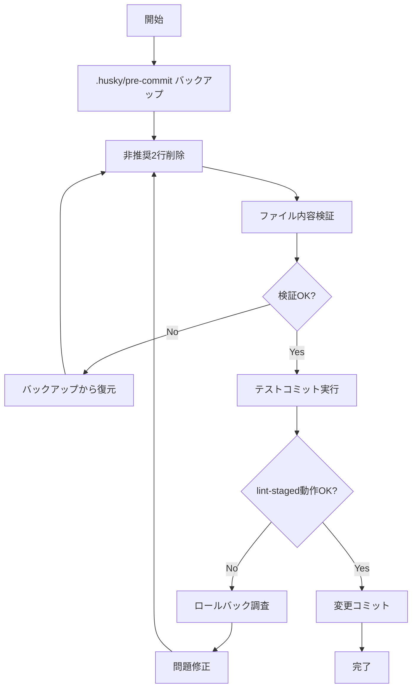

# 技術設計書: Husky v10対応 - pre-commitフック非推奨警告修正

## Overview

本機能は、Husky v10アップデート時にpre-commitフックが正常動作するよう、非推奨となったシェルスクリプト初期化行を削除する。現在のpre-commitフックには、Husky v4-v8時代の古い形式である`#!/usr/bin/env sh`と`. "$(dirname -- "$0")/_/husky.sh"`が含まれており、Husky v10では動作不能となる。

**Purpose**: 開発者がHusky v10環境でも既存のlint-staged自動実行機能を継続利用できるようにする

**Users**: 本プロジェクトの全開発者がGitコミット時にpre-commitフックを利用する

**Impact**: `.husky/pre-commit`ファイルの2行削除により、Husky v9/v10両方で動作する最小構成に変更される

### Goals
- Husky v10での非推奨警告を完全に解消する
- 既存のlint-staged自動実行機能を維持する
- Husky v9との後方互換性を保証する

### Non-Goals
- 他のGitフック（commit-msg、pre-push等）の修正は含まない
- Huskyバージョンアップグレード自体は含まない
- lint-staged設定の変更は含まない

## Architecture

### Existing Architecture Analysis

**現在の構成**:
```
.husky/pre-commit (4行)
├── #!/usr/bin/env sh              # 非推奨: シェバン
├── . "$(dirname -- "$0")/_/husky.sh"  # 非推奨: husky.sh読み込み
├── (空行)
└── npx lint-staged                # 実行コマンド
```

**既存パターンの維持**:
- モノレポルート`package.json`の`lint-staged`設定をそのまま利用
- `prepare`スクリプト（`husky`コマンド）の動作は変更なし
- フロントエンド（ESLint + Prettier）とバックエンド（Laravel Pint）の統合lint実行を継続

**技術的背景**:
- Husky v9.1.1以降、`#!/usr/bin/env sh`と`. "$(dirname -- "$0")/_/husky.sh"`は非推奨
- Husky v9では`sh`がフック実行に使用されるため、シェバンは無視される
- Husky v10では非推奨行が存在するとフック実行が失敗する

### Technology Alignment

**既存技術スタックとの整合性**:
- **Husky**: ^9 (package.jsonで指定済み、v10互換性確保)
- **lint-staged**: ^15 (変更なし)
- **Git Hooks**: `.husky/`ディレクトリ構成を維持

**新規依存関係**: なし

**既存パターンからの逸脱**: なし（Huskyの推奨形式に準拠）

### Key Design Decisions

#### Decision 1: 非推奨行の完全削除アプローチ

**Decision**: `.husky/pre-commit`から`#!/usr/bin/env sh`と`. "$(dirname -- "$0")/_/husky.sh"`の2行を完全削除する

**Context**: Husky v9.1.2以降は非推奨警告のみ表示し自動削除しないため、v10リリース前に手動対応が必要

**Alternatives**:
1. Huskyの自動マイグレーション機能を待つ（v9.1.1の自動削除機能は不完全でスキップされるケースあり）
2. Husky v10リリース後に対応する（フック失敗のリスクあり）

**Selected Approach**: 非推奨行を手動削除し、`npx lint-staged`のみを含む最小構成にする

**Rationale**:
- Husky v9では`sh`がフック実行に使用されるため、シェバンは機能的に不要
- v10での確実な動作保証には事前削除が必須
- 最小構成により保守性とデバッグ性が向上

**Trade-offs**:
- **Gain**: v10互換性保証、警告メッセージ解消、シンプルな構成
- **Sacrifice**: なし（非推奨行削除による機能的デメリットなし）

## Requirements Traceability

| Requirement | Requirement Summary | Components | Validation Method |
|-------------|---------------------|------------|-------------------|
| 1.1 | shebang行を含まない | .husky/pre-commit | ファイル内容検証 |
| 1.2 | husky.sh読み込み行を含まない | .husky/pre-commit | ファイル内容検証 |
| 1.3 | npx lint-stagedのみを含む | .husky/pre-commit | ファイル内容検証 |
| 2.1 | lint-staged自動実行 | .husky/pre-commit + package.json | コミット時動作確認 |
| 2.2 | フォーマット・lintチェック実行 | lint-staged設定 | テストファイルコミット |
| 2.3 | エラー時コミット中断 | Git pre-commitフック | lint失敗テスト |
| 3.1 | Husky v9動作保証 | .husky/pre-commit | v9環境での実行確認 |
| 3.2 | v10非推奨警告なし | Husky実行ログ | 警告メッセージ確認 |
| 3.3 | 期待通りのlint処理完了 | 統合動作確認 | E2Eコミットテスト |

## Components and Interfaces

### Git Hooks / pre-commit

#### pre-commitフックスクリプト

**Responsibility & Boundaries**:
- **Primary Responsibility**: Gitコミット前にlint-stagedを自動実行し、コード品質を保証する
- **Domain Boundary**: 開発環境のGitワークフロー（コミット前品質チェック）
- **Data Ownership**: ステージングエリアのファイルリスト
- **Transaction Boundary**: 単一コミット操作内での品質検証

**Dependencies**:
- **Inbound**: Git commit操作（ユーザーの`git commit`コマンド実行）
- **Outbound**:
  - `npx lint-staged`: lint-stagedパッケージ実行
  - `package.json`の`lint-staged`設定読み込み
- **External**:
  - Husky (^9): Git hooks管理フレームワーク
  - lint-staged (^15): ステージングファイルlint実行ツール

**External Dependencies Investigation**:

**Husky (^9)**:
- **公式**: https://github.com/typicode/husky
- **v9動作**: `sh`シェルでフックスクリプトを実行、シェバン無視
- **v10変更点**: 非推奨行（shebang + husky.sh読み込み）が存在するとフック失敗
- **認証/制限**: なし（ローカルGit hooksツール）
- **互換性**: Node.js >= 18（package.json enginesで制約なし、問題なし）
- **既知の問題**: v9.1.1の自動削除機能が不完全（commit-msgフックがスキップされるケースあり）

**lint-staged (^15)**:
- **公式**: https://github.com/lint-staged/lint-staged
- **設定場所**: `package.json`の`lint-staged`フィールド
- **現在の設定**:
  - フロントエンド: ESLint (--fix --max-warnings=0) + Prettier
  - バックエンド: Laravel Pint
- **動作**: ステージングエリアのファイルのみに対してlint/format実行
- **Exit Code**: lint失敗時は非ゼロを返し、Gitコミットを中断

**Contract Definition**:

**Bash Script Interface**:
```bash
# .husky/pre-commit (修正後の形式)

npx lint-staged
```

- **Preconditions**:
  - Huskyが`npm run prepare`経由でインストール済み
  - `package.json`に`lint-staged`設定が存在
  - ステージングエリアに1つ以上のファイルが存在
- **Postconditions**:
  - lint-stagedが正常終了（exit code 0）した場合、Gitコミット続行
  - lint-stagedが失敗（exit code 非ゼロ）した場合、Gitコミット中断
- **Invariants**:
  - スクリプトは常にlint-stagedを実行する
  - Husky v9/v10両方で同じ動作を保証する

**State Management**:
- **State Model**: ステートレス（フックスクリプト自体は状態を保持しない）
- **Persistence**: なし
- **Concurrency**: Gitコミット操作は単一プロセスで実行されるため競合なし

**Integration Strategy**:
- **Modification Approach**: 既存ファイルから非推奨行のみを削除（Extend方式）
- **Backward Compatibility**: Husky v9との完全互換性維持
- **Migration Path**:
  1. 非推奨行削除
  2. Gitコミットテストで動作確認
  3. Husky v10リリース後も追加変更不要

## Testing Strategy

### Unit Tests
本機能はシェルスクリプト修正のため、従来の意味でのユニットテストは適用外。以下の検証を実施：

1. **ファイル内容検証**: `.husky/pre-commit`が`npx lint-staged`のみを含むことを確認
2. **シェバン不在確認**: `#!/usr/bin/env sh`が含まれないことを検証
3. **husky.sh読み込み不在確認**: `. "$(dirname -- "$0")/_/husky.sh"`が含まれないことを検証

### Integration Tests

1. **lint-staged実行確認**:
   - ステージングエリアにテストファイルを追加
   - `git commit`実行時にlint-stagedが自動起動することを確認
   - 実行ログに`npx lint-staged`が表示されることを確認

2. **フォーマットチェック成功パターン**:
   - 正常なコードファイルをステージング
   - コミット成功（lint-staged exit code 0）を確認

3. **lintエラー検出パターン**:
   - 意図的にlintエラーを含むファイルをステージング
   - コミット中断（lint-staged exit code 非ゼロ）を確認
   - エラーメッセージが適切に表示されることを確認

4. **フロントエンド・バックエンド統合確認**:
   - TypeScriptファイル（ESLint + Prettier）とPHPファイル（Laravel Pint）を同時にステージング
   - 両方のlintツールが正常実行されることを確認

### E2E Tests

1. **Husky v9環境での動作確認**:
   - 現在のHusky v9環境で修正後のpre-commitフックを実行
   - エラー・警告なく正常動作することを確認

2. **非推奨警告の不在確認**:
   - `git commit`実行時のHusky出力を確認
   - "DEPRECATED"警告メッセージが表示されないことを検証

3. **複数コミット連続実行**:
   - 複数ファイルの段階的コミットを実行
   - 各コミットでpre-commitフックが安定動作することを確認

### Performance Tests
本機能はパフォーマンスクリティカルではないため、専用のパフォーマンステストは不要。ただし以下を確認：

1. **フック実行時間**: 非推奨行削除前後でlint-staged実行時間に変化がないことを確認（シェバン・husky.sh読み込みはv9で無視されるため影響なし）

## Migration Strategy

本機能は既存システムへの小規模修正（ファイル内容の2行削除）のため、段階的移行は不要。以下の単純なプロセスで実施：



**Process**:
1. **Phase 1 - 修正実施** (5分):
   - `.husky/pre-commit`から2行削除
   - ファイル内容が`npx lint-staged`のみであることを目視確認

2. **Phase 2 - 動作確認** (10分):
   - テストファイルをステージングしてコミット実行
   - lint-staged自動実行を確認
   - 非推奨警告が表示されないことを確認

3. **Phase 3 - コミット・デプロイ** (5分):
   - 修正内容をGitコミット
   - リモートリポジトリへプッシュ
   - チームメンバーへの通知

**Rollback Triggers**:
- lint-stagedが実行されない場合
- 予期しないエラーメッセージが表示される場合
- コミットが完全に失敗する場合

**Validation Checkpoints**:
- ✅ ファイル内容が`npx lint-staged`のみ
- ✅ テストコミットでlint-staged実行
- ✅ 非推奨警告メッセージなし
- ✅ lint失敗時のコミット中断動作正常
