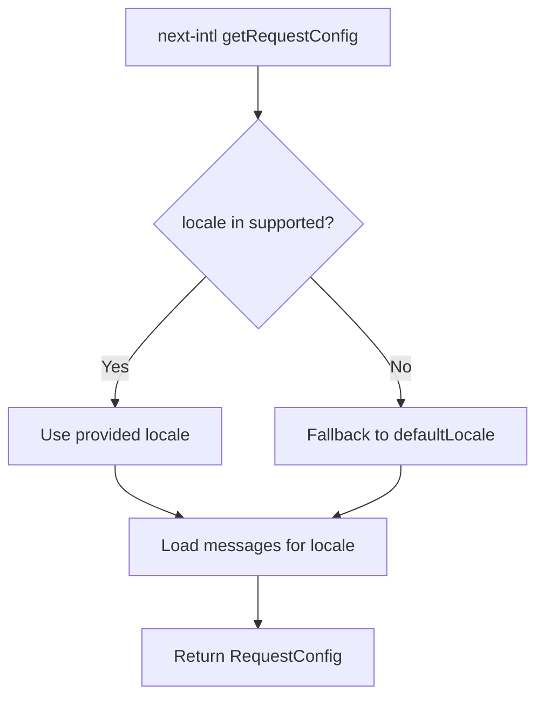
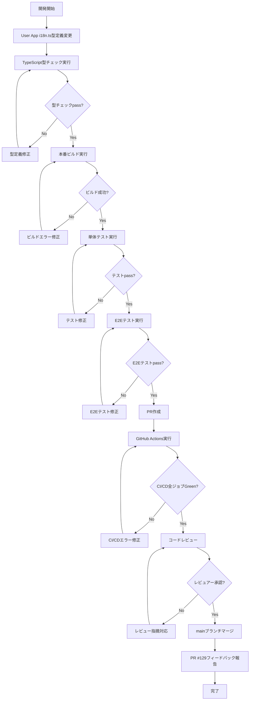

# Technical Design Document

## Overview

本設計は、User AppとAdmin Appで異なっている`validLocale`型定義を統一することで、コードベース全体の一貫性を向上させる。PR #129のレビュー指摘に基づき、next-intl公式型定義（`RequestConfig.locale: string`）に準拠した実装に統一し、型安全性を保ちつつフレームワークとの互換性を確保する。

**目的**: User App `frontend/user-app/src/i18n.ts`の`validLocale`型定義を`Locale`型から`string`型に変更し、Admin Appと同一の型定義に統一する。これにより、next-intlライブラリの型定義との整合性を保ち、将来のライブラリ更新時の互換性を確保する。

**対象ユーザー**: フロントエンド開発者。User App/Admin Appの両アプリで一貫した型定義を使用し、i18n設定の保守性を向上させる。

**影響範囲**: User App `i18n.ts`の型定義のみ（1ファイル、1行の型定義変更）。Admin App、共通i18n設定、翻訳ファイル、メッセージファイルには変更なし。実行時動作への影響もなし（`validLocale`は常に`'ja' | 'en'`の実行時値）。

### Goals

- User App `i18n.ts`の`validLocale`型定義を`Locale`型から`string`型に変更する
- Admin Appの`string`型実装をベストプラクティスとして確立し、両アプリで統一する
- next-intl v4.4.0公式型定義（`RequestConfig.locale: string`）との整合性を確保する
- TypeScript型チェック、本番ビルド、単体テスト、E2Eテスト、CI/CD自動検証をpass
- コードベース全体の一貫性を向上し、メンテナンス性を向上させる

**成功基準**:
- 全TypeScript型チェックがエラーなくpass（ワークスペース全体、Admin App、User App）
- 両アプリの本番ビルドが成功（各1-3分）
- 単体テスト全pass、E2Eテストでロケール切替動作正常
- GitHub Actions全ジョブGreen（lint、test、build）

### Non-Goals

- 共通i18n設定（`frontend/lib/i18n-config.ts`）の変更（共通設定として既に確立済み）
- 他のi18n関連ファイル（翻訳ファイル、メッセージファイル等）の変更
- 新規機能追加（ロケール検証の強化、バリデーション関数追加等）
- バックエンド側の変更（フロントエンド専用タスク）
- 共通i18nモジュール強化（将来的対応として別Issue化）

---

## Architecture

### Existing Architecture Analysis

**現状のアーキテクチャ**:

本機能は既存のNext.js 15.5 + next-intl v4.4.0 i18n設定に対する軽微な型定義調整であり、アーキテクチャパターンの変更は伴わない。

**既存のi18nアーキテクチャ構成**:

1. **共通i18n設定** (`frontend/lib/i18n-config.ts`)
   - サポートロケール定義: `['ja', 'en'] as const`
   - デフォルトロケール: `'ja'`
   - 型定義: `type Locale = (typeof i18nConfig.locales)[number]` (`'ja' | 'en'`)
   - 役割: User App/Admin App両方で共有されるi18n設定の単一ソース

2. **User App i18n設定** (`frontend/user-app/src/i18n.ts`)
   - **現状**: `validLocale: Locale`型（厳密な`'ja' | 'en'`型）
   - **問題**: next-intl公式型定義（`RequestConfig.locale: string`）と不整合
   - **影響**: 将来のnext-intlライブラリ更新時に型エラーの可能性
   - next-intl `getRequestConfig`を使用してロケール検証とメッセージロード

3. **Admin App i18n設定** (`frontend/admin-app/src/i18n.ts`)
   - **現状**: `validLocale: string`型（next-intl公式型定義準拠）
   - **ベストプラクティス**: 後から検証された新しい方針、本番ビルド成功確認済み
   - next-intl `getRequestConfig`を使用してロケール検証とメッセージロード

**既存のドメイン境界を尊重**:
- 共通i18n設定層（`frontend/lib/`）: 両アプリで共有される設定の単一ソース
- アプリ固有i18n設定層（`frontend/{admin-app,user-app}/src/`）: 各アプリのnext-intl統合ロジック
- 翻訳メッセージ層（`frontend/{admin-app,user-app}/src/messages/`）: ロケール別メッセージファイル

**統合ポイントを維持**:
- `@shared/i18n-config`パスエイリアスによる共通i18n設定のImport統一
- next-intl `getRequestConfig`のAPI契約維持
- TypeScript型定義の一貫性（今回の変更で達成）

### High-Level Architecture

本機能は既存アーキテクチャへの軽微な型定義調整のため、アーキテクチャ図は不要。既存の3層構造（共通i18n設定層、アプリ固有i18n設定層、翻訳メッセージ層）を維持し、User App i18n設定層の型定義のみを調整する。

### Technology Alignment

**既存技術スタックとの整合性**:

本機能は既存の確立された技術スタックに対する型定義の統一化であり、新しい技術の導入はない。以下の既存技術との整合性を維持する:

- **TypeScript ^5**: 厳格な型チェックによる型安全性保証
- **Next.js 15.5.4**: App Routerアーキテクチャ、next-intl統合
- **next-intl ^4.4.0**: next-intl公式型定義（`RequestConfig.locale: string`）に準拠
- **Node.js 20.x**: ビルド・テスト実行環境
- **モノレポ構成**: User App/Admin Appでの共通i18n設定の共有（`@shared/i18n-config`）

**新規依存関係**: なし（既存のnext-intl v4.4.0を使用、型定義のみ変更）

**既存パターンからの逸脱**: なし（Admin Appの`string`型実装パターンに統一、既存のベストプラクティスを踏襲）

### Key Design Decisions

#### 決定1: Admin Appの`string`型実装に統一（Option A採用）

**決定**: User Appの`validLocale`型定義を`Locale`型から`string`型に変更し、Admin Appと同一の型定義に統一する。

**コンテキスト**:
- PR #129レビューで、User App（`Locale`型）とAdmin App（`string`型）の型定義不一致が指摘された
- next-intl公式型定義（`RequestConfig.locale: string`）との整合性を確保する必要がある
- 両アプリで型定義を統一し、コードベース全体の一貫性を向上させたい

**選択肢**:
1. **Option A**: Admin Appの`string`型に統一（User App `i18n.ts`を変更）
2. **Option B**: User Appの`Locale`型に統一（Admin App `i18n.ts`を変更）
3. **Option C**: 現状維持（両アプリで異なる型定義を許容）

**選択されたアプローチ**: **Option A - Admin Appの`string`型に統一**

**実装方法**:
```typescript
// User App: frontend/user-app/src/i18n.ts

// Before (現状):
const validLocale: Locale = i18nConfig.locales.includes(locale as Locale)
  ? (locale as Locale)
  : i18nConfig.defaultLocale;

// After (変更後):
const validLocale: string = i18nConfig.locales.includes(locale as Locale)
  ? (locale as string)
  : i18nConfig.defaultLocale;
```

**根拠**:
1. **next-intl公式型定義準拠**: `RequestConfig.locale: string`型との整合性確保
2. **Admin App実装の検証済み**: 後から検証された新しい方針であり、本番ビルド成功確認済み
3. **将来のライブラリ更新対応**: next-intlバージョンアップ時の互換性確保
4. **外部境界設計ベストプラクティス**: routing、middleware、request configでは`string`型を使用するのが推奨パターン

**トレードオフ**:
- **得られるもの**:
  - next-intl公式型定義との完全な整合性
  - 両アプリでの型定義統一によるメンテナンス性向上
  - 将来のライブラリ更新時の互換性保証
  - コードベース全体の一貫性確保
- **犠牲にするもの**:
  - User App内部での厳密な`'ja' | 'en'`型推論（ただし実行時値は常に`'ja' | 'en'`のため影響なし）
  - 型レベルでの不正ロケール検出（ただし実行時バリデーションで検出するため問題なし）

---

## System Flows

本機能は単純な型定義変更のため、複雑なフローは存在しない。既存のロケール検証フローを維持し、型定義のみを調整する。

### ロケール検証フロー（変更前後で同一）



**フロー説明**:
1. next-intl `getRequestConfig`がロケールパラメータを受け取る
2. サポートロケール（`['ja', 'en']`）に含まれるかチェック
3. 含まれる場合: 提供されたロケールを使用
4. 含まれない場合: デフォルトロケール（`'ja'`）にフォールバック
5. 該当ロケールのメッセージファイルをロード
6. `RequestConfig`オブジェクトを返却

**型定義変更の影響**:
- `validLocale`変数の型のみが`Locale`型から`string`型に変更される
- フロー、ロジック、実行時動作は完全に同一

---

## Requirements Traceability

本機能は軽微な型定義統一化のため、要件とコンポーネントの対応は直接的かつ明快である。

| 要件 | 要件概要 | 対象コンポーネント | 変更内容 | 検証方法 |
|------|----------|-------------------|----------|----------|
| 1.1-1.5 | 型定義統一化 | User App `i18n.ts` | `validLocale: Locale` → `validLocale: string` | TypeScript型チェック、コードレビュー |
| 2.1-2.3 | next-intl公式型定義準拠 | User App/Admin App `i18n.ts` | `string`型でnext-intl `RequestConfig.locale`と整合 | TypeScript型定義検証、ドキュメント参照 |
| 3.1-3.4 | TypeScript型チェック検証 | ワークスペース全体、Admin/User App | 型推論エラーなし | `npm run type-check` |
| 4.1-4.4 | 本番ビルド検証 | Admin/User App | ビルド成功、ビルド時間1-3分 | `npm run build` |
| 5.1-5.4 | 単体テスト検証 | フロントエンドテストスイート | 全テストpass | `npm test`, `npm run test:admin`, `npm run test:user` |
| 6.1-6.5 | E2Eテスト検証 | Docker環境、Playwright E2E | ロケール切替動作正常（ja/en/invalid） | `make dev`, E2Eテスト実行 |
| 7.1-7.5 | CI/CD自動検証 | GitHub Actions | lint/test/build全ジョブGreen | `.github/workflows/frontend-test.yml` |
| 8.1-8.3 | 共通i18n設定確認 | `frontend/lib/i18n-config.ts` | 変更なし（既存維持） | ファイル比較、git diff |
| 9.1-9.4 | Admin Appとの実装一貫性確認 | User/Admin App `i18n.ts` | 両アプリで`string`型、同一パターン | コードレビュー、実装比較 |
| 10.1-10.3 | PR #129フィードバック報告 | GitHub PR #129 | 対応完了報告、検証結果サマリー | PR コメント投稿 |

---

## Components and Interfaces

### フロントエンド i18n設定層

#### User App i18n設定

**責任とドメイン境界**:
- **主要責任**: User Appのnext-intl設定統合、ロケール検証、メッセージロード
- **ドメイン境界**: User App固有のi18n設定レイヤー（`frontend/user-app/src/`）
- **データ所有**: User Appのロケール検証結果、ロードされたメッセージオブジェクト
- **トランザクション境界**: next-intl `getRequestConfig`呼び出し単位（ステートレス、副作用なし）

**依存関係**:
- **インバウンド**: Next.js App Router（ルーティング時にnext-intlが自動呼び出し）
- **アウトバウンド**:
  - 共通i18n設定（`@shared/i18n-config`）: サポートロケール、デフォルトロケール、`Locale`型定義
  - メッセージファイル（`../messages/{locale}.json`）: ロケール別翻訳メッセージ
- **外部**: next-intl v4.4.0 `getRequestConfig` API

**契約定義**:

**型定義契約**（変更後）:
```typescript
/**
 * i18n Request Configuration for User App
 *
 * @param locale - リクエストされたロケール（string型、next-intl公式型定義準拠）
 * @returns Promise<RequestConfig> - next-intl設定オブジェクト
 *
 * @preconditions
 * - i18nConfig.locales配列が定義されている
 * - i18nConfig.defaultLocaleが有効なロケール
 * - メッセージファイル（../messages/{locale}.json）が存在する
 *
 * @postconditions
 * - validLocaleは常にサポートロケール（'ja' | 'en'）のいずれか
 * - 返却されるlocaleはstring型（next-intl RequestConfig.locale準拠）
 * - messagesオブジェクトが正常にロードされる
 *
 * @invariants
 * - validLocaleはi18nConfig.localesに含まれる値のみ
 * - デフォルトロケールへのフォールバック機能が常に動作
 */
export default getRequestConfig(async ({ locale }): Promise<RequestConfig> => {
  // 型定義変更: Locale型 → string型
  const validLocale: string = i18nConfig.locales.includes(locale as Locale)
    ? (locale as string)
    : i18nConfig.defaultLocale;

  return {
    locale: validLocale,
    messages: (await import(`../messages/${validLocale}.json`)).default,
  };
});
```

**変更内容の詳細**:
```typescript
// Before（現状）:
const validLocale: Locale = i18nConfig.locales.includes(locale as Locale)
  ? (locale as Locale)
  : i18nConfig.defaultLocale;

// After（変更後）:
const validLocale: string = i18nConfig.locales.includes(locale as Locale)
  ? (locale as string)
  : i18nConfig.defaultLocale;
```

**型推論の変化**:
- **Before**: `validLocale`は`'ja' | 'en'`型（厳密なリテラル型）
- **After**: `validLocale`は`string`型（next-intl公式型定義準拠）
- **実行時値**: 変更なし（常に`'ja'`または`'en'`）

**統合戦略**:

**変更アプローチ**: 既存コードの型定義のみ変更（Extend）
- ファイル構造: 維持（`frontend/user-app/src/i18n.ts`）
- ロケール検証ロジック: 維持（`i18nConfig.locales.includes()`）
- メッセージロードロジック: 維持（動的import）
- 型定義のみ変更: `Locale`型 → `string`型

**後方互換性**: 維持
- 実行時動作: 完全に同一（`validLocale`の実行時値は常に`'ja' | 'en'`）
- next-intl API契約: 維持（`RequestConfig`型定義に準拠）
- 既存のi18n機能: 影響なし（ロケール切替、翻訳、エラーメッセージ多言語化）

**移行パス**: 不要（単一コミットで完了、段階的移行不要）

---

#### Admin App i18n設定（参照実装）

**責任とドメイン境界**:
- **主要責任**: Admin Appのnext-intl設定統合、ロケール検証、メッセージロード
- **ドメイン境界**: Admin App固有のi18n設定レイヤー（`frontend/admin-app/src/`）
- **データ所有**: Admin Appのロケール検証結果、ロードされたメッセージオブジェクト
- **トランザクション境界**: next-intl `getRequestConfig`呼び出し単位（ステートレス、副作用なし）

**依存関係**:
- **インバウンド**: Next.js App Router（ルーティング時にnext-intlが自動呼び出し）
- **アウトバウンド**:
  - 共通i18n設定（`@shared/i18n-config`）
  - メッセージファイル（`../messages/{locale}.json`）
- **外部**: next-intl v4.4.0 `getRequestConfig` API

**契約定義**:

**型定義契約**（現状維持、ベストプラクティス）:
```typescript
/**
 * i18n Request Configuration for Admin App
 *
 * @param locale - リクエストされたロケール（string型、next-intl公式型定義準拠）
 * @returns Promise<RequestConfig> - next-intl設定オブジェクト
 *
 * @preconditions
 * - i18nConfig.locales配列が定義されている
 * - i18nConfig.defaultLocaleが有効なロケール
 * - メッセージファイル（../messages/{locale}.json）が存在する
 *
 * @postconditions
 * - validLocaleは常にサポートロケール（'ja' | 'en'）のいずれか
 * - 返却されるlocaleはstring型（next-intl RequestConfig.locale準拠）
 * - messagesオブジェクトが正常にロードされる
 *
 * @invariants
 * - validLocaleはi18nConfig.localesに含まれる値のみ
 * - デフォルトロケールへのフォールバック機能が常に動作
 */
export default getRequestConfig(async ({ locale }): Promise<RequestConfig> => {
  // next-intl公式型定義準拠: string型を使用
  const validLocale: string = i18nConfig.locales.includes(locale as Locale)
    ? (locale as string)
    : i18nConfig.defaultLocale;

  return {
    locale: validLocale,
    messages: (await import(`../messages/${validLocale}.json`)).default,
  };
});
```

**変更内容**: なし（既存の`string`型実装を維持）

**ベストプラクティス根拠**:
1. next-intl公式型定義（`RequestConfig.locale: string`）に準拠
2. 本番ビルド成功確認済み（2025-11-11実装）
3. 外部境界（routing、middleware、request config）で`string`型を使用する推奨パターン

---

#### 共通i18n設定（変更なし）

**責任とドメイン境界**:
- **主要責任**: User App/Admin App両方で共有されるi18n設定の単一ソース
- **ドメイン境界**: 共通ライブラリ層（`frontend/lib/`）
- **データ所有**: サポートロケール配列、デフォルトロケール、`Locale`型定義
- **トランザクション境界**: なし（静的設定）

**依存関係**:
- **インバウンド**: User App `i18n.ts`、Admin App `i18n.ts`（`@shared/i18n-config`経由でImport）
- **アウトバウンド**: なし
- **外部**: なし

**契約定義**:

**型定義契約**（変更なし、既存維持）:
```typescript
/**
 * Shared i18n configuration for User App and Admin App
 */
export const i18nConfig = {
  locales: ['ja', 'en'] as const,
  defaultLocale: 'ja' as const,
} as const;

/**
 * Type definition for supported locales
 *
 * @type {'ja' | 'en'}
 */
export type Locale = (typeof i18nConfig.locales)[number];
```

**変更内容**: なし（共通設定として既に確立済み、今回の変更対象外）

**不変性保証**:
- `locales`配列: `['ja', 'en'] as const`（不変）
- `defaultLocale`: `'ja' as const`（不変）
- `Locale`型定義: `'ja' | 'en'`（不変）

---

## Data Models

本機能はi18n設定の型定義統一化であり、データモデルの変更は伴わない。既存のi18n設定データ構造を維持する。

### i18n設定データ構造（変更なし）

```typescript
/**
 * i18n Configuration Data Model
 */
interface I18nConfig {
  /**
   * サポートロケール配列
   * @type {readonly ['ja', 'en']}
   */
  readonly locales: readonly ['ja', 'en'];

  /**
   * デフォルトロケール
   * @type {'ja'}
   */
  readonly defaultLocale: 'ja';
}

/**
 * サポートロケール型
 * @type {'ja' | 'en'}
 */
type Locale = 'ja' | 'en';
```

### メッセージデータ構造（変更なし）

```typescript
/**
 * Translation Message Data Model
 */
interface Messages {
  [key: string]: string | Messages;
}
```

**データ永続化**: なし（静的設定とJSONファイル）

**データ整合性**:
- `i18nConfig.locales`と`messages/{locale}.json`ファイルの対応
- メッセージファイルが`ja.json`、`en.json`の2つ存在することを前提

---

## Error Handling

### Error Strategy

本機能は型定義の統一化であり、新しいエラーケースは発生しない。既存のロケール検証エラーハンドリングを維持する。

### Error Categories and Responses

**User Errors (4xx)**: なし（型定義変更のみ、ユーザー入力に影響なし）

**System Errors (5xx)**:
- **メッセージファイル読み込み失敗**: `import()` で発生する可能性のあるエラー
  - **対応**: Next.jsビルド時にメッセージファイルの存在を検証、実行時エラーは通常発生しない
  - **回復**: エラー発生時はNext.jsのエラーバウンダリで捕捉、エラーページ表示

**Business Logic Errors (422)**: なし（ロケール検証ロジックは変更なし）

**既存のロケール検証ロジック**（変更なし）:
```typescript
// 不正ロケールはデフォルトロケールにフォールバック
const validLocale: string = i18nConfig.locales.includes(locale as Locale)
  ? (locale as string)
  : i18nConfig.defaultLocale;
```

**エラー発生時の動作**:
1. **不正ロケール** (`/invalid/...`): デフォルトロケール（`'ja'`）にフォールバック、日本語コンテンツ表示
2. **メッセージファイル不在**: ビルド時エラー（本番環境では発生しない）
3. **型エラー**: TypeScript型チェックでビルド前に検出

### Monitoring

**ログ記録**: なし（型定義変更のみ、新規ログ不要）

**ヘルスモニタリング**: 既存のNext.jsヘルスチェック機能を使用（変更なし）

**エラートラッキング**: 既存のNext.jsエラーバウンダリで捕捉（変更なし）

---

## Testing Strategy

### Unit Tests

**対象**: i18n設定ロジック、ロケール検証、型定義整合性

**テストケース**:
1. **User App i18n設定**:
   - `validLocale`が`string`型であることを確認
   - サポートロケール（`'ja'`、`'en'`）が正しく検証される
   - 不正ロケールがデフォルトロケール（`'ja'`）にフォールバックする
   - メッセージオブジェクトが正常にロードされる

2. **Admin App i18n設定**:
   - `validLocale`が`string`型であることを確認（既存テスト維持）
   - ロケール検証ロジックがUser Appと同一パターンである

3. **共通i18n設定**:
   - `i18nConfig.locales`が`['ja', 'en']`である
   - `i18nConfig.defaultLocale`が`'ja'`である
   - `Locale`型が`'ja' | 'en'`である

**実行コマンド**:
- `npm test`: フロントエンド単体テスト全実行
- `npm run test:admin`: Admin App単体テスト
- `npm run test:user`: User App単体テスト

**期待結果**: 全テストpass（エラーなし）

### Integration Tests

**対象**: Admin/User App全体のビルドとTypeScript型チェック

**テストケース**:
1. **TypeScript型チェック**:
   - ワークスペース全体で型推論エラーなし（`npm run type-check`）
   - Admin Appで型推論エラーなし（`cd frontend/admin-app && npm run type-check`）
   - User Appで型推論エラーなし（`cd frontend/user-app && npm run type-check`）

2. **本番ビルド**:
   - Admin Appビルド成功（`cd frontend/admin-app && npm run build`、1-3分）
   - User Appビルド成功（`cd frontend/user-app && npm run build`、1-3分）

3. **next-intl型定義整合性**:
   - `RequestConfig.locale`型が`string`型であることを確認
   - User/Admin App両方で`validLocale: string`型定義が一致

**実行コマンド**:
- `npm run type-check && npm run build`

**期待結果**:
- 型チェックエラーなし
- ビルド成功
- ビルド時間が変更前と同等（各1-3分）

### E2E Tests

**対象**: 言語切替動作、ロケール解決、エラーメッセージ表示

**テストケース**:
1. **Docker環境起動**:
   - `make dev`で全サービス（user-app: 13001、admin-app: 13002、laravel-api: 13000）がhealthyステータスになる

2. **デフォルトロケール（ja）**:
   - `/ja/...`または`/`でアクセス時、日本語コンテンツ表示

3. **英語ロケール（en）**:
   - `/en/...`でアクセス時、英語コンテンツ表示

4. **不正ロケール（invalid）**:
   - `/invalid/...`でアクセス時、デフォルトロケール（ja）にフォールバック、日本語コンテンツ表示

**実行コマンド**:
- `make dev`: Docker環境起動
- `docker compose ps`: ヘルスチェック確認
- `npm run test:e2e`: E2Eテスト実行（もし存在する場合）

**期待結果**:
- 全サービスhealthy
- ロケール切替動作正常（ja/en/invalid）
- エラーメッセージの言語表示正常

### Performance Tests

**対象**: ビルド時間、実行時パフォーマンス

**テストケース**:
1. **ビルド時間測定**:
   - Admin Appビルド時間が変更前と同等（1-3分）
   - User Appビルド時間が変更前と同等（1-3分）

2. **実行時パフォーマンス**:
   - ロケール解決処理時間が変更前と同等
   - メッセージロード時間が変更前と同等

**期待結果**: パフォーマンス劣化なし（型定義のみの変更のため影響なし）

### CI/CD Automated Tests

**対象**: GitHub Actions自動検証

**ワークフロー**: `.github/workflows/frontend-test.yml`

**テストケース**:
1. **lint / user-app (20.x)**: ESLint静的解析（`--max-warnings=0`）
2. **test / user-app (20.x)**: Jest単体テスト + カバレッジ
3. **build / user-app (20.x)**: TypeScript型チェック + Next.js本番ビルド

**自動トリガー**: `frontend/**`配下ファイル変更時、PR作成時

**期待結果**: 全ジョブGreenステータス（成功）

---

## Security Considerations

本機能は型定義の統一化であり、セキュリティへの影響はない。

**認証・認可**: 変更なし（i18n設定は認証・認可に関与しない）

**データ保護**: 変更なし（翻訳メッセージは公開情報、個人情報を含まない）

**外部統合**: next-intl v4.4.0ライブラリの既存セキュリティ対策を維持

**コンプライアンス**: 変更なし（型定義変更のみ）

---

## Performance & Scalability

本機能は型定義の統一化であり、パフォーマンス・スケーラビリティへの影響はない。

**ターゲットメトリクス**:
- **ビルド時間**: 変更前と同等（各アプリ1-3分）
- **実行時パフォーマンス**: 変更前と同等（型定義のみの変更のため影響なし）

**スケーリングアプローチ**: 変更なし（既存のNext.jsスケーリング戦略を維持）

**キャッシング戦略**: 変更なし（既存のNext.jsキャッシング機能を使用）

**最適化技術**: 不要（型定義変更のみ、実行時コードに影響なし）

---

## Migration Strategy

本機能は単一ファイルの型定義変更のため、段階的移行は不要。単一コミットで完了する。

### Migration Flow



### Migration Phases

**Phase 1: コード変更**（5分）
- User App `frontend/user-app/src/i18n.ts`の型定義変更
- `validLocale: Locale` → `validLocale: string`

**Phase 2: ローカル検証**（10分）
- TypeScript型チェック実行（`npm run type-check`）
- 本番ビルド実行（Admin/User App: `npm run build`）
- 単体テスト実行（`npm test`）

**Phase 3: E2Eテスト**（5-10分）
- Docker環境起動（`make dev`）
- ロケール切替動作確認（ja/en/invalid）
- E2Eテスト実行（もし存在する場合）

**Phase 4: PR作成とCI/CD検証**（5-10分）
- PR作成（`git checkout -b fix/unify-validlocale-type`）
- GitHub Actions自動実行（lint、test、build）
- 全ジョブGreen確認

**Phase 5: コードレビューとマージ**（レビュー時間依存）
- レビュアー承認（1名以上）
- mainブランチへのマージ
- PR #129へのフィードバック報告

**Total Time**: 約25-40分（レビュー時間除く）

### Rollback Triggers

**ロールバックトリガー**:
1. TypeScript型チェック失敗
2. 本番ビルド失敗
3. 単体テスト失敗
4. E2Eテスト失敗（ロケール切替動作異常）
5. GitHub Actions CI/CDジョブ失敗

**ロールバック手順**:
1. 変更をrevert: `git revert <commit-hash>`
2. 元のUser App実装に戻す（`validLocale: Locale`型）
3. 全検証を再実行してrollback成功を確認

### Validation Checkpoints

**Checkpoint 1: 型チェック**
- ✅ `npm run type-check`: ワークスペース全体で型推論エラーなし
- ✅ Admin App: `cd frontend/admin-app && npm run type-check`
- ✅ User App: `cd frontend/user-app && npm run type-check`

**Checkpoint 2: ビルド**
- ✅ Admin App: `cd frontend/admin-app && npm run build`（1-3分）
- ✅ User App: `cd frontend/user-app && npm run build`（1-3分）

**Checkpoint 3: テスト**
- ✅ 単体テスト: `npm test`、`npm run test:admin`、`npm run test:user`
- ✅ E2Eテスト: `make dev`、ロケール切替動作確認

**Checkpoint 4: CI/CD**
- ✅ GitHub Actions: lint / user-app (20.x) Green
- ✅ GitHub Actions: test / user-app (20.x) Green
- ✅ GitHub Actions: build / user-app (20.x) Green

**Checkpoint 5: レビュー**
- ✅ コードレビュー完了（Admin App実装との整合性確認）
- ✅ レビュアー承認（1名以上）

---

## Notes

### 実装時の注意事項

1. **型定義変更のみ**: ロケール検証ロジック、メッセージロードロジックは変更しない
2. **Admin Appは変更なし**: 既存の`string`型実装を維持（参照実装として活用）
3. **共通i18n設定は変更なし**: `frontend/lib/i18n-config.ts`は既存のまま維持
4. **実行時動作は同一**: `validLocale`の実行時値は常に`'ja' | 'en'`で不変

### 将来的拡張（Out of Scope）

以下の機能強化は本仕様の範囲外とし、将来的に別Issueとして対応する:

1. **共通i18nモジュール強化**:
   ```typescript
   // frontend/lib/i18n-config.ts
   export const isKnownLocale = (l: string): l is Locale => ...
   export const ensureKnownLocale = (l: string, fallback: Locale): Locale => ...
   export const normalizeLocale = (l: string | undefined, fallback: Locale): string => ...
   ```

2. **内部型安全性確保**: 外部境界では`string`型、内部では`AppLocale`（`'ja' | 'en'`）に変換する設計パターン

### PR #129マージ後の対応推奨

この変更は軽微な型定義の統一化であり、実行時の動作には影響しない。PR #129マージ後に対応することを推奨する。

---

**統一方針確立**: Admin Appの`string`型実装をnext-intl公式型定義準拠のベストプラクティスとして確立し、User Appも同様の実装に統一することで、コードベース全体の一貫性を向上させる。
