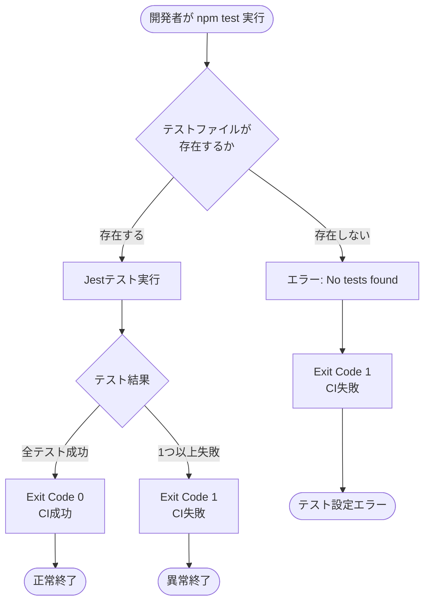

# Technical Design Document

## Overview

本設計は、User App と Admin App の `package.json` から Jest の `--passWithNoTests` オプションを削除することで、テスト実行の確実性を向上させる。この変更により、テストファイルが見つからない場合にCIが確実に失敗するようになり、テストファイルの誤削除やテスト設定ミスを早期に検知できる。

**Purpose**: テストファイルが存在しない場合にテスト実行が確実に失敗するようにすることで、BtoCテンプレートとしてのコード品質を維持し、開発者がテスト設定やテストファイルの問題を即座に検出できるようにする。

**Users**: Laravel Next.js B2Cテンプレートを利用する開発者、DevOps担当者、および将来的にこのテンプレートを導入する組織。

**Impact**: 現在の設定では `--passWithNoTests` オプションにより、テストが0件でもCI/CDが成功してしまう。この設定を削除することで、テストファイル削除やtestMatchパターン設定ミスを即座に検出できるようになる。

### Goals

- User App と Admin App の package.json から `--passWithNoTests` オプションを削除する
- 既存の385テスト（User App: 173、Admin App: 212）が正常に動作することを確認する
- テストファイルが見つからない場合にCI/CDが確実に失敗する仕組みを確立する
- ローカル開発環境とCI/CD環境で一貫したテスト実行動作を保証する

### Non-Goals

- Jest設定（jest.config.js、jest.base.js）の変更は行わない
- テストコードの追加や修正は行わない
- CI/CDワークフロー（frontend-test.yml）の構造変更は行わない
- カバレッジ閾値の変更は行わない

---

## Architecture

### Existing Architecture Analysis

本プロジェクトは、モノレポ構成のフロントエンドテスト環境を採用している：

- **Jest 30**: テストランナー（User App/Admin App共通）
- **モノレポ設定**: `jest.config.js` でプロジェクトを統括管理
- **並列実行**: GitHub Actions Matrix戦略で両アプリを並列テスト
- **既存テスト**: User App 173テスト、Admin App 212テスト、合計385テスト

**現在の問題**:
- `frontend/user-app/package.json` の `test` および `test:coverage` スクリプトに `--passWithNoTests` が設定されている
- `frontend/admin-app/package.json` の `test` および `test:coverage` スクリプトに `--passWithNoTests` が設定されている
- この設定により、テストファイルが見つからない場合でもJestが成功終了コード（0）を返す

### High-Level Architecture


### Technology Alignment

本機能は既存のテスト技術スタックと完全に整合している：

**既存技術スタック**:
- **Jest 30**: テストランナー（`--passWithNoTests` オプションはJest標準機能）
- **GitHub Actions**: CI/CDプラットフォーム（frontend-test.yml）
- **npm scripts**: パッケージマネージャースクリプト（package.json）

**新規依存関係**: なし（既存ツールのオプション削除のみ）

**既存パターン維持**:
- モノレポ Jest設定構造（jest.config.js → 各アプリのjest.config.js）
- GitHub Actions Matrix戦略（並列実行）
- npm scriptsによるテスト実行フロー

### Key Design Decisions

#### Decision 1: オプション削除のみで実装

**Decision**: `--passWithNoTests` オプションを削除し、他のJest設定や代替オプションは追加しない

**Context**:
- 現在、両アプリに `--passWithNoTests` が設定されており、テストが見つからない場合でもCI/CDが成功してしまう
- 既に385個のテストが存在しており、通常の開発フローでテストが0件になることは想定されない

**Alternatives**:
1. **`--bail` オプション追加**: 最初のテスト失敗で即座に停止（過剰な動作変更）
2. **`--coverage` オプションのみ削除**: カバレッジ生成時のみオプション削除（一貫性が低い）
3. **カスタムJest Reporter追加**: テスト数を監視（過剰な複雑性）

**Selected Approach**: オプション削除のみ

**Rationale**:
- Jest標準動作（テストが見つからない場合は失敗）に戻すことで、最もシンプルで予測可能な挙動となる
- 追加のオプションや設定は不要（KISS原則）
- ローカル開発とCI/CD環境で完全に一貫した挙動が得られる

**Trade-offs**:
- **Gain**: テスト設定ミスの早期検知、シンプルな設定、予測可能な挙動
- **Sacrifice**: プロジェクト立ち上げ初期（テストが0件の段階）では、一時的に `--passWithNoTests` を手動追加する必要がある（本プロジェクトは既に385テスト存在のため影響なし）

---

## Requirements Traceability

| Requirement | Requirement Summary | Components | Interfaces | Validation |
|-------------|---------------------|------------|------------|------------|
| 1.1-1.4 | package.json オプション削除 | package.json (User/Admin) | npm scripts (test, test:coverage) | 手動レビュー |
| 2.1-2.4 | 既存テストの実行確認 | Jest Runner | `npm test`, `npm run test:coverage` | ローカル実行、CI実行 |
| 3.1-3.4 | テストファイル不在時の失敗検証 | Jest Runner | `npm test` exit code | 手動検証（テストファイル削除シナリオ） |
| 4.1-4.4 | CI/CDパイプライン動作確認 | GitHub Actions frontend-test.yml | Test Job, Matrix Strategy | PR作成後のCI実行 |
| 5.1-5.4 | ローカル開発環境動作確認 | npm scripts | `npm test`, `npm run test:watch` | ローカルテスト実行 |
| 6.1-6.4 | BtoCテンプレート品質保証 | テスト設定全体 | package.json, Jest設定 | 統合検証 |

---

## Components and Interfaces

### Configuration Files

#### User App package.json

**Responsibility & Boundaries**
- **Primary Responsibility**: User Appのnpmスクリプト定義とテスト実行設定
- **Domain Boundary**: フロントエンド User Appのビルド・テスト設定
- **Data Ownership**: npmスクリプト、依存関係定義

**Dependencies**
- **Inbound**: 開発者のローカルnpm実行、GitHub Actions Test Job
- **Outbound**: Jest設定（jest.config.js）、テストファイル（src/**/*.test.tsx）

**Contract Definition**

**変更前**:
```json
{
  "scripts": {
    "test": "jest --passWithNoTests",
    "test:coverage": "jest --coverage --passWithNoTests"
  }
}
```

**変更後**:
```json
{
  "scripts": {
    "test": "jest",
    "test:coverage": "jest --coverage"
  }
}
```

- **Preconditions**: package.jsonが存在し、JestがdevDependenciesに含まれている
- **Postconditions**: `npm test` 実行時、テストファイルが見つからない場合はexit code 1で失敗
- **Invariants**: 他のnpmスクリプト（dev, build, lint等）は変更されない

#### Admin App package.json

**Responsibility & Boundaries**
- **Primary Responsibility**: Admin Appのnpmスクリプト定義とテスト実行設定
- **Domain Boundary**: フロントエンド Admin Appのビルド・テスト設定
- **Data Ownership**: npmスクリプト、依存関係定義

**Dependencies**
- **Inbound**: 開発者のローカルnpm実行、GitHub Actions Test Job
- **Outbound**: Jest設定（jest.config.js）、テストファイル（src/**/*.test.tsx）

**Contract Definition**

**変更前**:
```json
{
  "scripts": {
    "test": "jest --passWithNoTests",
    "test:coverage": "jest --coverage --passWithNoTests"
  }
}
```

**変更後**:
```json
{
  "scripts": {
    "test": "jest",
    "test:coverage": "jest --coverage"
  }
}
```

- **Preconditions**: package.jsonが存在し、JestがdevDependenciesに含まれている
- **Postconditions**: `npm test` 実行時、テストファイルが見つからない場合はexit code 1で失敗
- **Invariants**: 他のnpmスクリプト（dev, build, lint等）は変更されない

---

## System Flows

### Test Execution Flow (After Change)



### CI/CD Integration Flow


---

## Error Handling

### Error Strategy

Jestのデフォルトエラーハンドリングに従い、テストファイルが見つからない場合は非ゼロ終了コードで終了する。追加のエラーハンドリングロジックは実装しない。

### Error Categories and Responses

**テストファイル不在エラー** (Jest標準動作):
- **症状**: `npm test` 実行時に "No tests found" エラーが表示される
- **原因**: テストファイルが削除された、または testMatch パターンが間違っている
- **対応**:
  - **ローカル**: エラーメッセージを確認し、テストファイルの存在やJest設定を確認
  - **CI/CD**: GitHub Actions Test Jobが失敗し、開発者に通知される
- **終了コード**: 1（非ゼロ）

**テスト実行エラー** (既存動作維持):
- **症状**: テストコード内でのアサーション失敗やランタイムエラー
- **原因**: テストロジックの誤り、テスト対象コードのバグ
- **対応**: テストコードまたは実装コードの修正
- **終了コード**: 1（非ゼロ）

**Jest設定エラー** (既存動作維持):
- **症状**: Jest設定ファイル（jest.config.js）の文法エラーや設定ミス
- **原因**: 設定ファイルの誤編集
- **対応**: Jest設定ファイルの修正
- **終了コード**: 1（非ゼロ）

### Process Flow Visualization


### Monitoring

**ローカル開発環境**:
- Jestの標準出力によるエラーメッセージ表示
- `npm test` の終了コード確認

**CI/CD環境**:
- GitHub Actions Test Jobのステータス（成功/失敗）
- GitHub Actions logsでのJest実行ログ確認
- PR上のCIステータスチェック表示

**追加監視は不要**: Jest標準のエラー報告機能で十分

---

## Testing Strategy

### Unit Tests

本機能は設定変更のため、ユニットテストは不要。

### Integration Tests

**ローカル統合テスト**（手動実行）:

1. **正常系テスト**: 既存テストが正常に実行されることを確認
   - User Appで `npm test` 実行 → 173 tests pass
   - Admin Appで `npm test` 実行 → 212 tests pass
   - ルートで `npm test` 実行 → 385 tests pass

2. **カバレッジテスト**: カバレッジレポートが正常に生成されることを確認
   - User Appで `npm run test:coverage` → カバレッジレポート生成
   - Admin Appで `npm run test:coverage` → カバレッジレポート生成

3. **テストファイル不在時の失敗検証**（異常系）:
   - User Appのテストファイルを一時的に削除 → `npm test` がexit code 1で失敗
   - Admin Appのテストファイルを一時的に削除 → `npm test` がexit code 1で失敗
   - "No tests found" エラーメッセージの表示確認

4. **testMatch設定ミスの検証**（異常系）:
   - jest.config.js の testMatch を誤ったパターンに変更
   - `npm test` 実行 → exit code 1で失敗

### E2E/CI Tests

**GitHub Actions CI/CD統合テスト**:

1. **PR作成時のCI実行**:
   - Pull Request作成後、frontend-test.ymlワークフローが自動実行される
   - User App Test Jobが成功（173 tests pass）
   - Admin App Test Jobが成功（212 tests pass）

2. **並列実行確認**:
   - Matrix戦略により、User AppとAdmin Appのテストが並列実行される
   - 両方のJobが独立して実行・報告される

3. **CI失敗時の通知**:
   - テストファイル削除時のCI失敗動作確認（手動テストシナリオ）
   - PRステータスチェックでの失敗表示確認

### Validation Checklist

- [ ] User App package.json から `--passWithNoTests` 削除
- [ ] Admin App package.json から `--passWithNoTests` 削除
- [ ] ローカルで `npm test` 実行（User App: 173 tests pass）
- [ ] ローカルで `npm test` 実行（Admin App: 212 tests pass）
- [ ] ローカルで `npm test` 実行（ルート: 385 tests pass）
- [ ] カバレッジレポート生成確認（両アプリ）
- [ ] テストファイル削除シナリオでの失敗確認（exit code 1）
- [ ] PRでのCI/CD実行確認（frontend-test.yml成功）
- [ ] `test:watch` モードの動作確認

---

## Migration Strategy

### Phase 1: 設定変更（即座に適用）


### Process

**Phase 1: 設定変更とローカル検証**（即時実行）

1. **User App package.json 編集**:
   - `test` スクリプトから `--passWithNoTests` 削除
   - `test:coverage` スクリプトから `--passWithNoTests` 削除

2. **Admin App package.json 編集**:
   - `test` スクリプトから `--passWithNoTests` 削除
   - `test:coverage` スクリプトから `--passWithNoTests` 削除

3. **ローカルテスト実行**:
   - User Appで `npm test` → 173 tests 成功確認
   - Admin Appで `npm test` → 212 tests 成功確認
   - ルートで `npm test` → 385 tests 成功確認

4. **異常系検証**（オプション）:
   - テストファイル一時削除 → exit code 1 確認
   - テストファイル復元

**Phase 2: PR作成とCI/CD検証**（同日実行）

1. **Git操作**:
   - ブランチ作成: `refactor/138/jest-remove-pass-with-no-tests`
   - 変更コミット
   - Pull Request作成

2. **CI/CD実行**:
   - GitHub Actions frontend-test.yml 自動実行
   - User App Test Job成功確認
   - Admin App Test Job成功確認

3. **レビュー・マージ**:
   - PRレビュー承認
   - mainブランチへマージ

### Rollback Triggers

**ロールバック条件**（発生可能性は極めて低い）:

1. **既存テストが失敗する**:
   - 原因: 既存テストコードの問題（`--passWithNoTests` とは無関係）
   - 対応: テストコードを修正してから再度オプション削除を適用

2. **CI/CDワークフローが失敗する**:
   - 原因: GitHub Actions設定の問題（本変更とは無関係）
   - 対応: CI/CD設定を修正してから再度適用

**ロールバック手順**（必要な場合のみ）:

```bash
# package.json に --passWithNoTests を再度追加
git revert <commit-hash>
git push
```

### Validation Checkpoints

**Checkpoint 1: ローカル検証完了**
- [ ] User App npm test 成功（173 tests）
- [ ] Admin App npm test 成功（212 tests）
- [ ] ルート npm test 成功（385 tests）

**Checkpoint 2: CI/CD検証完了**
- [ ] frontend-test.yml ワークフロー成功
- [ ] User App Test Job 成功
- [ ] Admin App Test Job 成功

**Checkpoint 3: マージ完了**
- [ ] mainブランチへマージ完了
- [ ] 後続のCIビルドが成功

---

## 設計レビューポイント

### 変更影響範囲の確認

1. **変更対象ファイル**（2ファイルのみ）:
   - `frontend/user-app/package.json`
   - `frontend/admin-app/package.json`

2. **変更しないファイル**:
   - `jest.config.js` - モノレポJest設定（変更不要）
   - `jest.base.js` - 共通Jest設定（変更不要）
   - `.github/workflows/frontend-test.yml` - CI/CDワークフロー（変更不要）
   - テストファイル全般（変更不要）

### 既存機能への影響

**影響なし**:
- 既存の385テストは変更なしで正常動作
- CI/CDワークフローは既存のまま動作
- カバレッジレポート生成機能は維持

**改善される点**:
- テストファイル削除時のCI失敗検知
- testMatch設定ミス時のエラー検知
- テストカバレッジ低下の早期発見

### セキュリティ影響

**影響なし**: 設定変更のみであり、セキュリティへの影響はない

### パフォーマンス影響

**影響なし**: テスト実行時間、CI/CD実行時間に変化はない
