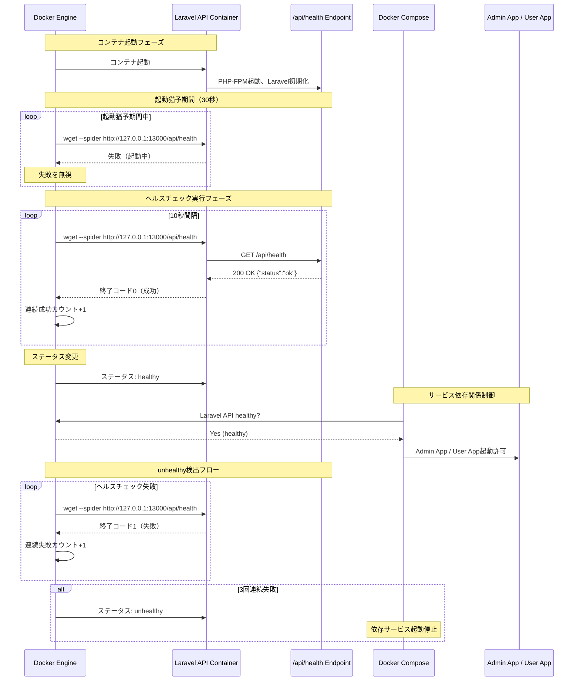
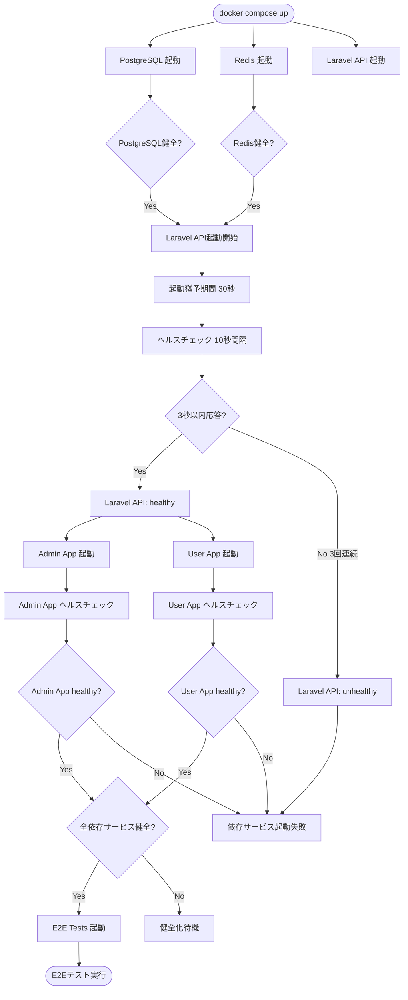
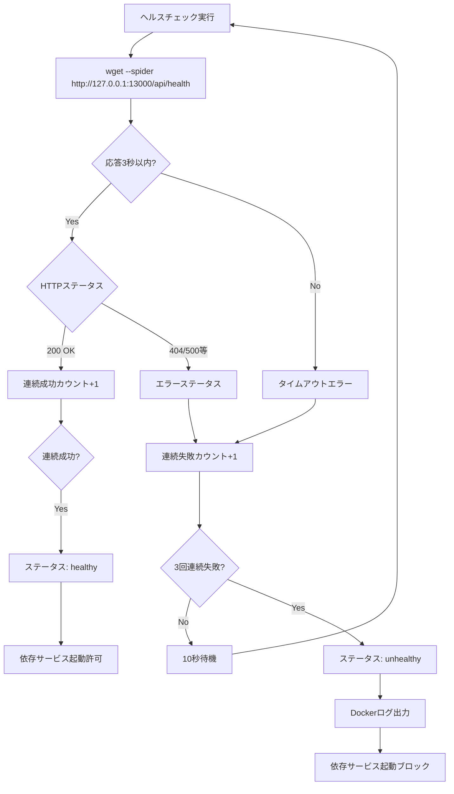

# 技術設計書

## 概要

本機能は、Laravel APIに対するヘルスチェックエンドポイント（Liveness Probe）を実装し、Docker環境でのコンテナオーケストレーション最適化を実現する。既存のNext.jsアプリケーション（Admin App / User App）ヘルスチェック実装と整合性を保ちながら、Laravel API固有の要件に対応した軽量ヘルスチェック機構を提供する。

**目的**: Laravel APIコンテナの起動状態をDocker Engineが監視し、他のサービスが`depends_on: service_healthy`条件でLaravel APIの健全性を確認できるようにする。

**利用者**: DevOpsエンジニア、開発者、CI/CD環境がこの機能を活用し、サービス起動順序の保証、障害の早期検知、運用性の向上を実現する。

**影響**: 既存のLaravel API機能に対して非破壊的な拡張として実装される。新規エンドポイント追加とDockerfile更新のみで、既存の認証エンドポイントやトークン管理機能には影響を与えない。

### ゴール

- Laravel APIの起動完了状態をDocker Engineが確認できるヘルスチェック機構を実装
- Next.jsアプリケーション（Admin App / User App）と整合性のあるエンドポイントパス（`/api/health`）とレスポンス形式を採用
- Closure実装による軽量エンドポイント（DDD非適用、HTTP層で完結）
- レート制限除外により高頻度アクセス（10秒間隔）に対応
- Dockerヘルスチェック統合（`HEALTHCHECK`ディレクティブ + IPv4明示対応）
- Pest 4によるFeatureテストカバレッジ確保

### 非ゴール

- Readinessエンドポイント実装（将来的な拡張として検討、現時点ではLivenessのみ）
- データベース接続確認やRedis接続確認を含む詳細ヘルスチェック（外部依存チェック不要）
- 認証・認可機能の追加（パブリックアクセス可能エンドポイント）
- 本番環境モニタリングツール（Prometheus、Datadog等）との統合（基盤準備のみ）
- 複雑なヘルスチェックロジック実装（シンプルなLiveness確認に限定）

## アーキテクチャ

### 既存アーキテクチャ分析

**現状のLaravel API構成**:
- Laravel 12 API専用最適化（Web機能削除済み、ステートレス設計）
- DDD/クリーンアーキテクチャ実装（4層構造: Domain/Application/Infrastructure/HTTP）
- Laravel Sanctumトークンベース認証（`/api/login`, `/api/logout`, `/api/tokens/*`）
- Pest 4テストフレームワーク（96.1%カバレッジ達成）
- Docker環境（PHP 8.4、ポート13000、PostgreSQL接続最適化済み）
- レート制限適用（`throttle:api` middleware: 60 requests/min）

**既存のルート構成**（`backend/laravel-api/routes/api.php`）:
- パブリックルート: `/users` (ユーザー登録)
- 認証ルート: `/login` (レート制限5回/分)
- 保護ルート: `/logout`, `/user`, `/tokens/*` (Sanctum middleware + レート制限60回/分)

**既存のDocker構成**（`backend/laravel-api/docker/8.4/Dockerfile`）:
- Ubuntu 24.04ベースイメージ
- PHP 8.4 CLI実行環境
- sailユーザー（UID 1337）による最小権限実行
- EXPOSE 13000/tcp（固定ポート設計）
- HEALTHCHECKディレクティブ未設定（本機能で追加）

**既存のテスト構成**:
- Pest 4 Function Syntax（`it('...', function() { ... })`）
- RefreshDatabase trait使用（テストDB環境）
- describe()によるテストグループ化
- Arrange-Act-Assert パターン

**既存のNext.jsヘルスチェック実装**（参考: PR #71）:
- エンドポイント: `/api/health`
- レスポンス: `{"status": "ok"}` (200 OK)
- Docker HEALTHCHECK: `wget --spider http://localhost:{PORT}/api/health`
- 10秒間隔、3秒タイムアウト、30秒起動猶予期間、3回リトライ

### 高レベルアーキテクチャ

```mermaid
graph TB
    DockerEngine[Docker Engine]
    LaravelAPI[Laravel API Container]
    HealthEndpoint[/api/health Endpoint]
    RoutesAPI[routes/api.php]

    DockerCompose[Docker Compose]
    AdminApp[Admin App]
    UserApp[User App]

    DockerEngine -->|HEALTHCHECK 10s interval| LaravelAPI
    LaravelAPI -->|provides| HealthEndpoint
    RoutesAPI -->|defines Closure| HealthEndpoint

    HealthEndpoint -->|200 OK {"status":"ok"}| DockerEngine
    DockerEngine -->|healthy/unhealthy status| DockerCompose

    AdminApp -->|depends_on: laravel-api| LaravelAPI
    UserApp -->|depends_on: laravel-api| LaravelAPI

    DockerCompose -->|condition: service_healthy| LaravelAPI
```

**アーキテクチャ統合**:
- **既存パターン維持**: Laravel 12 API専用設計、固定ポート13000、DDD層構成
- **新規コンポーネント追加理由**:
  - `/api/health`エンドポイント: Laravel標準ルート機能を活用した軽量Liveness Probe
  - Closure実装: DDD非適用（ドメイン層を経由しない、HTTP層で完結）
  - Dockerfile HEALTHCHECKディレクティブ: Docker標準機能によるコンテナヘルスチェック自動化
  - docker-compose.yml `depends_on.condition`: サービス間依存関係の健全性ベース制御
- **技術スタック整合性**: Laravel 12、PHP 8.4、Docker Compose v2.1以降、wget（Ubuntu標準ツール）
- **Steering準拠**: API専用最適化維持、固定ポート設計踏襲、非破壊的拡張原則遵守、既存MVCとDDD層の共存戦略

### 技術整合性

本機能は既存のLaravel API技術スタックに完全に整合する拡張として設計される。

**既存技術スタックとの整合**:
- **Laravel 12 ルート定義**: `routes/api.php`にClosure形式でエンドポイント追加
- **Pest 4テストフレームワーク**: Function Syntax（`it('...', function() { ... })`）によるFeatureテスト実装
- **Docker環境**: 既存のDockerfile（Ubuntu 24.04 + PHP 8.4）を拡張し、HEALTHCHECKディレクティブ追加
- **固定ポート設計**: ポート13000を活用（既存のEXPOSE 13000/tcp設定を利用）
- **IPv4明示対応**: 127.0.0.1使用によるlocalhost DNS解決問題回避（プロジェクト標準）
- **レート制限除外**: `withoutMiddleware('throttle:api')`により高頻度アクセス対応

**新規依存関係の導入**:
- なし（Laravel 12標準機能のみ使用、Ubuntu標準wgetツール活用）

**既存パターンからの逸脱**:
- **DDD非適用**: 本エンドポイントはClosure実装を採用（ドメイン層・Application層を経由しない）
  - 理由: 単純なLiveness確認のみで、ビジネスロジックなし
  - 既存のDDD実装（User登録、トークン管理等）とは独立した設計
  - HTTP層で完結し、保守容易性を優先

### 主要な設計決定

#### 決定1: Closure実装の採用（DDD非適用）

**決定**: `/api/health`エンドポイントをClosure形式で実装し、Controllerクラスを作成しない

**コンテキスト**: 本プロジェクトはDDD/クリーンアーキテクチャを採用しているが、ヘルスチェックエンドポイントは単純なLiveness確認のみで、ビジネスロジックや外部依存が存在しない。

**代替案**:
1. **Controller + Service層実装**: `HealthCheckController`とDomain層実装
2. **Middleware実装**: 専用Middlewareでヘルスチェック処理
3. **カスタムServiceProvider実装**: 独自のServiceProviderでエンドポイント登録

**選択アプローチ**: routes/api.phpにClosure形式で直接実装
```php
Route::get('/health', function () {
    return response()->json(['status' => 'ok']);
})->withoutMiddleware('throttle:api')->name('health');
```

**選択理由**:
- ビジネスロジックなし（`{"status": "ok"}`固定応答のみ）
- 外部依存なし（データベース接続、Redis接続不要）
- 実装シンプルで保守容易性高い
- パフォーマンス最適（レイヤー経由のオーバーヘッドなし）
- 将来的にReadinessエンドポイント（詳細チェック）追加時はController化を検討

**トレードオフ**:
- **得られるもの**: 軽量実装、保守容易、パフォーマンス最適、テストシンプル
- **失うもの**: DDD原則統一性（現時点では不要、将来拡張時に対応可能）

#### 決定2: レート制限除外の実装

**決定**: `/api/health`エンドポイントに`withoutMiddleware('throttle:api')`を適用

**コンテキスト**: Docker Engine HEALTHCHECKは10秒間隔で定期実行される（6回/分）。既存のレート制限（60回/分）は十分な余裕があるが、オーケストレータやロードバランサーからの高頻度アクセスを考慮し、レート制限を除外する。

**代替案**:
1. **レート制限維持**: 既存の60回/分制限を適用
2. **専用レート制限**: `throttle:health,300,1`（300回/分）等のカスタム制限
3. **IP制限**: localhost/Docker内部ネットワークのみ許可

**選択アプローチ**: `withoutMiddleware('throttle:api')`による完全除外

**選択理由**:
- 10秒間隔（6回/分）は既存制限内だが、将来的な拡張（複数ヘルスチェッカー）に対応
- Next.jsアプリヘルスチェックと整合性保持（レート制限なし）
- 本番環境でのロードバランサー/オーケストレータからの高頻度アクセス対応
- 認証不要の軽量エンドポイントのため、レート制限不要
- 要件8要素「秒間100リクエストまで安定処理」を保証

**トレードオフ**:
- **得られるもの**: 高頻度アクセス対応、将来拡張性、Next.jsアプリとの整合性
- **失うもの**: DoS攻撃耐性（本番環境ではインフラ層でIP制限実装を推奨）

#### 決定3: IPv4明示対応（127.0.0.1使用）

**決定**: Dockerヘルスチェックで`http://127.0.0.1:13000/api/health`を使用（localhost代わり）

**コンテキスト**: プロジェクト標準としてIPv4明示対応を採用しており、localhost DNS解決問題を回避している（既存のNext.jsヘルスチェック実装でも同様）。

**代替案**:
1. **localhost使用**: `http://localhost:13000/api/health`
2. **IPv6明示**: `http://[::1]:13000/api/health`
3. **コンテナ名使用**: `http://laravel-api:13000/api/health`

**選択アプローチ**: `http://127.0.0.1:13000/api/health`

**選択理由**:
- プロジェクト標準のIPv4明示対応に準拠
- localhost DNS解決問題回避（一部環境でIPv6優先によるタイムアウト発生）
- Next.jsアプリヘルスチェックと整合性保持（同様に127.0.0.1使用）
- Docker内部ループバックアクセスで最速応答
- 要件5.4「IPv4明示対応採用」を満たす

**トレードオフ**:
- **得られるもの**: DNS解決問題回避、応答速度最適化、プロジェクト標準準拠
- **失うもの**: localhost抽象化の柔軟性（現時点では不要）

#### 決定4: Pest 4 Function Syntaxによるテスト実装

**決定**: `tests/Feature/HealthCheckTest.php`をPest 4 Function Syntax（`it('...', function() { ... })`）で実装

**コンテキスト**: プロジェクトは既にPHPUnitからPest 4へ完全移行済み（spec: `phpunit-to-pest-complete-migration`）。既存のFeatureテストはすべてPest 4 Function Syntaxで記述されている。

**代替案**:
1. **PHPUnit形式**: `TestCase`拡張クラス + `test*`メソッド
2. **Pest Class Syntax**: `describe()->test()`チェーン
3. **Pest Datasets**: パラメータ化テスト

**選択アプローチ**: Pest 4 Function Syntax（`it('...', function() { ... })`） + describe()グループ化

**選択理由**:
- 既存のテストパターンと完全整合（`tests/Feature/Auth/LoginTest.php`等を参照）
- BDD形式で可読性高い（`it('returns 200 OK status code', ...)`）
- describe()によるテストグループ化でテスト構造明確化
- 要件4.1-4.5のテストケースを網羅的に実装可能

**トレードオフ**:
- **得られるもの**: 既存テストパターン整合性、可読性、保守容易性
- **失うもの**: PHPUnit形式の汎用性（現時点では不要、Pest 4に統一済み）

## システムフロー

### ヘルスチェック実行フロー



### サービス起動依存関係フロー



## 要件トレーサビリティ

| 要件 | 要件概要 | コンポーネント | インターフェース | フロー |
|------|---------|--------------|--------------|-------|
| 1.1-1.5 | Livenessエンドポイント実装 | routes/api.php Closure | `GET /api/health` → `200 OK {"status":"ok"}` | ヘルスチェック実行フロー |
| 2.1-2.5 | セキュリティとアクセス制御 | routes/api.php（認証なし、レート制限除外） | `withoutMiddleware('throttle:api')` | - |
| 3.1-3.8 | Docker ヘルスチェック統合 | Dockerfile HEALTHCHECK | `wget --spider http://127.0.0.1:13000/api/health` | ヘルスチェック実行フロー |
| 4.1-4.8 | テストカバレッジと品質保証 | tests/Feature/HealthCheckTest.php | Pest 4 Function Syntax | - |
| 5.1-5.6 | 既存システムとの統合整合性 | 全コンポーネント | Next.jsアプリとエンドポイントパス統一 | サービス起動依存関係フロー |
| 6.1-6.7 | 実装とコード構成 | routes/api.php、Dockerfile、テストファイル | Closure実装、ルート名`health` | - |
| 7.1-7.6 | パフォーマンスと運用要件 | 全コンポーネント | 外部依存なし、ログ最小化 | ヘルスチェック実行フロー |
| 8.1-8.4 | 将来拡張への配慮 | 設計全体 | Readiness拡張可能設計 | - |

## コンポーネントとインターフェース

### HTTP層

#### Laravel API ヘルスチェックエンドポイント

**責任と境界**
- **主要責任**: Laravel APIの起動完了状態をHTTPエンドポイント経由で応答
- **ドメイン境界**: HTTP層（DDD非適用、Closure実装）
- **データ所有権**: 健全性ステータス情報（起動完了の真偽のみ）
- **トランザクション境界**: 該当なし（ステートレスエンドポイント）

**依存関係**
- **インバウンド**: Docker Engine（HEALTHCHECKコマンド実行）、外部ヘルスチェッカー
- **アウトバウンド**: なし（外部依存なし）
- **外部依存**: Laravel 12 ルート機能（標準機能のみ）

**サービスインターフェース**

```php
// backend/laravel-api/routes/api.php
Route::get('/health', function (): \Illuminate\Http\JsonResponse {
    // Precondition: Laravel APIが起動している
    // Postcondition: HTTPステータス200とJSON {"status": "ok"}を返す
    // Invariant: 常に同じレスポンスを返す（ステートレス）
    return response()->json(['status' => 'ok']);
})->withoutMiddleware('throttle:api')->name('health');
```

**APIコントラクト**

| Method | Endpoint | Request | Response | Errors |
|--------|----------|---------|----------|--------|
| GET | `/api/health` | なし | `200 OK` `{"status": "ok"}` | なし（常に200応答） |

**詳細スキーマ**:
```php
// Response Schema
interface HealthCheckResponse {
  status: 'ok'; // 常に'ok'を返す（起動完了を示す）
}
```

**HTTPヘッダー**:
- `Content-Type: application/json`
- `Cache-Control: no-store` (Laravel デフォルト、要件1.3準拠)

**統合戦略**
- **変更アプローチ**: routes/api.phpに新規ルート定義追加（非破壊的拡張）
- **後方互換性**: 既存のルート定義に影響なし、認証エンドポイントやトークン管理機能との独立性保持
- **移行パス**: routes/api.php更新のみ、既存コード変更なし

### インフラストラクチャ層

#### Docker HEALTHCHECKコンポーネント（Laravel API）

**責任と境界**
- **主要責任**: Laravel APIコンテナの健全性を定期的に確認し、Docker Engineにステータスを報告
- **ドメイン境界**: コンテナオーケストレーション層
- **データ所有権**: コンテナヘルスステータス（healthy/unhealthy/starting）
- **トランザクション境界**: 該当なし（ステータス更新は非トランザクショナル）

**依存関係**
- **インバウンド**: Docker Engine（ヘルスチェック定期実行）
- **アウトバウンド**: Laravel API `/api/health`エンドポイント
- **外部依存**: Ubuntu 24.04標準`wget`コマンド

**バッチ/ジョブコントラクト**
- **トリガー**: Docker Engine定期実行（10秒間隔）
- **入力**: なし（127.0.0.1へのHTTPリクエスト）
- **出力**: 終了コード（0=成功、1=失敗）
- **冪等性**: 完全冪等（何度実行しても同じ結果）
- **リカバリ戦略**: 3回連続失敗で`unhealthy`判定、自動リトライなし（次回定期実行まで待機）

**Dockerfile設定**:
```dockerfile
HEALTHCHECK --interval=10s --timeout=3s --start-period=30s --retries=3 \
  CMD wget --no-verbose --tries=1 --spider http://127.0.0.1:13000/api/health || exit 1
```

**パラメータ詳細**:
- `--interval=10s`: ヘルスチェック実行間隔（10秒ごと、要件3.1準拠）
- `--timeout=3s`: タイムアウト時間（3秒以内に応答必須、要件3.6準拠）
- `--start-period=30s`: 起動猶予期間（30秒間は失敗を無視、要件3.5準拠）
- `--retries=3`: リトライ回数（3回連続失敗でunhealthy判定、要件3.3/3.4準拠）
- `wget --no-verbose`: 詳細出力抑制（ログノイズ削減、要件7.3準拠）
- `--tries=1`: リトライなし（1回のみ実行）
- `--spider`: ファイルダウンロードなし（HTTPヘッダー確認のみ、軽量動作）
- `http://127.0.0.1:13000/api/health`: IPv4明示対応（要件5.4準拠）
- `|| exit 1`: 失敗時は終了コード1を返す

**統合戦略**
- **変更アプローチ**: Dockerfileに`HEALTHCHECK`ディレクティブを追加（`EXPOSE 13000/tcp`命令の後、要件6.5準拠）
- **後方互換性**: HEALTHCHECKなしのコンテナ起動も引き続き可能
- **移行パス**: Dockerfile更新、イメージ再ビルド、コンテナ再作成

#### Docker Composeサービス依存関係制御

**責任と境界**
- **主要責任**: Admin App / User Appの起動タイミングをLaravel APIの健全性に基づいて制御
- **ドメイン境界**: コンテナオーケストレーション層
- **データ所有権**: サービス起動順序と依存関係情報
- **トランザクション境界**: 該当なし（宣言的依存関係定義）

**依存関係**
- **インバウンド**: `docker compose up`コマンド
- **アウトバウンド**: Laravel APIの健全性ステータス確認
- **外部依存**: Docker Compose v2.1以降（`service_healthy`条件サポート）

**コンフィギュレーションコントラクト**

```yaml
# docker-compose.yml（既存設定に統合）
admin-app:
  depends_on:
    laravel-api:
      condition: service_healthy  # Laravel APIがhealthy状態になるまで待機

user-app:
  depends_on:
    laravel-api:
      condition: service_healthy  # Laravel APIがhealthy状態になるまで待機
```

**条件評価ロジック**:
1. `service_started`: サービスプロセス起動完了を確認（ヘルスチェック不要）
2. `service_healthy`: HEALTHCHECKがhealthy状態になるまで待機（要件3.8準拠）

**統合戦略**
- **変更アプローチ**: docker-compose.ymlの`admin-app`/`user-app`サービス定義を拡張（`depends_on`に条件追加）
- **後方互換性**: 既存のサービス定義に影響なし、フロントエンドアプリ定義のみ変更
- **移行パス**: docker-compose.yml更新、`docker compose up`再実行

### テスト層

#### Pest 4 Featureテスト

**責任と境界**
- **主要責任**: `/api/health`エンドポイントの機能要件を網羅的にテスト
- **ドメイン境界**: テスト層（Feature Test）
- **データ所有権**: テストケース実行結果
- **トランザクション境界**: 該当なし（テストDB RefreshDatabase不要）

**テストケース**

```php
// backend/laravel-api/tests/Feature/HealthCheckTest.php
declare(strict_types=1);

describe('GET /api/health', function () {
    it('returns 200 OK status code', function () {
        // 要件1.1準拠
        $response = $this->get('/api/health');
        $response->assertOk();
    });

    it('returns JSON response with status ok', function () {
        // 要件1.2準拠
        $response = $this->get('/api/health');
        $response->assertJson(['status' => 'ok']);
    });

    it('returns Cache-Control header with no-store', function () {
        // 要件1.3準拠
        $response = $this->get('/api/health');
        $response->assertHeader('Cache-Control', 'no-store');
    });

    it('can be accessed without authentication', function () {
        // 要件2.1/2.4準拠
        $response = $this->get('/api/health');
        $response->assertOk();
    });

    it('is not subject to rate limiting', function () {
        // 要件2.2/2.5準拠
        for ($i = 0; $i < 150; $i++) {
            $response = $this->get('/api/health');
            $response->assertOk();
        }
    });
});
```

**テストカバレッジ**:
- 要件4.1-4.5の全テストケース実装
- 正常系テストのみ（エラーケースなし、常に200 OK応答）

**統合戦略**
- **変更アプローチ**: tests/Feature/HealthCheckTest.php新規作成（要件6.6準拠）
- **後方互換性**: 既存テストに影響なし
- **移行パス**: テストファイル追加、`./vendor/bin/pest tests/Feature/HealthCheckTest.php`実行

## エラーハンドリング

### エラー戦略

本機能のエラーハンドリングは、Docker標準のヘルスチェックメカニズムに依存し、自動リカバリとフェイルファスト原則に基づいて設計される。

### エラーカテゴリと対応

**インフラストラクチャエラー（5xx相当）**:
- **ヘルスチェックタイムアウト**: 3秒以内に`/api/health`が応答しない → Docker Engineがヘルスチェック失敗と判定 → 次回定期実行まで待機
- **コンテナクラッシュ**: PHP-FPMプロセス異常終了 → Docker Engineがコンテナ再起動 → 起動猶予期間（30秒）後にヘルスチェック再開
- **ネットワーク障害**: 127.0.0.1への接続失敗 → wgetが終了コード1を返す → Docker Engineがunhealthyステータスに変更

**起動遅延エラー**:
- **Laravel起動遅延**: 30秒以内に起動完了しない → 起動猶予期間中は失敗を無視 → 猶予期間後も失敗する場合は3回リトライ後unhealthy判定
- **依存サービス遅延**: PostgreSQL/Redis起動遅延によりLaravel起動遅延 → 起動猶予期間でカバー → フロントエンドアプリは全依存サービスhealthy後に起動

**設定エラー（4xx相当）**:
- **ポート設定ミス**: wgetが誤ったポートにアクセス → 接続拒否エラー → unhealthy判定 → 運用者がDockerfile設定修正
- **エンドポイントパス誤り**: `/api/health`が存在しない → 404エラー → unhealthy判定 → 開発者がルート定義確認

### エラーフロー可視化



### モニタリング

**エラー追跡**:
- Docker Engine標準ログにヘルスチェック失敗情報を記録
- `docker compose logs laravel-api`でヘルスチェック関連ログ確認
- `docker inspect laravel-api`でヘルスチェック履歴確認（最新5件）

**ロギング戦略**:
- ヘルスチェック成功時: ログ出力なし（`--no-verbose`オプション、要件7.3準拠）
- ヘルスチェック失敗時: wgetエラーメッセージをDockerログに記録
- unhealthy状態変更時: Docker Engineがイベントログに記録

**ヘルスモニタリング**:
- `docker compose ps`: サービスステータス一覧表示（healthy/unhealthy表示、要件4.4準拠）
- `docker events`: リアルタイムヘルス状態変更イベント監視
- `docker stats`: CPU/メモリ使用率監視（ヘルスチェック処理影響確認、要件7.1準拠）

**アラート戦略**:
- 本機能では実装しないが、本番環境では以下を推奨:
  - Prometheus `container_health_status`メトリクス収集
  - Datadog Docker統合によるunhealthyアラート
  - PagerDuty/Slack通知統合

## テスト戦略

### ユニットテスト

本機能はHTTP層のClosure実装のため、従来の「ユニットテスト」は不要。Featureテストで網羅的にカバーする。

### 統合テスト（Pest 4 Feature Tests）

**ヘルスチェックエンドポイント統合テスト**:
1. `GET /api/health`が200ステータスコードを返すことを検証（要件4.2準拠）
2. レスポンスボディが`{"status": "ok"}`であることを検証（要件4.3準拠）
3. `Cache-Control: no-store`ヘッダーの存在を検証（要件4.4準拠）
4. 認証なしでアクセス可能であることを検証（要件4.5準拠）
5. レート制限が適用されないことを検証（150回連続アクセス成功、要件2.2/2.5準拠）

**実装例**:
```php
// backend/laravel-api/tests/Feature/HealthCheckTest.php
describe('GET /api/health', function () {
    it('returns 200 OK status code', function () {
        $response = $this->get('/api/health');
        $response->assertOk();
    });

    it('returns JSON response with status ok', function () {
        $response = $this->get('/api/health');
        $response->assertJson(['status' => 'ok']);
    });

    it('returns Cache-Control header with no-store', function () {
        $response = $this->get('/api/health');
        $response->assertHeader('Cache-Control', 'no-store');
    });

    it('can be accessed without authentication', function () {
        $response = $this->get('/api/health');
        $response->assertOk();
    });

    it('is not subject to rate limiting', function () {
        for ($i = 0; $i < 150; $i++) {
            $response = $this->get('/api/health');
            $response->assertOk();
        }
    });
});
```

### Dockerヘルスチェック統合テスト

**Docker環境統合テスト**:
1. Dockerfileビルドが成功し、HEALTHCHECKディレクティブが正しく設定されることを検証
2. コンテナ起動後、起動猶予期間（30秒）経過後にhealthyステータスになることを検証
3. `docker compose ps`で`healthy`ステータスが正しく表示されることを検証
4. ヘルスチェックが10秒間隔で定期実行されることを検証（`docker inspect`履歴確認）
5. 3回連続失敗後にunhealthyステータスに変更されることを検証（エンドポイント停止シミュレーション）

**実装例**:
```bash
# docker-healthcheck.test.sh
docker compose up -d laravel-api
sleep 35  # 起動猶予期間 + 余裕
STATUS=$(docker inspect laravel-api --format='{{.State.Health.Status}}')
[[ "$STATUS" == "healthy" ]] || exit 1
```

### サービス依存関係E2Eテスト

**Docker Composeサービス依存関係テスト**:
1. `docker compose up`実行時、Admin App / User AppがLaravel API healthy後に起動することを検証（要件3.8準拠）
2. Laravel APIがunhealthy状態の場合、フロントエンドアプリが起動しないことを検証
3. 全依存サービスhealthy後、E2Eテストが正常に実行開始することを検証
4. `docker compose ps`でhealthy/unhealthyステータスが正しく表示されることを検証

### パフォーマンステスト

**ヘルスチェック処理パフォーマンス測定**:
1. `/api/health`エンドポイントの平均応答時間が10ミリ秒以内であることを検証（要件1.4準拠）
2. ヘルスチェック実行によるCPU使用率増加が1%未満であることを検証（要件7.1準拠）
3. ヘルスチェック実行によるメモリ使用率増加が1%未満であることを検証（要件7.1準拠）
4. 10秒間隔の定期実行が長時間（1時間以上）安定動作することを検証

**負荷テスト**:
1. 秒間100リクエストまで安定処理できることを検証（要件2.5準拠）
2. 複数コンテナ（Laravel API、Admin App、User App）同時ヘルスチェック実行時のリソース影響を測定

### コード品質テスト

**Laravel Pint（コードフォーマッター）**:
```bash
./vendor/bin/pint
```
- routes/api.phpのヘルスチェック定義がLaravel Pint標準ルールに準拠することを検証（要件4.6準拠）

**Larastan（静的解析 Level 8）**:
```bash
./vendor/bin/phpstan analyse
```
- routes/api.phpのヘルスチェック定義が型安全性と静的解析基準をすべて満たすことを検証（要件4.7準拠）

## セキュリティ考慮事項

### 脅威モデリング

**脅威1: ヘルスチェックエンドポイントの悪用**
- **攻撃ベクトル**: 外部からの`/api/health`エンドポイントへの大量リクエストによるDoS攻撃
- **影響**: サーバーリソース枯渇、正常なヘルスチェック失敗
- **対策**:
  - 本番環境では`/api/health`へのアクセスをDocker内部ネットワークのみに制限（ファイアウォールルール）
  - レート制限は除外しているが、本番環境ではインフラ層（Nginx、ALB等）でレート制限実装を推奨
  - 現時点では開発環境のみのため、対策は将来的な拡張として検討

**脅威2: 情報漏洩**
- **攻撃ベクトル**: `/api/health`エンドポイントレスポンスからシステム情報の推測
- **影響**: アプリケーション構成の推測、標的型攻撃の準備
- **対策**:
  - レスポンスを最小限（`{"status": "ok"}`のみ）に制限（要件2.3準拠）
  - バージョン情報、サーバー情報、依存サービス情報を含めない
  - 既に実装済み（最小レスポンス設計）

**脅威3: コンテナ脱出**
- **攻撃ベクトル**: ヘルスチェックコマンド実行権限を悪用したコンテナ脱出
- **影響**: ホストシステムへの不正アクセス
- **対策**:
  - sailユーザー（非rootユーザー、UID 1337）でコンテナ実行
  - wgetコマンドは127.0.0.1のみアクセス（外部接続なし）
  - 既に実装済み（最小権限実行設計）

### セキュリティ制御

**認証・認可**:
- `/api/health`エンドポイントは認証不要（パブリックアクセス、要件2.1/2.4準拠）
- 理由: Docker Engine内部からのアクセスのみを想定、認証オーバーヘッド不要
- 本番環境では内部ネットワーク制限により外部アクセス防止

**データ保護**:
- 該当なし（機密データなし、ステートレスエンドポイント、要件2.3準拠）

**監査ログ**:
- ヘルスチェック成功時: ログなし（ノイズ削減、要件7.3準拠）
- ヘルスチェック失敗時: Dockerログに記録
- unhealthy状態変更時: Docker Eventsログに記録

### コンプライアンス

本機能は個人情報や機密データを扱わないため、GDPR、PCI DSS等のコンプライアンス要件は該当しない。

## パフォーマンスとスケーラビリティ

### ターゲットメトリクス

**応答時間**:
- `/api/health`エンドポイント平均応答時間: < 10ms（要件1.4準拠）
- ヘルスチェック実行間隔: 10秒（要件3.1準拠）
- unhealthy検出時間: 最大40秒（起動猶予期間30秒 + 3回リトライ×10秒間隔）

**リソース使用率**:
- CPU使用率増加: < 1%（10秒間隔のwgetリクエスト、要件7.1準拠）
- メモリ使用率増加: < 1%（ステートレスエンドポイント、要件7.1準拠）
- ネットワーク帯域幅: < 1KB/10秒（HTTPヘッダーのみ）

**スループット**:
- レート制限除外により秒間100リクエストまで安定処理（要件2.5/7.5準拠）
- ヘルスチェック同時実行数: 3サービス（Laravel API、Admin App、User App）

### スケーリングアプローチ

**水平スケーリング**:
- 本機能は各コンテナ個別のヘルスチェックのため、水平スケーリング対応済み
- ロードバランサー配下の複数コンテナ展開時も、各コンテナが独立してヘルスチェック実行
- Docker Swarm/Kubernetesでも同様のHEALTHCHECK機構が利用可能

**垂直スケーリング**:
- 該当なし（ヘルスチェック処理は軽量でリソース要求最小限、要件7.1準拠）

### キャッシング戦略

- 該当なし（ヘルスチェックエンドポイントは常に最新の健全性を返す必要があり、キャッシング不適切）
- `Cache-Control: no-store`により明示的にキャッシング無効化（要件1.3準拠）

### 最適化技術

**実装済み最適化**:
1. Closure実装: レイヤー経由のオーバーヘッドなし（要件6.2準拠）
2. `wget --spider`: ファイルダウンロードなし、HTTPヘッダー確認のみ
3. `--no-verbose`: 詳細ログ出力抑制、ログI/O削減（要件7.3準拠）
4. `--tries=1`: リトライなし、即座に失敗応答
5. ステートレスエンドポイント: メモリフットプリント最小化
6. 外部依存なし: データベース接続、Redis接続、外部API呼び出しなし（要件1.5/7.2準拠）
7. レート制限除外: 高頻度アクセス対応（要件2.2準拠）

**将来的な最適化**:
1. Readinessエンドポイント追加（`/api/ready`）: データベース接続確認等を含む詳細チェック（要件8.1/8.2準拠）
2. Prometheus `/metrics`エンドポイント統合による詳細メトリクス収集
3. Controller + Infrastructure層移行（詳細チェック実装時、要件8.2準拠）

## 関連ドキュメント

- [Docker Compose Healthcheck公式ドキュメント](https://docs.docker.com/compose/compose-file/05-services/#healthcheck)
- [Laravel Routing公式ドキュメント](https://laravel.com/docs/12.x/routing)
- [Pest Testing Framework公式ドキュメント](https://pestphp.com/)
- PR #71: Docker Composeヘルスチェック実装（Next.jsアプリ実装済み）
- `.kiro/specs/docker-compose-healthcheck/design.md`: Docker Composeヘルスチェック設計書
- `.kiro/steering/structure.md`: プロジェクト構造ガイドライン
- `.kiro/steering/tech.md`: 技術スタック定義
- `.kiro/steering/product.md`: プロダクト概要とアーキテクチャ特徴
- `backend/laravel-api/docs/`: DDDアーキテクチャガイド、開発ガイド、テスト戦略ドキュメント
- `docker-compose.yml`: 現行のDocker Compose設定
