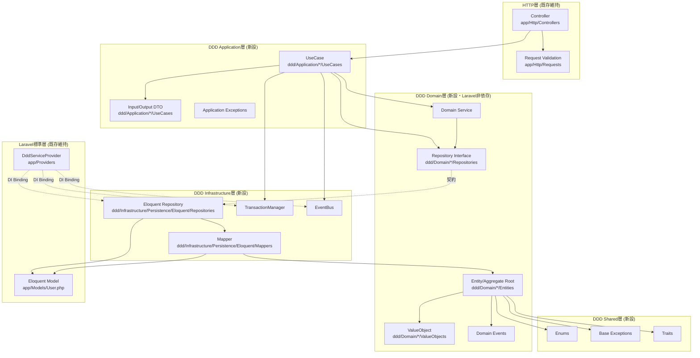
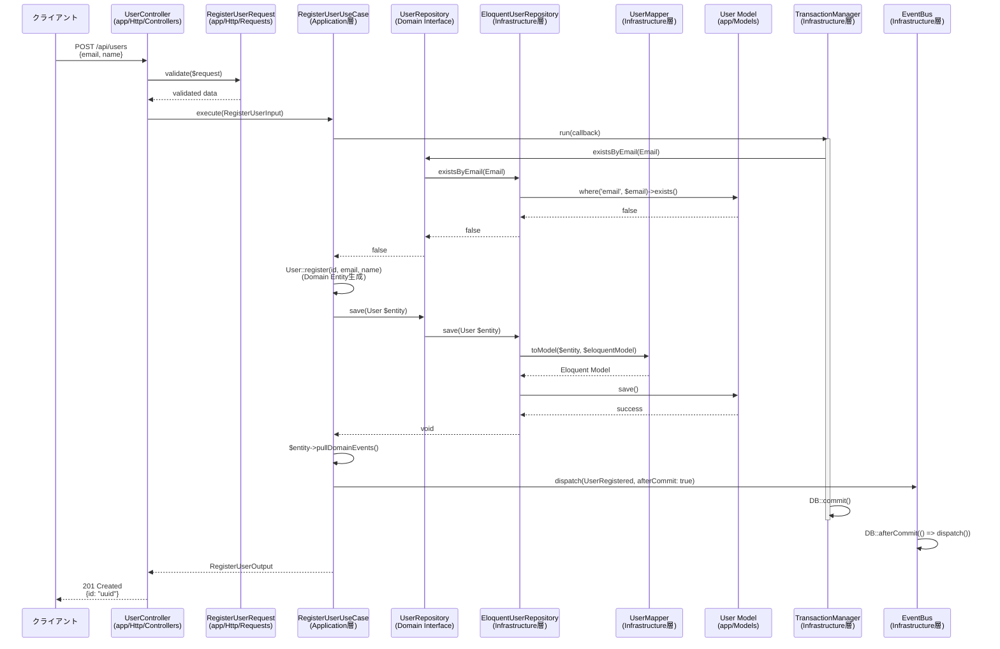
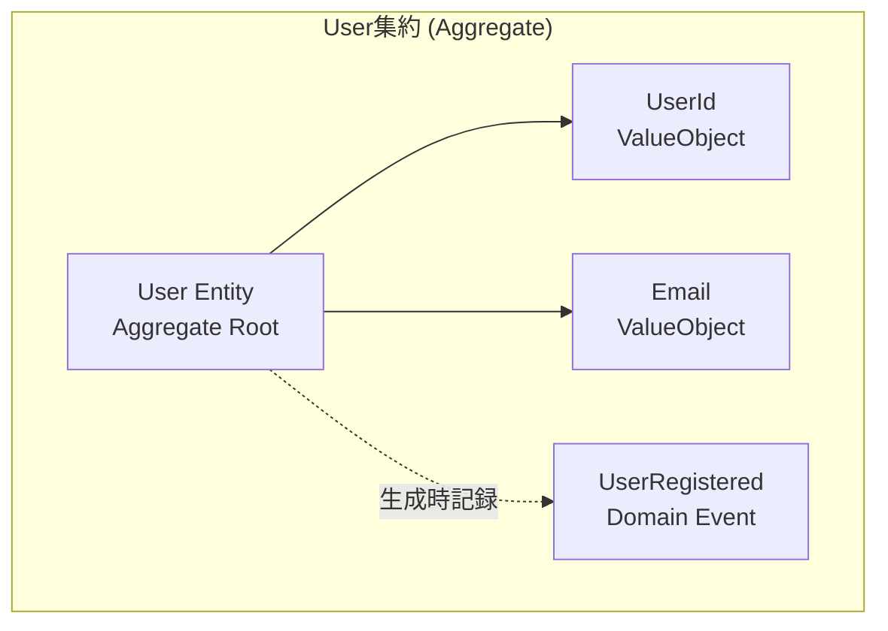
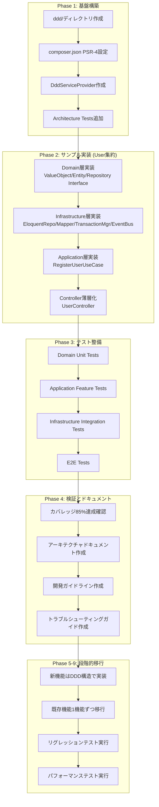

# Technical Design Document

## Overview

本設計は、Laravel 12プロジェクトにDDD（ドメイン駆動設計）、クリーンアーキテクチャ、SOLID原則を導入し、既存のMVCアーキテクチャと共存させながら段階的にビジネスロジックをDomain層に移行する技術仕様を定義します。

**目的**: 既存のLaravel MVC構造を維持しながら、`backend/laravel-api/ddd/`配下に4層構造（Domain/Application/Infrastructure/Shared）を確立し、ビジネスロジックの明確化、テスタビリティ向上、保守性向上を実現します。

**対象ユーザー**: 開発チーム全体。新機能開発時はDDD構造を採用し、既存機能はStranglerパターンで段階的に移行します。

**影響範囲**:
- **既存コード**: 既存のMVC構造（`app/Models/`, `app/Http/Controllers/`）は維持し、Controllerのみ薄層化（UseCaseへの委譲）
- **新規追加**: `ddd/`ディレクトリ配下に4層構造を新設
- **テストインフラ**: 既存のPest 4 + Architecture Testsを拡張（DDD層専用のArchitecture Tests追加）

### Goals

- **4層アーキテクチャ確立**: Domain/Application/Infrastructure/Shared層の明確な分離と依存方向制御
- **フレームワーク非依存Domain層**: Laravel非依存の純粋PHPでビジネスロジックを実装し、高速ユニットテストを実現
- **既存インフラ活用**: Pest 4、PHPStan Level 8、Laravel Pint、Sanctum等の既存最適化設定を継承
- **段階的移行戦略**: 新機能はDDD構造で実装、既存機能はStranglerパターンで1機能ずつ移行
- **テストカバレッジ85%達成**: Domain層90%、Application層85%、Infrastructure層80%の目標カバレッジ

### Non-Goals

- **全機能の一括移行**: Phase 1-2では基盤構築とサンプル実装のみ（User集約）、全機能移行はPhase 9
- **CQRS/Event Sourcing全面導入**: 読み取り専用Queriesはオプション、Event Sourcingは将来検討課題
- **マイクロサービス化**: モノリシック構造を維持（DDD境界内での論理的分離のみ）
- **既存Eloquent Modelの削除**: `app/Models/`は維持し、Infrastructure層のMapperで相互変換
- **既存テストの書き直し**: 既存のFeature/Unit Testsは維持、DDD層専用テストを追加

---

## Architecture

### 既存アーキテクチャ分析

**現状のLaravel 12 MVC構造**:
```
backend/laravel-api/
├── app/
│   ├── Models/                    # Eloquent Models (Laravel標準)
│   │   └── User.php               # Sanctum HasApiTokens使用
│   ├── Http/
│   │   ├── Controllers/           # HTTP層
│   │   ├── Requests/              # Validation層
│   │   └── Middleware/
│   └── Providers/
│       └── AppServiceProvider.php
├── tests/
│   ├── Architecture/              # Pest Arch Tests (既存)
│   │   ├── LayerTest.php          # Controllers→Models依存禁止ルール
│   │   ├── NamingTest.php
│   │   └── QualityTest.php
│   ├── Feature/
│   └── Unit/
└── composer.json                  # PSR-4: App\\ => app/
```

**保持する既存パターン**:
- **Eloquent Models**: `app/Models/User.php`等は`artisan make:model`標準位置で維持
- **Sanctum認証**: `HasApiTokens` Traitの利用継続
- **Architecture Tests**: 既存の依存関係ルール（Controllers→Models禁止等）を拡張
- **最適化設定**: Laravel Pint、Larastan Level 8、Pest 4設定を継承

**技術的負債と対処**:
- **問題**: ビジネスロジックがController/Model層に分散
- **対処**: UseCaseパターンでビジネスフローをApplication層に集約、ControllerはUseCaseへの委譲のみ
- **問題**: Laravel依存でユニットテスト困難
- **対処**: Domain層をLaravel非依存にし、高速なユニットテストを実現

### 高レベルアーキテクチャ



**アーキテクチャ統合ポイント**:
- **既存パターン維持**: Eloquent Modelsは`app/Models/`に配置（Laravel標準を尊重）
- **新規コンポーネント追加**: `ddd/`ディレクトリ配下に4層構造を追加
- **依存方向制御**: `Infrastructure → Application → Domain`、Domain層はIlluminate名前空間に依存禁止
- **テスト戦略拡張**: 既存のArchitecture Testsを拡張し、DDD依存関係ルールを追加
- **Steering準拠**: `structure.md`のPSR-4規約、`tech.md`の最小依存関係原則に準拠

---

## Technology Stack and Design Decisions

### 技術スタック整合性

本設計は既存の技術スタックを100%継承し、新規外部ライブラリの追加はゼロです：

| レイヤー | 既存技術 | 利用方法 |
|---------|---------|---------|
| **Backend Framework** | Laravel 12, PHP 8.4 | 既存設定継承、DDD層は手動作成 |
| **ORM** | Eloquent ORM | `app/Models/`で継続利用、Infrastructure層のMapperで変換 |
| **Authentication** | Laravel Sanctum 4.0 | 既存のトークンベース認証維持、Infrastructure層でラップ |
| **DI Container** | Laravel Service Container | `DddServiceProvider`で拡張、既存バインディング維持 |
| **Testing** | Pest 4 + PHPStan Level 8 + Laravel Pint | 既存設定継承、DDD層専用テスト追加 |
| **Architecture Testing** | Pest Arch Plugin | 既存のLayerTest.phpを拡張、DDD依存関係ルール追加 |

**新規導入ライブラリ**: なし（既存のLaravel 12コアパッケージのみ使用）

### 主要設計決定

#### 決定1: Eloquent Model配置とMapper戦略

**決定**: Eloquent Modelsは`app/Models/`に維持し、Infrastructure層のMapperでDomain Entityと相互変換

**コンテキスト**:
- Laravel標準の`artisan make:model`コマンドは`app/Models/`に生成する
- 既存の`app/Models/User.php`が存在し、Sanctum `HasApiTokens`等を使用中

**代替案**:
1. **Eloquent Modelsを`ddd/Infrastructure/`に移動**: `artisan make:model`が使えなくなり、手動作成が必要
2. **Eloquent ModelsをDomain Entityとして使用**: Domain層がEloquentに依存し、フレームワーク非依存性が失われる
3. **Mapper戦略採用（選択）**: Eloquentは`app/Models/`維持、MapperでDomain Entityと変換

**選択アプローチ**: Mapper戦略

```
Infrastructure層:
- EloquentUserRepository (implements UserRepository interface)
  - save(User $entity): void
    → UserMapper::toModel($entity, $eloquentModel)
    → $eloquentModel->save()
  - find(UserId $id): ?User
    → $eloquentModel = EloquentUser::find($id->value())
    → UserMapper::toEntity($eloquentModel)
```

**根拠**:
- **Laravel標準尊重**: `artisan make:model`コマンドが使用可能、既存開発フローを維持
- **フレームワーク非依存Domain**: Domain EntityはEloquentに依存せず、純粋PHPで実装可能
- **既存コード活用**: `app/Models/User.php`の`HasApiTokens`等のLaravel機能を継続利用

**トレードオフ**:
- **獲得**: Laravel標準ツール利用可能、フレームワーク非依存Domain層、既存インフラ活用
- **犠牲**: Mapper実装コスト（1リクエストあたり5ms以内のオーバーヘッド）、Eloquent/Entity間の変換ロジック保守

#### 決定2: 依存性注入とServiceProvider戦略

**決定**: `DddServiceProvider`で Repository InterfaceとInfrastructure実装をバインド、既存`AppServiceProvider`は維持

**コンテキスト**:
- Laravel Service ContainerのDI機能を最大限活用
- Repository PatternでDomain層とInfrastructure層を分離
- 既存の`AppServiceProvider`が存在

**代替案**:
1. **既存`AppServiceProvider`に追記**: 単一ファイルが肥大化、DDD関連バインディングが分散
2. **各Repository専用Providerを作成**: Provider数が増加、設定の分散化
3. **DddServiceProvider作成（選択）**: DDD専用のバインディングを一元管理

**選択アプローチ**: `DddServiceProvider`作成

```php
// app/Providers/DddServiceProvider.php
class DddServiceProvider extends ServiceProvider
{
    public function register(): void
    {
        // Repository bindings
        $this->app->bind(
            \Ddd\Domain\User\Repositories\UserRepository::class,
            \Ddd\Infrastructure\Persistence\Eloquent\Repositories\EloquentUserRepository::class
        );

        // Infrastructure services (singleton)
        $this->app->singleton(
            \Ddd\Infrastructure\Services\TransactionManager\TransactionManager::class,
            \Ddd\Infrastructure\Services\TransactionManager\LaravelTransactionManager::class
        );
        $this->app->singleton(
            \Ddd\Infrastructure\Events\EventBus::class,
            \Ddd\Infrastructure\Events\LaravelEventBus::class
        );
    }
}
```

**根拠**:
- **関心の分離**: DDD関連バインディングを`DddServiceProvider`に集約、既存`AppServiceProvider`は変更不要
- **拡張性**: 新規Domain追加時は`DddServiceProvider`にバインディング追加のみ
- **可読性**: DDD関連の依存関係が1ファイルで把握可能

**トレードオフ**:
- **獲得**: DDD関連設定の一元管理、既存Providerへの影響ゼロ、拡張性向上
- **犠牲**: Provider数が1増加（微増）

#### 決定3: テスト戦略とArchitecture Tests拡張

**決定**: 既存のPest 4 + Architecture Testsを拡張し、DDD依存関係ルールを追加

**コンテキスト**:
- 既存の`tests/Architecture/LayerTest.php`がControllers→Models依存禁止を検証中
- Domain層はLaravel非依存を厳守する必要がある
- Pest Arch Pluginが既にインストール済み

**代替案**:
1. **手動コードレビューで依存関係チェック**: ヒューマンエラーのリスク、CI/CD統合困難
2. **PHPStan拡張ルール作成**: カスタムルール実装コストが高い
3. **Pest Architecture Tests拡張（選択）**: 既存インフラ活用、宣言的ルール定義

**選択アプローチ**: Pest Architecture Tests拡張

```php
// tests/Architecture/DddArchitectureTest.php
arch('Domain layer must not depend on Laravel')
    ->expect('Ddd\Domain')
    ->not->toUse([
        'Illuminate',
        'Laravel',
        'Eloquent',
    ]);

arch('Domain layer must not depend on Infrastructure')
    ->expect('Ddd\Domain')
    ->not->toUse('Ddd\Infrastructure');

arch('Application layer must not depend on Infrastructure')
    ->expect('Ddd\Application')
    ->not->toUse('Ddd\Infrastructure');

arch('Controllers must use UseCases instead of Models')
    ->expect('App\Http\Controllers')
    ->not->toUse('App\Models')
    ->toUse('Ddd\Application');
```

**根拠**:
- **既存インフラ活用**: Pest Arch Plugin既にインストール済み、追加コストゼロ
- **CI/CD統合**: 既存の`composer test`で自動実行、Pull Request時に自動検証
- **宣言的**: アーキテクチャルールが明示的、ドキュメント代わりにも機能

**トレードオフ**:
- **獲得**: 依存関係ルールの自動検証、CI/CD統合、ヒューマンエラー防止
- **犠牲**: テストファイル1個追加（微増）

---

## System Flows

### User登録フロー（DDD実装サンプル）

以下のシーケンス図は、新規User登録APIがどのようにDDD層を経由して実装されるかを示します。



**フローポイント**:
1. **Controller薄層化**: Validation後、即座にUseCaseに委譲
2. **トランザクション境界**: UseCaseが`TransactionManager::run()`でトランザクション管理
3. **Domain Entity生成**: `User::register()`ファクトリメソッドで不変条件保証
4. **Mapper変換**: Infrastructure層でEloquent Model ↔ Domain Entity変換
5. **Domain Events**: コミット後にイベント発火（副作用の分離）

---

## Requirements Traceability

以下の表は、各要件がどのコンポーネントとインターフェースで実現されるかを示します。

| 要件 | 要件概要 | 実現コンポーネント | インターフェース | フロー参照 |
|------|---------|-----------------|-------------|---------|
| **1.1** | 4層構造確立 | `ddd/Domain/`, `ddd/Application/`, `ddd/Infrastructure/`, `ddd/Shared/` | `composer.json` PSR-4設定 | - |
| **1.2** | PSR-4オートロード | `composer.json` autoload設定 | `Ddd\Domain\`, `Ddd\Application\`, `Ddd\Infrastructure\`, `Ddd\Shared\` | - |
| **1.3** | DI Container統合 | `DddServiceProvider` | `register()` メソッドでバインディング | - |
| **1.4** | 依存方向制御 | Architecture Tests | `DddArchitectureTest.php` | - |
| **2.1** | ValueObject実装 | `Email`, `UserId` (Domain層) | `readonly`, named constructor (`fromString`) | User登録フロー |
| **2.2** | Entity/Aggregate Root実装 | `User` Entity (Domain層) | `private constructor`, ファクトリメソッド (`register`) | User登録フロー |
| **2.3** | Repository Interface定義 | `UserRepository` Interface (Domain層) | `find()`, `save()`, `delete()`, `existsByEmail()` | User登録フロー |
| **2.5** | Domain Events記録 | `RecordsDomainEvents` Trait | `recordThat()`, `pullDomainEvents()` | User登録フロー |
| **3.1-3.5** | Repository Pattern実装 | `EloquentUserRepository`, `UserMapper` (Infrastructure層) | Repository Interface実装、`toEntity()`, `toModel()` | User登録フロー |
| **4.1-4.5** | UseCase実装 | `RegisterUserUseCase` (Application層) | `execute(Input): Output` | User登録フロー |
| **4.3** | トランザクション境界管理 | `LaravelTransactionManager` (Infrastructure層) | `run(callable): mixed` | User登録フロー |
| **4.4** | Domain Events発火 | `LaravelEventBus` (Infrastructure層) | `dispatch(object, bool): void` | User登録フロー |
| **6.1-6.4** | DI設定 | `DddServiceProvider` | `bind()`, `singleton()` | - |
| **7.1-7.5** | Controller薄層化 | `UserController` (HTTP層) | コンストラクタインジェクション、`execute()` 呼び出し | User登録フロー |
| **8.1-8.6** | テスト戦略 | `tests/Unit/Ddd/Domain/`, `tests/Feature/Ddd/Application/`, `tests/Architecture/DddArchitectureTest.php` | Pest DSL、Architecture Tests | - |

---

## Components and Interfaces

### Domain層

Domain層はLaravel非依存の純粋PHPで実装し、ビジネスロジックを集約します。

#### ValueObject: Email

**責任と境界**
- **主要責任**: Emailアドレスの不変性と妥当性を保証する値オブジェクト
- **ドメイン境界**: User集約配下、ユーザー識別に使用
- **データ所有権**: Email文字列の所有と検証
- **トランザクション境界**: ValueObjectは不変のため、トランザクション境界外

**依存関係**
- **Inbound**: `User` Entity、`UserRepository` Interface
- **Outbound**: なし（純粋PHPのみ）
- **External**: なし

**契約定義**

```php
namespace Ddd\Domain\User\ValueObjects;

final readonly class Email
{
    private function __construct(
        private string $value
    ) {
        if (!filter_var($value, FILTER_VALIDATE_EMAIL)) {
            throw ValidationException::invalidEmail($value);
        }
    }

    public static function fromString(string $value): self;
    public function value(): string;
    public function equals(Email $other): bool;
}
```

**事前条件**:
- `fromString()`の引数は非空文字列
- Email形式として妥当な文字列（RFC 5322準拠）

**事後条件**:
- 生成されたインスタンスは常に妥当なEmailアドレスを保持
- `value()`は生成時と同じ値を返す（不変性）

**不変条件**:
- Email文字列は生成後変更不可（`readonly`で保証）

#### ValueObject: UserId

**責任と境界**
- **主要責任**: User集約のユニーク識別子を保証
- **ドメイン境界**: User集約のID
- **データ所有権**: UUID文字列の所有
- **トランザクション境界**: トランザクション境界外

**依存関係**
- **Inbound**: `User` Entity、`UserRepository` Interface
- **Outbound**: なし
- **External**: `Illuminate\Support\Str::uuid()`（Infrastructure層でのみ使用）

**契約定義**

```php
namespace Ddd\Domain\User\ValueObjects;

final readonly class UserId
{
    private function __construct(
        private string $value
    ) {
        if (!preg_match('/^[0-9a-f]{8}-[0-9a-f]{4}-4[0-9a-f]{3}-[89ab][0-9a-f]{3}-[0-9a-f]{12}$/i', $value)) {
            throw ValidationException::invalidUserId($value);
        }
    }

    public static function fromString(string $value): self;
    public function value(): string;
    public function equals(UserId $other): bool;
}
```

**事前条件**:
- `fromString()`の引数はUUID v4形式文字列

**事後条件**:
- 生成されたインスタンスは常に妥当なUUIDを保持

**不変条件**:
- UUID文字列は生成後変更不可

#### Entity: User (Aggregate Root)

**責任と境界**
- **主要責任**: User集約のライフサイクル管理とビジネスルール実装
- **ドメイン境界**: User集約ルート
- **データ所有権**: UserId、Email、name、registeredAtの所有
- **トランザクション境界**: User集約全体が単一トランザクション境界

**依存関係**
- **Inbound**: `RegisterUserUseCase`、`UserRepository` Interface
- **Outbound**: `Email` ValueObject、`UserId` ValueObject、`UserRegistered` Domain Event、`RecordsDomainEvents` Trait
- **External**: `Carbon\Carbon`（日時データ、Steering規約準拠）

**契約定義**

**Service Interface** (ファクトリメソッド):
```php
namespace Ddd\Domain\User\Entities;

final class User
{
    use RecordsDomainEvents;

    private function __construct(
        private UserId $id,
        private Email $email,
        private string $name,
        private Carbon $registeredAt,
    ) {}

    // ファクトリメソッド（集約生成）
    public static function register(
        UserId $id,
        Email $email,
        string $name,
    ): self;

    // ビジネスルール実装
    public function changeName(string $newName): void;

    // Getters（不変性維持）
    public function id(): UserId;
    public function email(): Email;
    public function name(): string;
    public function registeredAt(): Carbon;
}
```

**事前条件**:
- `register()`: UserId、Email、nameは全て妥当な値
- `changeName()`: 新しい名前は2文字以上

**事後条件**:
- `register()`: 新しいUser集約が生成され、`UserRegistered`イベントが記録される
- `changeName()`: nameが更新される

**不変条件**:
- UserIdとEmailは生成後変更不可（Getterのみ提供）
- registeredAtは生成時に設定され、変更不可

**State Management**:
- **状態モデル**: 登録済み（Registered）状態のみ（将来拡張: Active/Inactive/Deleted）
- **永続化**: EloquentUserRepository経由でDB永続化
- **並行性**: Optimistic Locking（Eloquent `version`カラム使用、将来対応）

#### Repository Interface: UserRepository

**責任と境界**
- **主要責任**: User集約の永続化・取得契約を定義
- **ドメイン境界**: Domain層、Infrastructure層への抽象化
- **データ所有権**: なし（契約のみ）
- **トランザクション境界**: 各メソッドはトランザクション境界外、UseCase層で管理

**依存関係**
- **Inbound**: `RegisterUserUseCase`、Domain Services
- **Outbound**: なし（Interface定義のみ）
- **External**: なし

**契約定義**

```php
namespace Ddd\Domain\User\Repositories;

interface UserRepository
{
    public function nextId(): UserId;
    public function find(UserId $id): ?User;
    public function findByEmail(Email $email): ?User;
    public function existsByEmail(Email $email): bool;
    public function save(User $user): void;
    public function delete(UserId $id): void;
}
```

**事前条件**:
- `find()`, `delete()`: UserIdは妥当な値
- `findByEmail()`, `existsByEmail()`: Emailは妥当な値
- `save()`: Userエンティティは不変条件を満たす

**事後条件**:
- `nextId()`: 新しいユニークなUserIdを返す
- `find()`, `findByEmail()`: 存在する場合はUserエンティティ、存在しない場合はnull
- `existsByEmail()`: 存在する場合はtrue、存在しない場合はfalse
- `save()`: Userエンティティがデータベースに永続化される
- `delete()`: 指定されたUserIdのUserが削除される

### Application層

Application層はビジネスフローを実装し、トランザクション境界とイベント発火を管理します。

#### UseCase: RegisterUserUseCase

**責任と境界**
- **主要責任**: User登録ビジネスフローの実装（重複チェック、集約生成、永続化、イベント発火）
- **ドメイン境界**: Application層、User集約のオーケストレーション
- **データ所有権**: なし（Domain層に委譲）
- **トランザクション境界**: UseCaseがトランザクション境界を管理

**依存関係**
- **Inbound**: `UserController`
- **Outbound**: `UserRepository` Interface、`TransactionManager`、`EventBus`
- **External**: なし（全てInterfaceに依存）

**契約定義**

**Service Interface**:
```php
namespace Ddd\Application\User\UseCases\RegisterUser;

final readonly class RegisterUserUseCase
{
    public function __construct(
        private UserRepository $userRepository,
        private TransactionManager $transactionManager,
        private EventBus $eventBus,
    ) {}

    public function execute(RegisterUserInput $input): RegisterUserOutput;
}

// Input DTO
final readonly class RegisterUserInput
{
    public function __construct(
        public Email $email,
        public string $name,
    ) {}
}

// Output DTO
final readonly class RegisterUserOutput
{
    public function __construct(
        public UserId $userId,
    ) {}
}
```

**事前条件**:
- `execute()`: RegisterUserInputは妥当なEmailとnameを持つ

**事後条件**:
- `execute()` 成功: 新しいUserが永続化され、RegisterUserOutputが返される
- `execute()` 失敗: DomainException（EmailAlreadyExists等）をスロー

**不変条件**:
- トランザクション内で全ての操作が完了する（All or Nothing）

### Infrastructure層

Infrastructure層はLaravel固有機能をラップし、Domain/Application層に抽象化を提供します。

#### Repository実装: EloquentUserRepository

**責任と境界**
- **主要責任**: UserRepository Interfaceの実装、Eloquent Model ↔ Domain Entity変換
- **ドメイン境界**: Infrastructure層
- **データ所有権**: なし（Eloquent Modelに委譲）
- **トランザクション境界**: トランザクション境界外、UseCase層で管理

**依存関係**
- **Inbound**: `RegisterUserUseCase`（UserRepository経由）
- **Outbound**: `App\Models\User` (Eloquent Model)、`UserMapper`
- **External**: `Illuminate\Support\Str::uuid()`

**契約定義**

```php
namespace Ddd\Infrastructure\Persistence\Eloquent\Repositories;

final readonly class EloquentUserRepository implements UserRepository
{
    public function __construct(
        private UserMapper $mapper
    ) {}

    public function nextId(): UserId
    {
        return UserId::fromString((string) Str::uuid());
    }

    public function find(UserId $id): ?User
    {
        $model = EloquentUser::find($id->value());
        return $model ? $this->mapper->toEntity($model) : null;
    }

    public function findByEmail(Email $email): ?User
    {
        $model = EloquentUser::where('email', $email->value())->first();
        return $model ? $this->mapper->toEntity($model) : null;
    }

    public function existsByEmail(Email $email): bool
    {
        return EloquentUser::where('email', $email->value())->exists();
    }

    public function save(User $user): void
    {
        $model = EloquentUser::findOrNew($user->id()->value());
        $this->mapper->toModel($user, $model);
        $model->save();
    }

    public function delete(UserId $id): void
    {
        EloquentUser::destroy($id->value());
    }
}
```

**統合戦略**:
- **修正アプローチ**: 既存の`app/Models/User.php`は変更せず、Mapperで変換
- **後方互換性**: 既存のEloquent Model利用箇所は維持（段階的移行）
- **移行パス**: 新規機能はDDD構造で実装、既存機能は段階的に移行

#### Mapper: UserMapper

**責任と境界**
- **主要責任**: Eloquent Model ↔ Domain Entity相互変換
- **ドメイン境界**: Infrastructure層
- **データ所有権**: なし（変換のみ）
- **トランザクション境界**: トランザクション境界外

**依存関係**
- **Inbound**: `EloquentUserRepository`
- **Outbound**: `App\Models\User` (Eloquent Model)、`User` Entity
- **External**: なし

**契約定義**

```php
namespace Ddd\Infrastructure\Persistence\Eloquent\Mappers;

final class UserMapper
{
    /**
     * Eloquent Model → Domain Entity 変換
     */
    public function toEntity(EloquentUser $model): User
    {
        return new User(
            id: UserId::fromString($model->id),
            email: Email::fromString($model->email),
            name: $model->name,
            registeredAt: $model->created_at,
        );
    }

    /**
     * Domain Entity → Eloquent Model 変換
     */
    public function toModel(User $entity, EloquentUser $model): void
    {
        $model->id = $entity->id()->value();
        $model->email = $entity->email()->value();
        $model->name = $entity->name();
        $model->created_at = $entity->registeredAt();
    }
}
```

**事前条件**:
- `toEntity()`: Eloquent Modelは妥当なデータを持つ
- `toModel()`: Domain Entityは不変条件を満たす

**事後条件**:
- `toEntity()`: Domain Entityが生成される
- `toModel()`: Eloquent Modelの属性が更新される

#### TransactionManager: LaravelTransactionManager

**責任と境界**
- **主要責任**: トランザクション境界管理、`DB::transaction()`のラップ
- **ドメイン境界**: Infrastructure層
- **データ所有権**: なし
- **トランザクション境界**: トランザクション境界を提供

**依存関係**
- **Inbound**: `RegisterUserUseCase`
- **Outbound**: `Illuminate\Support\Facades\DB`
- **External**: `Illuminate\Support\Facades\DB`

**契約定義**

```php
namespace Ddd\Infrastructure\Services\TransactionManager;

interface TransactionManager
{
    public function run(callable $callback): mixed;
}

final readonly class LaravelTransactionManager implements TransactionManager
{
    public function run(callable $callback): mixed
    {
        return DB::transaction($callback);
    }
}
```

**事前条件**:
- `run()`: callableは有効な関数

**事後条件**:
- `run()` 成功: callableの戻り値を返す、DB変更はコミット
- `run()` 失敗: 例外をスロー、DB変更はロールバック

#### EventBus: LaravelEventBus

**責任と境界**
- **主要責任**: Domain Eventsの発火、Laravel Event Dispatcherのラップ
- **ドメイン境界**: Infrastructure層
- **データ所有権**: なし
- **トランザクション境界**: `afterCommit`オプションでコミット後発火をサポート

**依存関係**
- **Inbound**: `RegisterUserUseCase`
- **Outbound**: `Illuminate\Contracts\Events\Dispatcher`、`Illuminate\Support\Facades\DB`
- **External**: `Illuminate\Contracts\Events\Dispatcher`

**契約定義**

**Event Contract**:
```php
namespace Ddd\Infrastructure\Events;

interface EventBus
{
    public function dispatch(object $event, bool $afterCommit = true): void;
}

final readonly class LaravelEventBus implements EventBus
{
    public function __construct(
        private Dispatcher $dispatcher
    ) {}

    public function dispatch(object $event, bool $afterCommit = true): void
    {
        if ($afterCommit) {
            DB::afterCommit(fn() => $this->dispatcher->dispatch($event));
        } else {
            $this->dispatcher->dispatch($event);
        }
    }
}
```

**事前条件**:
- `dispatch()`: eventオブジェクトは有効なDomain Event

**事後条件**:
- `dispatch()` + `afterCommit: true`: トランザクションコミット後にイベント発火
- `dispatch()` + `afterCommit: false`: 即座にイベント発火

**Ordering**: イベント順序は保証されない（非同期処理）
**Delivery**: At-least-once（Laravel Queue使用時）

### HTTP層（Interface Adapters）

HTTP層はUseCaseへの薄いアダプター層として実装します。

#### Controller: UserController

**責任と境界**
- **主要責任**: HTTP Request/Responseの変換、UseCaseへの委譲
- **ドメイン境界**: HTTP層
- **データ所有権**: なし
- **トランザクション境界**: トランザクション境界外（UseCase層で管理）

**依存関係**
- **Inbound**: クライアント（HTTP Request）
- **Outbound**: `RegisterUserUseCase`、`RegisterUserRequest`
- **External**: `Illuminate\Http\JsonResponse`

**契約定義**

**API Contract**:
| Method | Endpoint | Request | Response | Errors |
|--------|----------|---------|----------|--------|
| POST | /api/users | RegisterUserRequest | 201 Created {id: string} | 400, 422, 500 |

```php
namespace App\Http\Controllers;

final class UserController extends Controller
{
    public function __construct(
        private readonly RegisterUserUseCase $registerUserUseCase
    ) {}

    public function register(RegisterUserRequest $request): JsonResponse
    {
        $input = new RegisterUserInput(
            email: Email::fromString($request->input('email')),
            name: $request->input('name'),
        );

        $output = $this->registerUserUseCase->execute($input);

        return response()->json([
            'id' => $output->userId->value(),
        ], 201);
    }
}
```

**RegisterUserRequest**:
```php
namespace App\Http\Requests;

class RegisterUserRequest extends FormRequest
{
    public function rules(): array
    {
        return [
            'email' => ['required', 'email', 'max:255'],
            'name' => ['required', 'string', 'min:2', 'max:255'],
        ];
    }
}
```

**事前条件**:
- `register()`: RegisterUserRequestのバリデーション通過

**事後条件**:
- `register()` 成功: 201 Created、JSONレスポンス返却
- `register()` 失敗: 適切なHTTPステータスコード（400/422/500）

**統合戦略**:
- **修正アプローチ**: 既存Controllerはそのまま維持、新規APIはDDD構造で実装
- **後方互換性**: 既存のAPI契約は維持

---

## Data Models

### Domain Model

**Core Concepts**:



- **Aggregates**: User集約（トランザクション境界）
- **Entities**: User Entity（集約ルート）
- **Value Objects**: UserId、Email（不変オブジェクト）
- **Domain Events**: UserRegistered（ユーザー登録時イベント）

**Business Rules & Invariants**:
- **ユーザー名制約**: 2文字以上255文字以内（`changeName()`メソッドで検証）
- **Email一意性**: 同一Emailで複数Userを作成不可（`existsByEmail()`で検証）
- **UserId一意性**: UUID v4でシステム全体でユニーク
- **不変条件**: User生成後、UserIdとEmailは変更不可

**Cross-Aggregate Consistency**:
- 現状は単一集約のみ、将来的に複数集約間の整合性はEventual Consistency（Domain Events経由）

### Physical Data Model

**For Relational Databases** (PostgreSQL):

既存の`users`テーブルをそのまま使用し、DDD層との整合性を保ちます。

```sql
-- 既存テーブル（Laravel標準migration）
CREATE TABLE users (
    id VARCHAR(36) PRIMARY KEY,        -- UUID v4
    name VARCHAR(255) NOT NULL,
    email VARCHAR(255) UNIQUE NOT NULL,
    email_verified_at TIMESTAMP NULL,
    password VARCHAR(255) NOT NULL,
    remember_token VARCHAR(100) NULL,
    created_at TIMESTAMP NOT NULL,
    updated_at TIMESTAMP NOT NULL,

    INDEX idx_users_email (email)
);
```

**DDD層との対応**:
- `id`: `UserId` ValueObject
- `email`: `Email` ValueObject
- `name`: User Entity `name`プロパティ
- `created_at`: User Entity `registeredAt`プロパティ
- `password`, `remember_token`: 認証関連（DDD層では扱わない、Infrastructure層で管理）

**Indexes**:
- `PRIMARY KEY (id)`: UserId検索高速化
- `UNIQUE INDEX (email)`: Email一意性制約とEmail検索高速化

---

## Error Handling

### Error Strategy

DDD層の例外をHTTP層で適切なステータスコードに変換し、ユーザーフレンドリーなエラーメッセージを提供します。

### Error Categories and Responses

**User Errors (4xx)**:
- **Invalid Input (400 Bad Request)**: Laravel Request Validationで検証済みのため、通常発生しない
- **Email Already Exists (422 Unprocessable Entity)**: `DomainException::emailAlreadyExists()`をスロー
  - レスポンス例: `{"error": "Email already registered", "message": "The email address is already in use."}`
- **Not Found (404 Not Found)**: `DomainException::userNotFound()`をスロー
  - レスポンス例: `{"error": "User not found", "message": "The requested user does not exist."}`

**System Errors (5xx)**:
- **Database Connection Failure (500 Internal Server Error)**: Laravel Exception Handlerでキャッチ
  - レスポンス: `{"error": "Internal server error", "message": "An unexpected error occurred."}`
- **Transaction Rollback (500 Internal Server Error)**: `TransactionManager`で自動ロールバック

**Business Logic Errors (422)**:
- **Invalid Name (422 Unprocessable Entity)**: `User::changeName()`で検証
  - レスポンス: `{"error": "Invalid name", "message": "Name must be at least 2 characters."}`

### Exception Handler統合

```php
// app/Exceptions/Handler.php
public function register(): void
{
    $this->renderable(function (DomainException $e, Request $request) {
        return response()->json([
            'error' => $e->getErrorCode(),
            'message' => $e->getMessage(),
        ], $e->getStatusCode());
    });
}
```

### Monitoring

- **Error Tracking**: Laravel Log（`storage/logs/laravel.log`）
- **Logging**: Domain/Application Exceptionは全てログ出力
- **Health Monitoring**: 既存のLaravel Pailでリアルタイムログ監視

---

## Testing Strategy

### Unit Tests: Domain層（Laravel非依存、高速実行）

**対象**: ValueObject、Entity、Domain Service

1. **Email ValueObject Test** (`tests/Unit/Ddd/Domain/ValueObjects/EmailTest.php`)
   - 妥当なEmailアドレス生成成功
   - 不正なEmailアドレスで例外スロー
   - 同じ値のEmail同士で`equals()`がtrue

2. **UserId ValueObject Test** (`tests/Unit/Ddd/Domain/ValueObjects/UserIdTest.php`)
   - 妥当なUUID v4生成成功
   - 不正なUUIDで例外スロー

3. **User Entity Test** (`tests/Unit/Ddd/Domain/Entities/UserTest.php`)
   - `User::register()`でUser生成とUserRegisteredイベント記録
   - `changeName()`でname更新成功
   - `changeName()`に2文字未満の名前で例外スロー
   - `pullDomainEvents()`でイベント取得後、内部コレクションがクリア

4. **RecordsDomainEvents Trait Test**
   - `recordThat()`でイベント記録
   - `pullDomainEvents()`でイベント取得と内部コレクションクリア

### Integration Tests: Application層（Repository/TransactionManager Mock使用）

**対象**: UseCase、Repository Interface実装

1. **RegisterUserUseCase Test** (`tests/Feature/Ddd/Application/UseCases/RegisterUserUseCaseTest.php`)
   - 正常系: User登録成功、RegisterUserOutput返却
   - 異常系: Email重複時にDomainException::emailAlreadyExists()スロー
   - トランザクションロールバック確認（例外発生時、DB変更なし）
   - Domain Events発火確認（EventBus::dispatch()呼び出し）

2. **EloquentUserRepository Integration Test** (`tests/Feature/Ddd/Infrastructure/Repositories/EloquentUserRepositoryTest.php`)
   - `save()`でUser永続化、`find()`で取得してDomain Entity返却
   - `findByEmail()`でEmail検索成功
   - `existsByEmail()`でEmail存在確認
   - `delete()`でUser削除
   - Mapper変換正常動作確認（Eloquent ↔ Domain Entity）

### Architecture Tests: 依存関係ルール検証

**対象**: DDD層の依存方向制御

1. **Domain層はLaravel非依存** (`tests/Architecture/DddArchitectureTest.php`)
   - `Ddd\Domain`名前空間が`Illuminate`, `Laravel`, `Eloquent`に依存しない

2. **Domain層はInfrastructure層に依存しない**
   - `Ddd\Domain`名前空間が`Ddd\Infrastructure`に依存しない

3. **Application層はInfrastructure層に依存しない**
   - `Ddd\Application`名前空間が`Ddd\Infrastructure`に依存しない

4. **ControllerはUseCaseを使用する**
   - `App\Http\Controllers`が`App\Models`に依存せず、`Ddd\Application`を使用する

### E2E Tests: HTTP API統合テスト

**対象**: Controller → UseCase → Repository → Database

1. **User登録API Test** (`tests/Feature/Http/Controllers/UserControllerTest.php`)
   - POST /api/users で201 Created、User登録成功
   - Email重複時に422 Unprocessable Entity
   - 不正なEmail形式で400 Bad Request

**カバレッジ目標**:
- **Domain層**: 90%以上（ValueObject、Entity、Domain Service）
- **Application層**: 85%以上（UseCase）
- **Infrastructure層**: 80%以上（Repository実装、Mapper）
- **全体平均**: 85%以上

**実行コマンド**:
```bash
# Domain層ユニットテスト（高速）
./vendor/bin/pest tests/Unit/Ddd/Domain

# Application層テスト
./vendor/bin/pest tests/Feature/Ddd/Application

# Infrastructure層統合テスト（DB必要）
./vendor/bin/pest tests/Feature/Ddd/Infrastructure

# Architecture Tests（依存関係検証）
./vendor/bin/pest tests/Architecture

# 全テスト実行
./vendor/bin/pest

# カバレッジレポート生成
./vendor/bin/pest --coverage --min=85
```

---

## Migration Strategy

本設計は、既存のMVC構造を維持しながらDDD層を段階的に導入する「Stranglerパターン」を採用します。



### Process

**Phase 1: プロジェクト基盤構築**
- **期間**: 1-2日
- **成果物**: `ddd/`ディレクトリ構造、PSR-4設定、DddServiceProvider、Architecture Tests
- **検証**: `composer dump-autoload`成功、Architecture Tests実行成功

**Phase 2: サンプル実装（User集約）**
- **期間**: 3-5日
- **成果物**: User集約のDomain/Application/Infrastructure層実装、UserController薄層化
- **検証**: POST /api/users で201 Created、User登録成功

**Phase 3: テスト整備**
- **期間**: 2-3日
- **成果物**: Domain Unit Tests、Application Feature Tests、Infrastructure Integration Tests、E2E Tests
- **検証**: `./vendor/bin/pest`全テスト通過、カバレッジ85%以上

**Phase 4: 検証とドキュメント**
- **期間**: 2-3日
- **成果物**: アーキテクチャドキュメント、開発ガイドライン、トラブルシューティングガイド
- **検証**: チーム全員がドキュメントレビュー完了

**Phase 5-9: 段階的移行**
- **期間**: 6-12ヶ月（継続的）
- **方針**: 新機能はDDD構造で実装、既存機能は1機能ずつStranglerパターンで移行
- **検証**: 各機能移行後、リグレッションテストとパフォーマンステスト実行

### Rollback Triggers

以下の条件でロールバックを検討します：

- **パフォーマンス劣化**: APIレスポンスタイムが移行前比20%以上増加
- **カバレッジ未達**: テストカバレッジが目標85%未満
- **Architecture Tests失敗**: 依存関係ルール違反が検出
- **チーム開発速度低下**: 3ヶ月経過後も開発速度が移行前比30%以上低下

### Validation Checkpoints

各Phaseの完了時に以下を検証します：

- **Phase 1**: `composer dump-autoload`成功、Architecture Tests実行成功
- **Phase 2**: POST /api/users で201 Created、User登録成功
- **Phase 3**: 全テスト通過、カバレッジ85%以上
- **Phase 4**: ドキュメントレビュー完了、チーム全員が理解
- **Phase 5-9**: 各機能移行後、リグレッションテスト通過、パフォーマンステスト通過
