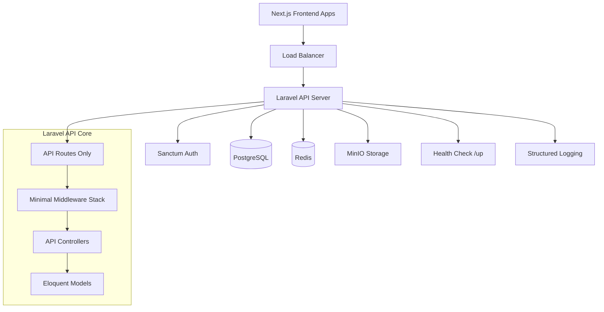
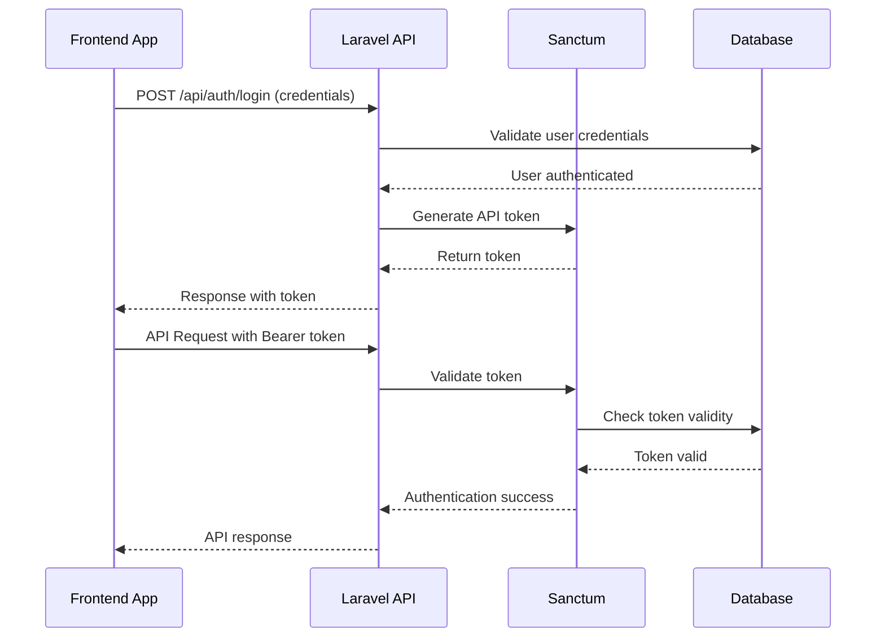
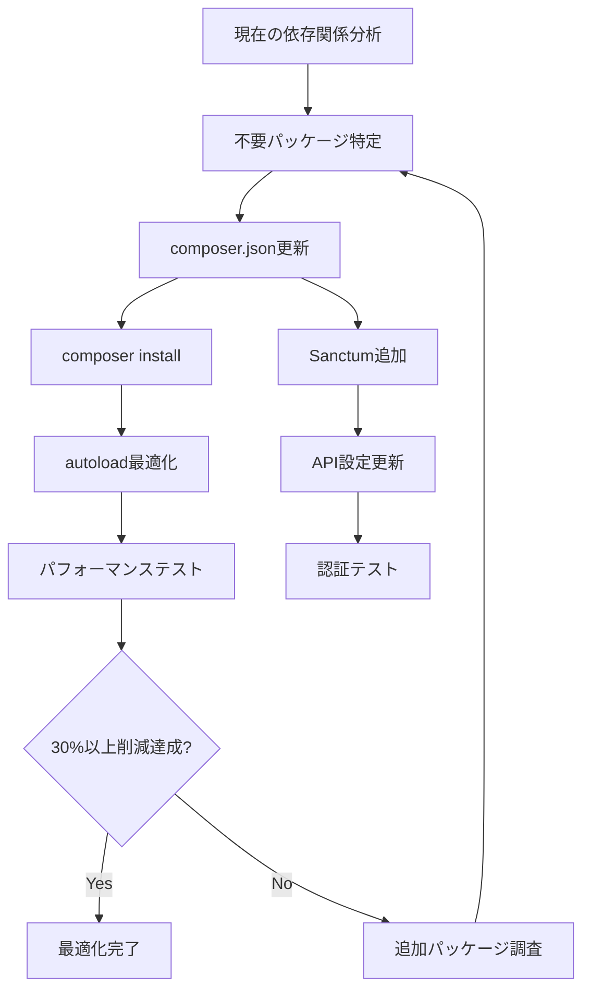
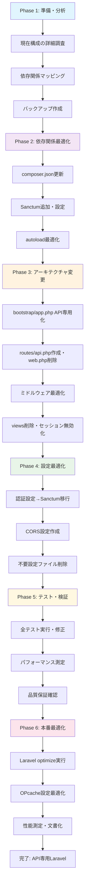

# Laravel 必要最小限パッケージ構成 - 技術設計書

## 概要

この機能は現在のLaravel 12.0標準構成を、API開発に特化した軽量で高効率なパッケージ構成に最適化する。不要なビュー・セッション機能を完全に除去し、パフォーマンス・セキュリティ・保守性を大幅に向上させる。

**目的**: 本プロジェクトのAPI駆動型アーキテクチャに最適化されたLaravel APIサーバーの実現。フロントエンドとの疎結合を維持しながら、高速で軽量な API レスポンスを提供する。

**対象ユーザー**: API開発者、DevOpsエンジニア、システム管理者がより効率的な開発・運用環境で作業できる。

**影響**: 現在のweb中心のLaravel構成を、API専用の最適化された構成に変更する。既存のDocker環境やNext.jsフロントエンドとの統合ポイントは完全に維持される。

### 目標
- 起動速度20-30%向上とメモリ使用量15-25%削減の実現
- 依存関係を30%以上削減してセキュリティ攻撃面の縮小
- API専用アーキテクチャによる開発・保守効率の向上
- Laravel Sanctumによる堅牢なトークンベース認証の実装

### 対象外
- 既存のNext.jsフロントエンドアプリケーションへの変更
- データベーススキーマ・マイグレーションの修正
- Docker/Laravel Sail環境設定の大幅変更
- 新機能追加やUI/UX改善

## アーキテクチャ

### 既存アーキテクチャ分析
現在のLaravel構成は標準的なWeb+API両対応構成：
- **Webルート中心**: `routes/web.php`でビューレンダリングに対応
- **最小依存関係**: Laravel Framework + Tinkerのみの軽量構成（APIに不可欠なSanctum不在）
- **標準ミドルウェア**: セッション・CSRF・Cookie暗号化が有効
- **ビュー機能**: `resources/views`ディレクトリとBladeテンプレートが存在
- **Web認証**: session-based認証がデフォルト設定

### 高レベルアーキテクチャ


**アーキテクチャ統合**:
- **保持パターン**: Laravel標準のMVC、Eloquent ORM、Artisanコマンドシステム
- **新コンポーネント根拠**: API専用ルーティング（パフォーマンス向上）、Sanctum認証（セキュリティ強化）、CORS設定（フロントエンド連携）が必要
- **技術整合性**: 既存のPHP 8.4、PostgreSQL、Redisスタックを完全活用
- **ステアリング準拠**: API駆動型設計、フロントエンド分離、Docker化インフラの原則を維持

### 技術整合性

**既存技術スタックとの整合**:
現在のプロジェクト構成に完全準拠し、以下の既存技術を活用：
- **PHP 8.4 + Laravel 12.0**: 既存バージョンを維持してアップグレードリスクを回避
- **PostgreSQL + Redis**: 現在のデータ層をそのまま継続使用
- **Laravel Sail + Docker**: 開発環境の変更不要
- **PHPUnit/Pest + 静的解析ツール**: 既存の品質保証ワークフローを継承

**新規導入ライブラリ**:
- **Laravel Sanctum 4.0**: APIトークン認証のためAPIに最適化されたパッケージ

**重要設計決定**:

**決定1: Laravel Sanctumによる認証統合**
- **決定**: Laravel SanctumをAPIトークン認証の単一手段として採用
- **コンテキスト**: 現在のセッションベース認証では、ステートレスなAPI設計に適さない
- **代替案**: JWT（jose/php-jwt）、Passport（OAuth2）、独自トークンシステム
- **選択アプローチ**: Laravel標準に統合されたSanctumで、軽量なSPA/APIトークン認証を実装
- **根拠**: Laravelエコシステムとの統合性、設定の簡素さ、十分なセキュリティレベルを実現
- **トレードオフ**: OAuth2の高度な機能は利用できないが、本プロジェクトのシンプルなAPI認証には過剰

**決定2: セッション完全無効化によるステートレス化**
- **決定**: セッション機能を配列ドライバに変更して完全に無効化
- **コンテキスト**: API専用アーキテクチャでは、サーバーサイド状態管理は不要かつパフォーマンス負荷
- **代替案**: セッション機能を部分的に残す、Redis/Databaseセッションを継続
- **選択アプローチ**: SESSION_DRIVER=arrayで全セッション機能を無効化
- **根拠**: メモリ使用量削減、並行処理性能向上、水平スケーリング対応
- **トレードオフ**: セッションベースの機能は利用不可だが、トークンベース認証で代替可能

**決定3: ミドルウェア最小化による処理効率化**
- **決定**: EncryptCookies、StartSession、VerifyCsrfTokenミドルウェアを除去
- **コンテキスト**: API専用環境でCookie・セッション・CSRFは不要かつセキュリティリスク削減
- **代替案**: ミドルウェアを残してAPI用に条件分岐、カスタムミドルウェアで部分的に代替
- **選択アプローチ**: API専用ミドルウェアスタック（Throttle、SubstituteBindings）のみ適用
- **根拠**: リクエスト処理時間短縮、メモリ使用量削減、攻撃対象面積縮小
- **トレードオフ**: Web機能は完全に利用不可だが、API専用設計では不要

## システムフロー

### API認証・認可フロー


### 依存関係最適化フロー


## 要件追跡

| 要件 | 要件概要 | コンポーネント | インターフェース | フロー |
|------|----------|----------------|------------------|--------|
| 1.1 | composer.json最適化 | 依存関係管理 | Composer API | 依存関係最適化フロー |
| 1.4 | 30%以上依存関係削減 | パフォーマンス測定 | Benchmark API | パフォーマンステスト |
| 2.1-2.5 | アーキテクチャ簡素化 | Bootstrap設定、ルーティング | App Configuration | - |
| 3.1-3.4 | 設定最適化 | Config管理、認証設定 | Config API | - |
| 4.1-4.4 | パフォーマンス向上 | 最適化エンジン、キャッシュ | Artisan Commands | - |
| 5.1-5.4 | セキュリティ強化 | 認証システム、ヘルスチェック | Sanctum API | API認証フロー |
| 6.1-6.5 | テスト・品質保証 | テストスイート、静的解析 | Testing Framework | - |
| 7.1-7.4 | 文書化・移行支援 | ドキュメント生成、移行ツール | Documentation API | - |

## コンポーネントとインターフェース

### 依存関係管理

#### 最適化エンジン

**責任とドメイン境界**
- **主要責任**: Laravel アプリケーションの依存関係を最小限に抑え、不要なパッケージを特定・除去
- **ドメイン境界**: Composerパッケージ管理とautoload最適化領域
- **データ所有権**: composer.json、composer.lockファイルの構成データを管理
- **トランザクション境界**: パッケージ更新操作の原子性を保証

**依存関係**
- **Inbound**: 開発者によるコマンド実行、自動化スクリプトからの呼び出し
- **Outbound**: Composer CLI、Packagistレポジトリ、ローカルファイルシステム
- **External**: Packagist.org API、GitHub パッケージレポジトリ

**コントラクト定義**

**Service Interface**:
```php
interface DependencyOptimizationService
{
    public function analyzeCurrent(): DependencyAnalysis;
    public function identifyUnnecessary(): array<PackageInfo>;
    public function optimizeComposerJson(): Result<bool, OptimizationError>;
    public function validateOptimization(): ValidationResult;
}

interface DependencyAnalysis
{
    public function getTotalPackages(): int;
    public function getProductionPackages(): array<PackageInfo>;
    public function getDevelopmentPackages(): array<PackageInfo>;
    public function calculateSize(): DependencySize;
}
```

**前提条件**: composer.jsonファイルが存在し、有効なJSON形式である
**事後条件**: 最適化後も Laravel アプリケーションが正常に動作する
**不変条件**: PHP 8.4、Laravel 12.0、Laravel Sanctum、Laravel Tinkerは常に保持される

### アーキテクチャ設定管理

#### Bootstrap設定コンポーネント

**責任とドメイン境界**
- **主要責任**: Laravel アプリケーション初期化設定をAPI専用に最適化
- **ドメイン境界**: アプリケーションライフサイクル管理とルーティング設定
- **データ所有権**: bootstrap/app.php、ルーティング設定、ミドルウェアスタック設定
- **トランザクション境界**: アプリケーション起動設定の原子的更新

**コントラクト定義**

**Service Interface**:
```php
interface BootstrapConfigurationService
{
    public function configureApiOnly(): Result<bool, ConfigurationError>;
    public function removeWebRoutes(): Result<bool, RouteError>;
    public function optimizeMiddleware(): Result<MiddlewareStack, MiddlewareError>;
    public function validateConfiguration(): ValidationResult;
}

interface MiddlewareStack
{
    public function getApiMiddleware(): array<string>;
    public function getRemovedMiddleware(): array<string>;
    public function validate(): Result<bool, MiddlewareError>;
}
```

**統合戦略**: 既存のbootstrap/app.phpを拡張する方式。Laravel 12の新しい設定形式を活用してAPI専用構成に最適化。

### 認証・セキュリティ

#### Sanctum認証システム

**責任とドメイン境界**
- **主要責任**: APIトークンベース認証の提供と管理
- **ドメイン境界**: ユーザー認証・認可・トークン管理領域
- **データ所有権**: personal_access_tokensテーブル、ユーザー認証状態
- **トランザクション境界**: トークン発行・検証・無効化の原子性

**依存関係**
- **Inbound**: APIコントローラー、認証ミドルウェア、フロントエンドアプリケーション
- **Outbound**: User モデル、データベース、キャッシュシステム
- **External**: Laravel Sanctum 4.0パッケージ

**外部依存関係調査**:
Laravel Sanctum 4.0の詳細仕様：
- **API機能**: トークン生成（createToken）、認証（auth:sanctum）、能力ベース認可（tokenCan）
- **認証方法**: Bearer Token、Cookie認証（SPA用）の両対応
- **レート制限**: Laravel標準のThrottleMiddlewareと統合
- **設定要件**: config/sanctum.php設定、personal_access_tokensマイグレーション実行が必須

**コントラクト定義**

**Service Interface**:
```php
interface SanctumAuthenticationService
{
    public function generateToken(User $user, array $abilities = ['*']): PersonalAccessToken;
    public function validateToken(string $token): Result<User, AuthenticationError>;
    public function revokeToken(User $user, ?int $tokenId = null): Result<bool, RevocationError>;
    public function configureGuards(): Result<bool, ConfigurationError>;
}

interface PersonalAccessToken
{
    public function getTokenValue(): string;
    public function getAbilities(): array<string>;
    public function getExpiresAt(): ?Carbon;
}
```

**前提条件**: personal_access_tokensマイグレーション実行済み、Userモデルが HasApiTokens トレイト使用
**事後条件**: トークンが正常に発行され、API認証で利用可能
**不変条件**: トークンの一意性とセキュリティレベルを保証

**状態管理**: トークンの発行・アクティブ・期限切れ・無効化のライフサイクル管理

### パフォーマンス測定

#### ベンチマーク測定システム

**責任とドメイン境界**
- **主要責任**: 最適化前後のパフォーマンス定量測定と改善効果の検証
- **ドメイン境界**: システムパフォーマンス監視・ベンチマーク実行
- **データ所有権**: パフォーマンステスト結果、改善メトリクス
- **トランザクション境界**: 測定プロセスの一貫性と結果整合性

**依存関係**
- **External**: wrk (HTTP benchmarking tool)、Apache Bench、Laravel内蔵プロファイラ

**外部依存関係調査**:
- **wrk**: 高性能HTTPベンチマークツール。`-t4 -c128 -d30s` で4スレッド・128コネクション・30秒間測定
- **Apache Bench**: `ab -n 50000 -c 128` で50,000リクエスト・128同時接続測定
- **設定要件**: 両ツールのインストール、測定対象エンドポイント（/api/ping、/up）の準備

**コントラクト定義**

**Service Interface**:
```php
interface PerformanceBenchmarkService
{
    public function measureStartupTime(): Result<StartupMetrics, MeasurementError>;
    public function measureMemoryUsage(): Result<MemoryMetrics, MeasurementError>;
    public function runHttpBenchmark(string $endpoint): Result<HttpBenchmarkResult, BenchmarkError>;
    public function compareWithBaseline(MetricsSnapshot $baseline): PerformanceComparison;
}

interface StartupMetrics
{
    public function getBootTime(): float; // milliseconds
    public function getInitializationTime(): float;
    public function getRouteLoadTime(): float;
}
```

**測定プロセス**: 最適化前ベースライン取得 → 変更適用 → 最適化後測定 → 改善率計算 → レポート生成

## データモデル

### 認証データモデル

**Personal Access Tokens (Laravel Sanctum)**:
```php
personal_access_tokens:
  - id: bigint unsigned (primary)
  - tokenable_type: varchar(255)
  - tokenable_id: bigint unsigned
  - name: varchar(255)
  - token: varchar(64, unique, hashed)
  - abilities: text (JSON array)
  - last_used_at: timestamp nullable
  - expires_at: timestamp nullable
  - created_at: timestamp
  - updated_at: timestamp

indexes:
  - personal_access_tokens_tokenable_type_tokenable_id_index
  - personal_access_tokens_token_unique
```

**Users テーブル拡張**:
```php
// Userモデルにトレイト追加
use Laravel\Sanctum\HasApiTokens;

class User extends Authenticatable
{
    use HasApiTokens;
    // 既存のUser実装を継承
}
```

### パフォーマンスメトリクスモデル

**ベンチマーク結果スキーマ**:
```php
interface PerformanceSnapshot
{
    startup_time: float;           // アプリケーション起動時間 (ms)
    memory_usage: int;            // メモリ使用量 (bytes)
    dependency_count: int;        // 依存関係パッケージ数
    http_response_time: float;    // 平均HTTPレスポンス時間 (ms)
    requests_per_second: float;   // 1秒あたりリクエスト処理数
    measured_at: timestamp;       // 測定実行時刻
}
```

## エラーハンドリング

### エラー戦略
API専用アーキテクチャに最適化された階層的エラー処理とレジリエンス設計。各エラーカテゴリーに応じた適切なレスポンスと回復メカニズムを実装。

### エラーカテゴリーとレスポンス
**ユーザーエラー (400番台)**:
- **無効な認証情報 (401)** → Sanctumトークン再発行ガイダンス、ログイン画面リダイレクト
- **認証トークン期限切れ (401)** → 自動トークン更新またはリフレッシュフロー提示
- **API利用権限不足 (403)** → 必要な権限レベルの明示、管理者連絡先提供
- **リソース未発見 (404)** → 類似APIエンドポイント提案、APIドキュメント参照

**システムエラー (500番台)**:
- **データベース接続失敗 (500)** → Redis フェイルオーバー、読み取り専用モード移行
- **外部API タイムアウト (504)** → Circuit Breaker パターン、代替サービス提供
- **メモリ不足 (500)** → 自動スケールアップ、処理優先度制御
- **設定エラー (500)** → ヘルスチェック失敗アラート、自動ロールバック

**ビジネスロジックエラー (422)**:
- **バリデーション失敗** → フィールド単位の詳細エラー、修正例の提示
- **データ整合性違反** → 関連リソース状態説明、修正手順ガイド
- **レート制限超過** → 利用可能時刻の明示、上位プラン案内

### 監視
- **Laravelログ**: 構造化ログ出力（JSON形式）でパフォーマンス指標を含む詳細記録
- **ヘルスチェック**: `/up` エンドポイントでデータベース・Redis・ストレージの総合確認
- **メトリクス**: Laravel Telescope またはプロメテウス連携でリアルタイムパフォーマンス監視

## テスト戦略

### Unit Tests
- **SanctumAuthenticationService**: トークン生成・検証・無効化メソッドの単体動作確認
- **DependencyOptimizationService**: composer.json最適化ロジックとパッケージ解析機能
- **BootstrapConfigurationService**: API専用設定生成とミドルウェアスタック構築
- **PerformanceBenchmarkService**: メトリクス測定精度とベースライン比較計算
- **Config設定クラス**: Sanctum・CORS・認証設定の妥当性検証

### Integration Tests
- **API認証フロー**: トークン発行→認証→API アクセス→トークン無効化の完全シーケンス
- **CORS設定**: Next.jsフロントエンドからの実際のクロスオリジンリクエスト処理
- **ヘルスチェック**: `/up` エンドポイントでデータベース・Redis・ストレージ接続確認
- **エラーハンドリング**: 無効トークン・権限不足・リソース未発見の適切なレスポンス
- **パフォーマンス統合**: 最適化適用後の実際のレスポンス時間・メモリ使用量測定

### E2E Tests
- **フロントエンド連携**: Next.js AdminApp/UserApp からのAPI 認証・データ取得・更新処理
- **認証ライフサイクル**: ログイン→トークン取得→API利用→ログアウトの完全フロー
- **エラーリカバリ**: トークン期限切れ時の自動更新・再認証プロセス
- **パフォーマンス**: 実際のユーザーワークフローでのレスポンス時間・安定性検証

### Performance Tests
- **同時接続負荷**: wrk・Apache Benchによる高負荷時のレスポンス時間・安定性測定
- **メモリ効率**: 長時間運用でのメモリリーク・ガベージコレクション効率確認
- **起動速度**: アプリケーション初期化時間の最適化前後比較
- **依存関係影響**: パッケージ削減によるコンポーザー処理速度・autoload効率向上測定

## セキュリティ考慮事項

### 攻撃対象面積の削減
- **Web機能完全除去**: CSRF攻撃、セッションハイジャック、XSS攻撃の対象となるWeb機能を完全に排除
- **不要ミドルウェア除去**: Cookie暗号化、セッション管理、CSRF保護ミドルウェアを除去して処理効率化
- **ステートレス設計**: サーバーサイドセッション情報を保持しないため、セッション関連脆弱性を根本的に排除

### 認証・認可強化
- **トークンベース認証**: Laravel Sanctumによる業界標準のBearer Token認証で、セッションベース認証より高いセキュリティ
- **能力ベースアクセス制御**: トークンごとに細かい権限設定が可能で、最小権限の原則を実現
- **トークンライフサイクル管理**: 有効期限設定・無効化・更新機能でセキュリティリスクを最小化

### データ保護・通信セキュリティ
- **CORS設定最適化**: API専用の厳格なクロスオリジン設定で、不正なドメインからのアクセスを防止
- **HTTPS強制**: 本番環境でのTLS暗号化通信強制とセキュアヘッダー設定
- **レート制限**: API エンドポイントへの過度なアクセス制限でDDoS攻撃・ブルートフォース攻撃を軽減

## パフォーマンス・スケーラビリティ

### 目標メトリクス・測定戦略
- **起動速度向上**: 20-30%の改善目標（ベースライン測定→最適化適用→効果検証）
- **メモリ使用量削減**: 15-25%の削減（依存関係・ミドルウェア・セッション除去による効果）
- **依存関係最適化**: 30%以上のパッケージ削減（composer.json最小化とautoload最適化）

### スケーリングアプローチ
- **水平スケーリング**: ステートレスAPI設計により、ロードバランサー配下での複数インスタンス運用が容易
- **コンテナ最適化**: Docker イメージサイズ削減で、Pod起動速度向上とリソース効率改善
- **データベース分離**: PostgreSQL・Redis・MinIOの独立スケーリングで各層の最適化が可能

### キャッシュ戦略・最適化技法
- **OPcacheチューニング**: PHP コード最適化でリクエスト処理速度向上
- **Laravel最適化**: `php artisan optimize`によるルート・設定・ビューキャッシュ
- **Redis活用**: API レスポンスキャッシュとセッションストレージでデータベース負荷軽減

## マイグレーション戦略



**プロセス**: 6段階の段階的移行でリスクを最小化。各フェーズ後にテスト実行して品質を保証。
**ロールバック**: 各フェーズでGitコミット作成。問題発生時は該当フェーズの直前状態に迅速復旧。
**検証チェックポイント**: 依存関係削減率、テスト通過率、パフォーマンス改善率を定量的に確認。