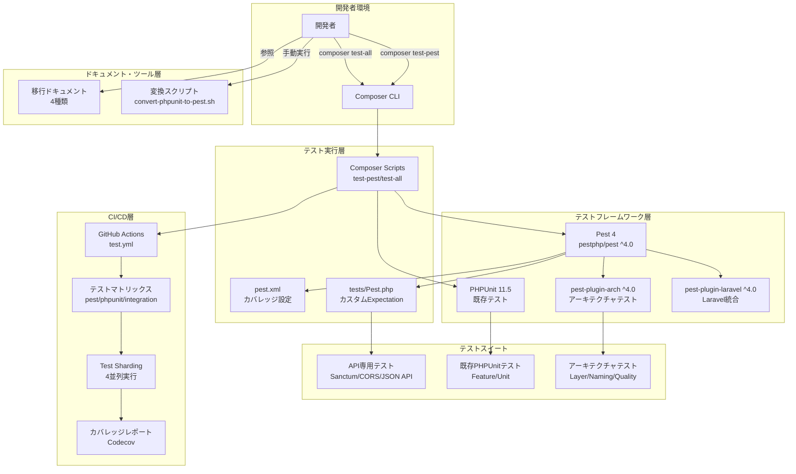
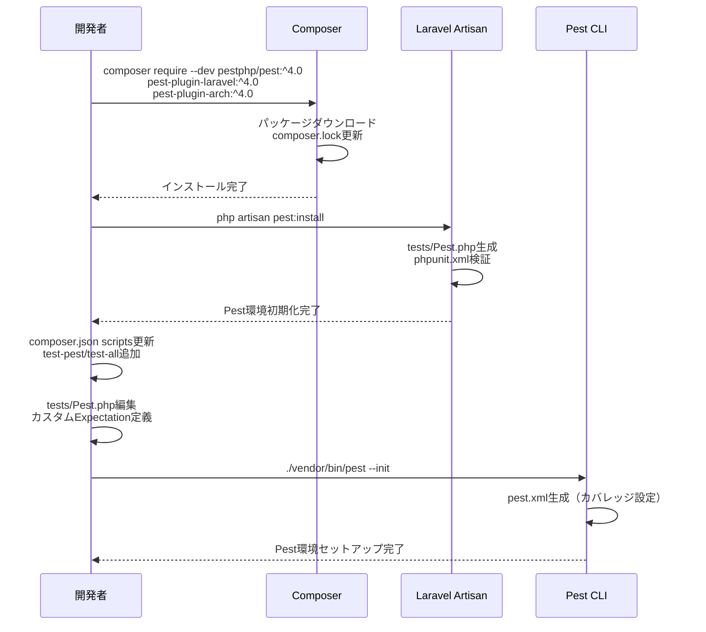
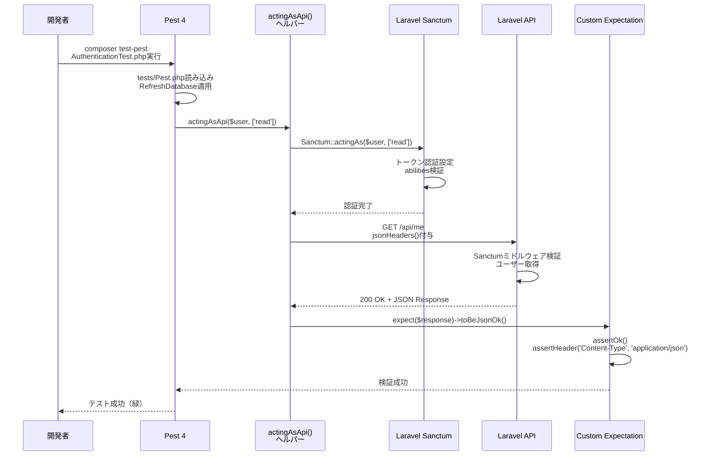
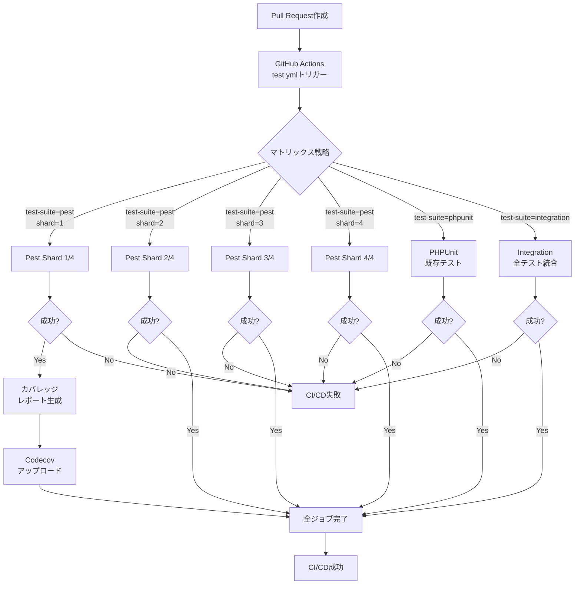
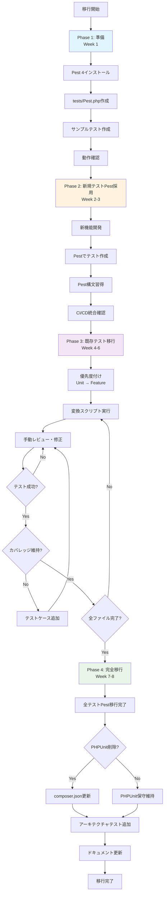

# Technical Design Document

## Overview

本機能は、Laravel 12プロジェクトのテストフレームワークをPHPUnit 11.5からPest 4に段階的に移行し、テストコードの可読性と保守性を向上させる。Pest 4の直感的な構文により開発者体験を改善し、Architecture Testing機能でコードベースの設計原則を自動検証する。

**対象ユーザー**: バックエンド開発者は、API専用アーキテクチャに特化したテストサンプル（Sanctum認証、CORS、JSON API）を参照し、新規API開発時のテストパターンを習得する。テストリード開発者は、段階的移行ツールとドキュメントを活用し、既存PHPUnitテスト（約20ファイル）を計画的にPestへ移行する。DevOps担当者は、CI/CDパイプラインをTest Sharding（4並列）に対応させ、Pull Request時のフィードバック時間を短縮する。

**影響**: 既存のPHPUnitテストは引き続き動作し、移行期間中は両フレームワークを併用する。テストカバレッジ80%以上を維持し、Laravel 12のAPI専用最適化アーキテクチャ（ステートレス設計、Sanctum認証、CORS最適化）を活かした

テスト基盤を確立する。

### Goals

- **テストコード品質向上**: Pest 4の `it()` / `expect()` 構文で可読性と保守性を向上させ、カスタムExpectation（`toBeJsonOk`, `toHaveCors`）でAPI専用テストパターンを簡潔化
- **アーキテクチャ品質保証**: Architecture Testing機能でレイヤー分離、命名規則、コード品質を自動検証し、設計原則の逸脱を早期検出
- **段階的移行の実現**: PHPUnitとPest 4を併用し、変換ツール・ドキュメント・移行チェックリストで計画的な移行を支援
- **CI/CDパフォーマンス最適化**: Test Sharding（4並列）でPull Request時のテスト実行時間を短縮し、開発効率を向上

### Non-Goals

- **既存PHPUnitテストの一括自動変換**: 段階的に手動移行し、変換品質とテスト精度を確保（自動変換は基本的な構文のみサポート）
- **Pest 4新機能の全面導入**: Browser Testing（Playwright統合）、Visual Regression Testingは将来的な別Issueとして検討
- **パフォーマンステストフレームワーク**: 負荷テスト・ベンチマークは本移行の対象外

## Architecture

### 既存アーキテクチャ分析

**現在のテスト環境**:
- **PHPUnit 11.5**: 標準テストフレームワーク、Feature/Unitディレクトリに約20ファイル
- **Laravel TestCase**: `tests/TestCase.php` でLaravel統合機能（RefreshDatabase、認証ヘルパー）を提供
- **phpunit.xml**: テストスイート定義、環境変数設定（DB_CONNECTION=pgsql, SESSION_DRIVER=array）
- **Composer Scripts**: `composer test` でPHPUnit実行、`composer quality` で品質チェック（Pint + Larastan）
- **既存CI/CD**: GitHub Actions `php-quality.yml` でPint/Larastan品質チェック

**既存パターンの保持**:
- **API専用設計**: ステートレスSanctum認証、CORS最適化、JSON APIレスポンス検証パターンを継承
- **RefreshDatabase**: Feature TestでDB自動リフレッシュ、テスト用DB（`testing`）分離
- **Laravel Sail統合**: Docker環境（PostgreSQL, Redis）での一貫したテスト実行
- **品質管理統合**: 既存の `composer quality` ワークフローにPestを追加

### 高レベルアーキテクチャ



**アーキテクチャ統合**:
- **既存パターン保持**: Laravel TestCase、RefreshDatabase、Sail統合を継承し、Pestでも同じパターンを使用
- **新規コンポーネント理由**:
  - `tests/Pest.php`: カスタムExpectation（API専用）とヘルパー関数でテストコード簡潔化
  - `pest-plugin-arch`: アーキテクチャテストで設計原則自動検証（既存品質管理を補完）
  - Test Sharding: CI/CD並列実行で既存の品質チェック（Pint/Larastan）と統合
- **技術整合性**: PHP 8.4、Laravel 12、Docker（Laravel Sail）、GitHub Actionsの既存スタックに完全準拠
- **ステアリング準拠**: `tech.md`のPHP品質管理システム（Pint/Larastan）と連携、`structure.md`のテストディレクトリ構造を維持

### 技術整合性

本機能は既存のLaravel 12プロジェクトにPest 4を導入する**拡張機能**であり、既存の技術スタックとアーキテクチャパターンに完全準拠する。

**既存技術スタックとの整合**:
- **PHP 8.4 & Laravel 12**: Pest 4は両バージョンに完全対応、PHPUnit 11.5と共存可能
- **Laravel Sanctum 4.0**: `actingAsApi()` ヘルパーで既存のトークン認証パターンを継承
- **Docker & Laravel Sail**: `compose.yaml`のPostgreSQL/Redis環境でPestを実行、既存のテスト用DB（`testing`）を使用
- **GitHub Actions**: 既存の`php-quality.yml`ワークフローを拡張し、`test.yml`を追加
- **品質管理システム**: 既存の `composer quality`（Pint + Larastan）にPestを統合、pre-push hookで実行

**新規導入依存関係**:
- **pestphp/pest ^4.0**: Pest 4コアフレームワーク（[Pest公式](https://pestphp.com/)）
- **pestphp/pest-plugin-laravel ^4.0**: Laravel統合プラグイン（[GitHub](https://github.com/pestphp/pest-plugin-laravel)）
- **pestphp/pest-plugin-arch ^4.0**: アーキテクチャテストプラグイン（[GitHub](https://github.com/pestphp/pest-plugin-arch)）
- **nunomaduro/collision ^8.0**: エラー表示改善（Pest推奨、Laravel 12互換）

**アーキテクチャパターン整合性**:
- **API専用設計**: ステートレス設計（`SESSION_DRIVER=array`）、CORS最適化、JSON APIレスポンス検証を維持
- **レイヤー分離**: 既存のController/Service/Model分離をArchitecture Testingで強制
- **テストディレクトリ構造**: `tests/Feature`, `tests/Unit`, `tests/Architecture`（新規）の階層構造を維持

### 主要な設計決定

#### 決定1: Pest 4とPHPUnit 11.5の段階的併用戦略

**Context**: 既存のPHPUnitテスト（約20ファイル）を一括変換すると、テスト精度低下とプロジェクト停止リスクがある。開発者の学習コストを最小限に抑えつつ、移行期間中もCI/CDパイプラインを維持する必要がある。

**Alternatives**:
1. **一括自動変換**: 全PHPUnitテストを自動変換し、即座にPestへ完全移行
2. **PHPUnit完全維持**: Pestを新規テストのみに使用し、既存テストは永続的にPHPUnit維持
3. **段階的併用**: 新規テストはPest、既存テストは手動で順次移行、両フレームワーク併用期間を設定

**Selected Approach**: **段階的併用戦略（Alternative 3）** - `composer test-all` で両フレームワークを順次実行

```json
{
  "scripts": {
    "test": ["@php artisan config:clear --ansi", "./vendor/bin/pest"],
    "test-pest": ["@php artisan config:clear --ansi", "./vendor/bin/pest"],
    "test-phpunit": ["@php artisan config:clear --ansi", "./vendor/bin/phpunit"],
    "test-all": ["@test-phpunit", "@test-pest"]
  }
}
```

**Rationale**:
- **品質保証**: 既存テストの動作を保証し、移行時のバグ混入リスクを最小化
- **学習コスト分散**: 開発者が段階的にPest構文を学習、並行して既存テストを保守
- **CI/CD継続性**: GitHub Actions `test-suite: [pest, phpunit, integration]` マトリックスで両フレームワークを並列検証
- **変換ツール提供**: `convert-phpunit-to-pest.sh` で基本的な構文変換を支援、手動レビューで品質確保

**Trade-offs**:
- **利点**: 移行リスク最小化、既存テストの継続動作、段階的な品質向上
- **欠点**: 一時的な二重保守コスト（両フレームワーク管理）、`test-all`実行時間の増加（順次実行）

#### 決定2: API専用カスタムExpectationの導入

**Context**: Laravel 12のAPI専用アーキテクチャ（Sanctum認証、CORS、JSON API）に特化したテストパターンが頻繁に登場し、繰り返しアサーションコードが冗長化している。開発者がAPI専用テストを簡潔に記述できる仕組みが必要。

**Alternatives**:
1. **標準Expectationのみ**: Pest標準の `expect()->toBeOk()->toHaveHeader()` を使用
2. **trait/クラスヘルパー**: TestCaseにメソッド追加（`$this->assertJsonOk($response)`）
3. **カスタムExpectation**: Pest 4の `expect()->extend()` でAPI専用Expectationを定義

**Selected Approach**: **カスタムExpectation（Alternative 3）** - `tests/Pest.php` に `toBeJsonOk`, `toHaveCors` を定義

```php
// tests/Pest.php
expect()->extend('toBeJsonOk', function () {
    $response = $this->value;
    $response->assertOk()->assertHeader('Content-Type', 'application/json');
    return $this;
});

expect()->extend('toHaveCors', function (string $origin = '*') {
    $response = $this->value;
    $response->assertHeader('Access-Control-Allow-Origin', $origin);
    $response->assertHeader('Access-Control-Allow-Methods');
    $response->assertHeader('Access-Control-Allow-Headers');
    return $this;
});

// テストコード
expect($response)->toBeJsonOk()->toHaveCors('http://localhost:3000');
```

**Rationale**:
- **API専用最適化**: プロジェクトのAPI専用アーキテクチャに特化した簡潔な構文
- **可読性向上**: `toBeJsonOk()` でHTTPステータス200 + JSON Content-Typeを1行で検証
- **再利用性**: 全Pestテストで共通利用、テストコードの重複削減
- **Pest 4ネイティブ機能**: `expect()->extend()` でフレームワーク標準の拡張メカニズムを活用

**Trade-offs**:
- **利点**: テストコード簡潔化、API専用パターンの一元管理、ドメイン特化DSL構築
- **欠点**: カスタムExpectationの学習コスト、標準Expectationとの使い分け判断

#### 決定3: Test Sharding（4並列）によるCI/CD最適化

**Context**: 既存のCI/CDパイプライン（`php-quality.yml`でPint/Larastan実行）に加え、Pest/PHPUnitテストを追加すると、Pull Request時のフィードバック時間が増加する。開発効率を維持しつつ、品質チェックとテスト実行を並列化する必要がある。

**Alternatives**:
1. **順次実行**: `test-all` を単一ジョブで実行（PHPUnit → Pest → 品質チェック）
2. **Pest並列実行**: `pest --parallel` でローカル並列化のみ、CI/CDは単一ジョブ
3. **Test Sharding**: GitHub Actionsマトリックスで4並列Sharding、テストスイート分離

**Selected Approach**: **Test Sharding（Alternative 3）** - マトリックス戦略で `test-suite x shard` の2次元並列化

```yaml
# .github/workflows/test.yml
strategy:
  matrix:
    test-suite: [pest, phpunit, integration]
    shard: [1, 2, 3, 4]

steps:
  - name: Run Pest Tests (Shard ${{ matrix.shard }})
    if: matrix.test-suite == 'pest'
    run: ./vendor/bin/pest --shard=${{ matrix.shard }}/4
```

**Rationale**:
- **並列実行最適化**: Pestテストを4分割し、GitHub Actionsの並列ジョブで同時実行
- **フィードバック時間短縮**: テスト実行時間を1/4に短縮（理論値）、Pull Request時の待機時間削減
- **テストスイート分離**: `pest`, `phpunit`, `integration` を独立実行、移行期間中の柔軟性確保
- **Pest 4ネイティブ機能**: `--shard` オプションでテストファイルを均等分割

**Trade-offs**:
- **利点**: CI/CD実行時間短縮、並列実行による開発効率向上、スケーラブルなテスト戦略
- **欠点**: GitHub Actionsのジョブ消費増加（4並列 x 3スイート = 12ジョブ）、Shard間のテスト分散不均衡リスク

## System Flows

### Pest環境セットアップフロー



### API専用テスト実行フロー（Sanctum認証例）



### CI/CD Test Sharding実行フロー



## Requirements Traceability

| Requirement | 要件概要 | コンポーネント | インターフェース | フロー |
|-------------|---------|--------------|----------------|--------|
| 1.1-1.6 | Pest 4環境インストール・基本設定 | Pest Core, composer.json, tests/Pest.php, pest.xml | Composer Scripts (test-pest, test-all), Artisan Command (pest:install) | Pest環境セットアップフロー |
| 2.1-2.6 | Laravel統合・カスタムExpectation | tests/Pest.php, actingAsApi(), jsonHeaders(), toBeJsonOk, toHaveCors | expect()->extend(), uses() API, beforeEach() | - |
| 3.1-3.6 | Sanctum認証テストサンプル | AuthenticationTest.php, actingAsApi() | it() syntax, expect()->toBeJsonOk() | API専用テスト実行フロー（Sanctum例） |
| 4.1-4.5 | CORSテストサンプル | CorsTest.php, toHaveCors | expect()->toHaveCors(), withHeaders() | - |
| 5.1-5.6 | JSON APIテストサンプル | JsonApiTest.php | assertJson(), assertJsonStructure() | - |
| 6.1-6.6 | アーキテクチャテスト | LayerTest.php, NamingTest.php, QualityTest.php | arch() syntax, expect()->not->toUse() | - |
| 7.1-7.6 | 段階的移行ツール・ドキュメント | convert-phpunit-to-pest.sh, 4種類ドキュメント | Bash Script API, Markdown | - |
| 8.1-8.6 | CI/CD Test Sharding | .github/workflows/test.yml, Matrix Strategy | --shard=${{ matrix.shard }}/4, Codecov API | CI/CD Test Sharding実行フロー |
| 9.1-9.6 | Composer Scripts統合 | composer.json scripts, pest.xml | test-coverage, test-parallel, test-shard | - |
| 10.1-10.6 | 動作確認・品質保証 | 全コンポーネント統合 | composer test-all, CI/CD全パイプライン | CI/CD Test Sharding実行フロー |

## Components and Interfaces

### テストフレームワーク層

#### Pest 4コアエンジン

**Responsibility & Boundaries**
- **Primary Responsibility**: Pestテストの実行エンジン、expectation API提供、プラグインシステム管理
- **Domain Boundary**: テスト実行フレームワーク層、LaravelアプリケーションとPHPUnitに依存
- **Data Ownership**: テスト実行結果、カバレッジデータ、Sharding状態管理

**Dependencies**
- **Inbound**: Composer CLI、開発者、CI/CDパイプライン
- **Outbound**: PHPUnit 11.5（テストランナー基盤）、pest-plugin-laravel、pest-plugin-arch
- **External**: pestphp/pest ^4.0、Pest公式ドキュメント（[https://pestphp.com/](https://pestphp.com/)）

**Contract Definition**

**CLI Interface**:
| Command | 引数 | 動作 | 出力 |
|---------|------|------|------|
| `./vendor/bin/pest` | なし | 全Pestテスト実行 | テスト結果（緑/赤） |
| `./vendor/bin/pest --parallel` | なし | 並列実行（ローカル） | 高速テスト結果 |
| `./vendor/bin/pest --shard=1/4` | Shard番号/総数 | テスト分割実行 | Shard 1の結果 |
| `./vendor/bin/pest --coverage` | なし | カバレッジ計測 | HTMLレポート |
| `./vendor/bin/pest --coverage --min=80` | 最小カバレッジ | 品質ゲート検証 | 80%未満でエラー |

**Composer Scripts Interface**:
```json
{
  "scripts": {
    "test-pest": "./vendor/bin/pest",
    "test-coverage": "XDEBUG_MODE=coverage ./vendor/bin/pest --coverage --min=80",
    "test-parallel": "./vendor/bin/pest --parallel",
    "test-shard": "./vendor/bin/pest --shard=1/4"
  }
}
```

**Preconditions**:
- Composer依存関係インストール済み（`composer install`）
- `tests/Pest.php` に設定ファイル存在
- Laravel環境変数設定済み（`.env.testing` または `phpunit.xml`）

**Postconditions**:
- テスト結果を標準出力に表示（成功/失敗/スキップ）
- カバレッジレポート生成（`--coverage` 指定時）
- 終了コード0（成功）または1（失敗）

**Invariants**:
- テスト実行前に `config:clear` で設定キャッシュクリア
- RefreshDatabase使用時は各テストでDB自動リフレッシュ
- Sharding実行時はテストファイルを均等分割

### テスト設定層

#### tests/Pest.php（Pest設定ファイル）

**Responsibility & Boundaries**
- **Primary Responsibility**: Pest環境のLaravel統合設定、カスタムExpectation定義、グローバルヘルパー関数提供
- **Domain Boundary**: テスト環境設定層、全Pestテストから参照される共通設定
- **Data Ownership**: カスタムExpectationロジック、ヘルパー関数、テストスイート適用ルール

**Dependencies**
- **Inbound**: 全Pestテストファイル（Feature/Unit/Architecture）
- **Outbound**: Laravel TestCase、RefreshDatabase、Laravel Sanctum
- **External**: pestphp/pest-plugin-laravel ^4.0（Laravel統合プラグイン）

**Contract Definition**

**Configuration API**:
```php
// Laravel TestCase適用
uses(TestCase::class)->in('Feature', 'Unit');

// RefreshDatabase自動適用
uses(RefreshDatabase::class)->in('Feature');

// グローバルセットアップ
beforeEach(function () {
    // 全Pestテスト実行前の共通処理
});
```

**Custom Expectation API**:
```typescript
interface CustomExpectations {
  toBeJsonOk(): Expectation; // HTTP 200 + Content-Type: application/json検証
  toHaveCors(origin?: string): Expectation; // CORSヘッダー存在検証
}

interface HelperFunctions {
  actingAsApi(user: User, abilities?: string[]): void; // Sanctum認証設定
  jsonHeaders(extra?: Record<string, string>): Record<string, string>; // JSONリクエストヘッダー生成
}
```

**Implementation Example**:
```php
// toBeJsonOk Custom Expectation
expect()->extend('toBeJsonOk', function () {
    /** @var TestResponse $response */
    $response = $this->value;
    $response->assertOk()->assertHeader('Content-Type', 'application/json');
    return $this;
});

// actingAsApi Helper Function
function actingAsApi(\App\Models\User $user, array $abilities = ['*']): void
{
    Sanctum::actingAs($user, $abilities);
}

// jsonHeaders Helper Function
function jsonHeaders(array $extra = []): array
{
    return array_merge([
        'Accept' => 'application/json',
        'Content-Type' => 'application/json',
    ], $extra);
}
```

**Preconditions**:
- Pest 4とpest-plugin-laravelがインストール済み
- Laravel Sanctumがインストール済み（API認証機能使用時）

**Postconditions**:
- 全Pestテストで `uses()` 設定が自動適用される
- カスタムExpectation（`toBeJsonOk`, `toHaveCors`）がexpect()チェーンで使用可能
- ヘルパー関数（`actingAsApi`, `jsonHeaders`）がグローバルスコープで使用可能

#### pest.xml（カバレッジ設定）

**Responsibility & Boundaries**
- **Primary Responsibility**: PHPUnit/Pest共通のテストスイート定義、カバレッジ設定、環境変数管理
- **Domain Boundary**: テスト実行設定層、PHPUnit/Pest両方の設定を統一管理
- **Data Ownership**: テストスイート構造、カバレッジ対象ディレクトリ、テスト環境変数

**Contract Definition**

**XML Configuration**:
```xml
<phpunit bootstrap="vendor/autoload.php" colors="true">
  <testsuites>
    <testsuite name="Feature">
      <directory>tests/Feature</directory>
    </testsuite>
    <testsuite name="Unit">
      <directory>tests/Unit</directory>
    </testsuite>
  </testsuites>
  <source>
    <include>
      <directory>app</directory>
    </include>
  </source>
  <coverage>
    <report>
      <html outputDirectory="coverage-html"/>
      <clover outputFile="coverage.xml"/>
    </report>
  </coverage>
</phpunit>
```

**Preconditions**:
- `app/` ディレクトリにカバレッジ対象コード存在
- Xdebugまたはpcov拡張がインストール済み

**Postconditions**:
- `pest --coverage` 実行時に `coverage-html/` ディレクトリにHTMLレポート生成
- `coverage.xml` にClover形式レポート生成（Codecov連携用）

### テストサンプル層

#### AuthenticationTest.php（Sanctum認証テスト）

**Responsibility & Boundaries**
- **Primary Responsibility**: Laravel Sanctum認証のベストプラクティステストサンプル提供
- **Domain Boundary**: API認証テスト層、Sanctumトークンベース認証の検証パターン
- **Data Ownership**: 認証テストシナリオ（認証成功、未認証拒否、権限検証）

**Dependencies**
- **Inbound**: テスト実行者（開発者、CI/CD）
- **Outbound**: `actingAsApi()` ヘルパー、`toBeJsonOk` カスタムExpectation、User Factory
- **External**: Laravel Sanctum 4.0（[https://laravel.com/docs/12.x/sanctum](https://laravel.com/docs/12.x/sanctum)）

**Contract Definition**

**Test API（Pest形式）**:
```php
it('returns profile for authenticated user', function () {
    $user = User::factory()->create();
    actingAsApi($user);

    $response = $this->getJson('/api/me', jsonHeaders());

    expect($response)
        ->toBeJsonOk()
        ->and($response->json('data.id'))->toBe($user->id)
        ->and($response->json('data.email'))->toBe($user->email);
});

it('rejects unauthenticated access to protected route', function () {
    $this->getJson('/api/me', jsonHeaders())
         ->assertUnauthorized();
});

it('validates token abilities', function () {
    $user = User::factory()->create();
    actingAsApi($user, ['read']);

    $this->getJson('/api/me', jsonHeaders())->assertOk();
    $this->postJson('/api/users', [], jsonHeaders())->assertForbidden();
});
```

**Preconditions**:
- User Factoryが定義済み（`database/factories/UserFactory.php`）
- `/api/me` エンドポイントが実装済み
- Sanctumミドルウェアが適用済み

**Postconditions**:
- 3つのテストケースが成功（緑）
- 認証済みユーザーで `/api/me` が200 OK
- 未認証リクエストが401 Unauthorized
- 読み取り権限のみで書き込みAPIが403 Forbidden

#### CorsTest.php（CORS検証テスト）

**Responsibility & Boundaries**
- **Primary Responsibility**: Next.jsフロントエンド（localhost:3000, 3001）からのCORS検証テストサンプル
- **Domain Boundary**: API CORS設定テスト層、クロスオリジンリクエストヘッダー検証
- **Data Ownership**: CORS検証シナリオ（OPTIONSプリフライト、実際のリクエスト）

**Contract Definition**

**Test API（Pest形式）**:
```php
it('allows requests from allowed origin', function () {
    $origin = 'http://localhost:3000';

    $response = $this->withHeaders(array_merge(jsonHeaders(), [
        'Origin' => $origin,
    ]))->options('/api/up');

    expect($response)->toHaveCors($origin);
});

it('includes CORS headers in actual requests', function () {
    $response = $this->withHeaders([
        'Origin' => 'http://localhost:3000',
    ])->getJson('/api/up');

    $response->assertHeader('Access-Control-Allow-Origin', 'http://localhost:3000');
});
```

**Preconditions**:
- `config/cors.php` に `allowed_origins` 設定済み（`['http://localhost:3000', 'http://localhost:3001']`）
- Laravel CORSミドルウェアが有効

**Postconditions**:
- OPTIONSリクエストで `Access-Control-Allow-Origin`, `Access-Control-Allow-Methods`, `Access-Control-Allow-Headers` ヘッダー返却
- 実際のGETリクエストで `Access-Control-Allow-Origin: http://localhost:3000` ヘッダー返却

#### JsonApiTest.php（JSON APIレスポンステスト）

**Responsibility & Boundaries**
- **Primary Responsibility**: RESTful JSON APIのレスポンス構造とペジネーション検証テストサンプル
- **Domain Boundary**: JSON APIレスポンステスト層、JSON:API仕様準拠検証
- **Data Ownership**: JSON APIテストシナリオ（リソース作成、ペジネーション）

**Contract Definition**

**Test API（Pest形式）**:
```php
it('creates a resource and returns canonical JSON:API payload', function () {
    $user = User::factory()->create();
    actingAsApi($user);

    $payload = [
        'name' => 'Test Resource',
        'description' => 'Test Description',
    ];

    $response = $this->postJson('/api/resources', $payload, jsonHeaders());

    $response->assertCreated()
        ->assertJsonStructure([
            'data' => ['id', 'name', 'description', 'created_at', 'updated_at'],
        ])
        ->assertJson(fn ($json) =>
            $json->where('data.name', 'Test Resource')
                 ->where('data.description', 'Test Description')
                 ->has('data.id')
                 ->has('data.created_at')
        );
});

it('returns paginated list with metadata', function () {
    User::factory()->count(15)->create();
    $user = User::factory()->create();
    actingAsApi($user);

    $response = $this->getJson('/api/users?page=1&per_page=10', jsonHeaders());

    $response->assertOk()
        ->assertJsonStructure([
            'data' => ['*' => ['id', 'name', 'email']],
            'meta' => ['total', 'per_page', 'current_page', 'last_page'],
            'links' => ['first', 'last', 'prev', 'next'],
        ]);

    expect($response->json('meta.per_page'))->toBe(10)
        ->and(count($response->json('data')))->toBeLessThanOrEqual(10);
});
```

**Preconditions**:
- `/api/resources` POST, `/api/users` GET エンドポイントが実装済み
- ペジネーションロジックが実装済み（Laravelデフォルトまたはカスタム）

**Postconditions**:
- POST `/api/resources` が201 Createdと標準JSON:API構造返却
- GET `/api/users?page=1&per_page=10` が200 OKとペジネーションメタデータ返却

### アーキテクチャテスト層

#### LayerTest.php（レイヤー分離テスト）

**Responsibility & Boundaries**
- **Primary Responsibility**: アーキテクチャ原則（レイヤー分離）の自動検証、設計ルール違反の早期検出
- **Domain Boundary**: アーキテクチャテスト層、Controller/Service/Model依存関係検証
- **Data Ownership**: レイヤー分離ルール定義

**Dependencies**
- **Inbound**: テスト実行者（開発者、CI/CD）
- **Outbound**: pest-plugin-arch、PHP静的解析（AST解析）
- **External**: pestphp/pest-plugin-arch ^4.0（[https://github.com/pestphp/pest-plugin-arch](https://github.com/pestphp/pest-plugin-arch)）

**Contract Definition**

**Architecture Test API**:
```php
arch('controllers should not depend on models directly')
    ->expect('App\Http\Controllers')
    ->not->toUse('App\Models')
    ->toOnlyUse([
        'Illuminate',
        'App\Services',
        'App\Http\Requests',
        'App\Http\Resources',
        'App\Actions',
    ]);

arch('models should not depend on controllers')
    ->expect('App\Models')
    ->not->toUse('App\Http\Controllers');

arch('services should be stateless')
    ->expect('App\Services')
    ->not->toHaveProperties();
```

**Preconditions**:
- `app/Http/Controllers`, `app/Models`, `app/Services` ディレクトリ存在
- pest-plugin-archがインストール済み

**Postconditions**:
- ControllerがModelに直接依存していない場合、テスト成功
- ModelがControllerに依存している場合、テスト失敗（設計違反検出）
- Serviceがプロパティを持つ場合、テスト失敗（ステートレス違反）

#### NamingTest.php（命名規則テスト）

**Responsibility & Boundaries**
- **Primary Responsibility**: 命名規則の自動検証、コードベース全体での一貫性確保
- **Domain Boundary**: アーキテクチャテスト層、クラス/ファイル命名規則検証
- **Data Ownership**: 命名規則ルール定義

**Contract Definition**

**Architecture Test API**:
```php
arch('controllers should be suffixed with Controller')
    ->expect('App\Http\Controllers')
    ->toHaveSuffix('Controller');

arch('models should not be suffixed')
    ->expect('App\Models')
    ->not->toHaveSuffix('Model');

arch('requests should be suffixed with Request')
    ->expect('App\Http\Requests')
    ->toHaveSuffix('Request');

arch('resources should be suffixed with Resource')
    ->expect('App\Http\Resources')
    ->toHaveSuffix('Resource');
```

**Postconditions**:
- Controller名が `Controller` 接尾辞を持つ場合、テスト成功
- Model名が `Model` 接尾辞を持つ場合、テスト失敗（Laravel規約違反）

#### QualityTest.php（コード品質テスト）

**Responsibility & Boundaries**
- **Primary Responsibility**: コード品質ルールの自動検証、デバッグコード混入防止
- **Domain Boundary**: アーキテクチャテスト層、コードベース全体の品質検証
- **Data Ownership**: 品質ルール定義（strictモード、finalクラス、デバッグ関数禁止）

**Contract Definition**

**Architecture Test API**:
```php
arch('no debugging functions in production code')
    ->expect(['dd', 'dump', 'var_dump', 'print_r', 'ray'])
    ->not->toBeUsed();

arch('strict types should be declared')
    ->expect('App')
    ->toUseStrictTypes();

arch('final classes where appropriate')
    ->expect('App\ValueObjects')
    ->toBeFinal();
```

**Postconditions**:
- `dd()`, `dump()` などのデバッグ関数が使用されている場合、テスト失敗
- `declare(strict_types=1)` が宣言されていない場合、テスト失敗
- ValueObjectsが `final` クラスでない場合、テスト失敗

### CI/CD統合層

#### .github/workflows/test.yml（テストワークフロー）

**Responsibility & Boundaries**
- **Primary Responsibility**: GitHub ActionsによるCI/CDテスト自動化、Test Sharding実行、カバレッジレポート連携
- **Domain Boundary**: CI/CDパイプライン層、Pull Request時のテスト実行とフィードバック
- **Data Ownership**: ワークフロー定義、マトリックス戦略、環境変数設定

**Dependencies**
- **Inbound**: GitHub Pull Requestイベント、pushイベント
- **Outbound**: GitHub Actions Runner、Codecov API、Pest CLI、PHPUnit CLI
- **External**:
  - actions/checkout@v4（GitHubアクション、[https://github.com/actions/checkout](https://github.com/actions/checkout)）
  - shivammathur/setup-php@v2（PHPセットアップ、[https://github.com/shivammathur/setup-php](https://github.com/shivammathur/setup-php)）
  - codecov/codecov-action@v3（Codecov連携、[https://github.com/codecov/codecov-action](https://github.com/codecov/codecov-action)）

**Contract Definition**

**GitHub Actions Workflow API**:
```yaml
name: Tests

on:
  push:
    branches: [main, develop]
  pull_request:
    branches: [main, develop]

jobs:
  test:
    runs-on: ubuntu-latest
    strategy:
      matrix:
        test-suite: [pest, phpunit, integration]
        shard: [1, 2, 3, 4]

    steps:
      - uses: actions/checkout@v4

      - name: Setup PHP
        uses: shivammathur/setup-php@v2
        with:
          php-version: 8.4
          extensions: dom, curl, libxml, mbstring, zip, pcntl, pdo, pdo_pgsql
          coverage: xdebug

      - name: Run Pest Tests (Shard ${{ matrix.shard }})
        if: matrix.test-suite == 'pest'
        run: ./vendor/bin/pest --shard=${{ matrix.shard }}/4

      - name: Upload Coverage
        if: matrix.test-suite == 'pest' && matrix.shard == 1
        uses: codecov/codecov-action@v3
        with:
          file: coverage.xml
```

**Preconditions**:
- GitHub Actionsが有効化済み
- Codecovトークンが設定済み（Secret変数）
- `composer.lock` が最新

**Postconditions**:
- 全マトリックスジョブ（pest x 4 shard + phpunit + integration）が成功した場合、Pull Request承認可能
- 1つでもジョブ失敗した場合、Pull Requestブロック
- Shard 1でカバレッジレポートをCodecovにアップロード

### ドキュメント・ツール層

#### convert-phpunit-to-pest.sh（変換スクリプト）

**Responsibility & Boundaries**
- **Primary Responsibility**: PHPUnitテストファイルの基本的なPest構文への自動変換支援
- **Domain Boundary**: 移行ツール層、既存テストファイルのSyntax変換
- **Data Ownership**: 変換ロジック（namespace削除、class定義削除、test_メソッド→it()変換）

**Contract Definition**

**Bash Script API**:
```bash
# 使用方法
bash scripts/convert-phpunit-to-pest.sh tests/Feature/ExampleTest.php

# 変換処理
# 1. バックアップ作成: ExampleTest.php.bak
# 2. namespace Tests削除
# 3. use Tests\TestCase削除
# 4. class定義削除
# 5. test_メソッド→it()変換
```

**Preconditions**:
- PHPUnitテストファイルが存在
- Bashシェル環境（macOS/Linux）

**Postconditions**:
- 元ファイルのバックアップ作成（`.bak` 拡張子）
- 基本的なPest構文に変換（手動レビュー必須）
- 変換結果と検証手順を標準出力に表示

**Invariants**:
- 元ファイルは必ずバックアップされる（データ損失防止）
- 変換失敗時はエラーメッセージ表示

#### PEST_MIGRATION_CHECKLIST.md（移行チェックリスト）

**Responsibility & Boundaries**
- **Primary Responsibility**: 段階的移行の4段階チェックリスト提供
- **Domain Boundary**: ドキュメント層、移行プロセスガイド
- **Data Ownership**: Phase 1-4チェックリスト、移行タスク定義

**Contract Definition**

**Document Structure**:
```markdown
# Phase 1: 準備（Week 1）
- [ ] Pest 4とプラグインのインストール
- [ ] tests/Pest.php作成
- [ ] サンプルテスト作成

# Phase 2: 新規テストでPest採用（Week 2-3）
- [ ] 新機能開発時はPestでテスト作成

# Phase 3: 既存テストの段階的移行（Week 4-6）
- [ ] 1日2-3ファイルずつ変換

# Phase 4: 完全移行（Week 7-8）
- [ ] 全テストのPest移行完了
```

## Error Handling

### エラー戦略

Pest移行における3層エラー処理戦略を採用する。

1. **テスト実行エラー**: Pest/PHPUnitテスト失敗時の即座フィードバック
2. **環境設定エラー**: Composer依存関係、Pest設定ファイルの検証エラー
3. **CI/CDパイプラインエラー**: GitHub Actionsジョブ失敗時のロールバック

### エラーカテゴリと対応

#### ユーザーエラー（4xx相当）

**Pest設定エラー**:
- **原因**: `tests/Pest.php` 構文エラー、カスタムExpectation定義ミス
- **検出**: Pest CLI実行時にPHP構文エラー表示
- **対応**: エラーメッセージのファイル名・行番号から該当箇所修正
- **例**: `expect()->extend('toBeJsonOk', function () { // ... })` の構文ミス

**変換スクリプトエラー**:
- **原因**: 変換対象ファイルが見つからない、権限不足
- **検出**: Bash script実行時にファイル存在チェック失敗
- **対応**: ファイルパス確認、`chmod +x` で実行権限付与
- **例**: `bash convert-phpunit-to-pest.sh tests/Feature/NonExistent.php` → `⚠️ File not found`

#### システムエラー（5xx相当）

**Composer依存関係エラー**:
- **原因**: Pest 4パッケージのインストール失敗、バージョン競合
- **検出**: `composer require` 実行時に依存関係解決エラー
- **対応**: `composer update --with-dependencies` で依存関係更新、`composer.lock` 削除後再インストール
- **例**: `pestphp/pest ^4.0` とPHPUnit 11.5の互換性問題

**Test Sharding失敗**:
- **原因**: GitHub Actionsマトリックスジョブの1つ以上が失敗
- **検出**: CI/CDパイプラインで赤色ステータス表示
- **対応**: 失敗したShardのログ確認、該当テストファイルをローカルで再実行
- **例**: Shard 2/4でデータベース接続タイムアウト

**カバレッジ計測エラー**:
- **原因**: Xdebug未インストール、メモリ不足
- **検出**: `pest --coverage` 実行時にエラーメッセージ表示
- **対応**: Xdebug拡張インストール（`pecl install xdebug`）、PHP `memory_limit` 増加
- **例**: `XDEBUG_MODE=coverage` 未設定

#### ビジネスロジックエラー（422相当）

**テストカバレッジ不足**:
- **原因**: カバレッジ80%未満
- **検出**: `pest --coverage --min=80` 実行時に品質ゲート失敗
- **対応**: 未カバーコードにテストケース追加、不要コード削除
- **例**: `app/Services/UserService.php` の特定メソッドがテスト未カバー

**アーキテクチャルール違反**:
- **原因**: レイヤー分離違反、命名規則違反
- **検出**: Architecture Test実行時に違反検出
- **対応**: 違反箇所をリファクタリング、設計原則に準拠
- **例**: `App\Http\Controllers\UserController` が `App\Models\User` を直接使用

### モニタリング

**ローカル開発環境**:
- Pest CLI出力でテスト結果即時確認
- `pest --coverage` でカバレッジレポート確認（`coverage-html/index.html`）

**CI/CD環境**:
- GitHub ActionsログでShard別テスト結果確認
- Codecovダッシュボードでカバレッジ推移監視
- GitHub Pull RequestステータスチェックでCI/CD成功/失敗確認

**エラートラッキング**:
- Pest失敗時のスタックトレースを標準出力に表示
- GitHub Actions Annotationsで失敗テストを行単位でハイライト
- Codecov CommentでPull Request差分カバレッジ表示

## Testing Strategy

### Unit Tests（Pestカスタム機能）

- **カスタムExpectation動作検証**: `toBeJsonOk()` がHTTP 200とContent-Type: application/jsonを正しく検証
- **ヘルパー関数動作検証**: `actingAsApi($user, ['read'])` がSanctum認証とabilities設定を正しく実行
- **jsonHeaders()動作検証**: `jsonHeaders(['Authorization' => 'Bearer token'])` がヘッダーマージを正しく実行
- **toHaveCors動作検証**: `toHaveCors('http://localhost:3000')` がCORSヘッダー3種を正しく検証

### Integration Tests（Pest/PHPUnit共存）

- **composer test-all実行**: PHPUnitテスト → Pestテストの順次実行が成功
- **Laravel TestCase統合**: `uses(TestCase::class)->in('Feature', 'Unit')` が両ディレクトリで正しく適用
- **RefreshDatabase統合**: `uses(RefreshDatabase::class)->in('Feature')` がFeatureテストでDB自動リフレッシュ
- **Sanctum認証統合**: `actingAsApi($user)` → `/api/me` → 200 OKの一連フローが成功
- **CORS統合**: Originヘッダー付きリクエスト → CORSヘッダー返却フローが成功

### End-to-End Tests（CI/CD Test Sharding）

- **GitHub Actions全ジョブ成功**: pest x 4 shard + phpunit + integration の全12ジョブが緑色
- **Shard並列実行**: Shard 1-4が同時実行され、総実行時間が順次実行の1/4に短縮
- **カバレッジレポートアップロード**: Shard 1で `coverage.xml` が正常にCodecovへアップロード
- **Pull Requestステータスチェック**: CI/CD成功時に緑色チェックマーク表示
- **段階的移行シナリオ**: 新規PestテストとPHPUnitテストが並行実行され、両方成功

### Performance/Load Tests（Pest並列実行）

- **pest --parallel実行**: ローカル環境で並列実行が成功し、実行時間が短縮
- **Sharding均等分割**: Shard 1-4のテストファイル数が均等分散（±10%以内）
- **カバレッジ計測オーバーヘッド**: `--coverage` 有無で実行時間が2倍未満
- **CI/CDジョブキューイング時間**: GitHub Actionsジョブ起動から実行開始まで30秒以内

## Security Considerations

### 認証・認可パターン

**Sanctum認証テスト**:
- **actingAsApi() ヘルパー**: テスト環境でSanctumトークン認証をモック、実際のトークン発行不要
- **abilities検証**: 読み取り権限のみトークンで書き込みAPIが403 Forbiddenを返すことを検証
- **未認証アクセス拒否**: 認証なしで保護エンドポイントが401 Unauthorizedを返すことを検証

**セキュリティリスク**:
- **テスト用トークン漏洩**: `actingAsApi()` はメモリ内モックのみ、永続化されない
- **テスト用DB分離**: `DB_DATABASE=testing` で本番DBと完全分離
- **環境変数管理**: `.env.testing` にテスト用認証情報を記載、`.gitignore` で除外

### データ保護

**RefreshDatabase**:
- Featureテスト実行時にテスト用DBを自動リフレッシュ、本番データ混入防止
- マイグレーション実行後にデータクリーンアップ、テスト間の状態分離

**CORS設定**:
- テスト環境で `allowed_origins` を `['http://localhost:3000', 'http://localhost:3001']` に制限
- 本番環境では実際のフロントエンドドメインのみ許可

## Migration Strategy



### プロセス詳細

**Phase 1: 準備（Week 1）**
- **Rollback Trigger**: `composer require` 失敗、`php artisan pest:install` エラー
- **Validation Checkpoint**: `composer test-pest` で空テスト成功、`tests/Pest.php` 構文チェック成功

**Phase 2: 新規テストPest採用（Week 2-3）**
- **Rollback Trigger**: Pest構文エラーが頻発、開発速度低下
- **Validation Checkpoint**: 新規Pestテストが5ファイル以上作成され、全て成功

**Phase 3: 既存テスト移行（Week 4-6）**
- **Rollback Trigger**: 移行後テストが失敗し続ける、カバレッジ80%未満
- **Validation Checkpoint**: 1日2-3ファイル移行完了、`composer test-all` 成功、カバレッジ維持

**Phase 4: 完全移行（Week 7-8）**
- **Rollback Trigger**: アーキテクチャテストで致命的な設計違反検出
- **Validation Checkpoint**: 全テストPest移行完了、`composer test-pest` 成功、CI/CD全パイプライン成功、ドキュメント更新完了