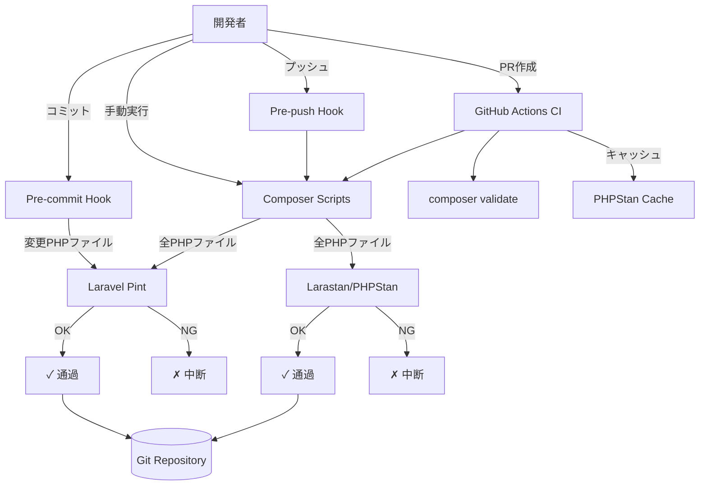
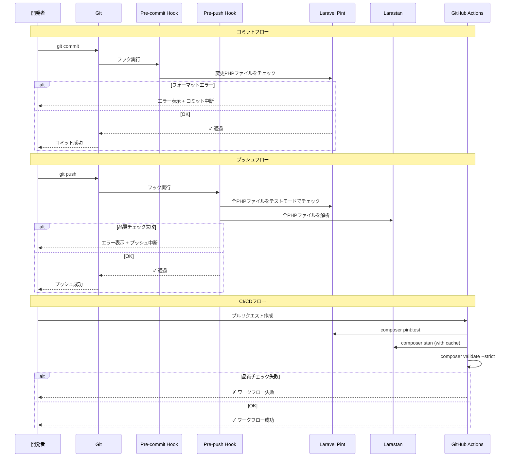
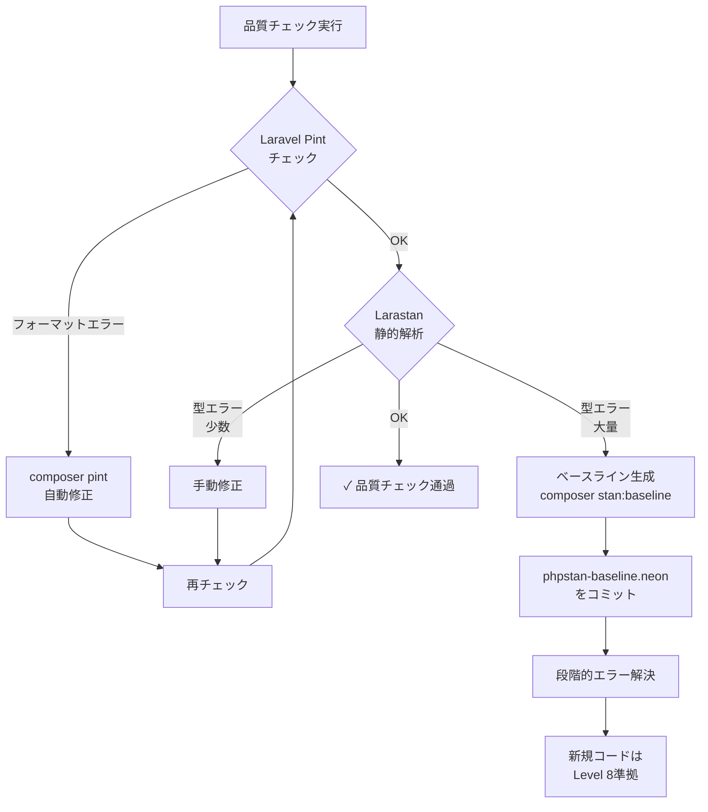
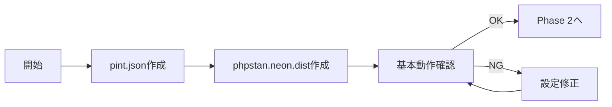
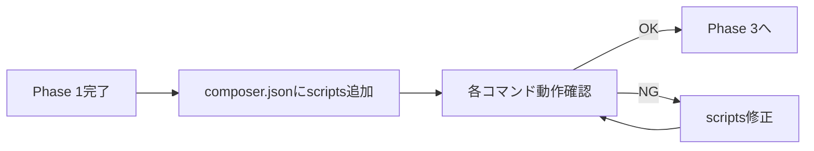
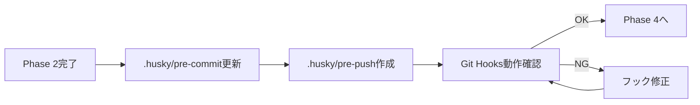
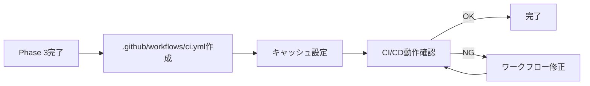
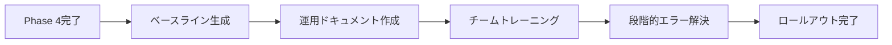

# Technical Design Document

## Overview

このfeatureは、Laravel 12.0プロジェクトにPHP品質管理システムを導入し、コード品質の自動チェックとフォーマットを実現する。開発者は、Laravel Pint v1.24（コードフォーマッター）とLarastan v3.7（静的解析ツール）を活用し、コミット前・プッシュ前・CI/CDパイプラインで自動品質チェックを実行する。

このシステムは、手動チェックを排除し、チーム全体で統一されたコーディングスタイルと型安全性を維持する。開発者は品質チェックの自動化により、コードレビュー時間を削減し、実装に集中できる。

既存のAPI専用最適化済みLaravelプロジェクトに、品質管理層を追加する。フロントエンド開発チームが既に導入している`husky`+`lint-staged`パターンをバックエンドにも適用し、モノレポ全体で統一された品質管理を実現する。

### Goals

- Laravel PintとLarastanの最適化設定により、統一されたコーディングスタイルと型安全性を確保
- Composer scriptsによる統一コマンド（`composer quality`）でチーム全体の運用を簡素化
- Git Hooks（pre-commit、pre-push）とCI/CDによる自動品質ゲートで、品質の低いコードの混入を防止
- 並列処理・キャッシュ・差分チェックによるパフォーマンス最適化で、開発フローを妨げない品質チェックを実現

### Non-Goals

- IDE統合設定（VSCode/PhpStorm）は対象外（各開発者が個別に設定）
- 既存コードの全エラー修正（ベースライン機能で段階的に対応）
- Laravel Pint以外のコードフォーマッター（PHP-CS-Fixer等）のサポート
- PHPStan以外の静的解析ツール（Psalm等）のサポート

## Architecture

### Existing Architecture Analysis

**現在のプロジェクト構成:**
- **モノレポ構造**: `backend/laravel-api/`（Laravel 12.0 API専用）+ `frontend/admin-app/`、`frontend/user-app/`（Next.js 15.5）
- **既存品質管理**: フロントエンドのみ`husky` + `lint-staged` + ESLint 9 + Prettier導入済み
- **バックエンド品質管理**: Laravel Pint v1.24、Larastan v3.7が`require-dev`に含まれるが、設定ファイルと自動化が未整備
- **Git Hooks**: `.husky/pre-commit`がフロントエンド専用（`npx lint-staged`のみ実行）
- **CI/CD**: GitHub Actionsワークフローが未設定

**既存パターンの活用:**
- フロントエンドで確立されたGit Hooks + lint-stagedパターンをバックエンドに拡張
- モノレポルートの`package.json`による統一スクリプト管理パターンを踏襲
- API専用最適化済みLaravelの最小依存関係原則を維持（新規パッケージ追加なし）

### High-Level Architecture



### Technology Alignment

**既存技術スタックとの整合:**
- **Laravel Pint v1.24**: 既に`require-dev`に含まれる。設定ファイル（`pint.json`）の追加のみ
- **Larastan v3.7**: 既に`require-dev`に含まれる。設定ファイル（`phpstan.neon.dist`）の追加のみ
- **Composer Scripts**: Laravel標準の`composer.json`に品質チェックコマンドを追加
- **Git Hooks (husky)**: フロントエンドで既に導入済み。`.husky/pre-commit`を拡張してPHP品質チェックを追加

**新規導入する依存関係:**
なし（全て既存パッケージを設定で活用）

**ステアリング原則との整合:**
- **最小依存関係原則**: 新規パッケージを追加せず、既存ツールの設定最適化のみ
- **API専用最適化**: Web機能を持たないため、品質チェックもAPI開発に特化した設定
- **モノレポ統一品質管理**: フロントエンドのESLint/Prettierパターンをバックエンドに拡張し、統一された開発者体験を提供

### Key Design Decisions

#### Decision 1: Laravel Pint設定ファイルによる段階的カスタマイズ

**Context**: Laravel Pintはデフォルトで良好なルールセットを提供するが、プロジェクト固有のルール（import整理、quote統一）を適用する必要がある。

**Alternatives**:
1. **Laravel公式プリセットのみ使用**: 設定ファイルなしでデフォルト動作
2. **PHP-CS-Fixer直接使用**: Laravel Pintを使わず、PHP-CS-Fixerを直接設定
3. **pint.json + カスタムルール**: Laravel公式プリセット + プロジェクト固有ルール

**Selected Approach**: `pint.json`でLaravel公式プリセットをベースに、プロジェクト固有のカスタムルール（`ordered_imports`、`single_quote`）を追加。

**Rationale**:
- Laravel公式プリセットは、Laravelコミュニティのベストプラクティスを反映
- カスタムルールにより、プロジェクト固有のコーディングスタイルを維持
- 除外パス設定（vendor、storage、bootstrap/cache）でパフォーマンスを最適化

**Trade-offs**:
- **獲得**: プロジェクト固有のスタイル統一、Laravel標準との整合性
- **犠牲**: 設定ファイルの維持管理コスト

#### Decision 2: PHPStan Level 8 + ベースライン戦略

**Context**: 既存コードに対してPHPStan Level 8を適用すると、大量のエラーが検出される可能性が高い。チーム受け入れと段階的品質向上のバランスが必要。

**Alternatives**:
1. **Level 5から開始**: 緩い型チェックで開始し、段階的にレベルを上げる
2. **Level 8 + 全エラー修正**: 導入前に全エラーを修正してからLevel 8を適用
3. **Level 8 + ベースライン**: 既存エラーをベースラインに記録し、新規エラーのみ検出

**Selected Approach**: PHPStan Level 8 + ベースライン戦略。`phpstan-baseline.neon`に既存エラーを記録し、新規エラーのみを検出。

**Rationale**:
- Level 8は最も厳格な型チェックを提供し、将来的なバグを最大限防止
- ベースラインにより、既存コードへの影響を最小化しながら導入可能
- 新規コードに対しては最初から高品質を要求し、技術的負債の増加を防止

**Trade-offs**:
- **獲得**: 段階的導入による受け入れ促進、新規コードの高品質維持
- **犠牲**: 既存エラーの段階的解決に時間が必要

#### Decision 3: Composer Scripts による統一コマンド

**Context**: Laravel Pint、Larastan、Git Hooks、CI/CDで品質チェックを実行する際、コマンドを統一しないと運用が複雑化する。

**Alternatives**:
1. **各ツール直接実行**: `vendor/bin/pint`、`vendor/bin/phpstan`を毎回手動実行
2. **Makefileによる統一**: Makefileで品質チェックコマンドを定義
3. **Composer Scriptsによる統一**: `composer.json`の`scripts`セクションで定義

**Selected Approach**: `composer.json`の`scripts`セクションに`quality`、`quality:fix`、`pint`、`stan`等のコマンドを定義。

**Rationale**:
- Composer ScriptsはLaravelプロジェクトの標準的なコマンド管理方法
- クロスプラットフォーム対応（macOS、Linux、Windows）
- Git Hooks、CI/CD、手動実行で同一コマンドを使用可能

**Trade-offs**:
- **獲得**: 統一された開発者体験、運用の簡素化
- **犠牲**: `composer.json`の肥大化（軽微）

## System Flows

### 品質チェックフロー



### エラー検出・修正フロー



## Requirements Traceability

| Requirement | 概要 | コンポーネント | インターフェース | フロー |
|-------------|------|----------------|------------------|--------|
| 1.1-1.6 | Laravel Pint設定 | Pint Configuration | `pint.json` | 品質チェックフロー |
| 2.1-2.7 | Larastan設定 | PHPStan Configuration | `phpstan.neon.dist` | 品質チェックフロー |
| 3.1-3.6 | Composer Scripts | Composer Scripts | `composer.json#scripts` | 全フロー |
| 4.1-4.5 | Git Hooks | Pre-commit/Pre-push Hooks | `.husky/pre-commit`, `pre-push` | コミット・プッシュフロー |
| 5.1-5.6 | CI/CD統合 | GitHub Actions Workflow | `.github/workflows/ci.yml` | CI/CDフロー |
| 6.1-6.5 | パフォーマンス最適化 | 各コンポーネント | キャッシュ、並列処理設定 | 全フロー |
| 7.1-7.4 | 段階的ロールアウト | Baseline Strategy | `phpstan-baseline.neon` | エラー検出・修正フロー |

## Components and Interfaces

### Configuration Layer

#### Laravel Pint Configuration

**Responsibility & Boundaries**
- **Primary Responsibility**: PHPコードフォーマットルールの定義と管理
- **Domain Boundary**: コードスタイル設定層
- **Data Ownership**: `pint.json`設定ファイル

**Dependencies**
- **Inbound**: Composer Scripts、Git Hooks、CI/CD Pipeline
- **Outbound**: Laravel Pint実行バイナリ（`vendor/bin/pint`）
- **External**: Laravel Pint v1.24パッケージ

**Contract Definition**

**Configuration Schema**:
```typescript
interface PintConfiguration {
  preset: "laravel"; // Laravel公式プリセット
  exclude: string[]; // 除外パス
  rules: {
    ordered_imports: {
      sort_algorithm: "alpha"; // import自動整理
    };
    single_quote: true; // single quote統一
  };
}
```

**CLI Interface**:
| コマンド | 説明 | 終了コード |
|---------|------|-----------|
| `vendor/bin/pint` | 全PHPファイルをフォーマット | 0: 成功 |
| `vendor/bin/pint --test` | フォーマットが必要なファイルを検出（変更なし） | 0: OK, 1: フォーマット必要 |
| `vendor/bin/pint --dirty` | Git差分のあるファイルのみフォーマット | 0: 成功 |

**Preconditions**: `backend/laravel-api/pint.json`が存在する
**Postconditions**: PHPファイルがLaravelコーディングスタイルに準拠
**Invariants**: Laravel公式プリセットを常に基本設定として使用

#### Larastan Configuration

**Responsibility & Boundaries**
- **Primary Responsibility**: PHPStan静的解析ルールの定義と管理
- **Domain Boundary**: 型安全性・静的解析設定層
- **Data Ownership**: `phpstan.neon.dist`、`phpstan-baseline.neon`設定ファイル

**Dependencies**
- **Inbound**: Composer Scripts、Git Hooks、CI/CD Pipeline
- **Outbound**: Larastan実行バイナリ（`vendor/bin/phpstan`）
- **External**: Larastan v3.7パッケージ（PHPStan拡張）

**Contract Definition**

**Configuration Schema**:
```typescript
interface PHPStanConfiguration {
  level: 8; // 最大厳格レベル
  paths: string[]; // 解析対象パス（app/）
  excludePaths: {
    analyseAndScan: string[]; // 除外パス
  };
  parallel: {
    jobSize: 20;
    maximumNumberOfProcesses: 32;
  };
  tmpDir: string; // キャッシュディレクトリ
  ignoreErrors?: BaselineError[]; // ベースライン（既存エラー記録）
}

interface BaselineError {
  message: string;
  path: string;
  count: number;
}
```

**CLI Interface**:
| コマンド | 説明 | 終了コード |
|---------|------|-----------|
| `vendor/bin/phpstan analyse` | 全PHPファイルを解析 | 0: OK, 1: エラー検出 |
| `vendor/bin/phpstan analyse --memory-limit=2G` | メモリ制限指定 | 0: OK, 1: エラー検出 |
| `vendor/bin/phpstan analyse --generate-baseline` | ベースライン生成 | 0: 成功 |

**Preconditions**: `backend/laravel-api/phpstan.neon.dist`が存在する
**Postconditions**: PHPファイルがPHPStan Level 8の型安全性基準に準拠（新規エラーがゼロ）
**Invariants**: Level 8の厳格さを常に維持（ベースライン使用時も新規コードはLevel 8準拠）

### Automation Layer

#### Composer Scripts Integration

**Responsibility & Boundaries**
- **Primary Responsibility**: 品質チェックコマンドの統一インターフェース提供
- **Domain Boundary**: コマンド実行層
- **Data Ownership**: `composer.json`の`scripts`セクション

**Dependencies**
- **Inbound**: 開発者、Git Hooks、CI/CD Pipeline
- **Outbound**: Laravel Pint、Larastan
- **External**: Composer（パッケージマネージャー）

**Contract Definition**

**Service Interface**:
```typescript
interface ComposerScriptsService {
  // 品質チェック（テストモード）
  quality(): ExitCode; // pint:test && stan

  // 品質チェック + 自動修正
  qualityFix(): ExitCode; // pint && stan

  // Pint実行（フォーマット適用）
  pint(): ExitCode;

  // Pint実行（テストモード）
  pintTest(): ExitCode;

  // Pint実行（差分のみ）
  pintDirty(): ExitCode;

  // PHPStan実行
  stan(): ExitCode;

  // PHPStanベースライン生成
  stanBaseline(): ExitCode;
}

type ExitCode = 0 | 1; // 0: 成功, 1: 失敗
```

**CLI Interface**:
| コマンド | 説明 | 終了コード |
|---------|------|-----------|
| `composer quality` | Pint test + PHPStan実行 | 0: OK, 1: エラー |
| `composer quality:fix` | Pint + PHPStan実行 | 0: OK, 1: エラー |
| `composer pint` | Pint実行（フォーマット適用） | 0: 成功 |
| `composer pint:test` | Pint test実行 | 0: OK, 1: エラー |
| `composer pint:dirty` | Pint実行（差分のみ） | 0: 成功 |
| `composer stan` | PHPStan実行（--memory-limit=2G） | 0: OK, 1: エラー |
| `composer stan:baseline` | PHPStanベースライン生成 | 0: 成功 |

**Preconditions**: `composer.json`に`scripts`セクションが定義されている
**Postconditions**: 各コマンドが期待される品質チェックを実行し、適切な終了コードを返す
**Invariants**: コマンド名の統一性（`quality`、`pint`、`stan`プレフィックス）

#### Git Hooks Integration

**Responsibility & Boundaries**
- **Primary Responsibility**: コミット・プッシュ時の自動品質チェック
- **Domain Boundary**: Git操作フック層
- **Data Ownership**: `.husky/pre-commit`、`.husky/pre-push`スクリプト

**Dependencies**
- **Inbound**: Git操作（commit、push）
- **Outbound**: Composer Scripts（`composer quality`、`composer pint:test`）
- **External**: husky（Gitフック管理ツール）

**Contract Definition**

**Hook Interface**:
```typescript
interface GitHooksService {
  // Pre-commitフック: 変更PHPファイルのみPintチェック
  preCommit(stagedFiles: string[]): HookResult;

  // Pre-pushフック: 全体品質チェック
  prePush(): HookResult;
}

interface HookResult {
  exitCode: 0 | 1; // 0: 通過, 1: 中断
  message?: string; // エラーメッセージ
}
```

**Hook Behavior**:
| フック | トリガー | 実行内容 | 失敗時の動作 |
|--------|---------|---------|-------------|
| Pre-commit | `git commit` | 変更PHPファイルのみPintチェック | コミット中断 |
| Pre-push | `git push` | `composer quality`実行 | プッシュ中断 |

**Preconditions**:
- `.husky/pre-commit`、`.husky/pre-push`が実行可能権限で存在
- `composer.json`にComposer Scriptsが定義されている

**Postconditions**: 品質チェックに合格したコードのみがコミット・プッシュされる

**Invariants**:
- Pre-commitは変更ファイル限定でパフォーマンス最適化
- Pre-pushは全体チェックで品質保証

**Integration Strategy**:
- **Modification Approach**: 既存の`.husky/pre-commit`を拡張し、フロントエンドの`npx lint-staged`に加えてバックエンドの品質チェックを追加
- **Backward Compatibility**: フロントエンドの`lint-staged`動作は維持（モノレポ統一品質管理）
- **Migration Path**: 段階的に導入し、pre-commit → pre-push → CI/CDの順で有効化

#### CI/CD Pipeline Integration

**Responsibility & Boundaries**
- **Primary Responsibility**: GitHub Actions上での自動品質チェックとゲート管理
- **Domain Boundary**: CI/CDパイプライン層
- **Data Ownership**: `.github/workflows/ci.yml`ワークフローファイル

**Dependencies**
- **Inbound**: GitHub Pull Request、Push イベント
- **Outbound**: Composer Scripts、Composer自体（`composer validate`）
- **External**: GitHub Actions、キャッシュサービス

**Contract Definition**

**Workflow Interface**:
```typescript
interface CIPipelineService {
  // PHP品質チェックステップ
  phpQualityCheck(): WorkflowResult;

  // Composer整合性チェック
  composerValidate(): WorkflowResult;
}

interface WorkflowResult {
  status: "success" | "failure";
  artifacts?: {
    phpstanCache: string; // キャッシュキー
  };
}
```

**Workflow Steps**:
| ステップ | 説明 | 失敗時の動作 |
|---------|------|-------------|
| Checkout | コードをチェックアウト | ワークフロー中断 |
| Setup PHP | PHP 8.4環境構築 | ワークフロー中断 |
| Cache Dependencies | Composer依存関係キャッシュ復元 | キャッシュなしで続行 |
| Install Dependencies | `composer install --no-interaction` | ワークフロー中断 |
| Composer Validate | `composer validate --strict` | ワークフロー失敗 |
| PHP Quality Check | `composer quality` | ワークフロー失敗 |
| Cache PHPStan | PHPStanキャッシュを保存 | 警告のみ |

**Preconditions**:
- `.github/workflows/ci.yml`が存在
- GitHub Actionsが有効化されている

**Postconditions**: 品質チェックに合格したコードのみがマージ可能

**Invariants**:
- CI/CDはGit Hooksより厳格（全体チェック + composer validate）
- キャッシュによりパフォーマンス最適化

## Error Handling

### Error Strategy

品質チェックツールのエラーを3つのカテゴリに分類し、それぞれに適したリカバリー戦略を適用する。

### Error Categories and Responses

**Formatting Errors (Laravel Pint)**
- **発生タイミング**: Pre-commit、Pre-push、CI/CD
- **エラー例**: インデント不正、quote不統一、import順序違反
- **Response**:
  - Pre-commit: エラー詳細を表示し、`composer pint`による自動修正を推奨
  - 自動修正可能なエラーは開発者に修正コマンドを提示
  - 修正後の再コミットを促す
- **Recovery**: `composer pint`実行後、再度`git commit`

**Type Errors (Larastan/PHPStan)**
- **発生タイミング**: Pre-push、CI/CD
- **エラー例**: 型ミスマッチ、未定義変数、nullポインタ
- **Response**:
  - 既存コード: ベースライン生成（`composer stan:baseline`）により段階的解決
  - 新規コード: 即座に型エラーを修正（Level 8準拠）
  - エラー箇所と型情報を詳細に表示
- **Recovery**:
  - 新規コード: 型エラーを手動修正後、再度`git push`
  - 既存コード: ベースライン生成後、新規エラーのみを修正

**Infrastructure Errors (CI/CD)**
- **発生タイミング**: GitHub Actions実行時
- **エラー例**: Composer依存関係解決失敗、メモリ不足、キャッシュ破損
- **Response**:
  - Composer依存関係エラー: `composer.json`整合性を`composer validate --strict`で検証
  - メモリ不足: PHPStan実行時に`--memory-limit=2G`を自動適用
  - キャッシュ破損: キャッシュをクリアして再実行
- **Recovery**:
  - 依存関係エラー: `composer update`後、再度プッシュ
  - メモリ不足: 自動的にメモリ制限を引き上げて再試行
  - キャッシュ破損: GitHub Actionsのキャッシュをクリア

### Monitoring

**Error Tracking**:
- **Git Hooks**: 標準出力にエラー詳細を表示し、終了コード1で中断
- **CI/CD**: GitHub Actionsのログにエラー詳細を記録し、ワークフローを失敗させる
- **Logging**: Laravel Pintは変更ファイルリストとフォーマットエラー詳細を出力。Larastanは型エラー箇所と型情報を詳細に出力

**Health Monitoring**:
- **Performance Metrics**: CI/CDで品質チェックの実行時間を測定（目標: 5分以内）
- **Cache Hit Rate**: PHPStanキャッシュのヒット率を監視（目標: 80%以上）
- **Error Rate**: Pre-commit/Pre-pushでの品質チェック失敗率を追跡（目標: 段階的ロールアウトで30%→10%に削減）

## Testing Strategy

### Unit Tests
- **Pint設定検証**: `pint.json`がLaravel公式プリセット + カスタムルールを正しく定義していることを確認
- **PHPStan設定検証**: `phpstan.neon.dist`がLevel 8 + 並列処理 + キャッシュ設定を正しく定義していることを確認
- **Composer Scripts検証**: `composer.json`の`scripts`セクションが期待されるコマンドを定義していることを確認

### Integration Tests
- **Git Hooks統合**: コミット・プッシュ時にPre-commit/Pre-pushフックが正しく実行され、品質チェックエラー時にコミット・プッシュが中断されることを確認
- **Composer Scripts統合**: `composer quality`が`pint:test` + `stan`を順次実行し、どちらかが失敗した場合に終了コード1を返すことを確認
- **CI/CDパイプライン統合**: GitHub Actionsワークフローが品質チェックを実行し、失敗時にワークフローが失敗することを確認

### E2E Tests
- **完全な開発フロー**: 開発者が新規コードを追加 → コミット → プッシュ → PRマージまでの全フローで品質チェックが正しく動作することを確認
- **エラー検出・修正フロー**: フォーマットエラー・型エラーが検出される → 開発者が修正 → 再チェックで合格することを確認
- **ベースライン生成フロー**: 既存コードで大量のエラーが検出される → ベースライン生成 → 新規コードのみが品質チェック対象になることを確認

### Performance Tests
- **大規模ファイルチェック**: 1000行以上のPHPファイルで品質チェックが5秒以内に完了することを確認
- **プロジェクト全体チェック**: プロジェクト全体（app/配下全ファイル）で品質チェックが5分以内に完了することを確認
- **キャッシュ効果測定**: 初回実行とキャッシュ有効時の実行時間差を測定（目標: 50%短縮）
- **並列処理効果測定**: 並列処理有効時とシングルスレッド時の実行時間差を測定（目標: 30%短縮）

## Performance & Scalability

### Target Metrics

| メトリクス | 目標値 | 測定方法 |
|-----------|--------|---------|
| Pre-commit実行時間 | 5秒以内 | 変更PHPファイルのみPintチェック |
| Pre-push実行時間 | 30秒以内 | 全体品質チェック（Pint + PHPStan） |
| CI/CD品質チェック時間 | 5分以内 | GitHub Actions実行ログ |
| PHPStanキャッシュヒット率 | 80%以上 | GitHub Actionsキャッシュログ |

### Scaling Approaches

**Horizontal Scaling（並列処理）**:
- **PHPStan並列処理**: `maximumNumberOfProcesses: 32`により、複数ファイルを並列解析
- **jobSize: 20**: 1プロセスあたり20ファイルを処理し、プロセス間のオーバーヘッドを最小化

**Vertical Scaling（メモリ最適化）**:
- **PHPStanメモリ制限**: `--memory-limit=2G`により、大規模プロジェクトでもメモリ不足を回避
- **Composer Scripts**: 全てのPHPStan関連コマンドに自動的に`--memory-limit=2G`を適用

### Caching Strategies

**PHPStanキャッシュ**:
- **キャッシュディレクトリ**: `storage/framework/cache/phpstan`にキャッシュを保存
- **キャッシュキー**: ファイル内容のハッシュをキーとし、ファイル変更時のみ再解析
- **CI/CDキャッシュ**: GitHub Actionsの`actions/cache`を使用し、ビルド間でキャッシュを共有

**Pint差分チェック**:
- **`--dirty`オプション**: Git差分のあるファイルのみをフォーマットチェック
- **Pre-commit**: 変更ファイル限定チェックにより、コミット時間を最小化

**Composer依存関係キャッシュ**:
- **CI/CDキャッシュ**: `vendor/`ディレクトリをGitHub Actionsでキャッシュし、依存関係インストール時間を短縮

### Optimization Techniques

**変更ファイル限定実行**:
- **Pre-commit**: `git diff --cached --name-only --diff-filter=ACM | grep '\.php$'`で変更PHPファイルのみを抽出
- **`pint --dirty`**: Gitの差分情報を活用し、変更ファイルのみをフォーマット

**段階的品質チェック**:
- **Pre-commit**: Pintのみ（軽量・高速）
- **Pre-push**: Pint + PHPStan（全体チェック）
- **CI/CD**: Pint + PHPStan + Composer validate（最も厳格）

## Migration Strategy

### Phase 1: 設定ファイル作成（Week 1）



**Steps**:
1. `backend/laravel-api/pint.json`作成（Laravel公式プリセット + カスタムルール）
2. `backend/laravel-api/phpstan.neon.dist`作成（Level 8 + 並列処理 + キャッシュ）
3. `vendor/bin/pint --test`、`vendor/bin/phpstan analyse`で基本動作確認

**Validation Checkpoints**:
- Pintが既存コードのフォーマットエラーを検出できるか
- PHPStanがLevel 8で型エラーを検出できるか
- 並列処理とキャッシュが有効に機能しているか

**Rollback Triggers**:
- Pintがvendorディレクトリを誤って解析する場合（除外パス設定の誤り）
- PHPStanがメモリ不足でクラッシュする場合（メモリ制限不足）

### Phase 2: Composer Scripts統合（Week 2）



**Steps**:
1. `composer.json`の`scripts`セクションに品質チェックコマンドを追加
2. `composer quality`、`composer quality:fix`、`composer pint`、`composer stan`の動作確認
3. パフォーマンス測定（全体チェック時間が5分以内か）

**Validation Checkpoints**:
- 全てのComposer Scriptsが期待通りに動作するか
- `composer quality`が失敗時に終了コード1を返すか
- PHPStanメモリ制限が自動適用されているか

**Rollback Triggers**:
- Composer Scriptsが環境依存のパスエラーを起こす場合
- 品質チェック時間が目標（5分）を大幅に超える場合

### Phase 3: Git Hooks強化（Week 3）



**Steps**:
1. `.husky/pre-commit`を更新し、変更PHPファイルのみPintチェックを追加
2. `.husky/pre-push`を作成し、`composer quality`を実行
3. 実際のコミット・プッシュで動作確認

**Validation Checkpoints**:
- Pre-commitがフロントエンドとバックエンドの両方をチェックするか
- Pre-pushが品質チェック失敗時にプッシュを中断するか
- パフォーマンスが許容範囲内か（Pre-commit: 5秒、Pre-push: 30秒）

**Rollback Triggers**:
- Git Hooksがクロスプラットフォームで動作しない場合（Windows環境等）
- チェック時間が許容範囲を大幅に超える場合

### Phase 4: CI/CD統合（Week 4）



**Steps**:
1. `.github/workflows/ci.yml`を作成し、PHP品質チェックステップを追加
2. PHPStanキャッシュとComposer依存関係キャッシュを設定
3. テストプルリクエストでCI/CDワークフローを検証

**Validation Checkpoints**:
- GitHub Actionsが品質チェックを正しく実行するか
- キャッシュが有効に機能しているか（2回目以降の実行が高速化）
- `composer validate --strict`が正しく動作するか

**Rollback Triggers**:
- GitHub Actionsがタイムアウトする場合
- キャッシュが正しく保存・復元されない場合

### Phase 5: 段階的ロールアウト（Week 5）



**Steps**:
1. `composer stan:baseline`でベースラインを生成し、既存エラーを記録
2. チーム運用ドキュメント（使用方法、トラブルシューティング、ベストプラクティス）を作成
3. チームトレーニングを実施し、全メンバーがツールを使用可能にする
4. 段階的に既存エラーを解決（新規コードは最初からLevel 8準拠）

**Validation Checkpoints**:
- ベースラインが既存エラーを正しく記録しているか
- 新規コードがLevel 8基準に準拠しているか
- 全チームメンバーがツールを使用可能か

**Rollback Triggers**:
- チーム受け入れが得られない場合（過度な開発フロー中断）
- ベースラインが正しく機能しない場合（既存エラーが新規エラーとして検出される）