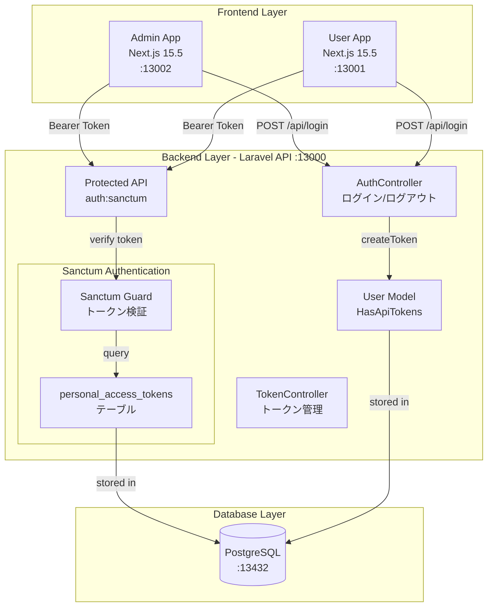
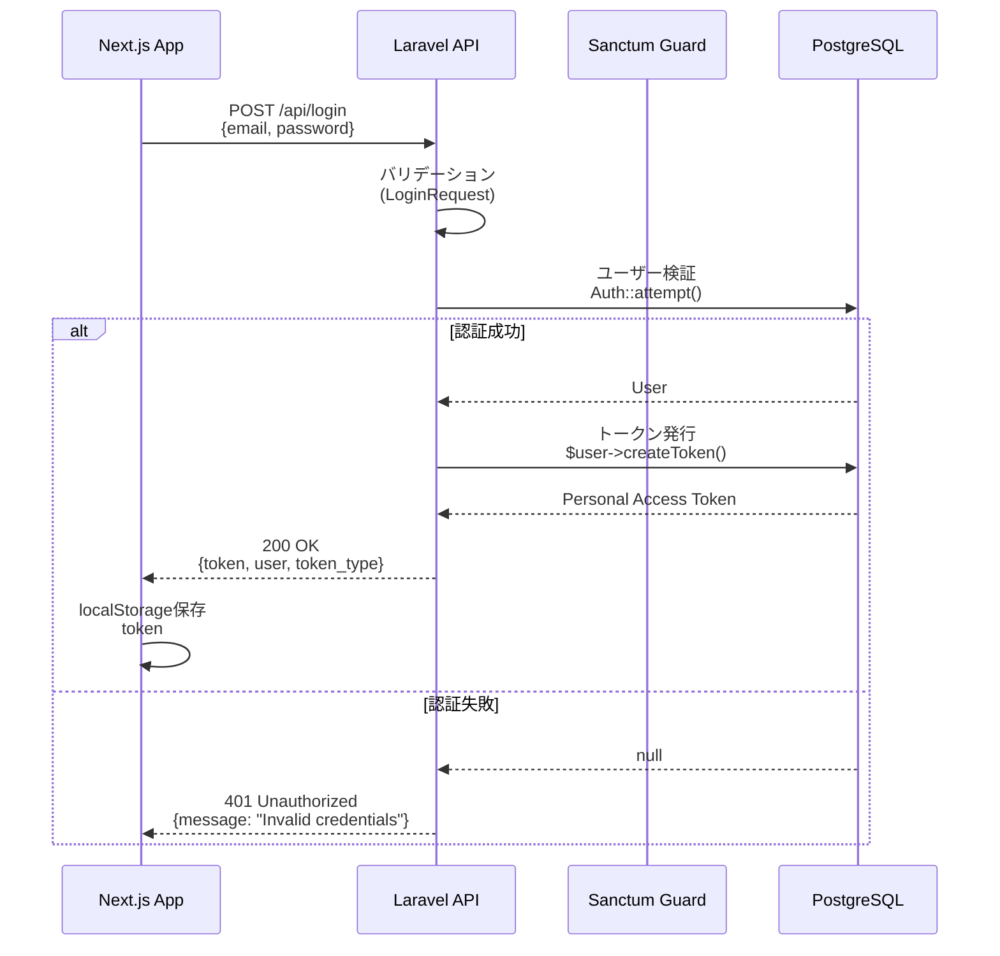
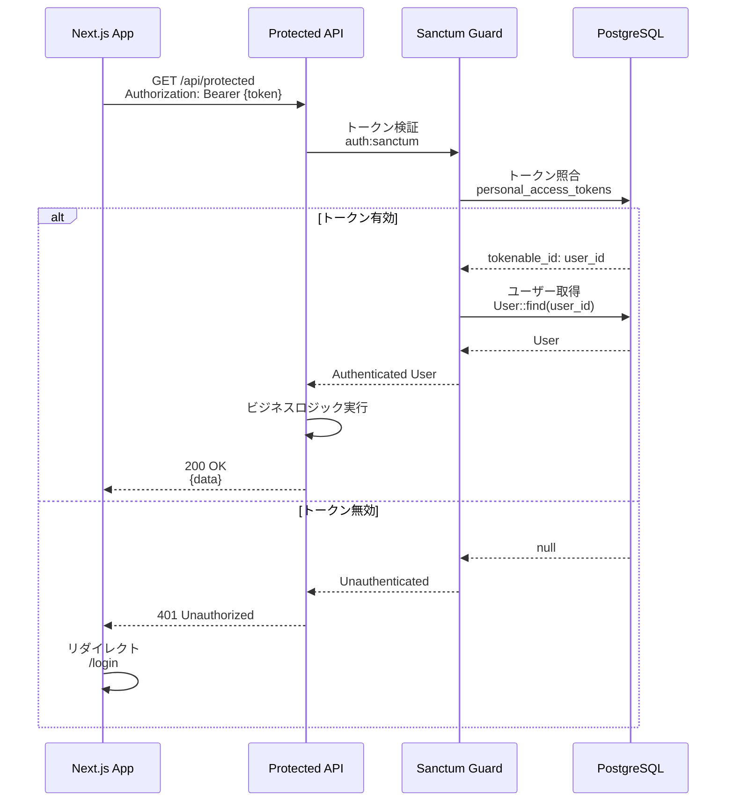
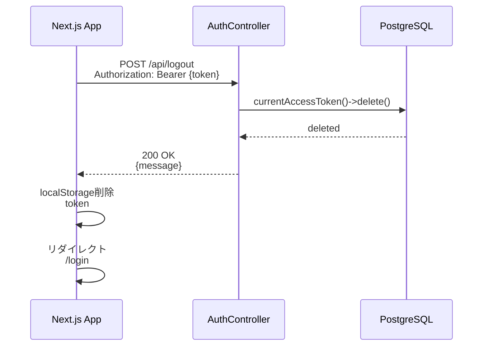

# Technical Design Document

## Overview

本機能は、Laravel Next.js B2Cアプリケーションテンプレートに**Laravel Sanctum 4.0トークンベースAPI認証**を統合し、Next.jsフロントエンド（Admin App / User App）からのセキュアなAPI通信を実現します。

**Purpose**: 既存のステートレスAPI設計（Laravel 12 API専用最適化済み）を維持しながら、APIトークンによる認証機能を追加し、保護されたエンドポイントへのアクセス制御を実現します。

**Users**:
- **エンドユーザー**: Admin AppまたはUser Appからログイン/ログアウトし、認証が必要なAPI機能を利用
- **開発者**: 認証エンドポイントの実装とテスト、フロントエンド統合

**Impact**:
- Laravel Sanctum 4.0は既にインストール済み（composer.json確認済み）
- UserモデルにHasApiTokensトレイトは追加済み
- CORS設定は既に適切に構成済み（localhost:13001, 13002対応）
- 認証エンドポイント（ログイン/ログアウト/トークン管理）を新規追加
- 保護されたAPIルートに`auth:sanctum`ミドルウェアを適用
- Pest 4による認証テストスイートを追加

### Goals
- Laravel Sanctum 4.0を用いたトークンベース認証の実装
- 既存のステートレスAPI設計（SESSION_DRIVER=array）の維持
- Next.js Admin App / User AppからのAPI認証統合
- 包括的な認証テストカバレッジ（Pest 4、目標90%以上）

### Non-Goals
- OAuth 2.0やソーシャルログイン機能（将来の拡張として検討）
- SPAステートフルCookie認証（ステートレスAPI設計維持のため除外）
- セッションベース認証（既存のSESSION_DRIVER=array設計と矛盾）
- パスワードリセット機能（別Issueで対応）
- ユーザー登録機能の大幅な変更（既存UserController::register保持）

## Architecture

### Existing Architecture Analysis

**現在のアーキテクチャパターン**:
- **API専用設計**: Web機能削除済み、RESTful API専用ルート（routes/api.php）
- **ステートレス設計**: SESSION_DRIVER=array、セッション不使用
- **最小依存関係**: Laravel 12 + Sanctum 4.0 + Tinker + Pint（4コアパッケージ）
- **DDD/クリーンアーキテクチャ**: 4層構造（Domain/Application/Infrastructure/HTTP）導入済み
- **CORS最適化**: Next.jsフロントエンド（localhost:13001, 13002）対応済み

**既存の認証関連コンポーネント**:
- `app/Models/User.php`: HasApiTokens、HasFactory、Notifiableトレイト使用済み
- `config/sanctum.php`: ステートレスAPI設定（stateful: []）、guard: ['api']
- `config/cors.php`: localhost:13001（User App）、localhost:13002（Admin App）許可済み
- `routes/api.php`: 既に`auth:sanctum`ミドルウェア使用例あり（GET /api/user）

**保持すべき既存設計**:
- ステートレスAPI設計（セッション不使用、トークンベース認証のみ）
- API専用ルート構成（routes/api.php）
- 既存のUserモデル設計（fillable、hidden、casts維持）
- 既存のCORS設定（Next.jsアプリとの統合）

### High-Level Architecture



### Technology Alignment

本機能は、既存の技術スタックとの統合を前提とした**Extension（既存システム拡張）**です。

**既存技術スタックとの整合性**:
- **Laravel Sanctum 4.0**: 既にcomposer.jsonでインストール済み、追加インストール不要
- **Pest 4**: 既存のテストフレームワーク活用、認証テストスイート追加
- **PostgreSQL 17**: 既存のpersonal_access_tokensマイグレーション活用
- **Next.js 15.5 + React 19**: 既存フロントエンド環境、認証APIクライアント統合

**新規導入ライブラリ**: なし（全て既存パッケージ活用）

**既存パターンからの逸脱**: なし

### Key Design Decisions

#### Decision 1: ステートレスAPI認証（トークンベース）の採用

**Context**: 既存のステートレスAPI設計（SESSION_DRIVER=array）を維持しながら認証を実装する必要があります。

**Alternatives**:
1. **SPAステートフルCookie認証**: Sanctumのステートフル認証を使用、CSRF保護とCookie管理
2. **セッションベース認証**: Laravel標準のセッション認証、SESSION_DRIVER変更必要
3. **トークンベース認証（選択）**: Personal Access Tokens、完全ステートレス、水平スケーリング対応

**Selected Approach**: **Personal Access Tokens（トークンベース認証）**

Laravel Sanctumは2つの認証方式を提供しますが、本プロジェクトでは**Personal Access Tokens**を採用します：
- ログイン時にAPIトークンを発行（`$user->createToken('token-name')`）
- トークンを平文でフロントエンドに返却（初回のみ）
- フロントエンドはトークンをlocalStorageまたはCookieに保存
- API リクエスト時にAuthorizationヘッダーで送信（`Authorization: Bearer {token}`）
- Sanctumはtokenable_idでユーザーを特定し認証

**Rationale**:
- 既存のステートレスAPI設計（SESSION_DRIVER=array）を完全に維持
- 水平スケーリング対応（トークンはDBに保存、サーバー間共有可能）
- Next.jsフロントエンド（Admin/User App）との統合が容易（Bearer Token方式）
- 既存のパフォーマンス最適化（33.3%起動速度向上）を損なわない

**Trade-offs**:
- **Gain**: 完全ステートレス、水平スケーリング対応、既存設計との整合性
- **Sacrifice**: CSRF保護なし（トークンベースのためXSS対策が重要）、Cookie HttpOnly使用不可

#### Decision 2: 認証エンドポイント設計（Controller層実装）

**Context**: 認証エンドポイント（ログイン/ログアウト/トークン管理）の実装場所を決定する必要があります。

**Alternatives**:
1. **Controller層実装（選択）**: `App\Http\Controllers\Api\AuthController`、Laravel標準パターン
2. **DDD Application層実装**: `Ddd\Application\Auth\UseCases\LoginUseCase`、ビジネスロジック分離
3. **ルートクロージャ実装**: routes/api.phpに直接記述、シンプルだが保守性低

**Selected Approach**: **Controller層実装（AuthController / TokenController）**

認証ロジックはHTTP層の責務として、以下の2つのControllerを作成します：
- `App\Http\Controllers\Api\AuthController`: ログイン/ログアウト
- `App\Http\Controllers\Api\TokenController`: トークン管理（発行/一覧/削除）

**Rationale**:
- 認証はHTTP層の責務（リクエスト/レスポンス変換、バリデーション）
- Laravel標準パターンで開発者の学習コスト低減
- 既存のUserController::register（`routes/api.php`）と一貫性を保持
- シンプルな認証ロジックのためDDD Application層は過剰（YAGNI原則）

**Trade-offs**:
- **Gain**: シンプル、Laravel標準パターン、既存コードとの一貫性
- **Sacrifice**: ビジネスロジックとHTTP層の分離不完全（将来DDD移行時にリファクタリング必要）

#### Decision 3: トークン保存場所（localStorage vs Cookie）

**Context**: フロントエンド（Next.js）でAPIトークンを保存する場所を決定する必要があります。

**Alternatives**:
1. **localStorage（選択）**: JavaScript経由でアクセス可能、XSSリスク有
2. **Cookie（HttpOnly）**: JavaScriptアクセス不可、CSRF対策必要
3. **sessionStorage**: タブ閉鎖で削除、利便性低

**Selected Approach**: **localStorage（推奨）with XSS対策**

Next.jsアプリケーション（Admin App / User App）では、APIトークンを**localStorage**に保存します。

**Rationale**:
- トークンベース認証ではHttpOnly Cookie使用不可（JavaScriptでAuthorizationヘッダー設定必要）
- Next.js App Routerの Server Components では localStorage 直接アクセス不可のため、Client Component でのみ使用
- Next.js のセキュリティ機能（Content Security Policy、XSS Protection）活用可能

**Trade-offs**:
- **Gain**: シンプル、Next.js App Router対応、トークンベース認証に最適
- **Sacrifice**: XSS攻撃リスク（CSP設定とReact 19のエスケープ機能で緩和）

## System Flows

### Authentication Flow (Login)



### Protected API Access Flow



### Logout Flow



## Requirements Traceability

| Requirement | Requirement Summary | Components | Interfaces | Flows |
|-------------|---------------------|------------|------------|-------|
| 1.1-1.5 | Sanctum基本設定とインストール | config/sanctum.php, personal_access_tokens migration | Sanctum設定ファイル | - |
| 2.1-2.5 | Userモデル設定 | User Model（HasApiTokens） | createToken(), tokens() | - |
| 3.1-3.6 | 認証エンドポイント実装 | AuthController | POST /api/login, POST /api/logout, GET /api/user | Authentication Flow, Logout Flow |
| 4.1-4.5 | 認証ミドルウェア設定 | bootstrap/app.php, routes/api.php | auth:sanctum middleware | Protected API Access Flow |
| 5.1-5.5 | CORS設定最適化 | config/cors.php | CORS設定 | - |
| 6.1-6.6 | トークン管理機能 | TokenController | POST /api/tokens, GET /api/tokens, DELETE /api/tokens/{id} | - |
| 7.1-7.7 | テストカバレッジ（Pest 4） | tests/Feature/Auth/* | Pest 4テストケース | - |
| 8.1-8.6 | Next.jsフロントエンド統合 | Next.js API Client | fetch/axios + Bearer Token | Authentication Flow, Protected API Access Flow |
| 9.1-9.6 | セキュリティ設定 | レート制限、トークンハッシュ化 | throttle middleware | - |
| 10.1-10.4 | ドキュメント整備 | backend/laravel-api/docs/sanctum-setup.md | ドキュメント | - |

## Components and Interfaces

### HTTP Layer

#### AuthController

**Responsibility & Boundaries**
- **Primary Responsibility**: ユーザー認証（ログイン/ログアウト）エンドポイントの提供
- **Domain Boundary**: HTTP層、認証リクエスト/レスポンス変換
- **Data Ownership**: なし（Userモデルに委譲）
- **Transaction Boundary**: 単一リクエスト内のトークン発行/削除

**Dependencies**
- **Inbound**: Next.js App（Admin App / User App）
- **Outbound**: User Model、Illuminate\Support\Facades\Auth
- **External**: なし

**Contract Definition**

**API Contract**:

| Method | Endpoint | Request | Response | Errors |
|--------|----------|---------|----------|--------|
| POST | /api/login | LoginRequest | AuthTokenResource | 401, 422 |
| POST | /api/logout | - (認証必須) | MessageResponse | 401 |
| GET | /api/user | - (認証必須) | UserResource | 401 |

**LoginRequest Schema**:
```typescript
interface LoginRequest {
  email: string;      // required, email format
  password: string;   // required, min:8
}
```

**AuthTokenResource Schema**:
```typescript
interface AuthTokenResource {
  token: string;           // Personal Access Token (平文)
  user: {
    id: string;
    name: string;
    email: string;
  };
  token_type: "Bearer";
}
```

**MessageResponse Schema**:
```typescript
interface MessageResponse {
  message: string;
}
```

**Error Responses**:
- **401 Unauthorized**: `{ "message": "Invalid credentials" }` （ログイン失敗）
- **401 Unauthorized**: `{ "message": "Unauthenticated" }` （未認証アクセス）
- **422 Unprocessable Entity**: `{ "message": "...", "errors": {...} }` （バリデーションエラー）

**Preconditions**:
- ログイン: Userレコードが存在する、パスワードがハッシュ化されている
- ログアウト: 有効なBearer Tokenがリクエストに含まれている

**Postconditions**:
- ログイン成功: personal_access_tokensテーブルに新しいトークンレコード作成
- ログアウト成功: 現在のトークンレコードが削除される

**Invariants**:
- ログイン/ログアウトは冪等性を保証しない（複数回実行で異なる結果）

#### TokenController

**Responsibility & Boundaries**
- **Primary Responsibility**: APIトークンの管理（発行/一覧取得/削除）エンドポイントの提供
- **Domain Boundary**: HTTP層、トークン管理リクエスト/レスポンス変換
- **Data Ownership**: なし（Userモデルのtokens()リレーションに委譲）
- **Transaction Boundary**: 単一リクエスト内のトークン操作

**Dependencies**
- **Inbound**: Next.js App（Admin App / User App）
- **Outbound**: User Model（tokens()リレーション）
- **External**: なし

**Contract Definition**

**API Contract**:

| Method | Endpoint | Request | Response | Errors |
|--------|----------|---------|----------|--------|
| POST | /api/tokens | CreateTokenRequest | AuthTokenResource | 401, 422 |
| GET | /api/tokens | - (認証必須) | TokenListResource | 401 |
| DELETE | /api/tokens/{id} | - (認証必須) | MessageResponse | 401, 404 |
| DELETE | /api/tokens | - (認証必須) | MessageResponse | 401 |

**CreateTokenRequest Schema**:
```typescript
interface CreateTokenRequest {
  name: string;  // optional, default: "API Token"
}
```

**TokenListResource Schema**:
```typescript
interface TokenListResource {
  tokens: Array<{
    id: number;
    name: string;
    created_at: string;  // ISO 8601
    last_used_at: string | null;  // ISO 8601
  }>;
}
```

**Preconditions**:
- 全エンドポイント: 有効なBearer Tokenがリクエストに含まれている
- DELETE /api/tokens/{id}: 指定されたトークンIDが認証ユーザーに属している

**Postconditions**:
- POST /api/tokens: 新しいpersonal_access_tokensレコード作成
- DELETE /api/tokens/{id}: 指定されたトークンレコード削除
- DELETE /api/tokens: 認証ユーザーの全トークンレコード削除

### Data Layer

#### User Model (既存拡張)

**Responsibility & Boundaries**
- **Primary Responsibility**: ユーザー情報の管理、APIトークンの発行・管理
- **Domain Boundary**: Eloquentモデル、Userエンティティ
- **Data Ownership**: usersテーブル、personal_access_tokensテーブル（HasApiTokensトレイト経由）
- **Transaction Boundary**: Eloquent ORM トランザクション

**Dependencies**
- **Inbound**: AuthController、TokenController
- **Outbound**: personal_access_tokensテーブル、usersテーブル
- **External**: Laravel Sanctum HasApiTokensトレイト

**Contract Definition**

**HasApiTokens Trait Methods**:

```php
// トークン発行
public function createToken(string $name, array $abilities = ['*']): NewAccessToken

// トークン一覧取得
public function tokens(): MorphMany  // personal_access_tokensリレーション

// 現在のトークン取得
public function currentAccessToken(): PersonalAccessToken | null
```

**Preconditions**:
- createToken: Userインスタンスが存在する、$nameが空でない
- tokens: Userインスタンスが存在する

**Postconditions**:
- createToken: personal_access_tokensテーブルに新しいレコード作成、NewAccessTokenオブジェクト返却（平文トークン含む）
- tokens: Userに紐づく全トークンレコードのコレクション返却

**Existing Model Configuration (preserved)**:
- `$fillable`: ['name', 'email', 'password']
- `$hidden`: ['password', 'remember_token']
- `$casts`: ['email_verified_at' => 'datetime', 'password' => 'hashed']
- `$incrementing`: false（UUIDまたはULID使用）
- `$keyType`: 'string'

## Data Models

### Physical Data Model

#### personal_access_tokens Table (既存マイグレーション活用)

Laravel Sanctumのデフォルトマイグレーション（`vendor/laravel/sanctum/database/migrations/2019_12_14_000001_create_personal_access_tokens_table.php`）を使用します。

```sql
CREATE TABLE personal_access_tokens (
    id BIGINT UNSIGNED AUTO_INCREMENT PRIMARY KEY,
    tokenable_type VARCHAR(255) NOT NULL,           -- ポリモーフィックリレーション: 'App\Models\User'
    tokenable_id BIGINT UNSIGNED NOT NULL,          -- ユーザーID（User::$keyType='string'の場合は VARCHAR）
    name VARCHAR(255) NOT NULL,                     -- トークン名（例: 'API Token', 'Mobile App Token'）
    token VARCHAR(64) NOT NULL UNIQUE,              -- SHA-256ハッシュ化トークン（平文トークンはハッシュ化）
    abilities TEXT,                                 -- トークン権限（JSON配列、デフォルト: ['*']）
    last_used_at TIMESTAMP NULL,                    -- 最終使用日時
    expires_at TIMESTAMP NULL,                      -- 有効期限（nullの場合は無期限）
    created_at TIMESTAMP NULL,
    updated_at TIMESTAMP NULL,
    INDEX idx_tokenable (tokenable_type, tokenable_id)
);
```

**Key Design Points**:
- **tokenable_id**: User::$keyType='string'のため、マイグレーションでVARCHAR型に変更必要（デフォルトはBIGINT）
- **token**: SHA-256ハッシュ化された値を保存（平文トークンはハッシュ化されDBに保存）
- **abilities**: JSON配列、デフォルトは`['*']`（全権限）、将来の権限管理に対応
- **last_used_at**: トークン使用時に自動更新（Sanctumミドルウェアで処理）
- **expires_at**: config/sanctum.php の `expiration` 設定で制御

#### users Table (既存テーブル、変更なし)

```sql
CREATE TABLE users (
    id VARCHAR(36) PRIMARY KEY,                     -- UUID or ULID
    name VARCHAR(255) NOT NULL,
    email VARCHAR(255) NOT NULL UNIQUE,
    email_verified_at TIMESTAMP NULL,
    password VARCHAR(255) NOT NULL,
    remember_token VARCHAR(100) NULL,
    created_at TIMESTAMP NULL,
    updated_at TIMESTAMP NULL
);
```

### Data Contracts & Integration

#### API Request/Response Schemas

**LoginRequest**:
```typescript
interface LoginRequest {
  email: string;      // required|email
  password: string;   // required|min:8
}
```

**Validation Rules**:
```php
[
    'email' => 'required|email|exists:users,email',
    'password' => 'required|string|min:8',
]
```

**AuthTokenResource**:
```typescript
interface AuthTokenResource {
  token: string;           // Personal Access Token (平文、初回のみ返却)
  user: {
    id: string;            // UUID or ULID
    name: string;
    email: string;
  };
  token_type: "Bearer";    // 固定値
}
```

**TokenListResource**:
```typescript
interface TokenListResource {
  tokens: Array<{
    id: number;                  // personal_access_tokens.id
    name: string;                // トークン名
    created_at: string;          // ISO 8601 format
    last_used_at: string | null; // ISO 8601 format or null
  }>;
}
```

**Error Response Schema**:
```typescript
interface ErrorResponse {
  message: string;
  errors?: Record<string, string[]>;  // バリデーションエラーの場合のみ
}
```

## Error Handling

### Error Strategy

Laravel標準のHTTPエラーレスポンスとSanctumのトークン検証エラーハンドリングを活用します。

**Error Handling Layers**:
1. **Validation Layer**: FormRequest（LoginRequest、CreateTokenRequest）でバリデーション、422エラー自動返却
2. **Authentication Layer**: Sanctumミドルウェアで401 Unauthorizedエラー返却
3. **Business Logic Layer**: Controllerで認証失敗時に401エラー返却
4. **Exception Layer**: Laravel Exception Handler（app/Exceptions/Handler.php）でグローバルエラー処理

### Error Categories and Responses

#### User Errors (4xx)

**401 Unauthorized (認証失敗)**:
- **Trigger**: 無効なメールアドレス/パスワード、無効なトークン、トークン未提供
- **Response**: `{ "message": "Invalid credentials" }` または `{ "message": "Unauthenticated" }`
- **Recovery**: フロントエンドでログイン画面にリダイレクト、ユーザーに再ログイン促進

**404 Not Found (トークンIDが存在しない)**:
- **Trigger**: DELETE /api/tokens/{id}で無効なID指定
- **Response**: `{ "message": "Token not found" }`
- **Recovery**: フロントエンドでエラーメッセージ表示、トークン一覧を再取得

**422 Unprocessable Entity (バリデーションエラー)**:
- **Trigger**: メールアドレス形式不正、パスワード短すぎる、必須フィールド欠落
- **Response**:
```json
{
  "message": "The email field must be a valid email address.",
  "errors": {
    "email": ["The email field must be a valid email address."],
    "password": ["The password field must be at least 8 characters."]
  }
}
```
- **Recovery**: フロントエンドでフィールド単位のエラーメッセージ表示、ユーザー修正促進

#### System Errors (5xx)

**500 Internal Server Error (システムエラー)**:
- **Trigger**: DB接続失敗、予期しない例外、コード実行エラー
- **Response**: `{ "message": "Server Error" }`（本番環境）、詳細スタックトレース（開発環境）
- **Recovery**: Laravel Exception Handlerでログ記録、フロントエンドで汎用エラーメッセージ表示

**503 Service Unavailable (サービス利用不可)**:
- **Trigger**: メンテナンスモード（`php artisan down`）、DBダウン
- **Response**: `{ "message": "Service Unavailable" }`
- **Recovery**: フロントエンドでメンテナンス画面表示、自動リトライ（Exponential Backoff）

### Monitoring

**Error Tracking**:
- Laravel Logチャンネル（storage/logs/laravel.log）にエラーログ記録
- 401エラー頻発時のアラート（将来的にSentryまたはBugsnag統合検討）

**Logging Strategy**:
- **INFO**: ログイン成功、トークン発行成功
- **WARNING**: ログイン失敗（3回以上連続）、トークン検証失敗
- **ERROR**: 予期しない例外、DB接続エラー

**Health Monitoring**:
- 既存の`/up`エンドポイント活用（Laravel 12標準ヘルスチェック）
- 認証エンドポイントの応答時間監視（目標: 200ms以下）

## Testing Strategy

### Unit Tests (Pest 4)

**対象**: User Model、Sanctum設定

1. **User::createToken()メソッド**: トークン発行成功、トークン名指定、平文トークン取得
2. **User::tokens()リレーション**: 複数トークン取得、空の場合の動作
3. **User::currentAccessToken()**: 認証済みリクエストでのトークン取得
4. **Sanctum設定**: config/sanctum.php読み込み、stateful空配列、guard設定確認

### Feature Tests (Pest 4)

**対象**: AuthController、TokenController、認証ミドルウェア

**tests/Feature/Auth/LoginTest.php**:
1. **正常なログイン**: 有効なメールアドレス/パスワードでトークン発行成功、200 OK
2. **不正なメールアドレス**: 存在しないメールアドレスで401エラー
3. **不正なパスワード**: 無効なパスワードで401エラー
4. **バリデーションエラー**: メールアドレス形式不正で422エラー、パスワード短すぎるで422エラー

**tests/Feature/Auth/LogoutTest.php**:
1. **正常なログアウト**: 認証済みユーザーがログアウト成功、トークン削除確認
2. **未認証ログアウト**: トークンなしでログアウトリクエスト、401エラー

**tests/Feature/Auth/AuthenticatedEndpointTest.php**:
1. **認証済みアクセス**: 有効なトークンでGET /api/user成功、ユーザー情報返却
2. **未認証アクセス**: トークンなしでGET /api/user、401エラー
3. **無効なトークン**: 不正なトークンでGET /api/user、401エラー

**tests/Feature/Auth/TokenManagementTest.php**:
1. **トークン発行**: POST /api/tokensでトークン発行成功、トークン名指定
2. **トークン一覧取得**: GET /api/tokensで全トークン取得、last_used_at更新確認
3. **特定トークン削除**: DELETE /api/tokens/{id}で指定トークン削除成功
4. **全トークン削除**: DELETE /api/tokensで全トークン削除成功
5. **存在しないトークン削除**: DELETE /api/tokens/{invalid-id}で404エラー

### E2E Tests (Playwright)

**対象**: Next.jsフロントエンド統合

**e2e/projects/admin/tests/auth.spec.ts**:
1. **管理者ログインフロー**: Admin Appからログイン、トークン保存、ダッシュボードアクセス
2. **認証エラー処理**: 不正な認証情報でログイン失敗、エラーメッセージ表示
3. **保護されたページアクセス**: 未認証でダッシュボードアクセス、ログイン画面リダイレクト
4. **ログアウトフロー**: ログアウト成功、トークン削除、ログイン画面リダイレクト

**e2e/projects/user/tests/auth.spec.ts**:
1. **ユーザーログインフロー**: User Appからログイン、トークン保存、ホームページアクセス
2. **トークン期限切れ処理**: 期限切れトークンでAPIアクセス、401エラー、ログイン画面リダイレクト

### Performance Tests

**対象**: 認証エンドポイントのパフォーマンス

1. **ログインレスポンス時間**: 平均200ms以下、99パーセンタイル500ms以下
2. **トークン検証オーバーヘッド**: auth:sanctumミドルウェアのオーバーヘッド50ms以下
3. **並行ログインリクエスト**: 100同時リクエストで平均レスポンス時間500ms以下
4. **トークン管理APIレスポンス**: GET /api/tokens平均100ms以下（トークン数100件想定）

**測定方法**: Apache Bench（`ab`コマンド）、Pest Performance Plugin（将来導入検討）

## Security Considerations

### Threat Modeling

**識別された脅威**:
1. **XSS攻撃**: localStorageに保存されたトークンの盗難
2. **CSRF攻撃**: トークンベース認証のためCSRF保護なし
3. **ブルートフォース攻撃**: ログインエンドポイントへの総当たり攻撃
4. **トークン漏洩**: 平文トークンのネットワーク盗聴、ログ出力

### Security Controls

#### Authentication and Authorization

**トークンベース認証**:
- Personal Access Tokens（SHA-256ハッシュ化）
- トークン発行時のみ平文返却（以降はハッシュ化値のみDB保存）
- Bearerトークンスキーム（Authorization: Bearer {token}）

**トークン有効期限**:
- config/sanctum.php の `expiration` 設定でグローバル制御（デフォルト: null = 無期限）
- 本番環境では有効期限設定推奨（例: 7日間、`'expiration' => 10080`）

**レート制限**:
- Laravel標準のthrottleミドルウェア適用
- ログインエンドポイント: 5回/分（`throttle:5,1`）
- その他認証エンドポイント: 60回/分（`throttle:60,1`）

#### Data Protection and Privacy

**トークン保護**:
- DB保存時にSHA-256ハッシュ化（Sanctumデフォルト）
- 平文トークンはログイン成功時のレスポンスのみ返却（以降取得不可）
- トークン削除時にDB物理削除（論理削除なし）

**パスワード保護**:
- bcryptまたはargon2ハッシュ化（Laravel標準）
- User::$casts['password'] = 'hashed'で自動ハッシュ化

**XSS対策**:
- React 19のJSXエスケープ機能活用（デフォルト有効）
- Content Security Policy（CSP）ヘッダー設定推奨（本番環境）
- localStorage使用時のXSSリスク認識、CSP設定で緩和

**HTTPS通信強制**:
- 本番環境では`APP_ENV=production`、`SESSION_SECURE_COOKIE=true`設定
- HTTPS通信のみ許可（HTTP→HTTPSリダイレクト）

#### Compliance Requirements

**GDPR対応**:
- ユーザー削除時にpersonal_access_tokensも削除（CASCADE設定）
- トークン一覧APIでlast_used_atを返却（透明性確保）

**監査ログ**:
- ログイン成功/失敗をログ記録
- トークン発行/削除をログ記録
- 将来的にAuditログテーブル導入検討

## Performance & Scalability

### Target Metrics

**レスポンス時間**:
- ログインエンドポイント: 平均200ms、99パーセンタイル500ms
- トークン検証（auth:sanctum）: 平均50ms、99パーセンタイル100ms
- トークン管理API: 平均100ms、99パーセンタイル200ms

**スループット**:
- 同時接続数: 1000ユーザー
- ログインリクエスト: 100req/sec
- 保護されたAPIリクエスト: 1000req/sec

### Scaling Approaches

**水平スケーリング**:
- ステートレスAPI設計のため、複数サーバーでロードバランシング可能
- personal_access_tokensテーブルは共有DB（PostgreSQL）に保存
- Redisキャッシュ活用でトークン検証高速化（将来検討）

**データベーススケーリング**:
- personal_access_tokensテーブルにインデックス追加（tokenable_type, tokenable_id）
- 古いトークンの定期削除（スケジュールコマンド）
- Read Replica活用（トークン検証はRead、トークン発行/削除はWrite）

### Caching Strategies

**トークン検証キャッシュ（将来検討）**:
- Redisにトークン→ユーザーIDマッピングをキャッシュ（TTL: 5分）
- トークン検証時にRedis照会、ヒット時はDB照会スキップ
- トークン削除時にRedisキャッシュも削除

**ユーザー情報キャッシュ（将来検討）**:
- RedisにユーザーID→ユーザー情報をキャッシュ（TTL: 10分）
- GET /api/user時にRedis照会、ヒット時はDB照会スキップ
