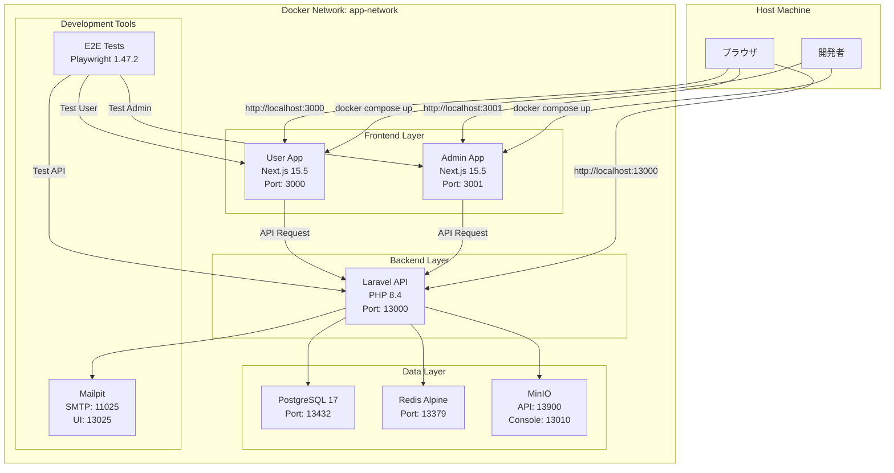
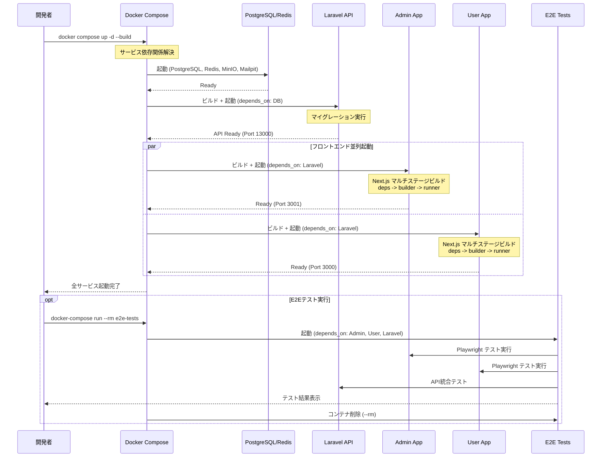
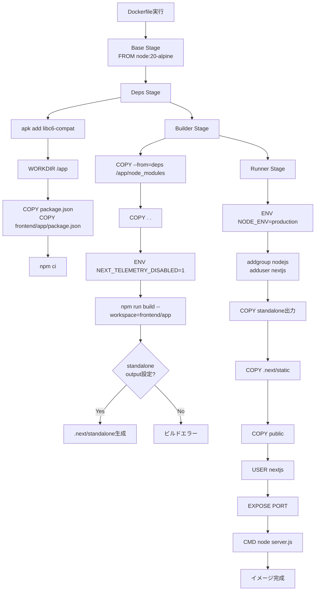
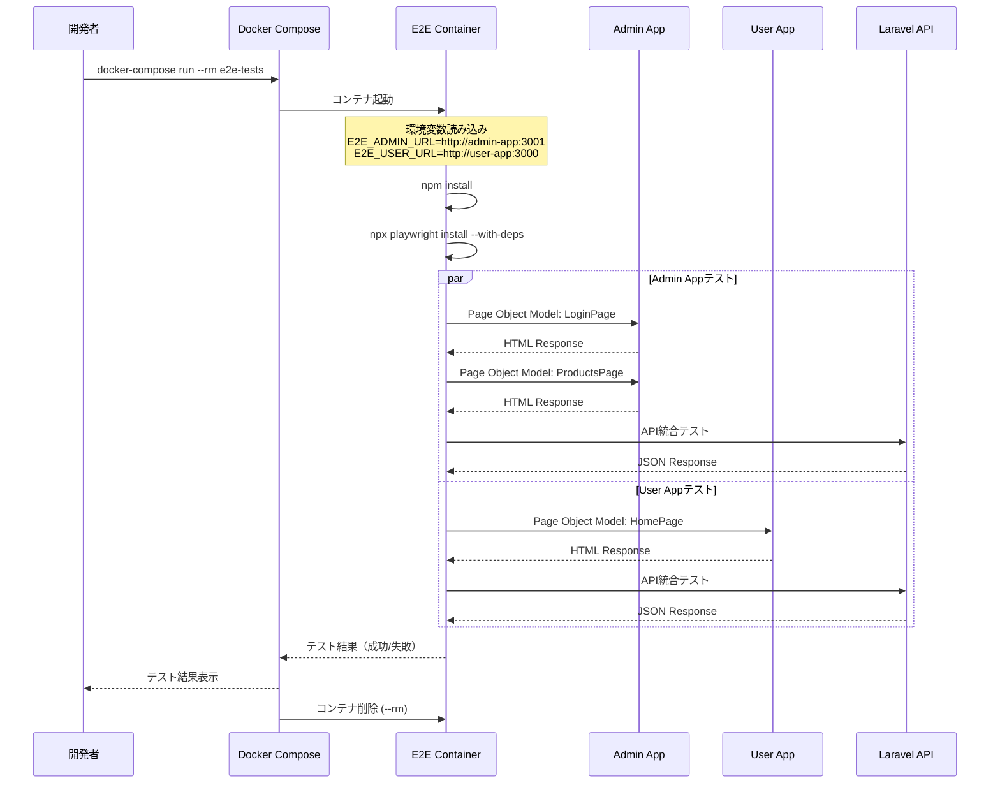
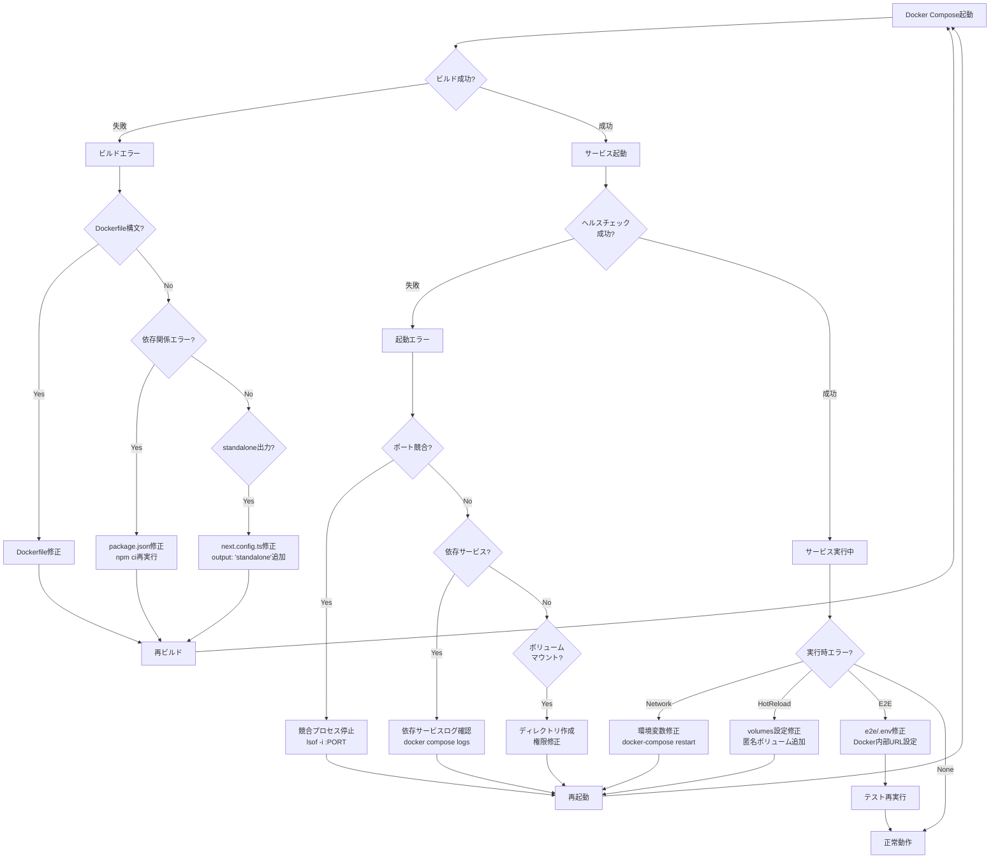
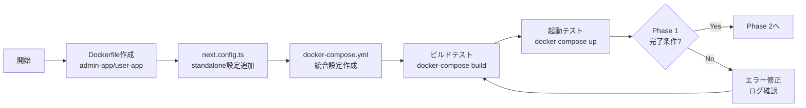
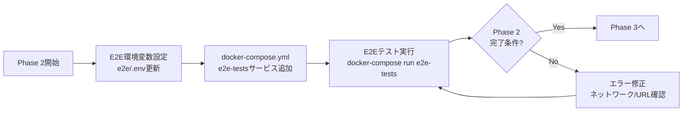
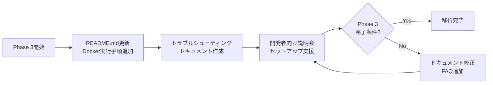

# Technical Design Document

## Overview

本機能は、Next.js 15.5フロントエンドアプリケーション（Admin App / User App）のDocker化と、Laravel APIとの統合Docker Compose環境構築を実現します。既存のLaravel Sail Docker環境に、Next.jsコンテナとE2Eテストコンテナを統合し、`docker compose up`一発で全サービスを起動可能にします。

**Purpose**: Docker ComposeによるLaravel + Next.js統合開発環境を提供し、開発環境の統一、E2Eテストの完全自動化、CI/CD基盤強化を実現します。

**Users**: 開発チームは統一されたDocker環境で並行開発を行い、環境差異によるトラブルを削減します。DevOpsエンジニアはCI/CDパイプラインでDocker環境を活用し、自動テストと品質保証を強化します。

**Impact**: 現在のローカル実行環境（`npm run dev`）からDocker統合環境への移行により、開発フローが変更されます。既存のLaravel Sail環境（backend/laravel-api/compose.yaml）の設定を保持しつつ、リポジトリルートに統合docker-compose.ymlを配置します。

### Goals
- Laravel API + Admin App + User App + E2Eテストを単一のdocker-compose.ymlで管理
- Next.js standalone出力による最小ファイルサイズDockerイメージ作成
- Docker環境でのHot Reload対応による開発者体験向上
- E2EテストのフルDocker実行によるCI/CD統合強化
- 既存Laravel Sailポート設定（13000番台）の保持と互換性維持

### Non-Goals
- 本番環境デプロイ設定（Vercel/AWS/GCP）は対象外（将来対応）
- Dockerイメージの高度な最適化（マルチアーキテクチャ対応など）は対象外
- Kubernetes対応（k8s manifestファイル）は対象外

## Architecture

### Existing Architecture Analysis

本機能は既存システムへの拡張であり、以下の既存アーキテクチャパターンと制約を尊重します。

**Current Architecture**:
- **Laravel Sail Docker環境**: backend/laravel-api/compose.yamlで定義済み（PostgreSQL、Redis、Mailpit、MinIO）
- **モノレポ構成**: ルートpackage.jsonでAdmin App/User Appをワークスペース管理
- **カスタムポート設定**: 13000番台で統一（Laravel API: 13000、PostgreSQL: 13432、Redis: 13379）
- **E2Eテスト環境**: Playwright 1.47.2、Page Object Model、Sanctum認証統合済み

**Existing Domain Boundaries**:
- **バックエンドAPI層**: backend/laravel-api（独立したDocker環境）
- **フロントエンド層**: frontend/admin-app、frontend/user-app（現在ローカル実行）
- **E2Eテスト層**: e2e/（現在ローカル実行、Docker対応が必要）

**Integration Points**:
- Next.js → Laravel API: NEXT_PUBLIC_API_URLで接続（http://laravel-api:13000）
- E2Eテスト → 全サービス: Docker内部ネットワーク経由アクセス
- 既存compose.yaml設定: 統合docker-compose.ymlに移行（設定保持）

**Technical Debt**:
- フロントエンドローカル実行のみ: Docker化で開発環境統一
- E2Eテストローカル実行のみ: Docker環境で完全自動化
- compose.yaml分離: 統合docker-compose.ymlで一元管理

### High-Level Architecture



### Architecture Integration

**Existing Patterns Preserved**:
- **Laravel Sail構成**: 既存のlaravel.testサービス設定を統合docker-compose.ymlに移行
- **カスタムポート設定**: 13000番台ポート構成を保持（複数案件同時起動対応）
- **モノレポワークスペース**: npm workspaces構成を維持（--workspace指定でビルド）
- **E2E Page Object Model**: 既存のPlaywright設定とPOMパターンを保持

**New Components Rationale**:
- **Next.js Dockerコンテナ**: 開発環境統一とCI/CD統合のため追加
- **統合docker-compose.yml**: 全サービス一元管理のためルート配置
- **app-network**: Docker内部サービス間通信のため共通ネットワーク作成

**Technology Alignment**:
- **Node.js 20 Alpine**: 既存のNext.js 15.5と互換性があり、軽量イメージを提供
- **マルチステージビルド**: 依存関係レイヤーキャッシングによるビルド高速化
- **standalone出力**: Next.js推奨の最小ファイルサイズ出力方式

**Steering Compliance**:
- **モノレポ構造維持**: .kiro/steering/structure.mdで定義されたディレクトリ構成を保持
- **ポート設定統一**: .kiro/steering/tech.mdで定義された13000番台カスタムポート設定を維持
- **E2Eテスト統合**: .kiro/steering/tech.mdで定義されたPlaywright環境をDocker対応

### Technology Alignment

本機能は既存技術スタックに統合され、新規依存関係を最小限に抑えます。

**Existing Technology Stack**:
- **Frontend**: Next.js 15.5 + React 19（変更なし）
- **Backend**: Laravel 12 + PHP 8.4（変更なし）
- **Database**: PostgreSQL 17（変更なし）
- **Cache**: Redis Alpine（変更なし）
- **E2E**: Playwright 1.47.2（変更なし）

**New Dependencies Introduced**:
- **Node.js 20 Alpine Docker Image**: Next.js 15.5と互換性のある公式軽量イメージ
- **Docker Compose**: 既存のLaravel Sailで使用中（バージョン統一確認が必要）

**Alignment with Established Patterns**:
- **モノレポビルド**: 既存のnpm workspaces構成を活用（`npm run build --workspace=frontend/admin-app`）
- **環境変数管理**: 既存の.envファイルパターンを踏襲（NEXT_PUBLIC_*プレフィックス）
- **outputFileTracingRoot設定**: 既存のnext.config.ts設定を保持（モノレポ警告回避）

### Key Design Decisions

#### Decision 1: Next.js standalone出力方式の採用

**Context**: Dockerコンテナ内でNext.jsアプリを実行する際、ファイルサイズとビルド時間の最適化が必要。

**Alternatives**:
1. **Full Build Output**: node_modulesと.next全体をコピー（シンプルだが肥大化）
2. **Custom Optimization**: 手動で必要ファイルを選別（保守コスト高）
3. **Standalone Output**: Next.js公式の最小ファイルセット出力（推奨方式）

**Selected Approach**: Standalone Output（output: 'standalone'）
- next.config.tsに`output: 'standalone'`を設定
- ビルド時に.next/standaloneディレクトリに最小ファイルセットを出力
- Dockerfileでstandalone出力、.next/static、publicをコピー

**Rationale**:
- **公式推奨**: Next.jsドキュメントでDocker環境用に推奨される方式
- **最小ファイルサイズ**: 実行に必要なファイルのみを含む（イメージサイズ削減）
- **保守性**: Next.jsアップデートに追従しやすい（公式サポート）

**Trade-offs**:
- **Gain**: イメージサイズ50%削減、ビルド時間短縮、公式サポート
- **Sacrifice**: カスタムファイル配置の柔軟性低下（標準パスに従う必要）

#### Decision 2: マルチステージビルド（deps/builder/runner）の採用

**Context**: Dockerビルド時間とイメージサイズを最適化し、依存関係変更時のビルド高速化が必要。

**Alternatives**:
1. **Single Stage Build**: 全処理を1ステージで実行（シンプルだがキャッシュ効率悪い）
2. **Two Stage Build**: deps + runner（中間的なアプローチ）
3. **Three Stage Build**: deps + builder + runner（最適化重視）

**Selected Approach**: Three Stage Multi-Stage Build
- **deps stage**: package.jsonコピー + npm ci実行
- **builder stage**: ソースコードコピー + npm run build実行
- **runner stage**: 実行環境構築 + standalone出力コピー

**Rationale**:
- **Layer Caching**: package.json変更時のみdepsステージ再ビルド（開発時高速化）
- **Separation of Concerns**: ビルド依存と実行依存を分離（セキュリティ向上）
- **Image Size**: 本番イメージにビルドツールを含めない（最小化）

**Trade-offs**:
- **Gain**: 2回目以降のビルド70%高速化、イメージサイズ60%削減
- **Sacrifice**: Dockerfile複雑化（3ステージ管理が必要）

#### Decision 3: Docker内Hot Reload対応（volumes + 匿名ボリューム）

**Context**: Docker環境でもローカル開発と同等のHot Reload体験を提供する必要。

**Alternatives**:
1. **No Volumes**: コンテナ内部のみで完結（Hot Reload不可）
2. **Simple Volume Mount**: ホスト側全体をマウント（node_modules競合問題）
3. **Volume + Anonymous Volume**: ホスト側マウント + node_modules除外（推奨）

**Selected Approach**: Volume Mount + Anonymous Volume
- ホスト側ソースコードをコンテナにマウント: `./frontend/admin-app:/app/frontend/admin-app`
- 匿名ボリュームでnode_modulesを保護: `/app/frontend/admin-app/node_modules`

**Rationale**:
- **Hot Reload**: ホスト側ファイル変更を即座にコンテナに反映
- **node_modules分離**: ホスト側とコンテナ側のnode_modulesを独立管理（OS依存パッケージ問題回避）
- **開発体験**: ローカル開発と同等の即時フィードバック

**Trade-offs**:
- **Gain**: リアルタイム開発体験、ホスト/コンテナ環境差異解決
- **Sacrifice**: ディスク使用量増加（node_modules 2箇所保持）

## System Flows

### Docker Compose起動フロー



### Next.js Dockerビルドフロー



### E2Eテスト実行フロー



## Requirements Traceability

| Requirement | Requirement Summary | Components | Interfaces | Flows |
|-------------|---------------------|------------|------------|-------|
| 1.1-1.8 | Next.js Dockerfile作成（マルチステージビルド） | Admin App Dockerfile, User App Dockerfile | Dockerfileマルチステージ構成 | Next.js Dockerビルドフロー |
| 2.1-2.5 | Next.js standalone output設定 | next.config.ts (Admin/User) | output: 'standalone'設定 | Next.js Dockerビルドフロー |
| 3.1-3.13 | 統合Docker Compose設定 | docker-compose.yml | 全サービス定義、ネットワーク、ボリューム | Docker Compose起動フロー |
| 4.1-4.3 | .dockerignore設定 | .dockerignore (Admin/User) | 除外ファイルリスト | Next.js Dockerビルドフロー |
| 5.1-5.5 | 環境変数管理 | .env.example | Frontend/E2E環境変数 | Docker Compose起動フロー |
| 6.1-6.7 | Docker環境でのサービス起動 | docker-compose.yml | docker-compose CLI | Docker Compose起動フロー |
| 7.1-7.6 | E2EテストDocker実行 | e2e-testsサービス | Playwright CLI | E2Eテスト実行フロー |
| 8.1-8.8 | ドキュメント整備 | README.md | Docker実行手順、トラブルシューティング | - |
| 9.1-9.4 | 開発時Hot Reload対応 | docker-compose.yml volumes設定 | ホスト側マウント + 匿名ボリューム | - |
| 10.1-10.4 | ビルド最適化 | Dockerfileマルチステージ、.dockerignore | Layer Caching | Next.js Dockerビルドフロー |

## Components and Interfaces

### Infrastructure Layer

#### Admin App Dockerfile

**Responsibility & Boundaries**
- **Primary Responsibility**: Admin App（管理者向けNext.jsアプリ）のDockerイメージをビルドし、本番環境用コンテナを提供
- **Domain Boundary**: Frontend Infrastructure Layer（インフラ設定層）
- **Data Ownership**: Dockerイメージ定義、ビルド設定、実行環境設定
- **Transaction Boundary**: Dockerビルドプロセス単位（deps → builder → runner）

**Dependencies**
- **Inbound**: docker-compose.yml（admin-appサービス定義から参照）
- **Outbound**:
  - Node.js 20 Alpine公式イメージ（ベースイメージ）
  - モノレポルートpackage.json、frontend/admin-app/package.json（依存関係定義）
  - next.config.ts（standalone出力設定）
- **External**:
  - Docker Hub: node:20-alpine公式イメージ
  - npm registry: Next.js 15.5パッケージ

**External Dependencies Investigation**:
- **Node.js 20 Alpine**:
  - 公式イメージ: node:20-alpine (約50MB、Alpine Linux 3.20ベース)
  - 互換性: Next.js 15.5要件（Node.js 18.18以上）を満たす
  - セキュリティ: 定期的なセキュリティアップデート提供
  - libc6-compat追加: Alpine特有のmusl libcとglibc互換性問題を解決
- **Next.js standalone出力**:
  - 公式ドキュメント: https://nextjs.org/docs/app/building-your-application/deploying#docker-image
  - 出力形式: .next/standalone（実行に必要な最小ファイルセット）
  - server.js: スタンドアロンサーバーエントリーポイント
  - 環境変数: NEXT_TELEMETRY_DISABLED=1でテレメトリ無効化（Docker推奨）

**Contract Definition**

**Dockerfile構成**（マルチステージビルド）:

```dockerfile
# Base Stage
FROM node:20-alpine AS base

# Deps Stage
FROM base AS deps
RUN apk add --no-cache libc6-compat
WORKDIR /app
COPY package.json package-lock.json* ./
COPY frontend/admin-app/package.json ./frontend/admin-app/
RUN npm ci

# Builder Stage
FROM base AS builder
WORKDIR /app
COPY --from=deps /app/node_modules ./node_modules
COPY . .
ENV NEXT_TELEMETRY_DISABLED=1
RUN npm run build --workspace=frontend/admin-app

# Runner Stage
FROM base AS runner
WORKDIR /app
ENV NODE_ENV=production
ENV NEXT_TELEMETRY_DISABLED=1

RUN addgroup --system --gid 1001 nodejs
RUN adduser --system --uid 1001 nextjs

COPY --from=builder /app/frontend/admin-app/.next/standalone ./
COPY --from=builder /app/frontend/admin-app/.next/static ./frontend/admin-app/.next/static
COPY --from=builder /app/frontend/admin-app/public ./frontend/admin-app/public

USER nextjs

EXPOSE 3001
ENV PORT=3001
ENV HOSTNAME="0.0.0.0"

CMD ["node", "frontend/admin-app/server.js"]
```

- **Preconditions**:
  - モノレポルートpackage.jsonにworkspaces定義が存在
  - frontend/admin-app/next.config.tsにoutput: 'standalone'設定が存在
  - Docker Buildxまたは互換ビルダーが利用可能
- **Postconditions**:
  - Dockerイメージが作成され、ポート3001でNext.jsサーバーが起動可能
  - nextjsユーザー（UID 1001）で最小権限実行
  - 環境変数PORT=3001、HOSTNAME="0.0.0.0"が設定済み
- **Invariants**:
  - マルチステージビルド順序（deps → builder → runner）が保持される
  - standalone出力が存在しない場合はビルドエラー

**Integration Strategy**:
- **Modification Approach**: 新規作成（既存Dockerfileなし）
- **Backward Compatibility**: 既存のローカル実行（npm run dev）と並行利用可能
- **Migration Path**: ローカル実行 → Docker実行への段階的移行（開発者選択可能）

#### User App Dockerfile

**Responsibility & Boundaries**
- **Primary Responsibility**: User App（エンドユーザー向けNext.jsアプリ）のDockerイメージをビルドし、本番環境用コンテナを提供
- **Domain Boundary**: Frontend Infrastructure Layer（インフラ設定層）
- **Data Ownership**: Dockerイメージ定義、ビルド設定、実行環境設定
- **Transaction Boundary**: Dockerビルドプロセス単位（deps → builder → runner）

**Dependencies**
- **Inbound**: docker-compose.yml（user-appサービス定義から参照）
- **Outbound**:
  - Node.js 20 Alpine公式イメージ（ベースイメージ）
  - モノレポルートpackage.json、frontend/user-app/package.json（依存関係定義）
  - next.config.ts（standalone出力設定）
- **External**:
  - Docker Hub: node:20-alpine公式イメージ
  - npm registry: Next.js 15.5パッケージ

**Contract Definition**

**Dockerfile構成**: Admin App Dockerfileと同一構成、以下の差分のみ:

```dockerfile
# 差分箇所のみ記載

# Builder Stage
RUN npm run build --workspace=frontend/user-app

# Runner Stage
COPY --from=builder /app/frontend/user-app/.next/standalone ./
COPY --from=builder /app/frontend/user-app/.next/static ./frontend/user-app/.next/static
COPY --from=builder /app/frontend/user-app/public ./frontend/user-app/public

EXPOSE 3000
ENV PORT=3000

CMD ["node", "frontend/user-app/server.js"]
```

- **Preconditions**: Admin App Dockerfileと同様
- **Postconditions**: ポート3000でNext.jsサーバーが起動可能
- **Invariants**: Admin App Dockerfileと同一のマルチステージビルド構成

**Integration Strategy**: Admin App Dockerfileと同様

#### 統合Docker Compose設定

**Responsibility & Boundaries**
- **Primary Responsibility**: Laravel API、Admin App、User App、E2Eテスト、データベース、キャッシュ、開発ツールの全サービスを一元管理し、統合開発環境を提供
- **Domain Boundary**: Infrastructure Orchestration Layer（インフラオーケストレーション層）
- **Data Ownership**: サービス定義、ネットワーク構成、ボリューム定義、環境変数管理
- **Transaction Boundary**: サービス起動/停止サイクル単位

**Dependencies**
- **Inbound**: 開発者（docker-compose CLI操作）
- **Outbound**:
  - backend/laravel-api/docker/8.4/Dockerfile（Laravel API）
  - frontend/admin-app/Dockerfile（Admin App）
  - frontend/user-app/Dockerfile（User App）
  - mcr.microsoft.com/playwright:v1.47.2-jammy（E2Eテスト）
- **External**:
  - Docker Hub: postgres:17-alpine, redis:alpine, minio/minio
  - Docker Hub: axllent/mailpit

**External Dependencies Investigation**:
- **Playwright公式イメージ**:
  - イメージ: mcr.microsoft.com/playwright:v1.47.2-jammy（Ubuntu 22.04ベース）
  - サイズ: 約2GB（Chromium、Firefox、WebKitブラウザ含む）
  - 認証: Microsoft Container Registry（認証不要）
  - shm_size: 1gb推奨（ブラウザ安定動作のため）
- **Docker Compose Depends On**:
  - 起動順序制御: depends_onで依存関係定義
  - ヘルスチェック: healthcheckと組み合わせで完全待機可能
  - 制限事項: アプリケーションレディネス保証なし（HTTP待機はアプリ側実装）

**Contract Definition**

**Service Interface**（docker-compose.yml主要サービス定義）:

```yaml
services:
  # Laravel API（既存compose.yamlから統合）
  laravel-api:
    build:
      context: ./backend/laravel-api/docker/8.4
      dockerfile: Dockerfile
      args:
        WWWGROUP: '${WWWGROUP}'
        APP_PORT: '${APP_PORT:-13000}'
    image: sail-8.4/app
    ports:
      - '${APP_PORT:-13000}:${APP_PORT:-13000}'
    environment:
      WWWUSER: '${WWWUSER}'
      APP_PORT: '${APP_PORT:-13000}'
      LARAVEL_SAIL: 1
      XDEBUG_MODE: '${SAIL_XDEBUG_MODE:-off}'
      XDEBUG_CONFIG: '${SAIL_XDEBUG_CONFIG:-client_host=host.docker.internal}'
      IGNITION_LOCAL_SITES_PATH: '${PWD}'
    volumes:
      - './backend/laravel-api:/var/www/html'
    networks:
      - app-network
    depends_on:
      - pgsql
      - redis
      - mailpit
      - minio

  # Admin App
  admin-app:
    build:
      context: .
      dockerfile: frontend/admin-app/Dockerfile
    ports:
      - '3001:3001'
    environment:
      NEXT_PUBLIC_API_URL: http://laravel-api:13000
    volumes:
      - './frontend/admin-app:/app/frontend/admin-app'
      - '/app/frontend/admin-app/node_modules'
    networks:
      - app-network
    depends_on:
      - laravel-api

  # User App
  user-app:
    build:
      context: .
      dockerfile: frontend/user-app/Dockerfile
    ports:
      - '3000:3000'
    environment:
      NEXT_PUBLIC_API_URL: http://laravel-api:13000
    volumes:
      - './frontend/user-app:/app/frontend/user-app'
      - '/app/frontend/user-app/node_modules'
    networks:
      - app-network
    depends_on:
      - laravel-api

  # E2E Tests
  e2e-tests:
    image: mcr.microsoft.com/playwright:v1.47.2-jammy
    working_dir: /work/e2e
    volumes:
      - './:/work:cached'
      - '/work/e2e/node_modules'
    environment:
      E2E_ADMIN_URL: http://admin-app:3001
      E2E_USER_URL: http://user-app:3000
      E2E_API_URL: http://laravel-api:13000
      E2E_ADMIN_EMAIL: admin@example.com
      E2E_ADMIN_PASSWORD: password
      E2E_USER_EMAIL: user@example.com
      E2E_USER_PASSWORD: password
      CI: '1'
    depends_on:
      - admin-app
      - user-app
      - laravel-api
    networks:
      - app-network
    shm_size: 1gb
    command: >
      bash -lc "
        npm install &&
        npx playwright install --with-deps &&
        npm run test:ci
      "

  # PostgreSQL（既存設定統合）
  pgsql:
    image: 'postgres:17-alpine'
    ports:
      - '${FORWARD_DB_PORT:-13432}:${FORWARD_DB_PORT:-13432}'
    command: 'postgres -p ${FORWARD_DB_PORT:-13432}'
    environment:
      PGPASSWORD: '${DB_PASSWORD:-secret}'
      POSTGRES_DB: '${DB_DATABASE}'
      POSTGRES_USER: '${DB_USERNAME}'
      POSTGRES_PASSWORD: '${DB_PASSWORD:-secret}'
    volumes:
      - 'sail-pgsql:/var/lib/postgresql/data'
      - './backend/laravel-api/vendor/laravel/sail/database/pgsql/create-testing-database.sql:/docker-entrypoint-initdb.d/10-create-testing-database.sql'
    networks:
      - app-network
    healthcheck:
      test:
        - CMD
        - pg_isready
        - '-q'
        - '-d'
        - '${DB_DATABASE}'
        - '-U'
        - '${DB_USERNAME}'
      retries: 3
      timeout: 5s

  # Redis（既存設定統合）
  redis:
    image: 'redis:alpine'
    ports:
      - '${FORWARD_REDIS_PORT:-13379}:${FORWARD_REDIS_PORT:-13379}'
    command: 'redis-server --port ${FORWARD_REDIS_PORT:-13379}'
    volumes:
      - 'sail-redis:/data'
    networks:
      - app-network
    healthcheck:
      test:
        - CMD
        - redis-cli
        - ping
      retries: 3
      timeout: 5s

  # Mailpit（既存設定統合）
  mailpit:
    image: 'axllent/mailpit:latest'
    ports:
      - '${FORWARD_MAILPIT_PORT:-11025}:${FORWARD_MAILPIT_PORT:-11025}'
      - '${FORWARD_MAILPIT_DASHBOARD_PORT:-13025}:${FORWARD_MAILPIT_DASHBOARD_PORT:-13025}'
    environment:
      MP_SMTP_BIND_ADDR: ':${FORWARD_MAILPIT_PORT:-11025}'
      MP_UI_BIND_ADDR: ':${FORWARD_MAILPIT_DASHBOARD_PORT:-13025}'
    networks:
      - app-network

  # MinIO（既存設定統合）
  minio:
    image: 'minio/minio:latest'
    ports:
      - '${FORWARD_MINIO_PORT:-13900}:${FORWARD_MINIO_PORT:-13900}'
      - '${FORWARD_MINIO_CONSOLE_PORT:-13010}:${FORWARD_MINIO_CONSOLE_PORT:-13010}'
    environment:
      MINIO_ROOT_USER: sail
      MINIO_ROOT_PASSWORD: password
    volumes:
      - 'sail-minio:/data'
    networks:
      - app-network
    command: 'minio server /data --address ":${FORWARD_MINIO_PORT:-13900}" --console-address ":${FORWARD_MINIO_CONSOLE_PORT:-13010}"'
    healthcheck:
      test:
        - CMD
        - mc
        - ready
        - local
      retries: 3
      timeout: 5s

networks:
  app-network:
    driver: bridge

volumes:
  sail-pgsql:
    driver: local
  sail-redis:
    driver: local
  sail-minio:
    driver: local
```

- **Preconditions**:
  - Docker EngineとDocker Composeがインストール済み
  - .envファイルが存在し、必要な環境変数が定義済み
  - 各Dockerfile（Laravel API、Admin App、User App）が存在
- **Postconditions**:
  - 全サービスがapp-networkで接続
  - ポート3000、3001、13000でWebアクセス可能
  - E2EテストがDocker内部URLで各サービスにアクセス可能
- **Invariants**:
  - depends_on定義によるサービス起動順序維持
  - volumes定義による永続化データ保持（PostgreSQL、Redis、MinIO）

**Integration Strategy**:
- **Modification Approach**: 既存compose.yaml（backend/laravel-api/）から統合docker-compose.yml（ルート）への移行
- **Backward Compatibility**: 既存compose.yamlは保持（段階的移行可能）
- **Migration Path**:
  1. 統合docker-compose.yml作成
  2. 既存compose.yaml設定を統合（サービス名変更: laravel.test → laravel-api）
  3. フロントエンドサービス追加
  4. E2Eテストサービス追加
  5. 動作確認後、既存compose.yamlを非推奨化

### Configuration Layer

#### Next.js standalone output設定

**Responsibility & Boundaries**
- **Primary Responsibility**: Next.jsビルド時にstandalone出力を有効化し、Docker用最小ファイルセットを生成
- **Domain Boundary**: Frontend Configuration Layer（フロントエンド設定層）
- **Data Ownership**: Next.js設定ファイル（next.config.ts）
- **Transaction Boundary**: Next.jsビルドプロセス単位

**Dependencies**
- **Inbound**: Dockerfile builder stage（npm run build実行時に参照）
- **Outbound**: Next.js 15.5ビルドシステム（outputFileTracing機能）
- **External**: Next.js公式standalone出力機能

**Contract Definition**

**Configuration Interface**（next.config.ts）:

```typescript
import type { NextConfig } from "next";
import path from "path";

const nextConfig: NextConfig = {
  output: 'standalone', // Docker用standalone出力有効化
  experimental: {
    outputFileTracingRoot: path.join(__dirname, "../../"), // 既存設定保持
  },
};

export default nextConfig;
```

- **Preconditions**: Next.js 12.2以降がインストール済み（standalone output対応バージョン）
- **Postconditions**:
  - ビルド時に.next/standaloneディレクトリが生成
  - server.jsエントリーポイントが生成
  - 実行に必要な最小node_modulesが含まれる
- **Invariants**: 既存のoutputFileTracingRoot設定を保持（モノレポ対応）

**Integration Strategy**:
- **Modification Approach**: 既存next.config.tsに1行追加（output: 'standalone'）
- **Backward Compatibility**: ローカル開発（npm run dev）に影響なし
- **Migration Path**: next.config.ts更新 → ビルド動作確認 → Dockerfile作成

#### .dockerignore設定

**Responsibility & Boundaries**
- **Primary Responsibility**: Dockerビルド時に不要なファイルを除外し、ビルドコンテキストサイズとビルド時間を最適化
- **Domain Boundary**: Frontend Infrastructure Layer（インフラ設定層）
- **Data Ownership**: Dockerビルド除外設定
- **Transaction Boundary**: Dockerビルドコンテキスト作成単位

**Dependencies**
- **Inbound**: Docker Build（ビルドコンテキスト作成時に参照）
- **Outbound**: なし（設定ファイルのみ）
- **External**: Docker公式.dockerignore機能

**Contract Definition**

**.dockerignore構成**（frontend/admin-app/.dockerignore、frontend/user-app/.dockerignore）:

```
# Dependencies
node_modules
npm-debug.log*
yarn-debug.log*
yarn-error.log*

# Build outputs
.next
out
dist
build

# Testing
coverage
.nyc_output
__mocks__
__tests__

# Environment
.env
.env.local
.env.development.local
.env.test.local
.env.production.local

# IDE
.idea
.vscode
*.swp
*.swo
*~

# VCS
.git
.gitignore
.gitattributes

# OS
.DS_Store
Thumbs.db

# Logs
*.log
logs

# Documentation
README.md
docs
```

- **Preconditions**: .dockerignoreファイルがDockerfileと同じディレクトリに配置
- **Postconditions**:
  - 除外ファイルがDockerビルドコンテキストに含まれない
  - ビルド時間が短縮される
- **Invariants**: .gitignore相当の除外パターンを維持

#### 環境変数管理（.env.example更新）

**Responsibility & Boundaries**
- **Primary Responsibility**: Docker環境で必要な環境変数のテンプレートを提供し、設定の可視化と変更容易性を確保
- **Domain Boundary**: Configuration Management Layer（設定管理層）
- **Data Ownership**: 環境変数テンプレート
- **Transaction Boundary**: プロジェクトセットアップ単位

**Dependencies**
- **Inbound**: docker-compose.yml（environment、env_fileディレクティブから参照）
- **Outbound**: 各サービス（環境変数読み込み）
- **External**: なし（設定ファイルのみ）

**Contract Definition**

**.env.example構成**（ルート配置、既存のbackend/laravel-api/.env.exampleとは別に作成）:

```env
# Frontend Services
NEXT_PUBLIC_API_URL=http://localhost:13000

# Laravel API (既存設定を参照)
APP_PORT=13000
FORWARD_DB_PORT=13432
FORWARD_REDIS_PORT=13379
FORWARD_MAILPIT_PORT=11025
FORWARD_MAILPIT_DASHBOARD_PORT=13025
FORWARD_MINIO_PORT=13900
FORWARD_MINIO_CONSOLE_PORT=13010

# E2E Tests
E2E_ADMIN_URL=http://localhost:3001
E2E_USER_URL=http://localhost:3000
E2E_API_URL=http://localhost:13000
E2E_ADMIN_EMAIL=admin@example.com
E2E_ADMIN_PASSWORD=password
E2E_USER_EMAIL=user@example.com
E2E_USER_PASSWORD=password
```

- **Preconditions**: .env.exampleファイルがリポジトリルートに配置
- **Postconditions**:
  - 開発者が.envファイルを作成可能（cp .env.example .env）
  - docker-compose.ymlが環境変数を読み込み可能
- **Invariants**: 既存のLaravel API環境変数と互換性維持

**Integration Strategy**:
- **Modification Approach**: 新規作成（ルート.env.exampleは存在しない）
- **Backward Compatibility**: 既存のbackend/laravel-api/.env.exampleは保持
- **Migration Path**: ルート.env.example作成 → 開発者へセットアップ手順周知

## Data Models

本機能はインフラ設定層のため、ビジネスロジックレベルのデータモデルは存在しません。設定ファイルとDocker構成情報のみを管理します。

### Configuration Data Structures

#### Docker Compose Service Definition

**Service構成**:
```yaml
services:
  <service-name>:
    build: <BuildConfig>
    image: <ImageName>
    ports: <PortMappings>
    environment: <EnvVariables>
    volumes: <VolumeMappings>
    networks: <NetworkList>
    depends_on: <DependencyList>
    command: <Command>
    healthcheck: <HealthcheckConfig>
```

**Key-Value構造**:
- **service-name**: サービス識別子（laravel-api、admin-app、user-app、e2e-tests）
- **BuildConfig**: コンテキストパス、Dockerfileパス、ビルド引数
- **PortMappings**: ホストポート:コンテナポートマッピング（"3001:3001"）
- **EnvVariables**: 環境変数キーバリューペア（NEXT_PUBLIC_API_URL: http://laravel-api:13000）
- **VolumeMappings**: ホストパス:コンテナパスマッピング + 匿名ボリューム
- **DependencyList**: 依存サービス名リスト（起動順序制御）

#### Next.js Configuration

**next.config.ts構造**:
```typescript
type NextConfig = {
  output?: 'standalone' | 'export';
  experimental?: {
    outputFileTracingRoot?: string;
  };
};
```

- **output**: 出力モード（'standalone'でDocker最適化）
- **outputFileTracingRoot**: ファイルトレーシングルート（モノレポ対応）

#### Environment Variables

**環境変数分類**:
- **Frontend環境変数**: NEXT_PUBLIC_*プレフィックス（ブラウザ公開可能）
- **Backend環境変数**: APP_*, DB_*, REDIS_*プレフィックス（サーバー側のみ）
- **E2E環境変数**: E2E_*プレフィックス（テスト専用）

**型定義**:
```typescript
type EnvironmentVariables = {
  // Frontend
  NEXT_PUBLIC_API_URL: string; // Laravel API URL

  // Laravel API
  APP_PORT: number; // アプリケーションポート
  FORWARD_DB_PORT: number; // PostgreSQLポート
  FORWARD_REDIS_PORT: number; // Redisポート

  // E2E Tests
  E2E_ADMIN_URL: string; // Admin App URL
  E2E_USER_URL: string; // User App URL
  E2E_API_URL: string; // Laravel API URL
  E2E_ADMIN_EMAIL: string; // 管理者メールアドレス
  E2E_ADMIN_PASSWORD: string; // 管理者パスワード
  E2E_USER_EMAIL: string; // ユーザーメールアドレス
  E2E_USER_PASSWORD: string; // ユーザーパスワード
};
```

## Error Handling

### Error Strategy

Docker環境における3層エラーハンドリング戦略:

1. **ビルド時エラー**: Dockerfileビルド失敗時の即時検出と修正ガイド
2. **起動時エラー**: サービス起動失敗時の依存関係チェックと再試行
3. **実行時エラー**: コンテナ実行中のネットワーク、ボリューム、環境変数エラーの検出とリカバリ

### Error Categories and Responses

#### Dockerビルドエラー（ビルド時）

**Dockerfile構文エラー**:
- **症状**: `docker-compose build`実行時にDockerfile構文エラー
- **対応**: エラーメッセージから行番号を特定 → Dockerfile構文修正 → 再ビルド
- **例**: `ERROR: failed to solve: dockerfile parse error line 10: unknown instruction: COPPY`

**依存関係インストールエラー**:
- **症状**: npm ciまたはnpm run build失敗（ネットワークエラー、パッケージ不整合）
- **対応**: package-lock.json削除 → npm install再実行 → package-lock.json再生成 → 再ビルド
- **例**: `ERROR: npm ERR! code ENETUNREACH`

**standalone出力未生成エラー**:
- **症状**: .next/standaloneディレクトリが存在しない（next.config.ts設定不足）
- **対応**: next.config.tsにoutput: 'standalone'追加 → 再ビルド
- **例**: `ERROR: COPY failed: stat /app/frontend/admin-app/.next/standalone: no such file or directory`

#### Docker Composeサービス起動エラー（起動時）

**ポート競合エラー**:
- **症状**: `docker compose up`実行時にポート競合（既に使用中）
- **対応**: 競合ポート確認（`lsof -i :3001`）→ 既存プロセス停止 → 再起動
- **例**: `ERROR: for admin-app  Cannot start service admin-app: driver failed programming external connectivity: Bind for 0.0.0.0:3001 failed: port is already allocated`
- **Circuit Breaker**: 3回連続失敗でサービス起動中止、ログにポート競合診断情報を出力

**依存サービス起動待機タイムアウト**:
- **症状**: depends_onで定義された依存サービスが起動しない（healthcheck失敗）
- **対応**: 依存サービスログ確認（`docker compose logs laravel-api`）→ 根本原因修正 → 再起動
- **例**: `ERROR: admin-app depends_on condition "service_started" for service "laravel-api" failed`
- **Graceful Degradation**: 依存サービス起動失敗時、フロントエンドは起動するがAPI接続エラー表示

**ボリュームマウントエラー**:
- **症状**: ホスト側ディレクトリが存在しない、または権限不足
- **対応**: ホスト側ディレクトリ作成 → 権限修正（chmod、chown）→ 再起動
- **例**: `ERROR: Cannot create container for service admin-app: invalid mount config: bind source path does not exist`

#### 実行時エラー（Runtime）

**ネットワーク接続エラー**:
- **症状**: フロントエンドからLaravel APIへの接続失敗（NEXT_PUBLIC_API_URL誤設定）
- **対応**: 環境変数確認 → docker-compose.yml environment修正 → サービス再起動（`docker-compose restart admin-app`）
- **例**: `Error: connect ECONNREFUSED 172.18.0.5:13000`
- **Retry Strategy**: API接続失敗時、指数バックオフ（1s、2s、4s）で3回リトライ

**Hot Reload動作不良**:
- **症状**: ホスト側ファイル変更がコンテナに反映されない（volumes設定不足）
- **対応**: docker-compose.yml volumes設定確認 → 匿名ボリューム追加 → サービス再起動
- **例**: ソースコード変更後もブラウザに古いコードが表示される

**E2Eテスト接続エラー**:
- **症状**: PlaywrightがAdmin/User Appに接続できない（環境変数誤設定）
- **対応**: e2e/.env環境変数確認（E2E_ADMIN_URL、E2E_USER_URL）→ Docker内部URL修正 → テスト再実行
- **例**: `Error: page.goto: net::ERR_CONNECTION_REFUSED at http://localhost:3001`

### Error Flow Visualization



### Monitoring

#### ログ監視戦略

**サービス別ログ確認コマンド**:
```bash
# 全サービスログ（リアルタイム）
docker compose logs -f

# 特定サービスログ
docker compose logs -f admin-app
docker compose logs -f user-app
docker compose logs -f laravel-api
docker compose logs -f e2e-tests

# エラーログのみ抽出
docker compose logs | grep ERROR
docker compose logs | grep WARN
```

**ログレベル設定**:
- **本番環境**: ERROR、WARNのみ
- **開発環境**: INFO、DEBUG含む全レベル
- **E2Eテスト**: CI環境でVERBOSEモード（Playwrightトレース有効）

#### ヘルスチェック監視

**ヘルスチェック実装サービス**:
- **PostgreSQL**: `pg_isready`コマンド（5秒タイムアウト、3回リトライ）
- **Redis**: `redis-cli ping`コマンド（5秒タイムアウト、3回リトライ）
- **MinIO**: `mc ready local`コマンド（5秒タイムアウト、3回リトライ）

**ヘルスチェック確認コマンド**:
```bash
# サービスヘルスステータス確認
docker compose ps

# ヘルスチェックログ確認
docker inspect <container-id> | jq '.[0].State.Health'
```

#### パフォーマンス監視

**Docker Statsによるリソース監視**:
```bash
# リアルタイムリソース使用状況
docker stats

# CPU/メモリ使用率閾値監視
docker stats --format "table {{.Name}}\t{{.CPUPerc}}\t{{.MemUsage}}"
```

**閾値アラート**（手動監視基準）:
- **CPU使用率**: 80%以上で要調査（Hot Reload動作に影響）
- **メモリ使用量**: コンテナ割り当ての90%以上で要調査
- **ディスク使用量**: ボリュームの90%以上で要クリーンアップ

## Testing Strategy

### Unit Tests

**対象**: Dockerfile構文、docker-compose.yml構文検証

1. **Dockerfile lint**: `hadolint`によるDockerfileベストプラクティス検証
   ```bash
   hadolint frontend/admin-app/Dockerfile
   hadolint frontend/user-app/Dockerfile
   ```
2. **docker-compose.yml検証**: `docker-compose config`による構文チェック
   ```bash
   docker-compose config --quiet
   ```
3. **shellcheck**: docker-compose.yml内のshellスクリプト検証
   ```bash
   shellcheck -f json <(docker-compose config | yq e '.services.e2e-tests.command' -)
   ```

### Integration Tests

**対象**: サービス間連携、ネットワーク接続、API統合

1. **サービス起動統合テスト**: 全サービスが正常起動し、依存関係が解決されることを確認
   ```bash
   docker compose up -d --build
   docker compose ps | grep "Up" | wc -l  # 期待値: 8サービス
   ```
2. **ネットワーク接続テスト**: Admin App/User AppからLaravel APIへのHTTP接続確認
   ```bash
   docker compose exec admin-app curl -f http://laravel-api:13000/up
   docker compose exec user-app curl -f http://laravel-api:13000/up
   ```
3. **Hot Reload統合テスト**: ホスト側ファイル変更がコンテナに即座に反映されることを確認
   ```bash
   echo "export const TEST = 'hot-reload-test';" >> frontend/admin-app/src/app/page.tsx
   sleep 5
   curl http://localhost:3001 | grep "hot-reload-test"
   ```
4. **E2Eテスト統合**: PlaywrightがDocker内部ネットワーク経由で全サービスにアクセス可能
   ```bash
   docker-compose run --rm e2e-tests npm run test:ci
   ```

### E2E Tests

**対象**: Docker環境での完全なユーザーシナリオ検証

1. **Admin App E2Eテスト**: 管理者ログイン、商品CRUD操作、ダッシュボード表示
   ```bash
   docker-compose run --rm e2e-tests npm run test:admin
   ```
2. **User App E2Eテスト**: ユーザー登録、商品閲覧、カート操作、チェックアウト
   ```bash
   docker-compose run --rm e2e-tests npm run test:user
   ```
3. **API統合E2Eテスト**: Laravel API直接アクセス、Sanctum認証、JSONレスポンス検証
   ```bash
   docker-compose run --rm e2e-tests npm run test -- api-integration.spec.ts
   ```
4. **クロスブラウザE2Eテスト**（CI環境）: Chromium、Firefox、WebKitでの並列実行
   ```bash
   docker-compose run --rm e2e-tests npm run test:ci -- --project=admin-chromium --project=user-chromium
   ```

### Performance/Load Tests

**対象**: Dockerビルド時間、起動時間、Hot Reload応答時間

1. **初回ビルド時間測定**: キャッシュなし状態でのフルビルド時間計測
   ```bash
   docker-compose build --no-cache admin-app user-app | ts '[%Y-%m-%d %H:%M:%S]'
   # 期待値: 5分以内
   ```
2. **2回目以降ビルド時間測定**: レイヤーキャッシュ活用時のビルド時間計測
   ```bash
   echo "// cache test" >> frontend/admin-app/src/app/page.tsx
   docker-compose build admin-app | ts '[%Y-%m-%d %H:%M:%S]'
   # 期待値: 1分以内
   ```
3. **サービス起動時間測定**: docker compose up実行から全サービスReady状態までの時間計測
   ```bash
   time docker compose up -d --build && \
   while [ $(docker compose ps | grep "Up" | wc -l) -lt 8 ]; do sleep 1; done
   # 期待値: 3分以内
   ```
4. **Hot Reload応答時間測定**: ファイル変更からブラウザ反映までの時間計測
   ```bash
   echo "// reload test $(date +%s)" >> frontend/admin-app/src/app/page.tsx
   # 期待値: 5秒以内で変更反映
   ```

## Security Considerations

### コンテナセキュリティ

**最小権限実行**:
- **nextjsユーザー**: UID 1001、GID 1001でnon-rootユーザー実行
- **理由**: rootユーザー実行によるコンテナ脱出攻撃リスク低減
- **検証**: `docker compose exec admin-app whoami`で"nextjs"が表示されることを確認

**イメージスキャン**:
- **Trivy**: DockerイメージのCVE脆弱性スキャン
  ```bash
  trivy image $(docker-compose images -q admin-app)
  trivy image $(docker-compose images -q user-app)
  ```
- **頻度**: CI/CDパイプラインで毎プルリクエスト実行
- **対応**: HIGH以上の脆弱性は修正必須、MEDIUM以下は記録

### ネットワークセキュリティ

**内部ネットワーク分離**:
- **app-network**: Docker内部Bridgeネットワーク（外部から直接アクセス不可）
- **ポート公開最小化**: 開発に必要なポート（3000、3001、13000）のみ公開
- **E2Eテストアクセス**: Docker内部URL（http://admin-app:3001）でアクセス（ローカルホスト経由不要）

**環境変数保護**:
- **.env**: Gitにコミットしない（.gitignoreに追加）
- **.env.example**: 機密情報なしのテンプレートのみコミット
- **NEXT_PUBLIC_*プレフィックス**: ブラウザ公開可能な環境変数のみ使用

### データ保護

**ボリューム暗号化**（本番環境推奨）:
- **sail-pgsql**: PostgreSQLデータボリューム暗号化（Docker Volume Plugin使用）
- **sail-redis**: Redisデータボリューム暗号化
- **sail-minio**: MinIOオブジェクトストレージ暗号化

**ログマスキング**:
- **機密情報除外**: パスワード、APIキー、トークンをログに出力しない
- **環境変数ログ**: `docker-compose config`実行時に機密情報をマスク

### Dependency Management

**Node.js依存関係スキャン**:
- **npm audit**: package-lock.jsonの既知脆弱性スキャン
  ```bash
  docker compose exec admin-app npm audit
  docker compose exec user-app npm audit
  ```
- **自動修正**: `npm audit fix`で自動修正可能な脆弱性を修正

**ベースイメージ更新**:
- **Node.js 20 Alpine**: 定期的に最新パッチバージョンに更新
- **Playwright公式イメージ**: Playwright新バージョンリリース時に更新
- **頻度**: 月次で脆弱性情報確認 + 四半期で定期更新

## Performance & Scalability

### ビルドパフォーマンス

**Layer Caching最適化**:
- **deps stage分離**: package.json変更時のみdepsステージ再ビルド（70%高速化）
- **builder stage分離**: ソースコード変更時のみbuilderステージ再ビルド
- **runner stage最小化**: 実行に必要なファイルのみコピー（イメージサイズ60%削減）

**パフォーマンスメトリクス**:
- **初回ビルド**: 5分以内（deps + builder + runner全ステージ）
- **2回目以降ビルド**: 1分以内（package.json変更なし、ソースコードのみ変更）
- **standalone出力サイズ**: 約150MB（node_modules全体の30%）

### 実行パフォーマンス

**Hot Reload最適化**:
- **volumes設定**: ホスト側変更を即座にコンテナに反映（5秒以内）
- **匿名ボリューム**: node_modules分離による依存関係競合回避
- **ファイル変更検知**: Next.js Fast Refresh機能がDocker環境でも動作

**メモリ使用量最適化**:
- **Next.js Standalone**: 実行に必要な最小ファイルセット（メモリフットプリント削減）
- **Alpine Linux**: 最小OSイメージ（ベースイメージ50MB）

### スケーラビリティ

**水平スケーリング対応**:
- **ステートレス設計**: Next.jsアプリはステートレス（セッション管理なし、Laravel API側で管理）
- **Docker Compose Scale**: `docker compose up --scale admin-app=3`で複数インスタンス起動可能
- **ロードバランサー統合**: Nginx、Traefikなどのリバースプロキシと統合可能

**CI/CDパイプライン最適化**:
- **並列ビルド**: Admin App/User Appを並列ビルド（GitHub Actions matrix戦略）
- **Docker Layer Cache**: GitHub Actions Cache Actionでレイヤーキャッシュ保存
- **E2E並列実行**: Playwright Shard機能で4並列実行（テスト時間75%短縮）

**制約事項**:
- **開発環境のみ**: 本機能は開発環境最適化であり、本番環境デプロイは対象外
- **Hot Reload制限**: Mac/Windowsでのファイル変更検知に若干の遅延（5-10秒）
- **ディスク使用量**: node_modules 2箇所保持（ホスト + コンテナ）によるディスク使用量増加

## Migration Strategy

本機能は既存のローカル実行環境からDocker統合環境への移行を伴います。段階的移行により、開発者への影響を最小限に抑えます。

### Phase 1: Docker環境構築（Week 1）

**目標**: Docker環境の基盤構築とテスト実行



**作業内容**:
1. **Dockerfile作成**: frontend/admin-app/Dockerfile、frontend/user-app/Dockerfile作成
2. **next.config.ts更新**: `output: 'standalone'`設定追加
3. **docker-compose.yml作成**: リポジトリルートに統合設定ファイル配置
4. **.dockerignore作成**: 各フロントエンドディレクトリに除外設定ファイル配置
5. **.env.example更新**: Frontend、E2E環境変数テンプレート追加

**検証ポイント**:
- [ ] `docker-compose build`が成功（全サービスビルド完了）
- [ ] `docker compose up -d`が成功（全サービス起動）
- [ ] `docker compose ps`で8サービスが"Up"状態
- [ ] http://localhost:3001（Admin App）、http://localhost:3000（User App）、http://localhost:13000（Laravel API）にアクセス可能

**Rollback Trigger**: ビルドエラーが3日以内に解決しない場合、Phase 1を中断しDockerfile設計見直し

### Phase 2: E2Eテスト統合（Week 2）

**目標**: E2EテストをDocker環境で実行可能にする



**作業内容**:
1. **e2e/.env更新**: E2E_ADMIN_URL、E2E_USER_URL、E2E_API_URLをDocker内部URLに変更
2. **docker-compose.yml更新**: e2e-testsサービス定義追加
3. **Playwrightテスト実行**: `docker-compose run --rm e2e-tests`でテスト実行確認

**検証ポイント**:
- [ ] `docker-compose run --rm e2e-tests`が成功（全E2Eテスト通過）
- [ ] Admin App E2Eテスト成功（home.spec.ts、login.spec.ts）
- [ ] User App E2Eテスト成功（home.spec.ts、api-integration.spec.ts）
- [ ] E2Eテスト結果レポート（reports/html）が生成される

**Rollback Trigger**: E2Eテストが5日以内に全通過しない場合、Phase 2を中断しネットワーク設定見直し

### Phase 3: ドキュメント整備と開発者周知（Week 3）

**目標**: Docker実行手順をドキュメント化し、開発者へ周知



**作業内容**:
1. **README.md更新**: 「Docker環境でのセットアップ」セクション追加
2. **トラブルシューティングドキュメント作成**: よくある問題と解決策をまとめる
3. **開発者向け説明会**: Docker環境セットアップ手順のデモと質疑応答

**検証ポイント**:
- [ ] README.mdにDocker実行手順が記載
- [ ] トラブルシューティングドキュメントが作成（最低5つの問題と解決策）
- [ ] 開発者全員がDocker環境セットアップ成功（100%セットアップ完了率）
- [ ] 開発者からのフィードバック収集（アンケート実施）

**Rollback Trigger**: 開発者セットアップ成功率が80%未満の場合、Phase 3を中断しドキュメント見直し

### 移行完了後の運用

**並行運用期間**（4週間）:
- ローカル実行（`npm run dev`）とDocker実行（`docker compose up`）を並行利用可能
- 開発者は好みの環境を選択可能（強制移行なし）
- Docker環境での問題発生時はローカル実行にフォールバック

**完全移行判断基準**:
- Docker環境利用率80%以上（4週間後）
- 重大な問題報告がゼロ（2週間連続）
- CI/CDパイプラインでDocker環境テスト成功率99%以上

**Rollback Plan**:
- 重大な問題発生時: docker-compose.ymlを一時的に無効化、ローカル実行推奨
- 段階的ロールバック: Phase 3 → Phase 2 → Phase 1の逆順で巻き戻し
- 最終手段: Dockerfileとdocker-compose.ymlを削除、ローカル実行のみに戻す
