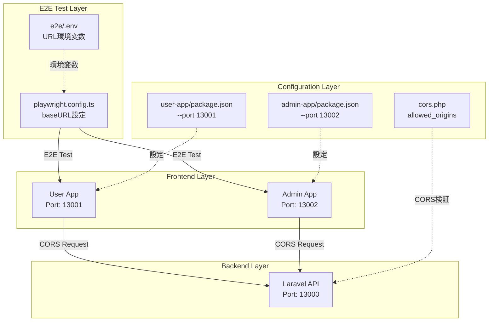
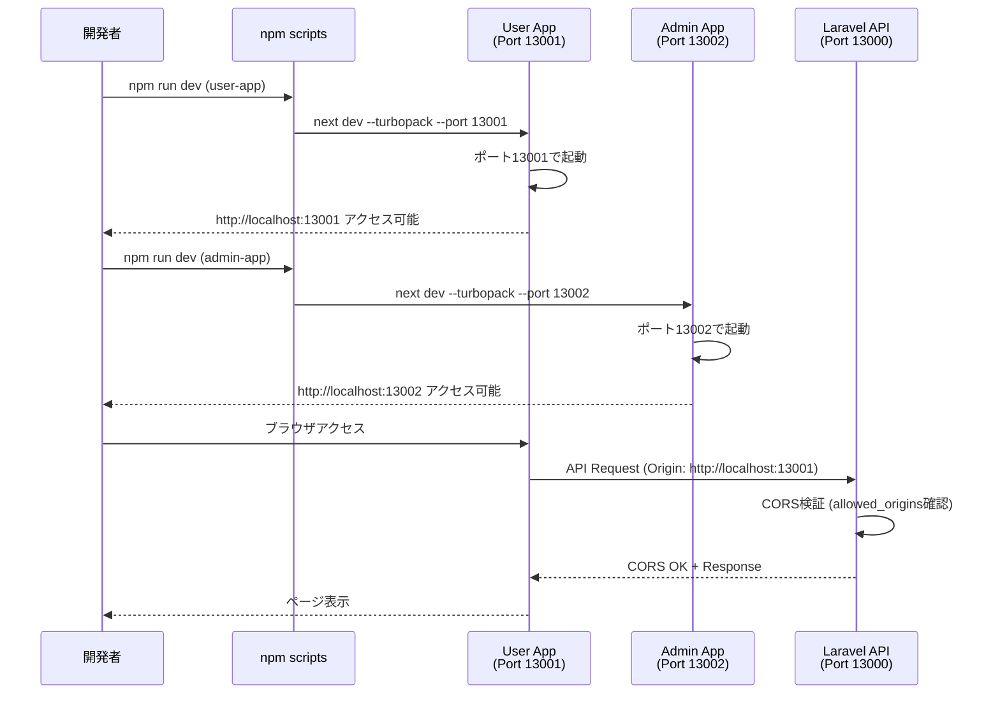
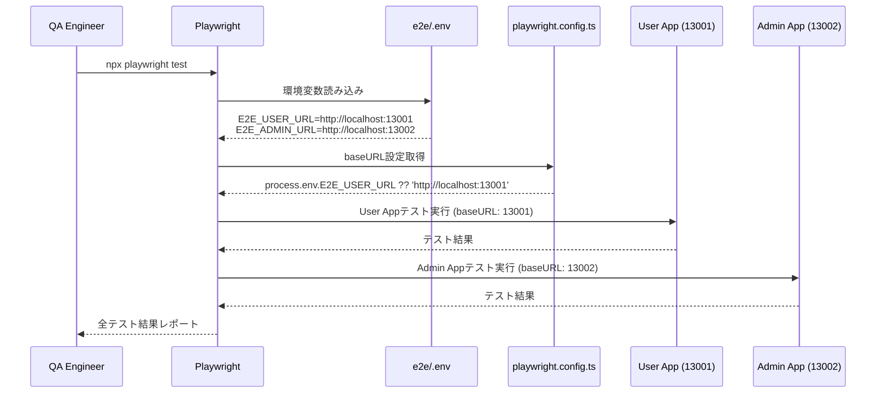
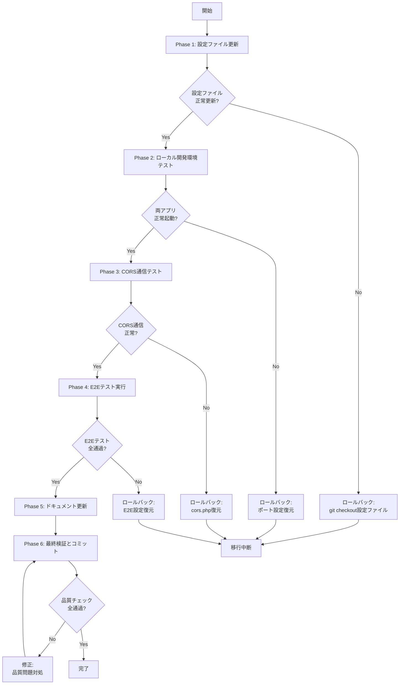

# Technical Design Document

## Overview

本機能は、Next.jsアプリケーション（user-app、admin-app）の起動ポートを固定化し、すべての開発環境で一貫性を担保することで、開発者エクスペリエンスの向上とテスト環境の安定化を実現します。

**Purpose**: 開発環境の一貫性を確保し、E2Eテストの信頼性を向上させるため、Next.jsアプリケーションのポートを固定化します。user-appはポート13001、admin-appはポート13002で常に起動するようになります。

**Users**: フロントエンド開発者、QAエンジニア、DevOpsエンジニアが、ローカル開発、E2Eテスト実行、CI/CD環境で一貫したポート設定を利用できます。

**Impact**: 現在の動的ポート割り当て（Next.jsデフォルト動作）から固定ポート設定に変更します。これにより、E2EテストのbaseURL設定が安定化し、CORS設定が明確になり、開発者間での環境差異が解消されます。

### Goals

- user-appをポート13001、admin-appをポート13002に固定
- E2Eテスト環境設定（.env、playwright.config.ts）の更新
- Laravel CORS設定の確認と新ポート追加
- ドキュメント更新（README.md、トラブルシューティングガイド）
- 既存の開発ワークフロー（HMR、型チェック、lint、ビルド）の維持

### Non-Goals

- Docker Compose設定の変更（本プロジェクトには未導入）
- プロダクション環境のポート設定（リバースプロキシ側で管理）
- 既存の開発者環境への強制適用（任意のタイミングで移行）
- モバイルアプリとの連携設定

---

## Architecture

### Existing Architecture Analysis

**現在のアーキテクチャ**: Next.jsデフォルト動作による動的ポート割り当て
- **制約**: ポート3000から順に空いているポートを自動検索
- **問題点**: E2EテストのbaseURL不安定、CORS設定の曖昧さ、開発者間の設定相違
- **既存パターン**: `next dev --turbopack`での起動（ポート指定なし）

**保持する既存パターン**:
- Next.js 15.5 + React 19のモダンスタック
- Turbopackによる高速ビルド
- package.jsonベースのスクリプト管理
- モノレポ構成（frontend/admin-app、frontend/user-app）

**統合点**:
- E2Eテスト環境（Playwright 1.47.2）
- Laravel API CORS設定（backend/laravel-api/config/cors.php）
- ドキュメント体系（README.md、各種ガイド）

### High-Level Architecture



### Technology Alignment

本機能は既存の技術スタックに完全に整合します：

**既存技術の活用**:
- **Next.js CLI**: `--port`オプション（公式サポート方式）
- **環境変数管理**: dotenv（Playwright設定）
- **package.json scripts**: npm scriptsパターン維持

**新規依存関係**: なし（既存のNext.js CLI機能のみ使用）

**パターンとの整合性**:
- ポート設定の明示化（Laravel API: 13000、MinIO: 13900等と統一）
- モノレポ個別設定パターン（各アプリのpackage.jsonで管理）
- E2E環境変数パターン（.env.exampleテンプレート方式）

---

### Key Design Decisions

#### Decision 1: Next.js CLI `--port`オプションの採用

**Decision**: package.jsonのscriptsに`--port`フラグを追加する方式を採用

**Context**: Next.jsアプリケーションのポート固定化には複数の方法が存在し、最適な方式を選択する必要がある

**Alternatives**:
1. **環境変数方式**: `PORT=13002 next dev`
2. **next.config.js設定**: next.config.jsでポート設定
3. **CLIフラグ方式**: `next dev --port 13002`（採用）

**Selected Approach**: CLIフラグ方式
```json
{
  "scripts": {
    "dev": "next dev --turbopack --port 13001",
    "start": "next start --port 13001"
  }
}
```

**Rationale**:
- Next.js公式ドキュメントで推奨される方式
- 設定が明示的でpackage.jsonで完結
- Windows環境でも追加依存なし（環境変数方式はcross-env必須）
- next.config.jsはポート設定に対応していない

**Trade-offs**:
- **獲得**: クロスプラットフォーム互換性、明示的な設定、公式サポート
- **犠牲**: 環境変数による動的変更の柔軟性（本要件では不要）

#### Decision 2: E2E環境変数とPlaywright baseURLの二重管理

**Decision**: e2e/.envとplaywright.config.tsの両方でURL設定を管理する

**Context**: PlaywrightテストはbaseURLを必要とし、環境変数による柔軟性も求められる

**Alternatives**:
1. **環境変数のみ**: playwright.config.tsでハードコードなし
2. **ハードコードのみ**: 環境変数不使用
3. **デフォルト値付き環境変数**: `process.env.E2E_ADMIN_URL ?? 'http://localhost:13002'`（採用）

**Selected Approach**:
```typescript
use: {
  baseURL: process.env.E2E_ADMIN_URL ?? 'http://localhost:13002',
}
```

**Rationale**:
- 環境変数未設定時のフォールバック保証
- CI/CD環境での柔軟な設定変更
- ローカル開発での.env省略可能性

**Trade-offs**:
- **獲得**: 設定の柔軟性、環境差異への対応、デフォルト動作の保証
- **犠牲**: 設定箇所の増加（.envとconfig.ts）

#### Decision 3: CORS設定のポート置き換え方式

**Decision**: allowed_origins配列を新ポートのみに置き換え、旧ポートは削除

**Context**: リリース前のプロジェクトであり、単独開発のため後方互換性は不要

**Alternatives**:
1. **ワイルドカード**: `allowed_origins => ['*']`（セキュリティリスクあり）
2. **置き換え**: 旧ポート削除、新ポートのみ（採用）
3. **追加保持**: 新旧両ポート併存（不要な冗長性）

**Selected Approach**:
```php
'allowed_origins' => [
    'http://localhost:13001',   // user-app
    'http://localhost:13002',   // admin-app
    'http://127.0.0.1:13001',   // user-app (127.0.0.1)
    'http://127.0.0.1:13002',   // admin-app (127.0.0.1)
],
```

**Rationale**:
- クリーンな設定ファイル維持
- 不要な設定の排除
- 明確なポート指定（13000番台統一）

**Trade-offs**:
- **獲得**: シンプルな設定、将来の保守性向上
- **犠牲**: なし（リリース前・単独開発のため互換性不要）

---

## System Flows

### ポート固定化後の開発フロー



### E2Eテスト実行フロー



---

## Requirements Traceability

| Requirement | Requirement Summary | Components | Interfaces | Flows |
|-------------|---------------------|------------|------------|-------|
| 1.1-1.4 | Next.jsアプリポート固定化 | package.json (user-app, admin-app) | npm scripts (dev, start) | 開発フロー |
| 1.5 | 両アプリ同時起動 | Next.js CLI | --port フラグ | 開発フロー |
| 2.1-2.6 | E2E環境設定更新 | e2e/.env, playwright.config.ts | baseURL設定 | E2Eテストフロー |
| 3.1-3.5 | CORS設定確認・更新 | cors.php | allowed_origins | 開発フロー（API通信） |
| 4.1-4.8 | 開発環境動作確認 | Next.js, TypeScript, ESLint | HMR, lint, type-check | 開発フロー |
| 5.1-5.5 | E2Eテスト実行確認 | Playwright, global-setup | npx playwright test | E2Eテストフロー |
| 6.1-6.6 | ドキュメント更新 | README.md, ガイド文書 | マークダウン | - |
| 7.1-7.5 | CI/CD設定確認 | .github/workflows/*.yml.disabled | GitHub Actions | - |
| 8.1-8.5 | エラーハンドリング | Next.js, ドキュメント | EADDRINUSE, lsof | エラーハンドリングフロー |

---

## Components and Interfaces

### Configuration Layer

#### User App Package Configuration

**Responsibility & Boundaries**:
- **Primary Responsibility**: user-appの起動ポートをpackage.json scriptsで定義
- **Domain Boundary**: フロントエンド設定管理
- **Data Ownership**: user-appのnpm scripts設定

**Dependencies**:
- **Inbound**: 開発者のnpm runコマンド実行
- **Outbound**: Next.js CLI (`next` コマンド）
- **External**: なし（Next.js標準CLI機能）

**Contract Definition**:

```json
{
  "scripts": {
    "dev": "next dev --turbopack --port 13001",
    "start": "next start --port 13001"
  }
}
```

**変更内容**:
- **dev script**: `next dev --turbopack` → `next dev --turbopack --port 13001`
- **start script**: `next start` → `next start --port 13001`

**Preconditions**: ポート13001が空いていること
**Postconditions**: user-appがポート13001で起動
**Invariants**: --turbopackフラグの維持、既存スクリプト（test, lint等）の不変性

#### Admin App Package Configuration

**Responsibility & Boundaries**:
- **Primary Responsibility**: admin-appの起動ポートをpackage.json scriptsで定義
- **Domain Boundary**: フロントエンド設定管理
- **Data Ownership**: admin-appのnpm scripts設定

**Dependencies**:
- **Inbound**: 開発者のnpm runコマンド実行
- **Outbound**: Next.js CLI
- **External**: なし

**Contract Definition**:

```json
{
  "scripts": {
    "dev": "next dev --turbopack --port 13002",
    "start": "next start --port 13002"
  }
}
```

**変更内容**:
- **dev script**: `next dev --turbopack` → `next dev --turbopack --port 13002`
- **start script**: `next start` → `next start --port 13002`

**Preconditions**: ポート13002が空いていること
**Postconditions**: admin-appがポート13002で起動
**Invariants**: --turbopackフラグの維持、既存スクリプトの不変性

---

### E2E Test Configuration

#### E2E Environment Variables

**Responsibility & Boundaries**:
- **Primary Responsibility**: E2Eテスト実行時のアプリケーションURL定義
- **Domain Boundary**: E2Eテスト環境設定
- **Data Ownership**: e2e/.envファイル

**Dependencies**:
- **Inbound**: Playwrightテスト実行（dotenv読み込み）
- **Outbound**: なし（環境変数提供のみ）
- **External**: dotenv（既存依存）

**Contract Definition**:

**ファイル**: `e2e/.env` および `e2e/.env.example`

```env
E2E_ADMIN_URL=http://localhost:13002
E2E_USER_URL=http://localhost:13001
E2E_API_URL=http://localhost:13000
```

**変更内容**:
- **E2E_ADMIN_URL**: `http://localhost:3001` → `http://localhost:13002`
- **E2E_USER_URL**: `http://localhost:3000` → `http://localhost:13001`
- **E2E_API_URL**: 変更なし（13000維持）

**Preconditions**: .envファイルが存在すること
**Postconditions**: Playwrightが正しいURLを環境変数から取得
**Invariants**: .env.exampleと.envの設定項目一致

#### Playwright Configuration

**Responsibility & Boundaries**:
- **Primary Responsibility**: PlaywrightテストプロジェクトのbaseURL設定
- **Domain Boundary**: E2Eテスト実行設定
- **Data Ownership**: playwright.config.tsファイル

**Dependencies**:
- **Inbound**: npx playwright testコマンド
- **Outbound**: user-app (13001), admin-app (13002)
- **External**: @playwright/test（既存依存）

**Contract Definition**:

**ファイル**: `e2e/playwright.config.ts`

```typescript
projects: [
  {
    name: 'admin-chromium',
    testDir: './projects/admin/tests',
    use: {
      ...devices['Desktop Chrome'],
      baseURL: process.env.E2E_ADMIN_URL ?? 'http://localhost:13002',
    },
  },
  {
    name: 'user-chromium',
    testDir: './projects/user/tests',
    use: {
      ...devices['Desktop Chrome'],
      baseURL: process.env.E2E_USER_URL ?? 'http://localhost:13001',
    },
  },
]
```

**変更内容**:
- **admin-chromium baseURL**: `'http://localhost:3001'` → `'http://localhost:13002'`（環境変数フォールバック）
- **user-chromium baseURL**: `'http://localhost:3000'` → `'http://localhost:13001'`（環境変数フォールバック）

**Preconditions**: E2E_ADMIN_URL、E2E_USER_URL環境変数が存在するか、デフォルト値で起動可能
**Postconditions**: Playwrightテストが正しいbaseURLで実行
**Invariants**: デバイス設定（Desktop Chrome）の維持、testDir設定の不変性

---

### Backend Configuration

#### Laravel CORS Configuration

**Responsibility & Boundaries**:
- **Primary Responsibility**: フロントエンドからのCORSリクエスト検証
- **Domain Boundary**: バックエンドセキュリティ設定
- **Data Ownership**: backend/laravel-api/config/cors.php

**Dependencies**:
- **Inbound**: user-app (13001), admin-app (13002) からのHTTPリクエスト
- **Outbound**: なし（設定ファイル）
- **External**: Laravel CORSミドルウェア（Laravel標準機能）

**Contract Definition**:

**ファイル**: `backend/laravel-api/config/cors.php`

```php
'allowed_origins' => [
    'http://localhost:13001',   // user-app
    'http://localhost:13002',   // admin-app
    'http://127.0.0.1:13001',   // user-app (127.0.0.1)
    'http://127.0.0.1:13002',   // admin-app (127.0.0.1)
],
```

**変更内容**:
- **ポート置き換え**: 旧ポート（3000, 3001）を削除し、新ポート（13001, 13002）のみに統一
- **127.0.0.1対応**: localhost と 127.0.0.1 両方のアクセスをサポート

**Preconditions**: Laravel APIが起動していること
**Postconditions**: 新ポート（13001, 13002）からのCORSリクエストのみが許可される
**Invariants**: 他のCORS設定（allowed_methods, allowed_headers等）の不変性

**Integration Strategy**:
- **Modification Approach**: 既存allowed_origins配列を新ポートのみに置き換え
- **Backward Compatibility**: 不要（リリース前・単独開発のため）
- **Migration Path**: なし（一括移行）

---

### Documentation Layer

#### README.md Documentation

**Responsibility & Boundaries**:
- **Primary Responsibility**: 開発環境セットアップ手順の提供
- **Domain Boundary**: プロジェクトドキュメント
- **Data Ownership**: README.mdファイル

**Contract Definition**:

**更新箇所**:
1. **開発サーバー起動手順**: ポート情報を13001/13002に更新
2. **E2Eテスト手順**: 環境変数設定例を新ポートで記載
3. **トラブルシューティング**: ポート競合エラーの対処法追加

**変更内容例**:
```markdown
## 開発環境起動

### フロントエンド
- User App: `cd frontend/user-app && npm run dev` → http://localhost:13001
- Admin App: `cd frontend/admin-app && npm run dev` → http://localhost:13002

### API
- Laravel API: `cd backend/laravel-api && ./vendor/bin/sail up -d` → http://localhost:13000
```

**Preconditions**: なし
**Postconditions**: 開発者が正しいポート情報でセットアップ可能
**Invariants**: 既存の他のドキュメントセクション（技術スタック、テスト等）の不変性

#### Troubleshooting Guide

**Responsibility & Boundaries**:
- **Primary Responsibility**: ポート競合エラーの診断と解決手順提供
- **Domain Boundary**: 運用ドキュメント
- **Data Ownership**: README.mdまたは別ガイドファイル

**Contract Definition**:

**追加内容**:
```markdown
## ポート競合エラー

### 症状
```
Error: listen EADDRINUSE: address already in use :::13002
```

### 解決方法
```bash
# 使用中のポート確認
lsof -i :13001 :13002

# プロセス停止
pkill -f "next dev"

# 再起動
npm run dev
```
```

---

## Error Handling

### Error Strategy

ポート固定化に伴うエラーハンドリングは、明確なエラーメッセージと復旧手順の提供に焦点を当てます。

**エラーカテゴリ**:
1. **ポート競合エラー（EADDRINUSE）**: システムエラー（5xx相当）
2. **設定ミス（環境変数未設定等）**: ユーザーエラー（4xx相当）
3. **E2Eテスト接続エラー**: インフラエラー（5xx相当）

### Error Categories and Responses

#### ポート競合エラー（EADDRINUSE）

**エラー発生条件**: ポート13001または13002が既に使用されている状態でnpm run dev実行

**システム動作**:
```
Error: listen EADDRINUSE: address already in use :::13002
    at Server.setupListenHandle [as _listen2] (node:net:1740:16)
```

**復旧手順**:
1. **ポート使用状況確認**: `lsof -i :13001 :13002`
2. **プロセス停止**: `pkill -f "next dev"` または個別PID killコマンド
3. **再起動**: `npm run dev`

**監視**: Next.js起動ログでポート情報を確認

#### E2Eテスト接続エラー

**エラー発生条件**: Playwrightテスト実行時にアプリケーションが起動していない

**システム動作**:
```
Error: page.goto: net::ERR_CONNECTION_REFUSED at http://localhost:13001
```

**復旧手順**:
1. **アプリケーション起動確認**: `curl http://localhost:13001`, `curl http://localhost:13002`
2. **E2E環境変数確認**: `cat e2e/.env`
3. **アプリケーション起動**: `npm run dev` (各アプリ)
4. **テスト再実行**: `npx playwright test`

**監視**: Playwright --debugモードでブラウザ接続状況確認

#### 環境変数未設定エラー

**エラー発生条件**: e2e/.envファイルが存在しないか、必須環境変数が未設定

**システム動作**: PlaywrightがデフォルトbaseURLを使用（`process.env.E2E_ADMIN_URL ?? 'http://localhost:13002'`）

**復旧手順**:
1. **.env.exampleコピー**: `cp e2e/.env.example e2e/.env`
2. **環境変数確認**: `cat e2e/.env`
3. **必要に応じて編集**: ポート番号が正しいか確認

**監視**: Playwrightテストログで実際に使用されているbaseURLを確認

### Monitoring

- **起動ログ監視**: Next.js起動時の `ready - started server on 0.0.0.0:13001` メッセージ確認
- **E2Eテストレポート**: Playwright HTMLレポートでbaseURL設定確認
- **CORS通信監視**: ブラウザDevTools NetworkタブでCORSヘッダー確認
- **CI/CDログ**: GitHub Actionsワークフロー実行時のポート設定検証

---

## Testing Strategy

### Unit Tests

本機能は設定変更のため、従来的なユニットテストは不要です。設定ファイルの整合性検証をテスト項目とします。

1. **package.json検証**: user-app/admin-appのdev/startスクリプトに`--port`フラグが含まれること
2. **playwright.config.ts検証**: admin-chromiumプロジェクトのbaseURLが13002、user-chromiumが13001であること
3. **.env.example検証**: E2E_ADMIN_URL、E2E_USER_URL、E2E_API_URLが正しく設定されていること
4. **cors.php検証**: allowed_originsに`http://localhost:13001`と`http://localhost:13002`が含まれること

### Integration Tests

1. **ポート起動確認**: user-appとadmin-appを同時起動し、ポート競合がないことを確認
2. **HMR動作確認**: 各アプリでソースコード変更時の自動リロード確認
3. **CORS通信確認**: user-app/admin-appからLaravel APIへのOPTIONSリクエスト成功確認
   ```bash
   curl -H "Origin: http://localhost:13002" \
        -H "Access-Control-Request-Method: GET" \
        -X OPTIONS \
        http://localhost:13000/api/up
   ```
4. **TypeScript/Lint確認**: `npm run type-check`、`npm run lint`の成功確認
5. **プロダクションビルド確認**: `npm run build`、`npm run start`の成功確認

### E2E Tests

1. **Playwrightテスト全実行**: `npx playwright test`で全テストが正常実行されること
2. **admin-chromiumプロジェクト**: `npx playwright test --project=admin-chromium`でadmin-app専用テスト成功
3. **user-chromiumプロジェクト**: `npx playwright test --project=user-chromium`でuser-app専用テスト成功
4. **baseURL検証**: Playwrightデバッグモードで実際に使用されているbaseURLが13001/13002であること確認
5. **global-setup検証**: 環境変数E2E_ADMIN_URL、E2E_USER_URLが正しく読み込まれること確認

### Performance Tests

本機能はパフォーマンス影響が極小のため、簡易的な検証のみ実施します。

1. **起動速度比較**: ポート変更前後でNext.js起動時間に有意な差がないこと（`next dev`実行から`ready`メッセージまで）
2. **HMRレスポンス時間**: ソースコード変更からブラウザ反映までの時間が変更前と同等であること
3. **ビルド時間比較**: `npm run build`の実行時間が変更前と同等であること
4. **E2Eテスト実行時間**: Playwrightテスト全体の実行時間が変更前と同等であること

---

## Security Considerations

### CORS設定の安全性

**脅威**: CORS設定の誤りによる不正なOriginからのAPIアクセス許可

**対策**:
- **明示的Origin指定**: `allowed_origins`に具体的なポート番号を含むURLを列挙
- **ワイルドカード回避**: 開発環境でも`['*']`は使用せず、必要なOriginのみ許可
- **localhost/127.0.0.1両対応**: ブラウザのOrigin判定差異に対応

**検証**:
```bash
# 許可されたOriginからのリクエスト
curl -H "Origin: http://localhost:13002" \
     -H "Access-Control-Request-Method: GET" \
     -X OPTIONS \
     http://localhost:13000/api/up
# 期待結果: Access-Control-Allow-Origin: http://localhost:13002

# 許可されていないOriginからのリクエスト
curl -H "Origin: http://localhost:9999" \
     -H "Access-Control-Request-Method: GET" \
     -X OPTIONS \
     http://localhost:13000/api/up
# 期待結果: Access-Control-Allow-Originヘッダーなし
```

### 環境変数の管理

**脅威**: .envファイルの誤コミットによる認証情報漏洩

**対策**:
- **.gitignore設定**: `e2e/.env`がgitignore対象であることを確認済み
- **.env.exampleの提供**: 認証情報を含まないテンプレートファイル
- **CI/CD環境変数**: GitHub Secretsでの認証情報管理（将来的なE2Eワークフロー有効化時）

**検証**:
```bash
# .gitignore設定確認
git check-ignore e2e/.env
# 期待結果: e2e/.env (無視対象)

# .env.example確認
cat e2e/.env.example | grep PASSWORD
# 期待結果: E2E_ADMIN_PASSWORD=password (デフォルト値のみ)
```

### ポート競合によるDoS的影響

**脅威**: 悪意のあるプロセスが13001/13002を占有し、開発環境起動を妨害

**対策**:
- **ポート確認手順の文書化**: トラブルシューティングガイドに診断手順記載
- **代替ポート手順**: 緊急時の`--port`フラグ変更手順を文書化

**検証**:
- 開発者向けガイドにポート競合対処法が記載されていること
- `lsof -i :13001 :13002`コマンドでポート使用状況を即座に確認可能なこと

---

## Migration Strategy

### Phase 1: 設定ファイル更新

**目的**: package.json、E2E設定、CORS設定の一括更新

**手順**:
1. **user-app/package.json**: dev/startスクリプトに`--port 13001`追加
2. **admin-app/package.json**: dev/startスクリプトに`--port 13002`追加
3. **e2e/.env.example**: URL更新（E2E_ADMIN_URL=13002, E2E_USER_URL=13001）
4. **e2e/playwright.config.ts**: baseURL更新（デフォルト値13001/13002）
5. **backend/laravel-api/config/cors.php**: allowed_originsに新ポート追加

**検証**:
- 全設定ファイルがgit diffで確認可能
- 設定変更がコミットされていること

**ロールバックトリガー**: 設定ミスによる起動失敗

---

### Phase 2: ローカル開発環境テスト

**目的**: 両アプリの正常起動とHMR動作確認

**手順**:
1. **user-app起動**: `cd frontend/user-app && npm run dev`
2. **ポート確認**: http://localhost:13001 でアクセス可能確認
3. **admin-app起動**: `cd frontend/admin-app && npm run dev`
4. **ポート確認**: http://localhost:13002 でアクセス可能確認
5. **同時起動確認**: 両アプリがポート競合なく起動
6. **HMR確認**: ソースコード変更時の自動リロード動作

**検証**:
- 両アプリが指定ポートで起動
- ブラウザDevToolsで正しいOriginヘッダー送信確認
- HMRが正常動作

**ロールバックトリガー**: ポート競合、HMR不具合

---

### Phase 3: CORS通信テスト

**目的**: Laravel APIとの通信が正常に機能することを確認

**手順**:
1. **Laravel API起動**: `cd backend/laravel-api && ./vendor/bin/sail up -d`
2. **CORS通信確認（user-app）**:
   ```bash
   curl -H "Origin: http://localhost:13001" \
        -H "Access-Control-Request-Method: GET" \
        -X OPTIONS \
        http://localhost:13000/api/up
   ```
3. **CORS通信確認（admin-app）**:
   ```bash
   curl -H "Origin: http://localhost:13002" \
        -H "Access-Control-Request-Method: GET" \
        -X OPTIONS \
        http://localhost:13000/api/up
   ```
4. **ブラウザでのAPI通信**: 各アプリからLaravel APIへのリクエスト成功確認

**検証**:
- curlコマンドでAccess-Control-Allow-Originヘッダー確認
- ブラウザDevTools NetworkタブでCORSエラーがないこと確認

**ロールバックトリガー**: CORSエラー発生

---

### Phase 4: E2Eテスト実行

**目的**: Playwrightテストが新ポートで正常動作することを確認

**手順**:
1. **e2e/.env更新**: `.env.example`を`.env`にコピー（未存在の場合）
2. **環境変数確認**: `cat e2e/.env`で正しいURL設定確認
3. **E2Eテスト全実行**: `cd e2e && npx playwright test`
4. **admin-chromiumテスト**: `npx playwright test --project=admin-chromium`
5. **user-chromiumテスト**: `npx playwright test --project=user-chromium`
6. **レポート確認**: `npx playwright show-report reports/html`

**検証**:
- 全テストが正常実行（一部スキップは許容）
- PlaywrightレポートでbaseURL設定が正しいこと確認

**ロールバックトリガー**: E2Eテスト失敗（baseURL起因）

---

### Phase 5: ドキュメント更新

**目的**: 開発者向けドキュメントを最新状態に更新

**手順**:
1. **README.md更新**: 開発サーバー起動手順のポート情報更新
2. **E2Eガイド更新**: 環境変数設定例を新ポートで記載
3. **トラブルシューティング追加**: ポート競合エラー対処法追加
4. **CI/CD設定確認**: `.github/workflows/e2e-tests.yml.disabled`のコメント更新

**検証**:
- 全ドキュメントが新ポート情報で記載されていること
- トラブルシューティングガイドに`lsof`コマンド例があること

**ロールバックトリガー**: なし（ドキュメント単独の問題）

---

### Phase 6: 最終検証とコミット

**目的**: 全変更の統合確認とGitコミット

**手順**:
1. **型チェック**: `npm run type-check`（全ワークスペース）
2. **Lintチェック**: `npm run lint`（全ワークスペース）
3. **プロダクションビルド**: `npm run build`（各アプリ）
4. **全テスト実行**: Jest + Playwright統合確認
5. **Gitコミット**: 変更内容を意味のあるコミットメッセージで記録
6. **プッシュ**: リモートリポジトリへプッシュ

**検証**:
- TypeScript型エラーなし
- Lintエラーなし
- ビルド成功
- テスト全通過

**ロールバックトリガー**: 品質チェック失敗

---

### Migration Flowchart



### Rollback Procedure

**全フェーズ共通のロールバック手順**:

1. **バックアップ確認**: `git tag port-change-backup-$(date +%Y%m%d-%H%M%S)`
2. **変更内容確認**: `git diff`で変更ファイル一覧確認
3. **個別ファイルロールバック**:
   ```bash
   git checkout -- frontend/admin-app/package.json
   git checkout -- frontend/user-app/package.json
   git checkout -- e2e/.env.example
   git checkout -- e2e/playwright.config.ts
   git checkout -- backend/laravel-api/config/cors.php
   ```
4. **アプリ再起動**: `npm run dev`で元のポート（3000/3001）で起動確認
5. **動作確認**: 既存の開発フローが正常動作することを確認

**緊急ロールバック**: 全ファイル一括復元
```bash
git reset --hard HEAD
```

**ロールバック後の対応**:
- ロールバック原因の特定と記録
- 問題修正後に再度Phase 1から実行
