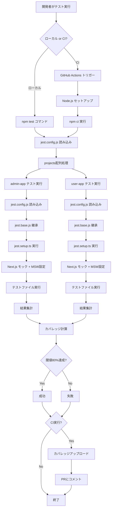
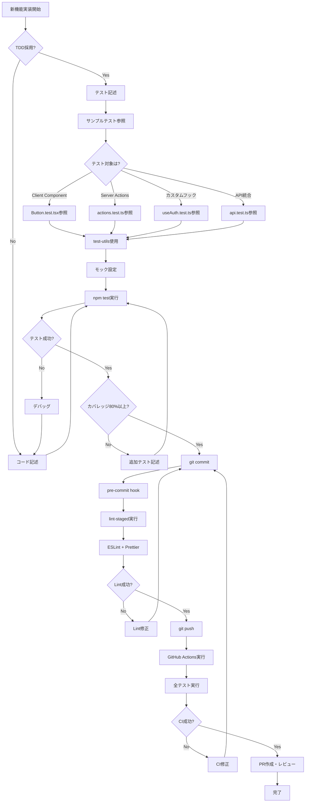
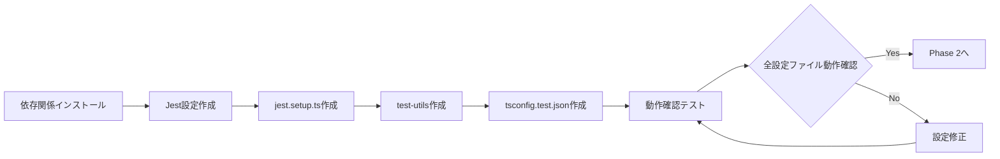
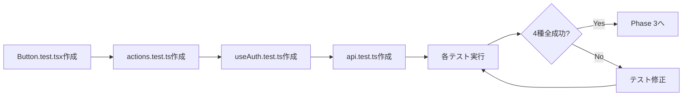
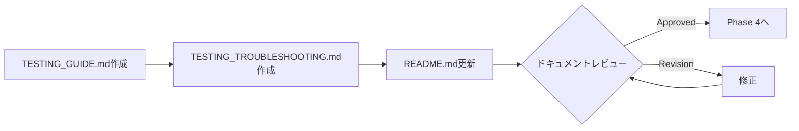
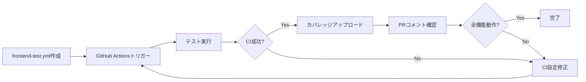

# Technical Design Document

## Overview

本機能は、Next.js 15.5.4 + React 19.1.0で構築されたフロントエンドアプリケーション（admin-app/user-app）に対して、Jest 29とReact Testing Library 16を使用した包括的なテスト環境を提供します。

**Purpose**: フロントエンド開発者に対して、コンポーネント、カスタムフック、Server Actions、API統合をテストするための統一されたテストインフラを提供し、TDDと継続的品質保証を実現します。

**Users**: フロントエンド開発者は、新規機能開発時にテストを記述し、CI/CDパイプラインで自動検証を受けます。QAエンジニアは、カバレッジレポートを参照して品質を確認します。

**Impact**: 現在テスト環境が存在しないフロントエンドアプリケーションに、モノレポ全体で統一されたテスト基盤を追加します。既存のESLint 9 + Prettier + husky + lint-staged設定と統合し、コミット前後の品質チェックフローを拡張します。

### Goals

- Next.js 15.5.4 App Routerに完全対応したテスト環境の構築
- モノレポ全体で統一されたJest設定と共通ユーティリティの提供
- 4種類のテストサンプル（Client Component、Server Actions、カスタムフック、API Fetch）による実装パターンの明示
- GitHub Actionsとの統合による自動テスト実行とカバレッジレポート生成
- 80%のコードカバレッジ閾値設定による品質基準の確立

### Non-Goals

- E2Eテストフレームワーク（Playwright/Cypress）の導入（別Issue検討）
- Visual Regression Testing（Percy/Chromatic）の導入（別Issue検討）
- パフォーマンステストの実装（別Issue検討）
- Storybookとの統合（別Issue検討）
- 既存の全コンポーネントへのテスト追加（サンプルのみ作成、段階的適用）

## Architecture

### Existing Architecture Analysis

**現在のフロントエンド構成**:
- モノレポ構成（frontend/admin-app、frontend/user-app）
- Next.js 15.5.4 App Router + React 19.1.0 + TypeScript 5
- Turbopackビルドシステム
- ESLint 9（Flat Config） + Prettier + husky + lint-staged

**既存の品質管理フロー**:
- pre-commit: lint-stagedでESLint + Prettier自動実行
- ルートpackage.jsonのworkspacesで依存関係管理

**統合ポイント**:
- 既存のworkspaces設定を活用し、テスト関連依存関係を追加
- huskyフックは維持し、テストコマンドは独立実行
- ESLint設定にテストファイルパターン（*.test.{ts,tsx}）を追加

### High-Level Architecture

```mermaid
graph TB
    subgraph "Monorepo Root"
        RootPkg[package.json<br/>workspaces設定]
        JestBase[jest.base.js<br/>共通設定]
        JestConfig[jest.config.js<br/>統括設定]
        JestSetup[jest.setup.ts<br/>セットアップ]
        TestUtils[test-utils/<br/>共通ユーティリティ]
        TSConfig[tsconfig.test.json<br/>型定義]
    end

    subgraph "Admin App"
        AdminJest[jest.config.js]
        AdminTests[src/**/*.test.{ts,tsx}]
        AdminSamples[テストサンプル4種]
    end

    subgraph "User App"
        UserJest[jest.config.js]
        UserTests[src/**/*.test.{ts,tsx}]
    end

    subgraph "CI/CD"
        GHActions[frontend-test.yml]
        Coverage[カバレッジレポート]
    end

    RootPkg --> JestBase
    RootPkg --> JestConfig
    JestBase --> AdminJest
    JestBase --> UserJest
    JestConfig --> AdminJest
    JestConfig --> UserJest
    JestSetup --> AdminTests
    JestSetup --> UserTests
    TestUtils --> AdminTests
    TestUtils --> UserTests
    TSConfig --> AdminTests
    TSConfig --> UserTests
    AdminJest --> AdminTests
    UserJest --> UserTests
    AdminSamples --> AdminTests
    GHActions --> AdminTests
    GHActions --> UserTests
    AdminTests --> Coverage
    UserTests --> Coverage
```

### Technology Alignment

本機能は、既存のフロントエンド技術スタックに以下の形で統合されます：

**既存技術との整合性**:
- **Next.js 15.5.4**: `next/jest`のcreateJestConfigを使用し、Next.js内部設定と完全互換
- **React 19.1.0**: React Testing Library 16がReact 19に対応
- **TypeScript 5**: `@types/jest`と`tsconfig.test.json`で型安全性を保証
- **Turbopack**: Jestは独立したJavaScript/TypeScript変換を使用（Turbopackと並行動作）
- **ESLint 9 + Prettier**: 既存のlint-staged設定にテストファイルパターンを追加

**新規導入依存関係**:
- **Jest 29**: テストランナーとアサーションライブラリ（業界標準、Next.js公式推奨）
- **React Testing Library 16**: React 19対応、ユーザー視点テストの業界標準
- **MSW 2**: APIモック（実際のHTTPリクエストをインターセプト、型安全）
- **next-router-mock 0.9**: Next.js Navigation APIのモック（App Router対応）

### Key Design Decisions

#### Decision 1: モノレポ共通設定の階層構造

**Decision**: jest.base.js（共通設定）、jest.config.js（ルート統括）、各アプリのjest.config.js（個別設定）の3層構造を採用

**Context**: モノレポ構成でadmin-app/user-appの2つのフロントエンドアプリが存在し、共通設定を共有しつつ個別カスタマイズも可能にする必要がある

**Alternatives**:
1. 各アプリに完全独立したJest設定を配置（重複多、保守困難）
2. ルートのみに全設定を集約（個別カスタマイズ不可、柔軟性なし）
3. 共通設定継承 + 個別拡張（選択）

**Selected Approach**:
- `jest.base.js`: testEnvironment、moduleNameMapper、coverageThresholdなど全アプリ共通設定
- `jest.config.js`: projects配列で両アプリを統括、ルートでの並列実行を可能に
- 各アプリの`jest.config.js`: next/jestのcreateJestConfig + jest.base継承 + displayName設定

**Rationale**:
- 共通設定の一元管理で保守性向上
- next/jestによるNext.js固有設定の自動適用
- 個別アプリ名（displayName）でテスト結果の識別が容易
- ルートからの並列実行でCI/CDの高速化

**Trade-offs**:
- **Gain**: DRY原則、保守性、拡張性、並列実行可能性
- **Sacrifice**: 設定ファイルが3つに分散（ただしドキュメント化で緩和）

#### Decision 2: MSWによるAPIモック戦略

**Decision**: Mock Service Worker（MSW）をjest.setup.tsでグローバル設定し、全テストで利用可能にする

**Context**: フロントエンドアプリはLaravel APIと通信するため、API依存のテストでモックが必須。実装詳細ではなくHTTPレベルでインターセプトする必要がある

**Alternatives**:
1. jest.mockでfetch/axiosをモック（実装詳細に依存、型安全性低）
2. MSWをテストごとに個別設定（重複多、一貫性なし）
3. MSWをjest.setupでグローバル設定（選択）

**Selected Approach**:
- `jest.setup.ts`でsetupServerインスタンスを作成
- beforeAll/afterEach/afterAllフックでサーバーライフサイクル管理
- 各テストファイルでserver.useを使用してエンドポイント固有のハンドラー設定

**Rationale**:
- HTTPレベルのインターセプトで実装詳細から独立
- TypeScript型定義がそのまま使えて型安全
- 実際のHTTPリクエストと同じコードパスをテスト
- 開発環境でもMSWを使用すればバックエンド不要でUI開発可能

**Trade-offs**:
- **Gain**: 実装詳細非依存、型安全性、リアリティ、開発環境での再利用可能性
- **Sacrifice**: MSW学習コスト（ただしドキュメントとサンプルで緩和）

#### Decision 3: Next.js特有機能のグローバルモック

**Decision**: next/image、next/font、next/navigationをjest.setup.tsでグローバルモックし、全テストで自動適用

**Context**: Next.js App Routerの特殊なAPI（Image最適化、Font最適化、Navigation）はNode.js環境で動作しないため、テスト時にモックが必須

**Alternatives**:
1. テストごとに個別モック（重複、一貫性なし）
2. jest.setup.tsでグローバルモック（選択）
3. next/jestの自動モックのみ（部分的、不完全）

**Selected Approach**:
- `next/image`: 単純なタグにモック
- `next/font/local`: className=''を返すモック
- `next/navigation`: next-router-mockライブラリ使用

**Rationale**:
- 全テストで一貫したモック戦略
- Next.jsの最適化機能ではなくReactコンポーネントのロジックに焦点
- next-router-mockはApp Router対応で型安全性保証

**Trade-offs**:
- **Gain**: 一貫性、保守性、型安全性
- **Sacrifice**: Next.js最適化機能の実際の動作は検証不可（ただしE2Eで別途検証）

## System Flows

### テスト実行フロー



### テスト記述フロー（開発者視点）



## Requirements Traceability

| Requirement | 要件概要 | 主要コンポーネント | 主要インターフェース | フロー |
|-------------|----------|-------------------|---------------------|--------|
| 1.1 | 依存関係インストール | package.json（ルート、各アプリ） | npm ci、workspaces | - |
| 1.2-1.4 | テストスクリプト設定 | package.json scripts | npm test系コマンド | テスト実行フロー |
| 2.1-2.4 | Jest設定構築 | jest.base.js、jest.config.js、各アプリjest.config.js | next/jest、createJestConfig | テスト実行フロー |
| 3.1-3.5 | 共通セットアップ | jest.setup.ts | MSW setupServer、Next.jsモック | テスト実行フロー |
| 4.1-4.4 | テストサンプル | Button.test.tsx、actions.test.ts、useAuth.test.ts、api.test.ts | RTL render、MSW handlers | テスト記述フロー |
| 5.1-5.3 | テストユーティリティ | test-utils/env.ts、router.ts、render.tsx | setEnv、setupRouter、カスタムrender | テスト記述フロー |
| 6.1-6.2 | TypeScript統合 | tsconfig.test.json | types配列、include設定 | - |
| 7.1-7.2 | ドキュメント | TESTING_GUIDE.md、TESTING_TROUBLESHOOTING.md | - | テスト記述フロー |
| 8.1-8.4 | CI/CD統合 | frontend-test.yml | GitHub Actions、codecov | テスト実行フロー |
| 9.1-9.6 | コマンド動作保証 | 全設定ファイル | npm test系コマンド | テスト実行フロー |
| 10.1-10.3 | カバレッジ閾値 | jest.base.js coverageThreshold | 80%閾値検証 | テスト実行フロー |
| 11.1-11.4 | 既存ツール統合 | lint-staged、.husky/pre-commit | ESLint + Prettier + テスト | テスト記述フロー |

## Components and Interfaces

### テスト設定層

#### jest.base.js（共通設定）

**Responsibility & Boundaries**
- **Primary Responsibility**: 全アプリで共通のJest基本設定を提供
- **Domain Boundary**: テスト環境設定ドメイン
- **Data Ownership**: testEnvironment、moduleNameMapper、coverageThreshold設定

**Dependencies**
- **Inbound**: 各アプリのjest.config.js
- **Outbound**: なし
- **External**: identity-obj-proxy（CSSモック用npm package）

**Contract Definition**

```javascript
module.exports = {
  testEnvironment: 'jsdom',
  setupFilesAfterEnv: ['<rootDir>/jest.setup.ts'],
  testMatch: ['<rootDir>/src/**/*.(test|spec).(ts|tsx)'],
  moduleNameMapper: {
    '^@/(.*)$': '<rootDir>/src/$1',
    '\\.(css|less|scss|sass)$': 'identity-obj-proxy',
  },
  transformIgnorePatterns: [
    'node_modules/(?!(.*\\.mjs$))',
  ],
  collectCoverageFrom: [
    'src/**/*.{ts,tsx}',
    '!src/**/*.d.ts',
    '!src/**/*.stories.{ts,tsx}',
    '!src/**/index.{ts,tsx}',
  ],
  coverageThreshold: {
    global: {
      branches: 80,
      functions: 80,
      lines: 80,
      statements: 80,
    },
  },
};
```

**Preconditions**: プロジェクトルートに配置、各アプリのjest.config.jsから参照可能
**Postconditions**: 共通設定が各アプリに継承される
**Invariants**: coverageThresholdは常に80%

#### jest.config.js（ルート統括設定）

**Responsibility & Boundaries**
- **Primary Responsibility**: モノレポ全体のテスト実行を統括
- **Domain Boundary**: テスト実行管理ドメイン
- **Data Ownership**: projects配列、collectCoverageFrom

**Contract Definition**

```javascript
module.exports = {
  projects: [
    '<rootDir>/frontend/admin-app',
    '<rootDir>/frontend/user-app',
  ],
  collectCoverageFrom: [
    'frontend/**/src/**/*.{ts,tsx}',
    '!frontend/**/src/**/*.d.ts',
  ],
};
```

**Preconditions**: プロジェクトルートに配置
**Postconditions**: `npm test`で全アプリのテストが並列実行される

#### 各アプリのjest.config.js

**Responsibility & Boundaries**
- **Primary Responsibility**: アプリ固有のJest設定を提供
- **Domain Boundary**: アプリケーション固有テスト設定ドメイン
- **Data Ownership**: displayName、rootDir、setupFilesAfterEnv

**Dependencies**
- **Outbound**: next/jest、jest.base.js

**Contract Definition**

```javascript
const nextJest = require('next/jest');
const base = require('../../jest.base');

const createJestConfig = nextJest({
  dir: __dirname,
});

const customJestConfig = {
  ...base,
  displayName: 'admin-app', // or 'user-app'
  rootDir: __dirname,
  setupFilesAfterEnv: ['<rootDir>/../../jest.setup.ts'],
  moduleNameMapper: {
    '^@/(.*)$': '<rootDir>/src/$1',
  },
};

module.exports = createJestConfig(customJestConfig);
```

**Preconditions**: next/jestがインストール済み、jest.base.jsが存在
**Postconditions**: Next.js固有設定が自動適用される

### テストセットアップ層

#### jest.setup.ts

**Responsibility & Boundaries**
- **Primary Responsibility**: テスト実行前の共通セットアップを提供
- **Domain Boundary**: テスト環境初期化ドメイン
- **Data Ownership**: Next.jsモック、MSWサーバーインスタンス

**Dependencies**
- **External**:
  - @testing-library/jest-dom
  - whatwg-fetch
  - msw（setupServer、http、HttpResponse）
  - next-router-mock

**External Dependencies Investigation**:
- **MSW 2**: APIモックライブラリ
  - 公式ドキュメント: https://mswjs.io/docs/
  - セットアップ: `setupServer()`でNode.js環境用サーバー作成
  - ハンドラー: `http.get/post/put/delete`でエンドポイント定義
  - ライフサイクル: `beforeAll`でlisten、`afterEach`でresetHandlers、`afterAll`でclose
  - 型安全性: TypeScript完全対応、レスポンス型推論
- **next-router-mock 0.9**: Next.js Navigation APIモック
  - GitHub: https://github.com/scottrippey/next-router-mock
  - App Router対応: useRouter、useSearchParams、usePathname
  - セットアップ: `jest.mock('next/navigation', () => require('next-router-mock'))`
  - 動的ルート: mockRouterでsetCurrentUrl/push/replace
- **@testing-library/jest-dom 6**: カスタムマッチャー
  - 公式ドキュメント: https://github.com/testing-library/jest-dom
  - マッチャー: toBeInTheDocument、toHaveClass、toBeVisibleなど

**Contract Definition**

```typescript
import '@testing-library/jest-dom';
import 'whatwg-fetch';
import { TextEncoder, TextDecoder } from 'node:util';

// Polyfills
global.TextEncoder = TextEncoder;
global.TextDecoder = TextDecoder as typeof global.TextDecoder;

// Next.js Image Mock
jest.mock('next/image', () => ({
  __esModule: true,
  default: (props: any) => {
    return ;
  },
}));

// Next.js Font Mock
jest.mock('next/font/local', () => ({
  __esModule: true,
  default: () => ({
    className: '',
  }),
}));

// Next.js Navigation Mock
jest.mock('next/navigation', () => require('next-router-mock'));

// MSW Setup
import { setupServer } from 'msw/node';
import { http, HttpResponse } from 'msw';

export const server = setupServer();

beforeAll(() => server.listen({ onUnhandledRequest: 'warn' }));
afterEach(() => server.resetHandlers());
afterAll(() => server.close());

// Console Error Suppression
const originalError = console.error;
beforeAll(() => {
  jest.spyOn(console, 'error').mockImplementation((...args) => {
    if (args[0]?.includes('Warning:')) return;
    originalError(...args);
  });
});
```

**Preconditions**: 全依存関係がインストール済み
**Postconditions**: 全テストで共通モックとMSWサーバーが利用可能
**Invariants**: MSWサーバーは各テスト後にリセットされる

### テストユーティリティ層

#### test-utils/env.ts

**Responsibility & Boundaries**
- **Primary Responsibility**: テスト用環境変数モックを提供
- **Domain Boundary**: テスト環境管理ドメイン

**Contract Definition**

```typescript
const originalEnv = process.env;

export function setEnv(env: Record<string, string>): void;
export function resetEnv(): void;
```

#### test-utils/router.ts

**Responsibility & Boundaries**
- **Primary Responsibility**: Next.js Routerモック拡張を提供
- **Domain Boundary**: ルーティングテストドメイン

**Dependencies**
- **External**: next-router-mock

**Contract Definition**

```typescript
import mockRouter from 'next-router-mock';

export function setupRouter(options: {
  pathname?: string;
  query?: Record<string, string>;
}): void;
```

#### test-utils/render.tsx

**Responsibility & Boundaries**
- **Primary Responsibility**: カスタムレンダリング関数を提供
- **Domain Boundary**: コンポーネントテストドメイン

**Dependencies**
- **External**: @testing-library/react

**Contract Definition**

```typescript
import { render as rtlRender, RenderOptions } from '@testing-library/react';
import { ReactElement } from 'react';

interface CustomRenderOptions extends RenderOptions {
  // 将来的にProvider追加用
}

export function render(
  ui: ReactElement,
  options?: CustomRenderOptions
): ReturnType<typeof rtlRender>;

export * from '@testing-library/react';
```

### テストサンプル層

#### frontend/admin-app/src/components/Button/Button.test.tsx

**Responsibility**: Client Componentテストサンプル

**Contract Definition**

```typescript
import { render, screen, fireEvent } from '@testing-library/react';
import { useRouter } from 'next/navigation';
import { Button } from './Button';

describe('Button Component', () => {
  it('renders with correct text', () => void);
  it('handles click events', () => void);
  it('navigates on button click', () => void);
  it('renders with different variants', () => void);
});
```

#### frontend/admin-app/src/app/actions.test.ts

**Responsibility**: Server Actionsテストサンプル

**Dependencies**
- **External**: next/cache（revalidatePath）

**Contract Definition**

```typescript
import { revalidatePath } from 'next/cache';
import { saveUser } from './actions';

jest.mock('next/cache', () => ({
  revalidatePath: jest.fn(),
}));

describe('Server Actions', () => {
  it('saves user and revalidates path', async () => void);
  it('handles validation errors', async () => void);
});
```

#### frontend/admin-app/src/hooks/useAuth.test.ts

**Responsibility**: カスタムフックテストサンプル

**Dependencies**
- **External**: @testing-library/react（renderHook、waitFor）

**Contract Definition**

```typescript
import { renderHook, waitFor } from '@testing-library/react';
import { useSearchParams } from 'next/navigation';
import { useAuth } from './useAuth';

jest.mock('next/navigation', () => ({
  useSearchParams: jest.fn(),
}));

describe('useAuth Hook', () => {
  it('returns authentication token from query params', () => void);
  it('fetches user data on mount', async () => void);
});
```

#### frontend/admin-app/src/lib/api.test.ts

**Responsibility**: API Fetchテスト（MSW使用）サンプル

**Dependencies**
- **External**: msw（http、HttpResponse）、jest.setup.ts（server）

**Contract Definition**

```typescript
import { http, HttpResponse } from 'msw';
import { server } from '@/jest.setup';
import { fetchUsers } from './api';

describe('API Functions', () => {
  it('fetches users successfully', async () => void);
  it('handles API errors', async () => void);
});
```

### CI/CD統合層

#### .github/workflows/frontend-test.yml

**Responsibility & Boundaries**
- **Primary Responsibility**: GitHub Actionsでフロントエンドテストを自動実行
- **Domain Boundary**: CI/CD自動化ドメイン

**Dependencies**
- **External**:
  - actions/checkout@v4
  - actions/setup-node@v4
  - codecov/codecov-action@v3
  - romeovs/lcov-reporter-action@v0.3.1

**Contract Definition**

```yaml
name: Frontend Tests

on:
  push:
    branches: [main, develop]
    paths: ['frontend/**']
  pull_request:
    branches: [main]
    paths: ['frontend/**']

jobs:
  test:
    runs-on: ubuntu-latest
    strategy:
      matrix:
        node-version: [18.x, 20.x]
        app: [admin-app, user-app]
    steps:
      - uses: actions/checkout@v4
      - uses: actions/setup-node@v4
      - run: npm ci (ルート)
      - run: npm ci (アプリ)
      - run: npm test -- --coverage --watchAll=false --maxWorkers=2
      - uses: codecov/codecov-action@v3

  coverage-report:
    runs-on: ubuntu-latest
    needs: test
    steps:
      - uses: actions/download-artifact@v3
      - uses: romeovs/lcov-reporter-action@v0.3.1
```

**Preconditions**: GitHubリポジトリ、secrets.GITHUB_TOKEN設定
**Postconditions**: テスト結果とカバレッジレポートがPRコメントに追加される

### ドキュメント層

#### frontend/TESTING_GUIDE.md

**Responsibility**: テスト記述ガイドライン提供

**主な内容**:
- テストファイル命名規則（*.test.{ts,tsx}）
- Arrange-Act-Assertパターン
- モック使用ガイドライン
- スナップショットテスト運用ルール

#### frontend/TESTING_TROUBLESHOOTING.md

**Responsibility**: トラブルシューティングガイド提供

**主な内容**:
- よくあるエラーと対処法
- 非同期テストのデバッグ
- モック関連の問題
- CI/CD失敗時の対応

## Data Models

### TypeScript統合設定

#### tsconfig.test.json

**Responsibility**: テストファイルとユーティリティのTypeScript設定

**Structure Definition**:

```json
{
  "extends": "./tsconfig.json",
  "compilerOptions": {
    "types": ["jest", "@testing-library/jest-dom", "node"],
    "jsx": "react-jsx"
  },
  "include": [
    "frontend/**/src/**/*.test.ts",
    "frontend/**/src/**/*.test.tsx",
    "jest.setup.ts",
    "test-utils/**/*.ts"
  ]
}
```

**型定義の適用範囲**:
- `jest`: Jest APIの型（describe、it、expect等）
- `@testing-library/jest-dom`: カスタムマッチャーの型（toBeInTheDocument等）
- `node`: Node.js API（TextEncoder等）

## Error Handling

### Error Strategy

テストフレームワークとして、以下のエラー戦略を採用します：

**テスト失敗**: アサーション失敗時は詳細なdiffを表示し、開発者が即座に原因を特定できるようにします。
**モックエラー**: MSWでハンドルされないリクエストは`warn`レベルで警告し、テストは継続します。
**セットアップエラー**: jest.setup.ts内のエラーは全テスト失敗となり、設定ミスを即座に検出します。

### Error Categories and Responses

**User Errors（テスト記述ミス）**:
- **不正なアサーション**: expect()の引数ミス → Jest詳細エラーメッセージ
- **モックの設定忘れ**: jest.mock未実行 → 実際の関数が呼ばれてエラー、ガイド参照を促す
- **非同期処理の未待機**: await忘れ → タイムアウトエラー、waitForガイド参照を促す

**System Errors（環境問題）**:
- **依存関係不足**: npm ciが不完全 → package.jsonエラー、再インストール指示
- **Node.jsバージョン不一致**: 18.x/20.x以外 → GitHub Actionsエラー、バージョン確認指示
- **メモリ不足**: maxWorkers過多 → OOMエラー、maxWorkers削減指示

**Configuration Errors（設定ミス）**:
- **jest.config.js構文エラー**: JSON/JS構文ミス → Jest起動失敗、構文チェック指示
- **coverageThreshold未達**: 80%未満 → カバレッジエラー、追加テスト指示
- **tsconfig.test.json型エラー**: 型定義不足 → TypeScriptコンパイルエラー、型追加指示

### Monitoring

**ローカル開発**:
- `npm test -- --verbose`で詳細ログ出力
- `npm test -- --coverage`でカバレッジレポート生成

**CI/CD**:
- GitHub Actionsのjobサマリーでテスト結果表示
- codecovでカバレッジ推移を追跡
- PRコメントでカバレッジ変化を通知

## Testing Strategy

### Unit Tests

**コンポーネント単体テスト**:
- Button、Input、Cardなどの基本UIコンポーネント
- props変化時のレンダリング検証
- イベントハンドラーのコールバック検証

**カスタムフック単体テスト**:
- useAuth、useUser、useFormなどのロジック検証
- 状態遷移の検証
- 副作用（API呼び出し）のモック検証

**ユーティリティ関数単体テスト**:
- formatDate、validateEmail、calculateTotalなどの純粋関数
- エッジケース（null、undefined、空文字列）検証

### Integration Tests

**Server Actions統合テスト**:
- フォーム送信→Server Actions→revalidatePath呼び出しフロー
- バリデーションエラーハンドリング
- 成功時のリダイレクト検証

**API統合テスト（MSW使用）**:
- fetchUsers→MSWハンドラー→レスポンス処理フロー
- エラーレスポンス（4xx、5xx）ハンドリング
- ローディング状態遷移検証

**ナビゲーション統合テスト**:
- Link→useRouter→ページ遷移フロー
- クエリパラメータ受け渡し検証
- 認証ガード検証

### E2E/UI Tests（将来対応）

本機能のスコープ外ですが、将来以下を別Issueで検討：
- Playwrightによるブラウザ自動化テスト
- ユーザーシナリオ全体のフロー検証
- Visual Regression Testing

### Performance/Load（将来対応）

本機能のスコープ外ですが、将来以下を別Issueで検討：
- Lighthouseによるパフォーマンス測定
- 大量データレンダリング時のパフォーマンス検証

## Security Considerations

### テスト環境の分離

**本番データ保護**:
- テスト環境では実際のAPIエンドポイントを使用せず、MSWでモック
- `.env.test`で環境変数を分離（設定しない場合はデフォルト値使用）

**シークレット管理**:
- GitHub Actions secretsをテストで使用しない
- テストコード内にハードコードされたAPIキーや認証情報を含めない

### CI/CDセキュリティ

**権限管理**:
- codecovアップロード時はGITHUB_TOKENのみ使用（読み取り専用）
- PRからのワークフロー実行は承認制（pull_request_targetは使用しない）

## Migration Strategy

本機能は既存システムへの**新規追加**であり、既存コードの変更は最小限です。

### Phase 1: 基盤構築（Week 1）



**タスク**:
1. ルートpackage.jsonに依存関係追加
2. jest.base.js、jest.config.js作成
3. 各アプリのjest.config.js作成
4. jest.setup.ts作成
5. test-utils/（env.ts、router.ts、render.tsx）作成
6. tsconfig.test.json作成
7. `npm test`で空テスト実行成功確認

**Rollback Trigger**: jest.config.js構文エラー、依存関係インストール失敗
**Validation**: `npm test`が正常終了

### Phase 2: テストサンプル作成（Week 2）



**タスク**:
1. Button.test.tsx作成（Client Component）
2. actions.test.ts作成（Server Actions）
3. useAuth.test.ts作成（カスタムフック）
4. api.test.ts作成（API Fetch + MSW）
5. 各テスト個別実行成功確認
6. `npm test:admin`で全テスト成功確認

**Rollback Trigger**: テストサンプルが実行不可、モックエラー
**Validation**: 4種のテストサンプルが全て成功

### Phase 3: ドキュメント整備（Week 3）



**タスク**:
1. TESTING_GUIDE.md作成
2. TESTING_TROUBLESHOOTING.md作成
3. README.mdにテストセクション追加
4. チームレビュー実施

**Rollback Trigger**: なし（ドキュメントのみ）
**Validation**: チームレビュー承認

### Phase 4: CI/CD統合（Week 4）



**タスク**:
1. .github/workflows/frontend-test.yml作成
2. PRでトリガー確認
3. テストマトリックス（Node 18.x/20.x × admin-app/user-app）実行確認
4. codecovアップロード確認
5. PRコメント自動追加確認

**Rollback Trigger**: GitHub Actions構文エラー、codecov認証失敗
**Validation**: PRでテスト自動実行、カバレッジレポート生成
