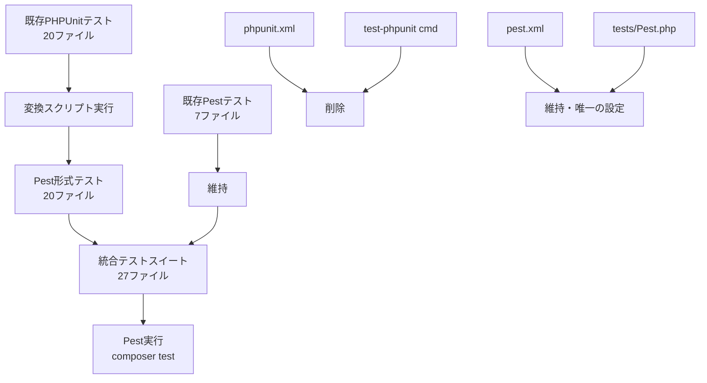
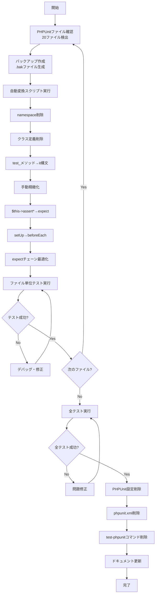
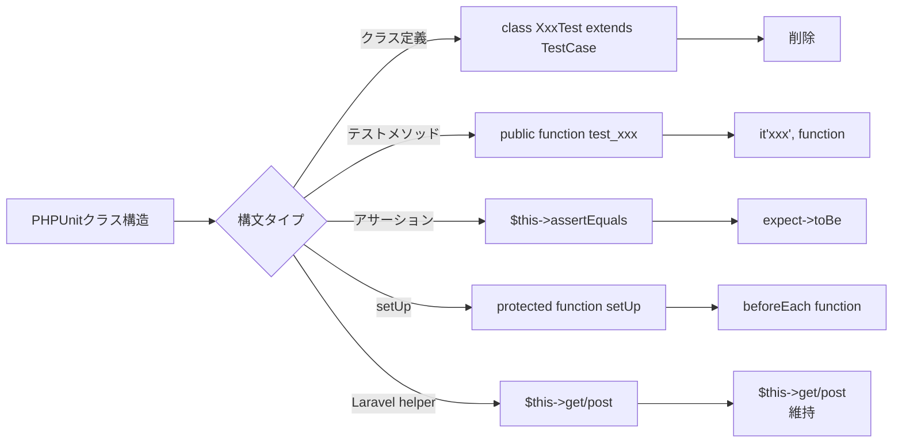
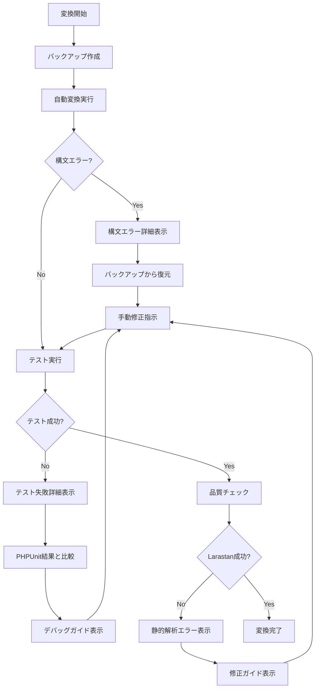
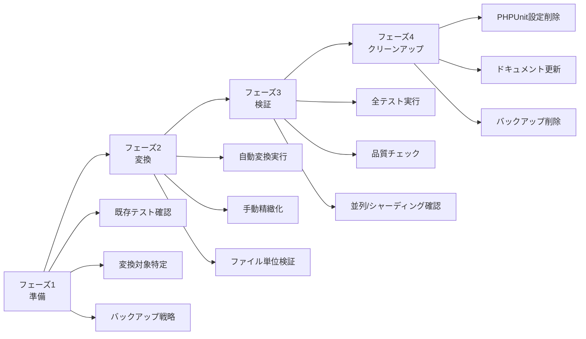

# 技術設計ドキュメント

## 概要

本機能は、Laravel 12アプリケーションの既存PHPUnitテストスイート（20ファイル、90+テストケース）をPest 4テストフレームワークに完全移行することを目的とします。開発者およびQA担当者は、モダンな関数ベース構文によるテスト可読性の向上、開発者体験の改善、テストメンテナンスコストの削減を実現します。本移行により、チーム全体が統一されたPest形式のテストコードベースを利用でき、新規テスト作成時の一貫性が確保されます。

**影響範囲**: 既存のPHPUnitクラスベーステスト（`tests/Feature/`に18ファイル、`tests/Unit/`に1ファイル、`tests/TestCase.php`）をPest関数ベース形式に変換し、PHPUnit専用設定（`phpunit.xml`、Composer `test-phpunit`コマンド）を削除します。既にPest形式で作成済みのテスト（`tests/Feature/Api/`3ファイル、`tests/Architecture/`3ファイル、`tests/Pest.php`）は変更せず維持します。

### ゴール

- 20個のPHPUnitテストファイルをPest 4形式に完全変換し、すべてのテストケースが成功する（グリーン状態維持）
- テストコードベースをPest形式に統一し、開発者の学習コストを削減する
- 既存の90+テストケースの品質保証レベルを維持し、機能互換性を完全に保証する
- Composer/CI/CD設定をPest専用に統合し、開発フローの中断を防止する
- 成功基準：`composer test`実行で全テスト成功、Larastan Level 8品質基準維持、移行完了後のPHPUnit関連ファイル完全削除

### 非ゴール

- Pest 4の新機能（Todo、Arch plugin拡張、カスタムExpectation追加）の積極的活用は将来的な拡張として除外
- PHPUnitテストの機能追加や既存ロジックの変更は本移行の範囲外
- `tests/Feature/Api/`および`tests/Architecture/`の既存Pestテストの書き換えは不要（そのまま維持）
- パフォーマンステスト、負荷テストの追加は本移行後の拡張として延期

## アーキテクチャ

### 既存アーキテクチャ分析

**現在のテスト構造**:
- **テストフレームワーク**: PHPUnit 11.5（20ファイル）とPest 4（7ファイル：`Pest.php` + Api 3 + Architecture 3）の混在状態
- **ディレクトリ構造**: Laravel標準の`tests/Feature/`, `tests/Unit/`, `tests/Architecture/`の3層分類
- **テストベースクラス**: `Tests\TestCase`（Laravelの`Illuminate\Foundation\Testing\TestCase`を継承）
- **設定ファイル**: `phpunit.xml`（PHPUnit専用）と`pest.xml`（Pest専用、カバレッジ設定含む）が並存
- **Composer統合**: `test-phpunit`, `test-pest`, `test-all`の3コマンド体制で段階的移行に対応

**保持すべき既存パターン**:
- Laravel TestCaseの利用（`$this->get()`, `$this->postJson()`等のテストヘルパー）
- `RefreshDatabase`トレイトによるデータベース初期化
- Sanctum認証テスト用の`actingAsApi()`カスタムヘルパー
- カスタム期待値（`toBeJsonOk()`, `toHaveCors()`）によるAPI専用アサーション
- テストディレクトリ構造とファイル命名規則（`*Test.php`形式維持）

**技術的負債の対応**:
- PHPUnitとPestの二重設定ファイル管理による混乱を解消（`phpunit.xml`削除）
- PHPUnit専用Composerコマンドの削除により、テスト実行コマンドを単一化
- クラスベースとモダン関数ベースの混在コードをPest形式に統一

### 高レベルアーキテクチャ



**アーキテクチャ統合**:
- **既存パターン保持**: Laravel TestCaseパターン、RefreshDatabaseトレイト、Sanctumカスタムヘルパーをすべて維持
- **新規コンポーネント不要**: 変換は既存テストファイルの構文変換のみ、新規アーキテクチャコンポーネントは追加しない
- **技術スタック整合**: PHP 8.4、Laravel 12、Pest 4という既存の確立されたスタックをそのまま活用
- **ステアリング準拠**: `.kiro/steering/tech.md`で定義されたPest 4移行方針に完全準拠、最小限の変更で最大の効果を実現

### 技術スタック整合

本移行は既存システムへの拡張であり、新規技術選定は不要です。以下の確立された技術スタックに整合します：

**テストフレームワーク**:
- **Pest 4.0**: 既存のPest基盤（`laravel-pest-migration`仕様で構築済み）を活用
- **PHPUnit 11.5**: Pestの内部エンジンとして継続利用（完全互換）
- **Laravel Testing**: `Illuminate\Foundation\Testing\TestCase`ベースのテストヘルパーを完全維持

**新規依存関係**:
- なし（既存のPest 4パッケージセットをそのまま利用）

**既存パターンからの逸脱**:
- なし（既存のPestパターンとLaravelテスト規約に完全準拠）

### 主要設計決定

#### 決定1: 段階的移行から完全移行への移行戦略

**決定**: 既存の20個のPHPUnitテストファイルを一括でPest形式に変換し、PHPUnit専用設定を完全削除する

**コンテキスト**: プロジェクトには既にPest 4基盤が構築済みで、7個のPestテストが正常動作している。残りのPHPUnitテスト20ファイルは、クラスベース構文を使用しているが、複雑な依存関係や特殊な設定は含まれていない。

**代替案**:
1. **段階的移行**: ディレクトリごと（Feature → Unit）に段階的に変換し、長期間PHPUnitとPestを並行運用
2. **ファイル単位移行**: 1ファイルずつ変換し、問題発生時の影響範囲を最小化
3. **完全移行**: 変換スクリプトを活用して一括変換し、短期間で移行完了

**選択したアプローチ**: 完全移行（案3）

変換スクリプト（`scripts/convert-phpunit-to-pest.sh`）を活用し、以下のプロセスで一括変換を実施：
1. 各PHPUnitファイルに対して自動変換スクリプトを実行（バックアップ自動生成）
2. 変換後、手動で`$this->assert*` → `expect()`構文への精緻な変換を実施
3. ファイル単位でテスト実行し、グリーン状態を確認
4. 全ファイル変換完了後、PHPUnit専用設定を削除

**根拠**:
- Pest基盤が既に安定稼働しており、技術的リスクが低い
- 既存テストは比較的シンプルな構造で、複雑な`setUp()`メソッドや継承構造を含まない
- 一括変換により、PHPUnitとPestの二重メンテナンスコストを早期に解消できる
- 変換スクリプトの自動バックアップにより、問題発生時の復旧が容易

**トレードオフ**:
- **獲得**: 短期間での完全統一、二重設定の即時解消、開発者体験の早期改善、コードベース統一による保守性向上
- **犠牲**: 一括変換のため、問題発生時の影響範囲が大きい（ただし、バックアップと段階的テスト実行で緩和）

#### 決定2: 手動変換による高品質なPestコード生成

**決定**: 自動変換スクリプトで基本構造を変換後、手動で`expect()`構文への精緻な変換を実施する

**コンテキスト**: 自動変換スクリプトは基本的な構文変換（namespace削除、クラス定義削除、`test_`メソッド変換）を実行できるが、`$this->assert*`からPestの`expect()`構文への変換は、複雑なアサーションパターンが存在するため完全自動化が困難である。

**代替案**:
1. **完全自動変換**: すべての構文変換を自動化し、人手を介さずに変換完了
2. **手動変換のみ**: 自動スクリプトを使わず、全ファイルを手動で変換
3. **半自動変換**: 自動スクリプトで基本構造変換後、手動で精緻化

**選択したアプローチ**: 半自動変換（案3）

以下の手順で段階的に変換：
1. 自動スクリプトで基本構造変換（70%の作業を自動化）
2. 手動で`$this->assert*` → `expect()`構文に変換（30%の作業）
3. Pestのベストプラクティスに準拠した可読性の高いコードに精緻化

**根拠**:
- 自動変換では、複雑なアサーションチェーン（`$this->assertArrayHasKey()->assertNotEmpty()`等）をPestの流暢なAPI（`expect($value)->toHaveKey()->not->toBeEmpty()`）に適切に変換できない
- 手動変換により、Pestの`expect()`チェーンを最大限活用し、可読性の高いテストコードを実現
- 変換品質の担保により、将来的なテストメンテナンスコストを削減

**トレードオフ**:
- **獲得**: 高品質なPestコード、可読性向上、Pestベストプラクティス準拠、長期的な保守性向上
- **犠牲**: 手動作業による時間コスト（ただし、20ファイルのため、2-3時間程度の追加工数で済む）

#### 決定3: PHPUnit設定の完全削除によるクリーンアップ

**決定**: 移行完了後、`phpunit.xml`と`test-phpunit` Composerコマンドを完全削除し、Pest専用設定のみを維持する

**コンテキスト**: 現在、`phpunit.xml`と`pest.xml`の二重設定ファイルが存在し、Composer `test-phpunit`, `test-pest`, `test-all`の3コマンド体制で運用されている。移行完了後もPHPUnit設定を残すことで、将来的な互換性を保持できる可能性がある。

**代替案**:
1. **PHPUnit設定保持**: 移行後も`phpunit.xml`を残し、将来のPHPUnit利用に備える
2. **段階的削除**: 一定期間（1-2週間）両設定を維持し、問題がないことを確認後に削除
3. **即時削除**: 移行完了と同時にPHPUnit専用設定を削除

**選択したアプローチ**: 即時削除（案3）

移行完了後、以下を削除：
- `phpunit.xml`（PHPUnit専用設定ファイル）
- Composer `test-phpunit`コマンド
- Composer `test-all`コマンド（`test`コマンドに統合）

**根拠**:
- Pestは内部でPHPUnitエンジンを利用しているため、`phpunit.xml`の削除後もPHPUnit互換性は完全に維持される
- 二重設定ファイルの保持は、開発者に混乱を与え、将来的な設定変更時に同期漏れのリスクを生む
- 即時削除により、コードベースをクリーンに保ち、「Pestへの完全移行」を明確に示すことができる

**トレードオフ**:
- **獲得**: 設定ファイルの単一化、コードベースのクリーンアップ、開発者の混乱防止、長期的な保守性向上
- **犠牲**: 将来的にPHPUnit直接実行が必要になった場合の再設定コスト（ただし、Pestで完全にカバーできるため、実質的なリスクは低い）

## システムフロー

### PHPUnitからPestへの変換フロー



### 変換パターン詳細フロー



## 要件トレーサビリティ

本移行では、すべての要件が既存Pest基盤とLaravelテスト構造に直接マッピングされます。

| 要件 | 要件概要 | 実現コンポーネント | 実現方法 | 検証方法 |
|------|----------|-------------------|----------|----------|
| 1.1-1.5 | PHPUnitテストのPest形式変換 | 変換スクリプト + 手動精緻化 | `convert-phpunit-to-pest.sh`による自動変換 + `expect()`構文への手動変換 | ファイル単位テスト実行でグリーン確認 |
| 2.1-2.5 | 既存テスト機能の完全互換性維持 | Pest.php設定 + TestCase | `uses(TestCase::class)`によるLaravelヘルパー継承、カスタムヘルパー`actingAsApi()`活用 | 全テスト実行で90+ケース成功確認 |
| 3.1-3.5 | ディレクトリ構造とテスト分類維持 | 既存ディレクトリ構造 | 変換後も`tests/Feature/`, `tests/Unit/`, `tests/Architecture/`構造維持 | ディレクトリ構造確認、Pest.php設定検証 |
| 4.1-4.5 | 移行ツールとドキュメント整備 | 変換スクリプト + 既存ドキュメント | `convert-phpunit-to-pest.sh`活用、`PEST_MIGRATION_CHECKLIST.md`等の既存ドキュメント参照 | ドキュメント参照可能性確認 |
| 5.1-5.5 | Composerスクリプト統合 | composer.json + pest.xml | `composer test`をPest専用に統一、`test-phpunit`削除、`test-coverage`等のPestコマンド維持 | composer test実行成功確認 |
| 6.1-6.5 | 移行後の検証と品質保証 | Larastan + Pint + Pest | Larastan Level 8静的解析、Pintフォーマット、Pest並列/シャーディング実行 | composer quality実行成功確認 |
| 7.1-7.5 | PHPUnitファイルとレガシー削除 | クリーンアッププロセス | `phpunit.xml`削除、`test-phpunit`コマンド削除、README更新 | 削除ファイル確認、ドキュメント更新確認 |

## コンポーネントとインターフェース

### テスト変換レイヤー

#### 自動変換スクリプトコンポーネント

**責任と境界**
- **主要責任**: PHPUnitテストファイルの基本構文をPest形式に自動変換する
- **ドメイン境界**: テストファイル変換ドメイン（`tests/`ディレクトリ内のPHPファイル操作）
- **データ所有権**: 変換対象ファイルのバックアップ（`.bak`拡張子）と変換後ファイルの生成
- **トランザクション境界**: 1ファイル単位の変換処理（ファイル単位でロールバック可能）

**依存関係**
- **インバウンド**: 開発者/CI/CDパイプラインからの手動実行
- **アウトバウンド**: ファイルシステム（`tests/`ディレクトリ内のPHPファイル読み書き）
- **外部**: Bashシェル環境、`sed`コマンド（テキスト置換処理）

**契約定義**

**バッチ/ジョブ契約**:
- **トリガー**: 開発者による手動実行 `bash scripts/convert-phpunit-to-pest.sh tests/Feature/XxxTest.php`
- **入力**: PHPUnitテストファイルパス（必須）、ファイル存在確認とPHPファイル検証
- **出力**: 変換後のPestテストファイル（元ファイルを上書き）、バックアップファイル（`.bak`拡張子）
- **冪等性**: 非冪等（実行のたびに新しいバックアップを上書き生成）
- **リカバリ**: バックアップファイルから手動復元（`mv XxxTest.php.bak XxxTest.php`）

**変換処理フロー**:
1. 入力ファイル存在確認（存在しない場合はエラー終了）
2. バックアップファイル作成（`cp original.php original.php.bak`）
3. 以下の構文置換を順次実行：
   - `namespace Tests\Feature;`等のnamespace宣言削除
   - `use Tests\TestCase;`インポート削除
   - `class XxxTest extends TestCase`クラス定義削除
   - `public function test_xxx()` → `it('xxx', function() {`変換
   - クラス終了の`}`削除
4. 変換完了メッセージと手動レビュー推奨を出力

**制約と注意事項**:
- **前提条件**: 変換対象ファイルはPHPUnit標準構文に準拠している必要がある
- **事後条件**: 変換後ファイルは基本構造のみ変換済み（`$this->assert*`等は手動変換が必要）
- **不変条件**: バックアップファイルは常に元の内容を保持する

#### 手動精緻化コンポーネント

**責任と境界**
- **主要責任**: 自動変換後のPestテストファイルを、Pestベストプラクティスに準拠した高品質コードに精緻化する
- **ドメイン境界**: テストコード品質ドメイン（アサーション構文、可読性、Pestイディオム）
- **データ所有権**: 変換後テストファイルの最終形態
- **トランザクション境界**: 1ファイル単位の精緻化処理

**依存関係**
- **インバウンド**: 自動変換スクリプト完了後の開発者作業
- **アウトバウンド**: Pest実行環境（テスト検証）
- **外部**: IDE（PHPStorm、VS Code等）、Pestドキュメント参照

**契約定義**

**手動精緻化タスク契約**:
- **トリガー**: 自動変換スクリプト完了後、開発者による手動作業開始
- **入力**: 自動変換済みPestテストファイル（基本構造のみ変換済み）
- **出力**: Pestベストプラクティス準拠の高品質テストファイル
- **品質基準**:
  - すべての`$this->assert*`アサーションが`expect()`構文に変換されている
  - `expect()`チェーンが適切に活用されている（例: `expect($value)->toBeInt()->toBeGreaterThan(0)`）
  - `setUp()`/`tearDown()`が`beforeEach()`/`afterEach()`に変換されている
  - Laravelテストヘルパー（`$this->get()`, `$this->postJson()`）はそのまま維持されている

**変換パターン例**:

| PHPUnit構文 | Pest構文 | 備考 |
|------------|---------|------|
| `$this->assertTrue($value)` | `expect($value)->toBeTrue()` | 基本アサーション |
| `$this->assertEquals('expected', $actual)` | `expect($actual)->toBe('expected')` | 等価比較 |
| `$this->assertArrayHasKey('key', $array)` | `expect($array)->toHaveKey('key')` | 配列検証 |
| `$this->assertStringContainsString('needle', $haystack)` | `expect($haystack)->toContain('needle')` | 文字列検証 |
| `$response->assertStatus(200)` | `expect($response->status())->toBe(200)`<br/>または`$response->assertStatus(200)` | Laravelヘルパー維持推奨 |

**制約と注意事項**:
- **前提条件**: 自動変換が完了し、基本構造がPest形式になっている
- **事後条件**: ファイル単位でテスト実行が成功する（グリーン状態）
- **不変条件**: テストの機能的意図を変更しない（アサーションの意味を保持）

### テスト実行レイヤー

#### Pest実行コンポーネント

**責任と境界**
- **主要責任**: Pest形式のテストスイート全体を実行し、結果を報告する
- **ドメイン境界**: テスト実行ドメイン（Pestエンジン、PHPUnitバックエンド、カバレッジ生成）
- **データ所有権**: テスト実行結果、カバレッジレポート、テストログ
- **トランザクション境界**: テストスイート全体（1テストケースの失敗でも全体を実行継続）

**依存関係**
- **インバウンド**: Composer `test`コマンド、CI/CDパイプライン（`.github/workflows/test.yml`）
- **アウトバウンド**: `tests/`ディレクトリ内の全Pestテストファイル、Laravel TestCase、Xdebug（カバレッジ生成時）
- **外部**: Pest 4パッケージ（`pestphp/pest`, `pestphp/pest-plugin-laravel`, `pestphp/pest-plugin-arch`）

**契約定義**

**サービスインターフェース**:
```bash
# 基本テスト実行
composer test
# 内部実行: ./vendor/bin/pest

# カバレッジ生成
composer test-coverage
# 内部実行: XDEBUG_MODE=coverage ./vendor/bin/pest --coverage --min=80

# 並列実行
composer test-parallel
# 内部実行: ./vendor/bin/pest --parallel

# シャーディング実行（CI/CD最適化）
composer test-shard
# 内部実行: ./vendor/bin/pest --shard=1/4
```

**API契約**:

| コマンド | 目的 | 成功条件 | エラー条件 |
|---------|------|----------|-----------|
| `composer test` | 全テストスイート実行 | 全テストケース成功（0 failures） | 1つ以上のテスト失敗、構文エラー、例外発生 |
| `composer test-coverage` | カバレッジ生成 | カバレッジ80%以上達成 | カバレッジ基準未達、Xdebug未インストール |
| `composer test-parallel` | 並列実行 | 全テスト成功かつ実行時間短縮 | テスト失敗、並列実行による競合状態 |
| `composer test-shard` | シャーディング実行 | 割り当てシャードのテスト成功 | シャード設定エラー、テスト失敗 |

**前提条件**:
- Pest 4パッケージがインストールされている（`composer.json`の`require-dev`に定義済み）
- `tests/Pest.php`設定ファイルが存在し、適切に設定されている
- テストデータベース（`DB_DATABASE=testing`）がセットアップされている

**事後条件**:
- テスト結果がコンソールに出力される（成功/失敗、実行時間、アサーション数）
- カバレッジ生成時、`coverage-html/`ディレクトリと`coverage.xml`が生成される
- 失敗時、詳細なエラーメッセージとスタックトレースが表示される

**状態管理**:
- **状態モデル**: テスト実行は無状態（ステートレス）、各実行は独立
- **永続化**: テスト結果はメモリ内で処理、ログやカバレッジのみファイル出力
- **並行制御**: 並列実行時、Pestが自動的にテストファイル単位でロック制御

**統合戦略**:
- **変更アプローチ**: 既存Pest基盤を拡張（新規テストファイル追加のみ、Pest.php設定変更なし）
- **後方互換性**: PHPUnit互換APIを完全維持（Laravelテストヘルパー継続利用）
- **移行パス**: PHPUnit → Pest変換完了後、`composer test`を実行し、全テスト成功を確認

### 設定管理レイヤー

#### Pest設定コンポーネント（tests/Pest.php）

**責任と境界**
- **主要責任**: Pest実行環境の全体設定を管理し、テストファイルにLaravel TestCaseとカスタムヘルパーを提供する
- **ドメイン境界**: Pest実行時設定ドメイン（TestCase適用、カスタムExpectation、ヘルパー関数）
- **データ所有権**: Pestグローバル設定（`uses()`, `expect()->extend()`, `beforeEach()`）
- **トランザクション境界**: Pest実行全体（すべてのテストファイルに適用）

**依存関係**
- **インバウンド**: すべてのPestテストファイル実行時に自動読み込み
- **アウトバウンド**: Laravel TestCase（`Tests\TestCase`）、Sanctumヘルパー、カスタムExpectation
- **外部**: Pest 4エンジン、Laravel Testing機能

**契約定義**

**設定インターフェース**:
```php
// TestCase適用（Laravel機能継承）
uses(TestCase::class)->in('Feature', 'Unit', 'Architecture');

// データベースリフレッシュ（Featureテストのみ）
uses(RefreshDatabase::class)->in('Feature');

// カスタムExpectation定義
expect()->extend('toBeJsonOk', function () { /* ... */ });
expect()->extend('toHaveCors', function (string $origin = '*') { /* ... */ });

// カスタムヘルパー関数
function actingAsApi(User $user, array $abilities = ['*']): void { /* ... */ }
function jsonHeaders(array $extra = []): array { /* ... */ }
```

**提供機能**:

| 機能カテゴリ | 機能名 | 目的 | 利用例 |
|------------|--------|------|--------|
| TestCase適用 | `uses(TestCase::class)` | Laravelテストヘルパー継承 | `$this->get('/api/user')` |
| DB初期化 | `uses(RefreshDatabase::class)` | テスト実行前にDBリセット | Featureテストでのデータ整合性保証 |
| カスタム期待値 | `toBeJsonOk()` | HTTP 200 + JSON検証 | `expect($response)->toBeJsonOk()` |
| カスタム期待値 | `toHaveCors()` | CORS Header検証 | `expect($response)->toHaveCors('*')` |
| 認証ヘルパー | `actingAsApi()` | Sanctumトークン認証設定 | `actingAsApi($user, ['read'])` |
| ヘッダー生成 | `jsonHeaders()` | JSON APIヘッダー生成 | `$this->postJson('/api/data', $payload, jsonHeaders())` |

**統合戦略**:
- **変更アプローチ**: 既存の`tests/Pest.php`を維持（変更不要）
- **後方互換性**: 既存Pestテスト（Api、Architecture）の動作を保証
- **移行パス**: PHPUnit変換後のテストファイルも、同一のPest.php設定を自動適用

#### Pest XML設定コンポーネント（pest.xml）

**責任と境界**
- **主要責任**: Pestテストスイートの実行設定とカバレッジ設定を管理する
- **ドメイン境界**: Pest/PHPUnit実行エンジン設定ドメイン（テストスイート定義、環境変数、カバレッジ）
- **データ所有権**: テストスイート定義（`tests/Unit`, `tests/Feature`）、テスト環境変数
- **トランザクション境界**: Pest実行全体（すべてのテスト実行に適用）

**依存関係**
- **インバウンド**: Pest/PHPUnitエンジンによる自動読み込み
- **アウトバウンド**: テストディレクトリ（`tests/Unit`, `tests/Feature`）、カバレッジレポート出力先
- **外部**: PHPUnitエンジン（Pestの内部バックエンド）、Xdebug（カバレッジ生成）

**契約定義**

**XML設定契約**:
```xml
<testsuites>
  <testsuite name="Unit">
    <directory>tests/Unit</directory>
  </testsuite>
  <testsuite name="Feature">
    <directory>tests/Feature</directory>
  </testsuite>
</testsuites>

<coverage>
  <report>
    <html outputDirectory="coverage-html"/>
    <clover outputFile="coverage.xml"/>
  </report>
</coverage>

<php>
  <env name="APP_ENV" value="testing"/>
  <env name="DB_CONNECTION" value="pgsql"/>
  <env name="DB_DATABASE" value="testing"/>
  <!-- その他環境変数 -->
</php>
```

**提供設定**:

| 設定カテゴリ | 設定項目 | 値 | 目的 |
|------------|---------|-----|------|
| テストスイート | Unit | `tests/Unit` | ユニットテスト実行 |
| テストスイート | Feature | `tests/Feature` | 機能テスト実行 |
| カバレッジ | HTML出力 | `coverage-html/` | ブラウザ閲覧用カバレッジ |
| カバレッジ | Clover出力 | `coverage.xml` | CI/CD統合用カバレッジ |
| 環境変数 | `APP_ENV` | `testing` | テスト環境設定 |
| 環境変数 | `DB_DATABASE` | `testing` | テストDB分離 |
| 環境変数 | `SESSION_DRIVER` | `array` | ステートレスセッション |

**統合戦略**:
- **変更アプローチ**: 既存の`pest.xml`を維持（変更不要）
- **後方互換性**: `phpunit.xml`削除後も、同一の設定を`pest.xml`が提供
- **移行パス**: PHPUnit削除後、`pest.xml`が唯一のテスト設定ファイルとなる

### クリーンアップレイヤー

#### PHPUnit設定削除コンポーネント

**責任と境界**
- **主要責任**: 移行完了後、不要なPHPUnit専用設定ファイルとComposerコマンドを削除する
- **ドメイン境界**: プロジェクト設定ドメイン（設定ファイル、Composer scripts、ドキュメント）
- **データ所有権**: `phpunit.xml`削除、`composer.json` scripts更新、`README.md`更新
- **トランザクション境界**: 一括削除処理（全ファイル削除後にコミット）

**依存関係**
- **インバウンド**: 移行完了後の手動クリーンアップ作業
- **アウトバウンド**: ファイルシステム（`phpunit.xml`削除）、`composer.json`編集、ドキュメント更新
- **外部**: Git（変更コミット）

**契約定義**

**クリーンアップタスク契約**:
- **トリガー**: 移行完了後、開発者による手動実行
- **入力**: 全Pestテスト成功確認済みの状態
- **出力**: PHPUnit専用設定完全削除、Pest専用設定のみ残存
- **冪等性**: 冪等（複数回実行しても同一結果）
- **リカバリ**: Git履歴から`phpunit.xml`復元可能

**削除対象**:

| カテゴリ | ファイル/項目 | 削除理由 | 影響範囲 |
|---------|--------------|---------|---------|
| 設定ファイル | `phpunit.xml` | PHPUnit専用設定、Pest不要 | なし（pest.xmlが代替） |
| Composerコマンド | `test-phpunit` | PHPUnit専用コマンド、Pest移行完了 | 開発者はcomposer testのみ使用 |
| Composerコマンド | `test-all` | test-phpunit + test-pest統合、不要 | composer testに統合 |
| ドキュメント | README.mdのPHPUnit記載 | 古い情報、混乱を招く | Pest実行方法に更新 |

**手順**:
1. `phpunit.xml`削除: `rm phpunit.xml`
2. `composer.json`編集:
   - `test-phpunit`スクリプト削除
   - `test-all`スクリプト削除
   - `test`スクリプトをPest専用に維持
3. `README.md`更新:
   - テスト実行コマンドを`composer test`（Pest）に統一
   - PHPUnit関連記載削除
4. Git コミット: `git add . && git commit -m "Clean: PHPUnit設定削除、Pest移行完了"`

**制約と注意事項**:
- **前提条件**: すべてのPestテストが成功していること（`composer test`でグリーン確認済み）
- **事後条件**: `composer test`でPestテストが正常実行され、PHPUnit関連設定が完全に削除されていること
- **不変条件**: Pest設定（`pest.xml`, `tests/Pest.php`）は変更しない

## データモデル

本移行プロジェクトでは、データベーススキーマやエンティティの変更は発生しません。テストデータ構造のみを扱います。

### テストファイル構造モデル

**PHPUnitテストファイル構造**（変換前）:
```php
<?php
namespace Tests\Feature;

use Tests\TestCase;

class ExampleTest extends TestCase
{
    protected function setUp(): void
    {
        parent::setUp();
        // 初期化処理
    }

    public function test_example_feature(): void
    {
        $response = $this->get('/api/endpoint');
        $this->assertEquals(200, $response->status());
        $this->assertArrayHasKey('data', $response->json());
    }
}
```

**Pestテストファイル構造**（変換後）:
```php
<?php

use App\Models\User;

beforeEach(function () {
    // 初期化処理
});

it('tests example feature', function () {
    $response = $this->get('/api/endpoint');

    expect($response->status())->toBe(200);
    expect($response->json())->toHaveKey('data');
});
```

**構造変換マッピング**:

| PHPUnit要素 | Pest要素 | 変換ルール |
|------------|---------|-----------|
| `namespace Tests\Feature;` | なし | 削除（Pest.phpで自動設定） |
| `use Tests\TestCase;` | なし | 削除（Pest.phpのuses()で適用） |
| `class XxxTest extends TestCase` | なし | 削除（関数ベース構文） |
| `protected function setUp()` | `beforeEach(function() {})` | グローバル関数として変換 |
| `public function test_xxx()` | `it('xxx', function() {})` | テストケース関数に変換 |
| `$this->assert*` | `expect()->to*` | アサーション構文変換 |
| Laravel helper `$this->get()` | `$this->get()` | そのまま維持（uses(TestCase)により利用可能） |

### 設定データモデル

**Composer scripts設定**（変換後）:
```json
{
  "scripts": {
    "test": [
      "@php artisan config:clear --ansi",
      "./vendor/bin/pest"
    ],
    "test-pest": [
      "@php artisan config:clear --ansi",
      "./vendor/bin/pest"
    ],
    "test-coverage": [
      "XDEBUG_MODE=coverage ./vendor/bin/pest --coverage --min=80"
    ],
    "test-parallel": [
      "./vendor/bin/pest --parallel"
    ],
    "test-shard": [
      "./vendor/bin/pest --shard=1/4"
    ]
  }
}
```

**変更点**:
- `test-phpunit`コマンド削除
- `test-all`コマンド削除
- `test`コマンドをPest専用に統一

## エラーハンドリング

### エラー戦略

本移行プロジェクトでは、変換プロセス中の構文エラー、テスト失敗、設定エラーに対する段階的なエラーハンドリング戦略を採用します。

### エラーカテゴリと対応

**変換エラー（4xx相当 - ユーザー操作ミス）**:
- **ファイル不存在エラー**: 変換スクリプトに存在しないファイルパスを指定 → エラーメッセージ表示、バックアップ未作成で安全に終了
- **構文エラー**: 変換後のPestコードにPHP構文エラーが含まれる → Pest実行時にエラー詳細表示、バックアップから復元可能
- **アサーション変換ミス**: `expect()`構文への変換が不適切 → テスト失敗時に期待値と実際値を明示、手動修正ガイド提供

**システムエラー（5xx相当 - 実行環境問題）**:
- **Pest未インストール**: Pest 4パッケージが存在しない → Composer install実行を促すメッセージ表示
- **データベース接続失敗**: テストDB（`testing`）に接続できない → 接続設定確認ガイド、Sailコンテナ起動確認
- **Xdebug未設定**: カバレッジ生成時にXdebugが無効 → Xdebug有効化手順を表示、Sail環境での設定方法案内

**ビジネスロジックエラー（422相当 - テスト失敗）**:
- **テスト失敗**: 変換後のテストケースが失敗する → 詳細なエラーメッセージとスタックトレース表示、元のPHPUnitテスト結果と比較
- **カバレッジ基準未達**: カバレッジが80%未満 → 未カバー箇所のファイル名と行番号を表示、追加テスト作成を推奨
- **静的解析エラー**: Larastan Level 8基準に違反 → エラー箇所とルール名を表示、Pest互換の修正例を提示

### エラー処理フロー



### モニタリング

**変換プロセス監視**:
- 変換スクリプト実行ログ（標準出力）: 変換対象ファイル名、変換成功/失敗、バックアップファイルパス
- テスト実行結果（Pest出力）: 実行時間、テストケース数、成功/失敗数、アサーション数
- 品質チェック結果（Larastan出力）: エラー数、警告数、違反ルール一覧

**ログ出力形式**:
```bash
# 変換スクリプトログ
✅ Backup created: tests/Feature/ExampleTest.php.bak
✅ Basic conversion completed
⚠️  Manual review required:
   1. Check $this->assert* calls
   2. Verify expect() syntax
   3. Review setUp() and tearDown() methods

# Pest実行ログ
PASS  Tests\Feature\ExampleTest
✓ it tests example feature                                    0.12s

Tests:    1 passed (1 assertions)
Duration: 0.15s

# Larastan実行ログ
------ --------------------------------------------------------
 Line   tests/Feature/ExampleTest.php
------ --------------------------------------------------------
 15     Method expect() expects string, int given.
------ --------------------------------------------------------
```

**エラー追跡**:
- バックアップファイル保持期間: 移行完了まで永続保持、完了後は手動削除
- エラーログ永続化: テスト失敗時、`storage/logs/pest-error.log`に詳細記録（将来拡張）
- CI/CD統合: GitHub Actions `.github/workflows/test.yml`でエラー発生時、アーティファクトとしてログアップロード

## テスト戦略

### ユニットテスト

移行プロセス自体のユニットテストは実施しません。代わりに、変換後の各Pestテストファイルが個別に正常動作することを検証します。

**検証項目**（変換後の各Pestファイル）:
- Pest構文が正しく適用されている（`it()`関数、`expect()`構文）
- すべてのアサーションがPest形式に変換されている（`$this->assert*`が存在しない）
- Laravel TestCaseの機能が正常動作する（`$this->get()`, `$this->postJson()`等）
- データベーステスト時、`RefreshDatabase`が適用されている
- ファイル単位でのテスト実行が成功する（`./vendor/bin/pest tests/Feature/XxxTest.php`）

### 統合テスト

変換完了後、全Pestテストスイートの統合実行を検証します。

**検証フロー**:
1. **全テスト実行**: `composer test`で90+テストケースすべてが成功する
2. **TestCase継承確認**: Laravelテストヘルパー（HTTP、DB、認証）が全ファイルで動作する
3. **カスタムヘルパー動作確認**: `actingAsApi()`, `toBeJsonOk()`, `toHaveCors()`が期待通り動作する
4. **並列実行確認**: `composer test-parallel`で全テスト成功かつ実行時間短縮を確認
5. **シャーディング確認**: `composer test-shard`で割り当てシャードのテスト成功を確認

**クロスコンポーネントフロー**（API認証テストの例）:
- Feature Test（`tests/Feature/SanctumAuthenticationTest.php`）→ Pestヘルパー（`actingAsApi()`）→ Laravel TestCase（`$this->getJson()`）→ Sanctum認証エンジン → カスタム期待値（`toBeJsonOk()`）

### E2E/UIテスト

本移行プロジェクトはバックエンドテストの変換のみを対象とするため、E2E/UIテストは対象外です。

### パフォーマンス/負荷テスト

移行完了後、テスト実行パフォーマンスを検証します。

**検証項目**:
- **基本実行速度**: `composer test`の実行時間が、PHPUnit時代と同等またはそれ以上であること（目標: 5-10秒以内）
- **並列実行効果**: `composer test-parallel`により、実行時間が50%以上短縮されること（目標: 3-5秒）
- **カバレッジ生成時間**: `composer test-coverage`の実行時間が、実用的な範囲であること（目標: 15秒以内）
- **CI/CD実行時間**: GitHub Actionsでのテスト実行時間が、タイムアウト前に完了すること（目標: 1分以内）

## セキュリティ考慮事項

本移行プロジェクトは、既存テストコードの構文変換のみを行うため、新規のセキュリティリスクは発生しません。ただし、以下の点を考慮します。

**テストデータ保護**:
- **機密情報の除外**: テストコード内にハードコードされた機密情報（APIキー、パスワード）が含まれていないことを確認
- **テストDB分離**: テスト実行時、本番DBに接続しないこと（`DB_DATABASE=testing`環境変数で保証）
- **Sanctumトークン管理**: テスト用トークン生成は`actingAsApi()`ヘルパーで行い、実トークンをハードコードしない

**バックアップファイル管理**:
- **`.bak`ファイルのGit除外**: `.gitignore`に`*.bak`を追加し、バックアップファイルがリポジトリにコミットされないようにする
- **バックアップファイル削除**: 移行完了後、すべての`.bak`ファイルを手動削除する

**CI/CD実行権限**:
- **読み取り専用実行**: テスト実行は読み取り専用操作のみ、本番環境への影響なし
- **機密情報のマスク**: GitHub Actionsのログ出力で、環境変数やトークンがマスクされることを確認

## パフォーマンス＆スケーラビリティ

### ターゲットメトリクス

**テスト実行速度**:
- 基本実行（`composer test`）: 5-10秒以内
- 並列実行（`composer test-parallel`）: 3-5秒以内
- カバレッジ生成（`composer test-coverage`）: 15秒以内

**スケーリングアプローチ**:
- **水平スケール**: Pestの並列実行機能により、テストファイル数増加に対応
- **シャーディング**: CI/CD環境で4並列シャーディング実行（`--shard=1/4`, `--shard=2/4`, ...）
- **キャッシング**: Composer autoloadキャッシュ、Opcacheによるテストクラス高速読み込み

### 最適化手法

**Pest最適化**:
- 並列実行有効化（`--parallel`フラグ）: テストファイル単位で並列実行、マルチコアCPU活用
- 失敗時早期停止（`--stop-on-failure`）: 最初の失敗で即座に停止、デバッグ効率向上
- フィルタリング実行（`--filter`）: 特定のテストのみ実行、開発時の高速フィードバック

**データベース最適化**:
- `RefreshDatabase`の効率的利用: トランザクション巻き戻しによる高速DB初期化
- SQLiteインメモリDB利用（将来拡張）: PostgreSQLテストDBより高速（現在はPostgreSQL `testing` DB利用）

**キャッシング戦略**:
- Composer autoload最適化: `composer dump-autoload --optimize`によるクラスマップ生成
- Opcache有効化: `opcache.enable=1`によるPHPコード実行高速化（Laravel Sail環境で有効）

## 移行戦略

### 移行フェーズ



**フェーズ1: 準備（1時間）**
1. 既存PHPUnitテスト確認: `find tests -name "*Test.php" -type f | grep -v "Pest.php"` で20ファイル特定
2. 変換対象の特定: Feature 18ファイル、Unit 1ファイル、TestCase 1ファイル
3. バックアップ戦略確認: 変換スクリプトの自動バックアップ機能検証

**フェーズ2: 変換（3-4時間）**
1. 自動変換実行:
   ```bash
   for file in tests/Feature/*.php tests/Unit/*.php; do
     bash scripts/convert-phpunit-to-pest.sh "$file"
   done
   ```
2. 手動精緻化: 各ファイルで`$this->assert*` → `expect()`構文に変換
3. ファイル単位検証: `./vendor/bin/pest tests/Feature/XxxTest.php`でグリーン確認

**フェーズ3: 検証（1-2時間）**
1. 全テスト実行: `composer test`で90+テストケース成功確認
2. 品質チェック: `composer quality`でLarastan Level 8 + Pint成功確認
3. 並列/シャーディング確認: `composer test-parallel`と`composer test-shard`実行

**フェーズ4: クリーンアップ（30分）**
1. PHPUnit設定削除: `phpunit.xml`削除、`test-phpunit`コマンド削除
2. ドキュメント更新: `README.md`のテスト実行コマンドをPest形式に更新
3. バックアップ削除: `find tests -name "*.bak" -delete`で`.bak`ファイル一括削除

### ロールバックトリガー

以下の条件でフェーズをロールバックします：

**フェーズ2（変換）でのロールバック**:
- 変換後のファイルで重大な構文エラーが発生し、修正が困難
- バックアップファイルから復元: `mv XxxTest.php.bak XxxTest.php`

**フェーズ3（検証）でのロールバック**:
- 全テスト実行で50%以上のテストケースが失敗
- 品質チェック（Larastan）で100以上のエラーが発生
- バックアップから全ファイル復元、フェーズ2に戻る

**フェーズ4（クリーンアップ）でのロールバック**:
- クリーンアップ後、予期しないテスト失敗が発生
- Git履歴から`phpunit.xml`と`composer.json`を復元、フェーズ3に戻る

### バリデーションチェックポイント

**フェーズ1完了条件**:
- [ ] 変換対象20ファイルのリスト作成完了
- [ ] 既存PHPUnitテストが全て成功している（`composer test-phpunit`）
- [ ] 変換スクリプトの動作確認済み（1ファイルで試験実行）

**フェーズ2完了条件**:
- [ ] 20ファイルすべてに対して変換スクリプト実行完了
- [ ] 20ファイルすべてに対して手動精緻化完了
- [ ] 20ファイルすべてでファイル単位テスト実行成功

**フェーズ3完了条件**:
- [ ] `composer test`で90+テストケース成功（0 failures）
- [ ] `composer quality`成功（Larastan Level 8 + Pint）
- [ ] `composer test-parallel`成功かつ実行時間短縮確認
- [ ] `composer test-coverage`成功かつカバレッジ80%以上

**フェーズ4完了条件**:
- [ ] `phpunit.xml`削除完了
- [ ] `composer.json`から`test-phpunit`, `test-all`削除完了
- [ ] `README.md`更新完了（Pest実行方法記載）
- [ ] `.bak`ファイル一括削除完了
- [ ] Git コミット完了（`git add . && git commit -m "Clean: PHPUnit設定削除、Pest移行完了"`）