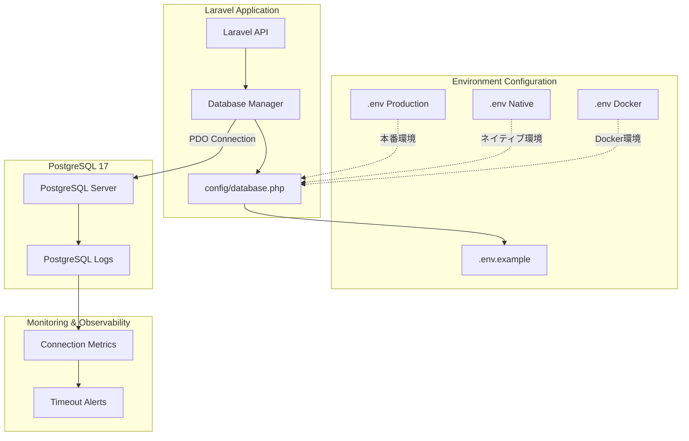
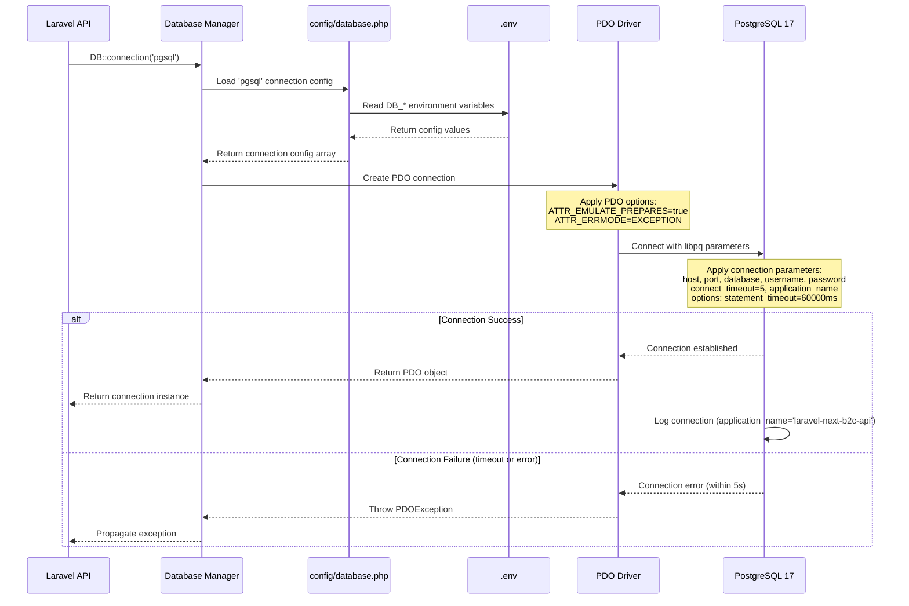
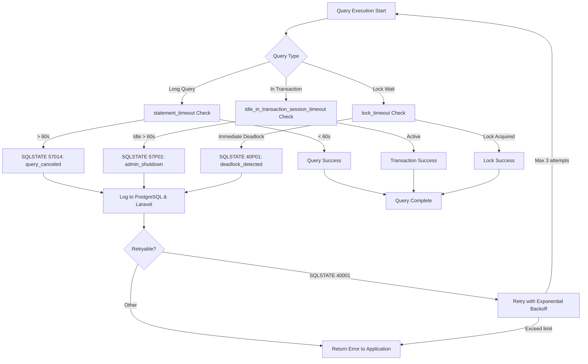
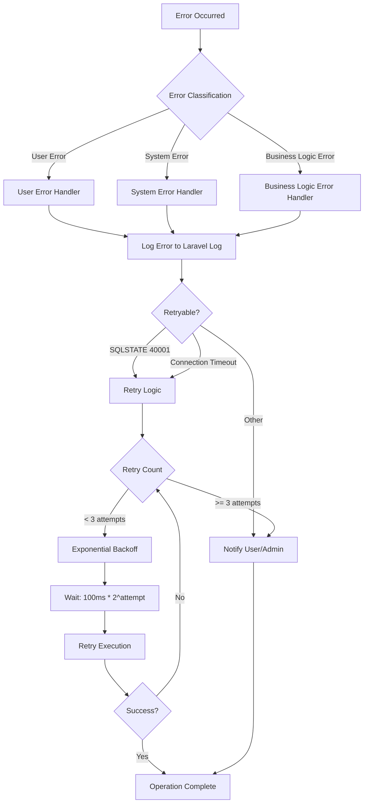

# Technical Design Document

## Overview

本機能は、Laravel 12 API専用最適化プロジェクトにおけるPostgreSQL 17接続設定の最適化を実現します。現在の設定はLaravelデフォルトの最小限の接続パラメータのみを使用しており、タイムアウト設定、PDO最適化、環境別設定分離が欠如しています。本設計により、開発・本番環境での安定したDB接続、ステートレスAPI設計に最適化された接続管理、将来的な接続プール導入の基盤を整備します。

**Purpose**: バックエンド開発者、インフラエンジニア、SRE/運用担当に対して、PostgreSQL 17との最適化された接続設定を提供し、開発・本番環境での安定したDB接続とステートレスAPI設計に最適化された接続管理を実現します。

**Users**: バックエンド開発者は、Docker/ネイティブ環境での柔軟なDB接続を利用します。インフラエンジニアは、環境別設定の明示的な分離により誤設定を防止します。SRE/運用担当は、タイムアウト設定による障害の早期検知と可観測性を確保します。

**Impact**: 既存のSQLite設定をデフォルトのまま維持し、PostgreSQL設定をコメントアウトで追加することで、後方互換性を保ちながら段階的な移行を可能にします。

### Goals

- PostgreSQL 17との最適化された接続設定の実装（タイムアウト、PDO最適化、接続追跡）
- 開発環境（Docker/ネイティブ）と本番環境での設定分離による誤設定防止
- ステートレスAPI設計に最適化された接続管理（短いトランザクション、接続プール前提設計）
- 後方互換性の維持（既存SQLite環境を破壊しない）
- 可観測性の確保（application_name、PostgreSQLログ統合、推奨監視項目）

### Non-Goals

- PgBouncerの導入（将来的なスコープ）
- 読み取り/書き込み分離設定（レプリカ構成は別Issue）
- データベーススキーマ変更・マイグレーション追加
- Laravel標準のPostgresConnectorカスタマイズ

## Architecture

### Existing Architecture Analysis

**現在のアーキテクチャパターンと制約:**
- Laravel 12のデフォルトデータベース設定構造を使用
- `config/database.php`の`connections`配列に各DB接続設定を格納
- 環境変数（`.env`）による設定値のオーバーライド
- デフォルトDB接続は`DB_CONNECTION`環境変数で制御（現在: `sqlite`）

**既存ドメイン境界の尊重:**
- データベース接続設定は`config/database.php`に集約
- 環境変数テンプレートは`.env.example`で管理
- ドキュメントは`backend/laravel-api/docs/`配下に配置

**維持すべき統合ポイント:**
- Laravel標準のDatabase Manager（`Illuminate\Database\DatabaseManager`）を使用
- PDO接続オブジェクトの取得メカニズム（`DB::connection()->getPdo()`）
- マイグレーション、テスト実行の互換性

**技術的負債の対処:**
- 既存のPostgreSQL設定は最小限のパラメータのみ（`search_path`と`sslmode`のみ）
- タイムアウト設定が欠如（長時間クエリ、放置トランザクションのリスク）
- PDO属性の最適化が未実装（サーバ側プリペアドステートメント肥大化の可能性）
- 環境別設定の明示的な分離が不足（Docker/ネイティブ/本番環境の違いが不明確）

### High-Level Architecture

本機能は、既存のLaravel 12データベース設定アーキテクチャを拡張し、PostgreSQL 17接続設定の最適化を実現します。



**Architecture Integration:**
- **Existing patterns preserved**: Laravel標準のDatabase Manager、PDO接続メカニズム、環境変数オーバーライド
- **New components rationale**: 環境別設定テンプレート（誤設定防止）、タイムアウト設定（障害早期検知）、PDO最適化（パフォーマンス向上）、可観測性設定（運用性向上）
- **Technology alignment**: Laravel 12標準設定構造、PostgreSQL 17 libpqパラメータ、PDO pgsql拡張
- **Steering compliance**: API専用最適化（ステートレス設計）、Docker Compose統合、モノレポ構成、品質管理統合

### Technology Alignment

本機能は、既存のLaravel 12 + PostgreSQL 17 + Docker Compose技術スタックに新しい設定パラメータを追加します。

**新規導入する依存関係:**
- なし（既存のPDO pgsql拡張、libpqクライアントライブラリを使用）

**既存パターンからの逸脱:**
- なし（Laravel標準の設定構造に準拠）

**Key Design Decisions:**

#### Decision 1: PostgreSQL GUC設定を`options`パラメータ経由で適用

**Context**: PostgreSQL接続時にサーバ側のタイムアウト設定（`statement_timeout`、`idle_in_transaction_session_timeout`、`lock_timeout`）を確実に適用する必要があります。

**Alternatives:**
1. **`options`パラメータ経由で適用**: libpqの`options`パラメータで`-c`オプションを使用
2. **接続後にSQLで設定**: `DB::statement('SET statement_timeout = 60000')`を実行
3. **PostgreSQL設定ファイルで全体適用**: `postgresql.conf`で全データベース共通設定

**Selected Approach**: `options`パラメータ経由で適用
```php
'options' => env('DB_PG_OPTIONS', sprintf(
    '-c statement_timeout=%d -c idle_in_transaction_session_timeout=%d -c lock_timeout=%d',
    env('DB_STATEMENT_TIMEOUT', 60000),
    env('DB_IDLE_TX_TIMEOUT', 60000),
    env('DB_LOCK_TIMEOUT', 0)
)),
```

**Rationale:**
- 接続確立時に自動適用され、確実性が高い
- 環境変数で柔軟に調整可能
- アプリケーション固有の設定をPostgreSQL全体設定と分離

**Trade-offs:**
- **Gain**: 接続ごとの設定、環境変数による動的調整、PostgreSQL全体設定との分離
- **Sacrifice**: 接続文字列がやや冗長、libpq固有の構文に依存

#### Decision 2: PDO::ATTR_EMULATE_PREPARES=true を推奨設定

**Context**: PostgreSQLのサーバ側プリペアドステートメントは、多様なクエリパターンで肥大化し、パフォーマンス低下やメモリ不足のリスクがあります。

**Alternatives:**
1. **Emulate Prepares = true**: クライアント側でパラメータバインド
2. **Emulate Prepares = false**: サーバ側プリペアドステートメント使用
3. **環境別設定**: 開発環境ではfalse、本番環境ではtrue

**Selected Approach**: Emulate Prepares = true（デフォルト推奨）
```php
'pdo_options' => extension_loaded('pdo_pgsql') ? array_filter([
    PDO::ATTR_EMULATE_PREPARES => env('DB_EMULATE_PREPARES', true),
    PDO::ATTR_ERRMODE => PDO::ERRMODE_EXCEPTION,
]) : [],
```

**Rationale:**
- サーバ側プリペアドステートメント肥大化を回避
- Laravel APIの多様なクエリパターンに適合
- 環境変数で調整可能（特定ケースでfalseに変更可）

**Trade-offs:**
- **Gain**: サーバ側メモリ使用量削減、パフォーマンス安定性、PostgreSQLメンテナンス容易性
- **Sacrifice**: クライアント側でのバインド処理オーバーヘッド（微小）、SQLインジェクション対策の責任がPDOに集中

#### Decision 3: 環境別設定を.env.exampleでコメント付きテンプレート化

**Context**: Docker環境、ネイティブ環境、本番環境で異なる接続設定（ホスト名、ポート、SSL設定）が必要であり、誤設定によるトラブルを防止する必要があります。

**Alternatives:**
1. **コメント付きテンプレート化**: `.env.example`に3環境の設定例を詳細コメントで記載
2. **別ファイル分離**: `.env.docker.example`、`.env.native.example`、`.env.production.example`を作成
3. **ドキュメントのみ**: READMEやdocsに設定例を記載、`.env.example`は簡素化

**Selected Approach**: コメント付きテンプレート化
```env
# --- PostgreSQL Configuration (Docker環境用) ---
# Docker Compose使用時はコメント解除して以下を設定
# DB_CONNECTION=pgsql
# DB_HOST=pgsql                    # Docker内: service名
# DB_PORT=5432                     # Docker内: 5432
# DB_SSLMODE=disable               # ローカル環境はSSL不要
```

**Rationale:**
- 単一ファイルで全環境の設定例を一覧可能
- コメント解除と値変更のみで簡単に切り替え可能
- 開発者がファイル間を行き来する手間を削減

**Trade-offs:**
- **Gain**: 設定変更の容易性、誤設定リスク低減、開発者体験向上
- **Sacrifice**: `.env.example`ファイルの行数増加（約30行追加）、複数環境の設定が混在

## System Flows

### PostgreSQL接続確立フロー



### タイムアウト発火フロー



## Requirements Traceability

| Requirement | Requirement Summary | Components | Interfaces | Flows |
|-------------|---------------------|------------|------------|-------|
| 1.1-1.6 | PostgreSQL接続設定の最適化 | `config/database.php` (pgsql接続設定) | Laravel Database Manager API | 接続確立フロー |
| 2.1-2.6 | 環境別設定の分離 | `.env.example` (環境別テンプレート) | 環境変数読み込み | 接続確立フロー |
| 3.1-3.4 | 後方互換性の維持 | `.env.example` (SQLiteデフォルト維持) | 既存Database Manager API | - |
| 4.1-4.6 | Docker環境での接続検証 | Docker Compose PostgreSQL service | PDO::getPdo(), DB::select() | 接続確立フロー |
| 5.1-5.4 | ネイティブ環境での接続検証 | ホストからコンテナ接続設定 | Artisan commands, Test runner | 接続確立フロー |
| 6.1-6.5 | タイムアウト動作の検証 | PostgreSQL GUC設定 (options) | PostgreSQL session parameters | タイムアウト発火フロー |
| 7.1-7.6 | ドキュメント整備 | `docs/database-connection.md`, README.md | - | - |
| 8.1-8.4 | CI/CD環境での動作確認 | GitHub Actions workflow | GitHub Actions test commands | 接続確立フロー |
| 9.1-9.6 | ステートレスAPI設計のベストプラクティス | トランザクション管理、リトライ戦略 | Laravel Transaction API | タイムアウト発火フロー |
| 10.1-10.5 | 可観測性とモニタリング対応 | `application_name`設定、PostgreSQLログ統合 | PostgreSQL logging interface | 接続確立フロー |

## Components and Interfaces

### Configuration Layer

#### Database Configuration Component

**Responsibility & Boundaries:**
- **Primary Responsibility**: PostgreSQL 17接続設定の定義と環境変数からの動的読み込み
- **Domain Boundary**: データベース接続設定管理
- **Data Ownership**: `pgsql`接続設定配列（host, port, database, username, password, charset, search_path, sslmode, connect_timeout, application_name, options, pdo_options）
- **Transaction Boundary**: なし（設定読み込みのみ）

**Dependencies:**
- **Inbound**: Laravel Database Manager（接続設定の取得）
- **Outbound**: 環境変数（`.env`ファイル経由）
- **External**: なし

**Contract Definition:**

**Configuration Array Structure:**
```php
// config/database.php 'connections.pgsql' array structure
[
    'driver' => 'pgsql',
    'url' => string|null,
    'host' => string,                    // env('DB_HOST', '127.0.0.1')
    'port' => string|int,                // env('DB_PORT', '5432')
    'database' => string,                // env('DB_DATABASE', 'laravel')
    'username' => string,                // env('DB_USERNAME', 'sail')
    'password' => string,                // env('DB_PASSWORD', 'secret')
    'charset' => string,                 // env('DB_CHARSET', 'utf8')
    'prefix' => string,                  // ''
    'prefix_indexes' => bool,            // true
    'search_path' => string,             // env('DB_SCHEMA', 'public')
    'sslmode' => string,                 // env('DB_SSLMODE', 'prefer')
    'connect_timeout' => int,            // env('DB_CONNECT_TIMEOUT', 5)
    'application_name' => string,        // env('DB_APP_NAME', 'laravel-next-b2c-api')
    'options' => string,                 // sprintf('-c statement_timeout=%d ...', ...)
    'pdo_options' => array<int, mixed>,  // [PDO::ATTR_EMULATE_PREPARES => true, ...]
]
```

**Preconditions:**
- 環境変数ファイル（`.env`）が存在する
- `pdo_pgsql`拡張が有効である（`pdo_options`の場合）

**Postconditions:**
- Laravel Database Managerが`pgsql`接続を確立可能な設定配列を取得できる
- 環境変数が未定義の場合、適切なデフォルト値が適用される

**Invariants:**
- `driver`は常に`'pgsql'`である
- `host`と`port`は有効なネットワークアドレスである
- `connect_timeout`は正の整数である（秒単位）

#### Environment Configuration Template

**Responsibility & Boundaries:**
- **Primary Responsibility**: 環境別PostgreSQL接続設定のテンプレート提供
- **Domain Boundary**: 環境設定管理
- **Data Ownership**: `.env.example`ファイル内のPostgreSQL設定セクション
- **Transaction Boundary**: なし（テンプレートファイル）

**Dependencies:**
- **Inbound**: 開発者、インフラエンジニア（`.env`ファイル作成時）
- **Outbound**: なし
- **External**: なし

**Contract Definition:**

**Environment Variable Sections:**
| Section | Variables | Purpose |
|---------|-----------|---------|
| Database Configuration | `DB_CONNECTION`, `DB_HOST`, `DB_PORT`, `DB_DATABASE`, `DB_USERNAME`, `DB_PASSWORD` | 基本接続情報 |
| PostgreSQL Configuration | `DB_SCHEMA`, `DB_SSLMODE`, `DB_APP_NAME` | PostgreSQL固有設定 |
| PostgreSQL Timeout Configuration | `DB_STATEMENT_TIMEOUT`, `DB_IDLE_TX_TIMEOUT`, `DB_LOCK_TIMEOUT`, `DB_CONNECT_TIMEOUT` | タイムアウト設定 |
| PostgreSQL PDO Configuration | `DB_EMULATE_PREPARES` | PDO最適化設定 |
| PostgreSQL Production Configuration | `DB_SSLROOTCERT`, `DB_SSLCERT`, `DB_SSLKEY` | 本番環境SSL設定 |

**環境別推奨値:**

| Variable | Docker環境 | ネイティブ環境 | 本番環境 |
|----------|-----------|--------------|---------|
| `DB_HOST` | `pgsql` (service名) | `127.0.0.1` | `<マネージドDB エンドポイント>` |
| `DB_PORT` | `5432` | `13432` (公開ポート) | `5432` |
| `DB_SSLMODE` | `disable` | `prefer` | `verify-full` |
| `DB_STATEMENT_TIMEOUT` | `60000` | `60000` | `30000` (より厳格) |

### Connection Management Layer

#### PDO Connection Handler

**Responsibility & Boundaries:**
- **Primary Responsibility**: PostgreSQL 17への PDO接続の確立とPDO属性の適用
- **Domain Boundary**: PDO接続管理
- **Data Ownership**: PDOオブジェクトのライフサイクル
- **Transaction Boundary**: 接続レベル（トランザクションは上位レイヤーで管理）

**Dependencies:**
- **Inbound**: Laravel Database Manager
- **Outbound**: PostgreSQL 17サーバー（libpq経由）
- **External**: PHP PDO pgsql拡張、libpqクライアントライブラリ

**External Dependencies Investigation:**

**PHP PDO pgsql Extension**:
- **Official Documentation**: [PHP PDO PostgreSQL Driver](https://www.php.net/manual/en/ref.pdo-pgsql.php)
- **API Signature**: `new PDO($dsn, $username, $password, $options)`
- **PDO Attributes**:
  - `PDO::ATTR_EMULATE_PREPARES`: クライアント側プリペアドステートメントのエミュレート
  - `PDO::ATTR_ERRMODE`: エラーモード（`PDO::ERRMODE_EXCEPTION`推奨）
- **Version Compatibility**: PHP 8.4（プロジェクト要件）、PDO pgsql拡張は標準同梱
- **Known Issues**: サーバ側プリペアドステートメント肥大化（`EMULATE_PREPARES=false`時）

**libpq Connection Parameters**:
- **Official Documentation**: [PostgreSQL libpq Connection Parameters](https://www.postgresql.org/docs/17/libpq-connect.html#LIBPQ-PARAMKEYWORDS)
- **Connection String Format**: `host=<host> port=<port> dbname=<database> user=<username> password=<password> connect_timeout=<seconds> application_name=<name> options='<GUC settings>'`
- **Timeout Parameters**:
  - `connect_timeout`: 接続確立タイムアウト（秒単位）
  - `options`: PostgreSQL GUC設定（`-c parameter=value`形式）
- **SSL Parameters**: `sslmode`, `sslrootcert`, `sslcert`, `sslkey`
- **Version Compatibility**: PostgreSQL 17-alpine（プロジェクト要件）

**PostgreSQL GUC Parameters**:
- **Official Documentation**: [PostgreSQL Runtime Configuration](https://www.postgresql.org/docs/17/runtime-config-client.html)
- **statement_timeout**: クエリ実行タイムアウト（ミリ秒単位）
- **idle_in_transaction_session_timeout**: アイドルトランザクションタイムアウト（ミリ秒単位）
- **lock_timeout**: ロック待機タイムアウト（ミリ秒単位、0=無制限）
- **Application During Implementation**: GUC設定の動的変更可能性、セッションレベル設定の優先順位

**Contract Definition:**

**Service Interface:**
```php
// Laravel Database Manager による接続取得
interface ConnectionInterface {
    // PDO接続オブジェクトの取得
    public function getPdo(): PDO;

    // 接続テスト
    public function select(string $query, array $bindings = []): array;
}
```

**Preconditions:**
- PostgreSQL 17サーバーが起動している
- ネットワーク疎通が可能である
- 認証情報が正しい

**Postconditions:**
- PDO接続オブジェクトが取得される
- PDO属性（`ATTR_EMULATE_PREPARES`、`ATTR_ERRMODE`）が適用される
- PostgreSQLログに`application_name='laravel-next-b2c-api'`で接続が記録される
- GUC設定（`statement_timeout`等）がセッションレベルで適用される

**Invariants:**
- 接続は常にステートレスである（持続接続を使用しない）
- 接続エラーは`PDOException`として通知される

**State Management:**
- **State Model**: 接続なし → 接続中 → 接続確立 / 接続失敗
- **Persistence**: なし（接続プール前提設計、PHP側の持続接続は使用しない）
- **Concurrency**: Laravel Database Managerによる接続プール管理（将来的にPgBouncerで外部管理）

**Integration Strategy:**
- **Modification Approach**: 既存の`config/database.php`の`pgsql`接続設定を拡張（新しいパラメータを追加）
- **Backward Compatibility**: デフォルト値により既存設定との互換性を維持
- **Migration Path**: `.env.example`にPostgreSQL設定を追加、既存SQLite設定はそのまま維持

## Data Models

本機能はデータベース接続設定の最適化であり、アプリケーションデータモデルの変更は含まれません。設定データの構造のみを定義します。

### Configuration Data Model

**PostgreSQL Connection Configuration:**
```typescript
interface PostgreSQLConnectionConfig {
    driver: 'pgsql';
    url: string | null;
    host: string;                    // Default: '127.0.0.1'
    port: number;                    // Default: 5432
    database: string;                // Default: 'laravel'
    username: string;                // Default: 'sail'
    password: string;                // Default: 'secret'
    charset: string;                 // Default: 'utf8'
    prefix: string;                  // Default: ''
    prefix_indexes: boolean;         // Default: true
    search_path: string;             // Default: 'public'
    sslmode: 'disable' | 'allow' | 'prefer' | 'require' | 'verify-ca' | 'verify-full';
    connect_timeout: number;         // Default: 5 (seconds)
    application_name: string;        // Default: 'laravel-next-b2c-api'
    options: string;                 // GUC settings string
    pdo_options: PDOOptions;
}

interface PDOOptions {
    [PDO::ATTR_EMULATE_PREPARES]: boolean;  // Default: true
    [PDO::ATTR_ERRMODE]: PDO::ERRMODE_EXCEPTION;
}

interface GUCSettings {
    statement_timeout: number;       // Default: 60000 (ms)
    idle_in_transaction_session_timeout: number;  // Default: 60000 (ms)
    lock_timeout: number;            // Default: 0 (no limit)
}
```

**Environment-Specific Configuration Templates:**
```typescript
interface EnvironmentConfig {
    docker: {
        DB_HOST: 'pgsql';            // Docker service name
        DB_PORT: 5432;               // Internal port
        DB_SSLMODE: 'disable';       // Local environment
    };
    native: {
        DB_HOST: '127.0.0.1';        // Host machine
        DB_PORT: 13432;              // Published port
        DB_SSLMODE: 'prefer';        // SSL preferred
    };
    production: {
        DB_HOST: string;             // Managed DB endpoint
        DB_PORT: 5432;               // Default port
        DB_SSLMODE: 'verify-full';   // SSL required
        DB_SSLROOTCERT: string;      // CA certificate path
        DB_SSLCERT?: string;         // Client certificate path
        DB_SSLKEY?: string;          // Client key path
    };
}
```

## Error Handling

### Error Strategy

PostgreSQL接続設定最適化における具体的なエラー処理パターンと復旧メカニズムを定義します。

**Error Categories and Responses:**

**User Errors (設定エラー):**
- **Invalid Host/Port**: 接続先ホスト名またはポート番号が不正 → `.env.example`の設定例を参照、Docker/ネイティブ環境の違いを確認
- **Invalid Credentials**: ユーザー名またはパスワードが不正 → PostgreSQL認証設定を確認、環境変数の値を検証
- **SSL Certificate Error**: SSL証明書が見つからない、または検証失敗 → 証明書パスを確認、`sslmode`設定を調整（`verify-full` → `require`）

**System Errors (インフラエラー):**
- **Connection Timeout**: 接続タイムアウト（5秒以内に接続確立できない） → ネットワーク疎通を確認、PostgreSQLサーバーの起動状態を確認、Docker Composeヘルスチェックを確認
- **PostgreSQL Server Down**: PostgreSQLサーバーが起動していない → `docker compose ps`でサービス状態確認、`docker compose up -d pgsql`で起動
- **PDO Extension Missing**: `pdo_pgsql`拡張が有効でない → PHPの`pdo_pgsql`拡張を有効化、Dockerイメージのビルド確認

**Business Logic Errors (クエリエラー):**
- **Statement Timeout (SQLSTATE 57014)**: クエリ実行が60秒を超過 → クエリの最適化、インデックスの追加、`DB_STATEMENT_TIMEOUT`環境変数で調整
- **Idle Transaction Timeout (SQLSTATE 57P01)**: トランザクションが60秒以上アイドル → トランザクション範囲の見直し、外部API呼び出しをトランザクション外に移動
- **Deadlock Detected (SQLSTATE 40P01)**: デッドロック検知（`lock_timeout=0`） → トランザクションのロック順序を統一、楽観的ロックの検討
- **Serialization Failure (SQLSTATE 40001)**: 直列化失敗 → 最大3回までエクスポネンシャルバックオフでリトライ

**Error Handling Process Flow:**



### Monitoring

**Error Tracking:**
- Laravel標準のログ機能を使用（`storage/logs/laravel.log`）
- PostgreSQLログへの`application_name='laravel-next-b2c-api'`による接続元記録
- タイムアウトエラー（SQLSTATE 57014, 57P01）の専用ログ

**Logging Strategy:**
```php
// Connection Error Logging
Log::error('PostgreSQL connection failed', [
    'host' => config('database.connections.pgsql.host'),
    'port' => config('database.connections.pgsql.port'),
    'database' => config('database.connections.pgsql.database'),
    'error_code' => $exception->getCode(),
    'error_message' => $exception->getMessage(),
]);

// Timeout Error Logging
Log::warning('PostgreSQL statement timeout', [
    'query' => $query,
    'duration_ms' => $duration,
    'timeout_ms' => config('database.connections.pgsql.statement_timeout'),
    'sqlstate' => '57014',
]);
```

**Health Monitoring:**
- Docker Composeヘルスチェック機能によるPostgreSQLサービス状態監視
- `pg_isready`コマンドによる接続受付状態確認
- GitHub Actions CI/CDによるテスト実行時の接続確認

**推奨監視項目:**
- PostgreSQL接続数（`pg_stat_activity`）
- `statement_timeout`超過回数（PostgreSQLログ）
- アイドルトランザクション数（`pg_stat_activity`でstate='idle in transaction'）
- 接続失敗率（Laravelログ）
- 平均接続時間（`connect_timeout`との比較）

## Testing Strategy

### Unit Tests

**Configuration Loading Tests:**
1. `config/database.php`の`pgsql`接続設定が正しく読み込まれる
2. 環境変数のデフォルト値フォールバックが正常に動作する
3. `options`文字列が正しいGUC設定形式で生成される
4. `pdo_options`配列が`pdo_pgsql`拡張の有効状態に応じて構築される
5. 環境変数が未定義の場合、全ての設定項目が適切なデフォルト値を持つ

### Integration Tests

**Connection Establishment Tests:**
1. Docker環境（`DB_HOST=pgsql`, `DB_PORT=5432`）でPostgreSQL接続が確立される
2. ネイティブ環境（`DB_HOST=127.0.0.1`, `DB_PORT=13432`）でPostgreSQL接続が確立される
3. `DB::connection()->getPdo()`がPDOオブジェクトを返す
4. `DB::select('SELECT version()')`がPostgreSQL 17のバージョン情報を返す
5. `DB::select('SHOW statement_timeout')`が`60000ms`を返す

**Timeout Behavior Tests:**
1. 60秒を超える長時間クエリで`SQLSTATE 57014`エラーが発生する
2. 60秒以上アイドルなトランザクションで`SQLSTATE 57P01`エラーが発生する
3. 接続タイムアウト（5秒）で接続エラーが検知される

**Migration and Seeding Tests:**
1. `php artisan migrate:fresh --seed`がPostgreSQL接続で正常に完了する
2. `php artisan migrate:status`が正しいマイグレーション状態を表示する

### E2E Tests

**Development Workflow Tests:**
1. `.env.example`から`.env`をコピーし、PostgreSQL設定をコメント解除して動作する
2. Docker環境とネイティブ環境で切り替えて動作する
3. `php artisan test`全テストが正常に実行される

**CI/CD Integration Tests:**
1. GitHub Actionsテストワークフローが正常に実行される
2. E2Eテスト環境でPostgreSQL接続が正常動作する
3. マイグレーション実行が成功する

### Performance Tests

**Connection Performance Tests:**
1. 接続確立時間が5秒以内である（Docker環境、ネイティブ環境）
2. 5回連続のクエリ実行時間が各50ms以内である
3. PDO属性（`ATTR_EMULATE_PREPARES=true`）が適用されている状態でのクエリ実行が正常である

## Security Considerations

**Authentication and Authorization:**
- PostgreSQL認証情報（`DB_USERNAME`、`DB_PASSWORD`）は環境変数で管理され、`.env`ファイルは`.gitignore`に含まれる
- 本番環境ではマネージドデータベースサービスの認証機構を使用

**Data Protection:**
- 本番環境ではSSL/TLS接続を必須化（`DB_SSLMODE=verify-full`）
- SSL証明書（`DB_SSLROOTCERT`、`DB_SSLCERT`、`DB_SSLKEY`）の設定をサポート
- 開発環境ではSSLを無効化可能（`DB_SSLMODE=disable`）

**Threat Modeling:**
- **Threat**: 接続情報の漏洩 → **Mitigation**: 環境変数での管理、`.env`ファイルのgitignore
- **Threat**: 中間者攻撃（本番環境） → **Mitigation**: SSL/TLS接続の必須化、証明書検証
- **Threat**: 長時間クエリによるリソース枯渇 → **Mitigation**: `statement_timeout`による制限
- **Threat**: 放置トランザクションによるロック → **Mitigation**: `idle_in_transaction_session_timeout`による制限

## Documentation Strategy

### Technical Documentation

**database-connection.md:**
- Docker環境、ネイティブ環境、本番環境での接続方法
- 各環境変数の説明、設定値の根拠、推奨設定
- トラブルシューティング手順（接続失敗、タイムアウトエラー、SSL証明書エラー等）
- パフォーマンステスト手順（接続時間計測、クエリ実行時間計測）

**README.md:**
- PostgreSQL接続設定セクションの追加
- `backend/laravel-api/docs/database-connection.md`へのリンク
- クイックスタートガイド（`.env`設定の手順）

**.env.example:**
- 各設定項目の詳細なインラインコメント
- 環境別設定例（Docker/ネイティブ/本番）
- タイムアウト設定の説明

### User Documentation

**For Developers:**
- `.env.example`から`.env`をコピーして設定する手順
- Docker環境とネイティブ環境の切り替え方法
- PostgreSQL接続のトラブルシューティング

**For Infrastructure Engineers:**
- 本番環境でのSSL設定手順
- マネージドデータベースサービスとの連携設定
- タイムアウト設定の調整ガイドライン

**For SRE/Operations:**
- 推奨監視項目の説明
- PostgreSQLログの確認方法
- 障害発生時の対応手順
