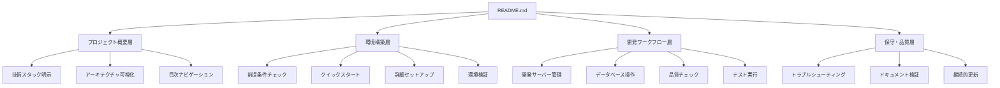
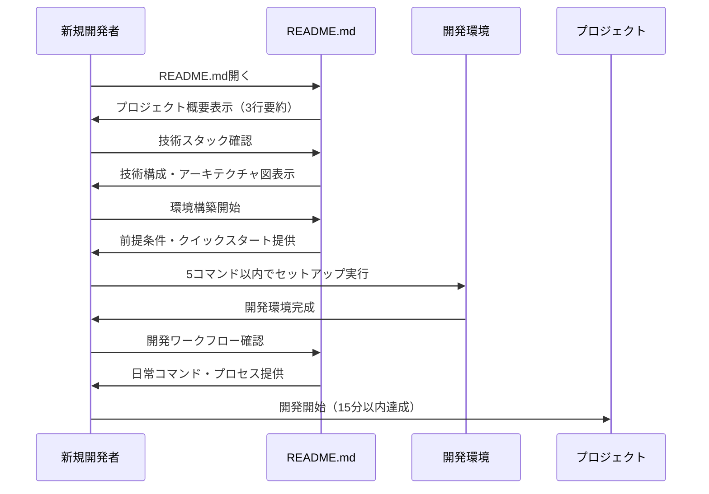
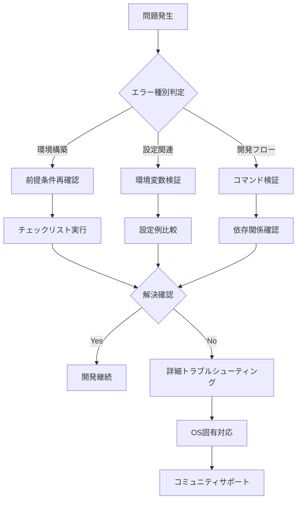

# 技術設計書

## 概要

この機能は、新規開発者の15分以内オンボーディングを実現する包括的なREADME.mdドキュメントシステムを提供する。Laravel 12 + Next.js 15モノレポ構成において、プロジェクト理解から実際の開発開始まで段階的に導く情報アーキテクチャを構築する。

**目的**: 新規参加者の迅速なプロジェクト参画を可能にする構造化ドキュメント基盤の確立
**対象ユーザー**: 新規開発者、既存チームメンバー、プロジェクトメンテナー
**影響**: 現在の最小限README.mdを、実用的で保守可能な包括的ドキュメントシステムに変革する

### 目標
- 15分以内での完全な開発環境構築実現
- モノレポ全体の理解促進とナビゲーション向上
- 開発ワークフローの標準化と効率向上
- ドキュメント品質の継続的維持

### 非ゴール
- 各サブプロジェクトの詳細仕様書作成
- API仕様書やOpenAPI定義生成
- 自動化スクリプトの新規実装
- 既存の開発プロセス変更

## アーキテクチャ

### 既存アーキテクチャ分析
現在のREADME.mdは基本的なプロジェクト名のみで実用情報が不足している。モノレポ構成の複雑性に対応する情報整理が必要：
- **現在の状態**: プロジェクト名のみの最小限構成
- **技術的制約**: GitHub Flavored Markdownの制限内での実装
- **保持すべき原則**: プロジェクト構造の3層分離（backend/frontend/設定）

### 高レベルアーキテクチャ



### 技術アライメント

**既存技術スタックとの整合性**:
- GitHub Flavored Markdown: 標準的なドキュメント記述
- Mermaid.js: アーキテクチャ図の埋め込み表示
- 既存ツールチェーン: Makefile/Taskfile統合コマンド活用
- CI/CD基盤: 将来的なドキュメント検証自動化対応

**主要設計決定**:

**決定**: 情報階層による段階的導線設計
**コンテキスト**: 新規開発者の認知負荷を最小化しながら必要情報を段階的に提供する必要性
**代替案**: 単一ページ全情報表示、複数ファイル分割、外部wiki連携
**選択アプローチ**: 折りたたみ可能セクションと目次による単一ファイル階層化
**根拠**: GitHubの標準表示環境での最適なナビゲーション体験と保守性の両立
**トレードオフ**: 情報密度向上 vs. 初見時の圧迫感

**決定**: コマンド実行可能性の完全保証
**コンテキスト**: ドキュメント内の全コマンドが検証済みで実行可能である必要性
**代替案**: 概念的説明中心、リンク参照方式、動的生成
**選択アプローチ**: コピー＆ペースト可能な検証済みコマンド列記
**根拠**: 開発者の信頼性確保と15分以内セットアップ達成
**トレードオフ**: 保守負荷増大 vs. 実用性と信頼性確保

## システムフロー

### ドキュメント利用フロー



## 要件トレーサビリティ

| 要件 | 要件概要 | 実現コンポーネント | 実装方法 |
|------|---------|----------------|----------|
| 1.1 | 3行以内プロジェクト概要 | プロジェクト概要層 | README冒頭の構造化概要セクション |
| 1.2 | 技術スタック明示 | 技術スタック明示 | バッジ付き技術一覧表 |
| 1.3 | アーキテクチャ理解 | アーキテクチャ可視化 | Mermaid.jsシステム連携図 |
| 2.1 | 前提条件明記 | 前提条件チェック | 必要ソフトウェア・バージョン表 |
| 2.2 | 5コマンド以内セットアップ | クイックスタート | 統合コマンド手順 |
| 3.1-3.5 | 開発ワークフロー標準化 | 開発ワークフロー層 | 統一コマンド・プロセス文書化 |
| 4.1-4.4 | 環境設定管理 | 詳細セットアップ | .env設定・ポート管理ガイド |
| 5.1-5.5 | トラブルシューティング | トラブルシューティング | 問題解決ナレッジベース |
| 6.1-6.5 | ドキュメント品質保証 | ドキュメント検証 | 検証プロセス・CI/CD統合 |
| 7.1-7.4 | 視覚的理解促進 | 全コンポーネント | 図表・バッジ・構造化表示 |

## コンポーネントとインターフェース

### ドキュメント情報アーキテクチャ

#### プロジェクト概要層

**主要責任**
- プロジェクトの第一印象形成と価値提案の明確化
- 技術構成の即座理解促進
- 全体ナビゲーション基盤提供

**依存関係**
- **内向き**: なし（エントリーポイント）
- **外向き**: 環境構築層、開発ワークフロー層
- **外部**: GitHub バッジAPI、CI/CDステータス

**コンテンツ契約**
```typescript
interface ProjectOverviewSection {
  title: string;              // プロジェクト名
  description: string;        // 3行以内の概要
  valueProposition: string[]; // 主要価値提案リスト
  techStack: TechStackBadge[]; // 技術スタックバッジ
  tableOfContents: TOCItem[]; // 目次項目
  architectureDiagram: MermaidDiagram; // システム連携図
}
```

#### 環境構築層

**主要責任**
- 15分以内でのローカル開発環境完全構築
- Docker・ネイティブ両環境への対応
- 環境検証と問題早期発見

**依存関係**
- **内向き**: プロジェクト概要層からの導線
- **外向き**: 開発ワークフロー層、保守・品質層
- **外部**: Docker Hub、npm registry、Composer

**セットアップ契約**
```typescript
interface EnvironmentSetupSection {
  prerequisites: Prerequisite[]; // 前提条件
  quickStart: QuickStartCommand[]; // 5コマンド以内
  detailedSetup: {
    docker: DockerSetupSteps[];
    native: NativeSetupSteps[];
  };
  verification: VerificationStep[]; // 環境検証
  accessUrls: ServiceUrl[];       // サービスアクセス先
}
```

#### 開発ワークフロー層

**主要責任**
- 日常開発作業の標準化とコマンド統一
- 品質保証プロセスの明文化
- チーム間の一貫した開発体験提供

**依存関係**
- **内向き**: 環境構築層から の連携
- **外向き**: 保守・品質層
- **外部**: Makefile/Taskfile、テストフレームワーク

**ワークフロー契約**
```typescript
interface DevelopmentWorkflowSection {
  serverManagement: ServerCommand[]; // 開発サーバー管理
  databaseOps: DatabaseCommand[];   // DB操作
  qualityChecks: QualityCommand[];  // 品質チェック
  testExecution: TestCommand[];     // テスト実行
  unifiedCommands: UnifiedCommand[]; // 統合コマンド
}
```

#### 保守・品質層

**主要責任**
- ドキュメント品質の継続的維持
- 問題解決ナレッジの体系化
- 自動化可能な検証プロセス実装

**依存関係**
- **内向き**: 全層からの品質要求
- **外向き**: なし（終端層）
- **外部**: CI/CDシステム、リンクチェッカー

**品質保証契約**
```typescript
interface QualityAssuranceSection {
  troubleshooting: TroubleshootEntry[]; // 問題解決KB
  validation: ValidationProcess[];      // 検証プロセス
  maintenance: MaintenanceTask[];       // 保守タスク
  automation: AutomationRule[];         // 自動化ルール
}
```

## データモデル

### ドキュメント構造モデル

```typescript
interface ReadmeDocument {
  metadata: DocumentMetadata;
  sections: DocumentSection[];
  navigation: NavigationStructure;
  validation: ValidationRules;
}

interface DocumentMetadata {
  title: string;
  lastUpdated: Date;
  version: string;
  maintainers: string[];
}

interface DocumentSection {
  id: string;
  title: string;
  level: number; // 見出しレベル 1-4
  content: SectionContent;
  subsections: DocumentSection[];
  collapsible: boolean;
}

interface SectionContent {
  type: 'text' | 'code' | 'table' | 'diagram' | 'list';
  data: string | CodeBlock | Table | MermaidDiagram | ListItem[];
  validation: ContentValidation;
}

interface CodeBlock {
  language: string;
  code: string;
  executable: boolean;
  verified: boolean;
  lastVerified: Date;
}
```

### 情報整理パターン

**階層型情報構造**:
- レベル1: 主要機能領域（概要、環境構築、開発、保守）
- レベル2: 機能サブカテゴリ（Docker環境、ネイティブ環境等）
- レベル3: 具体的手順（コマンド、設定、検証）
- レベル4: 詳細説明・注意事項

**コンテンツタイプ分類**:
- **概念説明**: プロジェクト理解のための説明文
- **手順書**: ステップバイステップの実行指示
- **参照情報**: 設定値、URL、環境変数等
- **視覚補助**: 図表、バッジ、構造表示

## エラーハンドリング

### エラー戦略
ドキュメント利用時の問題を予防的に解決し、自己解決を促進する包括的サポート体制。

### エラーカテゴリと対応

**環境構築エラー** (セットアップ段階): 前提条件不足 → チェックリスト提供; ポート競合 → 代替ポート案内; 権限エラー → OS別権限設定ガイド
**設定エラー** (環境変数段階): .env設定ミス → 設定例とチェックポイント; ポート競合 → 競合検出と解決手順; サービス起動失敗 → 段階的デバッグガイド
**開発フローエラー** (日常作業): コマンド実行失敗 → 依存関係確認手順; テスト失敗 → ログ確認と修正ガイド; ビルドエラー → 一般的原因と対策

### 問題解決フロー



### 監視
- ドキュメント内リンクの自動検証
- コマンド実行可能性の定期チェック
- 技術スタックバージョン整合性監視

## テスト戦略

### ドキュメント品質検証
- **コンテンツ検証**: 記載コマンドの実行可能性テスト（新規環境での全手順実行）
- **構造検証**: Markdownリントと構造整合性チェック
- **リンク検証**: 内部・外部リンクの有効性確認

### 利用者体験テスト
- **新規開発者テスト**: 実際の新規メンバーによる15分セットアップ挑戦
- **クロスプラットフォーム**: macOS、Windows、Linux環境での手順検証
- **バージョン整合性**: 記載バージョンと実際の依存関係の一致確認

### 保守性テスト
- **更新影響範囲**: 技術スタック更新時のドキュメント影響範囲特定
- **自動化検証**: CI/CDパイプラインでの継続的品質チェック
- **アクセシビリティ**: スクリーンリーダー対応と可読性評価

## セキュリティ考慮事項

### 情報セキュリティ
- **機密情報除外**: API キー、パスワード、内部URL等の機密情報掲載防止
- **環境変数管理**: .env.example活用による安全な設定例提供
- **アクセス制御**: パブリックリポジトリでの適切な情報公開レベル維持

### 脆弱性対策
- **依存関係リスク**: 外部リンクの安全性確認と定期更新
- **実行コマンド**: 記載コマンドの安全性検証と権限最小化
- **設定セキュリティ**: 開発環境設定のセキュリティベストプラクティス適用