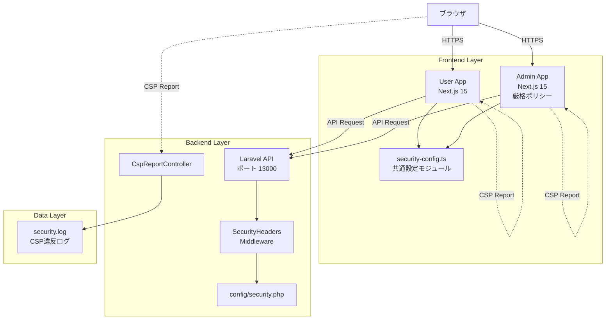
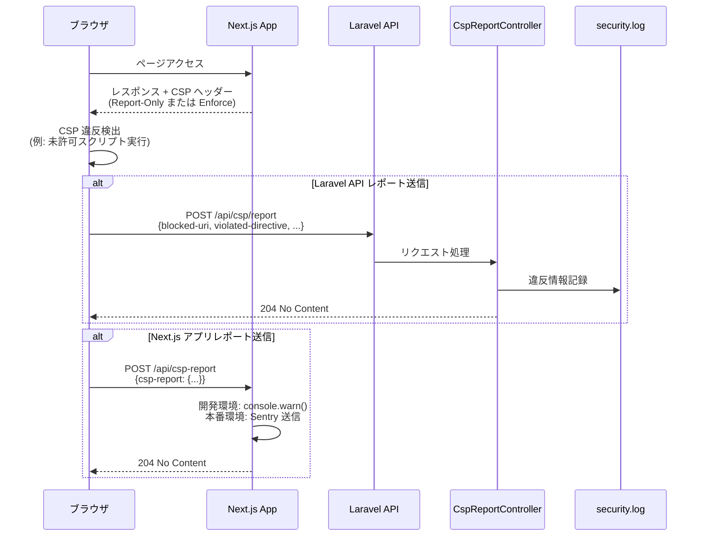
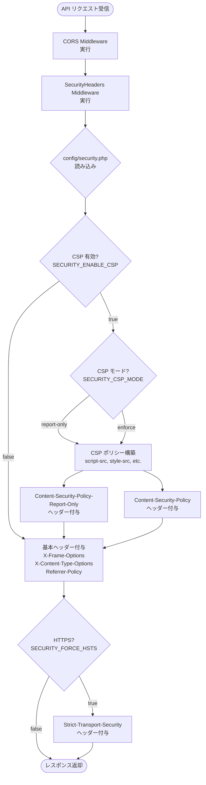
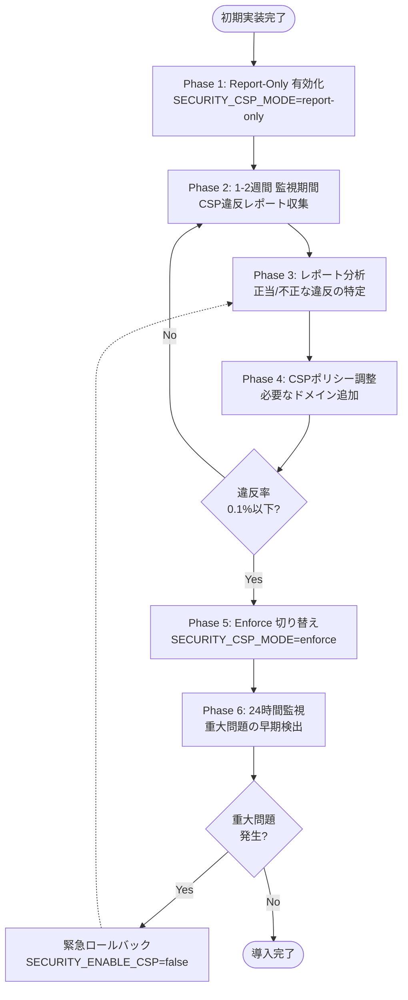

# 技術設計ドキュメント: セキュリティヘッダー設定

## Overview

本機能は、Laravel 12 + Next.js 15 モノレポアプリケーションに OWASP 準拠の包括的なセキュリティヘッダーを実装する。XSS、CSRF、クリックジャッキング、MIME タイプスニッフィングなどの攻撃からアプリケーションを保護し、段階的導入戦略（Report-Only → Enforce）により既存機能への影響を最小化する。

**Purpose**: OWASP セキュリティベストプラクティスに準拠したセキュリティヘッダー実装により、アプリケーションの信頼性とセキュリティを向上させる。

**Users**: エンドユーザー（User App）、管理者（Admin App）、API クライアントが、セキュアな環境でアプリケーションを利用できる。

**Impact**: 既存の Laravel API と Next.js アプリケーションに対して、セキュリティヘッダーミドルウェアと設定を追加する。CORS 設定との統合により、既存の通信を保護しながら、新たなセキュリティレイヤーを導入する。

### Goals
- OWASP 推奨セキュリティヘッダーの完全実装（X-Frame-Options, CSP, HSTS, Referrer-Policy, Permissions-Policy）
- 環境変数駆動による柔軟なセキュリティポリシー設定（開発/本番環境対応）
- CSP Report-Only モードによる段階的導入と違反レポート収集
- Laravel API と Next.js アプリケーション間での一貫したセキュリティポリシー適用
- 既存 CORS 設定との完全統合とパフォーマンス影響の最小化（<5ms レスポンスタイム増加）

### Non-Goals
- Web Application Firewall (WAF) の実装（外部サービス利用を想定）
- DDoS 防御機能（インフラレベルで対応）
- OWASP ZAP によるセキュリティスキャン自動化（別タスクで実施）
- セキュリティヘッダー以外の認証・認可機能の変更（既存 Sanctum 認証を維持）
- Content Security Policy nonce ベース認証の実装（初期フェーズでは script-src 'self' を使用）

## Architecture

### 既存アーキテクチャ分析

現在のアーキテクチャでは以下の要素が確立されている：

- **Laravel API 専用最適化**: ステートレス設計、セッションミドルウェア除外、API ルートのみ
- **CORS 環境変数設定**: `config/cors.php` で環境変数駆動の CORS 設定（`CORS_ALLOWED_ORIGINS` 等）
- **ミドルウェア構成**: `bootstrap/app.php` の `withMiddleware()` でミドルウェアチェーン管理
- **Next.js モノレポ構成**: `outputFileTracingRoot` によるモノレポ対応、User App/Admin App 分離

**統合ポイント**:
- SecurityHeaders ミドルウェアは CORS ミドルウェアの後に配置（ヘッダー重複回避）
- 既存の環境変数駆動設計パターンを踏襲（SECURITY_* プレフィックス）
- Next.js の `next.config.ts` headers() 関数で静的セキュリティヘッダーを追加

### 高レベルアーキテクチャ



**アーキテクチャ統合**:
- 既存パターン保持: Laravel ミドルウェアチェーン、環境変数駆動設定、Next.js headers() 関数
- 新規コンポーネント追加理由:
  - **SecurityHeaders Middleware**: レスポンスヘッダー動的付与のため
  - **CspReportController**: ブラウザからの CSP 違反レポート収集のため
  - **security-config.ts**: User App/Admin App 間のセキュリティ設定共有のため
- 技術スタック適合: 既存の Laravel 12 + Next.js 15 構成に完全統合
- Steering 準拠: API 専用最適化、環境変数駆動、モノレポ構成の原則を維持

### 技術スタック統合

本機能は既存の技術スタックに統合される形で実装される：

**Backend (Laravel 12)**:
- **既存フレームワーク**: Laravel 12 API 専用最適化構成を維持
- **新規依存関係**: なし（Laravel 標準機能のみ使用）
- **ミドルウェアスタック**: 既存の CORS ミドルウェアの後に SecurityHeaders を配置

**Frontend (Next.js 15)**:
- **既存フレームワーク**: Next.js 15.5 App Router 構成を維持
- **新規依存関係**: なし（Next.js 標準 headers() 関数を使用）
- **共通モジュール**: `frontend/security-config.ts` で設定ロジックを共有

**インフラ**:
- **既存構成**: Docker Compose、GitHub Actions ワークフローを拡張
- **新規スクリプト**: セキュリティヘッダー検証スクリプト（bash）

**統合の正当性**:
- 外部ライブラリ不要、Laravel と Next.js の標準機能で実装可能
- 既存の環境変数駆動パターンを踏襲し、設定の一貫性を維持
- モノレポ構成を活用し、共通設定モジュールでコード重複を排除

### 主要設計決定

#### 決定 1: ミドルウェアベース vs Service Provider での実装

**Context**: Laravel API にセキュリティヘッダーを付与する実装方式の選択

**Alternatives**:
1. **ミドルウェア方式**: HTTP カーネルミドルウェアチェーンでレスポンスヘッダーを付与
2. **Service Provider 方式**: Response マクロや Event Listener でグローバルに付与
3. **コントローラーベース方式**: 各コントローラーの基底クラスで付与

**Selected Approach**: ミドルウェア方式

**Rationale**:
- Laravel の標準的なリクエスト/レスポンス処理パイプラインに統合できる
- ミドルウェアスタックの順序制御により、CORS との統合が明確
- テスタビリティが高く、ミドルウェア単体でのテストが可能
- 既存の Laravel API 専用最適化設計（セッションミドルウェア除外パターン）と一貫性がある

**Trade-offs**:
- **獲得**: ミドルウェアチェーンでの明示的な順序制御、テスト容易性、標準的な Laravel パターン
- **犠牲**: すべてのレスポンスに対してミドルウェアが実行されるため、極小のオーバーヘッド（<1ms 想定）

#### 決定 2: 動的 CSP 構築 vs 静的ヘッダー設定

**Context**: Content Security Policy の構築方法の選択

**Alternatives**:
1. **動的構築**: 環境変数から各ディレクティブを読み込み、ランタイムで CSP 文字列を構築
2. **静的設定**: 環境ごとに固定 CSP 文字列を環境変数に直接記述
3. **ハイブリッド**: 基本ポリシーは静的、nonce や動的ドメインのみランタイム生成

**Selected Approach**: 動的構築

**Rationale**:
- 環境変数で各ディレクティブ（script-src, style-src, img-src 等）を個別制御可能
- 開発環境（`'unsafe-eval'` 必要）と本番環境（厳格ポリシー）の差分管理が容易
- CSP ポリシー調整時に環境変数のみ変更で対応可能（コード変更不要）
- Report-Only → Enforce 移行時のポリシー微調整が柔軟

**Trade-offs**:
- **獲得**: 柔軟なポリシー管理、環境差分の明確化、運用時の調整容易性
- **犠牲**: ランタイムでの文字列構築コスト（<1ms 想定、キャッシュ可能）

#### 決定 3: Report-Only 段階的導入 vs 即時 Enforce

**Context**: CSP の導入方式の選択

**Alternatives**:
1. **Report-Only 段階導入**: 1-2 週間 Report-Only モードで違反収集後、Enforce 移行
2. **即時 Enforce**: 初期実装時から Enforce モードで CSP を適用
3. **機能別段階導入**: User App → Admin App の順で段階的に Enforce

**Selected Approach**: Report-Only 段階導入

**Rationale**:
- 既存アプリケーションへの影響を最小化し、予期しない CSP 違反を事前検出
- Report-Only モード中に外部リソース（CDN、分析ツール等）の必要性を精査可能
- 違反レポート分析により、最適な CSP ポリシーを段階的に構築
- 緊急時のロールバック（`SECURITY_CSP_MODE=report-only` に戻す）が容易

**Trade-offs**:
- **獲得**: リスク最小化、段階的ポリシー最適化、安全な本番展開
- **犠牲**: 完全な CSP 保護までの期間が 1-2 週間延長（Report-Only 期間）

## System Flows

### CSP 違反レポート収集フロー



### セキュリティヘッダー付与フロー



## Requirements Traceability

| 要件 | 要件概要 | コンポーネント | インターフェース | フロー |
|------|----------|---------------|----------------|--------|
| 1.1-1.7 | Laravel API セキュリティヘッダー実装 | SecurityHeaders Middleware | `handle(Request, Closure)` | セキュリティヘッダー付与フロー |
| 2.1-2.7 | CSP 動的構築 | SecurityHeaders Middleware, config/security.php | `buildCspPolicy()` | セキュリティヘッダー付与フロー |
| 3.1-3.5 | CSP 違反レポート収集 | CspReportController | `POST /api/csp/report` | CSP 違反レポート収集フロー |
| 4.1-4.5 | Next.js User App ヘッダー実装 | user-app/next.config.ts | `headers()` 関数 | - |
| 5.1-5.5 | Next.js Admin App ヘッダー実装 | admin-app/next.config.ts | `headers()` 関数（厳格） | - |
| 6.1-6.5 | 共通セキュリティ設定モジュール | security-config.ts | `getSecurityConfig()`, `buildCSPString()` | - |
| 7.1-7.5 | Next.js CSP レポート API | /api/csp-report Route Handler | `POST /api/csp-report` | CSP 違反レポート収集フロー |
| 8.1-8.4 | 環境変数管理 | .env.example, .env.production.example | - | - |
| 9.1-9.7 | Laravel Pest テスト | tests/Feature/SecurityHeadersTest.php | - | - |
| 10.1-10.5 | Next.js Jest テスト | frontend/*/src/__tests__/security.test.ts | - | - |
| 11.1-11.6 | Playwright E2E テスト | e2e/tests/security-headers.spec.ts | - | - |
| 12.1-12.6 | CI/CD 統合 | .github/workflows/security-headers.yml | - | - |
| 13.1-13.5 | パフォーマンス影響測定 | scripts/validate-security-headers.sh | - | - |
| 14.1-14.4 | ドキュメント整備 | SECURITY_HEADERS_*.md | - | - |
| 15.1-15.7 | 段階的 CSP 導入 | 全コンポーネント統合 | `SECURITY_CSP_MODE` 環境変数 | Report-Only → Enforce 移行 |

## Components and Interfaces

### Backend / Laravel API

#### SecurityHeaders Middleware

**責務と境界**
- **主要責務**: Laravel API の全レスポンスに OWASP 準拠のセキュリティヘッダーを動的付与する
- **ドメイン境界**: HTTP レイヤー（Infrastructure 層）、レスポンス処理パイプライン
- **データ所有権**: 環境変数とランタイム設定（config/security.php）に基づくヘッダー値
- **トランザクション境界**: なし（ステートレス、各リクエストで独立して実行）

**依存関係**
- **Inbound**: Laravel HTTP カーネル（ミドルウェアチェーン経由）
- **Outbound**: `config/security.php` 設定ファイル、環境変数（`SECURITY_*` プレフィックス）
- **External**: なし（Laravel 標準機能のみ使用）

**契約定義**

**Service Interface**:
```php
namespace App\Http\Middleware;

use Closure;
use Illuminate\Http\Request;
use Symfony\Component\HttpFoundation\Response;

class SecurityHeaders
{
    /**
     * セキュリティヘッダーをレスポンスに付与
     *
     * @param Request $request リクエストオブジェクト
     * @param Closure $next 次のミドルウェア
     * @return Response レスポンス（ヘッダー付与済み）
     */
    public function handle(Request $request, Closure $next): Response;

    /**
     * CSP ポリシー文字列を構築
     *
     * @param array $config CSP 設定配列
     * @return string CSP ポリシー文字列
     */
    private function buildCspPolicy(array $config): string;

    /**
     * 基本セキュリティヘッダーを付与
     *
     * @param Response $response レスポンスオブジェクト
     * @return Response ヘッダー付与後のレスポンス
     */
    private function addBasicHeaders(Response $response): Response;
}
```

**Preconditions**:
- Laravel アプリケーションが起動済み
- `config/security.php` が正常に読み込み可能
- 環境変数 `SECURITY_*` が設定済み（またはデフォルト値使用）

**Postconditions**:
- レスポンスヘッダーに OWASP 準拠のセキュリティヘッダーが付与される
- CSP が有効な場合、適切なモード（Report-Only/Enforce）のヘッダーが設定される
- HTTPS 環境かつ HSTS 有効の場合、Strict-Transport-Security ヘッダーが付与される

**Invariants**:
- 既存の CORS ヘッダーは保持される（CORS ミドルウェアの後に実行）
- レスポンスボディは変更されない（ヘッダーのみ操作）

**統合戦略**:
- **既存システムとの統合**: `bootstrap/app.php` の `withMiddleware()` で登録
- **ミドルウェア順序**: CORS ミドルウェアの後、他のミドルウェアの前
- **後方互換性**: 既存の API エンドポイントの動作は変更なし（ヘッダー追加のみ）

#### CspReportController

**責務と境界**
- **主要責務**: ブラウザからの CSP 違反レポートを受信し、`security.log` に記録する
- **ドメイン境界**: HTTP レイヤー（Infrastructure 層）、セキュリティ監視
- **データ所有権**: CSP 違反レポートの受信と記録（永続化はログファイルに委譲）
- **トランザクション境界**: なし（ログ記録のみ、DB トランザクション不要）

**依存関係**
- **Inbound**: ブラウザからの CSP レポート（POST リクエスト）
- **Outbound**: `Log` ファサード（`security` チャンネル）
- **External**: なし（Laravel 標準ロギング機能のみ使用）

**契約定義**

**API Contract**:
| Method | Endpoint | Request | Response | Errors |
|--------|----------|---------|----------|--------|
| POST | /api/csp/report | CSP Report JSON | 204 No Content | 500 (ログ記録失敗) |

**Request Schema**:
```json
{
  "csp-report": {
    "blocked-uri": "https://malicious.example.com/script.js",
    "violated-directive": "script-src 'self'",
    "document-uri": "https://app.example.com/dashboard",
    "source-file": "https://app.example.com/page.js",
    "line-number": 42,
    "column-number": 10
  }
}
```

**Service Interface**:
```php
namespace App\Http\Controllers;

use Illuminate\Http\Request;
use Illuminate\Http\Response;
use Illuminate\Support\Facades\Log;

class CspReportController extends Controller
{
    /**
     * CSP 違反レポートを処理
     *
     * @param Request $request CSP レポート JSON
     * @return Response 204 No Content
     */
    public function store(Request $request): Response;
}
```

**Preconditions**:
- リクエストボディが有効な JSON 形式
- `csp-report` キーが存在する（ブラウザ標準フォーマット）

**Postconditions**:
- CSP 違反情報が `storage/logs/security.log` に記録される
- HTTP 204 (No Content) を返却（ブラウザへのレスポンス）

**統合戦略**:
- **ルート登録**: `routes/api.php` に `POST /api/csp/report` を追加
- **レート制限除外**: CSP レポートは大量送信の可能性があるため、レート制限から除外
- **認証不要**: パブリックエンドポイント（ブラウザから直接送信）

#### config/security.php

**責務と境界**
- **主要責務**: セキュリティヘッダー関連の設定を環境変数から読み込み、構造化されたデータとして提供
- **ドメイン境界**: Configuration 層
- **データ所有権**: 環境変数の読み込みと検証、デフォルト値の提供

**契約定義**

**Configuration Schema**:
```php
return [
    'x_frame_options' => env('SECURITY_X_FRAME_OPTIONS', 'DENY'),
    'referrer_policy' => env('SECURITY_REFERRER_POLICY', 'strict-origin-when-cross-origin'),

    'csp' => [
        'enabled' => env('SECURITY_ENABLE_CSP', true),
        'mode' => env('SECURITY_CSP_MODE', 'report-only'), // 'report-only' | 'enforce'
        'directives' => [
            'default-src' => ["'self'"],
            'object-src' => ["'none'"],
            'frame-ancestors' => ["'none'"],
            'script-src' => array_filter(explode(' ', env('SECURITY_CSP_SCRIPT_SRC', "'self'"))),
            'style-src' => array_filter(explode(' ', env('SECURITY_CSP_STYLE_SRC', "'self' 'unsafe-inline'"))),
            'img-src' => array_filter(explode(' ', env('SECURITY_CSP_IMG_SRC', "'self' data: https:"))),
            'connect-src' => array_filter(explode(' ', env('SECURITY_CSP_CONNECT_SRC', "'self'"))),
            'font-src' => array_filter(explode(' ', env('SECURITY_CSP_FONT_SRC', "'self' data:"))),
        ],
        'report_uri' => env('SECURITY_CSP_REPORT_URI', '/api/csp/report'),
    ],

    'hsts' => [
        'enabled' => env('SECURITY_FORCE_HSTS', false),
        'max_age' => env('SECURITY_HSTS_MAX_AGE', 31536000), // 1 year
        'include_subdomains' => env('SECURITY_HSTS_INCLUDE_SUBDOMAINS', true),
        'preload' => env('SECURITY_HSTS_PRELOAD', true),
    ],
];
```

### Frontend / Next.js アプリケーション

#### security-config.ts (共通モジュール)

**責務と境界**
- **主要責務**: User App と Admin App で共通のセキュリティ設定ロジックを提供
- **ドメイン境界**: Configuration 層（フロントエンド共通）
- **データ所有権**: CSP、Permissions-Policy の構築ロジック

**依存関係**
- **Inbound**: User App/Admin App の `next.config.ts`
- **Outbound**: なし（純粋な設定モジュール）
- **External**: なし（Node.js 標準機能のみ）

**契約定義**

**Service Interface**:
```typescript
// frontend/security-config.ts

export interface CSPConfig {
  defaultSrc: string[];
  scriptSrc: string[];
  styleSrc: string[];
  imgSrc: string[];
  connectSrc: string[];
  fontSrc: string[];
  objectSrc: string[];
  frameAncestors: string[];
  upgradeInsecureRequests: boolean;
  reportUri?: string;
}

export interface PermissionsPolicyConfig {
  geolocation?: string;
  camera?: string;
  microphone?: string;
  payment?: string;
  usb?: string;
  bluetooth?: string;
}

export interface SecurityConfig {
  xFrameOptions: 'DENY' | 'SAMEORIGIN';
  xContentTypeOptions: 'nosniff';
  referrerPolicy: string;
  csp: CSPConfig;
  permissionsPolicy: PermissionsPolicyConfig;
  hsts?: {
    maxAge: number;
    includeSubDomains: boolean;
  };
}

/**
 * 環境に応じたセキュリティ設定を取得
 *
 * @param isDev 開発環境フラグ
 * @returns セキュリティ設定オブジェクト
 */
export function getSecurityConfig(isDev: boolean): SecurityConfig;

/**
 * CSP ポリシー文字列を構築
 *
 * @param config CSP 設定オブジェクト
 * @returns CSP ポリシー文字列
 */
export function buildCSPString(config: CSPConfig): string;

/**
 * Permissions-Policy 文字列を構築
 *
 * @param config Permissions-Policy 設定オブジェクト
 * @returns Permissions-Policy 文字列
 */
export function buildPermissionsPolicyString(config: PermissionsPolicyConfig): string;

/**
 * ランダムな nonce 値を生成（将来の CSP nonce ベース認証用）
 *
 * @returns Base64 エンコードされた nonce 文字列
 */
export function generateNonce(): string;
```

**Preconditions**:
- `isDev` パラメータが正確に環境を反映している（`process.env.NODE_ENV !== 'production'`）

**Postconditions**:
- 開発環境では `'unsafe-eval'` や `ws:` を含む緩和されたポリシーを返却
- 本番環境では厳格なポリシーを返却

#### User App / next.config.ts

**責務と境界**
- **主要責務**: User App のすべてのページに適切なセキュリティヘッダーを設定
- **ドメイン境界**: Configuration 層（User App）

**契約定義**

**Next.js Headers Function**:
```typescript
import type { NextConfig } from "next";
import path from "path";
import { getSecurityConfig, buildCSPString, buildPermissionsPolicyString } from "../security-config";

const isDev = process.env.NODE_ENV !== "production";
const securityConfig = getSecurityConfig(isDev);

const nextConfig: NextConfig = {
  output: "standalone",
  outputFileTracingRoot: path.join(__dirname, "../../"),

  async headers() {
    return [
      {
        source: "/:path*",
        headers: [
          {
            key: "X-Frame-Options",
            value: securityConfig.xFrameOptions, // SAMEORIGIN
          },
          {
            key: "X-Content-Type-Options",
            value: securityConfig.xContentTypeOptions, // nosniff
          },
          {
            key: "Referrer-Policy",
            value: securityConfig.referrerPolicy, // strict-origin-when-cross-origin
          },
          {
            key: "Content-Security-Policy" + (isDev ? "-Report-Only" : ""),
            value: buildCSPString(securityConfig.csp),
          },
          {
            key: "Permissions-Policy",
            value: buildPermissionsPolicyString(securityConfig.permissionsPolicy),
          },
          ...(securityConfig.hsts
            ? [
                {
                  key: "Strict-Transport-Security",
                  value: `max-age=${securityConfig.hsts.maxAge}; includeSubDomains`,
                },
              ]
            : []),
        ],
      },
    ];
  },
};

export default nextConfig;
```

#### Admin App / next.config.ts

**責務と境界**
- **主要責務**: Admin App に User App よりも厳格なセキュリティヘッダーを設定
- **ドメイン境界**: Configuration 層（Admin App）

**契約定義**:
User App と同様の構造だが、以下の差分がある：

| ヘッダー | User App | Admin App |
|---------|----------|-----------|
| X-Frame-Options | SAMEORIGIN | DENY |
| Referrer-Policy | strict-origin-when-cross-origin | no-referrer |
| CSP script-src | 'self' 'unsafe-eval' (開発) | 'self' のみ（厳格） |
| Permissions-Policy | geolocation=(self), payment=(self) | すべて拒否 () |
| 追加ヘッダー | - | X-Permitted-Cross-Domain-Policies, COEP, COOP |

#### CSP Report Route Handlers

**責務と境界**
- **主要責務**: Next.js アプリケーション側での CSP 違反レポート処理
- **ドメイン境界**: API Routes 層（両アプリ）

**API Contract**:
| Method | Endpoint | Request | Response |
|--------|----------|---------|----------|
| POST | /api/csp-report | CSP Report JSON | 204 No Content |

**Service Interface**:
```typescript
// frontend/{user-app,admin-app}/src/app/api/csp-report/route.ts

import { NextRequest, NextResponse } from 'next/server';

/**
 * CSP 違反レポートを処理
 *
 * @param request CSP レポート JSON
 * @returns 204 No Content
 */
export async function POST(request: NextRequest): Promise<NextResponse>;
```

**処理ロジック**:
- **開発環境**: `console.warn()` でブラウザコンソールに出力
- **本番環境**: 外部監視サービス（Sentry/LogRocket 等）に転送

**Preconditions**:
- リクエストボディが有効な JSON 形式

**Postconditions**:
- 開発環境では違反情報がコンソールに出力される
- 本番環境では外部サービスに送信される
- HTTP 204 を返却

## Data Models

### CSP Violation Report (Domain Model)

CSP 違反レポートは、ブラウザが自動生成する標準フォーマットに従う：

**Entity: CSP Violation Report**

```typescript
interface CspReport {
  'blocked-uri': string;           // ブロックされたリソース URI
  'violated-directive': string;    // 違反したディレクティブ（例: script-src 'self'）
  'document-uri': string;          // 違反が発生したページ URI
  'source-file'?: string;          // 違反が発生したソースファイル
  'line-number'?: number;          // 行番号
  'column-number'?: number;        // 列番号
  'status-code'?: number;          // HTTP ステータスコード
}

interface CspReportWrapper {
  'csp-report': CspReport;
}
```

**ビジネスルール**:
- `blocked-uri` が空文字列の場合、インラインスクリプト/スタイルの違反を示す
- `violated-directive` は実際に違反したディレクティブを特定する
- Report-Only モードでは、ブロックは発生せず、レポートのみ送信される

### Security Configuration (Logical Data Model)

**Laravel API 設定構造**:

```php
[
    'x_frame_options' => 'DENY' | 'SAMEORIGIN',
    'referrer_policy' => string,

    'csp' => [
        'enabled' => bool,
        'mode' => 'report-only' | 'enforce',
        'directives' => [
            'default-src' => string[],
            'script-src' => string[],
            'style-src' => string[],
            // ...
        ],
        'report_uri' => string,
    ],

    'hsts' => [
        'enabled' => bool,
        'max_age' => int,
        'include_subdomains' => bool,
        'preload' => bool,
    ],
]
```

**Next.js 設定構造**:

```typescript
{
  xFrameOptions: 'DENY' | 'SAMEORIGIN',
  xContentTypeOptions: 'nosniff',
  referrerPolicy: string,
  csp: {
    defaultSrc: string[],
    scriptSrc: string[],
    // ...
    reportUri?: string,
  },
  permissionsPolicy: {
    geolocation?: string,
    camera?: string,
    // ...
  },
  hsts?: {
    maxAge: number,
    includeSubDomains: boolean,
  },
}
```

### Physical Data Model

**ログファイル保存（Laravel）**:
- **ファイルパス**: `storage/logs/security.log`
- **フォーマット**: JSON Lines（各行が独立した JSON オブジェクト）
- **ローテーション**: Laravel ログローテーション設定に従う（daily/weekly）

**ログエントリ例**:
```json
{
  "timestamp": "2025-10-16T12:34:56+00:00",
  "level": "warning",
  "message": "CSP Violation Detected",
  "context": {
    "blocked_uri": "https://malicious.example.com/script.js",
    "violated_directive": "script-src 'self'",
    "document_uri": "https://app.example.com/dashboard",
    "source_file": "https://app.example.com/page.js",
    "line_number": 42,
    "user_agent": "Mozilla/5.0 ..."
  }
}
```

## Error Handling

### Error Strategy

本機能では以下のエラー処理戦略を採用する：

**セキュリティヘッダー付与エラー**:
- **方針**: フェイルセーフ（エラーが発生してもレスポンス返却を継続）
- **理由**: セキュリティヘッダー付与失敗でアプリケーション全体を停止させない

**CSP レポート処理エラー**:
- **方針**: ログ記録後、常に 204 を返却（ブラウザに影響を与えない）
- **理由**: CSP レポート処理失敗がユーザー体験に影響しないようにする

### エラーカテゴリと対応

#### ユーザーエラー（4xx）

**該当なし**: 本機能はサーバー側でのヘッダー付与とレポート収集のため、ユーザー起因のエラーは想定しない

#### システムエラー（5xx）

**設定ファイル読み込みエラー**:
- **発生条件**: `config/security.php` が存在しないか、構文エラーがある
- **対応**: Laravel 起動時にエラーをスロー、アプリケーション起動を中断
- **ログ**: `php artisan config:cache` 実行時にエラー検出

**環境変数不正値エラー**:
- **発生条件**: `SECURITY_CSP_MODE` が `report-only` / `enforce` 以外の値
- **対応**: デフォルト値（`report-only`）にフォールバック、警告ログを記録
- **ログ**: `storage/logs/laravel.log` に WARNING レベルで記録

**CSP レポート記録エラー**:
- **発生条件**: ログファイルへの書き込み権限がない
- **対応**: エラーをキャッチし、204 を返却（ブラウザに影響なし）、内部エラーログに記録
- **ログ**: `storage/logs/laravel.log` に ERROR レベルで記録

#### ビジネスロジックエラー（422）

**CSP 違反検出（Report-Only モード）**:
- **発生条件**: ブラウザが CSP 違反を検出
- **対応**: 違反レポートを収集、ログに記録、ブロックは実行しない
- **ログ**: `storage/logs/security.log` に WARNING レベルで記録
- **運用**: 週次で違反レポートを分析し、CSP ポリシーを調整

**CSP 違反検出（Enforce モード）**:
- **発生条件**: ブラウザが CSP 違反を検出
- **対応**: ブラウザがリソース読み込みをブロック、違反レポートを送信
- **ログ**: `storage/logs/security.log` に ERROR レベルで記録
- **運用**: 即座に違反内容を確認し、正当な違反の場合は CSP ポリシーを調整

### Monitoring

**セキュリティヘッダー監視**:
- **メトリクス**: セキュリティヘッダーの付与率（全レスポンスに対する割合）
- **アラート**: 付与率が 95% 未満の場合、Slack 通知
- **ツール**: CI/CD の `scripts/validate-security-headers.sh` で定期実行

**CSP 違反レポート監視**:
- **メトリクス**: 違反レポート数、違反ディレクティブの種類、違反 URI の傾向
- **アラート**: 違反率が 0.1% を超えた場合、セキュリティチームに通知
- **ツール**: Laravel ログモニタリング（`storage/logs/security.log` 解析）

**パフォーマンス監視**:
- **メトリクス**: レスポンスタイム増加量、ヘッダーサイズ増加量
- **アラート**: レスポンスタイム増加が 5ms を超えた場合、警告表示
- **ツール**: GitHub Actions の Apache Bench テスト

## Testing Strategy

### Unit Tests (Laravel Pest)

**対象**: SecurityHeaders Middleware, CspReportController, config/security.php

**テストケース**:

1. **基本セキュリティヘッダー付与テスト**
   - X-Frame-Options が設定されることを検証
   - X-Content-Type-Options: nosniff が設定されることを検証
   - Referrer-Policy が環境変数通りに設定されることを検証

2. **CSP ポリシー構築テスト（Report-Only モード）**
   - `SECURITY_CSP_MODE=report-only` 時に `Content-Security-Policy-Report-Only` ヘッダーが設定されることを検証
   - CSP ディレクティブが正しく構築されることを検証（script-src, style-src 等）

3. **CSP ポリシー構築テスト（Enforce モード）**
   - `SECURITY_CSP_MODE=enforce` 時に `Content-Security-Policy` ヘッダーが設定されることを検証
   - Report-Only モードと同じディレクティブが生成されることを検証

4. **HSTS ヘッダー付与テスト**
   - HTTPS リクエストかつ `SECURITY_FORCE_HSTS=true` 時に `Strict-Transport-Security` ヘッダーが設定されることを検証
   - HTTP リクエスト時は HSTS ヘッダーが設定されないことを検証

5. **CSP レポート処理テスト**
   - 有効な CSP レポートが送信された場合、204 を返却することを検証
   - CSP 違反情報が `security` ログチャンネルに記録されることを検証

**カバレッジ目標**: SecurityHeaders Middleware 90% 以上、CspReportController 80% 以上

### Integration Tests (Next.js Jest)

**対象**: security-config.ts, User App/Admin App next.config.ts

**テストケース**:

1. **getSecurityConfig() 関数テスト**
   - 開発環境（`isDev=true`）で緩和されたポリシーが返却されることを検証
   - 本番環境（`isDev=false`）で厳格なポリシーが返却されることを検証

2. **buildCSPString() 関数テスト**
   - CSPConfig オブジェクトから正しい CSP ポリシー文字列が生成されることを検証
   - `script-src 'self' 'unsafe-eval'; style-src 'self' 'unsafe-inline';` 形式を検証

3. **buildPermissionsPolicyString() 関数テスト**
   - PermissionsPolicyConfig から正しい文字列が生成されることを検証
   - `geolocation=(self), camera=(), microphone=()` 形式を検証

4. **generateNonce() 関数テスト**
   - ランダムな nonce 値が生成されることを検証（異なる呼び出しで異なる値）
   - Base64 形式であることを検証

5. **Admin App 厳格ポリシーテスト**
   - Admin App の CSP が User App よりも厳格であることを検証
   - Admin App の Permissions-Policy がすべて拒否であることを検証

### E2E Tests (Playwright)

**対象**: Laravel API, User App, Admin App のブラウザ経由での統合動作

**テストケース**:

1. **Laravel API セキュリティヘッダー検証**
   - `/api/health` にアクセスし、レスポンスヘッダーに必須セキュリティヘッダーが含まれることを検証

2. **User App セキュリティヘッダー検証**
   - User App のトップページにアクセスし、レスポンスヘッダーを検証
   - X-Frame-Options が SAMEORIGIN であることを確認

3. **Admin App セキュリティヘッダー検証**
   - Admin App のトップページにアクセスし、レスポンスヘッダーを検証
   - X-Frame-Options が DENY であることを確認
   - User App よりも厳格なヘッダーが設定されていることを確認

4. **CSP 違反検出テスト**
   - ブラウザコンソールで CSP 違反イベントを監視
   - 正常なページアクセスで CSP 違反が発生しないことを検証

5. **CORS 統合テスト（許可オリジン）**
   - User App から Laravel API (`http://localhost:13000/api/health`) への API 呼び出しが成功することを検証

### Performance Tests

**対象**: セキュリティヘッダー追加によるパフォーマンス影響

**テストケース**:

1. **レスポンスタイム測定**
   - Apache Bench で 1000 リクエスト実行（並列度 10）
   - セキュリティヘッダー追加前後のレスポンスタイム差が 5ms 以下であることを検証

2. **ヘッダーサイズ測定**
   - レスポンスヘッダーサイズ増加が 1KB 以下であることを検証

3. **スループット測定**
   - セキュリティヘッダー追加による QPS（Queries Per Second）の低下が 5% 以内であることを検証

## Security Considerations

### Threat Modeling

**対象脅威**:
- **XSS 攻撃**: CSP により未許可スクリプトの実行をブロック
- **クリックジャッキング**: X-Frame-Options により iframe 埋め込みを防止
- **MIME スニッフィング攻撃**: X-Content-Type-Options により Content-Type の改竄を防止
- **HTTPS ダウングレード攻撃**: HSTS により HTTPS 通信を強制
- **リファラー情報漏洩**: Referrer-Policy により適切なリファラー制御

### Security Controls

**Content Security Policy (CSP)**:
- **Report-Only モード**: 段階的導入により既存機能への影響を最小化
- **Enforce モード**: XSS 攻撃を効果的にブロック
- **Nonce ベース認証**: 将来的にインラインスクリプトの安全な実行を実現（初期フェーズ外）

**X-Frame-Options**:
- **User App**: `SAMEORIGIN` で同一オリジンの iframe 埋め込みを許可
- **Admin App**: `DENY` で iframe 埋め込みを完全に禁止

**Strict-Transport-Security (HSTS)**:
- **有効条件**: HTTPS 環境かつ `SECURITY_FORCE_HSTS=true`
- **設定値**: `max-age=31536000; includeSubDomains; preload`
- **効果**: HTTPS 通信を強制し、ダウングレード攻撃を防止

### Compliance Requirements

**OWASP ASVS (Application Security Verification Standard)**:
- **Level 2 準拠**: 基本セキュリティヘッダー実装により ASVS Level 2 要件を満たす
- **CSP 実装**: ASVS 14.4.3 (Content Security Policy) 要件に準拠

**GDPR (General Data Protection Regulation)**:
- **リファラー制御**: Referrer-Policy により個人情報の漏洩リスクを低減
- **ログ記録**: CSP 違反レポートに含まれる個人情報（document-uri 等）の適切な管理

### Data Protection

**CSP 違反レポートの取り扱い**:
- **機密情報**: `document-uri` に含まれる可能性のある URL パラメータ（セッション ID 等）
- **保護措置**: ログファイルのアクセス権限を制限（600）、定期的なローテーション
- **保持期間**: 30 日間保持後、自動削除（Laravel ログローテーション設定）

## Migration Strategy

### 段階的 CSP 導入フロー



### Phase Breakdown

**Phase 1: 初期実装とテスト**
- SecurityHeaders Middleware 実装
- Next.js セキュリティヘッダー設定
- ローカル環境での動作確認
- Pest/Jest/Playwright テスト実行
- **期間**: 3-5 日

**Phase 2: Report-Only モード展開**
- 環境変数 `SECURITY_CSP_MODE=report-only` 設定
- ステージング環境にデプロイ
- CSP 違反レポート収集開始
- **期間**: 1-2 週間

**Phase 3: レポート分析とポリシー調整**
- 収集された違反レポートを分析
- 正当な違反（外部 CDN、分析ツール等）の特定
- CSP ポリシーに必要なドメインを追加
- 不正な違反（XSS 試行）の検出
- **期間**: 2-3 日

**Phase 4: Enforce モード移行判断**
- 違反率が 0.1% 以下になるまで調整を繰り返す
- セキュリティチームによる承認
- **基準**: 違反率 < 0.1%、重大な問題なし

**Phase 5: Enforce モード展開**
- 環境変数 `SECURITY_CSP_MODE=enforce` 設定
- 本番環境にデプロイ
- 24 時間体制で監視
- **期間**: 1 日（監視期間）

**Phase 6: 安定化と運用移行**
- 重大な問題がなければ、通常運用に移行
- 週次で CSP 違反レポートをレビュー
- **期間**: 継続的

### Rollback Triggers

以下の条件に該当する場合、緊急ロールバックを実施する：

1. **Enforce モード展開後のエラー率急増**
   - 全体エラー率が 1% を超えた場合
   - CSP 違反によるページ表示不具合が発生した場合

2. **重要機能の停止**
   - 決済フロー、ログイン機能等の重要機能が動作しない場合
   - User App/Admin App のいずれかが完全に利用不能になった場合

3. **パフォーマンス劣化**
   - レスポンスタイムが 20% 以上増加した場合（想定 5ms → 実測 10ms 以上）
   - スループットが 20% 以上低下した場合

**ロールバック手順**:
1. 環境変数 `SECURITY_ENABLE_CSP=false` で CSP を緊急無効化
2. 再デプロイ（約 5 分）
3. ヘルスチェックで正常動作を確認
4. インシデント報告書を作成し、原因分析

### Validation Checkpoints

各フェーズで以下の検証ポイントを確認する：

**Phase 1 完了時**:
- [ ] Pest テストが全て成功（SecurityHeadersTest, CspReportControllerTest）
- [ ] Jest テストが全て成功（security-config.test.ts）
- [ ] Playwright E2E テストが全て成功
- [ ] ローカル環境で CSP レポートが正常に記録される

**Phase 2 完了時**:
- [ ] ステージング環境で CSP レポートが収集されている
- [ ] `storage/logs/security.log` に違反レポートが記録されている
- [ ] 既存機能が正常に動作している（Report-Only のため影響なし）

**Phase 3 完了時**:
- [ ] 違反レポートの分析が完了している
- [ ] CSP ポリシーに必要なドメインが追加されている
- [ ] 違反率が 0.1% 以下に低下している

**Phase 5 完了時**:
- [ ] Enforce モードで 24 時間正常稼働している
- [ ] CSP 違反によるエラーが発生していない
- [ ] パフォーマンス指標が基準内（レスポンスタイム +5ms 以内）

---

**設計ドキュメント作成日**: 2025-10-16
**設計者**: AI Agent (Kiro Spec-Driven Development)
**承認者**: （要レビュー）
