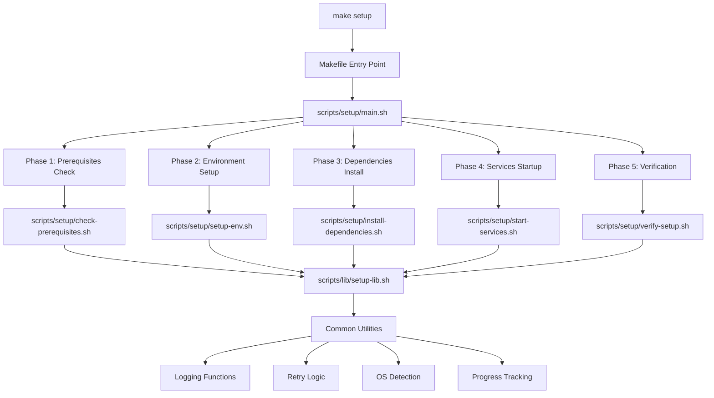
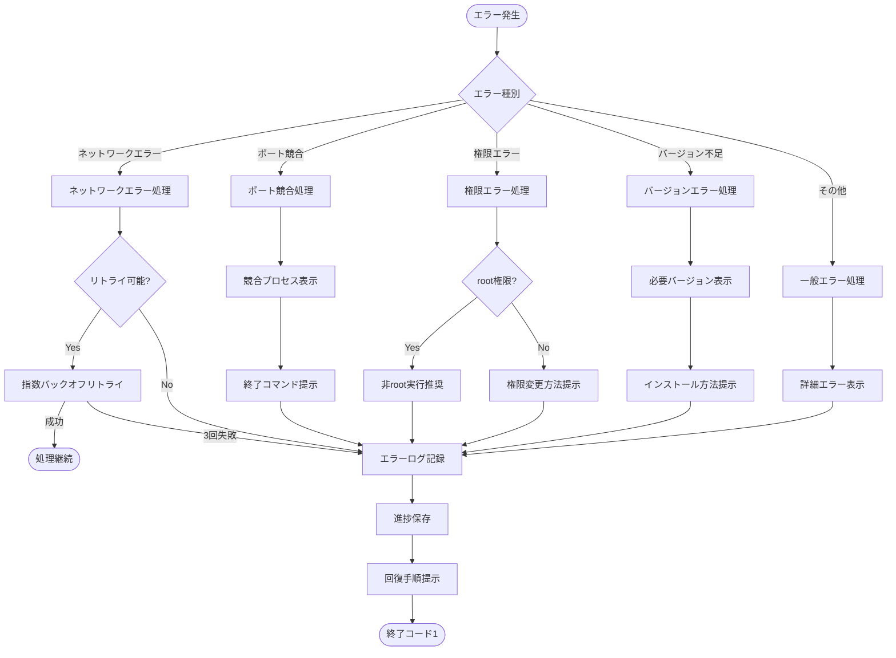

# Technical Design Document

## Overview

本設計ドキュメントは、Laravel 12 + Next.js 15.5モノレポ環境の一括セットアップスクリプトの技術設計を定義します。`make setup` コマンド一つで完全な開発環境を15分以内に構築できる自動化スクリプトを実装し、新規参加開発者のオンボーディング時間を大幅に短縮します。

**Purpose**: 環境構築の自動化により、手動セットアップの手間と失敗リスクを削減し、チーム全体での開発環境統一を実現します。複数OS（macOS/Linux/WSL2）対応、冪等性保証、部分的再実行サポートにより、あらゆる環境で確実に動作するセットアップスクリプトを提供します。

**Users**: 新規参加開発者、既存開発者（環境再構築時）、CI/CD管理者（自動テスト環境構築）が対象です。

**Impact**: 現在の手動セットアップ（30分以上、失敗リスク高）から、自動セットアップ（15分以内、失敗率80%削減）への移行により、開発効率と環境統一性が向上します。

### Goals

- `make setup` コマンド一つで完全な開発環境を15分以内に構築
- 環境構築の失敗率を80%削減（自動リトライ・エラーハンドリング）
- macOS/Linux/WSL2の環境差異を自動検出・対応
- 冪等性保証により、複数回実行しても安全に再実行可能
- 部分的再実行（`--from <step>`）により、エラーから迅速に回復
- CI/CD統合（`--ci`フラグ）により、自動テスト環境構築をサポート

### Non-Goals

- 本番環境デプロイスクリプト（本設計の対象外）
- 既存環境の自動バックアップ機能（手動バックアップを推奨）
- GUIセットアップツール（CLI専用）
- カスタムDockerイメージビルド（既存イメージ利用）

## Architecture

### Existing Architecture Analysis

本プロジェクトは既に以下のインフラ基盤を持っています：

**現在の構成**:
- Docker Compose統合環境（全サービス一括起動、ヘルスチェック統合）
- Makefileベースのテストワークフロー（`make test`, `make docker-up`等）
- シェルスクリプトによる環境切替（`scripts/switch-test-env.sh`, `scripts/parallel-test-setup.sh`）
- 既存の検証スクリプト（`scripts/validate-*.sh`）

**保持すべきパターン**:
- Makefileエントリポイント方式（チーム内で標準化済み）
- シェルスクリプトのモジュール化（`scripts/`配下）
- `set -e` によるエラー即座停止（既存スクリプトの標準）
- カラーコード出力（`echo` による視覚的フィードバック）

**統合ポイント**:
- 既存のMakefileに `setup` ターゲットを追加
- 既存の `scripts/` ディレクトリに新規スクリプトを追加
- 既存の `.env.example` ファイルを活用
- 既存のDocker Composeヘルスチェック機能を活用

### High-Level Architecture



**アーキテクチャ統合**:
- **既存パターン保持**: Makefileエントリポイント、シェルスクリプトモジュール化、エラーハンドリング標準
- **新規コンポーネント追加理由**:
  - `scripts/setup/` ディレクトリ: セットアップ専用スクリプトの分離管理
  - `scripts/lib/setup-lib.sh`: 共通ライブラリによるコード重複削減、保守性向上
  - `.setup-progress`: 進捗マーカーファイルによる冪等性保証
- **技術スタック整合性**: Bash 4.0以上、既存のDocker/Docker Compose、既存のComposer/npm
- **Steering準拠**: モノレポ構造維持、環境変数管理方針、ドキュメント整備方針

### Technology Alignment

本セットアップスクリプトは、既存の技術スタックと完全に整合します：

**バックエンド**:
- Laravel 12 API専用最適化構成を維持
- Composer依存関係管理（既存の `composer.json`）
- PHP 8.4互換性（既存のDocker環境）

**フロントエンド**:
- Next.js 15.5 + React 19（既存のワークスペース構成）
- npm ワークスペース管理（既存の `package.json`）
- Turbopack開発サーバー（既存の設定）

**インフラストラクチャ**:
- Docker Compose統合環境（既存の `docker-compose.yml`）
- PostgreSQL 17-alpine、Redis alpine、Mailpit、MinIO（既存のサービス）
- Laravel Sailカスタムポート設定（13000番台統一、既存の設定）

**開発ツール**:
- Makefileワークフロー（既存の `Makefile` 拡張）
- シェルスクリプト（Bash 4.0以上、既存のスクリプトパターン）
- GitHub Actions CI/CD（既存のワークフロー拡張）

**新規依存関係**:
なし（全て既存の技術スタックとツールを活用）

### Key Design Decisions

#### Decision 1: Makefileエントリポイント + モジュール化シェルスクリプト構成

**Context**: セットアップスクリプトのエントリポイントと実装分離が必要。既存のMakefileワークフローとの整合性、保守性の確保が求められる。

**Alternatives**:
1. **単一シェルスクリプト**: 全ロジックを1ファイルに実装（シンプルだが保守性低い）
2. **Makefileのみ**: 全ロジックをMakefileターゲットで実装（可読性低い、複雑なロジック困難）
3. **Python/Node.jsスクリプト**: 高機能だが新規依存関係が必要

**Selected Approach**: Makefileエントリポイント + モジュール化シェルスクリプト

Makefileに `setup` ターゲットを追加し、`scripts/setup/main.sh` を呼び出します。main.shは各フェーズのスクリプト（`check-prerequisites.sh`, `setup-env.sh`等）を順次実行します。各フェーズスクリプトは `scripts/lib/setup-lib.sh` の共通関数を活用します。

```makefile
setup: ## 開発環境一括セットアップ
	@./scripts/setup/main.sh
```

**Rationale**:
- 既存のMakefileワークフローと完全に整合（`make setup` で一貫性）
- シェルスクリプトのモジュール化により保守性向上、再利用性確保
- 新規依存関係なし（Bash 4.0以上は全環境で利用可能）
- 既存の `scripts/` ディレクトリパターンに従う

**Trade-offs**:
- **獲得**: 保守性、既存ワークフロー整合性、新規依存関係ゼロ
- **犠牲**: シェルスクリプトの型安全性（エラーハンドリングで補完）

#### Decision 2: 進捗マーカーファイル（`.setup-progress`）による冪等性保証

**Context**: セットアップの途中でエラーが発生した場合、部分的再実行を効率的に行う必要がある。完了済みステップのスキップにより、再実行時間を大幅短縮（15分 → 2分以内）。

**Alternatives**:
1. **マーカーファイルなし**: 毎回全ステップ実行（安全だが非効率）
2. **データベース記録**: 進捗をDB保存（過剰、セットアップ前にDB不要）
3. **環境変数記録**: セッション依存、永続化不可

**Selected Approach**: JSON形式の進捗マーカーファイル（`.setup-progress`）

各ステップ完了時に `.setup-progress` ファイルに完了情報を記録します。再実行時にこのファイルを読み込み、完了済みステップをスキップします。

```json
{
  "version": "1.0",
  "timestamp": "2025-10-23T10:00:00Z",
  "completed_steps": [
    "check_prerequisites",
    "setup_env"
  ],
  "current_step": "install_dependencies"
}
```

**Rationale**:
- 完了済みステップの明確な記録（JSONで構造化、可読性高い）
- 部分的再実行により15分 → 2分以内に短縮
- ファイルベースで永続化、セッション非依存
- `--from <step>` オプションで任意ステップから再実行可能

**Trade-offs**:
- **獲得**: 部分的再実行による時間短縮、冪等性保証、柔軟な再実行
- **犠牲**: マーカーファイルの管理コスト（軽微、`.gitignore`で除外）

#### Decision 3: 指数バックオフリトライ戦略

**Context**: ネットワーク依存処理（Docker pull、npm install、composer install）でエラーが発生した場合、自動リトライにより成功率を向上させる必要がある。環境構築の失敗率80%削減の鍵。

**Alternatives**:
1. **固定間隔リトライ**: 1秒間隔で3回リトライ（サーバー負荷増加リスク）
2. **リトライなし**: エラー時即座に停止（ネットワーク一時的エラーで失敗）
3. **無限リトライ**: 成功するまでリトライ（無限ループリスク）

**Selected Approach**: 指数バックオフリトライ（最大3回、1秒 → 2秒 → 4秒）

ネットワーク依存処理でエラーが発生した場合、指数バックオフで最大3回リトライします。1回目失敗後1秒待機、2回目失敗後2秒待機、3回目失敗後4秒待機。

```bash
retry_with_exponential_backoff() {
    local max_attempts=3
    local timeout=1
    local attempt=1

    while [ $attempt -le $max_attempts ]; do
        if "$@"; then
            return 0
        fi

        if [ $attempt -lt $max_attempts ]; then
            log_warn "リトライ $attempt/$max_attempts (${timeout}秒後)"
            sleep $timeout
            timeout=$((timeout * 2))
        fi
        attempt=$((attempt + 1))
    done

    return 1
}
```

**Rationale**:
- 一時的ネットワークエラーからの自動回復（失敗率80%削減）
- 指数バックオフによりサーバー負荷分散
- 最大3回で無限ループ防止
- Docker pull、npm install、composer installに適用

**Trade-offs**:
- **獲得**: 自動エラー回復、失敗率削減、ネットワーク障害耐性
- **犠牲**: 最大リトライ時間7秒（1+2+4秒、許容範囲内）

## System Flows

### セットアップ全体フロー

```mermaid
flowchart TB
    Start([make setup実行]) --> CheckArgs{引数チェック}
    CheckArgs -->|--ci| CIMode[CI/CDモード設定]
    CheckArgs -->|--from <step>| PartialMode[部分的再実行モード]
    CheckArgs -->|引数なし| NormalMode[通常モード]

    CIMode --> LoadProgress
    PartialMode --> LoadProgress
    NormalMode --> LoadProgress

    LoadProgress[進捗マーカー読み込み] --> Phase1

    Phase1{Phase 1: Prerequisites} -->|スキップ| Phase2
    Phase1 -->|実行| CheckDocker[Docker/Docker Composeチェック]
    CheckDocker --> CheckNode[Node.js 18+チェック]
    CheckNode --> CheckPHP[PHP 8.4+チェック]
    CheckPHP --> CheckPorts[ポート競合チェック]
    CheckPorts --> CheckDisk[ディスク/メモリチェック]
    CheckDisk -->|失敗| ErrorPhase1[エラーメッセージ表示]
    ErrorPhase1 --> End([セットアップ終了])
    CheckDisk -->|成功| SaveProgress1[進捗保存]
    SaveProgress1 --> Phase2

    Phase2{Phase 2: Environment} -->|スキップ| Phase3
    Phase2 -->|実行| CopyEnvLaravel[Laravel .env作成]
    CopyEnvLaravel --> CopyEnvUser[User App .env.local作成]
    CopyEnvUser --> CopyEnvAdmin[Admin App .env.local作成]
    CopyEnvAdmin --> GenAppKey[APP_KEY生成]
    GenAppKey --> ValidateEnv[環境変数バリデーション]
    ValidateEnv -->|失敗| ErrorPhase2[不足項目表示]
    ErrorPhase2 --> End
    ValidateEnv -->|成功| SaveProgress2[進捗保存]
    SaveProgress2 --> Phase3

    Phase3{Phase 3: Dependencies} -->|スキップ| Phase4
    Phase3 -->|実行| ComposerInstall[Composer install]
    ComposerInstall -->|失敗| Retry1{リトライ}
    Retry1 -->|3回失敗| ErrorPhase3[エラー表示]
    ErrorPhase3 --> End
    Retry1 -->|成功| NpmInstall[npm install]
    NpmInstall -->|失敗| Retry2{リトライ}
    Retry2 -->|3回失敗| ErrorPhase3
    Retry2 -->|成功| DockerPull[Docker image pull]
    DockerPull --> SaveProgress3[進捗保存]
    SaveProgress3 --> Phase4

    Phase4{Phase 4: Services} -->|スキップ| Phase5
    Phase4 -->|実行| DockerUp[Docker Compose up]
    DockerUp --> WaitPgsql[PostgreSQLヘルスチェック待機]
    WaitPgsql -->|タイムアウト60秒| ErrorPhase4[ログ出力]
    ErrorPhase4 --> End
    WaitPgsql -->|成功| WaitRedis[Redisヘルスチェック待機]
    WaitRedis --> WaitLaravel[Laravel APIヘルスチェック待機]
    WaitLaravel --> Migrate[php artisan migrate]
    Migrate --> Seed[php artisan db:seed]
    Seed --> CheckFrontend[Frontend Apps起動確認]
    CheckFrontend --> SaveProgress4[進捗保存]
    SaveProgress4 --> Phase5

    Phase5{Phase 5: Verification} -->|スキップ| Success
    Phase5 -->|実行| VerifyAll[全サービス疎通確認]
    VerifyAll -->|失敗| ErrorPhase5[問題箇所特定]
    ErrorPhase5 --> End
    VerifyAll -->|成功| SaveProgress5[進捗保存]
    SaveProgress5 --> Success

    Success[完了サマリー表示] --> CleanupMarker[マーカーファイル削除]
    CleanupMarker --> End
```



### エラーハンドリングフロー



## Requirements Traceability

| Requirement | Requirement Summary | Components | Interfaces | Flows |
|-------------|-------------------|------------|------------|-------|
| 1.1-1.10 | 前提条件チェック機能 | PrerequisitesChecker | `check_prerequisites()` | Phase 1フロー、エラーハンドリングフロー |
| 2.1-2.8 | 環境変数セットアップ機能 | EnvironmentSetup | `setup_environment()` | Phase 2フロー |
| 3.1-3.9 | 依存関係インストール機能 | DependenciesInstaller | `install_dependencies()` | Phase 3フロー、リトライロジック |
| 4.1-4.10 | サービス起動・初期化機能 | ServicesManager | `start_services()` | Phase 4フロー |
| 5.1-5.10 | エラーハンドリング・リカバリ機能 | ErrorHandler, ProgressTracker | `handle_error()`, `save_progress()` | エラーハンドリングフロー |
| 6.1-6.7 | 環境差異対応機能 | OSDetector | `detect_os()`, `get_package_manager()` | 全フロー（OS検出は最初に実行） |
| 7.1-7.8 | 進捗表示・ログ機能 | Logger | `log_info()`, `log_error()`, `show_progress()` | 全フロー |
| 8.1-8.6 | CI/CD統合機能 | CIMode | `setup_ci_mode()` | セットアップ全体フロー（CI/CDモード分岐） |
| 9.1-9.7 | ドキュメント整備機能 | DocumentationUpdater | `update_readme()`, `update_troubleshooting()` | 実装完了後のドキュメント更新タスク |
| 10.1-10.5 | パフォーマンス要件 | PerformanceMonitor | `measure_step_time()`, `check_performance()` | 全フロー（各ステップの時間計測） |
| 11.1-11.5 | セキュリティ要件 | SecurityChecker | `check_gitignore()`, `mask_sensitive_data()` | Phase 2フロー、ログ出力時 |

## Components and Interfaces

### Core Layer

#### Main Orchestrator (scripts/setup/main.sh)

**Responsibility & Boundaries**
- **Primary Responsibility**: セットアップ全体のオーケストレーション、各フェーズの順次実行、エラー時の中断
- **Domain Boundary**: セットアップワークフロー全体の管理
- **Data Ownership**: セットアップ実行状態、進捗マーカーファイル
- **Transaction Boundary**: セットアップ全体（各フェーズは独立トランザクション）

**Dependencies**
- **Inbound**: Makefile `setup` ターゲットから呼び出される
- **Outbound**: 各フェーズスクリプト（check-prerequisites.sh, setup-env.sh等）、共通ライブラリ（setup-lib.sh）
- **External**: なし

**Service Interface**
```bash
# Entry Point
main() {
    # 引数解析（--ci, --from <step>）
    # OS検出
    # 進捗マーカー読み込み
    # 各フェーズ実行
    # 完了サマリー表示
}

# Phase Execution
execute_phase() {
    local phase_name=$1
    local phase_script=$2

    # 進捗チェック（完了済みならスキップ）
    # フェーズスクリプト実行
    # 進捗保存
}
```

**State Management**
- **State Model**: セットアップ実行中（running）、フェーズ完了（phase_completed）、全体完了（completed）、エラー（error）
- **Persistence**: `.setup-progress` ファイル（JSON形式）
- **Concurrency**: 単一プロセス実行（並列実行なし）

#### Progress Tracker (scripts/lib/setup-lib.sh内の関数)

**Responsibility & Boundaries**
- **Primary Responsibility**: 進捗マーカーファイルの読み書き、完了済みステップの追跡
- **Domain Boundary**: 進捗管理ドメイン
- **Data Ownership**: `.setup-progress` ファイルの内容
- **Transaction Boundary**: 各フェーズ完了時に進捗保存

**Dependencies**
- **Inbound**: Main Orchestrator、各フェーズスクリプトから呼び出される
- **Outbound**: ファイルシステム（`.setup-progress`）
- **External**: なし

**Service Interface**
```bash
# 進捗マーカー読み込み
load_progress() {
    # .setup-progressファイル存在チェック
    # JSON解析
    # completed_steps配列を環境変数にロード
}

# 進捗保存
save_progress() {
    local step_name=$1
    # completed_stepsに追加
    # JSON形式で.setup-progressに書き込み
}

# ステップ完了チェック
is_step_completed() {
    local step_name=$1
    # completed_steps配列に含まれるか確認
}

# マーカーファイル削除（セットアップ完了時）
cleanup_progress() {
    rm -f .setup-progress
}
```

#### Logger (scripts/lib/setup-lib.sh内の関数)

**Responsibility & Boundaries**
- **Primary Responsibility**: ログ出力、カラーコード付きメッセージ表示、ファイルログ記録
- **Domain Boundary**: ログ管理ドメイン
- **Data Ownership**: `.setup.log` ファイル
- **Transaction Boundary**: ログ出力ごとに即座にファイル書き込み

**Dependencies**
- **Inbound**: 全コンポーネントから呼び出される
- **Outbound**: 標準出力、`.setup.log` ファイル
- **External**: なし

**Service Interface**
```bash
# 情報ログ
log_info() {
    local message=$1
    echo -e "\033[0;32m✅ $message\033[0m"
    echo "[INFO] $(date '+%Y-%m-%d %H:%M:%S') $message" >> .setup.log
}

# 警告ログ
log_warn() {
    local message=$1
    echo -e "\033[0;33m⚠️  $message\033[0m"
    echo "[WARN] $(date '+%Y-%m-%d %H:%M:%S') $message" >> .setup.log
}

# エラーログ
log_error() {
    local message=$1
    echo -e "\033[0;31m❌ $message\033[0m"
    echo "[ERROR] $(date '+%Y-%m-%d %H:%M:%S') $message" >> .setup.log
}

# 進捗表示
show_progress() {
    local current=$1
    local total=$2
    local step_name=$3
    echo -e "\n🚀 [$current/$total] $step_name"
}

# 機密情報マスキング
mask_sensitive() {
    local text=$1
    # パスワード、トークン、APIキーをマスキング
    echo "$text" | sed 's/password=[^ ]*/password=***/g' | sed 's/token=[^ ]*/token=***/g'
}
```

### Phase Layer

#### Prerequisites Checker (scripts/setup/check-prerequisites.sh)

**Responsibility & Boundaries**
- **Primary Responsibility**: システム環境の前提条件検証、バージョンチェック、ポート競合チェック
- **Domain Boundary**: 前提条件チェックドメイン
- **Data Ownership**: チェック結果（成功/失敗）
- **Transaction Boundary**: チェック全体（全項目チェック完了で終了）

**Dependencies**
- **Inbound**: Main Orchestratorから呼び出される
- **Outbound**: Logger、OS Detection
- **External**: docker, docker-compose, node, php, lsof（ポート確認）

**Service Interface**
```bash
check_prerequisites() {
    log_info "前提条件をチェックします..."

    check_docker_version "20.10.0"
    check_docker_compose_version "2.0.0"
    check_node_version "18.0.0"
    check_php_version "8.4.0"
    check_make_command
    check_port_availability "13000,13001,13002,13379,13432,11025,13025,13900,13010"
    check_disk_space "10"  # 10GB
    check_memory "4"  # 4GB

    log_info "前提条件チェック完了"
}

check_docker_version() {
    local required_version=$1
    # docker --version 実行
    # バージョン比較
    # 不足時はエラーメッセージとインストールガイド表示
}

check_port_availability() {
    local ports=$1
    # lsof -i :$port で各ポート確認
    # 競合時はプロセスIDとポート番号表示
}
```

#### Environment Setup (scripts/setup/setup-env.sh)

**Responsibility & Boundaries**
- **Primary Responsibility**: 環境変数ファイル作成、APP_KEY生成、環境変数バリデーション
- **Domain Boundary**: 環境変数管理ドメイン
- **Data Ownership**: `.env` ファイル、`.env.local` ファイル
- **Transaction Boundary**: 環境変数セットアップ全体

**Dependencies**
- **Inbound**: Main Orchestratorから呼び出される
- **Outbound**: Logger、ファイルシステム
- **External**: php artisan key:generate（APP_KEY生成）

**Service Interface**
```bash
setup_environment() {
    log_info "環境変数をセットアップします..."

    copy_env_file "backend/laravel-api/.env.example" "backend/laravel-api/.env"
    copy_env_file "frontend/user-app/.env.example" "frontend/user-app/.env.local"
    copy_env_file "frontend/admin-app/.env.example" "frontend/admin-app/.env.local"

    generate_app_key
    validate_env_files
    check_gitignore

    log_info "環境変数セットアップ完了"
}

copy_env_file() {
    local source=$1
    local dest=$2

    if [ -f "$dest" ]; then
        log_warn "$dest は既に存在します（上書きしません）"
    else
        cp "$source" "$dest"
        log_info "$dest を作成しました"
    fi
}

generate_app_key() {
    cd backend/laravel-api
    php artisan key:generate
}

validate_env_files() {
    # 必須環境変数の存在チェック
    # 不足項目を一覧表示
}
```

#### Dependencies Installer (scripts/setup/install-dependencies.sh)

**Responsibility & Boundaries**
- **Primary Responsibility**: Composer/npm依存関係インストール、Dockerイメージプル
- **Domain Boundary**: 依存関係管理ドメイン
- **Data Ownership**: `vendor/`, `node_modules/`, Dockerイメージ
- **Transaction Boundary**: 各依存関係インストール（Composer、npm、Docker pull）

**Dependencies**
- **Inbound**: Main Orchestratorから呼び出される
- **Outbound**: Logger、Retry Logic
- **External**: composer, npm, docker（image pull）

**Service Interface**
```bash
install_dependencies() {
    log_info "依存関係をインストールします..."

    install_composer_dependencies
    install_npm_dependencies
    pull_docker_images

    log_info "依存関係インストール完了"
}

install_composer_dependencies() {
    log_info "Composer依存関係をインストール中..."
    cd backend/laravel-api
    retry_with_exponential_backoff composer install --no-interaction --prefer-dist
}

install_npm_dependencies() {
    log_info "npm依存関係をインストール中..."
    cd ../..
    retry_with_exponential_backoff npm install
}

pull_docker_images() {
    log_info "Dockerイメージをプル中..."
    retry_with_exponential_backoff docker compose pull pgsql redis mailpit minio
}
```

#### Services Manager (scripts/setup/start-services.sh)

**Responsibility & Boundaries**
- **Primary Responsibility**: Docker Composeサービス起動、ヘルスチェック待機、データベース初期化
- **Domain Boundary**: サービス管理ドメイン
- **Data Ownership**: Docker Composeサービスの実行状態
- **Transaction Boundary**: サービス起動全体（全サービス正常起動で完了）

**Dependencies**
- **Inbound**: Main Orchestratorから呼び出される
- **Outbound**: Logger、ヘルスチェック関数
- **External**: docker compose, curl（ヘルスチェック）、php artisan（マイグレーション）

**Service Interface**
```bash
start_services() {
    log_info "サービスを起動します..."

    docker_compose_up
    wait_for_service "pgsql" 60
    wait_for_service "redis" 30
    wait_for_service "laravel-api" 90 "http://127.0.0.1:13000/api/health"

    run_migrations
    run_seeders

    check_frontend_apps

    log_info "サービス起動完了"
}

docker_compose_up() {
    docker compose up -d
}

wait_for_service() {
    local service=$1
    local timeout=$2
    local health_url=$3

    local elapsed=0
    while [ $elapsed -lt $timeout ]; do
        if check_health "$service" "$health_url"; then
            log_info "$service が起動しました"
            return 0
        fi
        sleep 2
        elapsed=$((elapsed + 2))
    done

    log_error "$service のヘルスチェックがタイムアウトしました"
    docker compose logs "$service"
    return 1
}

run_migrations() {
    cd backend/laravel-api
    php artisan migrate --force
}
```

#### Setup Verifier (scripts/setup/verify-setup.sh)

**Responsibility & Boundaries**
- **Primary Responsibility**: 全サービスの疎通確認、エンドツーエンド検証
- **Domain Boundary**: 検証ドメイン
- **Data Ownership**: 検証結果（成功/失敗）
- **Transaction Boundary**: 検証全体

**Dependencies**
- **Inbound**: Main Orchestratorから呼び出される
- **Outbound**: Logger
- **External**: curl（各サービスへのHTTPリクエスト）

**Service Interface**
```bash
verify_setup() {
    log_info "セットアップを検証します..."

    verify_laravel_api
    verify_user_app
    verify_admin_app
    verify_database_connection

    log_info "セットアップ検証完了"
}

verify_laravel_api() {
    local response=$(curl -s http://127.0.0.1:13000/api/health)
    if echo "$response" | grep -q '"status":"ok"'; then
        log_info "Laravel API: ✅ 正常"
    else
        log_error "Laravel API: ❌ 異常"
        return 1
    fi
}

verify_user_app() {
    local response=$(curl -s http://127.0.0.1:13001/api/health)
    if [ -n "$response" ]; then
        log_info "User App: ✅ 正常"
    else
        log_error "User App: ❌ 異常"
        return 1
    fi
}
```

### Utility Layer

#### OS Detector (scripts/lib/setup-lib.sh内の関数)

**Responsibility & Boundaries**
- **Primary Responsibility**: 実行環境の自動検出（macOS/Linux/WSL2）、パッケージマネージャー推奨
- **Domain Boundary**: OS検出ドメイン
- **Data Ownership**: OS情報（環境変数 `DETECTED_OS`）
- **Transaction Boundary**: OS検出（1回のみ実行）

**Dependencies**
- **Inbound**: Main Orchestrator、各フェーズスクリプトから呼び出される
- **Outbound**: なし
- **External**: uname, /proc/version（WSL検出）

**Service Interface**
```bash
detect_os() {
    local os=$(uname -s)

    case "$os" in
        Darwin*)
            DETECTED_OS="macos"
            PACKAGE_MANAGER="brew"
            ;;
        Linux*)
            if grep -qi microsoft /proc/version 2>/dev/null; then
                DETECTED_OS="wsl2"
                PACKAGE_MANAGER="apt"  # または yum
            else
                DETECTED_OS="linux"
                PACKAGE_MANAGER="apt"  # または yum
            fi
            ;;
        *)
            log_error "サポートされていないOS: $os"
            exit 1
            ;;
    esac

    log_info "検出されたOS: $DETECTED_OS"
}

get_install_guide() {
    local tool=$1

    case "$DETECTED_OS" in
        macos)
            echo "brew install $tool"
            ;;
        linux|wsl2)
            echo "sudo apt install $tool"  # または yum
            ;;
    esac
}
```

#### Retry Logic (scripts/lib/setup-lib.sh内の関数)

**Responsibility & Boundaries**
- **Primary Responsibility**: 指数バックオフリトライ、ネットワークエラー自動回復
- **Domain Boundary**: リトライロジックドメイン
- **Data Ownership**: リトライ状態（試行回数、待機時間）
- **Transaction Boundary**: リトライ処理全体（最大3回）

**Dependencies**
- **Inbound**: Dependencies Installer、Services Managerから呼び出される
- **Outbound**: Logger
- **External**: なし

**Service Interface**
```bash
retry_with_exponential_backoff() {
    local max_attempts=3
    local timeout=1
    local attempt=1

    while [ $attempt -le $max_attempts ]; do
        log_info "試行 $attempt/$max_attempts..."

        if "$@"; then
            return 0
        fi

        if [ $attempt -lt $max_attempts ]; then
            log_warn "リトライ $attempt/$max_attempts (${timeout}秒後)"
            sleep $timeout
            timeout=$((timeout * 2))
        fi
        attempt=$((attempt + 1))
    done

    log_error "最大リトライ回数に達しました"
    return 1
}
```

## Error Handling

### Error Strategy

セットアップスクリプトは包括的なエラーハンドリング戦略を採用し、環境構築の失敗率を80%削減します。

**Error Detection**:
- `set -e` によるエラー即座停止（シェルスクリプト標準）
- 各コマンドの終了コードチェック（`$?`）
- ヘルスチェックタイムアウト検出

**Error Recovery**:
- 指数バックオフリトライ（ネットワークエラー）
- 進捗マーカーファイルによる部分的再実行
- 詳細なエラーメッセージと解決ガイド

**Error Reporting**:
- カラーコード付きエラー表示（赤色でハイライト）
- `.setup.log` ファイルへのエラーログ記録
- CI/CD環境ではGitHub Actions annotations形式

### Error Categories and Responses

#### User Errors (400番台相当)

**Invalid Arguments (引数エラー)**:
- **Detection**: `--from` オプションに無効なステップ名
- **Response**: 有効なステップ名リストを表示
- **Recovery**: コマンド再実行を促す

```bash
エラー: 無効なステップ名 'invalid_step'

有効なステップ名:
  - check_prerequisites
  - setup_env
  - install_dependencies
  - start_services
  - verify_setup

使用方法: make setup --from <step>
```

**Missing Prerequisites (前提条件不足)**:
- **Detection**: Docker/Node.js/PHP等のバージョン不足
- **Response**: 必要バージョンと現在バージョンを表示、インストールガイド提示
- **Recovery**: 前提条件インストール後、再実行

```bash
❌ Dockerバージョンが不足しています
   必要: 20.10.0以上
   現在: 19.03.0

インストール方法 (macOS):
  brew install --cask docker

インストール後、再度 'make setup' を実行してください。
```

#### System Errors (500番台相当)

**Network Errors (ネットワークエラー)**:
- **Detection**: Docker pull、npm install、composer installの失敗
- **Response**: 指数バックオフで最大3回リトライ、失敗時はエラーログ表示
- **Recovery**: ネットワーク確認後、部分的再実行（`make setup --from install_dependencies`）

```bash
⚠️  npm install でエラーが発生しました
   リトライ 1/3 (1秒後)
   ...
   リトライ 3/3 (4秒後)

❌ 最大リトライ回数に達しました

トラブルシューティング:
  1. インターネット接続を確認してください
  2. npm レジストリの状態を確認: https://status.npmjs.org/
  3. 再実行: make setup --from install_dependencies
```

**Docker Service Errors (Dockerサービスエラー)**:
- **Detection**: ヘルスチェックタイムアウト（PostgreSQL 60秒、Redis 30秒、Laravel API 90秒）
- **Response**: サービスログを自動収集して表示、トラブルシューティングガイド提示
- **Recovery**: Docker環境の確認、ログ解析、部分的再実行

```bash
❌ PostgreSQL のヘルスチェックがタイムアウトしました（60秒）

サービスログ:
  [PostgreSQLログ...]

トラブルシューティング:
  1. Docker Desktop が起動しているか確認
  2. ポート 13432 が競合していないか確認: lsof -i :13432
  3. Docker リソース設定を確認（メモリ: 4GB以上推奨）
  4. 再実行: make setup --from start_services
```

**Port Conflicts (ポート競合)**:
- **Detection**: `lsof -i :$port` でポート使用中検出
- **Response**: 競合プロセスIDとポート番号を表示、終了コマンド提示
- **Recovery**: プロセス終了後、再実行

```bash
❌ ポート競合が検出されました

競合ポート: 13000
プロセスID: 12345
プロセス名: node

終了コマンド:
  kill 12345

終了後、再度 'make setup' を実行してください。
```

#### Business Logic Errors (422相当)

**Environment Variable Validation Errors (環境変数バリデーションエラー)**:
- **Detection**: 必須環境変数の不足、不正な値
- **Response**: 不足項目を一覧表示、推奨値を具体的に提示
- **Recovery**: `.env` ファイル編集後、再実行

```bash
❌ 環境変数バリデーションエラー

不足項目:
  - DB_HOST (推奨値: pgsql)
  - DB_PORT (推奨値: 13432)
  - APP_KEY (自動生成が必要)

修正方法:
  1. backend/laravel-api/.env を編集
  2. 不足項目を追加
  3. 再実行: make setup --from setup_env
```

### Monitoring

**Error Tracking**:
- `.setup.log` ファイルへの全エラーログ記録（タイムスタンプ付き）
- CI/CD環境ではGitHub Actions annotations形式でエラー表示

**Logging Strategy**:
- `[INFO]` レベル: 正常な進捗情報
- `[WARN]` レベル: 警告（既存ファイル上書きスキップ等）
- `[ERROR]` レベル: エラー（セットアップ失敗）

**Health Monitoring**:
- 各サービスのヘルスチェック（PostgreSQL、Redis、Laravel API、User App、Admin App）
- タイムアウト時は自動的にサービスログ収集

## Testing Strategy

### Unit Tests

単体テストは各シェルスクリプト関数の個別テストを行います（[Bats](https://github.com/bats-core/bats-core) または手動テスト）。

1. **OS Detection**:
   - macOS環境で `detect_os()` が `macos` を返すことを確認
   - Linux環境で `detect_os()` が `linux` を返すことを確認
   - WSL2環境で `detect_os()` が `wsl2` を返すことを確認

2. **Progress Tracker**:
   - `save_progress()` が `.setup-progress` ファイルを正しく作成することを確認
   - `load_progress()` が既存の `.setup-progress` を正しく読み込むことを確認
   - `is_step_completed()` が完了済みステップを正しく判定することを確認

3. **Logger**:
   - `log_info()` がカラーコード付きメッセージを標準出力に表示することを確認
   - `log_error()` がエラーメッセージを `.setup.log` に記録することを確認
   - `mask_sensitive()` がパスワード・トークンを正しくマスキングすることを確認

4. **Retry Logic**:
   - `retry_with_exponential_backoff()` が3回リトライすることを確認
   - 指数バックオフで待機時間が増加（1秒 → 2秒 → 4秒）することを確認

5. **Version Checker**:
   - `check_docker_version()` が正しくバージョン比較することを確認
   - バージョン不足時にエラーメッセージとガイドを表示することを確認

### Integration Tests

統合テストは各フェーズスクリプトの統合動作を確認します。

1. **Prerequisites Check Phase**:
   - Docker/Docker Compose/Node.js/PHPが全て要件を満たす環境で、チェックが成功することを確認
   - バージョン不足環境で、適切なエラーメッセージが表示されることを確認
   - ポート競合環境で、競合プロセス情報が表示されることを確認

2. **Environment Setup Phase**:
   - `.env.example` から `.env` ファイルが正しくコピーされることを確認
   - 既存の `.env` ファイルが上書きされないことを確認
   - `APP_KEY` が正しく生成されることを確認

3. **Dependencies Install Phase**:
   - `composer install` が正常に完了することを確認
   - `npm install` が正常に完了することを確認
   - ネットワークエラー時にリトライが発生することを確認

4. **Services Startup Phase**:
   - Docker Composeが全サービスを正常に起動することを確認
   - ヘルスチェックが各サービスで成功することを確認
   - データベースマイグレーション・シーディングが正常に完了することを確認

5. **Verification Phase**:
   - 全サービスが正常に応答することを確認
   - エンドツーエンド疎通確認が成功することを確認

### E2E/UI Tests

エンドツーエンドテストはセットアップスクリプト全体の動作を確認します。

1. **クリーン環境セットアップ**:
   - 全ファイル削除状態から `make setup` を実行
   - 15分以内に全環境が構築されることを確認
   - 全サービスが正常起動することを確認

2. **冪等性テスト**:
   - `make setup` を2回連続実行
   - 既存ファイルが上書きされないことを確認
   - 2回目の実行が2分以内に完了することを確認

3. **部分的再実行テスト**:
   - `make setup` を途中で中断（Ctrl+C）
   - `.setup-progress` ファイルが存在することを確認
   - `make setup --from <step>` で部分的再実行が成功することを確認

4. **環境差異テスト**:
   - macOS環境で `make setup` が成功することを確認
   - Linux環境で `make setup` が成功することを確認
   - WSL2環境で `make setup` が成功することを確認

5. **CI/CDモードテスト**:
   - GitHub Actions環境で `make setup --ci` が成功することを確認
   - 対話的プロンプトなしで完全自動実行されることを確認
   - エラー時に終了コード1が返されることを確認

### Performance/Load Tests

パフォーマンステストは要件10（パフォーマンス要件）の達成を検証します。

1. **セットアップ時間測定**:
   - クリーン環境で `make setup` を実行
   - 所要時間が15分以内であることを確認
   - 各フェーズの所要時間を記録（ボトルネック特定）

2. **部分的再実行時間測定**:
   - `make setup --from <step>` の所要時間が2分以内であることを確認
   - 完了済みステップのスキップが機能することを確認

3. **キャッシュ効果測定**:
   - Composerキャッシュ有効時の `composer install` 時間を測定
   - npmキャッシュ有効時の `npm install` 時間を測定
   - キャッシュによる時間短縮効果（30%以上）を確認

4. **並列処理効果測定**:
   - Docker image pullの並列実行による時間短縮を測定
   - 並列pullが逐次pullより高速（20%以上）であることを確認

## Security Considerations

セキュリティ要件11（セキュリティ要件）に基づき、以下のセキュリティ対策を実装します。

### Threat Modeling

**Threat 1: 機密情報漏洩（ログファイル）**
- **Attack Vector**: `.setup.log` ファイルにパスワード・トークンが平文記録される
- **Mitigation**: `mask_sensitive()` 関数によるログ出力時の自動マスキング
- **Validation**: ログファイル内にパスワード・トークンが平文で存在しないことを確認

**Threat 2: 環境変数ファイルのGit追跡**
- **Attack Vector**: `.env` ファイルがGitにコミットされ、機密情報が公開される
- **Mitigation**: セットアップ時に `.gitignore` ファイルで `.env` が除外されていることを確認
- **Validation**: `.gitignore` に `.env` が含まれていない場合はエラー

**Threat 3: 一時ファイルの残存**
- **Attack Vector**: セットアップ中に作成された一時ファイルが削除されず、機密情報が残る
- **Mitigation**: セットアップ完了時に一時ファイルを自動削除
- **Validation**: セットアップ完了後に一時ファイルが存在しないことを確認

**Threat 4: root権限での実行**
- **Attack Vector**: セットアップスクリプトがroot権限で実行され、ファイルパーミッションが不適切に設定される
- **Mitigation**: root権限での実行を拒否（Docker操作以外）、警告メッセージ表示
- **Validation**: `whoami` コマンドでroot検出時にエラー

### Security Controls

**Authentication and Authorization**:
- セットアップスクリプトは認証不要（ローカル開発環境構築）
- Docker操作のみシステム権限が必要（ユーザーに通知）

**Data Protection**:
- `.env` ファイルのパーミッション600設定（所有者のみ読み書き可能）
- パスワード・トークンのログマスキング
- `.setup-progress` ファイルの自動削除（セットアップ完了後）

**Input Validation**:
- コマンドライン引数の検証（`--from <step>` の有効性チェック）
- 環境変数バリデーション（必須項目の存在確認）

**Audit Logging**:
- `.setup.log` ファイルへの全操作ログ記録
- タイムスタンプ付きログ（監査証跡）

## Performance & Scalability

### Target Metrics

**セットアップ時間**:
- クリーン環境: 15分以内（要件10.1）
- 部分的再実行: 2分以内（要件10.2）
- 10分超過時: パフォーマンス警告表示（要件10.5）

**リソース使用量**:
- メモリ: 4GB以上推奨（前提条件）
- ディスク: 10GB以上推奨（前提条件）

### Measurement Strategy

**Time Measurement**:
各フェーズの所要時間を測定し、ログ出力します。

```bash
measure_step_time() {
    local step_name=$1
    shift

    local start_time=$(date +%s)
    "$@"
    local exit_code=$?
    local end_time=$(date +%s)
    local duration=$((end_time - start_time))

    log_info "$step_name 完了 (所要時間: ${duration}秒)"

    return $exit_code
}
```

**Performance Analysis**:
セットアップ完了時に、各フェーズの所要時間を集計し、ボトルネックを特定します。

```bash
show_performance_summary() {
    log_info "パフォーマンスサマリー:"
    log_info "  前提条件チェック: ${time_prerequisites}秒"
    log_info "  環境変数セットアップ: ${time_env}秒"
    log_info "  依存関係インストール: ${time_deps}秒"
    log_info "  サービス起動: ${time_services}秒"
    log_info "  検証: ${time_verify}秒"
    log_info "  合計: ${total_time}秒"

    if [ $total_time -gt 600 ]; then  # 10分
        log_warn "セットアップ時間が10分を超えています"
        log_warn "ボトルネック: $(identify_bottleneck)"
    fi
}
```

### Scaling Approaches

**Horizontal Scaling**:
セットアップスクリプトは単一マシン実行前提のため、水平スケーリングは対象外。

**Vertical Scaling**:
- Dockerリソース設定（メモリ、CPU）の増加推奨
- npmキャッシュ、Composerキャッシュの活用による時間短縮

### Caching Strategies

**Composer Cache**:
Composerキャッシュを活用し、依存関係インストール時間を短縮します。

```bash
composer install --no-interaction --prefer-dist
# Composerは自動的に ~/.composer/cache/ を活用
```

**npm Cache**:
npmキャッシュを活用し、依存関係インストール時間を短縮します。

```bash
npm install
# npmは自動的に ~/.npm を活用
```

**Docker Image Cache**:
Docker image pullでキャッシュを活用します。

```bash
docker compose pull
# Dockerは既にプル済みイメージをキャッシュから取得
```

**Progress Marker Cache**:
`.setup-progress` ファイルにより、完了済みステップをスキップします（部分的再実行）。
