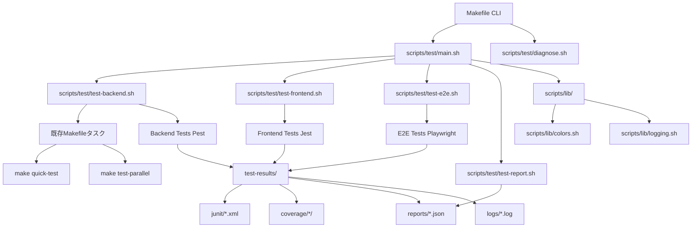
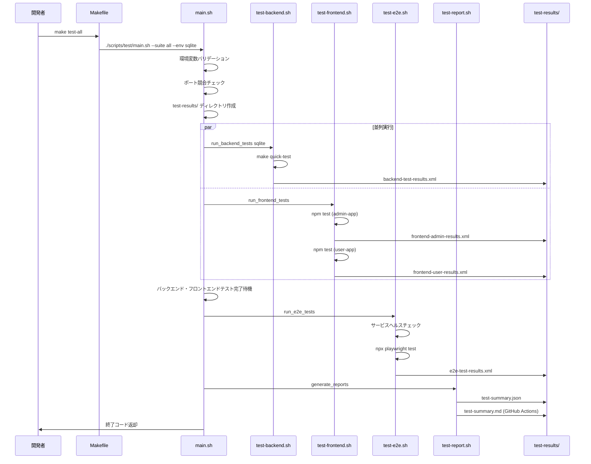
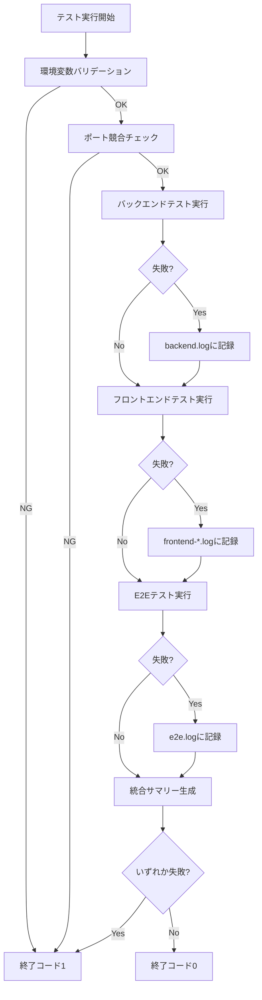
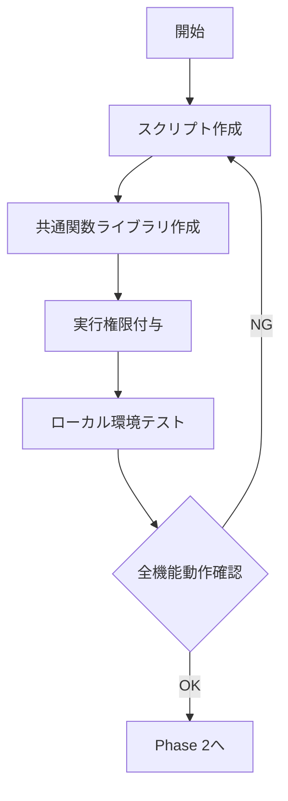
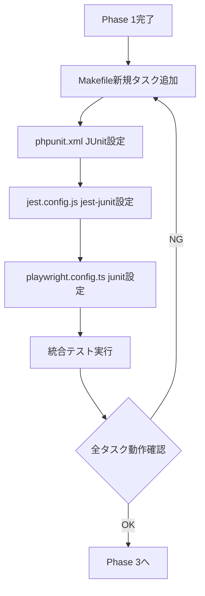
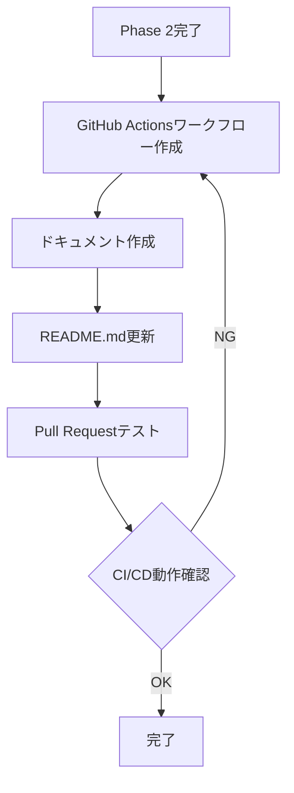

# Technical Design Document

## Overview

テスト実行スクリプトは、モノレポ構成（Laravel API + Next.js admin-app/user-app + E2Eテスト）における全テストスイートの統合実行を実現する運用スクリプト群です。

**Purpose**: 開発者に単一コマンドでの全テスト実行、柔軟な実行制御、統合レポート生成を提供し、テスト実行の一貫性と効率性を向上させます。

**Users**: プロジェクト開発者は、ローカル開発時に `make test-all` コマンドで全テストを実行し、CI/CD環境では自動的に統合テストが実行されます。

**Impact**: 現在の個別テストスイート実行フローを、統合テストハーネスによる並列実行・エラーハンドリング・統合レポート生成を伴う実行フローに変更します。既存のMakefileタスク（quick-test、test-pgsql、test-parallel、ci-test）は維持され、新規タスクから内部的に呼び出されます。

### Goals

- 単一コマンドで全テストスイート（Backend、Frontend、E2E）の統合実行を実現
- テストスイート選択、DB環境選択、並列度調整の柔軟な実行制御を提供
- JUnit XMLレポート、カバレッジレポート、統合サマリーの自動生成
- GitHub Actions既存ワークフローとのシームレスな統合
- 一部テスト失敗時も全テスト継続実行、最終的な統合結果レポート提供

### Success Criteria

- 開発者が `make test-all` で全テストを2分以内に実行完了（SQLite環境）
- PostgreSQL環境での並列実行が正常動作し、本番同等の環境でテスト実行可能
- 統合レポートが正しく生成され、GitHub Actions Summaryに表示される
- 既存Makefileタスクが変更なく維持され、後方互換性が保証される
- ドキュメントが整備され、開発者がスムーズにテスト実行を開始できる

### Non-Goals

- 既存テストコードの修正・追加
- テストフレームワークのバージョンアップグレード
- CI/CDワークフローの大規模変更（既存ワークフローは再利用）
- モノレポツール（Nx/Turborepo）の導入

## Architecture

### Existing Architecture Analysis

**現在のテスト実行アーキテクチャ**:
- 各テストスイート（Backend: Pest、Frontend: Jest、E2E: Playwright）が個別に実行される
- Makefileタスクが個別機能に特化しており、統合実行フローが未整備
- 既存タスク: `quick-test`（SQLite高速テスト）、`test-pgsql`（PostgreSQL本番同等テスト）、`test-parallel`（並列テスト実行）、`ci-test`（CI/CD相当の完全テスト）
- 並列テスト環境セットアップスクリプト: `scripts/parallel-test-setup.sh`、`scripts/parallel-test-cleanup.sh`
- テスト環境切り替えスクリプト: `scripts/switch-test-env.sh`

**既存パターンの保持**:
- 既存Makefileタスクは一切変更せず、新規タスクから内部呼び出し
- `scripts/dev/`の開発サーバー起動スクリプトと同様のBashアーキテクチャを採用
- 既存の並列テスト環境セットアップスクリプトを再利用

### High-Level Architecture



### Architecture Integration

**既存パターン保持**:
- Makefileによる統一CLIインターフェース（`make test-*`コマンド体系）
- Bashスクリプトによるオーケストレーション層
- 既存スクリプトの再利用（`scripts/parallel-test-setup.sh`、`scripts/switch-test-env.sh`）

**新規コンポーネント追加理由**:
- `scripts/test/main.sh`: 全テストスイートのオーケストレーション、並列実行制御、エラーハンドリング
- `scripts/test/test-backend.sh`: バックエンドテスト実行の抽象化レイヤー
- `scripts/test/test-frontend.sh`: フロントエンドテスト実行の抽象化レイヤー
- `scripts/test/test-e2e.sh`: E2Eテスト実行の抽象化レイヤー
- `scripts/test/test-report.sh`: 統合レポート生成の専門化
- `scripts/test/diagnose.sh`: テスト環境診断の独立化
- `scripts/lib/`: 共通関数ライブラリによる保守性向上

**技術スタック整合性**:
- Bash 4.0+: 既存の`scripts/dev/`スクリプトと同じシェル環境
- JUnit XML: 既存のCI/CDパイプラインで使用される標準レポート形式
- JSON: 統合サマリーフォーマット、GitHub Actionsとの親和性

**ステアリング準拠**:
- DRY原則: 既存スクリプトを再利用、新規実装を最小化
- 段階的拡張: 既存Makefileタスクを維持、新規タスクを追加
- モジュラー設計: テストスイートごとのスクリプト分離

### Technology Alignment

本機能は既存の技術スタックに完全に整合しています。

**既存技術スタックの利用**:
- **Bash**: 既存の運用スクリプト言語（`scripts/dev/`、`scripts/parallel-test-setup.sh`）
- **Makefile**: 既存のタスクランナー、CLI統一インターフェース
- **Pest**: バックエンドテストフレームワーク（既存）
- **Jest**: フロントエンドテストフレームワーク（既存）
- **Playwright**: E2Eテストフレームワーク（既存）
- **JUnit XML**: CI/CD標準レポート形式（GitHub Actions既存ワークフローで使用）

**新規依存関係**:
- **jest-junit**: Jest用JUnitレポーター（npm devDependency、既存のjest.config.jsに統合）
- **jq**: JSON処理ツール（統合サマリー生成用、既にCI/CD環境に存在）

**既存パターンからの逸脱なし**: 全てのスクリプトとツールが既存のプロジェクト構造に統合されます。

### Key Design Decisions

#### Decision 1: Bashスクリプトによるオーケストレーション vs. TypeScriptモジュール

**Context**: テスト実行スクリプトの実装言語選択。`scripts/dev/`の開発サーバー起動スクリプトはBash + TypeScriptハイブリッド構成を採用している。

**Alternatives**:
- **純粋Bashスクリプト**: シンプル、依存関係なし、既存スクリプトとの一貫性
- **TypeScriptモジュール**: 型安全、保守性高、テスタビリティ向上
- **Bashエントリーポイント + TypeScriptロジック**: `scripts/dev/`と同様のハイブリッド構成

**Selected Approach**: 純粋Bashスクリプト

テスト実行スクリプトはBashで実装します。主な理由:
- メインロジックはテストコマンド呼び出しとシェル操作（並列実行制御、ポート競合チェック、プロセス管理）
- `scripts/dev/`のTypeScript実装は複雑な設定管理（YAML解析、サービス定義）が理由
- テスト実行は既存Makefileタスクの呼び出しが中心で、複雑な型定義不要

**Rationale**:
- **シンプルさ**: 既存の`scripts/parallel-test-setup.sh`、`scripts/switch-test-env.sh`と同じ言語で統一
- **依存関係最小化**: Node.js/TypeScript実行環境不要、CI/CD環境での実行が軽量
- **既存パターン再利用**: Makefileタスク呼び出しパターンを踏襲
- **保守性**: 開発者が既に慣れているBashスクリプトパターン

**Trade-offs**:
- **獲得**: シンプルさ、既存パターンとの一貫性、依存関係最小化
- **犠牲**: 型安全性、高度なエラーハンドリング（ただし、shellcheck静的解析でカバー可能）

#### Decision 2: JUnit XMLレポート統合 vs. カスタムレポートフォーマット

**Context**: 全テストスイート（Pest、Jest、Playwright）のレポート形式統一。

**Alternatives**:
- **JUnit XML**: 業界標準、既存CI/CDツール対応、パーサー豊富
- **カスタムJSON**: 柔軟性高、独自フィールド追加可能
- **TAP (Test Anything Protocol)**: シンプル、テキストベース

**Selected Approach**: JUnit XML標準フォーマット

全テストフレームワークにJUnit XMLレポーター設定を追加し、統一形式でレポート出力します。

**Rationale**:
- **既存ツール対応**: GitHub Actions、Jenkins、GitLab CIなど主要CI/CDツールがJUnit XMLをサポート
- **統合容易性**: 各テストフレームワークが公式JUnitレポータープラグインを提供
- **可視化**: GitHub Actions SummaryでJUnit XMLを自動的に解析・表示
- **標準化**: 業界標準フォーマットによる相互運用性

**Trade-offs**:
- **獲得**: 既存ツール対応、標準化、相互運用性
- **犠牲**: フォーマット柔軟性（ただし、カスタム統合サマリーJSON併用で補完）

#### Decision 3: エラーハンドリング戦略（継続実行 vs. 即座終了）

**Context**: 一部のテストスイートが失敗した場合の挙動。

**Alternatives**:
- **即座終了**: 最初の失敗で全体を停止、高速フィードバック
- **継続実行**: 全テストスイート実行後に統合レポート生成、全体像把握
- **設定可能**: フラグで挙動切り替え

**Selected Approach**: デフォルト継続実行（`set +e`による部分的エラー許容）

各テストスイートの失敗を記録しながら全テストを継続実行し、最終的に統合結果を返します。

**Rationale**:
- **全体像把握**: 開発者が一度の実行で全テスト結果を確認可能
- **CI/CD効率化**: 全テスト結果を一度に取得、再実行不要
- **ログ保存**: 各テストスイートの詳細ログが保存され、原因特定が容易
- **既存CI/CD統合**: GitHub Actionsワークフローが全テスト結果を期待

**Trade-offs**:
- **獲得**: 全体像把握、CI/CD効率化、詳細ログ保存
- **犠牲**: 実行時間（ただし、並列実行により最小化）、即座フィードバック（ただし、`--fast`オプションでスモークテストモード提供）

## System Flows

### Test Execution Flow



### Error Handling Flow



## Requirements Traceability

| Requirement | 要件概要 | コンポーネント | インターフェース | フロー |
|-------------|---------|--------------|----------------|-------|
| 1 | 統合テストスクリプト実行 | main.sh, Makefile | `make test-all`, `./scripts/test/main.sh --suite all` | Test Execution Flow |
| 2 | テストスイート選択実行 | main.sh, test-backend.sh, test-frontend.sh, test-e2e.sh | `--suite` オプション | Test Execution Flow |
| 3 | DB環境選択 | main.sh, test-backend.sh | `--env` オプション | Test Execution Flow |
| 4 | 並列実行制御 | main.sh, test-backend.sh | `--parallel` オプション | Test Execution Flow (par並列実行) |
| 5 | 統合レポート生成 | test-report.sh | `generate_reports()` | Test Execution Flow |
| 6 | カバレッジレポート生成 | test-backend.sh, test-frontend.sh | `--coverage` オプション | Test Execution Flow |
| 7 | エラーハンドリング | main.sh, test-*.sh | `set +e`, exit code管理 | Error Handling Flow |
| 8 | Makefile統合 | Makefile | 9つの新規タスク | Test Execution Flow |
| 9 | CI/CD統合 | main.sh, .github/workflows/test-integration.yml | `--ci` オプション | Test Execution Flow |
| 10 | サービスヘルスチェック | test-e2e.sh | `check_services_ready()` | Test Execution Flow |
| 11 | 診断スクリプト | diagnose.sh | `make test-diagnose` | - |
| 12 | 共通関数ライブラリ | colors.sh, logging.sh | `source scripts/lib/*.sh` | 全フロー |
| 13 | ディレクトリ構造 | main.sh | `mkdir -p test-results/` | Test Execution Flow |
| 14 | テストフレームワーク設定更新 | phpunit.xml, jest.config.js, playwright.config.ts | JUnitレポータ設定 | Test Execution Flow |
| 15 | ドキュメント整備 | docs/TESTING_EXECUTION_GUIDE.md, docs/TESTING_TROUBLESHOOTING_EXTENDED.md | - | - |
| 16 | スクリプト実行権限 | 全スクリプト | `chmod +x` | - |

## Components and Interfaces

### Test Orchestration Layer

#### scripts/test/main.sh

**Responsibility & Boundaries**
- **Primary Responsibility**: 全テストスイートのオーケストレーション、並列実行制御、エラーハンドリング、統合レポート生成
- **Domain Boundary**: テスト実行フローの最上位制御層
- **Data Ownership**: テスト実行状態、exit code、統合サマリー
- **Transaction Boundary**: 全テストスイート実行の開始から完了まで

**Dependencies**
- **Inbound**: Makefile（`make test-all`、`make test-all-pgsql`など）
- **Outbound**: test-backend.sh、test-frontend.sh、test-e2e.sh、test-report.sh、scripts/lib/*
- **External**: Bashシェル環境、coreutils（mkdir、rm、wait）

**Contract Definition**

**CLI Interface**:
```bash
./scripts/test/main.sh [OPTIONS]

OPTIONS:
  --suite {all|backend|frontend|e2e|smoke}  # テストスイート選択
  --env {sqlite|postgres}                    # DB環境選択
  --parallel {1-8}                           # 並列実行数
  --coverage                                 # カバレッジレポート生成
  --report                                   # 詳細レポート出力
  --ci                                       # CI/CDモード
  --fast                                     # 高速実行（スモークテスト）
```

- **Preconditions**: 実行権限（chmod +x）、必須環境変数設定、ポート空き状況
- **Postconditions**: 全テストスイート実行完了、統合レポート生成、適切な終了コード返却
- **Invariants**: test-results/ディレクトリ構造維持、既存Makefileタスクの動作保証

**Exit Codes**:
- `0`: 全テストスイート成功
- `1`: 環境変数バリデーション失敗
- `2`: ポート競合エラー
- `3-10`: 各テストスイート失敗（複数失敗時は最初の失敗コード）

#### scripts/test/test-backend.sh

**Responsibility & Boundaries**
- **Primary Responsibility**: バックエンドテスト（Pest）実行の抽象化レイヤー、DB環境選択、カバレッジ生成
- **Domain Boundary**: バックエンドテスト実行制御
- **Data Ownership**: バックエンドテスト結果、JUnit XMLレポート、カバレッジレポート

**Dependencies**
- **Inbound**: main.sh
- **Outbound**: 既存Makefileタスク（`make quick-test`、`make test-parallel`）、`scripts/parallel-test-setup.sh`
- **External**: Pest、PHPUnit、phpunit.xml

**Contract Definition**

**Bash Function Interface**:
```bash
run_backend_tests() {
    local db_env=${1:-sqlite}        # DB環境（sqlite|postgres）
    local parallel=${2:-4}            # 並列実行数（1-8）
    local enable_coverage=${3:-false} # カバレッジ有効化

    # 戻り値: exit code（0=成功、非ゼロ=失敗）
}
```

- **Preconditions**: Docker環境起動（postgres環境時）、phpunit.xml設定済み
- **Postconditions**: JUnit XMLレポート出力（`test-results/junit/backend-test-results.xml`）、カバレッジレポート出力（有効時）
- **Invariants**: 既存Makefileタスクの動作保証

**State Management**:
- **State Model**: 実行前 → 実行中 → 完了（成功/失敗）
- **Persistence**: JUnit XMLレポート、カバレッジHTMLレポート

#### scripts/test/test-frontend.sh

**Responsibility & Boundaries**
- **Primary Responsibility**: フロントエンドテスト（Jest）実行の抽象化レイヤー、Admin App/User App並列実行
- **Domain Boundary**: フロントエンドテスト実行制御
- **Data Ownership**: フロントエンドテスト結果、JUnit XMLレポート、カバレッジレポート

**Dependencies**
- **Inbound**: main.sh
- **Outbound**: npm test（frontend/admin-app、frontend/user-app）
- **External**: Jest、jest.config.js、jest-junit

**Contract Definition**

**Bash Function Interface**:
```bash
run_frontend_tests() {
    local enable_coverage=${1:-false} # カバレッジ有効化

    # Admin App と User App を並列実行
    # 戻り値: exit code（0=成功、非ゼロ=失敗）
}
```

- **Preconditions**: npm依存関係インストール済み、jest.config.js設定済み
- **Postconditions**: JUnit XMLレポート出力（`test-results/junit/frontend-admin-results.xml`、`frontend-user-results.xml`）、カバレッジレポート出力（有効時）

**State Management**:
- **Concurrency**: Admin AppとUser Appを並列実行（`&` バックグラウンド実行 + `wait`）

#### scripts/test/test-e2e.sh

**Responsibility & Boundaries**
- **Primary Responsibility**: E2Eテスト（Playwright）実行の抽象化レイヤー、サービスヘルスチェック
- **Domain Boundary**: E2Eテスト実行制御
- **Data Ownership**: E2Eテスト結果、JUnit XMLレポート

**Dependencies**
- **Inbound**: main.sh
- **Outbound**: npx playwright test、curlヘルスチェック
- **External**: Playwright、playwright.config.ts、サービスエンドポイント（http://localhost:13000/api/health等）

**Contract Definition**

**Bash Function Interface**:
```bash
check_services_ready() {
    # サービスヘルスチェック（最大120秒待機）
    # 戻り値: exit code（0=全サービス起動、非ゼロ=タイムアウト）
}

run_e2e_tests() {
    local parallel=${1:-4} # 並列実行数（Playwright Shard）

    # 戻り値: exit code（0=成功、非ゼロ=失敗）
}
```

- **Preconditions**: 全サービス起動完了（Laravel API、User App、Admin App）、Playwright依存関係インストール済み
- **Postconditions**: JUnit XMLレポート出力（`test-results/junit/e2e-test-results.xml`）

**Integration Strategy**:
- **Modification Approach**: 既存E2Eテスト実行フローを変更せず、ラッパースクリプトとして実装
- **Backward Compatibility**: 既存の`npm run test:ci`コマンドと完全互換

#### scripts/test/test-report.sh

**Responsibility & Boundaries**
- **Primary Responsibility**: JUnit XMLレポート統合、統合サマリー生成、GitHub Actions Summary出力
- **Domain Boundary**: レポート生成・統合層
- **Data Ownership**: 統合サマリーJSON、統合サマリーMarkdown

**Dependencies**
- **Inbound**: main.sh
- **Outbound**: test-results/junit/*.xml、jq（JSON処理）
- **External**: GitHub Actions環境変数（`$GITHUB_STEP_SUMMARY`）

**Contract Definition**

**Bash Function Interface**:
```bash
merge_junit_reports() {
    # JUnit XMLレポート統合（将来拡張）
    # 現在は個別XMLファイルを保持
}

generate_test_summary_json() {
    # 統合サマリーJSON生成
    # 出力: test-results/reports/test-summary.json
}

generate_github_summary() {
    # GitHub Actions Summary Markdown生成
    # 出力: $GITHUB_STEP_SUMMARY
}

generate_reports() {
    # 全レポート生成の統合エントリーポイント
}
```

- **Preconditions**: JUnit XMLレポートが存在（test-results/junit/*.xml）
- **Postconditions**: 統合サマリーJSON生成、GitHub Actions Summary出力（CI環境時）

**Data Contract** (統合サマリーJSON):
```json
{
  "timestamp": "ISO8601",
  "duration_seconds": 120,
  "total_tests": 250,
  "passed": 248,
  "failed": 2,
  "suites": {
    "backend": { "tests": 145, "passed": 145, "coverage": "96.1%" },
    "frontend-admin": { "tests": 52, "passed": 51, "coverage": "94.8%" },
    "frontend-user": { "tests": 48, "passed": 48, "coverage": "94.6%" },
    "e2e": { "tests": 5, "passed": 4 }
  },
  "failed_tests": [
    {
      "suite": "frontend-admin",
      "test": "Button component renders with correct styles",
      "log": "test-results/logs/frontend-admin.log"
    }
  ]
}
```

### Utility Layer

#### scripts/lib/colors.sh

**Responsibility & Boundaries**
- **Primary Responsibility**: 色付きメッセージ出力のための定数とヘルパー関数
- **Domain Boundary**: ログ出力フォーマット
- **Data Ownership**: ANSI色コード定数

**Contract Definition**

**Constants**:
```bash
readonly RED='\033[0;31m'
readonly GREEN='\033[0;32m'
readonly YELLOW='\033[1;33m'
readonly BLUE='\033[0;34m'
readonly NC='\033[0m'  # No Color
```

#### scripts/lib/logging.sh

**Responsibility & Boundaries**
- **Primary Responsibility**: 統一されたログメッセージ出力関数
- **Domain Boundary**: ログ出力制御
- **Data Ownership**: ログメッセージフォーマット

**Contract Definition**

**Bash Function Interface**:
```bash
log_info()    # [INFO] メッセージ（BLUE）
log_success() # [SUCCESS] メッセージ（GREEN）
log_warn()    # [WARN] メッセージ（YELLOW）
log_error()   # [ERROR] メッセージ（RED）
log_debug()   # [DEBUG] メッセージ（MAGENTA、DEBUG=1時のみ）
```

- **Preconditions**: colors.shがsource済み
- **Postconditions**: stderrにフォーマット済みメッセージ出力

### Diagnostic Layer

#### scripts/test/diagnose.sh

**Responsibility & Boundaries**
- **Primary Responsibility**: テスト環境の診断、ポート使用状況確認、環境変数確認、Dockerコンテナ状態確認
- **Domain Boundary**: テスト環境診断
- **Data Ownership**: 診断結果サマリー

**Dependencies**
- **Inbound**: Makefile（`make test-diagnose`）
- **Outbound**: lsof（ポート確認）、docker（コンテナ状態確認）、環境変数チェック
- **External**: Docker、coreutils

**Contract Definition**

**Bash Function Interface**:
```bash
check_ports() {
    # ポート使用状況確認（13000, 13001, 13002, 13432, 13379）
    # 出力: 各ポートの使用状況
}

check_env_vars() {
    # 必須環境変数確認
    # 出力: 環境変数設定状態
}

check_docker() {
    # Dockerコンテナ起動状態確認
    # 出力: コンテナ状態
}

check_db_connection() {
    # データベース接続確認
    # 出力: 接続状態
}

check_disk_space() {
    # ディスク空き容量確認
    # 出力: 空き容量
}

check_memory() {
    # メモリ使用状況確認
    # 出力: メモリ使用状況
}

diagnose() {
    # 全診断実行の統合エントリーポイント
}
```

- **Preconditions**: 実行権限（chmod +x）
- **Postconditions**: 診断結果をコンソールに出力

### Makefile Integration

#### Makefile (新規タスク)

**Responsibility & Boundaries**
- **Primary Responsibility**: テスト実行スクリプトのCLIインターフェース提供
- **Domain Boundary**: ユーザーインターフェース層
- **Data Ownership**: コマンドライン引数、オプション解析

**Contract Definition**

**Makefile Targets**:
| Target | Description | Script Call |
|--------|-------------|-------------|
| `test-all` | 全テストスイート実行（SQLite） | `./scripts/test/main.sh --suite all --env sqlite` |
| `test-all-pgsql` | 全テストスイート実行（PostgreSQL） | `./scripts/test/main.sh --suite all --env postgres --parallel 4` |
| `test-backend-only` | バックエンドテストのみ | `./scripts/test/main.sh --suite backend --env sqlite` |
| `test-frontend-only` | フロントエンドテストのみ | `./scripts/test/main.sh --suite frontend` |
| `test-e2e-only` | E2Eテストのみ | `./scripts/test/main.sh --suite e2e` |
| `test-with-coverage` | 全テスト + カバレッジ | `./scripts/test/main.sh --suite all --env postgres --coverage --report` |
| `test-pr` | PR前推奨テスト | `$(MAKE) lint && ./scripts/test/main.sh --suite all --env postgres --coverage --parallel 4` |
| `test-smoke` | スモークテスト | `./scripts/test/main.sh --suite smoke --fast` |
| `test-diagnose` | テスト環境診断 | `./scripts/test/diagnose.sh` |

- **Preconditions**: 既存Makefileタスクが存在
- **Postconditions**: 新規タスク追加、既存タスク維持
- **Invariants**: 既存Makefileタスクの動作保証、後方互換性維持

**Integration Strategy**:
- **Modification Approach**: 既存Makefileを拡張、新規セクション追加
- **Backward Compatibility**: 既存タスク（`quick-test`、`test-pgsql`、`test-parallel`、`ci-test`）は一切変更なし

## Data Models

### Test Results Directory Structure

**Physical Data Model**:
```
test-results/
├── junit/                                  # JUnit XMLレポート
│   ├── backend-test-results.xml           # Backend: Pest
│   ├── frontend-admin-results.xml         # Frontend: Jest (Admin App)
│   ├── frontend-user-results.xml          # Frontend: Jest (User App)
│   └── e2e-test-results.xml               # E2E: Playwright
├── coverage/                               # カバレッジレポート
│   ├── backend/                            # Pest カバレッジHTML
│   │   └── index.html
│   ├── frontend-admin/                     # Jest カバレッジHTML
│   │   └── index.html
│   ├── frontend-user/                      # Jest カバレッジHTML
│   │   └── index.html
│   └── merged/                             # 統合カバレッジ（将来拡張）
├── reports/                                # 統合レポート
│   ├── test-summary.json                   # 統合サマリー（JSON）
│   ├── test-summary.md                     # 統合サマリー（Markdown）
│   └── performance-metrics.json            # パフォーマンス指標（将来拡張）
└── logs/                                   # 実行ログ
    ├── backend.log                         # バックエンドテストログ
    ├── frontend-admin.log                  # フロントエンド（Admin）ログ
    ├── frontend-user.log                   # フロントエンド（User）ログ
    └── e2e.log                             # E2Eテストログ
```

### Test Summary Data Model

**Logical Data Model**:
- **TestSummary**: タイムスタンプ、実行時間、総テスト数、成功数、失敗数、各スイート別結果
- **SuiteResult**: スイート名、テスト数、成功数、失敗数、カバレッジ率（オプション）
- **FailedTest**: スイート名、テスト名、ログファイルパス

### Data Contracts & Integration

**JUnit XML Schema** (標準フォーマット):
```xml
<testsuite name="backend" tests="145" failures="0" errors="0" time="12.5">
  <testcase name="test_example" classname="ExampleTest" time="0.1" />
  <!-- ... -->
</testsuite>
```

**Test Summary JSON Schema**:
```typescript
interface TestSummary {
  timestamp: string;        // ISO8601形式
  duration_seconds: number;
  total_tests: number;
  passed: number;
  failed: number;
  suites: {
    [suiteName: string]: SuiteResult;
  };
  failed_tests: FailedTest[];
}

interface SuiteResult {
  tests: number;
  passed: number;
  coverage?: string;        // オプション: "96.1%"
}

interface FailedTest {
  suite: string;
  test: string;
  log: string;              // ログファイルパス
}
```

## Error Handling

### Error Strategy

エラーハンドリングは3層で実施します:

1. **早期検出層**: 環境変数バリデーション、ポート競合チェック（実行前）
2. **実行時エラー記録層**: 各テストスイートの失敗を記録、継続実行（実行中）
3. **統合報告層**: 全テスト結果を統合、適切な終了コードを返却（実行後）

### Error Categories and Responses

**環境エラー** (exit code 1-2):
- **環境変数未設定**: 必須環境変数が設定されていない → エラーメッセージ表示、終了
- **ポート競合**: テスト実行に必要なポート（13000, 13001, 13002, 13432, 13379）が使用中 → ポート使用状況表示、診断スクリプト案内

**テスト実行エラー** (exit code 3-10):
- **バックエンドテスト失敗**: Pestテスト失敗 → ログ保存（`test-results/logs/backend.log`）、継続実行
- **フロントエンドテスト失敗**: Jestテスト失敗 → ログ保存（`test-results/logs/frontend-*.log`）、継続実行
- **E2Eテスト失敗**: Playwrightテスト失敗 → ログ保存（`test-results/logs/e2e.log`）、継続実行

**システムエラー** (exit code 255):
- **スクリプト実行エラー**: スクリプトの構文エラー、依存関係エラー → エラーメッセージ表示、スタックトレース出力
- **CI/CD環境エラー**: GitHub Actions環境変数未設定 → エラーメッセージ表示

### Error Handling Flow

各テストスイートのエラーハンドリング:

```bash
# set +e でエラー時も継続実行
set +e

# バックエンドテスト実行
run_backend_tests "$DB_ENV" "$PARALLEL" "$ENABLE_COVERAGE"
BACKEND_EXIT_CODE=$?

# exit code記録
if [ $BACKEND_EXIT_CODE -ne 0 ]; then
    log_error "バックエンドテスト失敗（exit code: $BACKEND_EXIT_CODE）"
    FAILED_SUITES+=("backend")
fi

# フロントエンドテスト実行（バックエンド失敗時も継続）
run_frontend_tests "$ENABLE_COVERAGE"
FRONTEND_EXIT_CODE=$?

# exit code記録
if [ $FRONTEND_EXIT_CODE -ne 0 ]; then
    log_error "フロントエンドテスト失敗（exit code: $FRONTEND_EXIT_CODE）"
    FAILED_SUITES+=("frontend")
fi

# E2Eテスト実行（バックエンド/フロントエンド失敗時も継続）
run_e2e_tests "$PARALLEL"
E2E_EXIT_CODE=$?

# exit code記録
if [ $E2E_EXIT_CODE -ne 0 ]; then
    log_error "E2Eテスト失敗（exit code: $E2E_EXIT_CODE）"
    FAILED_SUITES+=("e2e")
fi

# 統合サマリー生成
generate_reports

# 最終的なexit code決定
if [ ${#FAILED_SUITES[@]} -ne 0 ]; then
    log_error "以下のテストスイートが失敗しました: ${FAILED_SUITES[*]}"
    exit 1
fi

log_success "全テストスイート成功"
exit 0
```

### Monitoring

**ログファイル構造**:
- `test-results/logs/backend.log`: バックエンドテスト実行ログ（stdout/stderr）
- `test-results/logs/frontend-admin.log`: Admin Appテスト実行ログ
- `test-results/logs/frontend-user.log`: User Appテスト実行ログ
- `test-results/logs/e2e.log`: E2Eテスト実行ログ

**GitHub Actions統合**:
- **Job Summary**: 統合サマリーMarkdownを`$GITHUB_STEP_SUMMARY`に出力
- **Artifacts**: `test-results/`ディレクトリを`actions/upload-artifact@v4`でアップロード

**診断スクリプト**:
- `make test-diagnose`: テスト環境診断、ポート使用状況、環境変数、Docker状態、DB接続、ディスク空き容量、メモリ使用状況を確認

## Testing Strategy

### Unit Tests: スクリプト関数個別テスト

- **colors.sh関数テスト**: 色コード定数が正しく定義されているか
- **logging.sh関数テスト**: ログメッセージフォーマットが正しいか
- **ポート競合チェック**: ポート使用状況確認関数が正しく動作するか
- **環境変数バリデーション**: 必須環境変数チェック関数が正しく動作するか
- **exit code管理**: 各テストスイートのexit codeが正しく記録されるか

**テスト方法**: Bash単体テスト（bats-core使用、またはスクリプト内の関数を個別実行）

### Integration Tests: テストスイート統合実行

- **全テストスイート実行（SQLite）**: `make test-all` が正常に完了するか
- **全テストスイート実行（PostgreSQL）**: `make test-all-pgsql` が正常に完了するか
- **テストスイート選択実行**: `--suite` オプションで特定スイートのみ実行されるか
- **並列実行制御**: `--parallel` オプションで並列実行数が制御されるか
- **エラーハンドリング**: 一部テスト失敗時も全テスト継続実行されるか
- **統合レポート生成**: JUnit XMLレポート、統合サマリーJSONが正しく生成されるか

**テスト方法**: ローカル環境での実際のテスト実行、exit code確認、生成ファイル検証

### E2E/CI Tests: CI/CD環境統合テスト

- **GitHub Actionsワークフロー実行**: Pull Request作成時に統合テストが自動実行されるか
- **paths-filter動作**: 変更ファイルに応じて適切なテストスイートが実行されるか
- **Artifactsアップロード**: テスト結果が正しくアップロードされるか
- **GitHub Actions Summary表示**: 統合サマリーMarkdownが正しく表示されるか
- **並列実行（4 Shard）**: CI/CD環境で並列実行が正常動作するか

**テスト方法**: Pull Request作成、GitHub Actionsワークフロー実行、Artifactsダウンロード、Summary確認

### Performance Tests: 実行時間測定

- **SQLite環境全テスト実行時間**: 2分以内に完了するか
- **PostgreSQL環境並列実行時間**: 5-10分以内に完了するか
- **スモークテスト実行時間**: 30秒以内に完了するか
- **診断スクリプト実行時間**: 5秒以内に完了するか

**テスト方法**: `time` コマンドによる実行時間測定、複数回実行の平均値取得

## Migration Strategy

本機能は新規スクリプト追加であり、既存システムの変更は最小限です。

### Phase 1: スクリプト作成とローカルテスト（Week 1）



**Phase 1詳細**:
1. `scripts/test/main.sh` 実装（オーケストレーション層）
2. `scripts/test/test-backend.sh` 実装（バックエンドテスト抽象化）
3. `scripts/test/test-frontend.sh` 実装（フロントエンドテスト抽象化）
4. `scripts/test/test-e2e.sh` 実装（E2Eテスト抽象化）
5. `scripts/test/test-report.sh` 実装（レポート生成）
6. `scripts/test/diagnose.sh` 実装（診断スクリプト）
7. `scripts/lib/colors.sh` 実装（色定義）
8. `scripts/lib/logging.sh` 実装（ログ関数）
9. 実行権限付与（`chmod +x scripts/test/*.sh scripts/lib/*.sh`）
10. ローカル環境でのテスト実行確認

**Rollback Trigger**: スクリプト実行エラー、既存Makefileタスクとの競合

**Validation Checkpoints**:
- [ ] 全スクリプトが実行権限付与済み
- [ ] `./scripts/test/main.sh --help` がヘルプメッセージを表示
- [ ] `make test-all` がローカル環境で正常実行
- [ ] 既存Makefileタスク（`quick-test`、`test-pgsql`）が正常動作

### Phase 2: Makefile統合とテストフレームワーク設定（Week 2）



**Phase 2詳細**:
1. Makefile新規タスク追加（9タスク）
2. `phpunit.xml` にJUnit出力設定追加
3. `jest.config.js` にjest-junitレポータ設定追加
4. `playwright.config.ts` にjunitレポータ設定追加
5. 統合テスト実行確認（`make test-all`、`make test-all-pgsql`）
6. レポート生成確認（JUnit XML、統合サマリーJSON）

**Rollback Trigger**: Makefileタスクエラー、レポート生成失敗

**Validation Checkpoints**:
- [ ] 全Makefileタスクが正常実行
- [ ] JUnit XMLレポートが生成される（test-results/junit/*.xml）
- [ ] 統合サマリーJSONが生成される（test-results/reports/test-summary.json）
- [ ] 既存Makefileタスクが正常動作

### Phase 3: CI/CD統合とドキュメント整備（Week 3）



**Phase 3詳細**:
1. `.github/workflows/test-integration.yml` 作成
2. `docs/TESTING_EXECUTION_GUIDE.md` 作成（テスト実行ガイド）
3. `docs/TESTING_TROUBLESHOOTING_EXTENDED.md` 作成（トラブルシューティング）
4. `README.md` 更新（新規コマンド追加）
5. `CLAUDE.md` 更新（Steering情報追加）
6. Pull Request作成とCI/CD動作確認

**Rollback Trigger**: CI/CD実行エラー、GitHub Actions Summary表示エラー

**Validation Checkpoints**:
- [ ] Pull Request作成時にGitHub Actionsワークフローが自動実行
- [ ] Artifactsに`test-results/`がアップロードされる
- [ ] GitHub Actions Summaryに統合サマリーが表示される
- [ ] ドキュメントが正しく作成される
