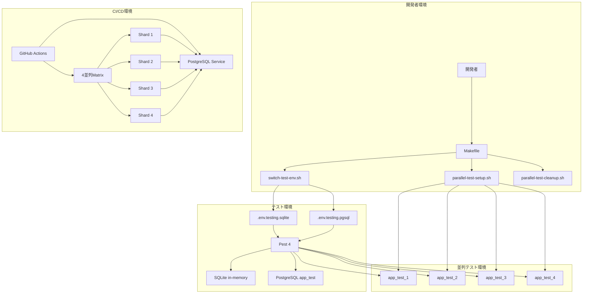
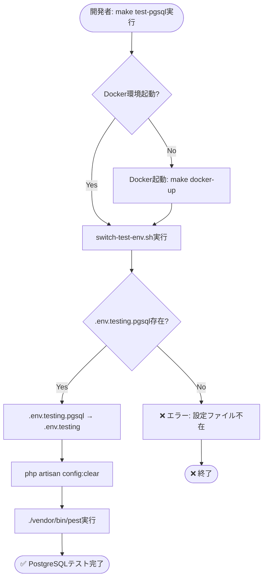
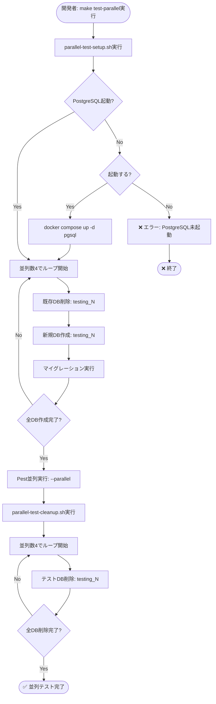
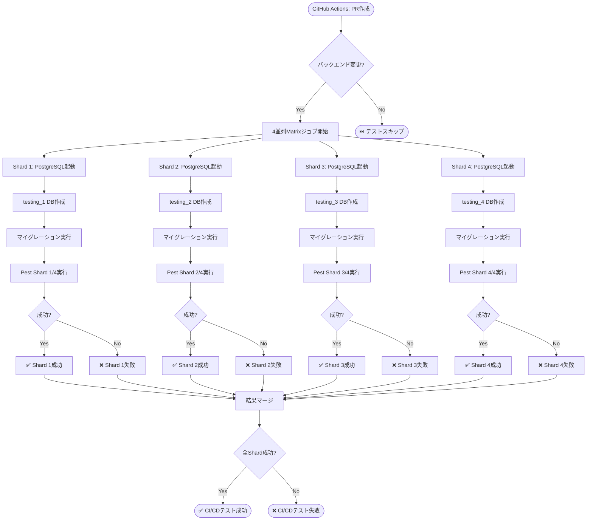
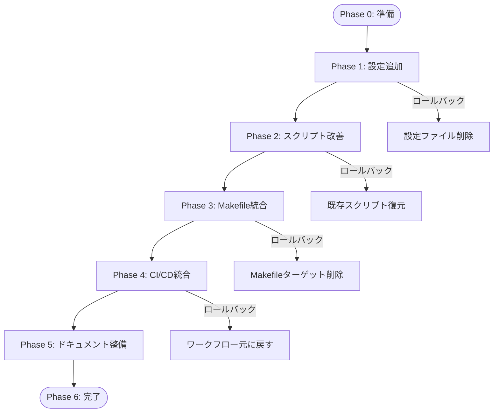

# Technical Design Document

## Overview

本機能は、Laravel 12 + Pest 4テスト環境において、SQLite in-memoryとPostgreSQL 17の両方を使用した柔軟なテストデータベース環境を提供します。開発者は日常開発では高速なSQLiteテストを実行し、CI/CDや本番環境互換性検証ではPostgreSQLテストを実行することで、開発効率と品質保証の両立を実現します。

**Purpose**: 開発速度を維持しながら本番環境互換性を保証するハイブリッドテスト戦略を提供します。

**Users**: バックエンド開発者、テストエンジニア、CI/CDエンジニアが、テスト環境の切り替え、並列テスト実行、CI/CD統合を実施します。

**Impact**: 既存のSQLite中心のテスト環境に、PostgreSQL本番同等環境とワンコマンド切り替え機能を追加します。既存テストは変更なしで動作し、新規テストではPostgreSQL固有機能を活用できます。

### Goals
- SQLite in-memoryによる高速テスト実行の継続（日常開発用）
- PostgreSQL本番同等環境でのテスト実行による互換性保証
- 環境切り替えとテスト実行の自動化・標準化（Makefile統合）
- CI/CD並列PostgreSQLテスト実行による実行時間短縮
- 既存テスト設定との完全互換性維持

### Non-Goals
- 既存テストコードの修正（互換性は維持）
- PostgreSQL専用機能（JSONB、特殊インデックス等）を使用した新規テスト追加
- テストデータのシーディング戦略変更
- パフォーマンステスト環境の構築
- テストDB自動バックアップ

---

## Architecture

### Existing Architecture Analysis

本機能は既存のLaravel 12テスト環境を拡張する形で実装されます。

**現在のアーキテクチャ**:
- **デフォルトDB接続**: SQLite in-memory (`phpunit.xml`にて`DB_CONNECTION=sqlite`、`DB_DATABASE=:memory:`指定)
- **既存PostgreSQL接続**: `pgsql`接続（Port: 13432、本番/開発用）
- **テストフレームワーク**: Pest 4（PHPUnitから完全移行済み、96.1%カバレッジ達成）
- **CI/CD**: GitHub Actions `.github/workflows/test.yml`（4 Shard並列実行）
- **既存インフラ**: Docker Compose、Laravel Sail、PostgreSQL 17、Redis

**保持する既存パターン**:
- `phpunit.xml`のデフォルトSQLite設定（既存テストへの影響を回避）
- Pest 4テストフレームワークの使用
- Docker Compose統合による環境管理
- GitHub Actions並列実行戦略（4 Shard）
- 環境変数ベースの設定管理

**技術的負債の対応**:
- 現在は`.env.testing.pgsql`が既に存在し、PostgreSQLテスト環境を提供しているが、自動切り替えスクリプトが不完全
- 並列テスト実行時のDB管理が手動操作となっており、自動化されていない
- CI/CDでのPostgreSQL並列テスト実行が未統合

### High-Level Architecture

本機能は既存のテスト環境に以下のコンポーネントを追加・強化します。



**Architecture Integration**:
- **既存パターン保持**: `phpunit.xml`のデフォルトSQLite設定、Pest 4、Docker Compose、GitHub Actions
- **新規コンポーネント**: テスト専用PostgreSQL接続設定（`pgsql_testing`、`pgsql_system`）、環境切り替えスクリプト改善、並列テスト自動化スクリプト、CI/CD並列PostgreSQLテスト
- **技術スタック整合**: Laravel 12、PostgreSQL 17、Docker、GitHub Actions（既存スタックに完全準拠）
- **Steering準拠**: モノレポ構造、Docker統合環境、CI/CD最適化、品質管理自動化（.kiro/steering/に準拠）

### Technology Alignment

本機能は既存の技術スタックに完全に整合し、新規依存関係を最小限に抑えます。

**既存技術スタックとの整合**:
- **Backend**: Laravel 12、Pest 4（既存）
- **Database**: PostgreSQL 17、SQLite（既存）
- **Infrastructure**: Docker、Laravel Sail（既存）
- **CI/CD**: GitHub Actions（既存）
- **自動化**: Makefile、Bashスクリプト（既存パターンを拡張）

**新規導入要素**:
- なし（既存ツールの設定・スクリプトのみ追加）

**既存パターンからの逸脱**:
- なし（既存アーキテクチャを拡張する形で実装）

### Key Design Decisions

#### 決定1: テスト専用DB接続の環境変数フォールバック戦略

**Decision**: テスト専用PostgreSQL接続設定（`pgsql_testing`）において、`DB_TEST_*`環境変数が未設定の場合、通常の`DB_*`環境変数にフォールバックする。

**Context**: 開発者が既存のPostgreSQL接続設定を変更せずにテスト環境を使用できるようにする必要がある。また、CI/CD環境では専用のテスト用環境変数を使用し、ローカル環境では既存設定を流用することで、設定の重複を避けたい。

**Alternatives**:
1. **常に`DB_TEST_*`環境変数を必須とする**: 設定の明確化は可能だが、開発者が毎回設定変更する手間が増える
2. **テスト用接続設定を別ファイルに分離**: 設定の可視性は向上するが、既存の環境変数管理パターンと整合しない
3. **`pgsql`接続設定を直接使用**: 実装は単純だが、本番/開発DBとテストDBの分離が不明確になる

**Selected Approach**:
```php
'pgsql_testing' => [
    'driver' => 'pgsql',
    'host' => env('DB_TEST_HOST', env('DB_HOST', '127.0.0.1')),
    'port' => env('DB_TEST_PORT', env('DB_PORT', '5432')),
    'database' => env('DB_TEST_DATABASE', 'app_test'),
    'username' => env('DB_TEST_USERNAME', env('DB_USERNAME', 'postgres')),
    'password' => env('DB_TEST_PASSWORD', env('DB_PASSWORD', '')),
    // PostgreSQL最適化設定を継承
    'connect_timeout' => (int) env('DB_CONNECT_TIMEOUT', 5),
    'sslmode' => env('DB_SSLMODE', 'prefer'),
    // ...
],
```

**Rationale**:
- 既存の`DB_*`環境変数を流用することで、ローカル環境での設定変更が不要
- CI/CD環境では`DB_TEST_*`を明示的に設定することで、テスト専用環境を明確化
- PostgreSQL接続最適化設定（`connect_timeout`、`sslmode`等）を自動継承し、設定の重複を排除

**Trade-offs**:
- **Gain**: 開発者体験の向上（設定変更不要）、既存設定の再利用、CI/CD環境での柔軟性
- **Sacrifice**: 環境変数の優先順位が複雑化（ドキュメント化で対応）

#### 決定2: 並列テスト用DB命名規則とCI/CD統合

**Decision**: 並列テスト実行時に、`testing_1`、`testing_2`、`testing_3`、`testing_4`という命名規則で独立したデータベースを作成し、GitHub ActionsのMatrix戦略と統合する。

**Context**: Pest 4の`--parallel`オプションを使用した並列テスト実行時、複数プロセスが同一データベースにアクセスするとデータ競合が発生する。また、GitHub Actionsの既存4 Shard並列実行戦略と整合させる必要がある。

**Alternatives**:
1. **TEST_TOKENベースの動的DB名生成**: Pest 4の`TEST_TOKEN`環境変数を使用してDB名を生成（例: `testing_${TEST_TOKEN}`）。柔軟性は高いが、CI/CD統合が複雑化
2. **単一DBをトランザクション分離**: 各プロセスを独立したトランザクションで実行。実装は単純だが、トランザクション競合のリスクが残る
3. **プロセス番号ベースの固定DB名**: `testing_1`〜`testing_4`を事前作成。シンプルで予測可能だが、並列数の変更に柔軟性がない

**Selected Approach**:
```bash
# parallel-test-setup.sh
for i in $(seq 1 $PROCESSES); do
    DB_NAME="testing_$i"
    docker compose exec -T pgsql createdb -U sail "$DB_NAME"
    DB_DATABASE="$DB_NAME" php artisan migrate --force
done
```

```yaml
# .github/workflows/test.yml
strategy:
  matrix:
    shard: [1, 2, 3, 4]
steps:
  - run: |
      PGPASSWORD=password psql -h 127.0.0.1 -U sail -d postgres -c 'CREATE DATABASE testing_${{ matrix.shard }};'
  - run: ./vendor/bin/pest --shard=${{ matrix.shard }}/4
    env:
      DB_DATABASE: testing_${{ matrix.shard }}
```

**Rationale**:
- GitHub Actionsの既存Matrix戦略（4 Shard）と完全に整合
- DB名が予測可能で、デバッグ・トラブルシューティングが容易
- 並列数変更時も`PROCESSES`変数を変更するだけで対応可能

**Trade-offs**:
- **Gain**: GitHub Actions統合の単純化、既存並列戦略との整合性、予測可能なDB管理
- **Sacrifice**: 並列数が固定的（4が推奨、変更には追加設定が必要）

#### 決定3: Makefile中心の運用標準化とスクリプト統合

**Decision**: 複雑なテストコマンドをMakefileターゲットに集約し、Bashスクリプトを内部的に呼び出す形で統一運用フローを提供する。

**Context**: 開発者がSQLite/PostgreSQL環境切り替え、並列テスト実行、CI/CD相当テストを実行する際、コマンドが複雑化しエラーが発生しやすい。既存のMakefileベースの運用パターンに統合する必要がある。

**Alternatives**:
1. **Composerスクリプトに統合**: `composer test-pgsql`のような形で提供。PHPエコシステムとの整合性は高いが、環境管理コマンドとの統合が困難
2. **専用CLIツール作成**: Artisanコマンドとしてテスト環境管理を提供。機能性は高いが、既存のMakefile運用パターンと乖離
3. **Bashスクリプト単体実行**: `./scripts/switch-test-env.sh pgsql && ./vendor/bin/pest`。柔軟性は高いが、運用標準化が困難

**Selected Approach**:
```makefile
quick-test: ## SQLite高速テスト（開発用）
	cd $(LARAVEL_DIR) && ./vendor/bin/pest

test-pgsql: ## PostgreSQL本番同等テスト
	$(MAKE) docker-up
	./$(SCRIPTS_DIR)/switch-test-env.sh pgsql
	cd $(LARAVEL_DIR) && ./vendor/bin/pest

test-parallel: ## 並列テスト実行
	./$(SCRIPTS_DIR)/parallel-test-setup.sh 4
	cd $(LARAVEL_DIR) && ./vendor/bin/pest --parallel
	./$(SCRIPTS_DIR)/parallel-test-cleanup.sh 4

ci-test: ## CI/CD相当の完全テスト
	$(MAKE) test-switch-pgsql
	$(MAKE) test-parallel
	$(MAKE) test-coverage
```

**Rationale**:
- 既存のMakefileベース運用パターンに完全統合
- `make quick-test`、`make ci-test`のような直感的なターゲット名で実行可能
- Bashスクリプトの詳細を隠蔽し、開発者体験を向上
- CI/CD環境でも同じMakefileターゲットを使用可能

**Trade-offs**:
- **Gain**: 運用標準化、開発者体験の向上、既存パターンとの整合性、CI/CD統合の単純化
- **Sacrifice**: Makefileへの依存度増加（Windows環境ではWSL/Docker推奨が必要）

---

## System Flows

### テスト環境切り替えフロー



### 並列テスト環境セットアップフロー



### CI/CD並列PostgreSQLテストフロー



---

## Requirements Traceability

| 要件 | 要件概要 | コンポーネント | インターフェース | フロー |
|------|---------|--------------|--------------|-------|
| 1.1-1.7 | テスト専用データベース接続設定 | `config/database.php` | `pgsql_testing`、`pgsql_system`接続設定 | - |
| 2.1-2.8 | 環境別テスト設定ファイル | `.env.testing.sqlite`、`.env.testing.pgsql` | 環境変数設定 | - |
| 3.1-3.8 | テスト環境切り替え自動化 | `scripts/switch-test-env.sh` | `./scripts/switch-test-env.sh {sqlite\|pgsql}` | テスト環境切り替えフロー |
| 4.1-4.9 | 並列テスト用データベース管理 | `scripts/parallel-test-setup.sh`、`scripts/parallel-test-cleanup.sh` | `./scripts/parallel-test-setup.sh [N]` | 並列テスト環境セットアップフロー |
| 5.1-5.11 | Makefile統合による運用標準化 | `Makefile` | `make quick-test`、`make test-pgsql`、`make ci-test` | 全フロー統合 |
| 6.1-6.6 | Docker環境でのテスト用DB提供 | Docker Compose、PostgreSQL | `app_test`データベース | - |
| 7.1-7.10 | CI/CD並列PostgreSQLテスト実行 | `.github/workflows/test.yml` | GitHub Actions Matrix戦略 | CI/CD並列PostgreSQLテストフロー |
| 8.1-8.10 | テスト実行ドキュメント整備 | `docs/TESTING_DATABASE_WORKFLOW.md`、`README.md` | ドキュメント | - |
| 9.1-9.5 | 既存設定との互換性維持 | `phpunit.xml`、既存テストコード | デフォルトSQLite設定維持 | - |
| 10.1-10.8 | 品質基準とセキュリティ | Laravel Pint、Larastan、`.gitignore` | コード品質管理、機密情報管理 | - |

---

## Components and Interfaces

### Configuration Layer

#### config/database.php - Database Connection Configuration

**Responsibility & Boundaries**:
- **Primary Responsibility**: テスト専用PostgreSQL接続設定の提供
- **Domain Boundary**: インフラ設定層（既存の`pgsql`接続と分離）
- **Data Ownership**: データベース接続設定の管理
- **Transaction Boundary**: 該当なし（設定ファイル）

**Dependencies**:
- **Inbound**: Laravel設定システム、Pest 4テストランナー
- **Outbound**: PostgreSQLコンテナ（Docker Compose）、環境変数（`.env.testing.*`）
- **External**: なし

**Contract Definition**:

**Service Interface**:
```php
// config/database.php - connections配列に追加
return [
    'connections' => [
        // 既存のsqlite、pgsql接続は維持

        // テスト専用PostgreSQL接続
        'pgsql_testing' => [
            'driver' => 'pgsql',
            'url' => env('DB_URL'),
            'host' => env('DB_TEST_HOST', env('DB_HOST', '127.0.0.1')),
            'port' => env('DB_TEST_PORT', env('DB_PORT', '5432')),
            'database' => env('DB_TEST_DATABASE', 'app_test'),
            'username' => env('DB_TEST_USERNAME', env('DB_USERNAME', 'postgres')),
            'password' => env('DB_TEST_PASSWORD', env('DB_PASSWORD', '')),
            'charset' => env('DB_CHARSET', 'utf8'),
            'prefix' => '',
            'prefix_indexes' => true,
            'search_path' => env('DB_SEARCH_PATH', 'public'),
            'sslmode' => env('DB_SSLMODE', 'prefer'),
            'connect_timeout' => (int) env('DB_CONNECT_TIMEOUT', 5),
            'application_name' => env('DB_APP_NAME', 'laravel-next-b2c-api') . '-test',
            'statement_timeout' => (int) env('DB_STATEMENT_TIMEOUT', 60000),
            'idle_in_transaction_session_timeout' => (int) env('DB_IDLE_TX_TIMEOUT', 60000),
            'lock_timeout' => (int) env('DB_LOCK_TIMEOUT', 0),
        ],

        // 並列テスト用管理系接続（DB作成・削除用）
        'pgsql_system' => [
            'driver' => 'pgsql',
            'url' => env('DB_URL'),
            'host' => env('DB_TEST_HOST', env('DB_HOST', '127.0.0.1')),
            'port' => env('DB_TEST_PORT', env('DB_PORT', '5432')),
            'database' => env('DB_TEST_ADMIN_DB', 'postgres'),
            'username' => env('DB_TEST_USERNAME', env('DB_USERNAME', 'postgres')),
            'password' => env('DB_TEST_PASSWORD', env('DB_PASSWORD', '')),
            'charset' => 'utf8',
            'prefix' => '',
            'prefix_indexes' => true,
            'search_path' => 'public',
            'sslmode' => env('DB_SSLMODE', 'prefer'),
        ],
    ],
];
```

**Preconditions**:
- PostgreSQLコンテナが起動していること（PostgreSQL接続使用時）
- 環境変数が適切に設定されていること（`.env.testing.*`経由）

**Postconditions**:
- `pgsql_testing`接続でテスト用DBに接続可能
- `pgsql_system`接続でDB管理操作（作成・削除）が可能
- 既存の`pgsql`接続は影響を受けない

**Invariants**:
- テスト用接続は常に本番/開発DBと分離される（DB名: `app_test`、`testing_*`）
- PostgreSQL最適化設定（`connect_timeout`、`sslmode`等）を継承する

#### .env.testing.sqlite / .env.testing.pgsql - Environment Configuration Files

**Responsibility & Boundaries**:
- **Primary Responsibility**: SQLite/PostgreSQL環境別のテスト設定提供
- **Domain Boundary**: 環境設定層（`phpunit.xml`のデフォルト設定と分離）
- **Data Ownership**: 環境変数の管理
- **Transaction Boundary**: 該当なし（設定ファイル）

**Dependencies**:
- **Inbound**: `switch-test-env.sh`、`phpunit.xml`
- **Outbound**: Laravel設定システム、データベース接続
- **External**: なし

**Contract Definition**:

**Configuration Schema**:

`.env.testing.sqlite`:
```env
APP_ENV=testing
DB_CONNECTION=sqlite
DB_DATABASE=:memory:
CACHE_STORE=array
QUEUE_CONNECTION=sync
MAIL_MAILER=array
BCRYPT_ROUNDS=4
```

`.env.testing.pgsql`:
```env
APP_ENV=testing
DB_CONNECTION=pgsql_testing
DB_TEST_HOST=pgsql        # Docker環境
DB_TEST_PORT=13432        # 統一ポート
DB_TEST_DATABASE=app_test # テスト用DB
DB_TEST_USERNAME=sail
DB_TEST_PASSWORD=secret
CACHE_STORE=array
QUEUE_CONNECTION=sync
MAIL_MAILER=array
BCRYPT_ROUNDS=4
```

**Preconditions**:
- ファイルが`backend/laravel-api/`ディレクトリに配置されていること

**Postconditions**:
- 環境別のテスト設定が適用される
- `switch-test-env.sh`経由で`.env.testing`に反映される

### Automation Layer

#### scripts/switch-test-env.sh - Test Environment Switcher

**Responsibility & Boundaries**:
- **Primary Responsibility**: SQLite/PostgreSQL環境をワンコマンドで切り替え
- **Domain Boundary**: 環境管理層（テスト実行とは分離）
- **Data Ownership**: `.env.testing`ファイルの管理
- **Transaction Boundary**: ファイルコピー操作の原子性保証

**Dependencies**:
- **Inbound**: `Makefile`（`make test-switch-sqlite`、`make test-switch-pgsql`）
- **Outbound**: `.env.testing.sqlite`、`.env.testing.pgsql`、Laravel設定システム
- **External**: Bashシェル、ファイルシステム

**Contract Definition**:

**CLI Interface**:
```bash
./scripts/switch-test-env.sh {sqlite|pgsql}
```

| 引数 | 必須 | 説明 | デフォルト値 |
|------|------|------|-------------|
| `$1` | Yes | 環境タイプ（`sqlite`または`pgsql`） | なし |

**出力**:
- 成功: `✅ Switched to [環境タイプ] test environment`
- エラー: `❌ エラーメッセージ`（exit code 1）

**Preconditions**:
- `.env.testing.sqlite`および`.env.testing.pgsql`が存在すること
- `backend/laravel-api/`ディレクトリが存在すること

**Postconditions**:
- `.env.testing`が指定環境の設定で上書きされる
- `php artisan config:clear`が実行され、設定キャッシュがクリアされる

**Invariants**:
- `.env.testing.sqlite`、`.env.testing.pgsql`は変更されない（読み取り専用として扱う）

**Implementation Note**:
既存スクリプト(`scripts/switch-test-env.sh`)を改善し、以下を追加:
- `php artisan config:clear`の自動実行
- エラーハンドリングの強化
- 成功メッセージの詳細化（接続情報表示）

#### scripts/parallel-test-setup.sh - Parallel Test Database Setup

**Responsibility & Boundaries**:
- **Primary Responsibility**: 並列テスト用PostgreSQLデータベースの自動作成・マイグレーション
- **Domain Boundary**: テストインフラ管理層
- **Data Ownership**: 並列テスト用データベース（`testing_1`〜`testing_N`）の管理
- **Transaction Boundary**: 各DB作成・マイグレーション操作の独立性保証

**Dependencies**:
- **Inbound**: `Makefile`（`make test-setup`、`make test-parallel`）
- **Outbound**: PostgreSQLコンテナ（Docker Compose）、Laravel Artisan
- **External**: Docker CLI、PostgreSQL CLI（`createdb`、`dropdb`）

**Contract Definition**:

**CLI Interface**:
```bash
./scripts/parallel-test-setup.sh [processes]
```

| 引数 | 必須 | 説明 | デフォルト値 |
|------|------|------|-------------|
| `$1` | No | 並列プロセス数 | 4 |

**処理フロー**:
1. PostgreSQLコンテナ起動確認（未起動時はプロンプト表示）
2. 並列数分のループ実行:
   - 既存DB削除（`dropdb --if-exists testing_$i`）
   - 新規DB作成（`createdb testing_$i`）
   - マイグレーション実行（`DB_DATABASE=testing_$i php artisan migrate --force`）
3. 成功メッセージ表示

**Preconditions**:
- PostgreSQLコンテナが起動していること（または起動可能であること）
- `backend/laravel-api/`ディレクトリが存在すること

**Postconditions**:
- 並列数分の独立したテスト用DBが作成される（`testing_1`〜`testing_N`）
- 各DBにマイグレーションが適用される

**Error Handling**:
- PostgreSQL未起動時: インタラクティブプロンプトで起動確認
- DB作成失敗時: エラーメッセージ表示（exit code 1）

**Implementation Note**:
既存スクリプト(`scripts/parallel-test-setup.sh`)を改善し、以下を追加:
- DB命名規則の統一（`app_test_N` → `testing_N`に変更）
- マイグレーション実行の並列化検討（現在は順次実行）

#### scripts/parallel-test-cleanup.sh - Parallel Test Database Cleanup

**Responsibility & Boundaries**:
- **Primary Responsibility**: 並列テスト用PostgreSQLデータベースの自動削除
- **Domain Boundary**: テストインフラ管理層
- **Data Ownership**: 並列テスト用データベース（`testing_1`〜`testing_N`）の削除
- **Transaction Boundary**: 各DB削除操作の独立性保証

**Dependencies**:
- **Inbound**: `Makefile`（`make test-cleanup`、`make test-parallel`）
- **Outbound**: PostgreSQLコンテナ（Docker Compose）
- **External**: Docker CLI、PostgreSQL CLI（`dropdb`）

**Contract Definition**:

**CLI Interface**:
```bash
./scripts/parallel-test-cleanup.sh [processes]
```

| 引数 | 必須 | 説明 | デフォルト値 |
|------|------|------|-------------|
| `$1` | No | 並列プロセス数 | 4 |

**処理フロー**:
1. PostgreSQLコンテナ起動確認（未起動時はプロンプト表示）
2. 並列数分のループ実行:
   - DB削除（`dropdb --if-exists testing_$i`）
3. 一時ファイル削除（ログ、キャッシュ等）
4. 成功メッセージ表示

**Preconditions**:
- `backend/laravel-api/`ディレクトリが存在すること
- PostgreSQLコンテナが起動していること（推奨）

**Postconditions**:
- 並列数分のテスト用DBが削除される
- 一時ファイルが削除される

**Error Handling**:
- PostgreSQL未起動時: インタラクティブプロンプトで継続確認
- DB削除失敗時: 警告メッセージ表示（既に削除済みの場合は無視）

#### Makefile - Unified Test Workflow

**Responsibility & Boundaries**:
- **Primary Responsibility**: テストワークフローの統一運用インターフェース提供
- **Domain Boundary**: 開発者体験層（最上位の運用インターフェース）
- **Data Ownership**: なし（他コンポーネントのオーケストレーション）
- **Transaction Boundary**: 各ターゲット実行の独立性保証

**Dependencies**:
- **Inbound**: 開発者CLI、CI/CDスクリプト
- **Outbound**: `switch-test-env.sh`、`parallel-test-setup.sh`、`parallel-test-cleanup.sh`、Pest 4、Docker Compose
- **External**: GNU Make、Bashシェル

**Contract Definition**:

**Makefile Targets**:

| ターゲット | 説明 | 実行内容 |
|-----------|------|---------|
| `quick-test` | SQLite高速テスト（開発用） | `cd $(LARAVEL_DIR) && ./vendor/bin/pest` |
| `test-pgsql` | PostgreSQL本番同等テスト | Docker起動確認 → PostgreSQL環境切り替え → Pest実行 |
| `test-parallel` | 並列テスト実行 | 並列環境セットアップ → Pest並列実行 → クリーンアップ |
| `test-coverage` | カバレッジ付きテスト実行 | `XDEBUG_MODE=coverage ./vendor/bin/pest --coverage --min=85` |
| `test-switch-sqlite` | SQLite環境に切り替え | `./$(SCRIPTS_DIR)/switch-test-env.sh sqlite` |
| `test-switch-pgsql` | PostgreSQL環境に切り替え | `./$(SCRIPTS_DIR)/switch-test-env.sh pgsql` |
| `test-setup` | 並列テスト環境セットアップ | `./$(SCRIPTS_DIR)/parallel-test-setup.sh 4` |
| `test-cleanup` | 並列テスト環境クリーンアップ | `./$(SCRIPTS_DIR)/parallel-test-cleanup.sh 4` |
| `ci-test` | CI/CD相当の完全テスト | PostgreSQL切り替え → 並列実行 → カバレッジ生成 |

**Preconditions**:
- `backend/laravel-api/`ディレクトリが存在すること
- `scripts/`ディレクトリにスクリプトが配置されていること
- Docker Composeが利用可能であること（PostgreSQL使用時）

**Postconditions**:
- 各ターゲット実行後、テスト結果が表示される
- エラー発生時は適切なエラーメッセージが表示される

**Implementation Note**:
既存Makefile(`Makefile`)を改善し、以下を追加:
- `test-pgsql`ターゲットでのDocker起動確認（`docker compose ps pgsql | grep -q "Up"`）
- `test-parallel`ターゲットでのセットアップ・実行・クリーンアップの統合
- `ci-test`ターゲットの最適化（PostgreSQL環境 → 並列実行 → カバレッジ）

### CI/CD Layer

#### .github/workflows/test.yml - GitHub Actions Test Workflow

**Responsibility & Boundaries**:
- **Primary Responsibility**: CI/CD環境での並列PostgreSQLテスト自動実行
- **Domain Boundary**: CI/CD統合層
- **Data Ownership**: テスト実行結果、アーティファクト
- **Transaction Boundary**: 各Shardジョブの独立性保証

**Dependencies**:
- **Inbound**: GitHub Pull Request、Push イベント
- **Outbound**: PostgreSQL Service、Pest 4、Composer
- **External**: GitHub Actions、PostgreSQL Docker Image

**Contract Definition**:

**Workflow Configuration**:
```yaml
name: Tests

concurrency:
  group: ${{ github.workflow }}-${{ github.event_name }}-${{ github.ref }}
  cancel-in-progress: ${{ github.event_name == 'pull_request' }}

on:
  pull_request:
    types: [opened, synchronize, reopened, ready_for_review]
    paths:
      - 'backend/laravel-api/**'

jobs:
  test-pgsql:
    runs-on: ubuntu-latest
    strategy:
      fail-fast: false
      matrix:
        shard: [1, 2, 3, 4]

    services:
      postgres:
        image: postgres:17-alpine
        env:
          POSTGRES_USER: sail
          POSTGRES_PASSWORD: password
          POSTGRES_DB: postgres
        ports:
          - 13432:5432
        options: >-
          --health-cmd="pg_isready -U sail"
          --health-interval=10s
          --health-timeout=5s
          --health-retries=5

    steps:
      - uses: actions/checkout@v4

      - name: Setup PHP
        uses: shivammathur/setup-php@v2
        with:
          php-version: 8.4
          extensions: pdo, pdo_pgsql

      - name: Install dependencies
        run: composer install --no-interaction
        working-directory: backend/laravel-api

      - name: Setup test database
        run: |
          PGPASSWORD=password psql -h 127.0.0.1 -U sail -d postgres -c 'CREATE DATABASE testing_${{ matrix.shard }};'

      - name: Run migrations
        run: php artisan migrate --force
        working-directory: backend/laravel-api
        env:
          DB_CONNECTION: pgsql_testing
          DB_TEST_HOST: 127.0.0.1
          DB_TEST_PORT: 13432
          DB_TEST_DATABASE: testing_${{ matrix.shard }}
          DB_TEST_USERNAME: sail
          DB_TEST_PASSWORD: password

      - name: Run tests (PostgreSQL Shard ${{ matrix.shard }}/4)
        run: ./vendor/bin/pest --shard=${{ matrix.shard }}/4
        working-directory: backend/laravel-api
        env:
          DB_CONNECTION: pgsql_testing
          DB_TEST_HOST: 127.0.0.1
          DB_TEST_PORT: 13432
          DB_TEST_DATABASE: testing_${{ matrix.shard }}
          DB_TEST_USERNAME: sail
          DB_TEST_PASSWORD: password
```

**Preconditions**:
- Pull Requestが作成されたこと
- バックエンドファイルが変更されたこと（`backend/laravel-api/**`）

**Postconditions**:
- 4並列でPostgreSQLテストが実行される
- 各Shardの結果がGitHub Actionsに表示される
- 全Shard成功時、ワークフロー成功

**Error Handling**:
- PostgreSQL Service起動失敗時: ワークフロー失敗
- テスト失敗時: 該当Shardが失敗、他Shardは継続実行（`fail-fast: false`）

**Implementation Note**:
既存ワークフロー(`.github/workflows/test.yml`)を改善し、以下を追加:
- `test-pgsql`ジョブの追加（4並列Matrix戦略）
- `pgsql_testing`接続設定の環境変数指定
- Shard別DB作成・マイグレーション処理

---

## Data Models

### Environment Configuration Schema

本機能は既存のデータベーススキーマを変更せず、環境設定のみを拡張します。

**環境変数スキーマ** (`.env.testing.*`):

| 環境変数 | 型 | デフォルト値 | 説明 |
|---------|---|------------|------|
| `APP_ENV` | string | `testing` | アプリケーション環境 |
| `DB_CONNECTION` | string | `sqlite` (SQLite) / `pgsql_testing` (PostgreSQL) | データベース接続名 |
| `DB_DATABASE` | string | `:memory:` (SQLite) / `app_test` (PostgreSQL) | データベース名 |
| `DB_TEST_HOST` | string | `pgsql` (Docker) / `127.0.0.1` (Native) | PostgreSQLホスト |
| `DB_TEST_PORT` | integer | `13432` | PostgreSQLポート |
| `DB_TEST_USERNAME` | string | `sail` | PostgreSQLユーザー名 |
| `DB_TEST_PASSWORD` | string | `secret` | PostgreSQLパスワード |
| `CACHE_STORE` | string | `array` | キャッシュストア |
| `QUEUE_CONNECTION` | string | `sync` | キュー接続 |
| `MAIL_MAILER` | string | `array` | メールドライバー |

**データベース命名規則**:

| データベース名 | 用途 | 作成タイミング | 削除タイミング |
|--------------|------|---------------|---------------|
| `app_test` | 単一PostgreSQLテスト用 | 手動またはDocker初期化時 | 手動 |
| `testing_1`〜`testing_N` | 並列PostgreSQLテスト用 | `parallel-test-setup.sh`実行時 | `parallel-test-cleanup.sh`実行時 |

---

## Error Handling

### Error Strategy

本機能では、環境設定エラー、Docker環境エラー、データベース接続エラーを明確に区別し、開発者が迅速に問題を特定できるエラーハンドリングを実装します。

### Error Categories and Responses

#### User Errors (設定エラー)

**Invalid Environment Type** (`switch-test-env.sh`):
- **発生条件**: 引数が`sqlite`または`pgsql`以外
- **エラーメッセージ**: `❌ 不正な環境名です: [引数]`
- **ガイダンス**: `使用方法: $0 {sqlite|pgsql}`
- **復旧方法**: 正しい引数で再実行

**Missing Configuration File** (`switch-test-env.sh`):
- **発生条件**: `.env.testing.sqlite`または`.env.testing.pgsql`が存在しない
- **エラーメッセージ**: `❌ [環境]設定ファイルが見つかりません: [ファイルパス]`
- **ガイダンス**: `.env.testing.[環境].example`をコピーして作成するよう指示
- **復旧方法**: 設定ファイル作成後に再実行

**Invalid Parallel Process Count** (`parallel-test-setup.sh`):
- **発生条件**: 並列数が0または負の値
- **エラーメッセージ**: `❌ 不正な並列数です: [引数]`
- **ガイダンス**: `並列数は1以上の整数を指定してください`
- **復旧方法**: 正しい並列数で再実行

#### System Errors (インフラエラー)

**PostgreSQL Container Not Running** (`test-pgsql`、`parallel-test-setup.sh`):
- **発生条件**: PostgreSQLコンテナが起動していない
- **エラーメッセージ**: `⚠️ PostgreSQLコンテナが起動していません`
- **ガイダンス**: `起動しますか？ (y/N)` （インタラクティブプロンプト）
- **復旧方法**: `docker compose up -d pgsql`で起動、またはスクリプトが自動起動

**Database Connection Failure** (Pest実行時):
- **発生条件**: PostgreSQL接続設定が誤っている、ネットワーク問題
- **エラーメッセージ**: Laravel標準エラー + `SQLSTATE[08006] [7] connection to server failed`
- **ガイダンス**: `docs/TESTING_DATABASE_WORKFLOW.md`の「PostgreSQL接続エラー」セクション参照を促す
- **復旧方法**: 環境変数確認、Docker環境再起動

**Database Creation Failure** (`parallel-test-setup.sh`):
- **発生条件**: DB作成権限不足、ディスク容量不足
- **エラーメッセージ**: `❌ データベース作成に失敗しました: [DB名]`
- **ガイダンス**: PostgreSQLログ確認を促す（`docker compose logs pgsql`）
- **復旧方法**: 権限確認、ディスク容量確認

#### Business Logic Errors (テスト実行エラー)

**Migration Failure** (`parallel-test-setup.sh`、CI/CD):
- **発生条件**: マイグレーションファイルエラー、DB互換性問題
- **エラーメッセージ**: Laravel Artisan標準エラー
- **ガイダンス**: マイグレーションファイル確認、PostgreSQL互換性確認
- **復旧方法**: マイグレーション修正、`php artisan migrate:rollback`で巻き戻し

**Test Execution Failure** (Pest実行時):
- **発生条件**: テストコードエラー、アサーション失敗
- **エラーメッセージ**: Pest標準エラー（ファイル名、行番号、失敗内容）
- **ガイダンス**: テストコード確認、PostgreSQL固有機能の使用確認
- **復旧方法**: テストコード修正、SQLite環境で再実行して問題切り分け

### Monitoring

**ローカル開発環境**:
- **ログ出力**: `storage/logs/laravel.log`（Laravel標準）
- **PostgreSQLログ**: `docker compose logs pgsql`
- **エラー追跡**: Pest標準エラー出力（スタックトレース含む）

**CI/CD環境**:
- **GitHub Actionsログ**: 各Stepのログ出力
- **テスト結果**: Pest標準出力（Shard別）
- **アーティファクト**: テストレポート、ログファイル（失敗時のみ保存）

**ヘルスチェック**:
- `make health`ターゲット: Docker環境、Laravel設定、テスト環境、データベース接続の総合チェック

---

## Testing Strategy

### Unit Tests

本機能は設定・スクリプトベースのため、ユニットテストは主にスクリプトのロジックテストとなります。

1. **`switch-test-env.sh`引数検証テスト**
   - 正常系: `sqlite`、`pgsql`引数で正しくファイルコピー
   - 異常系: 無効な引数でエラーメッセージ表示
   - 境界値: 引数なし、複数引数でエラーハンドリング

2. **環境変数フォールバック動作テスト** (`config/database.php`)
   - `DB_TEST_*`設定時: 専用環境変数を使用
   - `DB_TEST_*`未設定時: `DB_*`にフォールバック
   - デフォルト値検証: `app_test`、`127.0.0.1`等

3. **並列DB命名規則テスト** (`parallel-test-setup.sh`)
   - 正常系: `testing_1`〜`testing_4`が作成される
   - 異常系: 並列数0でエラー
   - 境界値: 並列数1、10で正しくDB作成

### Integration Tests

1. **SQLite環境テスト実行** (`make quick-test`)
   - 既存Pestテストが全て成功すること
   - `.env.testing.sqlite`設定が適用されること
   - SQLite in-memoryで実行されること（`DB_DATABASE=:memory:`）

2. **PostgreSQL環境テスト実行** (`make test-pgsql`)
   - 既存Pestテストが全て成功すること
   - `.env.testing.pgsql`設定が適用されること
   - `app_test`データベースで実行されること
   - マイグレーションが適用されること

3. **環境切り替え動作テスト** (`make test-switch-sqlite` → `make test-switch-pgsql`)
   - SQLite → PostgreSQL切り替えが正常動作
   - PostgreSQL → SQLite切り替えが正常動作
   - `.env.testing`が正しく上書きされること
   - `php artisan config:clear`が実行されること

4. **並列テスト実行テスト** (`make test-parallel`)
   - 4つのDB（`testing_1`〜`testing_4`）が作成されること
   - 各DBにマイグレーションが適用されること
   - Pest並列実行が成功すること
   - クリーンアップ後、テストDBが削除されること

### E2E/CI Tests

1. **GitHub Actions並列PostgreSQLテスト**
   - 4 Shard並列実行が成功すること
   - 各Shardが独立したDB（`testing_1`〜`testing_4`）を使用すること
   - PostgreSQL Service起動が成功すること
   - 全Shard成功時、ワークフロー成功

2. **CI/CD統合テスト** (`make ci-test`)
   - PostgreSQL環境切り替え成功
   - 並列テスト実行成功
   - カバレッジ生成成功
   - 全ステップが順次実行されること

3. **Docker環境統合テスト**
   - `docker compose up -d pgsql`で起動成功
   - `app_test`データベース作成成功
   - PostgreSQL接続成功（`psql -U sail -l | grep app_test`）

### Performance/Load Tests

1. **SQLite vs PostgreSQL実行時間比較**
   - SQLiteテスト実行時間 < PostgreSQLテスト実行時間
   - 目標: SQLite実行時間が50%以下（高速化検証）

2. **並列テスト実行時間測定**
   - 並列実行時間 < 順次実行時間
   - 目標: 4並列で実行時間が60%以下（並列化効果検証）

3. **CI/CD実行時間最適化検証**
   - Composerキャッシュヒット率 > 80%
   - 並列実行によるCI/CD時間短縮効果測定

---

## Security Considerations

### Threat Modeling

**脅威1: テストDB設定の本番環境への誤適用**
- **リスク**: `.env.testing.*`が本番環境で誤って使用され、テスト用DBに接続
- **対策**:
  - 環境変数に`APP_ENV=testing`を明示
  - 本番環境では`.env.testing`を使用しない（`.gitignore`に追加）
  - テスト用DB名を明確化（`app_test`、`testing_*`プレフィックス）

**脅威2: テストDB認証情報の漏洩**
- **リスク**: `.env.testing.pgsql`にパスワードが平文で記載され、リポジトリに含まれる
- **対策**:
  - `.env.testing.*`を`.gitignore`に追加
  - `.env.testing.*.example`をテンプレートとして提供
  - CI/CD環境ではGitHub Secrets使用を推奨

**脅威3: 並列テスト時のDB競合・データ漏洩**
- **リスク**: 並列テスト間でDBが共有され、テストデータが混在
- **対策**:
  - 並列数分の独立したDB作成（`testing_1`〜`testing_N`）
  - 各ShardでDB名を環境変数指定（`DB_DATABASE=testing_${SHARD}`）

### Authentication and Authorization

本機能はテスト環境のみを対象とし、認証・認可は既存のLaravel Sanctumテスト設定に依存します。

**テストDB接続認証**:
- **ローカル環境**: Docker Compose環境変数（`POSTGRES_USER=sail`、`POSTGRES_PASSWORD=password`）
- **CI/CD環境**: GitHub Actions環境変数（`DB_TEST_USERNAME=sail`、`DB_TEST_PASSWORD=password`）
- **推奨**: 本番環境とは異なる認証情報を使用（テスト用認証情報を明確化）

### Data Protection

**機密情報管理**:
- `.env.testing.*`を`.gitignore`に追加（既存パターンを拡張）
- `.env.testing.*.example`をテンプレートとして提供（パスワードは空白）
- CI/CD環境ではGitHub Secretsで認証情報管理

**テストデータ保護**:
- テストDB（`app_test`、`testing_*`）は開発環境専用、本番データを含まない
- 並列テスト終了後、自動クリーンアップ（`parallel-test-cleanup.sh`）

---

## Performance & Scalability

### Target Metrics

| メトリクス | 目標値 | 測定方法 |
|-----------|-------|---------|
| SQLiteテスト実行時間 | < 30秒（全テスト） | `time make quick-test` |
| PostgreSQLテスト実行時間 | < 60秒（全テスト） | `time make test-pgsql` |
| 並列テスト実行時間短縮率 | > 40%（4並列時） | 順次実行 vs 並列実行の比較 |
| CI/CD実行時間短縮率 | > 30%（4 Shard並列時） | Matrix戦略導入前後の比較 |
| Composerキャッシュヒット率 | > 80% | GitHub Actionsログ確認 |

### Scaling Approaches

**水平スケーリング（並列数増加）**:
- 並列数を4から8、16に増加可能（`PROCESSES`変数で制御）
- CI/CDでは`matrix.shard`を拡張（例: `[1, 2, 3, 4, 5, 6, 7, 8]`）
- 制約: PostgreSQL接続数上限、GitHub Actions並列実行数制限

**垂直スケーリング（実行環境強化）**:
- ローカル環境: Dockerリソース増加（CPU、メモリ）
- CI/CD環境: `runs-on: ubuntu-latest-8-cores`等の高性能ランナー使用

### Caching Strategies

**Composerキャッシング**（CI/CD）:
```yaml
- name: Cache Composer dependencies
  uses: actions/cache@v4
  with:
    path: ${{ steps.composer-cache.outputs.dir }}
    key: ${{ runner.os }}-composer-${{ hashFiles('backend/laravel-api/composer.lock') }}
```

**Laravel設定キャッシュ**（ローカル）:
- `php artisan config:cache`の活用（本番環境のみ推奨、テスト環境では非推奨）
- 環境切り替え時の`php artisan config:clear`による確実なキャッシュクリア

**PostgreSQL接続プーリング**:
- Laravel標準の接続プール（`pdo`ドライバー）を使用
- テスト環境では`persistent: false`を推奨（接続リーク防止）

---

## Migration Strategy

本機能は既存テスト環境への追加機能のため、段階的移行戦略を採用します。



### Phase 1: 設定追加（後方互換性維持）
**実施内容**:
- `config/database.php`に`pgsql_testing`、`pgsql_system`接続追加
- `.env.testing.sqlite.example`、`.env.testing.pgsql.example`作成
- `.gitignore`に`.env.testing.*`追加

**検証基準**:
- 既存Pestテストが全て成功（SQLite環境）
- `phpunit.xml`のデフォルト設定が変更されていないこと

**ロールバックトリガー**:
- 既存テスト失敗、設定エラー発生

### Phase 2: スクリプト改善（既存スクリプト拡張）
**実施内容**:
- `scripts/switch-test-env.sh`改善（`php artisan config:clear`追加、エラーハンドリング強化）
- `scripts/parallel-test-setup.sh`改善（DB命名規則統一、マイグレーション自動化）
- `scripts/parallel-test-cleanup.sh`改善（一時ファイル削除追加）

**検証基準**:
- `make test-switch-sqlite`、`make test-switch-pgsql`が正常動作
- `make test-parallel`が成功

**ロールバックトリガー**:
- スクリプト実行エラー、環境破壊

### Phase 3: Makefile統合（運用標準化）
**実施内容**:
- Makefileに`quick-test`、`test-pgsql`、`test-parallel`、`ci-test`ターゲット追加
- 既存ターゲット（`test`、`lint`等）との整合性確保

**検証基準**:
- 全Makefileターゲットが正常動作
- `make ci-test`が成功

**ロールバックトリガー**:
- Makefileエラー、既存ターゲット破壊

### Phase 4: CI/CD統合（並列PostgreSQLテスト）
**実施内容**:
- `.github/workflows/test.yml`に`test-pgsql`ジョブ追加
- 4並列Matrix戦略実装
- PostgreSQL Service統合

**検証基準**:
- GitHub Actions並列実行成功
- 全Shard成功

**ロールバックトリガー**:
- CI/CD実行失敗、タイムアウト

### Phase 5: ドキュメント整備（運用ガイド提供）
**実施内容**:
- `docs/TESTING_DATABASE_WORKFLOW.md`作成
- `README.md`テスト実行セクション更新
- トラブルシューティングガイド追加

**検証基準**:
- ドキュメント通りに実行可能
- 新規開発者が5分以内に環境構築可能

**ロールバックトリガー**:
- ドキュメント誤記、実行不可能な手順

### Rollback Strategy

各Phaseでのロールバック手順:

1. **Phase 1ロールバック**: `config/database.php`から追加接続削除、`.env.testing.*`削除
2. **Phase 2ロールバック**: Gitで既存スクリプトに戻す（`git checkout scripts/`）
3. **Phase 3ロールバック**: Makefileから追加ターゲット削除
4. **Phase 4ロールバック**: `.github/workflows/test.yml`から`test-pgsql`ジョブ削除

### Validation Checkpoints

各Phase完了時の検証項目:

- [ ] 既存テストが全て成功（SQLite環境）
- [ ] 新規機能が正常動作（PostgreSQL環境）
- [ ] CI/CDが正常実行（並列テスト成功）
- [ ] ドキュメントが正確（手順通り実行可能）
- [ ] セキュリティ要件充足（機密情報管理、DB分離）
- [ ] パフォーマンス目標達成（実行時間短縮）
