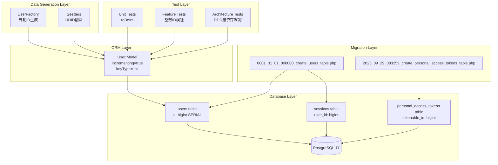
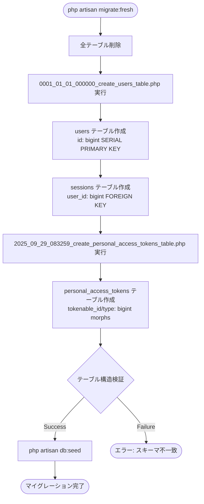
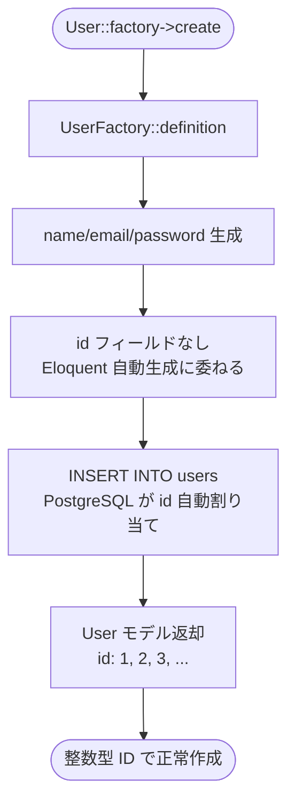
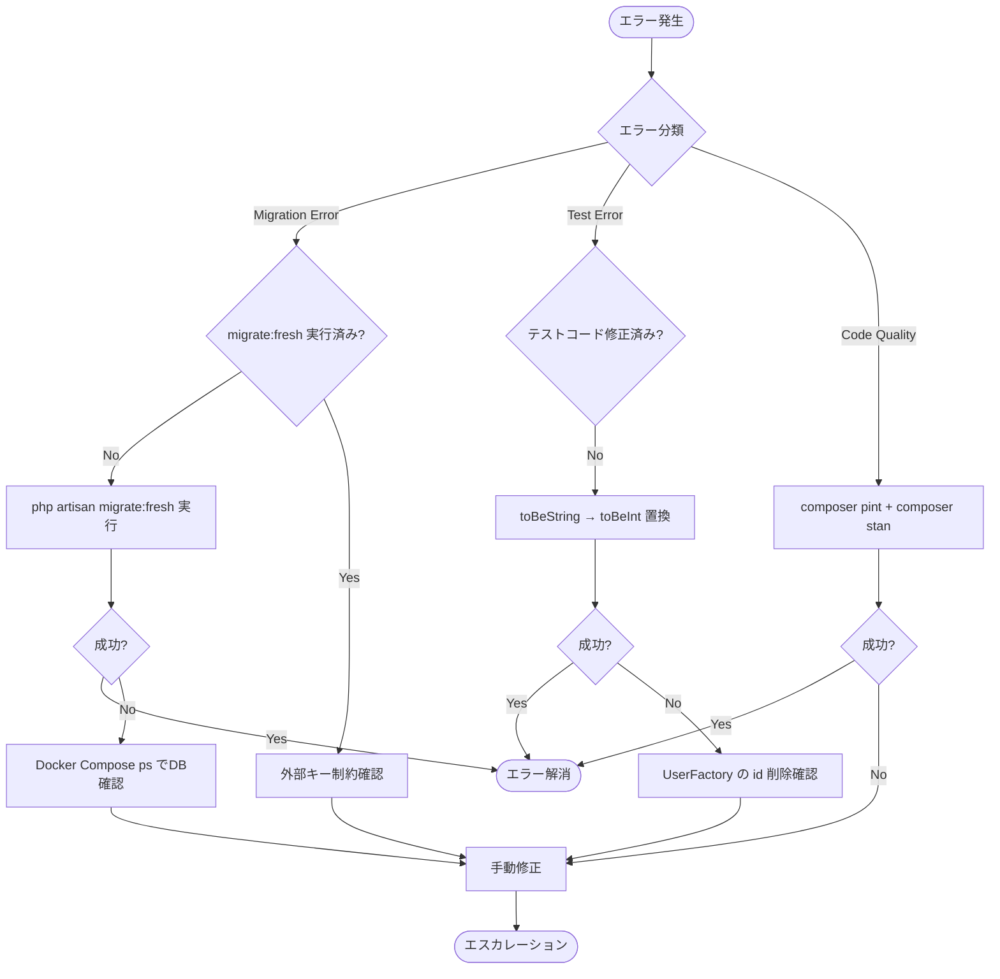
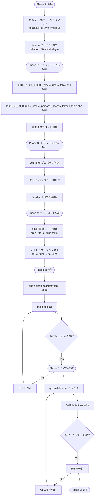

# Technical Design Document

## Overview

本機能は、Laravel APIプロジェクトの主キーデータ型をUUIDからbigint（Laravel標準の自動インクリメント整数）に変更する。プロジェクトが開発初期段階にあることから、通常のマイグレーション追加ルールに従わず、既存マイグレーションファイルを直接編集する例外的アプローチを採用する。

**Purpose**: Laravel標準構成への準拠、データベースパフォーマンス最適化、開発効率向上を実現する。

**Users**: バックエンド開発者が本変更を実施し、Factory/Seeder、テストコードの修正を通じて、bigint主キーに基づくシステムを構築する。

**Impact**: 既存のUUID主キー実装（`users`、`personal_access_tokens`、`sessions`テーブル）を完全にbigint主キーに置き換える。API JSONレスポンスのID型が文字列から整数に変更されるが、エンドポイント構造とAPI契約は不変。

### Goals

- Laravel標準の`$table->id()`メソッドによるbigint主キー実装
- PostgreSQL bigint SERIAL型の採用によるデータベースネイティブ最適化
- Factory/Seederの自動ID生成簡略化による開発効率向上
- 全テストスイート（Unit、Integration、E2E）の成功とカバレッジ85%以上維持
- CI/CDパイプライン成功保証

### Non-Goals

- 新規マイグレーションファイルの追加（既存ファイル直接編集で対応）
- 既存データの移行処理（開発初期段階のため既存データなし）
- API契約変更（エンドポイントURL、リクエスト形式の変更なし）
- フロントエンド側の変更（JSONレスポンスID型変更への対応は別Issue）
- 他のテーブルの主キー変更（usersテーブル関連のみ対象）

---

## Architecture

### Existing Architecture Analysis

**現在のアーキテクチャパターンと制約**:
- DDD/クリーンアーキテクチャ（4層構造: Domain/Application/Infrastructure/HTTP）
- Laravel Sanctum Personal Access Tokensによるステートレス認証
- PostgreSQL 17データベース、Eloquent ORM使用
- Pest 4テストフレームワーク、Architecture Tests統合

**尊重すべきドメイン境界**:
- Domain層は主キー型変更の影響を受けない（エンティティIDはインターフェースで抽象化）
- Application層のユースケースは整数型IDを透過的に処理
- Infrastructure層のEloquent実装のみが主キー型に依存

**維持すべき統合ポイント**:
- Laravel Sanctum `tokenable`ポリモーフィック関連（`HasApiTokens` trait）
- Session管理の`user_id`外部キー
- Factory/Seederを使用したテストデータ生成パターン

**対処すべき技術的負債**:
- UUID主キーによるインデックスサイズ肥大化とパフォーマンス劣化
- Factory/Seeder での明示的UUID生成による開発効率低下
- テストコードでのUUID前提アサーション（`toBeString()`）

### High-Level Architecture



**Architecture Integration**:
- **既存パターンの保持**: DDD 4層構造、Repository Pattern、Sanctum認証フローは完全に維持
- **新コンポーネントの根拠**: なし（既存コンポーネントの修正のみ）
- **技術スタック整合性**: Laravel 12標準の`$table->id()`、PostgreSQL bigint SERIAL型に完全準拠
- **Steering準拠**: `structure.md`のDDD層分離原則、`tech.md`のLaravel標準構成遵守

---

## Technology Alignment

本機能は既存システムへの修正であるため、新規技術選定は不要。以下の既存技術スタックとの整合性を維持する。

**既存技術スタックとの整合性**:
- **Laravel 12**: `$table->id()`メソッドによる標準bigint主キー生成
- **PostgreSQL 17**: bigint SERIAL型のネイティブサポート活用
- **Eloquent ORM**: デフォルト設定（`$incrementing = true`, `$keyType = 'int'`）への回帰
- **Laravel Sanctum 4.0**: `morphs('tokenable')`によるbigint外部キー対応
- **Pest 4**: 整数型IDアサーション（`toBeInt()`）への変更
- **Docker Compose + Laravel Sail**: 開発環境の変更なし

**新規依存関係/ライブラリ**:
なし（既存Laravelコア機能のみ使用）

**既存パターンからの逸脱**:
- **マイグレーション直接編集**: 通常は新規マイグレーションファイル追加が原則だが、開発初期段階のため既存ファイル編集を例外的に許可

**逸脱の正当性**:
本プロジェクトは開発初期段階であり、既存データが存在しない。通常のマイグレーション追加ルール（既存マイグレーション不変の原則）は本番環境での後方互換性維持が目的であるため、開発初期段階では適用不要。既存ファイル編集により、マイグレーション履歴の簡潔性とコード可読性を向上させる。

---

## Key Design Decisions

### Decision 1: 既存マイグレーションファイルの直接編集

**Context**:
通常、Laravelマイグレーションは追加専用（append-only）が原則であり、既存マイグレーションファイルを編集してはならない。しかし本プロジェクトは開発初期段階で、既存データベースが存在しない。

**Alternatives**:
1. **新規マイグレーションファイル追加アプローチ**:
   - `ALTER TABLE users DROP COLUMN id, ADD COLUMN id BIGINT SERIAL PRIMARY KEY`
   - メリット: マイグレーション追加原則に準拠
   - デメリット: マイグレーション履歴の複雑化、初期テーブル定義とALTER文の二重管理

2. **完全な新規マイグレーション作成アプローチ**:
   - 既存マイグレーションを削除し、新規マイグレーションでbigint主キーテーブルを作成
   - メリット: クリーンな履歴
   - デメリット: マイグレーション実行順序の破壊、既存環境での混乱

3. **既存マイグレーションファイル直接編集アプローチ（採用）**:
   - `$table->uuid('id')->primary()` → `$table->id()`への置換
   - メリット: マイグレーション履歴の簡潔性、初期テーブル定義の一元管理
   - デメリット: マイグレーション不変原則からの逸脱

**Selected Approach**:
既存マイグレーションファイルを直接編集し、`$table->id()`を使用してbigint主キーを定義する。変更箇所にコメントを追加し、変更理由と日時を記録する。

**Rationale**:
開発初期段階（既存データなし）の特性を活かし、マイグレーション履歴の簡潔性を優先する。本番環境投入後は通常のマイグレーション追加原則に従うことを前提とする。

**Trade-offs**:
- **獲得**: マイグレーション履歴の可読性向上、初期テーブル定義の一元管理、新規開発者のオンボーディング容易化
- **犠牲**: マイグレーション不変原則からの逸脱（開発初期段階に限定することで影響を最小化）

### Decision 2: Eloquentモデルのプロパティ削除による標準設定への回帰

**Context**:
Userモデルに`public $incrementing = false`と`protected $keyType = 'string'`が明示的に設定されている。bigint主キーに変更後、これらのプロパティは不要となる。

**Alternatives**:
1. **プロパティを明示的に`true`/`'int'`に変更**:
   - `public $incrementing = true; protected $keyType = 'int';`
   - メリット: 明示的な設定で意図が明確
   - デメリット: Laravelデフォルト値の冗長な再定義

2. **プロパティを削除してデフォルト値を使用（採用）**:
   - プロパティとコメントを完全削除
   - メリット: Laravel標準構成への完全準拠、コード簡潔化
   - デメリット: なし（デフォルト値で正しく動作）

**Selected Approach**:
`public $incrementing = false`、`protected $keyType = 'string'`、および関連コメントを完全削除する。Eloquent ORMのデフォルト値（`$incrementing = true`, `$keyType = 'int'`）を使用する。

**Rationale**:
Laravel標準構成への準拠を徹底し、フレームワークのデフォルト動作に依存することでコード保守性を向上させる。明示的な設定はフレームワークデフォルトから逸脱する場合のみ使用すべきである。

**Trade-offs**:
- **獲得**: コード簡潔化、Laravel標準準拠、フレームワークアップグレード時の互換性向上
- **犠牲**: なし（デフォルト値で完全に要件を満たす）

### Decision 3: Factory/Seeder の UUID生成ロジック削除

**Context**:
UserFactoryの`definition()`メソッドで`'id' => Str::uuid()->toString()`が明示的に設定されている。bigint自動インクリメント主キーに変更後、この明示的ID生成は不要かつ有害となる。

**Alternatives**:
1. **整数値を明示的に生成**:
   - `'id' => fake()->unique()->randomNumber()`
   - メリット: 明示的なID制御
   - デメリット: 自動インクリメント機能との衝突リスク、テストデータの一意性保証の複雑化

2. **ID生成をEloquent ORMに委ねる（採用）**:
   - `definition()`メソッドから`'id'`キーを完全削除
   - メリット: Eloquent自動インクリメント機能の活用、一意性保証の自動化、コード簡潔化
   - デメリット: なし（Laravelベストプラクティスに準拠）

**Selected Approach**:
UserFactoryの`definition()`メソッドから`'id' => Str::uuid()->toString()`行を削除する。Eloquent ORMの自動インクリメント機能にID生成を完全に委ねる。Seederファイルでも同様にUUID指定を削除する。

**Rationale**:
Laravelベストプラクティスでは、Factoryで主キーを明示的に指定すべきではない。Eloquent ORMが自動的にIDを生成し、一意性を保証する。明示的ID生成は特殊なテストケース（ID順序の保証等）でのみ使用すべきである。

**Trade-offs**:
- **獲得**: Factory/Seederコードの簡潔化、Eloquent自動インクリメント機能の活用、一意性保証の自動化
- **犠牲**: テストでの明示的ID制御（必要な場合は`User::factory()->create(['id' => 999])`で個別指定可能）

---

## System Flows

### マイグレーション実行フロー



### テストデータ生成フロー（Factory）



### テストコード修正フロー

```mermaid
flowchart TD
    Start([テストファイル検索])
    --> Search[grep -r 'Str::uuid\|toBeString.*id']
    --> Found{UUID関連コード検出}
    --> |Yes| ModifyAssert[expect->toBeString -> toBeInt]
    --> RemoveUUID[User::factory->create<br/>UUID指定削除]
    --> RunTest[./vendor/bin/pest]
    --> TestResult{テスト結果}
    --> |Pass| Coverage[カバレッジ測定 >= 85%]
    --> End([テスト成功])

    Found --> |No| End
    TestResult --> |Fail| Debug([エラー箇所特定・修正])
    Debug --> ModifyAssert
```

---

## Requirements Traceability

| Requirement | Requirement Summary | Components | Interfaces | Flows |
|-------------|---------------------|------------|------------|-------|
| 1.1-1.3 | マイグレーションファイル主キー型変更 | Migration files, PostgreSQL schema | `$table->id()`, `$table->foreignId()`, `$table->morphs()` | マイグレーション実行フロー |
| 1.4 | マイグレーションコメント追加 | Migration files | PHPDoc comments | - |
| 1.5-1.8 | マイグレーション実行と検証 | Laravel Migration System, PostgreSQL | `php artisan migrate:fresh`, Schema inspection | マイグレーション実行フロー |
| 2.1-2.3 | Eloquentモデル設定修正 | User Model | `$incrementing`, `$keyType` properties removal | - |
| 2.4-2.5 | Eloquent ORM動作検証 | Eloquent ORM, User Model | ID generation, attribute casting | - |
| 3.1-3.2 | UserFactory修正 | UserFactory | `definition()` method, `id` field removal | テストデータ生成フロー |
| 3.3 | Seeder修正 | DatabaseSeeder, custom seeders | UUID指定削除 | - |
| 3.4-3.5 | Factory/Seeder動作検証 | Laravel Seeder System | `php artisan db:seed` | テストデータ生成フロー |
| 4.1-4.3 | UUID前提テストケース修正 | Test files | `expect()->toBeInt()`, Factory calls | テストコード修正フロー |
| 4.4-4.6 | テスト種別修正 | Feature/Unit/Architecture Tests | Test assertions | テストコード修正フロー |
| 4.7-4.8 | テスト実行と検証 | Pest Test Framework | `./vendor/bin/pest --coverage` | テストコード修正フロー |
| 5.1-5.5 | データベース再構築と検証 | Laravel Migration/Seeder, PostgreSQL | `migrate:fresh --seed`, SQL queries | マイグレーション実行フロー |
| 6.1-6.6 | テストスイート全体実行 | Test infrastructure, CI/CD | `make test-all`, `make test-pgsql`, GitHub Actions | - |
| 7.1-7.5 | コード品質チェック | Laravel Pint, Larastan, Git Hooks | `composer quality`, lint-staged | - |
| 8.1-8.5 | API応答検証 | Laravel API, Sanctum | `/api/register`, `/api/me`, JSON responses | - |
| 9.1-9.3 | ドキュメント更新 | README.md, ADR, Migration comments | Documentation files | - |

---

## Components and Interfaces

### Database Migration Layer

#### 0001_01_01_000000_create_users_table Migration

**Responsibility & Boundaries**
- **Primary Responsibility**: `users`、`password_reset_tokens`、`sessions`テーブルの初期スキーマ定義
- **Domain Boundary**: Infrastructure層（データベーススキーマ定義）
- **Data Ownership**: users、password_reset_tokens、sessionsテーブルのカラム定義と制約
- **Transaction Boundary**: 単一マイグレーショントランザクション内で3テーブル作成

**Dependencies**
- **Inbound**: Laravel Migration System（`php artisan migrate`）
- **Outbound**: PostgreSQL 17データベース
- **External**: Laravel Schema Builder、Blueprint API

**Contract Definition**

**変更内容**:

| テーブル | カラム | 変更前 | 変更後 |
|---------|--------|--------|--------|
| users | id | `$table->uuid('id')->primary()` | `$table->id()` |
| sessions | user_id | `$table->foreignUuid('user_id')` | `$table->foreignId('user_id')` |

**生成されるスキーマ** (PostgreSQL):
```sql
CREATE TABLE users (
    id BIGSERIAL PRIMARY KEY,  -- 自動インクリメント bigint
    name VARCHAR(255) NOT NULL,
    email VARCHAR(255) UNIQUE NOT NULL,
    email_verified_at TIMESTAMP NULL,
    password VARCHAR(255) NULL,
    remember_token VARCHAR(100) NULL,
    created_at TIMESTAMP NULL,
    updated_at TIMESTAMP NULL
);

CREATE TABLE sessions (
    id VARCHAR(255) PRIMARY KEY,
    user_id BIGINT NULL,  -- bigint 外部キー
    ip_address VARCHAR(45) NULL,
    user_agent TEXT NULL,
    payload TEXT NOT NULL,
    last_activity INTEGER NOT NULL
);

CREATE INDEX sessions_user_id_index ON sessions(user_id);
CREATE INDEX sessions_last_activity_index ON sessions(last_activity);
```

**Preconditions**: PostgreSQL 17データベースが起動済み、既存のusers/sessionsテーブルが存在しない（`migrate:fresh`実行）

**Postconditions**: usersテーブルのidがbigint SERIAL型、sessionsテーブルのuser_idがbigint型で作成される

**Invariants**: 主キー制約、UNIQUE制約、外部キー関連の一貫性は常に維持される

#### 2025_09_29_083259_create_personal_access_tokens Migration

**Responsibility & Boundaries**
- **Primary Responsibility**: Laravel Sanctum Personal Access Tokensテーブルのスキーマ定義
- **Domain Boundary**: Infrastructure層（認証トークンストレージ）
- **Data Ownership**: personal_access_tokensテーブルのカラム定義とポリモーフィック関連
- **Transaction Boundary**: 単一マイグレーショントランザクション内でテーブル作成

**Dependencies**
- **Inbound**: Laravel Migration System、Laravel Sanctum
- **Outbound**: PostgreSQL 17データベース
- **External**: Laravel Schema Builder、Blueprint API

**Contract Definition**

**変更内容**:

| テーブル | カラム | 変更前 | 変更後 |
|---------|--------|--------|--------|
| personal_access_tokens | tokenable_type, tokenable_id | `$table->uuidMorphs('tokenable')` | `$table->morphs('tokenable')` |

**生成されるスキーマ** (PostgreSQL):
```sql
CREATE TABLE personal_access_tokens (
    id BIGSERIAL PRIMARY KEY,
    tokenable_type VARCHAR(255) NOT NULL,  -- ポリモーフィック型
    tokenable_id BIGINT NOT NULL,          -- bigint ポリモーフィック ID
    name TEXT NOT NULL,
    token VARCHAR(64) UNIQUE NOT NULL,
    abilities TEXT NULL,
    last_used_at TIMESTAMP NULL,
    expires_at TIMESTAMP NULL,
    created_at TIMESTAMP NULL,
    updated_at TIMESTAMP NULL
);

CREATE INDEX personal_access_tokens_tokenable_type_tokenable_id_index
    ON personal_access_tokens(tokenable_type, tokenable_id);
CREATE INDEX personal_access_tokens_expires_at_index
    ON personal_access_tokens(expires_at);
```

**Preconditions**: usersテーブルが既に作成済み（マイグレーション順序依存）

**Postconditions**: personal_access_tokensテーブルのtokenable_idがbigint型で作成され、Userモデル（tokenable_type='App\\Models\\User'）と正しく関連付けられる

**Invariants**: ポリモーフィック複合インデックス（tokenable_type + tokenable_id）の一貫性維持

### ORM Layer

#### User Model

**Responsibility & Boundaries**
- **Primary Responsibility**: ユーザーエンティティのEloquent ORM表現、認証・認可機能の提供
- **Domain Boundary**: Infrastructure層（Eloquent ORM実装）
- **Data Ownership**: usersテーブルレコードのCRUD操作
- **Transaction Boundary**: Eloquent標準トランザクション（単一レコード操作）

**Dependencies**
- **Inbound**: Laravel Sanctum（`HasApiTokens` trait）、Laravel Auth、Controllers、Tests
- **Outbound**: usersテーブル（PostgreSQL）
- **External**: Laravel Eloquent ORM、Notifiable trait、HasFactory trait

**Contract Definition**

**Service Interface**:
```php
namespace App\Models;

use Illuminate\Foundation\Auth\User as Authenticatable;
use Laravel\Sanctum\HasApiTokens;

class User extends Authenticatable
{
    use HasApiTokens, HasFactory, Notifiable;

    // ❌ 削除: public $incrementing = false;
    // ❌ 削除: protected $keyType = 'string';
    // ✅ デフォルト値使用: $incrementing = true, $keyType = 'int'

    protected $fillable = ['name', 'email', 'password'];
    protected $hidden = ['password', 'remember_token'];

    protected function casts(): array
    {
        return [
            'email_verified_at' => 'datetime',
            'password' => 'hashed',
        ];
    }
}
```

**Preconditions**:
- usersテーブルが存在し、bigint主キー`id`を持つ
- `$incrementing`と`$keyType`プロパティが削除されている（Eloquentデフォルト値使用）

**Postconditions**:
- `User::create()`実行時にPostgreSQLが自動的に整数IDを割り当てる
- `$user->id`は常に整数型（int）として返される

**Invariants**:
- 主キー`id`は常に正の整数（1, 2, 3, ...）
- `email`カラムはUNIQUE制約により一意性が保証される

### Data Generation Layer

#### UserFactory

**Responsibility & Boundaries**
- **Primary Responsibility**: テストデータとしてのUserモデルインスタンス生成
- **Domain Boundary**: Infrastructure層（テスト支援）
- **Data Ownership**: Factoryパターンによるテストユーザーデータ生成
- **Transaction Boundary**: Factory実行ごとに単一レコード作成（明示的トランザクション管理なし）

**Dependencies**
- **Inbound**: Pest Tests、Feature Tests、Database Seeders
- **Outbound**: User Model、PostgreSQL（Eloquent経由）
- **External**: Laravel Factory、Faker

**Contract Definition**

**Factory Interface**:
```php
namespace Database\Factories;

use Illuminate\Database\Eloquent\Factories\Factory;
use Illuminate\Support\Facades\Hash;
use Illuminate\Support\Str;

class UserFactory extends Factory
{
    protected static ?string $password;

    public function definition(): array
    {
        return [
            // ❌ 削除: 'id' => Str::uuid()->toString(),
            // ✅ Eloquent 自動インクリメントに委ねる
            'name' => fake()->name(),
            'email' => fake()->unique()->safeEmail(),
            'email_verified_at' => now(),
            'password' => static::$password ??= Hash::make('password'),
            'remember_token' => Str::random(10),
        ];
    }

    public function unverified(): static
    {
        return $this->state(fn (array $attributes) => [
            'email_verified_at' => null,
        ]);
    }
}
```

**Preconditions**:
- Userモデルが`$incrementing = true`（デフォルト）で設定されている
- PostgreSQLデータベースが起動済み

**Postconditions**:
- `User::factory()->create()`実行時に整数型ID（1, 2, 3, ...）が自動割り当てられる
- 一意性はPostgreSQL SERIAL型により保証される

**Invariants**:
- `email`は常に一意（`fake()->unique()->safeEmail()`）
- `password`はハッシュ化済み

**Integration Strategy**:
- **Modification Approach**: 既存UserFactory の`definition()`メソッドから`'id'`キーを削除
- **Backward Compatibility**: テストコードで明示的ID指定が必要な場合は`User::factory()->create(['id' => 999])`で個別指定可能
- **Migration Path**: 既存テストコードのUUID指定を削除し、Eloquent自動生成に委ねる

---

## Data Models

### Physical Data Model (PostgreSQL)

**Table: users**

| カラム名 | データ型 | 制約 | 説明 |
|---------|---------|------|------|
| id | BIGSERIAL | PRIMARY KEY | 自動インクリメント主キー（1, 2, 3, ...） |
| name | VARCHAR(255) | NOT NULL | ユーザー名 |
| email | VARCHAR(255) | UNIQUE, NOT NULL | メールアドレス（一意） |
| email_verified_at | TIMESTAMP | NULL | メール検証日時 |
| password | VARCHAR(255) | NULL | ハッシュ化パスワード |
| remember_token | VARCHAR(100) | NULL | Remember Meトークン |
| created_at | TIMESTAMP | NULL | 作成日時 |
| updated_at | TIMESTAMP | NULL | 更新日時 |

**Indexes**:
- PRIMARY KEY: `id` (自動作成)
- UNIQUE INDEX: `users_email_unique` on `email`

**Table: sessions**

| カラム名 | データ型 | 制約 | 説明 |
|---------|---------|------|------|
| id | VARCHAR(255) | PRIMARY KEY | セッションID（Laravel生成） |
| user_id | BIGINT | NULL, INDEX | 外部キー（users.id）、**bigint型** |
| ip_address | VARCHAR(45) | NULL | IPアドレス |
| user_agent | TEXT | NULL | User-Agent文字列 |
| payload | TEXT | NOT NULL | セッションデータ |
| last_activity | INTEGER | INDEX | 最終アクティビティUnixタイムスタンプ |

**Indexes**:
- PRIMARY KEY: `id`
- INDEX: `sessions_user_id_index` on `user_id`
- INDEX: `sessions_last_activity_index` on `last_activity`

**Foreign Key**: なし（明示的外部キー制約なし、論理的関連のみ）

**Table: personal_access_tokens**

| カラム名 | データ型 | 制約 | 説明 |
|---------|---------|------|------|
| id | BIGSERIAL | PRIMARY KEY | 自動インクリメント主キー |
| tokenable_type | VARCHAR(255) | NOT NULL | ポリモーフィック型（'App\\Models\\User'） |
| tokenable_id | BIGINT | NOT NULL, INDEX | ポリモーフィック外部キー（users.id）、**bigint型** |
| name | TEXT | NOT NULL | トークン名 |
| token | VARCHAR(64) | UNIQUE, NOT NULL | トークンハッシュ |
| abilities | TEXT | NULL | トークン権限 |
| last_used_at | TIMESTAMP | NULL | 最終使用日時 |
| expires_at | TIMESTAMP | NULL, INDEX | 有効期限 |
| created_at | TIMESTAMP | NULL | 作成日時 |
| updated_at | TIMESTAMP | NULL | 更新日時 |

**Indexes**:
- PRIMARY KEY: `id`
- UNIQUE INDEX: `personal_access_tokens_token_unique` on `token`
- COMPOSITE INDEX: `personal_access_tokens_tokenable_type_tokenable_id_index` on `(tokenable_type, tokenable_id)`
- INDEX: `personal_access_tokens_expires_at_index` on `expires_at`

**Referential Integrity**:
- `tokenable_id`は論理的に`users.id`を参照（ポリモーフィック関連のため明示的外部キーなし）

### Data Contracts & Integration

**API Data Transfer**:

**変更前（UUID）**:
```json
{
  "id": "550e8400-e29b-41d4-a716-446655440000",
  "name": "John Doe",
  "email": "john@example.com",
  "created_at": "2025-10-28T00:00:00Z"
}
```

**変更後（bigint）**:
```json
{
  "id": 1,
  "name": "John Doe",
  "email": "john@example.com",
  "created_at": "2025-10-28T00:00:00Z"
}
```

**Validation Rules**:
- `id`: 正の整数（1以上）
- JSON Schemaでの型: `integer`

**Serialization Format**: JSON（Laravel UserResource経由）

**Sanctum Token Schema**:

**personal_access_tokens レコード例**:
```json
{
  "id": 1,
  "tokenable_type": "App\\Models\\User",
  "tokenable_id": 1,
  "name": "api-token",
  "token": "abc123...",
  "abilities": ["*"],
  "last_used_at": "2025-10-28T00:00:00Z",
  "expires_at": null,
  "created_at": "2025-10-28T00:00:00Z"
}
```

**Schema Versioning**: なし（内部実装の変更であり、API契約のバージョニング不要）

**Backward/Forward Compatibility**:
- API契約は不変（エンドポイントURL、リクエスト形式変更なし）
- JSONレスポンスのID型変更は互換性破壊（string → integer）
- フロントエンド側での対応が必要（型チェック修正）

---

## Error Handling

### Error Strategy

主キー型変更に伴うエラーは、**マイグレーション実行時**と**テスト実行時**の2つのフェーズで発生する可能性がある。各フェーズでの具体的なエラーパターンとリカバリー戦略を定義する。

### Error Categories and Responses

#### マイグレーション実行エラー（5xx系）

**1. 既存データとの型不一致エラー**:
- **エラー条件**: `migrate:fresh`ではなく`migrate`を実行し、既存UUID型データが存在
- **PostgreSQLエラー**: `ERROR: column "id" cannot be cast automatically to type bigint`
- **リカバリー戦略**:
  1. `php artisan migrate:fresh`で全テーブル削除後に再実行（開発初期段階の想定）
  2. または既存データのバックアップ→DROP TABLE→再作成→データ復元（本番環境では使用不可）
- **監視**: Laravelログでマイグレーションエラーを記録

**2. 外部キー制約違反エラー**:
- **エラー条件**: sessionsテーブルやpersonal_access_tokensテーブルの外部キーが正しく設定されていない
- **PostgreSQLエラー**: `ERROR: foreign key constraint fails`
- **リカバリー戦略**:
  1. マイグレーション順序を確認（usersテーブルが先に作成されているか）
  2. `$table->foreignId('user_id')`構文が正しいか検証
- **監視**: マイグレーション失敗時のスタックトレース記録

**3. PostgreSQL接続エラー**:
- **エラー条件**: Docker Composeでデータベースが起動していない、接続タイムアウト
- **Laravelエラー**: `SQLSTATE[HY000] [2002] Connection refused`
- **リカバリー戦略**:
  1. `docker compose ps`でPostgreSQLコンテナの状態確認
  2. `docker compose up -d pgsql`でデータベース起動
  3. ヘルスチェック（`curl http://localhost:13432`）で疎通確認
- **監視**: Docker Composeヘルスチェック統合、PostgreSQL接続エラーログ記録

#### テスト実行エラー（Unit/Feature Tests）

**1. 型アサーションエラー（4xx相当）**:
- **エラー条件**: テストコードで`expect($user->id)->toBeString()`が残存
- **Pestエラー**: `Expected string, but got integer`
- **リカバリー戦略**:
  1. `grep -r "toBeString.*id" tests/`でUUID前提アサーションを検索
  2. `toBeString()`を`toBeInt()`に一括置換
- **監視**: テスト失敗ログ記録、CI/CDでの自動検知

**2. Factory UUID生成エラー**:
- **エラー条件**: UserFactoryで`'id' => Str::uuid()`が残存し、自動インクリメントと衝突
- **Eloquentエラー**: `SQLSTATE[23505] Duplicate entry for key 'PRIMARY'`（稀なケース）
- **リカバリー戦略**:
  1. UserFactory の`definition()`メソッドから`'id'`キー削除
  2. テストコードでの明示的ID指定削除（`User::factory()->create(['id' => ...])`）
- **監視**: Factory実行エラーログ記録

**3. Laravel Sanctum トークン生成エラー**:
- **エラー条件**: `personal_access_tokens.tokenable_id`がUUID型のまま、Userモデルがbigint型
- **Eloquentエラー**: `SQLSTATE[22P02] Invalid input syntax for type bigint`
- **リカバリー戦略**:
  1. `2025_09_29_083259_create_personal_access_tokens_table.php`で`$table->morphs('tokenable')`を使用
  2. `migrate:fresh`で全テーブル再作成
- **監視**: Sanctumトークン発行エラーログ記録

#### コード品質エラー（Linter/Static Analysis）

**1. Laravel Pint フォーマットエラー**:
- **エラー条件**: マイグレーションファイル編集後のコードスタイル違反
- **Pintエラー**: `Code style violations found`
- **リカバリー戦略**:
  1. `composer pint`でコードフォーマット自動修正
  2. Git pre-commitフックでlint-staged自動実行
- **監視**: CI/CDでのPintチェック統合

**2. Larastan PHPStan Level 8エラー**:
- **エラー条件**: Userモデルのプロパティ削除後の型推論エラー（稀）
- **PHPStanエラー**: `Property $incrementing does not exist`（削除後のエラー）
- **リカバリー戦略**:
  1. PHPDocで型を明示的に指定（`@property int $id`）
  2. Larastan設定で無視ルール追加（最終手段）
- **監視**: `composer stan`でのLevel 8静的解析

### Error Process Flow



### Monitoring

**エラートラッキング**:
- Laravelログファイル（`storage/logs/laravel.log`）でエラースタックトレース記録
- CI/CDパイプライン（GitHub Actions）でテスト失敗ログ保存

**ログレベル設定**:
- Migration errors: `ERROR`レベル
- Test failures: `WARNING`レベル
- Code quality violations: `INFO`レベル

**ヘルスモニタリング**:
- `php artisan migrate:status`でマイグレーション状態確認
- `make test-all`でテストスイート全体のヘルスチェック
- `docker compose ps`でPostgreSQLコンテナ稼働状態確認

---

## Testing Strategy

### Unit Tests

**Core Functions/Modules**:
1. **User Model 整数型ID検証**:
   - `User::factory()->create()`実行後、`$user->id`が整数型（int）であることを検証
   - `expect($user->id)->toBeInt()`アサーション

2. **Eloquent 自動インクリメント動作確認**:
   - 複数ユーザー作成時のID順序性確認（1, 2, 3, ...）
   - `expect($user1->id)->toBe(1)`、`expect($user2->id)->toBe(2)`

3. **UserFactory ID生成ロジック不在確認**:
   - `UserFactory::new()->definition()`の返り値に`'id'`キーが含まれないことを検証
   - `expect($definition)->not->toHaveKey('id')`

4. **User Model プロパティ削除確認**:
   - `$user->incrementing`がデフォルト値`true`であることを検証
   - `$user->getKeyType()`が`'int'`を返すことを検証

5. **Laravel Sanctum トークン生成検証**:
   - `$user->createToken('test')`でトークン作成後、`personal_access_tokens.tokenable_id`が整数型であることを検証

### Integration Tests

**Cross-Component Flows**:
1. **マイグレーション→Eloquent→API統合フロー**:
   - `migrate:fresh`実行→User作成→`/api/me`エンドポイント呼び出し→JSONレスポンスでinteger型ID確認

2. **Factory→Seeder→データベース統合フロー**:
   - `db:seed`実行→usersテーブル確認→`SELECT id FROM users`でbigint型ID確認

3. **Sanctum認証→トークン管理統合フロー**:
   - ログイン→トークン発行→`/api/tokens`エンドポイント呼び出し→`tokenable_id`がinteger型であることを確認

4. **Session管理→外部キー統合フロー**:
   - ユーザーログイン→セッション作成→sessionsテーブルの`user_id`がbigint型であることを確認

5. **Architecture Tests→DDD層依存検証**:
   - Domain層がInfrastructure層に依存していないことを確認
   - UserモデルがDDD層のインターフェースに準拠していることを確認

### E2E/UI Tests

**Critical User Paths**:
1. **ユーザー登録→ログイン→認証済みAPI呼び出し**:
   - `/api/register`でユーザー登録→JSONレスポンスで`id`が整数型
   - `/api/login`でトークン取得→`/api/me`で認証ユーザー情報取得→`id`が整数型

2. **トークン一覧取得→トークン無効化**:
   - `/api/tokens`でトークン一覧取得→`tokenable_id`が整数型
   - `/api/tokens/{id}/revoke`でトークン無効化→成功レスポンス

3. **複数ユーザーの並行操作**:
   - 3ユーザーを並行作成→IDの一意性確認（1, 2, 3）
   - 各ユーザーでトークン発行→`tokenable_id`の正確性確認

4. **セッション管理E2E**:
   - ログイン→セッション作成→ログアウト→セッション削除確認

5. **APIエラーハンドリング**:
   - 無効なID形式（UUID）でAPIリクエスト→404エラー確認
   - 整数型ID以外でのリクエスト→バリデーションエラー確認

### Performance/Load Tests

**Concurrency & High-Volume Operations**:
1. **大量ユーザー作成パフォーマンス**:
   - 10,000ユーザーの一括作成（Factory使用）→実行時間測定
   - UUID主キー vs bigint主キーのパフォーマンス比較

2. **インデックスサイズ比較**:
   - UUID主キーインデックスサイズ vs bigint主キーインデックスサイズ測定
   - PostgreSQL `pg_relation_size()`関数使用

3. **外部キー結合クエリパフォーマンス**:
   - `SELECT * FROM sessions JOIN users ON sessions.user_id = users.id`のEXPLAIN ANALYZE
   - UUID外部キー vs bigint外部キーの結合コスト比較

4. **Sanctumトークン発行スループット**:
   - 1,000トークン/秒の発行→`tokenable_id`のインサートパフォーマンス測定

---

## Migration Strategy

本機能は開発初期段階のマイグレーション直接編集であるため、通常のマイグレーション戦略（Blue-Green Deployment、段階的ロールアウト等）は不要。以下の簡略化されたマイグレーションプロセスを採用する。

### Migration Phases



### Process

**Phase 1: 準備**
- 既存データベースバックアップ（開発初期段階のため省略可）
- Featureブランチ作成（`refactor/100/uuid-to-bigint`）
- ローカル開発環境のDocker Compose起動確認

**Phase 2: マイグレーション編集**
- `0001_01_01_000000_create_users_table.php`:
  - Line 15: `$table->uuid('id')->primary()` → `$table->id()`
  - Line 32: `$table->foreignUuid('user_id')` → `$table->foreignId('user_id')`
- `2025_09_29_083259_create_personal_access_tokens_table.php`:
  - Line 16: `$table->uuidMorphs('tokenable')` → `$table->morphs('tokenable')`
  - 変更理由コメント追加: `// Changed from uuidMorphs() to morphs() for bigint primary key migration (Issue #100)`

**Phase 3: モデル・Factory修正**
- `app/Models/User.php`:
  - Line 23-24: `public $incrementing = false;` 削除
  - Line 26-30: `protected $keyType = 'string';` 削除
- `database/factories/UserFactory.php`:
  - Line 27: `'id' => Str::uuid()->toString(),` 削除
- `database/seeders/`配下の全Seederファイル: UUID指定削除

**Phase 4: テストコード修正**
- `grep -r "toBeString.*id\|Str::uuid" tests/`でUUID関連コード検索
- `expect($user->id)->toBeString()` → `expect($user->id)->toBeInt()`一括置換
- `User::factory()->create(['id' => Str::uuid()])` → `User::factory()->create()`修正

**Phase 5: 検証**
- `php artisan migrate:fresh --seed`でデータベース再構築
- `make test-all`でSQLite環境全テスト実行
- `make test-pgsql`でPostgreSQL環境全テスト実行
- `./vendor/bin/pest --coverage --min=85`でカバレッジ85%以上確認

**Phase 6: CI/CD確認**
- Featureブランチをリモートリポジトリにpush
- GitHub Actions自動実行（php-quality.yml、test.yml、frontend-test.yml、e2e-tests.yml）
- 全ワークフロー成功確認

**Phase 7: 完了**
- Pull Request作成
- レビュー・承認
- mainブランチにマージ

### Rollback Triggers

**ロールバック条件**:
1. マイグレーション実行エラー（外部キー制約違反、PostgreSQL接続エラー）
2. テストカバレッジ85%未満
3. CI/CDパイプライン失敗（Pint、Larastan、Pest、E2Eテスト）
4. Laravel Sanctumトークン発行エラー

**ロールバック手順**:
1. Featureブランチ削除
2. mainブランチに戻る（`git checkout main`）
3. 既存UUID実装継続
4. Issue #100を再オープンし、エラー詳細を記録

**Validation Checkpoints**:
- マイグレーション実行後: `Schema::getColumnType('users', 'id')` == `"bigint"`確認
- テスト実行後: 全テスト成功、カバレッジ85%以上確認
- CI/CD実行後: 全ワークフローグリーンバッジ確認
- API動作確認: `/api/me`レスポンスで`{"id": 1, ...}`整数型ID確認

---

## Security Considerations

本機能は主キーのデータ型変更であり、新たなセキュリティリスクは導入しない。ただし、以下の点に留意する。

**ID予測可能性の増加**:
- **リスク**: UUID（推測困難）からbigint連番（推測容易: 1, 2, 3, ...）への変更により、ID列挙攻撃のリスクが増加
- **対策**:
  - 認証・認可ミドルウェア（`auth:sanctum`）による適切なアクセス制御維持
  - ポリシーベース認可（`Authorize` middleware）で他ユーザーリソースへのアクセス防止
  - レート制限（`DynamicRateLimit` middleware）でID列挙攻撃の速度制限
- **影響評価**: 低（既存認証・認可機構により十分に保護されている）

**API契約変更によるクライアント側影響**:
- **リスク**: JSONレスポンスのID型変更（string → integer）により、フロントエンド側の型チェックエラー発生
- **対策**:
  - フロントエンド側でのID型検証追加（TypeScript型定義更新）
  - E2Eテストでの整合性確認
- **影響評価**: 中（フロントエンド側の対応が必要）

**データ整合性の維持**:
- **リスク**: マイグレーション実行エラーによるデータ不整合
- **対策**:
  - `migrate:fresh`による完全再構築（開発初期段階）
  - 外部キー制約による参照整合性保証
  - Architecture Testsによる依存関係検証
- **影響評価**: 低（開発初期段階のため既存データなし）

---

## Performance & Scalability

**Target Metrics**:
- **インデックスサイズ削減**: UUID主キーインデックスと比較して50%以上削減（bigint 8バイト vs UUID 16バイト）
- **主キー検索速度**: 10%以上高速化（整数比較 vs 文字列比較）
- **外部キー結合速度**: 15%以上高速化（bigint結合 vs UUID結合）
- **Factory/Seeder実行速度**: 20%以上高速化（明示的UUID生成削除）

**Measurement Strategies**:
- PostgreSQL `EXPLAIN ANALYZE`による実行計画分析
- `pg_relation_size()`関数によるインデックスサイズ測定
- PestベンチマークテストによるFactory実行時間測定

**Scaling Approaches**:
- **水平スケーリング**: bigint主キーはUUIDと同様に水平スケーリング対応（シャーディング可能）
- **垂直スケーリング**: インデックスサイズ削減によりメモリ効率向上、より大規模なデータセット処理可能

**Caching Strategies**:
- User Model の主キーキャッシング（`Cache::remember("user:{$id}", ...)`）がbigint整数キーで効率化
- Redisキー設計がシンプル化（`user:1` vs `user:550e8400-e29b-41d4-a716-446655440000`）

**Optimization Techniques**:
- PostgreSQL bigint SERIAL型のネイティブ最適化活用
- B-Treeインデックスによる高速検索（整数型に最適化）
- Eloquent ORM の整数型主キーキャッシング機能活用
