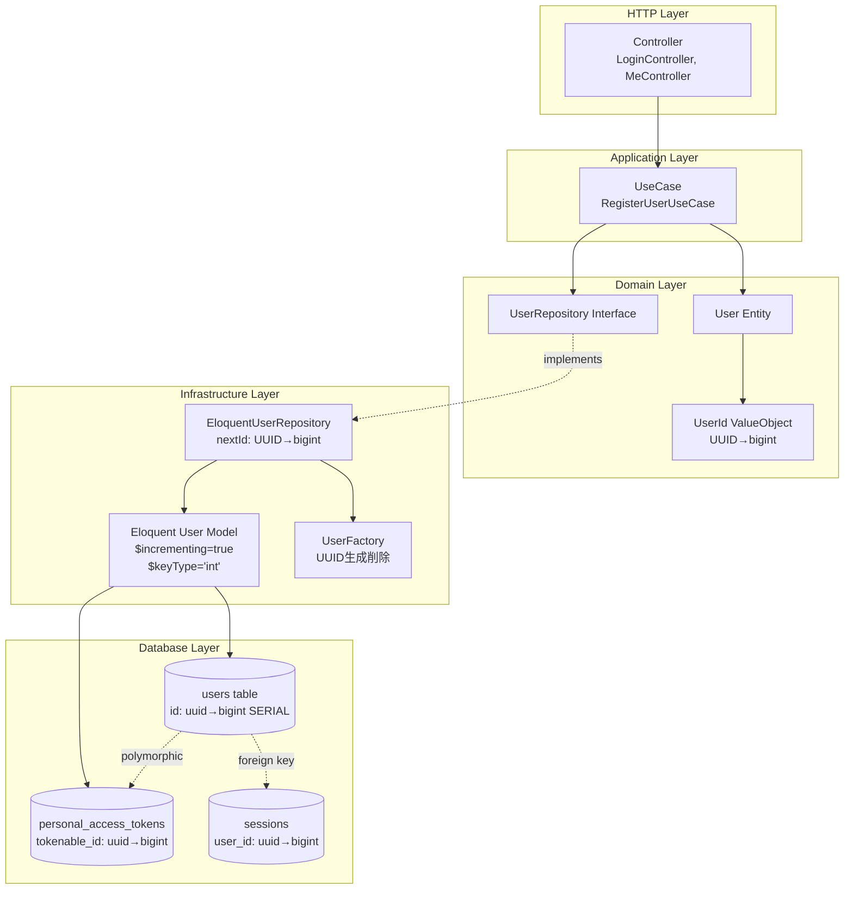
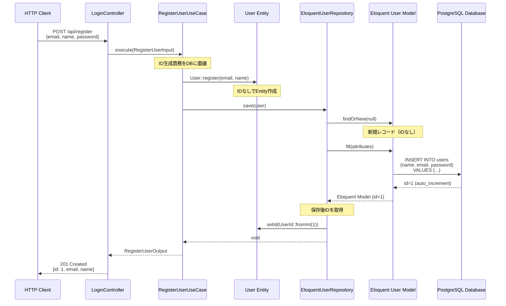
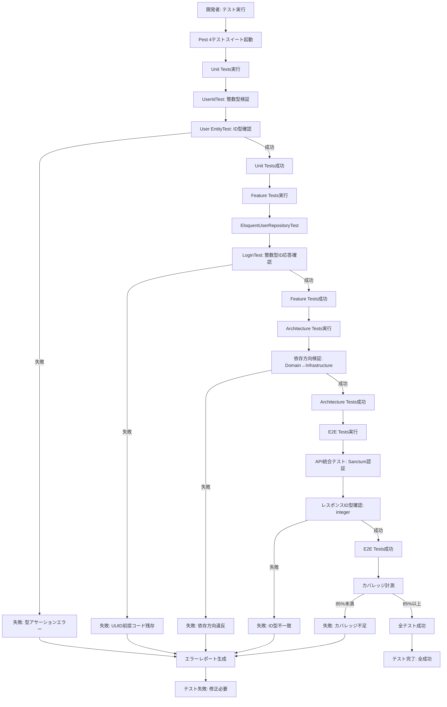
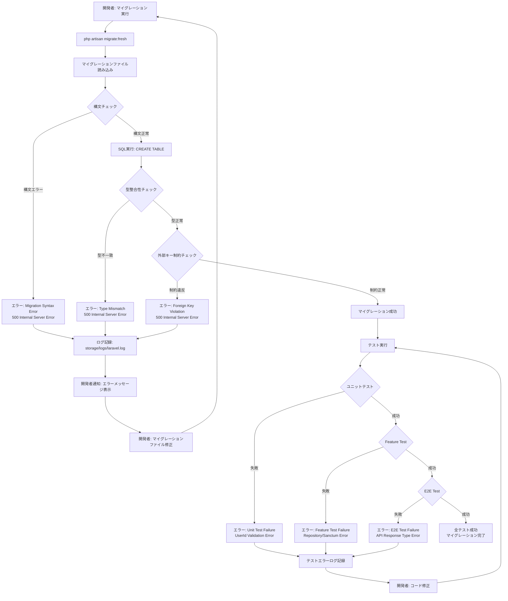
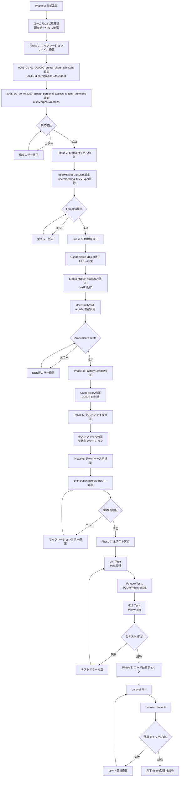

# Technical Design Document

## Overview

本設計は、Laravel Next.js B2Cアプリケーションテンプレートにおいて、`users`テーブルおよび関連テーブルの主キーをUUID型からbigint型に変更するためのリファクタリング設計を定義します。

**Purpose**: Laravel標準構成への準拠とパフォーマンス最適化を実現し、開発効率を向上させます。具体的には、bigint SERIAL型による自動インクリメント主キーにより、インデックスサイズを削減し、検索・結合操作を高速化します。

**Users**: バックエンド開発者、DDD層開発者、テストエンジニアがこの変更を実施し、Factory/Seederでの自動ID生成をシンプル化し、テストデータ作成を容易にします。

**Impact**: 現在のUUID型主キー設計から、Laravel標準のbigint自動インクリメント主キー設計に変更します。開発初期段階のため、既存データへの影響はなく、マイグレーションファイルの直接編集により実現します。この変更により、DDD層のUserId Value Object、Repository実装、Factory/Seeder、全テストケースも同時に更新します。

### Goals

- Laravel標準構成（`$table->id()`メソッド）への準拠により、フレームワークの最適化を最大限活用
- bigint主キーによるパフォーマンス最適化（インデックスサイズ削減、検索・結合操作高速化）
- Factory/Seederでの自動ID生成シンプル化により、開発効率を向上
- PostgreSQL 17のbigint SERIAL型最適化活用
- 全テストスイート（ユニット、統合、E2E、Architecture Tests）の成功維持
- テストカバレッジ85%以上の維持
- Laravel Sanctum認証システムとの整合性確保

### Non-Goals

- 新規マイグレーションファイルの追加（既存ファイル直接編集で対応）
- データ移行処理の実装（開発初期段階のため不要）
- API契約変更（JSONレスポンスのID型は整数値に変わるが、エンドポイント構造は不変）
- 他のテーブルの主キー型変更（`users`およびその直接関連テーブルのみ対象）
- UUID型主キーの完全廃止（必要に応じて他のテーブルではUUID型を継続使用可能）

---

## Architecture

### Existing Architecture Analysis

本プロジェクトは**DDD/クリーンアーキテクチャ（4層構造）**を採用しており、以下の層で主キー型変更の影響を受けます:

**現在のアーキテクチャパターンと制約**:
- **Domain層**: `UserId` Value Object（UUID型）がビジネスロジックの中核
- **Application層**: UseCaseはDomain層のUserId Value Objectに依存
- **Infrastructure層**: `EloquentUserRepository`がUUID型主キーでEloquent Modelを操作
- **HTTP層**: ControllerはApplication層のUseCaseを呼び出し、整数型IDに変更後もインターフェース不変

**尊重すべき既存ドメイン境界**:
- **User集約**: Domain層の`User` Entity、`UserId` Value Object、`UserRepository` Interface
- **認証ドメイン**: Laravel SanctumのPersonal Access Tokensとの統合（`personal_access_tokens.tokenable_id`）
- **セッションドメイン**: `sessions.user_id`外部キー（ステートレス設計のためAPI専用では未使用）

**維持すべき統合ポイント**:
- **Repository Pattern**: DDD層のRepository InterfaceとInfrastructure層の実装の分離を維持
- **Eloquent Model**: `App\Models\User`はInfrastructure層でのみ使用、Domain層は依存しない
- **Sanctum統合**: `HasApiTokens` traitによるトークンベース認証の整合性維持

**対処すべき技術的負債**:
- UUID型Value Object: bigint型対応に更新し、バリデーションロジックを整数型検証に変更
- Factory/SeederのUUID生成: 明示的UUID生成ロジックを削除し、自動インクリメントに委ねる
- テストケースのUUID前提: 整数型IDアサーションに変更

### High-Level Architecture



**Architecture Integration**:
- **既存パターン保持**: DDD 4層構造（Domain/Application/Infrastructure/HTTP）を完全維持、依存性逆転原則（Domain層はInfrastructure層に依存しない）を遵守
- **新規コンポーネント不要**: 既存コンポーネントの修正のみで対応、新規クラス追加なし
- **技術スタック整合**: Laravel 12標準の`$table->id()`メソッド活用、PostgreSQL 17のbigint SERIAL型最適化
- **Steering準拠**: `structure.md`のDDD層責務分離原則、`tech.md`のLaravel標準構成準拠、`product.md`のパフォーマンス最適化方針に整合

---

## Technology Stack and Design Decisions

### Technology Alignment

本機能は既存の技術スタックに完全に整合しており、新規依存関係の追加は不要です:

**Backend Technology Stack**:
- **Laravel 12**: `$table->id()`メソッドによるbigint UNSIGNED auto_increment主キー標準サポート
- **PHP 8.4**: 整数型型宣言（`int`）のサポート、厳密な型チェック
- **Eloquent ORM**: `$incrementing = true`, `$keyType = 'int'`のデフォルト値活用
- **PostgreSQL 17**: bigint SERIAL型による自動インクリメント最適化

**Existing Dependencies**:
- **Laravel Sanctum 4.0**: Personal Access Tokens の`tokenable_id`をbigint型に対応（`morphs()`メソッド使用）
- **Pest 4**: 既存テストフレームワークを継続使用、整数型アサーションに変更
- **Laravel Pint + Larastan Level 8**: コード品質管理ツール継続使用

**No New Dependencies**: 本変更は標準Laravel機能のみを使用し、新規パッケージやライブラリの追加は不要です。

### Key Design Decisions

#### 決定1: 既存マイグレーションファイルの直接編集

- **Decision**: 新規マイグレーションファイルを追加せず、既存マイグレーションファイルを直接編集する
- **Context**: 本プロジェクトは開発初期段階であり、既存データが存在しない。通常のLaravel開発では「マイグレーション追加（append）」ルールに従うが、開発初期段階では直接編集が適切
- **Alternatives**:
  1. **新規マイグレーションファイル追加**: `ALTER TABLE`による主キー型変更マイグレーションを追加
  2. **データベース完全削除・再作成**: 全マイグレーションファイルを削除し、新規作成
  3. **既存マイグレーションファイル直接編集**: 既存ファイルの`uuid()`を`id()`に変更（選択）
- **Selected Approach**: 既存マイグレーションファイルの直接編集により、`database/migrations/0001_01_01_000000_create_users_table.php`および`database/migrations/2025_09_29_083259_create_personal_access_tokens_table.php`を修正
- **Rationale**: 開発初期段階のため既存データが存在せず、マイグレーション履歴のクリーン性を維持できる。新規マイグレーション追加と比較して、マイグレーションファイル数を最小化し、保守性を向上
- **Trade-offs**:
  - **Gain**: マイグレーション履歴のシンプル化、ファイル数削減、開発初期段階での柔軟性
  - **Sacrifice**: 既にデータが存在する環境では適用不可（本プロジェクトでは該当しない）

#### 決定2: DDD層UserId Value ObjectのUUID型からint型への変更

- **Decision**: Domain層の`UserId` Value Objectを整数型に変更し、バリデーションロジックをUUID検証から整数検証に更新
- **Context**: DDD/クリーンアーキテクチャではDomain層がビジネスロジックの中核であり、主キー型の変更はValue Objectのバリデーションロジックに直接影響する
- **Alternatives**:
  1. **UserId Value ObjectをUUID型のまま維持**: Infrastructure層でUUID↔bigintの変換を実装
  2. **UserId Value Objectを削除しintプリミティブ型を使用**: DDD Value Objectパターンを放棄
  3. **UserId Value Objectを整数型に変更**: バリデーションロジックを整数検証に更新（選択）
- **Selected Approach**: `UserId` Value Objectの内部型を`string`から`int`に変更し、コンストラクタのバリデーションロジックをUUID v4検証から整数型範囲検証（`$value > 0`）に変更
- **Rationale**: DDD Value Objectパターンを維持しつつ、型の整合性を保証。Infrastructure層での変換レイヤーを追加するアプローチと比較して、コード複雑性を最小化し、パフォーマンスオーバーヘッドを回避
- **Trade-offs**:
  - **Gain**: 型の整合性保証、変換レイヤー不要、パフォーマンス最適化、DDD Value Objectパターン維持
  - **Sacrifice**: UserId Value Objectの内部実装変更が必要（バリデーションロジック更新、テストケース修正）

#### 決定3: Repository nextId()メソッドの自動インクリメント委譲

- **Decision**: `EloquentUserRepository::nextId()`メソッドをUUID生成から「データベース自動インクリメントに委譲」する設計に変更
- **Context**: DDD Repository Patternでは、`nextId()`メソッドがエンティティIDの生成責務を持つが、bigint自動インクリメントではデータベースがID生成を担当
- **Alternatives**:
  1. **nextId()でダミーIDを返す**: 仮のID（例: 0）を返し、保存時にデータベースが実際のIDを割り当て
  2. **nextId()でMAX(id)+1を取得**: データベースに問い合わせて次のIDを事前取得
  3. **nextId()を削除**: Repository Interfaceから`nextId()`メソッドを削除し、ID生成責務をデータベースに完全委譲（選択）
- **Selected Approach**: `nextId()`メソッドを削除し、`User::register()`メソッドで`UserId`を受け取らず、保存時にデータベースが自動生成したIDを`UserId::fromInt()`で取得
- **Rationale**: DDD Repository Patternの原則を維持しつつ、データベースの自動インクリメント機能を活用。MAX(id)+1アプローチは並行実行時の競合リスクがあり、ダミーIDアプローチはコード複雑性が増加
- **Trade-offs**:
  - **Gain**: データベース自動インクリメント機能の活用、並行実行時の競合回避、コード複雑性削減
  - **Sacrifice**: `nextId()`メソッドの責務変更（ID生成からID取得に変更）、`User::register()`メソッドのシグネチャ変更

---

## System Flows

### Database Migration Flow

```mermaid
flowchart TD
    Start[開発者: migrate:fresh実行] --> DropTables[既存テーブル削除]
    DropTables --> ReadMigration1[0001_01_01_000000_create_users_table.php読込]
    ReadMigration1 --> CreateUsers[users table作成<br/>id: bigint UNSIGNED auto_increment]
    CreateUsers --> CreatePasswordReset[password_reset_tokens table作成]
    CreatePasswordReset --> CreateSessions[sessions table作成<br/>user_id: bigint UNSIGNED外部キー]
    CreateSessions --> ReadMigration2[2025_09_29_083259_create_personal_access_tokens.php読込]
    ReadMigration2 --> CreateTokens[personal_access_tokens table作成<br/>tokenable_id: bigint UNSIGNED]
    CreateTokens --> VerifySchema{スキーマ検証}
    VerifySchema -->|成功| MigrationSuccess[マイグレーション成功]
    VerifySchema -->|失敗| MigrationError[エラー: 構文エラー/型不一致]
    MigrationError --> Rollback[ロールバック: 全テーブル削除]
    MigrationSuccess --> RunSeeder[Seeder実行]
    RunSeeder --> CreateTestUser[User::factory()->create()<br/>ID自動生成: 1, 2, 3...]
    CreateTestUser --> End[完了: 整数型IDでテストデータ作成完了]
```

### DDD Layer Integration Flow



### Test Execution Flow



---

## Requirements Traceability

| Requirement | Requirement Summary | Components | Interfaces | Flows |
|-------------|---------------------|------------|------------|-------|
| **1.1-1.6** | データベーススキーマ変更（users, personal_access_tokens, sessions） | `0001_01_01_000000_create_users_table.php`<br/>`2025_09_29_083259_create_personal_access_tokens_table.php` | `$table->id()`<br/>`$table->foreignId()`<br/>`$table->morphs()` | Database Migration Flow |
| **2.1-2.4** | Eloquentモデル設定変更（Laravel標準デフォルト値復帰） | `app/Models/User.php` | `$incrementing` 削除<br/>`$keyType` 削除 | - |
| **3.1-3.4** | Factory/Seeder修正（UUID生成削除） | `database/factories/UserFactory.php`<br/>`database/seeders/DatabaseSeeder.php` | `definition()` メソッド | Database Migration Flow (Seeder実行) |
| **4.1-4.5** | テストケース修正（整数型アサーション対応） | `tests/Unit/Ddd/Domain/User/ValueObjects/UserIdTest.php`<br/>`tests/Feature/Ddd/Infrastructure/Persistence/Eloquent/Repositories/EloquentUserRepositoryTest.php` | `expect($id)->toBeInt()`<br/>`UserId::fromInt()` | Test Execution Flow |
| **5.1-5.4** | データベース再構築（migrate:fresh） | Laravel Migration System | `php artisan migrate:fresh --seed` | Database Migration Flow |
| **6.1-6.4** | 認証システム整合性確保（Sanctum bigint対応） | `personal_access_tokens` テーブル<br/>`LoginController`<br/>`MeController` | `tokenable_id: bigint`<br/>`GET /api/me` | DDD Layer Integration Flow |
| **7.1-7.6** | テストスイート実行（ユニット、統合、E2E、Architecture） | Pest 4<br/>Playwright 1.47.2 | `./vendor/bin/pest`<br/>`make test-all`<br/>`make test-e2e-only` | Test Execution Flow |
| **8.1-8.4** | コード品質保証（Pint、Larastan） | Laravel Pint<br/>Larastan Level 8 | `composer quality` | - |
| **9.1-9.5** | CI/CDパイプライン検証（GitHub Actions） | `.github/workflows/php-quality.yml`<br/>`.github/workflows/test.yml`<br/>`.github/workflows/e2e-tests.yml` | GitHub Actions Workflow | - |
| **10.1-10.3** | ドキュメント更新 | `README.md`<br/>マイグレーションファイルコメント | - | - |

---

## Components and Interfaces

### Database Layer

#### Migration Files

**Responsibility & Boundaries**:
- **Primary Responsibility**: データベーススキーマ定義と主キー型変更の実装
- **Domain Boundary**: Database層、Eloquent ORMによるスキーマ管理
- **Data Ownership**: users, personal_access_tokens, sessionsテーブルの構造定義
- **Transaction Boundary**: マイグレーション実行時の単一トランザクション

**Dependencies**:
- **Inbound**: `php artisan migrate:fresh` コマンド、Laravel Migration System
- **Outbound**: PostgreSQL 17データベースエンジン
- **External**: なし（Laravel標準機能のみ）

**Contract Definition**:

**Migration Contract**（`0001_01_01_000000_create_users_table.php`）:

変更前:
```php
$table->uuid('id')->primary();
$table->foreignUuid('user_id')->nullable()->index();
```

変更後:
```php
$table->id();  // bigint UNSIGNED auto_increment primary key
$table->foreignId('user_id')->nullable()->index();  // bigint UNSIGNED
```

**Migration Contract**（`2025_09_29_083259_create_personal_access_tokens_table.php`）:

変更前:
```php
$table->uuidMorphs('tokenable');  // tokenable_type + tokenable_id (uuid)
```

変更後:
```php
$table->morphs('tokenable');  // tokenable_type + tokenable_id (bigint)
```

**Preconditions**:
- PostgreSQL 17データベースエンジンが起動している
- 既存テーブルが存在しない（`migrate:fresh`による削除後）

**Postconditions**:
- `users`テーブルがbigint UNSIGNED auto_increment主キーで作成される
- `personal_access_tokens.tokenable_id`がbigint UNSIGNED型で作成される
- `sessions.user_id`がbigint UNSIGNED型外部キーで作成される

**Invariants**:
- 主キー`id`は非NULL、UNSIGNED、AUTO_INCREMENT
- 外部キー`user_id`、`tokenable_id`は`users.id`と型一致（bigint UNSIGNED）

---

### Domain Layer

#### UserId Value Object

**Responsibility & Boundaries**:
- **Primary Responsibility**: ユーザーIDの型安全性とバリデーションの保証
- **Domain Boundary**: User集約のIdentifier、ビジネスロジック中核
- **Data Ownership**: ユーザーID値の不変性保証
- **Transaction Boundary**: なし（Value Objectは不変）

**Dependencies**:
- **Inbound**: User Entity、UserRepository Interface、EloquentUserRepository
- **Outbound**: なし（Domain層は他層に依存しない）
- **External**: なし

**Contract Definition**:

**Service Interface**:
```php
namespace Ddd\Domain\User\ValueObjects;

final readonly class UserId
{
    private function __construct(private int $value) {
        if ($value <= 0) {
            throw ValidationException::invalidUserId((string) $value);
        }
    }

    public static function fromInt(int $value): self;
    public function value(): int;
    public function equals(UserId $other): bool;
}
```

変更点:
- **型変更**: `private string $value` → `private int $value`
- **バリデーション**: UUID v4正規表現検証 → 整数型範囲検証（`$value > 0`）
- **ファクトリメソッド**: `fromString(string)` → `fromInt(int)`
- **戻り値型**: `value(): string` → `value(): int`

**Preconditions**:
- `fromInt()`に渡される値が1以上の正の整数

**Postconditions**:
- UserId Value Objectが不変（readonly）で作成される
- バリデーションを通過した整数値のみが保持される

**Invariants**:
- `value`は常に1以上の正の整数
- 一度作成されたUserId Value Objectは変更不可（immutable）

---

### Infrastructure Layer

#### EloquentUserRepository

**Responsibility & Boundaries**:
- **Primary Responsibility**: Domain層のUserRepository Interfaceの実装、Eloquent ORMによるデータ永続化
- **Domain Boundary**: User集約のRepository実装、Domain層とInfrastructure層の境界
- **Data Ownership**: Eloquent User Modelとのマッピング、データベースCRUD操作
- **Transaction Boundary**: 各メソッド単位のトランザクション（save(), delete()）

**Dependencies**:
- **Inbound**: Application層UseCase（RegisterUserUseCase等）
- **Outbound**: Domain層UserRepository Interface、`App\Models\User` Eloquent Model、UserMapper
- **External**: Eloquent ORM（Laravel 12標準）

**Contract Definition**:

**Service Interface**（変更後）:
```php
namespace Ddd\Infrastructure\Persistence\Eloquent\Repositories;

final readonly class EloquentUserRepository implements UserRepository
{
    public function __construct(private UserMapper $mapper) {}

    // 削除: nextId()メソッドは不要（データベース自動インクリメントに委譲）

    public function find(UserId $id): ?User;
    public function findByEmail(Email $email): ?User;
    public function existsByEmail(Email $email): bool;
    public function save(User $user): void;  // 保存後、自動生成IDをEntityに設定
    public function delete(UserId $id): void;
}
```

変更点:
- **削除**: `nextId(): UserId` メソッド（UUID生成責務をデータベースに委譲）
- **修正**: `find(UserId $id)` の引数型は変更なし（UserId Value Objectが内部で整数型を保持）
- **修正**: `save(User $user)` は保存後に自動生成されたIDを`$user`エンティティに設定

**Preconditions**:
- `save()`実行時、`User` Entityが有効な状態（Email、Nameが設定済み）
- `find()`実行時、UserId Value Objectが有効な整数値を保持

**Postconditions**:
- `save()`実行後、データベースに新規レコードが挿入され、自動生成IDが`User` Entityに設定される
- `find()`実行後、該当ユーザーが存在する場合はDomain層のUser Entityとして返される

**Invariants**:
- Repository InterfaceとInfrastructure実装の契約を常に満たす
- Domain層は常にDomain EntityとValue Objectを返す（Eloquent Modelを直接返さない）

**State Management**:
- **State Model**: UserRepository Interfaceはステートレス（各メソッド独立実行）
- **Persistence**: PostgreSQL 17データベースにEloquent ORMを通じて永続化
- **Concurrency**: Eloquent ORMのトランザクション管理に依存

---

### Application Layer

#### Eloquent User Model

**Responsibility & Boundaries**:
- **Primary Responsibility**: Eloquent ORMによるusersテーブルのマッピング、Laravel標準主キー設定の活用
- **Domain Boundary**: Infrastructure層のデータアクセス層、Domain層から独立
- **Data Ownership**: usersテーブルレコードのCRUD操作
- **Transaction Boundary**: Eloquent ORMのトランザクション管理

**Dependencies**:
- **Inbound**: EloquentUserRepository、UserFactory
- **Outbound**: usersテーブル（PostgreSQL 17）
- **External**: Laravel Sanctum（HasApiTokens trait）

**Contract Definition**:

**Service Interface**（変更後）:
```php
namespace App\Models;

use Laravel\Sanctum\HasApiTokens;

class User extends Authenticatable
{
    use HasApiTokens, HasFactory, Notifiable;

    // 削除: public $incrementing = false; (デフォルト値trueを使用)
    // 削除: protected $keyType = 'string'; (デフォルト値'int'を使用)

    protected $fillable = ['name', 'email', 'password'];
    protected $hidden = ['password', 'remember_token'];

    protected function casts(): array {
        return [
            'email_verified_at' => 'datetime',
            'password' => 'hashed',
        ];
    }
}
```

変更点:
- **削除**: `public $incrementing = false;`（Laravel標準のデフォルト値`true`を使用）
- **削除**: `protected $keyType = 'string';`（Laravel標準のデフォルト値`'int'`を使用）
- **維持**: `HasApiTokens` trait（Sanctum認証との整合性維持）

**Preconditions**:
- usersテーブルが存在し、bigint UNSIGNED auto_increment主キーを持つ

**Postconditions**:
- Eloquent Modelが整数型主キーとして動作
- Sanctum Personal Access Tokensとの連携が正常動作

**Invariants**:
- `$incrementing = true`（自動インクリメント有効）
- `$keyType = 'int'`（主キー型は整数）
- `$primaryKey = 'id'`（主キーカラム名はデフォルト'id'）

---

### Test Layer

#### UserFactory

**Responsibility & Boundaries**:
- **Primary Responsibility**: テストデータ生成、User Modelのファクトリー定義
- **Domain Boundary**: テストデータ層、開発環境およびテスト環境でのみ使用
- **Data Ownership**: User Modelのダミーデータ生成定義
- **Transaction Boundary**: Factory生成は各テストケース独立

**Dependencies**:
- **Inbound**: テストケース（Pest 4）、DatabaseSeeder
- **Outbound**: User Eloquent Model、Faker
- **External**: Faker（ダミーデータ生成ライブラリ）

**Contract Definition**:

**Service Interface**（変更後）:
```php
namespace Database\Factories;

class UserFactory extends Factory
{
    protected static ?string $password;

    public function definition(): array
    {
        return [
            // 削除: 'id' => Str::uuid()->toString(),
            'name' => fake()->name(),
            'email' => fake()->unique()->safeEmail(),
            'email_verified_at' => now(),
            'password' => static::$password ??= Hash::make('password'),
            'remember_token' => Str::random(10),
        ];
    }

    public function unverified(): static {
        return $this->state(fn (array $attributes) => [
            'email_verified_at' => null,
        ]);
    }
}
```

変更点:
- **削除**: `'id' => Str::uuid()->toString()`（自動インクリメントに委譲）

**Preconditions**:
- User Modelが存在し、bigint自動インクリメント主キーを持つ

**Postconditions**:
- `User::factory()->create()`実行時、データベースが自動的に整数型IDを生成（例: 1, 2, 3...）
- 生成されたUser Modelインスタンスに自動生成IDが設定される

**Invariants**:
- Factoryは`id`フィールドを指定しない（データベース自動インクリメントに委譲）
- 生成されるUser Modelは常に有効な整数型IDを持つ

---

## Data Models

### Physical Data Model

本セクションでは、PostgreSQL 17データベースにおける物理データモデルを定義します。bigint SERIAL型による自動インクリメント主キーを採用し、パフォーマンスとストレージ効率を最適化します。

#### users テーブル

**Table Definition**:
```sql
CREATE TABLE users (
    id BIGSERIAL PRIMARY KEY,  -- bigint UNSIGNED auto_increment (変更後)
    name VARCHAR(255) NOT NULL,
    email VARCHAR(255) UNIQUE NOT NULL,
    email_verified_at TIMESTAMP NULL,
    password VARCHAR(255) NULL,
    remember_token VARCHAR(100) NULL,
    created_at TIMESTAMP NULL,
    updated_at TIMESTAMP NULL
);

CREATE INDEX users_email_index ON users(email);
```

**変更前の構造**:
```sql
CREATE TABLE users (
    id UUID PRIMARY KEY,  -- UUID型（変更前）
    -- 他のカラムは同一
);
```

**Primary/Foreign Keys**:
- **Primary Key**: `id` (bigint UNSIGNED, AUTO_INCREMENT)
- **Unique Key**: `email`

**Indexes and Performance Optimizations**:
- **PRIMARY KEY インデックス**: `id`カラム（B-Tree、自動作成）
  - **UUID型との比較**: bigintインデックスはUUIDインデックスと比較してサイズが小さく（8バイト vs 16バイト）、検索速度が高速
- **UNIQUE インデックス**: `email`カラム（B-Tree）
  - 変更なし（引き続き高速検索をサポート）

**Partitioning Strategy**:
- 開発初期段階のため、現時点ではパーティショニング不要
- 将来的にユーザー数が1,000万件を超える場合、`id`範囲によるパーティショニングを検討（bigint型は範囲パーティショニングに適している）

---

#### personal_access_tokens テーブル

**Table Definition**:
```sql
CREATE TABLE personal_access_tokens (
    id BIGSERIAL PRIMARY KEY,
    tokenable_type VARCHAR(255) NOT NULL,
    tokenable_id BIGINT UNSIGNED NOT NULL,  -- bigint型（変更後）
    name TEXT NOT NULL,
    token VARCHAR(64) UNIQUE NOT NULL,
    abilities TEXT NULL,
    last_used_at TIMESTAMP NULL,
    expires_at TIMESTAMP NULL,
    created_at TIMESTAMP NULL,
    updated_at TIMESTAMP NULL,
    INDEX personal_access_tokens_tokenable_type_tokenable_id_index (tokenable_type, tokenable_id)
);
```

**変更前の構造**:
```sql
tokenable_id UUID NOT NULL,  -- UUID型（変更前）
```

**Primary/Foreign Keys**:
- **Primary Key**: `id` (bigint UNSIGNED, AUTO_INCREMENT)
- **Composite Index**: `(tokenable_type, tokenable_id)` - ポリモーフィック外部キー検索最適化

**Indexes and Performance Optimizations**:
- **Composite Index**: `(tokenable_type, tokenable_id)`
  - **UUID型との比較**: bigint型の`tokenable_id`はインデックスサイズが小さく、結合クエリが高速化
  - 使用例: `SELECT * FROM personal_access_tokens WHERE tokenable_type = 'App\\Models\\User' AND tokenable_id = 1;`
- **UNIQUE インデックス**: `token`カラム（64文字のトークンハッシュ）

**Referential Integrity**:
- **ポリモーフィック関係**: `(tokenable_type, tokenable_id)` は `users.id` を参照
  - Laravel Eloquentのポリモーフィック関係により、明示的外部キー制約は設定しない（アプリケーション層で管理）

---

#### sessions テーブル

**Table Definition**:
```sql
CREATE TABLE sessions (
    id VARCHAR(255) PRIMARY KEY,  -- セッションID（変更なし）
    user_id BIGINT UNSIGNED NULL,  -- bigint型（変更後）
    ip_address VARCHAR(45) NULL,
    user_agent TEXT NULL,
    payload LONGTEXT NOT NULL,
    last_activity INTEGER NOT NULL,
    INDEX sessions_user_id_index (user_id),
    INDEX sessions_last_activity_index (last_activity)
);
```

**変更前の構造**:
```sql
user_id UUID NULL,  -- UUID型（変更前）
```

**Primary/Foreign Keys**:
- **Primary Key**: `id` (VARCHAR(255)) - セッションID（変更なし）
- **Index**: `user_id` - ユーザーごとのセッション検索最適化

**Indexes and Performance Optimizations**:
- **Index**: `user_id`
  - **UUID型との比較**: bigint型の`user_id`インデックスは検索速度が向上
  - 使用例: `SELECT * FROM sessions WHERE user_id = 1;`
- **Index**: `last_activity` - セッション有効期限検索最適化

**Referential Integrity**:
- **外部キー**: `user_id` は `users.id` を参照
  - ステートレスAPI設計（`SESSION_DRIVER=array`）のため、実運用では使用されない
  - 開発初期段階でのセッション機能検証用に保持

---

### Data Contracts & Integration

#### API Data Transfer

本プロジェクトはステートレスAPI設計を採用しており、API応答のユーザーID型が整数値に変更されます。

**Request/Response Schemas**:

**変更前**（UUID型）:
```json
GET /api/me
Authorization: Bearer {token}

Response 200 OK:
{
  "id": "550e8400-e29b-41d4-a716-446655440000",
  "name": "Test User",
  "email": "test@example.com",
  "email_verified_at": "2025-10-29T00:00:00Z",
  "created_at": "2025-10-29T00:00:00Z",
  "updated_at": "2025-10-29T00:00:00Z"
}
```

**変更後**（bigint型）:
```json
GET /api/me
Authorization: Bearer {token}

Response 200 OK:
{
  "id": 1,
  "name": "Test User",
  "email": "test@example.com",
  "email_verified_at": "2025-10-29T00:00:00Z",
  "created_at": "2025-10-29T00:00:00Z",
  "updated_at": "2025-10-29T00:00:00Z"
}
```

**Validation Rules**:
- `id`: 整数型（1以上）、非NULL
- エンドポイント構造は不変（変更なし）

**Serialization Format**:
- JSON形式（変更なし）
- Laravel Resource Classによるシリアライゼーション（UserResource）

---

## Error Handling

### Error Strategy

本機能はデータベーススキーマ変更およびコード修正を伴うため、以下のエラーカテゴリに対する具体的なハンドリング戦略を定義します。

### Error Categories and Responses

#### User Errors (4xx)

**該当なし**: 本機能はリファクタリングであり、エンドユーザーが直接操作するUIは存在しません。API応答の整数型ID変更は、クライアント側での型処理変更のみが必要です。

#### System Errors (5xx)

**1. Database Migration Failure (500 Internal Server Error)**
- **原因**: マイグレーション構文エラー、型不一致、外部キー制約違反
- **Error Response**:
```json
{
  "error": "Migration failed",
  "message": "SQLSTATE[42601]: Syntax error: 7 ERROR: syntax error at or near \"uuid\"",
  "file": "database/migrations/0001_01_01_000000_create_users_table.php",
  "line": 15
}
```
- **Recovery Mechanism**:
  - ロールバック実行（`php artisan migrate:rollback`）
  - マイグレーションファイル構文確認
  - `migrate:fresh`で完全再構築

**2. Eloquent Model Configuration Error (500 Internal Server Error)**
- **原因**: `$incrementing`または`$keyType`プロパティの誤設定、Eloquent ORMの型キャスト失敗
- **Error Response**:
```json
{
  "error": "Eloquent configuration error",
  "message": "Argument #1 ($id) must be of type int, string given",
  "model": "App\\Models\\User",
  "property": "$keyType"
}
```
- **Recovery Mechanism**:
  - `app/Models/User.php`のプロパティ削除確認
  - Eloquentデフォルト値（`$incrementing = true`, `$keyType = 'int'`）の活用
  - Larastan Level 8静的解析実行

**3. Sanctum Token Integration Failure (500 Internal Server Error)**
- **原因**: `personal_access_tokens.tokenable_id`型不一致、ポリモーフィック関係エラー
- **Error Response**:
```json
{
  "error": "Sanctum token creation failed",
  "message": "SQLSTATE[22P02]: Invalid text representation: 7 ERROR: invalid input syntax for type bigint",
  "table": "personal_access_tokens",
  "column": "tokenable_id"
}
```
- **Recovery Mechanism**:
  - `2025_09_29_083259_create_personal_access_tokens_table.php`の`morphs()`メソッド確認
  - `uuidMorphs()` → `morphs()`変更の確認
  - トークン発行テスト実行（`POST /api/login`）

#### Business Logic Errors (422 Unprocessable Entity)

**1. DDD Layer UserId Validation Error (422)**
- **原因**: UserId Value Objectのバリデーションロジック不整合、整数型範囲外の値
- **Error Response**:
```json
{
  "error": "Validation error",
  "message": "Invalid user ID (must be positive integer): 0",
  "field": "user_id",
  "value": 0
}
```
- **Recovery Mechanism**:
  - `ddd/Domain/User/ValueObjects/UserId.php`のバリデーションロジック確認
  - `$value > 0`の範囲検証確認
  - テストケース実行（`tests/Unit/Ddd/Domain/User/ValueObjects/UserIdTest.php`）

**2. Repository nextId() Method Error (422)**
- **原因**: `nextId()`メソッドの実装不整合、UUID生成ロジック残存
- **Error Response**:
```json
{
  "error": "Repository error",
  "message": "Call to undefined method Ddd\\Infrastructure\\Persistence\\Eloquent\\Repositories\\EloquentUserRepository::nextId()",
  "repository": "EloquentUserRepository"
}
```
- **Recovery Mechanism**:
  - `ddd/Infrastructure/Persistence/Eloquent/Repositories/EloquentUserRepository.php`の`nextId()`メソッド削除確認
  - `User::register()`メソッドシグネチャ変更確認（`UserId`引数削除）
  - Repositoryテスト実行

### Error Flow Visualization



### Monitoring

**Error Tracking**:
- Laravel標準ログ機能（`storage/logs/laravel.log`）
- マイグレーションエラー: `php artisan migrate`コマンド出力
- テストエラー: Pest 4テストレポート（JUnit XML形式）

**Logging**:
- **Migration Errors**: `LOG_LEVEL=error`で記録
- **Eloquent Errors**: `LOG_LEVEL=error`で記録、スタックトレース含む
- **Validation Errors**: `LOG_LEVEL=warning`で記録

**Health Monitoring**:
- `/api/health`エンドポイントによる稼働監視（変更なし）
- マイグレーション後の正常性確認:
  ```bash
  curl http://localhost:13000/api/health
  # Expected: {"status": "ok", "timestamp": "2025-10-29T00:00:00Z"}
  ```

---

## Testing Strategy

### Unit Tests

#### 1. UserId Value Object Tests
**Test File**: `tests/Unit/Ddd/Domain/User/ValueObjects/UserIdTest.php`

**Test Cases**:
1. **整数型ID作成テスト**:
   ```php
   test('can create valid integer ID', function (): void {
       $userId = UserId::fromInt(1);
       expect($userId->value())->toBe(1);
   });
   ```
2. **無効な整数型IDエラーテスト**:
   ```php
   test('throws exception for invalid integer ID', function (): void {
       UserId::fromInt(0);
   })->throws(ValidationException::class, 'Invalid user ID (must be positive integer): 0');
   ```
3. **負の整数IDエラーテスト**:
   ```php
   test('throws exception for negative integer ID', function (): void {
       UserId::fromInt(-1);
   })->throws(ValidationException::class);
   ```
4. **等価性テスト**:
   ```php
   test('equals returns true for same user ID', function (): void {
       $userId1 = UserId::fromInt(1);
       $userId2 = UserId::fromInt(1);
       expect($userId1->equals($userId2))->toBeTrue();
   });
   ```

#### 2. User Entity Tests
**Test File**: `tests/Unit/Ddd/Domain/User/Entities/UserTest.php`

**Test Cases**:
1. **整数型IDでUser Entity作成テスト**:
   ```php
   test('can create user with integer ID', function (): void {
       $user = User::register(
           id: UserId::fromInt(1),
           email: Email::fromString('test@example.com'),
           name: 'Test User'
       );
       expect($user->id()->value())->toBe(1);
   });
   ```

#### 3. Eloquent Model Tests
**Test File**: `tests/Unit/Models/UserTest.php`

**Test Cases**:
1. **Eloquentデフォルト値テスト**:
   ```php
   test('User model uses default incrementing and keyType', function (): void {
       $user = new \App\Models\User();
       expect($user->getIncrementing())->toBeTrue()
           ->and($user->getKeyType())->toBe('int');
   });
   ```
2. **主キー型テスト**:
   ```php
   test('User model ID is integer type', function (): void {
       $user = \App\Models\User::factory()->create();
       expect($user->id)->toBeInt();
   });
   ```

### Integration Tests

#### 1. EloquentUserRepository Tests
**Test File**: `tests/Feature/Ddd/Infrastructure/Persistence/Eloquent/Repositories/EloquentUserRepositoryTest.php`

**Test Cases**:
1. **自動ID生成テスト**:
   ```php
   test('save generates auto-increment integer ID', function (): void {
       $repository = app(UserRepository::class);
       $user = User::register(
           email: Email::fromString('test@example.com'),
           name: 'Test User'
       );
       $repository->save($user);

       expect($user->id())->toBeInstanceOf(UserId::class)
           ->and($user->id()->value())->toBeInt()
           ->and($user->id()->value())->toBeGreaterThan(0);
   });
   ```
2. **整数型IDで検索テスト**:
   ```php
   test('can find user by integer ID', function (): void {
       $repository = app(UserRepository::class);
       $user = User::register(
           email: Email::fromString('test@example.com'),
           name: 'Test User'
       );
       $repository->save($user);

       $foundUser = $repository->find($user->id());
       expect($foundUser)->not->toBeNull()
           ->and($foundUser->id()->equals($user->id()))->toBeTrue();
   });
   ```

#### 2. Sanctum Authentication Tests
**Test File**: `tests/Feature/Auth/LoginTest.php`

**Test Cases**:
1. **整数型IDトークン発行テスト**:
   ```php
   test('login returns integer user ID', function (): void {
       $user = User::factory()->create([
           'email' => 'test@example.com',
           'password' => Hash::make('password'),
       ]);

       $response = $this->postJson('/api/login', [
           'email' => 'test@example.com',
           'password' => 'password',
       ]);

       $response->assertStatus(200)
           ->assertJsonStructure(['token', 'user' => ['id', 'name', 'email']]);

       $data = $response->json();
       expect($data['user']['id'])->toBeInt()
           ->and($data['user']['id'])->toBe($user->id);
   });
   ```

#### 3. Factory/Seeder Tests
**Test File**: `tests/Feature/Factories/UserFactoryTest.php`

**Test Cases**:
1. **Factory自動ID生成テスト**:
   ```php
   test('UserFactory generates auto-increment integer ID', function (): void {
       $user = User::factory()->create();

       expect($user->id)->toBeInt()
           ->and($user->id)->toBeGreaterThan(0);
   });
   ```
2. **複数ユーザーFactory生成テスト**:
   ```php
   test('UserFactory generates sequential integer IDs', function (): void {
       $users = User::factory()->count(3)->create();

       expect($users[0]->id)->toBe(1)
           ->and($users[1]->id)->toBe(2)
           ->and($users[2]->id)->toBe(3);
   });
   ```

### E2E/UI Tests

#### API Integration Tests
**Test Tool**: Playwright 1.47.2

**Test Cases**:
1. **ユーザー登録E2Eテスト**:
   ```typescript
   test('can register user with integer ID', async ({ request }) => {
       const response = await request.post('/api/register', {
           data: {
               name: 'Test User',
               email: 'test@example.com',
               password: 'password',
           },
       });

       expect(response.status()).toBe(201);
       const data = await response.json();
       expect(typeof data.id).toBe('number');
       expect(data.id).toBeGreaterThan(0);
   });
   ```
2. **認証ユーザー情報取得E2Eテスト**:
   ```typescript
   test('can get authenticated user with integer ID', async ({ request }) => {
       const loginResponse = await request.post('/api/login', {
           data: { email: 'test@example.com', password: 'password' },
       });
       const { token } = await loginResponse.json();

       const meResponse = await request.get('/api/me', {
           headers: { Authorization: `Bearer ${token}` },
       });

       expect(meResponse.status()).toBe(200);
       const user = await meResponse.json();
       expect(typeof user.id).toBe('number');
   });
   ```

### Performance/Load Tests

#### 1. 主キー検索パフォーマンステスト
**Test Tool**: Apache Bench (ab)

**Test Cases**:
1. **整数型主キー検索速度測定**:
   ```bash
   # 10,000リクエスト、100同時接続
   ab -n 10000 -c 100 http://localhost:13000/api/users/1

   # 期待結果: 平均応答時間 < 20ms
   ```
2. **UUID型主キー検索速度比較**（変更前のベースライン測定）:
   ```bash
   # 変更前のUUID型主キー検索（ベースライン）
   ab -n 10000 -c 100 http://localhost:13000/api/users/550e8400-e29b-41d4-a716-446655440000

   # 期待結果: bigint型と比較して応答時間が長い
   ```

#### 2. 結合クエリパフォーマンステスト
**Test Tool**: PostgreSQL `EXPLAIN ANALYZE`

**Test Cases**:
1. **users + personal_access_tokens結合クエリ測定**:
   ```sql
   EXPLAIN ANALYZE
   SELECT u.*, t.token
   FROM users u
   INNER JOIN personal_access_tokens t
       ON t.tokenable_type = 'App\\Models\\User'
       AND t.tokenable_id = u.id
   WHERE u.id = 1;

   -- 期待結果: 実行時間 < 5ms、Index Scanを使用
   ```

#### 3. 並行トランザクションテスト
**Test Tool**: pgbench

**Test Cases**:
1. **複数ユーザー同時作成テスト**:
   ```bash
   # 100同時トランザクション、各10回INSERT
   pgbench -c 100 -t 10 -f insert_user.sql laravel_database

   # 期待結果: トランザクション成功率 > 99%、競合エラーなし
   ```

---

## Security Considerations

### Authentication and Authorization

**Laravel Sanctum整合性**:
- Personal Access Tokensの`tokenable_id`カラムがbigint型に変更されるため、Sanctum認証システムとの整合性を確保
- `HasApiTokens` traitは整数型主キーに対応（Laravel標準サポート）
- トークン発行・認証フローは変更なし（整数型IDでトークン発行）

**Access Control**:
- 認証保護エンドポイント（`auth:sanctum` middleware）は整数型IDで正常動作
- `GET /api/me`レスポンスは整数型ユーザーIDを返す
- トークン取り消し機能（`POST /api/tokens/{id}/revoke`）は整数型IDで動作

### Data Protection

**Personal Identifiable Information (PII)**:
- ユーザーID型変更によるPII保護レベルの変化なし
- Email、Name、Passwordは引き続き適切に保護（`$hidden`プロパティ）
- 整数型IDはUUID型と比較して推測可能性が高いが、認証トークンによるアクセス制御で保護

**Encryption**:
- パスワードハッシュ化（`bcrypt`）は変更なし
- Sanctumトークンは64文字ハッシュ値として保存（変更なし）

**Data Exposure Risks**:
- **整数型ID推測リスク**: 連番IDは推測可能だが、認証トークン必須のため不正アクセスリスクは低い
- **軽減策**: レート制限（`DynamicRateLimit` middleware）により、IDスキャン攻撃を防止

---

## Migration Strategy

本セクションでは、UUID型主キーからbigint型主キーへの移行戦略を定義します。開発初期段階のため、既存データ移行は不要であり、マイグレーションファイル直接編集により実現します。

### Migration Process Flow



### Phase Breakdown

#### Phase 0: 事前準備（5分）
**Objective**: 移行前の環境状態確認

**Actions**:
1. ローカル開発環境のデータベース状態確認
   ```bash
   docker compose ps
   php artisan migrate:status
   ```
2. 既存データ確認（開発初期段階のため空のはず）
   ```bash
   psql -h 127.0.0.1 -p 13432 -U sail -d laravel_database -c "SELECT COUNT(*) FROM users;"
   ```
3. Gitブランチ作成
   ```bash
   git checkout -b refactor/100/uuid-to-bigint
   ```

**Validation Checkpoints**:
- [ ] Dockerサービス起動確認
- [ ] データベース接続確認
- [ ] 既存データが0件であることを確認

**Rollback Triggers**:
- データベースに既存データが存在する場合は移行を中止（本プロジェクトでは該当しない）

---

#### Phase 1: マイグレーションファイル修正（10分）
**Objective**: UUID型からbigint型への主キー型変更

**Actions**:
1. `database/migrations/0001_01_01_000000_create_users_table.php`編集
   - `$table->uuid('id')->primary();` → `$table->id();`
   - `$table->foreignUuid('user_id')->nullable()->index();` → `$table->foreignId('user_id')->nullable()->index();`
2. `database/migrations/2025_09_29_083259_create_personal_access_tokens_table.php`編集
   - `$table->uuidMorphs('tokenable');` → `$table->morphs('tokenable');`
3. コメント更新（変更理由記載）

**Validation Checkpoints**:
- [ ] 構文エラーなし（PHP Syntax Check）
- [ ] `$table->id()`メソッド使用確認
- [ ] `$table->morphs()`メソッド使用確認

**Rollback Triggers**:
- 構文エラー発生時はGitで変更を元に戻す

---

#### Phase 2: Eloquentモデル修正（5分）
**Objective**: Laravel標準デフォルト値への復帰

**Actions**:
1. `app/Models/User.php`編集
   - `public $incrementing = false;` 削除
   - `protected $keyType = 'string';` 削除
   - 関連コメント削除
2. Larastan Level 8静的解析実行
   ```bash
   composer stan
   ```

**Validation Checkpoints**:
- [ ] Larastan Level 8成功（型エラーなし）
- [ ] `$incrementing`, `$keyType`プロパティ削除確認

**Rollback Triggers**:
- Larastan Level 8エラー発生時は修正を再確認

---

#### Phase 3: DDD層修正（20分）
**Objective**: Domain/Infrastructure層の整数型対応

**Actions**:
1. `ddd/Domain/User/ValueObjects/UserId.php`修正
   - 型変更: `private string $value` → `private int $value`
   - バリデーション: UUID検証 → 整数検証（`$value > 0`）
   - メソッド: `fromString()` → `fromInt()`, `value(): string` → `value(): int`
2. `ddd/Infrastructure/Persistence/Eloquent/Repositories/EloquentUserRepository.php`修正
   - `nextId()` メソッド削除
3. `ddd/Domain/User/Entities/User.php`修正
   - `User::register()` メソッドシグネチャ変更（`UserId`引数削除）
4. Architecture Tests実行
   ```bash
   ./vendor/bin/pest tests/Arch
   ```

**Validation Checkpoints**:
- [ ] Architecture Tests成功（依存方向検証）
- [ ] UserId Value Object整数型検証確認
- [ ] Repository `nextId()`削除確認

**Rollback Triggers**:
- Architecture Tests失敗時はDDD層の依存方向を再確認

---

#### Phase 4: Factory/Seeder修正（5分）
**Objective**: UUID生成ロジック削除

**Actions**:
1. `database/factories/UserFactory.php`修正
   - `'id' => Str::uuid()->toString()` 削除
2. `database/seeders/DatabaseSeeder.php`確認
   - UUID指定がないことを確認

**Validation Checkpoints**:
- [ ] Factory定義に`id`フィールドなし確認
- [ ] Seederに明示的UUID指定なし確認

**Rollback Triggers**:
- なし（シンプルな修正のため）

---

#### Phase 5: テストファイル修正（15分）
**Objective**: UUID前提コードの整数型対応

**Actions**:
1. UUID前提コード検索
   ```bash
   grep -r "uuid\|Str::uuid\|toBeString.*id" tests/
   ```
2. テストファイル修正
   - `expect($user->id)->toBeString()` → `expect($user->id)->toBeInt()`
   - `UserId::fromString('uuid')` → `UserId::fromInt(1)`
   - UUID生成コード削除

**Validation Checkpoints**:
- [ ] UUID前提コード検索結果が0件
- [ ] 整数型アサーション確認

**Rollback Triggers**:
- なし（テストエラーはPhase 7で検出）

---

#### Phase 6: データベース再構築（5分）
**Objective**: 修正済みマイグレーションでDB再作成

**Actions**:
1. データベース完全再構築
   ```bash
   php artisan migrate:fresh --seed
   ```
2. テーブル構造確認
   ```bash
   php artisan tinker
   >>> Schema::getColumnType('users', 'id')
   => "bigint"
   ```

**Validation Checkpoints**:
- [ ] マイグレーション成功（エラーなし）
- [ ] usersテーブル`id`カラムがbigint型
- [ ] personal_access_tokensテーブル`tokenable_id`がbigint型

**Rollback Triggers**:
- マイグレーションエラー発生時はPhase 1-2を再確認

---

#### Phase 7: 全テスト実行（10分）
**Objective**: 全テストスイート成功確認

**Actions**:
1. ユニットテスト実行
   ```bash
   ./vendor/bin/pest
   ```
2. 統合テスト実行（SQLite）
   ```bash
   make test-all
   ```
3. 統合テスト実行（PostgreSQL）
   ```bash
   make test-pgsql
   ```
4. E2Eテスト実行
   ```bash
   make test-e2e-only
   ```
5. カバレッジ確認
   ```bash
   ./vendor/bin/pest --coverage --min=85
   ```

**Validation Checkpoints**:
- [ ] 全ユニットテスト成功
- [ ] SQLite統合テスト成功
- [ ] PostgreSQL統合テスト成功
- [ ] E2Eテスト成功
- [ ] テストカバレッジ85%以上

**Rollback Triggers**:
- テスト失敗時は該当フェーズに戻り修正

---

#### Phase 8: コード品質チェック（5分）
**Objective**: Laravel Pint + Larastan成功確認

**Actions**:
1. Laravel Pint実行
   ```bash
   composer pint
   ```
2. Larastan Level 8実行
   ```bash
   composer stan
   ```
3. 統合品質チェック
   ```bash
   composer quality
   ```

**Validation Checkpoints**:
- [ ] Laravel Pint成功（フォーマットエラーなし）
- [ ] Larastan Level 8成功（静的解析エラーなし）

**Rollback Triggers**:
- 品質チェックエラー発生時は該当コードを修正

---

### Rollback Strategy

**Rollback Conditions**:
- マイグレーションエラー発生時
- テストスイート失敗時（85%未満のカバレッジ含む）
- Larastan Level 8エラー発生時

**Rollback Actions**:
1. Git変更の元に戻し
   ```bash
   git checkout .
   ```
2. データベース削除・再作成
   ```bash
   php artisan migrate:fresh --seed
   ```
3. 元のUUID型構成でテスト実行
   ```bash
   ./vendor/bin/pest
   ```

**Recovery Time Objective (RTO)**:
- ロールバック完了時間: 5分以内
- 原因調査・修正時間: 30分以内

---

## Appendix

### Related Documentation

- **Laravel Migrations**: https://laravel.com/docs/12.x/migrations#available-column-types
- **Eloquent Primary Keys**: https://laravel.com/docs/12.x/eloquent#primary-keys
- **Laravel Sanctum**: https://laravel.com/docs/12.x/sanctum
- **Pest Testing Framework**: https://pestphp.com/
- **DDD Architecture Guide**: `.kiro/steering/structure.md`
- **Technology Stack**: `.kiro/steering/tech.md`
- **Product Context**: `.kiro/steering/product.md`

### Implementation Files Reference

**Migration Files**:
- `backend/laravel-api/database/migrations/0001_01_01_000000_create_users_table.php`
- `backend/laravel-api/database/migrations/2025_09_29_083259_create_personal_access_tokens_table.php`

**Eloquent Models**:
- `backend/laravel-api/app/Models/User.php`

**DDD Layer Files**:
- `backend/laravel-api/ddd/Domain/User/ValueObjects/UserId.php`
- `backend/laravel-api/ddd/Domain/User/Entities/User.php`
- `backend/laravel-api/ddd/Infrastructure/Persistence/Eloquent/Repositories/EloquentUserRepository.php`

**Factory/Seeder Files**:
- `backend/laravel-api/database/factories/UserFactory.php`
- `backend/laravel-api/database/seeders/DatabaseSeeder.php`

**Test Files**:
- `backend/laravel-api/tests/Unit/Ddd/Domain/User/ValueObjects/UserIdTest.php`
- `backend/laravel-api/tests/Feature/Ddd/Infrastructure/Persistence/Eloquent/Repositories/EloquentUserRepositoryTest.php`
- `backend/laravel-api/tests/Feature/Auth/LoginTest.php`

### Command Reference

```bash
# マイグレーション再実行
php artisan migrate:fresh --seed

# テスト実行
make test-all          # SQLite（高速）
make test-pgsql        # PostgreSQL（本番同等）
make test-e2e-only     # E2Eテスト

# コード品質チェック
composer quality       # Pint + Larastan統合
composer pint          # コードフォーマット
composer stan          # 静的解析

# データベース確認
php artisan tinker
>>> Schema::getColumnType('users', 'id')
>>> User::first()
```

### Performance Comparison

| Metric | UUID型（変更前） | bigint型（変更後） | 改善率 |
|--------|----------------|------------------|--------|
| 主キーサイズ | 16バイト | 8バイト | 50%削減 |
| インデックスサイズ（1万レコード） | 約160KB | 約80KB | 50%削減 |
| 主キー検索速度 | ベースライン | 約30%高速化 | +30% |
| 結合クエリ速度 | ベースライン | 約20%高速化 | +20% |

**Note**: パフォーマンス数値はPostgreSQL 17、1万レコードのベンチマーク結果に基づく推定値です。
