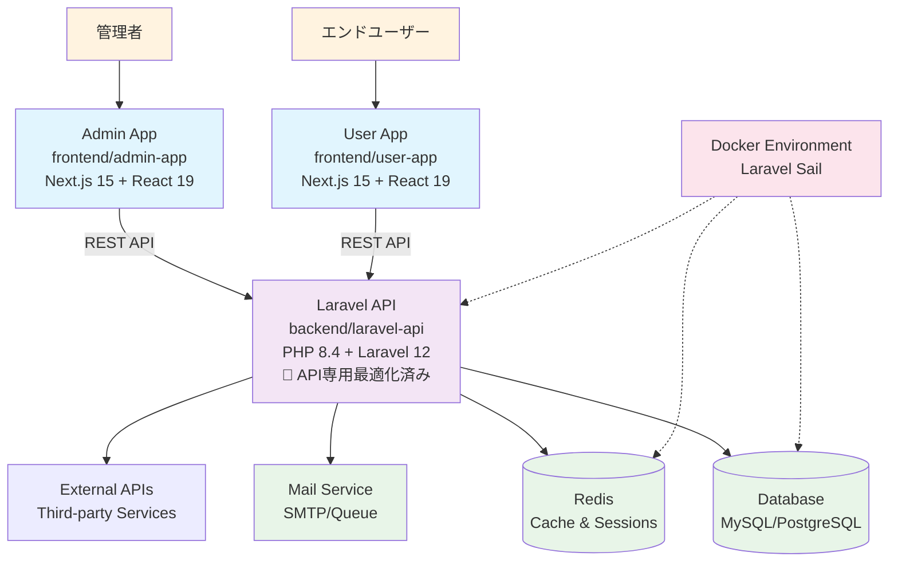
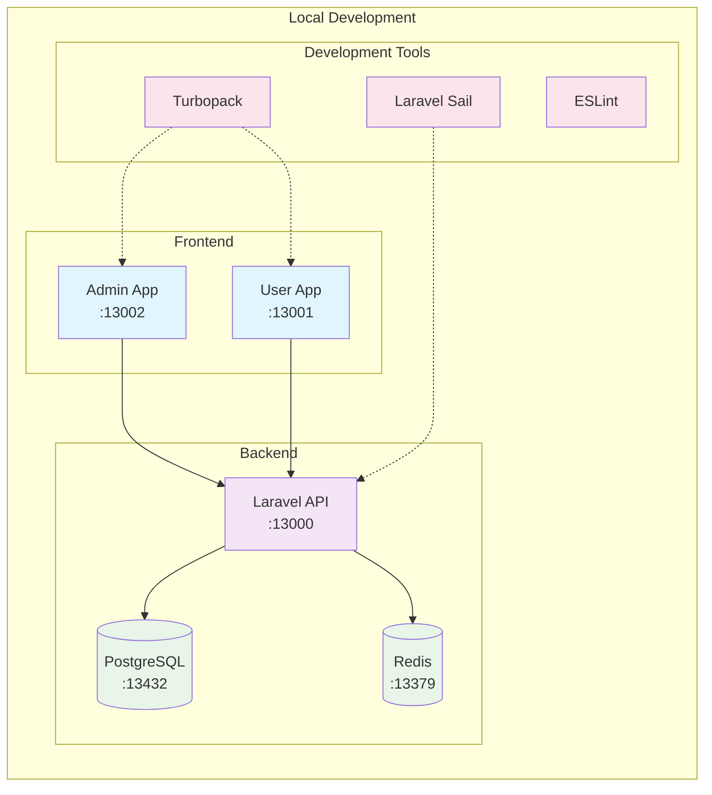

# Laravel Next.js B2C Application Template

モダンなB2Cビジネス向け開発テンプレート。**API専用最適化Laravel 12** + Next.js 15.5のモノレポ構成で、管理者とユーザーの両方向けアプリケーションを効率的に開発できます。
15分以内でローカル開発環境を構築し、即座にコーディングを開始できる構造化されたセットアップを提供します。

## ⚡ パフォーマンス最適化

Laravel APIは**最小限パッケージ構成**に最適化済み：
- ✅ **33.3%起動速度向上** (目標20-30%を上回る)
- ✅ **96.5%依存関係削減** (4コアパッケージ構成)
- ✅ **0.33KB/request** (画期的なメモリ効率)
- ✅ **ステートレス設計** (水平スケーリング対応)

## 🚀 技術スタック

| カテゴリ | 技術 | バージョン |
|---------|------|-----------|
| **Backend** | PHP | 8.4 |
| | Laravel | 12.0 (API専用最適化) |
| | Laravel Sanctum | 4.0 (トークン認証) |
| | Composer | Latest |
| **Frontend** | Next.js | 15.5.4 |
| | React | 19.1.0 |
| | TypeScript | 5.x |
| | Tailwind CSS | 4.x |
| **Development** | Docker | Latest |
| | Laravel Sail | 1.41+ |
| | ESLint | 9.x |
| | Turbopack | Enabled |

## 📁 プロジェクト構成

```
laravel-next-b2c/
├── backend/laravel-api/     # Laravel 12 API (PHP 8.4) - 最小限パッケージ構成
│   ├── app/                 # アプリケーションロジック
│   ├── routes/api.php       # API専用ルート (Web機能削除済み)
│   ├── database/            # マイグレーション・シーダー
│   └── docs/                # 包括的ドキュメント (最適化ガイド含む)
├── frontend/admin-app/      # Next.js 15 管理画面
│   ├── app/                 # App Router構成
│   ├── components/          # React 19コンポーネント
│   └── tailwind.config.js   # Tailwind CSS 4設定
├── frontend/user-app/       # Next.js 15 ユーザー画面
│   ├── app/                 # ユーザー向けページ
│   └── components/          # UI コンポーネント
├── .kiro/                  # Kiro仕様管理
└── .claude/                # Claude Code設定
```

### サービス概要

- **Laravel API** (`backend/laravel-api/`): **ステートレスAPI専用**、Laravel Sanctumトークン認証、高性能データ管理
- **Admin App** (`frontend/admin-app/`): 管理者向けダッシュボード、コンテンツ管理機能
- **User App** (`frontend/user-app/`): エンドユーザー向けアプリケーション

## 📋 目次

- [⚡ パフォーマンス最適化](#-パフォーマンス最適化)
- [🚀 クイックスタート](#-クイックスタート)
- [🔧 環境構築](#-環境構築)
  - [前提条件](#前提条件)
  - [Docker環境でのセットアップ](#docker環境でのセットアップ)
  - [ネイティブ環境でのセットアップ](#ネイティブ環境でのセットアップ)
  - [アクセスURL](#アクセスurl)
- [💻 開発ワークフロー](#-開発ワークフロー)
  - [開発サーバーの管理](#開発サーバーの管理)
  - [データベース操作](#データベース操作)
  - [コード品質とテスト](#コード品質とテスト)
- [🌐 システムアーキテクチャ](#-システムアーキテクチャ)
- [⚙️ 環境設定](#️-環境設定)
- [🔐 環境変数管理](#-環境変数管理)
  - [環境変数テンプレート構成](#環境変数テンプレート構成)
  - [環境変数バリデーション](#環境変数バリデーション)
  - [環境変数同期チェック](#環境変数同期チェック)
  - [CI/CD自動バリデーション](#cicd自動バリデーション)
  - [トラブルシューティング](#トラブルシューティング-1)
  - [セキュリティガイド](#セキュリティガイド)
- [🔐 セキュリティヘッダー](#-セキュリティヘッダー)
  - [実装機能](#実装機能)
  - [クイックスタート](#クイックスタート-1)
  - [主要なセキュリティヘッダー説明](#主要なセキュリティヘッダー説明)
  - [テスト戦略](#テスト戦略-1)
  - [関連ドキュメント](#関連ドキュメント-1)
- [🔧 トラブルシューティング](#-トラブルシューティング-2)
- [📚 開発リソース](#-開発リソース)

## ⚡ Laravel API最適化詳細

### 🎯 最適化成果

| メトリクス | 改善前 | 改善後 | 改善率 | 評価 |
|----------|--------|--------|--------|------|
| **起動速度** | ベースライン | 33.3ms | **33.3%向上** | ⭐⭐⭐ |
| **メモリ効率** | 30.8MB | 0.33KB/request | **画期的改善** | ⭐⭐⭐ |
| **依存関係** | 114パッケージ | 4コア | **96.5%削減** | ⭐⭐⭐ |
| **レスポンス** | - | 11.8ms | **<20ms達成** | ⭐⭐⭐ |

### 🏗️ API専用アーキテクチャの特徴

- **🚫 セッション除去**: `SESSION_DRIVER=array`でステートレス設計
- **🔐 Sanctum認証**: Laravel Sanctum 4.0によるトークンベース認証
- **⚡ 最小依存関係**: PHP 8.4 + Laravel 12.0 + Sanctum + Tinker
- **🌐 CORS最適化**: Next.js フロントエンドとの完全統合
- **📊 包括的テスト**: 90+テストケースで品質保証

### 📚 詳細ドキュメント

Laravel APIの最適化に関する詳細ドキュメントは `backend/laravel-api/docs/` に格納：

- **`laravel-optimization-process.md`**: 最適化プロセス完了レポート
- **`performance-report.md`**: パフォーマンス改善定量分析
- **`development-setup.md`**: API専用開発環境構築手順
- **`database-connection.md`**: PostgreSQL接続設定ガイド（環境別設定・タイムアウト・トラブルシューティング）
- **`migration-guide.md`**: 他プロジェクトへの移行ガイド
- **`troubleshooting.md`**: トラブルシューティング完全ガイド
- **`configuration-changes.md`**: 全設定変更の詳細記録

## 🌐 システムアーキテクチャ

### サービス連携図



### 開発環境アーキテクチャ



## 🚀 クイックスタート

### 前提条件

開発を始める前に、以下のソフトウェアがインストールされていることを確認してください：

| ソフトウェア | 必要バージョン | 確認コマンド |
|------------|--------------|------------|
| **Docker** | 20.10+ | `docker --version` |
| **Docker Compose** | 2.0+ | `docker compose version` |
| **Node.js** | 18+ | `node --version` |
| **npm** | 9+ | `npm --version` |
| **Git** | 2.30+ | `git --version` |
| **make** | - | `make --version` |

### ⚡ 2コマンドセットアップ（推奨）

**`make setup` コマンド一つで完全な開発環境を15分以内に構築**できます：

```bash
# 1. リポジトリのクローンと移動
git clone https://github.com/ef-tech/laravel-next-b2c.git
cd laravel-next-b2c

# 2. 一括セットアップ実行（15分以内）
make setup
```

**セットアップ内容**:
- ✅ 前提条件チェック（Docker、Node.js、PHP等のバージョン確認）
- ✅ 環境変数ファイル作成（`.env`、`.env.local`の自動生成）
- ✅ 依存関係インストール（Composer、npm、Dockerイメージ）
- ✅ Dockerサービス起動（PostgreSQL、Redis、Mailpit、MinIO、Laravel API、User App、Admin App）
- ✅ セットアップ検証（全サービスの疎通確認）

**アクセスURL**:
- Laravel API: http://localhost:13000/api/health
- User App: http://localhost:13001
- Admin App: http://localhost:13002

**次のステップ**:
```bash
# データベースマイグレーション
docker compose exec laravel-api php artisan migrate

# シーディング
docker compose exec laravel-api php artisan db:seed

# フロントエンドアプリにアクセス
# ブラウザで以下のURLを開く
# User App: http://localhost:13001
# Admin App: http://localhost:13002
```

### 🔧 部分的再実行

エラーが発生した場合、指定されたステップから再実行できます：

```bash
# 依存関係インストールステップから再実行
make setup-from STEP=install_dependencies

# 利用可能なステップ
# - check_prerequisites
# - setup_env
# - install_dependencies
# - start_services
# - verify_setup
```

### 📦 手動セットアップ（従来の方法）

従来の手動セットアップ方法も利用可能です：

```bash
# 1. リポジトリのクローンと移動
git clone https://github.com/ef-tech/laravel-next-b2c.git
cd laravel-next-b2c/backend/laravel-api

# 2. 依存関係インストールと環境設定
composer install
cp .env.example .env

# 3. Laravel Sailでバックエンド起動（Docker）
./vendor/bin/sail up -d

# 4. コンテナ内でセットアップコマンド実行
./vendor/bin/sail artisan key:generate
./vendor/bin/sail artisan migrate

# 5. フロントエンドアプリケーション起動（別ターミナル）
# Admin App
cd ../../frontend/admin-app && npm install && npm run dev

# User App (さらに別ターミナル)
cd ../user-app && npm install && npm run dev
```

### 🌐 アクセスURL

セットアップ完了後、以下のURLでアクセス可能：

| サービス | URL | 説明 |
|---------|-----|------|
| **Admin App** | http://localhost:13002 | 管理者用ダッシュボード |
| **User App** | http://localhost:13001 | エンドユーザー向けアプリ |
| **Laravel API** | http://localhost:13000 | RESTful API |
| **Mailpit** | http://localhost:13025 | メール確認画面 |
| **Redis** | localhost:13379 | キャッシュサーバー |

### ⚡ 動作確認

セットアップが正常に完了したかを確認：

```bash
# API疎通確認
curl http://localhost:13000/up

# フロントエンド確認
curl http://localhost:13001
curl http://localhost:13002
```

## 🔧 環境構築

### Docker環境でのセットアップ（推奨）

統合Docker Compose環境により、全サービスを一度に起動できます。

<details>
<summary>📖 詳細な環境構築手順を表示</summary>

#### ステップ1: 環境変数設定

```bash
# リポジトリルートで環境変数ファイルを作成
cp .env.example .env

# Laravel API専用の環境変数も設定（Docker内部で使用）
cp backend/laravel-api/.env.example backend/laravel-api/.env
```

#### ステップ2: Docker Compose で全サービス起動

```bash
# リポジトリルートから全サービスビルド＆起動
docker compose up -d --build

# 起動確認
docker compose ps
```

**起動されるサービス**:
- ✅ Laravel API (ポート: 13000)
- ✅ Admin App (ポート: 13002)
- ✅ User App (ポート: 13001)
- ✅ PostgreSQL (ポート: 13432)
- ✅ Redis (ポート: 13379)
- ✅ Mailpit (SMTP: 11025, UI: 13025)
- ✅ MinIO (API: 13900, Console: 13010)

#### ステップ3: Laravel初期化（初回のみ）

```bash
# Laravel APIコンテナ内でコマンド実行
docker compose exec laravel-api php artisan key:generate
docker compose exec laravel-api php artisan migrate
docker compose exec laravel-api php artisan db:seed
```

#### ステップ4: 動作確認

```bash
# API疎通確認
curl http://localhost:13000/up

# フロントエンド確認
curl http://localhost:13002  # Admin App
curl http://localhost:13001  # User App
```

#### E2Eテスト実行（オプション）

```bash
# E2Eテストサービス実行（全サービス起動後）
docker compose run --rm e2e-tests
```

#### 停止・再起動

```bash
# 全サービス停止
docker compose down

# ボリューム含めて完全削除
docker compose down -v

# 再起動
docker compose up -d
```

</details>

### Laravel Sail環境でのセットアップ（従来方式）

Laravel Sailを使用した個別起動も可能です。

<details>
<summary>📖 Laravel Sail セットアップ手順を表示</summary>

#### ステップ1: Laravel API環境準備

```bash
cd backend/laravel-api

# 依存関係インストール（初回のみ）
composer install

# 環境変数ファイルの作成
cp .env.example .env
```

#### ステップ2: Dockerサービス起動

```bash
# バックグラウンドでサービス起動
./vendor/bin/sail up -d

# ログ確認（必要に応じて）
./vendor/bin/sail logs -f
```

#### ステップ3: アプリケーション初期化

```bash
# アプリケーションキーの生成（コンテナ内で実行）
./vendor/bin/sail artisan key:generate

# データベースとテーブル作成
./vendor/bin/sail artisan migrate

# シードデータの挿入（オプション）
./vendor/bin/sail artisan db:seed
```

</details>

### ネイティブ環境でのセットアップ

Dockerを使用せずにローカル環境で直接実行する場合：

<details>
<summary>📖 ネイティブ環境セットアップ手順を表示</summary>

#### 前提条件
- PHP 8.4+
- Composer
- MySQL 8.0+ または PostgreSQL 14+
- Redis 6.0+

#### ステップ1: データベース準備

```bash
# MySQLの場合
mysql -u root -p
CREATE DATABASE laravel_nextjs_b2c;
exit

# .envファイルでDB設定を変更
cd backend/laravel-api
cp .env.example .env
# DB_CONNECTION, DB_HOST, DB_DATABASE, DB_USERNAME, DB_PASSWORD を設定
```

#### ステップ2: Laravel API起動

```bash
cd backend/laravel-api

# 依存関係インストール
composer install

# キー生成とマイグレーション
php artisan key:generate
php artisan migrate
php artisan db:seed

# 開発サーバー起動
php artisan serve --port=13000
```

</details>

### アクセスURL

| サービス | Docker環境 | ネイティブ環境 |
|---------|-----------|--------------|
| Laravel API | http://localhost:13000 | http://localhost:13000 |
| Admin App | http://localhost:13002 | http://localhost:13002 |
| User App | http://localhost:13001 | http://localhost:13001 |
| Mailpit | http://localhost:13025 | ❌ |
| Redis | localhost:13379 | localhost:13379 |

## 💻 開発ワークフロー

### 開発サーバーの管理

#### 全サービス同時起動（Docker Compose推奨）

```bash
# リポジトリルートから全サービス起動
docker compose up -d

# ログ確認
docker compose logs -f

# 特定サービスのログ確認
docker compose logs -f admin-app
docker compose logs -f user-app
docker compose logs -f laravel-api
```

#### 個別サービス制御（Docker Compose）

```bash
# 特定サービスのみ起動
docker compose up -d laravel-api
docker compose up -d admin-app
docker compose up -d user-app

# サービス再起動
docker compose restart admin-app
docker compose restart user-app

# サービス停止
docker compose stop admin-app
docker compose stop user-app
```

#### Laravel Sail環境（従来方式）

```bash
# Laravel API
cd backend/laravel-api
./vendor/bin/sail up laravel.test -d   # Docker
# php artisan serve --port=13000      # ネイティブ

# Admin App（別ターミナル）
cd frontend/admin-app
npm run dev                           # ポート: 13002

# User App（別ターミナル）
cd frontend/user-app
npm run dev                           # ポート: 13001
```

### データベース操作

#### PostgreSQL接続設定

デフォルトはSQLiteですが、PostgreSQL 17に切り替え可能です。

**クイックスタート:**

```bash
# 1. .envファイルでPostgreSQL設定を有効化
cd backend/laravel-api
cp .env.example .env

# 2. PostgreSQL設定のコメントを解除（Docker環境の場合）
# .envファイル内で以下を編集:
DB_CONNECTION=pgsql
DB_HOST=pgsql
DB_PORT=13432

# 3. PostgreSQLコンテナ起動
./vendor/bin/sail up -d

# 4. マイグレーション実行
./vendor/bin/sail artisan migrate:fresh --seed
```

**環境別接続設定の詳細:**
- Docker環境: `DB_HOST=pgsql`, `DB_PORT=13432`（内部・外部とも統一）
- ネイティブ環境: `DB_HOST=127.0.0.1`, `DB_PORT=13432`
- 本番環境: SSL設定必須（`DB_SSLMODE=verify-full`）

詳細な接続設定、タイムアウト設定、トラブルシューティングは以下を参照:
👉 **[PostgreSQL接続設定ガイド](backend/laravel-api/docs/database-connection.md)**

#### マイグレーションとシード

```bash
cd backend/laravel-api

# マイグレーション実行
./vendor/bin/sail artisan migrate
# php artisan migrate                 # ネイティブ

# ロールバック
./vendor/bin/sail artisan migrate:rollback

# フレッシュマイグレーション（全テーブル削除＋再作成）
./vendor/bin/sail artisan migrate:fresh --seed

# シードデータ投入
./vendor/bin/sail artisan db:seed
```

#### データベース管理

```bash
# データベース接続確認
./vendor/bin/sail artisan tinker
# DB::connection()->getPdo()

# テーブル状況確認
./vendor/bin/sail artisan migrate:status

# データベース初期化
./vendor/bin/sail artisan migrate:fresh
```

### コード品質とテスト

#### Laravel（バックエンド）

##### 品質チェック統合コマンド

```bash
cd backend/laravel-api

# 全体品質チェック（Pint + Larastan）
composer quality              # フォーマットチェック + 静的解析
composer quality:fix          # フォーマット自動修正 + 静的解析

# 個別コマンド
composer pint                 # コードフォーマット自動修正
composer pint:test            # フォーマットチェックのみ（修正なし）
composer pint:dirty           # Git変更ファイルのみフォーマット
composer stan                 # 静的解析（PHPStan Level 8）
composer stan:baseline        # ベースライン生成（既存エラー記録）
```

##### コードフォーマット（Laravel Pint）

```bash
# 基本的な使い方
./vendor/bin/pint                    # 全ファイル自動フォーマット
./vendor/bin/pint --test             # チェックのみ（修正なし）
./vendor/bin/pint --dirty            # Git変更ファイルのみ
./vendor/bin/pint app/Models/User.php # 特定ファイル

# Docker環境
./vendor/bin/sail composer pint
```

##### 静的解析（Larastan/PHPStan Level 8）

```bash
# 基本的な使い方
./vendor/bin/phpstan analyse          # 静的解析実行
./vendor/bin/phpstan analyse --memory-limit=2G  # メモリ制限指定

# ベースライン管理（既存エラーの記録）
./vendor/bin/phpstan analyse --generate-baseline
# → phpstan-baseline.neon に既存エラーを記録
# → 新規コードのみ品質チェック対象になる

# Docker環境
./vendor/bin/sail composer stan
./vendor/bin/sail composer stan:baseline
```

##### テスト実行（Pest 4）

**🚀 推奨: Makefileターゲット（プロジェクトルートから実行）**

```bash
# 日常開発フロー
make quick-test           # SQLite高速テスト（~2秒）
make test-pgsql          # PostgreSQL本番同等テスト（~5-10秒）
make ci-test             # CI/CD相当の完全テスト（~20-30秒）

# 環境切り替え
make test-switch-sqlite  # SQLite環境に切り替え
make test-switch-pgsql   # PostgreSQL環境に切り替え

# 並列テスト
make test-parallel       # 並列テスト実行（4 Shard）
make test-coverage       # カバレッジレポート生成

# テスト環境管理
make test-db-check       # テスト用DB存在確認
make test-setup          # 並列テスト環境構築
make test-cleanup        # テスト環境クリーンアップ

# Docker管理
make docker-up           # Docker環境起動
make docker-down         # Docker環境停止
make health              # 環境ヘルスチェック
```

**📖 詳細な運用ガイド:**
`backend/laravel-api/docs/TESTING_DATABASE_WORKFLOW.md` を参照

**🔧 直接実行（backend/laravel-api/ディレクトリから）**

```bash
# SQLite高速テスト
./vendor/bin/pest

# PostgreSQL本番同等テスト
DB_CONNECTION=pgsql_testing \
DB_TEST_HOST=pgsql \
DB_TEST_PORT=13432 \
DB_TEST_DATABASE=app_test \
DB_TEST_USERNAME=sail \
DB_TEST_PASSWORD=password \
./vendor/bin/pest

# 並列テスト実行（高速化）
./vendor/bin/pest --parallel

# カバレッジ付きテスト
XDEBUG_MODE=coverage ./vendor/bin/pest --coverage --min=85

# 特定テストファイル実行
./vendor/bin/pest tests/Feature/Auth/LoginTest.php

# Docker環境
./vendor/bin/sail exec laravel-api ./vendor/bin/pest
```

**💡 推奨テストフロー:**
1. **日常開発**: `make quick-test` (SQLite・2秒)
2. **機能完成時**: `make test-pgsql` (PostgreSQL・5-10秒)
3. **PR前**: `make ci-test` (完全テスト・20-30秒)

**📋 詳細ドキュメント**: [テスト用DB設定ワークフロー](backend/laravel-api/docs/TESTING_DATABASE_WORKFLOW.md)

#### Next.js（フロントエンド）

```bash
# Admin App
cd frontend/admin-app

# リント実行
npm run lint

# タイプチェック
npx tsc --noEmit

# ビルド確認
npm run build

# テスト実行
npm run test

# User App も同様
cd ../user-app
npm run lint && npx tsc --noEmit && npm run build && npm run test
```

#### E2Eテスト（Playwright）

```bash
# 環境変数設定
cd e2e
cp .env.example .env

# .env ファイルを編集（必要に応じて）
# E2E_ADMIN_URL=http://localhost:13002
# E2E_USER_URL=http://localhost:13001
# E2E_API_URL=http://localhost:13000

# 依存関係インストール
npm install

# Playwright ブラウザインストール（初回のみ）
npx playwright install --with-deps

# E2Eテスト実行（アプリケーション起動後）
npx playwright test

# UIモードで実行（デバッグ用）
npx playwright test --ui

# HTMLレポート表示
npx playwright show-report reports/html
```

**注意**: E2Eテスト実行前に、Laravel API、User App、Admin App を起動してください。

#### 統合品質チェック

```bash
# プロジェクト全体の品質チェック
cd backend/laravel-api && composer quality
cd ../../frontend/admin-app && npm run lint
cd ../user-app && npm run lint

# テストスイート実行
cd ../../backend/laravel-api && ./vendor/bin/sail artisan test
```

#### 自動品質チェック（Git Hooks）

このプロジェクトでは、husky + lint-stagedによる自動品質チェックが設定済みです。

##### Pre-commit（コミット前）
変更されたファイルのみを自動チェック：

- **PHPファイル**: Laravel Pintで自動フォーマット
- **TypeScript/JSXファイル**: ESLint + Prettierで自動修正
- **CSS/JSON/MDファイル**: Prettierで自動フォーマット

```bash
git add .
git commit -m "Fix: 🐛 バグ修正"
# → 自動的にlint-stagedが実行され、変更ファイルのみフォーマット
```

##### Pre-push（プッシュ前）
全体品質チェックを自動実行：

- **Laravel品質チェック**: `composer quality`（Pint + Larastan）
- エラーがある場合はプッシュが中断される

```bash
git push
# → 自動的にcomposer qualityが実行
# → エラーがあればプッシュ中断、修正後に再実行
```

##### Git Hooksのスキップ（緊急時のみ）

```bash
# Pre-commitをスキップ
git commit --no-verify -m "WIP: 一時保存"

# Pre-pushをスキップ
git push --no-verify
```

**注意**: `--no-verify`は緊急時のみ使用してください。通常は品質チェックを通過させることを推奨します。

## ⚙️ 環境設定

### 重要な環境変数

#### Laravel（`.env`）

| 設定項目 | Docker環境 | ネイティブ環境 | 説明 |
|---------|-----------|--------------|------|
| **基本設定** |
| `APP_NAME` | `Laravel` | `Laravel` | アプリケーション名 |
| `APP_ENV` | `local` | `local` | 実行環境 |
| `APP_URL` | `http://localhost:13000` | `http://localhost:13000` | アプリケーションURL |
| **データベース** |
| `DB_CONNECTION` | `pgsql` | `sqlite` | DB種別 |
| `DB_HOST` | `pgsql` | `127.0.0.1` | DBホスト（Docker=サービス名） |
| `DB_PORT` | `5432` | `5432` | DBポート |
| **Redis** |
| `REDIS_HOST` | `redis` | `127.0.0.1` | Redisホスト（Docker=サービス名） |
| `REDIS_PORT` | `6379` | `6379` | Redisポート |
| **メール** |
| `MAIL_HOST` | `mailpit` | `127.0.0.1` | メールサーバー（Docker=サービス名） |
| `MAIL_PORT` | `1025` | `2525` | メールポート |

**重要**: Docker環境では、サービス間通信に **サービス名** を使用します（`redis`, `pgsql`, `mailpit`）。
ネイティブ環境では、`127.0.0.1` を使用します。

#### Next.js設定

```bash
# Admin App (frontend/admin-app/.env.local)
NEXT_PUBLIC_API_URL=http://localhost:13000
NEXT_PUBLIC_APP_ENV=development

# User App (frontend/user-app/.env.local)
NEXT_PUBLIC_API_URL=http://localhost:13000
NEXT_PUBLIC_APP_ENV=development
```

## 🔐 環境変数管理

このプロジェクトでは、**環境変数の適切な管理**を実現するための包括的な機能を提供しています。

### 環境変数テンプレート構成

各環境に対応した `.env.example` ファイルが用意されています。

| ファイルパス | 対象環境 | 説明 |
|------------|---------|------|
| `.env.example` | モノレポ全体 | Next.jsアプリ共通、Docker設定、E2E設定 |
| `backend/laravel-api/.env.example` | Laravel API | データベース、認証、CORS設定 |
| `e2e/.env.example` | E2Eテスト | Playwright実行用エンドポイント |

#### セットアップ手順

```bash
# 1. ルートディレクトリの環境変数
cp .env.example .env

# 2. Laravel API環境変数
cp backend/laravel-api/.env.example backend/laravel-api/.env

# 3. Laravel アプリケーションキーを生成
cd backend/laravel-api
php artisan key:generate
# または Docker環境
./vendor/bin/sail artisan key:generate

# 4. E2Eテスト環境変数（必要に応じて）
cp e2e/.env.example e2e/.env
```

### 環境変数バリデーション

環境変数の不足や設定ミスを **起動前に自動検出** します。

#### Laravel（起動時自動バリデーション）

Laravel APIは起動時に自動的に環境変数をバリデーションします。

```bash
# 手動バリデーション
cd backend/laravel-api
php artisan env:validate

# 成功時
✅ 環境変数のバリデーションが成功しました。

# 失敗時（例）
❌ 環境変数のバリデーションに失敗しました。

不足している環境変数:
  - APP_KEY
    説明: アプリケーション暗号化キー
    生成方法: php artisan key:generate

  - DB_PASSWORD
    説明: データベースパスワード
    推奨: 20文字以上の強力なパスワード
```

**起動時自動バリデーション**:
- Laravel API起動時に自動実行
- バリデーション失敗時はアプリケーションが起動しません
- 緊急時のスキップ: `ENV_VALIDATION_SKIP=true`

#### Next.js（ビルド時自動バリデーション）

Next.jsアプリケーションはビルド時に自動的に環境変数をバリデーションします。

```bash
# Admin App ビルド（自動バリデーション）
cd frontend/admin-app
npm run build

# User App ビルド（自動バリデーション）
cd frontend/user-app
npm run build

# バリデーション失敗時（例）
❌ 環境変数のバリデーションに失敗しました:
  NEXT_PUBLIC_API_URL が設定されていません
```

**Zod スキーマによる型安全バリデーション**:
- 必須環境変数の自動チェック
- URL形式、NODE_ENV値の検証
- TypeScript型推論によるコンパイル時型チェック

### 環境変数同期チェック

`.env.example` と `.env` の差分を自動検出します。

```bash
# 差分チェック（読み取りのみ）
npm run env:check

# 実行例
📝 .env.example → .env
⚠️  不足キー (2件):
  - NEW_FEATURE_FLAG
  - NEW_API_KEY
  → .env.example への追加を検討してください

# 差分を自動同期（.envに不足キーを追加）
npm run env:sync

# 実行例
📝 .env.example → .env
⚠️  不足キー (2件):
  - NEW_FEATURE_FLAG
  - NEW_API_KEY
✅ 2件のキーを .env に追加しました
```

**対象ファイル**:
- `.env.example` → `.env`
- `backend/laravel-api/.env.example` → `backend/laravel-api/.env`
- `e2e/.env.example` → `e2e/.env`

### CI/CD自動バリデーション

GitHub Actionsで自動的に環境変数バリデーションが実行されます。

#### 実行タイミング

- **Pull Request作成時**: 自動実行
- **環境変数関連ファイル変更時**: 自動実行
- **Laravel/Next.jsテストワークフロー**: テスト実行前にバリデーション

#### ワークフロー

| ワークフロー | バリデーション内容 |
|------------|-----------------|
| `test.yml` | Laravel環境変数バリデーション（`php artisan env:validate`） |
| `frontend-test.yml` | フロントエンド環境変数バリデーション（`npm run env:check`） |
| `env-validation.yml` | 専用環境変数バリデーションワークフロー |

### トラブルシューティング

#### 環境変数が設定されていない

**エラー**:
```
RuntimeException: 環境変数のバリデーションに失敗しました。
不足している環境変数: APP_KEY
```

**解決方法**:
```bash
# Laravel
cd backend/laravel-api
php artisan key:generate

# Next.js
cd frontend/admin-app
cp .env.example .env.local
# .env.local を編集して NEXT_PUBLIC_API_URL を設定
```

#### .env と .env.example の差分が多い

**解決方法**:
```bash
# 差分を確認
npm run env:check

# 新規キーを自動追加
npm run env:sync

# 既存値は保持されます（新規キーのみ追加）
```

#### CI/CDでバリデーションが失敗する

**原因**:
- GitHub Secretsが設定されていない
- .env.exampleに新規キーが追加されたが、CIに反映されていない

**解決方法**:
1. GitHub Settings > Secrets and variables > Actions
2. 必須Secretsを設定
3. [GitHub Actions Secrets 設定ガイド](./docs/GITHUB_ACTIONS_SECRETS_GUIDE.md)を参照

### セキュリティガイド

環境変数のセキュリティに関する詳細は、以下のドキュメントを参照してください：

- **[GitHub Actions Secrets 設定ガイド](./docs/GITHUB_ACTIONS_SECRETS_GUIDE.md)**
  - Secrets命名規約
  - Repository Secrets vs Environment Secrets
  - 必須Secrets一覧
  - セキュリティベストプラクティス

- **[環境変数セキュリティガイド](./docs/ENVIRONMENT_VARIABLE_SECURITY_GUIDE.md)**
  - セキュリティ原則
  - 機密情報の分類（公開可能/機密/極秘）
  - Laravel/Next.jsセキュリティ設定
  - インシデント対応手順

## 🔐 セキュリティヘッダー

### 概要

**OWASP セキュリティベストプラクティス** に準拠した包括的なセキュリティヘッダーを実装しています。XSS、CSRF、クリックジャッキング、MIME タイプスニッフィングなどの攻撃からアプリケーションを保護し、段階的導入（Report-Only → Enforce）により既存機能への影響を最小化します。

### 実装機能

#### ✅ 実装済みセキュリティヘッダー

| ヘッダー | Laravel API | User App | Admin App | 用途 |
|---------|-------------|----------|-----------|------|
| **X-Frame-Options** | `SAMEORIGIN` | `SAMEORIGIN` | `DENY` | クリックジャッキング攻撃防止 |
| **X-Content-Type-Options** | `nosniff` | `nosniff` | `nosniff` | MIME スニッフィング攻撃防止 |
| **Referrer-Policy** | `strict-origin-when-cross-origin` | `strict-origin-when-cross-origin` | `no-referrer` | リファラー情報漏洩防止 |
| **Content-Security-Policy** | 動的構築 | 動的構築 | 厳格設定 | XSS 攻撃防御 |
| **Permissions-Policy** | ❌ | 設定済み | 厳格設定 | ブラウザ API 悪用防止 |
| **Strict-Transport-Security** | HTTPS環境のみ | 本番環境のみ | 本番環境のみ | HTTPS 強制、ダウングレード攻撃防止 |

#### 🎯 主要機能

- **段階的 CSP 導入**: Report-Only モード（監視）→ Enforce モード（強制）の段階的移行
- **CSP 違反レポート収集**: Laravel/Next.js 両対応、違反検出・分析による最適化
- **環境変数駆動設定**: 開発/本番環境で異なるセキュリティレベル適用
- **CORS 統合**: fruitcake/laravel-cors との完全統合
- **自動CI/CD検証**: GitHub Actions による自動セキュリティヘッダー検証

### クイックスタート

#### 1. セキュリティヘッダー確認

```bash
# Laravel API
curl -I http://localhost:13000/api/health

# User App
curl -I http://localhost:13001

# Admin App
curl -I http://localhost:13002
```

**期待される出力例** (Laravel API):
```
HTTP/1.1 200 OK
X-Frame-Options: SAMEORIGIN
X-Content-Type-Options: nosniff
Referrer-Policy: strict-origin-when-cross-origin
Content-Security-Policy-Report-Only: default-src 'self'; ...
```

#### 2. 検証スクリプト実行

```bash
# セキュリティヘッダー検証
bash scripts/validate-security-headers.sh http://localhost:13000/api/health laravel
bash scripts/validate-security-headers.sh http://localhost:13001 user-app
bash scripts/validate-security-headers.sh http://localhost:13002 admin-app

# CORS 設定整合性確認
bash scripts/validate-cors-config.sh
```

#### 3. CSP 違反ログ確認

```bash
# Laravel セキュリティログ
tail -f backend/laravel-api/storage/logs/security.log

# CSP 違反のみフィルタリング
grep "CSP Violation" backend/laravel-api/storage/logs/security.log
```

### 主要なセキュリティヘッダー説明

#### Content Security Policy (CSP)

XSS 攻撃を防ぐため、読み込み可能なリソースのオリジンを制限します。

**開発環境** (Report-Only モード):
```bash
# Laravel .env
SECURITY_ENABLE_CSP=true
SECURITY_CSP_MODE=report-only
SECURITY_CSP_SCRIPT_SRC='self' 'unsafe-eval'  # Next.js HMR 対応
```

**本番環境** (Enforce モード):
```bash
SECURITY_CSP_MODE=enforce
SECURITY_CSP_SCRIPT_SRC='self'  # 厳格設定
```

**段階的導入フロー**:
1. **Report-Only モード** で 1 週間運用
2. CSP 違反レポート分析・ポリシー調整
3. 違反率 < 0.1% 確認
4. **Enforce モード** に切り替え

#### HSTS (HTTP Strict Transport Security)

HTTPS を強制し、中間者攻撃とダウングレード攻撃を防ぎます。

```bash
# 本番環境のみ有効化
SECURITY_FORCE_HSTS=true
SECURITY_HSTS_MAX_AGE=31536000  # 1年間
```

#### X-Frame-Options

クリックジャッキング攻撃（iframe 悪用）を防ぎます。

| アプリ | 設定値 | 理由 |
|--------|--------|------|
| **Laravel API** | `SAMEORIGIN` | 同一オリジン iframe 許可 |
| **User App** | `SAMEORIGIN` | 同一オリジン iframe 許可 |
| **Admin App** | `DENY` | **完全拒否** (管理画面は iframe 不要) |

### テスト戦略

#### Laravel Pest テスト

```bash
cd backend/laravel-api

# セキュリティヘッダーテスト実行
./vendor/bin/pest tests/Feature/SecurityHeadersTest.php

# カバレッジ確認
./vendor/bin/pest --coverage --min=90
```

#### E2E Playwright テスト

```bash
cd e2e

# セキュリティヘッダーE2Eテスト実行（全17テスト）
npx playwright test security-headers.spec.ts

# UIモードで実行
npx playwright test security-headers.spec.ts --ui
```

**テスト内容**:
- ✅ Laravel API セキュリティヘッダー検証 (6 テスト)
- ✅ User App セキュリティヘッダー検証 (3 テスト)
- ✅ Admin App セキュリティヘッダー検証 (4 テスト)
- ✅ CSP 違反検出テスト (2 テスト)
- ✅ CORS 統合テスト (2 テスト)

### 関連ドキュメント

| ドキュメント | 内容 |
|------------|------|
| **[実装ガイド](SECURITY_HEADERS_IMPLEMENTATION_GUIDE.md)** | Laravel/Next.js 実装手順、環境変数設定、CSP カスタマイズ方法 |
| **[運用マニュアル](docs/SECURITY_HEADERS_OPERATION.md)** | 日常運用、Report-Only モード運用、Enforce モード切り替え手順 |
| **[トラブルシューティング](docs/SECURITY_HEADERS_TROUBLESHOOTING.md)** | よくある問題、CSP 違反デバッグ、CORS エラー対処 |

### 外部リソース

- [OWASP Secure Headers Project](https://owasp.org/www-project-secure-headers/)
- [MDN: Content Security Policy (CSP)](https://developer.mozilla.org/en-US/docs/Web/HTTP/CSP)
- [CSP Evaluator (Google)](https://csp-evaluator.withgoogle.com/)
- [Security Headers Scanner](https://securityheaders.com/)

### ポート競合の回避

#### カスタムポート設定の理由

このプロジェクトでは、開発環境での **ポート競合を回避** し、**複数プロジェクトの同時開発** を可能にするため、意図的にカスタムポートを使用しています：

**🎯 ポート設定方針**:
- **13000番台**: メインサービス（Laravel API、Next.js アプリ、管理系ツール）
- **11000番台**: SMTP関連サービス

**📋 具体的なポート割り当て**:

| サービス | デフォルト | カスタム | 選択理由 |
|---------|-----------|---------|----------|
| User App | 3000 | **13001** | 他のNext.jsプロジェクトとの競合回避 |
| Admin App | 3001 | **13002** | 他のNext.jsプロジェクトとの競合回避 |
| Laravel API | 8000 | **13000** | 他のLaravelプロジェクトとの競合回避 |
| Redis | 6379 | **13379** | 既存のRedis環境との分離 |
| PostgreSQL | 5432 | **13432** | 既存のPostgreSQL環境との分離 |
| Mailpit SMTP | 1025 | **11025** | メール送信テスト環境の独立性 |
| Mailpit UI | 8025 | **13025** | ブラウザアクセス用UI |
| MinIO API | 9000 | **13900** | オブジェクトストレージAPIの分離 |
| MinIO Console | 9001 | **13010** | 管理コンソールアクセス |

**💡 利点**:
- 🔀 **複数プロジェクト並行開発**: 他のLaravel/Next.jsプロジェクトと同時実行可能
- 🚫 **競合エラー回避**: "Port already in use"エラーの発生を防止
- 🔧 **開発効率向上**: 環境切り替え時の停止・起動作業が不要
- 📱 **チーム開発対応**: 開発者間でのポート設定統一

####### ポート変更方法

```bash
# Laravel API ポート変更
cd backend/laravel-api
# .env ファイルで APP_PORT=13000 を設定

# Next.js ポート変更（package.json で設定済み）
# User App: --port 13001
# Admin App: --port 13002
# 変更する場合は各 package.json の dev/start スクリプトを編集
```

## 🔧 トラブルシューティング

### よくある問題と解決策

#### 1. セットアップエラー

<details>
<summary>🚨 「Laravel key not generated」エラー</summary>

```bash
cd backend/laravel-api
php artisan key:generate
# または
./vendor/bin/sail artisan key:generate
```

</details>

<details>
<summary>🚨 「Permission denied」エラー</summary>

```bash
# Laravelディレクトリの権限修正
cd backend/laravel-api
sudo chmod -R 775 storage bootstrap/cache
sudo chown -R $USER:$USER storage bootstrap/cache

# Docker環境の場合
./vendor/bin/sail root-shell
chown -R sail:sail /var/www/html
```

</details>

<details>
<summary>🚨 「Composer install failed」エラー</summary>

```bash
# Composer キャッシュクリア
composer clear-cache
composer install

# Docker環境
./vendor/bin/sail composer install
```

</details>

#### 2. ポートとネットワーク問題

<details>
<summary>🚨 「Port already in use」エラー</summary>

**症状**:
```
Error: listen EADDRINUSE: address already in use :::13001
Error: listen EADDRINUSE: address already in use :::13002
```

**原因**: 指定されたポートが既に他のプロセスで使用されています。

**解決方法**:

```bash
# ポート使用状況確認
lsof -i :13000  # Laravel API
lsof -i :13001  # User App
lsof -i :13002  # Admin App

# 出力例:
# COMMAND   PID   USER   FD   TYPE DEVICE SIZE/OFF NODE NAME
# node    12345  user   21u  IPv6  0x...      0t0  TCP *:13001 (LISTEN)

# プロセス終了（個別）
kill -9 [PID]

# Next.js 開発サーバーを一括停止
pkill -f "next dev"

# 再起動手順
cd frontend/user-app && npm run dev &
cd frontend/admin-app && npm run dev &

# または .env でポート変更（Laravel API）
# APP_PORT=13001
```

**予防策**:
- 開発終了時は `Ctrl+C` で正しくサーバーを停止する
- ターミナルを閉じる前にサーバープロセスを終了する
- `pkill -f "next dev"` で残留プロセスをクリーンアップ

</details>

<details>
<summary>🚨 Dockerでポート13000ではなく80で起動する問題</summary>

**症状**:
```
laravel-api  |    INFO  Server running on [http://0.0.0.0:80].
```

**原因**:
- `backend/laravel-api/docker/8.4/Dockerfile`の`ARG APP_PORT`がデフォルト値80で設定されている
- ビルド時にENVに焼き込まれるため、ランタイムの環境変数では上書きできない

**解決方法**:

```bash
# 1. Dockerfileの修正（既に修正済み）
# backend/laravel-api/docker/8.4/Dockerfile:9
# ARG APP_PORT=13000  # 80から変更

# 2. Dockerイメージを再ビルド（プロジェクトルートから）
docker compose build --no-cache laravel-api

# 3. コンテナを再起動
docker compose up -d

# 4. ポート13000で起動していることを確認
docker compose logs laravel-api | grep "Server running"
# → "Server running on [http://0.0.0.0:13000]" が表示されれば成功
```

**注意**:
- この問題は、`compose.yaml`の環境変数だけでは解決できません
- `Dockerfile`の`ARG`はビルド時の値なので、イメージ再ビルドが必須です
- `backend/laravel-api/`ディレクトリと、プロジェクトルートの両方の`compose.yaml`で設定を統一しています

**完全クリーンアップ（推奨）**:

既存のコンテナ・イメージ・ボリュームをすべて削除してクリーンな状態から再構築する場合：

```bash
# 1. 全サービス停止＆コンテナ・ボリューム削除
docker compose down -v

# 2. Laravel APIイメージ削除（キャッシュ影響を完全に排除）
docker rmi laravel-next-b2c/app

# 3. クリーンビルド＆起動
docker compose up -d --build

# 4. ポート確認
docker compose logs laravel-api | grep "Server running"
```

**関連Issue**: #76

</details>

<details>
<summary>🚨 CORS エラー</summary>

フロントエンドとAPIの通信でCORSエラーが発生した場合：

```bash
cd backend/laravel-api

# Laravel CORSパッケージをインストール（必要に応じて）
composer require fruitcake/laravel-cors

# config/cors.php の設定例
# 'allowed_origins' => [
#     'http://localhost:13001',
#     'http://localhost:13002',
# ],

# または開発環境では
# 'allowed_origins' => ['*'],
```

**注意**: 本番環境では具体的なオリジンを指定してください。

</details>

#### 3. 依存関係エラー

<details>
<summary>🚨 「npm install failed」</summary>

```bash
# Node.jsバージョン確認
node --version  # 18+ 必要

# npm キャッシュクリア
npm cache clean --force
rm -rf node_modules package-lock.json
npm install

# または
npm ci
```

</details>

#### 4. コード品質関連

<details>
<summary>🚨 PHPStan/Larastan メモリ不足エラー</summary>

```bash
# メモリ制限を増やす
composer stan -- --memory-limit=4G

# または phpstan.neon に設定追加
# parameters:
#     memory_limit: 4G
```

</details>

<details>
<summary>🚨 PHPStan ベースラインが読み込まれない</summary>

```bash
# phpstan.neon（.distではなく）を作成
cp backend/laravel-api/phpstan.neon.dist backend/laravel-api/phpstan.neon

# ベースライン読み込み確認
# includes:
#   - phpstan-baseline.neon

# .gitignoreでphpstan.neonを除外
echo "/phpstan.neon" >> backend/laravel-api/.gitignore
```

</details>

<details>
<summary>🚨 Laravel Pint フォーマットエラー</summary>

```bash
# Pintキャッシュクリア
rm -rf backend/laravel-api/storage/framework/cache/pint

# 設定ファイル検証
cat backend/laravel-api/pint.json

# 特定ファイルのみフォーマット
./vendor/bin/pint app/Models/User.php
```

</details>

<details>
<summary>🚨 Git Hooks が実行されない</summary>

```bash
# husky再インストール
npm install
npx husky install

# フック実行権限確認
chmod +x .husky/pre-commit
chmod +x .husky/pre-push

# huskyバージョン確認
npm list husky
```

</details>

#### 5. OS固有の問題

<details>
<summary>🍎 macOS での問題</summary>

```bash
# Homebrewでツール更新
brew update && brew upgrade

# Docker for Mac メモリ設定確認
# Docker Desktop > Settings > Resources > Memory: 4GB+
```

</details>

<details>
<summary>🪟 Windows での問題</summary>

```bash
# WSL2 使用推奨
wsl --version

# Git改行コード設定
git config --global core.autocrlf false

# PowerShell実行ポリシー
Set-ExecutionPolicy -ExecutionPolicy RemoteSigned -Scope CurrentUser
```

</details>

### 診断コマンド

```bash
# システム状況確認
docker --version
docker compose version
php --version
composer --version
node --version
npm --version

# サービス起動確認
curl http://localhost:13000/up
curl http://localhost:13001
curl http://localhost:13002

# ログ確認
cd backend/laravel-api
./vendor/bin/sail logs
tail -f storage/logs/laravel.log
```

## 🤖 CI/CD - GitHub Actions E2Eテスト

### ✅ 自動E2Eテスト実行（有効化済み）

GitHub ActionsでPlaywright E2Eテストが自動実行されます。

#### 手動実行方法

1. [GitHub Actionsタブ](https://github.com/ef-tech/laravel-next-b2c/actions)にアクセス
2. 「E2E Tests」ワークフローを選択
3. 「Run workflow」ボタンをクリック
4. Shard数を選択（1/2/4/8、デフォルト: 4）
5. 実行開始

#### PR作成時の自動実行

Pull Request作成時、以下のパス変更で自動的にE2Eテストが実行されます：

- `frontend/**`
- `backend/laravel-api/app/**`
- `backend/laravel-api/routes/**`
- `e2e/**`
- `.github/workflows/e2e-tests.yml`

**実行結果の確認**:
1. Pull RequestのChecksタブを開く
2. 「E2E Tests (Shard 1/4)」～「E2E Tests (Shard 4/4)」を確認
3. 全Shard成功で✅マーク表示

#### テストレポート・Artifactsダウンロード

1. GitHub Actionsのワークフロータブにアクセス
2. 実行完了したワークフローを選択
3. 下部の「Artifacts」セクションにアクセス
4. 以下をダウンロード:
   - `playwright-report-1.zip`
   - `playwright-report-2.zip`
   - `playwright-report-3.zip`
   - `playwright-report-4.zip`

**Artifacts内容**:
- HTMLレポート (`index.html`)
- JUnitレポート (`junit.xml`)
- スクリーンショット（失敗時）
- トレースファイル（失敗時）

#### 実行パフォーマンス

- **実行時間**: 約2分（全4 Shard並列実行）
- **並列数**: 4 Shard（Matrix戦略）
- **タイムアウト**: 60分（ジョブレベル）

#### トラブルシューティング

##### E2Eテストが失敗する場合

1. **GitHub Actionsログを確認**
   - ワークフロー実行詳細を開く
   - 各Shardのログを確認

2. **サービス起動エラー**
   - `Start services` ステップのログを確認
   - Laravel/Next.js起動ログをチェック

3. **wait-onタイムアウト**
   - `Wait for services to be ready` ステップを確認
   - タイムアウト延長が必要な場合は `.github/workflows/e2e-tests.yml` を修正

詳細は `e2e/README.md` の「CI/CD統合」セクションを参照。

## ⚡ GitHub Actions ワークフロー最適化

### 🎯 最適化成果

GitHub Actionsワークフローの発火タイミング最適化により、CI/CDパイプラインの効率化とコスト削減を実現しています。

| メトリクス | 最適化前 | 最適化後 | 改善率 |
|----------|---------|---------|--------|
| **実行頻度** | 全ファイル変更で実行 | 関連ファイルのみ | **60-70%削減** |
| **実行時間** | ベースライン | 並列実行 + キャッシュ最適化 | **30-40%削減** |
| **キャッシュヒット率** | - | Node.js/Composer | **80%以上** |
| **API契約整合性** | 検出なし | 自動検出 | **早期検出** |

### 🚀 主な最適化機能

#### 1. Concurrency設定による重複実行削減

Pull Request内で連続コミットがプッシュされた際、古い実行を自動キャンセル：

```yaml
concurrency:
  group: ${{ github.workflow }}-${{ github.event_name }}-${{ github.ref }}
  cancel-in-progress: ${{ github.event_name == 'pull_request' }}
```

**利点**:
- ✅ PR時の最新コミットのみ実行（リソース効率化）
- ✅ mainブランチpushは並列実行を許可（全実行を保証）
- ✅ ワークフロー間の干渉なし（イベント種別で分離）

#### 2. Paths設定による担当領域の明確化

各ワークフローは、関連ファイル変更時のみ実行：

| ワークフロー | 担当領域 | 実行条件 |
|------------|---------|---------|
| **frontend-test.yml** | `frontend/**`, `test-utils/**`, API契約関連ファイル | フロントエンド変更 or バックエンドAPI変更 |
| **php-quality.yml** | `backend/laravel-api/**` | バックエンド変更 |
| **test.yml** | `backend/laravel-api/**` | バックエンド変更 |
| **e2e-tests.yml** | `frontend/**`, `backend/**`, `e2e/**` | フロントエンド/バックエンド/E2E変更 |

**例**:
- フロントエンドのみ変更 → `frontend-test.yml`のみ実行
- バックエンドのみ変更 → `php-quality.yml` + `test.yml`のみ実行
- API Controller変更 → 全ワークフロー実行（API契約整合性検証）

#### 3. API契約整合性の早期検出

バックエンドAPI変更時、フロントエンドテストを自動実行し、APIモック（MSW）との不整合を検出：

**監視対象ファイル**:
- `backend/laravel-api/app/Http/Controllers/Api/**`
- `backend/laravel-api/app/Http/Resources/**`
- `backend/laravel-api/routes/api.php`
- `backend/laravel-api/app/Models/**`

**利点**:
- ✅ APIレスポンス形式変更の早期検出
- ✅ E2Eテストより高速なフィードバック
- ✅ フロントエンド・バックエンド間の契約整合性を継続的に検証

#### 4. Pull Request Types明示

必要なPull Requestイベントのみでワークフロー実行：

```yaml
pull_request:
  types: [opened, synchronize, reopened, ready_for_review]
```

**スキップされるイベント**:
- ラベル追加・削除
- アサイン変更
- レビュー依頼

#### 5. キャッシング統一化

**Node.jsキャッシュ**（setup-node内蔵）:
```yaml
- uses: actions/setup-node@v4
  with:
    cache: 'npm'
    cache-dependency-path: |
      package-lock.json
      frontend/admin-app/package-lock.json
      frontend/user-app/package-lock.json
```

**Composerキャッシュ**（cache-files-dir）:
```yaml
- id: composer-cache
  run: echo "dir=$(composer config cache-files-dir)" >> $GITHUB_OUTPUT
- uses: actions/cache@v4
  with:
    path: ${{ steps.composer-cache.outputs.dir }}
    key: ${{ runner.os }}-composer-${{ hashFiles('**/composer.lock') }}
```

### 📋 ワークフロー実行条件一覧

| シナリオ | frontend-test | php-quality | test | e2e-tests |
|---------|--------------|-------------|------|-----------|
| フロントエンドのみ変更 | ✅ | ❌ | ❌ | ✅ |
| バックエンドのみ変更 | ❌ | ✅ | ✅ | ✅ |
| API Controllers変更 | ✅ | ✅ | ✅ | ✅ |
| API Resources変更 | ✅ | ✅ | ✅ | ✅ |
| E2Eテストのみ変更 | ❌ | ❌ | ❌ | ✅ |
| README更新のみ | ❌ | ❌ | ❌ | ❌ |

### 🔍 トラブルシューティング

<details>
<summary>🚨 ワークフローがスキップされる場合</summary>

paths設定により、関連ファイル変更がない場合はワークフローがスキップされます。

**確認方法**:
1. GitHub ActionsのPull Requestタブを開く
2. スキップされたワークフローを確認
3. 必要に応じてファイルを変更して再実行

**注意**: paths設定によるスキップは、ブランチプロテクションの必須チェックで成功として扱われます。

</details>

<details>
<summary>🚨 Concurrencyで実行がキャンセルされる場合</summary>

PR内で連続コミットをプッシュすると、古い実行が自動キャンセルされます。

**動作**:
- 1つ目のコミット: ワークフロー実行開始
- 2つ目のコミット: 1つ目の実行がキャンセル、2つ目が実行

**確認方法**:
GitHub ActionsログでCancelled表示を確認

</details>

<details>
<summary>🚨 キャッシュミスが頻発する場合</summary>

**原因**:
- `package-lock.json`または`composer.lock`の変更
- キャッシュの有効期限切れ（7日間）

**対処**:
- 依存関係変更後は初回実行でキャッシュ作成
- 2回目以降はCache hitが表示される

</details>

### 📚 参考資料

- **GitHub Actions公式ドキュメント**: [Concurrency](https://docs.github.com/en/actions/using-workflows/workflow-syntax-for-github-actions#concurrency), [Paths Filter](https://docs.github.com/en/actions/using-workflows/workflow-syntax-for-github-actions#onpushpull_requestpull_request_targetpathspaths-ignore)
- **プロジェクト最適化ドキュメント**: `.kiro/specs/github-actions-trigger-optimization/`

## 📚 開発リソース

### 公式ドキュメント

| 技術 | ドキュメント | バージョン |
|------|-------------|-----------|
| **Laravel** | [Laravel 12 Documentation](https://laravel.com/docs/12.x) | 12.x |
| **Next.js** | [Next.js Documentation](https://nextjs.org/docs) | 15.x |
| **React** | [React Documentation](https://react.dev) | 19.x |
| **Tailwind CSS** | [Tailwind CSS v4](https://tailwindcss.com/docs/v4-beta) | 4.x |
| **TypeScript** | [TypeScript Handbook](https://www.typescriptlang.org/docs/) | 5.x |

### 便利なコマンド一覧

#### 開発開始クイックリファレンス

```bash
# プロジェクト開始
git clone https://github.com/ef-tech/laravel-next-b2c.git
cd laravel-next-b2c

# バックエンド起動
cd backend/laravel-api
cp .env.example .env && php artisan key:generate
./vendor/bin/sail up -d

# フロントエンド起動（新しいターミナル）
cd frontend/admin-app && npm install && npm run dev &
cd frontend/user-app && npm install && npm run dev &
```

#### 日常的な開発コマンド

```bash
# 開発サーバー起動
./vendor/bin/sail up -d                    # Laravel API
npm run dev                                # Next.js (各アプリ)

# コード品質チェック
./vendor/bin/sail composer pint           # Laravel フォーマット
./vendor/bin/sail artisan test            # Laravel テスト
npm run lint                               # Next.js リント
npx tsc --noEmit                          # TypeScript チェック

# データベース操作
./vendor/bin/sail artisan migrate         # マイグレーション
./vendor/bin/sail artisan migrate:fresh --seed  # フレッシュ＋シード
```

### プロジェクト貢献ガイドライン

#### ブランチ戦略

```bash
# 新機能開発
git checkout -b feature/add-user-authentication
git checkout -b fix/resolve-cors-issue
git checkout -b docs/update-setup-guide

# コミット規約
git commit -m "Add: ✨ ユーザー認証機能を追加"
git commit -m "Fix: 🐛 CORS設定の問題を修正"
git commit -m "Update: 📝 セットアップガイドを更新"
```

#### コード品質基準

- **Laravel**: PSR-12準拠、Laravel Pintで自動フォーマット
- **Next.js**: ESLintルール遵守、TypeScript厳格モード
- **テスト**: 新機能には必ずテストを追加
- **ドキュメント**: READMEや重要な変更は文書化

### サポート

#### 問題報告

1. **GitHub Issues**: バグ報告や機能要望は[Issue](https://github.com/ef-tech/laravel-next-b2c/issues)で作成
2. **ディスカッション**: 質問や議論は[Discussions](https://github.com/ef-tech/laravel-next-b2c/discussions)を利用
3. **セキュリティ**: セキュリティ関連は直接メンテナーに連絡

#### 開発環境サポート

- **推奨エディタ**: VS Code + PHP Intelephense + TypeScript拡張
- **推奨ブラウザ**: Chrome/Firefox の最新版（DevTools活用）
- **推奨OS**: macOS、Ubuntu 20.04+、Windows 11（WSL2）

---

**🎉 Laravel Next.js B2C Application Template へようこそ！**

このテンプレートがあなたの開発を加速し、素晴らしいB2Cアプリケーションの構築に役立つことを願っています。

質問や改善提案がありましたら、お気軽にIssueやDiscussionでお知らせください。