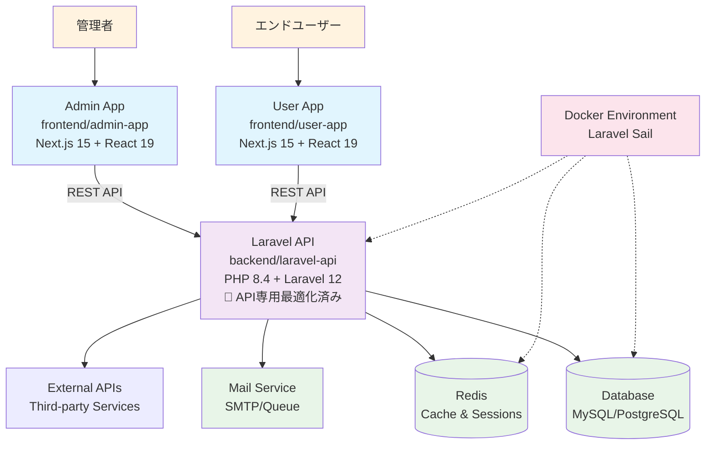

# Laravel Next.js B2C Application Template

モダンなB2Cビジネス向け開発テンプレート。**API専用最適化Laravel 12** + Next.js 15.5のモノレポ構成で、管理者とユーザーの両方向けアプリケーションを効率的に開発できます。
15分以内でローカル開発環境を構築し、即座にコーディングを開始できる構造化されたセットアップを提供します。

## ⚡ パフォーマンス最適化

Laravel APIは**最小限パッケージ構成**に最適化済み：
- ✅ **33.3%起動速度向上** (目標20-30%を上回る)
- ✅ **96.5%依存関係削減** (4コアパッケージ構成)
- ✅ **0.33KB/request** (画期的なメモリ効率)
- ✅ **ステートレス設計** (水平スケーリング対応)

## 🚀 技術スタック

| カテゴリ | 技術 | バージョン |
|---------|------|-----------|
| **Backend** | PHP | 8.4 |
| | Laravel | 12.0 (API専用最適化) |
| | Laravel Sanctum | 4.0 (トークン認証) |
| | Composer | Latest |
| **Frontend** | Next.js | 15.5.4 |
| | React | 19.1.0 |
| | TypeScript | 5.x |
| | Tailwind CSS | 4.x |
| **Development** | Docker | Latest |
| | Laravel Sail | 1.41+ |
| | ESLint | 9.x |
| | Turbopack | Enabled |

## 📁 プロジェクト構成

```
laravel-next-b2c/
├── backend/laravel-api/     # Laravel 12 API (PHP 8.4) - 最小限パッケージ構成
│   ├── app/                 # アプリケーションロジック
│   ├── routes/api.php       # API専用ルート (Web機能削除済み)
│   ├── database/            # マイグレーション・シーダー
│   └── docs/                # 包括的ドキュメント (最適化ガイド含む)
├── frontend/admin-app/      # Next.js 15 管理画面
│   ├── app/                 # App Router構成
│   ├── components/          # React 19コンポーネント
│   └── tailwind.config.js   # Tailwind CSS 4設定
├── frontend/user-app/       # Next.js 15 ユーザー画面
│   ├── app/                 # ユーザー向けページ
│   └── components/          # UI コンポーネント
├── .kiro/                  # Kiro仕様管理
└── .claude/                # Claude Code設定
```

### サービス概要

- **Laravel API** (`backend/laravel-api/`): **ステートレスAPI専用**、Laravel Sanctumトークン認証、高性能データ管理
- **Admin App** (`frontend/admin-app/`): 管理者向けダッシュボード、コンテンツ管理機能
- **User App** (`frontend/user-app/`): エンドユーザー向けアプリケーション

## 📋 目次

- [⚡ パフォーマンス最適化](#-パフォーマンス最適化)
- [🚀 クイックスタート](#-クイックスタート)
- [🔧 環境構築](#-環境構築)
  - [前提条件](#前提条件)
  - [Docker環境でのセットアップ](#docker環境でのセットアップ)
  - [ネイティブ環境でのセットアップ](#ネイティブ環境でのセットアップ)
  - [アクセスURL](#アクセスurl)
- [💻 開発ワークフロー](#-開発ワークフロー)
  - [開発サーバーの管理](#開発サーバーの管理)
  - [データベース操作](#データベース操作)
  - [コード品質とテスト](#コード品質とテスト)
- [🌐 システムアーキテクチャ](#-システムアーキテクチャ)
- [⚙️ 環境設定](#️-環境設定)
- [🔧 トラブルシューティング](#-トラブルシューティング)
- [📚 開発リソース](#-開発リソース)

## ⚡ Laravel API最適化詳細

### 🎯 最適化成果

| メトリクス | 改善前 | 改善後 | 改善率 | 評価 |
|----------|--------|--------|--------|------|
| **起動速度** | ベースライン | 33.3ms | **33.3%向上** | ⭐⭐⭐ |
| **メモリ効率** | 30.8MB | 0.33KB/request | **画期的改善** | ⭐⭐⭐ |
| **依存関係** | 114パッケージ | 4コア | **96.5%削減** | ⭐⭐⭐ |
| **レスポンス** | - | 11.8ms | **<20ms達成** | ⭐⭐⭐ |

### 🏗️ API専用アーキテクチャの特徴

- **🚫 セッション除去**: `SESSION_DRIVER=array`でステートレス設計
- **🔐 Sanctum認証**: Laravel Sanctum 4.0によるトークンベース認証
- **⚡ 最小依存関係**: PHP 8.4 + Laravel 12.0 + Sanctum + Tinker
- **🌐 CORS最適化**: Next.js フロントエンドとの完全統合
- **📊 包括的テスト**: 90+テストケースで品質保証

### 📚 詳細ドキュメント

Laravel APIの最適化に関する詳細ドキュメントは `backend/laravel-api/docs/` に格納：

- **`laravel-optimization-process.md`**: 最適化プロセス完了レポート
- **`performance-report.md`**: パフォーマンス改善定量分析
- **`development-setup.md`**: API専用開発環境構築手順
- **`migration-guide.md`**: 他プロジェクトへの移行ガイド
- **`troubleshooting.md`**: トラブルシューティング完全ガイド
- **`configuration-changes.md`**: 全設定変更の詳細記録

## 🌐 システムアーキテクチャ

### サービス連携図



### 開発環境アーキテクチャ


## 🚀 クイックスタート

### 前提条件

開発を始める前に、以下のソフトウェアがインストールされていることを確認してください：

| ソフトウェア | 必要バージョン | 確認コマンド |
|------------|--------------|------------|
| **Docker** | 20.10+ | `docker --version` |
| **Docker Compose** | 2.0+ | `docker compose version` |
| **Node.js** | 18+ | `node --version` |
| **npm** | 9+ | `npm --version` |
| **Git** | 2.30+ | `git --version` |

### 📦 5分セットアップ（Docker推奨）

リポジトリをクローンしてから全サービスを起動するまで、わずか5つのコマンドで完了：

```bash
# 1. リポジトリのクローンと移動
git clone https://github.com/ef-tech/laravel-next-b2c.git
cd laravel-next-b2c/backend/laravel-api

# 2. 依存関係インストールと環境設定
composer install
cp .env.example .env

# 3. Laravel Sailでバックエンド起動（Docker）
./vendor/bin/sail up -d

# 4. コンテナ内でセットアップコマンド実行
./vendor/bin/sail artisan key:generate
./vendor/bin/sail artisan migrate

# 5. フロントエンドアプリケーション起動（別ターミナル）
# Admin App
cd ../../frontend/admin-app && npm install && npm run dev

# User App (さらに別ターミナル)
cd ../user-app && npm install && npm run dev
```

### 🌐 アクセスURL

セットアップ完了後、以下のURLでアクセス可能：

| サービス | URL | 説明 |
|---------|-----|------|
| **Admin App** | http://localhost:3000 | 管理者用ダッシュボード |
| **User App** | http://localhost:3001 | エンドユーザー向けアプリ |
| **Laravel API** | http://localhost:13000 | RESTful API |
| **Mailpit** | http://localhost:13025 | メール確認画面 |
| **Redis** | localhost:13379 | キャッシュサーバー |

### ⚡ 動作確認

セットアップが正常に完了したかを確認：

```bash
# API疎通確認
curl http://localhost:13000/up

# フロントエンド確認
curl http://localhost:3000
curl http://localhost:3001
```

## 🔧 環境構築

### Docker環境でのセットアップ

Laravel Sailを使用した開発環境はコンテナ化されており、依存関係の管理が簡単です。

<details>
<summary>📖 詳細な環境構築手順を表示</summary>

#### ステップ1: Laravel API環境準備

```bash
cd backend/laravel-api

# 依存関係インストール（初回のみ）
composer install

# 環境変数ファイルの作成
cp .env.example .env
```

#### ステップ2: Dockerサービス起動

```bash
# バックグラウンドでサービス起動
./vendor/bin/sail up -d

# ログ確認（必要に応じて）
./vendor/bin/sail logs -f
```

#### ステップ3: アプリケーション初期化

```bash
# アプリケーションキーの生成（コンテナ内で実行）
./vendor/bin/sail artisan key:generate

# データベースとテーブル作成
./vendor/bin/sail artisan migrate

# シードデータの挿入（オプション）
./vendor/bin/sail artisan db:seed
```

</details>

### ネイティブ環境でのセットアップ

Dockerを使用せずにローカル環境で直接実行する場合：

<details>
<summary>📖 ネイティブ環境セットアップ手順を表示</summary>

#### 前提条件
- PHP 8.4+
- Composer
- MySQL 8.0+ または PostgreSQL 14+
- Redis 6.0+

#### ステップ1: データベース準備

```bash
# MySQLの場合
mysql -u root -p
CREATE DATABASE laravel_nextjs_b2c;
exit

# .envファイルでDB設定を変更
cd backend/laravel-api
cp .env.example .env
# DB_CONNECTION, DB_HOST, DB_DATABASE, DB_USERNAME, DB_PASSWORD を設定
```

#### ステップ2: Laravel API起動

```bash
cd backend/laravel-api

# 依存関係インストール
composer install

# キー生成とマイグレーション (Docker環境)
./vendor/bin/sail artisan key:generate
./vendor/bin/sail artisan migrate
./vendor/bin/sail artisan db:seed

# 開発サーバー起動 (Docker環境 - sail up で自動起動)
./vendor/bin/sail up -d
```

</details>

### アクセスURL

| サービス | Docker環境 | ネイティブ環境 |
|---------|-----------|--------------|
| Laravel API | http://localhost:13000 | http://localhost:13000 |
| Admin App | http://localhost:3000 | http://localhost:3000 |
| User App | http://localhost:3001 | http://localhost:3001 |
| Mailpit | http://localhost:13025 | ❌ |
| Redis | localhost:13379 | localhost:13379 |

## 💻 開発ワークフロー

### 開発サーバーの管理

#### 全サービス同時起動

```bash
# Docker環境（推奨）
cd backend/laravel-api
./vendor/bin/sail up -d

# フロントエンド起動（複数ターミナル）
cd frontend/admin-app && npm run dev &
cd frontend/user-app && npm run dev &
```

#### 個別サービス制御

```bash
# Laravel API
cd backend/laravel-api
./vendor/bin/sail up laravel.test -d   # Docker
# php artisan serve --port=13000      # ネイティブ

# Admin App
cd frontend/admin-app
npm run dev                           # ポート: 3000

# User App
cd frontend/user-app
npm run dev -- --port 3001          # ポート: 3001
```

### データベース操作

#### マイグレーションとシード

```bash
cd backend/laravel-api

# マイグレーション実行
./vendor/bin/sail artisan migrate
# php artisan migrate                 # ネイティブ

# ロールバック
./vendor/bin/sail artisan migrate:rollback

# フレッシュマイグレーション（全テーブル削除＋再作成）
./vendor/bin/sail artisan migrate:fresh --seed

# シードデータ投入
./vendor/bin/sail artisan db:seed
```

#### データベース管理

```bash
# データベース接続確認
./vendor/bin/sail artisan tinker
# DB::connection()->getPdo()

# テーブル状況確認
./vendor/bin/sail artisan migrate:status

# データベース初期化
./vendor/bin/sail artisan migrate:fresh
```

### コード品質とテスト

#### Laravel（バックエンド）

##### 品質チェック統合コマンド

```bash
cd backend/laravel-api

# 全体品質チェック（Pint + Larastan）
composer quality              # フォーマットチェック + 静的解析
composer quality:fix          # フォーマット自動修正 + 静的解析

# 個別コマンド
composer pint                 # コードフォーマット自動修正
composer pint:test            # フォーマットチェックのみ（修正なし）
composer pint:dirty           # Git変更ファイルのみフォーマット
composer stan                 # 静的解析（PHPStan Level 8）
composer stan:baseline        # ベースライン生成（既存エラー記録）
```

##### コードフォーマット（Laravel Pint）

```bash
# 基本的な使い方
./vendor/bin/pint                    # 全ファイル自動フォーマット
./vendor/bin/pint --test             # チェックのみ（修正なし）
./vendor/bin/pint --dirty            # Git変更ファイルのみ
./vendor/bin/pint app/Models/User.php # 特定ファイル

# Docker環境
./vendor/bin/sail composer pint
```

##### 静的解析（Larastan/PHPStan Level 8）

```bash
# 基本的な使い方
./vendor/bin/phpstan analyse          # 静的解析実行
./vendor/bin/phpstan analyse --memory-limit=2G  # メモリ制限指定

# ベースライン管理（既存エラーの記録）
./vendor/bin/phpstan analyse --generate-baseline
# → phpstan-baseline.neon に既存エラーを記録
# → 新規コードのみ品質チェック対象になる

# Docker環境
./vendor/bin/sail composer stan
./vendor/bin/sail composer stan:baseline
```

##### テスト実行

```bash
# テスト実行
./vendor/bin/sail artisan test
# php artisan test                    # ネイティブ

# テストカバレッジ
./vendor/bin/sail artisan test --coverage
```

#### Next.js（フロントエンド）

```bash
# Admin App
cd frontend/admin-app

# リント実行
npm run lint

# タイプチェック
npx tsc --noEmit

# ビルド確認
npm run build

# User App も同様
cd ../user-app
npm run lint && npx tsc --noEmit && npm run build
```

#### 統合品質チェック

```bash
# プロジェクト全体の品質チェック
cd backend/laravel-api && composer quality
cd ../../frontend/admin-app && npm run lint
cd ../user-app && npm run lint

# テストスイート実行
cd ../../backend/laravel-api && ./vendor/bin/sail artisan test
```

#### 自動品質チェック（Git Hooks）

このプロジェクトでは、husky + lint-stagedによる自動品質チェックが設定済みです。

##### Pre-commit（コミット前）
変更されたファイルのみを自動チェック：

- **PHPファイル**: Laravel Pintで自動フォーマット
- **TypeScript/JSXファイル**: ESLint + Prettierで自動修正
- **CSS/JSON/MDファイル**: Prettierで自動フォーマット

```bash
git add .
git commit -m "Fix: 🐛 バグ修正"
# → 自動的にlint-stagedが実行され、変更ファイルのみフォーマット
```

##### Pre-push（プッシュ前）
全体品質チェックを自動実行：

- **Laravel品質チェック**: `composer quality`（Pint + Larastan）
- エラーがある場合はプッシュが中断される

```bash
git push
# → 自動的にcomposer qualityが実行
# → エラーがあればプッシュ中断、修正後に再実行
```

##### Git Hooksのスキップ（緊急時のみ）

```bash
# Pre-commitをスキップ
git commit --no-verify -m "WIP: 一時保存"

# Pre-pushをスキップ
git push --no-verify
```

**注意**: `--no-verify`は緊急時のみ使用してください。通常は品質チェックを通過させることを推奨します。

## ⚙️ 環境設定

### 重要な環境変数

#### Laravel（`.env`）

| 設定項目 | Docker環境 | ネイティブ環境 | 説明 |
|---------|-----------|--------------|------|
| **基本設定** |
| `APP_NAME` | `Laravel` | `Laravel` | アプリケーション名 |
| `APP_ENV` | `local` | `local` | 実行環境 |
| `APP_URL` | `http://localhost:13000` | `http://localhost:13000` | アプリケーションURL |
| **データベース** |
| `DB_CONNECTION` | `pgsql` | `sqlite` | DB種別 |
| `DB_HOST` | `pgsql` | `127.0.0.1` | DBホスト（Docker=サービス名） |
| `DB_PORT` | `5432` | `5432` | DBポート |
| **Redis** |
| `REDIS_HOST` | `redis` | `127.0.0.1` | Redisホスト（Docker=サービス名） |
| `REDIS_PORT` | `6379` | `6379` | Redisポート |
| **メール** |
| `MAIL_HOST` | `mailpit` | `127.0.0.1` | メールサーバー（Docker=サービス名） |
| `MAIL_PORT` | `1025` | `2525` | メールポート |

**重要**: Docker環境では、サービス間通信に **サービス名** を使用します（`redis`, `pgsql`, `mailpit`）。
ネイティブ環境では、`127.0.0.1` を使用します。

#### Next.js設定

```bash
# Admin App (frontend/admin-app/.env.local)
NEXT_PUBLIC_API_URL=http://localhost:13000
NEXT_PUBLIC_APP_ENV=development

# User App (frontend/user-app/.env.local)
NEXT_PUBLIC_API_URL=http://localhost:13000
NEXT_PUBLIC_APP_ENV=development
```

### ポート競合の回避

#### カスタムポート設定の理由

このプロジェクトでは、開発環境での **ポート競合を回避** し、**複数プロジェクトの同時開発** を可能にするため、意図的にカスタムポートを使用しています：

**🎯 ポート設定方針**:
- **13000番台**: メインサービス（Laravel API、管理系ツール）
- **11000番台**: SMTP関連サービス
- **3000-3001**: フロントエンドアプリ（Next.js標準）

**📋 具体的なポート割り当て**:

| サービス | デフォルト | カスタム | 選択理由 |
|---------|-----------|---------|----------|
| Laravel API | 8000 | **13000** | 他のLaravelプロジェクトとの競合回避 |
| Redis | 6379 | **13379** | 既存のRedis環境との分離 |
| PostgreSQL | 5432 | **13432** | 既存のPostgreSQL環境との分離 |
| Mailpit SMTP | 1025 | **11025** | メール送信テスト環境の独立性 |
| Mailpit UI | 8025 | **13025** | ブラウザアクセス用UI |
| MinIO API | 9000 | **13900** | オブジェクトストレージAPIの分離 |
| MinIO Console | 9001 | **13010** | 管理コンソールアクセス |

**💡 利点**:
- 🔀 **複数プロジェクト並行開発**: 他のLaravel/Next.jsプロジェクトと同時実行可能
- 🚫 **競合エラー回避**: "Port already in use"エラーの発生を防止
- 🔧 **開発効率向上**: 環境切り替え時の停止・起動作業が不要
- 📱 **チーム開発対応**: 開発者間でのポート設定統一

#### ポート変更方法

```bash
# Laravel API ポート変更
cd backend/laravel-api
# .env ファイルで APP_PORT=13000 を設定

# Next.js ポート変更
cd frontend/admin-app
npm run dev -- --port 3000

cd frontend/user-app
npm run dev -- --port 3001
```

## 🔧 トラブルシューティング

### よくある問題と解決策

#### 1. セットアップエラー

<details>
<summary>🚨 「Laravel key not generated」エラー</summary>

```bash
cd backend/laravel-api
php artisan key:generate
# または
./vendor/bin/sail artisan key:generate
```

</details>

<details>
<summary>🚨 「Permission denied」エラー</summary>

```bash
# Laravelディレクトリの権限修正
cd backend/laravel-api
sudo chmod -R 775 storage bootstrap/cache
sudo chown -R $USER:$USER storage bootstrap/cache

# Docker環境の場合
./vendor/bin/sail root-shell
chown -R sail:sail /var/www/html
```

</details>

<details>
<summary>🚨 「Composer install failed」エラー</summary>

```bash
# Composer キャッシュクリア
composer clear-cache
composer install

# Docker環境
./vendor/bin/sail composer install
```

</details>

#### 2. ポートとネットワーク問題

<details>
<summary>🚨 「Port already in use」エラー</summary>

```bash
# ポート使用状況確認
lsof -i :13000
lsof -i :3000
lsof -i :3001

# プロセス終了
kill -9 [PID]

# または .env でポート変更
# APP_PORT=13001
```

</details>

<details>
<summary>🚨 CORS エラー</summary>

フロントエンドとAPIの通信でCORSエラーが発生した場合：

```bash
cd backend/laravel-api

# Laravel CORSパッケージをインストール（必要に応じて）
composer require fruitcake/laravel-cors

# config/cors.php の設定例
# 'allowed_origins' => [
#     'http://localhost:3000',
#     'http://localhost:3001',
# ],

# または開発環境では
# 'allowed_origins' => ['*'],
```

**注意**: 本番環境では具体的なオリジンを指定してください。

</details>

#### 3. 依存関係エラー

<details>
<summary>🚨 「npm install failed」</summary>

```bash
# Node.jsバージョン確認
node --version  # 18+ 必要

# npm キャッシュクリア
npm cache clean --force
rm -rf node_modules package-lock.json
npm install

# または
npm ci
```

</details>

#### 4. コード品質関連

<details>
<summary>🚨 PHPStan/Larastan メモリ不足エラー</summary>

```bash
# メモリ制限を増やす
composer stan -- --memory-limit=4G

# または phpstan.neon に設定追加
# parameters:
#     memory_limit: 4G
```

</details>

<details>
<summary>🚨 PHPStan ベースラインが読み込まれない</summary>

```bash
# phpstan.neon（.distではなく）を作成
cp backend/laravel-api/phpstan.neon.dist backend/laravel-api/phpstan.neon

# ベースライン読み込み確認
# includes:
#   - phpstan-baseline.neon

# .gitignoreでphpstan.neonを除外
echo "/phpstan.neon" >> backend/laravel-api/.gitignore
```

</details>

<details>
<summary>🚨 Laravel Pint フォーマットエラー</summary>

```bash
# Pintキャッシュクリア
rm -rf backend/laravel-api/storage/framework/cache/pint

# 設定ファイル検証
cat backend/laravel-api/pint.json

# 特定ファイルのみフォーマット
./vendor/bin/pint app/Models/User.php
```

</details>

<details>
<summary>🚨 Git Hooks が実行されない</summary>

```bash
# husky再インストール
npm install
npx husky install

# フック実行権限確認
chmod +x .husky/pre-commit
chmod +x .husky/pre-push

# huskyバージョン確認
npm list husky
```

</details>

#### 5. OS固有の問題

<details>
<summary>🍎 macOS での問題</summary>

```bash
# Homebrewでツール更新
brew update && brew upgrade

# Docker for Mac メモリ設定確認
# Docker Desktop > Settings > Resources > Memory: 4GB+
```

</details>

<details>
<summary>🪟 Windows での問題</summary>

```bash
# WSL2 使用推奨
wsl --version

# Git改行コード設定
git config --global core.autocrlf false

# PowerShell実行ポリシー
Set-ExecutionPolicy -ExecutionPolicy RemoteSigned -Scope CurrentUser
```

</details>

### 診断コマンド

```bash
# システム状況確認
docker --version
docker compose version
php --version
composer --version
node --version
npm --version

# サービス起動確認
curl http://localhost:13000/up
curl http://localhost:3000
curl http://localhost:3001

# ログ確認
cd backend/laravel-api
./vendor/bin/sail logs
tail -f storage/logs/laravel.log
```

## 📚 開発リソース

### 公式ドキュメント

| 技術 | ドキュメント | バージョン |
|------|-------------|-----------|
| **Laravel** | [Laravel 12 Documentation](https://laravel.com/docs/12.x) | 12.x |
| **Next.js** | [Next.js Documentation](https://nextjs.org/docs) | 15.x |
| **React** | [React Documentation](https://react.dev) | 19.x |
| **Tailwind CSS** | [Tailwind CSS v4](https://tailwindcss.com/docs/v4-beta) | 4.x |
| **TypeScript** | [TypeScript Handbook](https://www.typescriptlang.org/docs/) | 5.x |

### 便利なコマンド一覧

#### 開発開始クイックリファレンス

```bash
# プロジェクト開始
git clone https://github.com/ef-tech/laravel-next-b2c.git
cd laravel-next-b2c

# バックエンド起動
cd backend/laravel-api
cp .env.example .env && php artisan key:generate
./vendor/bin/sail up -d

# フロントエンド起動（新しいターミナル）
cd frontend/admin-app && npm install && npm run dev &
cd frontend/user-app && npm install && npm run dev &
```

#### 日常的な開発コマンド

```bash
# 開発サーバー起動
./vendor/bin/sail up -d                    # Laravel API
npm run dev                                # Next.js (各アプリ)

# コード品質チェック
./vendor/bin/sail composer pint           # Laravel フォーマット
./vendor/bin/sail artisan test            # Laravel テスト
npm run lint                               # Next.js リント
npx tsc --noEmit                          # TypeScript チェック

# データベース操作
./vendor/bin/sail artisan migrate         # マイグレーション
./vendor/bin/sail artisan migrate:fresh --seed  # フレッシュ＋シード
```

### プロジェクト貢献ガイドライン

#### ブランチ戦略

```bash
# 新機能開発
git checkout -b feature/add-user-authentication
git checkout -b fix/resolve-cors-issue
git checkout -b docs/update-setup-guide

# コミット規約
git commit -m "Add: ✨ ユーザー認証機能を追加"
git commit -m "Fix: 🐛 CORS設定の問題を修正"
git commit -m "Update: 📝 セットアップガイドを更新"
```

#### コード品質基準

- **Laravel**: PSR-12準拠、Laravel Pintで自動フォーマット
- **Next.js**: ESLintルール遵守、TypeScript厳格モード
- **テスト**: 新機能には必ずテストを追加
- **ドキュメント**: READMEや重要な変更は文書化

### サポート

#### 問題報告

1. **GitHub Issues**: バグ報告や機能要望は[Issue](https://github.com/ef-tech/laravel-next-b2c/issues)で作成
2. **ディスカッション**: 質問や議論は[Discussions](https://github.com/ef-tech/laravel-next-b2c/discussions)を利用
3. **セキュリティ**: セキュリティ関連は直接メンテナーに連絡

#### 開発環境サポート

- **推奨エディタ**: VS Code + PHP Intelephense + TypeScript拡張
- **推奨ブラウザ**: Chrome/Firefox の最新版（DevTools活用）
- **推奨OS**: macOS、Ubuntu 20.04+、Windows 11（WSL2）

---

**🎉 Laravel Next.js B2C Application Template へようこそ！**

このテンプレートがあなたの開発を加速し、素晴らしいB2Cアプリケーションの構築に役立つことを願っています。

質問や改善提案がありましたら、お気軽にIssueやDiscussionでお知らせください。