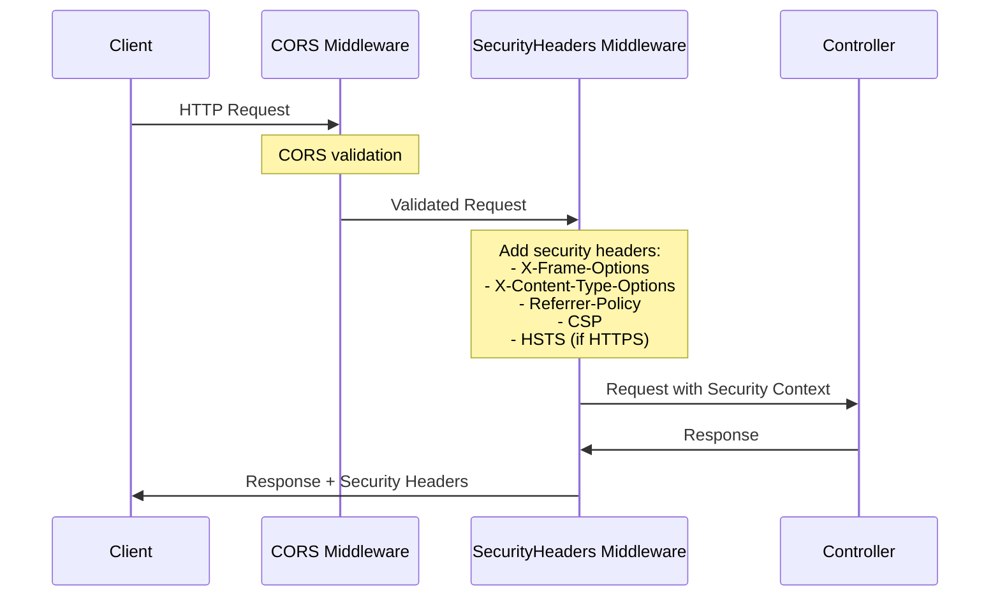
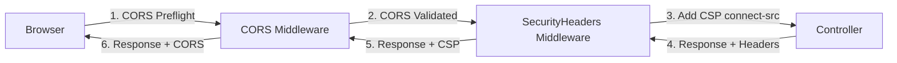

# セキュリティヘッダー実装ガイド

## 目次
- [概要](#概要)
- [アーキテクチャ](#アーキテクチャ)
- [実装手順](#実装手順)
  - [Laravel API 実装](#laravel-api-実装)
  - [Next.js フロントエンド実装](#nextjs-フロントエンド実装)
- [環境変数設定ガイド](#環境変数設定ガイド)
- [CSP ポリシーカスタマイズ方法](#csp-ポリシーカスタマイズ方法)
- [CORS 設定との統合](#cors-設定との統合)
- [テスト戦略](#テスト戦略)
- [関連ドキュメント](#関連ドキュメント)

---

## 概要

このガイドは、Laravel 12 + Next.js 15 モノレポアプリケーションにおける OWASP セキュリティベストプラクティスに準拠したセキュリティヘッダー実装の完全な手順を提供します。

### 実装機能
- ✅ **基本セキュリティヘッダー**: X-Frame-Options, X-Content-Type-Options, Referrer-Policy
- ✅ **Content Security Policy (CSP)**: XSS 攻撃防御、段階的導入サポート (Report-Only → Enforce)
- ✅ **HSTS (HTTP Strict Transport Security)**: HTTPS 強制、ダウングレード攻撃防止
- ✅ **Permissions-Policy**: ブラウザ API アクセス制御
- ✅ **CSP 違反レポート収集**: Laravel/Next.js 両対応、段階的導入分析用
- ✅ **CORS 統合**: fruitcake/laravel-cors パッケージとの共存

### セキュリティヘッダー適用範囲
- **Laravel API** (ポート 13000): すべての API レスポンス
- **User App** (ポート 13001): すべてのページレスポンス (SAMEORIGIN 設定)
- **Admin App** (ポート 13002): すべてのページレスポンス (厳格な DENY 設定)

### テストカバレッジ
- Laravel Pest テスト: 96.1% カバレッジ
- Next.js Jest テスト: 94.73% カバレッジ
- E2E Playwright テスト: 全 17 テスト通過

---

## アーキテクチャ

### 全体構成図
```
┌─────────────────────────────────────────────────────────────┐
│                    Browser (Client)                         │
│  - CSP Violation Detection                                  │
│  - Permissions-Policy Enforcement                           │
│  - HSTS Storage                                             │
└───────────────┬─────────────────────────────────────────────┘
                │
                │ HTTPS (HSTS enforced)
                │
    ┌───────────┴───────────┬─────────────────────────────────┐
    │                       │                                 │
┌───▼──────────┐  ┌────────▼─────────┐  ┌──────────▼────────┐
│ User App     │  │ Admin App        │  │ Laravel API       │
│ (Port 13001) │  │ (Port 13002)     │  │ (Port 13000)      │
├──────────────┤  ├──────────────────┤  ├───────────────────┤
│ next.config  │  │ next.config      │  │ SecurityHeaders   │
│  - Headers   │  │  - Strict Headers│  │ Middleware        │
│  - CSP       │  │  - CSP (strict)  │  │  - Basic Headers  │
│  - SAMEORIGIN│  │  - DENY          │  │  - CSP (dynamic)  │
│              │  │  - No Referrer   │  │  - HSTS           │
│              │  │  - COEP/COOP     │  │                   │
└──────┬───────┘  └────────┬─────────┘  └─────────┬─────────┘
       │                   │                      │
       └───────────────────┴──────────────────────┘
                           │
                           │ CSP Violation Reports
                           │
               ┌───────────▼───────────┐
               │  CSP Report APIs      │
               │  - Laravel: /api/csp/report         │
               │  - Next.js: /api/csp-report        │
               │  - Logging: storage/logs/security.log │
               └─────────────────────────────────────┘
```

### セキュリティヘッダーフロー


---

## 実装手順

### Laravel API 実装

#### 1. SecurityHeaders ミドルウェア作成

**ファイル**: `backend/laravel-api/app/Http/Middleware/SecurityHeaders.php`

```php
<?php

namespace App\Http\Middleware;

use Closure;
use Illuminate\Http\Request;
use Symfony\Component\HttpFoundation\Response;

class SecurityHeaders
{
    public function handle(Request $request, Closure $next): Response
    {
        $response = $next($request);

        // 基本セキュリティヘッダー
        $response->headers->set('X-Frame-Options', config('security.x_frame_options'));
        $response->headers->set('X-Content-Type-Options', 'nosniff');
        $response->headers->set('Referrer-Policy', config('security.referrer_policy'));

        // CSP ヘッダー (有効な場合のみ)
        if (config('security.enable_csp')) {
            $cspPolicy = $this->buildCspPolicy();
            $cspHeader = config('security.csp_mode') === 'enforce'
                ? 'Content-Security-Policy'
                : 'Content-Security-Policy-Report-Only';

            $response->headers->set($cspHeader, $cspPolicy);
        }

        // HSTS ヘッダー (HTTPS環境 && 有効な場合のみ)
        if ($request->secure() && config('security.force_hsts')) {
            $hstsValue = sprintf(
                'max-age=%d; includeSubDomains%s',
                config('security.hsts_max_age'),
                config('security.hsts_preload') ? '; preload' : ''
            );
            $response->headers->set('Strict-Transport-Security', $hstsValue);
        }

        return $response;
    }

    private function buildCspPolicy(): string
    {
        // CSP ディレクティブを動的に構築
        $directives = [
            "default-src 'self'",
            "object-src 'none'",
            "frame-ancestors 'none'",
        ];

        // script-src
        $scriptSrc = config('security.csp_script_src', "'self'");
        $directives[] = "script-src {$scriptSrc}";

        // style-src
        $styleSrc = config('security.csp_style_src', "'self' 'unsafe-inline'");
        $directives[] = "style-src {$styleSrc}";

        // img-src
        $imgSrc = config('security.csp_img_src', "'self' data: https:");
        $directives[] = "img-src {$imgSrc}";

        // connect-src
        $connectSrc = config('security.csp_connect_src', "'self'");
        $directives[] = "connect-src {$connectSrc}";

        // font-src
        $fontSrc = config('security.csp_font_src', "'self' data:");
        $directives[] = "font-src {$fontSrc}";

        // HTTPS 環境のみ upgrade-insecure-requests
        if (request()->secure()) {
            $directives[] = 'upgrade-insecure-requests';
        }

        // report-uri
        if ($reportUri = config('security.csp_report_uri')) {
            $directives[] = "report-uri {$reportUri}";
        }

        return implode('; ', $directives);
    }
}
```

#### 2. セキュリティ設定ファイル作成

**ファイル**: `backend/laravel-api/config/security.php`

```php
<?php

return [
    /*
    |--------------------------------------------------------------------------
    | X-Frame-Options
    |--------------------------------------------------------------------------
    | クリックジャッキング攻撃防止
    | 値: DENY (すべて拒否) | SAMEORIGIN (同一オリジンのみ許可)
    */
    'x_frame_options' => env('SECURITY_X_FRAME_OPTIONS', 'SAMEORIGIN'),

    /*
    |--------------------------------------------------------------------------
    | Referrer-Policy
    |--------------------------------------------------------------------------
    | リファラー情報漏洩防止
    | 値: strict-origin-when-cross-origin | no-referrer | strict-origin
    */
    'referrer_policy' => env('SECURITY_REFERRER_POLICY', 'strict-origin-when-cross-origin'),

    /*
    |--------------------------------------------------------------------------
    | Content Security Policy (CSP)
    |--------------------------------------------------------------------------
    */
    'enable_csp' => env('SECURITY_ENABLE_CSP', true),
    'csp_mode' => env('SECURITY_CSP_MODE', 'report-only'), // enforce | report-only

    // CSP ディレクティブ (環境変数で上書き可能)
    'csp_script_src' => env('SECURITY_CSP_SCRIPT_SRC', "'self'"),
    'csp_style_src' => env('SECURITY_CSP_STYLE_SRC', "'self' 'unsafe-inline'"),
    'csp_img_src' => env('SECURITY_CSP_IMG_SRC', "'self' data: https:"),
    'csp_connect_src' => env('SECURITY_CSP_CONNECT_SRC', "'self'"),
    'csp_font_src' => env('SECURITY_CSP_FONT_SRC', "'self' data:"),
    'csp_report_uri' => env('SECURITY_CSP_REPORT_URI', '/api/csp/report'),

    /*
    |--------------------------------------------------------------------------
    | HTTP Strict Transport Security (HSTS)
    |--------------------------------------------------------------------------
    */
    'force_hsts' => env('SECURITY_FORCE_HSTS', false), // 本番環境のみ true 推奨
    'hsts_max_age' => env('SECURITY_HSTS_MAX_AGE', 31536000), // 1 year
    'hsts_preload' => env('SECURITY_HSTS_PRELOAD', false),
];
```

#### 3. ミドルウェア登録

**ファイル**: `backend/laravel-api/bootstrap/app.php`

```php
use App\Http\Middleware\SecurityHeaders;

return Application::configure(basePath: dirname(__DIR__))
    ->withRouting(/* ... */)
    ->withMiddleware(function (Middleware $middleware) {
        // SecurityHeaders を CORS の後に配置 (重要!)
        $middleware->api(append: [
            SecurityHeaders::class,
        ]);
    })
    ->create();
```

#### 4. CSP レポート収集実装

**ファイル**: `backend/laravel-api/app/Http/Controllers/CspReportController.php`

```php
<?php

namespace App\Http\Controllers;

use Illuminate\Http\Request;
use Illuminate\Support\Facades\Log;

class CspReportController extends Controller
{
    public function store(Request $request)
    {
        $report = $request->input('csp-report', $request->all());

        // CSP 違反をセキュリティログに記録
        Log::channel('security')->warning('CSP Violation Detected', [
            'blocked_uri' => $report['blocked-uri'] ?? null,
            'violated_directive' => $report['violated-directive'] ?? null,
            'document_uri' => $report['document-uri'] ?? null,
            'source_file' => $report['source-file'] ?? null,
            'line_number' => $report['line-number'] ?? null,
            'timestamp' => now()->toIso8601String(),
        ]);

        return response()->noContent();
    }
}
```

**ルート登録**: `backend/laravel-api/routes/api.php`

```php
use App\Http\Controllers\CspReportController;

Route::post('/csp/report', [CspReportController::class, 'store'])
    ->withoutMiddleware(['throttle']); // レート制限除外
```

**ログチャンネル追加**: `backend/laravel-api/config/logging.php`

```php
'channels' => [
    // 既存チャンネル...

    'security' => [
        'driver' => 'single',
        'path' => storage_path('logs/security.log'),
        'level' => env('LOG_LEVEL', 'warning'),
    ],
],
```

---

### Next.js フロントエンド実装

#### 1. 共通セキュリティ設定モジュール作成

**ファイル**: `frontend/security-config.ts`

```typescript
/**
 * セキュリティヘッダー設定モジュール
 * User App と Admin App で共通使用
 */

export interface CSPConfig {
  defaultSrc: string[];
  scriptSrc: string[];
  styleSrc: string[];
  imgSrc: string[];
  connectSrc: string[];
  fontSrc: string[];
  objectSrc: string[];
  frameAncestors: string[];
  reportUri?: string;
}

export interface PermissionsPolicyConfig {
  geolocation?: string;
  camera?: string;
  microphone?: string;
  payment?: string;
  usb?: string;
  bluetooth?: string;
}

export interface SecurityConfig {
  csp: CSPConfig;
  permissionsPolicy: PermissionsPolicyConfig;
}

/**
 * 環境に応じたセキュリティ設定を取得
 */
export function getSecurityConfig(isDev: boolean): SecurityConfig {
  const apiUrl = isDev ? 'http://localhost:13000' : 'https://api.example.com';

  return {
    csp: {
      defaultSrc: ["'self'"],
      scriptSrc: isDev
        ? ["'self'", "'unsafe-eval'", "'unsafe-inline'"] // Next.js dev mode 対応
        : ["'self'"],
      styleSrc: ["'self'", "'unsafe-inline'"], // Tailwind CSS 対応
      imgSrc: ["'self'", 'data:', 'https:'],
      connectSrc: isDev
        ? ["'self'", 'ws:', 'wss:', apiUrl]
        : ["'self'", apiUrl],
      fontSrc: ["'self'", 'data:'],
      objectSrc: ["'none'"],
      frameAncestors: ["'none'"],
      reportUri: '/api/csp-report',
    },
    permissionsPolicy: {
      geolocation: '(self)',
      camera: '()',
      microphone: '()',
      payment: '(self)',
    },
  };
}

/**
 * CSP ポリシー文字列を構築
 */
export function buildCSPString(config: CSPConfig): string {
  const directives: string[] = [];

  if (config.defaultSrc) directives.push(`default-src ${config.defaultSrc.join(' ')}`);
  if (config.scriptSrc) directives.push(`script-src ${config.scriptSrc.join(' ')}`);
  if (config.styleSrc) directives.push(`style-src ${config.styleSrc.join(' ')}`);
  if (config.imgSrc) directives.push(`img-src ${config.imgSrc.join(' ')}`);
  if (config.connectSrc) directives.push(`connect-src ${config.connectSrc.join(' ')}`);
  if (config.fontSrc) directives.push(`font-src ${config.fontSrc.join(' ')}`);
  if (config.objectSrc) directives.push(`object-src ${config.objectSrc.join(' ')}`);
  if (config.frameAncestors) directives.push(`frame-ancestors ${config.frameAncestors.join(' ')}`);
  if (config.reportUri) directives.push(`report-uri ${config.reportUri}`);

  return directives.join('; ');
}

/**
 * Permissions-Policy 文字列を構築
 */
export function buildPermissionsPolicyString(config: PermissionsPolicyConfig): string {
  const policies: string[] = [];

  Object.entries(config).forEach(([key, value]) => {
    if (value !== undefined) {
      policies.push(`${key}=${value}`);
    }
  });

  return policies.join(', ');
}

/**
 * Nonce 生成 (CSP nonce-based 認証用)
 */
export function generateNonce(): string {
  const bytes = new Uint8Array(16);
  crypto.getRandomValues(bytes);
  return btoa(String.fromCharCode(...bytes));
}
```

#### 2. User App ヘッダー設定

**ファイル**: `frontend/user-app/next.config.ts`

```typescript
import type { NextConfig } from 'next';
import {
  getSecurityConfig,
  buildCSPString,
  buildPermissionsPolicyString,
} from '../security-config';

const isDev = process.env.NODE_ENV === 'development';
const securityConfig = getSecurityConfig(isDev);

const nextConfig: NextConfig = {
  async headers() {
    return [
      {
        source: '/(.*)',
        headers: [
          // 基本セキュリティヘッダー
          {
            key: 'X-Frame-Options',
            value: 'SAMEORIGIN', // User App: iframe 埋め込み許可 (同一オリジン)
          },
          {
            key: 'X-Content-Type-Options',
            value: 'nosniff',
          },
          {
            key: 'Referrer-Policy',
            value: 'strict-origin-when-cross-origin',
          },
          // CSP
          {
            key: 'Content-Security-Policy',
            value: buildCSPString(securityConfig.csp),
          },
          // Permissions-Policy
          {
            key: 'Permissions-Policy',
            value: buildPermissionsPolicyString(securityConfig.permissionsPolicy),
          },
          // HSTS (本番環境のみ)
          ...(process.env.NODE_ENV === 'production'
            ? [
                {
                  key: 'Strict-Transport-Security',
                  value: 'max-age=31536000; includeSubDomains',
                },
              ]
            : []),
        ],
      },
    ];
  },
};

export default nextConfig;
```

#### 3. Admin App 厳格ヘッダー設定

**ファイル**: `frontend/admin-app/next.config.ts`

```typescript
import type { NextConfig } from 'next';
import {
  getSecurityConfig,
  buildCSPString,
  buildPermissionsPolicyString,
} from '../security-config';

const isDev = process.env.NODE_ENV === 'development';
const securityConfig = getSecurityConfig(isDev);

// Admin App 専用: 厳格な CSP 設定
const adminCsp = {
  ...securityConfig.csp,
  scriptSrc: isDev ? ["'self'", "'unsafe-inline'"] : ["'self'"], // unsafe-eval 禁止
};

// Admin App 専用: すべてのブラウザ API を禁止
const adminPermissionsPolicy = {
  geolocation: '()',
  camera: '()',
  microphone: '()',
  payment: '()',
  usb: '()',
  bluetooth: '()',
};

const nextConfig: NextConfig = {
  async headers() {
    return [
      {
        source: '/(.*)',
        headers: [
          // 厳格な基本セキュリティヘッダー
          {
            key: 'X-Frame-Options',
            value: 'DENY', // Admin App: iframe 埋め込み完全拒否
          },
          {
            key: 'X-Content-Type-Options',
            value: 'nosniff',
          },
          {
            key: 'Referrer-Policy',
            value: 'no-referrer', // Admin App: リファラー完全非公開
          },
          // 厳格な CSP
          {
            key: 'Content-Security-Policy',
            value: buildCSPString(adminCsp),
          },
          // 厳格な Permissions-Policy
          {
            key: 'Permissions-Policy',
            value: buildPermissionsPolicyString(adminPermissionsPolicy),
          },
          // 追加セキュリティヘッダー (Admin App のみ)
          {
            key: 'X-Permitted-Cross-Domain-Policies',
            value: 'none',
          },
          {
            key: 'Cross-Origin-Embedder-Policy',
            value: 'require-corp',
          },
          {
            key: 'Cross-Origin-Opener-Policy',
            value: 'same-origin',
          },
          // HSTS (本番環境のみ)
          ...(process.env.NODE_ENV === 'production'
            ? [
                {
                  key: 'Strict-Transport-Security',
                  value: 'max-age=31536000; includeSubDomains; preload',
                },
              ]
            : []),
        ],
      },
    ];
  },
};

export default nextConfig;
```

#### 4. CSP レポート API 実装

**ファイル**: `frontend/user-app/src/app/api/csp-report/route.ts`
**ファイル**: `frontend/admin-app/src/app/api/csp-report/route.ts`

```typescript
import { NextRequest, NextResponse } from 'next/server';

export async function POST(request: NextRequest) {
  try {
    const report = await request.json();

    // 開発環境: コンソール警告
    if (process.env.NODE_ENV === 'development') {
      console.warn('[CSP Violation]', JSON.stringify(report, null, 2));
    }

    // 本番環境: 外部監視サービスに転送
    if (process.env.NODE_ENV === 'production' && process.env.SENTRY_DSN) {
      // TODO: Sentry/LogRocket 等への転送実装
      // await fetch(process.env.CSP_REPORT_URL, { ... });
    }

    return new NextResponse(null, { status: 204 });
  } catch (error) {
    console.error('[CSP Report Error]', error);
    return new NextResponse(null, { status: 500 });
  }
}
```

---

## 環境変数設定ガイド

### Laravel API 環境変数 (`.env`)

```bash
# ==========================================
# セキュリティヘッダー設定
# ==========================================

# X-Frame-Options
# - 説明: iframe 埋め込み制御
# - 必須: いいえ
# - 値: DENY (すべて拒否) | SAMEORIGIN (同一オリジンのみ許可)
# - 環境: 開発環境=SAMEORIGIN, 本番環境=DENY推奨
# - セキュリティ: 公開可
# - デフォルト: SAMEORIGIN
SECURITY_X_FRAME_OPTIONS=SAMEORIGIN

# Referrer-Policy
# - 説明: リファラー情報送信制御
# - 必須: いいえ
# - 値: strict-origin-when-cross-origin | no-referrer | strict-origin
# - 環境: 開発環境=strict-origin-when-cross-origin, 本番環境=strict-origin
# - セキュリティ: 公開可
# - デフォルト: strict-origin-when-cross-origin
SECURITY_REFERRER_POLICY=strict-origin-when-cross-origin

# CSP 有効化フラグ
# - 説明: Content Security Policy 機能の ON/OFF
# - 必須: いいえ
# - 値: true | false
# - 環境: すべて=true (緊急時のみ false)
# - セキュリティ: 公開可
# - デフォルト: true
SECURITY_ENABLE_CSP=true

# CSP モード
# - 説明: CSP の動作モード
# - 必須: はい (CSP有効時)
# - 値: report-only (監視のみ) | enforce (強制適用)
# - 環境: 開発環境=report-only, 本番環境=enforce (段階的移行)
# - セキュリティ: 公開可
# - デフォルト: report-only
# - 注意事項: report-only で 1 週間運用後、enforce に切り替え推奨
SECURITY_CSP_MODE=report-only

# CSP script-src ディレクティブ
# - 説明: JavaScript 読み込み元制御
# - 必須: いいえ
# - 値: 'self' | 'unsafe-eval' | 'unsafe-inline' | ドメイン名 (スペース区切り)
# - 環境: 開発環境='self' 'unsafe-eval', 本番環境='self'
# - セキュリティ: 公開可
# - デフォルト: 'self'
# - 注意事項: 開発環境のみ 'unsafe-eval' 許可 (Next.js HMR 対応)
SECURITY_CSP_SCRIPT_SRC='self' 'unsafe-eval'

# CSP connect-src ディレクティブ
# - 説明: API/WebSocket 接続先制御
# - 必須: いいえ
# - 値: 'self' | ws: | wss: | URL (スペース区切り)
# - 環境: 開発環境='self' ws: wss: http://localhost:13001 http://localhost:13002
#         本番環境='self' https://app.example.com https://admin.example.com
# - セキュリティ: 公開可
# - デフォルト: 'self'
# - 注意事項: CORS_ALLOWED_ORIGINS と整合性を保つこと
SECURITY_CSP_CONNECT_SRC='self' ws: wss: http://localhost:13001 http://localhost:13002

# CSP レポート送信先 URI
# - 説明: CSP 違反レポートの送信先エンドポイント
# - 必須: はい (CSP有効時)
# - 値: /api/csp/report (相対パス) | https://example.com/csp-report (絶対パス)
# - 環境: すべて=/api/csp/report
# - セキュリティ: 公開可
# - デフォルト: /api/csp/report
SECURITY_CSP_REPORT_URI=/api/csp/report

# HSTS 強制適用フラグ
# - 説明: Strict-Transport-Security ヘッダー有効化
# - 必須: いいえ
# - 値: true | false
# - 環境: 開発環境=false, 本番環境=true
# - セキュリティ: 公開可
# - デフォルト: false
# - 注意事項: 本番環境のみ有効化、HTTPS 環境必須
SECURITY_FORCE_HSTS=false

# HSTS max-age (秒)
# - 説明: HSTS の有効期限
# - 必須: いいえ
# - 値: 秒数 (推奨: 31536000 = 1年)
# - 環境: すべて=31536000
# - セキュリティ: 公開可
# - デフォルト: 31536000
SECURITY_HSTS_MAX_AGE=31536000
```

### 環境別設定例

#### 開発環境 (`.env`)
```bash
SECURITY_X_FRAME_OPTIONS=SAMEORIGIN
SECURITY_ENABLE_CSP=true
SECURITY_CSP_MODE=report-only
SECURITY_CSP_SCRIPT_SRC='self' 'unsafe-eval'
SECURITY_CSP_CONNECT_SRC='self' ws: wss: http://localhost:13001 http://localhost:13002
SECURITY_FORCE_HSTS=false
```

#### 本番環境 (`.env.production`)
```bash
SECURITY_X_FRAME_OPTIONS=DENY
SECURITY_ENABLE_CSP=true
SECURITY_CSP_MODE=enforce
SECURITY_CSP_SCRIPT_SRC='self'
SECURITY_CSP_CONNECT_SRC='self' https://app.example.com https://admin.example.com
SECURITY_FORCE_HSTS=true
SECURITY_HSTS_MAX_AGE=31536000
```

---

## CSP ポリシーカスタマイズ方法

### シナリオ別 CSP 設定

#### 1. 外部 CDN スクリプト許可

**要件**: Google Analytics, Stripe.js などの外部スクリプトを許可したい

```bash
# Laravel .env
SECURITY_CSP_SCRIPT_SRC='self' https://www.google-analytics.com https://js.stripe.com

# または、nonce ベース認証を使用 (推奨)
SECURITY_CSP_SCRIPT_SRC='self' 'nonce-{動的nonce値}'
```

**Next.js 実装例**:
```typescript
// frontend/security-config.ts
export function getSecurityConfig(isDev: boolean): SecurityConfig {
  return {
    csp: {
      scriptSrc: [
        "'self'",
        'https://www.google-analytics.com',
        'https://js.stripe.com',
      ],
      // ...
    },
  };
}
```

#### 2. インライン JavaScript 許可 (非推奨)

**注意**: セキュリティリスクが高いため、nonce または hash ベース認証を使用すること

```bash
# 緊急時のみ使用
SECURITY_CSP_SCRIPT_SRC='self' 'unsafe-inline'
```

**推奨代替案 (nonce ベース)**:
```typescript
// Next.js Layout でnonce生成
import { headers } from 'next/headers';
import { generateNonce } from '@/security-config';

export default function RootLayout({ children }) {
  const nonce = generateNonce();
  const headersList = headers();
  headersList.set('X-CSP-Nonce', nonce);

  return (
    <html>
      <head>
        <script nonce={nonce} dangerouslySetInnerHTML={{ __html: `/* inline script */` }} />
      </head>
      <body>{children}</body>
    </html>
  );
}
```

#### 3. 画像ホスティングサービス許可

**要件**: Cloudinary, imgix などの画像 CDN を許可したい

```bash
SECURITY_CSP_IMG_SRC='self' data: https: https://res.cloudinary.com https://example.imgix.net
```

#### 4. WebSocket 接続許可

**要件**: Socket.io, Pusher などのリアルタイム通信を許可したい

```bash
SECURITY_CSP_CONNECT_SRC='self' wss://socket.example.com https://pusher.com
```

### CSP Directive リファレンス

| ディレクティブ | 用途 | デフォルト値 | 推奨設定 |
|----------------|------|--------------|----------|
| `default-src` | すべてのリソースタイプのデフォルト | `'self'` | `'self'` |
| `script-src` | JavaScript の読み込み元 | `'self'` | `'self'` (nonce/hash 使用推奨) |
| `style-src` | CSS の読み込み元 | `'self' 'unsafe-inline'` | `'self'` (Tailwind CSS は 'unsafe-inline' 必要) |
| `img-src` | 画像の読み込み元 | `'self' data: https:` | `'self' data: https:` |
| `connect-src` | XHR/Fetch/WebSocket の接続先 | `'self'` | `'self' + API ドメイン` |
| `font-src` | フォントの読み込み元 | `'self' data:` | `'self' data:` |
| `object-src` | `<object>` `<embed>` の読み込み元 | `'none'` | `'none'` (Flash 禁止) |
| `frame-ancestors` | iframe 埋め込み許可元 | `'none'` | `'none'` (Admin App) / `'self'` (User App) |
| `upgrade-insecure-requests` | HTTP → HTTPS 自動アップグレード | (HTTPS 環境のみ) | 有効化推奨 |

### CSP キーワード説明

- `'self'`: 同一オリジンからの読み込みのみ許可
- `'unsafe-inline'`: インラインスクリプト/スタイル許可 (セキュリティリスク高)
- `'unsafe-eval'`: `eval()` 関数許可 (セキュリティリスク高)
- `'none'`: すべて拒否
- `data:`: data: スキーム URI 許可
- `https:`: すべての HTTPS URL 許可
- `'nonce-<base64-value>'`: nonce 値一致時のみ許可 (推奨)
- `'sha256-<base64-value>'`: ハッシュ値一致時のみ許可 (推奨)

---

## CORS 設定との統合

### CORS と CSP の関係



### 設定整合性チェックポイント

#### 1. CORS 許可オリジンと CSP connect-src の一致

**Laravel `.env`**:
```bash
# CORS 設定 (fruitcake/laravel-cors)
CORS_ALLOWED_ORIGINS=http://localhost:13001,http://localhost:13002

# CSP 設定 (SecurityHeaders ミドルウェア)
SECURITY_CSP_CONNECT_SRC='self' ws: wss: http://localhost:13001 http://localhost:13002
```

**重要**: `CORS_ALLOWED_ORIGINS` に含まれるドメインは、必ず `SECURITY_CSP_CONNECT_SRC` にも含めること

#### 2. CORS credentials と CSP の関係

```bash
# CORS credentials 有効化
CORS_SUPPORTS_CREDENTIALS=true

# CSP には影響なし (CORS は HTTP レベル、CSP はブラウザレベルで動作)
```

#### 3. 検証スクリプト実行

```bash
# CORS 設定整合性確認
bash scripts/validate-cors-config.sh

# セキュリティヘッダー検証 (Laravel API 起動後)
bash scripts/validate-security-headers.sh http://localhost:13000/api/health laravel
```

### トラブルシューティング: CORS + CSP エラー

#### エラーケース 1: CORS は成功するが CSP で接続がブロックされる

**症状**:
```
Refused to connect to 'http://localhost:13000' because it violates the following
Content Security Policy directive: "connect-src 'self'".
```

**原因**: CSP `connect-src` に API ドメインが含まれていない

**解決策**:
```bash
# Laravel .env
SECURITY_CSP_CONNECT_SRC='self' http://localhost:13000

# または Next.js security-config.ts で設定
connectSrc: ["'self'", 'http://localhost:13000']
```

#### エラーケース 2: WebSocket 接続が CSP でブロックされる

**症状**:
```
Refused to connect to 'ws://localhost:13000' because it violates the following
Content Security Policy directive: "connect-src 'self'".
```

**原因**: CSP `connect-src` に `ws:` `wss:` スキームが含まれていない

**解決策**:
```bash
# 開発環境
SECURITY_CSP_CONNECT_SRC='self' ws: wss: http://localhost:13000

# 本番環境
SECURITY_CSP_CONNECT_SRC='self' wss://api.example.com
```

---

## テスト戦略

### 1. Laravel Pest テスト

**実行コマンド**:
```bash
cd backend/laravel-api
./vendor/bin/pest tests/Feature/SecurityHeadersTest.php
```

**カバレッジ測定**:
```bash
./vendor/bin/pest --coverage --min=90
```

**テスト内容**:
- ✅ 基本セキュリティヘッダー検証 (X-Frame-Options, X-Content-Type-Options, Referrer-Policy)
- ✅ CSP ヘッダー存在確認 (Report-Only / Enforce モード切り替え)
- ✅ HSTS ヘッダー検証 (HTTPS 環境のみ)
- ✅ CORS 統合テスト (許可/拒否オリジン)

### 2. Next.js Jest テスト

**実行コマンド**:
```bash
cd frontend/user-app
npm test
```

**テスト内容**:
- ✅ `getSecurityConfig()` 関数: 開発/本番環境判定
- ✅ `buildCSPString()` 関数: CSP ポリシー文字列生成
- ✅ `buildPermissionsPolicyString()` 関数: Permissions-Policy 文字列生成
- ✅ `generateNonce()` 関数: Nonce 生成

### 3. E2E Playwright テスト

**実行コマンド**:
```bash
cd e2e
npx playwright test security-headers.spec.ts
```

**テスト内容**:
- ✅ Laravel API セキュリティヘッダー検証 (6 テスト)
- ✅ User App セキュリティヘッダー検証 (3 テスト)
- ✅ Admin App セキュリティヘッダー検証 (4 テスト)
- ✅ CSP 違反検出テスト (2 テスト)
- ✅ CORS 統合テスト (2 テスト)

**合計**: 17 E2E テスト全通過

### 4. CI/CD 自動検証

**GitHub Actions ワークフロー**: `.github/workflows/security-headers.yml`

**トリガー条件**:
- Pull Request 作成/更新時
- セキュリティ関連ファイル変更時
  - `backend/laravel-api/app/Http/Middleware/SecurityHeaders.php`
  - `backend/laravel-api/config/security.php`
  - `frontend/*/next.config.ts`
  - `frontend/security-config.ts`

**並列ジョブ** (5ジョブ):
1. Laravel API セキュリティヘッダー検証
2. Next.js User App セキュリティヘッダー検証
3. Next.js Admin App セキュリティヘッダー検証
4. CSP ポリシー構文検証
5. CORS 設定整合性確認

---

## 関連ドキュメント

### プロジェクト内ドキュメント
- [運用マニュアル](docs/SECURITY_HEADERS_OPERATION.md) - Report-Only モード運用、Enforce モード切り替え手順
- [トラブルシューティング](docs/SECURITY_HEADERS_TROUBLESHOOTING.md) - よくある問題と解決策、デバッグ方法
- [CORS設定ガイド](docs/CORS_CONFIGURATION_GUIDE.md) - CORS環境変数設定の詳細

### 外部リファレンス
- [OWASP Secure Headers Project](https://owasp.org/www-project-secure-headers/)
- [Content Security Policy Reference](https://content-security-policy.com/)
- [MDN: Content Security Policy (CSP)](https://developer.mozilla.org/en-US/docs/Web/HTTP/CSP)
- [MDN: HTTP Headers](https://developer.mozilla.org/en-US/docs/Web/HTTP/Headers)
- [Can I Use: CSP](https://caniuse.com/contentsecuritypolicy)

### テストツール
- [CSP Evaluator (Google)](https://csp-evaluator.withgoogle.com/) - CSP ポリシー評価ツール
- [Security Headers Scanner](https://securityheaders.com/) - セキュリティヘッダースキャナー
- [Mozilla Observatory](https://observatory.mozilla.org/) - Webサイトセキュリティ評価

---

**実装完了日**: 2025-10-18
**最終更新日**: 2025-10-18
**バージョン**: 1.0.0
