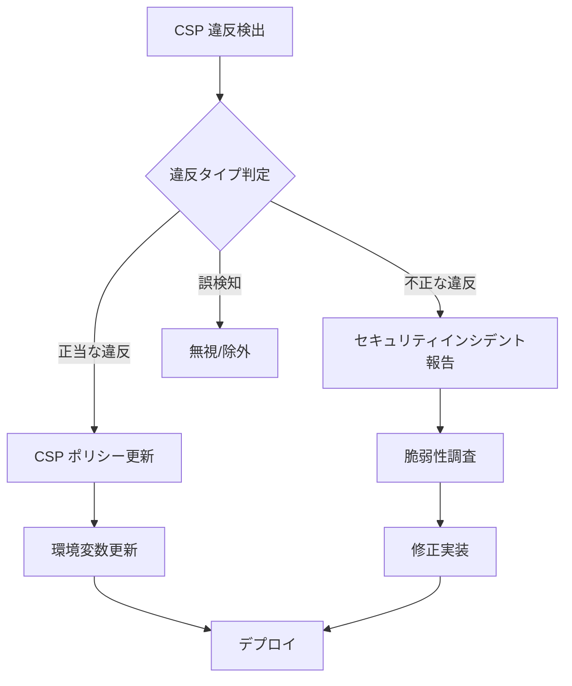

# セキュリティヘッダー運用マニュアル

## 目次
- [概要](#概要)
- [日常運用](#日常運用)
- [Report-Only モード運用](#report-only-モード運用)
- [Enforce モード切り替え手順](#enforce-モード切り替え手順)
- [CSP 違反レポート分析方法](#csp-違反レポート分析方法)
- [緊急対応手順](#緊急対応手順)
- [定期メンテナンス](#定期メンテナンス)

---

## 概要

本マニュアルは、セキュリティヘッダー機能の日常運用、CSP の段階的導入、CSP 違反レポートの分析方法を定義します。

### 運用対象
- **Laravel API** (ポート 13000): SecurityHeaders ミドルウェア
- **User App** (ポート 13001): Next.js セキュリティヘッダー設定
- **Admin App** (ポート 13002): Next.js 厳格セキュリティヘッダー設定

### 運用体制
| 役割 | 責任範囲 | 担当者 |
|------|----------|--------|
| セキュリティエンジニア | CSP ポリシー設計・違反レポート分析・Enforce モード移行判断 | - |
| DevOps エンジニア | 環境変数設定・デプロイ実施・監視設定 | - |
| QA エンジニア | E2E テスト実行・セキュリティヘッダー検証 | - |
| 運用監視チーム | CSP 違反アラート対応・ログ監視 | - |

---

## 日常運用

### セキュリティヘッダー状態確認

#### 1. Laravel API ヘッダー確認

```bash
# 開発環境
curl -I http://localhost:13000/api/health

# 本番環境
curl -I https://api.example.com/health
```

**期待されるヘッダー**:
```
HTTP/1.1 200 OK
X-Frame-Options: SAMEORIGIN
X-Content-Type-Options: nosniff
Referrer-Policy: strict-origin-when-cross-origin
Content-Security-Policy-Report-Only: default-src 'self'; ... (Report-Only モード)
# または
Content-Security-Policy: default-src 'self'; ... (Enforce モード)
```

#### 2. Next.js User App ヘッダー確認

```bash
curl -I http://localhost:13001

# 期待されるヘッダー
# X-Frame-Options: SAMEORIGIN
# Content-Security-Policy: ...
# Permissions-Policy: geolocation=(self), camera=(), ...
```

#### 3. Next.js Admin App ヘッダー確認

```bash
curl -I http://localhost:13002

# 期待されるヘッダー (User App より厳格)
# X-Frame-Options: DENY
# Referrer-Policy: no-referrer
# Cross-Origin-Embedder-Policy: require-corp
# Cross-Origin-Opener-Policy: same-origin
```

### 検証スクリプト実行

```bash
# セキュリティヘッダー検証 (Laravel API)
bash scripts/validate-security-headers.sh http://localhost:13000/api/health laravel

# セキュリティヘッダー検証 (User App)
bash scripts/validate-security-headers.sh http://localhost:13001 user-app

# セキュリティヘッダー検証 (Admin App)
bash scripts/validate-security-headers.sh http://localhost:13002 admin-app

# CORS 設定整合性確認
bash scripts/validate-cors-config.sh
```

**正常時の出力例**:
```
🔒 Security Headers Validation
================================
URL: http://localhost:13000/api/health
App Type: laravel

📋 Common Security Headers:
✅ X-Content-Type-Options: nosniff

📋 Laravel API Security Headers:
✅ X-Frame-Options: SAMEORIGIN
✅ Referrer-Policy: strict-origin-when-cross-origin
✅ Content-Security-Policy-Report-Only: default-src 'self'; ...

================================
📊 Validation Summary:
  Passed: 10
  Failed: 0

✅ All security headers validation PASSED
```

### ログ監視

#### CSP 違反ログ確認

```bash
# Laravel セキュリティログ
tail -f backend/laravel-api/storage/logs/security.log

# フィルタリング例 (CSP 違反のみ)
grep "CSP Violation" backend/laravel-api/storage/logs/security.log
```

**ログエントリー例**:
```json
[2025-10-18 10:30:15] security.WARNING: CSP Violation Detected {
  "blocked_uri": "https://malicious-site.com/script.js",
  "violated_directive": "script-src",
  "document_uri": "https://app.example.com/dashboard",
  "source_file": "https://app.example.com/dashboard",
  "line_number": 42,
  "timestamp": "2025-10-18T10:30:15+00:00"
}
```

#### アラート設定 (Slack/Email 通知)

**Laravel ログ監視設定例** (ログ管理ツール使用):
```yaml
# Datadog/New Relic/CloudWatch Logs 設定例
log_filter:
  pattern: "CSP Violation Detected"
  severity: WARNING
  alert:
    channel: "#security-alerts"
    threshold: 10 violations/hour
```

---

## Report-Only モード運用

### フェーズ1: 初期設定 (Day 0)

#### 1. 環境変数設定

**Laravel `.env`**:
```bash
SECURITY_ENABLE_CSP=true
SECURITY_CSP_MODE=report-only  # 重要: enforce ではなく report-only
SECURITY_CSP_REPORT_URI=/api/csp/report
```

**デプロイ前チェックリスト**:
- [ ] `SECURITY_CSP_MODE=report-only` 設定確認
- [ ] `SECURITY_CSP_REPORT_URI` エンドポイント動作確認
- [ ] セキュリティログチャンネル設定確認 (`config/logging.php`)
- [ ] CSP レポート API テスト実行 (`POST /api/csp/report`)

#### 2. ステージング環境デプロイ

```bash
# 1. ステージング環境に環境変数設定
# 2. アプリケーションデプロイ
# 3. セキュリティヘッダー検証

# ステージング環境ヘッダー確認
curl -I https://staging.api.example.com/health | grep "Content-Security-Policy-Report-Only"

# 期待される出力
# Content-Security-Policy-Report-Only: default-src 'self'; ...
```

#### 3. 本番環境デプロイ (段階的ロールアウト)

```bash
# ステージ 1: カナリアデプロイ (10% トラフィック)
# - 1-2時間監視
# - CSP 違反レポート確認

# ステージ 2: 50% トラフィック
# - 4-6時間監視
# - 違反レポート傾向分析

# ステージ 3: 100% トラフィック
# - 24時間監視
# - 全ユーザーへの影響確認
```

### フェーズ2: 違反レポート収集 (Day 1-7)

#### 収集期間: 最低1週間

**目標**:
- 少なくとも 10,000 ページビューでの CSP 違反データ収集
- 違反率 0.1% 以下を達成 (例: 10,000 PV あたり 10 違反以下)

#### 日次チェックリスト

**毎日実施** (運用監視チーム):
- [ ] CSP 違反ログ確認 (`storage/logs/security.log`)
- [ ] 違反件数カウント (`grep -c "CSP Violation" security.log`)
- [ ] 新規違反パターン検出
- [ ] 違反傾向ダッシュボード更新

**ログ集計コマンド**:
```bash
# 違反件数カウント (過去24時間)
grep "CSP Violation" storage/logs/security.log | \
  grep "$(date '+%Y-%m-%d')" | \
  wc -l

# 違反ディレクティブ Top 5
grep "violated_directive" storage/logs/security.log | \
  jq -r '.violated_directive' | \
  sort | uniq -c | sort -rn | head -5

# ブロックされた URI Top 10
grep "blocked_uri" storage/logs/security.log | \
  jq -r '.blocked_uri' | \
  sort | uniq -c | sort -rn | head -10
```

---

## Enforce モード切り替え手順

### 前提条件チェック

以下の条件をすべて満たす場合のみ、Enforce モードに移行可能:

- [ ] Report-Only モード運用期間: 最低1週間
- [ ] CSP 違反率: 0.1% 以下
- [ ] 正当な違反: すべて CSP ポリシーに反映済み
- [ ] セキュリティチーム承認: 取得済み
- [ ] ロールバック手順: 準備完了
- [ ] 監視体制: 24時間対応可能

### 切り替え手順

#### ステップ1: ステージング環境で Enforce モード検証

```bash
# ステージング環境 .env
SECURITY_CSP_MODE=enforce  # report-only から変更

# デプロイ後、E2E テスト実行
cd e2e
npx playwright test security-headers.spec.ts

# CSP 違反が発生しないことを確認
grep "CSP Violation" backend/laravel-api/storage/logs/security.log
# → 0 件であることを確認
```

#### ステップ2: 本番環境カナリアデプロイ

```bash
# 本番環境 .env (カナリアサーバーのみ)
SECURITY_CSP_MODE=enforce

# カナリアデプロイ (10% トラフィック)
# - 監視期間: 4-6時間
# - 確認項目:
#   - ユーザーからのエラー報告なし
#   - アプリケーションエラー発生率 < 0.01%
#   - CSP 違反検出数 = 0
```

#### ステップ3: 段階的ロールアウト

| ステージ | トラフィック割合 | 監視期間 | ロールバック判断基準 |
|----------|------------------|----------|----------------------|
| カナリア | 10% | 4-6時間 | エラー率 > 0.01% |
| Phase 1 | 25% | 6-12時間 | エラー率 > 0.01% |
| Phase 2 | 50% | 12-24時間 | エラー率 > 0.01% |
| 全体 | 100% | 継続監視 | エラー率 > 0.01% |

#### ステップ4: 全体ロールアウト後監視 (24時間体制)

**監視項目**:
- アプリケーションエラー率
- ユーザーからの問い合わせ件数
- CSP 違反検出数 (Enforce モードでは違反がログに記録される)
- パフォーマンス指標 (レスポンスタイム、スループット)

**監視ダッシュボード例**:
```
┌──────────────────────────────────────────────────────┐
│  CSP Enforce Mode Monitoring Dashboard              │
├──────────────────────────────────────────────────────┤
│  Rollout Progress:   [████████████████████] 100%     │
│  Error Rate:         0.005%  ✅ (< 0.01%)            │
│  CSP Violations:     0 (last 1h)  ✅                 │
│  Response Time P95:  95ms  ✅ (< 100ms)              │
│  User Complaints:    0  ✅                           │
└──────────────────────────────────────────────────────┘
```

### ロールバック手順 (緊急時)

**トリガー条件**:
- エラー率 > 0.01%
- CSP 違反が継続的に発生 (> 10 violations/hour)
- 重大なユーザー影響報告

**即座実行** (5分以内):
```bash
# 1. Enforce モード無効化
SECURITY_ENABLE_CSP=false  # 緊急無効化

# または Report-Only モードに戻す
SECURITY_CSP_MODE=report-only

# 2. アプリケーション再デプロイ
# 3. セキュリティヘッダー確認
curl -I https://api.example.com/health | grep "Content-Security-Policy"
# → ヘッダーなし (SECURITY_ENABLE_CSP=false)
# → Content-Security-Policy-Report-Only (report-only)

# 4. インシデントレポート作成
# 5. 根本原因分析 (RCA) 実施
```

---

## CSP 違反レポート分析方法

### 違反分類フレームワーク

#### 1. 正当な違反 (Legitimate Violations)

**定義**: アプリケーション機能に必要な外部リソースが CSP ポリシーで許可されていない

**例**:
- Google Analytics スクリプトブロック
- Stripe.js 決済ライブラリブロック
- Cloudflare CDN 画像ブロック

**対応**:
1. CSP ポリシーに該当ドメインを追加
2. 環境変数更新
3. 再デプロイ

**CSP ポリシー更新例**:
```bash
# Before
SECURITY_CSP_SCRIPT_SRC='self'

# After (Google Analytics 許可)
SECURITY_CSP_SCRIPT_SRC='self' https://www.google-analytics.com https://www.googletagmanager.com
```

#### 2. 不正な違反 (Malicious Violations)

**定義**: XSS 攻撃試行、悪意のあるスクリプト実行試み

**例**:
- `blocked_uri: https://malicious-site.com/malware.js`
- `violated_directive: script-src`
- `document_uri: https://app.example.com/xss-vulnerable-page`

**対応**:
1. **即座に**: セキュリティインシデント報告
2. 脆弱性調査 (該当ページの入力検証確認)
3. WAF ルール追加 (該当 IP アドレスブロック)
4. ペネトレーションテスト実施

#### 3. 誤検知 (False Positives)

**定義**: ブラウザ拡張機能、アドブロッカーによる違反

**例**:
- `blocked_uri: chrome-extension://...`
- `blocked_uri: moz-extension://...`

**対応**:
- 無視 (ユーザー環境依存、制御不可)
- 違反レポート集計から除外

### 違反レポート分析ワークフロー



### 分析ツール・スクリプト

#### 違反レポート集計スクリプト

```bash
#!/bin/bash
# scripts/analyze-csp-violations.sh

LOG_FILE="backend/laravel-api/storage/logs/security.log"

echo "📊 CSP Violation Analysis Report"
echo "================================="
echo ""

# 違反総数
TOTAL=$(grep -c "CSP Violation" "$LOG_FILE")
echo "Total Violations: $TOTAL"
echo ""

# 違反ディレクティブ別集計
echo "Top Violated Directives:"
grep "violated_directive" "$LOG_FILE" | \
  jq -r '.violated_directive' | \
  sort | uniq -c | sort -rn | head -5
echo ""

# ブロックされた URI Top 10
echo "Top Blocked URIs:"
grep "blocked_uri" "$LOG_FILE" | \
  jq -r '.blocked_uri' | \
  sort | uniq -c | sort -rn | head -10
echo ""

# ブラウザ拡張機能除外後の違反数
EXTENSION_VIOLATIONS=$(grep "blocked_uri" "$LOG_FILE" | grep -c "extension://")
LEGITIMATE_VIOLATIONS=$((TOTAL - EXTENSION_VIOLATIONS))
echo "Legitimate Violations (excluding extensions): $LEGITIMATE_VIOLATIONS"
```

---

## 緊急対応手順

### シナリオ1: CSP ポリシーが厳しすぎて本番アプリが動作しない

**症状**:
- ユーザーから「ページが真っ白」「ボタンが動かない」報告多数
- ブラウザコンソールに大量の CSP 違反エラー

**即座実行** (5分以内):
```bash
# 1. CSP を一時無効化
SECURITY_ENABLE_CSP=false

# 2. デプロイ
# 3. ユーザーへのアナウンス
# 4. 根本原因調査 (CSP ポリシーの問題箇所特定)
```

### シナリオ2: CORS と CSP の競合によりAPI呼び出し失敗

**症状**:
- フロントエンドから API 呼び出しが失敗
- ブラウザコンソール: `Refused to connect to '...' because it violates CSP directive "connect-src"`

**対応**:
```bash
# Laravel .env
SECURITY_CSP_CONNECT_SRC='self' http://localhost:13001 http://localhost:13002

# または Next.js security-config.ts で修正
connectSrc: ["'self'", 'http://localhost:13000']
```

---

## 定期メンテナンス

### 月次タスク

- [ ] セキュリティヘッダー検証スクリプト実行
- [ ] CSP 違反レポート月次集計
- [ ] 外部ドメイン許可リスト見直し
- [ ] セキュリティログファイルアーカイブ (`storage/logs/security.log` ローテーション)

### 四半期タスク

- [ ] CSP ポリシー厳格化レビュー
- [ ] Permissions-Policy 更新 (新規ブラウザ API 対応)
- [ ] セキュリティヘッダーベストプラクティス更新確認 (OWASP, MDN)
- [ ] ペネトレーションテスト実施

### 年次タスク

- [ ] セキュリティヘッダー戦略見直し
- [ ] HSTS Preload リスト登録検討
- [ ] セキュリティ監査実施

---

**作成日**: 2025-10-18
**最終更新日**: 2025-10-18
**バージョン**: 1.0.0
